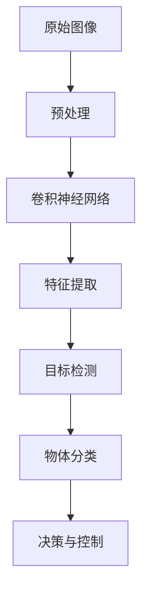
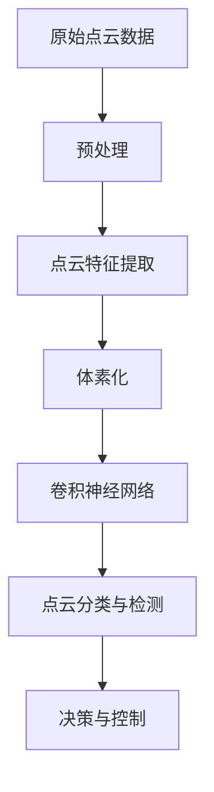
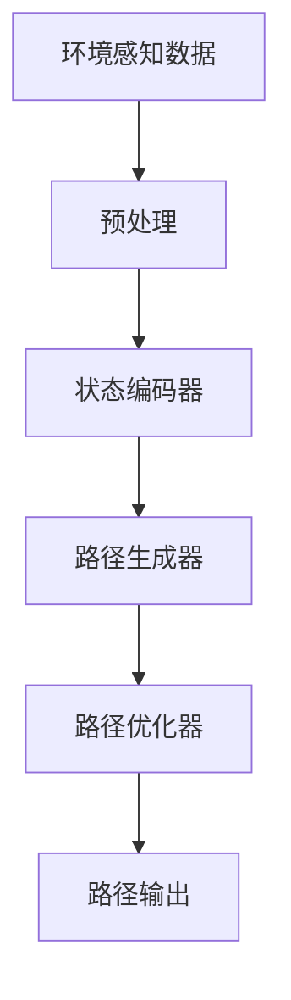
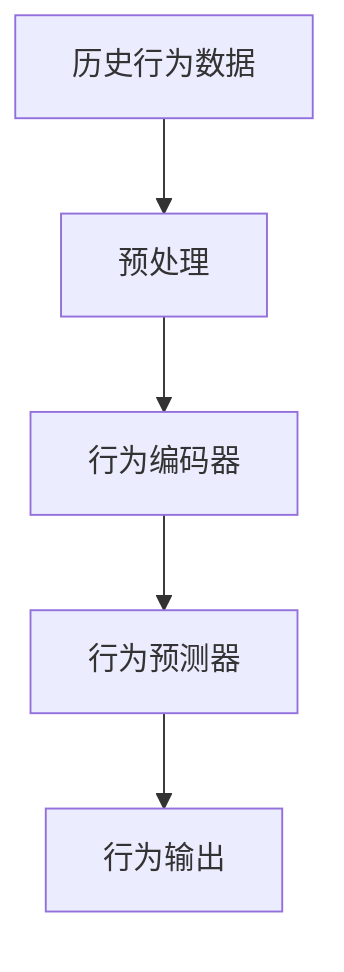
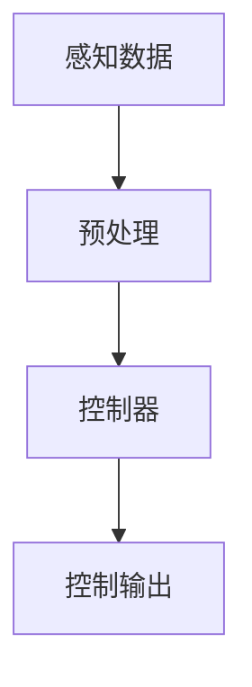
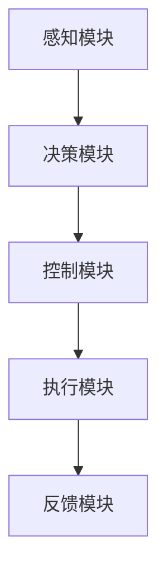

                 

### 文章标题

《端到端学习范式优化自动驾驶模型性能的案例启示》

> 关键词：端到端学习，自动驾驶，模型优化，性能提升，案例研究

> 摘要：本文将深入探讨端到端学习范式在自动驾驶领域中的具体应用，分析其在优化自动驾驶模型性能方面的优势和挑战。通过一系列案例分析，本文揭示了端到端学习在自动驾驶感知、决策与规划、控制等关键模块中的应用，并提出了有效的优化策略。本文旨在为自动驾驶技术的进一步发展和应用提供有价值的参考和启示。

---

### 第一部分：端到端学习范式基础

#### 第1章：端到端学习范式概述

##### 1.1 端到端学习范式定义

端到端学习（End-to-End Learning）是一种机器学习范式，其核心思想是直接从原始输入数据学习到最终的输出结果，而无需通过多个中间层进行逐步转换。这种范式通过将整个学习过程视为一个连续的整体，大大简化了模型开发和训练流程。

与传统机器学习方法相比，端到端学习具有以下特点：

- **数据输入与输出映射直接**：传统方法通常涉及多个数据处理和特征提取步骤，而端到端学习直接将原始数据映射到目标输出。
- **减少中间步骤**：通过直接学习，端到端学习减少了数据转换的中间环节，降低了数据丢失和错误的风险。
- **高效性与实时性**：端到端学习能够快速从数据中提取有用信息，提高了模型的实时性。

##### 1.2 端到端学习范式优势

- **简化模型开发流程**：端到端学习减少了数据预处理和特征提取的工作，使得模型开发过程更加高效。
- **提高模型性能**：端到端学习使得模型能够直接从原始数据中学习到所需的特征，从而提高了模型的准确性和鲁棒性。
- **实时性增强**：端到端学习能够快速处理大量数据，提高了系统的实时响应能力。

##### 1.3 端到端学习范式挑战

- **数据依赖性问题**：端到端学习高度依赖于训练数据的质量和数量，数据缺陷可能严重影响模型性能。
- **计算效率问题**：端到端学习往往涉及复杂的模型结构和大量的训练数据，可能导致计算效率低下。
- **模型可解释性问题**：端到端学习模型通常难以解释，增加了模型透明度和可理解性的挑战。

#### 第2章：自动驾驶系统架构

##### 2.1 自动驾驶系统概述

自动驾驶系统是指能够实现车辆自主驾驶的技术系统。根据国际自动机工程师学会（SAE）的定义，自动驾驶分为五个等级，从0级（完全人工驾驶）到5级（完全自动化驾驶）。

- **0级**：车辆完全由人类驾驶员控制。
- **1级**：车辆具备一定程度的自动化功能，如自适应巡航控制。
- **2级**：车辆具备多模态自动化功能，如自适应巡航控制和车道保持。
- **3级**：车辆在特定环境下能够实现完全自动驾驶，但需要人类驾驶员在必要时接管控制。
- **4级**：车辆在大多数环境下能够实现完全自动驾驶，但需要人类驾驶员在特定情况下接管控制。
- **5级**：车辆在任何环境下都能实现完全自动驾驶，无需人类驾驶员的干预。

##### 2.2 自动驾驶系统组成

自动驾驶系统通常由多个模块组成，包括感知模块、决策模块和控制模块。

- **感知模块**：负责采集车辆周围的环境信息，包括视觉、激光雷达、雷达等传感器数据，并对其进行处理和分析。
- **决策模块**：根据感知模块提供的信息，结合车辆和环境的动态信息，进行路径规划和行为决策。
- **控制模块**：根据决策模块的决策结果，控制车辆的运动，包括加速、减速、转向等动作。

##### 2.3 自动驾驶系统关键技术

- **感知技术**：包括计算机视觉、激光雷达、毫米波雷达等多种传感器技术和数据融合方法。
- **决策与规划技术**：涉及路径规划、行为预测、冲突检测和解决等算法。
- **控制技术**：包括车辆控制、轨迹跟踪、稳定性控制等算法。

### 第二部分：端到端学习优化策略

#### 第3章：数据预处理与增强

##### 3.1 数据预处理方法

数据预处理是端到端学习中的一个重要步骤，其目的是提高数据质量和减少噪声。常见的数据预处理方法包括：

- **数据清洗**：删除或修复数据中的错误和异常值。
- **数据标准化**：将数据缩放到一个统一的尺度，以便模型能够更好地处理。

##### 3.2 数据增强技术

数据增强是通过增加数据的多样性来提高模型鲁棒性和性能。常见的数据增强方法包括：

- **转换增强**：如旋转、翻转、缩放等，通过改变数据的空间特征来增强模型。
- **增广增强**：通过添加噪声、遮挡等操作来增加数据的复杂度。
- **生成增强**：使用生成对抗网络（GAN）等技术生成新的数据样本。

##### 3.3 数据预处理与增强在自动驾驶中的应用案例

在自动驾驶系统中，数据预处理和增强对于提高模型性能至关重要。例如，在视觉感知模块中，图像数据的预处理包括灰度转换、直方图均衡化、去噪等，以提高图像质量。同时，通过图像翻转、旋转等增强技术，可以增加数据的多样性，从而提高模型的泛化能力。

#### 第4章：模型选择与优化

##### 4.1 端到端学习模型选择

在端到端学习中，选择合适的模型至关重要。常见的端到端学习模型包括：

- **深度神经网络模型**：如卷积神经网络（CNN）和循环神经网络（RNN）。
- **递归神经网络模型**：如长短期记忆网络（LSTM）和门控循环单元（GRU）。
- **其他端到端学习模型**：如生成对抗网络（GAN）和变分自编码器（VAE）。

##### 4.2 模型优化方法

模型优化是提高模型性能的关键步骤。常见的模型优化方法包括：

- **优化算法**：如梯度下降（GD）、随机梯度下降（SGD）和Adam优化器。
- **损失函数**：如均方误差（MSE）、交叉熵损失等。
- **正则化技术**：如L1正则化、L2正则化、Dropout等。

##### 4.3 模型优化策略案例

以自动驾驶中的路径规划模块为例，可以通过以下策略进行模型优化：

- **使用LSTM模型**：由于路径规划涉及时间序列数据，LSTM模型能够更好地捕捉时间依赖性。
- **采用Adam优化器**：Adam优化器在处理大规模数据集时具有较好的收敛速度和稳定性。
- **引入Dropout正则化**：通过引入Dropout，可以减少模型过拟合的风险。

#### 第5章：模型训练与验证

##### 5.1 训练过程监控

在模型训练过程中，需要监控多个指标，以确保训练过程的有效性和稳定性。常见的监控指标包括：

- **过拟合检测**：通过验证集的性能来检测模型是否过拟合。
- **训练效率监控**：监控训练过程的收敛速度和资源消耗，以优化训练策略。

##### 5.2 验证策略

验证策略是评估模型性能的关键步骤。常见的验证策略包括：

- **数据集划分**：将数据集划分为训练集、验证集和测试集，以评估模型的泛化能力。
- **验证指标**：如准确率、召回率、F1分数等。
- **验证方法**：如交叉验证、留一法等。

##### 5.3 训练与验证案例分析

以自动驾驶中的感知模块为例，可以通过以下步骤进行模型训练与验证：

- **数据集划分**：将传感器数据进行预处理，划分为训练集、验证集和测试集。
- **训练过程**：使用训练集对模型进行训练，同时监控验证集的性能。
- **验证过程**：使用验证集评估模型的性能，调整模型参数以优化性能。

#### 第6章：模型部署与优化

##### 6.1 模型部署流程

模型部署是将训练好的模型应用到实际场景的过程。常见的模型部署流程包括：

- **部署环境准备**：准备适合模型运行的硬件和软件环境。
- **部署策略**：如在线部署、离线部署等，根据应用场景选择合适的部署策略。

##### 6.2 部署后优化方法

模型部署后，仍需进行优化以提升性能和稳定性。常见的优化方法包括：

- **实时性能优化**：通过调整模型结构和参数，提高模型在实时环境中的运行效率。
- **能耗优化**：通过优化算法和数据结构，减少模型运行的能耗。
- **安全性优化**：通过加密和认证等技术，确保模型运行的安全性。

##### 6.3 模型部署与优化案例分析

以自动驾驶系统中的决策模块为例，可以通过以下步骤进行模型部署与优化：

- **部署环境准备**：在车辆中部署嵌入式硬件和软件环境，确保模型能够在实时环境中运行。
- **部署策略**：采用在线部署策略，实现模型与传感器数据的实时交互。
- **优化过程**：通过实时监控和调整模型参数，优化模型在实时环境中的性能和稳定性。

### 第三部分：端到端学习在自动驾驶领域的应用案例

#### 第7章：端到端学习在自动驾驶感知中的应用

##### 7.1 视觉感知端到端学习

视觉感知是自动驾驶系统的核心模块之一，端到端学习在视觉感知中的应用取得了显著成果。以下是一个典型的视觉感知端到端学习模型架构：

在该架构中，原始图像经过预处理后输入卷积神经网络，通过多层卷积和池化操作提取特征，然后进行目标检测和物体分类。最终，分类结果用于决策和控制模块。

##### 7.2 激光雷达感知端到端学习

激光雷达是自动驾驶系统中重要的感知设备，端到端学习在激光雷达感知中的应用也取得了显著进展。以下是一个典型的激光雷达感知端到端学习模型架构：

在该架构中，原始点云数据经过预处理和特征提取后输入卷积神经网络，通过体素化操作将三维数据转换为二维数据，然后进行点云分类与检测。最终，分类和检测结果用于决策和控制模块。

#### 第8章：端到端学习在自动驾驶决策与规划中的应用

##### 8.1 端到端学习在路径规划中的应用

路径规划是自动驾驶系统中的关键模块之一，端到端学习在路径规划中的应用可以有效提高规划效率和准确性。以下是一个典型的端到端路径规划模型架构：

在该架构中，环境感知数据经过预处理后输入状态编码器，编码后的状态数据用于路径生成器和路径优化器。路径生成器生成初始路径，路径优化器对初始路径进行优化，最终输出最优路径。

##### 8.2 端到端学习在行为预测中的应用

行为预测是自动驾驶系统中另一个关键模块，端到端学习在行为预测中的应用可以有效提高预测准确性和实时性。以下是一个典型的端到端行为预测模型架构：

在该架构中，历史行为数据经过预处理后输入行为编码器，编码后的行为数据用于行为预测器。行为预测器输出未来一段时间内其他车辆的行为预测结果。

#### 第9章：端到端学习在自动驾驶控制中的应用

##### 9.1 端到端学习在车辆控制中的应用

车辆控制是自动驾驶系统的核心模块之一，端到端学习在车辆控制中的应用可以有效提高控制精度和稳定性。以下是一个典型的端到端车辆控制模型架构：

在该架构中，感知数据经过预处理后输入控制器，控制器根据感知数据生成控制输出，控制输出用于驱动车辆的运动。

##### 9.2 端到端学习在自动驾驶中的综合应用

端到端学习在自动驾驶系统中的综合应用可以实现自动驾驶系统的整体优化，提高系统的性能和安全性。以下是一个典型的端到端自动驾驶系统综合应用模型架构：

在该架构中，感知模块收集环境信息，决策模块根据感知信息生成决策，控制模块根据决策生成控制输出，执行模块执行控制输出，反馈模块收集执行结果，用于闭环控制和系统优化。

### 附录

#### 附录A：端到端学习工具与资源

- **A.1 主流端到端学习框架对比**

  - TensorFlow：由Google开发，广泛应用于深度学习领域。
  - PyTorch：由Facebook开发，具有灵活的动态计算图和易用性。
  - Keras：基于Theano和TensorFlow的深度学习高级框架。

- **A.2 端到端学习研究资源**

  - 论文资料：通过学术期刊和会议获取最新的端到端学习研究论文。
  - 开源代码：通过GitHub等平台获取开源的端到端学习项目和代码。
  - 研究机构与社群：参与相关研究机构和社群，获取最新的研究成果和交流机会。

#### 附录B：端到端学习应用实践指南

- **B.1 自动驾驶项目实践流程**

  - 项目规划：明确项目目标和需求，制定项目计划。
  - 数据收集与处理：收集和整理自动驾驶所需的数据，进行预处理和增强。
  - 模型设计：选择合适的端到端学习模型，设计模型架构。
  - 模型训练与验证：使用训练集对模型进行训练，使用验证集评估模型性能。
  - 模型部署与优化：将训练好的模型部署到实际场景，进行优化和调整。
  - 系统测试与验收：进行系统测试，确保系统满足设计要求。

- **B.2 自动驾驶模型训练与验证技巧**

  - 数据质量监控：确保数据质量，避免数据噪声和错误。
  - 模型调优策略：根据验证集的性能调整模型参数，优化模型性能。
  - 验证集划分：合理划分验证集，确保模型泛化能力。

- **B.3 自动驾驶模型部署与优化建议**

  - 部署环境准备：确保部署环境满足模型运行要求，优化部署效率。
  - 实时性能优化：调整模型结构和参数，提高模型实时性能。
  - 能耗优化：通过算法优化和硬件选择，降低模型运行能耗。
  - 安全性优化：通过加密和认证等技术，确保模型运行安全性。

### 作者信息

作者：AI天才研究院/AI Genius Institute & 禅与计算机程序设计艺术 /Zen And The Art of Computer Programming

---

本文通过逐步分析端到端学习范式在自动驾驶领域的应用，揭示了其在优化模型性能方面的优势和挑战。通过实际案例分析和优化策略的提出，为自动驾驶技术的发展提供了有价值的参考和启示。在未来的研究和应用中，我们期待端到端学习能够进一步推动自动驾驶技术的进步，实现更安全、更高效的自动驾驶系统。

