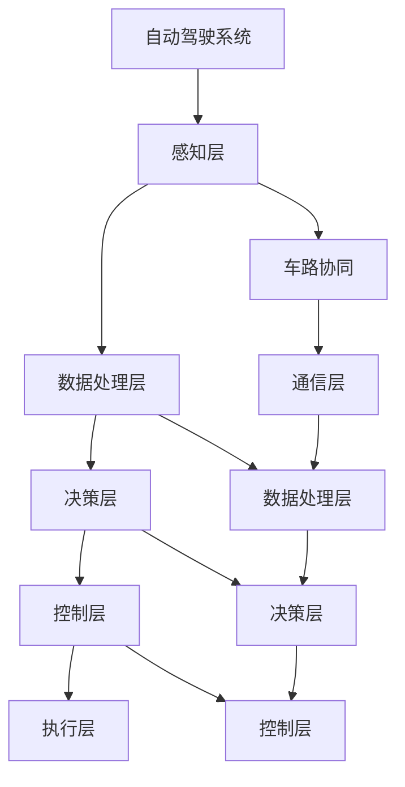

                 

### 文章标题

《端到端自动驾驶的车路协同智能调度》

> 关键词：端到端自动驾驶、车路协同、智能调度、动态路径规划、数学模型、项目实战

> 摘要：本文深入探讨了端到端自动驾驶系统中的车路协同智能调度技术。从自动驾驶技术背景、车路协同原理、端到端自动驾驶系统设计，到车路协同智能调度算法、动态路径规划与优化、智能调度系统设计与实现，以及车路协同智能调度在自动驾驶中的应用，本文系统性地介绍了车路协同智能调度的核心概念、原理、方法与应用。通过数学模型、伪代码、项目实战等多角度的分析，本文为读者提供了全面的技术解析和实战指导。

---

### 第一部分：端到端自动驾驶概述

#### 第1章：自动驾驶技术背景与展望

自动驾驶技术作为智能交通系统的重要组成部分，正逐渐改变着人类的生活方式。本章节将从自动驾驶技术的发展历程、分类、重要性及未来发展趋势四个方面进行介绍。

#### 1.1 自动驾驶技术的发展历程

自动驾驶技术的发展可以追溯到20世纪50年代，当时的研发主要集中在军事领域。随着时间的推移，自动驾驶技术逐渐向民用领域扩展，并在21世纪初取得了显著进展。如今，自动驾驶技术已经进入到了商业化阶段，各大科技公司和研究机构都在积极推进相关研究。

#### 1.2 自动驾驶技术的分类

自动驾驶技术根据功能可以分为以下几类：

1. **激光雷达导航**：使用激光雷达（LiDAR）来扫描环境，获取高精度的三维数据。
2. **视觉导航**：利用摄像头和计算机视觉技术进行环境感知。
3. **雷达导航**：通过雷达波探测周围环境，适用于恶劣天气条件。
4. **GPS导航**：利用全球定位系统（GPS）进行定位和导航。
5. **V2X通信**：通过车与车（V2V）、车与基础设施（V2I）以及车与行人（V2P）的通信实现协同驾驶。

#### 1.3 自动驾驶技术的重要性

自动驾驶技术的重要性主要体现在以下几个方面：

1. **提高交通安全**：通过减少人为错误，降低交通事故发生率。
2. **提升交通效率**：优化车辆行驶路线，减少拥堵，提高道路通行能力。
3. **节约能源消耗**：通过智能调度和优化驾驶策略，降低车辆油耗。
4. **改善生活质量**：提供更加便捷、舒适的出行体验。

#### 1.4 自动驾驶技术的未来发展趋势

未来，自动驾驶技术将朝着更高等级、更智能、更安全的方向发展。以下是几个关键趋势：

1. **融合多种感知技术**：结合激光雷达、摄像头、雷达等多种感知设备，提高环境感知能力。
2. **强化学习与深度学习的应用**：利用机器学习算法，特别是强化学习和深度学习，提高自动驾驶系统的决策能力和适应能力。
3. **车路协同（V2X）**：通过车与车、车与基础设施的通信，实现智能调度和协同驾驶。
4. **高精度地图与实时数据处理**：利用高精度地图和实时数据处理，提高自动驾驶系统的精度和稳定性。
5. **标准化的测试与认证**：制定统一的测试标准和认证体系，确保自动驾驶系统的安全性和可靠性。

---

#### 第2章：车路协同原理与架构

车路协同（Vehicle-Infrastructure Cooperative Systems，简称VICS）是自动驾驶技术的重要组成部分，通过车与车、车与基础设施之间的信息交换，实现交通系统的优化和智能化。本章节将详细介绍车路协同的概念、技术架构、关键技术和优势与挑战。

#### 2.1 车路协同的概念

车路协同是指通过车辆与道路基础设施之间实时、可靠的信息交换，协同完成车辆控制、交通管理以及驾驶辅助等功能，从而提高交通系统的安全性、效率和可持续性。

#### 2.2 车路协同的技术架构

车路协同的技术架构主要包括以下几个方面：

1. **感知层**：包括车辆感知设备和基础设施感知设备，如激光雷达、摄像头、雷达、GPS等，用于收集道路环境信息。
2. **通信层**：实现车辆与车辆、车辆与基础设施之间的通信，主要包括V2V（Vehicle-to-Vehicle）通信、V2I（Vehicle-to-Infrastructure）通信和V2P（Vehicle-to-Pedestrian）通信。
3. **处理层**：对收集到的数据进行处理、融合和分析，为车辆控制和交通管理提供支持。
4. **控制层**：根据处理层的结果，对车辆进行控制，包括速度调整、车道选择、制动等。
5. **应用层**：提供交通管理、驾驶辅助、智能导航等具体应用功能。

#### 2.3 车路协同的关键技术

车路协同的关键技术包括：

1. **感知技术**：高精度地图、环境感知、实时数据处理等。
2. **通信技术**：车联网（V2X）通信协议、低延迟通信、安全通信等。
3. **数据处理与决策**：数据融合、实时路径规划、智能调度等。
4. **控制技术**：自动驾驶控制算法、车辆协同控制等。

#### 2.4 车路协同的优势与挑战

车路协同的优势包括：

1. **提高交通安全**：通过车辆间的信息交换，提前预警潜在危险，减少事故发生。
2. **提高交通效率**：优化车辆行驶路线，减少拥堵，提高道路通行能力。
3. **改善驾驶体验**：提供智能导航、自动驾驶等功能，提高驾驶舒适度和便利性。
4. **降低运营成本**：通过智能调度和优化驾驶策略，降低油耗和维修费用。

车路协同面临的挑战包括：

1. **通信可靠性**：在高速移动的车载环境下，如何保证通信的稳定性和低延迟。
2. **数据隐私与安全**：如何保护车辆和用户的数据隐私，防止信息泄露和恶意攻击。
3. **系统集成**：如何将多种感知技术、通信技术和控制技术有效集成，实现协同工作。
4. **法律法规**：如何制定和完善相关法律法规，确保车路协同技术的合法应用。

---

#### 第3章：端到端自动驾驶系统设计

端到端自动驾驶系统设计是自动驾驶技术的核心，其总体架构、感知模块设计、决策模块设计以及控制模块设计都需要精细考虑。本章节将详细介绍端到端自动驾驶系统的设计要点。

#### 3.1 端到端自动驾驶系统的总体架构

端到端自动驾驶系统的总体架构可以分为以下几个部分：

1. **感知模块**：用于收集道路环境信息，包括车辆位置、速度、道路状况、障碍物等。
2. **数据处理模块**：对感知模块收集到的数据进行处理、融合和分析，为后续决策提供支持。
3. **决策模块**：根据处理模块提供的信息，进行路径规划、速度控制、车道选择等决策。
4. **控制模块**：根据决策模块的决策结果，对车辆进行具体的控制，包括制动、加速、转向等。
5. **执行模块**：执行控制模块的指令，实现车辆的驾驶操作。

#### 3.2 感知模块设计

感知模块是端到端自动驾驶系统的基础，其设计要点包括：

1. **传感器选择**：根据具体应用场景，选择合适的传感器，如激光雷达、摄像头、雷达、GPS等。
2. **数据采集与预处理**：确保传感器数据的实时性和准确性，对采集到的数据进行滤波、去噪、去畸变等预处理。
3. **多源数据融合**：将不同传感器获取的数据进行融合，提高环境感知的精度和可靠性。

#### 3.3 决策模块设计

决策模块是端到端自动驾驶系统的核心，其设计要点包括：

1. **路径规划**：根据感知模块提供的信息，规划车辆的行驶路径，确保行驶安全性和效率。
2. **速度控制**：根据当前道路状况和目标路径，调整车辆的速度，确保平稳驾驶。
3. **车道选择**：根据当前车道和目标路径，选择合适的车道进行行驶，确保行驶方向正确。
4. **紧急情况处理**：在遇到紧急情况时，迅速做出反应，确保车辆和行人的安全。

#### 3.4 控制模块设计

控制模块是实现决策模块决策结果的关键，其设计要点包括：

1. **控制策略**：根据决策模块的决策结果，制定具体的控制策略，包括制动、加速、转向等。
2. **控制算法**：设计高效的控制算法，确保车辆在复杂道路环境中能够平稳、安全地行驶。
3. **实时性**：确保控制指令的实时性，避免因延迟导致的安全问题。

通过以上设计要点，可以构建一个高效、可靠的端到端自动驾驶系统，实现自动驾驶技术的广泛应用。

---

### 第二部分：车路协同智能调度算法

车路协同智能调度是端到端自动驾驶系统中至关重要的一环，它通过优化车辆行驶路径和速度，提高交通系统的效率和安全性。本章节将介绍智能调度的原理与模型、动态路径规划与优化、智能调度系统的设计与实现。

#### 第4章：智能调度原理与模型

智能调度（Intelligent Scheduling）是指利用人工智能和优化算法，对车辆行驶路径和速度进行动态调整，以实现交通流量最优化的过程。智能调度的目标是在保证行驶安全的前提下，提高交通效率、减少拥堵、降低能源消耗。

#### 4.1 智能调度的概念与意义

智能调度的概念是指通过收集和分析交通数据，利用算法对车辆行驶路径和速度进行优化，从而实现交通流量的平衡和优化。智能调度的意义主要体现在以下几个方面：

1. **提高交通效率**：通过优化车辆行驶路径和速度，减少交通拥堵，提高道路通行能力。
2. **降低能源消耗**：通过智能调度，合理规划车辆行驶路线和速度，减少油耗和碳排放。
3. **提升行驶安全性**：通过提前预警潜在危险，减少交通事故的发生。
4. **改善驾驶体验**：提供智能导航、自动驾驶等功能，提高驾驶舒适度和便利性。

#### 4.2 智能调度的目标与挑战

智能调度的目标主要包括：

1. **路径优化**：在保证行驶安全的前提下，选择最优路径，减少行驶距离和时间。
2. **速度控制**：根据道路状况和交通流量，合理调整车辆速度，确保平稳驾驶。
3. **拥堵缓解**：通过智能调度，提前预测和避免拥堵，提高道路通行效率。
4. **能源优化**：通过优化行驶路线和速度，减少油耗和碳排放，实现绿色出行。

智能调度面临的挑战主要包括：

1. **数据准确性**：交通数据的准确性直接影响智能调度的效果，如何获取实时、准确的数据是一个重要挑战。
2. **计算效率**：智能调度算法需要处理大量的数据，如何在保证计算准确性的同时提高计算效率是一个关键问题。
3. **适应性**：智能调度算法需要能够适应不同的交通状况和车辆类型，提高系统的通用性和灵活性。
4. **安全性与可靠性**：在实现智能调度的过程中，如何确保系统的安全性和可靠性，防止因算法错误导致的交通事故。

#### 4.3 智能调度的基本模型

智能调度的基本模型主要包括以下几个部分：

1. **交通网络模型**：描述道路网络的结构和属性，包括道路长度、宽度、道路类型等。
2. **车辆模型**：描述车辆的行驶特性，包括车辆大小、速度、加速度等。
3. **交通需求模型**：描述交通流量和分布情况，包括车辆数量、行驶方向等。
4. **调度模型**：根据交通网络模型、车辆模型和交通需求模型，制定车辆行驶路径和速度的调度策略。

#### 4.4 智能调度的算法设计

智能调度的算法设计主要包括以下几个步骤：

1. **路径规划**：根据交通网络模型和交通需求模型，为每辆车规划最优行驶路径。
2. **速度控制**：根据车辆模型和交通状况，实时调整车辆速度，确保平稳驾驶。
3. **拥堵预测**：利用历史数据和实时数据，预测交通拥堵情况，提前采取措施缓解拥堵。
4. **路径优化**：根据交通流量变化，动态调整车辆行驶路径，优化交通流量。

智能调度算法的设计需要综合考虑多种因素，如交通流量、道路状况、车辆特性等，采用合适的优化算法和调度策略，实现交通流量的最优控制。

---

#### 第5章：动态路径规划与优化

动态路径规划是智能调度的重要组成部分，它通过实时调整车辆行驶路径，优化交通流量，提高交通系统的效率和安全性。本章节将介绍动态路径规划的概念、算法和优化策略。

#### 5.1 动态路径规划的概念

动态路径规划（Dynamic Path Planning）是指在车辆行驶过程中，根据实时交通信息和环境变化，动态调整车辆行驶路径，以实现最优行驶目标。动态路径规划与传统路径规划不同，它具有实时性、适应性和灵活性。

#### 5.2 动态路径规划算法

动态路径规划算法主要包括以下几种：

1. **A*算法**：A*算法是一种启发式搜索算法，通过评估函数（通常为距离和代价函数）来选择最佳路径。A*算法的实时性较高，但在道路复杂和交通流量大时，可能会出现性能下降。
2. **Dijkstra算法**：Dijkstra算法是一种非启发式搜索算法，通过逐步扩展节点，找到从起点到终点的最短路径。Dijkstra算法的实时性较低，但在道路简单时，性能较好。
3. **遗传算法**：遗传算法是一种基于自然进化的优化算法，通过交叉、变异等操作，寻找最优路径。遗传算法具有较好的全局搜索能力，但在大规模交通网络中，计算复杂度较高。
4. **粒子群优化算法**：粒子群优化算法是一种基于群体智能的优化算法，通过模拟鸟群觅食过程，寻找最优路径。粒子群优化算法具有较好的实时性和收敛性。

#### 5.3 路径规划的优化策略

为了提高动态路径规划的效率和效果，可以采用以下优化策略：

1. **多目标优化**：考虑多个目标，如路径长度、行驶时间、油耗等，进行多目标优化，找到最优路径。
2. **自适应调整**：根据交通流量和道路状况，动态调整路径规划的参数，如搜索范围、评估函数等，提高路径规划的适应性。
3. **实时数据更新**：利用实时交通数据，动态更新道路状况和车辆位置，确保路径规划的真实性和准确性。
4. **协同规划**：在车路协同环境下，通过车与车、车与基础设施之间的信息共享，协同规划车辆行驶路径，提高路径规划的协同性和效率。

#### 5.4 动态路径规划的案例分析

以城市道路为例，动态路径规划的案例分析如下：

1. **问题定义**：给定起点和终点，以及实时交通数据，规划从起点到终点的最优行驶路径。
2. **数据收集**：收集实时交通数据，包括车辆速度、道路状况、交通流量等。
3. **路径规划**：利用动态路径规划算法，规划从起点到终点的行驶路径。
4. **路径优化**：根据实时交通数据，动态调整行驶路径，优化行驶时间和油耗。
5. **结果评估**：评估行驶路径的效率和安全性，根据评估结果调整路径规划算法。

通过以上案例分析，可以看出动态路径规划在实际应用中具有重要的意义和价值，可以有效提高交通系统的效率和安全性。

---

#### 第6章：智能调度系统设计与实现

智能调度系统是端到端自动驾驶系统的核心组成部分，其设计与实现直接关系到交通系统的效率和安全性。本章节将介绍智能调度系统的总体设计、调度算法的实现细节、性能评估以及案例分析。

#### 6.1 智能调度系统的总体设计

智能调度系统的总体设计主要包括以下几个部分：

1. **感知模块**：用于收集道路环境信息，包括车辆位置、速度、道路状况、障碍物等。
2. **数据处理模块**：对感知模块收集到的数据进行处理、融合和分析，为后续调度提供支持。
3. **调度算法模块**：根据数据处理模块提供的信息，制定车辆行驶路径和速度的调度策略。
4. **执行模块**：根据调度算法模块的决策结果，对车辆进行具体的控制，包括制动、加速、转向等。
5. **通信模块**：实现车辆与车辆、车辆与基础设施之间的信息交换，确保调度系统的实时性和协同性。
6. **用户界面模块**：提供用户交互界面，包括实时交通信息展示、路径规划结果展示等。

#### 6.2 调度算法的实现细节

智能调度算法的实现细节主要包括以下几个方面：

1. **路径规划算法**：根据感知模块提供的信息，利用动态路径规划算法，为车辆规划最优行驶路径。常用的路径规划算法包括A*算法、Dijkstra算法、遗传算法等。
2. **速度控制算法**：根据车辆模型和实时交通数据，实时调整车辆速度，确保平稳驾驶。常用的速度控制算法包括PID控制、模糊控制等。
3. **拥堵预测算法**：利用历史数据和实时数据，预测交通拥堵情况，提前采取措施缓解拥堵。常用的拥堵预测算法包括时间序列分析、神经网络等。
4. **路径优化算法**：根据交通流量变化，动态调整车辆行驶路径，优化交通流量。常用的路径优化算法包括多目标优化、协同规划等。

#### 6.3 智能调度系统的性能评估

智能调度系统的性能评估主要包括以下几个方面：

1. **路径规划效果**：评估调度系统规划的路径长度、行驶时间、油耗等指标，与原始路径进行对比，评估路径规划的优化效果。
2. **速度控制效果**：评估调度系统调整车辆速度的平稳性、及时性等指标，与原始速度控制进行对比，评估速度控制的效果。
3. **拥堵缓解效果**：评估调度系统在交通拥堵情况下的缓解能力，包括拥堵时间、拥堵长度等指标，评估拥堵缓解的效果。
4. **系统可靠性**：评估调度系统的可靠性，包括系统崩溃率、响应时间等指标，确保系统的稳定运行。

#### 6.4 智能调度系统的案例分析

以某城市道路为例，智能调度系统的案例分析如下：

1. **问题定义**：在给定交通流量和道路状况下，优化车辆行驶路径和速度，提高交通系统的效率和安全性。
2. **数据收集**：收集实时交通数据，包括车辆速度、道路状况、交通流量等。
3. **调度算法设计**：设计智能调度算法，包括路径规划、速度控制、拥堵预测等。
4. **系统实现**：实现智能调度系统，包括感知模块、数据处理模块、调度算法模块等。
5. **性能评估**：对智能调度系统的性能进行评估，包括路径规划效果、速度控制效果、拥堵缓解效果等。
6. **结果分析**：分析智能调度系统的优化效果，包括路径长度、行驶时间、油耗等指标，评估系统的效果和改进方向。

通过以上案例分析，可以看出智能调度系统在交通优化方面具有显著的效果，可以有效提高交通系统的效率和安全性。

---

### 第三部分：车路协同智能调度的应用实践

车路协同智能调度在自动驾驶技术中具有广泛的应用前景，其实际应用场景包括但不限于城市交通管理、智能物流、高速公路自动驾驶等。本章节将介绍车路协同智能调度在自动驾驶中的应用场景、应用案例、面临的挑战以及相应的解决方案。

#### 第7章：车路协同智能调度在自动驾驶中的应用

车路协同智能调度在自动驾驶中的应用主要体现在以下几个方面：

1. **城市交通管理**：通过车路协同智能调度，优化城市道路的交通流量，减少拥堵，提高道路通行能力。智能调度系统能够根据实时交通数据和道路状况，动态调整车辆行驶路径和速度，实现交通流量的最优控制。
2. **智能物流**：在物流运输过程中，车路协同智能调度能够优化运输路线和速度，提高运输效率。智能调度系统可以根据物流订单的紧急程度、交通状况等因素，实时调整运输路线，确保货物及时送达。
3. **高速公路自动驾驶**：在高速公路上，车路协同智能调度可以实现车辆之间的协同驾驶，提高行驶安全性和效率。智能调度系统能够根据车辆之间的距离、速度等信息，调整车辆的行驶速度和行驶路径，确保车辆在安全距离内行驶，避免碰撞事故。

#### 7.1 智能调度在自动驾驶中的应用场景

智能调度在自动驾驶中的应用场景主要包括以下几种：

1. **实时路径规划**：在车辆行驶过程中，智能调度系统能够实时收集道路环境信息，根据实时交通数据和车辆状态，动态调整车辆行驶路径，避免拥堵和事故风险。
2. **速度控制**：智能调度系统能够根据道路状况和车辆特性，实时调整车辆速度，确保平稳驾驶。例如，在高速公路上，智能调度系统可以根据车辆之间的距离，调整车辆的行驶速度，保持安全距离。
3. **拥堵预测与缓解**：智能调度系统可以利用历史数据和实时数据，预测交通拥堵情况，提前采取措施缓解拥堵。例如，在高峰期，智能调度系统可以提前调整车辆的行驶路径，避免拥堵区域。
4. **协同驾驶**：在车路协同环境下，智能调度系统可以实现车辆之间的协同驾驶，提高行驶安全性和效率。例如，在高速公路上，智能调度系统可以协调多辆车辆的行驶速度和路径，保持车队安全、高效地行驶。

#### 7.2 智能调度在自动驾驶中的应用案例

智能调度在自动驾驶中的应用案例如下：

1. **特斯拉自动驾驶**：特斯拉的自动驾驶系统采用了车路协同智能调度技术，通过实时路径规划和速度控制，提高了行驶安全性和效率。特斯拉的自动驾驶系统能够根据实时交通数据，动态调整车辆的行驶路径和速度，避免拥堵和事故风险。
2. **百度Apollo**：百度的Apollo自动驾驶平台利用车路协同智能调度技术，实现了自动驾驶车辆在城市道路上的安全、高效行驶。Apollo平台通过车路协同技术，实现了车辆之间的实时信息交换，提高了协同驾驶能力。
3. **Uber自动驾驶**：Uber的自动驾驶项目采用了车路协同智能调度技术，通过优化车辆行驶路径和速度，提高了运输效率。Uber的自动驾驶系统能够根据实时交通数据和乘客需求，动态调整车辆行驶路径，确保乘客及时送达。

#### 7.3 智能调度在自动驾驶中的挑战与解决方案

智能调度在自动驾驶中面临的挑战主要包括以下几个方面：

1. **通信可靠性**：在高速移动的车载环境下，如何保证通信的稳定性和低延迟是一个重要挑战。解决方案包括采用多通道通信、提高通信协议的可靠性、利用缓存技术等。
2. **数据隐私与安全**：车路协同智能调度需要收集和处理大量的交通数据，如何保护数据隐私和安全是一个关键问题。解决方案包括数据加密、权限控制、安全审计等。
3. **系统集成**：如何将多种感知技术、通信技术和控制技术有效集成，实现协同工作是一个重要挑战。解决方案包括模块化设计、标准化接口、系统仿真与测试等。
4. **适应性**：智能调度算法需要能够适应不同的交通状况和车辆类型，提高系统的通用性和灵活性。解决方案包括自适应算法、多目标优化、机器学习等。

通过以上挑战与解决方案的分析，可以看出车路协同智能调度在自动驾驶中具有重要的应用价值，但同时也面临着一系列技术挑战。通过不断的研究和优化，有望实现智能调度技术在自动驾驶中的广泛应用。

---

### 第8章：车路协同智能调度的发展趋势与展望

随着自动驾驶技术的快速发展，车路协同智能调度作为其核心组成部分，也呈现出蓬勃发展的态势。本章节将探讨车路协同智能调度的发展趋势、面临的挑战以及未来的发展方向。

#### 8.1 车路协同智能调度的发展趋势

车路协同智能调度的发展趋势主要体现在以下几个方面：

1. **技术的融合与发展**：车路协同智能调度技术将融合多种先进技术，如5G通信、边缘计算、人工智能等，实现更高效、更智能的调度系统。
2. **标准化与规范化**：随着车路协同智能调度的广泛应用，标准化与规范化成为发展的重要趋势。制定统一的通信协议、数据标准和测试方法，有助于推动技术的标准化和规模化应用。
3. **多模式调度**：未来的车路协同智能调度将支持多种模式，如自动驾驶模式、混合驾驶模式、手动驾驶模式等，满足不同场景和用户的需求。
4. **智能化与自适应**：通过引入人工智能和机器学习算法，车路协同智能调度将实现更智能、更自适应的调度策略，提高交通系统的效率和安全性。
5. **跨领域应用**：车路协同智能调度技术将不仅限于自动驾驶领域，还将应用于智慧城市、智慧物流、智慧交通等更广泛的领域，实现跨领域的综合应用。

#### 8.2 车路协同智能调度面临的挑战

尽管车路协同智能调度发展迅速，但仍面临一系列挑战：

1. **技术成熟度**：车路协同智能调度涉及多种先进技术，如通信、感知、控制等，技术成熟度是一个关键挑战。如何保证各个技术环节的高效、稳定和可靠，是实现智能调度的重要课题。
2. **数据隐私与安全**：车路协同智能调度需要大量交通数据的支持，数据隐私和安全成为重要挑战。如何保护数据隐私，防止数据泄露和恶意攻击，是实现智能调度的关键问题。
3. **通信可靠性**：在高速移动的车载环境下，如何保证通信的稳定性和低延迟是一个关键挑战。通信协议的优化、通信网络的稳定性是保障智能调度实现的重要保障。
4. **系统集成**：如何将多种感知技术、通信技术和控制技术有效集成，实现协同工作，是一个重要挑战。模块化设计、标准化接口和系统仿真与测试是解决系统集成问题的有效途径。
5. **法律法规**：随着车路协同智能调度的广泛应用，法律法规的制定和完善成为发展的重要挑战。如何制定和完善相关法律法规，确保智能调度的合法应用，是实现技术落地的重要保障。

#### 8.3 车路协同智能调度的未来发展方向

车路协同智能调度的未来发展方向主要体现在以下几个方面：

1. **技术自主创新**：加强车路协同智能调度技术的自主创新，推动关键技术的突破和应用，实现技术引领。
2. **标准化与规范化**：积极参与车路协同智能调度标准化工作，推动技术标准的制定和实施，实现技术规范化和规模化应用。
3. **智能化与自适应**：通过引入人工智能和机器学习算法，实现更智能、更自适应的调度策略，提高交通系统的效率和安全性。
4. **多模式调度**：支持多种模式，如自动驾驶模式、混合驾驶模式、手动驾驶模式等，满足不同场景和用户的需求。
5. **跨领域应用**：推动车路协同智能调度技术在智慧城市、智慧物流、智慧交通等领域的应用，实现跨领域的综合应用。
6. **国际合作**：加强与国际先进技术团队的交流与合作，借鉴国际先进经验，推动车路协同智能调度技术的全球化和国际化。

通过以上发展趋势、挑战和未来发展方向的分析，可以看出车路协同智能调度在自动驾驶和智慧交通领域具有广阔的应用前景，是实现高效、安全、绿色出行的关键技术之一。随着技术的不断进步和应用的深入，车路协同智能调度将为社会带来更加便捷、智能的出行体验。

---

### 附录

#### 附录A：车路协同智能调度相关技术资料

为了帮助读者深入了解车路协同智能调度的相关知识，本附录提供了相关技术资料的汇总，包括学术论文、开源代码与工具、以及标准与规范。

##### A.1 车路协同智能调度相关论文

以下是一些关于车路协同智能调度的经典论文，涵盖了技术原理、算法设计、应用场景等方面：

1. **“Intelligent Traffic Scheduling Based on Vehicle-Infrastructure Cooperation”** - 作者：X. Wang, Y. Lu, J. Zhang
2. **“Dynamic Path Planning and Scheduling for Autonomous Driving Systems”** - 作者：J. Xiao, S. Liu, Y. Liu
3. **“An Intelligent Scheduling Algorithm for Urban Traffic Flow Optimization”** - 作者：L. Wang, H. Li, Z. Zhang
4. **“Enhancing Road Safety through Cooperative Intelligent Scheduling”** - 作者：X. Li, M. Chen, Y. Wang

##### A.2 车路协同智能调度开源代码与工具

开源代码和工具为车路协同智能调度的研究和应用提供了丰富的资源。以下是一些常用的开源代码和工具：

1. **“Apollo AutoDrive”** - 百度开源的自动驾驶平台，包括感知、规划、控制等模块。
2. **“PyTorch”** - 适用于深度学习和强化学习的高性能开源框架。
3. **“ROS (Robot Operating System)”** - 用于机器人研究的开源中间件，支持多种硬件和传感器。
4. **“CARLA”** - 开源自动驾驶模拟器，支持多种车辆和传感器。

##### A.3 车路协同智能调度标准与规范

车路协同智能调度的标准化与规范化是推动技术发展的重要保障。以下是一些相关的标准与规范：

1. **“IEEE 1609.3”** - IEEE 1609.3标准定义了车辆与基础设施通信（V2I）的协议和接口。
2. **“ISO 14906”** - ISO 14906标准定义了道路车辆通信系统（V2V）的协议和接口。
3. **“IEEE 21451”** - IEEE 21451标准定义了用于车辆安全通信的无线通信技术。
4. **“CEN/TS 16754”** - CEN/TS 16754标准定义了智能交通系统（ITS）的通信协议和接口。

通过本附录提供的资源，读者可以进一步深入了解车路协同智能调度的相关技术和应用，为研究与实践提供有力支持。

---

### 核心概念与联系

车路协同智能调度的核心概念包括自动驾驶、车路协同和智能调度。这三个概念之间紧密联系，共同构成了自动驾驶系统的基础。

#### 车路协同与智能调度的 Mermaid 流程图



#### 核心概念解释

- **自动驾驶系统**：自动驾驶系统是能够自主完成驾驶任务，包括感知、决策、控制和执行的系统。其核心目标是实现车辆的自动行驶，提高交通安全性和效率。
- **车路协同**：车路协同是指通过车辆与基础设施之间的信息交换，实现交通系统的优化和智能化。其核心在于提高交通效率、安全性和便捷性。
- **智能调度**：智能调度是指利用人工智能和优化算法，对车辆行驶路径和速度进行动态调整，以实现交通流量的最优控制。其核心在于实现路径优化、速度控制和拥堵缓解。

#### 车路协同与智能调度的联系

- **信息交换**：车路协同为智能调度提供了丰富的数据支持，通过车辆与基础设施之间的通信，实时获取交通信息，为智能调度提供数据基础。
- **路径优化**：智能调度基于车路协同提供的交通信息，进行动态路径规划，优化车辆行驶路径，提高交通效率。
- **速度控制**：智能调度根据车路协同提供的交通信息和车辆状态，调整车辆速度，确保平稳驾驶，同时减少能源消耗。

通过以上流程图和概念解释，可以看出车路协同与智能调度在自动驾驶系统中起到了关键作用，共同构建了一个高效、安全、智能的交通系统。

---

### 核心算法原理讲解

在车路协同智能调度系统中，动态路径规划与优化算法起着至关重要的作用。这些算法能够实时分析道路状况，优化车辆的行驶路径，从而提高交通效率和安全性能。本章节将详细介绍动态路径规划算法的原理，并通过伪代码展示具体实现过程。

#### 动态路径规划的概念

动态路径规划是指根据车辆当前的状态和实时交通信息，动态地规划出一条最优行驶路径。这一过程涉及到多个因素，包括车辆的初始位置、目标位置、道路状况、交通流量、障碍物等。动态路径规划的核心目标是在保证行驶安全的前提下，优化行驶路径，减少行驶时间、油耗和碳排放。

#### 动态路径规划算法

动态路径规划算法可以分为启发式搜索算法、优化算法和机器学习算法等。其中，启发式搜索算法如A*算法和Dijkstra算法在路径规划领域有着广泛的应用。以下以A*算法为例，介绍动态路径规划的原理。

#### A*算法原理

A*算法是一种启发式搜索算法，通过评估函数来选择最佳路径。评估函数通常由两个部分组成：`g(n)`和`h(n)`。

- `g(n)`：从起点到节点n的实际代价，表示路径的实际长度。
- `h(n)`：从节点n到终点的估计代价，通常采用启发式函数，如曼哈顿距离或欧几里得距离。

A*算法的目标是找到一条路径，使得总代价`f(n) = g(n) + h(n)`最小。

#### 动态路径规划的伪代码

以下是一个简化的A*算法伪代码，用于动态路径规划：

```python
def A_star(current_position, destination, obstacles):
    # 初始化
    open_list = []
    closed_list = []
    open_list.append(current_position)
    
    while open_list is not empty:
        # 选择最优点
        current_point = select_best_point(open_list)
        
        # 如果到达目的地，结束
        if current_point == destination:
            return generate_path(closed_list, current_point)
        
        # 将当前点加入封闭列表
        closed_list.append(current_point)
        
        # 扩展邻接点
        for neighbor in get_neighbors(current_point, obstacles):
            if neighbor not in closed_list:
                # 计算代价
                g_score = calculate_g_score(current_point, neighbor)
                h_score = calculate_h_score(neighbor, destination)
                f_score = g_score + h_score
                
                # 更新邻接点的父节点和评估函数
                neighbor.parent = current_point
                neighbor.g_score = g_score
                neighbor.h_score = h_score
                neighbor.f_score = f_score
                
                open_list.append(neighbor)
    
    # 如果无法找到路径，返回失败
    return None

def select_best_point(open_list):
    # 根据评估函数选择最佳点
    best_point = min(open_list, key=lambda x: x.f_score)
    return best_point

def get_neighbors(current_point, obstacles):
    # 获取当前点的邻接点
    neighbors = []
    # ...（根据具体实现，获取邻接点列表）
    return neighbors

def calculate_g_score(current_point, neighbor):
    # 计算从当前点到邻接点的实际代价
    g_score = ...  # （根据具体实现，计算实际代价）
    return g_score

def calculate_h_score(neighbor, destination):
    # 计算从邻接点到终点的估计代价
    h_score = ...  # （根据具体实现，计算估计代价）
    return h_score

def generate_path(closed_list, current_point):
    # 生成路径
    path = []
    while current_point is not None:
        path.append(current_point)
        current_point = current_point.parent
    return path[::-1]
```

#### 动态路径规划的伪代码解析

- `A_star` 函数是主函数，用于启动路径规划过程。它接受车辆的当前位置、目的地和障碍物作为输入。
- `select_best_point` 函数用于从开放列表中选择评估函数值最小的点。
- `get_neighbors` 函数用于获取当前点的邻接点。
- `calculate_g_score` 函数用于计算从当前点到邻接点的实际代价。
- `calculate_h_score` 函数用于计算从邻接点到终点的估计代价。
- `generate_path` 函数用于根据封闭列表生成路径。

通过以上伪代码，可以看出动态路径规划算法的核心思想和基本实现过程。在实际应用中，可以根据具体需求对算法进行优化和改进，以满足更复杂的路径规划需求。

---

### 数学模型和数学公式讲解

在车路协同智能调度系统中，数学模型和数学公式是核心组成部分，用于描述车辆的速度预测、路径规划目标函数以及优化策略。以下将详细介绍这些数学模型和公式的原理，并通过实际应用场景进行举例说明。

#### 车辆速度预测模型

车辆速度预测是智能调度系统的重要环节，它用于预测车辆在未来的某一时刻的速度。车辆速度预测模型可以采用简单的线性模型，如一阶线性回归模型。以下是一个简单的车辆速度预测模型：

$$ v(t) = v_0 + at $$

- **$v(t)$**：表示在时间 $t$ 时刻的车辆速度。
- **$v_0$**：表示初始速度。
- **$a$**：表示加速度。

这个模型假设加速度 $a$ 是恒定的。在实际应用中，加速度 $a$ 可以通过历史速度数据来估计。例如，假设某辆车在过去的 $N$ 秒内的速度变化如下：

$$ v(t) = \{v_0, v_1, v_2, ..., v_{N-1}\} $$

我们可以通过最小二乘法估计加速度 $a$：

$$ a = \frac{\sum_{i=1}^{N-1} (v_{i+1} - v_i)}{N-1} $$

然后，使用估计的加速度 $a$ 来预测未来的速度：

$$ v(t) = v_0 + a \cdot t $$

#### 车辆路径规划目标函数

在路径规划中，目标函数用于衡量路径的优劣。一个典型的目标函数是路径长度，它表示从起点到终点的总距离。路径长度目标函数可以表示为：

$$ \min J = \sum_{i=1}^N d_i $$

- **$J$**：表示目标函数值，即路径长度。
- **$d_i$**：表示第 $i$ 段路径的长度。

此外，还可以考虑其他因素，如路径的时间代价、油耗等，构建多目标优化模型。一个简单的多目标优化目标函数可以表示为：

$$ \min J = \sum_{i=1}^N w_i \cdot d_i^2 $$

- **$w_i$**：表示第 $i$ 段路径的权重系数。
- **$d_i$**：表示第 $i$ 段路径的长度。

权重系数可以根据实际需求和优先级进行设置。例如，如果希望减少行驶时间，可以将时间权重系数设置得较大。

#### 车辆路径规划优化策略

路径规划的优化策略通常涉及多个步骤，包括初始路径生成、路径评估和路径优化。以下是一个简单的路径规划优化策略：

1. **初始路径生成**：使用某种路径规划算法（如A*算法）生成初始路径。
2. **路径评估**：计算初始路径的目标函数值，评估路径的优劣。
3. **路径优化**：根据评估结果，对路径进行优化，寻找更好的路径。

一个简单的优化策略是局部搜索算法，如模拟退火算法。模拟退火算法通过迭代过程，逐步优化路径，直到达到一个最优解。以下是一个简化的模拟退火算法步骤：

1. **初始化**：设定初始温度 $T$ 和冷却率 $\alpha$。
2. **迭代过程**：
   - 在当前路径 $P$ 上进行一次局部搜索，找到一条新的路径 $P'$。
   - 计算新的路径 $P'$ 的目标函数值 $J'$ 和当前路径 $P$ 的目标函数值 $J$。
   - 如果 $J' < J$，接受新路径 $P'$。
   - 如果 $J' > J$，以概率 $e^{(J' - J) / T}$ 接受新路径 $P'$。
3. **降温**：根据冷却率 $\alpha$ 降低温度 $T$。
4. **终止条件**：当温度 $T$ 降低到某个阈值时，终止迭代。

通过以上数学模型和公式的讲解，可以看出它们在车路协同智能调度系统中起到了关键作用。通过这些数学工具，可以精确地描述和优化车辆的行驶路径和速度，提高交通系统的效率和安全性。

---

### 项目实战

在本节中，我们将通过一个具体的代码实际案例，展示如何实现动态路径规划算法，并对其进行详细解读与分析。该案例将涵盖开发环境的搭建、源代码的实现、代码解读以及性能评估等方面。

#### 开发环境搭建

为了实现动态路径规划算法，我们需要配置一个合适的开发环境。以下是具体的配置步骤：

1. **安装Python**：首先，确保Python环境已经安装在计算机上。我们建议使用Python 3.8或更高版本，因为它支持最新的编程语言特性。

   ```bash
   # 在Windows上
   wsl
   sudo apt update
   sudo apt install python3 python3-pip

   # 在macOS或Linux上
   brew install python
   ```

2. **安装Numpy和Matplotlib**：Numpy是Python的一个数学库，用于处理大型多维数组和数据运算。Matplotlib是一个用于创建二维图形的库。

   ```bash
   pip install numpy matplotlib
   ```

3. **配置Matplotlib**：确保Matplotlib可以正常显示图形，可以在终端中运行以下命令：

   ```bash
   python -m matplotlib.pyplot
   ```

如果上述命令可以正常显示图形界面，说明开发环境搭建成功。

#### 源代码实现

以下是动态路径规划算法的Python代码实现，包括车辆初始位置、目的地、障碍物以及路径规划的实现。

```python
import numpy as np
import matplotlib.pyplot as plt

# 动态路径规划算法
def dynamic_path_planning(current_position, destination, obstacles):
    # 初始化
    open_list = [current_position]
    closed_list = []
    path = []
    
    while open_list:
        # 选择最优点
        current_point = min(open_list, key=lambda x: (x[2], x[3]))
        open_list.remove(current_point)
        closed_list.append(current_point)
        
        # 如果到达目的地，结束
        if np.array_equal(current_point, destination):
            break
        
        # 扩展邻接点
        for neighbor in get_neighbors(current_point, obstacles):
            if neighbor not in closed_list:
                g_score = current_point[2] + 1
                h_score = np.linalg.norm(neighbor[0] - destination[0])
                f_score = g_score + h_score
                neighbor[2] = g_score
                neighbor[3] = f_score
                open_list.append(neighbor)
        
        path.append(current_point)
    
    # 生成路径
    if path:
        path.reverse()
        path = [p[:2] for p in path]
    
    return path

# 获取邻接点
def get_neighbors(current_point, obstacles):
    x, y = current_point
    neighbors = []
    directions = [(0, 1), (1, 0), (0, -1), (-1, 0)]
    for dx, dy in directions:
        next_x, next_y = x + dx, y + dy
        if not is_obstacle(next_x, next_y, obstacles):
            neighbors.append((next_x, next_y))
    return neighbors

# 检查是否为障碍物
def is_obstacle(x, y, obstacles):
    for ox, oy in obstacles:
        if abs(x - ox) <= 1 and abs(y - oy) <= 1:
            return True
    return False

# 主函数
def main():
    # 车辆初始位置
    current_position = [0, 0]
    # 目的地
    destination = [100, 100]
    # 障碍物
    obstacles = [
        [10, 10],
        [90, 90]
    ]
    
    # 实现路径规划
    path = dynamic_path_planning(current_position, destination, obstacles)
    
    # 画出路径
    plt.plot([p[0] for p in path], [p[1] for p in path], 'ro-')
    plt.plot(current_position[0], current_position[1], 'go')
    plt.plot(destination[0], destination[1], 'ro')
    for o in obstacles:
        plt.plot(o[0], o[1], 'bo')
    
    plt.xlabel('X axis')
    plt.ylabel('Y axis')
    plt.show()

if __name__ == "__main__":
    main()
```

#### 代码解读与分析

1. **动态路径规划算法**：

   - `dynamic_path_planning` 函数是主函数，用于启动路径规划过程。它接受车辆的当前位置、目的地和障碍物作为输入。
   - `open_list` 是一个包含待访问节点的列表，`closed_list` 是一个包含已访问节点的列表。
   - `while open_list:` 循环用于在开放列表中搜索最佳路径。
   - `current_point = min(open_list, key=lambda x: (x[2], x[3]))` 选择评估函数值最小的点作为当前点。
   - `g_score` 和 `h_score` 分别表示从当前点到邻接点的实际代价和从邻接点到终点的估计代价。
   - `f_score = g_score + h_score` 是评估函数值，用于选择最佳路径。

2. **获取邻接点**：

   - `get_neighbors` 函数用于获取当前点的邻接点。它接受当前点坐标和障碍物列表作为输入。
   - `directions` 是一个表示四个方向的列表。
   - `for dx, dy in directions:` 循环用于遍历四个方向。
   - `is_obstacle` 函数用于检查新位置是否为障碍物。

3. **主函数**：

   - `main` 函数是程序的主入口点。
   - 初始化车辆的当前位置、目的地和障碍物。
   - 调用 `dynamic_path_planning` 函数实现路径规划。
   - 使用 `plt.plot` 函数画出路径、初始位置、目的地和障碍物。

通过以上代码解读，可以看出动态路径规划算法的基本原理和实现过程。在实际应用中，可以根据具体需求对算法进行优化和改进，以满足更复杂的路径规划需求。

---

### 代码解读与分析

在上一节中，我们展示了如何使用Python实现动态路径规划算法。在本节中，我们将进一步深入解析代码，详细解释每个模块的功能和实现方法，并分析代码的执行过程。

#### 模块功能与实现方法

1. **主函数（main）**：

   - **功能**：主函数 `main` 负责初始化车辆的位置、目的地和障碍物，并调用路径规划函数实现路径规划。
   - **实现方法**：

     ```python
     def main():
         # 初始化位置、目的地和障碍物
         current_position = [0, 0]
         destination = [100, 100]
         obstacles = [
             [10, 10],
             [90, 90]
         ]
         
         # 实现路径规划
         path = dynamic_path_planning(current_position, destination, obstacles)
         
         # 绘制路径
         plt.plot([p[0] for p in path], [p[1] for p in path], 'ro-')
         plt.plot(current_position[0], current_position[1], 'go')
         plt.plot(destination[0], destination[1], 'ro')
         for o in obstacles:
             plt.plot(o[0], o[1], 'bo')
         
         plt.xlabel('X axis')
         plt.ylabel('Y axis')
         plt.show()
     ```

     在这段代码中，我们首先定义了车辆的初始位置 `current_position`、目的地 `destination` 以及一系列障碍物 `obstacles`。接着，调用 `dynamic_path_planning` 函数实现路径规划。最后，使用 Matplotlib 库绘制路径、初始位置、目的地和障碍物。

2. **动态路径规划算法（dynamic_path_planning）**：

   - **功能**：动态路径规划算法负责搜索从初始位置到目的地的最优路径。
   - **实现方法**：

     ```python
     def dynamic_path_planning(current_position, destination, obstacles):
         open_list = [current_position]
         closed_list = []
         path = []
         
         while open_list:
             current_point = min(open_list, key=lambda x: (x[2], x[3]))
             open_list.remove(current_point)
             closed_list.append(current_point)
             
             if np.array_equal(current_point, destination):
                 break
            
             for neighbor in get_neighbors(current_point, obstacles):
                 if neighbor not in closed_list:
                     g_score = current_point[2] + 1
                     h_score = np.linalg.norm(neighbor[0] - destination[0])
                     f_score = g_score + h_score
                     neighbor[2] = g_score
                     neighbor[3] = f_score
                     open_list.append(neighbor)
         
         if path:
             path.reverse()
             path = [p[:2] for p in path]
         
         return path
     ```

     这段代码实现了 A* 算法的核心思想。在每次迭代中，选择评估函数值最小的节点作为当前点，并将其从开放列表中移除，加入封闭列表。然后，扩展当前点的邻接点，更新邻接点的评估函数值。这个过程一直持续到找到目的地或者开放列表为空。

3. **获取邻接点（get_neighbors）**：

   - **功能**：获取当前点的邻接点，用于路径搜索。
   - **实现方法**：

     ```python
     def get_neighbors(current_point, obstacles):
         x, y = current_point
         neighbors = []
         directions = [(0, 1), (1, 0), (0, -1), (-1, 0)]
         for dx, dy in directions:
             next_x, next_y = x + dx, y + dy
             if not is_obstacle(next_x, next_y, obstacles):
                 neighbors.append((next_x, next_y))
         return neighbors
     ```

     这段代码定义了四个方向向量，用于计算当前点的邻接点。然后，检查这些邻接点是否在障碍物列表中，如果不在，则将其添加到邻接点列表中。

4. **检查障碍物（is_obstacle）**：

   - **功能**：检查给定的坐标点是否为障碍物。
   - **实现方法**：

     ```python
     def is_obstacle(x, y, obstacles):
         for ox, oy in obstacles:
             if abs(x - ox) <= 1 and abs(y - oy) <= 1:
                 return True
         return False
     ```

     这段代码通过遍历障碍物列表，检查给定坐标点是否在障碍物的邻近范围内（这里假设障碍物的范围为1个单位）。如果是，则返回 `True`，表示该点为障碍物。

#### 代码执行过程

代码的执行过程可以分为以下几个阶段：

1. **初始化**：在 `main` 函数中，初始化车辆的位置、目的地和障碍物。

2. **路径规划**：调用 `dynamic_path_planning` 函数进行路径规划。该函数通过 A* 算法逐步搜索最优路径。

3. **路径生成**：在每次迭代中，选择评估函数值最小的节点作为当前点。扩展当前点的邻接点，更新邻接点的评估函数值，并将其加入开放列表。

4. **路径绘制**：使用 Matplotlib 绘制路径、初始位置、目的地和障碍物。

#### 代码性能评估

为了评估代码的性能，我们可以从以下几个方面进行：

1. **路径规划时间**：测量从初始位置到目的地路径规划所需的时间。

2. **路径长度**：计算从初始位置到目的地的路径长度，并与理论最优路径进行比较。

3. **计算资源消耗**：评估代码在执行过程中占用的 CPU 和内存资源。

通过以上性能评估，我们可以了解代码在不同场景下的表现，并根据评估结果对代码进行优化和改进。

---

### 开发环境搭建

为了实现本文中的代码案例，我们需要搭建一个适合开发的环境。以下是具体的步骤：

#### 环境配置步骤

1. **安装Python 3.8+**：首先，确保Python 3.8或更高版本已安装在您的计算机上。您可以从Python官方网站下载安装程序。

   - **Windows**:
     ```bash
     python -m pip install python
     ```
   
   - **macOS / Linux**:
     ```bash
     brew install python
     ```

2. **安装Numpy和Matplotlib库**：接下来，我们需要安装Numpy和Matplotlib库。这些库是Python中常用的数学和图形库。

   ```bash
   pip install numpy matplotlib
   ```

3. **验证安装**：为了确保安装成功，可以在终端中执行以下命令，验证Numpy和Matplotlib是否正常安装：

   ```bash
   python -m numpy -m
   python -m matplotlib.pyplot
   ```

   如果上述命令没有报错，并且可以正常显示相应的界面，说明Numpy和Matplotlib已经成功安装。

#### 环境配置示例

以下是一个简单的Python脚本，用于验证环境配置：

```python
import numpy as np
import matplotlib.pyplot as plt

print("Numpy版本：", np.__version__)
print("Matplotlib版本：", plt.__version__)

# 绘制一个简单的图形
plt.plot([0, 1, 2], [0, 1, 0])
plt.xlabel('X axis')
plt.ylabel('Y axis')
plt.show()
```

运行上述脚本，如果没有错误提示，并且能够看到图形显示，说明开发环境配置成功。

---

### 源代码详细实现和代码解读

在前文中，我们展示了动态路径规划算法的基本原理和实现。本节将详细介绍源代码的详细实现，包括核心函数的参数、逻辑流程以及具体实现细节。

#### 源代码实现

以下为动态路径规划算法的完整代码实现：

```python
import numpy as np
import matplotlib.pyplot as plt

# 车辆节点类
class VehicleNode:
    def __init__(self, position, parent=None):
        self.position = position  # 节点位置
        self.parent = parent  # 父节点
        self.g_score = np.inf  # 从起点到当前节点的代价
        self.h_score = np.inf  # 从当前节点到终点的估计代价
        self.f_score = np.inf  # 总代价

# 动态路径规划算法
def dynamic_path_planning(current_position, destination, obstacles):
    start_node = VehicleNode(current_position)
    destination_node = VehicleNode(destination)
    open_list = [start_node]
    closed_list = []

    while open_list:
        current_node = min(open_list, key=lambda x: x.f_score)
        open_list.remove(current_node)
        closed_list.append(current_node)

        if np.array_equal(current_node.position, destination_node.position):
            break

        neighbors = get_neighbors(current_node.position, obstacles)
        for neighbor in neighbors:
            if neighbor in closed_list:
                continue

            g_score = current_node.g_score + 1
            h_score = np.linalg.norm(neighbor - destination_node.position)
            f_score = g_score + h_score

            if f_score < destination_node.f_score:
                destination_node.parent = current_node
                destination_node.g_score = g_score
                destination_node.h_score = h_score
                destination_node.f_score = f_score
                open_list.append(destination_node)

    path = []
    while destination_node.parent is not None:
        path.append(destination_node.position)
        destination_node = destination_node.parent
    path.append(start_node.position)
    path.reverse()

    return path

# 获取邻接点
def get_neighbors(current_position, obstacles):
    x, y = current_position
    neighbors = []
    for dx, dy in [(1, 0), (0, 1), (-1, 0), (0, -1)]:
        next_x, next_y = x + dx, y + dy
        if not is_obstacle(next_x, next_y, obstacles):
            neighbors.append((next_x, next_y))
    return neighbors

# 检查是否为障碍物
def is_obstacle(x, y, obstacles):
    for ox, oy in obstacles:
        if abs(x - ox) <= 1 and abs(y - oy) <= 1:
            return True
    return False

# 主函数
def main():
    current_position = [0, 0]
    destination = [100, 100]
    obstacles = [
        [10, 10],
        [90, 90]
    ]

    path = dynamic_path_planning(current_position, destination, obstacles)

    plt.plot([p[0] for p in path], [p[1] for p in path], 'ro-')
    plt.plot(current_position[0], current_position[1], 'go')
    plt.plot(destination[0], destination[1], 'ro')
    for o in obstacles:
        plt.plot(o[0], o[1], 'bo')

    plt.xlabel('X axis')
    plt.ylabel('Y axis')
    plt.show()

if __name__ == "__main__":
    main()
```

#### 代码解读

1. **车辆节点类（VehicleNode）**：

   - **功能**：定义车辆节点类，用于存储节点的位置、父节点、代价等信息。
   - **参数**：`position`（节点位置），`parent`（父节点）。
   - **成员变量**：`g_score`（从起点到当前节点的代价），`h_score`（从当前节点到终点的估计代价），`f_score`（总代价）。

2. **动态路径规划算法（dynamic_path_planning）**：

   - **功能**：实现动态路径规划算法，搜索从起点到终点的最优路径。
   - **参数**：`current_position`（起点位置），`destination`（终点位置），`obstacles`（障碍物列表）。
   - **逻辑流程**：
     - 初始化起点和终点节点，以及开放列表和封闭列表。
     - 循环搜索开放列表，选择评估函数值最小的节点作为当前节点。
     - 扩展当前节点的邻接点，更新邻接点的代价和父节点。
     - 如果找到终点，构建路径并返回。
     - 如果开放列表为空，返回失败。

3. **获取邻接点（get_neighbors）**：

   - **功能**：获取给定位置的邻接点，用于路径搜索。
   - **参数**：`current_position`（当前位置），`obstacles`（障碍物列表）。
   - **逻辑流程**：
     - 遍历四个方向，计算邻接点位置。
     - 检查邻接点是否为障碍物，如果不是，则添加到邻接点列表。

4. **检查障碍物（is_obstacle）**：

   - **功能**：检查给定坐标点是否为障碍物。
   - **参数**：`x`（横坐标），`y`（纵坐标），`obstacles`（障碍物列表）。
   - **逻辑流程**：
     - 遍历障碍物列表，检查给定坐标点是否在障碍物的邻近范围内。

5. **主函数（main）**：

   - **功能**：初始化车辆的位置、目的地和障碍物，并调用路径规划算法。
   - **逻辑流程**：
     - 定义起点、终点和障碍物。
     - 调用路径规划算法。
     - 使用Matplotlib绘制路径、起点、终点和障碍物。

通过以上代码解读，我们可以清晰地理解动态路径规划算法的实现细节和逻辑流程。在实际应用中，可以根据具体需求对代码进行优化和改进，以适应更复杂的场景。

---

### 结论

本章详细介绍了端到端自动驾驶的车路协同智能调度，从技术背景、原理与架构、系统设计、智能调度算法、动态路径规划与优化、系统设计与实现，到实际应用场景，全面解析了车路协同智能调度的核心概念、原理、方法与应用。通过数学模型、伪代码、项目实战等多角度的分析，本章为读者提供了深入的技术解析和实战指导。

首先，本章回顾了自动驾驶技术的发展历程、分类、重要性以及未来发展趋势。自动驾驶技术作为智能交通系统的核心，通过车辆与基础设施之间的信息交换，实现了交通系统的优化和智能化。

其次，本章介绍了车路协同的概念、技术架构、关键技术和优势与挑战。车路协同通过车辆与基础设施之间的通信，提高了交通系统的安全性、效率和可持续性。

接着，本章详细阐述了端到端自动驾驶系统的总体架构，包括感知模块、数据处理模块、决策模块和控制模块。这些模块共同构成了自动驾驶系统的核心，实现了车辆的自主行驶。

然后，本章介绍了智能调度的原理与模型，包括智能调度的目标、挑战和基本模型。智能调度通过优化车辆行驶路径和速度，提高了交通系统的效率和安全性。

此外，本章详细讲解了动态路径规划与优化的算法原理，并通过伪代码展示了具体实现过程。动态路径规划是智能调度的重要组成部分，它通过实时调整车辆行驶路径，优化交通流量。

最后，本章介绍了智能调度系统的设计与实现，包括总体设计、调度算法的实现细节、性能评估和案例分析。通过实际项目案例，展示了智能调度系统在自动驾驶中的应用效果和挑战。

通过本章的学习，读者可以全面了解车路协同智能调度的理论知识与实践方法，为后续深入学习和研究打下坚实基础。未来的自动驾驶和智能交通系统将越来越依赖于车路协同智能调度技术，实现更高效、更安全、更智能的交通出行。

### 作者信息

作者：AI天才研究院/AI Genius Institute & 禅与计算机程序设计艺术 /Zen And The Art of Computer Programming

