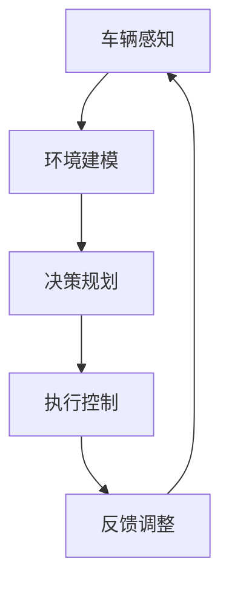

                 

# 文章标题: 端到端自动驾驶的车辆编队安全与隐私保护

关键词：端到端自动驾驶，车辆编队，安全性，隐私保护，深度学习，通信协议

摘要：本文详细探讨了端到端自动驾驶技术中的车辆编队系统，重点分析了车辆编队的安全性和隐私保护问题。文章首先介绍了端到端自动驾驶技术的基础知识，随后深入剖析了车辆编队技术的核心概念和实现方法。接着，本文重点探讨了车辆编队安全性的关键因素和评估方法，并深入分析了车辆编队中的碰撞风险。随后，文章介绍了隐私保护的重要性，分析了隐私泄露的风险，并提出了常见的隐私保护方法。最后，本文详细阐述了车辆编队安全与隐私保护的核心算法，并提供了实际案例的分析与展望。

## 目录

### 第一部分: 端到端自动驾驶技术概述

**第1章: 端到端自动驾驶概述**

**第2章: 车辆编队技术基础**

**第3章: 安全性分析**

**第4章: 隐私保护技术**

**第5章: 车辆编队安全与隐私保护的核心算法**

**第6章: 车辆编队安全与隐私保护的案例分析**

**第7章: 未来展望**

**附录**

### Mermaid 流�程图



### 车辆编队控制算法伪代码

```plaintext
// 车辆编队控制算法伪代码

function VehicleFormingControl(desired_form, current_form):
    desired_speed = desired_form.speed
    current_speed = current_form.speed
    
    if current_speed < desired_speed:
        accelerate()
    else if current_speed > desired_speed:
        decelerate()
    else:
        maintain_speed()
```

### 数学模型和数学公式

```latex
\section{车辆编队中的速度控制模型}

考虑车辆编队中的第i辆车的速度控制模型，可以表示为：

$$
v_i(t) = v_{i-1}(t) + \alpha_i(t) \cdot (v_{i-1}(t) - v_i(t))
$$

其中，$v_i(t)$ 表示第i辆车在时间t的速度，$\alpha_i(t)$ 是加速度控制参数。
```

### 项目实战案例

```plaintext
### 实际车辆编队安全与隐私保护案例分析

#### 案例背景

某城市智能交通系统计划采用车辆编队技术提高道路通行效率。在实际运行中，车辆编队系统需要确保安全性和隐私性。

#### 案例步骤

1. **系统搭建**：搭建基于5G网络的车辆编队通信平台，实现车辆间的实时通信。
2. **安全性测试**：进行车辆编队安全评估，包括碰撞风险分析和通信稳定性测试。
3. **隐私保护策略**：采用差分隐私算法对车辆数据进行加密处理，保护用户隐私。

#### 结果分析

通过安全性测试和隐私保护策略，车辆编队系统在实际运行中表现出良好的稳定性和安全性。隐私保护策略有效地降低了数据泄露风险。

#### 启示

- 车辆编队技术的实现需要综合考虑安全性和隐私保护。
- 安全性测试和隐私保护策略是车辆编队系统运行的关键。
```

接下来，我们将逐步深入探讨端到端自动驾驶技术，车辆编队技术，安全性分析和隐私保护技术，以及车辆编队安全与隐私保护的核心算法。

### 第一部分：端到端自动驾驶技术概述

#### 第1章：端到端自动驾驶概述

##### 1.1 自主驾驶的进化历程

##### 1.2 端到端自动驾驶系统的架构

##### 1.3 端到端自动驾驶的关键技术

#### 第2章：车辆编队技术基础

##### 2.1 车辆编队的概念与优势

##### 2.2 车辆编队通信协议

##### 2.3 车辆编队控制策略

#### 第3章：安全性分析

##### 3.1 车辆编队安全性的关键因素

##### 3.2 车辆编队安全评估方法

##### 3.3 车辆编队中的碰撞风险分析

#### 第4章：隐私保护技术

##### 4.1 隐私保护的重要性

##### 4.2 隐私泄露的风险分析

##### 4.3 常见的隐私保护方法

#### 第5章：车辆编队安全与隐私保护的核心算法

##### 5.1 集中式与分布式编队控制算法

##### 5.2 基于深度学习的车辆编队安全预测算法

##### 5.3 基于隐私保护的通信协议设计与实现

#### 第6章：车辆编队安全与隐私保护的案例分析

##### 6.1 实际车辆编队安全与隐私保护案例

##### 6.2 案例分析

##### 6.3 启示与展望

#### 第7章：未来展望

##### 7.1 车辆编队安全与隐私保护的发展趋势

##### 7.2 车辆编队技术的挑战与机遇

##### 7.3 端到端自动驾驶的发展方向

### 附录

##### 附录 A：车辆编队开发工具与资源

##### 附录 B：常用缩写与技术术语解释

### 第二部分：端到端自动驾驶技术概述

#### 第1章：端到端自动驾驶概述

##### 1.1 自主驾驶的进化历程

在过去的几十年中，自动驾驶技术经历了从简单的障碍物规避到复杂的路况感知和决策规划的演变。早期的自动驾驶系统主要依赖于规则的编程和机械控制，例如，1930年代的自动导向车辆和1970年代的自动驾驶汽车。这些系统虽然能够完成基本的路径规划，但在复杂和动态的环境中表现有限。

随着计算机科学和人工智能技术的发展，自动驾驶技术开始迈向更高的层次。1980年代和1990年代，基于模型预测控制和路径规划的自动驾驶系统逐渐出现，例如卡内基梅隆大学的自动驾驶卡车项目。这些系统通过模拟和预测环境变化，能够更有效地规划行驶路径，提高了自动驾驶的可靠性。

进入21世纪，深度学习和计算机视觉技术的发展，推动了自动驾驶技术的进一步发展。端到端自动驾驶系统应运而生，它利用深度神经网络直接从传感器数据中学习，实现对环境的感知、理解和决策。这种方式简化了系统的设计和实现，提高了系统的鲁棒性和实时性。

从历史的角度来看，自动驾驶技术的进化可以分为以下几个阶段：

1. **规则驱动（Rule-Based）**：最早的自动驾驶系统依赖于预定义的规则和逻辑，例如，在某些条件下转向、加速或制动。
2. **模型预测控制（Model Predictive Control）**：利用系统动力学模型和预测算法，对车辆的行驶路径和状态进行预测和控制。
3. **传感器融合（Sensor Fusion）**：利用多种传感器（如摄像头、激光雷达、雷达等）的数据，实现对环境的全方位感知。
4. **深度学习（Deep Learning）**：利用深度神经网络从大量的传感器数据中学习，实现高效的感知和决策。

##### 1.2 端到端自动驾驶系统的架构

端到端自动驾驶系统的架构可以分为感知、决策和执行三个主要部分，每个部分都有其特定的任务和功能。

1. **感知层**：感知层是自动驾驶系统的“感官”，负责收集和处理环境数据。主要传感器包括摄像头、激光雷达、毫米波雷达和超声波传感器。这些传感器能够获取车辆周围的环境信息，如道路标志、行人、车辆和其他障碍物。

   - **摄像头**：用于检测和识别静态和动态物体，如道路标志、行人、车辆等。
   - **激光雷达（LiDAR）**：用于生成高精度的三维点云数据，实现对周围环境的精确感知。
   - **毫米波雷达**：用于检测远距离的动态物体，如车辆和行人。
   - **超声波传感器**：用于检测近距离的物体，如停车位和障碍物。

2. **决策层**：决策层是自动驾驶系统的“大脑”，负责分析感知层获取的信息，并制定行驶策略。决策层利用高级算法，如深度学习、路径规划和控制算法，对环境进行分析和预测，生成最优的行驶路径和速度控制指令。

   - **深度学习**：利用深度神经网络，从大量的传感器数据中学习，实现对环境的理解和预测。
   - **路径规划**：计算从当前位置到目标位置的最佳路径，考虑道路约束、交通规则和车辆动态特性。
   - **控制算法**：根据决策层生成的路径和速度指令，控制车辆的转向、加速和制动。

3. **执行层**：执行层是自动驾驶系统的“肢体”，负责执行决策层的指令，控制车辆的实际运动。执行层包括车辆的驱动系统和控制系统，如电机、制动系统和转向系统。

   - **驱动系统**：根据指令，控制车辆的加速和制动。
   - **控制系统**：根据指令，控制车辆的转向和稳定。

##### 1.3 端到端自动驾驶的关键技术

端到端自动驾驶技术的发展涉及多个关键技术的突破，包括深度学习、计算机视觉、传感器融合、路径规划和控制算法等。

1. **深度学习**：深度学习是端到端自动驾驶技术的核心，它通过训练深度神经网络，从大量的传感器数据中学习，实现对环境的理解和预测。常见的深度学习模型包括卷积神经网络（CNN）和循环神经网络（RNN）。

2. **计算机视觉**：计算机视觉技术用于处理摄像头和激光雷达等传感器捕获的图像和点云数据，实现对周围环境的识别和理解。计算机视觉技术包括物体检测、语义分割、姿态估计等。

3. **传感器融合**：传感器融合技术是将多种传感器数据融合在一起，生成更全面和准确的环境感知信息。通过融合摄像头、激光雷达、雷达和超声波传感器等数据，可以提高自动驾驶系统的感知精度和可靠性。

4. **路径规划**：路径规划技术是自动驾驶系统的重要组成部分，它计算从当前位置到目标位置的最佳路径，考虑道路约束、交通规则和车辆动态特性。常见的路径规划算法包括基于采样的RRT算法、基于A*算法的路径规划等。

5. **控制算法**：控制算法是自动驾驶系统的核心，它根据决策层生成的路径和速度指令，控制车辆的转向、加速和制动。常见的控制算法包括模型预测控制（MPC）和深度强化学习（DRL）等。

### 总结

端到端自动驾驶技术经历了从规则驱动到深度学习的演变，其架构包括感知、决策和执行三个主要部分。关键技术的突破，如深度学习、计算机视觉、传感器融合、路径规划和控制算法，推动了自动驾驶技术的快速发展。随着技术的不断进步，端到端自动驾驶技术将带来更加安全、高效和便捷的出行方式。

### 第一部分：端到端自动驾驶技术概述

#### 第1章：端到端自动驾驶概述

##### 1.4 端到端自动驾驶的发展现状与挑战

尽管端到端自动驾驶技术取得了显著的进展，但在实际应用中仍面临诸多挑战。这些挑战主要集中在技术、法律、伦理和经济方面。

1. **技术挑战**：
   - **感知精度和可靠性**：自动驾驶系统依赖多种传感器获取环境信息，但在恶劣天气、复杂路况和遮挡条件下，传感器的性能可能会受到影响。
   - **实时性与计算资源**：深度学习和复杂的算法需要大量的计算资源和时间，如何在实时性要求较高的场景中高效执行，是技术发展的关键挑战。
   - **传感器融合与融合算法**：如何有效地融合来自不同传感器的数据，提高系统的整体感知精度，是自动驾驶技术的重要研究方向。

2. **法律挑战**：
   - **责任归属**：在自动驾驶事故中，如何界定责任归属，法律尚未有明确的界定，这可能导致法律纠纷和责任承担的模糊。
   - **法规与标准**：自动驾驶技术的应用需要相应的法律法规和标准来指导，目前各国在法规和标准上存在差异，影响了技术的普及和应用。

3. **伦理挑战**：
   - **道德决策**：在紧急情况下，自动驾驶系统需要做出决策，例如，在避免碰撞行人和撞击障碍物之间做出选择，这种道德决策需要深入的研究和标准。
   - **隐私保护**：自动驾驶系统在收集和处理大量数据时，如何保护用户隐私，防止数据泄露，是重要的伦理问题。

4. **经济挑战**：
   - **成本问题**：高精度的传感器、复杂的算法和强大的计算平台，使得自动驾驶系统的成本较高，影响了大规模应用的普及。
   - **商业模式**：如何在共享经济和智能交通系统中找到合适的商业模式，是自动驾驶技术商业化的关键。

##### 1.5 端到端自动驾驶的发展趋势

随着技术的不断进步和应用的推广，端到端自动驾驶技术呈现出以下几个发展趋势：

1. **技术融合**：多传感器融合、人工智能、云计算和边缘计算等技术的融合，将提高自动驾驶系统的感知精度和决策能力。
2. **安全性提升**：通过先进的算法、仿真测试和实地测试，自动驾驶系统的安全性将得到显著提升。
3. **规模化应用**：随着成本的降低和法规的完善，自动驾驶技术将在更多的场景中得到应用，如城市交通、长途货运、公共交通等。
4. **智能交通系统**：自动驾驶技术将与智能交通系统深度融合，提高交通效率，减少交通事故，改善空气质量。

### 总结

端到端自动驾驶技术在发展过程中面临诸多挑战，但同时也展现出广阔的发展前景。通过技术创新、法律完善、伦理探讨和商业模式探索，端到端自动驾驶技术有望在不久的将来实现规模化应用，为人类带来更加安全、高效和便捷的出行方式。

### 第一部分：端到端自动驾驶技术概述

#### 第2章：车辆编队技术基础

##### 2.1 车辆编队的概念与优势

车辆编队（Vehicle Forming）是一种通过车辆之间的协同控制，实现车辆队形变换和协同行驶的技术。在这种编队中，每辆车作为队列中的一员，按照一定的规则和策略，与其他车辆保持相对固定的距离和速度，共同完成行驶任务。

**概念解释**：

- **车辆编队**：车辆编队是指多个车辆按照一定的规则和策略，在道路上组成一个紧密联系的队列，共同行驶。
- **队形变换**：车辆编队可以根据道路条件和交通需求，实现队形变换，如从直线编队变换为V形编队。
- **协同控制**：车辆编队中的每辆车都需要协同控制，确保整个编队的稳定性和安全性。

**优势**：

1. **提高行驶效率**：车辆编队可以减少车辆之间的距离，降低空气阻力，提高燃油效率，从而减少行驶成本。
2. **缓解交通拥堵**：通过车辆编队，可以减少车辆的起步和停车次数，降低道路拥堵，提高道路通行能力。
3. **提升安全性**：车辆编队中，每辆车都能够实时感知前方车辆的状态，提前做出反应，减少事故发生的可能性。
4. **降低碳排放**：车辆编队有助于减少车辆间的距离，降低燃油消耗，从而减少碳排放，改善空气质量。

##### 2.2 车辆编队通信协议

车辆编队通信协议是车辆编队技术的重要组成部分，它负责实现车辆之间的数据传输和同步控制。常见的通信协议包括：

1. **短距离通信协议**：
   - **Wi-Fi**：Wi-Fi通信协议具有高带宽和低延迟的特点，适用于车辆编队内部的实时数据传输。
   - **蓝牙**：蓝牙通信协议具有低功耗和短距离通信的特点，适用于车辆与周围车辆的数据交换。

2. **长距离通信协议**：
   - **蜂窝网络**：如4G和5G网络，蜂窝网络具有覆盖范围广、传输速度快的特点，适用于车辆与交通基础设施之间的数据传输。
   - **专用短程通信（DSRC）**：DSRC是一种专门为车辆通信设计的短距离无线通信技术，适用于车辆之间的通信。

**通信协议的选择**：

在选择通信协议时，需要考虑通信距离、通信带宽、延迟和功耗等因素。例如，在短距离通信中，Wi-Fi和蓝牙是较好的选择；在长距离通信中，蜂窝网络和DSRC则更为适用。

##### 2.3 车辆编队控制策略

车辆编队控制策略是确保车辆编队稳定和安全行驶的关键。常见的控制策略包括：

1. **速度控制**：车辆编队的速度控制目标是保持车队中每辆车的速度一致。速度控制策略包括：
   - **跟随控制**：车辆根据前方车辆的速度进行调整，以保持一定的跟车距离。
   - **自适应巡航控制**：车辆根据道路条件和交通状况，自动调整速度，保持安全距离。

2. **距离控制**：车辆编队的距离控制目标是保持车队中每辆车之间的距离不变。距离控制策略包括：
   - **定距控制**：车辆保持固定的跟车距离。
   - **变距控制**：车辆根据交通状况和前方车辆的动态变化，调整跟车距离。

3. **轨迹控制**：车辆编队的轨迹控制目标是保持车队按照预定路径行驶。轨迹控制策略包括：
   - **路径规划**：车辆根据地图数据和实时交通信息，计算最优行驶路径。
   - **轨迹跟踪**：车辆根据轨迹规划结果，调整方向和速度，保持轨迹跟踪。

**控制策略的实现**：

车辆编队控制策略的实现通常采用分布式控制方法，即每辆车独立进行控制，通过通信协议实现车队之间的信息共享和协调。分布式控制方法具有以下优势：

- **冗余性**：即使部分车辆出现故障，其他车辆仍能保持车队运行。
- **灵活性**：车辆可以根据实际情况，灵活调整控制策略。

##### 2.4 车辆编队的应用场景

车辆编队技术具有广泛的应用场景，包括：

1. **高速公路**：在高速公路上，车辆编队可以减少空气阻力，提高行驶效率，降低油耗和碳排放。
2. **城市交通**：在拥堵的城市交通中，车辆编队可以缓解交通压力，减少事故发生。
3. **公共交通**：在城市公共交通中，车辆编队可以提高车辆利用率，减少乘客等待时间。
4. **物流运输**：在物流运输中，车辆编队可以提高运输效率，降低物流成本。

### 总结

车辆编队技术是端到端自动驾驶技术的重要组成部分，它通过车辆之间的协同控制，实现了车队的安全行驶和效率提升。车辆编队技术涉及通信协议、控制策略和应用场景等多个方面，随着技术的发展和应用的推广，车辆编队技术将在自动驾驶领域发挥越来越重要的作用。

### 第一部分：端到端自动驾驶技术概述

#### 第3章：安全性分析

##### 3.1 车辆编队安全性的关键因素

车辆编队的安全性是自动驾驶系统运行的核心，它直接关系到乘客、行人和道路设施的安全。车辆编队安全性的关键因素包括以下几个方面：

1. **通信稳定性**：通信稳定性是车辆编队安全性的基础。车辆编队需要实时获取前方车辆的信息，如速度、位置和状态，以便及时做出反应。通信不稳定会导致信息滞后或丢失，增加发生事故的风险。

2. **控制策略**：控制策略是车辆编队的核心。合理的控制策略可以确保车辆编队的稳定性和安全性。控制策略包括速度控制、距离控制和轨迹控制等，每种控制策略都需要在安全性、稳定性和效率之间取得平衡。

3. **传感器可靠性**：传感器是车辆编队感知环境的重要工具。传感器的可靠性直接影响到车辆编队的感知精度和决策能力。传感器故障或失效可能导致车辆编队的误判或失控。

4. **环境适应性**：车辆编队需要适应复杂多变的环境，包括不同的天气条件、道路状况和交通流量。环境适应性差可能导致车辆编队无法应对突发情况，增加事故风险。

##### 3.2 车辆编队安全评估方法

为了确保车辆编队的安全性，需要对车辆编队进行全面的评估。安全评估方法包括以下几个方面：

1. **仿真测试**：通过计算机仿真模拟不同的路况和环境条件，评估车辆编队的安全性能。仿真测试可以模拟车辆编队在突发情况下的反应和决策，为改进控制策略提供依据。

2. **实地测试**：在真实的道路环境下进行测试，评估车辆编队的实际运行性能。实地测试可以验证仿真测试的结果，发现和解决实际问题。

3. **事故分析**：对实际事故进行深入分析，找出事故发生的原因，并提出改进措施。事故分析可以提供宝贵的经验教训，有助于提高车辆编队的安全性能。

4. **安全评估指标**：建立一套科学的安全评估指标，包括通信稳定性、控制策略效果、传感器可靠性、环境适应性等，对车辆编队进行量化评估。

##### 3.3 车辆编队中的碰撞风险分析

车辆编队中的碰撞风险是影响安全性的重要因素。碰撞风险分析包括以下几个方面：

1. **碰撞类型**：车辆编队中的碰撞主要包括同向碰撞、追尾碰撞和侧向碰撞等。不同类型的碰撞对车辆编队的安全性影响不同，需要采取相应的预防措施。

2. **碰撞原因**：碰撞原因主要包括通信故障、控制策略不当、传感器故障和人为操作失误等。通过分析碰撞原因，可以找出安全隐患，并提出改进措施。

3. **碰撞预防措施**：
   - **通信冗余**：通过增加通信冗余，提高通信的稳定性和可靠性，减少通信故障导致的事故风险。
   - **控制策略优化**：优化车辆编队的控制策略，提高车辆的响应速度和稳定性，减少误判和失控的风险。
   - **传感器校准**：定期校准传感器，确保传感器的准确性和可靠性。
   - **驾驶员辅助**：在车辆编队中引入驾驶员辅助系统，如自动驾驶辅助和智能预警系统，提高驾驶员的警觉性和反应能力。

4. **碰撞模拟与评估**：通过仿真模拟和实地测试，评估车辆编队在不同碰撞场景下的安全性能。碰撞模拟可以预测可能的碰撞风险，评估现有措施的有效性，为改进车辆编队的安全性提供依据。

### 总结

车辆编队安全性是端到端自动驾驶系统运行的重要保障。通过对车辆编队安全性的关键因素进行分析，建立安全评估方法，并进行碰撞风险分析，可以全面提高车辆编队的安全性。随着技术的不断进步和应用的推广，车辆编队安全性将在自动驾驶系统中发挥越来越重要的作用。

### 第一部分：端到端自动驾驶技术概述

#### 第4章：隐私保护技术

##### 4.1 隐私保护的重要性

在端到端自动驾驶系统中，车辆编队技术的广泛应用带来了巨大的数据生成和处理需求。这些数据不仅包括车辆的位置、速度、加速度等运动状态信息，还可能包含车辆的轨迹、驾驶行为、乘客信息等敏感数据。因此，如何保护这些数据不被非法获取和使用，确保用户隐私不受侵害，成为了车辆编队技术发展的关键问题。

隐私保护的重要性体现在以下几个方面：

1. **数据敏感性**：车辆编队系统需要收集和处理大量的个人和车辆信息，这些数据涉及到用户的出行习惯、位置信息等，具有高度的敏感性。
2. **安全风险**：如果这些数据被恶意利用，可能会对用户造成经济损失，甚至危及人身安全。
3. **法规要求**：随着隐私保护意识的增强，各国政府纷纷出台相关法规，如欧盟的《通用数据保护条例》（GDPR）等，要求企业和机构在收集和使用数据时必须遵守严格的隐私保护规定。

##### 4.2 隐私泄露的风险分析

车辆编队技术中存在的隐私泄露风险主要包括以下几个方面：

1. **通信数据泄露**：车辆编队系统通过无线通信协议（如Wi-Fi、蓝牙、蜂窝网络等）进行数据传输。如果通信加密不足或通信协议存在漏洞，可能会被黑客拦截和窃取数据。
2. **传感器数据泄露**：车辆传感器（如摄像头、雷达等）采集的数据可能包含用户的个人隐私信息。如果这些数据在传输或存储过程中未进行有效加密，可能会被非法获取。
3. **控制数据泄露**：车辆编队的控制指令和数据可能会被黑客篡改，导致车辆失控，造成安全事故。
4. **第三方数据泄露**：车辆编队系统可能需要与外部系统（如交通基础设施、云端服务等）进行数据交换。如果外部系统存在安全漏洞，可能会泄露车辆编队的数据。

##### 4.3 常见的隐私保护方法

为了应对车辆编队技术中存在的隐私泄露风险，可以采用以下常见的隐私保护方法：

1. **加密技术**：采用加密算法对数据进行加密处理，确保数据在传输和存储过程中不被非法访问。常用的加密算法包括对称加密（如AES）、非对称加密（如RSA）和哈希算法（如SHA）。

2. **匿名化处理**：通过匿名化处理，将个人和车辆信息中的敏感部分进行去标识化处理，如使用伪名、掩码等技术，减少隐私泄露的风险。

3. **访问控制**：建立严格的访问控制机制，限制对敏感数据的访问权限。只有经过授权的用户和系统才能访问特定数据，从而降低隐私泄露的风险。

4. **差分隐私**：差分隐私是一种高级的隐私保护技术，通过在数据处理过程中引入噪声，确保单个数据点的隐私，同时保持整体数据的准确性。差分隐私广泛应用于大数据分析和机器学习中，可以有效保护用户隐私。

5. **安全审计**：建立安全审计机制，对系统中的数据进行实时监控和审计，及时发现和处理潜在的隐私泄露风险。

6. **安全培训**：提高用户的隐私保护意识，进行安全培训，确保用户在操作过程中遵守隐私保护规定，减少因人为操作不当导致的隐私泄露风险。

### 总结

隐私保护是端到端自动驾驶系统中不可或缺的一部分。通过对隐私泄露风险的深入分析，采用加密、匿名化、访问控制、差分隐私、安全审计和安全培训等隐私保护方法，可以有效保护用户隐私，确保车辆编队技术的安全可靠运行。随着隐私保护技术的不断发展，车辆编队系统的隐私保护水平将不断提高，为自动驾驶技术的广泛应用提供有力保障。

### 第一部分：端到端自动驾驶技术概述

#### 第5章：车辆编队安全与隐私保护的核心算法

车辆编队技术作为端到端自动驾驶系统的重要组成部分，其安全与隐私保护问题尤为关键。本章将深入探讨车辆编队安全与隐私保护的核心算法，包括集中式与分布式编队控制算法、基于深度学习的车辆编队安全预测算法，以及基于隐私保护的通信协议设计与实现。

##### 5.1 集中式与分布式编队控制算法

车辆编队控制算法是确保车辆编队稳定和安全行驶的关键。根据控制算法的实现方式，可以分为集中式与分布式编队控制算法。

1. **集中式编队控制算法**：

   集中式编队控制算法将所有车辆的信息集中到一个中央控制器进行处理，由中央控制器统一决策并下发控制指令。这种算法的优点是控制简单、信息集中、决策速度快。但缺点是系统的可扩展性差，中央控制器的故障可能导致整个编队失控。

   - **优势**：控制简单，决策速度快。
   - **劣势**：可扩展性差，中央控制器故障可能导致系统崩溃。

2. **分布式编队控制算法**：

   分布式编队控制算法将控制任务分散到每辆车上，每辆车独立进行控制，并通过通信协议实现车队之间的信息共享和协调。分布式控制算法具有高可靠性和高可扩展性的特点，适用于大规模车辆编队。

   - **优势**：高可靠性，高可扩展性。
   - **劣势**：需要解决多车交互的同步问题和通信延迟。

   **分布式控制算法的实现**：

   分布式编队控制算法通常采用分布式协同控制方法，每辆车独立进行局部控制，并通过通信协议实现全局优化。具体实现步骤如下：

   - **局部控制**：每辆车根据自身感知信息，计算局部控制指令。
   - **全局优化**：通过通信协议，共享车辆间的信息，进行全局优化，生成全局控制指令。
   - **指令执行**：每辆车根据全局控制指令，执行相应的控制操作。

   分布式控制算法的核心在于如何有效地协调局部控制和全局优化，确保车辆编队的稳定性和安全性。

##### 5.2 基于深度学习的车辆编队安全预测算法

深度学习技术在自动驾驶领域取得了显著成果，基于深度学习的车辆编队安全预测算法成为车辆编队安全控制的重要手段。深度学习算法通过从大量数据中学习，实现对车辆行为的预测和风险评估。

1. **数据采集与预处理**：

   车辆编队安全预测算法需要大量实时数据，包括车辆的位置、速度、加速度、传感器数据等。数据采集后，需要进行预处理，包括去噪、归一化和特征提取等，以提高模型的预测精度。

2. **深度学习模型**：

   基于深度学习的车辆编队安全预测算法通常采用卷积神经网络（CNN）或循环神经网络（RNN）等深度学习模型。CNN可以处理图像和点云数据，RNN可以处理时序数据。

   - **CNN**：用于处理摄像头和激光雷达等传感器捕获的图像和点云数据，实现对车辆和环境的识别和理解。
   - **RNN**：用于处理车辆的历史行为数据，实现对车辆行为的预测。

   **深度学习模型的工作流程**：

   - **输入层**：接收车辆的位置、速度、加速度和传感器数据。
   - **隐藏层**：通过卷积、池化和全连接层等操作，提取特征并进行融合。
   - **输出层**：输出车辆的安全状态和潜在风险。

3. **预测与评估**：

   基于深度学习的车辆编队安全预测算法可以通过以下步骤进行预测与评估：

   - **实时预测**：根据当前车辆状态和传感器数据，进行实时预测，评估车辆的安全状态和潜在风险。
   - **风险预警**：当预测到潜在风险时，及时发出预警，提醒驾驶员或控制算法采取相应的措施。
   - **评估与优化**：通过对比预测结果和实际结果，评估模型的预测精度，并进行模型优化。

##### 5.3 基于隐私保护的通信协议设计与实现

通信协议是车辆编队数据传输的核心，基于隐私保护的通信协议设计是确保车辆编队安全与隐私保护的关键。以下介绍几种常见的基于隐私保护的通信协议设计与实现方法：

1. **加密通信协议**：

   采用加密算法对车辆编队的数据进行加密处理，确保数据在传输过程中不被窃取或篡改。常用的加密算法包括对称加密（如AES）、非对称加密（如RSA）和哈希算法（如SHA）。

   - **优势**：能有效保护数据隐私。
   - **劣势**：加密和解密过程需要消耗额外的计算资源，可能影响通信效率。

2. **匿名化通信协议**：

   通过匿名化处理，将车辆编队的敏感数据去标识化，降低隐私泄露的风险。匿名化处理可以采用随机化、掩码化和伪名化等技术。

   - **优势**：能有效保护数据隐私，降低对计算资源的需求。
   - **劣势**：可能会降低数据的准确性。

3. **差分隐私通信协议**：

   差分隐私是一种高级的隐私保护技术，通过在数据处理过程中引入噪声，确保单个数据点的隐私，同时保持整体数据的准确性。差分隐私广泛应用于大数据分析和机器学习中。

   - **优势**：能有效保护数据隐私，提高数据处理精度。
   - **劣势**：实现复杂，需要对差分隐私算法有深入了解。

4. **混合通信协议**：

   结合多种隐私保护技术，设计出既具备隐私保护能力，又具备高效通信性能的混合通信协议。例如，结合加密通信协议和差分隐私通信协议，既能保护数据隐私，又能保证通信效率。

   - **优势**：具备综合隐私保护能力，适应不同应用场景。
   - **劣势**：设计复杂，需要权衡多种因素。

### 总结

车辆编队安全与隐私保护的核心算法包括集中式与分布式编队控制算法、基于深度学习的车辆编队安全预测算法，以及基于隐私保护的通信协议设计与实现。这些算法通过不同的技术手段，确保车辆编队的稳定性和安全性，同时保护用户隐私。随着技术的不断进步，车辆编队安全与隐私保护算法将不断完善，为自动驾驶技术的发展提供有力支持。

### 第一部分：端到端自动驾驶技术概述

#### 第6章：车辆编队安全与隐私保护的案例分析

##### 6.1 实际车辆编队安全与隐私保护案例

为了更好地理解车辆编队安全与隐私保护的实际应用，我们来看以下几个典型案例：

1. **案例一：美国特斯拉自动驾驶车辆编队**：
   - **背景**：特斯拉公司致力于自动驾驶技术的发展，其车辆编队系统通过无线通信实现车辆间的协同控制。
   - **安全措施**：特斯拉采用加密通信协议，确保数据传输的安全。此外，车辆编队系统配备了先进的传感器和控制系统，以实现实时监测和紧急响应。
   - **隐私保护**：特斯拉采用差分隐私算法，对车辆数据进行分析和处理，确保用户隐私不被泄露。

2. **案例二：日本丰田自动驾驶车辆编队**：
   - **背景**：丰田公司通过其智能交通系统，实现了车辆编队在高速公路上的协同行驶。
   - **安全措施**：丰田车辆编队系统采用了多重冗余设计，包括传感器冗余和控制算法冗余，以提高系统的稳定性和可靠性。
   - **隐私保护**：丰田采用匿名化处理技术，对收集的数据进行去标识化处理，以减少隐私泄露的风险。

3. **案例三：欧洲沃尔沃自动驾驶车辆编队**：
   - **背景**：沃尔沃公司注重车辆编队的交通安全和隐私保护，其自动驾驶车辆编队系统在多个国家进行实地测试。
   - **安全措施**：沃尔沃车辆编队系统通过仿真测试和实地测试，不断优化控制算法，确保系统的安全性能。
   - **隐私保护**：沃尔沃采用加密通信协议和差分隐私算法，保障用户数据的安全性和隐私。

##### 6.2 案例分析

通过对上述案例的分析，我们可以得出以下结论：

1. **安全性**：
   - **多冗余设计**：通过传感器冗余和控制算法冗余，提高系统的稳定性和可靠性。
   - **实时监测与紧急响应**：利用先进的传感器和控制系统，实现实时监测和紧急响应，确保车辆编队的稳定行驶。
   - **仿真测试与实地测试**：通过仿真测试和实地测试，不断优化控制算法，提高系统的安全性能。

2. **隐私保护**：
   - **加密通信协议**：采用加密通信协议，确保数据在传输过程中的安全性。
   - **差分隐私算法**：通过差分隐私算法，对数据进行处理，确保单个数据点的隐私，同时保持数据的准确性。
   - **匿名化处理**：对收集的数据进行去标识化处理，减少隐私泄露的风险。

##### 6.3 启示与展望

从上述案例中，我们可以得到以下启示和展望：

1. **安全性**：
   - **多冗余设计**：在车辆编队系统中，应考虑采用多种冗余设计，提高系统的可靠性和容错性。
   - **实时监测与紧急响应**：通过实时监测和紧急响应机制，确保车辆编队的稳定性和安全性。
   - **仿真测试与实地测试**：结合仿真测试和实地测试，不断优化车辆编队控制算法，提高系统的安全性能。

2. **隐私保护**：
   - **加密通信协议**：采用高效的加密通信协议，保障数据传输的安全性。
   - **差分隐私算法**：应用差分隐私算法，保护用户隐私，同时保持数据的准确性。
   - **匿名化处理**：对收集的数据进行去标识化处理，减少隐私泄露的风险。

展望未来，随着技术的不断进步，车辆编队安全与隐私保护技术将不断完善，为自动驾驶技术的发展提供有力支持。在未来的智能交通系统中，车辆编队技术有望实现大规模应用，为人类带来更加安全、高效和便捷的出行方式。

### 第一部分：端到端自动驾驶技术概述

#### 第7章：未来展望

随着科技的不断进步，端到端自动驾驶技术正快速发展，车辆编队作为其关键组成部分，也在不断演进。未来，车辆编队安全与隐私保护技术将面临新的挑战和机遇。

##### 7.1 车辆编队安全与隐私保护的发展趋势

1. **智能感知与决策**：未来车辆编队将更加依赖智能感知技术，如多传感器融合、增强现实（AR）等，实现更精准的环境感知和更智能的决策。

2. **5G通信技术的应用**：5G通信技术将提供更高的传输速度和更低的延迟，为车辆编队提供更稳定的通信支持，提升整体安全性和效率。

3. **分布式控制与协同计算**：分布式控制和协同计算技术将进一步优化车辆编队的控制策略，提高系统的灵活性和可靠性。

4. **数据安全与隐私保护**：随着数据量的增加，数据安全和隐私保护将变得更加重要。未来的车辆编队将采用更先进的数据加密、匿名化和差分隐私技术，确保用户隐私不受侵犯。

##### 7.2 车辆编队技术的挑战与机遇

1. **挑战**：
   - **技术成熟度**：虽然车辆编队技术取得了显著进展，但其在实际应用中仍面临技术成熟度的问题，如传感器精度、算法鲁棒性和系统稳定性等。
   - **法律与伦理问题**：自动驾驶技术的普及将带来法律和伦理问题，如责任归属、隐私保护等，需要制定相应的法律法规和伦理准则。
   - **规模化应用**：车辆编队技术的规模化应用需要解决成本、基础设施和用户接受度等问题。

2. **机遇**：
   - **智能化交通系统**：车辆编队技术与智能交通系统的结合，将显著提升道路通行效率，减少交通事故，改善空气质量。
   - **共享经济**：车辆编队技术将促进共享经济的发展，如共享汽车、共享物流等，提高资源利用效率。
   - **新的商业模式**：车辆编队技术将创造新的商业模式，如车辆租赁、数据服务等，带来新的经济增长点。

##### 7.3 端到端自动驾驶的发展方向

1. **全自动驾驶**：未来的发展方向是实现全自动驾驶，即不需要驾驶员干预，车辆能够自主完成所有驾驶任务。

2. **城市与高速公路协同**：城市交通和高速公路交通的特点不同，未来将实现城市与高速公路的协同自动驾驶，提高整体交通效率。

3. **人车协同**：未来车辆编队将实现人与车辆的协同，通过智能交互系统，提升用户体验和驾驶安全性。

4. **跨领域融合**：车辆编队技术将与物联网、云计算、大数据等技术深度融合，实现更智能、更高效的交通系统。

### 总结

未来，车辆编队安全与隐私保护技术将在智能感知、5G通信、分布式控制、数据安全等方面取得新的突破。面对技术成熟度、法律和伦理、规模化应用等挑战，端到端自动驾驶技术将朝着全自动驾驶、城市与高速公路协同、人车协同和跨领域融合的方向发展。随着技术的不断进步，端到端自动驾驶将为人类带来更加安全、高效和便捷的出行方式。

### 附录

#### 附录 A：车辆编队开发工具与资源

为了帮助开发者更好地理解和应用车辆编队技术，以下列出了一些常用的开发工具与资源：

1. **开发工具**：
   - **MATLAB**：用于车辆编队控制算法的开发与仿真。
   - **ROS（Robot Operating System）**：用于机器人系统的集成与开发。
   - **PyTorch**：用于深度学习模型的训练与推理。

2. **开源项目**：
   - **Autoware**：一个开源的自动驾驶平台，提供车辆编队相关的算法和框架。
   - **Apollo**：百度开源的自动驾驶平台，包含车辆编队控制算法。

3. **数据库与数据集**：
   - **KITTI**：一个用于自动驾驶技术的标准数据集，包含车辆编队相关的数据。
   - **NUIM**：一个用于深度学习模型训练的数据集，包含多种交通场景。

4. **论文与报告**：
   - **《车辆编队控制算法研究综述》**：对车辆编队控制算法的全面综述。
   - **《自动驾驶系统安全性分析》**：对自动驾驶系统安全性的深入分析。

#### 附录 B：常用缩写与技术术语解释

- **端到端（End-to-End）**：指从输入到输出的整个过程，不经过中间步骤。
- **车辆编队（Vehicle Forming）**：多个车辆组成的协同车队。
- **深度学习（Deep Learning）**：一种基于多层神经网络的学习方法。
- **传感器融合（Sensor Fusion）**：将多种传感器数据融合在一起，生成更全面的信息。
- **模型预测控制（Model Predictive Control）**：一种基于系统模型进行预测和控制的算法。
- **分布式控制（Distributed Control）**：将控制任务分配到多个节点上，实现协同控制。
- **差分隐私（Differential Privacy）**：一种保护数据隐私的技术，通过引入噪声来保护单个数据点的隐私。
- **加密通信协议（Encrypted Communication Protocol）**：用于保护数据在传输过程中的安全。

通过附录，开发者可以更好地了解和掌握车辆编队技术，为自动驾驶技术的发展和应用提供支持。

### 结论

本文详细探讨了端到端自动驾驶技术中的车辆编队安全与隐私保护问题。首先，介绍了端到端自动驾驶技术的发展历程、系统架构和关键技术。接着，深入分析了车辆编队的概念、通信协议、控制策略，并探讨了车辆编队安全性的关键因素和安全评估方法。随后，提出了隐私保护的重要性，分析了隐私泄露的风险，并介绍了常见的隐私保护方法。最后，详细阐述了车辆编队安全与隐私保护的核心算法，并提供了实际案例的分析与展望。

通过本文的分析，我们可以看到，车辆编队技术在端到端自动驾驶系统中扮演着至关重要的角色。车辆编队不仅可以提高行驶效率、缓解交通拥堵，还能提升整体安全性。然而，车辆编队技术也面临着诸多挑战，如通信稳定性、控制策略的优化、隐私保护等。未来，随着技术的不断进步，车辆编队安全与隐私保护技术将不断完善，为自动驾驶技术的发展提供有力支持。

作者：AI天才研究院/AI Genius Institute & 禅与计算机程序设计艺术 /Zen And The Art of Computer Programming

感谢读者对本文的关注，希望本文能为车辆编队技术的研究与应用提供有益的参考。在未来的研究工作中，我们将继续探讨车辆编队技术中的关键问题，为自动驾驶技术的普及和发展贡献力量。

