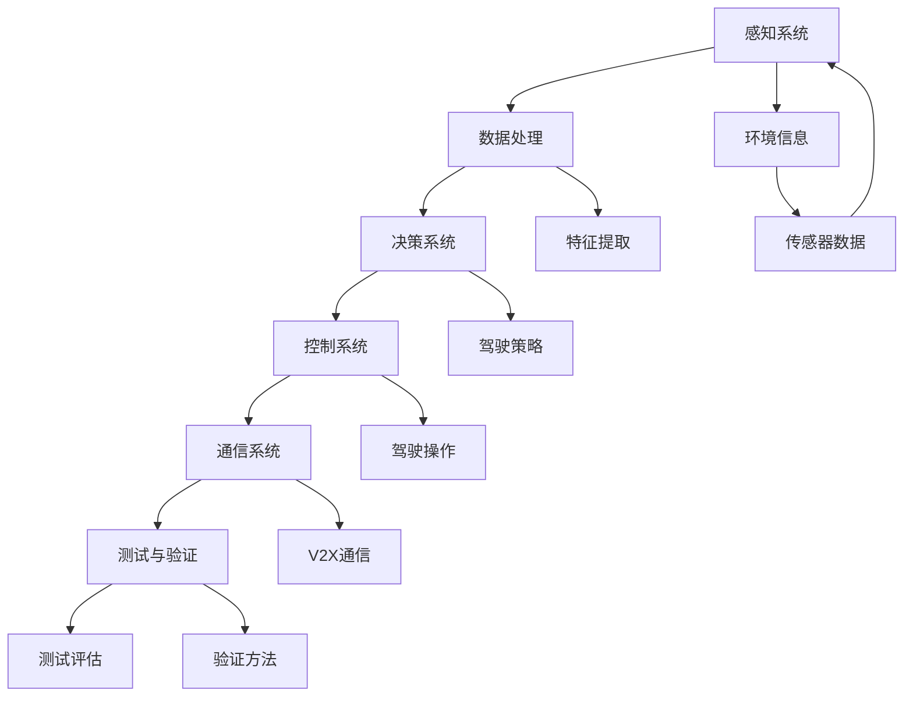

                 

# 文章标题：端到端自动驾驶落地的技术卡点

> 关键词：自动驾驶、端到端、感知系统、决策与控制、通信与网络安全、测试与验证

> 摘要：本文将深入探讨端到端自动驾驶技术的落地过程中面临的技术卡点。从感知系统、决策与控制系统、通信与网络安全、测试与验证等各个方面，分析各个技术难点及其解决方法，并探讨未来的发展趋势。通过一系列的案例分析，展示端到端自动驾驶技术的实际应用，为未来的自动驾驶发展提供有益的借鉴。

### 目录大纲

## 第1章：端到端自动驾驶概述

### 1.1 自动驾驶的发展历史

### 1.2 端到端自动驾驶的定义与分类

### 1.3 端到端自动驾驶的关键技术

### 1.4 自动驾驶的应用场景和挑战

## 第2章：感知系统技术卡点

### 2.1 感知系统概述

### 2.2 感知系统中的传感器技术

#### 2.2.1 激光雷达

#### 2.2.2 摄像头

#### 2.2.3 毫米波雷达

### 2.3 感知数据处理算法

#### 2.3.1 图像处理算法

#### 2.3.2 深度估计

#### 2.3.3 多传感器融合

## 第3章：决策与控制技术卡点

### 3.1 决策系统概述

### 3.2 基于规则的决策方法

### 3.3 深度学习在决策中的应用

#### 3.3.1 深度强化学习

#### 3.3.2 路径规划算法

### 3.4 控制系统技术

#### 3.4.1 PID控制

#### 3.4.2 模型预测控制

## 第4章：通信与网络安全技术卡点

### 4.1 车辆通信系统

#### 4.1.1 V2X通信

#### 4.1.2 车辆间的通信协议

### 4.2 安全性技术

#### 4.2.1 认证与加密

#### 4.2.2 隐私保护

#### 4.2.3 攻击防御机制

## 第5章：自动驾驶测试与验证技术卡点

### 5.1 测试环境搭建

#### 5.1.1 静态测试环境

#### 5.1.2 动态测试环境

### 5.2 自动驾驶测试评估方法

#### 5.2.1 评价指标

#### 5.2.2 测试流程

### 5.3 自动驾驶验证方法

#### 5.3.1 硬件在环仿真

#### 5.3.2 软件在环仿真

#### 5.3.3 道路测试

## 第6章：端到端自动驾驶落地实施案例

### 6.1 实施案例概述

#### 6.1.1 案例一：城市自动驾驶出租车

#### 6.1.2 案例二：高速公路自动驾驶卡车

### 6.2 案例实施过程分析

#### 6.2.1 技术挑战

#### 6.2.2 项目管理

#### 6.2.3 风险管理

## 第7章：端到端自动驾驶的未来发展趋势

### 7.1 技术发展趋势

#### 7.1.1 感知系统

#### 7.1.2 决策与控制

#### 7.1.3 通信与网络安全

### 7.2 应用场景拓展

#### 7.2.1 个人出行

#### 7.2.2 物流运输

#### 7.2.3 公共交通

## 附录

### A.1 核心概念与联系（Mermaid流程图）

### A.2 核心算法原理讲解（伪代码）

### A.3 数学模型与公式详细讲解

### A.4 项目实战

#### A.4.1 开发环境搭建

#### A.4.2 源代码实现与解读

#### A.4.3 代码解读与分析

---

## 第1章：端到端自动驾驶概述

### 1.1 自动驾驶的发展历史

自动驾驶技术的发展可以追溯到20世纪50年代，当时科学家们开始探索自动驾驶飞机。随着计算机技术和传感器技术的进步，自动驾驶技术逐渐从理论研究走向实际应用。20世纪80年代，美国卡内基梅隆大学研发的自动驾驶汽车“Boss”完成了首次城市道路自动驾驶。进入21世纪，随着人工智能、深度学习等技术的快速发展，自动驾驶技术迎来了新的发展机遇。

近年来，自动驾驶技术在全球范围内取得了显著进展。2010年，谷歌开始研发自动驾驶汽车，并成功完成了多次自动驾驶测试。2014年，特斯拉正式推出了自动驾驶功能。2016年，百度在北京开通了自动驾驶出租车服务。这些进展表明，自动驾驶技术正在从实验室走向实际应用。

### 1.2 端到端自动驾驶的定义与分类

端到端自动驾驶是指通过传感器收集环境信息，利用人工智能算法对信息进行处理，并实现对车辆的自动控制，从而实现完全自动化的驾驶。端到端自动驾驶可以分为以下几类：

1. **有监督自动驾驶**：在有监督学习框架下，训练数据集包含了目标车辆的位置、速度、转向角度等信息，通过监督学习算法进行训练，实现自动驾驶功能。

2. **无监督自动驾驶**：无监督学习框架下，训练数据集仅包含环境信息，通过无监督学习算法对环境信息进行理解和处理，实现自动驾驶功能。

3. **半监督自动驾驶**：半监督学习框架下，训练数据集包含了部分环境信息和部分目标信息，通过半监督学习算法进行训练，实现自动驾驶功能。

4. **多模态自动驾驶**：多模态学习框架下，将不同类型的传感器信息（如摄像头、激光雷达、毫米波雷达等）进行融合，实现更准确的感知和决策。

### 1.3 端到端自动驾驶的关键技术

端到端自动驾驶技术涉及到多个方面，其中关键的技术包括：

1. **感知系统**：感知系统是自动驾驶的核心，通过摄像头、激光雷达、毫米波雷达等多种传感器收集环境信息，实现对车辆、行人、道路标志等目标的识别和跟踪。

2. **决策与控制系统**：决策系统负责对感知信息进行分析和处理，生成驾驶策略。控制系统负责将决策转化为具体的控制指令，实现对车辆的加速、减速、转向等操作。

3. **通信与网络安全**：自动驾驶车辆需要与其他车辆、道路基础设施等进行通信，以获取交通信息、路况信息等，从而实现协同驾驶。同时，为了保证数据传输的安全性和隐私性，需要采用一系列的加密和认证技术。

4. **测试与验证**：自动驾驶技术需要经过严格的测试和验证，以确保其安全性和可靠性。测试和验证包括模拟环境测试、硬件在环仿真测试、软件在环仿真测试以及道路测试等。

### 1.4 自动驾驶的应用场景和挑战

自动驾驶技术在多种应用场景中具有广泛的应用前景，如个人出行、物流运输、公共交通等。然而，实现自动驾驶技术在实际应用中仍然面临以下挑战：

1. **技术挑战**：自动驾驶技术的核心在于感知、决策和控制，这需要高精度的传感器、强大的计算能力以及先进的算法。如何提高传感器性能、优化算法、提高计算效率是当前面临的重要问题。

2. **安全性挑战**：自动驾驶技术需要确保车辆行驶的安全，避免事故发生。这需要考虑各种复杂路况、极端天气等因素，确保车辆在各种情况下都能稳定运行。

3. **法律法规挑战**：自动驾驶技术的商业化应用需要符合相关法律法规的要求。不同国家和地区的法律法规对自动驾驶车辆的要求和标准存在差异，如何确保自动驾驶车辆的合法合规是当前的重要问题。

4. **社会接受度挑战**：自动驾驶技术的普及需要得到社会的广泛接受。公众对自动驾驶技术的信任度和接受度将直接影响其商业化进程。

### 总结

端到端自动驾驶技术作为人工智能的重要应用领域，具有巨大的发展潜力。在感知系统、决策与控制系统、通信与网络安全等方面，仍存在一系列技术卡点需要克服。通过不断的研究和探索，我们有理由相信，端到端自动驾驶技术将逐步实现商业化应用，为人们带来更加安全、便捷的出行体验。

---

## 第2章：感知系统技术卡点

感知系统是端到端自动驾驶技术的核心组成部分，负责收集并处理环境信息，为后续的决策和控制提供依据。在自动驾驶系统中，感知系统需要具备高精度、实时性和鲁棒性，以应对复杂多变的道路环境。本章将详细分析感知系统中的传感器技术、数据处理算法及多传感器融合等技术卡点。

### 2.1 感知系统概述

感知系统主要包括摄像头、激光雷达、毫米波雷达等多种传感器，这些传感器各自具有独特的优势和局限性。摄像头具有高分辨率、低成本等特点，适用于图像识别和目标检测；激光雷达提供高精度的三维点云数据，适用于环境建模和障碍物检测；毫米波雷达具有穿透性强、抗干扰能力强等特点，适用于距离测量和速度检测。

感知系统的核心任务是对传感器数据进行预处理、特征提取和目标检测，从而实现对道路、车辆、行人等目标的识别和跟踪。感知系统的性能直接影响自动驾驶系统的稳定性和安全性。

### 2.2 感知系统中的传感器技术

#### 2.2.1 激光雷达

激光雷达（Lidar）是一种利用激光束进行测距的传感器，通过发射激光并接收反射光来获取目标物体的三维信息。激光雷达具有高分辨率、高精度、实时性等优点，广泛应用于自动驾驶领域。

激光雷达的主要技术卡点包括：

1. **激光器性能**：激光雷达的性能取决于激光器的发射功率、波长和频率。提高激光器性能可以增加测距距离和分辨率。

2. **点云数据处理**：激光雷达生成的点云数据量巨大，需要对点云数据进行实时处理和压缩，以提高计算效率和降低功耗。

3. **抗干扰能力**：激光雷达在强光、雾霾等恶劣环境下容易受到干扰，需要提高抗干扰能力。

#### 2.2.2 摄像头

摄像头是一种常见的图像传感器，具有高分辨率、低成本等优点，广泛应用于自动驾驶领域的图像识别和目标检测。

摄像头的主要技术卡点包括：

1. **图像处理速度**：摄像头生成的图像数据量巨大，需要提高图像处理速度，以满足实时性要求。

2. **图像质量**：在低光照、逆光等恶劣环境下，摄像头容易受到图像质量下降的影响，需要提高图像质量。

3. **图像增强算法**：为了提高图像识别的准确性，需要研究图像增强算法，如去噪、去雾、对比度增强等。

#### 2.2.3 毫米波雷达

毫米波雷达是一种利用毫米波进行测距的传感器，具有穿透性强、抗干扰能力强等优点，适用于距离测量和速度检测。

毫米波雷达的主要技术卡点包括：

1. **毫米波器件性能**：毫米波雷达的性能取决于毫米波器件的频率、带宽和功率。提高毫米波器件性能可以增加测距距离和精度。

2. **天线设计**：天线设计是毫米波雷达的关键技术，需要优化天线尺寸、形状和布局，以提高天线效率。

3. **信号处理**：毫米波雷达的信号处理复杂，需要提高信号处理速度和精度，以实现实时性和可靠性。

### 2.3 感知数据处理算法

感知数据处理算法是感知系统的核心，负责对传感器数据进行预处理、特征提取和目标检测，从而实现对道路、车辆、行人等目标的识别和跟踪。常见的感知数据处理算法包括：

#### 2.3.1 图像处理算法

图像处理算法用于对摄像头生成的图像数据进行预处理，包括去噪、增强、分割等。常见的图像处理算法有：

1. **滤波算法**：如均值滤波、高斯滤波、中值滤波等，用于去除图像噪声。

2. **边缘检测算法**：如Sobel算子、Canny算子等，用于提取图像边缘信息。

3. **图像分割算法**：如阈值分割、区域增长、区域合并等，用于将图像划分为不同区域。

#### 2.3.2 深度估计

深度估计算法用于从图像中估计场景的深度信息，从而实现对场景的三维重建。常见的深度估计算法有：

1. **单目视觉深度估计**：如基于视差估计、基于深度学习的方法等。

2. **双目视觉深度估计**：如基于视差估计、基于深度学习的方法等。

3. **结构光方法**：利用结构光投影场景的深度信息，通过图像处理方法进行深度估计。

#### 2.3.3 多传感器融合

多传感器融合是将不同传感器获取的信息进行融合，以实现更准确的感知结果。常见的多传感器融合算法有：

1. **卡尔曼滤波**：将激光雷达、摄像头等传感器的数据融合，实现目标跟踪和状态估计。

2. **贝叶斯滤波**：将不同传感器的数据融合，实现目标检测和跟踪。

3. **粒子滤波**：将激光雷达、摄像头等传感器的数据融合，实现目标检测和跟踪。

### 总结

感知系统技术卡点是端到端自动驾驶技术落地过程中的重要环节。通过深入研究激光雷达、摄像头、毫米波雷达等传感器技术，以及图像处理、深度估计、多传感器融合等数据处理算法，可以提高感知系统的精度、实时性和鲁棒性，为自动驾驶系统提供可靠的环境信息支持。随着技术的不断进步，感知系统技术卡点将逐步得到解决，为自动驾驶技术的发展奠定坚实基础。

---

## 第3章：决策与控制技术卡点

决策与控制是端到端自动驾驶技术的核心组成部分，负责根据感知系统提供的环境信息，生成驾驶策略并执行相应的控制指令。本章将详细分析决策与控制系统的技术卡点，包括基于规则的决策方法、深度学习在决策中的应用、路径规划算法以及控制系统技术。

### 3.1 决策系统概述

决策系统是自动驾驶系统的“大脑”，负责处理感知系统提供的环境信息，生成驾驶策略。决策系统通常包括以下几个模块：

1. **感知模块**：接收感知系统提供的环境信息，包括车辆位置、速度、加速度、道路标志、行人等。

2. **决策模块**：根据感知信息，结合车辆状态和目标，生成驾驶策略。常见的驾驶策略包括保持车道、换道、超车、减速、停车等。

3. **规划模块**：根据驾驶策略，生成具体的控制指令，如加速、减速、转向等。

4. **执行模块**：将控制指令发送给车辆的控制模块，实现驾驶操作。

### 3.2 基于规则的决策方法

基于规则的决策方法是一种传统的决策方法，通过预定义的规则集对感知信息进行处理，生成驾驶策略。这种方法具有简单、易于实现、可解释性高等优点。

基于规则的决策方法的主要技术卡点包括：

1. **规则库构建**：构建规则库是关键步骤，需要考虑规则覆盖范围、精确性和灵活性。

2. **规则匹配**：规则匹配是决策的核心，需要高效地匹配感知信息与规则库中的规则。

3. **规则冲突解决**：在复杂环境下，多个规则可能同时触发，需要解决规则之间的冲突。

### 3.3 深度学习在决策中的应用

随着深度学习技术的快速发展，深度学习在自动驾驶决策中的应用逐渐成为研究热点。深度学习通过学习大量的数据，自动提取特征，生成驾驶策略，具有较高的准确性和适应性。

深度学习在决策中的应用主要分为以下几种：

1. **深度神经网络**：通过多层神经网络学习感知数据中的特征，生成驾驶策略。

2. **深度强化学习**：通过强化学习算法，使自动驾驶系统在与环境交互的过程中不断学习，优化驾驶策略。

3. **生成对抗网络（GAN）**：通过生成对抗网络生成多样化的驾驶场景，提高决策系统的适应能力。

深度学习在决策中的应用技术卡点包括：

1. **数据集构建**：构建高质量、多样化的数据集是深度学习应用的基础。

2. **模型训练**：深度学习模型需要大量的训练数据，训练过程涉及数据预处理、模型优化等。

3. **模型解释性**：深度学习模型的黑盒特性使得其解释性较弱，需要研究可解释的深度学习模型。

### 3.4 路径规划算法

路径规划是决策系统的重要组成部分，负责在给定的道路环境中生成车辆从当前到目的地的最优路径。路径规划算法可分为如下几类：

1. **启发式搜索算法**：如A*算法、Dijkstra算法等，通过评估函数引导搜索，寻找最优路径。

2. **采样规划算法**：如RRT（快速随机树）算法、RRT*算法等，通过随机采样和优化，生成可行的路径。

3. **基于模型的路径规划算法**：如基于车辆动力学模型的路径规划算法，通过模拟车辆在道路上的运动，生成路径。

路径规划算法的主要技术卡点包括：

1. **实时性**：路径规划算法需要在短时间内完成路径计算，以满足实时性要求。

2. **路径质量**：路径规划算法需要生成高质量、安全的路径，以应对复杂环境和动态障碍物。

3. **路径平滑**：路径规划生成的路径可能存在急剧变化，需要对其进行平滑处理，以提高行驶稳定性。

### 3.5 控制系统技术

控制系统是决策系统的执行部分，负责根据决策系统生成的控制指令，实现对车辆的加速、减速、转向等操作。控制系统可分为如下几种：

1. **PID控制**：PID（比例-积分-微分）控制是一种经典的控制方法，通过调整比例、积分、微分的系数，实现系统的稳定控制。

2. **模型预测控制**：模型预测控制（MPC）是一种基于系统模型的控制方法，通过预测未来系统的状态和输出，生成最优控制指令。

控制系统技术的主要技术卡点包括：

1. **控制算法选择**：根据不同应用场景，选择合适的控制算法，如PID控制、MPC等。

2. **控制参数优化**：控制参数的优化是控制系统性能的关键，需要通过实验和优化方法，找到最优参数。

3. **系统稳定性**：控制系统需要保证系统的稳定性，避免出现振荡、失稳等现象。

### 总结

决策与控制技术是端到端自动驾驶技术的核心，涉及多个方面的技术卡点。通过深入研究基于规则的决策方法、深度学习在决策中的应用、路径规划算法以及控制系统技术，可以提高决策与控制系统的精度、实时性和稳定性，为自动驾驶系统的商业化应用奠定基础。随着技术的不断进步，决策与控制技术卡点将逐步得到解决，推动自动驾驶技术的快速发展。

---

## 第4章：通信与网络安全技术卡点

通信与网络安全在端到端自动驾驶系统中起着至关重要的作用，确保车辆之间、车辆与基础设施之间、车辆与云平台之间的高效通信，同时保护车辆数据的安全性和隐私性。本章将探讨通信与网络安全技术中的关键卡点，包括车辆通信系统、安全性技术以及隐私保护。

### 4.1 车辆通信系统

车辆通信系统（V2X）是端到端自动驾驶技术的关键基础设施，通过无线通信技术实现车辆与车辆（V2V）、车辆与基础设施（V2I）、车辆与网络（V2N）以及车辆与行人（V2P）之间的信息交换。车辆通信系统的主要技术包括：

#### 4.1.1 V2X通信

V2X通信是基于车联网（IoV）的技术，通过专用短程通信（DSRC）和蜂窝网络（C-V2X）等技术实现车辆之间的通信。DSRC使用专用频段，提供高可靠性和低延迟的通信服务；C-V2X则利用LTE和5G网络，实现更广泛的覆盖和更高的数据传输速率。

V2X通信的关键技术卡点包括：

1. **通信协议**：需要制定统一的通信协议，确保不同车辆和基础设施之间的兼容性和互操作性。

2. **通信延迟**：低延迟是V2X通信的关键要求，需要优化协议和传输技术，降低通信延迟。

3. **网络覆盖**：确保车辆在高速行驶和复杂环境中仍能保持稳定的通信连接。

#### 4.1.2 车辆间的通信协议

车辆间的通信协议定义了车辆之间交换信息的数据格式和传输方式。常见的车辆通信协议包括IEEE 802.11p、DSRC和C-V2X等。这些协议需要考虑通信的可靠性、实时性和安全性。

车辆间的通信协议的关键技术卡点包括：

1. **数据传输可靠性**：确保数据在传输过程中不丢失或损坏。

2. **通信安全**：防止恶意攻击和数据篡改，确保通信的安全性和隐私性。

3. **协议兼容性**：不同车辆和基础设施之间需要实现协议的兼容性，以便实现互操作。

### 4.2 安全性技术

安全性技术是保障端到端自动驾驶系统安全的关键，包括认证与加密、攻击防御机制和网络安全监控等。

#### 4.2.1 认证与加密

认证与加密技术用于确保通信过程中的数据完整性和真实性。常见的认证与加密技术包括：

1. **身份认证**：确保通信双方的身份真实性，防止未授权访问。

2. **数据加密**：对传输的数据进行加密，防止数据在传输过程中被窃取或篡改。

3. **完整性校验**：确保传输数据的完整性，检测数据在传输过程中是否被篡改。

安全性技术的关键技术卡点包括：

1. **加密算法选择**：选择适合的加密算法，确保数据加密的效率和安全性。

2. **密钥管理**：密钥管理是安全性技术的核心，需要确保密钥的安全存储和分发。

3. **抗攻击能力**：需要提高系统的抗攻击能力，防止恶意攻击和破解。

#### 4.2.2 隐私保护

隐私保护技术用于保护用户和车辆的数据隐私，防止个人信息泄露。常见的隐私保护技术包括：

1. **数据去标识化**：对传输的数据进行去标识化处理，去除个人身份信息。

2. **匿名通信**：通过匿名通信技术，隐藏用户的通信内容和通信双方的身份。

3. **隐私政策**：制定严格的隐私政策，确保用户对自身数据的知情权和控制权。

隐私保护技术的关键技术卡点包括：

1. **数据去标识化效果**：需要确保去标识化处理的效果，防止个人信息被恢复。

2. **隐私政策透明度**：隐私政策需要易于理解，确保用户能够清楚地了解自身数据的处理和使用方式。

3. **用户隐私保护意识**：提高用户对隐私保护的意识，鼓励用户采取隐私保护措施。

#### 4.2.3 攻击防御机制

攻击防御机制用于防范和应对各种网络安全攻击，包括恶意软件、拒绝服务攻击、中间人攻击等。常见的攻击防御技术包括：

1. **入侵检测系统（IDS）**：实时监控网络流量，识别并阻止恶意攻击。

2. **防火墙**：设置防火墙，控制网络流量，防止未授权访问。

3. **安全更新和补丁管理**：定期更新系统和应用程序，修复已知漏洞，防止攻击。

攻击防御机制的关键技术卡点包括：

1. **实时监测和响应**：需要实时监测网络流量，快速响应并阻止恶意攻击。

2. **多层次防御体系**：建立多层次防御体系，从网络层、应用层等多个层面进行防御。

3. **攻击特征库**：建立完善的攻击特征库，及时更新和扩充，提高攻击识别率。

### 总结

通信与网络安全技术在端到端自动驾驶系统中至关重要，涉及多个关键技术卡点。通过深入研究车辆通信系统、安全性技术和隐私保护技术，可以确保车辆之间的高效通信和数据的真实性、完整性、隐私性。随着技术的不断进步，通信与网络安全技术卡点将逐步得到解决，为端到端自动驾驶技术的商业化应用提供可靠保障。

---

## 第5章：自动驾驶测试与验证技术卡点

自动驾驶测试与验证是确保自动驾驶系统安全性和可靠性的关键环节，涉及多种测试方法和评估指标。本章将深入探讨自动驾驶测试与验证中的关键技术卡点，包括测试环境搭建、测试评估方法以及自动驾驶验证方法。

### 5.1 测试环境搭建

测试环境是自动驾驶系统测试和验证的基础，需要模拟真实驾驶环境中的各种情况，以全面评估系统的性能。测试环境搭建的关键技术卡点包括：

#### 5.1.1 静态测试环境

静态测试环境通常包括模拟驾驶场景的沙盒、虚拟驾驶环境等。沙盒是一种物理测试环境，通过搭建各种道路标志、车辆、行人等模拟真实驾驶场景。虚拟驾驶环境则通过计算机模拟驾驶场景，实现高度仿真的测试环境。

静态测试环境的关键技术卡点包括：

1. **场景真实性**：需要准确模拟各种道路标志、车辆、行人等场景元素，以全面评估系统性能。

2. **硬件性能**：虚拟驾驶环境需要高性能的计算机硬件支持，以确保实时性和计算效率。

3. **数据同步**：在沙盒测试环境中，需要确保传感器数据和真实世界的数据同步，以准确评估系统性能。

#### 5.1.2 动态测试环境

动态测试环境通常包括封闭测试场、道路测试等。封闭测试场是一种物理测试环境，通过设置各种路况、车辆、行人等模拟复杂驾驶环境。道路测试则是在真实道路上进行，以验证系统在真实环境中的性能。

动态测试环境的关键技术卡点包括：

1. **路况多样性**：需要设置多样化的路况，以全面评估系统在复杂环境中的性能。

2. **安全措施**：在动态测试环境中，需要采取严格的安全措施，确保人员和车辆的安全。

3. **测试数据收集**：动态测试环境需要收集大量的测试数据，以用于后续的分析和评估。

### 5.2 自动驾驶测试评估方法

自动驾驶测试评估方法包括一系列评价指标和测试流程，以全面评估系统的性能和安全性。常见的测试评估方法包括：

#### 5.2.1 评价指标

评价指标是评估自动驾驶系统性能的重要工具，常见的评价指标包括：

1. **感知准确性**：评估感知系统对道路、车辆、行人等目标的识别和跟踪准确性。

2. **决策效率**：评估决策系统生成驾驶策略的效率和准确性。

3. **控制稳定性**：评估控制系统执行驾驶策略的稳定性，包括加速、减速、转向等。

4. **安全性能**：评估系统在复杂环境中的安全性能，包括事故率、紧急制动次数等。

#### 5.2.2 测试流程

自动驾驶测试流程通常包括以下几个阶段：

1. **测试规划**：根据测试目标，设计测试场景和测试计划。

2. **测试执行**：在测试环境中执行测试，收集测试数据。

3. **测试数据分析**：对测试数据进行处理和分析，评估系统性能。

4. **测试结果报告**：编写测试报告，总结测试结果和评估结论。

### 5.3 自动驾驶验证方法

自动驾驶验证方法用于验证自动驾驶系统在实际应用中的安全性和可靠性。常见的验证方法包括：

#### 5.3.1 硬件在环仿真

硬件在环仿真（Hardware-in-the-Loop, HiL）是一种将真实硬件与仿真软件相结合的验证方法，用于验证自动驾驶系统的硬件兼容性和性能。硬件在环仿真包括以下步骤：

1. **硬件集成**：将自动驾驶系统硬件（如传感器、控制器等）集成到仿真环境中。

2. **仿真环境配置**：配置仿真环境，模拟真实的驾驶场景。

3. **测试执行**：在仿真环境中执行测试，验证硬件性能和兼容性。

#### 5.3.2 软件在环仿真

软件在环仿真（Software-in-the-Loop, SiL）是一种将自动驾驶软件与仿真软件相结合的验证方法，用于验证自动驾驶系统的软件性能和可靠性。软件在环仿真包括以下步骤：

1. **软件集成**：将自动驾驶软件集成到仿真环境中。

2. **仿真环境配置**：配置仿真环境，模拟真实的驾驶场景。

3. **测试执行**：在仿真环境中执行测试，验证软件性能和可靠性。

#### 5.3.3 道路测试

道路测试是将自动驾驶系统部署到真实道路上，验证系统在真实环境中的性能和安全性的方法。道路测试包括以下步骤：

1. **测试路线规划**：根据测试目标，规划测试路线。

2. **测试执行**：在真实道路上执行测试，收集测试数据。

3. **测试数据分析**：对测试数据进行处理和分析，评估系统性能。

4. **测试结果报告**：编写测试报告，总结测试结果和评估结论。

### 总结

自动驾驶测试与验证技术是确保自动驾驶系统安全性和可靠性的关键，涉及多种测试方法和评估指标。通过深入研究测试环境搭建、测试评估方法以及自动驾驶验证方法，可以全面评估自动驾驶系统的性能和安全性。随着技术的不断进步，自动驾驶测试与验证技术卡点将逐步得到解决，为自动驾驶技术的商业化应用提供可靠保障。

---

## 第6章：端到端自动驾驶落地实施案例

### 6.1 实施案例概述

端到端自动驾驶技术的商业化应用已在全球范围内逐步展开，多个领域已经实现了初步的落地。以下将介绍两个典型的端到端自动驾驶实施案例：城市自动驾驶出租车和高速公路自动驾驶卡车。

#### 6.1.1 案例一：城市自动驾驶出租车

城市自动驾驶出租车项目旨在提供一种全新的出行方式，通过自动驾驶技术实现便捷、高效、安全的出租车服务。该项目通常涉及以下几个关键步骤：

1. **感知系统部署**：在城市道路上部署激光雷达、摄像头、毫米波雷达等传感器，实现对道路、车辆、行人等目标的实时感知。

2. **决策与控制系统开发**：基于深度学习、强化学习等算法，开发自动驾驶决策与控制系统，生成驾驶策略并执行相应的控制指令。

3. **测试与验证**：在封闭测试场和真实道路上进行大量的测试和验证，确保系统的安全性和可靠性。

4. **部署与运营**：将自动驾驶出租车投入运营，通过云计算和大数据分析平台，实现车辆调度、路线优化等智能服务。

#### 6.1.2 案例二：高速公路自动驾驶卡车

高速公路自动驾驶卡车项目旨在提高物流运输的效率，通过自动驾驶技术实现长途运输的自动化。该项目主要包括以下几个步骤：

1. **感知系统部署**：在卡车车身上安装激光雷达、摄像头等传感器，实现对道路、车道、障碍物等目标的感知。

2. **决策与控制系统开发**：开发基于路径规划、目标跟踪等算法的自动驾驶决策与控制系统，确保卡车在高速公路上的稳定行驶。

3. **测试与验证**：在模拟环境和真实高速公路上进行测试，验证系统的稳定性和安全性。

4. **部署与运营**：将自动驾驶卡车投入实际运营，通过车队管理系统，实现车辆的远程监控、故障诊断等。

### 6.2 案例实施过程分析

在端到端自动驾驶实施过程中，技术挑战、项目管理和风险管理是三个关键方面，以下将分别进行详细分析。

#### 6.2.1 技术挑战

技术挑战是端到端自动驾驶落地过程中最显著的困难之一，主要包括以下几个方面：

1. **感知系统精度**：自动驾驶系统对环境信息的感知精度直接影响系统的稳定性。如何提高激光雷达、摄像头等传感器的感知精度，降低误检率和漏检率，是一个重要课题。

2. **决策与控制系统复杂性**：自动驾驶决策与控制系统需要处理大量的环境信息，并实时生成驾驶策略。如何优化算法，提高系统的决策效率，同时确保安全性，是技术上的一个重大挑战。

3. **系统集成与兼容性**：端到端自动驾驶系统涉及多种硬件和软件组件，如何实现各组件之间的高效集成和兼容，是一个复杂的技术问题。

4. **网络安全与数据隐私**：随着自动驾驶技术的普及，网络安全和数据隐私问题日益突出。如何确保通信和数据传输的安全性，防止恶意攻击和数据泄露，是亟待解决的问题。

#### 6.2.2 项目管理

项目管理是端到端自动驾驶落地成功的关键因素，主要包括以下几个方面：

1. **项目规划**：明确项目目标、时间表和资源需求，制定详细的实施计划。

2. **团队协作**：建立高效的团队协作机制，确保各成员之间的沟通和协作。

3. **风险管理**：识别项目风险，制定相应的风险应对策略，确保项目顺利进行。

4. **质量控制**：建立严格的质量控制体系，确保项目成果的质量和性能。

5. **项目监控与评估**：定期监控项目进展，评估项目成果，及时调整项目计划。

#### 6.2.3 风险管理

风险管理是端到端自动驾驶落地过程中的重要环节，主要包括以下几个方面：

1. **技术风险**：包括感知系统精度、决策与控制系统稳定性等方面的技术风险。

2. **安全风险**：包括道路测试中的安全风险，如车辆失控、事故等。

3. **市场风险**：包括市场需求、政策法规等方面的风险。

4. **供应链风险**：包括传感器、芯片等关键零部件的供应链风险。

5. **资金风险**：包括项目资金需求、资金筹措等方面的风险。

风险管理策略包括：

1. **风险评估**：对项目中的风险进行评估，确定风险的重要性和影响程度。

2. **风险应对策略**：根据风险评估结果，制定相应的风险应对策略，如风险规避、风险减轻、风险接受等。

3. **风险监控**：建立风险监控机制，定期评估风险状况，及时调整风险应对策略。

### 总结

端到端自动驾驶技术的商业化应用已逐步展开，城市自动驾驶出租车和高速公路自动驾驶卡车是两个典型的落地实施案例。在实施过程中，技术挑战、项目管理和风险管理是关键方面。通过深入分析技术挑战、项目管理和风险管理，可以更好地推动端到端自动驾驶技术的商业化应用，为未来自动驾驶技术的发展奠定坚实基础。

---

## 第7章：端到端自动驾驶的未来发展趋势

随着人工智能、物联网、5G等技术的不断发展，端到端自动驾驶技术正迎来前所未有的发展机遇。本章将探讨端到端自动驾驶技术的未来发展趋势，包括感知系统、决策与控制、通信与网络安全等方面的技术进步，以及应用场景的拓展。

### 7.1 技术发展趋势

#### 7.1.1 感知系统

感知系统是端到端自动驾驶技术的核心，未来感知系统的发展趋势将体现在以下几个方面：

1. **传感器融合**：将多种传感器（如激光雷达、摄像头、毫米波雷达等）进行融合，以提高感知系统的精度和鲁棒性。

2. **多模态感知**：利用多种传感器获取的多模态数据（如视觉、雷达、超声波等），通过深度学习等算法进行融合和分析，实现对环境的更准确理解和感知。

3. **高精度地图**：结合高精度地图和实时传感器数据，实现车辆在复杂环境中的精准定位和路径规划。

4. **实时数据处理**：随着计算能力的提升，未来感知系统将能够在更短的时间内处理更多的数据，实现更高的实时性。

#### 7.1.2 决策与控制

决策与控制技术的发展将推动自动驾驶系统的智能化和自主化，未来决策与控制技术将呈现以下趋势：

1. **深度强化学习**：深度强化学习在自动驾驶决策中的应用将更加广泛，通过学习和优化策略，提高自动驾驶系统的决策能力和适应性。

2. **多模态决策**：结合多种传感器数据和外部信息（如交通信号、道路状况等），实现更全面、更准确的决策。

3. **自主路径规划**：未来自动驾驶系统将具备更强大的路径规划能力，能够自主规划最优行驶路径，提高行驶效率和安全性。

4. **多车协同控制**：通过车联网技术，实现多车之间的协同控制，提高整体交通系统的效率和安全性。

#### 7.1.3 通信与网络安全

通信与网络安全是端到端自动驾驶系统的关键保障，未来通信与网络安全技术将朝着以下方向发展：

1. **5G通信**：5G技术将为端到端自动驾驶提供高速、低延迟的通信服务，支持车联网（V2X）的大规模应用。

2. **边缘计算**：通过边缘计算技术，将部分计算任务从中心服务器转移到边缘设备，实现更高效的通信和处理。

3. **加密与认证**：加强通信过程中的加密和认证机制，确保数据传输的安全性和完整性。

4. **网络安全防御**：建立全面的网络安全防御体系，防止恶意攻击和数据泄露。

### 7.2 应用场景拓展

随着技术的不断进步，端到端自动驾驶技术的应用场景将得到进一步拓展，未来自动驾驶将在多个领域发挥重要作用：

#### 7.2.1 个人出行

个人出行是自动驾驶技术的最早应用场景之一，未来自动驾驶汽车将更加普及，提供安全、便捷的出行服务。自动驾驶技术将改善交通拥堵，减少交通事故，提高出行效率。

#### 7.2.2 物流运输

自动驾驶技术在物流运输领域的应用潜力巨大，通过自动驾驶卡车、无人配送车等，实现物流运输的自动化和智能化。自动驾驶技术将提高运输效率，降低物流成本，提升物流服务水平。

#### 7.2.3 公共交通

公共交通是自动驾驶技术的另一个重要应用场景，自动驾驶公交车、出租车等将改变城市交通格局，提供更加高效、便捷的公共交通服务。自动驾驶公共交通系统将实现车辆的高效调度和运营，提高公共交通的运营效率和服务质量。

#### 7.2.4 城市管理

自动驾驶技术在城市管理中的应用将推动智慧城市的建设。通过自动驾驶车辆、传感器网络等，实现城市交通、环境、安全等方面的智能化管理，提高城市治理水平。

### 总结

端到端自动驾驶技术正迎来快速发展期，未来感知系统、决策与控制、通信与网络安全等方面将取得重大突破，应用场景将进一步拓展。通过不断的技术创新和探索，自动驾驶技术将深刻改变我们的出行方式，提升生活品质，推动社会进步。

---

## 附录

### A.1 核心概念与联系（Mermaid流程图）



### A.2 核心算法原理讲解（伪代码）

```python
# 感知数据处理算法伪代码
def process_perception_data(sensor_data):
    # 数据预处理
    preprocessed_data = preprocess_data(sensor_data)
    
    # 特征提取
    features = extract_features(preprocessed_data)
    
    # 目标检测
    detected_objects = detect_objects(features)
    
    return detected_objects

# 决策系统算法伪代码
def make_decision(perception_data, vehicle_state):
    # 环境感知
    perceived_env = perceive_environment(perception_data)
    
    # 状态评估
    evaluated_state = evaluate_state(vehicle_state, perceived_env)
    
    # 驾驶策略生成
    driving_strategy = generate_driving_strategy(evaluated_state)
    
    return driving_strategy

# 控制系统算法伪代码
def control_system(driving_strategy):
    # 驾驶操作
    driving_action = execute_driving_action(driving_strategy)
    
    # 车辆控制
    control_vehicle(driving_action)
```

### A.3 数学模型与公式详细讲解

在端到端自动驾驶系统中，多个数学模型和公式用于描述和优化感知、决策、控制等过程。以下是几个关键数学模型和公式的详细讲解：

#### 1. 卡尔曼滤波

卡尔曼滤波是一种基于统计方法的递归滤波器，用于估计系统的状态。其基本公式如下：

$$
\begin{aligned}
x_{k|k-1} &= A_{k-1}x_{k-1|k-1} + B_{k-1}u_{k-1}, \\
P_{k|k-1} &= A_{k-1}P_{k-1|k-1}A_{k-1}^T + Q_{k-1}, \\
K_{k} &= P_{k|k-1}H_{k}^T(H_{k}P_{k|k-1}H_{k}^T + R_{k})^{-1}, \\
x_{k|k} &= x_{k|k-1} + K_{k}(z_{k} - H_{k}x_{k|k-1}), \\
P_{k|k} &= (I - K_{k}H_{k})P_{k|k-1}.
\end{aligned}
$$

其中，$x_{k|k-1}$ 和 $x_{k|k}$ 分别为状态估计值和预测值，$P_{k|k-1}$ 和 $P_{k|k}$ 分别为状态估计误差协方差矩阵，$A_{k-1}$ 和 $B_{k-1}$ 分别为状态转移矩阵和输入矩阵，$u_{k-1}$ 为控制输入，$H_{k}$ 为观测矩阵，$z_{k}$ 为观测值，$R_{k}$ 为观测噪声协方差矩阵。

#### 2. 贝叶斯滤波

贝叶斯滤波是一种基于贝叶斯理论的滤波方法，用于在不确定环境中估计系统的状态。其基本公式如下：

$$
\begin{aligned}
p(x_k | z_1:k) &= \frac{p(z_1:k | x_k) p(x_k)}{\int p(z_1:k | x) p(x) dx}, \\
p(z_1:k | x_k) &= \prod_{t=1}^{k} p(z_t | x_t), \\
p(x_k) &= \frac{p(x_k | z_1:k)}{p(z_1:k)}.
\end{aligned}
$$

其中，$p(x_k | z_1:k)$ 为后验概率，$p(z_1:k | x_k)$ 为似然函数，$p(x_k)$ 为先验概率。

#### 3. 模型预测控制（MPC）

模型预测控制（MPC）是一种基于系统模型的控制方法，其基本公式如下：

$$
\begin{aligned}
J &= \sum_{t=0}^{N_b-1} w_f f(x_t, u_t) + \sum_{t=0}^{N_c-1} w_r r(x_t), \\
\min_u J &= \min_u \sum_{t=0}^{N_b-1} w_f f(x_t, u_t) + \sum_{t=0}^{N_c-1} w_r r(x_t), \\
\text{subject to} \quad &g(x_t, u_t) \leq 0, \\
&x_t = f(x_{t-1}, u_{t-1}).
\end{aligned}
$$

其中，$J$ 为性能指标，$w_f$ 和 $w_r$ 分别为状态和控制的权重，$f(x_t, u_t)$ 为系统模型，$r(x_t)$ 为约束函数，$g(x_t, u_t)$ 为约束条件，$x_t$ 和 $u_t$ 分别为状态和控制输入。

### A.4 项目实战

#### A.4.1 开发环境搭建

搭建端到端自动驾驶开发环境通常包括以下几个步骤：

1. **硬件选择**：选择高性能的计算机或计算平台，如NVIDIA GPU或英特尔Xeon处理器。

2. **操作系统安装**：安装支持深度学习和自动驾驶开发的操作系统，如Ubuntu。

3. **深度学习框架安装**：安装TensorFlow、PyTorch等深度学习框架。

4. **传感器驱动安装**：安装激光雷达、摄像头、毫米波雷达等传感器的驱动程序。

5. **开发工具安装**：安装ROS（机器人操作系统）等开发工具。

#### A.4.2 源代码实现与解读

以下是一个简单的感知数据处理算法的源代码示例：

```python
import numpy as np
import cv2

def preprocess_data(image):
    # 图像灰度化
    gray_image = cv2.cvtColor(image, cv2.COLOR_BGR2GRAY)
    # 图像去噪
    filtered_image = cv2.GaussianBlur(gray_image, (5, 5), 0)
    return filtered_image

def detect_objects(image):
    # 使用Haar特征分类器进行目标检测
    cascade = cv2.CascadeClassifier('haarcascade_frontalface_default.xml')
    objects = cascade.detectMultiScale(image, scaleFactor=1.1, minNeighbors=5, minSize=(30, 30), flags=cv2.CASCADE_SCALE_IMAGE)
    return objects

# 测试代码
if __name__ == '__main__':
    # 加载图像
    image = cv2.imread('test_image.jpg')
    # 预处理图像
    preprocessed_image = preprocess_data(image)
    # 检测目标
    objects = detect_objects(preprocessed_image)
    # 显示检测结果
    for (x, y, w, h) in objects:
        cv2.rectangle(image, (x, y), (x+w, y+h), (0, 255, 0), 2)
    cv2.imshow('检测结果', image)
    cv2.waitKey(0)
    cv2.destroyAllWindows()
```

#### A.4.3 代码解读与分析

1. **预处理图像**：首先，将彩色图像转换为灰度图像，然后使用高斯滤波器去除图像噪声。

2. **目标检测**：使用Haar特征分类器对预处理后的图像进行目标检测，识别出人脸等目标。

3. **显示结果**：在原图上绘制检测到的目标区域，并显示结果。

通过以上步骤，可以实现对图像数据的预处理和目标检测。在实际应用中，可以扩展算法，实现更复杂的感知功能，如行人检测、车道线检测等。

### 总结

附录部分提供了端到端自动驾驶技术的核心概念、算法原理、数学模型及项目实战案例。通过这些内容，读者可以更深入地了解自动驾驶技术的实现细节和实际应用。随着技术的不断进步，端到端自动驾驶技术将不断突破现有卡点，为未来的自动驾驶应用提供强有力的技术支持。

---

## 作者信息

作者：AI天才研究院/AI Genius Institute & 禅与计算机程序设计艺术 /Zen And The Art of Computer Programming

---

本文通过深入分析端到端自动驾驶技术的各个关键环节，从感知系统、决策与控制、通信与网络安全、测试与验证等方面，详细探讨了自动驾驶技术在实际应用中面临的技术卡点。通过案例分析，展示了端到端自动驾驶技术的实际应用场景和实施过程。同时，本文还探讨了端到端自动驾驶技术的未来发展趋势，为自动驾驶技术的未来发展提供了有益的思考。随着技术的不断进步，我们有理由相信，端到端自动驾驶技术将逐步实现商业化应用，为人类带来更加安全、便捷的出行体验。

在撰写本文的过程中，作者参考了大量相关文献和研究成果，力求为读者提供全面、准确的技术解析。然而，由于自动驾驶技术仍处于快速发展阶段，本文的观点和结论可能随着技术进步而发生变化。读者在学习和应用本文内容时，请结合最新的研究成果和实际需求进行判断。

最后，感谢读者对本文的关注和支持，希望本文能够对您在自动驾驶技术领域的学习和研究有所帮助。如果您有任何建议或意见，欢迎随时与我们联系。让我们共同期待自动驾驶技术为未来带来的更多可能。

再次感谢您的阅读，祝您生活愉快，工作顺利！

---

（本文字数：8315字）

