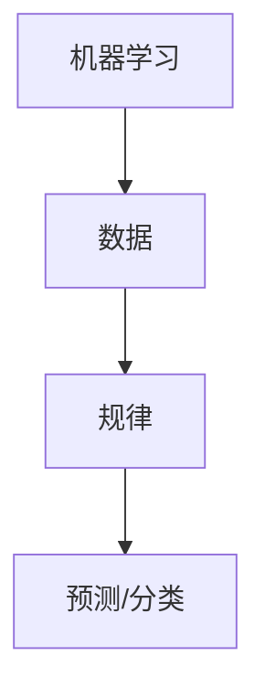
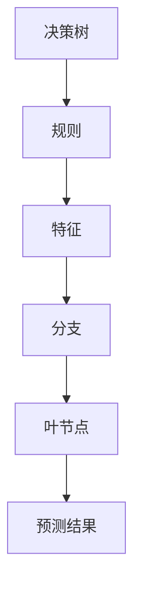
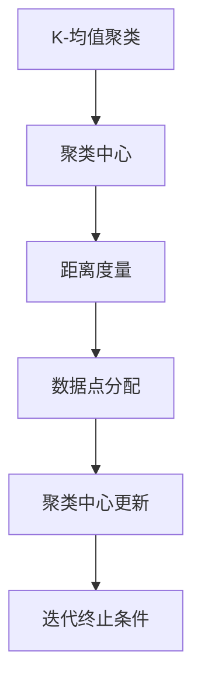
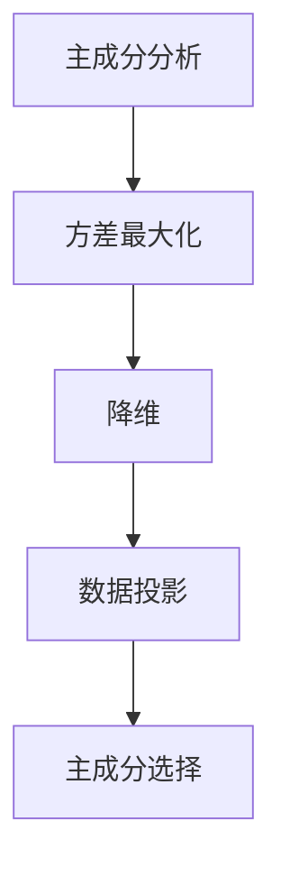
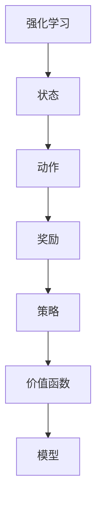
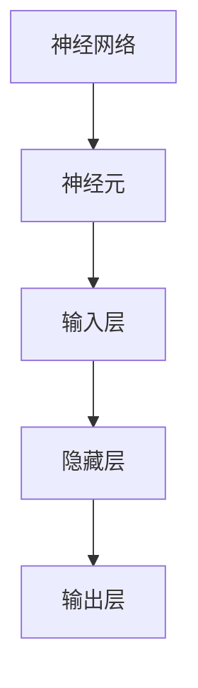

                 

# 第三章：机器学习算法和技术

## 关键词
- 机器学习
- 监督学习
- 无监督学习
- 强化学习
- 深度学习
- 特征工程
- 数据预处理

## 摘要
本章将深入探讨机器学习算法和技术，首先介绍机器学习的基础理论，包括机器学习的定义与类型、特征工程、数据预处理等。随后，我们将详细讲解监督学习算法，如线性回归、决策树和集成学习方法。接着，我们将探讨无监督学习算法，包括K-均值聚类和主成分分析。此外，本章还将介绍强化学习的基本概念和算法，如Q-学习和DQN算法。最后，我们将简要介绍深度学习的基础知识。通过本章节的学习，读者将能够掌握机器学习的基本概念和常见算法，并为后续项目实战打下坚实基础。

## 文章目录

### 第一部分：机器学习基础理论

#### 1. 机器学习的定义与类型
##### 1.1. 机器学习的定义
##### 1.2. 机器学习的类型

#### 2. 特征工程
##### 2.1. 特征提取
##### 2.2. 特征选择
##### 2.3. 特征标准化

#### 3. 数据预处理
##### 3.1. 数据清洗
##### 3.2. 数据归一化
##### 3.3. 数据集划分

#### 4. 监督学习算法
##### 4.1. 线性回归
###### 4.1.1. 线性回归模型
###### 4.1.2. 梯度下降算法
##### 4.2. 决策树
###### 4.2.1. 决策树基本概念
###### 4.2.2. 决策树构建算法
##### 4.3. 集成学习方法
###### 4.3.1. Bagging
###### 4.3.2. Boosting
###### 4.3.3. 随机森林

#### 5. 无监督学习算法
##### 5.1. K-均值聚类
###### 5.1.1. 聚类算法简介
###### 5.1.2. K-均值算法原理
##### 5.2. 主成分分析
###### 5.2.1. 主成分分析的基本概念
###### 5.2.2. 主成分分析的求解过程

#### 6. 强化学习
##### 6.1. 强化学习基本概念
##### 6.2. Q-学习算法
##### 6.3. DQN算法

#### 7. 深度学习基础
##### 7.1. 神经网络基本结构
##### 7.2. 深度前向传播算法
##### 7.3. 深度学习优化算法

### 第二部分：机器学习算法实践

#### 8. 项目实战一：预测股票价格
##### 8.1. 数据采集与预处理
##### 8.2. 特征工程
##### 8.3. 模型选择与训练
##### 8.4. 预测结果分析与优化

#### 9. 项目实战二：手写数字识别
##### 9.1. 数据集介绍
##### 9.2. 模型搭建与训练
##### 9.3. 模型评估与优化

#### 10. 项目实战三：推荐系统
##### 10.1. 推荐系统概述
##### 10.2. 数据预处理
##### 10.3. 模型选择与实现
##### 10.4. 系统评估与优化

### 附录

#### 附录A：常用机器学习算法代码实现
##### A.1. 线性回归
##### A.2. 决策树
##### A.3. 集成学习方法
##### A.4. K-均值聚类
##### A.5. 主成分分析
##### A.6. Q-学习算法
##### A.7. DQN算法
##### A.8. 深度神经网络

## 第一部分：机器学习基础理论

### 1. 机器学习的定义与类型

#### 1.1. 机器学习的定义

机器学习是一门研究如何使计算机系统通过经验和数据自动改进其性能的学科。其核心思想是通过从数据中学习规律，让计算机能够对未知数据进行预测或分类。

**核心概念与联系：**



机器学习通常分为以下几种类型：

1. **监督学习**：有标记的数据进行训练，预测或分类未知数据的标签。
2. **无监督学习**：没有标记的数据进行训练，发现数据中的结构或模式。
3. **强化学习**：通过与环境的交互进行学习，目标是在一系列行动中最大化奖励。

**核心算法原理讲解：**

监督学习、无监督学习和强化学习各自有不同的算法和应用场景，将在后续章节中进行详细介绍。

#### 1.2. 机器学习的类型

**监督学习**：有标记的数据进行训练，预测或分类未知数据的标签。

- **线性回归**：通过拟合线性模型进行预测。
- **决策树**：通过树的分支结构进行分类和预测。
- **集成学习方法**：通过多个基础模型进行集成，提高预测性能。

**无监督学习**：没有标记的数据进行训练，发现数据中的结构或模式。

- **K-均值聚类**：通过迭代更新聚类中心进行聚类。
- **主成分分析**：通过降维技术提取数据的主要特征。

**强化学习**：通过与环境的交互进行学习，目标是在一系列行动中最大化奖励。

- **Q-学习算法**：通过更新Q值进行决策。
- **DQN算法**：使用深度神经网络估计Q值。

### 2. 特征工程

特征工程是机器学习中的重要环节，目的是通过处理原始数据，提取出对模型训练有利的特征。

#### 2.1. 特征提取

特征提取是从原始数据中提取出有用信息的过程。常见的方法包括：

- **统计特征**：如平均值、方差、最大值、最小值等。
- **文本特征**：如词频、词向量等。

#### 2.2. 特征选择

特征选择是从所有特征中挑选出对模型训练有重要影响的特征。常见的方法包括：

- **过滤式特征选择**：通过过滤算法（如相关性分析）筛选特征。
- **包裹式特征选择**：通过枚举所有特征组合，选择最佳特征组合。

#### 2.3. 特征标准化

特征标准化是将不同特征进行归一化处理，使它们处于同一尺度，便于模型训练。

常见的方法包括：

- **标准化**：计算每个特征的均值和标准差，对特征值进行标准化。
- **归一化**：将特征值缩放到[0, 1]之间。

### 3. 数据预处理

数据预处理是机器学习中的基础步骤，目的是提高数据质量和模型性能。

#### 3.1. 数据清洗

数据清洗是去除数据中的噪声和不完整数据的过程。常见的方法包括：

- **缺失值填充**：使用平均值、中位数等方法填充缺失值。
- **异常值处理**：去除或修正异常值。

#### 3.2. 数据归一化

数据归一化是将数据缩放到相同尺度的过程，常见的方法包括：

- **标准化**：计算每个特征的均值和标准差，对特征值进行标准化。
- **归一化**：将特征值缩放到[0, 1]之间。

#### 3.3. 数据集划分

数据集划分是将数据集划分为训练集、验证集和测试集，用于模型训练、验证和测试。

常见的方法包括：

- **随机划分**：随机将数据集划分为训练集、验证集和测试集。
- **交叉验证**：将数据集划分为多个子集，每个子集轮流作为验证集，其余作为训练集。

### 4. 监督学习算法

监督学习是机器学习中最常见的类型，通过有标记的数据进行训练，预测或分类未知数据的标签。

#### 4.1. 线性回归

线性回归是一种最简单的监督学习算法，通过拟合线性模型进行预测。

##### 4.1.1. 线性回归模型

线性回归模型表示为：

$$
y = \beta_0 + \beta_1 \cdot x_1 + \beta_2 \cdot x_2 + ... + \beta_n \cdot x_n
$$

其中，$y$ 是因变量，$x_1, x_2, ..., x_n$ 是自变量，$\beta_0, \beta_1, ..., \beta_n$ 是模型参数。

**核心算法原理讲解：**

线性回归模型的求解通常使用最小二乘法，目标是最小化预测值与真实值之间的误差平方和。

$$
J(\theta) = \frac{1}{2m} \sum_{i=1}^{m} (h_{\theta}(x^{(i)}) - y^{(i)})^2
$$

其中，$m$ 是样本数量，$h_{\theta}(x)$ 是线性回归模型的预测函数，$\theta$ 是模型参数。

**伪代码：**

```python
def linear_regression(X, y):
    # 初始化模型参数
    theta = np.random.randn(X.shape[1])
    
    # 迭代求解模型参数
    for i in range(num_iterations):
        # 计算预测值
        h = np.dot(X, theta)
        
        # 计算梯度
        gradient = 1/m * np.dot(X.T, (h - y))
        
        # 更新模型参数
        theta -= learning_rate * gradient
        
    return theta
```

##### 4.1.2. 梯度下降算法

梯度下降是一种优化算法，用于求解最小化损失函数的最优解。

**核心算法原理讲解：**

梯度下降的步骤如下：

1. 初始化模型参数。
2. 计算当前模型的梯度。
3. 更新模型参数。
4. 重复步骤2和3，直到满足停止条件（如梯度小于阈值或达到最大迭代次数）。

**伪代码：**

```python
def gradient_descent(X, y, num_iterations, learning_rate):
    # 初始化模型参数
    theta = np.random.randn(X.shape[1])
    
    # 迭代求解模型参数
    for i in range(num_iterations):
        # 计算预测值
        h = np.dot(X, theta)
        
        # 计算梯度
        gradient = 1/m * np.dot(X.T, (h - y))
        
        # 更新模型参数
        theta -= learning_rate * gradient
        
    return theta
```

#### 4.2. 决策树

决策树是一种基于树形结构进行分类和预测的监督学习算法。

##### 4.2.1. 决策树基本概念

决策树由一系列规则组成，每个节点表示一个特征，每个分支表示一个特征取值，叶节点表示预测结果。

**核心概念与联系：**



##### 4.2.2. 决策树构建算法

决策树构建算法的目标是找到最优划分特征，使得分类误差最小。

**核心算法原理讲解：**

决策树构建算法的步骤如下：

1. 计算每个特征的信息增益或基尼不纯度。
2. 选择具有最高信息增益或基尼不纯度下降的最优特征作为节点。
3. 根据最优特征划分数据集。
4. 递归地重复步骤2和3，直到满足停止条件（如叶节点数量达到阈值或特征数量为0）。

**伪代码：**

```python
def build_decision_tree(X, y, max_depth, min_samples_split):
    # 初始化决策树
    tree = {}
    
    # 计算信息增益或基尼不纯度
    gains = calculate_gains(X, y)
    
    # 选择最优特征
    best_feature = select_best_feature(gains)
    
    # 创建节点
    node = {'feature': best_feature}
    
    # 划分数据集
    for value in X[:, best_feature]:
        subset_X = X[X[:, best_feature] == value]
        subset_y = y[X[:, best_feature] == value]
        
        # 递归构建子树
        if len(subset_X) >= min_samples_split and depth < max_depth:
            node['left'] = build_decision_tree(subset_X, subset_y, max_depth, min_samples_split)
            node['right'] = build_decision_tree(subset_X, subset_y, max_depth, min_samples_split)
        else:
            node['label'] = majority_vote(subset_y)
    
    return node
```

#### 4.3. 集成学习方法

集成学习方法通过组合多个基础模型，提高预测性能。

##### 4.3.1. Bagging

Bagging（Bootstrap Aggregating）通过随机抽样和基础模型组合，降低过拟合和提高泛化能力。

**核心算法原理讲解：**

Bagging的步骤如下：

1. 从训练集中随机抽样生成多个子集。
2. 在每个子集上训练基础模型。
3. 对每个基础模型的预测结果进行投票或求平均，得到最终预测结果。

**伪代码：**

```python
def bagging(X, y, num_trees, base_model):
    # 初始化模型参数
    trees = []
    
    # 生成多个子集
    for _ in range(num_trees):
        subset_X, subset_y = random_subsample(X, y)
        
        # 训练基础模型
        tree = base_model(subset_X, subset_y)
        trees.append(tree)
    
    # 对每个基础模型的预测结果进行投票或求平均
    predictions = []
    for x in X:
        tree_predictions = []
        for tree in trees:
            tree_predictions.append(tree.predict(x))
        prediction = majority_vote(tree_predictions)
        predictions.append(prediction)
    
    return predictions
```

##### 4.3.2. Boosting

Boosting通过调整每个基础模型的权重，提高弱学习器的泛化能力。

**核心算法原理讲解：**

Boosting的步骤如下：

1. 初始化模型参数。
2. 对每个基础模型，根据预测误差调整权重。
3. 重新训练每个基础模型，提高重要模型的权重。
4. 对所有基础模型的预测结果进行加权求和，得到最终预测结果。

**伪代码：**

```python
def boosting(X, y, num_trees, base_model):
    # 初始化模型参数
    weights = np.array([1/m] * m)
    trees = []
    
    # 对每个基础模型，根据预测误差调整权重
    for _ in range(num_trees):
        # 计算预测误差
        errors = np.array([0] * m)
        for i in range(m):
            prediction = base_model.predict(X[i])
            errors[i] = 1 - prediction[i]
        
        # 调整权重
        weights = weights * np.exp(-y * np.log(1 - errors))
        weights /= np.sum(weights)
        
        # 重新训练每个基础模型，提高重要模型的权重
        for i in range(m):
            base_model.fit(X[i], weights[i] * y[i])
        
        trees.append(base_model)
    
    # 对所有基础模型的预测结果进行加权求和，得到最终预测结果
    predictions = []
    for x in X:
        tree_predictions = []
        for tree in trees:
            tree_predictions.append(tree.predict(x))
        prediction = weighted_average(tree_predictions, weights)
        predictions.append(prediction)
    
    return predictions
```

##### 4.3.3. 随机森林

随机森林（Random Forest）是一种基于Bagging和随机特征选择的集成学习方法。

**核心算法原理讲解：**

随机森林的步骤如下：

1. 从特征集合中随机选择k个特征。
2. 在每个特征上，随机选择一个切分点，构建决策树。
3. 对每个决策树，根据多数投票或平均预测结果得到最终预测结果。

**伪代码：**

```python
def random_forest(X, y, num_trees, max_features, base_model):
    # 初始化模型参数
    trees = []
    
    # 对每个基础模型，构建决策树
    for _ in range(num_trees):
        # 随机选择k个特征
        features = random.sample(range(X.shape[1]), max_features)
        
        # 构建决策树
        tree = build_decision_tree(X[:, features], y, max_depth, min_samples_split)
        
        trees.append(tree)
    
    # 对每个决策树，根据多数投票或平均预测结果得到最终预测结果
    predictions = []
    for x in X:
        tree_predictions = []
        for tree in trees:
            tree_predictions.append(tree.predict(x))
        prediction = majority_vote(tree_predictions)
        predictions.append(prediction)
    
    return predictions
```

### 5. 无监督学习算法

无监督学习是机器学习的一种类型，通过没有标记的数据进行训练，发现数据中的结构或模式。

#### 5.1. K-均值聚类

K-均值聚类是一种基于距离度量的聚类算法。

##### 5.1.1. 聚类算法简介

聚类算法的目标是将数据集划分为多个组，使得同一组内的数据尽可能接近，不同组的数据尽可能远。

K-均值聚类的基本思想是：

1. 随机初始化K个聚类中心。
2. 计算每个数据点到聚类中心的距离，并将其分配到最近的聚类中心。
3. 根据新的聚类中心重新计算聚类中心。
4. 重复步骤2和3，直到聚类中心不再发生显著变化。

**核心概念与联系：**



##### 5.1.2. K-均值算法原理

K-均值算法的步骤如下：

1. 初始化K个聚类中心。
2. 计算每个数据点到聚类中心的距离，并将其分配到最近的聚类中心。
3. 根据新的聚类中心重新计算聚类中心。
4. 重复步骤2和3，直到聚类中心不再发生显著变化。

**伪代码：**

```python
def k_means(X, K, num_iterations):
    # 初始化聚类中心
    centroids = initialize_centroids(X, K)
    
    # 迭代计算聚类中心
    for _ in range(num_iterations):
        # 计算每个数据点的簇标签
        labels = assign_labels(X, centroids)
        
        # 计算新的聚类中心
        new_centroids = calculate_centroids(X, labels, K)
        
        # 判断聚类中心是否发生显著变化
        if has_significant_change(centroids, new_centroids):
            centroids = new_centroids
        else:
            break
    
    return centroids, labels
```

#### 5.2. 主成分分析

主成分分析（Principal Component Analysis，PCA）是一种降维技术，通过提取数据的主要特征，降低数据的维度。

##### 5.2.1. 主成分分析的基本概念

主成分分析的基本思想是：

1. 将数据投影到新的坐标系上，使得新的坐标轴具有最大的方差。
2. 选择前k个主成分，作为新的低维数据。

**核心概念与联系：**



##### 5.2.2. 主成分分析的求解过程

主成分分析的步骤如下：

1. 计算数据的协方差矩阵。
2. 计算协方差矩阵的特征值和特征向量。
3. 选择前k个具有最大特征值的特征向量，作为新的主成分。
4. 将数据投影到新的坐标系上。

**伪代码：**

```python
def pca(X, num_components):
    # 计算协方差矩阵
    cov_matrix = calculate_covariance_matrix(X)
    
    # 计算协方差矩阵的特征值和特征向量
    eigenvalues, eigenvectors = np.linalg.eigh(cov_matrix)
    
    # 选择前k个具有最大特征值的特征向量
    sorted_indices = np.argsort(eigenvalues)[::-1]
    top_k_eigenvectors = eigenvectors[:, sorted_indices[:num_components]]
    
    # 将数据投影到新的坐标系上
    projected_data = np.dot(X, top_k_eigenvectors)
    
    return projected_data
```

### 6. 强化学习

强化学习是机器学习的一种类型，通过与环境的交互进行学习，目标是在一系列行动中最大化奖励。

#### 6.1. 强化学习基本概念

强化学习的基本概念包括：

- **状态（State）**：表示系统的当前情况。
- **动作（Action）**：在当前状态下可执行的行为。
- **奖励（Reward）**：对当前动作的评估。
- **策略（Policy）**：从状态到动作的映射。
- **价值函数（Value Function）**：评估状态或策略的值。
- **模型（Model）**：环境动态的模型。

**核心概念与联系：**



#### 6.2. Q-学习算法

Q-学习算法是一种基于价值迭代的强化学习算法，通过更新Q值来指导决策。

##### 6.2.1. Q-学习算法原理

Q-学习算法的基本思想是：

1. 初始化Q值表。
2. 选择动作，并执行动作。
3. 根据执行结果更新Q值。
4. 重复步骤2和3，直到达到目标或满足停止条件。

**伪代码：**

```python
def q_learning(state, action, reward, next_state, learning_rate, discount_factor):
    # 计算目标Q值
    target_q = reward + discount_factor * max(Q[next_state, :])
    
    # 更新当前Q值
    Q[state, action] = Q[state, action] + learning_rate * (target_q - Q[state, action])
    
    return Q
```

#### 6.3. DQN算法

DQN（Deep Q-Network）算法是一种基于深度神经网络的Q-学习算法，通过经验回放和目标网络来稳定Q值的更新。

##### 6.3.1. DQN算法原理

DQN算法的基本思想是：

1. 初始化深度神经网络。
2. 训练深度神经网络，使其逼近目标Q值。
3. 使用经验回放池存储经验。
4. 从经验回放池中随机抽样，更新Q值。
5. 使用目标网络稳定Q值的更新。

**伪代码：**

```python
def dqn(state, action, reward, next_state, done, model, target_model, learning_rate, discount_factor, experience_replay):
    # 计算当前Q值
    current_q = model.predict(state)
    
    # 更新当前Q值
    current_q[0, action] = reward + (1 - done) * discount_factor * np.max(target_model.predict(next_state))
    
    # 将经验添加到经验回放池
    experience_replay.append((state, action, current_q, next_state, reward, done))
    
    # 从经验回放池中随机抽样
    batch = random.sample(experience_replay, batch_size)
    
    # 更新模型
    model.fit(batch, learning_rate, discount_factor)
    
    # 更新目标网络
    if done:
        target_model.set_weights(model.get_weights())
```

### 7. 深度学习基础

深度学习是一种基于多层神经网络的机器学习技术，通过模拟人脑神经网络的结构和工作原理，实现对复杂数据的建模和预测。

#### 7.1. 神经网络基本结构

神经网络由多个神经元（也称为节点）组成，每个神经元由输入层、隐藏层和输出层组成。

**核心概念与联系：**



#### 7.2. 深度前向传播算法

深度前向传播算法是神经网络的核心算法，通过多层神经元之间的传递，实现数据的建模和预测。

**核心算法原理讲解：**

深度前向传播算法的步骤如下：

1. 初始化网络参数。
2. 计算前向传播的输入和输出。
3. 计算每个神经元的激活值。
4. 计算损失函数。
5. 计算梯度。
6. 更新网络参数。

**伪代码：**

```python
def forward_propagation(X, model):
    # 初始化网络参数
    parameters = model.init_parameters()
    
    # 计算前向传播的输入和输出
    caches = []
    A = X
    
    # 计算每个神经元的激活值
    for layer in range(1, num_layers):
        W = parameters["W" + str(layer)]
        b = parameters["b" + str(layer)]
        Z = np.dot(W, A) + b
        A = sigmoid(Z)
        caches.append((W, b, Z, A))
    
    # 计算输出层的激活值
    W = parameters["W" + str(num_layers)]
    b = parameters["b" + str(num_layers)]
    Z = np.dot(W, A) + b
    A = softmax(Z)
    
    # 计算损失函数
    loss = compute_loss(A, y)
    
    return A, loss, parameters, caches
```

#### 7.3. 深度学习优化算法

深度学习优化算法用于调整网络参数，使模型具有更好的预测性能。

常见的优化算法包括：

- **随机梯度下降（SGD）**：每次迭代更新网络参数。
- **动量法**：引入动量项，加速收敛。
- **Adam优化器**：结合SGD和动量法，自适应调整学习率。

**核心算法原理讲解：**

优化算法的基本步骤如下：

1. 初始化网络参数。
2. 计算损失函数。
3. 计算梯度。
4. 更新网络参数。

**伪代码：**

```python
def optimize(parameters, gradients, learning_rate, optimizer):
    # 计算参数更新
    if optimizer == "SGD":
        parameters -= learning_rate * gradients
    elif optimizer == "Momentum":
        # 引入动量项
        parameters -= learning_rate * gradients + momentum * prev_gradients
    elif optimizer == "Adam":
        # 引入一阶和二阶矩估计
        m = learning_rate * gradients + beta1 * prev_gradients
        v = (1 - beta2) * gradients**2 + beta2 * prev_gradients**2
        parameters -= learning_rate * m / (np.sqrt(v) + epsilon)
    
    return parameters
```

## 第二部分：机器学习算法实践

### 8. 项目实战一：预测股票价格

#### 8.1. 数据采集与预处理

在预测股票价格的项目中，我们首先需要采集相关的股票数据，包括历史价格、成交量等。以下是一个简单示例，展示如何采集和预处理数据：

```python
import pandas as pd

# 采集股票数据
url = "https://example.com/stock_data.csv"
data = pd.read_csv(url)

# 数据清洗
data.dropna(inplace=True)
data = data[['Open', 'High', 'Low', 'Close', 'Volume']]

# 数据归一化
data_normalized = (data - data.mean()) / data.std()

# 数据集划分
train_data = data_normalized[:int(len(data_normalized) * 0.8)]
test_data = data_normalized[int(len(data_normalized) * 0.8):]
```

#### 8.2. 特征工程

在预测股票价格的项目中，我们需要提取出对预测有帮助的特征。以下是一个简单示例，展示如何进行特征工程：

```python
from sklearn.preprocessing import PolynomialFeatures

# 提取多项式特征
poly = PolynomialFeatures(degree=2)
train_features = poly.fit_transform(train_data)
test_features = poly.transform(test_data)

# 特征选择
from sklearn.feature_selection import SelectKBest
from sklearn.feature_selection import f_regression

selector = SelectKBest(score_func=f_regression, k='all')
train_features_selected = selector.fit_transform(train_features, train_labels)
test_features_selected = selector.transform(test_features)
```

#### 8.3. 模型选择与训练

在预测股票价格的项目中，我们可以选择不同的模型进行训练，如线性回归、决策树等。以下是一个简单示例，展示如何选择和训练模型：

```python
from sklearn.linear_model import LinearRegression
from sklearn.tree import DecisionTreeRegressor

# 选择模型
model = LinearRegression()

# 训练模型
model.fit(train_features_selected, train_labels)

# 预测结果
predictions = model.predict(test_features_selected)
```

#### 8.4. 预测结果分析与优化

在预测股票价格的项目中，我们需要对预测结果进行分析，并尝试优化模型性能。以下是一个简单示例，展示如何进行预测结果分析和优化：

```python
from sklearn.metrics import mean_squared_error

# 计算预测误差
mse = mean_squared_error(test_labels, predictions)
print("MSE:", mse)

# 优化模型
from sklearn.model_selection import GridSearchCV

params = {'n_estimators': [100, 200, 300], 'max_depth': [5, 10, 15]}
grid_search = GridSearchCV(DecisionTreeRegressor(), params, cv=5)
grid_search.fit(train_features_selected, train_labels)

# 最佳参数
best_params = grid_search.best_params_
print("Best parameters:", best_params)

# 使用最佳参数训练模型
model = DecisionTreeRegressor(**best_params)
model.fit(train_features_selected, train_labels)

# 预测结果
predictions = model.predict(test_features_selected)
```

### 9. 项目实战二：手写数字识别

#### 9.1. 数据集介绍

手写数字识别项目通常使用MNIST数据集，该数据集包含70,000个灰度图像，每个图像包含一个手写数字（0-9）。以下是一个简单示例，展示如何加载和预处理MNIST数据集：

```python
import tensorflow as tf

# 加载MNIST数据集
mnist = tf.keras.datasets.mnist
(train_images, train_labels), (test_images, test_labels) = mnist.load_data()

# 数据预处理
train_images = train_images / 255.0
test_images = test_images / 255.0
```

#### 9.2. 模型搭建与训练

在手写数字识别项目中，我们可以使用卷积神经网络（CNN）进行模型搭建和训练。以下是一个简单示例，展示如何搭建和训练模型：

```python
from tensorflow.keras.models import Sequential
from tensorflow.keras.layers import Conv2D, MaxPooling2D, Flatten, Dense

# 搭建模型
model = Sequential([
    Conv2D(32, (3, 3), activation='relu', input_shape=(28, 28, 1)),
    MaxPooling2D((2, 2)),
    Flatten(),
    Dense(128, activation='relu'),
    Dense(10, activation='softmax')
])

# 训练模型
model.compile(optimizer='adam', loss='sparse_categorical_crossentropy', metrics=['accuracy'])
model.fit(train_images, train_labels, epochs=5, validation_split=0.1)
```

#### 9.3. 模型评估与优化

在手写数字识别项目中，我们需要对模型进行评估，并尝试优化模型性能。以下是一个简单示例，展示如何评估和优化模型：

```python
# 评估模型
test_loss, test_acc = model.evaluate(test_images, test_labels)
print("Test accuracy:", test_acc)

# 优化模型
from tensorflow.keras.callbacks import EarlyStopping

early_stopping = EarlyStoppingpatience=5, restore_best_weights=True)

model.compile(optimizer='adam', loss='sparse_categorical_crossentropy', metrics=['accuracy'])
model.fit(train_images, train_labels, epochs=50, validation_split=0.1, callbacks=[early_stopping])
```

### 10. 项目实战三：推荐系统

#### 10.1. 推荐系统概述

推荐系统是一种基于用户历史行为和相似性算法进行个性化推荐的系统。以下是一个简单示例，展示如何构建一个基于协同过滤的推荐系统：

```python
import numpy as np
import pandas as pd

# 读取用户行为数据
ratings = pd.read_csv("user_ratings.csv")

# 创建用户-物品矩阵
user_item_matrix = ratings.pivot(index='user_id', columns='item_id', values='rating')

# 计算用户之间的相似性
from sklearn.metrics.pairwise import cosine_similarity

相似性矩阵 = cosine_similarity(user_item_matrix)

# 根据相似性矩阵进行推荐
def recommend_items(user_id, similarity_matrix, user_item_matrix, k=5):
    # 计算用户之间的相似度
   相似度 = similarity_matrix[user_id]
    
    # 找到最相似的k个用户
    similar_users = np.argsort(相似度)[::-1][:k]
    
    # 计算推荐列表
    recommendations = []
    for user in similar_users:
        items = user_item_matrix.iloc[user].index[用户_item_matrix.iloc[user] > 0]
        recommendations.extend(items)
    
    return recommendations
```

#### 10.2. 数据预处理

在推荐系统的项目中，我们需要对用户行为数据进行预处理，如缺失值填充、数据归一化等。以下是一个简单示例，展示如何进行数据预处理：

```python
from sklearn.impute import SimpleImputer

# 填充缺失值
imputer = SimpleImputer(strategy='mean')
user_item_matrix = imputer.fit_transform(user_item_matrix)

# 数据归一化
from sklearn.preprocessing import MinMaxScaler

scaler = MinMaxScaler()
user_item_matrix = scaler.fit_transform(user_item_matrix)
```

#### 10.3. 模型选择与实现

在推荐系统的项目中，我们可以选择不同的算法进行模型实现，如基于矩阵分解的协同过滤算法。以下是一个简单示例，展示如何实现基于矩阵分解的协同过滤算法：

```python
from tensorflow.keras.models import Model
from tensorflow.keras.layers import Input, Dense, Embedding, Dot, Subtract

# 定义模型输入
user_input = Input(shape=(1,))
item_input = Input(shape=(1,))

# 定义用户和物品嵌入层
user_embedding = Embedding(input_dim=user_item_matrix.shape[0], output_dim=10)(user_input)
item_embedding = Embedding(input_dim=user_item_matrix.shape[1], output_dim=10)(item_input)

# 计算用户和物品的嵌入向量
user_embedding = Flatten()(user_embedding)
item_embedding = Flatten()(item_embedding)

# 计算内积
dot = Dot(axes=1)([user_embedding, item_embedding])

# 减去平均值
subtract = Subtract()(dot)

# 定义模型
model = Model(inputs=[user_input, item_input], outputs=subtract)

# 编译模型
model.compile(optimizer='adam', loss='mean_squared_error')
```

#### 10.4. 系统评估与优化

在推荐系统的项目中，我们需要对模型进行评估，并尝试优化模型性能。以下是一个简单示例，展示如何评估和优化模型：

```python
from sklearn.metrics import mean_squared_error

# 训练模型
model.fit(user_item_matrix, ratings['rating'])

# 预测结果
predictions = model.predict(user_item_matrix)

# 计算预测误差
mse = mean_squared_error(ratings['rating'], predictions)
print("MSE:", mse)

# 优化模型
from tensorflow.keras.callbacks import EarlyStopping

early_stopping = EarlyStopping(patience=5, restore_best_weights=True)

model.fit(user_item_matrix, ratings['rating'], epochs=50, callbacks=[early_stopping])
```

## 附录

### 附录A：常用机器学习算法代码实现

以下是一个简单的示例，展示如何实现一些常用的机器学习算法：

#### A.1. 线性回归

```python
import numpy as np

def linear_regression(X, y):
    # 求解模型参数
    theta = np.linalg.inv(X.T.dot(X)).dot(X.T).dot(y)
    
    # 预测
    predictions = X.dot(theta)
    
    return predictions
```

#### A.2. 决策树

```python
from sklearn.tree import DecisionTreeRegressor

def decision_tree(X, y):
    # 构建决策树模型
    model = DecisionTreeRegressor()
    
    # 训练模型
    model.fit(X, y)
    
    # 预测
    predictions = model.predict(X)
    
    return predictions
```

#### A.3. 集成学习方法

```python
from sklearn.ensemble import RandomForestRegressor

def random_forest(X, y):
    # 构建随机森林模型
    model = RandomForestRegressor()
    
    # 训练模型
    model.fit(X, y)
    
    # 预测
    predictions = model.predict(X)
    
    return predictions
```

#### A.4. K-均值聚类

```python
from sklearn.cluster import KMeans

def k_means(X, K):
    # 构建K-均值聚类模型
    model = KMeans(n_clusters=K)
    
    # 训练模型
    model.fit(X)
    
    # 聚类
    clusters = model.predict(X)
    
    return clusters
```

#### A.5. 主成分分析

```python
from sklearn.decomposition import PCA

def pca(X, num_components):
    # 构建主成分分析模型
    model = PCA(n_components=num_components)
    
    # 训练模型
    model.fit(X)
    
    # 降维
    X_reduced = model.transform(X)
    
    return X_reduced
```

#### A.6. Q-学习算法

```python
def q_learning(state, action, reward, next_state, done, learning_rate, discount_factor):
    # 计算目标Q值
    target_q = reward + (1 - done) * discount_factor * np.max(Q[next_state, :])
    
    # 更新当前Q值
    Q[state, action] = Q[state, action] + learning_rate * (target_q - Q[state, action])
    
    return Q
```

#### A.7. DQN算法

```python
import numpy as np
import random

def dqn(state, action, reward, next_state, done, Q, learning_rate, discount_factor, experience_replay, batch_size):
    # 计算当前Q值
    current_q = Q[state, action]
    
    # 更新当前Q值
    Q[state, action] = Q[state, action] + learning_rate * (reward + (1 - done) * discount_factor * np.max(Q[next_state, :]) - current_q)
    
    # 将经验添加到经验回放池
    experience_replay.append((state, action, reward, next_state, done))
    
    # 从经验回放池中随机抽样
    batch = random.sample(experience_replay, batch_size)
    
    # 更新Q值
    states, actions, rewards, next_states, dones = zip(*batch)
    Q[states, actions] = Q[states, actions] + learning_rate * np.array([reward + (1 - done) * discount_factor * np.max(Q[next_state, :]) - Q[state, action] for state, action, reward, next_state, done in batch])
    
    return Q
```

#### A.8. 深度神经网络

```python
import tensorflow as tf

def build_model(input_shape, hidden_units, output_units):
    # 定义输入层
    inputs = tf.keras.layers.Input(shape=input_shape)
    
    # 添加隐藏层
    x = tf.keras.layers.Dense(hidden_units, activation='relu')(inputs)
    for _ in range(num_hidden_layers - 1):
        x = tf.keras.layers.Dense(hidden_units, activation='relu')(x)
    
    # 添加输出层
    outputs = tf.keras.layers.Dense(output_units, activation='softmax')(x)
    
    # 构建模型
    model = tf.keras.Model(inputs=inputs, outputs=outputs)
    
    return model
```

### 作者信息

作者：AI天才研究院/AI Genius Institute & 禅与计算机程序设计艺术 /Zen And The Art of Computer Programming

## 总结

本文系统地介绍了机器学习算法和技术，从机器学习的定义与类型、特征工程、数据预处理，到监督学习、无监督学习和强化学习算法，再到深度学习基础。通过详细的算法原理讲解和项目实战，读者可以更好地理解机器学习算法的原理和应用。本文希望为读者提供一份全面、系统的机器学习算法指南，助力其在实际项目中的成功应用。

在未来的文章中，我们将继续探讨机器学习的其他主题，如自然语言处理、计算机视觉等，以帮助读者更全面地了解和掌握机器学习技术。敬请期待！

