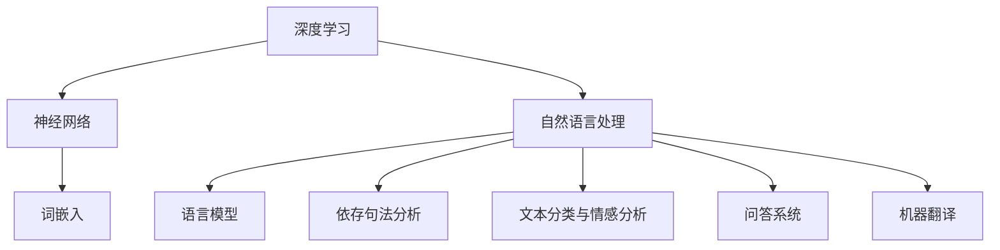

                 

# 文章标题

## 第五章：自然语言处理基础

自然语言处理（NLP）是计算机科学、人工智能和语言学等领域交叉的学科。它涉及到让计算机理解、生成和处理人类语言，旨在使计算机具备类似人类的语言理解和交互能力。NLP在许多领域都有广泛的应用，如搜索引擎、机器翻译、语音识别、情感分析等。本章将介绍NLP的基础知识，包括其定义、发展历程、基础技术原理、核心算法以及应用实例。

> 关键词：自然语言处理，NLP，词向量，语言模型，文本分类，情感分析，问答系统，机器翻译，应用实例

> 摘要：本章将深入探讨自然语言处理的基础知识，包括NLP的定义与重要性、基础技术原理、核心算法、文本分类与情感分析、问答系统、机器翻译以及应用实例。通过本章节的学习，读者可以全面了解NLP的核心概念和技术原理，为后续深入研究打下坚实基础。

## 1. 自然语言处理简介

### 1.1 NLP的定义与重要性

自然语言处理（NLP）是研究如何让计算机理解、生成和处理人类语言的学科。它涉及到对自然语言（如英语、汉语等）的语法、语义、语音和语用等方面的分析和处理。

NLP的重要性体现在多个方面：

1. **信息获取和处理**：随着互联网的快速发展，大量信息以文本形式存在。NLP可以帮助计算机自动处理和理解这些信息，从而更高效地获取和处理知识。

2. **人机交互**：NLP技术可以使计算机具备与人类自然语言交流的能力，从而改善人机交互体验。

3. **智能应用**：NLP技术广泛应用于各种智能应用，如智能客服、智能推荐、智能翻译等，极大地提升了应用程序的智能化水平。

### 1.2 NLP的发展历程

NLP的发展历程可以分为以下几个阶段：

1. **规则方法**（1960s-1980s）：早期NLP研究主要采用基于规则的方法，通过手工编写复杂的语法规则来解析和生成语言。然而，这种方法在处理复杂和多样化语言时效果有限。

2. **统计方法**（1980s-2000s）：随着计算机性能的提高和大量语料库的积累，统计方法逐渐成为NLP的主流。统计方法通过学习大量语料库中的语言规律，自动生成语言模型，提高了语言处理的准确性和泛化能力。

3. **深度学习方法**（2000s至今）：深度学习在图像处理、语音识别等领域取得了显著成果，也逐渐应用到NLP领域。深度学习方法通过神经网络结构，自动学习语言特征和模式，使得NLP在文本分类、情感分析、机器翻译等方面取得了突破性进展。

## 2. 基础技术原理

### 2.1 词向量表示

词向量表示是将单词映射到高维空间中的向量表示方法。词向量可以捕获单词的语义和语法信息，是NLP中的关键技术之一。

#### 2.1.1 词袋模型

词袋模型（Bag-of-Words, BoW）是最简单的词向量表示方法。它将文本表示为单词的集合，不考虑单词的顺序和语法结构。词袋模型的核心思想是将文本转换为向量，其中每个维度对应一个单词，向量中1表示该单词在文本中出现过，0表示没有出现。

#### 2.1.2 词嵌入

词嵌入（Word Embedding）是一种将单词映射到低维空间中的向量表示方法，能够更好地捕获单词的语义和语法信息。词嵌入方法通常使用神经网络进行学习，通过对大量文本数据的学习，自动学习单词的向量表示。

#### 2.1.3 词嵌入算法：Word2Vec、GloVe

- **Word2Vec**：Word2Vec是一种基于神经网络的词嵌入算法，通过学习单词的上下文信息来生成词向量。Word2Vec主要有两种模型：连续词袋（Continuous Bag-of-Words, CBOW）和Skip-Gram（SG）。

  - **CBOW**：CBOW模型通过预测中心词周围的多个词来生成词向量。具体来说，给定一个中心词，CBOW模型预测其上下文词的概率分布。

    $$ \text{P}(\text{context}|\text{word}) = \text{softmax}(\text{W}\text{context vector}) $$

    其中，$\text{context vector}$ 是中心词的词向量，$\text{W}$ 是权重矩阵。

  - **SG**：Skip-Gram模型通过预测单词周围的多个单词来生成词向量。具体来说，给定一个单词，SG模型预测其上下文单词的概率分布。

    $$ \text{P}(\text{word}|\text{context}) = \text{softmax}(\text{W}\text{word vector}) $$

- **GloVe**：GloVe（Global Vectors for Word Representation）是一种基于全局平均和矩阵分解的词嵌入算法。GloVe通过学习单词的共现矩阵来生成词向量，能够更好地捕获单词的语义关系。

    $$ \text{F} = \frac{1}{\text{N} \cdot \text{V}^2} \sum_{\text{t}, \text{c} \in \text{D}} \sqrt{\text{f}_\text{t} \cdot \text{f}_\text{c}} \cdot \text{e}_\text{t} \text{c}_\text{c}^T $$

    其中，$\text{f}_\text{t}$ 和 $\text{f}_\text{c}$ 分别是单词 $\text{t}$ 和单词 $\text{c}$ 的词频，$\text{e}_\text{t}$ 是单词 $\text{t}$ 的词向量，$\text{c}_\text{c}^T$ 是单词 $\text{c}$ 的词向量。

### 2.2 文本预处理

文本预处理是NLP中的关键步骤，包括偏差修正、文本清洗、分词等。

#### 2.2.1 偏差修正

偏差修正是指通过调整词频统计，消除语言数据中的偏差，使得词频统计更加准确和有意义。常见的偏差修正方法包括停用词去除、词形还原、词干提取等。

#### 2.2.2 文本清洗

文本清洗是指去除文本中的噪声和无关信息，以提高文本质量。常见的文本清洗方法包括去除HTML标签、消除特殊字符、标点符号等。

#### 2.2.3 分词

分词是将文本分割成单词或短语的过程。常见的分词方法包括基于规则的分词、基于统计的分词和基于深度学习的分词。基于规则的分词方法通过手工编写的规则进行分词，如正则表达式分词；基于统计的分词方法通过统计方法进行分词，如最大匹配分词；基于深度学习的分词方法通过神经网络模型进行分词，如序列标注模型。

## 3. NLP核心算法

### 3.1 语言模型

语言模型（Language Model）是NLP中的核心算法，用于预测文本的下一个单词或序列。语言模型在文本分类、信息检索、机器翻译等任务中具有重要应用。

#### 3.1.1 隐马尔可夫模型（HMM）

隐马尔可夫模型（Hidden Markov Model, HMM）是一种统计模型，用于处理具有时间依赖性的序列数据。HMM假设当前状态仅依赖于前一个状态，并且每个状态的概率分布是独立的。

- **状态转移概率**：$ \text{P}(\text{s}_{t}|\text{s}_{t-1}) $

- **观测概率**：$ \text{P}(\text{o}_{t}|\text{s}_{t}) $

- **初始状态概率**：$ \text{P}(\text{s}_{0}) $

通过最大化似然函数，可以使用HMM进行语言模型的训练和预测。

$$ \text{P}(\text{o}) = \sum_{\text{s}} \text{P}(\text{o}|\text{s}) \text{P}(\text{s}) $$

#### 3.1.2 基于神经网络的概率模型：RNN、LSTM、GRU

循环神经网络（Recurrent Neural Network, RNN）是一种能够处理序列数据的神经网络模型。RNN通过在时间步之间共享参数来捕获序列信息。

- **输入门**：用于控制当前输入和隐藏状态之间的关系。

  $$ \text{g}_{t} = \text{sigmoid}(\text{W}_\text{g}[\text{h}_{t-1}; \text{x}_t]) $$

- **遗忘门**：用于控制隐藏状态的遗忘信息。

  $$ \text{f}_{t} = \text{sigmoid}(\text{W}_\text{f}[\text{h}_{t-1}; \text{x}_t]) $$

- **输出门**：用于控制隐藏状态和输出之间的关系。

  $$ \text{o}_{t} = \text{sigmoid}(\text{W}_\text{o}[\text{h}_{t-1}; \text{x}_t]) $$

通过门控机制，LSTM能够有效地捕获序列中的长期依赖信息。

门控循环单元（Gated Recurrent Unit, GRU）是LSTM的一种变体，通过简化LSTM的结构，提高了计算效率和收敛速度。

GRU包含两个门控机制：更新门和重置门。

- **更新门**：用于控制新旧信息的更新。

  $$ \text{z}_{t} = \text{sigmoid}(\text{W}_\text{z}[\text{h}_{t-1}; \text{x}_t]) $$

- **重置门**：用于控制新旧信息的重置。

  $$ \text{r}_{t} = \text{sigmoid}(\text{W}_\text{r}[\text{h}_{t-1}; \text{x}_t]) $$

$$ \text{h}_{t} = \text{tanh}((1 - \text{z}_{t}) \text{o}_{t-1} + \text{r}_{t} \text{o}_{t-1}) $$

### 3.2 依存句法分析

依存句法分析（Dependency Parsing）是NLP中用于分析句子中词汇之间的依存关系的方法。依存句法分析可以揭示句子的语法结构，为NLP应用提供重要信息。

#### 3.2.1 基于规则的方法

基于规则的方法通过手工编写的语法规则进行句法分析。这种方法通常包括一组产生式规则，用于将句子分解为词汇和依存关系。

#### 3.2.2 基于统计的方法

基于统计的方法通过学习大量已标注的语料库，自动生成句法分析模型。常见的统计方法包括最大熵模型、条件随机场（Conditional Random Field, CRF）等。

#### 3.2.3 基于深度学习的方法

基于深度学习的方法通过神经网络模型进行句法分析。常见的深度学习方法包括循环神经网络（RNN）、长短时记忆网络（LSTM）、门控循环单元（GRU）等。

## 4. 文本分类与情感分析

### 4.1 文本分类

文本分类（Text Classification）是一种将文本分为预定义类别的方法。常见的文本分类方法包括基于朴素贝叶斯、支持向量机（SVM）和深度学习的方法。

#### 4.1.1 基于朴素贝叶斯的分类

朴素贝叶斯（Naive Bayes）是一种基于贝叶斯定理的简单概率分类器。它假设特征之间相互独立，并通过最大化后验概率来预测类别。

$$ \text{P}(\text{y}|\text{x}) = \frac{\text{P}(\text{x}|\text{y}) \text{P}(\text{y})}{\text{P}(\text{x})} $$

通过最大化后验概率，朴素贝叶斯可以预测文本的类别。

#### 4.1.2 基于支持向量机的分类

支持向量机（Support Vector Machine, SVM）是一种基于最大间隔的分类器。它通过找到一个超平面，将不同类别的文本数据最大化地分开。

$$ \text{w} = \arg \max_{\text{w}, \text{b}} \frac{1}{\|\text{w}\|_2} \quad \text{subject to} \quad y_i (\text{w}^T \text{x}_i + \text{b}) \geq 1 $$

通过求解优化问题，支持向量机可以预测文本的类别。

#### 4.1.3 基于深度学习的分类

基于深度学习的方法通过神经网络模型进行文本分类。常见的深度学习方法包括卷积神经网络（CNN）、循环神经网络（RNN）和长短时记忆网络（LSTM）等。

### 4.2 情感分析

情感分析（Sentiment Analysis）是一种自动检测文本情感极性和情感强度的方法。常见的情感分析方法包括情感极性分类、情感强度分析和基于深度学习的方法。

#### 4.2.1 情感极性分类

情感极性分类（Sentiment Polarity Classification）是一种将文本分为正面、负面或中立情感类别的分类方法。常见的情感极性分类方法包括基于朴素贝叶斯、支持向量机和深度学习的方法。

#### 4.2.2 情感强度分析

情感强度分析（Sentiment Intensity Analysis）是一种测量文本情感极性强度的方法。常见的情感强度分析方法包括基于词频统计、情感词典和情感强度模型等。

#### 4.2.3 基于深度学习的情感分析

基于深度学习的方法通过神经网络模型进行情感分析。常见的深度学习方法包括卷积神经网络（CNN）、循环神经网络（RNN）和长短时记忆网络（LSTM）等。

## 5. 问答系统

问答系统（Question Answering System）是一种自动回答用户问题的方法。问答系统通常包括关键词提取、问题理解、答案生成和答案评估等步骤。

### 5.1 问答系统概述

问答系统可以分为两种类型：基于知识库的问答系统和基于机器学习的问答系统。

- **基于知识库的问答系统**：通过构建知识库和规则来回答用户问题。这种方法通常需要对问题进行严格的结构化，以匹配知识库中的事实和规则。

- **基于机器学习的问答系统**：通过机器学习算法自动学习问题和答案之间的关系，以回答用户问题。这种方法通常不需要对问题进行结构化，能够处理自然语言问题。

### 5.2 关键词提取

关键词提取（Keyword Extraction）是问答系统的第一步，用于从用户问题中提取关键信息，以便后续的问题理解和答案生成。

- **基于规则的方法**：通过手工编写的规则从问题中提取关键词，如使用正则表达式提取特定格式的关键词。

- **基于机器学习的方法**：通过机器学习算法自动学习关键词的提取规则，如使用支持向量机（SVM）进行关键词提取。

### 5.3 问题理解

问题理解（Question Understanding）是问答系统的关键步骤，用于理解用户问题的语义和意图，以便生成合适的答案。

- **基于知识库的方法**：通过匹配用户问题和知识库中的事实和规则，理解问题的语义和意图。

- **基于机器学习的方法**：通过机器学习算法自动学习问题的语义和意图，如使用循环神经网络（RNN）和长短时记忆网络（LSTM）进行问题理解。

### 5.4 答案生成

答案生成（Answer Generation）是问答系统的核心步骤，用于生成与用户问题相关的答案。

- **基于模板的方法**：通过使用预定义的模板生成答案，如基于模板的生成模型（Template-based Answer Generation）。

- **基于机器学习的方法**：通过机器学习算法自动生成答案，如使用序列到序列模型（Seq2Seq）进行答案生成。

### 5.5 答案评估

答案评估（Answer Evaluation）是问答系统的最后一步，用于评估生成的答案的质量和准确性。

- **基于规则的方法**：通过手工编写的规则评估答案的质量和准确性，如使用事实一致性评估方法。

- **基于机器学习的方法**：通过机器学习算法自动评估答案的质量和准确性，如使用答案质量评估模型（Answer Quality Evaluation Model）。

## 6. 机器翻译

机器翻译（Machine Translation）是一种自动将一种语言文本转换为另一种语言文本的方法。常见的机器翻译方法包括基于规则的方法、基于统计的方法和基于深度学习的方法。

### 6.1 神经机器翻译

神经机器翻译（Neural Machine Translation, NMT）是一种基于深度学习的机器翻译方法，通过神经网络模型自动学习源语言和目标语言之间的映射关系。

#### 6.1.1 短句翻译

短句翻译（Sentence Translation）是神经机器翻译的一种基本形式，用于将单个句子从源语言翻译为目标语言。

- **编码器（Encoder）**：编码器是一种神经网络模型，用于将源语言句子编码为一个固定长度的向量表示。

- **解码器（Decoder）**：解码器是一种神经网络模型，用于将编码器生成的向量表示解码为目标语言句子。

通过编码器和解码器的联合训练，神经机器翻译能够自动学习源语言和目标语言之间的映射关系。

#### 6.1.2 句对句翻译

句对句翻译（Sentence-to-Sentence Translation）是一种将两个句子直接映射的方法，用于将源语言句子翻译为目标语言句子。

通过编码器和解码器的联合训练，句对句翻译能够自动学习源语言和目标语言之间的映射关系。

#### 6.1.3 端到端翻译

端到端翻译（End-to-End Translation）是一种将源语言句子直接映射为目标语言句子的方法，通过一个统一的神经网络模型完成整个翻译过程。

端到端翻译的优点是训练过程简单，无需手工编写规则和特征工程，能够自动学习源语言和目标语言之间的映射关系。

## 7. 应用实例

### 7.1 社交媒体文本分析

社交媒体文本分析是一种利用自然语言处理技术对社交媒体平台上的文本进行分析的方法，广泛应用于舆情监测、负面评论检测等领域。

#### 7.1.1 舆情监测

舆情监测（Sentiment Analysis）是一种自动检测社交媒体文本情感极性的方法。通过情感分析算法，舆情监测可以实时监测社交媒体上的用户情绪和趋势，为企业和政府提供决策支持。

#### 7.1.2 负面评论检测

负面评论检测（Negative Comment Detection）是一种自动检测社交媒体文本中负面评论的方法。通过文本分类算法，负面评论检测可以帮助企业及时发现和处理用户投诉和负面反馈，提高用户满意度。

### 7.2 电子商务推荐

电子商务推荐（E-commerce Recommendation）是一种利用自然语言处理技术为用户提供个性化商品推荐的方法。

#### 7.2.1 商品推荐

商品推荐（Product Recommendation）是一种基于用户历史行为和偏好，为用户推荐相关商品的方法。通过文本分类和协同过滤算法，商品推荐可以帮助电子商务平台提高用户购买率和满意度。

#### 7.2.2 用户行为分析

用户行为分析（User Behavior Analysis）是一种利用自然语言处理技术分析用户在社交媒体和电子商务平台上的行为和偏好方法。通过用户行为分析，可以为用户提供更个性化的服务和体验，提高用户满意度和忠诚度。

## 附录

### 8.1 开源工具与库

自然语言处理领域有许多优秀的开源工具和库，如NLTK、spaCy、Transformers等。

#### 8.1.1 NLTK

NLTK（Natural Language Toolkit）是一个用于自然语言处理的Python库，提供了丰富的文本处理工具和算法，包括分词、词性标注、命名实体识别等。

#### 8.1.2 spaCy

spaCy是一个快速且易于使用的自然语言处理库，提供了丰富的文本处理功能，包括分词、词性标注、依存句法分析等。spaCy还支持多种语言，适用于不同应用场景。

#### 8.1.3 Transformers

Transformers是一个基于PyTorch的通用自然语言处理库，提供了预训练的Transformer模型，如BERT、GPT等。Transformers支持多种自然语言处理任务，包括文本分类、情感分析、问答系统等。

### 9. 深度学习与NLP Mermaid 流程图

### 作者

作者：AI天才研究院/AI Genius Institute & 禅与计算机程序设计艺术 /Zen And The Art of Computer Programming

---

本文详细介绍了自然语言处理（NLP）的基础知识，包括NLP的定义、发展历程、基础技术原理、核心算法、应用实例等。通过本文的学习，读者可以全面了解NLP的核心概念和技术原理，为后续深入研究打下坚实基础。

文章中使用了Mermaid流程图来展示深度学习与NLP的关系，并使用了伪代码和数学公式来详细阐述核心算法原理。此外，本文还提供了丰富的应用实例，展示了NLP在社交媒体文本分析、电子商务推荐等领域的应用。

本文旨在为读者提供一个全面、系统的NLP基础知识教程，希望能够对广大读者在NLP领域的学术研究和应用实践有所帮助。作者将继续致力于探索和分享NLP领域的最新研究成果和技术应用，为广大读者提供更多的技术价值和启示。

感谢读者对本文的关注和支持，欢迎在评论区提出宝贵意见和建议，共同推动NLP技术的发展和进步。让我们共同期待NLP技术在未来的更多突破和应用！

