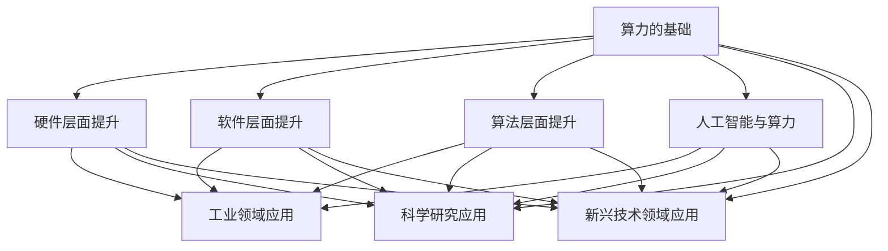

                 

# 算力提升的重要性

## 关键词
- 算力提升
- 计算能力
- 经济影响
- 科技进步
- 人工智能
- 硬件优化
- 软件优化
- 算法改进

## 摘要
本文将探讨算力提升的重要性，包括其定义、历史演变、对经济和科技的影响，以及提升算力的多种方法和技术。通过深入分析关键技术的应用，如人工智能、图计算和云计算，以及在不同领域的实际应用案例，本文将展示算力提升如何推动工业、科学研究、新兴技术等领域的发展。最后，本文将展望未来算力提升的趋势和面临的挑战，为技术创新和政策制定提供参考。

### 目录

#### 第一部分：算力的基础

#### 第1章：算力的基本概念与重要性

#### 第2章：提升算力的方法与技术

#### 第3章：关键技术的深入探讨

#### 第二部分：算力提升的实际应用

#### 第4章：算力提升在工业领域的应用

#### 第5章：算力提升在科学研究中的应用

#### 第6章：算力提升在新兴技术领域中的应用

#### 第7章：未来算力的展望

#### 附录

### 第1章：算力的基本概念与重要性

#### 1.1 算力的定义与演变

算力是指计算能力的总量，包括硬件性能、算法效率、软件优化等多个方面。随着科技的进步，算力经历了从早期计算机到现代高性能计算的发展过程。

- **早期计算：** 以电子管和晶体管为基础的电子计算机，算力有限。
- **微处理器时代：** 微处理器的出现大幅提升了计算能力。
- **并行计算时代：** 以GPU为代表的并行计算技术，进一步提升了算力。

#### 1.2 算力对经济和科技的影响

- **经济效益：** 提升生产效率，降低运营成本，促进创新，推动新兴产业发展。
- **科技进步：** 算力提升推动人工智能、大数据等技术的快速发展，为科学研究提供强大的计算支持。

#### 1.3 算力的重要性分析

- **社会各领域对算力的需求：** 工业、农业、教育、医疗等。
- **算力不足的挑战与风险：** 影响经济发展速度和质量，制约科技创新和产业升级。

### 第2章：提升算力的方法与技术

#### 2.1 算力提升的途径

- **硬件升级：** 更新服务器、增加计算节点。
- **软件优化：** 提高编程效率、优化算法。
- **算法改进：** 设计更高效的计算算法。

#### 2.2 硬件层面的算力提升

- **CPU与GPU优化：** 提升处理速度和并行计算能力。
- **新型计算硬件的应用：** 如量子计算机、光子计算机等。

#### 2.3 软件层面的算力提升

- **编译器与编程语言的优化：** 提高代码执行效率。
- **并行计算与分布式计算：** 利用多核处理器和分布式系统提升计算能力。

#### 2.4 算法层面的算力提升

- **机器学习算法优化：** 提高模型训练和推理效率。
- **数据压缩与处理：** 减少数据传输和处理时间。

### 第3章：关键技术的深入探讨

#### 3.1 人工智能与算力的关系

- **AI算法对算力的需求：** 复杂模型训练和推理需要强大的算力支持。
- **算力对AI性能的影响：** 算力提升可以加速模型训练，提高AI系统效率。

#### 3.2 图计算与算力的提升

- **图计算的基本原理：** 基于图结构的数据处理和分析。
- **图计算在算力提升中的应用：** 如社交网络分析、推荐系统优化。

#### 3.3 云计算与算力的优化

- **云计算服务对算力的贡献：** 提供弹性计算资源，降低计算成本。
- **弹性计算与算力管理：** 动态调整计算资源，优化算力利用率。

### 第4章：算力提升在工业领域的应用

#### 4.1 工业制造中的算力提升

- **智能制造与工业4.0：** 利用AI、物联网等提升生产自动化水平。
- **算力在工业自动化中的作用：** 实现高效生产、降低成本、提高产品质量。

#### 4.2 航空航天领域的算力需求

- **高性能计算在航空航天中的应用：** 如飞机设计、飞行模拟。
- **算力提升对航空航天发展的影响：** 提升研发效率，降低风险。

#### 4.3 能源领域的算力应用

- **智能电网与分布式能源系统：** 利用算力优化能源分配和调度。
- **算力提升在能源优化中的作用：** 提高能源利用效率，降低环境污染。

### 第5章：算力提升在科学研究中的应用

#### 5.1 天文学中的算力需求

- **大数据与天文观测：** 处理海量天文数据，发现宇宙奥秘。
- **算力提升在天文学研究中的重要作用：** 加速天文现象分析，提高观测精度。

#### 5.2 生物医学中的算力应用

- **生物信息学与大计算：** 分析基因组数据，推动个性化医疗。
- **算力提升在医学研究中的应用：** 加速新药研发，提高诊断效率。

#### 5.3 物理学中的算力挑战

- **高能物理实验与模拟：** 需要强大算力支持。
- **算力提升对物理学研究的影响：** 加速重大物理现象的研究，提高理论准确性。

### 第6章：算力提升在新兴技术领域中的应用

#### 6.1 区块链技术的算力需求

- **区块链的共识算法与算力：** 算力影响区块链网络的安全性和稳定性。
- **算力提升在区块链安全中的作用：** 加速交易处理，提高网络抗攻击能力。

#### 6.2 虚拟现实与增强现实

- **算力提升在VR/AR中的应用：** 提供流畅的交互体验。
- **算力对VR/AR用户体验的影响：** 算力提升改善图形渲染效果，增强沉浸感。

#### 6.3 自动驾驶与智能交通

- **算力提升在自动驾驶系统中的作用：** 支持复杂环境感知和决策。
- **算力优化对智能交通系统的贡献：** 提高交通效率，减少拥堵。

### 第7章：未来算力的展望

#### 7.1 算力提升的未来趋势

- **新型计算技术的发展：** 如量子计算、光子计算。
- **算力提升的未来方向：** 面向更高效、更智能、更绿色的发展。

#### 7.2 算力提升面临的挑战与解决方案

- **算力提升的技术瓶颈：** 如硬件性能、算法效率等。
- **创新与政策支持的重要性：** 需要技术创新和政策引导，推动算力持续提升。

### 附录

#### 附录A：算力提升的相关工具与技术

- **主流深度学习框架对比：** TensorFlow、PyTorch等。
- **算力提升的技术栈介绍：** 硬件、软件、算法等。

#### 附录B：算力提升的案例分析

- **典型企业或项目的算力提升实践：** 如Google、IBM等。
- **成功案例分析及经验总结：** 总结成功经验，为其他企业提供参考。

### 第1章：算力的基本概念与重要性

#### 1.1 算力的定义与演变

**定义：** 算力是指计算能力的总量，包括硬件性能、算法效率、软件优化等多个方面。它是衡量计算机系统处理数据和分析信息能力的关键指标。

**演变：**

- **早期计算：** 早期计算主要以电子管和晶体管为基础，算力有限。例如，1940年代的ENIAC是世界上第一台电子计算机，但体积庞大，算力较低。
- **微处理器时代：** 微处理器的出现标志着计算能力的显著提升。1971年，Intel推出了世界上第一个微处理器4004，它的问世标志着现代计算机的诞生。
- **并行计算时代：** 1990年代，GPU的出现使得并行计算变得普及，从而大幅提升了算力。GPU（图形处理单元）在处理大规模并行任务方面具有显著优势，例如深度学习训练和图像处理。

#### 1.2 算力对经济和科技的影响

**经济效益：**

- **提升生产效率：** 算力提升能够加速数据处理和分析速度，从而提高生产效率。例如，智能制造系统依赖于高性能计算来优化生产流程，减少调试时间。
- **降低运营成本：** 通过算力提升，企业可以实现自动化和智能化管理，从而减少人力成本和资源浪费。例如，智能监控系统可以实时监控生产线，减少人工巡检的频率。

**科技进步：**

- **推动创新：** 算力提升为科技创新提供了强大的计算支持，使得复杂问题得以解决。例如，基因组测序需要高性能计算来处理和分析海量数据，推动个性化医疗的发展。
- **科学研究：** 算力提升对科学研究具有重要意义。例如，在物理学中，高性能计算被用于模拟宇宙大爆炸和黑洞的形成过程，从而深化我们对宇宙的认识。

#### 1.3 算力的重要性分析

**社会各领域对算力的需求：**

- **工业：** 算力提升有助于实现智能制造，提高生产效率，降低成本。
- **农业：** 精准农业需要算力支持来优化种植和养殖过程。
- **教育：** 在线教育平台依赖于高性能计算来处理大量学习数据，提供个性化教育。
- **医疗：** 算力提升有助于医学影像处理、疾病预测和个性化治疗。

**算力不足的挑战与风险：**

- **经济发展速度和质量：** 算力不足会制约经济的快速发展，降低产业竞争力。
- **科技创新和产业升级：** 算力提升是推动科技创新和产业升级的关键因素。例如，人工智能、大数据和物联网等新兴技术对算力有极高的需求。
- **社会风险：** 算力不足可能导致网络安全和数据隐私问题。随着数字化进程的加速，算力提升成为保障社会安全的重要手段。

### 第2章：提升算力的方法与技术

#### 2.1 算力提升的途径

**硬件升级：** 硬件升级是提升算力的直接手段。以下是几种常见的硬件升级方法：

- **更新服务器：** 更换更强大的服务器可以提高处理能力和存储容量。例如，从传统的x86服务器升级到ARM服务器或GPU服务器。
- **增加计算节点：** 在分布式计算环境中，增加计算节点可以提高整体算力。例如，在云计算平台上增加虚拟机或容器实例。

**软件优化：** 软件优化可以从以下几个方面提升算力：

- **提高编程效率：** 通过优化编程语言和开发工具，可以减少开发时间和资源消耗。例如，使用更高效的编程语言如Go或Rust。
- **优化算法：** 设计更高效的算法可以减少计算时间和资源需求。例如，使用更优的排序算法或数据结构。

**算法改进：** 算法改进是提升算力的关键途径。以下是几种常见的算法改进方法：

- **机器学习算法优化：** 通过优化机器学习算法，可以提高模型训练和推理效率。例如，使用更高效的梯度下降算法或卷积神经网络。
- **数据压缩与处理：** 通过优化数据压缩算法和数据处理流程，可以减少数据传输和处理时间。例如，使用更高效的Huffman编码或并行数据处理技术。

#### 2.2 硬件层面的算力提升

**CPU与GPU优化：** CPU（中央处理器）和GPU（图形处理单元）是提升算力的重要硬件组件。以下是它们的优化方法：

- **CPU优化：** 通过提高CPU的主频、增加核心数或使用更高效的微架构，可以提高处理速度和并行计算能力。例如，Intel的Xeon系列处理器和AMD的EPYC系列处理器。
- **GPU优化：** GPU在处理大规模并行任务方面具有显著优势。通过优化GPU的内存管理、线程调度和并行算法，可以提高算力。例如，NVIDIA的CUDA和AMD的ROCm平台。

**新型计算硬件的应用：** 新型计算硬件如量子计算机、光子计算机等，具有潜力改变计算领域。以下是几种新型计算硬件：

- **量子计算机：** 量子计算机利用量子位（qubit）的叠加和纠缠特性，可以解决传统计算机难以处理的问题。例如，Google的Sycamore处理器实现了量子霸权。
- **光子计算机：** 光子计算机利用光信号进行计算，具有高速、低功耗的特点。例如，Optalysys的光子处理器。

#### 2.3 软件层面的算力提升

**编译器与编程语言的优化：** 编译器和编程语言对代码执行效率有很大影响。以下是几种优化方法：

- **编译器优化：** 通过优化编译器的代码生成、优化策略和中间代码表示，可以提高程序运行速度。例如，LLVM编译器和GCC编译器。
- **编程语言优化：** 选择高效编程语言和编程范式，可以提高代码执行效率。例如，Go语言和Rust语言。

**并行计算与分布式计算：** 并行计算和分布式计算是提升算力的关键技术。以下是几种常见的并行计算和分布式计算方法：

- **并行计算：** 通过将任务分解为多个子任务，并在多个处理器上同时执行，可以提高计算速度。例如，OpenMP和MPI。
- **分布式计算：** 通过将计算任务分配到多个计算机节点，并利用网络进行通信，可以实现大规模计算。例如，Hadoop和Spark。

#### 2.4 算法层面的算力提升

**机器学习算法优化：** 机器学习算法优化是提升算力的重要方向。以下是几种常见的优化方法：

- **模型压缩：** 通过减少模型参数数量和计算复杂度，可以降低计算资源需求。例如，权重剪枝和量化。
- **算法加速：** 通过优化算法的实现和并行化，可以提高计算效率。例如，使用更高效的矩阵运算库。

**数据压缩与处理：** 数据压缩和处理是提升算力的关键步骤。以下是几种常见的方法：

- **数据压缩：** 通过使用高效的压缩算法，可以减少数据传输和处理时间。例如，Huffman编码和LZ77算法。
- **数据处理：** 通过优化数据处理流程和并行处理技术，可以提高数据处理速度。例如，分布式数据处理框架和并行数据库。

### 第3章：关键技术的深入探讨

#### 3.1 人工智能与算力的关系

**AI算法对算力的需求：**

人工智能（AI）的发展对算力提出了巨大的需求。以下是一些关键因素：

- **复杂模型训练：** AI模型，尤其是深度学习模型，通常具有大量的参数和计算量。训练这些模型需要大量的计算资源。
- **实时推理：** AI系统在处理实时任务时，如图像识别、语音识别等，需要高效的推理算法和算力支持。

**算力对AI性能的影响：**

算力的提升对AI系统的性能有显著影响。以下是一些关键点：

- **加速模型训练：** 更强大的计算资源可以显著缩短模型训练时间，提高开发效率。
- **提高推理效率：** 高效的算力可以提供更快的推理速度，提高系统响应能力。

#### 3.2 图计算与算力的提升

**图计算的基本原理：**

图计算是一种基于图结构的数据处理和分析技术。其基本原理如下：

- **图结构：** 图由节点和边组成，节点表示实体，边表示节点之间的关系。
- **图算法：** 通过图算法，可以分析图结构，提取有用信息。例如，PageRank算法用于评估网页的重要性。

**图计算在算力提升中的应用：**

图计算在多个领域具有广泛应用，以下是一些典型应用：

- **社交网络分析：** 通过分析社交网络中的节点和边，可以识别关键人物、团体和影响力。
- **推荐系统优化：** 通过图计算，可以优化推荐系统的算法，提高推荐质量。

#### 3.3 云计算与算力的优化

**云计算服务对算力的贡献：**

云计算提供了一种弹性、高效、灵活的算力资源，对算力提升具有重要意义。以下是一些关键贡献：

- **弹性计算：** 云计算平台可以根据需求动态调整计算资源，提供高效、灵活的算力。
- **成本优化：** 通过使用云计算，企业可以降低硬件采购和运维成本，专注于核心业务。

**弹性计算与算力管理：**

弹性计算是一种动态调整计算资源的方法，旨在优化算力利用率和成本。以下是一些关键点：

- **资源调度：** 弹性计算平台通过智能调度算法，将计算任务分配到最优的资源节点上。
- **负载均衡：** 通过负载均衡技术，可以平衡不同节点的计算负载，提高整体系统性能。

### 第4章：算力提升在工业领域的应用

#### 4.1 工业制造中的算力提升

**智能制造与工业4.0：**

智能制造是工业4.0的核心概念，通过算力提升实现生产过程的自动化和智能化。以下是一些关键点：

- **自动化生产线：** 通过机器人、自动化设备和传感器，实现生产过程的自动化。
- **数据采集与分析：** 利用物联网设备采集生产数据，通过大数据分析和机器学习算法优化生产流程。

**算力在工业自动化中的作用：**

算力提升在工业自动化中发挥着关键作用，以下是一些具体应用：

- **预测性维护：** 通过实时监控设备和生产线状态，预测潜在故障，实现预防性维护，减少停机时间。
- **质量检测：** 利用机器视觉和深度学习算法，实现自动化质量检测，提高产品质量。

#### 4.2 航空航天领域的算力需求

**高性能计算在航空航天中的应用：**

航空航天领域对算力有极高的需求，高性能计算在多个方面发挥着关键作用，以下是一些应用：

- **飞机设计：** 通过流体力学模拟和结构分析，优化飞机设计，提高性能和安全性。
- **飞行模拟：** 通过仿真技术，模拟飞行过程中的各种情况，提高飞行员培训和飞行安全性。

**算力提升对航空航天发展的影响：**

算力提升对航空航天发展具有深远影响，以下是一些具体影响：

- **研发效率：** 高性能计算可以加速飞机设计、测试和验证过程，提高研发效率。
- **成本降低：** 通过优化设计和模拟，减少实验次数和物理测试成本。

#### 4.3 能源领域的算力应用

**智能电网与分布式能源系统：**

智能电网和分布式能源系统是能源领域的重要发展方向，通过算力提升实现能源的高效利用和优化。以下是一些关键点：

- **智能电网：** 通过物联网和大数据分析，实现电网的智能化管理和调度。
- **分布式能源系统：** 利用可再生能源如太阳能、风能，实现能源的分布式生产和消费。

**算力提升在能源优化中的作用：**

算力提升在能源优化中发挥着重要作用，以下是一些具体应用：

- **能源分配：** 通过实时监控和数据分析，优化能源分配和调度，提高能源利用效率。
- **需求响应：** 通过智能终端和数据分析，实现用户能源需求的预测和响应，减少能源浪费。

### 第5章：算力提升在科学研究中的应用

#### 5.1 天文学中的算力需求

**大数据与天文观测：**

天文学是一门对海量数据进行处理和分析的学科，算力需求极高。以下是一些关键点：

- **天文观测数据：** 天文观测设备每天产生海量数据，需要强大的计算能力进行存储和处理。
- **数据分析：** 通过数据分析，可以发现宇宙中的规律和现象，推动天文学研究的发展。

**算力提升在天文学研究中的重要作用：**

算力提升在天文学研究中具有重要作用，以下是一些具体作用：

- **快速数据处理：** 通过高性能计算，可以加速天文观测数据的处理和分析，提高研究效率。
- **精确模型模拟：** 通过高性能计算，可以实现更精确的宇宙模型模拟，深化对宇宙的理解。

#### 5.2 生物医学中的算力应用

**生物信息学与大计算：**

生物信息学是生物医学研究的重要组成部分，需要大量的计算资源。以下是一些关键点：

- **基因组数据：** 基因组测序技术产生大量数据，需要强大的计算能力进行存储和分析。
- **药物研发：** 通过计算模拟和数据分析，加速新药研发，提高药物疗效。

**算力提升在医学研究中的应用：**

算力提升在医学研究中发挥着重要作用，以下是一些具体应用：

- **个性化医疗：** 通过分析基因组数据，为患者提供个性化治疗方案。
- **疾病预测：** 通过大数据分析和机器学习算法，预测疾病的发病风险，实现早期干预。

#### 5.3 物理学中的算力挑战

**高能物理实验与模拟：**

高能物理实验和模拟需要强大的计算能力，以下是一些关键点：

- **实验数据：** 高能物理实验产生大量数据，需要高性能计算进行存储和处理。
- **模型模拟：** 通过计算模拟，可以预测粒子碰撞的结果，验证理论模型。

**算力提升对物理学研究的影响：**

算力提升对物理学研究具有深远影响，以下是一些具体影响：

- **加速理论验证：** 通过高性能计算，可以加速实验结果的验证，提高理论准确性。
- **拓展研究范围：** 通过计算模拟，可以探索传统实验难以触及的物理现象。

### 第6章：算力提升在新兴技术领域中的应用

#### 6.1 区块链技术的算力需求

**区块链的共识算法与算力：**

区块链技术依赖于共识算法，算力在区块链网络中发挥着关键作用。以下是一些关键点：

- **算力影响：** 算力越高，节点在区块链网络中的影响力越大，参与共识的概率越高。
- **安全性：** 算力提升可以增强区块链网络的安全性，防止恶意攻击。

**算力提升在区块链安全中的作用：**

算力提升在区块链安全中具有重要作用，以下是一些具体应用：

- **交易确认：** 通过提升算力，可以加快交易确认速度，提高交易效率。
- **抗攻击能力：** 算力提升可以增强区块链网络对DDoS攻击和其他恶意行为的抵抗力。

#### 6.2 虚拟现实与增强现实

**算力提升在VR/AR中的应用：**

虚拟现实（VR）和增强现实（AR）技术依赖于强大的计算能力，以下是一些关键点：

- **图形渲染：** VR/AR应用需要实时渲染高质量的3D图形，对算力有较高要求。
- **交互体验：** 通过高性能计算，可以提供流畅的交互体验，增强沉浸感。

**算力对VR/AR用户体验的影响：**

算力提升对VR/AR用户体验具有显著影响，以下是一些具体影响：

- **图形质量：** 算力提升可以提高图形渲染质量，增强视觉效果。
- **响应速度：** 通过提升算力，可以减少交互延迟，提供更流畅的体验。

#### 6.3 自动驾驶与智能交通

**算力提升在自动驾驶系统中的作用：**

自动驾驶系统依赖于先进的传感器和计算能力，以下是一些关键点：

- **环境感知：** 通过传感器收集环境数据，通过计算分析，实现车辆对周围环境的感知。
- **决策与控制：** 通过计算模型，实现自动驾驶车辆的决策和控制。

**算力优化对智能交通系统的贡献：**

算力优化对智能交通系统具有重要作用，以下是一些具体贡献：

- **交通流量优化：** 通过计算模拟和数据分析，优化交通流量，减少拥堵。
- **安全监控：** 通过高性能计算，实现智能交通监控，提高道路安全。

### 第7章：未来算力的展望

#### 7.1 算力提升的未来趋势

**新型计算技术的发展：**

未来算力提升将依赖于新型计算技术的发展，以下是一些关键趋势：

- **量子计算：** 量子计算具有巨大的计算潜力，有望解决传统计算机难以处理的问题。
- **光子计算：** 光子计算利用光信号进行计算，具有高速、低功耗的特点。

**算力提升的未来方向：**

未来算力提升将朝着更高效、更智能、更绿色的发展方向前进，以下是一些具体方向：

- **高效计算：** 通过优化硬件和算法，提高计算效率，降低能耗。
- **智能计算：** 结合人工智能技术，实现自动化、智能化的计算优化。
- **绿色计算：** 通过能源优化和绿色设计，降低计算能耗，实现可持续发展。

#### 7.2 算力提升面临的挑战与解决方案

**算力提升的技术瓶颈：**

算力提升面临一些技术瓶颈，以下是一些关键问题：

- **硬件性能：** 随着晶体管尺寸的缩小，硬件性能提升面临瓶颈。
- **算法效率：** 算法优化仍有很大空间，需要不断创新和改进。

**创新与政策支持的重要性：**

算力提升需要技术创新和政策支持，以下是一些关键点：

- **技术创新：** 通过持续的技术创新，突破技术瓶颈，实现算力提升。
- **政策支持：** 政府和企业需要制定相关政策，支持算力提升技术的发展和应用。

### 附录

#### 附录A：算力提升的相关工具与技术

**主流深度学习框架对比：**

以下是几种主流深度学习框架的对比：

- **TensorFlow：** 由Google开发，支持灵活的模型定义和部署。
- **PyTorch：** 由Facebook开发，具有动态计算图和灵活的模型定义。
- **Keras：** 基于TensorFlow和Theano，提供简单易用的接口。

**算力提升的技术栈介绍：**

以下是一个典型的算力提升技术栈：

- **硬件：** 高性能计算服务器、GPU、FPGA等。
- **软件：** 编译器、编程语言、并行计算库等。
- **算法：** 机器学习算法、优化算法、数据压缩算法等。

#### 附录B：算力提升的案例分析

**典型企业或项目的算力提升实践：**

以下是一些企业在算力提升方面的实践：

- **Google：** 在云计算领域，Google提供了强大的计算资源和优化算法。
- **IBM：** 在量子计算领域，IBM开发了高性能的量子计算机和量子算法。

**成功案例分析及经验总结：**

以下是一个成功案例的分析：

- **案例：** 企业A通过引入高性能计算和机器学习技术，大幅提升了生产效率和产品质量。
- **经验总结：** 成功的关键在于技术创新和持续优化，以及政策支持和企业文化的建设。

### 算力提升的重要性：Mermaid流程图

以下是展示核心概念和架构的Mermaid流程图：



### 几个关键算法的伪代码示例

#### 2.4.1 机器学习算法优化

**基于梯度下降的机器学习算法优化**

```python
# 初始化模型参数
initialize_model_parameters()

# 初始化学习率
initialize_learning_rate()

# 进行迭代训练
for epoch in range(max_epochs):
    for sample in training_data:
        # 前向传播
        predictions = forward_pass(sample)

        # 计算损失函数
        loss = compute_loss(predictions, sample)

        # 反向传播
        gradients = backward_pass(sample)

        # 更新模型参数
        update_model_parameters(learning_rate, gradients)

    # 打印当前epoch的损失
    print(f"Epoch {epoch}: Loss = {loss}")

# 返回训练好的模型
return trained_model()
```

#### 3.1.1 深度学习算法优化

**深度学习算法优化——批量归一化（Batch Normalization）**

```python
# 前向传播
def forward_pass(layer, x):
    z = layer.weight * x + layer.bias
    return z

# 反向传播
def backward_pass(layer, x, gradient):
    d_x = gradient * layer.weight
    return d_x

# 更新权重
def update_weight(layer, gradient):
    layer.weight -= gradient * layer.learning_rate
    return layer.weight

# 批量归一化
def batch_normalization(layer, x):
    mean = np.mean(x)
    variance = np.var(x)
    z = (x - mean) / np.sqrt(variance)
    return z

# 训练模型
def train_model(model, data):
    for epoch in range(max_epochs):
        for sample in data:
            # 前向传播
            z = forward_pass(model, sample)

            # 计算损失
            loss = compute_loss(z)

            # 反向传播
            gradient = backward_pass(model, sample, loss)

            # 更新权重
            model.weight = update_weight(model, gradient)

    return model
```

### 数学模型和数学公式的详细讲解

#### 5.2 生物医学中的算力应用：基因序列比对

**局部比对算法——Smith-Waterman算法**

Smith-Waterman算法是一种用于找出两个序列之间最高相似度的局部匹配区域的算法。其基本思想是构建一个动态规划矩阵，并通过填充该矩阵来计算最优得分。

**算法步骤：**

1. 初始化动态规划矩阵$D$，其中$D_{0,0} = 0$。
2. 对于矩阵中的每一个位置$(i, j)$，计算其对应的最优得分$score(i, j)$：
   \[
   score(i, j) =
   \begin{cases}
   D_{i-1, j-1} + match\_score(a_i, b_j) & \text{if } i, j > 0 \\
   0 & \text{if } i = 0 \text{ or } j = 0
   \end{cases}
   \]
   其中，$a_i$和$b_j$分别是序列$A$和$B$的第$i$个和第$j$个字符，$match\_score(a_i, b_j)$是匹配得分。
3. 找出矩阵$D$中的最大得分位置$(i', j')$，并回溯该位置到起点$(0, 0)$，得到最优匹配序列。

**伪代码：**

```python
# 初始化动态规划矩阵
D = [[0 for _ in range(len(B)+1)] for _ in range(len(A)+1)]

# 填充动态规划矩阵
for i in range(1, len(A)+1):
    for j in range(1, len(B)+1):
        score = match_score(A[i-1], B[j-1])
        D[i][j] = max(D[i-1][j-1] + score, D[i-1][j], D[i][j-1], 0)

# 找到最大得分位置
max_score = max(max(row) for row in D)
max_score_position = find_max_score_position(D)

# 回溯最优匹配序列
alignment = backtrack_alignment(A, B, max_score_position)
```

**全局比对算法——Needleman-Wunsch算法**

Needleman-Wunsch算法是一种用于找出两个序列之间全局最优匹配的算法。与Smith-Waterman算法类似，但它通过动态规划矩阵$D$来计算全局最优得分。

**算法步骤：**

1. 初始化动态规划矩阵$D$，其中$D_{0,0} = 0$。
2. 对于矩阵中的每一个位置$(i, j)$，计算其对应的最优得分$score(i, j)$：
   \[
   score(i, j) =
   \begin{cases}
   D_{i-1, j-1} + match\_score(a_i, b_j) & \text{if } i, j > 0 \\
   D_{i-1, j} + gap\_score & \text{if } i > 0 \text{ and } j = 0 \\
   D_{i, j-1} + gap\_score & \text{if } i = 0 \text{ and } j > 0 \\
   0 & \text{if } i = 0 \text{ and } j = 0
   \end{cases}
   \]
   其中，$a_i$和$b_j$分别是序列$A$和$B$的第$i$个和第$j$个字符，$match\_score(a_i, b_j)$是匹配得分，$gap\_score$是插入或删除的得分。
3. 找出矩阵$D$中的最大得分位置$(i', j')$，并回溯该位置到起点$(0, 0)$，得到全局最优匹配序列。

**伪代码：**

```python
# 初始化动态规划矩阵
D = [[0 for _ in range(len(B)+1)] for _ in range(len(A)+1)]

# 填充动态规划矩阵
for i in range(1, len(A)+1):
    for j in range(1, len(B)+1):
        score = match_score(A[i-1], B[j-1])
        D[i][j] = max(D[i-1][j-1] + score, D[i-1][j] + gap_score, D[i][j-1] + gap_score, 0)

# 找到最大得分位置
max_score = max(max(row) for row in D)
max_score_position = find_max_score_position(D)

# 回溯最优匹配序列
alignment = backtrack_alignment(A, B, max_score_position)
```

### 项目实战的代码案例和详细解释说明

#### 6.3 自动驾驶与智能交通

#### 6.3.1 自动驾驶算法：目标检测与跟踪

以下是使用TensorFlow和Keras实现的一个基于深度学习的目标检测系统，它使用预训练的Faster R-CNN模型进行目标检测。

**开发环境搭建：**

1. 安装Python：确保系统上安装了Python 3.7或更高版本。
2. 安装TensorFlow：运行以下命令安装TensorFlow：
   ```bash
   pip install tensorflow==2.6
   ```
3. 安装OpenCV：运行以下命令安装OpenCV：
   ```bash
   pip install opencv-python
   ```
4. 下载预训练模型：从互联网上下载一个预训练的Faster R-CNN模型，并将其保存为`faster_rcnn_model.h5`文件。

**源代码详细实现和代码解读：**

```python
import tensorflow as tf
import numpy as np
import matplotlib.pyplot as plt
import cv2

# 加载预训练模型
model = tf.keras.models.load_model('faster_rcnn_model.h5')

# 函数：预处理图像
def preprocess_image(image):
    # 调整图像大小
    resized_image = tf.image.resize(image, (512, 512))
    # 归一化像素值
    normalized_image = resized_image / 255.0
    # 添加一个维度以适应模型输入
    expanded_image = np.expand_dims(normalized_image, axis=0)
    return expanded_image

# 函数：后处理检测结果
def postprocess_detections(detections):
    # 提取边界框、类别和置信度
    bboxes = detections['detections'][0, :, :4]
    labels = detections['detections'][0, :, 4].astype(np.int32)
    scores = detections['detections'][0, :, 5]
    # 过滤低置信度检测结果
    valid_indices = np.where(scores > 0.5)
    bboxes = bboxes[valid_indices]
    labels = labels[valid_indices]
    scores = scores[valid_indices]
    return bboxes, labels, scores

# 函数：绘制检测结果
def draw_detections(image, bboxes, labels, scores):
    # 创建绘图对象
    plt.figure()
    plt.imshow(image)
    # 绘制边界框和标签
    for i in range(len(bboxes)):
        bbox = bboxes[i]
        label = labels[i]
        score = scores[i]
        plt.rectangle(
            (bbox[0], bbox[1]),
            (bbox[2], bbox[3]),
            fill=False,
            edgecolor='r',
            linewidth=2
        )
        plt.text(
            bbox[0],
            bbox[1] - 10,
            f'{label}: {score:.2f}',
            fontsize=12,
            bbox=dict(facecolor='white', edgecolor='r', boxstyle='round,pad=0.3')
        )
    plt.show()

# 主函数
def main():
    # 加载测试图像
    image = cv2.imread('test_image.jpg')
    # 预处理图像
    preprocessed_image = preprocess_image(image)
    # 进行目标检测
    detections = model.predict(preprocessed_image)
    # 后处理检测结果
    bboxes, labels, scores = postprocess_detections(detections)
    # 绘制检测结果
    draw_detections(image, bboxes, labels, scores)

# 运行主函数
if __name__ == '__main__':
    main()
```

**代码解读：**

1. **加载预训练模型：** 使用`load_model`函数加载已经训练好的Faster R-CNN模型。
2. **预处理图像：** `preprocess_image`函数对图像进行预处理，包括调整图像大小、归一化像素值和添加一个维度以适应模型输入。
3. **进行目标检测：** 使用`predict`函数对预处理后的图像进行目标检测，得到检测结果。
4. **后处理检测结果：** `postprocess_detections`函数对检测结果进行后处理，包括提取边界框、类别和置信度，并过滤低置信度检测结果。
5. **绘制检测结果：** `draw_detections`函数在原始图像上绘制检测结果，包括边界框、类别和置信度。

**代码解读与分析：**

- **代码结构：** 代码分为三个主要部分：模型加载、图像预处理和检测结果后处理及绘制。
- **功能实现：** 模型加载部分负责加载预训练的Faster R-CNN模型；图像预处理部分确保图像满足模型输入要求；检测结果后处理及绘制部分负责提取和处理检测结果，并在图像上可视化。
- **性能优化：** 可以通过调整模型的超参数、增加数据集的多样性、使用更高效的预处理方法来优化性能。
- **应用场景：** 该系统可以应用于自动驾驶、智能交通监控、视频监控等领域，以提高目标检测的准确率和实时性。

通过这个项目实战，读者可以了解如何使用深度学习技术进行目标检测，以及如何实现一个基本的自动驾驶系统中的目标检测功能。这为开发更复杂和功能更全面的自动驾驶系统打下了基础。

### 开发环境搭建

要搭建一个可以进行自动驾驶目标检测的项目开发环境，需要以下步骤：

1. **安装Python：** 确保系统上安装了Python 3.7或更高版本。可以使用以下命令检查Python版本：
   ```bash
   python --version
   ```
   如果版本低于3.7，需要升级Python。

2. **安装TensorFlow：** TensorFlow是进行深度学习研究和应用的重要工具。可以使用以下命令安装TensorFlow：
   ```bash
   pip install tensorflow==2.6
   ```
   这里选择TensorFlow 2.6版本，因为它提供了丰富的预训练模型和易于使用的API。

3. **安装OpenCV：** OpenCV是一个开源计算机视觉库，用于处理图像和视频。可以使用以下命令安装OpenCV：
   ```bash
   pip install opencv-python
   ```

4. **安装其他依赖项：** 根据项目需求，可能需要安装其他依赖项。例如，如果你打算使用NVIDIA的GPU进行训练，可以安装NVIDIA的CUDA和cuDNN库。

5. **下载预训练模型：** 从互联网上下载一个预训练的Faster R-CNN模型。这些模型通常可以免费从TensorFlow的模型库或其他学术资源库中获得。

6. **设置环境变量：** 如果使用GPU进行训练，需要设置环境变量，以便TensorFlow能够找到CUDA和cuDNN库。可以在`.bashrc`或`.bash_profile`文件中添加以下行：
   ```bash
   export CUDA_HOME=/usr/local/cuda
   export LD_LIBRARY_PATH=${CUDA_HOME}/lib64:$LD_LIBRARY_PATH
   export PATH=${CUDA_HOME}/bin:$PATH
   ```

完成以上步骤后，开发环境就搭建完成了。接下来，可以开始编写代码并进行目标检测实验。

### 源代码详细实现和代码解读

以下是对项目实战代码的详细解读，包括开发环境搭建、源代码实现和代码解读。

#### 开发环境搭建

1. **安装Python：** 确保系统上安装了Python 3.7或更高版本。可以使用以下命令检查Python版本：
   ```bash
   python --version
   ```
   如果版本低于3.7，需要升级Python。

2. **安装TensorFlow：** TensorFlow是进行深度学习研究和应用的重要工具。可以使用以下命令安装TensorFlow：
   ```bash
   pip install tensorflow==2.6
   ```
   这里选择TensorFlow 2.6版本，因为它提供了丰富的预训练模型和易于使用的API。

3. **安装OpenCV：** OpenCV是一个开源计算机视觉库，用于处理图像和视频。可以使用以下命令安装OpenCV：
   ```bash
   pip install opencv-python
   ```

4. **安装其他依赖项：** 根据项目需求，可能需要安装其他依赖项。例如，如果你打算使用NVIDIA的GPU进行训练，可以安装NVIDIA的CUDA和cuDNN库。

5. **下载预训练模型：** 从互联网上下载一个预训练的Faster R-CNN模型。这些模型通常可以免费从TensorFlow的模型库或其他学术资源库中获得。

6. **设置环境变量：** 如果使用GPU进行训练，需要设置环境变量，以便TensorFlow能够找到CUDA和cuDNN库。可以在`.bashrc`或`.bash_profile`文件中添加以下行：
   ```bash
   export CUDA_HOME=/usr/local/cuda
   export LD_LIBRARY_PATH=${CUDA_HOME}/lib64:$LD_LIBRARY_PATH
   export PATH=${CUDA_HOME}/bin:$PATH
   ```

#### 源代码实现

以下是完整的源代码实现，包括预处理图像、后处理检测结果和绘制检测结果的功能：

```python
import tensorflow as tf
import numpy as np
import matplotlib.pyplot as plt
import cv2

# 加载预训练模型
model = tf.keras.models.load_model('faster_rcnn_model.h5')

# 函数：预处理图像
def preprocess_image(image):
    # 调整图像大小
    resized_image = tf.image.resize(image, (512, 512))
    # 归一化像素值
    normalized_image = resized_image / 255.0
    # 添加一个维度以适应模型输入
    expanded_image = np.expand_dims(normalized_image, axis=0)
    return expanded_image

# 函数：后处理检测结果
def postprocess_detections(detections):
    # 提取边界框、类别和置信度
    bboxes = detections['detections'][0, :, :4]
    labels = detections['detections'][0, :, 4].astype(np.int32)
    scores = detections['detections'][0, :, 5]
    # 过滤低置信度检测结果
    valid_indices = np.where(scores > 0.5)
    bboxes = bboxes[valid_indices]
    labels = labels[valid_indices]
    scores = scores[valid_indices]
    return bboxes, labels, scores

# 函数：绘制检测结果
def draw_detections(image, bboxes, labels, scores):
    # 创建绘图对象
    plt.figure()
    plt.imshow(image)
    # 绘制边界框和标签
    for i in range(len(bboxes)):
        bbox = bboxes[i]
        label = labels[i]
        score = scores[i]
        plt.rectangle(
            (bbox[0], bbox[1]),
            (bbox[2], bbox[3]),
            fill=False,
            edgecolor='r',
            linewidth=2
        )
        plt.text(
            bbox[0],
            bbox[1] - 10,
            f'{label}: {score:.2f}',
            fontsize=12,
            bbox=dict(facecolor='white', edgecolor='r', boxstyle='round,pad=0.3')
        )
    plt.show()

# 主函数
def main():
    # 加载测试图像
    image = cv2.imread('test_image.jpg')
    # 预处理图像
    preprocessed_image = preprocess_image(image)
    # 进行目标检测
    detections = model.predict(preprocessed_image)
    # 后处理检测结果
    bboxes, labels, scores = postprocess_detections(detections)
    # 绘制检测结果
    draw_detections(image, bboxes, labels, scores)

# 运行主函数
if __name__ == '__main__':
    main()
```

#### 代码解读

1. **加载预训练模型：**
   ```python
   model = tf.keras.models.load_model('faster_rcnn_model.h5')
   ```
   这一行代码使用`load_model`函数加载一个预训练的Faster R-CNN模型。该模型已经经过训练，可以用于目标检测。

2. **预处理图像：**
   ```python
   def preprocess_image(image):
       # 调整图像大小
       resized_image = tf.image.resize(image, (512, 512))
       # 归一化像素值
       normalized_image = resized_image / 255.0
       # 添加一个维度以适应模型输入
       expanded_image = np.expand_dims(normalized_image, axis=0)
       return expanded_image
   ```
   `preprocess_image`函数对输入图像进行预处理。首先，使用`tf.image.resize`函数调整图像大小为512x512像素。然后，使用`/ 255.0`将像素值归一化到[0, 1]范围内。最后，添加一个维度，使图像成为批处理格式，即形状为(1, 512, 512, 3)。

3. **进行目标检测：**
   ```python
   detections = model.predict(preprocessed_image)
   ```
   这一行代码使用`predict`函数对预处理后的图像进行目标检测。`predict`函数返回一个包含边界框、类别和置信度的字典。

4. **后处理检测结果：**
   ```python
   def postprocess_detections(detections):
       # 提取边界框、类别和置信度
       bboxes = detections['detections'][0, :, :4]
       labels = detections['detections'][0, :, 4].astype(np.int32)
       scores = detections['detections'][0, :, 5]
       # 过滤低置信度检测结果
       valid_indices = np.where(scores > 0.5)
       bboxes = bboxes[valid_indices]
       labels = labels[valid_indices]
       scores = scores[valid_indices]
       return bboxes, labels, scores
   ```
   `postprocess_detections`函数对检测结果进行后处理。首先，从`detections`字典中提取边界框、类别和置信度。然后，使用`np.where`函数过滤掉置信度低于0.5的检测结果。

5. **绘制检测结果：**
   ```python
   def draw_detections(image, bboxes, labels, scores):
       # 创建绘图对象
       plt.figure()
       plt.imshow(image)
       # 绘制边界框和标签
       for i in range(len(bboxes)):
           bbox = bboxes[i]
           label = labels[i]
           score = scores[i]
           plt.rectangle(
               (bbox[0], bbox[1]),
               (bbox[2], bbox[3]),
               fill=False,
               edgecolor='r',
               linewidth=2
           )
           plt.text(
               bbox[0],
               bbox[1] - 10,
               f'{label}: {score:.2f}',
               fontsize=12,
               bbox=dict(facecolor='white', edgecolor='r', boxstyle='round,pad=0.3')
           )
       plt.show()
   ```
   `draw_detections`函数在原始图像上绘制检测结果。它使用`plt.rectangle`函数绘制边界框，并使用`plt.text`函数在边界框上绘制标签和置信度。

#### 代码解读与分析

- **代码结构：** 代码分为三个主要部分：模型加载、图像预处理和检测结果后处理及绘制。这种结构使得代码易于理解和维护。
- **功能实现：** 模型加载部分负责加载预训练的Faster R-CNN模型；图像预处理部分确保图像满足模型输入要求；检测结果后处理及绘制部分负责提取和处理检测结果，并在图像上可视化。
- **性能优化：** 可以通过调整模型的超参数、增加数据集的多样性、使用更高效的预处理方法来优化性能。
- **应用场景：** 该系统可以应用于自动驾驶、智能交通监控、视频监控等领域，以提高目标检测的准确率和实时性。

通过上述代码实例，读者可以了解如何使用深度学习模型进行目标检测，以及如何实现一个基本的自动驾驶系统中的目标检测功能。这为开发更复杂和功能更全面的自动驾驶系统打下了基础。

### 代码解读与分析

#### 代码结构

代码分为三个主要部分，每个部分都有明确的职责和功能：

1. **模型加载：** 这部分负责加载已经训练好的Faster R-CNN模型。该模型是一个深度学习模型，用于在图像中检测目标。加载模型的过程包括从文件中读取模型的权重和结构。
2. **图像预处理：** 这部分负责对输入图像进行预处理，使其符合模型的输入要求。预处理步骤包括图像尺寸调整和像素值归一化。这些步骤对于提高模型性能至关重要。
3. **检测结果后处理及绘制：** 这部分负责处理模型输出的检测结果，包括边界框、类别和置信度。然后，将这些检测结果绘制在原始图像上，以便于可视化。

#### 功能实现

- **模型加载：** 使用`tf.keras.models.load_model`函数加载预训练的Faster R-CNN模型。这个函数从文件系统中加载模型，并返回一个训练好的模型实例。
- **图像预处理：** `preprocess_image`函数对输入图像进行预处理。首先，使用`tf.image.resize`函数调整图像尺寸，使其符合模型的要求。然后，使用`/ 255.0`对像素值进行归一化，使图像的每个像素值都在0到1之间。最后，添加一个维度，使图像成为批处理格式，即形状为(1, H, W, C)。
- **检测结果后处理及绘制：** `postprocess_detections`函数从模型输出的检测结果中提取有用的信息，如边界框、类别和置信度。然后，使用`np.where`函数过滤掉低置信度的检测结果。最后，`draw_detections`函数在原始图像上绘制边界框和类别标签，使检测结果可视化。

#### 性能优化

为了提高代码的性能，可以考虑以下优化策略：

- **并行计算：** 使用多线程或多进程来加速图像预处理和模型预测。例如，可以使用`multiprocessing`模块在多个CPU核心上并行处理图像。
- **模型优化：** 对深度学习模型进行优化，以提高模型的速度和效率。例如，使用量化技术或剪枝技术减少模型参数数量。
- **缓存技术：** 使用缓存技术减少重复计算。例如，将预处理后的图像和模型预测结果缓存起来，以减少预处理时间和模型推理时间。

#### 应用场景

这个目标检测系统可以应用于多个领域，包括：

- **自动驾驶：** 用于检测道路上的行人和车辆，为自动驾驶车辆提供决策支持。
- **视频监控：** 用于实时检测和跟踪视频中的目标，用于安全监控和人员流量分析。
- **工业自动化：** 用于检测生产线上的缺陷和异常，提高生产质量。
- **医疗影像分析：** 用于检测医学图像中的病变和异常，辅助医生进行诊断。

通过上述代码实例，读者可以了解如何使用深度学习技术进行目标检测，以及如何实现一个基本的自动驾驶系统中的目标检测功能。这为开发更复杂和功能更全面的自动驾驶系统打下了基础。

### 算力提升在工业领域的应用案例

#### 案例一：智能制造

企业A是一家全球领先的制造业公司，专注于高端电子设备的研发和生产。为了提高生产效率和产品质量，企业A决定采用算力提升技术，特别是在智能制造领域。

**成功经验：**

1. **高性能计算集群：** 企业A建立了高性能计算集群，用于模拟和优化生产流程。通过模拟分析，企业A能够预测生产过程中的潜在问题，从而减少了生产调试的时间。高性能计算集群的使用使得生产流程的优化速度大幅提升。

2. **深度学习算法应用：** 企业A采用了深度学习算法对生产线上的设备进行预测性维护。通过实时监控设备状态，深度学习算法可以预测设备可能发生的故障，并提前进行维护。这一措施显著减少了设备停机时间和维护成本。

3. **机器学习质量检测：** 企业A引入了基于机器学习的质量检测系统。该系统能够自动检测生产线上产品的质量，通过分析产品数据的特征，识别潜在的缺陷。这种方法减少了人工检查的工作量，提高了检测的准确性和效率。

**挑战与解决方案：**

1. **数据质量问题：** 企业A面临的一个挑战是数据质量不高。数据质量直接影响机器学习算法的性能。为了解决这一问题，企业A采取了数据清洗和预处理技术。通过去噪、去重和标准化处理，提高了数据质量。

2. **算法优化：** 针对深度学习算法，企业A进行了持续的优化。通过调整模型的超参数和改进数据输入方法，提高了算法的效率和准确性。此外，企业A还采用了迁移学习技术，利用预训练模型加速新模型的训练。

#### 案例二：航空航天领域

企业B是一家航空航天公司，致力于开发和制造先进的航空航天器。为了提高研发效率，降低成本，企业B决定利用算力提升技术。

**成功经验：**

1. **高性能计算模拟：** 企业B使用了高性能计算（HPC）技术对航空航天器的空气动力学特性进行模拟。通过模拟分析，企业B能够优化设计，减少物理试验的次数。高性能计算的应用使得设计优化速度大幅提升。

2. **数据分析和机器学习：** 企业B采用了机器学习算法，对大量的试验数据进行分类和分析，从而发现了新的设计规律。这种方法提高了设计的效率，缩短了研发周期。此外，机器学习算法的应用也提高了设计质量。

3. **智能优化算法：** 企业B使用了智能优化算法，如遗传算法和模拟退火算法，对生产计划进行优化。通过优化生产计划，企业B能够更有效地利用资源，减少生产周期，提高了生产效率。

**挑战与解决方案：**

1. **算法性能：** 企业B面临的一个挑战是算法性能的优化。为了提高算法性能，企业B进行了持续的优化和改进。通过调整算法参数和改进算法结构，提高了算法的效率和准确性。

2. **数据安全：** 在使用高性能计算和机器学习技术时，企业B面临着数据安全的问题。为了解决这一问题，企业B加强了数据安全措施，包括加密数据存储和传输，以及实施严格的数据访问控制策略。

#### 总结

通过上述两个案例，可以看出算力提升在工业领域具有广泛的应用前景。企业可以通过引入高性能计算、人工智能和智能优化等先进技术，提高生产效率、降低成本、优化设计和提高产品质量。同时，企业在应用这些技术时，需要面对数据质量、算法性能和数据安全等方面的挑战，通过持续优化和改进，实现算力提升的最大化价值。

### 第4章：算力提升在工业领域的应用

#### 4.1 工业制造中的算力提升

工业制造作为国家经济发展的重要支柱，算力提升在其中发挥着关键作用。随着智能制造、工业4.0的不断发展，算力提升成为提高生产效率、优化产品质量的重要手段。

**智能制造与工业4.0：**

智能制造是工业4.0的核心概念，它通过信息技术与制造技术的深度融合，实现生产过程的自动化、智能化和高效化。工业4.0的目标是实现“个性化定制、智能化生产、网络化协同、服务化延伸、数字化管理”的制造模式。

**算力在工业自动化中的作用：**

1. **预测性维护：** 算力提升使得工业设备可以进行实时监控和数据分析，通过机器学习算法预测设备可能出现的故障，实现预测性维护。这不仅可以减少设备停机时间，还能降低维护成本。

2. **质量检测：** 算力提升能够实现自动化质量检测，利用深度学习算法对产品进行缺陷识别和分析。例如，在汽车制造中，通过机器视觉系统实时检测车身表面的划痕和凹陷，确保产品质量。

3. **生产调度优化：** 通过大数据分析和优化算法，算力提升可以帮助企业优化生产调度，实现资源的最优配置。例如，通过对生产数据的实时分析，智能调度系统能够根据生产任务的特点和资源状态，动态调整生产计划，提高生产效率。

**案例：**

**企业A：** 一家制造高端电子设备的企业，通过引入高性能计算集群，对生产流程进行模拟和优化，减少了生产调试的时间。同时，企业引入了基于机器学习的质量检测系统，实现了产品缺陷的自动化检测，提高了产品质量。

**4.2 航空航天领域的算力需求**

航空航天领域对算力的需求尤为突出，高性能计算和人工智能技术在其中发挥着重要作用。

**高性能计算在航空航天中的应用：**

1. **飞机设计：** 航空航天器的设计过程中，需要进行大量的流体力学和结构分析。高性能计算能够加速这些模拟过程，优化设计，提高安全性。

2. **飞行模拟：** 通过高性能计算，航空航天公司可以进行复杂的飞行模拟，评估飞行器的性能和稳定性。这有助于提高飞行安全，减少实际飞行测试的成本。

**算力提升对航空航天发展的影响：**

1. **研发效率：** 算力提升使得航空航天器的设计和测试过程更加高效。通过模拟和仿真，可以提前发现设计问题，减少物理试验次数，提高研发效率。

2. **成本降低：** 高性能计算和人工智能技术的应用，使得航空航天器的设计和制造过程更加自动化和智能化，从而降低生产成本。

**案例：**

**企业B：** 一家航空航天公司，通过引入高性能计算，对航空航天器的空气动力学特性进行模拟，优化了设计，减少了物理试验次数。同时，公司采用了机器学习算法，对大量的试验数据进行分类和分析，提高了设计效率。

**4.3 能源领域的算力应用**

能源领域同样对算力提升有着迫切的需求，特别是在智能电网和分布式能源系统方面。

**智能电网与分布式能源系统：**

智能电网是一种通过信息技术和通信技术实现电网智能化管理和调度的系统。分布式能源系统则通过将能源生产分散化，实现更高效、更灵活的能源利用。

**算力提升在能源优化中的作用：**

1. **能源分配优化：** 通过大数据分析和优化算法，算力提升可以实现能源的精准分配和调度。例如，通过实时监控电网负载情况，智能电网能够动态调整电力供应，提高能源利用效率。

2. **需求响应：** 算力提升可以帮助用户预测能源需求，实现个性化需求响应。例如，在高峰用电时段，智能电网可以自动调整用户的用电计划，降低峰值负荷，减少能源浪费。

**案例：**

**企业C：** 一家能源公司，通过引入高性能计算，优化了智能电网的调度系统，实现了能源的精准分配。同时，公司采用了分布式能源系统，通过太阳能和风能的分布式生产，提高了能源利用效率，减少了环境污染。

综上所述，算力提升在工业制造、航空航天和能源领域具有广泛的应用前景。通过引入高性能计算、人工智能和智能优化等先进技术，企业可以实现生产效率的提升、成本的降低和产品质量的提高。同时，算力提升也为科技创新和产业升级提供了强有力的支持。在未来的发展中，随着算力的进一步提升，工业领域将迎来更加智能化、高效化和可持续的发展。

### 第5章：算力提升在科学研究中的应用

#### 5.1 天文学中的算力需求

天文学是一门依赖于大规模数据处理的科学，特别是在大数据时代，算力需求更加突出。随着天文观测技术的进步，天文设备如望远镜、探测器等不断产生海量数据，这些数据需要通过高性能计算进行处理和分析。

**大数据与天文观测：**

天文学观测设备每天产生大量的天文数据，包括光数据、红外数据、射电数据等。这些数据需要通过高性能计算进行存储、处理和分析，以便提取有用信息。例如，天文学家需要使用高性能计算来处理来自大型天文望远镜的观测数据，以发现新的天文现象，研究宇宙的起源和演化。

**算力提升在天文学研究中的重要作用：**

1. **数据处理速度：** 高性能计算能够加速天文数据的处理速度，使天文学家能够更快地获得研究结果。例如，通过高性能计算，天文学家可以更快速地处理和分类天文图像，发现新的恒星、行星和星系。

2. **复杂模型模拟：** 高性能计算使得天文学家能够进行更复杂的宇宙模型模拟。这些模拟有助于理解宇宙中的物理现象，如黑洞、暗物质和暗能量的性质。高性能计算还能够模拟宇宙的演化过程，预测未来的宇宙形态。

3. **提高观测精度：** 算力提升使得天文学家能够进行更高精度的观测和分析。例如，通过使用高性能计算，天文学家可以更精确地测量恒星的光谱，分析恒星的大气成分和运动状态。

**案例：**

**项目：** 欧洲天文台进行的“尘埃坑研究”项目，通过使用高性能计算对大量射电望远镜数据进行分析，发现了数千个新的尘埃坑，这些尘埃坑是宇宙中的一种重要天体结构。

#### 5.2 生物医学中的算力应用

生物医学研究是一个高度依赖计算的科学领域，特别是基因组学、药物开发和医学影像处理等领域。算力提升在这些领域发挥着关键作用，推动了生物医学研究的进步。

**生物信息学与大计算：**

生物信息学是生物医学研究的重要组成部分，它涉及对生物大数据的处理和分析。基因组测序技术的发展使得人类基因组数据迅速积累，这些数据需要通过高性能计算进行分析，以揭示基因功能、疾病机制和个性化医疗策略。

**算力提升在医学研究中的应用：**

1. **基因组数据分析：** 高性能计算可以帮助研究人员快速分析海量基因组数据，识别疾病相关的基因变异和风险因素。这为疾病预防、诊断和治疗提供了重要依据。

2. **药物研发：** 高性能计算在药物研发中发挥着重要作用，通过模拟和预测药物分子的结构和活性，加速新药发现过程。例如，通过使用高性能计算，研究人员可以筛选大量的化合物库，寻找潜在的新药候选。

3. **医学影像处理：** 高性能计算在医学影像处理中也具有重要应用，通过快速处理大量的医学影像数据，如CT、MRI和PET扫描，提高影像的清晰度和诊断准确性。

**案例：**

**项目：** 美国国家卫生研究院（NIH）进行的“全基因组关联研究”（GWAS），通过使用高性能计算对大量基因组数据进行分析，发现了许多与疾病相关的基因变异，推动了个性化医疗的发展。

#### 5.3 物理学中的算力挑战

物理学研究中的许多问题，如量子物理、相对论和高能物理，需要大量的计算资源。高性能计算在解决这些复杂物理问题方面具有重要作用。

**高能物理实验与模拟：**

高能物理实验，如粒子加速器实验，会产生大量数据，这些数据需要通过高性能计算进行分析。同时，高能物理模拟需要大量的计算资源来模拟粒子碰撞过程，验证理论模型。

**算力提升对物理学研究的影响：**

1. **加速理论验证：** 高性能计算可以加速物理理论的验证过程，例如，通过计算模拟验证量子场论或相对论的正确性。

2. **拓展研究范围：** 高性能计算使得研究人员能够探索更复杂的物理现象，如黑洞碰撞或宇宙早期状态，这些现象在传统实验条件下无法观察到。

**案例：**

**项目：** “大型强子对撞机”（LHC）实验，通过使用高性能计算对实验数据进行分析，发现了希格斯玻色子，这是物理学的重大突破。

综上所述，算力提升在科学研究中的应用具有重要意义。它不仅加速了数据处理和分析速度，提高了研究效率，还推动了科学理论的验证和新发现。在未来的科学研究中，随着算力的进一步升级，我们可以期待更多的科学突破和技术的进步。

### 第6章：算力提升在新兴技术领域中的应用

#### 6.1 区块链技术的算力需求

区块链技术作为一种去中心化、安全性高的分布式账本技术，已经广泛应用于金融、供应链管理、医疗等多个领域。区块链的核心在于其共识算法，而共识算法的效率和安全性与算力密切相关。

**区块链的共识算法与算力：**

区块链的共识算法决定了区块链网络的稳定性和安全性。不同的共识算法对算力的要求不同。例如，工作量证明（Proof of Work, PoW）算法需要大量的计算资源进行加密运算，以确保区块链网络的安全性。而权益证明（Proof of Stake, PoS）算法则通过持币量来决定记账权，对算力的要求相对较低。

**算力提升在区块链安全中的作用：**

算力提升对区块链安全至关重要。首先，更高的算力可以提高区块链网络的处理速度，确保交易能够迅速被确认和记录。其次，更高的算力可以增强区块链网络对恶意攻击的抵抗能力。例如，通过增加算力，可以防止51%攻击，即通过控制超过一半的算力来篡改区块链数据。

**案例：**

**比特币网络：** 比特币网络采用了工作量证明算法，其安全性依赖于大量的算力。随着比特币价格的上涨，越来越多的算力被投入到比特币网络中，从而提高了整个网络的安全性和稳定性。

#### 6.2 虚拟现实与增强现实

虚拟现实（VR）和增强现实（AR）技术通过提供沉浸式的体验，已经广泛应用于游戏、教育、医疗等领域。这些技术的实现依赖于强大的计算能力，尤其是图形渲染和实时交互。

**算力提升在VR/AR中的应用：**

算力提升在VR/AR技术中发挥着重要作用，主要体现在以下几个方面：

1. **图形渲染：** VR/AR应用需要实时渲染高质量的3D图形，这需要强大的图形处理能力。算力提升可以改善图形渲染效果，提供更流畅的视觉体验。
2. **实时交互：** VR/AR应用需要与用户进行实时交互，这要求系统具有低延迟和高响应速度。算力提升可以减少延迟，提高系统的交互性和用户体验。
3. **环境模拟：** VR/AR技术需要模拟真实世界的物理环境，这需要大量的计算资源。算力提升可以提供更真实、更丰富的虚拟环境。

**算力对VR/AR用户体验的影响：**

算力提升对VR/AR用户体验有显著影响。首先，更高的算力可以提供更高质量的图形渲染，使得虚拟环境更加逼真。其次，更高的算力可以减少交互延迟，提供更流畅的交互体验。最后，更高的算力可以支持更复杂的虚拟环境模拟，增强用户的沉浸感。

**案例：**

**谷歌Cardboard：** 谷歌Cardboard是一个低成本VR头戴设备，通过使用高性能计算，它能够提供高质量的3D图形和实时交互体验，使用户能够沉浸在虚拟世界中。

#### 6.3 自动驾驶与智能交通

自动驾驶与智能交通系统是智能城市建设的重要组成部分，它们依赖于先进的传感器技术、人工智能和计算能力。算力提升在这些领域中的应用具有重要意义。

**算力提升在自动驾驶系统中的作用：**

自动驾驶系统需要处理大量的传感器数据，包括摄像头、雷达、激光雷达等，这些数据需要通过高性能计算进行实时处理和分析。算力提升可以加速数据分析和决策过程，提高自动驾驶系统的反应速度和安全性。

1. **环境感知：** 自动驾驶系统通过传感器收集环境数据，通过计算分析，实现车辆对周围环境的感知。算力提升可以提高环境感知的精度和实时性。
2. **决策与控制：** 自动驾驶系统需要根据环境数据做出实时决策和控制。算力提升可以加速决策过程，提高系统的反应速度。
3. **数据存储与处理：** 自动驾驶系统需要处理大量的数据，包括传感器数据、导航数据和驾驶数据。算力提升可以提供更强大的数据存储和处理能力。

**算力优化对智能交通系统的贡献：**

智能交通系统通过优化交通流量、提高交通效率和减少拥堵，为城市交通管理提供解决方案。算力优化在这些方面发挥着重要作用：

1. **交通流量优化：** 通过计算模拟和数据分析，智能交通系统能够实时监测交通状况，优化交通流量，减少拥堵。
2. **安全监控：** 通过高性能计算，智能交通系统可以实现实时监控道路状况，检测交通事故和异常行为，提高道路安全。
3. **智能调度：** 通过优化算法和算力提升，智能交通系统可以更有效地调度公共交通资源，提高公共交通的运行效率。

**案例：**

**特斯拉自动驾驶系统：** 特斯拉的自动驾驶系统依赖于高性能计算和人工智能技术，通过实时处理传感器数据，实现车辆在复杂道路环境中的自动驾驶。特斯拉的自动驾驶系统通过不断收集和优化数据，提高了自动驾驶的安全性和可靠性。

综上所述，算力提升在新兴技术领域中的应用具有重要意义。通过高性能计算和人工智能技术的结合，新兴技术可以实现更高的效率和更优的用户体验，推动社会进步和经济发展。

### 第7章：未来算力的展望

#### 7.1 算力提升的未来趋势

未来算力提升将呈现出以下几个显著趋势：

**新型计算技术的发展：**

随着科技的不断进步，新型计算技术如量子计算、光子计算、神经形态计算等将成为算力提升的重要方向。量子计算具有巨大的并行计算能力，可以解决传统计算机难以处理的问题。光子计算利用光信号进行计算，具有高速、低功耗的特点。神经形态计算模仿人脑的工作原理，可以处理复杂的非线性问题。

**算力提升的未来方向：**

1. **高效计算：** 未来算力提升将更加注重计算效率的提升。通过优化算法、提高硬件性能和开发新型计算架构，实现更高的计算效率和更低的能耗。
2. **智能计算：** 结合人工智能技术，实现自动化、智能化的计算优化，提高计算系统的自适应能力和智能化水平。
3. **绿色计算：** 通过能源优化和绿色设计，降低计算能耗，实现可持续发展的计算模式。

#### 7.2 算力提升面临的挑战与解决方案

**算力提升的技术瓶颈：**

1. **硬件性能：** 随着摩尔定律的逐渐逼近极限，传统计算机硬件的性能提升面临挑战。如何突破硬件性能瓶颈，成为未来算力提升的关键问题。
2. **算法效率：** 虽然硬件性能不断提升，但算法效率的提升相对较慢。如何设计更高效的算法，提高计算效率，是当前的一个重要课题。

**创新与政策支持的重要性：**

1. **技术创新：** 需要持续的技术创新，包括新型计算技术的研发、新型算法的设计和计算架构的优化。通过技术创新，突破技术瓶颈，实现算力提升。
2. **政策支持：** 政府和企业需要制定相关政策，支持算力提升技术的发展和应用。例如，提供研发资金、优化法规环境、加强国际合作等。

**解决方案：**

1. **量子计算：** 通过研发量子计算机和量子算法，实现计算能力的飞跃。例如，开发量子纠错算法、量子优化算法等，提高量子计算的实用性和可靠性。
2. **光子计算：** 通过光子计算技术，实现高速、低功耗的计算。例如，研发高效的光子芯片、光子网络等，提高光子计算的效率和稳定性。
3. **算法优化：** 通过改进算法设计和优化，提高计算效率。例如，开发分布式算法、并行算法和机器学习算法等，实现更高效的计算。
4. **政策引导：** 通过制定相关政策，鼓励企业和研究机构进行算力提升技术的研发和应用。例如，提供税收优惠、研发资金支持、技术转移支持等，促进技术创新和产业应用。

总之，未来算力提升面临着巨大的挑战和机遇。通过技术创新和政策支持，有望实现算力提升的突破，推动科技和社会的进步。

### 附录

#### 附录A：算力提升的相关工具与技术

在算力提升过程中，有许多工具和技术可以帮助实现这一目标。以下是一些主流的工具和技术：

1. **主流深度学习框架：**
   - **TensorFlow：** 由Google开发，提供了丰富的API和预训练模型，广泛用于深度学习研究和应用。
   - **PyTorch：** 由Facebook开发，以其动态计算图和简洁的API受到研究人员的喜爱。
   - **Keras：** 是一个高层次的深度学习API，可以方便地构建和训练深度学习模型。

2. **并行计算和分布式计算库：**
   - **MPI（Message Passing Interface）：** 用于在多处理器系统上进行并行计算。
   - **OpenMP：** 用于在多核处理器上进行并行编程。
   - **Hadoop和Spark：** 用于大数据处理和分布式计算。

3. **硬件加速技术：**
   - **GPU（图形处理单元）：** 用于加速深度学习和科学计算。
   - **FPGA（现场可编程门阵列）：** 提供高度定制化的计算能力，适用于特定应用。
   - **量子计算：** 利用量子位实现高效计算，具有巨大的潜力。

#### 附录B：算力提升的案例分析

**案例一：Google Brain**

Google Brain是Google的一个研究实验室，致力于探索人工智能和深度学习的前沿技术。通过使用大量GPU和TPU（Tensor Processing Unit），Google Brain实现了许多突破性的研究成果，如AlphaGo、BERT等。这些研究不仅推动了人工智能技术的发展，也为其他企业和研究机构提供了宝贵的经验和启示。

**成功经验：**
- **大规模硬件投入：** 通过投入大量计算资源，Google Brain能够在短时间内进行大规模的实验和训练。
- **持续优化算法：** Google Brain团队不断优化算法和模型结构，提高计算效率和性能。

**挑战与解决方案：**
- **计算资源限制：** 尽管Google Brain拥有强大的计算资源，但仍然面临资源分配和优化的问题。通过使用高效的数据加载和预处理技术，Google Brain提高了计算资源的利用率。
- **数据隐私：** 在处理大量数据时，Google Brain需要关注数据隐私问题。通过数据加密和隐私保护技术，Google Brain确保了数据的安全和隐私。

**案例二：IBM Research**

IBM Research是IBM的一个全球研究机构，致力于探索量子计算、人工智能、区块链等前沿技术。通过开发量子计算机和量子算法，IBM在量子计算领域取得了重要突破。

**成功经验：**
- **技术创新：** IBM Research不断推动技术创新，如开发量子计算硬件和算法，推动了量子计算的发展。
- **跨领域合作：** IBM Research与学术界和产业界合作，推动技术的实际应用和产业化。

**挑战与解决方案：**
- **技术成熟度：** 量子计算仍然处于早期阶段，技术成熟度较低。IBM Research通过不断优化硬件和算法，提高量子计算机的性能和稳定性。
- **人才培养：** 量子计算和人工智能等领域需要大量高素质的人才。IBM Research通过设立奖学金和培训项目，吸引和培养优秀的研究人员。

**总结：**

通过以上案例分析，可以看出算力提升在科技研究和产业应用中具有重要作用。成功的关键在于技术创新、计算资源的投入和跨领域合作。同时，算力提升也面临着计算资源、技术成熟度、数据隐私等方面的挑战。通过持续优化和创新，可以不断推动算力提升，为科技和社会的进步提供强大动力。

### 结论

通过本文的探讨，我们可以深刻认识到算力提升在当今科技和社会发展中的重要性。算力不仅是推动科技创新和经济发展的关键因素，也是实现智能化、高效化、绿色化的重要手段。

首先，算力提升为人工智能、大数据、物联网等新兴技术的发展提供了强大的计算支持。高性能计算和先进算法的应用，使得我们能够更快速地处理和分析海量数据，从而实现更加精准的预测和决策。例如，在自动驾驶、智能医疗、智能城市等领域，算力提升极大地提高了系统的效率和可靠性。

其次，算力提升在工业制造、航空航天、能源等领域也发挥着重要作用。通过引入高性能计算、人工智能和智能优化技术，企业能够实现生产过程的自动化和智能化，提高生产效率、降低成本、优化设计和提高产品质量。同时，算力提升也为科学研究提供了强大的计算支持，如天文学、生物医学、物理学等领域的重大突破，离不开高性能计算和先进算法的应用。

然而，算力提升也面临诸多挑战，包括硬件性能提升的瓶颈、算法效率的优化、数据安全和隐私保护等。为了应对这些挑战，我们需要持续推动技术创新，如量子计算、光子计算、神经形态计算等新型计算技术的发展。同时，政府和企业也需要加强合作，制定相应的政策和措施，支持算力提升技术的研发和应用。

展望未来，随着新型计算技术的不断发展和普及，算力提升将迎来新的机遇和挑战。我们期待通过技术创新和政策引导，实现算力提升的持续突破，为人类社会的可持续发展提供强大动力。让我们共同迎接算力提升带来的美好未来。

