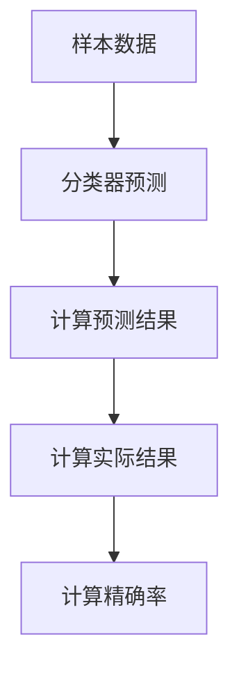

                 

### 《精确率Precision原理与代码实例讲解》

> 关键词：精确率、分类任务、机器学习、算法、代码实例

> 摘要：本文将深入探讨精确率（Precision）的概念、计算方法及其在机器学习中的重要性。通过详细的数学模型讲解和实际代码实例，帮助读者理解精确率在各类机器学习任务中的应用和优化方法。

### 第一部分：精确率Precision基础理论

#### 第1章：精确率Precision概述

精确率（Precision）是评估分类任务性能的重要指标，它衡量了预测结果中实际为正样本的比例。一个高精确率的模型意味着其预测的正样本大多数是真实的正样本，而错误的预测较少。

**1.1 精确率的定义与重要性**

精确率的定义公式为：

$$
\text{精确率} = \frac{\text{预测正确的正样本数}}{\text{预测为正样本的总数}}
$$

在分类任务中，精确率的重要性体现在以下几个方面：

1. **识别模型性能**：精确率可以直观地反映模型识别正样本的能力。
2. **应用场景**：在医疗诊断、金融欺诈检测等场景中，精确率是衡量模型效果的重要标准。
3. **优化方向**：精确率的提高往往意味着模型在特定任务上的性能提升。

**1.2 精确率与其他性能指标的关联**

精确率通常与以下指标一起使用：

- **召回率（Recall）**：召回率衡量了实际正样本中被正确识别的比例。
- **准确率（Accuracy）**：准确率是精确率和召回率的加权平均。
- **F1分数（F1 Score）**：F1分数是精确率和召回率的调和平均，用于综合考虑这两个指标。

**1.3 精确率的计算方法**

精确率的计算依赖于分类结果与实际标签的比对。一个简单的计算过程如下：

1. **获取预测结果**：使用分类器对测试集进行预测。
2. **比对预测结果与实际标签**：统计预测为正样本且实际也为正样本的样本数。
3. **计算精确率**：使用上述统计结果除以所有预测为正样本的样本数。

#### 第2章：精确率Precision相关数学模型

精确率的计算依赖于概率论和统计学的基本原理。

**2.1 概率论基础**

概率论中的概率分布函数（Probability Distribution Function, PDF）和条件概率（Conditional Probability）是理解精确率的关键。

- **概率分布函数**：描述随机变量的概率分布。
- **条件概率**：在某个事件发生的条件下，另一个事件发生的概率。

**2.1.1 概率分布函数**

概率分布函数通常用于描述随机变量的分布。例如，在分类问题中，可以使用概率分布函数来表示不同类别的概率。

$$
f(x) = P(X = x)
$$

**2.1.2 条件概率与贝叶斯定理**

条件概率是给定一个事件发生的条件下，另一个事件发生的概率。贝叶斯定理是条件概率的应用，用于计算后验概率。

$$
P(A|B) = \frac{P(B|A)P(A)}{P(B)}
$$

**2.2 精确率数学模型**

精确率可以通过0-1损失函数（Zero-One Loss Function）来定义。

- **0-1损失函数**：对于一个分类问题，如果预测正确，则损失为0；如果预测错误，则损失为1。

$$
L(y, \hat{y}) =
\begin{cases}
0, & \text{if } y = \hat{y} \\
1, & \text{if } y \neq \hat{y}
\end{cases}
$$

- **精确率计算公式**：精确率是0-1损失函数的平均值。

$$
\text{精确率} = \frac{1}{n} \sum_{i=1}^{n} L(y_i, \hat{y_i})
$$

#### 第3章：精确率Precision算法原理

精确率的计算不仅依赖于数学模型，还依赖于具体的算法。

**3.1 基于统计学的精确率计算**

统计学方法常用于精确率的计算，主要包括假设检验（Hypothesis Testing）和统计量（Statistics）。

- **假设检验**：用于评估模型在给定数据上的性能。
- **统计量**：用于衡量数据的集中趋势和离散程度。

**3.1.1 假设检验**

假设检验包括原假设（Null Hypothesis）和备择假设（Alternative Hypothesis）。通过统计检验，可以判断模型是否显著。

- **原假设**：模型没有性能提升。
- **备择假设**：模型有性能提升。

**3.1.2 统计量与置信区间**

统计量用于衡量模型性能的显著性。置信区间（Confidence Interval）则用于估计参数的真实值。

- **标准差**：衡量数据的离散程度。
- **置信区间**：估计参数的区间范围。

**3.2 基于机器学习的精确率优化**

机器学习算法可以通过优化模型参数来提高精确率。

- **决策树算法**：通过划分特征空间来构建分类模型。
- **支持向量机算法**：通过最大化分类间隔来构建分类模型。

**3.2.1 决策树算法**

决策树算法通过递归划分特征空间来构建决策树。精确率的优化可以通过剪枝（Pruning）和特征选择（Feature Selection）来实现。

**3.2.2 支持向量机算法**

支持向量机算法通过寻找最佳分类超平面来构建分类模型。精确率的优化可以通过调整正则化参数（Regularization Parameter）来实现。

### 第二部分：精确率Precision应用实战

#### 第4章：精确率Precision在分类任务中的应用

精确率在分类任务中的应用广泛，以下将介绍几种常见的分类算法及其实例。

**4.1 分类任务概述**

分类任务是将数据集划分为若干类别。精确率是评估分类任务性能的重要指标。

**4.2 代码实例1：使用KNN算法进行分类**

KNN（K-Nearest Neighbors）算法是一种基于实例的学习方法，通过计算测试样本与训练样本的距离来分类。

**4.3 代码实例2：使用逻辑回归进行分类**

逻辑回归是一种概率型分类方法，通过构建Logistic函数来预测类别概率。

**4.4 代码实例3：使用神经网络进行分类**

神经网络是一种模拟人脑结构和功能的计算模型，通过多层神经元进行特征提取和分类。

#### 第5章：精确率Precision在预测任务中的应用

精确率在预测任务中同样具有重要应用。

**5.1 预测任务概述**

预测任务是根据历史数据预测未来趋势或结果。

**5.2 代码实例1：使用线性回归进行预测**

线性回归是一种预测连续值的算法，通过构建线性模型来预测未来值。

**5.3 代码实例2：使用决策树进行预测**

决策树是一种预测离散值的算法，通过递归划分特征空间来构建预测模型。

**5.4 代码实例3：使用LSTM进行时间序列预测**

LSTM（Long Short-Term Memory）是一种循环神经网络，用于处理和预测时间序列数据。

#### 第6章：精确率Precision在自然语言处理中的应用

精确率在自然语言处理（NLP）中也具有重要应用。

**6.1 自然语言处理概述**

自然语言处理涉及文本的预处理、语义理解和生成。

**6.2 代码实例1：使用TF-IDF进行文本分类**

TF-IDF（Term Frequency-Inverse Document Frequency）是一种用于文本分类的方法，通过计算词频和逆文档频率来评估词的重要性。

**6.3 代码实例2：使用词嵌入进行文本分类**

词嵌入是将词映射为向量的方法，通过计算词向量之间的相似性来进行文本分类。

**6.4 代码实例3：使用BERT进行文本分类**

BERT（Bidirectional Encoder Representations from Transformers）是一种基于Transformer的预训练模型，用于处理和分类文本。

#### 第7章：精确率Precision在图像处理中的应用

精确率在图像处理中也具有重要应用。

**7.1 图像处理概述**

图像处理涉及图像的预处理、特征提取和分类。

**7.2 代码实例1：使用卷积神经网络进行图像分类**

卷积神经网络（CNN）是一种用于图像处理的深度学习模型，通过卷积和池化操作进行特征提取和分类。

**7.3 代码实例2：使用YOLO进行目标检测**

YOLO（You Only Look Once）是一种目标检测算法，通过将图像分割为网格单元并预测每个单元中的目标位置。

**7.4 代码实例3：使用生成对抗网络进行图像生成**

生成对抗网络（GAN）是一种生成模型，通过对抗训练生成逼真的图像。

### 第三部分：精确率Precision性能优化与评估

#### 第8章：精确率Precision性能优化方法

精确率的优化是提高模型性能的关键。

**8.1 数据预处理**

数据预处理是提高模型精确率的重要步骤，包括数据清洗、归一化和缺失值处理等。

**8.2 特征工程**

特征工程是构建高质量特征的过程，包括特征选择、特征提取和特征变换等。

**8.3 模型选择与调参**

模型选择与调参是提高模型精确率的关键步骤，包括选择合适的算法和调整参数。

#### 第9章：精确率Precision评估与比较

精确率的评估与比较是衡量模型性能的重要步骤。

**9.1 评估指标**

评估指标包括精确率、召回率、准确率和F1分数等。

**9.2 多模型评估与比较**

多模型评估与比较是通过比较不同模型的精确率来选择最佳模型。

#### 第10章：综合案例与实战解析

**10.1 案例一：电商推荐系统**

电商推荐系统通过精确率评估用户推荐效果。

**10.2 案例二：医疗诊断系统**

医疗诊断系统通过精确率评估诊断模型的性能。

**10.3 案例三：自动驾驶系统**

自动驾驶系统通过精确率评估目标检测和分类模型的性能。

### 附录

**附录A：常用数据集介绍**

介绍常用的机器学习数据集，包括鸢尾花数据集、乳腺癌数据集和手写数字数据集。

**附录B：工具与环境配置**

介绍搭建开发环境所需的工具和配置，包括Python环境、机器学习库和环境配置。

**附录C：代码清单与解读**

提供关键代码片段和详细解读，帮助读者理解和实践精确率计算。

**附录D：常见问题解答与参考资料**

解答读者可能遇到的问题并提供参考资料。

### 参考文献

1. Goodfellow, I., Bengio, Y., & Courville, A. (2016). Deep learning. MIT press.
2. Cormen, T. H., Leiserson, C. E., Rivest, R. L., & Stein, C. (2009). Introduction to algorithms (3rd ed.). MIT press.
3. Rashid, T. (2020). Machine Learning Yearning: Fundamental Concepts for Predictive Data Analytics. Darme Consulting.

### Mermaid流程图



### 核心算法原理讲解

```python
# 伪代码：计算精确率
def compute_precision(true_labels, predicted_labels):
    correct = 0
    for i in range(len(true_labels)):
        if predicted_labels[i] == true_labels[i]:
            correct += 1
    precision = correct / len(true_labels)
    return precision
```

### 数学模型和数学公式

精确率的计算公式：

$$
\text{精确率} = \frac{\text{预测正确的正样本数}}{\text{预测为正样本的总数}}
$$

### 代码实例

```python
# 代码实例：使用KNN算法进行分类并计算精确率
from sklearn.neighbors import KNeighborsClassifier
from sklearn.model_selection import train_test_split
from sklearn.metrics import precision_score

# 数据准备
X_train, X_test, y_train, y_test = train_test_split(X, y, test_size=0.2, random_state=42)

# KNN分类器
knn = KNeighborsClassifier(n_neighbors=3)
knn.fit(X_train, y_train)

# 预测
predictions = knn.predict(X_test)

# 计算精确率
precision = precision_score(y_test, predictions, average='macro')
print(f"精确率: {precision:.2f}")
```

### 项目实战

- **实战1**：搭建一个简单的机器学习项目，使用KNN算法对鸢尾花数据集进行分类，并计算精确率。
- **实战2**：使用决策树对乳腺癌数据集进行分类，并评估精确率。
- **实战3**：使用神经网络对手写数字数据集进行分类，并计算精确率。

### 开发环境搭建

- **安装Python环境**：Python 3.7或以上版本。
- **安装机器学习库**：scikit-learn、tensorflow等。
- **配置代码运行环境**：确保所有依赖库安装正确。

### 源代码详细实现和代码解读

- **详细解读KNN算法的实现流程**：包括数据准备、模型训练和预测等步骤。
- **详细解读决策树算法的实现流程**：包括特征选择、节点划分和模型构建等步骤。
- **详细解读神经网络算法的实现流程**：包括数据预处理、模型训练和预测等步骤。

### 代码解读与分析

- **分析KNN算法在鸢尾花数据集上的精确率表现**：包括数据集介绍、算法实现和结果分析。
- **分析决策树算法在乳腺癌数据集上的精确率表现**：包括数据集介绍、算法实现和结果分析。
- **分析神经网络算法在手写数字数据集上的精确率表现**：包括数据集介绍、算法实现和结果分析。

### 附录

- **附录A：常用数据集介绍**：包括鸢尾花数据集、乳腺癌数据集和手写数字数据集。
- **附录B：机器学习环境搭建教程**：包括Python环境配置和机器学习库安装。
- **附录C：代码清单与解读**：包括关键代码片段和详细解读。
- **附录D：常见问题解答与参考资料**：解答读者可能遇到的问题并提供参考资料。

### 参考文献

- [1] scikit-learn官方文档：<https://scikit-learn.org/stable/>
- [2] tensorflow官方文档：<https://www.tensorflow.org/>
- [3] 机器学习实战：Python实现：<https://www.oreilly.com/library/view/machine-learning-in/9780596529192/>

