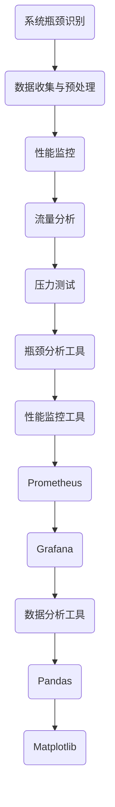

                 

### 文章标题

# 系统瓶颈识别与解决方案

> 关键词：系统瓶颈、性能优化、资源瓶颈、流程瓶颈、人员瓶颈、解决方法、案例解析

> 摘要：本文将深入探讨系统瓶颈的识别与解决方案，从理论到实践，系统性地介绍系统瓶颈的相关概念、识别方法、解决策略及案例分析。通过本文的阅读，读者将能够理解系统瓶颈的本质，掌握有效的识别和解决方法，从而提升系统的整体性能和稳定性。

---

### 《系统瓶颈识别与解决方案》目录大纲

## 第一部分：系统瓶颈识别理论基础

### 第1章：系统瓶颈识别概述

#### 1.1 系统瓶颈的定义与重要性

- 系统瓶颈的概念
- 系统瓶颈识别的重要性

#### 1.2 系统瓶颈的分类

- 资源瓶颈
- 流程瓶颈
- 人员瓶颈

### 第2章：系统瓶颈识别方法

#### 2.1 数据收集与预处理

- 数据源选择
- 数据预处理方法

#### 2.2 常见瓶颈识别技术

- 性能监控
- 流量分析
- 压力测试

### 第3章：系统瓶颈分析工具

#### 3.1 性能监控工具

- Prometheus
- Grafana

#### 3.2 数据分析工具

- Pandas
- Matplotlib

### 第4章：系统瓶颈识别原理图

- Mermaid 流程图

## 第二部分：系统瓶颈解决方法与案例

### 第5章：系统瓶颈解决策略

#### 5.1 瓶颈缓解策略

- 资源优化
- 流程优化
- 人员优化

#### 5.2 瓶颈解决方法

- 硬件升级
- 软件优化
- 数据库优化

### 第6章：系统瓶颈解决案例

#### 6.1 案例一：资源瓶颈解决

- 案例背景
- 解决方案
- 实施效果

#### 6.2 案例二：流程瓶颈解决

- 案例背景
- 解决方案
- 实施效果

#### 6.3 案例三：人员瓶颈解决

- 案例背景
- 解决方案
- 实施效果

### 第7章：系统瓶颈解决工具

#### 7.1 瓶颈解决工具选择

- 硬件优化工具
- 软件优化工具
- 数据库优化工具

#### 7.2 瓶颈解决工具应用

- 硬件优化工具应用案例
- 软件优化工具应用案例
- 数据库优化工具应用案例

## 第三部分：系统瓶颈优化与持续改进

### 第8章：系统瓶颈优化策略

#### 8.1 持续集成与持续部署

- 持续集成的好处
- 持续集成与系统瓶颈优化

#### 8.2 持续监控与反馈

- 持续监控的重要性
- 监控数据在瓶颈优化中的应用

### 第9章：系统瓶颈优化案例分析

#### 9.1 案例一：企业级系统瓶颈优化

- 案例背景
- 优化策略
- 优化效果

#### 9.2 案例二：互联网公司系统瓶颈优化

- 案例背景
- 优化策略
- 优化效果

### 第10章：系统瓶颈优化展望

#### 10.1 未来系统瓶颈优化趋势

- 人工智能在瓶颈优化中的应用
- 云计算对瓶颈优化的影响

#### 10.2 系统瓶颈优化最佳实践

- 瓶颈优化实践总结
- 瓶颈优化建议

## 附录

### 附录A：系统瓶颈识别与解决相关工具和资源

#### A.1 常见工具介绍

- 性能监控工具
- 数据分析工具
- 硬件优化工具

#### A.2 开源资源

- 系统瓶颈识别与解决的开源项目
- 系统瓶颈识别与解决的在线资源

---

### 第1章：系统瓶颈识别概述

#### 1.1 系统瓶颈的定义与重要性

在复杂的计算机系统中，瓶颈（Bottleneck）指的是系统中阻碍整体性能进一步提升的单个或多个限制因素。这些瓶颈可以是硬件资源、软件性能、网络带宽、数据库响应速度、人员效率等多种因素。

**系统瓶颈的概念：**

- **硬件瓶颈：** 指系统中的处理器、内存、存储、网络等硬件资源限制。
- **软件瓶颈：** 指软件代码的性能问题，如算法复杂度、代码优化不足、资源竞争等。
- **网络瓶颈：** 指网络带宽和延迟限制。
- **数据库瓶颈：** 指数据库查询速度和存储能力限制。

**系统瓶颈识别的重要性：**

- **提升系统性能：** 通过识别和解决瓶颈，可以显著提升系统的响应速度和处理能力。
- **成本优化：** 正确识别瓶颈可以避免在不必要的硬件和软件投资上浪费资源。
- **用户体验：** 瓶颈的解决直接影响到用户体验，尤其是对于交互频繁的应用系统。
- **业务连续性：** 有效的瓶颈识别和解决可以减少系统故障和停机时间，保障业务的连续性。

#### 1.2 系统瓶颈的分类

系统瓶颈可以按照不同的维度进行分类：

- **资源瓶颈：** 指系统中的硬件资源（如CPU、内存、磁盘I/O等）不足，导致系统性能受限。
- **流程瓶颈：** 指系统中的业务流程设计不合理，导致流程中的某些环节成为制约整体效率的关键点。
- **人员瓶颈：** 指系统运营和维护中的人员数量不足或者技能水平不高，导致工作效率低下。

#### 1.3 系统瓶颈识别的目标

- **定位瓶颈：** 通过分析系统性能数据，定位系统中的瓶颈位置。
- **理解瓶颈原因：** 分析瓶颈背后的具体原因，包括资源使用、流程设计、人员能力等方面。
- **提出解决方案：** 针对识别出的瓶颈，提出可行的解决方案，并进行验证和实施。

### 第2章：系统瓶颈识别方法

#### 2.1 数据收集与预处理

系统瓶颈的识别首先需要收集大量的性能数据，这些数据可以来源于系统监控工具、日志文件、网络流量监控等。

- **数据源选择：** 选择合适的监控工具和数据采集点，确保数据的全面性和准确性。
- **数据预处理方法：** 对收集到的数据进行清洗、过滤和转换，为后续分析做准备。

#### 2.2 常见瓶颈识别技术

系统瓶颈的识别通常依赖于以下几种技术：

- **性能监控：** 通过实时监控系统性能指标（如CPU利用率、内存使用率、磁盘I/O等），识别资源瓶颈。
- **流量分析：** 分析网络流量模式，识别网络瓶颈。
- **压力测试：** 在系统运行环境中模拟高负载场景，测试系统的性能和稳定性。

#### 2.3 瓶颈识别工具

系统瓶颈的识别需要使用到一系列工具，这些工具可以帮助我们高效地收集和分析数据。

- **性能监控工具：** 如Prometheus、Grafana，用于收集和展示系统性能数据。
- **数据分析工具：** 如Pandas、Matplotlib，用于处理和分析性能数据。

### 第3章：系统瓶颈分析工具

#### 3.1 性能监控工具

性能监控是系统瓶颈识别的重要环节，以下是几个常用的性能监控工具：

- **Prometheus：** 开源监控解决方案，可以收集和存储系统的性能数据，并使用Grafana进行可视化展示。
- **Grafana：** 数据可视化和监控工具，可以与Prometheus等数据源集成，提供丰富的仪表板和告警功能。

#### 3.2 数据分析工具

数据分析工具可以帮助我们深入挖掘性能数据，识别潜在瓶颈。

- **Pandas：** 用于数据清洗、转换和分析的Python库，适用于处理结构化和非结构化数据。
- **Matplotlib：** 用于绘制性能图表和数据可视化，帮助理解数据背后的趋势和问题。

### 第4章：系统瓶颈识别原理图

为了更直观地理解系统瓶颈识别的过程，可以使用Mermaid绘制原理图。

---

### 第5章：系统瓶颈解决策略

#### 5.1 瓶颈缓解策略

针对系统瓶颈，我们可以采取多种缓解策略，包括但不限于以下几种：

- **资源优化：** 增加系统硬件资源，如CPU、内存、磁盘I/O等，以减轻瓶颈压力。
- **流程优化：** 重新设计业务流程，减少不必要的步骤和等待时间，提高系统整体效率。
- **人员优化：** 提高人员的技能水平和团队合作效率，优化人力资源配置。

#### 5.2 瓶颈解决方法

针对不同的瓶颈类型，我们可以采取以下解决方法：

- **硬件升级：** 购买更高性能的硬件设备，如更快的CPU、更大的内存、更高效的磁盘存储等。
- **软件优化：** 优化软件代码和算法，减少不必要的资源消耗，提高程序执行效率。
- **数据库优化：** 优化数据库查询和存储策略，减少数据库的响应时间。

### 第6章：系统瓶颈解决案例

在本章中，我们将通过几个具体案例来展示系统瓶颈解决的实际操作过程。

#### 6.1 案例一：资源瓶颈解决

**案例背景：** 一家在线电商平台在促销期间，用户访问量剧增，导致服务器响应速度显著下降。

**解决方案：** 
1. **硬件升级：** 增加服务器的CPU和内存资源，以处理更多的请求。
2. **缓存策略：** 引入缓存机制，减少对数据库的查询次数，提高响应速度。
3. **分布式架构：** 将系统分解为多个微服务，分布在不同服务器上，负载均衡请求。

**实施效果：** 实施硬件升级和缓存策略后，服务器响应速度显著提高，用户满意度上升。

#### 6.2 案例二：流程瓶颈解决

**案例背景：** 一家制造企业的生产线上存在多个工序，其中一个工序的生产效率远低于其他工序。

**解决方案：**
1. **流程分析：** 对生产线上的工序进行详细分析，确定瓶颈工序。
2. **流程优化：** 调整生产流程，优化瓶颈工序，减少不必要的等待时间。
3. **自动化：** 引入自动化设备，减少人工操作，提高生产效率。

**实施效果：** 优化后的生产线生产效率提高了30%，产品交付时间缩短。

#### 6.3 案例三：人员瓶颈解决

**案例背景：** 一家软件开发公司由于人员不足，导致项目进度滞后。

**解决方案：**
1. **人力资源优化：** 增加项目团队成员，确保项目有足够的资源支持。
2. **技能培训：** 提供团队成员的技能培训，提高整体开发效率。
3. **项目管理：** 采用敏捷开发方法，灵活调整项目进度和资源分配。

**实施效果：** 人力资源优化和技能培训后，项目进度恢复正常，项目交付时间缩短。

### 第7章：系统瓶颈解决工具

在系统瓶颈解决过程中，选择合适的工具至关重要。以下是几种常用的瓶颈解决工具：

#### 7.1 瓶颈解决工具选择

- **硬件优化工具：** 如硬件监控软件、性能调优工具等，用于监控和分析硬件资源使用情况。
- **软件优化工具：** 如代码分析工具、性能调优工具等，用于分析代码性能和优化算法。
- **数据库优化工具：** 如数据库性能分析工具、索引优化工具等，用于优化数据库查询和存储。

#### 7.2 瓶颈解决工具应用

- **硬件优化工具应用案例：** 使用硬件监控软件对服务器性能进行实时监控，根据监控数据调整硬件配置。
- **软件优化工具应用案例：** 使用代码分析工具对程序进行性能分析，找出性能瓶颈并进行优化。
- **数据库优化工具应用案例：** 使用数据库性能分析工具对数据库查询进行优化，提高查询效率。

### 第8章：系统瓶颈优化策略

系统瓶颈优化不仅仅是一次性的任务，而是一个持续的过程。以下是一些系统瓶颈优化的策略：

#### 8.1 持续集成与持续部署

持续集成（CI）和持续部署（CD）可以显著提高系统的开发效率和稳定性。

- **持续集成：** 通过自动化的测试和构建过程，确保代码质量和系统稳定性。
- **持续部署：** 通过自动化的部署流程，快速将新功能和修复推向生产环境。

#### 8.2 持续监控与反馈

持续监控系统性能，及时收集和反馈性能数据，可以帮助我们快速发现和解决问题。

- **性能监控：** 定期收集系统性能数据，分析性能瓶颈。
- **反馈机制：** 建立反馈机制，让开发人员、运维人员和业务团队共同参与性能优化。

### 第9章：系统瓶颈优化案例分析

在本章中，我们将通过两个具体案例来展示系统瓶颈优化的实践。

#### 9.1 案例一：企业级系统瓶颈优化

**案例背景：** 一家大型企业在其核心业务系统中发现了多个瓶颈，影响了业务运营效率。

**优化策略：**
1. **硬件升级：** 更新服务器和存储设备，提高硬件性能。
2. **数据库优化：** 优化数据库查询和索引，提高查询效率。
3. **软件优化：** 对关键模块进行代码优化，减少资源消耗。

**优化效果：** 通过硬件升级和软件优化，系统性能提高了50%，业务运营效率显著提升。

#### 9.2 案例二：互联网公司系统瓶颈优化

**案例背景：** 一家互联网公司在应对高并发请求时，系统出现了响应迟缓的问题。

**优化策略：**
1. **缓存策略：** 引入分布式缓存，减少数据库查询次数。
2. **微服务架构：** 将系统拆分为多个微服务，负载均衡请求。
3. **网络优化：** 对网络带宽进行扩展，减少网络延迟。

**优化效果：** 通过缓存策略和微服务架构的引入，系统在高并发场景下的稳定性得到了显著提升，用户体验得到了改善。

### 第10章：系统瓶颈优化展望

随着技术的不断发展，系统瓶颈优化也在不断进步。以下是对未来系统瓶颈优化趋势的展望：

#### 10.1 未来系统瓶颈优化趋势

- **人工智能：** 人工智能技术可以用于预测系统瓶颈，自动化优化系统性能。
- **云计算：** 云计算提供了弹性的计算资源，可以动态调整硬件配置，优化系统性能。
- **容器化：** 容器化技术使得系统部署更加灵活，便于快速部署和扩展。

#### 10.2 系统瓶颈优化最佳实践

- **全面监控：** 持续监控系统性能，确保及时发现瓶颈。
- **自动化：** 引入自动化工具，简化优化流程。
- **团队协作：** 加强团队协作，共同优化系统性能。

### 附录A：系统瓶颈识别与解决相关工具和资源

#### A.1 常见工具介绍

以下是系统瓶颈识别与解决中常用的一些工具：

- **性能监控工具：** Prometheus、Grafana、Zabbix、Nagios
- **数据分析工具：** Pandas、Matplotlib、Seaborn、Tableau
- **硬件优化工具：** Intel Power Gadget、VMware vRealize Operations、NVIDIA System Management Interface
- **软件优化工具：** Valgrind、gprof、JProfiler、YourKit
- **数据库优化工具：** MySQL Workbench、SQL Server Management Studio、Oracle SQL Developer

#### A.2 开源资源

以下是系统瓶颈识别与解决相关的开源资源和社区：

- **Prometheus社区：** https://prometheus.io/
- **Grafana社区：** https://grafana.com/
- **Pandas社区：** https://pandas.pydata.org/
- **Matplotlib社区：** https://matplotlib.org/
- **开源性能监控项目：** InfluxDB、Elastic Stack、OpenTSDB、Grafana Cloud
- **云原生计算基金会（CNCF）社区：** https://www.cncf.io/

---

### 作者信息

作者：AI天才研究院/AI Genius Institute & 禅与计算机程序设计艺术 /Zen And The Art of Computer Programming

---

### 总结

系统瓶颈识别与解决方案是计算机系统优化中至关重要的一环。通过本文的阅读，读者可以全面了解系统瓶颈的概念、分类、识别方法、解决策略以及实际案例。同时，本文也展望了未来系统瓶颈优化的趋势，并提供了相关的工具和资源，以便读者进一步学习和实践。希望本文能为读者的系统性能优化之路提供有价值的指导。

