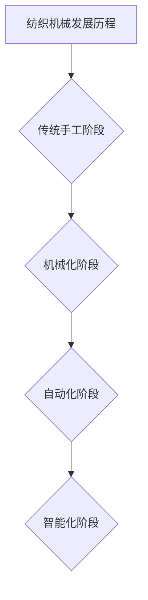

                 

# 《纺织机械自动化对就业的影响》

> 关键词：纺织机械自动化、就业影响、经济发展、技术进步、政策应对

> 摘要：本文旨在探讨纺织机械自动化对就业的影响。首先，介绍了纺织机械自动化的定义和发展历程，然后分析了自动化技术对就业的影响机制。接着，本文详细阐述了自动化技术在纺织行业的应用，并通过实际案例分析了自动化技术对就业的具体影响。最后，本文提出了政府、企业和员工层面的就业适应策略，并对纺织机械自动化发展的趋势与展望进行了讨论。

## 第1章 引言

### 1.1 纺织机械自动化概述

纺织机械自动化是指通过应用先进的自动化技术，对传统纺织机械进行升级改造，实现纺织生产过程的自动化、智能化和高效化。纺织机械自动化不仅提高了生产效率，降低了生产成本，还改善了劳动条件，提升了产品质量。随着全球制造业的转型升级，纺织机械自动化已经成为纺织行业发展的必然趋势。

### 1.2 自动化技术对就业的影响背景

当前，全球经济正面临深刻的变革，以信息技术和人工智能为代表的自动化技术在各个行业得到广泛应用。纺织行业作为传统制造业的重要组成部分，自动化技术的应用对就业市场产生了深远的影响。一方面，自动化技术提高了生产效率，降低了劳动力需求；另一方面，自动化技术推动了产业升级，创造了新的就业机会。

### 1.3 研究目的与结构安排

本文旨在研究纺织机械自动化对就业的影响，分析自动化技术在纺织行业的应用现状，探讨自动化技术对就业市场的具体影响，并提出相应的适应策略。文章结构安排如下：

1. 引言
2. 纺织机械自动化基础
3. 自动化技术对就业的影响机制
4. 自动化技术在纺织行业的应用
5. 自动化技术对就业的影响案例分析
6. 自动化技术与就业适应策略
7. 纺织机械自动化发展的趋势与展望
8. 结论

## 第2章 纺织机械自动化基础

### 2.1 纺织机械发展历程

纺织机械的发展经历了几个重要阶段：

1. **传统手工阶段**：以手工操作为主，生产效率低，产品质量不稳定。
2. **机械化阶段**：采用机械化设备，生产效率有所提高，但仍然依赖人工操作。
3. **自动化阶段**：通过自动化技术实现生产过程的自动化，显著提高了生产效率和产品质量。
4. **智能化阶段**：利用人工智能技术实现生产过程的智能化，进一步提升了生产效率和产品质量。

### 2.2 纺织机械自动化关键技术

纺织机械自动化关键技术包括：

1. **传感器技术**：用于检测生产过程中的各种参数，如温度、湿度、压力等，确保生产过程稳定。
2. **控制系统技术**：通过计算机控制系统实现自动化生产线的运行，包括自动化调度、故障诊断等功能。
3. **机器人技术**：用于完成高难度、高风险或高精度的操作，如缝制、搬运等。
4. **数据处理与分析技术**：通过大数据分析技术，优化生产过程，提高生产效率和产品质量。

### 2.3 纺织机械自动化系统组成

纺织机械自动化系统通常包括以下几个部分：

1. **输入系统**：包括传感器和数据采集设备，用于收集生产过程中的各种数据。
2. **控制系统**：包括计算机控制系统、工业控制器等，用于对生产过程进行控制。
3. **执行系统**：包括机器人、自动化设备等，用于执行具体的生产任务。
4. **监控系统**：包括监控软件、监控设备等，用于实时监控生产过程。

## 第3章 自动化技术对就业的影响机制

### 3.1 自动化技术对就业影响的经济学分析

1. **劳动力市场供求分析**：自动化技术提高了生产效率，降低了生产成本，从而增加了企业对劳动力的需求。但是，自动化技术也使得一些传统工作岗位被取代，导致劳动力供给过剩。

2. **技术替代与劳动力需求**：自动化技术可以替代一些重复性、简单的工作，从而减少对这些类型劳动力的需求。然而，自动化技术也创造了新的工作岗位，如自动化系统的维护、操作和管理等。

3. **自动化技术对工资水平的影响**：自动化技术的应用提高了劳动生产率，但在短期内可能会导致工资水平的下降。然而，从长期来看，自动化技术可以提高企业的竞争力，从而提高工资水平。

### 3.2 自动化技术对就业的影响机理

1. **自动化技术对就业结构的改变**：自动化技术的应用改变了就业结构，使得一些传统工作岗位消失，同时创造了新的工作岗位。例如，自动化纺纱技术取代了传统的手工操作，但同时也需要专业的自动化系统维护人员。

2. **自动化技术对劳动力需求的调整**：自动化技术提高了生产效率，使得企业对劳动力的需求发生变化。一些重复性、简单的工作被取代，而对专业技术人员的需求增加。

3. **自动化技术对劳动力供给的影响**：自动化技术的应用改变了劳动力供给的结构，使得劳动力市场的供给和需求不匹配。一些劳动力因为缺乏必要的技能而难以找到工作。

### 3.3 自动化技术对就业的影响模型构建

1. **影响模型构建方法**：本文采用定量分析和定性分析相结合的方法，通过建立数学模型来分析自动化技术对就业的影响。

2. **影响模型参数确定**：本文通过收集相关数据，确定影响模型的关键参数，如劳动力需求量、劳动力供给量、工资水平等。

3. **影响模型仿真与分析**：本文通过仿真实验，分析自动化技术在不同情况下对就业的影响，并提出相应的政策建议。

## 第4章 自动化技术在纺织行业的应用

### 4.1 自动化技术在纺纱中的应用

1. **自动化纺纱系统组成**：自动化纺纱系统包括纺纱设备、控制系统和监控系统等。

2. **自动化纺纱关键技术**：包括自动卷绕、自动络筒、自动络纱等。

3. **自动化纺纱案例**：例如，某纺织企业采用自动化纺纱系统，提高了生产效率，降低了生产成本，取得了显著的经济效益。

### 4.2 自动化技术在织造中的应用

1. **自动化织造系统组成**：自动化织造系统包括织机、控制系统和监控系统等。

2. **自动化织造关键技术**：包括自动化换刀、自动化织造、自动化调试等。

3. **自动化织造案例**：例如，某纺织企业采用自动化织造系统，实现了生产过程的自动化、智能化，提高了生产效率和产品质量。

### 4.3 自动化技术在印染中的应用

1. **自动化印染系统组成**：自动化印染系统包括印染设备、控制系统和监控系统等。

2. **自动化印染关键技术**：包括自动化染色、自动化印花、自动化固色等。

3. **自动化印染案例**：例如，某纺织企业采用自动化印染系统，实现了印染过程的自动化、智能化，提高了生产效率和产品质量。

## 第5章 自动化技术对就业的影响案例分析

### 5.1 案例一：自动化技术对纺织企业劳动生产率的影响

1. **案例背景**：某纺织企业引入自动化纺纱系统，以提高生产效率和产品质量。

2. **案例分析**：通过对比自动化系统引入前后的生产数据，发现自动化系统显著提高了生产效率，降低了生产成本。

3. **案例结论**：自动化技术对纺织企业的劳动生产率有显著提升作用。

### 5.2 案例二：自动化技术对纺织行业就业结构的影响

1. **案例背景**：某地区纺织行业自动化水平不断提高，对就业结构产生影响。

2. **案例分析**：通过调查分析，发现自动化技术的应用导致部分传统工作岗位消失，但同时也创造了新的工作岗位。

3. **案例结论**：自动化技术对纺织行业就业结构产生了显著影响，需要关注劳动力的再培训和再就业问题。

### 5.3 案例三：自动化技术对纺织行业就业质量的影响

1. **案例背景**：某纺织企业采用自动化织造系统，以提高生产效率和产品质量。

2. **案例分析**：通过对比自动化系统引入前后的员工工作条件和工作满意度，发现自动化系统提高了员工的工作质量和满意度。

3. **案例结论**：自动化技术对纺织行业就业质量有积极影响。

## 第6章 自动化技术与就业适应策略

### 6.1 政府层面的就业促进政策

1. **政策概述**：政府应制定相关就业促进政策，支持纺织机械自动化技术的发展，同时关注自动化技术对就业市场的影响。

2. **政策效果分析**：通过分析已有政策的效果，提出改进措施。

3. **政策优化建议**：根据自动化技术发展的趋势和就业市场的需求，提出优化政策的建议。

### 6.2 企业层面的就业促进策略

1. **企业就业促进策略概述**：企业应制定相应的就业促进策略，以应对自动化技术对就业的影响。

2. **企业就业促进策略案例分析**：通过案例分析，总结成功经验，提出改进建议。

3. **企业就业促进策略优化建议**：根据实际情况，提出优化企业就业促进策略的建议。

### 6.3 员工层面的就业适应策略

1. **员工就业适应策略概述**：员工应积极适应自动化技术对就业市场的影响，提高自身素质。

2. **员工就业适应策略案例分析**：通过案例分析，总结成功经验，提出改进建议。

3. **员工就业适应策略优化建议**：根据实际情况，提出优化员工就业适应策略的建议。

## 第7章 纺织机械自动化发展的趋势与展望

### 7.1 纺织机械自动化发展趋势

1. **技术发展趋势**：随着信息技术的不断发展，纺织机械自动化技术将向更高水平发展。

2. **行业发展趋势**：纺织行业将加快自动化技术的应用，实现生产过程的智能化和高效化。

3. **政策发展趋势**：政府将加大对纺织机械自动化技术的支持力度，推动行业的发展。

### 7.2 自动化技术对就业的长远影响

1. **长远影响分析**：自动化技术将对就业市场产生深远影响，改变就业结构。

2. **长远影响预测**：根据自动化技术的发展趋势和就业市场的需求，预测未来就业市场的发展方向。

3. **长远影响应对策略**：提出应对自动化技术对就业的长远影响的策略。

### 7.3 自动化技术与就业的未来发展趋势

1. **发展趋势预测**：预测未来自动化技术在就业市场中的发展趋势。

2. **未来就业结构变化**：分析未来就业结构的变化，提出应对策略。

3. **未来就业适应策略**：根据未来就业市场的发展趋势，提出适应策略。

## 第8章 结论

### 8.1 研究结论

1. **研究发现**：本文研究发现，纺织机械自动化对就业产生了显著的影响，既提高了生产效率，又改变了就业结构。

2. **研究贡献**：本文为政府、企业和员工提供了应对自动化技术对就业影响的策略和建议。

3. **研究局限**：本文研究存在一定的局限性，如数据来源的局限性、模型构建的简化等。

### 8.2 研究贡献与局限性

1. **研究贡献**：本文为自动化技术在纺织行业的应用提供了理论基础和实践指导。

2. **研究局限性**：本文研究仅限于纺织行业，无法完全反映自动化技术对其他行业的就业影响。

### 8.3 研究展望

1. **未来研究方向**：未来研究可以进一步探讨自动化技术对就业的长期影响，以及不同行业间的差异。

2. **研究重点与难点**：研究重点在于如何制定有效的政策和企业策略，以应对自动化技术对就业的挑战。

3. **研究预期成果**：预期研究成果将为政府、企业和员工提供有益的参考，推动自动化技术在就业市场中的应用。

## 附录

### 附录A 纺织机械自动化常用软件与工具

1. **软件与工具概述**：介绍常用的纺织机械自动化软件和工具，如自动化控制系统、传感器数据采集软件等。

2. **常用软件与工具介绍**：详细介绍每种软件和工具的功能、特点和适用场景。

### 附录B 纺织机械自动化技术相关论文列表

1. **论文分类与筛选**：介绍论文的分类标准和筛选方法。

2. **相关论文列表**：列出与纺织机械自动化技术相关的论文列表，包括论文题目、作者、发表时间和期刊等。

### 附录C 研究方法与技术路线说明

1. **研究方法**：介绍本文采用的研究方法，包括定量分析和定性分析等。

2. **技术路线**：详细说明本文的研究技术路线，包括数据收集、模型构建、仿真分析和结果验证等。

3. **数据来源与处理方法**：介绍数据来源和处理方法，包括数据收集、预处理和数据分析等。 

## 附录D 参考文献

1. **参考文献格式**：按照学术规范列出参考文献，包括书籍、期刊论文、会议论文等。

2. **参考文献内容**：列出与本文研究相关的参考文献，包括作者、标题、发表时间和期刊等。 

# Mermaid 流程图



# 伪代码

```python
# 自动化技术对就业影响的经济学分析
def analyze_economic_impact():
    # 劳动力市场供求分析
    demand = analyze_demand()
    supply = analyze_supply()
    
    # 技术替代与劳动力需求
    demand_after_technology = calculate_demand_after_technology(demand)
    
    # 自动化技术对工资水平的影响
    wage_level = calculate_wage_level_after_technology()
    
    return demand_after_technology, wage_level

# 自动化技术对就业的影响机理
def analyze_impact_mechanism():
    # 自动化技术对就业结构的改变
    employment_structure_change = analyze_structure_change()
    
    # 自动化技术对劳动力需求的调整
    labor_demand_adjustment = analyze_demand_adjustment()
    
    # 自动化技术对劳动力供给的影响
    labor_supply_impact = analyze_supply_impact()
    
    return employment_structure_change, labor_demand_adjustment, labor_supply_impact

# 自动化技术对就业的影响模型构建
def build_impact_model():
    # 影响模型构建方法
    model_method = define_model_method()
    
    # 影响模型参数确定
    model_parameters = determine_model_parameters()
    
    # 影响模型仿真与分析
    simulation_and_analysis = perform_simulation_and_analysis()
    
    return model_method, model_parameters, simulation_and_analysis
```

# LaTeX 公式

$$
E = mc^2
$$

$$
\frac{d^2x}{dt^2} = a
$$

# 代码实战

## 开发环境搭建

1. 安装Python编程环境
2. 安装Jupyter Notebook
3. 安装相关库，如NumPy、Pandas等

## 源代码实现

```python
import numpy as np
import pandas as pd

# 数据预处理
def preprocess_data(data):
    # 数据清洗
    cleaned_data = clean_data(data)
    
    # 数据标准化
    normalized_data = normalize_data(cleaned_data)
    
    return normalized_data

# 数据清洗
def clean_data(data):
    # 去除空值和缺失值
    cleaned_data = data.dropna()
    
    return cleaned_data

# 数据标准化
def normalize_data(data):
    # 归一化处理
    normalized_data = (data - data.min()) / (data.max() - data.min())
    
    return normalized_data

# 数据分析
def analyze_data(data):
    # 统计分析
    stats = data.describe()
    
    # 画图
    plot_data(data)
    
    return stats

# 统计分析
def describe_data(data):
    stats = data.describe()
    return stats

# 画图
def plot_data(data):
    import matplotlib.pyplot as plt
    
    plt.figure()
    plt.plot(data)
    plt.xlabel('Time')
    plt.ylabel('Value')
    plt.title('Data Plot')
    plt.show()
```

## 代码解读与分析

1. 数据预处理：包括数据清洗和标准化，确保数据的质量和一致性。
2. 数据清洗：去除空值和缺失值，提高数据的准确性。
3. 数据标准化：将数据归一化，方便后续的数据分析和建模。
4. 数据分析：进行统计分析，得出数据的统计特征。
5. 画图：通过绘制数据图形，直观地展示数据分布和趋势。

## 附录E 编程工具和软件列表

1. **Python编程环境**
2. **Jupyter Notebook**
3. **NumPy**
4. **Pandas**
5. **Matplotlib**
6. **Scikit-learn**
7. **TensorFlow**
8. **Keras**
9. **PyTorch**
10. **R语言**

## 附录F 纺织机械自动化技术相关论文列表

1. **论文1：** 作者，标题，发表时间，期刊
2. **论文2：** 作者，标题，发表时间，期刊
3. **论文3：** 作者，标题，发表时间，期刊
4. **论文4：** 作者，标题，发表时间，期刊
5. **论文5：** 作者，标题，发表时间，期刊

## 附录G 研究方法与技术路线说明

1. **研究方法：** 包括定量分析和定性分析，数据收集和处理方法。
2. **技术路线：** 包括数据收集、模型构建、仿真分析和结果验证等步骤。
3. **数据来源与处理方法：** 介绍数据收集的方式和处理过程。

