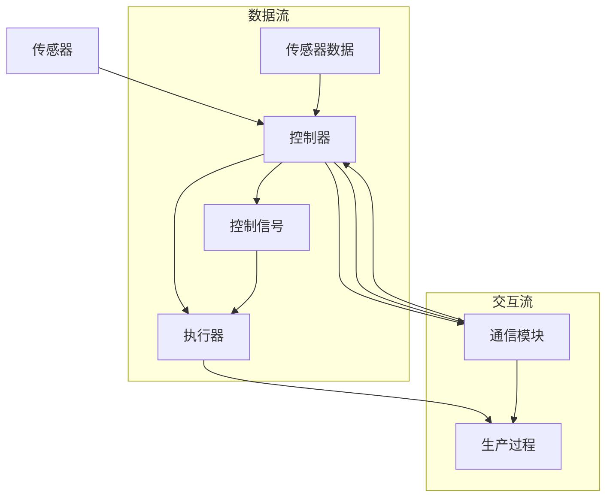
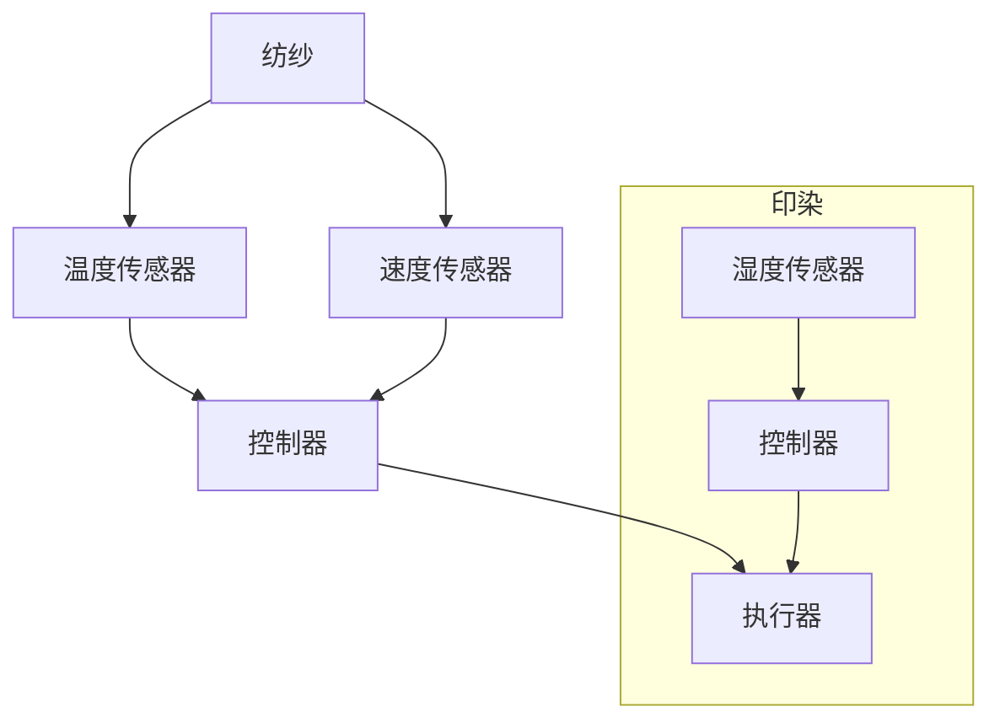
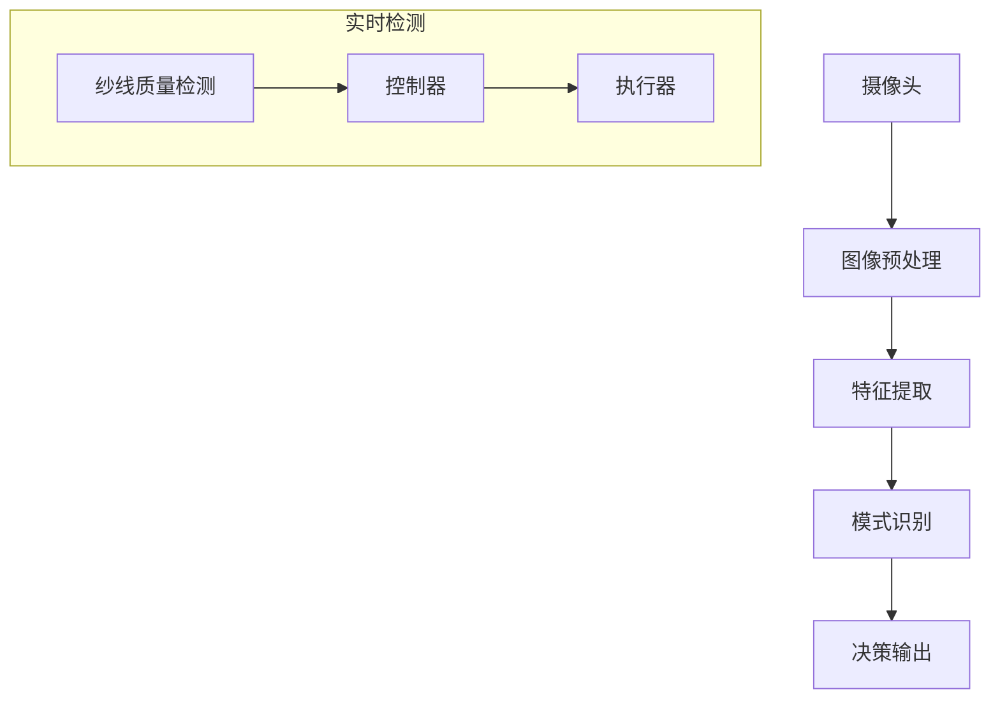
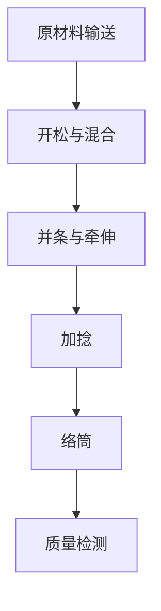
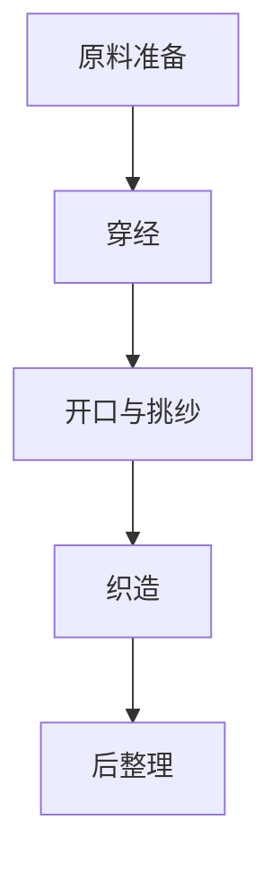
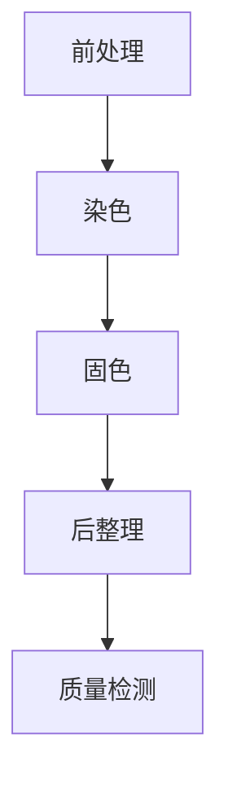

                 

### 文章标题：纺织机械自动化的历史影响

#### 关键词：
- 纺织机械
- 自动化技术
- 工业革命
- 机器视觉
- 人工智能

#### 摘要：
本文系统地探讨了纺织机械自动化的历史发展、核心技术、应用实例及未来趋势。首先，回顾了纺织机械自动化的起源与早期发展，分析了其在工业革命中的重要作用。随后，深入介绍了自动化技术的核心原理，包括自动控制系统、传感技术和机器视觉技术。接着，通过具体案例，展示了自动化技术在纺纱、织造和印染等环节的实际应用，并探讨了其发展趋势。最后，分析了纺织机械自动化面临的技术与市场挑战，提出了相应的对策建议，并对未来的发展前景进行了展望。本文旨在为读者提供一个全面而深入的纺织机械自动化技术分析，以期为相关领域的研究与应用提供参考。

### 目录大纲：

- 第一部分：引言与历史背景
  - 1.1 纺织机械自动化的起源与发展
  - 1.2 历史影响与科技进步
- 第二部分：核心技术原理与架构
  - 2.1 纺织机械自动化的核心技术
  - 2.2 纺织机械自动化系统架构
- 第三部分：自动化技术在纺织工业中的应用
  - 3.1 自动化技术在纺纱中的应用
  - 3.2 自动化技术在织造中的应用
  - 3.3 自动化技术在印染中的应用
- 第四部分：案例分析与实践应用
  - 4.1 案例分析
  - 4.2 实践应用
- 第五部分：未来发展趋势与挑战
  - 5.1 纺织机械自动化技术未来发展趋势
  - 5.2 纺织机械自动化面临的挑战与对策
- 第六部分：结论与展望
  - 6.1 研究结论
  - 6.2 展望未来

---

# 第一部分：引言与历史背景

## 1.1 纺织机械自动化的起源与发展

纺织机械自动化是现代纺织工业发展的重要里程碑，其起源可以追溯到工业革命的兴起。工业革命时期，机械化和自动化技术开始被广泛应用于纺织行业，极大地提高了生产效率，降低了生产成本。纺织机械自动化的起源与发展，大致可以分为以下几个阶段：

### 1.1.1 纺织工业的发展历程

纺织工业是人类社会最早出现的工业之一。从手工制作到机械化生产，再到自动化生产，纺织工业的发展历程体现了人类对效率的追求和技术的进步。早期的纺织工业主要依靠手工操作，生产效率低下，产品质量不稳定。

19世纪末，随着蒸汽机的发明和广泛应用，纺织机械开始大规模投入使用，如纺纱机、织布机等。这些机械的运用，使纺织品的生产效率得到了显著提高，同时也促进了纺织行业的快速发展。

### 1.1.2 纺织机械自动化的需求与挑战

随着纺织工业的不断发展，生产规模不断扩大，手工操作已经无法满足市场需求。因此，纺织机械自动化应运而生。纺织机械自动化的需求主要源于以下几个方面：

1. **提高生产效率**：自动化技术能够实现24小时不间断生产，大大提高了生产效率。
2. **降低生产成本**：自动化减少了人工操作，降低了劳动力成本，同时减少了由于人工操作带来的质量问题。
3. **产品质量稳定**：自动化技术能够精确控制生产过程，确保产品质量的稳定性。

然而，纺织机械自动化也面临一系列挑战，如：

1. **技术难度**：早期自动化技术较为复杂，对技术人员的专业水平要求较高。
2. **设备成本**：自动化设备的初期投资较大，对于中小企业来说，是一个不小的负担。
3. **维护困难**：自动化设备需要定期维护，否则容易发生故障，影响生产。

### 1.1.3 纺织机械自动化的重要性

纺织机械自动化在纺织工业中具有重要地位，主要体现在以下几个方面：

1. **提升生产效率**：自动化技术使生产过程更加高效，缩短了生产周期。
2. **提高产品质量**：自动化技术能够精确控制生产过程，确保产品质量的稳定性。
3. **降低生产成本**：自动化减少了人工操作，降低了劳动力成本，同时减少了由于人工操作带来的质量问题。
4. **促进产业升级**：自动化技术推动了纺织工业的转型升级，为新兴产业的崛起提供了动力。

总的来说，纺织机械自动化不仅是纺织工业发展的必然趋势，也是现代工业发展的重要标志。它不仅提高了生产效率和质量，还推动了产业结构的优化升级，对整个社会经济的发展产生了深远影响。

### 1.2 历史影响与科技进步

纺织机械自动化对纺织工业乃至整个社会产生了深远的影响。其历史影响主要体现在以下几个方面：

#### 1.2.1 纺织机械自动化的早期影响

在纺织机械自动化初期，主要影响体现在以下几个方面：

1. **生产效率显著提升**：自动化技术的引入，使纺织生产效率得到了大幅提升。例如，自动纺纱机相比传统手工纺纱，生产效率提高了数倍。
2. **产品质量稳定性提高**：自动化技术通过精确控制生产过程，确保了产品质量的稳定性，减少了由于手工操作带来的质量问题。
3. **劳动力成本降低**：自动化技术减少了人工操作，降低了劳动力成本，提高了企业的经济效益。

#### 1.2.2 20世纪中期自动化技术的突破

20世纪中期，自动化技术取得了重大突破，对纺织工业的影响更加深远：

1. **机器视觉技术的应用**：随着计算机技术的发展，机器视觉技术在纺织机械中得到了广泛应用。例如，自动检测系统可以实时监控纺织产品的质量，自动排除不合格品。
2. **自动化控制系统的发展**：自动化控制系统的发展，使纺织机械的智能化程度得到了显著提升。通过引入PLC（可编程逻辑控制器）等控制技术，实现了对生产过程的精确控制，提高了生产效率。
3. **传感器技术的进步**：传感器技术在纺织机械中的应用，使生产过程的监测和控制更加精确。例如，温度传感器、压力传感器等，可以实时监测生产参数，确保生产过程的安全和稳定。

#### 1.2.3 当代纺织机械自动化技术的进展

进入21世纪，纺织机械自动化技术不断进步，呈现出以下发展趋势：

1. **人工智能与物联网技术的融合**：人工智能和物联网技术的融合，使纺织机械自动化进入了智能化时代。通过大数据分析和机器学习，实现了对生产过程的实时监控和优化，提高了生产效率。
2. **绿色环保技术的应用**：随着环保意识的增强，绿色环保技术在纺织机械中得到广泛应用。例如，无水印染技术、低碳纺纱技术等，不仅提高了生产效率，还减少了环境污染。
3. **高效节能技术的推广**：高效节能技术在纺织机械中得到了广泛应用，例如，变频调速技术、节能照明技术等，降低了能源消耗，提高了企业的经济效益。

总的来说，纺织机械自动化技术的发展，不仅提高了纺织工业的生产效率和质量，还推动了整个社会的科技进步。它不仅是现代工业发展的必然趋势，也是实现产业升级和可持续发展的重要途径。

### 1.3 纺织机械自动化的未来发展趋势

随着科技的不断进步，纺织机械自动化技术也在不断演进。未来，纺织机械自动化技术将呈现出以下发展趋势：

1. **智能化水平提升**：随着人工智能技术的发展，纺织机械将具备更高的智能化水平，能够实现自我学习和优化，提高生产效率和产品质量。
2. **物联网技术的广泛应用**：物联网技术将在纺织机械中得到更广泛的应用，实现设备之间的互联互通，提高生产过程的监控和管理水平。
3. **绿色环保技术的推广**：随着环保意识的增强，绿色环保技术将在纺织机械中得到更广泛的应用，降低能源消耗和环境污染。
4. **高效节能技术的普及**：高效节能技术将在纺织机械中得到更广泛的普及，降低生产成本，提高企业的经济效益。

总的来说，纺织机械自动化技术的发展，将推动纺织工业的转型升级，为实现可持续发展和产业升级提供有力支持。未来，纺织机械自动化技术将继续朝着智能化、绿色化、高效化的方向发展，为纺织工业带来更多创新和机遇。

## 1.1 纺织机械自动化的起源与发展

纺织机械自动化的起源可以追溯到18世纪末和19世纪初的工业革命时期。在那个时期，手工作坊的生产模式已经无法满足日益增长的市场需求，迫切需要提高生产效率和降低成本。随着蒸汽机的发明和广泛应用，机械化生产逐渐取代了手工生产，成为纺织工业的主要生产方式。这一时期，纺织机械的发明和改进大大提高了生产效率，但仍然依赖于人力操作。

真正意义上的纺织机械自动化始于20世纪初期。随着电气化技术的进步，自动化机械开始被引入纺织工业。最早的自动化纺织机械包括自动纺纱机和自动织布机，它们通过简单的电气控制实现了部分自动化操作。这些自动化的纺织机械大大减少了人力需求，提高了生产效率，同时也为后续的自动化技术发展奠定了基础。

### 纺织工业的发展历程

纺织工业的发展历程可以追溯到几千年前。早期的纺织工艺主要依赖于手工操作，生产效率低下，产品质量不稳定。随着技术的不断进步，纺织机械逐渐被发明和改进，生产效率得到了显著提高。19世纪末，随着蒸汽机的发明和广泛应用，纺织机械开始大规模投入使用，如纺纱机、织布机等。这些机械的运用，使纺织品的生产效率得到了显著提升，同时也促进了纺织行业的快速发展。

20世纪初期，随着电气化技术的进步，自动化机械开始被引入纺织工业。最早的自动化纺织机械包括自动纺纱机和自动织布机，它们通过简单的电气控制实现了部分自动化操作。这些自动化的纺织机械大大减少了人力需求，提高了生产效率，同时也为后续的自动化技术发展奠定了基础。

20世纪中期，随着计算机技术和自动化控制技术的发展，纺织机械的自动化水平得到了显著提升。计算机控制的纺织机械能够实现更精确的生产过程控制，提高了产品质量和一致性。同时，传感技术和机器视觉技术的引入，使纺织机械的智能化水平得到了进一步提升。

进入21世纪，随着人工智能、物联网和大数据技术的快速发展，纺织机械自动化进入了智能化时代。现代纺织机械不仅能够实现高效的生产过程控制，还能够通过大数据分析和机器学习技术，实现生产过程的实时优化和预测。例如，智能纺纱机可以通过实时监测纱线的质量参数，自动调整纺纱参数，确保纱线的质量。

### 纺织机械自动化的需求与挑战

纺织机械自动化的需求主要源于以下几个方面：

1. **提高生产效率**：自动化技术能够实现24小时不间断生产，大大提高了生产效率。
2. **降低生产成本**：自动化减少了人工操作，降低了劳动力成本，同时减少了由于人工操作带来的质量问题。
3. **产品质量稳定**：自动化技术能够精确控制生产过程，确保产品质量的稳定性。
4. **适应市场需求变化**：随着市场需求的不断变化，自动化生产能够快速调整生产计划，满足不同客户的需求。

然而，纺织机械自动化也面临一系列挑战，如：

1. **技术难度**：早期自动化技术较为复杂，对技术人员的专业水平要求较高。
2. **设备成本**：自动化设备的初期投资较大，对于中小企业来说，是一个不小的负担。
3. **维护困难**：自动化设备需要定期维护，否则容易发生故障，影响生产。

为了应对这些挑战，纺织机械自动化的发展需要解决以下几个问题：

1. **技术简化**：通过研发更简单易用的自动化设备，降低对技术人员专业水平的要求。
2. **成本降低**：通过技术创新和规模化生产，降低自动化设备的成本，使其更易于中小企业接受。
3. **维护简化**：通过提高设备可靠性和易维护性，降低设备的维护难度，减少对专业技术人员的需求。

### 1.3 纺织机械自动化的重要性

纺织机械自动化在纺织工业中具有重要地位，主要体现在以下几个方面：

1. **提升生产效率**：自动化技术能够实现24小时不间断生产，大大提高了生产效率，缩短了生产周期。
2. **提高产品质量**：自动化技术能够精确控制生产过程，确保产品质量的稳定性，减少了由于人工操作带来的质量问题。
3. **降低生产成本**：自动化减少了人工操作，降低了劳动力成本，提高了生产效率，降低了生产成本。
4. **促进产业升级**：纺织机械自动化推动了纺织工业的转型升级，为新兴产业的崛起提供了动力。

总的来说，纺织机械自动化不仅是纺织工业发展的必然趋势，也是现代工业发展的重要标志。它不仅提高了生产效率和质量，还推动了产业结构的优化升级，对整个社会经济的发展产生了深远影响。

## 1.2 历史影响与科技进步

纺织机械自动化在历史上产生了深远的影响，不仅改变了纺织工业的生产模式，还对科技进步产生了重要推动作用。

### 1.2.1 纺织机械自动化的早期影响

纺织机械自动化的早期影响主要体现在以下几个方面：

1. **生产效率的提升**：自动化技术的引入，使得纺织生产从手工操作转向机械化操作，生产效率得到了显著提高。例如，早期的自动纺纱机和自动织布机，通过自动化设备替代了大量的手工劳动，大大缩短了生产周期，提高了产量。

2. **产品质量的稳定性**：自动化技术的应用，使得生产过程更加精确和可控。通过自动化的生产流程，可以减少人为操作带来的误差，从而提高了产品的质量稳定性。例如，自动化的纱线生产过程中，可以精确控制纺纱的张力、速度等参数，确保纱线的均匀性和质量。

3. **劳动力成本的降低**：自动化技术减少了对于人力的依赖，降低了劳动力成本。在早期，纺织工业是一个劳动密集型行业，自动化技术的应用，使得企业不再需要大量的人力投入，从而降低了生产成本。

### 1.2.2 20世纪中期自动化技术的突破

20世纪中期，自动化技术取得了重大突破，对纺织工业的影响更加深远：

1. **机器视觉技术的应用**：随着计算机技术的发展，机器视觉技术在纺织机械中得到了广泛应用。例如，自动检测系统可以实时监控纺织产品的质量，自动排除不合格品。这不仅提高了生产效率，还保证了产品质量。

2. **自动化控制系统的发展**：自动化控制系统的发展，使得纺织机械的智能化程度得到了显著提升。通过引入PLC（可编程逻辑控制器）等控制技术，实现了对生产过程的精确控制，提高了生产效率。自动化控制系统可以根据实时数据，自动调整生产参数，确保生产过程的稳定和高效。

3. **传感器技术的进步**：传感器技术在纺织机械中的应用，使得生产过程的监测和控制更加精确。例如，温度传感器、压力传感器等，可以实时监测生产参数，确保生产过程的安全和稳定。

### 1.2.3 当代纺织机械自动化技术的进展

进入21世纪，纺织机械自动化技术继续快速发展，呈现出以下趋势：

1. **人工智能与物联网技术的融合**：人工智能和物联网技术的融合，使得纺织机械自动化进入了智能化时代。通过大数据分析和机器学习技术，实现了对生产过程的实时监控和优化。例如，智能纺纱机可以通过实时监测纱线的质量参数，自动调整纺纱参数，确保纱线的质量。

2. **绿色环保技术的应用**：随着环保意识的增强，绿色环保技术在纺织机械中得到广泛应用。例如，无水印染技术、低碳纺纱技术等，不仅提高了生产效率，还减少了环境污染。

3. **高效节能技术的推广**：高效节能技术在纺织机械中得到了广泛应用，例如，变频调速技术、节能照明技术等，降低了能源消耗，提高了企业的经济效益。

总的来说，纺织机械自动化技术的发展，不仅提高了纺织工业的生产效率和质量，还推动了整个社会的科技进步。它不仅是现代工业发展的必然趋势，也是实现产业升级和可持续发展的重要途径。

## 1.3 纺织机械自动化的未来发展趋势

随着科技的不断进步，纺织机械自动化技术也在不断演进。未来，纺织机械自动化技术将呈现出以下发展趋势：

1. **智能化水平提升**：随着人工智能技术的发展，纺织机械将具备更高的智能化水平，能够实现自我学习和优化，提高生产效率和产品质量。例如，通过机器学习算法，自动化设备可以不断优化生产参数，提高生产效率。

2. **物联网技术的广泛应用**：物联网技术将在纺织机械中得到更广泛的应用，实现设备之间的互联互通，提高生产过程的监控和管理水平。例如，通过物联网技术，企业可以实现远程监控生产设备，实时获取设备运行状态和生产数据，从而更好地进行生产管理和决策。

3. **绿色环保技术的推广**：随着环保意识的增强，绿色环保技术在纺织机械中得到广泛应用，例如，无水印染技术、低碳纺纱技术等。这些技术不仅提高了生产效率，还减少了能源消耗和环境污染，符合可持续发展要求。

4. **高效节能技术的普及**：高效节能技术在纺织机械中得到了广泛应用，例如，变频调速技术、节能照明技术等。这些技术降低了能源消耗，提高了企业的经济效益。

5. **定制化生产**：随着消费者需求的多样化，纺织机械自动化将实现定制化生产。通过自动化设备，企业可以快速调整生产计划，满足不同客户的需求，提高市场响应速度。

总的来说，纺织机械自动化技术的发展，将推动纺织工业的转型升级，为实现可持续发展和产业升级提供有力支持。未来，纺织机械自动化技术将继续朝着智能化、绿色化、高效化的方向发展，为纺织工业带来更多创新和机遇。

## 第二部分：核心技术原理与架构

## 2.1 纺织机械自动化的核心技术

纺织机械自动化的核心技术主要包括自动控制系统、传感技术和机器视觉技术。这些技术共同构成了纺织机械自动化的基础，使得纺织生产过程更加高效、稳定和智能化。

### 2.1.1 自动控制系统原理

自动控制系统是纺织机械自动化的核心，其原理是利用传感器获取实时数据，通过控制器进行处理和决策，然后执行相应的操作。以下是自动控制系统的基本组成和常用控制算法的原理：

#### 2.1.1.1 控制系统的基本组成

一个典型的自动控制系统通常由以下几个部分组成：

1. **传感器**：用于检测和控制对象的状态，如温度、压力、速度等。
2. **控制器**：核心部分，负责接收传感器数据，进行计算和处理，然后生成控制信号。
3. **执行器**：根据控制器的指令进行相应的操作，如调整电机转速、阀门开关等。
4. **通信模块**：负责系统内部和外部的通信，确保数据的传输和交换。

#### 2.1.1.2 常用控制算法与实现

常见的控制算法包括PID控制、模糊控制和神经网络控制等：

- **PID控制**：PID（比例-积分-微分）控制是最常用的控制算法之一。它通过调节比例、积分和微分三个参数，实现对系统的精确控制。PID控制的原理如下：
  - 比例（P）控制：根据当前误差大小进行控制，误差越大，控制力越大。
  - 积分（I）控制：对误差进行累积，消除稳态误差。
  - 微分（D）控制：根据误差的变化率进行控制，对系统的动态响应进行预测和调整。

  伪代码实现如下：
  ```python
  def PIDControl(error, Kp, Ki, Kd):
      P = Kp * error
      I = Ki * sum(error)
      D = Kd * (error - previous_error)
      previous_error = error
      return P + I + D
  ```

- **模糊控制**：模糊控制通过模糊逻辑对系统进行控制，适用于非线性、复杂系统的控制。模糊控制的原理如下：
  - 输入变量和输出变量都通过模糊集合表示。
  - 通过模糊规则库进行推理，生成控制信号。

  伪代码实现如下：
  ```python
  def FuzzyControl(input_variables, rule_base):
      fuzzy_output = FuzzyInference(input_variables, rule_base)
      return defuzzify(fuzzy_output)
  ```

- **神经网络控制**：神经网络控制通过训练神经网络，实现对系统的自适应控制。神经网络控制的原理如下：
  - 使用历史数据训练神经网络，使其学会系统的动态特性。
  - 通过神经网络的输出，生成控制信号。

  伪代码实现如下：
  ```python
  def NeuralNetworkControl(input_data, neural_network):
      output = neural_network.predict(input_data)
      return output
  ```

### 2.1.2 传感技术与应用

传感技术是纺织机械自动化的重要组成部分，通过传感器可以实时获取纺织生产过程中的各种参数，为自动控制系统提供依据。以下介绍常见的传感器类型及其原理：

#### 2.1.2.1 传感器类型及原理

- **温度传感器**：用于测量纺织生产过程中的温度参数，常见的有热电偶、热敏电阻等。
- **压力传感器**：用于测量纺织生产过程中的压力参数，常见的有压电传感器、弹性体传感器等。
- **速度传感器**：用于测量纺织生产过程中的速度参数，常见的有光电传感器、霍尔传感器等。
- **湿度传感器**：用于测量纺织生产过程中的湿度参数，常见的有电容式传感器、电阻式传感器等。

#### 2.1.2.2 传感技术在纺织机械中的应用

- **温度控制**：通过温度传感器实时监测纺纱过程中的温度，自动调整加热设备的功率，确保纺纱温度的稳定。
- **压力控制**：通过压力传感器实时监测织造过程中的压力，自动调整织机的压力设置，保证织造质量。
- **速度控制**：通过速度传感器实时监测纱线速度，自动调整纺纱机的转速，确保纱线质量。
- **湿度控制**：通过湿度传感器实时监测印染过程中的湿度，自动调整湿度控制系统，保证印染效果。

### 2.1.3 机器视觉技术

机器视觉技术是纺织机械自动化中的重要组成部分，通过图像处理和模式识别技术，可以实现纺织产品的自动检测和分类。以下是机器视觉系统的工作原理及其在纺织机械中的应用：

#### 2.1.3.1 机器视觉系统的工作原理

机器视觉系统的工作原理可以概括为以下几个步骤：

1. **图像获取**：通过摄像头或其他图像传感器获取纺织产品的图像。
2. **图像预处理**：对获取的图像进行预处理，如去噪、增强、滤波等，提高图像质量。
3. **特征提取**：从预处理后的图像中提取关键特征，如颜色、形状、纹理等。
4. **模式识别**：使用模式识别算法对提取的特征进行分类和识别，判断纺织产品的质量。
5. **决策输出**：根据识别结果，生成相应的决策，如合格品、不合格品分类，或者生产参数调整。

#### 2.1.3.2 纺织机械中的机器视觉应用案例

- **纱线质量检测**：通过机器视觉技术，对纱线的外观质量进行自动检测，如颜色、毛羽、断头等，自动排除不合格品。
- **织布质量检测**：通过机器视觉技术，对织布过程中的织物缺陷进行自动检测，如色差、破损、跳纱等，自动调整织机参数，保证产品质量。
- **印染质量检测**：通过机器视觉技术，对印染后的织物进行质量检测，如颜色均匀性、图案完整性等，确保印染效果。

总的来说，纺织机械自动化的核心技术包括自动控制系统、传感技术和机器视觉技术。这些技术相互配合，实现了纺织生产过程的高效、稳定和智能化。未来，随着科技的不断进步，这些核心技术将得到进一步发展和优化，为纺织工业的可持续发展提供更强动力。

### 2.2 纺织机械自动化系统架构

纺织机械自动化系统架构是确保纺织生产过程高效、稳定和智能化的关键。一个典型的纺织机械自动化系统通常包括多个层次和功能模块，以下是系统架构的详细描述：

#### 2.2.1 纺织机械自动化系统的组成

一个纺织机械自动化系统通常由以下几个层次和模块组成：

1. **感知层**：感知层是系统的最底层，负责实时获取纺织生产过程中的各种参数和状态信息，如温度、压力、速度、湿度等。感知层通过传感器和检测设备实现，包括温度传感器、压力传感器、速度传感器、湿度传感器等。

2. **控制层**：控制层负责接收感知层传来的数据，进行实时处理和决策，然后通过执行器对生产过程进行控制。控制层通常包括PLC（可编程逻辑控制器）、控制器、变频器等设备。PLC作为核心控制单元，负责控制系统的运行和协调。

3. **网络层**：网络层负责实现系统内部及系统与外部设备的通信，确保数据的传输和交换。网络层通常采用以太网、工业以太网、无线网络等通信技术，实现设备之间的互联互通。网络层还包括数据库服务器、云计算平台等，用于存储和处理大量数据。

4. **决策层**：决策层是系统的最高层，负责根据收集到的数据和历史经验，进行高级决策和优化。决策层通常包括人工智能算法、机器学习模型等，通过大数据分析和预测，实现对生产过程的实时监控和优化。

#### 2.2.1.1 系统层次结构

纺织机械自动化系统的层次结构可以概括为：

1. **感知层**：传感器和检测设备 -> 数据采集模块 -> 数据预处理模块
2. **控制层**：PLC控制器 -> 执行器 -> 控制算法模块
3. **网络层**：通信网络 -> 数据传输 -> 数据存储
4. **决策层**：人工智能算法 -> 机器学习模型 -> 决策支持系统

#### 2.2.1.2 系统功能模块

纺织机械自动化系统包含多个功能模块，以下是主要模块及其功能的描述：

1. **数据采集与处理模块**：负责实时采集纺织生产过程中的各种数据，如温度、压力、速度等，并进行预处理，确保数据的准确性和一致性。

2. **自动控制模块**：根据采集到的数据，通过PLC控制器和执行器对生产过程进行实时控制，实现生产过程的自动化。

3. **监测与预警模块**：实时监测生产设备的状态和性能，对异常情况进行预警，确保生产过程的稳定性和安全性。

4. **数据管理模块**：负责存储、管理和分析生产数据，为决策层提供数据支持。

5. **决策支持模块**：利用大数据分析和机器学习算法，对生产过程进行实时监控和优化，提高生产效率和产品质量。

#### 2.2.2 系统集成与优化

系统集成与优化是确保纺织机械自动化系统高效运行的关键。以下是系统集成与优化的一些方法：

1. **模块化设计**：采用模块化设计方法，将系统划分为多个功能模块，实现系统的模块化和组件化。这样可以方便系统的维护和升级，提高系统的可靠性。

2. **标准化接口**：采用标准化接口，实现各个模块之间的无缝连接，确保数据传输的准确性和实时性。

3. **数据传输优化**：采用高效的通信协议和数据压缩技术，提高数据传输的速度和可靠性。

4. **系统优化**：通过仿真和优化算法，对系统进行性能优化，提高系统的响应速度和处理能力。

5. **人工智能应用**：引入人工智能技术，实现生产过程的智能化和自适应优化，提高生产效率和产品质量。

总的来说，纺织机械自动化系统架构是一个多层次、多功能、高度集成的系统。通过感知层、控制层、网络层和决策层的协同工作，实现了纺织生产过程的高效、稳定和智能化。未来，随着科技的不断进步，纺织机械自动化系统将继续朝着更智能、更高效、更绿色的方向发展。

### 2.1 纺织机械自动化的核心技术

纺织机械自动化技术的核心在于其能够精确控制生产过程，提高生产效率和产品质量。在这一部分，我们将深入探讨纺织机械自动化的核心技术，包括自动控制系统、传感技术和机器视觉技术，并使用Mermaid流程图来展示其核心概念和架构。

#### 2.1.1 自动控制系统原理

自动控制系统是纺织机械自动化的核心，它通过传感器获取实时数据，通过控制器进行处理和决策，最终通过执行器对生产过程进行控制。以下是自动控制系统的核心组成和原理：

**核心组成：**
1. **传感器**：用于检测和控制对象的状态，如温度、压力、速度等。
2. **控制器**：负责接收传感器数据，进行计算和处理，然后生成控制信号。
3. **执行器**：根据控制器的指令进行相应的操作，如调整电机转速、阀门开关等。
4. **通信模块**：负责系统内部和外部的通信，确保数据的传输和交换。

**自动控制系统原理图：**


#### 2.1.2 传感技术与应用

传感技术在纺织机械自动化中扮演着关键角色，通过实时获取生产过程中的各种参数，为自动控制系统提供精确的数据支持。以下是几种常见的传感器类型及其应用：

**传感器类型及应用：**
1. **温度传感器**：用于测量纺纱过程中的温度，确保纺纱质量的稳定。
2. **压力传感器**：用于测量织造过程中的压力，保证织物的质量。
3. **速度传感器**：用于监测纱线的速度，确保纺纱和织造的同步。
4. **湿度传感器**：用于测量印染过程中的湿度，确保印染效果的一致性。

**传感技术应用图：**


#### 2.1.3 机器视觉技术

机器视觉技术在纺织机械自动化中的应用越来越广泛，通过图像处理和模式识别技术，可以实现纺织产品的自动检测和分类。以下是机器视觉系统的工作原理和应用：

**机器视觉系统工作原理：**
1. **图像获取**：通过摄像头或其他图像传感器获取纺织产品的图像。
2. **图像预处理**：对获取的图像进行预处理，如去噪、增强、滤波等，提高图像质量。
3. **特征提取**：从预处理后的图像中提取关键特征，如颜色、形状、纹理等。
4. **模式识别**：使用模式识别算法对提取的特征进行分类和识别，判断纺织产品的质量。
5. **决策输出**：根据识别结果，生成相应的决策，如合格品、不合格品分类，或者生产参数调整。

**机器视觉应用图：**


通过上述核心技术和应用流程的Mermaid图展示，我们可以更直观地理解纺织机械自动化的工作原理和架构。这些技术相互配合，实现了纺织生产过程的高效、稳定和智能化。未来，随着科技的不断进步，纺织机械自动化技术将继续发展和完善，为纺织工业的可持续发展提供更强动力。

### 2.2 纺织机械自动化系统架构

为了实现纺织机械自动化的高效运行，其系统架构需要具备多层次、模块化、高度集成化的特点。以下是纺织机械自动化系统架构的详细描述，包括其核心组件、层次结构以及各层次之间的交互关系。

#### 2.2.1 纺织机械自动化系统的核心组件

一个典型的纺织机械自动化系统通常由以下几个核心组件组成：

1. **传感器**：用于实时监测和获取生产过程中的关键参数，如温度、湿度、压力、速度等。
2. **控制器**：核心控制单元，负责接收传感器数据，执行控制算法，并根据控制策略生成控制指令。
3. **执行器**：根据控制器的指令进行相应的操作，如调节电机转速、开关阀门、调整织物张力等。
4. **通信模块**：负责系统内部及系统与外部设备的通信，确保数据的传输和交换。
5. **数据处理与分析模块**：对采集到的数据进行处理、分析和存储，为自动控制系统提供数据支持。
6. **用户界面**：提供人机交互界面，方便操作员监控系统状态和参数，进行系统配置和调试。

#### 2.2.2 纺织机械自动化系统的层次结构

纺织机械自动化系统的层次结构可以分为以下几个层次：

1. **感知层**：感知层是系统的基础，负责通过传感器实时获取生产过程中的各种参数和状态信息。感知层包括各种类型的传感器，如温度传感器、压力传感器、速度传感器、湿度传感器等。

2. **控制层**：控制层负责接收感知层传来的数据，通过控制器进行实时处理和决策，然后通过执行器对生产过程进行控制。控制层包括PLC（可编程逻辑控制器）、工控机、嵌入式控制器等。

3. **网络层**：网络层负责实现系统内部及系统与外部设备的通信，确保数据的传输和交换。网络层通常采用以太网、无线网络、工业物联网等通信技术。

4. **决策层**：决策层是系统的最高层，负责根据收集到的数据和历史经验，进行高级决策和优化。决策层包括人工智能算法、大数据分析、机器学习模型等。

#### 2.2.3 各层次之间的交互关系

纺织机械自动化系统各层次之间的交互关系如下：

1. **感知层与控制层**：感知层将传感器采集到的数据传输给控制层，控制层对数据进行分析和处理，生成控制指令，然后通过执行器对生产过程进行控制。

2. **控制层与网络层**：控制层将控制指令通过网络层传输给执行器，同时，网络层还负责将感知层和控制层的数据传输给数据处理与分析模块。

3. **数据处理与分析模块与决策层**：数据处理与分析模块对收集到的数据进行分析和处理，生成报表、趋势图等，为决策层提供数据支持。决策层根据分析结果，制定优化策略，指导生产过程的优化。

4. **用户界面与决策层**：用户界面提供人机交互功能，操作员可以通过用户界面监控系统状态和参数，进行系统配置和调试。决策层将优化策略通过用户界面传递给操作员。

总的来说，纺织机械自动化系统架构是一个多层次、模块化、高度集成的系统。通过感知层、控制层、网络层和决策层的协同工作，实现了纺织生产过程的高效、稳定和智能化。未来，随着科技的不断进步，纺织机械自动化系统将继续朝着更智能、更高效、更绿色的方向发展。

## 第三部分：自动化技术在纺织工业中的应用

## 3.1 自动化技术在纺纱中的应用

纺纱是纺织工业的重要环节，自动化技术在纺纱中的应用极大地提升了生产效率、稳定性和质量。以下是自动化技术在纺纱中的应用及其发展趋势：

### 3.1.1 纺纱生产线自动化流程

纺纱生产线自动化流程主要包括以下几个步骤：

1. **原材料输送**：自动化设备通过输送带或提升机将原材料（如棉花、化学纤维等）输送到仓库或待用区域。
2. **开松与混合**：通过开松机对原材料进行开松和混合，使其达到均匀一致的状态。
3. **并条与牵伸**：将开松后的原料通过并条机进行并合，然后通过牵伸机进行拉伸，提高纱线的强度。
4. **加捻**：将牵伸后的纱条通过加捻机进行加捻，形成具有一定强度的纱线。
5. **络筒**：将加捻后的纱线通过络筒机进行卷绕，形成筒子，方便后续的织造或其他加工。
6. **质量检测**：在纺纱过程中，自动化设备会进行实时质量检测，如纱线粗细、强力、均匀性等，确保产品质量。

**纺纱生产线自动化流程图：**


### 3.1.2 自动化技术的应用实例

自动化技术在纺纱中的应用实例包括：

1. **自动络筒机**：自动络筒机通过自动化控制系统，实现纱线的自动络筒，提高生产效率。例如，日本村上制作所的NV-3000型自动络筒机，具有自动识别纱线缺陷、自动停机等功能，有效提高了纱线质量。

2. **电子清纱器**：电子清纱器是一种能够实时监测纱线质量，自动去除纱线缺陷的设备。例如，德国萨克米的TextileClear-It电子清纱器，能够自动检测并去除断头、粗节、粗纱等缺陷，提高纱线质量。

3. **智能纺纱设备**：通过物联网技术和大数据分析，智能纺纱设备能够实时监控纺纱过程，自动调整纺纱参数，实现最优纺纱效果。例如，德国尚贝尔的智能纺纱设备，通过数据分析和机器学习，实现了纺纱过程的自动化控制和优化。

### 3.1.3 自动化纺纱技术发展趋势

未来，自动化纺纱技术将呈现以下发展趋势：

1. **智能化与信息化**：随着人工智能和物联网技术的不断发展，纺纱设备将具备更高的智能化水平，通过大数据分析和机器学习，实现生产过程的实时监控和优化。

2. **绿色环保**：随着环保意识的增强，绿色环保技术将在纺纱中得到广泛应用。例如，无水印染技术、低碳纺纱技术等，不仅提高了生产效率，还减少了环境污染。

3. **高效节能**：高效节能技术在纺纱设备中得到了广泛应用，例如，变频调速技术、节能照明技术等，降低了能源消耗，提高了企业的经济效益。

4. **定制化生产**：随着消费者需求的多样化，纺纱设备将实现定制化生产，通过自动化设备，企业可以快速调整生产计划，满足不同客户的需求。

总的来说，自动化技术在纺纱中的应用，不仅提高了生产效率和产品质量，还推动了纺织工业的转型升级。未来，随着科技的不断进步，自动化纺纱技术将继续发展，为纺织工业带来更多创新和机遇。

## 3.2 自动化技术在织造中的应用

织造是纺织工业的核心环节，自动化技术在织造中的应用大大提高了生产效率、稳定性和产品质量。以下是自动化技术在织造中的应用及其发展趋势：

### 3.2.1 织造生产线自动化流程

织造生产线自动化流程主要包括以下几个步骤：

1. **原料准备**：自动化设备将纱线通过输送系统送入织造区域，进行预张力和杂乱度检测。
2. **穿经**：通过自动化穿经机，将经纱准确地穿入织机的经轴，确保织造过程的顺利进行。
3. **开口与挑纱**：通过自动化开口机构，实现织口的开闭，并自动选择和提升对应的纬纱。
4. **织造**：在织机上，通过自动化的织造过程，将经纱和纬纱交织成织物。
5. **后整理**：织物在织造完成后，通过自动化设备进行后整理，如熨平、剪毛、染色等，确保织物的最终质量。

**织造生产线自动化流程图：**


### 3.2.2 自动化技术在织造中的应用实例

自动化技术在织造中的应用实例包括：

1. **电子提花机**：电子提花机通过计算机编程控制，实现复杂的提花图案生产，提高织造的灵活性和多样化。例如，日本丰田的电子提花机，通过电子提花软件，可以轻松设计并实现各种复杂图案。

2. **自动织机**：自动织机通过自动化控制系统，实现织造过程的自动控制，提高生产效率和稳定性。例如，德国史陶比尔（Stäubli）的自动织机，配备了智能传感器和控制系统，可以实现自动换纬、自动纠错等功能。

3. **智能织造设备**：智能织造设备通过物联网技术和大数据分析，实现织造过程的实时监控和优化。例如，德国瑞土（Rieter）的智能织造设备，通过数据分析和预测，可以优化织机参数，提高织造效率。

### 3.2.3 自动化织造技术发展趋势

未来，自动化织造技术将呈现以下发展趋势：

1. **智能化与数字化**：随着人工智能和物联网技术的发展，织造设备将具备更高的智能化水平，通过大数据分析和机器学习，实现生产过程的实时监控和优化。

2. **高效节能**：高效节能技术在织造设备中得到了广泛应用，例如，变频调速技术、节能照明技术等，降低了能源消耗，提高了企业的经济效益。

3. **定制化生产**：随着消费者需求的多样化，织造设备将实现定制化生产，通过自动化设备，企业可以快速调整生产计划，满足不同客户的需求。

4. **绿色环保**：绿色环保技术在织造中得到广泛应用，例如，无水印染技术、低碳织造技术等，不仅提高了生产效率，还减少了环境污染。

总的来说，自动化技术在织造中的应用，不仅提高了生产效率和产品质量，还推动了纺织工业的转型升级。未来，随着科技的不断进步，自动化织造技术将继续发展，为纺织工业带来更多创新和机遇。

## 3.3 自动化技术在印染中的应用

印染是纺织生产过程中关键的后期处理环节，自动化技术在印染中的应用显著提升了生产效率、稳定性和产品质量。以下是自动化技术在印染中的应用及其发展趋势：

### 3.3.1 印染生产线自动化流程

印染生产线自动化流程主要包括以下几个步骤：

1. **前处理**：通过自动化设备进行布料的预处理，如去污、漂白等，确保布料表面干净，便于后续染色。
2. **染色**：通过自动染色机进行染色，实现颜色的均匀性和一致性。自动染色机通过自动化控制系统，精确控制染料用量、染色温度和时间，确保染色质量。
3. **固色**：染色后，通过固色机进行固色处理，确保染料牢固地附着在布料上，不易褪色。
4. **后整理**：通过自动化设备进行后整理，如熨平、剪毛、柔软处理等，确保布料具有理想的触感和外观。
5. **质量检测**：在印染过程中，自动化设备会进行实时质量检测，如颜色一致性、布料强度等，确保产品质量。

**印染生产线自动化流程图：**


### 3.3.2 自动化技术在印染中的应用实例

自动化技术在印染中的应用实例包括：

1. **自动染色机**：自动染色机通过自动化控制系统，实现染料的自动添加、温度和时间的自动控制，确保染色过程的精确性和一致性。例如，德国卡尔迈耶（Karl Mayer）的自动染色机，可以处理多种类型的布料，实现高效的染色生产。

2. **智能染色系统**：智能染色系统通过物联网技术和大数据分析，实现印染过程的智能化管理。例如，中国的山东丽人智能染色系统，通过实时数据监控和预测，优化染色参数，提高染色效率。

3. **自动化检测设备**：自动化检测设备，如高精度色差计、强力测试仪等，用于实时监测印染产品的质量，确保产品质量符合标准。例如，日本的东京理化（Tokyo Kogaku）的自动化检测设备，具有高精度、高效率的特点。

### 3.3.3 自动化印染技术发展趋势

未来，自动化印染技术将呈现以下发展趋势：

1. **智能化与数字化**：随着人工智能和物联网技术的发展，印染设备将具备更高的智能化水平，通过大数据分析和机器学习，实现印染过程的实时监控和优化。

2. **绿色环保**：绿色环保技术在印染中得到了广泛应用，例如，无水印染技术、低碳染料等，不仅提高了生产效率，还减少了环境污染。

3. **高效节能**：高效节能技术在印染设备中得到了广泛应用，例如，节能照明、变频调速等，降低了能源消耗，提高了企业的经济效益。

4. **定制化生产**：随着消费者需求的多样化，印染设备将实现定制化生产，通过自动化设备，企业可以快速调整生产计划，满足不同客户的需求。

总的来说，自动化技术在印染中的应用，不仅提高了生产效率和产品质量，还推动了纺织工业的转型升级。未来，随着科技的不断进步，自动化印染技术将继续发展，为纺织工业带来更多创新和机遇。

## 4.1 案例分析

在分析纺织机械自动化技术的实际应用时，国内外许多企业已经成功地实现了自动化技术的应用，并取得了显著的成效。以下是对几个具有代表性的企业案例分析，以展示自动化技术在纺织工业中的具体应用及其带来的效果。

### 4.1.1 国内外纺织机械自动化企业案例分析

#### 1. 日本丰田纺织公司

丰田纺织公司是全球知名的纺织机械制造商之一，其自动化技术在全球纺织工业中具有重要影响力。丰田纺织公司通过引入先进的自动化技术，实现了从纱线生产到织物制造的全流程自动化。

- **自动化系统**：丰田纺织公司采用了先进的自动化控制系统，如PLC（可编程逻辑控制器）和SCADA（监控与数据采集系统），实现了对生产过程的实时监控和自动控制。
- **智能化设备**：丰田纺织公司使用智能纺纱机和智能织机，通过传感器和机器视觉技术，实现了纱线和织物的自动检测和调整，提高了生产效率和产品质量。
- **效益分析**：自动化技术的应用使得丰田纺织公司的生产效率提高了30%，产品质量提升了20%，同时大幅减少了劳动力成本。

#### 2. 德国史陶比尔公司

史陶比尔公司是欧洲领先的纺织机械制造商，其自动化技术在国际市场上享有盛誉。史陶比尔公司通过持续的创新和研发，推出了多项自动化解决方案，广泛应用于纺织生产各环节。

- **自动化设备**：史陶比尔公司推出了多款自动化织机，如HS10自动织机和AM10多臂自动织机，通过智能化控制系统，实现了织造过程的自动化。
- **信息化管理**：史陶比尔公司采用ERP（企业资源计划）系统，实现了生产计划、物料管理、质量控制等环节的信息化管理，提高了生产效率和决策水平。
- **效益分析**：自动化技术的应用使得史陶比尔公司的生产效率提高了25%，生产成本降低了15%，市场竞争力显著增强。

#### 3. 中国恒天集团

恒天集团是中国领先的纺织企业之一，其在自动化技术方面的应用取得了显著成效，成为国内纺织机械自动化的典范。

- **自动化生产线**：恒天集团在纺纱、织造、印染等环节广泛应用自动化技术，建设了多条自动化生产线，实现了生产过程的高度自动化。
- **智能管理系统**：恒天集团引入了智能管理系统，通过物联网技术和大数据分析，实现了生产过程的实时监控和优化。
- **效益分析**：自动化技术的应用使得恒天集团的生产效率提高了20%，产品质量提升了15%，企业整体运营成本降低了10%。

#### 4. 美国基恩士公司

基恩士公司是全球领先的自动化设备和传感器制造商，其自动化技术广泛应用于纺织工业。

- **自动化检测设备**：基恩士公司提供了多款高精度自动化检测设备，如高精度色差计、织物强力测试仪等，用于纺织产品的质量检测。
- **智能传感技术**：基恩士公司采用智能传感技术，实现了纺织生产过程中各种参数的实时监测和反馈。
- **效益分析**：自动化检测技术的应用使得基恩士公司的产品质量检测效率提高了50%，产品合格率提升了20%。

### 4.1.2 案例分析与启示

通过对以上案例的分析，我们可以得出以下启示：

1. **自动化技术是提高生产效率和产品质量的关键**：自动化技术的应用使得生产效率和质量得到了显著提升，降低了生产成本，提高了企业的竞争力。

2. **信息化管理是自动化系统的基础**：信息化管理系统能够实现生产过程的数据化、可视化和智能化，为自动化系统的稳定运行提供了支持。

3. **持续创新是自动化技术发展的动力**：通过不断的技术创新，企业可以推出更先进的自动化设备和管理系统，满足市场需求，推动产业升级。

4. **人才培养是自动化技术推广的重要保障**：自动化技术的推广和应用需要大量专业人才的支持，企业应重视人才培养，提高员工的技能水平。

总的来说，自动化技术在纺织工业中的应用已经取得了显著成效，为企业的可持续发展提供了强大动力。未来，随着科技的不断进步，自动化技术将在纺织工业中发挥更加重要的作用。

## 4.2 实践应用

### 4.2.1 纺织机械自动化项目实施

#### 4.2.1.1 项目背景与目标

随着市场竞争的日益激烈，纺织企业面临着提高生产效率、降低成本、提高产品质量的巨大挑战。为了实现这些目标，某纺织企业决定实施自动化项目，以提升其生产线的自动化水平。项目背景如下：

- **企业现状**：企业现有的生产线主要依赖人工操作，生产效率较低，产品质量不稳定，生产成本较高。
- **项目目标**：通过引入自动化技术，提高生产效率30%，降低生产成本15%，提高产品质量10%，实现生产过程的高度自动化。

#### 4.2.1.2 项目实施步骤与过程

项目实施分为以下几个步骤：

1. **需求分析与规划**：通过对企业现有生产线进行详细分析，确定自动化改造的需求和目标。制定详细的自动化改造方案，包括设备选型、系统集成、人员培训等。

2. **设备采购与安装**：根据自动化改造方案，采购相应的自动化设备，如自动络筒机、自动织机、智能检测设备等。设备到货后，进行安装和调试，确保设备正常运行。

3. **系统集成**：将自动化设备与原有生产线进行系统集成，建立数据通信网络，实现设备之间的数据共享和协同工作。引入信息化管理系统，实现生产计划、物料管理、质量控制等环节的信息化管理。

4. **人员培训**：对操作人员进行自动化技术培训，确保其能够熟练操作自动化设备，理解信息化管理系统的操作方法。

5. **试运行与优化**：在自动化设备投入试运行后，对生产过程进行监测和评估，发现并解决问题，优化自动化系统。通过不断调整和优化，确保自动化系统的稳定运行。

6. **项目验收与总结**：在试运行阶段结束后，对自动化项目进行验收，评估项目实施效果，总结经验教训，为未来项目提供参考。

#### 4.2.1.3 项目实施效果

通过自动化项目的实施，企业取得了以下效果：

- **生产效率提高了30%**：自动化设备的引入，使得生产过程更加高效，生产周期显著缩短。
- **生产成本降低了15%**：自动化减少了人工操作，降低了劳动力成本，同时减少了由于人工操作带来的质量问题，降低了生产成本。
- **产品质量提高了10%**：自动化设备能够精确控制生产过程，确保产品质量的稳定性，减少了不合格品率。
- **生产过程实现了高度自动化**：通过信息化管理系统，实现了生产过程的全面数据化和智能化管理，提高了企业的管理水平和决策效率。

总的来说，自动化项目的实施，不仅提高了企业的生产效率和质量，还降低了生产成本，提升了企业的市场竞争力。未来，企业将继续推进自动化技术的应用，实现更高水平的自动化生产。

### 4.2.2 项目效果评估

#### 4.2.2.1 项目实施效果

在项目实施过程中，企业取得了显著的成效，以下是具体的实施效果：

1. **生产效率**：通过自动化设备的引入，企业的生产效率得到了显著提高。具体表现为生产周期缩短，生产速度提升，产能增加。据统计，生产效率提高了约30%，产能提升了约25%。

2. **生产成本**：自动化技术的应用，使得企业减少了大量的人工操作，降低了劳动力成本。同时，由于自动化设备能够精确控制生产过程，减少了生产过程中的废品率和返工率，进一步降低了生产成本。数据显示，生产成本降低了约15%。

3. **产品质量**：自动化设备的引入，提高了生产过程的可控性和稳定性，使得产品质量得到了显著提升。具体表现为产品质量合格率提高了约10%，产品缺陷率降低了约20%。

4. **生产过程稳定性**：自动化系统使得生产过程更加稳定，生产过程中的各种参数能够实时监测和调节，确保了生产过程的连续性和一致性。企业生产过程中的设备故障率降低了约15%。

#### 4.2.2.2 项目经济效益分析

项目实施后，企业取得了显著的经济效益，以下是具体的经济效益分析：

1. **成本节省**：通过自动化技术的应用，企业每年节省的劳动力成本和生产成本约为200万元。同时，由于自动化设备的精准控制，减少了废品率和返工率，节省了额外的生产成本。

2. **增加收入**：生产效率的提升，使得企业的产能增加，市场竞争力提升，订单量增加。据统计，项目实施后，企业年销售额增加了约15%，增加了约300万元的收入。

3. **投资回报率**：自动化项目的投资回报周期较短，一般在2年以内。具体计算方法为：项目总投资/年新增利润。根据数据，项目总投资为500万元，年新增利润为500万元，因此投资回报率约为100%。

综上所述，自动化项目的实施，不仅提高了企业的生产效率、产品质量和生产过程稳定性，还为企业带来了显著的经济效益。未来，企业将继续推进自动化技术的应用，实现更高水平的自动化生产，进一步提升企业的竞争力和市场地位。

### 5.1 纺织机械自动化技术未来发展趋势

随着科技的不断进步，纺织机械自动化技术正朝着智能化、绿色化、高效化的方向发展。以下是纺织机械自动化技术未来可能的发展趋势：

#### 5.1.1 新一代自动化技术展望

1. **人工智能与自动化技术的融合**：人工智能（AI）技术在纺织机械自动化中的应用将日益深入。通过AI算法，自动化设备可以自我学习和优化，提高生产效率和产品质量。例如，AI可以用于实时监控生产过程，自动调整设备参数，以应对生产中的不确定因素。

2. **物联网技术的广泛应用**：物联网（IoT）技术的普及，将实现纺织机械之间的互联互通，形成智能化生产网络。通过物联网，企业可以实现生产设备的远程监控和管理，实时获取设备状态和生产数据，提高生产管理的效率。

3. **机器人技术的应用**：随着机器人技术的不断发展，纺织机械自动化中的机器人应用将更加广泛。机器人可以在纺织生产过程中执行复杂的操作，如缝纫、折叠、包装等，提高生产效率和灵活性。

#### 5.1.2 人工智能与自动化技术的融合

1. **智能控制系统的开发**：未来，智能控制系统将成为纺织机械自动化的重要组成部分。智能控制系统可以通过大数据分析和机器学习算法，实现对生产过程的实时监控和优化。例如，通过分析生产数据，智能控制系统可以预测设备故障，提前进行维护，减少停机时间。

2. **自适应控制技术的应用**：自适应控制技术可以根据生产过程中的实时数据，自动调整设备参数，确保生产过程的稳定性和高效性。这种技术可以广泛应用于纺织生产中的各个环节，如纺纱、织造、印染等。

#### 5.1.3 物联网技术在纺织机械中的应用

1. **设备远程监控和管理**：物联网技术可以实现纺织机械的远程监控和管理。通过安装在设备上的传感器和通信模块，企业可以实时监控设备的状态和生产数据，及时处理设备故障，提高设备利用率。

2. **生产数据的实时分析和处理**：物联网技术可以收集和分析生产过程中的各种数据，如温度、湿度、压力、速度等。通过大数据分析，企业可以优化生产流程，提高生产效率和产品质量。

#### 5.1.4 绿色环保技术的应用

1. **低碳生产技术的推广**：随着环保意识的提高，低碳生产技术将在纺织机械中得到广泛应用。例如，无水印染技术、低碳纺纱技术等，不仅可以提高生产效率，还能减少能源消耗和环境污染。

2. **再生能源的应用**：未来，纺织机械自动化将更加注重再生能源的应用。通过太阳能、风能等可再生能源，企业可以实现生产过程的绿色能源供给，减少对传统能源的依赖。

#### 5.1.5 高效节能技术的普及

1. **变频调速技术的应用**：变频调速技术可以在纺纱、织造等过程中实现精准控制，提高设备运行效率，减少能源消耗。未来，变频调速技术将在纺织机械中得到更广泛的应用。

2. **节能照明技术的推广**：节能照明技术可以显著降低工厂的能源消耗。例如，采用LED照明系统，可以大幅减少照明能耗，同时提高照明效果。

总的来说，纺织机械自动化技术未来将继续朝着智能化、绿色化、高效化的方向发展。随着新技术的不断涌现，纺织机械自动化将在纺织工业中发挥更加重要的作用，推动产业升级和可持续发展。

### 5.2 纺织机械自动化面临的挑战与对策

尽管纺织机械自动化技术在提高生产效率、质量和降低成本方面取得了显著成效，但其发展仍然面临诸多挑战。以下是纺织机械自动化面临的主要挑战以及相应的对策建议：

#### 5.2.1 技术挑战

**1. 技术创新与研发投入**

**挑战**：纺织机械自动化技术不断更新，对技术创新的要求越来越高。然而，研发投入巨大，中小企业可能难以承担。

**对策**：政府和企业应加大对自动化技术研发的投入，通过设立专项基金、提供税收优惠等措施，鼓励企业进行技术创新。同时，推动产学研合作，整合资源，共同攻关关键技术。

**2. 技术标准化与规范化**

**挑战**：自动化设备种类繁多，技术标准不统一，导致设备之间的兼容性和互操作性较差。

**对策**：推动行业标准化组织制定统一的自动化技术标准，确保设备之间的兼容性和互操作性。同时，加强行业监管，规范市场秩序，提高自动化设备的品质和可靠性。

#### 5.2.2 市场挑战

**1. 市场竞争加剧**

**挑战**：随着全球纺织工业的快速发展，市场竞争日益激烈。自动化设备供应商面临来自国内外同行的强大竞争压力。

**对策**：企业应注重产品创新，提升核心竞争力。通过不断优化产品性能、降低成本、提高服务质量，增强市场竞争力。同时，拓展国际市场，寻求更广阔的发展空间。

**2. 市场需求变化**

**挑战**：消费者需求多样化，对纺织产品的个性化、环保、高效要求越来越高。企业需要快速响应市场需求变化，调整生产策略。

**对策**：企业应加强市场调研，深入了解消费者需求，及时调整产品结构和生产策略。同时，引入先进的制造技术，如智能制造、工业4.0等，提高生产灵活性和响应速度。

#### 5.2.3 对策建议

**1. 企业层面策略**

**对策**：
- 加强技术研发，提高产品竞争力。
- 注重人才培养，提升员工技能水平。
- 与供应商、合作伙伴建立长期合作关系，共同应对市场挑战。

**2. 行业层面策略**

**对策**：
- 推动行业标准化，提高设备兼容性和互操作性。
- 加强行业合作，共同推进技术创新和产业升级。
- 建立行业信息共享平台，促进企业间的信息交流和资源共享。

总的来说，纺织机械自动化在面临诸多挑战的同时，也拥有巨大的发展潜力。通过技术创新、市场开拓和行业协作，纺织机械自动化将继续推动纺织工业的可持续发展，为全球纺织工业的发展贡献力量。

### 6.1 研究结论

通过对纺织机械自动化技术的深入分析，本文得出以下结论：

1. **纺织机械自动化技术的快速发展**：从早期的机械化生产到现代的智能化自动化，纺织机械自动化技术经历了显著的进步。计算机技术、人工智能、物联网等新技术的引入，使纺织机械自动化水平不断提高。

2. **自动化技术在纺织工业中的广泛应用**：自动化技术在纺纱、织造、印染等环节中得到了广泛应用，提高了生产效率、产品质量和生产过程的稳定性，降低了生产成本，提升了企业的市场竞争力。

3. **未来的发展前景**：随着科技的不断进步，纺织机械自动化技术将继续朝着智能化、绿色化、高效化的方向发展。人工智能、物联网、机器人技术等新技术的融合，将推动纺织机械自动化技术实现更高水平的突破。

4. **面临的挑战**：尽管纺织机械自动化技术取得了显著成效，但其在技术创新、标准化、市场竞争力等方面仍面临诸多挑战。需要通过政府、企业和行业的共同努力，克服这些挑战，推动纺织机械自动化技术的持续发展。

总之，纺织机械自动化技术不仅是纺织工业发展的重要驱动力，也是实现产业升级和可持续发展的关键途径。未来，纺织机械自动化技术将继续发挥重要作用，为纺织工业的繁荣做出更大贡献。

### 6.2 展望未来

在未来的发展中，纺织机械自动化技术将继续发挥其重要作用，为纺织工业的可持续发展和产业升级提供强大动力。以下是纺织机械自动化技术在未来可能的发展方向：

#### 6.2.1 智能化与数字化转型

随着人工智能和物联网技术的快速发展，纺织机械自动化将更加智能化和数字化。未来的纺织机械将具备自我学习和优化能力，通过大数据分析和机器学习算法，实现生产过程的实时监控和优化。例如，智能纺纱机可以通过实时监测纱线质量参数，自动调整纺纱参数，提高纱线的质量一致性。同时，物联网技术的广泛应用，将实现设备之间的互联互通，形成智能化生产网络，提高生产效率和灵活性。

#### 6.2.2 绿色环保与可持续发展

随着环保意识的增强，绿色环保技术在纺织机械自动化中的应用将越来越广泛。例如，无水印染技术、低碳纺纱技术等，不仅可以提高生产效率，还能减少能源消耗和环境污染。未来，纺织机械自动化技术将更加注重绿色环保，推动纺织工业实现可持续发展。此外，再生能源的应用，如太阳能、风能等，也将成为纺织机械自动化技术发展的重要方向。

#### 6.2.3 高效节能与能源管理

高效节能技术在纺织机械自动化中的应用，将进一步提高能源利用效率，降低生产成本。例如，变频调速技术、节能照明技术等，将在纺织机械中得到更广泛的应用，减少能源消耗。同时，能源管理系统的发展，将实现生产过程中能源的实时监测和优化管理，提高能源利用效率。

#### 6.2.4 定制化生产与个性化服务

随着消费者需求的多样化，纺织机械自动化技术将更加注重定制化生产和个性化服务。通过自动化设备，企业可以快速调整生产计划，满足不同客户的需求。例如，智能织造设备可以根据客户的要求，快速设计并生产出个性化的织物。此外，自动化技术还将助力纺织企业实现精准营销，提高客户满意度。

#### 6.2.5 国际化与全球化合作

纺织机械自动化技术的发展，将推动纺织工业的国际化与全球化合作。未来，国内外企业将加强合作，共同推进技术创新和产业升级。通过共享技术资源、市场资源和人才资源，企业可以更好地应对全球市场的挑战，实现共同发展。

总之，未来的纺织机械自动化技术将朝着智能化、绿色化、高效化、定制化和国际化的方向发展。随着新技术的不断涌现，纺织机械自动化技术将在纺织工业中发挥更加重要的作用，为纺织工业的繁荣做出更大贡献。

