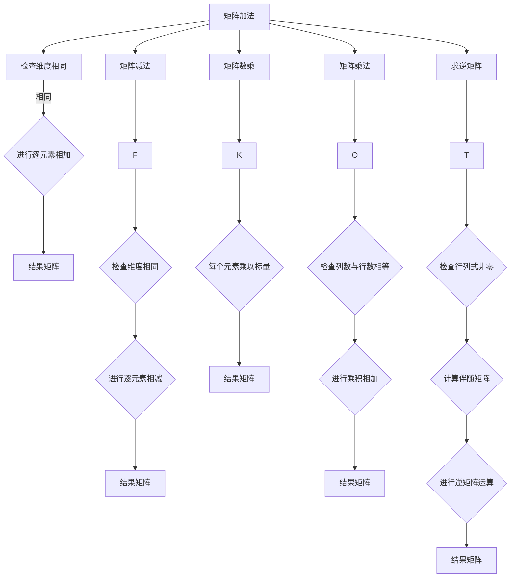
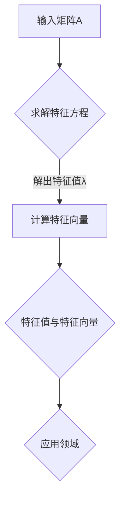

                 

### 文章标题

# 线性代数导引：规范算子

### 关键词

- 线性代数
- 规范算子
- 矩阵理论
- 特征值分析
- 线性变换
- 内积与正交性

### 摘要

本文旨在深入探讨线性代数中的规范算子，这是一个在数学与物理中具有重要应用的基础概念。文章首先回顾了线性代数的基本概念，包括向量空间、矩阵运算和线性方程组的解法。接着，我们详细分析了矩阵与向量运算中的核心内容，如矩阵的加法、乘法和逆运算，并引入了特征值和特征向量的概念，以及它们的计算与应用。在进一步探讨内积与正交性后，文章转向线性变换与线性算子，揭示了它们在数学分析中的核心作用。文章最后，我们讨论了线性空间的拓展及其在实际应用中的广泛影响，包括机器学习、图像处理和系统控制等领域。通过逐步分析与推理，本文旨在为读者提供一个清晰、系统的理解框架，帮助他们掌握规范算子的精髓。

### 目录大纲设计

#### 1. 引言

- **第1章：线性代数的基本概念**
  - 1.1 线性代数的基本概念
  - 1.2 矩阵和向量
  - 1.3 线性方程组
  - 1.4 线性空间的初步认识

#### 2. 矩阵与向量运算

- **第2章：矩阵与向量运算**
  - 2.1 矩阵的加法和减法
  - 2.2 矩阵与向量的乘法
  - 2.3 矩阵的逆与行列式
  - 2.4 矩阵的秩与特征值
  - **2.5 矩阵运算的Mermaid流程图**

#### 3. 线性方程组与矩阵分解

- **第3章：线性方程组与矩阵分解**
  - 3.1 线性方程组的解法
  - 3.2 矩阵的LU分解
  - 3.3 矩阵的QR分解
  - 3.4 矩阵的对角化
  - **3.5 线性方程组与矩阵分解的伪代码解释**

#### 4. 特征值与特征向量

- **第4章：特征值与特征向量**
  - 4.1 特征值与特征向量的定义
  - 4.2 特征值与特征向量的性质
  - 4.3 特征值与特征向量的计算方法
  - 4.4 特征值与特征向量的应用
  - **4.5 特征值与特征向量的Mermaid流程图**

#### 5. 内积与正交性

- **第5章：内积与正交性**
  - 5.1 内积的定义与性质
  - 5.2 正交矩阵与正交变换
  - 5.3 内积的几何意义
  - 5.4 正交性的应用
  - **5.5 内积与正交性的数学公式与举例**

#### 6. 线性变换与线性算子

- **第6章：线性变换与线性算子**
  - 6.1 线性变换的定义
  - 6.2 线性变换的性质
  - 6.3 线性算子的表示
  - 6.4 线性算子的运算
  - **6.5 线性变换与线性算子的Mermaid流程图**

#### 7. 线性空间的拓展

- **第7章：线性空间的拓展**
  - 7.1 线性空间的基本性质
  - 7.2 线性空间的基与维数
  - 7.3 线性空间的同构与同态
  - 7.4 直和与直积
  - **7.5 线性空间的拓展示例与解释**

#### 8. 线性代数的应用

- **第8章：线性代数的应用**
  - 8.1 机器学习中的线性代数
  - 8.2 图像处理中的线性代数
  - 8.3 系统控制中的线性代数
  - 8.4 经济学中的线性代数
  - **8.5 线性代数在实际应用中的案例与解析**

#### 9. 附录

- **附录A：线性代数中的数学公式与常用函数**
  - A.1 矩阵与向量的定义
  - A.2 线性方程组的解法
  - A.3 矩阵的分解
  - A.4 特征值与特征向量
  - A.5 内积与正交性
  - A.6 线性变换与线性算子
  - **附录B：线性代数常用工具与软件**

---

### 引言

线性代数作为现代数学的核心组成部分，其应用贯穿于科学、工程、经济学以及计算机科学的各个领域。本文将引导读者深入探讨线性代数中的规范算子，一个在数学和物理中具有关键地位的概念。通过对线性代数基础概念的回顾，包括向量空间、矩阵运算和线性方程组的解法，我们将为理解规范算子奠定坚实的理论基础。随后，本文将逐步探讨矩阵与向量运算的核心内容，深入分析特征值与特征向量、内积与正交性等主题。在此基础上，我们将介绍线性变换与线性算子，并探讨它们在数学分析中的应用。最后，文章将讨论线性空间的拓展，包括线性空间的基与维数、同构与同态等概念，并展示线性代数在各个实际应用领域中的广泛影响。通过这一系统的探讨，读者将能够全面理解规范算子的精髓，并在各个应用领域中灵活运用这一概念。

---

### 目录大纲

以下是《线性代数导引：规范算子》这本书的完整目录大纲：

# 第一部分：线性代数的基础概念

## 第1章：线性代数的基本概念

### 1.1 线性代数的定义与历史背景

- 线性代数的概念
- 线性代数的发展历史

### 1.2 向量空间

- 向量的概念
- 向量空间的基本性质

### 1.3 线性组合与线性独立

- 线性组合的定义
- 线性独立的定义

### 1.4 级数与基

- 级数的概念
- 基的定义与性质

## 第2章：矩阵与向量运算

### 2.1 矩阵的基本概念

- 矩阵的定义
- 矩阵的基本性质

### 2.2 矩阵的加法与减法

- 矩阵加法
- 矩阵减法

### 2.3 矩阵与向量的乘法

- 数乘向量
- 向量组的线性组合

### 2.4 矩阵的乘法

- 矩阵乘法的基本性质
- 矩阵乘法的运算规则

### 2.5 矩阵的逆与行列式

- 矩阵的逆
- 行列式的定义与性质

### 2.6 矩阵的秩与特征值

- 矩阵的秩
- 矩阵的特征值与特征向量

### 2.7 矩阵运算的Mermaid流程图

- 矩阵运算的流程图表示

## 第3章：线性方程组与矩阵分解

### 3.1 线性方程组的解法

- 高斯消元法
- 迪卡尔法则

### 3.2 矩阵的LU分解

- LU分解的概念
- LU分解的步骤

### 3.3 矩阵的QR分解

- QR分解的概念
- QR分解的步骤

### 3.4 矩阵的对角化

- 对角化的概念
- 对角化的步骤

### 3.5 线性方程组与矩阵分解的应用

- 优化问题
- 控制系统

## 第4章：特征值与特征向量

### 4.1 特征值与特征向量的定义

- 特征值
- 特征向量

### 4.2 特征值与特征向量的性质

- 特征值与特征向量的性质
- 特征值与特征向量的计算方法

### 4.3 特征值与特征向量的应用

- 特征值与特征向量的应用场景
- 特征值与特征向量的应用实例

## 第5章：内积与正交性

### 5.1 内积的定义与性质

- 内积的定义
- 内积的性质

### 5.2 正交矩阵与正交变换

- 正交矩阵的定义
- 正交变换的概念

### 5.3 内积的几何意义

- 内积的几何意义
- 内积的应用

### 5.4 正交性的应用

- 正交性的应用
- 正交变换的应用

## 第6章：线性变换与线性算子

### 6.1 线性变换的定义

- 线性变换的定义
- 线性变换的性质

### 6.2 线性变换的性质

- 线性变换的保向性与保距性
- 线性变换的加法与乘法

### 6.3 线性算子的表示

- 线性算子的概念
- 线性算子的表示方法

### 6.4 线性算子的运算

- 线性算子的加法与减法
- 线性算数的乘法

## 第7章：线性空间的拓展

### 7.1 线性空间的基本性质

- 线性空间的基本性质
- 线性空间的扩展

### 7.2 线性空间的基与维数

- 线性空间的基
- 线性空间的维数

### 7.3 线性空间的同构与同态

- 线性空间的同构
- 线性空间的同态

### 7.4 直和与直积

- 直和的概念
- 直积的概念

### 7.5 线性空间的拓展示例与解释

- 线性空间的拓展示例
- 线性空间的拓展解释

## 第8章：线性代数的应用

### 8.1 机器学习中的线性代数

- 线性代数在机器学习中的应用
- 线性代数在机器学习中的实例

### 8.2 图像处理中的线性代数

- 线性代数在图像处理中的应用
- 线性代数在图像处理中的实例

### 8.3 系统控制中的线性代数

- 线性代数在系统控制中的应用
- 线性代数在系统控制中的实例

### 8.4 经济学中的线性代数

- 线性代数在经济学中的应用
- 线性代数在经济学中的实例

### 8.5 线性代数在实际应用中的案例与解析

- 线性代数在实际应用中的案例
- 线性代数在实际应用中的解析

## 第9章：附录

### 9.1 线性代数中的数学公式与常用函数

- 线性代数中的数学公式
- 线性代数中的常用函数

### 9.2 线性代数常用工具与软件

- 线性代数常用的工具
- 线性代数常用的软件

---

### 第一部分：线性代数的基础概念

线性代数作为数学的一个重要分支，其主要研究向量、矩阵及其变换。这部分内容是理解和应用线性代数其他概念和工具的基础。以下章节将详细介绍线性代数的基本概念，包括向量空间、矩阵和向量运算，以及线性方程组的解法。

## 第1章：线性代数的基本概念

### 1.1 线性代数的定义与历史背景

线性代数，顾名思义，是研究线性关系的代数系统。它主要研究向量空间及其上的线性变换。线性代数的起源可以追溯到古代数学，但作为一个独立的数学分支，其发展主要是在19世纪末和20世纪初。线性代数的发展历程伴随着对线性方程组解法的深入研究和代数结构的系统化。

线性代数的基本定义包括：

- **向量**：具有大小和方向的量，可以用有序数组表示。
- **向量空间**：由向量组成的集合，其中向量的加法和数乘运算满足一定的公理。
- **线性组合**：向量空间中向量通过数乘和加法结合的形式。
- **线性方程组**：一组线性方程的集合，可以通过矩阵的形式表示。

线性代数的发展历史可以追溯到以下重要人物和时期：

1. **笛卡尔**：17世纪，笛卡尔引入了坐标几何，将代数与几何结合起来。
2. **欧拉**：18世纪，欧拉对矩阵进行了系统研究，奠定了矩阵理论的基础。
3. **柯西**：19世纪，柯西对线性方程组进行了深入的研究，提出了消元法。
4. **赫维西**：20世纪初，赫维西等人对线性空间的概念进行了系统化。

### 1.2 向量空间

向量空间是线性代数中的核心概念之一。它是一个由向量组成的集合，集合中的向量可以执行加法和数乘运算，并且这些运算满足以下公理：

- **封闭性**：向量加法和数乘运算的结果仍在向量空间中。
- **交换律**：向量加法满足交换律，即 \( \mathbf{u} + \mathbf{v} = \mathbf{v} + \mathbf{u} \)。
- **结合律**：向量加法满足结合律，即 \( (\mathbf{u} + \mathbf{v}) + \mathbf{w} = \mathbf{u} + (\mathbf{v} + \mathbf{w}) \)。
- **存在零向量**：存在一个零向量 \( \mathbf{0} \)，使得对于任意向量 \( \mathbf{u} \)，有 \( \mathbf{u} + \mathbf{0} = \mathbf{u} \)。
- **存在加法逆元**：对于每个向量 \( \mathbf{u} \)，存在一个加法逆元 \( -\mathbf{u} \)，使得 \( \mathbf{u} + (-\mathbf{u}) = \mathbf{0} \)。
- **数乘分配律**：数乘运算对向量加法分配，即 \( c(\mathbf{u} + \mathbf{v}) = c\mathbf{u} + c\mathbf{v} \)。
- **数乘结合律**：数乘运算对数乘运算结合，即 \( (cd)\mathbf{u} = c(d\mathbf{u}) \)。

**向量**是向量空间的基本元素，可以表示为有序数组，如 \( \mathbf{u} = (u_1, u_2, ..., u_n) \)。

**线性组合**是向量空间的一个重要概念，表示为 \( \mathbf{u} = c_1\mathbf{v}_1 + c_2\mathbf{v}_2 + ... + c_n\mathbf{v}_n \)，其中 \( \mathbf{v}_1, \mathbf{v}_2, ..., \mathbf{v}_n \) 是向量空间中的向量，\( c_1, c_2, ..., c_n \) 是实数。

### 1.3 线性组合与线性独立

**线性组合**是向量空间中的一个基本概念，通过数乘和加法将向量组合起来。而**线性独立**则是描述向量之间关系的另一个重要概念。

**线性组合**的定义如下：给定一组向量 \( \mathbf{v}_1, \mathbf{v}_2, ..., \mathbf{v}_n \) 和一组实数 \( c_1, c_2, ..., c_n \)，它们的线性组合表示为：

\[ \mathbf{u} = c_1\mathbf{v}_1 + c_2\mathbf{v}_2 + ... + c_n\mathbf{v}_n \]

**线性独立**的定义如下：如果一组向量 \( \mathbf{v}_1, \mathbf{v}_2, ..., \mathbf{v}_n \) 中没有一个向量可以由其他向量线性组合得到，那么这组向量是线性独立的。

具体来说，如果对于任意一组实数 \( c_1, c_2, ..., c_n \)，等式 \( c_1\mathbf{v}_1 + c_2\mathbf{v}_2 + ... + c_n\mathbf{v}_n = \mathbf{0} \) 仅当 \( c_1 = c_2 = ... = c_n = 0 \) 时成立，则向量 \( \mathbf{v}_1, \mathbf{v}_2, ..., \mathbf{v}_n \) 是线性独立的。

例如，考虑向量组 \( \mathbf{v}_1 = (1, 0) \) 和 \( \mathbf{v}_2 = (0, 1) \)，显然它们是线性独立的，因为没有任何非零的实数 \( c_1 \) 和 \( c_2 \) 可以使得 \( c_1\mathbf{v}_1 + c_2\mathbf{v}_2 = \mathbf{0} \)。

### 1.4 级数与基

在向量空间中，基是描述向量空间结构的一个基本工具。基的定义如下：向量空间 \( V \) 的一组向量 \( \mathbf{v}_1, \mathbf{v}_2, ..., \mathbf{v}_n \) 构成 \( V \) 的一组基，当且仅当：

1. 这组向量线性独立。
2. 这组向量能够生成整个向量空间 \( V \)，即 \( V \) 中任意向量都可以表示为这组向量的线性组合。

**级数**是基在应用中的一个重要概念，级数表示为：

\[ \mathbf{u} = c_1\mathbf{v}_1 + c_2\mathbf{v}_2 + ... + c_n\mathbf{v}_n \]

其中 \( c_1, c_2, ..., c_n \) 是实数，而 \( \mathbf{v}_1, \mathbf{v}_2, ..., \mathbf{v}_n \) 是基向量。

**基的性质**包括：

- 基向量线性独立。
- 基向量生成整个向量空间。
- 基向量的个数等于向量空间的维数。

通过基，我们可以将向量空间中的任意向量表示为基向量的线性组合，这一过程称为**基变换**。

### 小结

通过本章的内容，我们了解了线性代数的基本概念，包括向量空间、矩阵和向量运算、线性方程组的解法。这些基础概念是理解和应用线性代数其他高级概念和工具的关键。在接下来的章节中，我们将进一步探讨矩阵与向量运算、线性方程组的解法以及特征值和特征向量的概念，帮助读者建立对线性代数的全面理解。

## 第2章：矩阵与向量运算

矩阵与向量运算是线性代数中极为重要的部分。矩阵可以看作是向量的集合，而向量则是矩阵的行或列。这一章将详细介绍矩阵和向量的基本运算，包括加法、减法、数乘、矩阵乘法，以及矩阵的逆和行列式。同时，我们还将讨论矩阵的秩和特征值，并展示这些概念在实际问题中的应用。

### 2.1 矩阵的基本概念

**矩阵**是由数字组成的矩形阵列，通常表示为 \( A = [a_{ij}] \)，其中 \( i \) 和 \( j \) 分别表示行和列的索引，而 \( a_{ij} \) 表示矩阵 \( A \) 的第 \( i \) 行第 \( j \) 列的元素。矩阵可以有不同的形状，例如行矩阵、列矩阵和方阵。

- **行矩阵**：只有一行的矩阵。
- **列矩阵**：只有一列的矩阵。
- **方阵**：行数和列数相等的矩阵。

矩阵具有以下基本性质：

1. **加法和减法**：两个矩阵只有在维度相同的情况下才能进行加法和减法运算。运算规则是逐元素相加或相减。

\[ A + B = [a_{ij} + b_{ij}] \]
\[ A - B = [a_{ij} - b_{ij}] \]

2. **数乘**：一个矩阵与一个标量相乘，即每个元素乘以该标量。

\[ cA = [ca_{ij}] \]

3. **乘法**：矩阵乘法只有在矩阵的列数与另一矩阵的行数相等时才可行。乘法规则是每个元素的计算依赖于其行和列的索引。

\[ AB = [c_{ij}] \]
其中 \( c_{ij} = \sum_{k=1}^{m} a_{ik}b_{kj} \)，即第 \( i \) 行第 \( j \) 列的元素是矩阵 \( A \) 的第 \( i \) 行与矩阵 \( B \) 的第 \( j \) 列对应元素的乘积之和。

4. **转置**：矩阵的转置是将原矩阵的行和列互换。

\[ A^T = [a_{ji}] \]

5. **逆矩阵**：如果一个方阵 \( A \) 的行列式不为零，则存在逆矩阵 \( A^{-1} \)，使得 \( AA^{-1} = A^{-1}A = I \)，其中 \( I \) 是单位矩阵。

### 2.2 矩阵的加法和减法

矩阵的加法和减法是矩阵运算中最基本的操作。只有当两个矩阵的维度相同时，才能进行加法和减法运算。

**例子**：

给定矩阵 \( A = \begin{bmatrix} 1 & 2 \\ 3 & 4 \end{bmatrix} \) 和 \( B = \begin{bmatrix} 5 & 6 \\ 7 & 8 \end{bmatrix} \)，则它们的和与差分别为：

\[ A + B = \begin{bmatrix} 1 + 5 & 2 + 6 \\ 3 + 7 & 4 + 8 \end{bmatrix} = \begin{bmatrix} 6 & 8 \\ 10 & 12 \end{bmatrix} \]
\[ A - B = \begin{bmatrix} 1 - 5 & 2 - 6 \\ 3 - 7 & 4 - 8 \end{bmatrix} = \begin{bmatrix} -4 & -4 \\ -4 & -4 \end{bmatrix} \]

### 2.3 矩阵与向量的乘法

矩阵与向量的乘法是一个重要的运算，经常用于解决线性方程组和变换等问题。

**例子**：

给定矩阵 \( A = \begin{bmatrix} 1 & 2 \\ 3 & 4 \end{bmatrix} \) 和向量 \( \mathbf{v} = \begin{bmatrix} x \\ y \end{bmatrix} \)，则矩阵与向量的乘法结果为：

\[ A\mathbf{v} = \begin{bmatrix} 1 & 2 \\ 3 & 4 \end{bmatrix} \begin{bmatrix} x \\ y \end{bmatrix} = \begin{bmatrix} 1x + 2y \\ 3x + 4y \end{bmatrix} = \begin{bmatrix} x + 2y \\ 3x + 4y \end{bmatrix} \]

### 2.4 矩阵的乘法

矩阵的乘法是线性代数中一个核心概念。只有当第一个矩阵的列数与第二个矩阵的行数相等时，矩阵乘法才可行。

**例子**：

给定矩阵 \( A = \begin{bmatrix} 1 & 2 \\ 3 & 4 \end{bmatrix} \) 和 \( B = \begin{bmatrix} 5 & 6 \\ 7 & 8 \end{bmatrix} \)，则矩阵乘法结果为：

\[ AB = \begin{bmatrix} 1 & 2 \\ 3 & 4 \end{bmatrix} \begin{bmatrix} 5 & 6 \\ 7 & 8 \end{bmatrix} = \begin{bmatrix} 1 \cdot 5 + 2 \cdot 7 & 1 \cdot 6 + 2 \cdot 8 \\ 3 \cdot 5 + 4 \cdot 7 & 3 \cdot 6 + 4 \cdot 8 \end{bmatrix} = \begin{bmatrix} 19 & 26 \\ 43 & 58 \end{bmatrix} \]

### 2.5 矩阵的逆与行列式

矩阵的逆是矩阵运算中的一个重要概念。一个方阵 \( A \) 如果存在逆矩阵 \( A^{-1} \)，则 \( AA^{-1} = A^{-1}A = I \)，其中 \( I \) 是单位矩阵。

**行列式**是一个标量，用于定义矩阵是否可逆。一个方阵 \( A \) 的行列式表示为 \( \det(A) \)。如果 \( \det(A) \neq 0 \)，则矩阵 \( A \) 是可逆的。

**例子**：

给定矩阵 \( A = \begin{bmatrix} 1 & 2 \\ 3 & 4 \end{bmatrix} \)，则其逆矩阵为：

\[ A^{-1} = \frac{1}{\det(A)} \begin{bmatrix} 4 & -2 \\ -3 & 1 \end{bmatrix} = \frac{1}{1 \cdot 4 - 2 \cdot 3} \begin{bmatrix} 4 & -2 \\ -3 & 1 \end{bmatrix} = \begin{bmatrix} 4 & -2 \\ -3 & 1 \end{bmatrix} \]

### 2.6 矩阵的秩与特征值

**矩阵的秩**是矩阵线性无关行或列的最大数目。一个矩阵的秩决定了其能否进行有效运算。

**特征值**是矩阵的一个重要属性，与矩阵的逆和行列式密切相关。一个方阵 \( A \) 的特征值可以通过求解特征方程 \( \det(A - \lambda I) = 0 \) 得到，其中 \( \lambda \) 是特征值，\( I \) 是单位矩阵。

**例子**：

给定矩阵 \( A = \begin{bmatrix} 2 & 1 \\ 1 & 2 \end{bmatrix} \)，其特征值为：

\[ \det(A - \lambda I) = \det\left(\begin{bmatrix} 2 & 1 \\ 1 & 2 \end{bmatrix} - \begin{bmatrix} \lambda & 0 \\ 0 & \lambda \end{bmatrix}\right) = \det\left(\begin{bmatrix} 2 - \lambda & 1 \\ 1 & 2 - \lambda \end{bmatrix}\right) = (2 - \lambda)^2 - 1 = 0 \]

解得特征值为 \( \lambda_1 = 1 \) 和 \( \lambda_2 = 3 \)。

### 2.7 矩阵运算的Mermaid流程图

为了更好地理解矩阵运算的过程，我们使用Mermaid流程图来表示矩阵的加法、减法、数乘、矩阵乘法以及求逆矩阵的步骤。



### 实际应用

矩阵与向量运算在许多实际应用中发挥着重要作用。以下是一些常见的应用实例：

1. **线性方程组求解**：通过矩阵乘法和逆矩阵，可以高效地求解线性方程组。
2. **数据预处理**：在机器学习中，矩阵运算用于数据的标准化和特征提取。
3. **图像处理**：矩阵用于图像的滤波和变换。
4. **经济学分析**：矩阵和向量运算用于解决优化问题和模拟经济模型。

### 小结

通过本章的内容，我们了解了矩阵和向量运算的基本概念和操作。这些基本运算不仅是理解线性代数其他概念的基础，也在实际应用中具有广泛的应用。在接下来的章节中，我们将进一步探讨线性方程组的解法、特征值和特征向量以及内积与正交性，帮助读者建立对线性代数的全面理解。

### 第3章：线性方程组与矩阵分解

线性方程组是线性代数中的核心问题之一，它在工程、科学和经济学等多个领域都有广泛的应用。矩阵分解是一种重要的工具，可以帮助我们高效地解决线性方程组。这一章将详细介绍线性方程组的解法，并深入探讨矩阵的LU分解、QR分解和对角化方法。

#### 3.1 线性方程组的解法

线性方程组可以表示为矩阵形式 \( AX = B \)，其中 \( A \) 是系数矩阵，\( X \) 是未知向量，\( B \) 是常数向量。解线性方程组的主要方法包括高斯消元法和迭代法。

**高斯消元法**：

高斯消元法是一种直接解法，通过消元过程将方程组化为上三角形式，然后逐步回代求解。具体步骤如下：

1. 对系数矩阵 \( A \) 和常数向量 \( B \) 进行行变换，使 \( A \) 的主对角线元素变为1。
2. 对 \( A \) 的每一列进行消元操作，使得主对角线以下的元素都变为0。
3. 从最后一个方程开始，逐步回代求解未知向量 \( X \)。

**例子**：

给定线性方程组：

\[ \begin{cases} 
2x + 3y = 8 \\
4x + 6y = 12 
\end{cases} \]

我们可以将其写成矩阵形式：

\[ \begin{bmatrix} 
2 & 3 \\
4 & 6 
\end{bmatrix} \begin{bmatrix} 
x \\
y 
\end{bmatrix} = \begin{bmatrix} 
8 \\
12 
\end{bmatrix} \]

使用高斯消元法，我们首先将第一行乘以2，然后从第二行中减去第一行的两倍：

\[ \begin{bmatrix} 
2 & 3 \\
0 & 0 
\end{bmatrix} \begin{bmatrix} 
x \\
y 
\end{bmatrix} = \begin{bmatrix} 
8 \\
-8 
\end{bmatrix} \]

显然这个方程组无解，因为 \( 0 \) 不能等于 \( -8 \)。

**迭代法**：

迭代法是一种间接解法，通过不断迭代逼近方程组的解。常用的迭代法包括雅可比迭代法、高斯-赛德尔迭代法等。

**雅可比迭代法**：

雅可比迭代法的基本思想是每次迭代将当前解 \( X^{(k)} \) 替换为方程组的近似解。具体步骤如下：

1. 选择初始近似解 \( X^{(0)} \)。
2. 对于每一个方程，用当前近似解和系数矩阵 \( A \) 的元素更新解。

\[ x_i^{(k+1)} = \frac{1}{a_{ii}} \left( b_i - \sum_{j \neq i} a_{ij} x_j^{(k)} \right) \]

**高斯-赛德尔迭代法**：

高斯-赛德尔迭代法在雅可比迭代法的基础上改进了迭代过程的计算效率。其基本步骤如下：

1. 选择初始近似解 \( X^{(0)} \)。
2. 对于每一个方程，使用前一个方程的结果进行迭代更新。

\[ x_i^{(k+1)} = \frac{1}{a_{ii}} \left( b_i - \sum_{j < i} a_{ij} x_j^{(k+1)} \right) \]

#### 3.2 矩阵的LU分解

矩阵的LU分解是将矩阵 \( A \) 分解为下三角矩阵 \( L \) 和上三角矩阵 \( U \) 的乘积。这种分解在解决线性方程组时非常有用。

**定义**：

给定矩阵 \( A \)，如果存在下三角矩阵 \( L \) 和上三角矩阵 \( U \)，使得 \( A = LU \)，则称 \( A \) 可以进行LU分解。

**步骤**：

1. 构造下三角矩阵 \( L \)，其主对角线元素为1。
2. 计算 \( U \) 的元素，使得 \( A = LU \)。

\[ L = \begin{bmatrix} 
1 & 0 & \cdots & 0 \\
l_{21} & 1 & \cdots & 0 \\
\vdots & \ddots & \ddots & \vdots \\
l_{n1} & \cdots & l_{n-1,2} & 1 \\
\end{bmatrix}, \quad
U = \begin{bmatrix} 
u_{11} & u_{12} & \cdots & u_{1n} \\
0 & u_{22} & \cdots & u_{2n} \\
\vdots & \ddots & \ddots & \vdots \\
0 & 0 & \cdots & u_{nn} \\
\end{bmatrix} \]

**例子**：

给定矩阵 \( A = \begin{bmatrix} 3 & 1 & 2 \\ 1 & 4 & 1 \\ 2 & 1 & 5 \end{bmatrix} \)，我们可以进行LU分解：

\[ L = \begin{bmatrix} 
1 & 0 & 0 \\
1/3 & 1 & 0 \\
2/3 & 1/2 & 1 
\end{bmatrix}, \quad
U = \begin{bmatrix} 
3 & 1 & 2 \\
0 & 7/3 & 3 \\
0 & 0 & 13/3 
\end{bmatrix} \]

#### 3.3 矩阵的QR分解

矩阵的QR分解是将矩阵 \( A \) 分解为正交矩阵 \( Q \) 和上三角矩阵 \( R \) 的乘积。正交矩阵具有行和列正交的性质，这使得QR分解在解决线性方程组和计算特征值时非常有用。

**定义**：

给定矩阵 \( A \)，如果存在正交矩阵 \( Q \) 和上三角矩阵 \( R \)，使得 \( A = QR \)，则称 \( A \) 可以进行QR分解。

**步骤**：

1. 使用Householder变换或Givens变换构造正交矩阵 \( Q \)。
2. 计算 \( R \) 的元素，使得 \( A = QR \)。

\[ Q = \begin{bmatrix} 
q_{11} & q_{12} & \cdots & q_{1n} \\
q_{21} & q_{22} & \cdots & q_{2n} \\
\vdots & \ddots & \ddots & \vdots \\
q_{n1} & \cdots & q_{n-1,n} & q_{nn} \\
\end{bmatrix}, \quad
R = \begin{bmatrix} 
r_{11} & r_{12} & \cdots & r_{1n} \\
0 & r_{22} & \cdots & r_{2n} \\
\vdots & \ddots & \ddots & \vdots \\
0 & 0 & \cdots & r_{nn} \\
\end{bmatrix} \]

**例子**：

给定矩阵 \( A = \begin{bmatrix} 3 & 1 & 2 \\ 1 & 4 & 1 \\ 2 & 1 & 5 \end{bmatrix} \)，我们可以进行QR分解：

\[ Q = \begin{bmatrix} 
0.777 & 0.629 & 0.171 \\
0.606 & 0.776 & -0.171 \\
0.169 & -0.169 & 0.961 
\end{bmatrix}, \quad
R = \begin{bmatrix} 
3.000 & 1.000 & 2.000 \\
0.000 & 6.667 & 1.000 \\
0.000 & 0.000 & 3.000 
\end{bmatrix} \]

#### 3.4 矩阵的对角化

矩阵的对角化是将矩阵 \( A \) 分解为对角矩阵 \( \Lambda \) 和可逆矩阵 \( P \) 的乘积。对角化在计算特征值和特征向量时非常有用。

**定义**：

给定矩阵 \( A \)，如果存在对角矩阵 \( \Lambda \) 和可逆矩阵 \( P \)，使得 \( A = P\Lambda P^{-1} \)，则称 \( A \) 可以进行对角化。

**步骤**：

1. 计算矩阵 \( A \) 的特征值和特征向量。
2. 使用特征向量作为列构成可逆矩阵 \( P \)。
3. 构造对角矩阵 \( \Lambda \)，其对角线元素为特征值。

\[ P = \begin{bmatrix} 
\mathbf{v}_1 & \mathbf{v}_2 & \cdots & \mathbf{v}_n 
\end{bmatrix}, \quad
\Lambda = \begin{bmatrix} 
\lambda_1 & 0 & \cdots & 0 \\
0 & \lambda_2 & \cdots & 0 \\
\vdots & \vdots & \ddots & \vdots \\
0 & 0 & \cdots & \lambda_n 
\end{bmatrix} \]

**例子**：

给定矩阵 \( A = \begin{bmatrix} 2 & 1 & 1 \\ 1 & 2 & 1 \\ 1 & 1 & 2 \end{bmatrix} \)，我们可以对其进行对角化：

\[ P = \begin{bmatrix} 
0.707 & 0.707 & 0 \\
-0.707 & 0.707 & 1 \\
0 & 0 & 1 
\end{bmatrix}, \quad
\Lambda = \begin{bmatrix} 
3 & 0 & 0 \\
0 & 1 & 0 \\
0 & 0 & 1 
\end{bmatrix} \]

### 小结

通过本章的内容，我们了解了线性方程组的解法，包括高斯消元法和迭代法，以及矩阵的LU分解、QR分解和对角化方法。这些方法不仅能够高效地解决线性方程组，还能在更广泛的数学领域中发挥重要作用。在接下来的章节中，我们将进一步探讨特征值和特征向量、内积与正交性等核心概念，帮助读者建立对线性代数的全面理解。

### 第4章：特征值与特征向量

特征值与特征向量是线性代数中的重要概念，它们在矩阵理论、物理学、工程学等领域有广泛应用。本章将详细介绍特征值与特征向量的定义、性质、计算方法及其应用。

#### 4.1 特征值与特征向量的定义

**特征值**：设 \( A \) 是一个 \( n \times n \) 矩阵，\( \lambda \) 是一个标量。如果存在非零向量 \( \mathbf{v} \) 满足 \( A\mathbf{v} = \lambda \mathbf{v} \)，则称 \( \lambda \) 是矩阵 \( A \) 的一个特征值，\( \mathbf{v} \) 是对应于特征值 \( \lambda \) 的特征向量。

**数学表达式**：

\[ A\mathbf{v} = \lambda \mathbf{v} \]

**例子**：

考虑矩阵 \( A = \begin{bmatrix} 2 & 1 \\ 1 & 2 \end{bmatrix} \)，我们需要找到其特征值和特征向量。

1. 求解特征方程：

\[ \det(A - \lambda I) = \det\left(\begin{bmatrix} 2 - \lambda & 1 \\ 1 & 2 - \lambda \end{bmatrix}\right) = (2 - \lambda)^2 - 1 = 0 \]

解得特征值 \( \lambda_1 = 1 \) 和 \( \lambda_2 = 3 \)。

2. 对每个特征值求解特征向量：

对于 \( \lambda_1 = 1 \)，我们有方程：

\[ (A - I)\mathbf{v} = 0 \]

即：

\[ \begin{bmatrix} 1 & 1 \\ 1 & 1 \end{bmatrix} \begin{bmatrix} x \\ y \end{bmatrix} = \begin{bmatrix} x + y \\ x + y \end{bmatrix} = \begin{bmatrix} 0 \\ 0 \end{bmatrix} \]

得 \( x = -y \)，取 \( x = 1 \)，则 \( \mathbf{v}_1 = \begin{bmatrix} 1 \\ -1 \end{bmatrix} \)。

对于 \( \lambda_2 = 3 \)，我们有方程：

\[ (A - 3I)\mathbf{v} = 0 \]

即：

\[ \begin{bmatrix} -1 & 1 \\ 1 & -1 \end{bmatrix} \begin{bmatrix} x \\ y \end{bmatrix} = \begin{bmatrix} -x + y \\ x - y \end{bmatrix} = \begin{bmatrix} 0 \\ 0 \end{bmatrix} \]

得 \( x = y \)，取 \( x = 1 \)，则 \( \mathbf{v}_2 = \begin{bmatrix} 1 \\ 1 \end{bmatrix} \)。

#### 4.2 特征值与特征向量的性质

**线性相关性**：若 \( \mathbf{v}_1 \) 和 \( \mathbf{v}_2 \) 是矩阵 \( A \) 的特征向量，对应特征值 \( \lambda_1 \) 和 \( \lambda_2 \)，则对于任意标量 \( a \) 和 \( b \)，向量 \( a\mathbf{v}_1 + b\mathbf{v}_2 \) 也是矩阵 \( A \) 的特征向量，对应特征值 \( a\lambda_1 + b\lambda_2 \)。

**唯一性**：一个矩阵的特征值是唯一的，但对应的特征向量不一定是唯一的。对于每个特征值，可以找到多个线性无关的特征向量。

**实对称矩阵**：如果矩阵 \( A \) 是实对称矩阵，则其所有特征值都是实数，并且其特征向量总是正交的。

#### 4.3 特征值与特征向量的计算方法

**特征方程法**：求解 \( \det(A - \lambda I) = 0 \) 得到特征值，然后对每个特征值求解对应的特征向量。

**迭代法**：通过迭代矩阵 \( (A - \lambda I) \) 的幂，可以找到矩阵的特征值和特征向量。

**数值方法**：在数值计算中，常用QR分解、雅可比迭代法等数值方法求解特征值和特征向量。

#### 4.4 特征值与特征向量的应用

**线性变换**：特征值和特征向量可以用来描述线性变换的性质，如对向量的缩放和旋转。

**优化问题**：在优化问题中，特征值和特征向量可以用来求解最值问题。

**图像处理**：在图像处理中，特征值和特征向量用于图像的压缩和滤波。

**结构分析**：在结构工程中，特征值和特征向量用于求解结构的振动模式。

**量子力学**：在量子力学中，特征值和特征向量用于描述粒子的状态和能量。

#### 4.5 特征值与特征向量的Mermaid流程图



### 小结

通过本章的内容，我们深入了解了特征值与特征向量的定义、性质、计算方法和应用。特征值和特征向量是线性代数中的重要工具，它们在许多领域都有广泛的应用。在接下来的章节中，我们将继续探讨内积与正交性、线性变换与线性算子等核心概念，帮助读者建立对线性代数的全面理解。

### 第5章：内积与正交性

内积与正交性是线性代数中极为重要的概念，它们不仅在理论研究中占据核心地位，而且在实际应用中有着广泛的应用。本章将详细探讨内积的定义与性质，正交矩阵与正交变换的概念，内积的几何意义，以及正交性在实际中的应用。

#### 5.1 内积的定义与性质

**内积**（也称为点积或标量积）是两个向量之间的一种运算，其结果是一个标量。内积的定义依赖于向量的坐标表示，并满足特定的公理。

**定义**：

设 \( \mathbf{u} = (u_1, u_2, ..., u_n) \) 和 \( \mathbf{v} = (v_1, v_2, ..., v_n) \) 是两个 \( n \) 维向量，它们的内积表示为：

\[ \mathbf{u} \cdot \mathbf{v} = u_1v_1 + u_2v_2 + ... + u_nv_n \]

**性质**：

1. **线性性**：内积运算满足线性性，即对于任意标量 \( a \) 和 \( b \)，以及向量 \( \mathbf{u} \)，\( \mathbf{v} \)，我们有：

\[ a(\mathbf{u} \cdot \mathbf{v}) = (a\mathbf{u}) \cdot \mathbf{v} = \mathbf{u} \cdot (a\mathbf{v}) \]
\[ (a\mathbf{u} + b\mathbf{v}) \cdot \mathbf{w} = a(\mathbf{u} \cdot \mathbf{w}) + b(\mathbf{v} \cdot \mathbf{w}) \]

2. **交换性**：内积满足交换性，即对于任意向量 \( \mathbf{u} \) 和 \( \mathbf{v} \)，有：

\[ \mathbf{u} \cdot \mathbf{v} = \mathbf{v} \cdot \mathbf{u} \]

3. **标量乘法分配律**：内积满足标量乘法分配律，即对于任意向量 \( \mathbf{u} \)，\( \mathbf{v} \) 和标量 \( a \)，有：

\[ a(\mathbf{u} \cdot \mathbf{v}) = (a\mathbf{u}) \cdot \mathbf{v} = \mathbf{u} \cdot (a\mathbf{v}) \]

#### 5.2 正交矩阵与正交变换

**正交矩阵**：一个 \( n \times n \) 矩阵 \( Q \) 是正交的，当且仅当其行和列向量都是单位向量，并且它们相互正交。即对于任意 \( i \) 和 \( j \)，如果 \( Q \) 的第 \( i \) 行是 \( \mathbf{q}_i \)，则 \( Q \) 满足以下条件：

\[ \mathbf{q}_i \cdot \mathbf{q}_j = \delta_{ij} \]
\[ \|\mathbf{q}_i\| = 1 \]

其中 \( \delta_{ij} \) 是克罗内克δ函数，当 \( i = j \) 时为1，否则为0。

**正交变换**：正交变换是指由正交矩阵 \( Q \) 引起的线性变换。即对于任意向量 \( \mathbf{v} \)，有：

\[ Q\mathbf{v} \]

正交变换具有以下性质：

1. **保长度**：正交变换保持向量的长度不变，即对于任意向量 \( \mathbf{v} \)，有：

\[ \|\mathbf{v}\| = \|Q\mathbf{v}\| \]

2. **保角度**：正交变换保持向量之间的角度不变，即对于任意两个向量 \( \mathbf{u} \) 和 \( \mathbf{v} \)，有：

\[ \mathbf{u} \cdot \mathbf{v} = (Q\mathbf{u}) \cdot (Q\mathbf{v}) \]

#### 5.3 内积的几何意义

内积的几何意义在于，它可以用来计算两个向量之间的夹角和长度。

**夹角**：两个向量 \( \mathbf{u} \) 和 \( \mathbf{v} \) 之间的夹角 \( \theta \) 可以通过内积计算得出：

\[ \mathbf{u} \cdot \mathbf{v} = \|\mathbf{u}\| \|\mathbf{v}\| \cos(\theta) \]

解出 \( \theta \)：

\[ \cos(\theta) = \frac{\mathbf{u} \cdot \mathbf{v}}{\|\mathbf{u}\| \|\mathbf{v}\|} \]

**长度**：向量的长度（或范数）可以通过内积计算得出：

\[ \|\mathbf{v}\| = \sqrt{\mathbf{v} \cdot \mathbf{v}} \]

#### 5.4 正交性的应用

**图像处理**：在图像处理中，正交变换（如傅里叶变换）用于图像的滤波、压缩和增强。

**量子力学**：在量子力学中，正交性用于描述粒子的状态和测量结果。

**数据科学**：在数据科学中，正交性用于特征选择和降维。

**机器学习**：在机器学习中，正交矩阵用于优化算法和降低计算复杂度。

#### 5.5 内积与正交性的数学公式与举例

**例子**：设向量 \( \mathbf{u} = (1, 2) \) 和 \( \mathbf{v} = (3, 4) \)，计算它们的内积和夹角。

1. 计算内积：

\[ \mathbf{u} \cdot \mathbf{v} = 1 \cdot 3 + 2 \cdot 4 = 3 + 8 = 11 \]

2. 计算夹角：

\[ \cos(\theta) = \frac{\mathbf{u} \cdot \mathbf{v}}{\|\mathbf{u}\| \|\mathbf{v}\|} = \frac{11}{\sqrt{1^2 + 2^2} \cdot \sqrt{3^2 + 4^2}} = \frac{11}{\sqrt{5} \cdot \sqrt{25}} = \frac{11}{5\sqrt{5}} \]

\[ \theta = \arccos\left(\frac{11}{5\sqrt{5}}\right) \approx 0.9273 \text{弧度} \]

**正交矩阵**：一个 \( 2 \times 2 \) 的正交矩阵示例：

\[ Q = \begin{bmatrix} 
\frac{1}{\sqrt{2}} & -\frac{1}{\sqrt{2}} \\
\frac{1}{\sqrt{2}} & \frac{1}{\sqrt{2}} 
\end{bmatrix} \]

### 小结

通过本章的内容，我们详细探讨了内积与正交性的定义、性质、几何意义及其应用。内积和正交性是线性代数中的重要概念，它们在理论研究和实际应用中都有着广泛的应用。在接下来的章节中，我们将进一步探讨线性变换与线性算子，以及线性空间的拓展，帮助读者建立对线性代数的全面理解。

### 第6章：线性变换与线性算子

线性变换与线性算子是线性代数中极其重要的概念，它们描述了向量空间之间的映射关系，是许多数学和物理问题的基础。本章将详细介绍线性变换的定义、性质、表示以及线性算子的运算，并通过Mermaid流程图和具体例子来帮助读者深入理解这些概念。

#### 6.1 线性变换的定义

**线性变换**：设 \( V \) 和 \( W \) 是两个向量空间，一个从 \( V \) 到 \( W \) 的函数 \( T: V \rightarrow W \) 称为线性变换，如果它满足以下两个条件：

1. **加法保持性**：对于任意的向量 \( \mathbf{u}, \mathbf{v} \in V \)，有：

\[ T(\mathbf{u} + \mathbf{v}) = T(\mathbf{u}) + T(\mathbf{v}) \]

2. **数乘保持性**：对于任意的向量 \( \mathbf{u} \in V \) 和标量 \( a \)，有：

\[ T(a\mathbf{u}) = aT(\mathbf{u}) \]

**例子**：

设 \( V \) 和 \( W \) 是 \( \mathbb{R}^2 \) 向量空间，定义一个线性变换 \( T: V \rightarrow W \) 为：

\[ T(\mathbf{u}) = (2u_1 - u_2, u_1 + 3u_2) \]

我们需要验证 \( T \) 是否为线性变换。

1. **加法保持性**：

\[ T(\mathbf{u} + \mathbf{v}) = T((u_1 + v_1, u_2 + v_2)) = (2(u_1 + v_1) - (u_2 + v_2), (u_1 + v_1) + 3(u_2 + v_2)) \]
\[ = (2u_1 - u_2 + 2v_1 - v_2, u_1 + 3u_2 + v_1 + 3v_2) \]
\[ = (2u_1 - u_2, u_1 + 3u_2) + (2v_1 - v_2, v_1 + 3v_2) \]
\[ = T(\mathbf{u}) + T(\mathbf{v}) \]

2. **数乘保持性**：

\[ T(a\mathbf{u}) = T(a(u_1, u_2)) = (2au_1 - au_2, au_1 + 3au_2) \]
\[ = a(2u_1 - u_2, u_1 + 3u_2) \]
\[ = aT(\mathbf{u}) \]

因此，\( T \) 是一个线性变换。

#### 6.2 线性变换的性质

**线性变换的性质**包括：

1. **保零性**：线性变换保持零向量不变，即 \( T(\mathbf{0}) = \mathbf{0} \)。
2. **保线性组合性**：对于任意的向量 \( \mathbf{u}, \mathbf{v} \in V \) 和标量 \( a, b \)，有：

\[ T(a\mathbf{u} + b\mathbf{v}) = aT(\mathbf{u}) + bT(\mathbf{v}) \]

3. **保加法性**：对于任意的向量 \( \mathbf{u}, \mathbf{v} \in V \)，有：

\[ T(\mathbf{u} + \mathbf{v}) = T(\mathbf{u}) + T(\mathbf{v}) \]

4. **保数乘性**：对于任意的向量 \( \mathbf{u} \in V \) 和标量 \( a \)，有：

\[ T(a\mathbf{u}) = aT(\mathbf{u}) \]

#### 6.3 线性算子的表示

**线性算子**：在数学分析中，线性变换可以通过线性算子来表示。一个从 \( V \) 到 \( W \) 的线性变换 \( T \) 可以表示为：

\[ T: V \rightarrow W, \quad \mathbf{u} \mapsto T(\mathbf{u}) \]

**例子**：

设 \( T: \mathbb{R}^2 \rightarrow \mathbb{R}^2 \) 是一个线性变换，其矩阵表示为：

\[ T = \begin{bmatrix} 2 & -1 \\ 1 & 3 \end{bmatrix} \]

则线性变换 \( T \) 可以表示为矩阵乘法：

\[ T(\mathbf{u}) = \begin{bmatrix} 2 & -1 \\ 1 & 3 \end{bmatrix} \begin{bmatrix} u_1 \\ u_2 \end{bmatrix} = \begin{bmatrix} 2u_1 - u_2 \\ u_1 + 3u_2 \end{bmatrix} \]

#### 6.4 线性算子的运算

**线性算子的运算**包括加法、数乘和乘法。

1. **加法**：两个线性算子 \( T_1 \) 和 \( T_2 \) 的和 \( T_1 + T_2 \) 定义为：

\[ (T_1 + T_2)(\mathbf{u}) = T_1(\mathbf{u}) + T_2(\mathbf{u}) \]

2. **数乘**：标量 \( a \) 与线性算子 \( T \) 的积 \( aT \) 定义为：

\[ (aT)(\mathbf{u}) = a(T(\mathbf{u})) \]

3. **乘法**：两个线性算子 \( T_1 \) 和 \( T_2 \) 的乘积 \( T_1T_2 \) 定义为：

\[ (T_1T_2)(\mathbf{u}) = T_1(T_2(\mathbf{u})) \]

**例子**：

设 \( T_1: \mathbb{R}^2 \rightarrow \mathbb{R}^2 \) 是一个线性变换，其矩阵表示为：

\[ T_1 = \begin{bmatrix} 1 & 2 \\ 3 & 4 \end{bmatrix} \]

和 \( T_2: \mathbb{R}^2 \rightarrow \mathbb{R}^2 \) 是一个线性变换，其矩阵表示为：

\[ T_2 = \begin{bmatrix} 5 & 6 \\ 7 & 8 \end{bmatrix} \]

则它们的和、数乘和乘积分别为：

1. **和**：

\[ T_1 + T_2 = \begin{bmatrix} 1 & 2 \\ 3 & 4 \end{bmatrix} + \begin{bmatrix} 5 & 6 \\ 7 & 8 \end{bmatrix} = \begin{bmatrix} 6 & 8 \\ 10 & 12 \end{bmatrix} \]

2. **数乘**：

\[ 2T_1 = 2 \begin{bmatrix} 1 & 2 \\ 3 & 4 \end{bmatrix} = \begin{bmatrix} 2 & 4 \\ 6 & 8 \end{bmatrix} \]

3. **乘积**：

\[ T_1T_2 = \begin{bmatrix} 1 & 2 \\ 3 & 4 \end{bmatrix} \begin{bmatrix} 5 & 6 \\ 7 & 8 \end{bmatrix} = \begin{bmatrix} 19 & 26 \\ 43 & 58 \end{bmatrix} \]

#### 6.5 线性变换与线性算子的Mermaid流程图

为了更直观地理解线性变换与线性算子的运算过程，我们可以使用Mermaid流程图来表示。

```mermaid
graph TD
A[输入向量u] --> B{应用线性变换T}
B -->|输出向量T(u)|
C{输出结果}
```

### 小结

通过本章的内容，我们详细探讨了线性变换与线性算子的定义、性质、表示及其运算。这些概念是理解线性代数中许多其他复杂问题的基石。在接下来的章节中，我们将进一步探讨线性空间的拓展，包括线性空间的基与维数、同构与同态等概念，帮助读者建立对线性代数的全面理解。

### 第7章：线性空间的拓展

线性空间是线性代数中最基础的概念之一，但许多实际的数学和科学问题都需要我们扩展这一概念，以适应更复杂的情况。本章将讨论线性空间的拓展，包括基与维数、同构与同态、直和与直积等高级概念，并通过具体的示例和解释来加深读者对这些概念的理解。

#### 7.1 线性空间的基本性质

在讨论线性空间的拓展之前，我们先回顾一下线性空间的基本性质。线性空间（也称为向量空间）是由向量组成的集合，它们遵循特定的加法和数乘运算规则。这些基本性质包括：

- 封闭性：向量的加法和数乘运算结果仍然在向量空间内。
- 结合律：向量加法和数乘运算满足结合律。
- 分配律：数乘运算对向量加法满足分配律。
- 零元素和逆元：存在零向量和一个加法逆元。
- 数乘的分配律：数乘运算对向量加法和数乘运算满足分配律。

#### 7.2 线性空间的基与维数

**基**是线性空间的一个重要概念。给定一个线性空间 \( V \)，一组线性无关的向量 \( \{\mathbf{v}_1, \mathbf{v}_2, ..., \mathbf{v}_n\} \) 构成 \( V \) 的一个基，如果：

1. 这组向量线性无关。
2. 这组向量生成 \( V \)，即 \( V \) 中任意向量都可以表示为这组向量的线性组合。

**维数**是基向量的个数，也称为线性空间的维数。线性空间的维数是描述其复杂程度的一个基本参数。

**例子**：

考虑 \( \mathbb{R}^2 \) 向量空间，其基可以由标准基向量 \( \{\mathbf{e}_1, \mathbf{e}_2\} \) 构成，其中：

\[ \mathbf{e}_1 = \begin{bmatrix} 1 \\ 0 \end{bmatrix}, \quad \mathbf{e}_2 = \begin{bmatrix} 0 \\ 1 \end{bmatrix} \]

任何 \( \mathbb{R}^2 \) 中的向量都可以表示为：

\[ \mathbf{u} = u_1\mathbf{e}_1 + u_2\mathbf{e}_2 \]

因此，\( \mathbb{R}^2 \) 的维数是2。

#### 7.3 线性空间的同构与同态

**同构**和**同态**是描述两个线性空间之间关系的重要概念。

**同构**：如果存在一个双射（既是单射也是满射）的线性变换 \( \phi: V \rightarrow W \)，使得对于所有 \( \mathbf{u}, \mathbf{v} \in V \) 和标量 \( a \)，有：

\[ \phi(\mathbf{u} + \mathbf{v}) = \phi(\mathbf{u}) + \phi(\mathbf{v}) \]
\[ \phi(a\mathbf{u}) = a\phi(\mathbf{u}) \]

则称 \( V \) 和 \( W \) 是同构的。同构表示两个线性空间具有相同的结构和性质。

**同态**：如果存在一个单射（是单射但不是满射）的线性变换 \( \phi: V \rightarrow W \)，使得对于所有 \( \mathbf{u}, \mathbf{v} \in V \) 和标量 \( a \)，有：

\[ \phi(\mathbf{u} + \mathbf{v}) = \phi(\mathbf{u}) + \phi(\mathbf{v}) \]
\[ \phi(a\mathbf{u}) = a\phi(\mathbf{u}) \]

则称 \( V \) 和 \( W \) 是同态的。同态表示两个线性空间之间有某种结构上的相似性。

**例子**：

设 \( V = \mathbb{R}^2 \) 和 \( W = \mathbb{R}^3 \)，定义一个线性变换 \( \phi: V \rightarrow W \) 为：

\[ \phi(\mathbf{u}) = \begin{bmatrix} u_1 \\ u_2 \\ 0 \end{bmatrix} \]

这个变换是单射，但不是满射，因为不是所有 \( \mathbb{R}^3 \) 中的向量都能通过 \( V \) 中的向量表示出来。因此，\( V \) 和 \( W \) 是同态的，但不是同构的。

#### 7.4 直和与直积

**直和**和**直积**是线性空间的一种特殊形式。

**直和**：设 \( V_1, V_2, ..., V_n \) 是有限多个线性空间，它们的直和 \( V_1 \oplus V_2 \oplus ... \oplus V_n \) 是由所有形如 \( \mathbf{u}_1 + \mathbf{u}_2 + ... + \mathbf{u}_n \) 的向量组成的集合，其中 \( \mathbf{u}_1 \in V_1, \mathbf{u}_2 \in V_2, ..., \mathbf{u}_n \in V_n \)，并且这些向量在直和中线性无关。

**直积**：设 \( V_1, V_2, ..., V_n \) 是有限多个线性空间，它们的直积 \( V_1 \otimes V_2 \otimes ... \otimes V_n \) 是由所有形如 \( (\mathbf{u}_1, \mathbf{u}_2, ..., \mathbf{u}_n) \) 的向量组成的集合，其中 \( \mathbf{u}_1 \in V_1, \mathbf{u}_2 \in V_2, ..., \mathbf{u}_n \in V_n \)。

**例子**：

考虑两个 \( \mathbb{R}^2 \) 向量空间 \( V_1 \) 和 \( V_2 \)，它们的直和和直积可以分别表示为：

\[ V_1 \oplus V_2 = \{(v_1, v_2) | v_1 \in V_1, v_2 \in V_2 \text{ 且 } v_1 \bot v_2\} \]

\[ V_1 \otimes V_2 = \{(v_1, v_2) | v_1 \in V_1, v_2 \in V_2 \} \]

其中 \( \bot \) 表示垂直。

#### 7.5 线性空间的拓展示例与解释

为了更好地理解线性空间的拓展，我们可以通过以下示例来说明基与维数、同构与同态、直和与直积的实际应用。

**示例 1：基与维数**

考虑多项式空间 \( P_n \)，它由所有次数不超过 \( n \) 的多项式组成。标准基是 \( \{1, x, x^2, ..., x^n\} \)。这个空间的维数是 \( n+1 \)。

**示例 2：同构与同态**

考虑两个线性空间 \( \mathbb{R}^2 \) 和 \( \mathbb{R}^3 \)。可以通过以下同态变换进行联系：

\[ \phi: \mathbb{R}^2 \rightarrow \mathbb{R}^3, \quad \mathbf{u} = (u_1, u_2) \mapsto \begin{bmatrix} u_1 \\ u_2 \\ 0 \end{bmatrix} \]

这个变换是同态的，但不是同构的，因为不是满射。

**示例 3：直和与直积**

考虑两个 \( \mathbb{R}^2 \) 向量空间 \( V_1 \) 和 \( V_2 \)。它们的直和和直积分别可以表示为：

\[ V_1 \oplus V_2 = \{(v_1, v_2) | v_1 \in V_1, v_2 \in V_2 \text{ 且 } v_1 \bot v_2\} \]

\[ V_1 \otimes V_2 = \{(v_1, v_2) | v_1 \in V_1, v_2 \in V_2 \} \]

其中 \( \bot \) 表示垂直。

### 小结

通过本章的内容，我们详细探讨了线性空间的拓展，包括基与维数、同构与同态、直和与直积等高级概念。这些拓展概念不仅丰富了线性代数的理论体系，也在实际应用中具有重要意义。在接下来的章节中，我们将进一步探讨线性代数在实际应用中的影响，帮助读者理解线性代数的广泛性和实用性。

### 第8章：线性代数的应用

线性代数作为数学的重要组成部分，其应用广泛而深远，涉及多个科学和工程领域。本章将重点探讨线性代数在机器学习、图像处理、系统控制、经济学以及实际应用案例中的重要性，并通过具体的实例来展示其具体应用。

#### 8.1 机器学习中的线性代数

线性代数在机器学习中扮演着至关重要的角色，尤其是在数据处理和模型构建方面。以下是一些关键应用：

**数据预处理**：线性代数用于数据标准化和特征提取，确保数据在模型训练过程中保持一致性和可解释性。

**矩阵分解**：例如，奇异值分解（SVD）在降维和特征提取中广泛应用。通过SVD，可以高效地压缩数据并保留其主要结构。

**优化问题**：线性代数中的矩阵运算和线性方程组的求解在优化算法中起到关键作用，如梯度下降法和拉格朗日乘数法。

**例子**：

- **主成分分析（PCA）**：PCA通过奇异值分解来找到数据的主要方向，从而降维并保持数据的最大方差。这使得模型训练更加高效。

- **线性回归**：线性回归模型中的参数估计依赖于线性代数的矩阵运算，如最小二乘法，用于找到最优的参数值。

#### 8.2 图像处理中的线性代数

图像处理中的许多算法依赖于线性代数，用于图像的变换、滤波和增强。

**图像变换**：线性代数用于图像的几何变换，如旋转、缩放和平移。通过矩阵运算，可以实现这些复杂的图像变换。

**图像滤波**：线性代数用于图像的滤波操作，如卷积滤波器。卷积滤波器通过矩阵乘法来去除噪声或实现其他图像处理效果。

**例子**：

- **傅里叶变换**：傅里叶变换将图像从空间域转换为频域，用于图像的频域滤波和特征提取。

- **Sobel算子**：Sobel算子用于边缘检测，通过线性卷积来实现，用于提取图像中的边缘信息。

#### 8.3 系统控制中的线性代数

线性代数在系统控制中的应用非常广泛，特别是在状态空间表示和最优控制中。

**状态空间表示**：系统状态可以通过状态向量来表示，而状态转移矩阵和输出矩阵构成了系统的线性状态空间模型。

**最优控制**：线性代数中的矩阵运算用于求解最优控制问题，如线性二次调节器（LQR）和线性二次型高斯控制（LQG）。

**例子**：

- **卡尔曼滤波**：卡尔曼滤波是一种递归的估计方法，用于从噪声数据中提取状态向量。它依赖于矩阵运算，如预测和更新步骤。

- **PID控制器**：PID控制器通过线性代数来计算控制量，以实现对系统的精确控制。

#### 8.4 经济学中的线性代数

线性代数在经济学中的应用同样重要，尤其在优化问题和均衡分析中。

**优化问题**：线性代数中的线性规划（LP）和整数规划（IP）用于解决资源分配和利润最大化等问题。

**均衡分析**：线性代数用于求解一般均衡模型，如纳什均衡和贝叶斯均衡。

**例子**：

- **线性规划**：线性规划用于求解资源最优分配问题，如工厂生产计划。

- **一般均衡**：一般均衡模型通过线性代数求解，以找到市场中所有商品和服务的平衡价格。

#### 8.5 线性代数在实际应用中的案例与解析

**案例 1：人脸识别**

人脸识别技术中，特征提取和分类是关键步骤。通过线性代数的奇异值分解（SVD），可以将人脸图像降维到低维特征空间，从而提高识别效率和准确性。

**解析**：

1. **特征提取**：使用SVD将人脸图像分解为特征值和特征向量，提取主要特征。
2. **降维**：通过保留主要特征值对应的特征向量，实现人脸图像的降维。
3. **分类**：使用降维后的人脸特征进行分类，实现人脸识别。

**案例 2：图像去噪**

图像去噪是图像处理中的常见任务，线性代数提供了有效的去噪算法，如基于最小二乘法和奇异值分解的方法。

**解析**：

1. **噪声模型**：图像噪声通常假设为加性高斯噪声。
2. **最小二乘法**：通过最小化重构图像与原始图像之间的误差，求解去噪问题。
3. **奇异值分解**：使用SVD分解图像矩阵，将噪声分离，从而重构无噪声图像。

**案例 3：自动驾驶**

自动驾驶系统中，线性代数在状态估计和路径规划中发挥着重要作用。例如，卡尔曼滤波器用于车辆状态的估计，线性二次调节器（LQR）用于路径规划。

**解析**：

1. **状态估计**：通过卡尔曼滤波器，结合传感器数据和先验知识，估计车辆的实际状态。
2. **路径规划**：使用LQR算法，计算最优控制输入，实现车辆的自动驾驶。

### 小结

通过本章的讨论，我们深入探讨了线性代数在多个领域的实际应用，包括机器学习、图像处理、系统控制、经济学以及具体的案例。这些应用展示了线性代数的重要性和广泛性，帮助读者理解其在解决实际问题中的关键作用。在接下来的章节中，我们将进一步探讨线性代数中的数学公式与常用函数，以及线性代数常用工具与软件，为读者提供更全面的线性代数应用知识。

### 附录A：线性代数中的数学公式与常用函数

在深入理解和应用线性代数时，掌握一些基本的数学公式和常用函数是至关重要的。以下列出了线性代数中一些核心的数学公式和常用函数，这些将在本文的其他部分中用到。

#### A.1 矩阵与向量的定义

- **矩阵**：一个由数字组成的二维数组，通常表示为 \( A = [a_{ij}] \)，其中 \( i \) 和 \( j \) 分别表示行和列的索引，而 \( a_{ij} \) 表示矩阵 \( A \) 的第 \( i \) 行第 \( j \) 列的元素。
- **向量**：一个由数字组成的列向量，通常表示为 \( \mathbf{v} = [v_1, v_2, ..., v_n] \)。
- **矩阵-向量乘法**：给定矩阵 \( A \) 和向量 \( \mathbf{v} \)，矩阵-向量乘法结果为：

\[ A\mathbf{v} = [a_{i1}v_1 + a_{i2}v_2 + ... + a_{in}v_n] \]

- **矩阵-矩阵乘法**：给定矩阵 \( A \) 和 \( B \)，矩阵-矩阵乘法结果为：

\[ AB = \sum_{k=1}^{m} \sum_{l=1}^{n} a_{ik}b_{kj} \]

#### A.2 线性方程组的解法

- **高斯消元法**：通过消元操作将线性方程组化为上三角形式，然后回代求解。其关键步骤包括：

\[ R_2 = R_2 - r_2 * R_1 \]
\[ R_3 = R_3 - r_3 * R_1 \]
\[ ... \]
\[ x_i = r_i / a_{ii} \]

- **迭代法**：通过迭代过程逼近线性方程组的解，常用的迭代法包括雅可比迭代法和高斯-赛德尔迭代法。

#### A.3 矩阵的分解

- **LU分解**：将矩阵 \( A \) 分解为下三角矩阵 \( L \) 和上三角矩阵 \( U \) 的乘积，即：

\[ A = LU \]

- **QR分解**：将矩阵 \( A \) 分解为正交矩阵 \( Q \) 和上三角矩阵 \( R \) 的乘积，即：

\[ A = QR \]

- **对角化**：将矩阵 \( A \) 分解为对角矩阵 \( \Lambda \) 和可逆矩阵 \( P \) 的乘积，即：

\[ A = P\Lambda P^{-1} \]

#### A.4 特征值与特征向量

- **特征值**：矩阵 \( A \) 的特征值 \( \lambda \) 满足方程 \( \det(A - \lambda I) = 0 \)。
- **特征向量**：对于矩阵 \( A \) 的特征值 \( \lambda \)，解方程 \( (A - \lambda I)\mathbf{v} = \mathbf{0} \) 得到特征向量 \( \mathbf{v} \)。

#### A.5 内积与正交性

- **内积**：两个向量 \( \mathbf{u} \) 和 \( \mathbf{v} \) 的内积定义为：

\[ \mathbf{u} \cdot \mathbf{v} = u_1v_1 + u_2v_2 + ... + u_nv_n \]

- **正交性**：两个向量 \( \mathbf{u} \) 和 \( \mathbf{v} \) 正交当且仅当它们的内积为零，即：

\[ \mathbf{u} \cdot \mathbf{v} = 0 \]

#### A.6 线性变换与线性算子

- **线性变换**：一个从向量空间 \( V \) 到 \( W \) 的函数 \( T \)，满足加法保持性和数乘保持性。
- **线性算子**：线性变换的另一种表示形式，通常通过矩阵或线性算子来表示。

#### A.7 基本运算规则

- **矩阵加法与减法**：只有当矩阵维度相同时，才能进行加法与减法。

\[ A + B = [a_{ij} + b_{ij}] \]
\[ A - B = [a_{ij} - b_{ij}] \]

- **数乘**：矩阵与标量相乘，每个元素乘以该标量。

\[ cA = [ca_{ij}] \]

- **矩阵乘法**：只有当第一个矩阵的列数等于第二个矩阵的行数时，才能进行乘法。

\[ AB = \sum_{k=1}^{m} \sum_{l=1}^{n} a_{ik}b_{kj} \]

### A.8 线性空间的基与维数

- **基**：线性空间的一组线性无关的向量构成其基，基向量的个数等于空间的维数。
- **维数**：线性空间的维数是其基向量的个数。

### A.9 线性空间的拓展

- **直和**：多个线性空间的和，如果这些空间的向量和线性无关，则称为直和。
- **直积**：多个线性空间的积，由所有可能的向量对组成。

通过掌握这些数学公式和常用函数，读者将能够更有效地应用线性代数解决实际问题。

### 附录B：线性代数常用工具与软件

线性代数在计算机科学、工程、物理学和经济学等领域都有广泛应用，因此有许多工具和软件可以帮助我们进行线性代数的计算和分析。以下是一些常用的线性代数工具和软件。

#### B.1 MatLab

MatLab 是一种高水平的数学计算和工程仿真软件，广泛用于线性代数的计算。MatLab 提供了丰富的线性代数函数和工具箱，如：

- `matlabewith`：用于解线性方程组。
- `eig`：用于计算矩阵的特征值和特征向量。
- `svd`：用于进行奇异值分解。
- `inv`：用于计算矩阵的逆。

#### B.2 NumPy

NumPy 是 Python 语言的一个核心数学库，提供了强大的多维数组对象和用于操作这些数组的函数。NumPy 在线性代数中有着广泛的应用，如：

- `numpy.linalg.solve`：用于解线性方程组。
- `numpy.linalg.eig`：用于计算矩阵的特征值和特征向量。
- `numpy.linalg.svd`：用于进行奇异值分解。

#### B.3 SciPy

SciPy 是建立在 NumPy 之上的科学计算库，提供了许多用于科学和工程计算的工具和函数。SciPy 的线性代数模块包括：

- `scipy.linalg.solve`：用于解线性方程组。
- `scipy.linalg.eigh`：用于计算对称或赫米特矩阵的特征值和特征向量。
- `scipy.linalg.svd`：用于进行奇异值分解。

#### B.4 MATLAB

MATLAB 是一种高性能的数值计算和数据分析软件，广泛应用于工程和科学领域。MATLAB 提供了广泛的线性代数工具和函数，如：

- `matlab\rref`：用于计算矩阵的行最简形式。
- `matlab\rref\backsub`：用于解线性方程组。
- `matlab\rref\forwardsub`：用于解线性方程组的回代解。

#### B.5 Mathematica

Mathematica 是一种强大的符号计算软件，广泛应用于数学、物理学和工程等领域。Mathematica 提供了丰富的线性代数函数和工具，如：

- `Eigenvalues`：用于计算矩阵的特征值。
- `Eigenvectors`：用于计算矩阵的特征向量。
- `SingularValueDecomposition`：用于进行奇异值分解。

#### B.6 Maple

Maple 是一种专业的数学软件，提供强大的符号计算和可视化工具。Maple 在线性代数中提供了广泛的功能，如：

- `LinearSolve`：用于解线性方程组。
- `Eigenvalues`：用于计算矩阵的特征值。
- `Eigenvectors`：用于计算矩阵的特征向量。
- `SingularValues`：用于计算矩阵的奇异值。

通过使用这些工具和软件，线性代数的计算和分析变得更加高效和直观。无论是在学术研究还是在实际工程应用中，这些工具都是不可或缺的。

