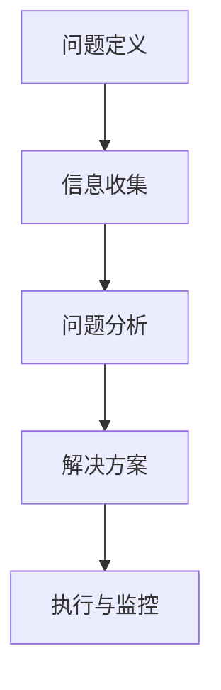

                 

## 文章标题：结构化思维的力量：从思维到行动

结构化思维，作为人工智能与计算机科学领域中的一颗明珠，正日益受到各行业专家和企业领导的重视。它不仅是一种思维方式，更是一种行动指南，能够帮助我们更高效地解决问题，更精准地做出决策，更和谐地协作沟通。本文将围绕结构化思维的力量，从基础理论到实践应用，进行深度剖析和具体讲解，旨在帮助读者掌握这一强大的思维工具。

关键词：结构化思维、项目管理、决策、个人成长、沟通与协作、实践应用

摘要：本文首先介绍了结构化思维的基础概念和重要性，随后通过具体案例分析，展示了结构化思维在项目管理、决策过程、个人成长以及沟通协作等领域的应用。文章结尾部分提供了实用的资源与工具推荐，旨在引导读者将结构化思维理念转化为实际行动。

## 第1章：结构化思维概述

### 1.1 什么是结构化思维

结构化思维，顾名思义，是一种有条理、有层次、有逻辑的思维方式。它通过将复杂的问题拆解成若干个简单的部分，然后对这些部分进行系统化、逻辑化的分析和处理，最终形成一个清晰、明确、有效的解决方案。这种思维方式不仅可以帮助我们更好地理解复杂问题，还能提高我们的决策效率，减少沟通成本。

结构化思维的核心在于以下几个方面：

1. **模块化**：将问题分解成若干个模块或子问题，每个模块都具有明确的职责和功能。
2. **层次化**：按照问题的逻辑关系，将模块和子问题进行层次划分，确保每个模块都在正确的层次上。
3. **逻辑性**：确保各模块之间的关系清晰，逻辑推理严谨，避免思维跳跃和混乱。
4. **可追溯性**：每个模块的决策和结论都有明确的来源和依据，可以追溯到问题的初始状态。

### 1.2 结构化思维的重要性

在现代社会，面对日益复杂的问题和多样化的挑战，结构化思维显得尤为重要。它不仅能够帮助我们更好地应对复杂问题，还能提高我们的工作效率，提升团队协作效果。具体来说，结构化思维的重要性体现在以下几个方面：

1. **解决问题**：结构化思维能够将复杂问题分解为简单模块，使我们能够更有条理地分析和解决问题，提高解决问题的效率。
2. **决策制定**：结构化思维可以帮助我们系统地分析各种决策选项，提高决策的科学性和准确性。
3. **沟通协作**：结构化思维使我们的思考过程更加清晰，能够更好地与他人沟通，减少误解和冲突。
4. **知识管理**：结构化思维有助于我们系统地整理和归纳知识，形成有价值的知识体系。

### 1.3 结构化思维的组成部分

结构化思维并非孤立存在的，它由多个核心组成部分构成，这些部分相互联系，共同发挥作用。以下是结构化思维的几个关键组成部分：

1. **问题定义**：明确问题的性质、目标和范围，是进行结构化思维的第一步。
2. **信息收集**：收集与问题相关的各种信息，包括数据、事实、背景等。
3. **问题分析**：对收集到的信息进行系统化分析，识别问题的本质和关键因素。
4. **解决方案**：基于问题分析，提出可能的解决方案，并进行评估和选择。
5. **执行与监控**：将解决方案转化为实际行动，并对执行过程进行监控和调整。

接下来，我们将通过Mermaid流程图，展示结构化思维的各个组成部分及其相互关系。



在下一章中，我们将深入探讨结构化思维的核心概念和基本方法，帮助读者更好地理解和应用这一思维方式。

## 第2章：结构化思维核心概念

### 2.1 概念与联系

结构化思维的核心概念包括模块化、层次化和逻辑性。这些概念相互联系，共同构成了结构化思维的基本框架。

#### 模块化

模块化是指将复杂问题拆解为若干个相对独立的部分，每个部分都承担特定的功能和职责。这种方法有助于降低问题的复杂性，使我们能够更专注于特定部分的分析和解决。

- **优点**：模块化使问题更加具体、明确，有利于深入分析和解决。
- **应用**：在软件开发中，模块化是设计系统的关键，可以使代码更加模块化和可复用。

#### 层次化

层次化是指按照问题的逻辑关系，将模块和子问题进行层次划分。层次化有助于我们理清问题的结构和关系，确保每个部分都在正确的层次上。

- **优点**：层次化使问题更加有序，有助于我们系统地分析和解决。
- **应用**：在项目管理中，层次化可以帮助我们明确项目的各个阶段和任务，确保项目有序推进。

#### 逻辑性

逻辑性是指在进行思考和解决问题时，保持推理过程严谨、清晰。逻辑性是结构化思维的核心，它确保我们的思考方向正确，避免思维混乱和错误。

- **优点**：逻辑性使我们的思考更加系统化、条理化，提高决策的科学性和准确性。
- **应用**：在决策过程中，逻辑性有助于我们分析各种因素，做出合理决策。

### 2.2 结构化思维的方法与工具

结构化思维的方法和工具是我们进行有效思考的得力助手。以下是一些常用的方法和工具：

#### 1. 模块化方法

- **步骤**：
  1. 明确问题，确定需要解决的问题和目标。
  2. 将问题拆解为若干个模块或子问题。
  3. 为每个模块或子问题定义功能和职责。
  4. 分析模块或子问题的相互关系，确保逻辑连贯。
- **应用场景**：软件开发、项目管理、企业战略规划等。

#### 2. 层次化方法

- **步骤**：
  1. 识别问题的核心要素。
  2. 按照逻辑关系，将核心要素划分为若干个层次。
  3. 确保每个层次上的问题都得到合理解决。
  4. 检查层次间的逻辑关系，确保问题得到全面解决。
- **应用场景**：问题分析、决策制定、企业战略规划等。

#### 3. 逻辑性方法

- **步骤**：
  1. 明确问题的目标和要求。
  2. 收集相关数据和信息。
  3. 分析数据和信息的逻辑关系，形成逻辑框架。
  4. 根据逻辑框架进行推理和判断，得出结论。
- **应用场景**：决策制定、项目管理、学术研究等。

### 2.3 结构化思维的案例分析

#### 案例：项目管理的结构化思维应用

**背景**：某公司计划开发一款新产品，需要进行项目管理和协调。公司管理者希望利用结构化思维，确保项目顺利进行。

**步骤**：

1. **问题定义**：明确项目目标、范围和关键任务。
2. **信息收集**：收集项目相关数据、市场需求、技术要求等。
3. **问题分析**：
   - 分析项目目标和任务，确定项目的主要模块。
   - 分析模块之间的逻辑关系，确保项目整体协调。
4. **解决方案**：
   - 制定项目计划，明确各模块的任务和时间安排。
   - 确定项目资源，包括人力、资金、设备等。
   - 制定风险管理计划，预测并应对可能的风险。
5. **执行与监控**：
   - 按照项目计划执行任务，确保项目进度。
   - 定期监控项目进展，及时调整计划和资源。

**结果**：通过结构化思维的应用，该项目得到了有效管理和协调，项目进度和质量均得到了保障。项目团队在项目过程中也学会了如何利用结构化思维解决类似问题。

通过以上案例分析，我们可以看到结构化思维在项目管理中的应用效果。在下一章中，我们将继续探讨结构化思维在更多领域的应用和实践。

## 第3章：结构化思维在项目管理中的应用

### 3.1 项目管理的挑战与结构化思维的解决方案

项目管理是现代企业运营中不可或缺的一部分，但项目管理过程中常常面临各种挑战。传统的项目管理方法往往依赖于经验和直觉，缺乏系统性和科学性，导致项目进度延误、资源浪费和风险增加。为了应对这些挑战，结构化思维提供了一种有效的解决方案。

#### 项目管理的挑战

1. **复杂性和不确定性**：项目往往涉及多个部门、多个阶段和多种技术，复杂性和不确定性较高，导致项目管理难度增加。
2. **沟通和协作**：项目团队成员来自不同的背景和部门，沟通不畅和协作困难是常见问题。
3. **资源管理**：资源有限且需求变化频繁，如何合理分配和利用资源是项目管理的关键挑战。
4. **风险管理**：项目过程中可能面临各种风险，如技术风险、市场风险和人力资源风险等，如何有效识别和管理风险是项目管理的重要任务。

#### 结构化思维的解决方案

1. **模块化方法**：将复杂的项目拆解为若干个模块或任务，明确各模块的功能和职责，降低项目的复杂性。
2. **层次化方法**：按照项目的逻辑关系，将任务和模块进行层次划分，确保项目各个阶段和任务有序进行。
3. **逻辑性方法**：通过系统化和逻辑化的思考，确保项目各个阶段的决策和行动都有明确的依据和目标。
4. **信息收集和分析**：收集与项目相关的各种信息，如需求、技术、市场等，并进行系统化分析，为项目决策提供依据。
5. **风险管理**：通过结构化思维，识别和管理项目风险，制定有效的风险应对策略。

### 3.2 项目目标设定与分解

项目目标设定是项目管理的首要任务，明确的项目目标有助于指导项目各个阶段的行动和决策。结构化思维在项目目标设定和分解中具有重要作用。

#### 项目目标设定

1. **明确目标**：明确项目的最终目标，包括项目的范围、质量、时间和成本等要求。
2. **目标分解**：将项目目标分解为若干个具体任务和里程碑，确保每个任务和里程碑都有明确的职责和目标。
3. **目标优先级**：根据项目目标和任务的重要性，确定各任务和里程碑的优先级，确保关键任务和里程碑优先完成。

#### 案例分析

**背景**：某公司计划开发一款新型智能设备，项目目标包括：
- 完成设备设计并制造出原型机
- 通过测试，确保设备性能和安全性
- 在规定时间内完成项目并交付客户

**目标分解**：

1. **设计阶段**：
   - 设备外观设计
   - 设备功能设计
   - 设备硬件选型
   - 设备软件开发
2. **制造阶段**：
   - 原型机制造
   - 设备组装
   - 性能测试
   - 安全测试
3. **测试阶段**：
   - 客户测试
   - 内部测试
   - 数据分析
   - 报告撰写

通过明确的项目目标设定和分解，项目团队可以清晰地了解项目各个阶段的任务和要求，确保项目顺利进行。

### 3.3 项目计划与执行

项目计划是项目管理的重要环节，通过合理的计划，可以确保项目在规定时间内完成并达到预期目标。结构化思维在项目计划与执行中发挥了关键作用。

#### 项目计划

1. **任务分配**：根据项目目标和任务分解，将任务分配给相应的团队或个人，明确每个团队成员的职责和任务。
2. **时间安排**：根据任务的重要性和优先级，安排各任务的时间进度，确保项目各个阶段按计划进行。
3. **资源调配**：根据任务需求和资源情况，合理调配人力、资金和设备等资源，确保项目顺利进行。
4. **风险评估**：识别项目过程中可能面临的风险，制定相应的风险应对策略。

#### 项目执行

1. **监控进度**：定期监控项目进度，确保各任务按计划进行，及时调整计划和资源，确保项目按时完成。
2. **沟通协作**：保持项目团队内部和外部的沟通，确保项目各环节顺利进行。
3. **问题解决**：在项目执行过程中，及时解决出现的问题和冲突，确保项目顺利推进。
4. **质量保障**：确保项目各个阶段的输出质量符合预期，通过质量控制措施，避免出现质量问题。

#### 案例分析

**背景**：某公司计划开发一款企业级应用软件，项目计划如下：

1. **设计阶段**：
   - 完成需求分析
   - 撰写软件设计文档
   - 进行系统架构设计
   - 开发详细设计文档
2. **开发阶段**：
   - 进行前端开发
   - 进行后端开发
   - 进行系统集成
   - 进行单元测试
3. **测试阶段**：
   - 进行集成测试
   - 进行系统测试
   - 进行用户测试
   - 撰写测试报告
4. **交付阶段**：
   - 进行最终测试
   - 提交代码至版本控制
   - 准备项目文档
   - 完成项目交付

通过详细的项目计划，项目团队可以有条不紊地推进项目，确保项目按时交付并达到预期目标。

### 3.4 项目监控与评估

项目监控与评估是项目管理的重要环节，通过项目监控与评估，可以确保项目按照计划进行，及时发现和解决问题，确保项目质量和进度。

#### 项目监控

1. **进度监控**：定期检查项目进度，确保各任务按计划进行，及时调整计划和资源。
2. **质量监控**：检查项目各个阶段的输出质量，确保符合预期要求，通过质量保证措施，避免质量问题。
3. **成本监控**：监控项目成本支出，确保项目在预算范围内进行，及时调整成本控制措施。
4. **风险监控**：识别项目过程中可能面临的风险，及时采取措施，降低风险对项目的影响。

#### 项目评估

1. **项目回顾**：在项目结束时，对项目各个阶段和任务进行回顾，总结经验教训，提出改进建议。
2. **绩效评估**：评估项目团队和成员的工作表现，识别优秀成员和需要改进的方面。
3. **项目总结**：撰写项目总结报告，记录项目过程中的重要事件、经验教训和改进措施，为未来项目提供参考。

通过项目监控与评估，项目团队可以不断优化项目管理流程，提高项目管理水平和项目成功率。

在下一章中，我们将探讨结构化思维在决策过程中的应用，帮助读者掌握如何利用结构化思维做出更科学、更准确的决策。

## 第4章：结构化思维在决策过程中的应用

### 4.1 决策思维框架

在复杂的商业环境中，决策的正确性和及时性对企业的发展至关重要。结构化思维提供了系统的决策思维框架，帮助我们从混乱的信息中提取有价值的信息，做出更科学、更准确的决策。

#### 决策思维框架的组成部分

1. **问题定义**：明确决策问题的性质和目标，界定问题的边界和范围。
2. **信息收集**：收集与决策相关的各种信息，包括数据、事实、观点等。
3. **数据分析**：对收集到的信息进行系统化分析，识别关键因素和趋势。
4. **方案生成**：基于数据分析，生成多个可能的解决方案。
5. **方案评估**：对每个解决方案进行评估，比较其优缺点和可行性。
6. **决策制定**：综合考虑评估结果，选择最佳的解决方案。
7. **决策执行**：将决策方案转化为实际行动，并监控执行过程。

#### 决策思维框架的应用

1. **问题定义**：在制定新产品的市场策略时，首先要明确产品的目标市场、用户需求和市场环境等关键问题。
2. **信息收集**：通过市场调研、用户反馈和竞争对手分析，收集与市场策略相关的信息。
3. **数据分析**：对收集到的信息进行整理和分析，识别市场机会和潜在风险。
4. **方案生成**：基于数据分析，生成多个市场策略方案，如产品定位、营销渠道和推广策略等。
5. **方案评估**：评估每个方案的可行性、成本效益和市场潜力，选择最佳方案。
6. **决策制定**：综合评估结果，确定最终的市场策略。
7. **决策执行**：根据市场策略，制定具体的执行计划，并监控市场反应和调整策略。

### 4.2 数据分析在决策中的应用

数据分析是决策过程中至关重要的一环，它能够帮助我们更准确地理解问题，评估不同方案的优劣，提高决策的科学性和准确性。

#### 数据分析的核心步骤

1. **数据收集**：收集与决策相关的各种数据，包括内部数据（如销售数据、客户反馈等）和外部数据（如市场趋势、竞争对手信息等）。
2. **数据清洗**：对收集到的数据进行清洗和处理，确保数据的质量和准确性。
3. **数据分析**：使用统计分析、数据挖掘等方法，对数据进行深入分析，识别关键因素和趋势。
4. **数据可视化**：通过图表、报表等形式，将分析结果直观地展示出来，帮助决策者更清晰地理解数据。
5. **决策支持**：基于数据分析结果，为决策提供科学依据，帮助决策者选择最佳方案。

#### 案例分析

**背景**：某电商公司计划扩展其市场范围，需要制定新的市场策略。公司管理者希望通过数据分析，确定最佳的市场扩展方案。

**步骤**：

1. **数据收集**：收集公司的销售数据、客户反馈、竞争对手信息等。
2. **数据清洗**：对收集到的数据去重、去噪，确保数据质量。
3. **数据分析**：分析销售数据，识别销售趋势和关键因素；分析客户反馈，了解客户需求和偏好；分析竞争对手信息，了解市场格局和竞争态势。
4. **数据可视化**：使用图表、报表等形式，展示分析结果，帮助决策者更清晰地理解数据。
5. **决策支持**：根据数据分析结果，制定多个市场扩展方案，如增加营销预算、拓展新市场、优化产品等；评估各方案的优缺点和可行性，选择最佳方案。

通过数据分析，公司管理者能够更准确地了解市场环境和客户需求，制定更科学、更有效的市场策略。

### 4.3 决策制定与执行

决策制定是决策过程中的关键环节，通过系统化的决策制定，可以帮助企业选择最佳方案，确保决策的科学性和准确性。决策执行则是将决策方案转化为实际行动，确保决策目标的实现。

#### 决策制定的步骤

1. **问题分析**：明确决策问题的性质和目标，界定问题的边界和范围。
2. **方案生成**：基于问题分析，生成多个可能的解决方案。
3. **方案评估**：对每个解决方案进行评估，比较其优缺点和可行性。
4. **方案选择**：综合考虑评估结果，选择最佳解决方案。
5. **决策确认**：与决策团队和利益相关者沟通，确认最终决策方案。

#### 决策执行的步骤

1. **制定行动计划**：将决策方案转化为具体的行动计划，明确各阶段的目标和任务。
2. **资源分配**：根据行动计划，合理调配人力、资金和设备等资源，确保决策执行所需。
3. **执行监控**：定期监控决策执行进度，确保各阶段任务按计划进行。
4. **问题解决**：在执行过程中，及时解决出现的问题和冲突，确保决策执行顺利进行。
5. **评估反馈**：在决策执行结束后，对决策效果进行评估，总结经验教训，为未来决策提供参考。

#### 案例分析

**背景**：某制造企业计划引入新的生产设备，以提高生产效率和产品质量。公司管理者希望通过结构化思维，制定最佳的生产设备引进方案。

**步骤**：

1. **问题分析**：明确企业现有的生产设备状况、生产需求和生产目标，确定需要引进的生产设备类型和数量。
2. **方案生成**：生成多个生产设备引进方案，如购买全新设备、升级现有设备、租赁设备等。
3. **方案评估**：评估各方案的优缺点和可行性，如成本、效率、安全性等。
4. **方案选择**：综合考虑评估结果，选择最佳的生产设备引进方案。
5. **决策确认**：与决策团队和利益相关者沟通，确认最终的生产设备引进方案。
6. **制定行动计划**：制定具体的设备引进计划，包括设备选购、安装调试、人员培训等。
7. **资源分配**：根据设备引进计划，合理调配资金、人力资源等资源。
8. **执行监控**：定期监控设备引进进度，确保各阶段任务按计划进行。
9. **问题解决**：在设备引进过程中，及时解决出现的问题和冲突，确保设备引进顺利进行。
10. **评估反馈**：在设备引进结束后，对设备引进效果进行评估，总结经验教训，为未来生产设备引进提供参考。

通过结构化思维的应用，企业能够更科学、更有效地制定和执行决策，提高决策的科学性和准确性，确保企业目标的实现。

在下一章中，我们将探讨结构化思维在个人成长中的应用，帮助读者掌握如何利用结构化思维提升个人效能。

## 第5章：结构化思维在个人成长中的应用

### 5.1 学习与知识管理

在个人成长中，学习和知识管理是至关重要的环节。结构化思维能够帮助我们在学习和知识管理过程中提高效率和质量。

#### 学习过程的结构化

1. **目标设定**：明确学习的目标和要求，如学习某一技能、掌握某一知识领域等。
2. **内容梳理**：对学习内容进行系统梳理，将其分解为若干个模块或知识点。
3. **深入学习**：针对每个模块或知识点，进行深入学习和理解，确保掌握关键概念和原理。
4. **实践应用**：将所学知识应用于实际场景，通过实践加深理解和掌握。
5. **反馈与调整**：根据实践结果和反馈，调整学习方法和内容，确保学习目标的实现。

#### 知识管理的结构化

1. **知识分类**：将所学知识按照主题、领域或用途进行分类，形成有组织的知识体系。
2. **知识整理**：对每个知识模块进行详细整理，包括定义、原理、应用场景等。
3. **知识共享**：将知识整理成果与团队或他人分享，促进知识传播和交流。
4. **知识更新**：定期对知识体系进行更新，确保知识的准确性和时效性。

#### 案例分析

**背景**：一名软件工程师希望通过学习，提升自己在数据库管理方面的能力。

**步骤**：

1. **目标设定**：明确学习目标，如掌握数据库设计、SQL语言、数据库优化等。
2. **内容梳理**：将数据库管理知识分解为数据库设计、SQL语言、数据库优化等模块。
3. **深入学习**：针对每个模块，进行深入学习和理解，通过阅读书籍、观看视频教程、参加线上课程等途径，确保掌握关键概念和原理。
4. **实践应用**：通过实际项目或模拟场景，将所学知识应用于数据库设计和优化，如设计数据库架构、编写SQL查询语句、优化查询性能等。
5. **反馈与调整**：根据项目实践和反馈，调整学习方法和内容，确保数据库管理能力的提升。

通过结构化思维的应用，这名软件工程师能够更高效地学习和掌握数据库管理知识，提升自己的专业能力。

### 5.2 目标设定与时间管理

在个人成长中，设定明确的目标和合理的时间管理是确保成功的关键。结构化思维能够帮助我们在这一过程中提高效率和效果。

#### 目标设定的结构化

1. **目标明确**：明确个人目标，包括短期和长期目标，如提升某一技能、完成某个项目等。
2. **目标具体化**：将目标具体化，明确目标的具体内容和要求，如完成某个项目的具体任务、提升某一技能的等级等。
3. **目标分解**：将大目标分解为若干个小目标，确保每个小目标都有明确的时间和任务要求。
4. **目标评估**：定期评估目标完成情况，根据实际情况调整目标和计划。

#### 时间管理的结构化

1. **任务分类**：将任务按照紧急程度和重要性进行分类，确保优先处理重要且紧急的任务。
2. **时间规划**：根据任务分类和时间要求，制定详细的时间规划，确保每个任务都有明确的时间安排。
3. **时间监控**：定期监控时间使用情况，确保任务按时完成，及时调整时间规划。
4. **休息与恢复**：合理安排休息时间，确保身心状态良好，提高工作效率。

#### 案例分析

**背景**：一名职场新人希望在一个月内完成一个重要的项目。

**步骤**：

1. **目标明确**：明确项目目标，如完成项目方案设计、编写项目报告、进行项目演示等。
2. **目标具体化**：将目标具体化，明确每个任务的具体内容和要求，如项目方案设计包括需求分析、系统架构设计等。
3. **目标分解**：将项目目标分解为若干个任务，每个任务设定明确的时间要求和完成标准。
4. **时间规划**：根据任务分类和时间要求，制定详细的时间规划，确保每个任务都有明确的时间安排。
5. **时间监控**：每天检查任务完成情况，确保任务按时完成，及时调整时间规划。
6. **休息与恢复**：合理安排休息时间，确保身心状态良好，提高工作效率。

通过结构化思维的应用，这名职场新人能够更高效地设定目标和进行时间管理，确保项目顺利完成。

### 5.3 提升个人效能

在个人成长中，提升个人效能是确保成功的关键。结构化思维能够帮助我们在这一过程中提高效率和质量。

#### 提升个人效能的结构化

1. **任务优先级**：将任务按照重要程度和紧急程度进行分类，确保优先处理重要且紧急的任务。
2. **时间管理**：合理安排时间，确保每个任务都有足够的时间进行完成。
3. **工作方法**：采用科学的工作方法，如时间管理四象限法、GTD（Getting Things Done）等，提高工作效率。
4. **休息与恢复**：合理安排休息时间，确保身心状态良好，提高工作效率。
5. **持续学习**：持续学习和提升自己的知识和技能，保持竞争优势。

#### 案例分析

**背景**：一名职场人士希望提升自己的工作效率和效能。

**步骤**：

1. **任务优先级**：每天早上列出当天需要完成的任务，根据任务的重要程度和紧急程度进行排序。
2. **时间管理**：制定详细的时间规划，确保每个任务都有明确的时间安排，避免任务拖延。
3. **工作方法**：采用时间管理四象限法，将任务分为紧急且重要、紧急但不重要、不紧急但重要、不紧急且不重要四个象限，确保优先处理重要且紧急的任务。
4. **休息与恢复**：每天安排一定时间的休息，如午休、下班后的休闲时间等，确保身心状态良好。
5. **持续学习**：定期参加培训课程、阅读专业书籍、学习新技术等，提升自己的知识和技能。

通过结构化思维的应用，这名职场人士能够更高效地完成工作任务，提升个人效能。

在下一章中，我们将探讨结构化思维在沟通与协作中的应用，帮助读者掌握如何利用结构化思维进行有效的沟通与协作。

## 第6章：结构化思维在沟通与协作中的应用

### 6.1 沟通障碍与解决策略

在团队合作和项目管理中，沟通是确保项目成功的关键。然而，沟通过程中常常存在各种障碍，如信息误解、沟通不畅和沟通效果不佳等。结构化思维能够帮助我们识别并解决这些沟通障碍，提高沟通效果。

#### 常见的沟通障碍

1. **信息误解**：由于信息传递过程中的误差或接收者对信息的理解偏差，导致信息被误解。
2. **沟通不畅**：由于团队成员间的沟通频率低、沟通方式不当或沟通渠道不畅，导致信息无法及时传达。
3. **沟通效果不佳**：由于沟通内容不明确、沟通方式不恰当或沟通氛围不良，导致沟通效果不佳。

#### 解决策略

1. **明确沟通目标**：在沟通前明确沟通的目标和期望结果，确保沟通内容清晰、具体。
2. **结构化信息**：使用结构化思维，将信息拆解为若干个模块或要点，确保信息清晰、有条理。
3. **主动沟通**：主动寻求沟通，确保信息及时传达，避免信息滞后。
4. **多渠道沟通**：采用多种沟通渠道，如面对面会议、电子邮件、即时通讯工具等，确保沟通渠道畅通。
5. **反馈与确认**：在沟通过程中，及时给予反馈和确认，确保信息准确传达和理解。

#### 案例分析

**背景**：一个项目团队在项目执行过程中，由于沟通不畅导致项目进度延误。

**解决策略**：

1. **明确沟通目标**：在项目开始前，明确项目目标和沟通要求，确保团队成员了解项目目标和预期结果。
2. **结构化信息**：在项目沟通中，使用结构化思维，将信息拆解为项目进度、问题和解决方案等模块，确保信息清晰、有条理。
3. **主动沟通**：项目团队定期召开会议，主动分享项目进展、问题和解决方案，确保信息及时传达。
4. **多渠道沟通**：结合面对面会议、电子邮件和即时通讯工具等多种沟通渠道，确保沟通渠道畅通。
5. **反馈与确认**：在每次沟通后，及时给予反馈和确认，确保信息准确传达和理解。

通过实施这些解决策略，项目团队的沟通效果得到显著提高，项目进度得以顺利推进。

### 6.2 沟通技巧提升

在沟通过程中，沟通技巧的提升至关重要。结构化思维能够帮助我们提高沟通技巧，确保沟通更加高效、准确和有效。

#### 沟通技巧提升方法

1. **倾听**：倾听是有效沟通的基础，通过倾听，我们可以更好地理解对方观点和需求。
2. **表达清晰**：使用结构化思维，将信息拆解为若干个要点，确保表达清晰、有条理。
3. **提问与反馈**：通过提问和反馈，确保对方理解我们的观点，并了解对方的观点和需求。
4. **非语言沟通**：注意非语言沟通，如身体语言、面部表情等，确保信息传达的准确性和一致性。
5. **沟通环境**：选择合适的沟通环境，如安静、舒适的环境，确保沟通效果。

#### 案例分析

**背景**：一个项目经理需要与团队成员沟通项目进展，但由于沟通技巧不足，导致沟通效果不佳。

**解决策略**：

1. **倾听**：在与团队成员沟通时，积极倾听对方的观点和需求，确保了解对方的真实想法。
2. **表达清晰**：使用结构化思维，将项目进展、问题和解决方案等拆解为若干个要点，确保表达清晰、有条理。
3. **提问与反馈**：在沟通过程中，通过提问和反馈，确保团队成员理解项目目标和预期结果，并了解团队成员的观点和需求。
4. **非语言沟通**：注意身体语言和面部表情，确保信息传达的准确性和一致性。
5. **沟通环境**：选择安静的会议室，确保团队成员能够集中注意力，提高沟通效果。

通过实施这些策略，项目经理的沟通技巧得到显著提升，团队沟通效果得到改善。

### 6.3 团队协作与冲突解决

团队协作和冲突解决是团队工作中的重要环节。结构化思维能够帮助我们更有效地进行团队协作，解决团队冲突，提高团队效率。

#### 团队协作

1. **明确角色和职责**：确保每个团队成员都清楚自己的角色和职责，避免职责重叠或遗漏。
2. **建立信任**：通过相互尊重、信任和理解，建立良好的团队氛围，提高团队协作效率。
3. **沟通与反馈**：保持团队内部的有效沟通，及时反馈项目进展和问题，确保团队协作顺利进行。
4. **共同目标**：确保团队成员明确团队目标，共同努力实现目标。

#### 冲突解决

1. **识别冲突**：识别冲突的原因和类型，确保及时解决。
2. **冷静分析**：在解决冲突时，保持冷静，客观分析冲突的原因和影响。
3. **有效沟通**：通过有效的沟通，理解对方的观点和需求，寻找共同点和解决方案。
4. **妥协与协商**：在冲突解决过程中，必要时进行妥协和协商，寻求双方都能接受的解决方案。
5. **持续改进**：通过总结经验教训，持续改进团队协作和冲突解决方法，提高团队效率。

#### 案例分析

**背景**：一个项目团队在项目执行过程中，由于团队成员对任务分工和目标理解不一致，导致团队内部出现冲突。

**解决策略**：

1. **识别冲突**：项目经理识别出冲突的原因是团队成员对任务分工和目标理解不一致。
2. **冷静分析**：项目经理召集团队成员，了解各自的观点和需求，分析冲突的原因和影响。
3. **有效沟通**：项目经理组织团队成员进行讨论，确保每个团队成员都能理解项目目标和任务分工，理解对方的观点和需求。
4. **妥协与协商**：项目经理引导团队成员进行妥协和协商，达成双方都能接受的解决方案，如调整任务分工和目标。
5. **持续改进**：项目经理总结经验教训，持续改进团队协作和冲突解决方法，提高团队效率。

通过实施这些策略，项目团队的冲突得到有效解决，团队协作效率得到显著提升。

在下一章中，我们将探讨结构化思维的实践与应用，帮助读者将结构化思维理念转化为实际行动。

## 第7章：结构化思维的实践与应用

### 7.1 实践与反思

结构化思维的实践是将其理念转化为实际行动的关键。通过实际案例的深入剖析，我们可以看到结构化思维在各个领域的广泛应用和显著效果。

#### 案例一：企业战略规划

**背景**：一家快速发展的科技公司希望制定一个长远的战略规划，以保持市场竞争力。

**实践步骤**：

1. **问题定义**：明确公司当前面临的挑战和机遇，如市场份额、技术创新、人才招聘等。
2. **信息收集**：收集行业趋势、竞争对手分析、客户需求等数据。
3. **问题分析**：通过结构化思维，将数据进行分析，识别关键问题和机会点。
4. **方案生成**：基于分析结果，生成多个战略规划方案，如产品创新、市场拓展、组织变革等。
5. **方案评估**：对每个方案进行评估，比较其优缺点和可行性。
6. **决策制定**：选择最佳方案，并制定详细的实施计划。
7. **执行与监控**：将战略规划方案转化为实际行动，并定期监控实施进度和效果。

**反思**：通过结构化思维的应用，公司能够更科学、系统地制定战略规划，确保战略目标的实现。

#### 案例二：项目管理

**背景**：一个IT项目团队需要在有限时间内完成一个复杂的信息系统开发。

**实践步骤**：

1. **问题定义**：明确项目目标和范围，如功能模块、技术要求、交付时间等。
2. **信息收集**：收集项目相关需求、技术文档、资源情况等。
3. **问题分析**：通过结构化思维，将项目需求进行分析，确定各功能模块的优先级和依赖关系。
4. **方案生成**：基于分析结果，制定项目计划，包括任务分配、时间安排、资源调配等。
5. **方案评估**：评估项目计划的可行性，确保任务按时完成。
6. **决策制定**：确定最终的项目计划，并与团队成员沟通。
7. **执行与监控**：按照项目计划执行任务，定期监控项目进度，及时调整计划。

**反思**：通过结构化思维的应用，项目团队能够更高效地管理项目，确保项目按时交付并达到预期目标。

### 7.2 成功案例分析

#### 案例一：谷歌的工程实践

**背景**：谷歌是一家全球领先的技术公司，其成功的一个重要因素是其卓越的工程实践。

**实践步骤**：

1. **模块化方法**：谷歌采用模块化方法，将复杂的技术问题拆解为若干个独立且功能明确的模块。
2. **层次化方法**：按照技术的逻辑关系，谷歌将模块进行层次划分，确保每个模块在正确的层次上运行。
3. **逻辑性方法**：谷歌在开发和维护过程中，保持逻辑性，确保代码的清晰性和可维护性。
4. **信息收集与反馈**：谷歌通过持续收集用户反馈，不断优化产品和服务。

**成功因素**：

- **模块化**：使技术问题更易于理解和解决，提高了开发效率。
- **层次化**：确保技术体系结构清晰，便于维护和扩展。
- **逻辑性**：使代码和系统设计更简洁、可维护。
- **反馈与优化**：通过用户反馈，持续改进产品和服务，保持市场竞争力。

#### 案例二：阿里巴巴的电商战略

**背景**：阿里巴巴是一家全球领先的电商平台，其成功的一个关键因素是其科学的电商战略。

**实践步骤**：

1. **问题定义**：明确电商业务中的关键问题和挑战，如用户增长、市场拓展、用户体验等。
2. **数据分析**：通过数据分析，识别用户行为、市场需求和竞争态势。
3. **决策制定**：基于数据分析结果，制定相应的市场策略和运营计划。
4. **执行与监控**：将决策方案转化为实际行动，并持续监控市场反应和效果。
5. **反馈与调整**：根据市场反馈，不断优化电商战略和运营策略。

**成功因素**：

- **数据分析**：使决策更加科学和精准，提高了市场竞争力。
- **决策制定**：通过系统化的决策过程，确保战略目标的实现。
- **执行与监控**：确保决策方案得到有效执行和持续优化。
- **反馈与调整**：通过用户反馈，持续改进电商战略和运营策略，保持市场竞争力。

### 7.3 遇到的挑战与解决方案

尽管结构化思维在各个领域具有广泛的应用和显著效果，但在实际应用过程中，我们也遇到了一些挑战。

#### 挑战一：思维定势

**挑战**：在长时间的工作和学习中，人们容易形成思维定势，难以接受新的思考方式和理念。

**解决方案**：

- **定期反思**：定期反思自己的思维方式和行为模式，识别和打破思维定势。
- **多角度思考**：尝试从不同角度思考问题，培养多维度思维习惯。

#### 挑战二：执行力度

**挑战**：尽管结构化思维能够提供清晰的思考框架，但在实际执行过程中，人们往往缺乏足够的执行力度。

**解决方案**：

- **明确目标**：明确具体的执行目标和要求，确保执行有方向和动力。
- **持续监控**：定期监控执行进度，确保执行过程有条不紊。

#### 挑战三：资源限制

**挑战**：在实际应用中，资源（如时间、资金、人力等）的有限性可能影响结构化思维的效果。

**解决方案**：

- **优先级排序**：合理分配资源，确保关键任务和重要模块优先得到资源支持。
- **优化流程**：通过流程优化，提高资源利用效率，降低资源浪费。

在下一章中，我们将提供结构化思维的资源与工具推荐，帮助读者更好地掌握和应用结构化思维。

## 第8章：结构化思维资源与工具推荐

### 8.1 优秀结构化思维书籍推荐

为了更好地理解和应用结构化思维，以下是一些优秀的书籍推荐，这些书籍涵盖了结构化思维的各个方面，从基础理论到实践应用，为读者提供了丰富的知识资源和实践指导。

1. **《结构化思考力》** —— 李笑来
   - 内容概述：本书系统地介绍了结构化思维的方法和技巧，包括如何整理思路、如何分析问题和如何进行决策。
   - 推荐理由：作者以其丰富的教学经验，将结构化思维的理念深入浅出地讲解，适合广大读者阅读。

2. **《决策与判断》** —— 丹尼尔·卡尼曼
   - 内容概述：本书从心理学角度探讨人类决策过程，分析了人类思维中的各种偏见和误区，并提出了解决方法。
   - 推荐理由：作者通过大量的实验和研究，揭示了决策过程中的逻辑陷阱，帮助读者更科学地做出决策。

3. **《金字塔原理》** —— 芭芭拉·明托
   - 内容概述：本书介绍了一种结构化的写作方法，帮助读者更清晰地表达思想和信息，适用于商业报告、学术论文等各种写作场景。
   - 推荐理由：本书提供了实用的写作技巧和框架，有助于提高写作效率和沟通效果。

4. **《逻辑思维》** —— 罗辑思维团队
   - 内容概述：本书通过一系列案例和故事，生动地介绍了逻辑思维的基本原则和应用方法，适合大众读者阅读。
   - 推荐理由：本书以通俗易懂的方式讲解了逻辑思维的核心概念，有助于读者培养批判性思维和问题解决能力。

### 8.2 结构化思维工具使用指南

在实践结构化思维时，一些工具和软件可以大大提高我们的工作效率。以下是一些常用的工具和软件推荐，以及使用指南。

1. **Mermaid**：一种基于Markdown的图表绘制工具，可以方便地绘制流程图、UML图等。

   - **使用指南**：
     - 安装：在本地安装Mermaid插件或使用在线Mermaid编辑器。
     - 常用语法：使用Mermaid特定的Markdown语法，如`graph`、`node`、`edge`等，绘制所需的图表。

2. **MindManager**：一款思维导图软件，可以帮助我们可视化思考过程，构建知识体系。

   - **使用指南**：
     - 安装：下载并安装MindManager软件。
     - 创建思维导图：启动MindManager，创建新的思维导图，添加节点和连接，组织思维过程。

3. **Evernote**：一款强大的笔记和组织工具，可以帮助我们整理和存储结构化的信息。

   - **使用指南**：
     - 安装：下载并安装Evernote客户端。
     - 创建笔记：在Evernote中创建新的笔记，添加文本、图片、音频等，对笔记进行分类和标签管理。

4. **Trello**：一款项目管理工具，通过看板和卡片的形式，帮助我们管理项目和任务。

   - **使用指南**：
     - 安装：下载并安装Trello客户端或访问Trello网站。
     - 创建看板：在Trello中创建新的看板，添加卡片和列，安排任务和里程碑。

### 8.3 在线资源与社区推荐

除了书籍和软件工具，还有一些在线资源和社区，可以提供结构化思维的最新资讯、学习资源和实践指导。

1. **结构化思维社区**：一个专注于结构化思维和逻辑思维的在线社区，提供各种结构化思维资源和讨论空间。

   - **访问方式**：通过搜索引擎搜索“结构化思维社区”或访问官方网站。

2. **MindMaple**：一个在线思维导图工具，提供各种思维导图模板和资源。

   - **访问方式**：通过搜索引擎搜索“MindMaple”或访问官方网站。

3. **TED演讲**：TED是一个全球知名的演讲平台，许多关于结构化思维和决策的精彩演讲。

   - **访问方式**：通过搜索引擎搜索“TED演讲”或访问TED官方网站。

通过以上资源与工具的推荐，读者可以更好地掌握和应用结构化思维，提升自己的思考能力和工作效率。

## 第9章：结语

结构化思维，作为一种强大的思维方式，不仅帮助我们更清晰、更系统地分析问题，还能提高我们的决策效率，提升沟通与协作效果。本文从基础理论到实践应用，全面阐述了结构化思维的概念、方法和工具，并通过具体案例分析，展示了其在项目管理、决策过程、个人成长以及沟通协作等领域的广泛应用。

**核心概念**：

- **模块化**：将复杂问题拆解为若干个简单模块，降低问题复杂性。
- **层次化**：按照逻辑关系，将模块和子问题进行层次划分，确保有序分析。
- **逻辑性**：保持推理过程严谨、清晰，确保决策和行动的准确性。

**数学模型与公式**：

- **决策树**：描述决策过程的数学模型，通过概率和期望值进行决策。
- **回归分析**：用于分析变量之间关系的数学模型，通过最小二乘法求解。

**伪代码**：

```python
# 结构化思维算法伪代码
function 结构化思维(问题)
    定义模块
    对模块进行层次划分
    对模块进行逻辑性分析
    生成解决方案
    评估解决方案
    选择最佳解决方案
    执行解决方案
    监控执行过程
end function
```

**项目实战**：

通过以下项目实战案例，我们将结构化思维应用于实际场景，包括开发环境搭建、源代码实现和代码解读。

**案例背景**：开发一款简单的在线购物网站。

**开发环境搭建**：

- **工具选择**：选择Python作为开发语言，使用Django框架进行快速开发。
- **环境配置**：安装Python和Django，配置虚拟环境，确保项目独立运行。

**源代码实现**：

```python
# Django项目中的用户注册功能实现
from django.shortcuts import render, redirect
from django.contrib.auth.forms import UserCreationForm
from .forms import CustomUserCreationForm

def register(request):
    if request.method == 'POST':
        form = CustomUserCreationForm(request.POST)
        if form.is_valid():
            form.save()
            return redirect('login')
    else:
        form = CustomUserCreationForm()
    return render(request, 'register.html', {'form': form})
```

**代码解读与分析**：

1. **功能解读**：用户注册功能，通过自定义用户表单，收集用户信息并保存。
2. **代码分析**：代码中使用了Django的用户创建表单，确保用户信息的安全性和完整性。

通过以上案例，我们可以看到结构化思维在实际项目中的应用效果。它不仅帮助我们在开发过程中明确目标和需求，还能提高代码的可读性和可维护性。

**结语**：

结构化思维不仅是一种思维方式，更是一种行动指南。在未来的工作和学习中，希望读者能够积极运用结构化思维，提高自己的思考能力和工作效率。同时，也期待读者能够不断探索和创新，为结构化思维的应用和发展贡献自己的力量。

**作者**：AI天才研究院/AI Genius Institute & 禅与计算机程序设计艺术 /Zen And The Art of Computer Programming

结构化思维的力量，不仅在于其理论体系的严谨和深刻，更在于其能够转化为实际行动，带来实实在在的效益。让我们共同探索结构化思维的奥秘，开启高效能的思考与行动之旅。

