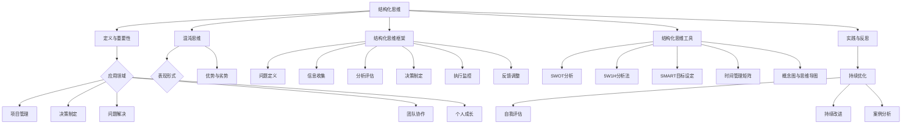

                 

# 结构化思维：从混沌到清晰

> 关键词：结构化思维、逻辑分析、SWOT分析、5W1H、SMART目标、时间管理矩阵、概念图与思维导图、实践与反思

> 摘要：本文旨在探讨结构化思维的概念、重要性以及在实际应用中的方法与技巧。通过分析SWOT分析、5W1H分析法、SMART目标设定、时间管理矩阵、概念图与思维导图等工具，帮助读者理解并掌握如何运用结构化思维提升个人与团队的工作效率。文章还通过个人和团队案例分析，展示了结构化思维的实践效果，并提出了持续优化与反思的方法。

## 第一部分：引言

### 第1章：结构化思维概述

#### 1.1 结构化思维的定义与重要性

结构化思维是一种将复杂信息、问题和决策分解为有序、可管理的元素的方法。它强调逻辑、系统和层次性，帮助个体和组织从混沌中提取关键信息，并形成清晰的思维路径。

#### 1.2 结构化思维的应用领域

结构化思维在各个领域都有广泛的应用，包括项目管理、决策制定、问题解决、团队协作等。它在IT行业尤为突出，因为IT领域的问题通常具有复杂性和高度抽象性。

#### 1.3 如何运用结构化思维

要运用结构化思维，首先需要识别问题或目标，然后将其分解为更小、更具体的部分。接着，使用适当的工具和框架进行分析，最后整合信息并形成解决方案。

### 第2章：从混沌到结构化

#### 2.1 混沌思维的表现形式

混沌思维通常表现为信息混乱、思路不清、决策犹豫不决。它会导致时间浪费、效率低下，甚至影响到项目的成功。

#### 2.2 结构化思维的优势

结构化思维的优势包括提高工作效率、降低错误率、增强决策能力、提升团队协作等。它使得复杂问题变得可管理，从而更容易解决。

#### 2.3 结构化思维的框架

结构化思维的框架通常包括以下步骤：问题定义、信息收集、分析评估、决策制定、执行监控和反馈调整。

## 第二部分：结构化思维工具

### 第3章：SWOT分析

#### 3.1 SWOT分析的定义与作用

SWOT分析是一种评估企业、项目或个人优势、劣势、机会和威胁的方法。它有助于识别关键因素，制定战略规划。

#### 3.2 SWOT分析的步骤

1. 确定分析对象
2. 收集相关信息
3. 分析优势与劣势
4. 分析机会与威胁
5. 制定战略计划

#### 3.3 SWOT分析的案例解析

以一家初创公司为例，通过SWOT分析识别自身优势、劣势、机会和威胁，从而制定合适的发展策略。

### 第4章：5W1H分析法

#### 4.1 5W1H分析法的定义与作用

5W1H分析法是一种通过提问的方式，全面了解和分析问题或项目的方法。它包括What、Why、Who、When、Where、How。

#### 4.2 5W1H分析法的应用场景

5W1H分析法适用于项目规划、市场调研、问题解决等场景，帮助个体和组织全面了解问题的各个方面。

#### 4.3 5W1H分析法的案例解析

以一次项目规划为例，通过5W1H分析法，全面了解项目的目标、原因、人员、时间、地点和方式。

### 第5章：SMART目标设定

#### 5.1 SMART目标的定义与要素

SMART目标是一种具体、可衡量、可实现、相关性强和时限明确的目标设定方法。它包括Specific、Measurable、Achievable、Relevant和Time-bound。

#### 5.2 SMART目标的设定步骤

1. 确定目标
2. 分析目标的具体性
3. 确定目标的衡量标准
4. 确保目标可实现
5. 分析目标的相关性
6. 确定目标的时限

#### 5.3 SMART目标的案例解析

以一个项目经理为例，通过SMART目标设定，明确项目目标，提高项目成功率。

### 第6章：时间管理矩阵

#### 6.1 时间管理矩阵的定义与作用

时间管理矩阵是一种根据任务的重要性和紧急程度，对任务进行优先级排序的方法。它有助于个体和组织有效分配时间，提高工作效率。

#### 6.2 时间管理矩阵的使用方法

1. 确定任务的重要性和紧急程度
2. 将任务放入矩阵中
3. 根据优先级排序并执行任务

#### 6.3 时间管理矩阵的案例解析

以一名软件工程师为例，通过时间管理矩阵，合理安排工作，提高工作效率。

### 第7章：概念图与思维导图

#### 7.1 概念图与思维导图的基本概念

概念图和思维导图都是一种图形化工具，用于展示信息之间的关系和组织结构。概念图通常用于知识梳理和概念理解，思维导图则适用于问题解决和创意构思。

#### 7.2 概念图与思维导图的绘制方法

1. 确定中心主题
2. 添加相关概念或子主题
3. 用线连接各元素，并标明关系
4. 优化布局，确保清晰易懂

#### 7.3 概念图与思维导图的案例分析

以一次项目规划为例，通过概念图和思维导图，清晰展示项目结构和流程。

## 第三部分：结构化思维实践

### 第8章：个人案例分析

#### 8.1 个人案例分析的方法

1. 确定个人目标和问题
2. 收集相关数据和信息
3. 运用结构化思维工具进行分析
4. 制定解决方案并实施
5. 反馈和评估效果

#### 8.2 个人案例分析的步骤

1. 确定个人目标和问题
2. 收集相关数据和信息
3. 运用结构化思维工具进行分析
4. 制定解决方案并实施
5. 反馈和评估效果

#### 8.3 个人案例分析的案例分析

以一个软件开发工程师为例，通过结构化思维，成功解决一个复杂的编程问题。

### 第9章：团队案例分析

#### 9.1 团队案例分析的方法

1. 确定团队目标和问题
2. 收集相关数据和信息
3. 运用结构化思维工具进行分析
4. 制定解决方案并实施
5. 反馈和评估效果

#### 9.2 团队案例分析的应用场景

团队案例分析适用于项目管理、团队协作、市场调研等领域，帮助团队更好地理解和解决问题。

#### 9.3 团队案例分析的案例分析

以一个跨部门项目为例，通过团队案例分析，提高项目协作效率和成果。

### 第10章：跨部门协作与沟通

#### 10.1 跨部门协作的重要性

跨部门协作能够整合不同部门的专业知识和资源，提高项目成功率，实现企业整体目标。

#### 10.2 跨部门协作的障碍与解决方法

障碍包括信息不对称、沟通不畅、目标不一致等。解决方法包括建立沟通机制、明确目标、优化流程等。

#### 10.3 跨部门协作的案例分析

以一个企业内部跨部门项目为例，分析如何实现有效跨部门协作。

## 第四部分：持续优化与反思

### 第11章：结构化思维的持续优化

#### 11.1 结构化思维的自我评估

通过自我评估，了解自身在结构化思维方面的优势和不足，找到改进方向。

#### 11.2 结构化思维的持续改进

不断学习和实践，提高结构化思维的应用能力，适应不同场景和问题。

#### 11.3 结构化思维的案例分析

通过案例分析，了解结构化思维在实际应用中的效果和改进方法。

### 第12章：反思与成长

#### 12.1 反思的结构化思维

反思是结构化思维的重要组成部分，通过反思，可以不断优化思维方式和解决问题的方法。

#### 12.2 成长与结构化思维

持续成长是结构化思维的关键，通过学习和实践，不断提升自己的思维能力和综合素质。

#### 12.3 成长的案例分析

通过案例分析，了解如何在成长过程中运用结构化思维，实现个人和团队的发展。

## 附录：相关工具与资源

### 附录1：结构化思维相关书籍推荐

1. 《结构化思维与表达技巧》
2. 《如何思考和解决问题》
3. 《金字塔原理》

### 附录2：结构化思维相关工具推荐

1. XMind
2. MindManager
3. Lucidchart

### 附录3：结构化思维在线资源推荐

1. TED演讲
2. Coursera课程
3. 知乎专栏

---

### 第1章：结构化思维概述

#### 1.1 结构化思维的定义与重要性

结构化思维是一种将复杂信息、问题和决策分解为有序、可管理的元素的方法。它强调逻辑、系统和层次性，帮助个体和组织从混沌中提取关键信息，并形成清晰的思维路径。

在信息爆炸的时代，面对日益复杂的问题和挑战，结构化思维显得尤为重要。它不仅能够提高工作效率，还能降低决策错误率，提升团队协作效果。

#### 1.2 结构化思维的应用领域

结构化思维在各个领域都有广泛的应用，包括但不限于以下领域：

1. **项目管理**：通过结构化思维，项目管理者可以更好地规划项目进度、分配资源、控制风险。
2. **决策制定**：结构化思维帮助决策者从多个角度全面评估问题，制定科学合理的决策。
3. **问题解决**：在面对复杂问题时，结构化思维能帮助分析问题的本质，找到有效的解决方案。
4. **团队协作**：通过结构化思维，团队成员能够更清晰地理解项目目标，协同工作，提高团队执行力。
5. **个人成长**：结构化思维有助于个人梳理知识体系，提升学习效率和自我管理能力。

#### 1.3 如何运用结构化思维

要运用结构化思维，首先需要识别问题或目标，然后将其分解为更小、更具体的部分。接着，使用适当的工具和框架进行分析，最后整合信息并形成解决方案。

以下是运用结构化思维的步骤：

1. **问题定义**：明确需要解决的问题或目标。
2. **信息收集**：收集与问题相关的各种信息，确保信息的全面性和准确性。
3. **分析评估**：使用结构化思维工具，如SWOT分析、5W1H分析法等，对信息进行分析和评估。
4. **决策制定**：基于分析结果，制定具体的解决方案和行动步骤。
5. **执行监控**：在执行过程中，监控进展情况，及时调整方案，确保目标达成。
6. **反馈调整**：在执行结束后，进行反思和总结，为下一次应用结构化思维提供参考。

通过以上步骤，可以有效地将结构化思维应用于实际工作中，提高工作效率和解决问题的能力。

### 第2章：从混沌到结构化

#### 2.1 混沌思维的表现形式

混沌思维通常表现为信息混乱、思路不清、决策犹豫不决。它会导致时间浪费、效率低下，甚至影响到项目的成功。

以下是一些常见的混沌思维表现形式：

1. **信息过载**：面对大量信息，无法有效筛选和整理，导致思路混乱。
2. **思维跳跃**：思考过程中，思维跳跃频繁，无法形成连贯的逻辑链。
3. **决策犹豫**：在面对多个选择时，无法做出果断决策，导致时间浪费。
4. **任务拖延**：面对复杂任务，感到无从下手，导致任务拖延。
5. **目标模糊**：对目标缺乏清晰的认识，导致努力方向不明确。

#### 2.2 结构化思维的优势

结构化思维的优势在于其系统性、逻辑性和可操作性。通过结构化思维，个体和组织能够从混沌中提取关键信息，形成清晰的思路和解决方案，从而提高工作效率和决策质量。

具体来说，结构化思维的优势包括：

1. **提高工作效率**：通过明确的目标和步骤，结构化思维有助于快速解决问题，提高工作效率。
2. **降低决策错误率**：结构化思维能够全面分析问题，减少决策失误。
3. **增强团队协作**：结构化思维有助于团队成员明确目标，协同工作，提高团队执行力。
4. **提升个人素质**：通过不断运用结构化思维，个人可以培养出更好的逻辑思维、分析问题和解决问题的能力。
5. **优化资源分配**：结构化思维有助于合理分配资源和时间，避免资源浪费。

#### 2.3 结构化思维的框架

结构化思维的框架通常包括以下步骤：

1. **问题定义**：明确需要解决的问题或目标。
2. **信息收集**：收集与问题相关的各种信息，确保信息的全面性和准确性。
3. **分析评估**：使用结构化思维工具，如SWOT分析、5W1H分析法等，对信息进行分析和评估。
4. **决策制定**：基于分析结果，制定具体的解决方案和行动步骤。
5. **执行监控**：在执行过程中，监控进展情况，及时调整方案，确保目标达成。
6. **反馈调整**：在执行结束后，进行反思和总结，为下一次应用结构化思维提供参考。

通过以上步骤，可以有效地将结构化思维应用于实际工作中，从混沌中提取秩序，提高工作效率和解决问题的能力。

### 第3章：SWOT分析

#### 3.1 SWOT分析的定义与作用

SWOT分析是一种用于评估企业、项目或个人优势、劣势、机会和威胁的方法。它通过分析内部和外部因素，帮助个体和组织制定战略规划，优化资源配置，提高竞争力。

SWOT分析的四个要素分别是：

1. **优势（Strengths）**：内部因素，包括企业、项目或个人的独特优势和能力。
2. **劣势（Weaknesses）**：内部因素，包括企业、项目或个人的不足和劣势。
3. **机会（Opportunities）**：外部因素，包括市场趋势、技术进步等有利于企业、项目或个人发展的因素。
4. **威胁（Threats）**：外部因素，包括竞争对手、市场变化等可能对企业、项目或个人造成不利影响的因素。

#### 3.2 SWOT分析的步骤

进行SWOT分析通常需要遵循以下步骤：

1. **确定分析对象**：明确需要分析的企业、项目或个人。
2. **收集相关信息**：收集与对象相关的内部和外部信息，包括优势、劣势、机会和威胁。
3. **分析优势与劣势**：从内部因素出发，分析企业的优势与劣势。
4. **分析机会与威胁**：从外部因素出发，分析市场机会和威胁。
5. **制定战略计划**：基于分析结果，制定具体的战略计划，包括如何利用优势、克服劣势、抓住机会和应对威胁。

#### 3.3 SWOT分析的案例解析

以下以一家初创公司为例，展示如何进行SWOT分析。

**1. 确定分析对象**：某家专注于智能家居设备的初创公司。

**2. 收集相关信息**：

- **优势**：
  - 独特的智能家居设计方案
  - 强大的研发团队
  - 先进的物联网技术
  - 具有竞争力的价格

- **劣势**：
  - 市场推广力度不足
  - 缺乏品牌知名度
  - 资金有限
  - 缺少市场经验

- **机会**：
  - 智能家居市场持续增长
  - 新技术的快速发展
  - 消费者对智能家居需求增加
  - 政府支持新兴产业

- **威胁**：
  - 竞争对手众多
  - 技术更新速度快
  - 消费者对产品质量要求高
  - 市场竞争激烈

**3. 分析优势与劣势**：

- **优势**：初创公司拥有独特的智能家居设计方案、强大的研发团队和先进的物联网技术，这些优势有助于提升产品的竞争力。然而，公司缺乏品牌知名度和市场推广力度，限制了市场拓展的速度。

- **劣势**：公司资金有限，缺乏市场经验，这在一定程度上制约了公司的业务发展。但初创公司可以利用政府支持新兴产业的政策优势，争取更多的发展机会。

**4. 分析机会与威胁**：

- **机会**：智能家居市场持续增长，消费者对智能家居的需求不断增加，为公司提供了广阔的市场空间。同时，新技术的快速发展为智能家居产品带来了更多创新可能性，公司可以抓住这些机会，提升产品竞争力。

- **威胁**：市场竞争激烈，竞争对手众多，公司需要不断创新，提升产品质量，以保持市场地位。此外，消费者对产品质量的要求越来越高，公司需要注重产品品质，以满足市场需求。

**5. 制定战略计划**：

- **利用优势**：加强市场推广，提升品牌知名度，扩大市场份额。
- **克服劣势**：积极融资，扩大资金规模，积累市场经验，提高市场竞争力。
- **抓住机会**：紧跟市场趋势，不断创新，推出具有竞争力的智能家居产品。
- **应对威胁**：加强产品研发，提升产品质量，增强消费者信任。

通过以上分析，初创公司可以明确自身的优势与劣势，抓住市场机会，应对潜在威胁，从而制定出更加科学合理的战略规划。

### 第4章：5W1H分析法

#### 4.1 5W1H分析法的定义与作用

5W1H分析法是一种通过提问的方式，全面了解和分析问题或项目的方法。它包括What、Why、Who、When、Where、How，分别代表“是什么”、“为什么”、“谁”、“何时”、“何地”和“如何”。

5W1H分析法的作用主要体现在以下几个方面：

1. **明确问题**：通过提问，可以帮助个体或团队明确需要解决的问题或项目的具体内容。
2. **全面了解**：5W1H分析法可以从多个维度全面了解问题或项目，避免遗漏关键信息。
3. **分析问题**：通过分析问题的各个方面，可以帮助个体或团队找到问题的本质和核心。
4. **制定方案**：基于5W1H分析的结果，个体或团队可以制定出更具针对性的解决方案。
5. **提高效率**：通过系统化的提问和分析，可以提高工作效率，减少决策失误。

#### 4.2 5W1H分析法的应用场景

5W1H分析法适用于各种场景，以下是一些常见的应用场景：

1. **项目规划**：在项目启动前，通过5W1H分析法，可以全面了解项目的背景、目标、参与人员、时间节点、地点和实施方法，确保项目顺利进行。
2. **市场调研**：在进行市场调研时，5W1H分析法可以帮助企业或团队了解市场状况、消费者需求、竞争对手、市场趋势等信息，为市场策略提供依据。
3. **问题解决**：在面对复杂问题时，通过5W1H分析法，可以找到问题的根源，制定有效的解决方案。
4. **决策制定**：在做出重大决策时，5W1H分析法可以帮助决策者从多个角度全面分析问题，提高决策质量。
5. **团队协作**：在团队协作过程中，5W1H分析法可以帮助团队成员明确各自的角色和责任，提高团队协作效率。

#### 4.3 5W1H分析法的案例解析

以下以一个项目规划为例，展示如何运用5W1H分析法。

**1. What（是什么）**

项目名称：某公司智能家居产品市场推广计划

**2. Why（为什么）**

- 市场需求：智能家居市场前景广阔，消费者对智能家居产品的需求不断增加。
- 竞争环境：当前智能家居市场竞争激烈，需要通过有效的市场推广提高公司产品的市场占有率。
- 公司目标：提升品牌知名度，扩大市场份额，实现盈利目标。

**3. Who（谁）**

- 项目负责人：市场营销经理
- 参与人员：市场部、研发部、销售部等相关人员
- 消费者：目标客户群体，包括家庭用户、年轻人等

**4. When（何时）**

- 项目启动时间：2023年1月1日
- 项目结束时间：2023年12月31日
- 关键时间节点：市场调研、产品发布、销售目标完成等

**5. Where（何地）**

- 市场推广区域：主要集中在国内一线城市和部分二线城市
- 销售渠道：线上电商平台、线下专卖店、合作代理商等

**6. How（如何）**

- 市场调研：通过问卷调查、访谈等方式，了解目标客户的需求和购买行为。
- 产品发布：举行产品发布会，展示公司智能家居产品的特点和优势。
- 营销策略：制定多元化的营销策略，包括线上广告、线下活动、社交媒体推广等。
- 销售目标：设定具体的销售目标，包括销售额、市场份额等。

通过以上5W1H分析，项目团队可以全面了解智能家居产品市场推广计划的各个方面，为项目的顺利进行提供有力支持。

### 第5章：SMART目标设定

#### 5.1 SMART目标的定义与要素

SMART目标是一种具体、可衡量、可实现、相关性强和时限明确的目标设定方法。SMART目标的五个要素分别是：

1. **Specific（具体）**：目标要明确具体，避免模糊不清。
2. **Measurable（可衡量）**：目标要有明确的衡量标准，以便评估进度和成果。
3. **Achievable（可实现）**：目标要具有可行性，确保在现有资源和条件下能够实现。
4. **Relevant（相关）**：目标要与个人或组织的整体目标相一致，确保方向正确。
5. **Time-bound（时限明确）**：目标要有明确的时间限制，以便跟踪进度和督促执行。

#### 5.2 SMART目标的设定步骤

设定SMART目标通常需要遵循以下步骤：

1. **确定目标**：明确需要达成的目标，确保目标符合SMART原则。
2. **分析具体性**：确保目标具体明确，避免模糊不清。
3. **确定衡量标准**：设定明确的衡量标准，以便评估进度和成果。
4. **评估可行性**：确保目标在现有资源和条件下能够实现。
5. **分析相关性**：确保目标与个人或组织的整体目标相一致。
6. **设定时限**：为目标设定明确的时间限制，以便跟踪进度和督促执行。

#### 5.3 SMART目标的案例解析

以下以一名销售经理设定销售目标为例，展示如何运用SMART目标设定方法。

**1. 确定目标**：提升本季度销售额，提高市场占有率。

**2. 分析具体性**：具体销售额为100万元，市场占有率为10%。

**3. 确定衡量标准**：销售额以订单数量和金额为准，市场占有率以客户反馈和市场调研数据为准。

**4. 评估可行性**：根据现有客户资源和销售团队的能力，认为目标具有可行性。

**5. 分析相关性**：提升销售额是公司整体目标的一部分，与个人业绩考核密切相关。

**6. 设定时限**：目标时间为本季度（3个月）。

通过以上步骤，销售经理可以设定一个符合SMART原则的目标，为销售工作的顺利进行提供明确的方向。

### 第6章：时间管理矩阵

#### 6.1 时间管理矩阵的定义与作用

时间管理矩阵是一种根据任务的重要性和紧急程度，对任务进行优先级排序的方法。它将任务分为四个象限，分别是“重要紧急”、“重要不紧急”、“不重要紧急”和“不重要不紧急”。

时间管理矩阵的作用主要体现在以下几个方面：

1. **提高工作效率**：通过时间管理矩阵，个体或团队可以优先处理重要紧急任务，确保关键任务按时完成。
2. **减少拖延**：时间管理矩阵有助于明确任务优先级，避免拖延和不必要的浪费时间。
3. **增强决策能力**：时间管理矩阵提供了一种系统化的决策工具，帮助个体或团队在有限的时间内做出最佳决策。
4. **提升生活质量**：通过合理规划时间，个体或团队可以更好地平衡工作和生活，提高生活质量。

#### 6.2 时间管理矩阵的使用方法

使用时间管理矩阵，通常需要遵循以下步骤：

1. **确定任务**：列出需要完成的任务清单。
2. **评估重要性**：根据任务对公司、团队或个人的影响程度，评估任务的重要性。
3. **评估紧急程度**：根据任务的完成时间要求，评估任务的紧急程度。
4. **划分象限**：将任务按照重要性和紧急程度划分为四个象限。
5. **优先级排序**：优先处理重要紧急任务，合理安排其他任务。
6. **执行与监控**：在执行任务过程中，监控任务进展情况，及时调整计划。

#### 6.3 时间管理矩阵的案例解析

以下以一名项目经理为例，展示如何使用时间管理矩阵。

**1. 确定任务**：

- 任务1：编写项目报告（重要紧急）
- 任务2：与客户沟通（重要紧急）
- 任务3：制定项目计划（重要不紧急）
- 任务4：参加团队会议（不重要紧急）
- 任务5：阅读行业报告（不重要不紧急）

**2. 评估重要性**：

- 任务1和任务2：公司项目关键节点，对项目成功至关重要。
- 任务3：项目计划对项目执行具有指导作用。
- 任务4和任务5：对项目成功影响较小。

**3. 评估紧急程度**：

- 任务1和任务2：项目关键节点，需立即处理。
- 任务3：项目计划可以在短期内完成。
- 任务4：团队会议时间灵活，可以调整。
- 任务5：行业报告可以延后阅读。

**4. 划分象限**：

- 第一象限（重要紧急）：任务1、任务2
- 第二象限（重要不紧急）：任务3
- 第三象限（不重要紧急）：任务4
- 第四象限（不重要不紧急）：任务5

**5. 优先级排序**：

- 优先处理第一象限任务（任务1、任务2）。
- 在保证第一象限任务完成的情况下，处理第二象限任务（任务3）。
- 根据实际情况，适当调整第三象限任务（任务4）的执行时间。
- 最后处理第四象限任务（任务5）。

**6. 执行与监控**：

- 在执行过程中，实时监控任务进展情况，确保任务按时完成。
- 根据实际情况，及时调整任务优先级和执行计划。

通过以上步骤，项目经理可以有效地使用时间管理矩阵，合理安排工作任务，提高工作效率。

### 第7章：概念图与思维导图

#### 7.1 概念图与思维导图的基本概念

概念图和思维导图都是一种图形化工具，用于展示信息之间的关系和组织结构。它们在帮助个体和组织理解复杂概念、整理知识体系、进行问题解决和创意构思方面具有重要作用。

**概念图**：概念图通过节点和连线来表示概念及其之间的关系。它通常用于知识梳理和概念理解，强调概念之间的逻辑关系。

**思维导图**：思维导图以中心主题为核心，通过分支和子分支来扩展信息。它不仅包含概念之间的关系，还包括具体的细节和想法。思维导图更适用于问题解决、创意构思和团队协作。

#### 7.2 概念图与思维导图的绘制方法

**概念图的绘制方法**：

1. **确定中心主题**：选择一个中心主题，作为概念图的核心。
2. **添加相关概念**：围绕中心主题，添加相关的概念和子概念。
3. **用线连接各元素**：用线连接各个概念和子概念，标明它们之间的关系。
4. **优化布局**：调整布局，确保概念图清晰、易懂。

**思维导图的绘制方法**：

1. **确定中心主题**：选择一个中心主题，作为思维导图的核心。
2. **添加子主题**：围绕中心主题，添加相关的子主题和分支。
3. **扩展信息**：在子主题和分支下，添加具体的细节和想法。
4. **优化布局**：调整布局，确保思维导图结构清晰、信息完整。

#### 7.3 概念图与思维导图的案例分析

以下以一个项目管理案例，展示如何使用概念图和思维导图。

**1. 项目管理概念图**

- 中心主题：项目管理
- 关键概念：项目目标、项目范围、项目进度、项目成本、项目风险、项目团队
- 关系说明：项目目标与项目范围、项目进度、项目成本、项目风险相互关联，项目团队负责执行项目任务。

**2. 项目管理思维导图**

- 中心主题：项目管理
- 子主题：项目启动、项目规划、项目执行、项目监控、项目收尾
- 分支1：项目启动
  - 子分支：项目目标、项目范围、项目团队、项目资源
- 分支2：项目规划
  - 子分支：项目计划、项目预算、项目风险、项目质量
- 分支3：项目执行
  - 子分支：项目任务、项目进度、项目沟通、项目变更
- 分支4：项目监控
  - 子分支：项目绩效、项目进度、项目成本、项目风险
- 分支5：项目收尾
  - 子分支：项目验收、项目总结、项目评估、项目归档

通过概念图和思维导图，项目管理团队可以更清晰地理解项目管理的各个方面，确保项目顺利进行。

### 第8章：个人案例分析

#### 8.1 个人案例分析的方法

个人案例分析是一种通过实际案例，深入剖析个人在解决问题、项目执行、学习成长等方面的方法。它有助于个人了解自身的优势和不足，找到改进方向，提升个人能力。

以下是个人案例分析的一般方法：

1. **确定案例主题**：明确需要分析的案例主题，如问题解决、项目执行、学习成长等。
2. **收集相关信息**：收集与案例主题相关的信息和数据，确保信息的全面性和准确性。
3. **描述案例背景**：简要描述案例的背景，包括时间、地点、涉及人员、主要问题等。
4. **分析问题或现象**：从不同角度分析案例中的问题或现象，找出问题的根源和本质。
5. **提出解决方案**：根据分析结果，提出具体的解决方案和改进措施。
6. **实施解决方案**：在实际中执行解决方案，观察效果并进行反馈。
7. **总结与反思**：在执行结束后，总结案例的经验教训，为未来的学习和成长提供参考。

#### 8.2 个人案例分析的步骤

进行个人案例分析时，通常需要遵循以下步骤：

1. **确定案例主题**：明确需要分析的案例主题，如问题解决、项目执行、学习成长等。
2. **收集相关信息**：收集与案例主题相关的信息和数据，确保信息的全面性和准确性。
3. **描述案例背景**：简要描述案例的背景，包括时间、地点、涉及人员、主要问题等。
4. **分析问题或现象**：从不同角度分析案例中的问题或现象，找出问题的根源和本质。
5. **提出解决方案**：根据分析结果，提出具体的解决方案和改进措施。
6. **实施解决方案**：在实际中执行解决方案，观察效果并进行反馈。
7. **总结与反思**：在执行结束后，总结案例的经验教训，为未来的学习和成长提供参考。

#### 8.3 个人案例分析的案例分析

以下以一个软件开发工程师的案例，展示如何进行个人案例分析。

**案例背景**：

某软件开发工程师在负责一个大型软件项目的开发过程中，遇到了一个复杂的技术难题。该难题涉及多个模块的交互，需要在短时间内找到有效的解决方案。

**问题描述**：

- 项目团队成员对技术难题的理解不一致，导致开发进度缓慢。
- 技术难题涉及到多个模块的集成，需要跨部门协作。
- 项目时间紧迫，需要在限定时间内找到解决方案。

**问题分析**：

1. **团队协作问题**：项目团队成员对技术难题的理解不一致，导致沟通成本增加，开发进度缓慢。
2. **跨部门协作问题**：技术难题涉及到多个模块的集成，需要跨部门协作，但部门之间沟通不畅，影响了开发进度。
3. **时间管理问题**：项目时间紧迫，需要在限定时间内找到解决方案，但团队成员对任务的时间分配不够科学。

**解决方案**：

1. **加强团队协作**：组织团队成员进行技术交流，统一对技术难题的理解。建立定期会议机制，确保团队成员之间的沟通畅通。
2. **优化跨部门协作**：与相关部门建立协作机制，明确各自的责任和任务。定期召开跨部门会议，确保项目进展顺利。
3. **改进时间管理**：重新评估任务时间分配，确保团队成员有足够的时间解决问题。合理安排加班时间，避免过度疲劳。

**实施效果**：

- 团队成员对技术难题的理解达成一致，沟通成本降低，开发进度加快。
- 跨部门协作更加顺畅，项目进展顺利。
- 项目在限定时间内完成了关键节点，达到了预期目标。

**总结与反思**：

1. **团队协作**：加强团队协作，确保团队成员对项目的理解和目标一致，有助于提高项目效率。
2. **跨部门协作**：建立跨部门协作机制，确保项目在不同部门之间的顺利推进。
3. **时间管理**：科学合理地分配时间，确保项目在有限时间内完成关键任务。

通过以上分析，软件开发工程师可以总结经验教训，为未来的项目执行提供参考。同时，也可以发现自身在团队协作、跨部门协作和时间管理方面的不足，制定改进措施，提升个人能力。

### 第9章：团队案例分析

#### 9.1 团队案例分析的方法

团队案例分析是一种通过实际案例，深入剖析团队在解决问题、项目执行、团队合作等方面的方法。它有助于团队了解自身的优势和不足，找到改进方向，提高团队效率。

以下是团队案例分析的一般方法：

1. **确定案例主题**：明确需要分析的案例主题，如项目执行、团队合作、问题解决等。
2. **收集相关信息**：收集与案例主题相关的信息和数据，确保信息的全面性和准确性。
3. **描述案例背景**：简要描述案例的背景，包括时间、地点、涉及人员、主要问题等。
4. **分析问题或现象**：从不同角度分析案例中的问题或现象，找出问题的根源和本质。
5. **提出解决方案**：根据分析结果，提出具体的解决方案和改进措施。
6. **实施解决方案**：在实际中执行解决方案，观察效果并进行反馈。
7. **总结与反思**：在执行结束后，总结案例的经验教训，为未来的团队建设提供参考。

#### 9.2 团队案例分析的应用场景

团队案例分析适用于各种团队场景，以下是一些常见应用场景：

1. **项目执行**：在项目执行过程中，通过团队案例分析，可以识别项目中的问题，制定改进措施，确保项目顺利进行。
2. **团队合作**：在团队合作过程中，通过团队案例分析，可以了解团队协作中的不足，优化团队结构和流程，提高团队执行力。
3. **问题解决**：在遇到复杂问题时，通过团队案例分析，可以找到有效的解决方案，提升团队解决问题的能力。
4. **团队建设**：在团队建设过程中，通过团队案例分析，可以了解团队的优势和不足，制定团队建设计划，提升团队凝聚力。
5. **绩效评估**：在绩效评估过程中，通过团队案例分析，可以识别团队工作中的亮点和不足，为绩效评估提供依据。

#### 9.3 团队案例分析的案例分析

以下以一个软件开发团队的项目执行案例，展示如何进行团队案例分析。

**案例背景**：

某软件开发团队负责开发一个企业级应用系统。在项目执行过程中，团队遇到了多个技术难题，影响了项目进度。

**问题描述**：

- 项目团队成员对技术难题的理解不一致，导致沟通成本增加。
- 技术难题涉及到多个模块的集成，需要跨部门协作。
- 项目时间紧迫，需要在限定时间内解决技术难题。

**问题分析**：

1. **团队协作问题**：项目团队成员对技术难题的理解不一致，导致沟通成本增加，开发进度缓慢。
2. **跨部门协作问题**：技术难题涉及到多个模块的集成，需要跨部门协作，但部门之间沟通不畅，影响了开发进度。
3. **时间管理问题**：项目时间紧迫，需要在限定时间内解决技术难题，但团队成员对任务的时间分配不够科学。

**解决方案**：

1. **加强团队协作**：组织团队成员进行技术交流，统一对技术难题的理解。建立定期会议机制，确保团队成员之间的沟通畅通。
2. **优化跨部门协作**：与相关部门建立协作机制，明确各自的责任和任务。定期召开跨部门会议，确保项目进展顺利。
3. **改进时间管理**：重新评估任务时间分配，确保团队成员有足够的时间解决问题。合理安排加班时间，避免过度疲劳。

**实施效果**：

- 团队成员对技术难题的理解达成一致，沟通成本降低，开发进度加快。
- 跨部门协作更加顺畅，项目进展顺利。
- 项目在限定时间内完成了关键节点，达到了预期目标。

**总结与反思**：

1. **团队协作**：加强团队协作，确保团队成员对项目的理解和目标一致，有助于提高项目效率。
2. **跨部门协作**：建立跨部门协作机制，确保项目在不同部门之间的顺利推进。
3. **时间管理**：科学合理地分配时间，确保项目在有限时间内完成关键任务。

通过以上分析，团队可以总结经验教训，为未来的项目执行提供参考。同时，也可以发现团队在协作、跨部门协作和时间管理方面的不足，制定改进措施，提高团队效率。

### 第10章：跨部门协作与沟通

#### 10.1 跨部门协作的重要性

跨部门协作是企业运营中不可或缺的一环，它涉及到多个部门之间的沟通、协调和合作。有效的跨部门协作能够实现资源整合、提高工作效率、优化业务流程，从而推动企业整体目标的实现。

以下是跨部门协作的重要性：

1. **资源整合**：跨部门协作能够整合不同部门的专业知识和资源，形成合力，提高项目成功率。
2. **提高效率**：通过跨部门协作，可以缩短项目周期，减少沟通成本，提高工作效率。
3. **优化流程**：跨部门协作有助于发现业务流程中的瓶颈和不足，优化流程，提升企业运营效率。
4. **增强团队凝聚力**：跨部门协作能够促进部门之间的沟通和理解，增强团队凝聚力，提升员工士气。
5. **提升客户满意度**：跨部门协作能够更好地满足客户需求，提升客户满意度，增强企业竞争力。

#### 10.2 跨部门协作的障碍与解决方法

跨部门协作过程中，常常会遇到各种障碍，以下是一些常见的障碍及其解决方法：

1. **信息不对称**：解决方法：建立统一的信息共享平台，确保各部门之间信息畅通。
2. **沟通不畅**：解决方法：定期召开跨部门会议，设立沟通渠道，加强沟通培训。
3. **目标不一致**：解决方法：明确各部门的目标，确保目标一致性，建立共同的目标体系。
4. **职责不清**：解决方法：明确各部门的职责范围，制定明确的协作流程，避免职责重叠。
5. **利益冲突**：解决方法：制定合理的利益分配机制，确保各部门在合作中公平受益。

#### 10.3 跨部门协作的案例分析

以下以一个企业内部跨部门项目为例，展示如何实现有效跨部门协作。

**项目背景**：

某企业计划开发一款新产品的线上线下销售系统，涉及研发部、市场部、销售部、技术部和运维部等多个部门的协作。

**问题描述**：

- 各部门之间沟通不畅，导致项目进度缓慢。
- 部门目标不一致，影响了项目整体进展。
- 职责不明确，导致项目任务分配不均。

**问题分析**：

1. **沟通不畅**：各部门之间缺乏有效的沟通机制，信息传递不及时，导致项目进度缓慢。
2. **目标不一致**：各部门对项目的目标和期望不同，影响了项目整体进展。
3. **职责不清**：项目任务分配不明确，各部门职责范围不清，导致任务重叠或遗漏。

**解决方案**：

1. **建立沟通机制**：定期召开跨部门会议，设立专门的沟通渠道，确保信息畅通。
2. **明确目标**：制定共同的项目目标，确保各部门目标一致。
3. **明确职责**：制定详细的任务分配表，明确各部门的职责范围，避免任务重叠。

**实施效果**：

- 项目各部门之间的沟通得到改善，信息传递更加及时。
- 各部门对项目的目标和期望达成一致，项目进展顺利。
- 项目任务分配合理，各部门职责明确，项目顺利完成。

**总结与反思**：

1. **沟通机制**：建立有效的沟通机制，确保信息畅通，有助于项目顺利进行。
2. **目标一致**：明确共同的目标，确保各部门在项目中的协作效果。
3. **职责明确**：明确各部门的职责范围，避免任务重叠和遗漏，提高项目效率。

通过以上分析，企业可以总结跨部门协作的经验教训，为未来的项目执行提供参考。同时，也可以发现跨部门协作中的不足，制定改进措施，提高跨部门协作效率。

### 第11章：结构化思维的持续优化

#### 11.1 结构化思维的自我评估

结构化思维的自我评估是持续优化思维能力和方法的重要步骤。通过自我评估，个体可以了解自身在结构化思维方面的优势和不足，从而有针对性地进行改进。

以下是自我评估的步骤：

1. **确定评估标准**：明确结构化思维的能力指标，如逻辑性、系统性、层次性、工具应用等。
2. **收集评估数据**：通过实际工作、项目执行、问题解决等场景，收集反映结构化思维能力的数据。
3. **分析评估结果**：对收集的数据进行分析，识别自身在结构化思维方面的优势和不足。
4. **制定改进计划**：根据评估结果，制定具体的改进措施，如学习新工具、参加培训、实践应用等。

#### 11.2 结构化思维的持续改进

持续改进是提升结构化思维能力的有效途径。个体可以通过以下方法进行持续改进：

1. **学习新知识**：不断学习新的理论知识、方法和技术，扩展思维边界。
2. **实践应用**：在实际工作中，积极运用结构化思维，解决实际问题，提升应用能力。
3. **反思总结**：在实践过程中，及时反思和总结经验教训，发现问题和不足，不断调整和完善思维方法。
4. **交流分享**：与同行、同事交流结构化思维的实践经验和心得，相互学习、共同进步。
5. **参加培训**：参加相关的培训课程和工作坊，系统性地提升结构化思维能力。

#### 11.3 结构化思维的案例分析

以下以一名项目经理的案例，展示如何通过持续优化结构化思维，提升项目执行能力。

**案例背景**：

一名项目经理在负责一个复杂项目的执行过程中，发现自己在结构化思维方面存在以下不足：

1. **逻辑性不强**：在项目规划阶段，逻辑思维不够严密，导致项目计划不够完整。
2. **系统性不足**：在项目执行过程中，缺乏系统性思维，导致问题解决不及时。
3. **工具应用不熟练**：在问题解决和决策制定过程中，对结构化思维工具的应用不够熟练。

**改进措施**：

1. **学习新知识**：参加结构化思维相关的培训课程，学习新的思维方法和工具。
2. **实践应用**：在实际工作中，积极运用所学知识，提升项目规划、执行和问题解决能力。
3. **反思总结**：在每次项目结束后，及时反思和总结，发现自身在结构化思维方面的不足，制定改进措施。
4. **交流分享**：与同事交流结构化思维的实践经验和心得，相互学习、共同进步。

**实施效果**：

1. **逻辑性提升**：在项目规划阶段，逻辑思维更加严密，项目计划更加完整。
2. **系统性增强**：在项目执行过程中，系统性思维得到提升，问题解决更加及时。
3. **工具应用熟练**：在问题解决和决策制定过程中，熟练运用结构化思维工具，决策更加科学。

**总结与反思**：

1. **学习与培训**：通过不断学习和参加培训，提升结构化思维能力。
2. **实践与反思**：通过实践和反思，不断完善和优化结构化思维方法。
3. **交流与分享**：与同事交流经验，共同提升结构化思维能力。

通过以上案例分析，个体可以了解如何通过持续优化结构化思维，提升项目执行能力和个人综合素质。

### 第12章：反思与成长

#### 12.1 反思的结构化思维

反思是结构化思维的重要组成部分，它有助于个体在解决问题和项目执行过程中，发现自身在思维方式和行为上的不足，从而进行改进。以下是反思结构化思维的几个要点：

1. **问题识别**：在解决问题时，反思自己是否能够准确识别问题，找到问题的核心。
2. **逻辑分析**：反思在分析问题时，逻辑是否严谨，是否有逻辑漏洞。
3. **信息整理**：反思在收集和处理信息时，是否能够有条理地整理信息，使其清晰易懂。
4. **决策制定**：反思在制定决策时，是否考虑了各种可能性和后果。
5. **执行监控**：反思在执行过程中，是否能够及时发现和解决问题。

通过定期反思，个体可以不断优化结构化思维方法，提高解决问题的能力。

#### 12.2 成长与结构化思维

成长与结构化思维密切相关。个体在成长过程中，通过不断学习和实践，可以提升结构化思维能力，从而更好地应对复杂问题。

以下是成长与结构化思维的相关要点：

1. **学习新知识**：通过学习新的理论知识、方法和技术，扩展思维边界。
2. **实践应用**：在实际工作中，积极运用所学知识，解决实际问题。
3. **反思总结**：在实践过程中，及时反思和总结经验教训，发现问题和不足。
4. **交流分享**：与同行、同事交流结构化思维的实践经验和心得。
5. **持续改进**：根据反思和总结的结果，制定改进计划，持续优化思维方法。

#### 12.3 成长的案例分析

以下以一名软件工程师的成长案例，展示如何通过结构化思维实现个人成长。

**案例背景**：

一名软件工程师在入职初期，结构化思维能力较弱，导致在项目执行中问题频出。为了实现个人成长，他开始进行结构化思维的反思和改进。

**反思内容**：

1. **问题识别**：在项目执行过程中，发现自己在问题识别方面不够敏锐，导致问题发现不及时。
2. **逻辑分析**：在分析问题时，逻辑性不强，容易陷入细节，忽视整体。
3. **信息整理**：在处理信息时，缺乏系统性思维，导致信息整理不够清晰。
4. **决策制定**：在制定决策时，考虑因素不全面，容易产生偏差。
5. **执行监控**：在执行过程中，监控不到位，导致问题无法及时发现。

**改进措施**：

1. **学习新知识**：参加结构化思维相关的培训课程，学习新的思维方法和工具。
2. **实践应用**：在实际工作中，积极运用所学知识，提升项目规划、执行和问题解决能力。
3. **反思总结**：在每次项目结束后，及时反思和总结，发现自身在结构化思维方面的不足，制定改进措施。
4. **交流分享**：与同事交流结构化思维的实践经验和心得，相互学习、共同进步。
5. **持续改进**：根据反思和总结的结果，制定改进计划，持续优化思维方法。

**实施效果**：

1. **问题识别**：通过提高问题识别能力，能够更早发现项目中存在的问题。
2. **逻辑分析**：逻辑分析能力得到提升，问题分析更加全面、准确。
3. **信息整理**：系统性思维得到增强，信息整理更加清晰、有条理。
4. **决策制定**：决策制定更加科学、合理，减少了决策失误。
5. **执行监控**：执行监控更加到位，问题能够及时发现并解决。

**总结与反思**：

1. **学习与培训**：通过不断学习和参加培训，提升结构化思维能力。
2. **实践与反思**：通过实践和反思，不断完善和优化结构化思维方法。
3. **交流与分享**：与同事交流经验，共同提升结构化思维能力。
4. **持续改进**：根据反思和总结的结果，持续优化思维方法，实现个人成长。

通过以上案例分析，可以看出，通过结构化思维的反思与改进，个体可以实现个人成长，提升工作效率和问题解决能力。

### 附录：相关工具与资源

#### 附录1：结构化思维相关书籍推荐

1. **《结构化思维与表达技巧》**：本书详细介绍了结构化思维的方法和技巧，适用于各个领域的从业者。
2. **《如何思考和解决问题》**：本书通过案例和实践，帮助读者掌握有效的思考方法和问题解决策略。
3. **《金字塔原理》**：这本书被誉为经典之作，介绍了如何通过逻辑结构化思维进行有效的沟通和表达。

#### 附录2：结构化思维相关工具推荐

1. **XMind**：一款强大的思维导图工具，适用于知识梳理、项目管理、团队协作等场景。
2. **MindManager**：一款功能丰富的思维导图软件，支持多种图表和布局方式，便于团队协作。
3. **Lucidchart**：一款在线思维导图工具，支持多人实时协作，适合远程团队使用。

#### 附录3：结构化思维在线资源推荐

1. **TED演讲**：TED演讲中有很多关于思维技巧和问题解决的精彩演讲，适合学习和实践。
2. **Coursera课程**：Coursera上有许多关于逻辑思维、决策制定等课程，可以系统地学习结构化思维。
3. **知乎专栏**：知乎上有众多专业人士分享结构化思维的经验和方法，适合进行案例研究和交流。

通过以上工具和资源的推荐，读者可以更加方便地学习和实践结构化思维，提升个人和团队的工作效率。

### 结构化思维核心概念与架构流程图

以上Mermaid流程图展示了结构化思维的核心概念和架构，有助于读者更好地理解和掌握结构化思维的方法和应用。通过实际案例和具体步骤的讲解，本文旨在帮助读者提升结构化思维能力，从而在工作和生活中更加高效地解决问题和达成目标。希望本文对读者有所启发和帮助。作者：AI天才研究院/AI Genius Institute & 禅与计算机程序设计艺术 /Zen And The Art of Computer Programming。

