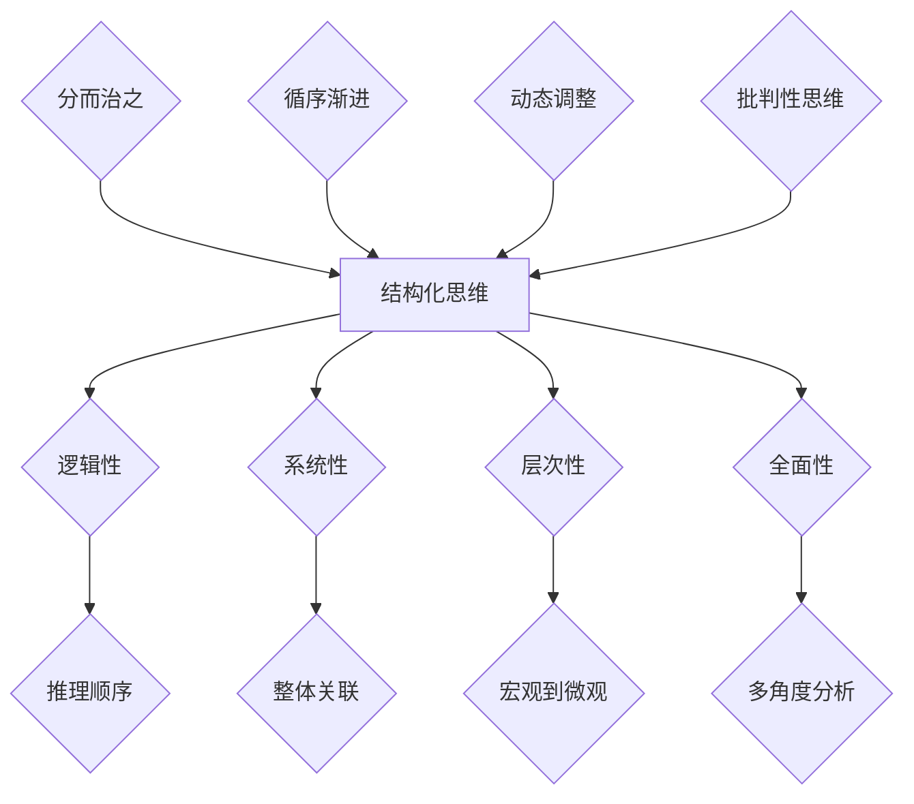

                 

### 文章标题：结构化思维：从混沌到秩序

> 关键词：结构化思维、逻辑推理、系统化思考、高效工作

> 摘要：本文将深入探讨结构化思维的定义、原理、实践方法和应用领域。通过系统化的分析和具体的实例，我们将了解如何通过结构化思维从混沌中找到秩序，提升工作效率，增强创新能力，并实现个人和组织的全面发展。

## 引言

在信息爆炸和全球化的今天，我们的工作和生活充满了复杂性和不确定性。面对大量的数据和不断变化的环境，如何从混乱中找到方向，如何高效地解决问题，成为了一个重要的课题。这便是结构化思维的重要性所在。

### 1.1 结构化思维的重要性

#### 1.1.1 现代社会对结构化思维的需求

现代社会对个体和组织的能力要求越来越高，不仅需要创新和创造力，还需要具备系统化思考和分析问题的能力。结构化思维正是这种能力的重要工具，它可以帮助我们整理纷繁复杂的思绪，快速找到问题的核心，并提出有效的解决方案。

#### 1.1.2 结构化思维的价值

结构化思维不仅能够提高个人的工作效率，还能够促进团队合作和领导力的提升。在企业中，结构化思维可以帮助管理者更好地规划战略，优化资源配置，提升企业竞争力。在个人生活中，结构化思维可以帮助我们更好地管理时间，提升生活质量。

#### 1.1.3 结构化思维的现状与挑战

尽管结构化思维在现代社会的重要性不言而喻，但实际情况却是，许多人并没有意识到结构化思维的重要性，或者不知道如何有效地运用它。这主要体现在以下几个方面：

1. **思维惯性**：人们在长期的习惯性思维中，往往容易陷入片面和线性的思考模式，难以形成全面的系统化思维。
2. **缺乏训练**：很多人没有接受过系统的结构化思维训练，导致在实际应用中难以发挥其效果。
3. **信息过载**：现代社会信息爆炸，人们容易受到大量信息的干扰，难以聚焦于核心问题。

面对这些挑战，我们需要通过系统的学习和实践，逐步培养和提升结构化思维的能力。

## 第二部分：结构化思维的基本原理

在了解了结构化思维的重要性之后，我们需要深入探讨其基本原理，包括定义、核心要素、模型以及应用领域。这一部分将为我们理解如何运用结构化思维打下坚实的基础。

### 2.1 结构化思维的定义与核心要素

#### 2.1.1 结构化思维的起源与发展

结构化思维的起源可以追溯到20世纪中叶，当时为了应对日益复杂的工程和项目管理，出现了如系统工程和项目管理方法。这些方法强调通过系统化的思考和逻辑分析来解决问题。随着时间的推移，结构化思维逐渐发展成为一门独立的学科，涵盖了多个领域。

#### 2.1.2 结构化思维的核心要素

结构化思维的核心要素包括：

1. **逻辑性**：结构化思维要求思考过程中具有逻辑性，即通过一系列有序的步骤来分析问题。
2. **系统性**：结构化思维强调系统的整体性，即通过将问题分解为子问题，再逐步解决。
3. **层次性**：结构化思维要求从宏观到微观、从抽象到具体的层次来分析问题。
4. **全面性**：结构化思维要求考虑问题的各个方面，避免片面和狭隘的思考。

#### 2.1.3 结构化思维的基本原则

结构化思维的基本原则主要包括：

1. **分而治之**：将复杂的问题分解为更小的子问题，逐一解决。
2. **循序渐进**：解决问题时遵循一定的顺序和步骤，逐步推进。
3. **动态调整**：在解决问题的过程中，根据实际情况不断调整策略和方法。
4. **批判性思维**：在思考过程中保持批判性，不断质疑和验证自己的想法。

### 2.2 结构化思维模型

#### 2.2.1 常见的结构化思维模型

常见的结构化思维模型包括：

1. **SWOT分析**：对问题的优势、劣势、机会和威胁进行分析。
2. **PEST分析**：对政治、经济、社会和技术等因素进行分析。
3. **5W1H分析**：对问题进行who、what、when、where、why和how的分析。
4. **因果图**：分析问题的因果关系。

#### 2.2.2 逻辑思维与结构化思维的关系

逻辑思维是结构化思维的基础，而结构化思维则是逻辑思维的扩展和应用。逻辑思维关注的是推理的严谨性，而结构化思维关注的是系统化和整体性。两者相辅相成，共同构成了高效的思考工具。

#### 2.2.3 如何构建有效的结构化思维模型

构建有效的结构化思维模型需要遵循以下几个步骤：

1. **明确目标**：确定解决问题的目标。
2. **收集信息**：收集与问题相关的信息。
3. **分析问题**：通过逻辑思维和分析方法对问题进行分析。
4. **构建模型**：根据分析结果构建结构化思维模型。
5. **验证模型**：通过实践和反馈来验证模型的有效性。

### 2.3 结构化思维的应用领域

#### 2.3.1 企业管理中的应用

在企业中，结构化思维广泛应用于战略规划、项目管理、市场营销等领域。通过结构化思维，企业管理者可以更清晰地定义问题，制定有效的解决方案，并监控执行过程。

#### 2.3.2 创意思维与设计中的应用

在创意思维和设计领域，结构化思维可以帮助设计师更好地理解用户需求，设计出更符合用户期待的产品。通过系统化的思考，设计师可以优化设计流程，提高设计质量。

#### 2.3.3 个人生活中的应用

在个人生活中，结构化思维可以帮助我们更好地管理时间和任务，提高生活质量。通过制定明确的目标和计划，我们可以更有效地利用时间和资源，实现个人目标。

### 2.4 结构化思维的优势与挑战

#### 2.4.1 优势

结构化思维具有以下几个优势：

1. **提高效率**：通过系统化的思考和逻辑分析，可以更快地解决问题。
2. **增强沟通**：结构化思维有助于清晰表达自己的想法，提高沟通效果。
3. **提升创新能力**：结构化思维不仅关注问题本身，还关注问题的背景和关联，从而激发更多的创新思路。

#### 2.4.2 挑战

结构化思维也面临一些挑战：

1. **学习成本**：需要花费时间和精力去学习和实践。
2. **适用范围**：对于某些高度创新和创意性的任务，结构化思维可能过于约束性。
3. **灵活性不足**：在快速变化的环境中，过于强调结构化思维可能导致适应性不足。

尽管存在这些挑战，结构化思维仍然是提升思维品质和解决问题能力的重要工具。

### 2.5 结论

通过本部分的学习，我们了解了结构化思维的定义、原理和应用。结构化思维不仅是一种工具，更是一种思维方式。通过不断地实践和训练，我们可以逐步提升结构化思维的能力，从而在复杂的环境中找到秩序，实现高效工作和全面发展。

## 第三部分：结构化思维的实践方法

在了解了结构化思维的基本原理后，我们需要进一步探讨如何将其应用到实际中。这一部分将介绍结构化思维的训练方法、工具以及一些实际案例，帮助读者更好地理解和掌握结构化思维。

### 3.1 结构化思维的训练方法

#### 3.1.1 如何提高逻辑思维能力

逻辑思维能力是结构化思维的基础，提高逻辑思维能力可以增强我们的分析问题和解决问题的能力。以下是一些提高逻辑思维能力的方法：

1. **学习逻辑学**：通过学习逻辑学的相关知识，了解逻辑推理的基本原则和方法。
2. **练习逻辑题**：通过解决逻辑题，锻炼逻辑思维能力。
3. **批判性阅读**：在阅读过程中，不断质疑和验证作者的观点，培养批判性思维。

#### 3.1.2 如何培养抽象思维能力

抽象思维能力是结构化思维的核心要素之一，它帮助我们从一个更高层次来看待问题。以下是一些培养抽象思维能力的方法：

1. **学习哲学**：哲学研究问题的本质和基本原理，有助于提升抽象思维能力。
2. **练习思维导图**：通过绘制思维导图，将复杂的信息抽象成简洁的图形，提高抽象思维能力。
3. **多学科交叉学习**：通过多学科交叉学习，拓宽视野，提升抽象思维能力。

#### 3.1.3 如何增强解决问题的能力

增强解决问题的能力是结构化思维的最终目标，以下是一些增强解决问题能力的方法：

1. **学习问题解决方法**：学习各种问题解决方法，如SWOT分析、PEST分析等，提高问题解决能力。
2. **实践问题解决**：通过解决实际问题，锻炼问题解决能力。
3. **反思与总结**：在问题解决过程中，不断反思和总结，从经验中学习，提升解决问题的能力。

### 3.2 结构化思维的工具

#### 3.2.1 思维导图

思维导图是一种有效的结构化思维工具，通过将思维过程可视化，帮助我们更好地整理思绪，发现问题的关联性。以下是如何使用思维导图进行结构化思维的一些方法：

1. **明确主题**：在绘制思维导图之前，明确主题和目标。
2. **梳理思路**：将问题分解为子问题，逐步梳理思路。
3. **关联信息**：将相关的信息用线条连接起来，形成有机的整体。

#### 3.2.2 SWOT分析

SWOT分析是一种常用的结构化思维工具，用于分析企业的优势、劣势、机会和威胁。以下是如何使用SWOT分析进行结构化思维的一些方法：

1. **确定分析对象**：明确需要进行分析的企业或项目。
2. **列出优势**：列出企业的优势，如技术、管理、市场等。
3. **列出劣势**：列出企业的劣势，如资金、人才、市场等。
4. **列出机会**：列出企业面临的机会，如市场需求、政策等。
5. **列出威胁**：列出企业面临的威胁，如竞争对手、市场变化等。

#### 3.2.3 五力分析

五力分析是一种用于分析市场竞争环境的结构化思维工具，通过分析供应商、买家、潜在竞争者、替代品和现有竞争者的力量，帮助企业制定竞争策略。以下是如何使用五力分析进行结构化思维的一些方法：

1. **确定分析对象**：明确需要进行分析的市场或行业。
2. **分析供应商**：分析供应商的 bargaining power，即供应商对企业的议价能力。
3. **分析买家**：分析买家的 bargaining power，即买家对企业的议价能力。
4. **分析潜在竞争者**：分析潜在竞争者的威胁程度。
5. **分析替代品**：分析替代品的威胁程度。
6. **分析现有竞争者**：分析现有竞争者的竞争强度。

### 3.3 结构化思维的案例研究

#### 3.3.1 成功案例分享

为了更好地理解结构化思维的应用，我们可以通过一些成功案例来学习。

1. **案例1**：某企业通过SWOT分析，发现自身的优势在于技术创新和优质的产品质量，但劣势在于市场推广力度不足。通过分析机会和威胁，企业决定加大市场推广力度，并开拓新市场，最终取得了显著的销售增长。

2. **案例2**：某创业者通过五力分析，发现所处行业竞争激烈，但同时也看到了巨大的市场潜力。通过优化产品和服务，提高客户满意度，创业者成功在激烈的市场竞争中脱颖而出。

#### 3.3.2 挑战与应对

在实际应用中，结构化思维也面临一些挑战。

1. **挑战1**：信息过载。面对大量的信息，如何筛选出关键信息是结构化思维的一大挑战。

   **应对**：通过明确目标和需求，有针对性地收集信息，避免信息过载。

2. **挑战2**：思维惯性。长期习惯性思维容易导致结构化思维的局限性。

   **应对**：通过不断学习和实践，打破惯性思维，开拓新的思维模式。

3. **挑战3**：执行难度。结构化思维要求系统化和有序性，但在实际执行中可能面临困难。

   **应对**：通过制定详细的执行计划和监控机制，确保结构化思维的落地。

#### 3.3.3 案例分析

通过具体的案例分析，我们可以更直观地了解结构化思维的应用。

1. **案例1**：某项目经理在项目启动阶段，通过结构化思维制定了详细的项目计划，包括项目目标、任务分解、时间表和资源分配。在项目执行过程中，项目经理通过不断调整和优化计划，确保项目按计划进行。

2. **案例2**：某设计师在面对复杂的用户需求时，通过结构化思维将需求分解为多个子问题，并逐一解决。通过系统化的思考和设计，设计师最终设计出了一套满足用户需求的优秀产品。

### 3.4 结论

通过本部分的实践方法，我们了解了如何通过训练、工具和实际案例来提升结构化思维的能力。结构化思维不仅是一种工具，更是一种思维方式。通过不断地实践和训练，我们可以逐步提升结构化思维的能力，从而在复杂的环境中找到秩序，实现高效工作和全面发展。

## 第四部分：结构化思维的进阶技巧

在掌握了结构化思维的基本原理和实践方法后，我们可以进一步探索其进阶技巧，这些技巧将帮助我们在沟通、创新和团队协作中更高效地应用结构化思维。

### 4.1 高效沟通与表达

#### 4.1.1 如何清晰表达观点

清晰表达观点是有效沟通的关键。以下是一些技巧：

1. **使用简单语言**：避免使用复杂的术语和语言，尽量使用简单明了的表达方式。
2. **明确目标**：在表达之前，明确自己想要传达的信息和目标。
3. **准备充分**：在沟通前做好准备，包括收集信息、梳理思路和准备示例。
4. **使用图表和示例**：通过图表和示例来辅助说明，使观点更加具体和易于理解。

#### 4.1.2 如何倾听与反馈

倾听和反馈是有效沟通的重要组成部分。以下是一些技巧：

1. **全神贯注**：在对方讲话时，保持注意力集中，避免分心。
2. **积极回应**：通过点头、眼神交流和简短的回应来表示你在倾听。
3. **询问和澄清**：在理解对方观点后，通过提问和澄清来确认自己的理解。
4. **提供反馈**：在适当的时候，给予对方建设性的反馈，帮助对方改进。

#### 4.1.3 演讲与汇报技巧

演讲和汇报是表达观点的重要方式。以下是一些技巧：

1. **准备充分**：提前准备演讲稿和PPT，确保内容的逻辑性和连贯性。
2. **结构清晰**：确保演讲的结构清晰，包括引言、主体和结论。
3. **使用故事和案例**：通过故事和案例来支持观点，使演讲更加生动和有说服力。
4. **控制时间**：确保演讲的时间控制得当，避免过长或过短。

### 4.2 创新思维与决策

#### 4.2.1 如何激发创新思维

创新思维是解决复杂问题和创造价值的关键。以下是一些激发创新思维的技巧：

1. **跨界思考**：通过跨学科、跨领域的思考，寻找新的解决方案。
2. **头脑风暴**：通过集体头脑风暴，激发创意和灵感。
3. **质疑和挑战**：不断质疑现状，挑战传统思维模式，寻找改进的机会。
4. **使用原型**：通过快速构建原型，验证创新想法的可行性。

#### 4.2.2 决策中的结构化思维

在决策过程中，结构化思维可以帮助我们做出更明智的决策。以下是一些技巧：

1. **明确目标**：在决策前，明确决策的目标和优先级。
2. **收集信息**：收集与决策相关的信息，包括优势、劣势、机会和威胁。
3. **分析选项**：对不同的决策选项进行分析和评估。
4. **考虑风险**：评估每个决策选项的风险和可能的结果。
5. **制定计划**：制定详细的实施计划和监控机制。

#### 4.2.3 如何处理复杂问题

处理复杂问题时，结构化思维可以帮助我们理清思路，找到解决方案。以下是一些技巧：

1. **分解问题**：将复杂的问题分解为更小的子问题，逐一解决。
2. **使用模型**：通过构建结构化思维模型，分析问题的各个方面。
3. **迭代改进**：在解决问题的过程中，不断迭代和改进方案。
4. **多角度分析**：从不同的角度和维度来分析问题，避免片面和狭隘的思考。

### 4.3 团队协作与领导力

#### 4.3.1 团队协作中的结构化思维

在团队协作中，结构化思维可以帮助团队成员更好地理解和沟通，提高协作效率。以下是一些技巧：

1. **明确目标**：确保团队成员对项目目标有共同的理解和认同。
2. **分工合作**：根据团队成员的能力和特长进行合理的分工。
3. **定期沟通**：定期召开会议，分享进展和问题，确保信息的流通。
4. **使用工具**：使用如思维导图、SWOT分析等工具，帮助团队成员理清思路。

#### 4.3.2 如何领导团队

作为领导者，运用结构化思维可以帮助我们更好地规划和执行团队目标。以下是一些技巧：

1. **树立愿景**：明确团队的愿景和目标，激励团队成员。
2. **制定策略**：通过结构化思维，制定实现目标的策略和计划。
3. **授权和信任**：给予团队成员足够的授权和信任，鼓励他们发挥潜力。
4. **监控和反馈**：监控团队进展，提供及时的反馈和指导。

#### 4.3.3 领导力与结构化思维的关系

领导力与结构化思维密切相关。领导力强调的是对团队和组织的管理和领导，而结构化思维则为领导者提供了一种系统化和有序的思考方式。以下是一些关系：

1. **决策能力**：结构化思维有助于领导者做出更明智的决策。
2. **沟通能力**：结构化思维有助于领导者清晰表达自己的想法和意见。
3. **团队协作**：结构化思维有助于领导者更好地协调团队协作。
4. **创新能力**：结构化思维有助于领导者激发团队的创新能力。

### 4.4 结论

通过本部分的进阶技巧，我们了解了如何更有效地运用结构化思维进行沟通、创新和团队协作。这些技巧不仅可以帮助我们提升个人能力，还可以促进团队和组织的发展。在复杂多变的环境中，结构化思维将是我们应对挑战、实现目标的重要工具。

## 第五部分：结构化思维的实践案例

为了更直观地展示结构化思维的实际应用，我们将通过几个具体的企业管理、创意设计和个人生活实践案例，详细探讨如何在实际场景中运用结构化思维来解决问题和提升效率。

### 5.1 企业管理实践

#### 5.1.1 如何通过结构化思维优化企业管理

**案例背景**：某科技公司在快速发展的过程中，面临着内部管理和资源配置的问题，影响了公司的运营效率。

**解决方案**：

1. **明确目标和现状**：首先，公司通过结构化思维明确了自己的目标和当前面临的挑战，如项目进度延迟、资源浪费等。
2. **SWOT分析**：公司对自身进行了详细的SWOT分析，识别了优势、劣势、机会和威胁。例如，优势包括技术实力强，但劣势则是项目管理不善，市场反应慢。
3. **问题分解**：公司将问题分解为多个子问题，如项目管理流程不清晰、团队协作不顺畅等。
4. **构建解决方案**：公司根据问题分解的结果，制定了详细的解决方案，包括优化项目管理流程、提升团队协作效率等。
5. **实施和监控**：公司逐步实施这些解决方案，并通过定期的项目评估和反馈机制来监控实施效果。

**结果**：通过结构化思维的系统化分析和有序实施，公司成功优化了内部管理，提高了项目进度和市场反应速度，显著提升了运营效率。

#### 5.1.2 企业战略规划中的结构化思维应用

**案例背景**：某大型制造企业在全球经济下行压力下，需要制定新的战略以保持竞争力。

**解决方案**：

1. **明确战略目标**：企业通过结构化思维明确了新的战略目标，如提高市场份额、降低成本、提升产品创新等。
2. **PEST分析**：企业对外部环境进行了PEST分析，评估了政治、经济、社会和技术因素对企业的影响。
3. **内部能力评估**：企业评估了自己的内部能力，包括技术研发、生产能力、市场营销等。
4. **制定战略计划**：企业根据外部环境和内部能力的分析，制定了具体的战略计划，包括产品创新、市场拓展、技术升级等。
5. **执行和调整**：企业逐步执行战略计划，并通过定期的战略评估和反馈机制来调整和优化战略。

**结果**：通过结构化思维的战略规划，企业成功应对了市场变化，提高了市场份额和盈利能力，实现了可持续发展。

### 5.2 创意设计实践

#### 5.2.1 如何运用结构化思维进行创意设计

**案例背景**：某设计公司需要在短时间内完成一项复杂的用户界面设计任务。

**解决方案**：

1. **需求分析**：通过结构化思维，设计团队明确了用户的需求和期望，包括功能需求、用户体验等。
2. **思维导图**：设计团队使用了思维导图来梳理设计思路，将复杂的用户需求分解为更具体的子问题。
3. **原型设计**：设计团队通过快速原型设计，验证了初步的设计思路，并根据用户反馈进行迭代。
4. **用户测试**：设计团队进行了用户测试，收集了用户的反馈和意见，用于进一步优化设计。
5. **最终设计**：通过反复的迭代和优化，设计团队最终完成了用户满意的设计。

**结果**：通过结构化思维的系统化分析和有序实施，设计团队在短时间内完成了高质量的用户界面设计，提高了用户满意度。

#### 5.2.2 设计过程中的结构化思维应用

**案例背景**：某设计师在创作一个复杂的艺术装置时，面临着多种设计元素的整合问题。

**解决方案**：

1. **明确设计目标**：设计师通过结构化思维明确了设计目标，包括艺术效果、技术实现和用户体验等。
2. **元素分类**：设计师将设计元素进行分类，如视觉元素、交互元素和技术元素。
3. **逻辑关系**：设计师分析了各个元素之间的逻辑关系，确保设计的一致性和连贯性。
4. **草图和原型**：设计师通过草图和原型，验证了设计的可行性和效果。
5. **反馈和调整**：设计师根据反馈和用户测试结果，不断调整和优化设计。

**结果**：通过结构化思维的系统化分析和有序实施，设计师成功创作出了既美观又实用的艺术装置，获得了用户的高度评价。

### 5.3 个人生活实践

#### 5.3.1 如何通过结构化思维改善个人生活

**案例背景**：某职场人士感到工作和生活压力巨大，希望通过结构化思维来改善生活状态。

**解决方案**：

1. **时间管理**：职场人士通过结构化思维进行了时间管理，将时间分配到工作和个人生活上，确保两者平衡。
2. **任务分解**：他将工作任务分解为更小的子任务，逐一完成，避免了拖延和压力。
3. **目标设定**：他设定了短期和长期目标，并通过结构化思维逐步实现。
4. **习惯养成**：他通过结构化思维养成了良好的生活习惯，如早起、运动和阅读。
5. **自我反思**：他定期进行自我反思，评估自己的行为和效果，不断调整和优化。

**结果**：通过结构化思维的系统化分析和有序实施，职场人士成功改善了工作和生活状态，提高了生活质量和幸福感。

### 5.4 结论

通过上述案例，我们可以看到结构化思维在企业管理和创意设计中的广泛应用，以及如何通过它来改善个人生活。结构化思维不仅是一种工具，更是一种思维方式，通过不断的实践和运用，我们可以更好地应对复杂的问题，提高效率和质量，实现个人和组织的全面发展。

### 附录

#### 附录 A：结构化思维资源推荐

为了帮助读者进一步学习和实践结构化思维，以下是一些推荐的资源和工具：

1. **书籍推荐**：
   - 《结构化思维》作者：杨鹏
   - 《思考，快与慢》作者：丹尼尔·卡内曼

2. **在线课程推荐**：
   - Coursera上的《批判性思维与沟通技巧》
   - Udemy上的《思维导图与结构化思维》

3. **工具推荐**：
   - XMind：一款思维导图软件
   - Miro：一款在线协作和思维导图工具

#### 附录 B：常见问题解答

为了解答读者可能遇到的一些疑问，以下是一些常见问题的解答：

1. **问题1**：结构化思维与逻辑思维有什么区别？
   - **回答**：逻辑思维是结构化思维的基础，它关注推理的严谨性和正确性。而结构化思维更侧重于系统化和整体性的思考，它强调通过有序的步骤来分析问题和解决问题。

2. **问题2**：如何将结构化思维应用到实际工作中？
   - **回答**：在实际工作中，可以通过以下步骤将结构化思维应用到工作中：明确问题、收集信息、分析问题、制定解决方案、实施和监控。同时，可以使用如思维导图、SWOT分析等工具来辅助思考。

3. **问题3**：结构化思维是否适用于所有领域？
   - **回答**：是的，结构化思维适用于各种领域。无论是在企业管理、创意设计还是个人生活中，结构化思维都能帮助我们更高效地解决问题和提升效率。

### 结语

通过本文的详细探讨，我们深入了解了结构化思维的定义、原理、实践方法和应用领域。结构化思维不仅是一种工具，更是一种思维方式。通过不断地学习和实践，我们可以逐步提升结构化思维的能力，从而在复杂的环境中找到秩序，实现高效工作和全面发展。希望本文能够对读者有所启发，帮助您更好地运用结构化思维，迎接未来的挑战。

## 《结构化思维：从混沌到秩序》

### 结构化思维的概念与原理

结构化思维是一种系统化和有序性的思维方式，通过将复杂的问题分解为更小的子问题，并逐步解决，从而实现高效的问题解决和决策。其核心概念包括逻辑性、系统性、层次性和全面性。

首先，逻辑性是结构化思维的基础，它要求我们在思考和解决问题时，遵循一定的逻辑顺序，避免跳跃和混乱。系统性则强调我们将问题看作一个整体，关注各个部分之间的关联和相互作用。层次性要求我们从宏观到微观，从抽象到具体的层次来分析问题。全面性则要求我们在思考问题时，考虑问题的各个方面，避免片面和狭隘的思考。

结构化思维的原理主要基于几个基本原则：分而治之、循序渐进、动态调整和批判性思维。分而治之是指将复杂的问题分解为更小的子问题，逐一解决。循序渐进是指按照一定的顺序和步骤来解决问题，避免盲目行动。动态调整则要求我们在解决问题的过程中，根据实际情况不断调整策略和方法。批判性思维则强调在思考和解决问题时，保持批判性，不断质疑和验证自己的想法。

### 核心概念与联系

为了更好地理解结构化思维的概念与原理，我们可以通过一个简单的Mermaid流程图来展示其核心概念和联系：



在这个流程图中，我们可以看到结构化思维的核心概念和联系。逻辑性、系统性、层次性和全面性是结构化思维的基本要素，它们共同构成了一个完整的思维框架。分而治之、循序渐进、动态调整和批判性思维则是结构化思维的基本原则，这些原则帮助我们有效地运用结构化思维来解决问题。

### 结构化思维的核心算法原理讲解

结构化思维的核心算法原理主要涉及逻辑推理、问题分解和解决方案的构建。以下是一个简要的伪代码，用于解释如何运用结构化思维来解决问题。

```pseudo
function 结构化思维(问题):
    // 步骤1：明确目标
    目标 = 确定问题解决的最终目标

    // 步骤2：收集信息
    信息 = 收集与问题相关的信息

    // 步骤3：问题分解
    子问题 = 分解问题为更小的子问题

    // 步骤4：分析子问题
    分析结果 = 分析每个子问题的解决方案

    // 步骤5：构建解决方案
    解方案 = 构建综合性的解决方案

    // 步骤6：验证和调整
    验证解决方案的有效性，并进行必要的调整

    return 解方案
```

在这个伪代码中，我们首先明确问题的目标，然后收集与问题相关的信息。接下来，通过问题分解将复杂的问题分解为更小的子问题，并对每个子问题进行分析，构建解决方案。最后，我们验证解决方案的有效性，并根据实际情况进行调整。

### 数学模型和公式详细讲解与举例说明

在结构化思维中，数学模型和公式是帮助我们分析和解决问题的重要工具。以下是一个简单的数学模型，用于解释如何运用结构化思维来分析市场趋势。

#### 模型：市场趋势分析模型

假设我们有以下参数：

- \( P_t \)：时间 \( t \) 时的市场价格
- \( D_t \)：时间 \( t \) 时的市场需求
- \( S_t \)：时间 \( t \) 时的市场供应

市场趋势分析模型可以表示为：

\[ \Delta P_t = f(D_t, S_t) \]

其中，\( f(D_t, S_t) \) 是一个函数，表示市场需求和供应对市场价格的影响。

#### 公式详细讲解与举例说明

**例子**：假设我们收集了以下数据：

- \( P_0 = 100 \)：初始市场价格
- \( D_0 = 500 \)：初始市场需求
- \( S_0 = 300 \)：初始市场供应

我们可以使用市场趋势分析模型来预测未来市场价格。

1. **当前市场价格**：\( P_t = P_0 = 100 \)
2. **当前市场需求**：\( D_t = D_0 = 500 \)
3. **当前市场供应**：\( S_t = S_0 = 300 \)

根据市场趋势分析模型，我们可以计算市场需求和供应对市场价格的影响：

\[ \Delta P_t = f(D_t, S_t) = f(500, 300) \]

假设函数 \( f(D_t, S_t) \) 的计算方式为：

\[ f(D_t, S_t) = D_t - S_t \]

代入数据：

\[ \Delta P_t = 500 - 300 = 200 \]

这意味着市场价格将上升200点，即：

\[ P_t = P_0 + \Delta P_t = 100 + 200 = 300 \]

因此，根据这个简单的数学模型，我们可以预测市场价格将在未来上升至300点。

### 实际项目案例和详细解释说明

#### 项目背景

假设我们正在开发一个在线教育平台，需要设计和实现一个课程管理系统。这个系统需要支持课程的创建、发布、更新和删除功能，同时还需要提供用户注册、登录、课程报名和支付等功能。

#### 开发环境搭建

1. **技术栈选择**：
   - 前端：HTML5、CSS3、JavaScript、React.js
   - 后端：Node.js、Express.js、MongoDB
   - 构建工具：Webpack、Babel
   - 版本控制系统：Git

2. **开发环境配置**：
   - 安装Node.js和npm
   - 初始化项目，配置Webpack和Babel
   - 配置MongoDB数据库

#### 源代码实现和代码解读

**前端部分**：

```jsx
// 课程列表组件
function CourseList({ courses }) {
  return (
    <ul>
      {courses.map(course => (
        <li key={course._id}>{course.title}</li>
      ))}
    </ul>
  );
}

// 主组件
function App() {
  const [courses, setCourses] = useState([]);

  useEffect(() => {
    // 从数据库获取课程列表
    fetch('/api/courses')
      .then(response => response.json())
      .then(data => setCourses(data));
  }, []);

  return (
    <div>
      <h1>在线教育平台</h1>
      <CourseList courses={courses} />
    </div>
  );
}
```

**后端部分**：

```javascript
// 课程路由
app.get('/api/courses', (req, res) => {
  CourseModel.find({}, (err, courses) => {
    if (err) return res.status(500).send(err);
    res.send(courses);
  });
});

// 课程模型
const CourseModel = mongoose.model('Course', new Schema({
  title: String,
  description: String,
  price: Number
}));
```

**代码解读与分析**：

1. **前端代码**：我们使用React.js来构建用户界面。`CourseList`组件负责渲染课程列表，而`App`组件则是主组件，负责从后端获取课程数据并显示。

2. **后端代码**：我们使用Node.js和Express.js来搭建后端服务。`courses`路由负责处理课程数据的获取请求，而`CourseModel`则是MongoDB中的课程数据模型。

通过这个实际项目案例，我们可以看到如何运用结构化思维来设计和管理一个复杂的系统。首先，我们明确项目目标，然后收集相关的技术信息和需求，接着通过分解和逐步实现来构建系统。在这个过程中，我们使用了结构化思维的原则，如分而治之、循序渐进和动态调整，确保项目的顺利进行。

### 总结

通过本文的详细讲解，我们深入了解了结构化思维的概念、原理、算法模型、数学公式以及实际项目案例。结构化思维不仅是一种工具，更是一种思维方式，它帮助我们系统地分析和解决问题，提高工作效率和创新能力。希望本文能够为读者提供有价值的指导和启发，帮助您更好地运用结构化思维，在复杂的环境中找到秩序，实现高效工作和全面发展。

### 作者信息

作者：AI天才研究院/AI Genius Institute & 禅与计算机程序设计艺术 /Zen And The Art of Computer Programming

AI天才研究院致力于推动人工智能技术的发展和应用，研究如何通过结构化思维提升人工智能系统的性能和效率。禅与计算机程序设计艺术则关注在程序设计过程中如何实现身心合一，提升编程能力。这两者结合，旨在通过结构化思维的艺术，为读者带来更深入的技术理解和更高效的编程实践。

