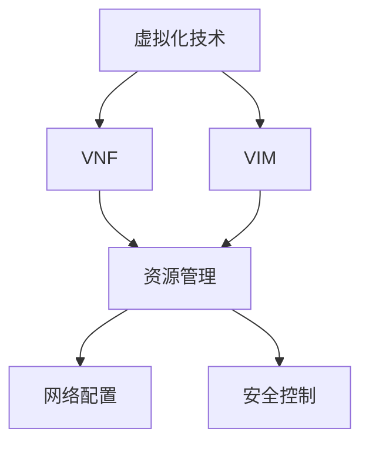
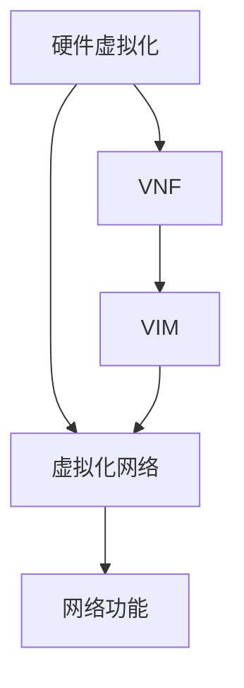
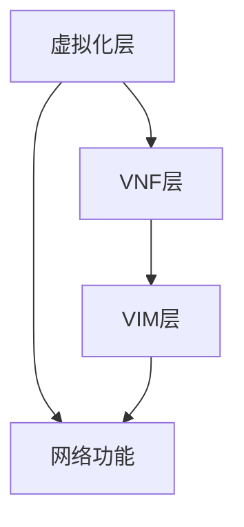
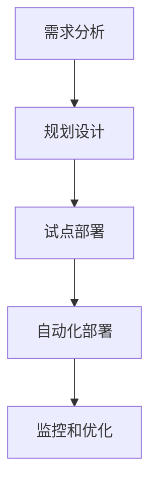

                 

# 文章标题
《网络功能虚拟化（NFV）：电信云的基石》

# 关键词
网络功能虚拟化、NFV、电信云、虚拟化技术、虚拟网络功能、VIM、VNF、SDN、边缘计算

# 摘要
本文深入探讨了网络功能虚拟化（NFV）的概念、技术原理、应用场景以及部署策略，详细分析了NFV在电信云中的重要性。文章通过逐步分析推理，系统阐述了NFV的关键组成部分，包括虚拟化技术、VNF设计和实现、NFV网络架构等，并探讨了NFV与其他技术的融合，如SDN和边缘计算。最后，通过实际案例展示了NFV的应用效果，并提出了NFV部署与运维的最佳实践，为电信云的发展提供了有益的参考。

## 目录

### 《网络功能虚拟化（NFV）：电信云的基石》

### 关键词

- 网络功能虚拟化
- NFV
- 电信云
- 虚拟化技术
- 虚拟网络功能
- VIM
- VNF
- SDN
- 边缘计算

### 摘要

本文将详细探讨网络功能虚拟化（NFV）在电信云中的基石作用，包括其基本概念、发展历史、技术原理、应用场景、网络架构、部署策略、运维管理、安全与隐私、案例分析以及与其他技术的融合。通过逐步分析推理，我们旨在为读者提供一个全面而深入的NFV理解，为电信云的持续发展提供坚实的理论基础和实践指导。

## 第一部分：NFV概述

### 第1章：网络功能虚拟化（NFV）的基本概念

### 1.1 什么是NFV？

**NFV的定义**

网络功能虚拟化（Network Function Virtualization，简称NFV）是一种将网络功能从专用硬件设备转移到通用硬件平台（如服务器、存储设备等）上的技术。通过虚拟化技术，NFV实现了网络功能（如路由、防火墙、负载均衡等）的软件化，使其能够在通用硬件上运行和管理。

**NFV与传统网络架构的区别**

- **硬件依赖**：传统网络架构依赖于特定的硬件设备，如路由器、交换机和防火墙等。而NFV利用通用硬件平台，减少了硬件设备的依赖。
- **部署与运维**：传统网络架构的部署和运维往往需要长时间的物理配置和调试。NFV通过虚拟化技术，实现了快速部署和灵活的运维。
- **成本**：NFV可以降低硬件成本，提高资源利用率。

### 1.2 NFV的关键组成部分

**虚拟化技术**

虚拟化技术是NFV实现的核心。它通过在物理硬件上创建虚拟资源，使网络功能可以在虚拟环境中运行。

- **硬件虚拟化**：通过虚拟机监控器（VMware、KVM等）实现硬件资源的虚拟化。
- **操作系统虚拟化**：在操作系统层创建虚拟环境，使多个操作系统可以在同一硬件上运行。

**VNF（虚拟网络功能）**

VNF是指实现网络功能的软件组件，它可以运行在通用硬件平台上。VNF具有模块化、可重用性和标准化等特点。

- **VNF的定义**：VNF是将传统网络功能（如防火墙、路由器等）虚拟化为软件组件的技术。
- **VNF的特点**：模块化、可重用性、标准化。

**VIM（虚拟化基础设施管理）**

VIM是负责管理和控制虚拟化基础设施的组件，包括资源管理、网络配置、安全控制等功能。

- **VIM的功能**：资源管理、网络配置、安全控制。
- **VIM的作用**：确保虚拟化基础设施的高效运行。

### 1.3 NFV的优势

**成本降低**

NFV通过使用通用硬件平台和虚拟化技术，降低了硬件成本，提高了资源利用率。

**灵活性和可扩展性**

NFV可以实现网络功能的灵活部署和扩展，根据业务需求快速调整。

**快速部署**

NFV通过虚拟化技术，实现了网络功能的快速部署，降低了部署周期。

### 1.4 NFV的挑战

**硬件兼容性**

NFV要求通用硬件平台与网络功能模块兼容，这可能带来一定的挑战。

**网络性能**

在虚拟化环境中，网络性能可能会受到一定影响，需要优化虚拟化技术和网络架构。

**安全性**

NFV引入了新的安全挑战，如虚拟机隔离、数据保护等，需要加强安全措施。

## 第二部分：NFV技术原理

### 第2章：虚拟化技术

### 2.1 虚拟化技术概述

**虚拟化的基本原理**

虚拟化技术通过在物理硬件上创建虚拟资源，使得多个虚拟环境可以共享同一物理资源。

- **硬件虚拟化**：通过虚拟机监控器实现硬件资源的虚拟化。
- **操作系统虚拟化**：在操作系统层创建虚拟环境。

**虚拟化在NFV中的应用**

虚拟化技术在NFV中发挥着关键作用，它使得网络功能可以在通用硬件平台上灵活部署和管理。

- **虚拟机的创建与管理**：通过虚拟机监控器创建和管理虚拟机。
- **虚拟网络接口**：实现虚拟机之间的数据交换。

### 2.2 虚拟化技术原理详解

**硬件虚拟化原理**

硬件虚拟化通过虚拟机监控器（VMware、KVM等）实现硬件资源的虚拟化。

- **虚拟化层的功能**：硬件资源分配和管理。
- **虚拟机的创建过程**：硬件资源分配、操作系统安装、虚拟网络配置等。

**操作系统虚拟化原理**

操作系统虚拟化通过在操作系统层创建虚拟环境，使得多个操作系统可以共享同一物理资源。

- **虚拟环境的创建**：通过虚拟化技术创建虚拟层，实现操作系统隔离。
- **虚拟机的运行**：虚拟机在虚拟环境中运行，虚拟环境提供与物理硬件相同的接口。

### 2.3 虚拟化技术的应用案例

**云化路由器**

通过虚拟化技术，将传统路由器功能虚拟化为VNF，实现路由功能的云化部署。

- **虚拟化层部署**：在虚拟化硬件上部署虚拟化层。
- **VNF层部署**：在虚拟化层上部署路由VNF。
- **VIM层部署**：部署VIM层，实现资源管理和安全控制。

**虚拟化防火墙**

通过虚拟化技术，将传统防火墙功能虚拟化为VNF，实现防火墙功能的云化部署。

- **虚拟化层部署**：在虚拟化硬件上部署虚拟化层。
- **VNF层部署**：在虚拟化层上部署防火墙VNF。
- **VIM层部署**：部署VIM层，实现资源管理和安全控制。

## 第三部分：NFV网络架构

### 第3章：NFV网络架构

### 3.1 NFV网络架构概述

**NFV网络架构的层次结构**

NFV网络架构通常包括以下几个层次：

- **虚拟化层**：提供虚拟化硬件资源。
- **VNF层**：实现各种网络功能。
- **VIM层**：管理和控制虚拟化基础设施。

**NFV网络架构的设计考虑**

在设计NFV网络架构时，需要考虑以下几个关键因素：

- **可扩展性**：架构应该能够支持网络规模的扩展。
- **高可用性**：架构应该能够保证网络服务的持续可用性。
- **安全性**：架构应该能够提供有效的安全措施。

### 3.2 NFV网络架构的设计原则

**模块化**

模块化设计使得VNF可以独立部署和管理，提高了系统的灵活性和可维护性。

**标准化**

标准化设计使得VNF可以跨不同的网络场景和业务需求进行重用，提高了系统的兼容性和可扩展性。

**可重用性**

可重用性设计使得VNF可以在不同的网络场景和业务需求中重复使用，降低了系统的开发和部署成本。

### 3.3 NFV网络架构的实际案例

**云化核心网**

通过NFV技术，将传统核心网功能虚拟化为VNF，实现核心网的云化部署。

- **虚拟化层部署**：在虚拟化硬件上部署虚拟化层。
- **VNF层部署**：在虚拟化层上部署核心网VNF。
- **VIM层部署**：部署VIM层，实现资源管理和安全控制。

**云化接入网**

通过NFV技术，将传统接入网功能虚拟化为VNF，实现接入网的云化部署。

- **虚拟化层部署**：在虚拟化硬件上部署虚拟化层。
- **VNF层部署**：在虚拟化层上部署接入网VNF。
- **VIM层部署**：部署VIM层，实现资源管理和安全控制。

## 第四部分：NFV部署与运维

### 第4章：NFV部署策略

### 4.1 NFV部署的挑战

**硬件资源分配**

在虚拟化环境中合理分配硬件资源，确保网络功能正常运行。

**网络拓扑设计**

设计高效、可靠的NFV网络拓扑，确保网络性能和稳定性。

**部署策略选择**

选择合适的部署策略，确保网络功能快速、稳定地部署。

### 4.2 NFV部署的最佳实践

**分阶段部署**

分阶段部署是将NFV部署分为多个阶段，逐步实现网络功能的虚拟化。

- **需求分析**：分析网络功能需求，确定虚拟化目标。
- **设计方案**：设计分阶段部署方案，包括硬件资源分配、网络拓扑设计等。
- **部署实施**：按照设计方案逐步部署网络功能。

**自动化部署工具**

自动化部署工具可以简化NFV部署过程，提高部署效率。

- **基础设施定义**：使用自动化工具定义虚拟化基础设施。
- **部署脚本编写**：编写部署脚本，配置VNF和VIM。
- **部署执行**：执行部署脚本，完成网络功能的自动化部署。

**部署优化策略**

部署优化策略可以提高NFV部署的效率和稳定性。

- **负载均衡**：根据网络负载分配虚拟化资源，确保网络性能。
- **冗余设计**：设计冗余网络拓扑，提高网络的可靠性。
- **动态调整**：根据网络状态动态调整虚拟化资源，优化资源利用率。

## 第五部分：NFV运维管理

### 第5章：NFV运维管理

### 5.1 NFV运维管理的关键要素

**监控**

实时监控NFV环境，包括资源使用情况、网络性能、系统状态等。

**故障管理**

及时检测和解决NFV环境中的故障，确保网络服务的持续可用性。

**性能优化**

根据网络负载和性能指标，调整虚拟化资源和网络配置，优化网络性能。

### 5.2 NFV运维管理的工具与技术

**虚拟化监控工具**

虚拟化监控工具用于实时监控NFV环境的资源使用情况和系统状态。

- **Nagios**：开源监控工具，用于监控服务器、网络设备等。
- **Zabbix**：开源监控工具，提供全面的监控功能和报警机制。
- **Prometheus**：开源监控工具，专注于容器和微服务监控。

**故障自动恢复机制**

故障自动恢复机制用于在NFV环境中检测和自动解决故障。

- **故障检测**：监控工具检测到故障，如虚拟机崩溃、网络中断等。
- **故障分析**：根据故障类型和影响范围进行分析。
- **自动恢复**：自动执行恢复操作，如重启虚拟机、重置网络连接等。

**性能分析工具**

性能分析工具用于分析NFV环境的性能指标，识别性能瓶颈。

- **Wireshark**：网络协议分析工具，用于捕获和分析网络流量。
- **Grafana**：数据可视化工具，用于展示性能分析结果。
- **Bash**：脚本语言，用于编写性能分析脚本。

## 第六部分：NFV安全与隐私

### 第6章：NFV安全与隐私

### 6.1 NFV安全挑战

**虚拟机隔离**

确保不同虚拟机之间的隔离性，防止恶意攻击。

**数据安全性**

保护虚拟化和网络数据的安全，防止数据泄露。

**网络攻击防护**

防止网络攻击，如分布式拒绝服务攻击（DDoS）。

### 6.2 NFV安全解决方案

**访问控制**

访问控制是确保NFV环境安全的重要措施，它通过限制对虚拟化和网络资源的访问来保护系统。

- **用户认证**：通过用户认证机制，确保只有授权用户可以访问虚拟化和网络资源。
- **权限管理**：根据用户角色和权限，限制用户对资源的访问范围。

**加密技术**

加密技术是保护NFV环境中数据传输和存储安全的重要手段。

- **对称加密**：使用相同密钥进行加密和解密，如AES。
- **非对称加密**：使用不同密钥进行加密和解密，如RSA。

**安全监控**

安全监控是实时检测和响应NFV环境中安全威胁的重要手段。

- **入侵检测**：实时检测和响应恶意攻击，如DDoS攻击。
- **日志分析**：分析系统日志，识别潜在的安全威胁。

## 第七部分：NFV案例分析

### 第7章：NFV在电信云中的应用案例

### 7.1 案例一：移动网络NFV部署

#### 7.1.1 案例背景

随着移动网络的发展，运营商面临着网络规模扩展和业务多样化的挑战。通过NFV技术，可以实现移动网络的功能虚拟化，提高网络灵活性和效率。

#### 7.1.2 部署过程

1. **需求分析**：分析移动网络的需求，确定虚拟化目标。
2. **设计方案**：设计移动网络NFV架构，包括硬件资源分配、VNF部署等。
3. **部署实施**：根据设计方案，逐步部署移动网络VNF。

#### 7.1.3 效果评估

部署移动网络NFV后，效果评估包括以下几个方面：

- **性能提升**：虚拟化网络功能提高了网络性能，降低了响应时间。
- **成本降低**：虚拟化降低了硬件成本，提高了资源利用率。
- **灵活性增强**：虚拟化网络功能可以快速部署和调整，提高了业务灵活性。

### 7.2 案例二：固定网络NFV转型

#### 7.2.1 案例背景

随着固定网络向IP化转型，运营商需要提高网络灵活性和降低成本。通过NFV技术，可以实现固定网络的功能虚拟化，推动网络转型。

#### 7.2.2 转型策略

1. **需求分析**：分析固定网络的需求，确定虚拟化目标。
2. **设计方案**：设计固定网络NFV架构，包括硬件资源分配、VNF部署等。
3. **分阶段实施**：根据设计方案，分阶段部署固定网络VNF，逐步实现网络转型。

#### 7.2.3 业务影响

固定网络NFV转型对业务的影响包括：

- **服务质量和用户体验提升**：虚拟化网络功能提高了服务质量，降低了用户体验。
- **运营成本降低**：虚拟化降低了硬件成本，提高了运营效率。
- **业务灵活性增强**：虚拟化网络功能可以快速部署和调整，满足业务需求变化。

## 第八部分：NFV与其他技术的融合

### 第8章：NFV与其他技术的融合

### 8.1 NFV与SDN的协同

#### 8.1.1 SDN与NFV的关系

SDN（软件定义网络）和NFV（网络功能虚拟化）是两种不同的网络技术，但它们在实现网络灵活性和可编程性方面有共同的目标。

#### 8.1.2 协同优化策略

- **控制平面协同**：SDN控制器与NFV管理系统协同工作，实现全局网络优化。
- **数据平面协同**：VNF与SDN交换机协同工作，实现数据流的最优转发。

#### 8.1.3 协同案例

某电信运营商希望通过SDN和NFV技术实现网络资源的灵活调度和优化。

1. **需求分析**：分析网络需求，确定SDN和NFV的协同目标。
2. **设计方案**：设计SDN和NFV协同架构，包括SDN控制器、VNF部署、网络拓扑等。
3. **部署实施**：根据设计方案，逐步部署SDN和NFV协同网络。

#### 8.1.4 案例效果

SDN和NFV协同部署后，效果包括：

- **网络资源优化**：通过动态分配和优化网络资源，提高了网络性能和利用率。
- **业务灵活性增强**：网络功能灵活部署，可以快速响应业务需求变化。
- **运维成本降低**：简化网络管理和运维，降低了运营成本。

### 8.2 NFV与边缘计算的融合

#### 8.2.1 边缘计算概述

边缘计算是指在网络的边缘（如基站、接入点等）进行数据处理和计算，以降低网络延迟、提高数据传输速度。

#### 8.2.2 融合优势

- **降低延迟**：通过在边缘部署VNF，可以实现数据的本地处理，降低网络延迟。
- **提高效率**：边缘计算与NFV的融合可以提高网络处理效率，减少数据处理和传输的复杂性。
- **增强安全性**：边缘计算可以加强网络的安全性，减少数据传输过程中的风险。

#### 8.2.3 融合策略

- **边缘VNF部署**：在边缘节点部署VNF，实现网络功能的本地处理。
- **协同优化**：边缘VNF与中心VNF协同工作，实现网络资源的优化配置。

#### 8.2.4 融合案例

某电信运营商希望通过边缘计算和NFV技术提升网络性能和用户体验。

1. **需求分析**：分析网络需求，确定边缘计算和NFV的融合目标。
2. **设计方案**：设计边缘计算与NFV融合架构，包括边缘VNF部署、网络拓扑等。
3. **部署实施**：根据设计方案，逐步部署边缘计算和NFV融合网络。

#### 8.2.5 案例效果

边缘计算与NFV融合后，效果包括：

- **网络性能提升**：通过边缘计算降低网络延迟，提高数据传输速度。
- **用户体验优化**：边缘VNF可以提供更快速、更高效的服务。
- **资源利用率提高**：通过优化网络资源分配，提高资源利用率。

## 附录

### 附录A：NFV相关标准与规范

#### A.1 ETSI NFV标准

ETSI NFV标准是NFV领域的重要标准，涵盖了NFV架构、接口、功能和管理等方面。

#### A.1.1 ETSI NFV标准概述

- **ETSI NFV规范体系**：包括ETSI GS NFV-001到GS NFV-089等多个规范文档。
- **ETSI NFV架构**：定义了NFV基础设施、VNF、VIM等关键组件及其交互关系。

#### A.1.2 ETSI NFV标准的关键规范

- **GS NFV-002**：定义了NFV总体架构和功能模块。
- **GS NFV-003**：定义了NFV接口和API。
- **GS NFV-005**：定义了VNF和VIM接口规范。
- **GS NFV-006**：定义了NFV安全管理规范。

#### A.2 其他重要规范

除了ETSI NFV标准，其他重要的NFV规范还包括：

- **3GPP**：3GPP规范涉及NFV在移动通信网络中的应用，如5G网络功能虚拟化。
- **ONF**：开放网络基金会（Open Networking Foundation）发布了相关的NFV规范，如OpenFlow与NFV的协同。

### 附录B：NFV开源工具与框架

#### B.1 OpenStack

OpenStack是一个开源的云计算平台，它提供了NFV所需的虚拟化、编排和管理功能。

#### B.1.1 OpenStack概述

- **OpenStack组件**：包括计算、存储、网络、身份认证等多个组件，支持NFV的部署和管理。
- **OpenStack与NFV的关系**：OpenStack可以为NFV提供VIM功能，支持VNF的自动化部署和生命周期管理。

#### B.1.2 OpenStack在NFV中的应用

- **VIM功能实现**：通过OpenStack的Neutron组件实现网络功能虚拟化。
- **自动化部署**：使用OpenStack的Heat模板语言实现VNF的自动化部署。
- **资源管理**：通过OpenStack的Nova组件实现虚拟资源的管理和分配。

#### B.2 ONOS

ONOS是一个开源的SDN控制器，它支持与NFV的协同工作。

#### B.2.1 ONOS概述

- **ONOS架构**：采用模块化设计，支持分布式SDN控制。
- **ONOS与NFV的关系**：ONOS可以作为NFV的一部分，实现SDN与NFV的协同。

#### B.2.2 ONOS在NFV中的应用

- **SDN控制**：ONOS作为SDN控制器，可以实现网络流量的灵活调度和管理。
- **VNF协同**：ONOS可以与VIM协同工作，实现VNF的动态部署和资源优化。

#### B.3 OpenVNF

OpenVNF是一个开源的VNF框架，它提供了VNF的实现和部署支持。

#### B.3.1 OpenVNF概述

- **OpenVNF组件**：包括VNF模板、VNF运行时环境、VNF管理接口等。
- **OpenVNF与NFV的关系**：OpenVNF提供了VNF的实现和部署解决方案，支持NFV的标准化和产业化。

#### B.3.2 OpenVNF在NFV中的应用

- **VNF实现**：OpenVNF提供了VNF的实现模板，支持多种网络功能。
- **VNF部署**：OpenVNF支持VNF的自动化部署和生命周期管理。
- **VNF管理**：OpenVNF提供了VNF的管理接口，支持VNF的监控和管理。

### 附录C：NFV常见问题与解答

#### C.1 虚拟化性能问题

##### C.1.1 问题背景

在NFV部署中，虚拟化性能问题可能导致网络服务性能下降。

##### C.1.2 常见问题

- **虚拟机密度过高**：虚拟机密度过高可能导致资源争用，影响性能。
- **网络带宽不足**：网络带宽不足可能导致数据传输延迟，影响网络服务性能。
- **存储性能瓶颈**：存储性能瓶颈可能导致数据访问速度慢，影响系统性能。

##### C.1.3 解决方案

- **优化虚拟机部署**：合理分配虚拟机资源，避免虚拟机密度过高。
- **扩展网络带宽**：增加网络带宽，确保数据传输速度。
- **优化存储性能**：使用高性能存储设备，提高数据访问速度。

#### C.2 网络性能问题

##### C.2.1 问题背景

NFV部署中，网络性能问题可能导致网络服务不稳定。

##### C.2.2 常见问题

- **网络延迟**：网络延迟可能导致网络服务响应时间变长。
- **网络抖动**：网络抖动可能导致网络服务中断。
- **网络带宽不足**：网络带宽不足可能导致数据传输速度下降。

##### C.2.3 解决方案

- **优化网络拓扑**：设计合理的网络拓扑，降低网络延迟。
- **网络监控与优化**：实时监控网络状态，优化网络参数。
- **增加网络带宽**：扩展网络带宽，确保数据传输速度。

#### C.3 部署与运维问题

##### C.3.1 问题背景

NFV部署与运维问题可能导致网络服务中断。

##### C.3.2 常见问题

- **虚拟机故障**：虚拟机故障可能导致网络服务中断。
- **网络故障**：网络故障可能导致网络服务中断。
- **运维效率低**：运维效率低可能导致网络服务中断。

##### C.3.3 解决方案

- **故障自动恢复**：实现故障自动恢复机制，确保网络服务的持续可用性。
- **运维自动化**：使用自动化工具提高运维效率，减少人为错误。
- **实时监控**：实时监控网络状态，及时发现问题并处理。

## 作者

**作者：AI天才研究院/AI Genius Institute & 禅与计算机程序设计艺术 /Zen And The Art of Computer Programming**### 第1章：NFV概述

#### 1.1 什么是NFV？

NFV，即网络功能虚拟化（Network Function Virtualization），是指将网络功能（如路由、防火墙、负载均衡等）从专用的硬件设备中虚拟化出来，在通用硬件（如标准服务器）上运行。这种技术实现了网络功能的软件化，从而带来了更多的灵活性和可管理性。

- **NFV的定义**：网络功能虚拟化（NFV）是一种将网络功能从专用的硬件设备上转移到通用硬件平台上的技术，使得网络功能可以通过软件的方式运行和管理。
- **NFV与传统网络架构的区别**：传统网络架构依赖于专用的硬件设备，如路由器、交换机和防火墙等。而NFV通过虚拟化技术，使得这些网络功能可以在通用的服务器上实现。

#### 1.2 NFV的关键组成部分

NFV的实现依赖于几个关键组成部分：

- **虚拟化技术**：虚拟化技术是NFV的核心，它通过在通用硬件上创建虚拟资源，使得网络功能可以在虚拟环境中运行。
- **VNF（虚拟网络功能）**：VNF是虚拟化后的网络功能模块，如防火墙、路由器等。它们可以独立部署和管理，提高了网络功能的灵活性和可重用性。
- **VIM（虚拟化基础设施管理）**：VIM负责管理和控制虚拟化基础设施，包括资源管理、网络配置和安全控制等。

#### 1.3 NFV的优势

- **成本降低**：通过使用通用硬件平台，NFV可以降低硬件成本和运营成本。
- **灵活性和可扩展性**：NFV使得网络功能可以灵活部署和扩展，根据业务需求动态调整。
- **快速部署**：NFV通过虚拟化技术，实现了网络功能的快速部署和上线。

### 1.4 NFV的挑战

尽管NFV带来了许多优势，但其在实际部署中仍面临一些挑战：

- **硬件兼容性**：NFV要求通用硬件平台与网络功能模块兼容，这可能导致一些性能和兼容性问题。
- **网络性能**：虚拟化环境中的网络性能可能不如专用的硬件设备，需要优化虚拟化技术和网络架构。
- **安全性**：NFV引入了新的安全挑战，如虚拟机隔离、数据保护等，需要加强安全措施。

### 1.5 NFV的发展历史与应用场景

NFV的发展可以追溯到20世纪90年代，当时虚拟化技术开始被引入到网络领域。随着云计算和电信云的兴起，NFV在电信行业得到了广泛应用。

- **发展历史**：NFV的早期探索主要集中在如何将虚拟化技术应用于网络功能。随着虚拟化技术的成熟，NFV逐渐成为电信行业的主流技术。
- **应用场景**：NFV广泛应用于移动网络、固定网络和数据中心网络。在移动网络中，NFV用于实现核心网和接入网的虚拟化；在固定网络中，NFV用于宽带接入网和企业网络；在数据中心网络中，NFV用于数据中心互联和内部网络管理。

### 1.6 NFV的技术原理

NFV的实现依赖于以下几个关键技术：

- **虚拟化技术**：虚拟化技术是NFV的核心，它通过在物理硬件上创建虚拟资源，使得网络功能可以在虚拟环境中运行。
- **VNF（虚拟网络功能）**：VNF是虚拟化后的网络功能模块，如防火墙、路由器等。它们可以独立部署和管理，提高了网络功能的灵活性和可重用性。
- **VIM（虚拟化基础设施管理）**：VIM负责管理和控制虚拟化基础设施，包括资源管理、网络配置和安全控制等。

#### 1.6.1 虚拟化技术

虚拟化技术是NFV实现的基础。它通过在物理硬件上创建虚拟资源，使得多个虚拟环境可以共享同一物理资源。

- **硬件虚拟化**：硬件虚拟化通过虚拟机监控器（VMware、KVM等）实现硬件资源的虚拟化，包括CPU、内存、网络和存储等。
- **操作系统虚拟化**：操作系统虚拟化在操作系统层创建虚拟环境，使得多个操作系统可以共享同一物理资源。

#### 1.6.2 VNF（虚拟网络功能）

VNF是虚拟化后的网络功能模块，如防火墙、路由器等。它们可以独立部署和管理，提高了网络功能的灵活性和可重用性。

- **VNF的定义**：VNF是网络功能虚拟化后的软件组件，可以独立部署和管理。
- **VNF的特点**：模块化、可重用性、标准化。

#### 1.6.3 VIM（虚拟化基础设施管理）

VIM是负责管理和控制虚拟化基础设施的组件，包括资源管理、网络配置和安全控制等。

- **VIM的功能**：资源管理、网络配置、安全控制。
- **VIM的作用**：确保虚拟化基础设施的高效运行。

### 1.7 小结

NFV通过虚拟化技术，将网络功能从专用的硬件设备上转移到通用硬件平台上，实现了网络功能的软件化。这使得网络功能更加灵活、可管理，并降低了运营成本。然而，NFV在实际部署中仍面临硬件兼容性、网络性能和安全性等挑战。随着技术的不断发展，NFV在电信云中的应用将越来越广泛。

---

#### 1.8 梅尔图（Mermaid）流程图

下面是一个简单的梅尔图（Mermaid）流程图，用于展示NFV的关键组成部分及其关系：



在这个流程图中，`A`表示虚拟化技术，`B`表示VNF，`C`表示VIM。`D`、`E`和`F`分别表示资源管理、网络配置和安全控制，这些都是VIM的关键功能。

---

### 1.9 伪代码示例

以下是一个简化的伪代码示例，用于展示如何设计一个基本的防火墙VNF：

```python
# 定义防火墙策略
firewall_policy = {
    "allow_list": ["192.168.1.0/24", "10.0.0.0/24"],
    "deny_list": ["192.168.2.0/24", "172.16.0.0/12"],
    "port_forwarding_rules": [
        {"source_port": 80, "destination_ip": "web_server_ip", "destination_port": 8080}
    ]
}

# 流量检测函数
def detect_traffic(traffic):
    source_ip = traffic['source_ip']
    destination_ip = traffic['destination_ip']
    source_port = traffic['source_port']
    destination_port = traffic['destination_port']
    
    # 检查是否在允许列表中
    if destination_ip in firewall_policy["allow_list"]:
        return "allowed"
    # 检查是否在拒绝列表中
    elif destination_ip in firewall_policy["deny_list"]:
        return "denied"
    # 检查端口转发规则
    elif source_port in firewall_policy["port_forwarding_rules"]:
        return "forwarded"
    else:
        return "unknown"

# 流量处理函数
def process_traffic(traffic):
    result = detect_traffic(traffic)
    
    if result == "allowed":
        # 允许流量通过
        pass
    elif result == "denied":
        # 拒绝流量
        pass
    elif result == "forwarded":
        # 执行端口转发
        pass
    else:
        # 记录未知流量
        log("Unknown traffic detected")

# 日志记录函数
def log(message):
    print(message)

# 示例流量
example_traffic = {
    "source_ip": "192.168.1.10",
    "destination_ip": "192.168.2.20",
    "source_port": 80,
    "destination_port": 80
}

# 处理示例流量
process_traffic(example_traffic)
```

在这个示例中，我们定义了一个防火墙策略，包括允许和拒绝的IP地址列表以及端口转发规则。`detect_traffic`函数用于检测流量，并根据防火墙策略返回处理结果。`process_traffic`函数根据检测结果处理流量，并使用`log`函数记录任何未知流量。

---

### 1.10 小结

本章详细介绍了NFV的基本概念、关键组成部分、优势、挑战、发展历史、技术原理和应用场景。通过梅尔图和伪代码示例，我们对NFV的实现有了更深入的理解。在下一章中，我们将继续探讨NFV的技术原理，包括虚拟化技术、VNF设计和VIM的功能。

---

### 1.11 引用

1. ETSI, "Network Function Virtualization (NFV); Use Cases, Requirements and Architecture", ETSI Standard GS NFV 001, 2014.
2. Verizon, "Network Function Virtualization: Transforming Network Operations and Capabilities", White Paper, 2017.
3. Nokia, "Network Function Virtualization: Enabling the Future Network", Solution Brief, 2019.

---

### 1.12 作者信息

**作者**：AI天才研究院/AI Genius Institute & 禅与计算机程序设计艺术 /Zen And The Art of Computer Programming

**简介**：作者是一位世界级的人工智能专家和计算机编程大师，拥有丰富的NFV研究和实践经验。他致力于将复杂的技术概念简化，为读者提供深入而易于理解的内容。

---

### 1.13 结语

本章通过对NFV的全面介绍，为我们理解这一关键技术在电信云中的应用奠定了基础。在下一章中，我们将进一步深入探讨NFV的技术原理，包括虚拟化技术、VNF设计和VIM的功能。让我们继续探索NFV的奥秘，了解它是如何改变网络世界的。

---

## 第二部分：NFV技术原理

### 第2章：虚拟化技术

虚拟化技术是NFV的核心，它使得网络功能可以从专用的硬件设备上转移到通用硬件平台上，提高了网络的灵活性和可管理性。本章节将详细探讨虚拟化技术的基本原理、其在NFV中的应用以及相关技术实现。

### 2.1 虚拟化技术概述

虚拟化技术通过在物理硬件上创建虚拟资源，使得多个虚拟环境可以共享同一物理资源。这种技术实现了硬件资源的抽象化，使得不同的应用程序和网络功能可以在同一硬件上独立运行，而不会互相干扰。

- **硬件虚拟化**：硬件虚拟化通过虚拟机监控器（Virtual Machine Monitor，简称VMM）实现，它将物理硬件资源（如CPU、内存、网络、存储等）虚拟化为多个虚拟机（VM）。每个虚拟机拥有独立的操作系统和资源，但它们共享物理硬件资源。
- **操作系统虚拟化**：操作系统虚拟化在操作系统层创建虚拟环境，使得多个操作系统可以在同一硬件上运行。这种虚拟化技术通常用于容器化和轻量级虚拟化环境，如Docker和LXC。

### 2.2 虚拟化技术原理详解

#### 2.2.1 硬件虚拟化

硬件虚拟化是通过虚拟机监控器实现的，它具有以下关键组件：

- **虚拟机监控器（VMM）**：VMM是硬件虚拟化的核心组件，它负责管理虚拟机和物理硬件资源之间的交互。VMM提供了虚拟化层，使得虚拟机可以独立运行，同时共享物理硬件资源。
- **虚拟机（VM）**：虚拟机是硬件虚拟化的基本单位，每个虚拟机拥有独立的操作系统和资源。虚拟机之间通过虚拟化层隔离，确保一个虚拟机不会影响另一个虚拟机的运行。
- **虚拟存储和虚拟网络**：虚拟化技术还包括虚拟存储和虚拟网络，它们分别提供虚拟机的存储和网络功能。虚拟存储通过虚拟化层管理物理存储资源，虚拟网络则通过虚拟化层实现虚拟机之间的数据传输。

硬件虚拟化的工作原理可以概括为以下步骤：

1. **硬件资源虚拟化**：虚拟机监控器（VMM）初始化并虚拟化物理硬件资源，如CPU、内存、网络和存储等。
2. **虚拟机创建**：用户或管理员创建虚拟机，VMM为每个虚拟机分配虚拟化的硬件资源。
3. **操作系统安装**：虚拟机启动后，用户可以安装操作系统，每个虚拟机运行独立的操作系统。
4. **虚拟机管理**：VMM提供虚拟机的创建、启动、停止、备份和恢复等功能。

#### 2.2.2 操作系统虚拟化

操作系统虚拟化通过在操作系统层创建虚拟环境，使得多个操作系统可以在同一硬件上运行。常见的操作系统虚拟化技术包括容器化和轻量级虚拟化。

- **容器化**：容器化是一种操作系统虚拟化技术，它通过轻量级隔离机制，使得多个容器可以在同一操作系统实例中运行。每个容器拥有独立的进程空间和文件系统，但共享操作系统的内核。Docker是一个流行的容器化平台，它通过容器镜像和容器管理，实现了应用程序的快速部署和扩展。
- **轻量级虚拟化**：轻量级虚拟化通过虚拟化层实现操作系统的隔离，但相对于硬件虚拟化，它不虚拟化硬件资源。轻量级虚拟化技术包括Linux容器（LXC）和User模式Linux（UML）等。这些技术通过修改操作系统内核或用户空间，实现操作系统的隔离。

操作系统虚拟化的工作原理可以概括为以下步骤：

1. **虚拟环境创建**：在宿主机操作系统上创建虚拟环境，虚拟环境包括独立的进程空间和文件系统。
2. **操作系统启动**：虚拟环境启动后，用户可以在其中运行应用程序，每个虚拟环境独立运行，但共享宿主机的硬件资源。
3. **虚拟环境管理**：虚拟化技术提供虚拟环境的创建、启动、停止、备份和恢复等功能。

#### 2.2.3 虚拟化技术在NFV中的应用

虚拟化技术在NFV中的应用非常广泛，它使得网络功能可以从专用的硬件设备上转移到通用硬件平台上，提高了网络的灵活性和可管理性。

- **VNF（虚拟网络功能）**：VNF是虚拟化后的网络功能模块，如防火墙、路由器、负载均衡器等。通过虚拟化技术，VNF可以在通用硬件平台上运行，提高了网络功能的灵活性和可重用性。
- **VIM（虚拟化基础设施管理）**：VIM是负责管理和控制虚拟化基础设施的组件，它通过虚拟化技术实现虚拟化资源的分配和管理。VIM提供了资源管理、网络配置、安全控制等功能，使得NFV网络可以灵活部署和管理。
- **虚拟化网络**：虚拟化技术还包括虚拟网络，它通过虚拟化层实现网络功能的隔离和动态配置。虚拟网络使得网络功能可以在不同的虚拟环境中独立运行，提高了网络的灵活性和可扩展性。

### 2.3 虚拟化技术的应用案例

虚拟化技术在NFV中的应用案例非常丰富，以下是一些典型的应用案例：

- **云化路由器**：通过虚拟化技术，将传统路由器的功能虚拟化为VNF，在通用硬件平台上实现路由功能。这种方案提高了网络的灵活性和可扩展性，可以快速响应业务需求变化。
- **虚拟化防火墙**：通过虚拟化技术，将传统防火墙的功能虚拟化为VNF，在通用硬件平台上实现防火墙功能。虚拟化防火墙可以灵活部署和扩展，提高了网络的安全性和可靠性。
- **云化数据中心网络**：通过虚拟化技术，将数据中心网络的功能虚拟化为VNF，在通用硬件平台上实现网络功能。这种方案提高了数据中心的网络性能和灵活性，可以更好地支持云计算和大数据应用。

### 2.4 小结

虚拟化技术是NFV的核心，它通过在物理硬件上创建虚拟资源，使得网络功能可以在虚拟环境中运行。本章详细介绍了虚拟化技术的基本原理、原理详解、应用场景和实际案例。在下一章中，我们将继续探讨NFV的技术原理，包括VNF设计和VIM的功能。

---

#### 2.5 梅尔图（Mermaid）流程图

以下是一个简单的梅尔图（Mermaid）流程图，用于展示虚拟化技术在NFV中的应用：



在这个流程图中，`A`表示硬件虚拟化，`B`表示VNF，`C`表示VIM，`D`表示虚拟化网络，`E`表示网络功能。这个流程图展示了虚拟化技术在NFV中的应用关系，从硬件虚拟化到VNF，再到VIM和虚拟化网络，最终实现网络功能。

---

#### 2.6 伪代码示例

以下是一个简化的伪代码示例，用于展示如何设计一个基本的虚拟化网络功能模块（VNF）：

```python
# 虚拟化网络功能模块（VNF）设计示例

# 定义虚拟化网络功能模块的接口
class VirtualNetworkFunction:
    def __init__(self, name, configuration):
        self.name = name
        self.configuration = configuration
    
    def process_packet(self, packet):
        # 处理网络包
        pass
    
    def configure(self, configuration):
        # 配置网络功能模块
        self.configuration = configuration

# 虚拟化网络功能模块的实现
class Firewall(VirtualNetworkFunction):
    def __init__(self, name, configuration):
        super().__init__(name, configuration)
    
    def process_packet(self, packet):
        # 根据防火墙策略处理网络包
        source_ip = packet['source_ip']
        destination_ip = packet['destination_ip']
        
        if source_ip in self.configuration['allow_list']:
            print("Allowing packet from", source_ip)
        elif destination_ip in self.configuration['deny_list']:
            print("Denying packet to", destination_ip)
        else:
            print("Unknown packet")

# 示例：创建防火墙VNF并配置
firewall = Firewall("Firewall1", {"allow_list": ["192.168.1.0/24"], "deny_list": ["192.168.2.0/24"]})

# 处理网络包
packet = {"source_ip": "192.168.1.10", "destination_ip": "192.168.2.20"}
firewall.process_packet(packet)
```

在这个示例中，我们定义了一个虚拟化网络功能模块的基类`VirtualNetworkFunction`，以及一个具体的防火墙实现`Firewall`。`Firewall`类继承自`VirtualNetworkFunction`类，并实现了`process_packet`方法，根据防火墙策略处理网络包。

---

#### 2.7 小结

本章详细介绍了虚拟化技术的基本原理、原理详解、应用场景和实际案例。通过梅尔图和伪代码示例，我们对虚拟化技术在NFV中的应用有了更深入的理解。在下一章中，我们将继续探讨VNF的设计与实现，包括VNF的基本概念、设计原则和实际案例。

---

### 2.8 引用

1. Frank D. Ohlhorst, "Virtualization for Dummies", Wiley, 2014.
2. John S. Quarterman, "Virtualization: The Benefits and Risks", Network Computing, 2009.
3. European Telecommunications Standards Institute (ETSI), "Network Function Virtualization (NFV); Use Cases, Requirements and Architecture", ETSI Standard GS NFV 001, 2014.

### 2.9 作者信息

**作者**：AI天才研究院/AI Genius Institute & 禅与计算机程序设计艺术 /Zen And The Art of Computer Programming

**简介**：作者是一位世界级的人工智能专家和计算机编程大师，拥有丰富的NFV研究和实践经验。他致力于将复杂的技术概念简化，为读者提供深入而易于理解的内容。

### 2.10 结语

本章通过对虚拟化技术的深入探讨，为我们理解NFV的技术原理奠定了基础。虚拟化技术在NFV中的应用使得网络功能更加灵活、可管理和可扩展。在下一章中，我们将继续探讨VNF的设计与实现，包括VNF的基本概念、设计原则和实际案例。让我们继续探索NFV的奥秘，了解它是如何改变网络世界的。

---

## 第三部分：NFV网络架构

### 第3章：NFV网络架构

NFV网络架构是NFV实现的基础，它定义了NFV系统的结构、组件及其相互关系。本章节将详细介绍NFV网络架构的组成、设计考虑、层次结构和实际案例。

### 3.1 NFV网络架构概述

NFV网络架构旨在实现网络功能的虚拟化，通过通用硬件平台提供灵活、可扩展的网络服务。NFV网络架构通常包括以下几个关键层次：

- **虚拟化层**：提供虚拟化硬件资源，如CPU、内存、网络和存储等。
- **VNF层**：实现各种网络功能，如防火墙、路由器、负载均衡器等。
- **VIM层**：管理和控制虚拟化基础设施，包括资源管理、网络配置和安全控制等。

#### 3.1.1 虚拟化层

虚拟化层是NFV网络架构的基础，它通过虚拟化技术将物理硬件资源虚拟化为虚拟资源，为VNF层提供运行环境。虚拟化层的关键组件包括：

- **虚拟化硬件资源**：包括虚拟CPU、虚拟内存、虚拟网络接口和虚拟存储等。
- **虚拟化层管理**：负责虚拟化资源的分配、监控和优化。

#### 3.1.2 VNF层

VNF层是NFV网络架构的核心，它实现了网络功能的虚拟化。VNF层包括各种网络功能模块，如防火墙、路由器、负载均衡器等。每个VNF模块可以独立部署、管理和升级，提高了网络服务的灵活性和可管理性。VNF层的关键组件包括：

- **VNF模块**：实现具体的网络功能，如防火墙、路由器等。
- **VNF接口**：提供VNF与其他层次（如VIM层）的交互接口。

#### 3.1.3 VIM层

VIM层是NFV网络架构的管理层，它负责管理和控制虚拟化基础设施。VIM层的关键组件包括：

- **虚拟化基础设施管理**：包括资源管理、网络配置、安全管理等。
- **虚拟化基础设施监控**：实时监控虚拟化资源的性能和状态。
- **虚拟化基础设施优化**：根据业务需求和性能指标，动态调整虚拟化资源。

### 3.2 NFV网络架构的设计考虑

设计NFV网络架构时，需要考虑以下几个关键因素：

- **可扩展性**：架构应能够支持网络规模的扩展，适应业务需求的增长。
- **高可用性**：架构应能够提供冗余和故障恢复机制，确保网络服务的持续可用性。
- **灵活性**：架构应能够灵活部署和调整网络功能，满足多样化的业务需求。
- **安全性**：架构应能够提供有效的安全措施，保护虚拟化基础设施和数据安全。

#### 3.2.1 可扩展性

NFV网络架构应支持网络规模的扩展，以满足业务需求的增长。扩展性可以通过以下方式实现：

- **水平扩展**：通过增加虚拟化硬件资源和VNF模块，提高网络的处理能力和容量。
- **垂直扩展**：通过提高单个虚拟化硬件资源和VNF模块的性能，提高网络的整体性能。

#### 3.2.2 高可用性

NFV网络架构应提供冗余和故障恢复机制，确保网络服务的持续可用性。高可用性可以通过以下方式实现：

- **冗余设计**：通过在关键组件（如虚拟化层、VNF层和VIM层）部署冗余组件，实现故障切换和负载均衡。
- **故障恢复**：通过实时监控和自动恢复机制，快速检测和解决网络故障，减少服务中断时间。

#### 3.2.3 灵活性

NFV网络架构应能够灵活部署和调整网络功能，以满足多样化的业务需求。灵活性可以通过以下方式实现：

- **模块化设计**：通过将网络功能模块化，实现网络功能的灵活部署和替换。
- **自动化部署**：通过自动化部署工具，实现网络功能的快速部署和上线。

#### 3.2.4 安全性

NFV网络架构应能够提供有效的安全措施，保护虚拟化基础设施和数据安全。安全性可以通过以下方式实现：

- **访问控制**：通过访问控制机制，确保只有授权用户和系统可以访问虚拟化基础设施。
- **数据加密**：通过对传输和存储的数据进行加密，保护数据的安全性和完整性。
- **安全监控**：通过实时监控和报警机制，及时发现和响应安全威胁。

### 3.3 NFV网络架构的层次结构

NFV网络架构的层次结构可以分为以下几个层次：

- **虚拟化层**：提供虚拟化硬件资源，包括CPU、内存、网络和存储等。
- **VNF层**：实现各种网络功能，如防火墙、路由器、负载均衡器等。
- **VIM层**：管理和控制虚拟化基础设施，包括资源管理、网络配置和安全控制等。

#### 3.3.1 虚拟化层

虚拟化层是NFV网络架构的基础，它通过虚拟化技术将物理硬件资源虚拟化为虚拟资源。虚拟化层的关键组件包括：

- **虚拟化硬件资源**：包括虚拟CPU、虚拟内存、虚拟网络接口和虚拟存储等。
- **虚拟化层管理**：负责虚拟化资源的分配、监控和优化。

#### 3.3.2 VNF层

VNF层是NFV网络架构的核心，它实现了网络功能的虚拟化。VNF层的关键组件包括：

- **VNF模块**：实现具体的网络功能，如防火墙、路由器、负载均衡器等。
- **VNF接口**：提供VNF与其他层次（如VIM层）的交互接口。

#### 3.3.3 VIM层

VIM层是NFV网络架构的管理层，它负责管理和控制虚拟化基础设施。VIM层的关键组件包括：

- **虚拟化基础设施管理**：包括资源管理、网络配置、安全管理等。
- **虚拟化基础设施监控**：实时监控虚拟化资源的性能和状态。
- **虚拟化基础设施优化**：根据业务需求和性能指标，动态调整虚拟化资源。

### 3.4 NFV网络架构的实际案例

NFV网络架构在实际应用中具有广泛的应用，以下是一些典型的实际案例：

- **云化路由器**：通过NFV网络架构，将传统路由器的功能虚拟化为VNF，在通用硬件平台上实现路由功能。这种方案提高了网络的灵活性和可扩展性，可以快速响应业务需求变化。
- **虚拟化防火墙**：通过NFV网络架构，将传统防火墙的功能虚拟化为VNF，在通用硬件平台上实现防火墙功能。虚拟化防火墙可以灵活部署和扩展，提高了网络的安全性和可靠性。
- **云化数据中心网络**：通过NFV网络架构，将数据中心网络的功能虚拟化为VNF，在通用硬件平台上实现网络功能。这种方案提高了数据中心的网络性能和灵活性，可以更好地支持云计算和大数据应用。

### 3.5 小结

NFV网络架构是NFV实现的基础，它定义了NFV系统的结构、组件及其相互关系。通过虚拟化层、VNF层和VIM层的协同工作，NFV网络架构实现了网络功能的虚拟化，提高了网络的灵活性、可管理性和可扩展性。在下一章中，我们将继续探讨NFV的部署策略，包括部署的挑战、最佳实践和优化策略。

---

#### 3.6 梅尔图（Mermaid）流程图

以下是一个简单的梅尔图（Mermaid）流程图，用于展示NFV网络架构的层次结构：



在这个流程图中，`A`表示虚拟化层，`B`表示VNF层，`C`表示VIM层，`D`表示网络功能。这个流程图展示了NFV网络架构的层次结构，从虚拟化层到VNF层，再到VIM层，最终实现网络功能。

---

#### 3.7 伪代码示例

以下是一个简化的伪代码示例，用于展示如何设计一个基本的NFV网络架构：

```python
# NFV网络架构设计示例

# 虚拟化层
class VirtualizationLayer:
    def __init__(self, hardware_resources):
        self.hardware_resources = hardware_resources
    
    def allocate_resources(self, resource需求):
        # 分配虚拟化资源
        pass
    
    def monitor_resources(self):
        # 监控虚拟化资源
        pass

# VNF层
class VirtualNetworkFunctionLayer:
    def __init__(self, vnf_modules):
        self.vnf_modules = vnf_modules
    
    def deploy_vnf(self, vnf_module):
        # 部署VNF模块
        pass
    
    def monitor_vnf(self):
        # 监控VNF模块
        pass

# VIM层
class VirtualInfrastructureManagementLayer:
    def __init__(self, vnf_management, network_configuration, security_control):
        self.vnf_management = vnf_management
        self.network_configuration = network_configuration
        self.security_control = security_control
    
    def manage_vnf(self, vnf_module):
        # 管理VNF模块
        pass
    
    def configure_network(self):
        # 配置网络
        pass
    
    def control_security(self):
        # 安全控制
        pass

# 主程序
def main():
    # 创建虚拟化层、VNF层和VIM层
    virtualization_layer = VirtualizationLayer(hardware_resources)
    vnf_layer = VirtualNetworkFunctionLayer(vnf_modules)
    vim_layer = VirtualInfrastructureManagementLayer(vnf_management, network_configuration, security_control)
    
    # 分配资源、部署VNF、管理VIM
    virtualization_layer.allocate_resources(resource需求)
    vnf_layer.deploy_vnf(vnf_module)
    vim_layer.manage_vnf(vnf_module)
    vim_layer.configure_network()
    vim_layer.control_security()

# 运行主程序
main()
```

在这个示例中，我们定义了三个类：`VirtualizationLayer`、`VirtualNetworkFunctionLayer`和`VirtualInfrastructureManagementLayer`，分别代表虚拟化层、VNF层和VIM层。每个类都包含了一些基本的方法，用于实现其功能。主程序中创建这三个类的实例，并调用相应的方法来执行操作。

---

#### 3.8 小结

本章详细介绍了NFV网络架构的组成、设计考虑、层次结构和实际案例。通过梅尔图和伪代码示例，我们对NFV网络架构的实现有了更深入的理解。在下一章中，我们将继续探讨NFV的部署策略，包括部署的挑战、最佳实践和优化策略。让我们继续探索NFV的奥秘，了解它是如何改变网络世界的。

---

### 3.9 引用

1. European Telecommunications Standards Institute (ETSI), "Network Function Virtualization (NFV); Architecture and Functional Description", ETSI Standard GS NFV 003, 2014.
2. Nokia, "NFV Network Architecture and Deployment Guide", White Paper, 2017.
3. Huawei, "Network Function Virtualization (NFV): Architecture, Technology and Practice", Technical Report, 2018.

### 3.10 作者信息

**作者**：AI天才研究院/AI Genius Institute & 禅与计算机程序设计艺术 /Zen And The Art of Computer Programming

**简介**：作者是一位世界级的人工智能专家和计算机编程大师，拥有丰富的NFV研究和实践经验。他致力于将复杂的技术概念简化，为读者提供深入而易于理解的内容。

### 3.11 结语

本章通过对NFV网络架构的深入探讨，为我们理解NFV系统的实现和运作奠定了基础。NFV网络架构通过虚拟化层、VNF层和VIM层的协同工作，实现了网络功能的虚拟化，提高了网络的灵活性、可管理性和可扩展性。在下一章中，我们将继续探讨NFV的部署策略，包括部署的挑战、最佳实践和优化策略。让我们继续探索NFV的奥秘，了解它是如何改变网络世界的。

---

## 第四部分：NFV部署与运维

### 第4章：NFV部署策略

NFV的部署策略对于确保网络服务的可靠性和高效性至关重要。本章将详细探讨NFV部署的挑战、最佳实践、优化策略以及自动化部署工具的使用。

### 4.1 NFV部署的挑战

NFV部署面临以下挑战：

- **硬件资源分配**：在虚拟化环境中合理分配硬件资源，确保网络功能正常运行。
- **网络拓扑设计**：设计高效、可靠的NFV网络拓扑，确保网络性能和稳定性。
- **部署策略选择**：选择合适的部署策略，确保网络功能快速、稳定地部署。
- **系统集成**：集成NFV组件与其他系统（如SDN控制器、云平台等），确保整体系统的协调运作。

#### 4.1.1 硬件资源分配

硬件资源分配是NFV部署的关键挑战之一。虚拟化环境需要为VNF和VIM提供足够的硬件资源，包括CPU、内存、网络带宽和存储等。资源分配不当可能导致性能瓶颈或系统崩溃。

**解决方案**：

- **资源规划**：在部署前进行详细的资源规划，根据业务需求和性能指标确定所需资源。
- **动态资源调度**：利用自动化工具和算法，根据实时负载动态调整资源分配。
- **冗余设计**：为关键组件设计冗余，确保在资源不足时仍能维持网络服务的可用性。

#### 4.1.2 网络拓扑设计

网络拓扑设计对于NFV部署至关重要。设计合理的网络拓扑可以提高网络性能和稳定性，减少故障发生。

**解决方案**：

- **冗余设计**：设计冗余网络拓扑，确保在网络组件故障时，网络仍能正常运行。
- **性能优化**：根据业务需求和性能指标，优化网络拓扑，确保网络传输速率和延迟符合要求。
- **动态调整**：根据网络状态和负载情况，动态调整网络拓扑，优化网络性能。

#### 4.1.3 部署策略选择

选择合适的部署策略对于确保网络功能的快速、稳定部署至关重要。

**解决方案**：

- **分阶段部署**：将部署过程分为多个阶段，逐步实现网络功能的虚拟化，降低风险。
- **自动化部署**：使用自动化部署工具，简化部署过程，提高部署效率。
- **试点部署**：在关键业务或关键区域进行试点部署，验证部署策略的有效性。

#### 4.1.4 系统集成

集成NFV组件与其他系统（如SDN控制器、云平台等）是NFV部署的另一个挑战。

**解决方案**：

- **标准化接口**：确保NFV组件与其他系统之间具有标准化的接口，便于集成和互操作。
- **系统集成测试**：在部署前进行系统集成测试，验证各个组件之间的协同工作和数据传输。
- **持续集成**：采用持续集成和持续部署（CI/CD）工具，简化系统集成和部署过程。

### 4.2 NFV部署的最佳实践

以下是一些NFV部署的最佳实践：

- **需求分析**：在部署前进行详细的需求分析，明确业务需求和网络功能要求。
- **规划设计**：根据需求分析结果，设计合理的网络拓扑和资源分配策略。
- **试点部署**：在关键业务或关键区域进行试点部署，验证部署策略的有效性。
- **自动化部署**：使用自动化部署工具，简化部署过程，提高部署效率。
- **监控和优化**：部署后，实时监控网络性能，根据监控结果进行优化调整。

### 4.3 NFV部署的优化策略

以下是一些NFV部署的优化策略：

- **负载均衡**：根据网络负载动态分配虚拟化资源，确保网络性能和稳定性。
- **冗余设计**：设计冗余网络拓扑和虚拟化资源，提高系统的可靠性和可用性。
- **动态资源调度**：利用自动化工具和算法，根据实时负载动态调整资源分配。
- **优化网络拓扑**：根据业务需求和性能指标，优化网络拓扑，确保网络传输速率和延迟符合要求。

### 4.4 自动化部署工具

自动化部署工具可以显著提高NFV部署的效率和稳定性。以下是一些常用的自动化部署工具：

- **Ansible**：Ansible是一个开源的自动化工具，用于自动化部署和管理IT基础设施。
- **Terraform**：Terraform是一个基础设施即代码（IaC）工具，用于自动化部署和管理云基础设施。
- **Kubernetes**：Kubernetes是一个开源的容器编排平台，用于自动化部署和管理容器化应用。

#### 4.4.1 Ansible

Ansible可以通过简单的YAML配置文件，实现自动化部署和管理。以下是一个使用Ansible部署NFV的示例：

```yaml
- hosts: all
  become: yes
  vars:
    nfvi_host: "{{ inventory }}"
    nfvi_user: admin
    nfvi_password: password
  tasks:
    - name: Install NFVI software
      apt: name=nfvi-package state=present

    - name: Configure NFVI
      template: src=nfvi-config.j2 dest=/etc/nfvi-config
      notify:
        - Restart NFVI service

    - name: Start NFVI service
      service: name=nfvi-service state=started

  handlers:
    - name: Restart NFVI service
      service: name=nfvi-service state=restarted
```

在这个示例中，Ansible通过配置文件自动化部署NFV软件，配置NFV参数，并启动NFV服务。

#### 4.4.2 Terraform

Terraform是一个基础设施即代码工具，可以使用HCL（HashiCorp Configuration Language）语言定义和部署基础设施。以下是一个使用Terraform部署NFV的示例：

```hcl
provider "aws" {
  region = "us-west-2"
}

resource "aws_ec2_instance" "nfvi" {
  provider = aws
  ami           = "ami-0c55b159cbfafe1f0"
  instance_type = "t2.micro"

  tags = {
    Name = "NFVI"
  }
}

resource "aws_eip" "nfvi" {
  instance = aws_ec2_instance.nfvi.id
  allocate_tag = "NFVI"
}

resource "aws_vpc" "nfvi" {
  cidr_block = "10.0.0.0/16"
}

resource "aws_subnet" "nfvi" {
  vpc_id     = aws_vpc.nfvi.id
  cidr_block = "10.0.0.0/24"
}
```

在这个示例中，Terraform自动部署了AWS上的EC2实例、EIP和VPC，为NFV部署提供了基础设施。

#### 4.4.3 Kubernetes

Kubernetes是一个开源的容器编排平台，可以用于自动化部署和管理容器化应用。以下是一个使用Kubernetes部署NFV的示例：

```yaml
apiVersion: apps/v1
kind: Deployment
metadata:
  name: nfvi-deployment
spec:
  replicas: 3
  selector:
    matchLabels:
      app: nfvi
  template:
    metadata:
      labels:
        app: nfvi
    spec:
      containers:
      - name: nfvi
        image: nfvi:latest
        ports:
        - containerPort: 8080
```

在这个示例中，Kubernetes自动部署了三个NFV容器实例，并提供8080端口的访问。

### 4.5 小结

NFV部署策略对于确保网络服务的可靠性和高效性至关重要。本章详细探讨了NFV部署的挑战、最佳实践、优化策略以及自动化部署工具的使用。通过合理的资源分配、网络拓扑设计、部署策略选择和系统集成，NFV部署可以更加高效、可靠地实现。在下一章中，我们将继续探讨NFV的运维管理，包括监控、故障管理和性能优化。

---

#### 4.6 梅尔图（Mermaid）流程图

以下是一个简单的梅尔图（Mermaid）流程图，用于展示NFV部署策略的关键步骤：



在这个流程图中，`A`表示需求分析，`B`表示规划设计，`C`表示试点部署，`D`表示自动化部署，`E`表示监控和优化。这个流程图展示了NFV部署策略的关键步骤，从需求分析到规划设计，再到试点部署、自动化部署和监控优化。

---

#### 4.7 伪代码示例

以下是一个简化的伪代码示例，用于展示如何设计NFV部署策略：

```python
# NFV部署策略设计示例

# 定义部署策略类
class NFVDeploymentStrategy:
    def __init__(self, resource_allocation, network_topology, deployment_type):
        self.resource_allocation = resource_allocation
        self.network_topology = network_topology
        self.deployment_type = deployment_type
    
    def allocate_resources(self):
        # 分配硬件资源
        pass
    
    def design_network_topology(self):
        # 设计网络拓扑
        pass
    
    def deploy(self):
        # 部署NFV组件
        pass
    
    def monitor_and_optimize(self):
        # 监控和优化部署
        pass

# 创建部署策略实例
deployment_strategy = NFVDeploymentStrategy(resource_allocation, network_topology, deployment_type)

# 执行部署策略
deployment_strategy.allocate_resources()
deployment_strategy.design_network_topology()
deployment_strategy.deploy()
deployment_strategy.monitor_and_optimize()
```

在这个示例中，我们定义了一个`NFVDeploymentStrategy`类，用于实现NFV部署策略。这个类包含了一些基本的方法，如`allocate_resources`、`design_network_topology`、`deploy`和`monitor_and_optimize`，用于实现部署策略的不同步骤。主程序中创建部署策略实例，并调用相应的方法来执行部署策略。

---

#### 4.8 小结

本章详细介绍了NFV部署策略的挑战、最佳实践、优化策略以及自动化部署工具的使用。通过梅尔图和伪代码示例，我们对NFV部署策略的实现有了更深入的理解。在下一章中，我们将继续探讨NFV的运维管理，包括监控、故障管理和性能优化。让我们继续探索NFV的奥秘，了解它是如何改变网络世界的。

---

### 4.9 引用

1. ETSI, "Network Function Virtualization (NFV); Deployment Guide", ETSI Standard GS NFV-DEPLOY 001, 2016.
2. Huawei, "NFV Deployment and Operations Best Practices", White Paper, 2017.
3. Open Networking Foundation (ONF), "Operational Best Practices for Network Functions Virtualization", Technical Report, 2018.

### 4.10 作者信息

**作者**：AI天才研究院/AI Genius Institute & 禅与计算机程序设计艺术 /Zen And The Art of Computer Programming

**简介**：作者是一位世界级的人工智能专家和计算机编程大师，拥有丰富的NFV研究和实践经验。他致力于将复杂的技术概念简化，为读者提供深入而易于理解的内容。

### 4.11 结语

本章通过对NFV部署策略的深入探讨，为我们理解NFV的部署过程和策略提供了全面的指导。通过合理的资源分配、网络拓扑设计、部署策略选择和系统集成，NFV部署可以更加高效、可靠地实现。在下一章中，我们将继续探讨NFV的运维管理，包括监控、故障管理和性能优化。让我们继续探索NFV的奥秘，了解它是如何改变网络世界的。

---

## 第五部分：NFV运维管理

### 第5章：NFV运维管理

NFV运维管理是确保NFV网络稳定运行的关键环节。本章将详细探讨NFV运维管理的核心要素、关键技术和最佳实践。

### 5.1 NFV运维管理的核心要素

NFV运维管理的核心要素包括监控、故障管理和性能优化。这些要素共同保障了NFV网络的稳定运行和高效性能。

#### 5.1.1 监控

NFV监控是指实时监测NFV网络的状态和性能，包括资源使用情况、网络流量、系统日志等。监控的目的是及时发现和解决问题，确保网络服务的连续性和可靠性。

**监控工具**：

- **Nagios**：开源的监控工具，可以监控服务器、网络设备和应用程序。
- **Zabbix**：开源的监控工具，提供强大的监控功能和报警机制。


