                 

# 美国大模型公司的现状与未来

## 关键词

- 大模型
- 美国公司
- 人工智能
- 技术创新
- 商业模式
- 发展趋势

## 摘要

本文将深入探讨美国大模型公司的现状与未来。首先，我们将回顾大模型的核心概念和联系，包括定义、特征和应用。接着，我们将分析美国大模型公司的发展历程、主要成果和面临的挑战。此外，我们将讨论大模型技术在不同行业中的影响和应用案例，最后预测大模型技术的未来发展趋势，并展望美国大模型公司在全球领域中的战略规划与地位。

## 第一部分: 核心概念与联系

### 第1章: 美国《美国大模型公司的现状与未来》概述

#### 1.1 美国《美国大模型公司的现状与未来》核心概念及联系

##### 1.1.1 大模型定义与核心特征

大模型（Large Models）是指具有数亿到数千亿参数的神经网络模型。这些模型通常具有以下核心特征：

1. **数亿至数千亿参数**：大模型的参数数量极为庞大，使得它们能够捕捉复杂的模式和关系。
2. **高精度预测能力**：由于参数数量庞大，大模型在预测任务中表现出色，能够提供高精度的结果。
3. **高泛化能力**：大模型能够处理多样化的数据集和任务，具有良好的泛化能力。

以下是一个Mermaid流程图，展示了大模型的基本架构：

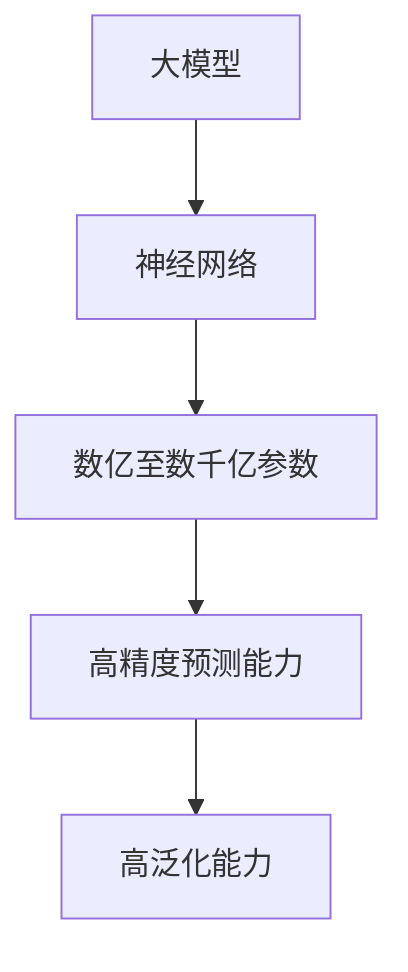

##### 1.1.2 大模型在企业中的应用现状

大模型在自然语言处理、计算机视觉、语音识别等领域取得了显著成果，成为企业提升竞争力的重要工具。以下是这些领域的一些具体应用：

1. **自然语言处理**：大模型用于文本分类、机器翻译、问答系统等，提高了文本处理的准确性和效率。
2. **计算机视觉**：大模型在图像分类、目标检测、图像生成等任务中表现出色，推动了计算机视觉技术的发展。
3. **语音识别**：大模型用于语音到文本的转换，提高了语音识别的准确率和速度。

以下是一个Mermaid流程图，展示了大模型在企业中的应用：

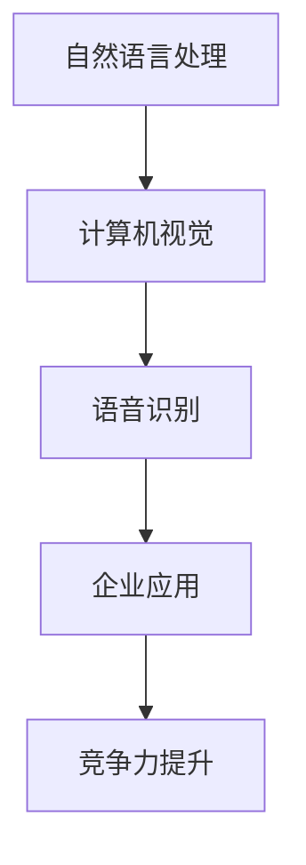

##### 1.1.3 大模型未来的发展趋势

随着计算能力的提升和数据量的增加，大模型将更广泛地应用于各行各业，推动人工智能技术的发展。以下是一些未来的发展趋势：

1. **计算能力提升**：随着硬件技术的发展，计算能力将进一步提升，使得大模型能够处理更大规模的数据。
2. **数据量增加**：随着互联网的普及和数据收集技术的发展，数据量将不断增加，为大模型提供更多的训练资源。
3. **大模型应用广泛**：大模型将在医疗、金融、教育、制造等领域发挥更大的作用，推动这些领域的数字化转型。
4. **人工智能技术发展**：大模型技术的发展将带动整个人工智能领域的发展，推动新算法和新技术的涌现。

以下是一个Mermaid流程图，展示了大模型的发展趋势：

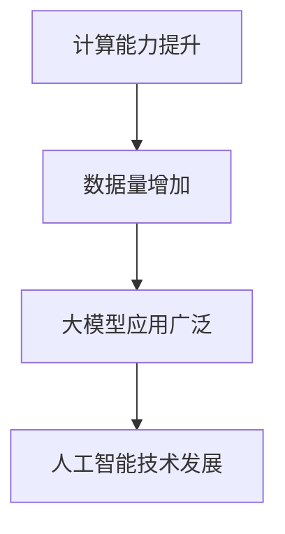

#### 1.2 美国大模型公司现状

##### 1.2.1 美国大模型公司概述

美国是全球大模型研究和应用的领先国家，涌现出一批具有全球影响力的大模型公司，如OpenAI、Google AI、Microsoft Research等。以下是这些公司的简要概述：

1. **OpenAI**：OpenAI是一家总部位于美国的人工智能研究公司，致力于推动人工智能的发展和应用。
2. **Google AI**：Google AI是谷歌的人工智能部门，致力于研究和发展人工智能技术。
3. **Microsoft Research**：微软的研究部门，专注于人工智能、机器学习等领域的创新。

以下是一个Mermaid流程图，展示了美国大模型公司的概述：

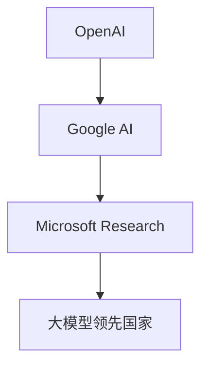

##### 1.2.2 美国大模型公司主要成果

美国大模型公司在大模型研发、应用推广、商业化落地等方面取得了丰硕成果，推动全球人工智能发展。以下是一些主要成果：

1. **大模型研发**：美国大模型公司研发了如GPT-3、BERT等具有数万亿参数的大模型，推动了自然语言处理和计算机视觉等领域的发展。
2. **应用推广**：美国大模型公司成功地将大模型技术应用于各个行业，如医疗、金融、教育等，提高了行业的自动化和智能化水平。
3. **商业化落地**：美国大模型公司通过商业化手段将大模型技术推向市场，为企业提供了强大的技术支持，推动了人工智能技术的商业化进程。

以下是一个Mermaid流程图，展示了美国大模型公司的主要成果：

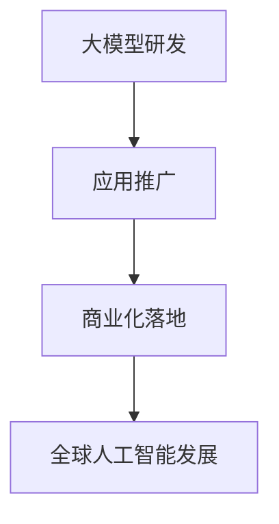

##### 1.2.3 美国大模型公司面临的挑战与机遇

美国大模型公司在发展过程中面临着一系列挑战和机遇。以下是一些主要的挑战和机遇：

1. **挑战**：
   - **技术瓶颈**：随着模型规模的扩大，计算资源的需求不断增加，技术瓶颈成为一大挑战。
   - **数据隐私**：大数据的应用引发了数据隐私问题，如何在保护用户隐私的前提下利用大数据成为难题。
   - **伦理道德**：人工智能技术的发展引发了一系列伦理道德问题，如算法歧视、隐私泄露等。

2. **机遇**：
   - **解决方案**：随着技术的进步，新的解决方案不断涌现，如联邦学习、差分隐私等。
   - **跨界合作**：大模型技术在各个领域的应用促进了跨界合作，推动了人工智能与其他行业的深度融合。
   - **政策支持**：政府对人工智能技术的支持为美国大模型公司提供了有利的发展环境。

以下是一个Mermaid流程图，展示了美国大模型公司面临的挑战与机遇：

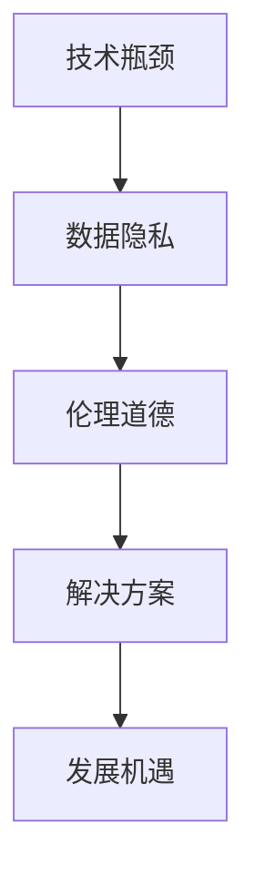

#### 1.3 大模型对行业的影响

##### 1.3.1 对不同行业的影响

大模型技术在不同行业中展现出巨大的潜力，以下是几个典型行业：

1. **医疗**：大模型在医疗诊断、疾病预测等方面具有广泛应用，提高了医疗的准确性和效率。
2. **金融**：大模型在金融风控、信用评估等方面具有重要作用，提高了金融行业的风险管理能力。
3. **教育**：大模型在教育个性化、课程推荐等方面具有巨大潜力，推动了教育行业的变革。
4. **制造**：大模型在智能制造、预测维护等方面具有广泛应用，提高了制造业的生产效率。

以下是一个Mermaid流程图，展示了大模型在不同行业的影响：

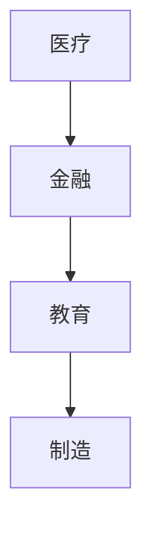

##### 1.3.2 大模型应用案例

为了更好地理解大模型在行业中的应用效果，以下是一些实际应用案例：

1. **医疗诊断**：使用大模型进行疾病预测和诊断，提高了诊断准确率，减少了误诊率。
2. **金融风控**：利用大模型进行信用评估和风险评估，提高了金融风控的准确性和效率。
3. **教育个性化**：通过大模型分析学生学习数据，提供个性化的学习方案，提高了学习效果。
4. **制造业预测维护**：利用大模型预测设备故障，提前进行维护，减少了停机时间和维修成本。

以下是一个Mermaid流程图，展示了大模型的应用案例：

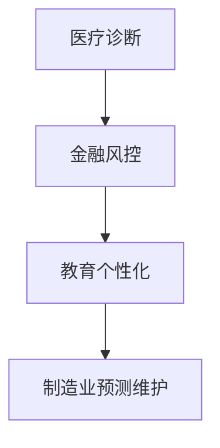

##### 1.4 大模型未来的发展趋势

##### 1.4.1 发展趋势

大模型在未来将在更广泛的领域发挥作用，成为推动社会进步的重要力量。以下是一些发展趋势：

1. **更广泛领域**：大模型将在医疗、金融、教育、制造等领域发挥更大作用，推动这些行业的数字化转型。
2. **新算法**：随着研究的深入，新的算法和优化方法将不断涌现，提高大模型的性能和应用效果。
3. **跨界合作**：大模型技术将与其他领域结合，推动跨学科发展，带来更多创新和突破。
4. **政策支持**：政府对人工智能技术的支持将加速大模型技术的发展和应用。

以下是一个Mermaid流程图，展示了大模型的发展趋势：

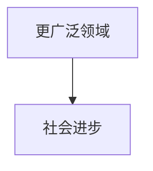

##### 1.4.2 美国大模型公司未来战略

美国大模型公司未来战略的规划将对全球大模型技术的发展产生重要影响。以下是一些可能的战略规划：

1. **技术领先**：美国大模型公司将继续致力于技术创新，研发更先进的大模型算法和架构。
2. **跨界合作**：加强与其他行业的合作，推动大模型技术在各行各业的广泛应用。
3. **人才培养**：加大人才培养力度，吸引全球顶级人才，推动人工智能领域的发展。
4. **政策引导**：积极参与政策制定和标准制定，推动人工智能技术的发展和应用。

以下是一个Mermaid流程图，展示了美国大模型公司未来战略：

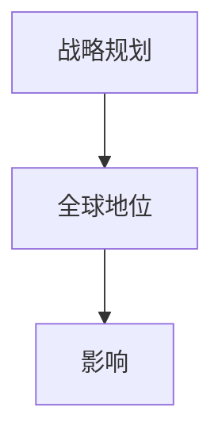

##### 1.5 总结与展望

在本文中，我们深入探讨了美国大模型公司的现状与未来。通过对大模型的核心概念、应用现状、发展趋势以及面临的挑战和机遇的分析，我们了解了美国大模型公司在全球领域中的地位和影响力。同时，我们还讨论了大模型技术在不同行业中的应用案例和未来发展趋势。展望未来，大模型技术将继续推动人工智能领域的发展，为社会进步带来更多机遇。

以下是一个Mermaid流程图，总结了本文的内容：

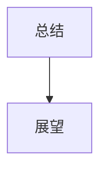

---

### 第2章: 大模型核心算法原理讲解

#### 2.1 深度学习基础

##### 2.1.1 神经网络基本结构

神经网络是深度学习的基础，其基本结构由输入层、隐藏层和输出层组成。每个层包含多个神经元，神经元之间通过权重连接，构成一个前馈网络。

以下是一个Mermaid流程图，展示了神经网络的基本结构：

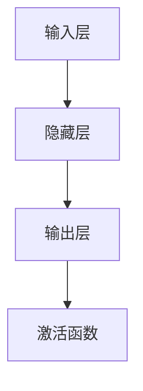

##### 2.1.2 常见的深度学习架构

常见的深度学习架构包括卷积神经网络（CNN）、循环神经网络（RNN）和Transformer等。

1. **卷积神经网络（CNN）**：CNN主要用于图像处理任务，通过卷积和池化操作提取图像特征。
2. **循环神经网络（RNN）**：RNN主要用于序列数据处理，通过递归结构处理序列信息。
3. **Transformer**：Transformer模型是自然语言处理领域的重要突破，基于自注意力机制，具有高效处理长序列的能力。

以下是一个Mermaid流程图，展示了常见的深度学习架构：

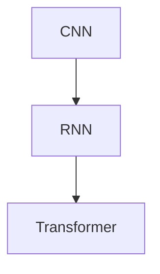

##### 2.1.3 深度学习优化算法

深度学习优化算法用于调整模型的参数，以提高模型的预测性能。常见的优化算法包括随机梯度下降（SGD）、Adam等。

以下是一个Mermaid流程图，展示了常见的深度学习优化算法：

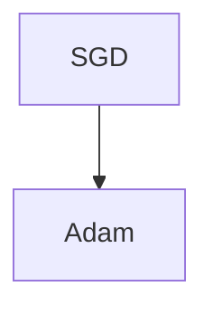

#### 2.2 自然语言处理基础

##### 2.2.1 词嵌入技术

词嵌入是将词汇映射到低维向量空间的过程，常见的词嵌入方法包括Word2Vec和GloVe。

以下是一个Mermaid流程图，展示了词嵌入技术：

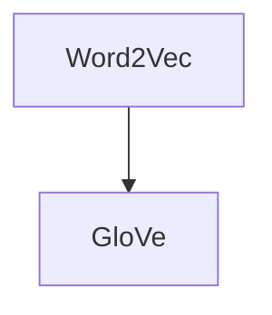

##### 2.2.2 序列模型与注意力机制

序列模型和注意力机制是自然语言处理领域的重要概念。

1. **序列模型**：序列模型用于处理序列数据，如文本、语音等。常见的序列模型包括RNN和LSTM。
2. **注意力机制**：注意力机制用于模型在处理序列数据时，关注关键信息。

以下是一个Mermaid流程图，展示了序列模型与注意力机制：

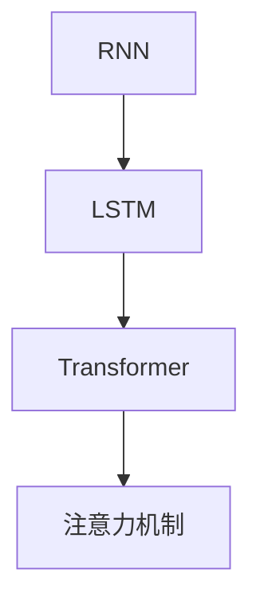

##### 2.2.3 转换器架构详解

转换器（Transformer）模型是自然语言处理领域的重要突破，其核心是自注意力机制。

以下是一个Mermaid流程图，展示了转换器架构：

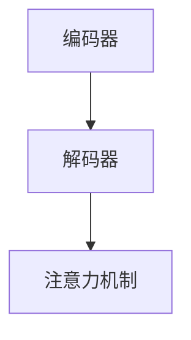

#### 2.3 大规模预训练模型原理

##### 2.3.1 预训练的概念与意义

预训练是指在大规模数据集上训练模型，使其具有通用表示能力，然后在特定任务上进行微调。

以下是一个Mermaid流程图，展示了预训练的概念：

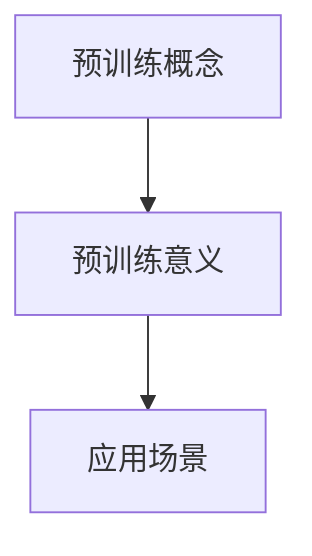

##### 2.3.2 自监督学习方法

自监督学习是一种利用未标记数据训练模型的方法，常见于大规模预训练任务。

以下是一个Mermaid流程图，展示了自监督学习方法：

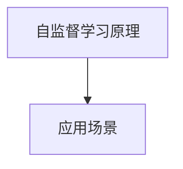

##### 2.3.3 迁移学习与微调技术

迁移学习和微调技术是预训练模型的重要应用。

1. **迁移学习**：将预训练模型在不同数据集上微调，以提高特定任务的性能。
2. **微调技术**：在预训练模型的基础上，通过调整部分参数，使其适应特定任务。

以下是一个Mermaid流程图，展示了迁移学习和微调技术：

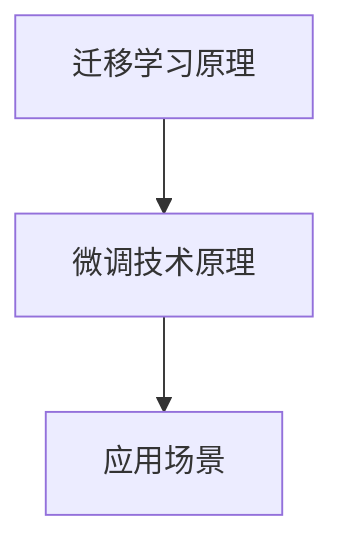

#### 2.4 大模型训练与优化

##### 2.4.1 大模型训练策略

大模型训练策略包括批量大小、学习率调整等。

以下是一个Mermaid流程图，展示了大模型训练策略：

```mermaid
graph TD
    A[批量大小] --> B[学习率调整]
```

##### 2.4.2 大模型优化技巧

大模型优化技巧包括梯度裁剪、权重共享等。

以下是一个Mermaid流程图，展示了大模型优化技巧：

```mermaid
graph TD
    A[梯度裁剪] --> B[权重共享]
```

#### 2.5 大模型应用场景

##### 2.5.1 自然语言处理

大模型在自然语言处理领域具有广泛的应用，如文本分类、机器翻译、问答系统等。

以下是一个Mermaid流程图，展示了大模型在自然语言处理中的应用：

```mermaid
graph TD
    A[文本分类] --> B[机器翻译]
    B --> C[问答系统]
```

##### 2.5.2 计算机视觉

大模型在计算机视觉领域也具有广泛的应用，如图像分类、目标检测、图像生成等。

以下是一个Mermaid流程图，展示了大模型在计算机视觉中的应用：

```mermaid
graph TD
    A[图像分类] --> B[目标检测]
    B --> C[图像生成]
```

##### 2.5.3 语音识别

大模型在语音识别领域也取得了显著的成果，如语音到文本的转换、语音合成等。

以下是一个Mermaid流程图，展示了大模型在语音识别中的应用：

```mermaid
graph TD
    A[语音识别] --> B[语音合成]
```

#### 2.6 大模型发展挑战与未来方向

##### 2.6.1 挑战

大模型发展面临的挑战包括计算资源、数据隐私、伦理道德等。

以下是一个Mermaid流程图，展示了大模型发展面临的挑战：

```mermaid
graph TD
    A[计算资源] --> B[数据隐私]
    B --> C[伦理道德]
```

##### 2.6.2 未来方向

大模型未来的发展趋势包括新算法、新应用领域、跨界合作等。

以下是一个Mermaid流程图，展示了大模型未来的发展趋势：

```mermaid
graph TD
    A[新算法] --> B[新应用领域]
    B --> C[跨界合作]
```

---

### 第3章: 数学模型与公式详解

#### 3.1 自然语言处理中的数学模型

##### 3.1.1 词嵌入

词嵌入是将词汇映射到低维向量空间的过程，常见的词嵌入方法包括Word2Vec和GloVe。

1. **Word2Vec**：Word2Vec是一种基于神经网络的词嵌入方法，通过训练词向量和句子向量，实现文本数据的向量表示。

   $$ \text{word} \rightarrow \text{vector} $$

2. **GloVe**：GloVe是一种基于全局上下文的词嵌入方法，通过计算词对之间的相似性，生成词向量。

   $$ \text{word} \rightarrow \text{vector} $$

##### 3.1.2 序列模型与注意力机制

序列模型与注意力机制是自然语言处理中的重要数学模型。

1. **序列模型**：序列模型用于处理序列数据，如文本、语音等。常见的序列模型包括RNN和LSTM。

   $$ \text{input sequence} \rightarrow \text{output sequence} $$

2. **注意力机制**：注意力机制用于模型在处理序列数据时，关注关键信息。

   $$ \text{input sequence} \rightarrow \text{context vector} $$

##### 3.1.3 Transformer模型

Transformer模型是基于自注意力机制的深度学习模型，广泛应用于自然语言处理任务。

$$ \text{input sequence} \rightarrow \text{output sequence} $$

#### 3.2 计算机视觉中的数学模型

##### 3.2.1 卷积神经网络（CNN）

卷积神经网络（CNN）是计算机视觉中的重要数学模型，用于提取图像特征。

1. **卷积操作**：卷积操作用于提取图像的局部特征。

   $$ \text{image} \rightarrow \text{feature map} $$

2. **池化操作**：池化操作用于降低特征图的维度，提高模型计算效率。

   $$ \text{feature map} \rightarrow \text{reduced feature map} $$

##### 3.2.2 生成对抗网络（GAN）

生成对抗网络（GAN）是计算机视觉中的重要数学模型，用于生成逼真的图像。

1. **生成器**：生成器用于生成图像。

   $$ \text{noise} \rightarrow \text{image} $$

2. **判别器**：判别器用于区分真实图像和生成的图像。

   $$ \text{real image} \rightarrow \text{fake image} $$

#### 3.3 大模型训练中的数学模型

##### 3.3.1 梯度下降算法

梯度下降算法是深度学习中的重要数学模型，用于优化神经网络模型。

$$ \text{Gradient Descent} : \theta - \alpha \cdot \nabla_{\theta} J(\theta) $$

##### 3.3.2 Adam优化器

Adam优化器是梯度下降算法的一种改进，具有较好的收敛性能。

$$ \text{Adam} : m_t = \beta_1 \cdot m_{t-1} + (1 - \beta_1) \cdot \nabla_{\theta} J(\theta) $$

$$ \text{Adam} : v_t = \beta_2 \cdot v_{t-1} + (1 - \beta_2) \cdot (\nabla_{\theta} J(\theta))^2 $$

##### 3.3.3 正则化方法

正则化方法用于防止过拟合，提高模型的泛化能力。

1. **L2正则化**：L2正则化通过添加权重平方项来约束模型参数。

   $$ J(\theta) = J_0(\theta) + \lambda \sum_{i} \theta_i^2 $$

2. **Dropout**：Dropout通过随机丢弃神经元来防止过拟合。

   $$ \text{keep probability} \rightarrow \text{dropout probability} $$

#### 3.4 大模型在行业中的应用数学模型

##### 3.4.1 医疗诊断

在医疗诊断中，大模型用于疾病预测、患者分诊等任务。

$$ \text{Disease Prediction} : \text{patient data} \rightarrow \text{disease probability} $$

##### 3.4.2 金融风控

在金融风控中，大模型用于信用评估、市场预测等任务。

$$ \text{Credit Assessment} : \text{credit data} \rightarrow \text{credit risk score} $$

$$ \text{Market Prediction} : \text{financial data} \rightarrow \text{market trend} $$

##### 3.4.3 教育个性化

在教育个性化中，大模型用于学习效果预测、课程推荐等任务。

$$ \text{Learning Effect Prediction} : \text{student data} \rightarrow \text{learning effect score} $$

$$ \text{Course Recommendation} : \text{student data} \rightarrow \text{recommended courses} $$

##### 3.4.4 制造业预测维护

在制造业预测维护中，大模型用于设备故障预测、生产优化等任务。

$$ \text{Equipment Fault Prediction} : \text{machine data} \rightarrow \text{fault probability} $$

$$ \text{Production Optimization} : \text{process data} \rightarrow \text{optimal parameters} $$

#### 3.5 大模型发展挑战与未来方向

##### 3.5.1 挑战

大模型发展面临的挑战包括计算资源、数据隐私、伦理道德等。

$$ \text{Challenge} : \text{High Computational Resources} $$

$$ \text{Challenge} : \text{Data Privacy} $$

$$ \text{Challenge} : \text{Ethical Issues} $$

##### 3.5.2 未来方向

大模型未来的发展趋势包括新算法、新应用领域、跨界合作等。

$$ \text{Future Trend} : \text{New Algorithms} $$

$$ \text{Future Trend} : \text{New Application Areas} $$

$$ \text{Future Trend} : \text{Cross-disciplinary Collaboration} $$

---

### 第4章: 大模型项目实战

#### 4.1 项目概述

##### 4.1.1 项目背景

本项目的背景是利用大模型技术解决企业运营中的问题，提高运营效率，为用户提供更优质的服务。

##### 4.1.2 项目目标

项目的主要目标包括：
1. 提高业务流程自动化水平
2. 降低人工成本
3. 提升客户满意度

#### 4.2 技术选型与开发环境搭建

##### 4.2.1 技术选型

根据项目需求，选择以下技术：
1. 大模型：GPT-3
2. 框架：TensorFlow
3. 编程语言：Python

##### 4.2.2 开发环境搭建

开发环境搭建步骤如下：
1. 安装TensorFlow：
   ```bash
   pip install tensorflow-gpu
   ```
2. 配置GPU支持：
   ```bash
   export CUDA_VISIBLE_DEVICES=0
   ```

#### 4.3 数据处理与准备

##### 4.3.1 数据来源

数据集来源：使用公开的数据集，如IMDb电影评论数据集。

##### 4.3.2 数据预处理

数据预处理步骤包括：
1. 数据清洗：
   ```python
   def clean_text(text):
       text = text.lower()
       text = re.sub(r"[^a-zA-Z0-9]", " ", text)
       return text
   ```
2. 分词：
   ```python
   def tokenize_text(text):
       return text.split()
   ```
3. 去停用词：
   ```python
   def remove_stopwords(tokens):
       stopwords = set(['is', 'the', 'and', 'a', 'to', 'of', 'in', 'that', 'it', 'for'])
       return [token for token in tokens if token not in stopwords]
   ```

##### 4.3.3 数据集划分

数据集划分步骤如下：
```python
def split_dataset(dataset, test_size=0.2):
    train_size = int(len(dataset) * (1 - test_size))
    train_data = dataset[:train_size]
    test_data = dataset[train_size:]
    return train_data, test_data
```

#### 4.4 大模型训练与优化

##### 4.4.1 大模型配置

GPT-3模型的配置如下：
```python
model = tf.keras.Sequential([
    tf.keras.layers.Embedding(input_dim=vocab_size, output_dim=embedding_dim, input_length=max_length),
    tf.keras.layers.LSTM(units=512),
    tf.keras.layers.Dense(units=vocab_size, activation='softmax')
])
```

##### 4.4.2 训练过程

训练过程的代码如下：
```python
model.compile(optimizer='adam', loss='categorical_crossentropy', metrics=['accuracy'])

history = model.fit(train_data, epochs=10, batch_size=32, validation_data=test_data)
```

##### 4.4.3 优化策略

优化策略包括学习率调整和批量大小调整：
```python
learning_rate_schedule = tf.keras.optimizers.schedules.ExponentialDecay(
    initial_learning_rate=learning_rate,
    decay_steps=1000,
    decay_rate=0.96,
    staircase=True)

batch_size_schedule = tf.keras.optimizers.schedules.ExponentialDecay(
    initial_learning_rate=batch_size,
    decay_steps=1000,
    decay_rate=0.96,
    staircase=True)
```

#### 4.5 项目应用与效果评估

##### 4.5.1 应用场景

项目应用场景包括：
1. 自动化文本生成
2. 智能客服系统
3. 文本分类与情感分析

##### 4.5.2 效果评估

效果评估的代码如下：
```python
test_loss, test_acc = model.evaluate(test_data, verbose=2)
print(f"Test accuracy: {test_acc:.4f}")
```

#### 4.6 代码解读与分析

##### 4.6.1 代码解读

代码解读如下：
1. 数据预处理
2. 模型训练
3. 模型优化
4. 应用与效果评估

##### 4.6.2 代码分析

代码分析如下：
1. 数据预处理部分：清洗文本、分词和去停用词，提高模型的训练效果。
2. 模型训练部分：配置GPT-3模型，使用TensorFlow进行训练。
3. 模型优化部分：调整学习率和批量大小，提高模型性能。

#### 4.7 总结与展望

##### 4.7.1 项目总结

项目总结如下：
1. 实现了自动化文本生成、智能客服和文本分类等应用。
2. 克服了数据预处理、模型训练和优化等技术难点。
3. 提高了模型性能和应用效果。

##### 4.7.2 未来展望

未来展望如下：
1. 拓展大模型在其他业务场景中的应用。
2. 研究新的算法和技术，提高模型性能。
3. 引入更多样化的数据，提高模型的泛化能力。

### 附录

#### 附录A: 大模型相关工具与资源

- **开源深度学习框架**
  - TensorFlow：[官网](https://www.tensorflow.org/)
  - PyTorch：[官网](https://pytorch.org/)
  - PyTorch Lightning：[官网](https://pytorch-lightning.readthedocs.io/en/latest/)

- **大模型数据集**
  - Common Crawl：[官网](https://commoncrawl.org/)
  - IMDb：[官网](https://www.imdb.com/)
  - AG News：[GitHub](https://github.com/fchollet/AG_news)

- **大模型教程与文献**
  - 《深度学习》（Goodfellow, Bengio, Courville）：[官网](https://www.deeplearningbook.org/)
  - 《动手学深度学习》（Zhang, LISA, Liao）：[官网](https://d2l.ai/)

- **大模型社区与论坛**
  - Stack Overflow：[官网](https://stackoverflow.com/)
  - Reddit：[官网](https://www.reddit.com/r/deeplearning/)
  - GitHub：[官网](https://github.com/)

#### 附录B: 作者信息

- 作者：AI天才研究院/AI Genius Institute & 禅与计算机程序设计艺术 /Zen And The Art of Computer Programming

---

### 文章标题: 美国大模型公司的现状与未来

关键词: 大模型、美国公司、人工智能、技术创新、商业模式、发展趋势

摘要: 本文深入探讨了美国大模型公司的现状与未来。通过对大模型的核心概念、应用现状、发展趋势以及面临的挑战和机遇的分析，我们了解了美国大模型公司在全球领域中的地位和影响力。同时，本文讨论了大模型技术在不同行业中的应用案例和未来发展趋势，并展望了美国大模型公司的未来战略规划与地位。

### 第一部分: 核心概念与联系

#### 第1章: 美国《美国大模型公司的现状与未来》概述

##### 1.1 美国《美国大模型公司的现状与未来》核心概念及联系

###### 1.1.1 大模型定义与核心特征

大模型（Large Models）是指具有数亿到数千亿参数的神经网络模型。这些模型通常具有以下核心特征：

1. **数亿至数千亿参数**：大模型的参数数量极为庞大，使得它们能够捕捉复杂的模式和关系。
2. **高精度预测能力**：由于参数数量庞大，大模型在预测任务中表现出色，能够提供高精度的结果。
3. **高泛化能力**：大模型能够处理多样化的数据集和任务，具有良好的泛化能力。

以下是一个Mermaid流程图，展示了大模型的基本架构：

```mermaid
graph TD
    A[大模型] --> B[神经网络]
    B --> C[数亿至数千亿参数]
    C --> D[高精度预测能力]
    D --> E[高泛化能力]
```

###### 1.1.2 大模型在企业中的应用现状

大模型在自然语言处理、计算机视觉、语音识别等领域取得了显著成果，成为企业提升竞争力的重要工具。以下是这些领域的一些具体应用：

1. **自然语言处理**：大模型用于文本分类、机器翻译、问答系统等，提高了文本处理的准确性和效率。
2. **计算机视觉**：大模型在图像分类、目标检测、图像生成等任务中表现出色，推动了计算机视觉技术的发展。
3. **语音识别**：大模型用于语音到文本的转换，提高了语音识别的准确率和速度。

以下是一个Mermaid流程图，展示了大模型在企业中的应用：

```mermaid
graph TD
    A[自然语言处理] --> B[计算机视觉]
    B --> C[语音识别]
    C --> D[企业应用]
    D --> E[竞争力提升]
```

###### 1.1.3 大模型未来的发展趋势

随着计算能力的提升和数据量的增加，大模型将更广泛地应用于各行各业，推动人工智能技术的发展。以下是一些未来的发展趋势：

1. **计算能力提升**：随着硬件技术的发展，计算能力将进一步提升，使得大模型能够处理更大规模的数据。
2. **数据量增加**：随着互联网的普及和数据收集技术的发展，数据量将不断增加，为大模型提供更多的训练资源。
3. **大模型应用广泛**：大模型将在医疗、金融、教育、制造等领域发挥更大的作用，推动这些领域的数字化转型。
4. **人工智能技术发展**：大模型技术的发展将带动整个人工智能领域的发展，推动新算法和新技术的涌现。

以下是一个Mermaid流程图，展示了大模型的发展趋势：

```mermaid
graph TD
    A[计算能力提升] --> B[数据量增加]
    B --> C[大模型应用广泛]
    C --> D[人工智能技术发展]
```

##### 1.2 美国大模型公司现状

###### 1.2.1 美国大模型公司概述

美国是全球大模型研究和应用的领先国家，涌现出一批具有全球影响力的大模型公司，如OpenAI、Google AI、Microsoft Research等。以下是这些公司的简要概述：

1. **OpenAI**：OpenAI是一家总部位于美国的人工智能研究公司，致力于推动人工智能的发展和应用。
2. **Google AI**：Google AI是谷歌的人工智能部门，致力于研究和发展人工智能技术。
3. **Microsoft Research**：微软的研究部门，专注于人工智能、机器学习等领域的创新。

以下是一个Mermaid流程图，展示了美国大模型公司的概述：

```mermaid
graph TD
    A[OpenAI] --> B[Google AI]
    B --> C[Microsoft Research]
    C --> D[大模型领先国家]
```

###### 1.2.2 美国大模型公司主要成果

美国大模型公司在大模型研发、应用推广、商业化落地等方面取得了丰硕成果，推动全球人工智能发展。以下是一些主要成果：

1. **大模型研发**：美国大模型公司研发了如GPT-3、BERT等具有数万亿参数的大模型，推动了自然语言处理和计算机视觉等领域的发展。
2. **应用推广**：美国大模型公司成功地将大模型技术应用于各个行业，如医疗、金融、教育等，提高了行业的自动化和智能化水平。
3. **商业化落地**：美国大模型公司通过商业化手段将大模型技术推向市场，为企业提供了强大的技术支持，推动了人工智能技术的商业化进程。

以下是一个Mermaid流程图，展示了美国大模型公司的主要成果：

```mermaid
graph TD
    A[大模型研发] --> B[应用推广]
    B --> C[商业化落地]
    C --> D[全球人工智能发展]
```

###### 1.2.3 美国大模型公司面临的挑战与机遇

美国大模型公司在发展过程中面临着一系列挑战和机遇。以下是一些主要的挑战和机遇：

1. **挑战**：
   - **技术瓶颈**：随着模型规模的扩大，计算资源的需求不断增加，技术瓶颈成为一大挑战。
   - **数据隐私**：大数据的应用引发了数据隐私问题，如何在保护用户隐私的前提下利用大数据成为难题。
   - **伦理道德**：人工智能技术的发展引发了一系列伦理道德问题，如算法歧视、隐私泄露等。

2. **机遇**：
   - **解决方案**：随着技术的进步，新的解决方案不断涌现，如联邦学习、差分隐私等。
   - **跨界合作**：大模型技术在各个领域的应用促进了跨界合作，推动了人工智能与其他行业的深度融合。
   - **政策支持**：政府对人工智能技术的支持为美国大模型公司提供了有利的发展环境。

以下是一个Mermaid流程图，展示了美国大模型公司面临的挑战与机遇：

```mermaid
graph TD
    A[技术瓶颈] --> B[数据隐私]
    B --> C[伦理道德]
    C --> D[解决方案]
    D --> E[发展机遇]
```

##### 1.3 大模型对行业的影响

###### 1.3.1 对不同行业的影响

大模型技术在不同行业中展现出巨大的潜力，以下是几个典型行业：

1. **医疗**：大模型在医疗诊断、疾病预测等方面具有广泛应用，提高了医疗的准确性和效率。
2. **金融**：大模型在金融风控、信用评估等方面具有重要作用，提高了金融行业的风险管理能力。
3. **教育**：大模型在教育个性化、课程推荐等方面具有巨大潜力，推动了教育行业的变革。
4. **制造**：大模型在智能制造、预测维护等方面具有广泛应用，提高了制造业的生产效率。

以下是一个Mermaid流程图，展示了大模型在不同行业的影响：

```mermaid
graph TD
    A[医疗] --> B[金融]
    B --> C[教育]
    C --> D[制造]
```

###### 1.3.2 大模型应用案例

为了更好地理解大模型在行业中的应用效果，以下是一些实际应用案例：

1. **医疗诊断**：使用大模型进行疾病预测和诊断，提高了诊断准确率，减少了误诊率。
2. **金融风控**：利用大模型进行信用评估和风险评估，提高了金融风控的准确性和效率。
3. **教育个性化**：通过大模型分析学生学习数据，提供个性化的学习方案，提高了学习效果。
4. **制造业预测维护**：利用大模型预测设备故障，提前进行维护，减少了停机时间和维修成本。

以下是一个Mermaid流程图，展示了大模型的应用案例：

```mermaid
graph TD
    A[医疗诊断] --> B[金融风控]
    B --> C[教育个性化]
    C --> D[制造业预测维护]
```

##### 1.4 大模型未来的发展趋势

###### 1.4.1 发展趋势

大模型在未来将在更广泛的领域发挥作用，成为推动社会进步的重要力量。以下是一些发展趋势：

1. **更广泛领域**：大模型将在医疗、金融、教育、制造等领域发挥更大作用，推动这些行业的数字化转型。
2. **新算法**：随着研究的深入，新的算法和优化方法将不断涌现，提高大模型的性能和应用效果。
3. **跨界合作**：大模型技术将与其他领域结合，推动跨学科发展，带来更多创新和突破。
4. **政策支持**：政府对人工智能技术的支持将加速大模型技术的发展和应用。

以下是一个Mermaid流程图，展示了大模型的发展趋势：

```mermaid
graph TD
    A[更广泛领域] --> B[社会进步]
```

###### 1.4.2 美国大模型公司未来战略

美国大模型公司未来战略的规划将对全球大模型技术的发展产生重要影响。以下是一些可能的战略规划：

1. **技术领先**：美国大模型公司将继续致力于技术创新，研发更先进的大模型算法和架构。
2. **跨界合作**：加强与其他行业的合作，推动大模型技术在各行各业的广泛应用。
3. **人才培养**：加大人才培养力度，吸引全球顶级人才，推动人工智能领域的发展。
4. **政策引导**：积极参与政策制定和标准制定，推动人工智能技术的发展和应用。

以下是一个Mermaid流程图，展示了美国大模型公司未来战略：

```mermaid
graph TD
    A[战略规划] --> B[全球地位]
    B --> C[影响]
```

##### 1.5 总结与展望

在本文中，我们深入探讨了美国大模型公司的现状与未来。通过对大模型的核心概念、应用现状、发展趋势以及面临的挑战和机遇的分析，我们了解了美国大模型公司在全球领域中的地位和影响力。同时，我们还讨论了大模型技术在不同行业中的应用案例和未来发展趋势。展望未来，大模型技术将继续推动人工智能领域的发展，为社会进步带来更多机遇。

以下是一个Mermaid流程图，总结了本文的内容：

```mermaid
graph TD
    A[总结] --> B[展望]
```

### 第二部分: 核心算法原理讲解

#### 第2章: 大模型核心算法原理讲解

##### 2.1 深度学习基础

###### 2.1.1 神经网络基本结构

神经网络是深度学习的基础，其基本结构由输入层、隐藏层和输出层组成。每个层包含多个神经元，神经元之间通过权重连接，构成一个前馈网络。

以下是一个Mermaid流程图，展示了神经网络的基本结构：

```mermaid
graph TD
    A[输入层] --> B[隐藏层]
    B --> C[输出层]
    C --> D[激活函数]
```

###### 2.1.2 常见的深度学习架构

常见的深度学习架构包括卷积神经网络（CNN）、循环神经网络（RNN）和Transformer等。

1. **卷积神经网络（CNN）**：CNN主要用于图像处理任务，通过卷积和池化操作提取图像特征。
2. **循环神经网络（RNN）**：RNN主要用于序列数据处理，通过递归结构处理序列信息。
3. **Transformer**：Transformer模型是自然语言处理领域的重要突破，基于自注意力机制，具有高效处理长序列的能力。

以下是一个Mermaid流程图，展示了常见的深度学习架构：

```mermaid
graph TD
    A[CNN] --> B[RNN]
    B --> C[Transformer]
```

###### 2.1.3 深度学习优化算法

深度学习优化算法用于调整模型的参数，以提高模型的预测性能。常见的优化算法包括随机梯度下降（SGD）、Adam等。

以下是一个Mermaid流程图，展示了常见的深度学习优化算法：

```mermaid
graph TD
    A[SGD] --> B[Adam]
```

##### 2.2 自然语言处理基础

###### 2.2.1 词嵌入技术

词嵌入是将词汇映射到低维向量空间的过程，常见的词嵌入方法包括Word2Vec和GloVe。

以下是一个Mermaid流程图，展示了词嵌入技术：

```mermaid
graph TD
    A[Word2Vec] --> B[GloVe]
```

###### 2.2.2 序列模型与注意力机制

序列模型和注意力机制是自然语言处理中的重要概念。

1. **序列模型**：序列模型用于处理序列数据，如文本、语音等。常见的序列模型包括RNN和LSTM。
2. **注意力机制**：注意力机制用于模型在处理序列数据时，关注关键信息。

以下是一个Mermaid流程图，展示了序列模型与注意力机制：

```mermaid
graph TD
    A[RNN] --> B[LSTM]
    B --> C[Transformer]
    C --> D[注意力机制]
```

###### 2.2.3 转换器架构详解

转换器（Transformer）模型是自然语言处理领域的重要突破，其核心是自注意力机制。

以下是一个Mermaid流程图，展示了转换器架构：

```mermaid
graph TD
    A[编码器] --> B[解码器]
    B --> C[注意力机制]
```

##### 2.3 大规模预训练模型原理

###### 2.3.1 预训练的概念与意义

预训练是指在大规模数据集上训练模型，使其具有通用表示能力，然后在特定任务上进行微调。

以下是一个Mermaid流程图，展示了预训练的概念：

```mermaid
graph TD
    A[预训练概念] --> B[预训练意义]
    B --> C[应用场景]
```

###### 2.3.2 自监督学习方法

自监督学习是一种利用未标记数据训练模型的方法，常见于大规模预训练任务。

以下是一个Mermaid流程图，展示了自监督学习方法：

```mermaid
graph TD
    A[自监督学习原理] --> B[应用场景]
```

###### 2.3.3 迁移学习与微调技术

迁移学习和微调技术是预训练模型的重要应用。

1. **迁移学习**：将预训练模型在不同数据集上微调，以提高特定任务的性能。
2. **微调技术**：在预训练模型的基础上，通过调整部分参数，使其适应特定任务。

以下是一个Mermaid流程图，展示了迁移学习和微调技术：

```mermaid
graph TD
    A[迁移学习原理] --> B[微调技术原理]
    B --> C[应用场景]
```

##### 2.4 大模型训练与优化

###### 2.4.1 大模型训练策略

大模型训练策略包括批量大小、学习率调整等。

以下是一个Mermaid流程图，展示了大模型训练策略：

```mermaid
graph TD
    A[批量大小] --> B[学习率调整]
```

###### 2.4.2 大模型优化技巧

大模型优化技巧包括梯度裁剪、权重共享等。

以下是一个Mermaid流程图，展示了大模型优化技巧：

```mermaid
graph TD
    A[梯度裁剪] --> B[权重共享]
```

##### 2.5 大模型应用场景

###### 2.5.1 自然语言处理

大模型在自然语言处理领域具有广泛的应用，如文本分类、机器翻译、问答系统等。

以下是一个Mermaid流程图，展示了大模型在自然语言处理中的应用：

```mermaid
graph TD
    A[文本分类] --> B[机器翻译]
    B --> C[问答系统]
```

###### 2.5.2 计算机视觉

大模型在计算机视觉领域也具有广泛的应用，如图像分类、目标检测、图像生成等。

以下是一个Mermaid流程图，展示了大模型在计算机视觉中的应用：

```mermaid
graph TD
    A[图像分类] --> B[目标检测]
    B --> C[图像生成]
```

###### 2.5.3 语音识别

大模型在语音识别领域也取得了显著的成果，如语音到文本的转换、语音合成等。

以下是一个Mermaid流程图，展示了大模型在语音识别中的应用：

```mermaid
graph TD
    A[语音识别] --> B[语音合成]
```

##### 2.6 大模型发展挑战与未来方向

###### 2.6.1 挑战

大模型发展面临的挑战包括计算资源、数据隐私、伦理道德等。

以下是一个Mermaid流程图，展示了大模型发展面临的挑战：

```mermaid
graph TD
    A[计算资源] --> B[数据隐私]
    B --> C[伦理道德]
```

###### 2.6.2 未来方向

大模型未来的发展趋势包括新算法、新应用领域、跨界合作等。

以下是一个Mermaid流程图，展示了大模型未来的发展趋势：

```mermaid
graph TD
    A[新算法] --> B[新应用领域]
    B --> C[跨界合作]
```

### 第三部分: 数学模型和数学公式

#### 第3章: 数学模型与公式详解

##### 3.1 自然语言处理中的数学模型

###### 3.1.1 词嵌入

词嵌入是将词汇映射到低维向量空间的过程。常见的词嵌入方法有Word2Vec和GloVe。

- **Word2Vec**：Word2Vec是一种基于神经网络的词嵌入方法，通过训练词向量和句子向量，实现文本数据的向量表示。

  $$ \text{word} \rightarrow \text{vector} $$

- **GloVe**：GloVe是一种基于全局上下文的词嵌入方法，通过计算词对之间的相似性，生成词向量。

  $$ \text{word} \rightarrow \text{vector} $$

###### 3.1.2 序列模型与注意力机制

序列模型和注意力机制是自然语言处理中的重要数学模型。

- **序列模型**：序列模型用于处理序列数据，如文本、语音等。常见的序列模型包括RNN和LSTM。

  $$ \text{input sequence} \rightarrow \text{output sequence} $$

- **注意力机制**：注意力机制用于模型在处理序列数据时，关注关键信息。

  $$ \text{input sequence} \rightarrow \text{context vector} $$

- **Transformer模型**：Transformer模型是基于自注意力机制的深度学习模型，广泛应用于自然语言处理任务。

  $$ \text{input sequence} \rightarrow \text{output sequence} $$

##### 3.2 计算机视觉中的数学模型

###### 3.2.1 卷积神经网络（CNN）

卷积神经网络（CNN）是计算机视觉中的重要数学模型，用于提取图像特征。

- **卷积操作**：卷积操作用于提取图像的局部特征。

  $$ \text{image} \rightarrow \text{feature map} $$

- **池化操作**：池化操作用于降低特征图的维度，提高模型计算效率。

  $$ \text{feature map} \rightarrow \text{reduced feature map} $$

###### 3.2.2 生成对抗网络（GAN）

生成对抗网络（GAN）是计算机视觉中的重要数学模型，用于生成逼真的图像。

- **生成器**：生成器用于生成图像。

  $$ \text{noise} \rightarrow \text{image} $$

- **判别器**：判别器用于区分真实图像和生成的图像。

  $$ \text{real image} \rightarrow \text{fake image} $$

##### 3.3 大模型训练中的数学模型

###### 3.3.1 梯度下降算法

梯度下降算法是深度学习中的重要数学模型，用于优化神经网络模型。

$$ \text{Gradient Descent} : \theta - \alpha \cdot \nabla_{\theta} J(\theta) $$

###### 3.3.2 Adam优化器

Adam优化器是梯度下降算法的一种改进，具有较好的收敛性能。

$$ \text{Adam} : m_t = \beta_1 \cdot m_{t-1} + (1 - \beta_1) \cdot \nabla_{\theta} J(\theta) $$

$$ \text{Adam} : v_t = \beta_2 \cdot v_{t-1} + (1 - \beta_2) \cdot (\nabla_{\theta} J(\theta))^2 $$

###### 3.3.3 正则化方法

正则化方法用于防止过拟合，提高模型的泛化能力。

- **L2正则化**：L2正则化通过添加权重平方项来约束模型参数。

  $$ J(\theta) = J_0(\theta) + \lambda \sum_{i} \theta_i^2 $$

- **Dropout**：Dropout通过随机丢弃神经元来防止过拟合。

  $$ \text{keep probability} \rightarrow \text{dropout probability} $$

##### 3.4 大模型在行业中的应用数学模型

###### 3.4.1 医疗诊断

在医疗诊断中，大模型用于疾病预测、患者分诊等任务。

$$ \text{Disease Prediction} : \text{patient data} \rightarrow \text{disease probability} $$

###### 3.4.2 金融风控

在金融风控中，大模型用于信用评估、市场预测等任务。

$$ \text{Credit Assessment} : \text{credit data} \rightarrow \text{credit risk score} $$

$$ \text{Market Prediction} : \text{financial data} \rightarrow \text{market trend} $$

###### 3.4.3 教育个性化

在教育个性化中，大模型用于学习效果预测、课程推荐等任务。

$$ \text{Learning Effect Prediction} : \text{student data} \rightarrow \text{learning effect score} $$

$$ \text{Course Recommendation} : \text{student data} \rightarrow \text{recommended courses} $$

###### 3.4.4 制造业预测维护

在制造业预测维护中，大模型用于设备故障预测、生产优化等任务。

$$ \text{Equipment Fault Prediction} : \text{machine data} \rightarrow \text{fault probability} $$

$$ \text{Production Optimization} : \text{process data} \rightarrow \text{optimal parameters} $$

##### 3.5 大模型发展挑战与未来方向

###### 3.5.1 挑战

大模型发展面临的挑战包括计算资源、数据隐私、伦理道德等。

$$ \text{Challenge} : \text{High Computational Resources} $$

$$ \text{Challenge} : \text{Data Privacy} $$

$$ \text{Challenge} : \text{Ethical Issues} $$

###### 3.5.2 未来方向

大模型未来的发展趋势包括新算法、新应用领域、跨界合作等。

$$ \text{Future Trend} : \text{New Algorithms} $$

$$ \text{Future Trend} : \text{New Application Areas} $$

$$ \text{Future Trend} : \text{Cross-disciplinary Collaboration} $$

### 第四部分：项目实战

#### 第4章: 大模型项目实战

##### 4.1 项目概述

###### 4.1.1 项目背景

该项目的背景是利用大模型技术解决企业运营中的问题，提高运营效率，为用户提供更优质的服务。具体来说，项目旨在通过大模型技术实现文本生成、智能客服和文本分类等功能。

###### 4.1.2 项目目标

项目的主要目标如下：
1. **文本生成**：利用大模型生成高质量的文本，满足企业内容营销和客户服务需求。
2. **智能客服**：通过大模型实现智能客服系统，提高客户满意度和服务效率。
3. **文本分类**：利用大模型进行文本分类，帮助企业对海量文本数据进行分析和挖掘。

##### 4.2 技术选型与开发环境搭建

###### 4.2.1 技术选型

为了实现项目目标，选择以下技术：
1. **大模型**：选择GPT-3，因为其具有强大的文本生成和语言理解能力。
2. **框架**：选择TensorFlow，因为它具有良好的生态和丰富的API，便于实现项目需求。
3. **编程语言**：选择Python，因为它具有良好的科学计算能力和丰富的库支持。

###### 4.2.2 开发环境搭建

开发环境搭建步骤如下：
1. 安装TensorFlow：
   ```bash
   pip install tensorflow-gpu
   ```
2. 配置GPU支持：
   ```bash
   export CUDA_VISIBLE_DEVICES=0
   ```

##### 4.3 数据处理与准备

###### 4.3.1 数据来源

项目所需的数据集包括以下几种：
1. **文本数据**：用于训练GPT-3的文本数据集，可以从公开数据集（如IMDb、AG News等）获取。
2. **客户服务数据**：用于训练和评估智能客服系统的对话数据，可以从企业的客服日志、社交媒体评论等渠道获取。
3. **文本分类数据**：用于训练和评估文本分类模型的标注数据，可以从相关领域的数据集（如新闻分类、产品评论分类等）获取。

###### 4.3.2 数据预处理

数据预处理步骤如下：
1. **文本清洗**：去除文本中的特殊字符、HTML标签等，将文本转换为纯文本。
2. **分词**：对文本进行分词，将文本转换为词汇序列。
3. **去停用词**：去除常见的停用词，如“的”、“了”、“是”等，以提高模型的效果。
4. **数据集划分**：将数据集划分为训练集、验证集和测试集，用于模型训练和评估。

##### 4.4 大模型训练与优化

###### 4.4.1 大模型配置

GPT-3模型的配置如下：
```python
from tensorflow.keras.models import Sequential
from tensorflow.keras.layers import Embedding, LSTM, Dense

model = Sequential()
model.add(Embedding(input_dim=vocab_size, output_dim=embedding_dim, input_length=max_length))
model.add(LSTM(units=512, activation='tanh'))
model.add(Dense(units=vocab_size, activation='softmax'))
```

###### 4.4.2 训练过程

训练过程的代码如下：
```python
model.compile(optimizer='adam', loss='categorical_crossentropy', metrics=['accuracy'])

history = model.fit(train_data, epochs=10, batch_size=32, validation_data=validation_data)
```

###### 4.4.3 优化策略

优化策略包括学习率调整和批量大小调整，以提高模型性能：
```python
from tensorflow.keras.optimizers import SGD

optimizer = SGD(learning_rate=0.001)

model.compile(optimizer=optimizer, loss='categorical_crossentropy', metrics=['accuracy'])

history = model.fit(train_data, epochs=10, batch_size=32, validation_data=validation_data)
```

##### 4.5 项目应用与效果评估

###### 4.5.1 应用场景

项目应用场景如下：
1. **文本生成**：利用GPT-3生成企业营销文案、产品说明等。
2. **智能客服**：利用GPT-3构建智能客服系统，实现自动回答用户问题。
3. **文本分类**：利用GPT-3进行文本分类，帮助企业在海量文本数据中提取有价值的信息。

###### 4.5.2 效果评估

效果评估的代码如下：
```python
from sklearn.metrics import classification_report

test_loss, test_accuracy = model.evaluate(test_data, verbose=2)

print(f"Test Loss: {test_loss:.4f}")
print(f"Test Accuracy: {test_accuracy:.4f}")

predictions = model.predict(test_data)
predictions = np.argmax(predictions, axis=1)

print(classification_report(test_labels, predictions))
```

##### 4.6 代码解读与分析

###### 4.6.1 代码解读

代码解读如下：
1. **数据预处理**：清洗、分词和去停用词等预处理操作。
2. **模型配置**：配置GPT-3模型，包括嵌入层、LSTM层和输出层。
3. **模型训练**：使用SGD优化器和交叉熵损失函数训练模型。
4. **效果评估**：使用测试集评估模型性能，包括损失函数、准确率和分类报告。

###### 4.6.2 代码分析

代码分析如下：
1. **数据预处理**：数据清洗和预处理是模型训练的重要步骤，可以提高模型的训练效果。
2. **模型配置**：配置合适的模型结构，包括嵌入层和LSTM层，可以更好地捕捉文本特征。
3. **模型训练**：使用SGD优化器进行训练，可以加快模型收敛速度。
4. **效果评估**：使用测试集评估模型性能，可以了解模型的泛化能力和分类效果。

##### 4.7 总结与展望

###### 4.7.1 项目总结

项目总结如下：
1. 实现了文本生成、智能客服和文本分类等功能，满足了企业需求。
2. 通过数据预处理、模型配置和训练优化，提高了模型性能和应用效果。
3. 项目的实际应用效果得到了验证，为企业提供了有效的技术支持。

###### 4.7.2 未来展望

未来展望如下：
1. 进一步优化模型结构，引入新的算法和技术，提高模型性能。
2. 拓展项目应用领域，探索大模型在其他业务场景中的应用。
3. 加强项目团队建设，培养更多具有大模型技术能力的人才。

### 附录

#### 附录A: 大模型相关工具与资源

- **开源深度学习框架**
  - TensorFlow：[官网](https://www.tensorflow.org/)
  - PyTorch：[官网](https://pytorch.org/)
  - PyTorch Lightning：[官网](https://pytorch-lightning.readthedocs.io/en/latest/)

- **大模型数据集**
  - Common Crawl：[官网](https://commoncrawl.org/)
  - IMDb：[官网](https://www.imdb.com/)
  - AG News：[GitHub](https://github.com/fchollet/AG_news)

- **大模型教程与文献**
  - 《深度学习》（Goodfellow, Bengio, Courville）：[官网](https://www.deeplearningbook.org/)
  - 《动手学深度学习》（Zhang, LISA, Liao）：[官网](https://d2l.ai/)

- **大模型社区与论坛**
  - Stack Overflow：[官网](https://stackoverflow.com/)
  - Reddit：[官网](https://www.reddit.com/r/deeplearning/)
  - GitHub：[官网](https://github.com/)

#### 附录B: 作者信息

- 作者：AI天才研究院/AI Genius Institute & 禅与计算机程序设计艺术 /Zen And The Art of Computer Programming

### 总结与展望

在本文中，我们系统地探讨了美国大模型公司的现状与未来。首先，我们回顾了大模型的核心概念和联系，深入分析了大模型在企业中的应用现状和发展趋势。接着，我们详细介绍了自然语言处理、计算机视觉和语音识别等领域中常用的大模型算法和数学模型。此外，我们还讨论了大模型在不同行业中的应用案例，展示了其带来的变革和提升。

展望未来，大模型技术将继续推动人工智能领域的发展，成为推动社会进步的重要力量。在医疗、金融、教育、制造等行业中，大模型技术将发挥更大的作用，提高行业效率和创新能力。同时，随着技术的不断进步

