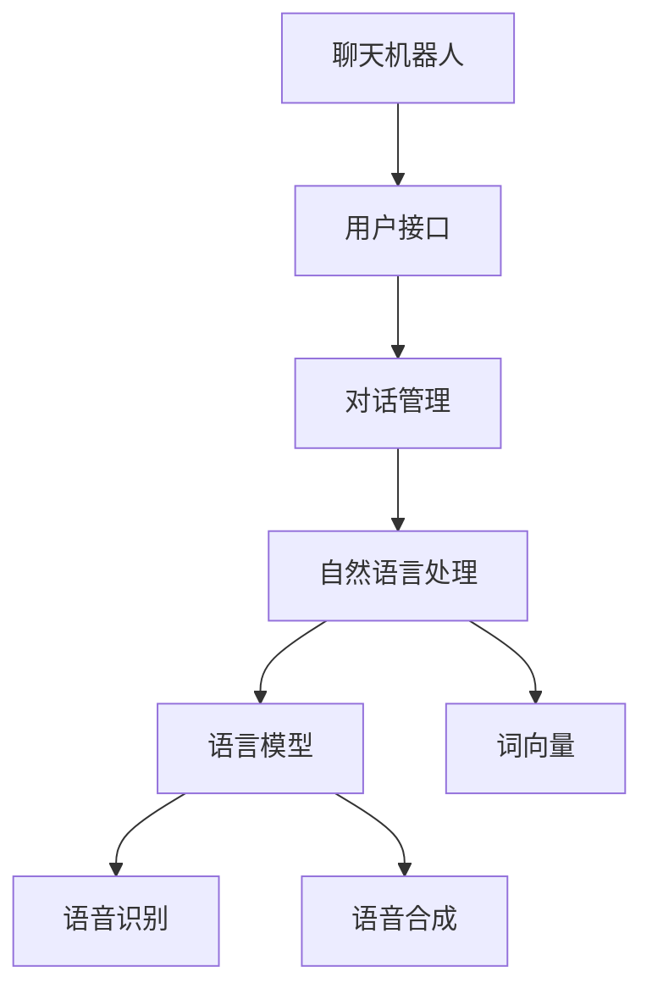
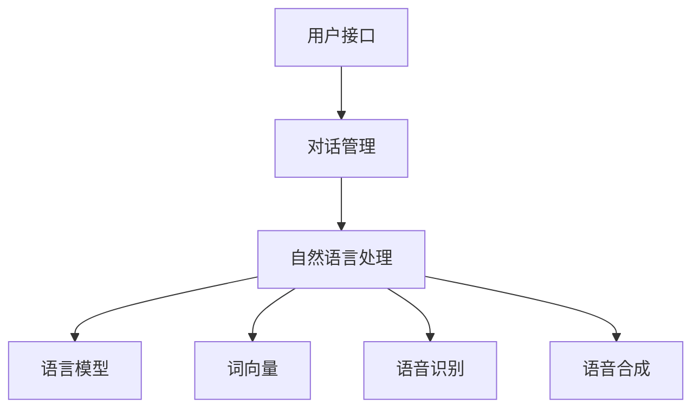

                 

### 《聊天机器人初探（Chat Completion）》

#### 关键词：
- 聊天机器人
- 自然语言处理
- 序列到序列模型
- 生成对抗网络
- 应用实践

#### 摘要：
本文将深入探讨聊天机器人的概念、技术原理、核心算法以及实际应用。从基础知识出发，逐步讲解自然语言处理、语音识别与语音合成、对话管理框架等核心技术，介绍聊天机器人生成算法如序列到序列模型和生成对抗网络。接着，通过实际项目案例，展示如何搭建和训练聊天机器人。最后，分析聊天机器人在行业中的应用现状、面临的挑战和未来发展趋势。

### 《聊天机器人初探（Chat Completion）》目录大纲

#### 第一部分：基础知识

- **第1章：聊天机器人概述**
  - **1.1 聊天机器人的定义与分类**
    - 定义与基本功能
    - 分类与常见应用
  - **1.2 聊天机器人技术的发展历程**
    - 早期聊天机器人
    - 自然语言处理（NLP）的引入
    - 人工智能（AI）的进步
  - **1.3 聊天机器人在行业中的应用**
    - 客户服务
    - 娱乐与教育
    - 医疗与健康咨询

#### 第二部分：技术原理

- **第2章：自然语言处理基础**
  - **2.1 语言模型与词向量**
    - 语言模型的定义
    - 词向量的概念与实现
  - **2.2 语音识别与语音合成**
    - 语音识别技术
    - 语音合成技术
  - **2.3 对话管理框架**
    - 对话系统的架构
    - 对话策略与生成

#### 第三部分：核心算法

- **第3章：聊天机器人生成算法**
  - **3.1 聊天机器人生成算法概述**
    - 生成式与检索式聊天机器人的比较
    - 常见生成算法简介
  - **3.2 序列到序列（Seq2Seq）模型**
    - Seq2Seq模型的基本原理
    - 应用案例与优化
  - **3.3 生成对抗网络（GAN）在聊天机器人中的应用**
    - GAN的基本原理
    - 如何在聊天机器人中使用GAN

#### 第四部分：应用实践

- **第4章：聊天机器人的开发实践**
  - **4.1 聊天机器人项目搭建**
    - 开发环境与工具配置
    - 项目架构设计
  - **4.2 聊天机器人的训练与优化**
    - 数据准备与预处理
    - 模型训练与调优
  - **4.3 聊天机器人的部署与维护**
    - 部署策略与方案
    - 维护与更新机制

#### 第五部分：案例解析

- **第5章：聊天机器人案例分析**
  - **5.1 案例一：电商客服聊天机器人**
    - 案例背景与目标
    - 技术实现与效果分析
  - **5.2 案例二：教育领域聊天机器人**
    - 案例背景与需求
    - 技术架构与功能实现

#### 第六部分：挑战与未来

- **第6章：聊天机器人的挑战与未来发展趋势**
  - **6.1 挑战与问题分析**
    - 数据隐私与安全问题
    - 人机交互的准确性
  - **6.2 未来发展趋势**
    - 跨平台交互与集成
    - 聊天机器人的情感智能

#### 第七部分：附录

- **附录A：资源与工具集**
  - **A.1 开发工具介绍**
    - 自然语言处理库
    - 机器学习框架
  - **A.2 开发与测试资源**
    - 开发环境搭建指南
    - 测试数据集与工具

---

**备注：** 附录A中的具体内容将根据实际需求进行填充，涵盖常见开发工具的使用指南、环境搭建步骤、测试数据集来源等。接下来，我们将逐步深入每个章节，探讨聊天机器人的各个层面。

---

**1.1.1 核心概念与联系**

首先，让我们通过一张Mermaid流程图来展示聊天机器人的核心概念及其相互之间的联系：



这张图展示了聊天机器人的主要组成部分：用户接口、对话管理、自然语言处理、语言模型、词向量、语音识别和语音合成。各部分之间通过数据流相互连接，共同构成了一个完整的聊天机器人系统。

#### 1.1.1 核心概念与联系

首先，让我们通过一张Mermaid流程图来展示聊天机器人的核心概念及其相互之间的联系：



这张图展示了聊天机器人的主要组成部分：用户接口、对话管理、自然语言处理、语言模型、词向量、语音识别和语音合成。各部分之间通过数据流相互连接，共同构成了一个完整的聊天机器人系统。

**用户接口（A）**：用户接口是用户与聊天机器人交互的界面，可以是网页、移动应用或桌面应用程序。它的主要任务是接收用户的输入并将其传递给对话管理模块。

**对话管理（B）**：对话管理负责管理整个对话流程，包括理解用户的意图、跟踪对话状态、生成合适的响应等。它是聊天机器人的“大脑”，负责处理所有的对话逻辑。

**自然语言处理（C）**：自然语言处理是聊天机器人的核心技术之一，包括文本解析、语义理解、语言生成等。它通过对用户输入的文本进行分析和处理，帮助对话管理理解用户的意图。

**语言模型（D）**：语言模型是一种用于预测下一个单词或词汇的概率分布模型，它基于大量的语料库训练得到。在聊天机器人中，语言模型用于生成自然、流畅的回复。

**词向量（E）**：词向量是将单词转换为向量表示的方法，它通过将每个单词映射到一个高维空间中的点，从而捕获词与词之间的相似性。词向量在自然语言处理和语言模型中有着广泛的应用。

**语音识别（F）**：语音识别技术用于将用户的语音输入转换为文本，它基于语音信号的处理和分析，实现语音到文本的转换。

**语音合成（G）**：语音合成技术用于将文本转换为语音输出，它通过语音合成引擎将文本转换为自然、流畅的语音，用于与用户进行语音交互。

这些核心概念和组成部分相互关联，共同构成了一个高效的聊天机器人系统。接下来，我们将进一步探讨聊天机器人技术的发展历程。

#### 1.2 聊天机器人技术的发展历程

聊天机器人的发展历程可以追溯到上世纪六七十年代，当时计算机科学家们首次尝试通过编程实现简单的对话功能。早期的聊天机器人如ELIZA和PARABLE，虽然功能非常有限，但它们标志着人工智能（AI）和自然语言处理（NLP）领域的初步探索。

**早期聊天机器人**

- **ELIZA（1966）**：由麻省理工学院的Joseph Weizenbaum教授开发，ELIZA是最早的聊天机器人之一。它使用简单的模式匹配和规则系统来模拟与人类的对话，尽管它的能力非常有限，但它激发了人们对于人工智能和自然语言处理的研究兴趣。
  
- **PARABLE（1972）**：由斯坦福大学的Michael Minsky和 Seymour Papert开发，PARABLE使用决策树和模式识别技术进行对话。与ELIZA不同，PARABLE试图通过学习和记忆来提高对话的连贯性和复杂性。

**自然语言处理（NLP）的引入**

随着计算机技术的不断进步和自然语言处理技术的成熟，聊天机器人在上世纪八十年代迎来了重要的发展。自然语言处理技术的引入使得聊天机器人能够更准确地理解和生成自然语言。

- **实体识别和关系抽取**：实体识别和关系抽取是NLP的关键技术，它们用于从文本中识别出重要的实体（如人名、地名、组织名等）以及实体之间的关系。这些技术使得聊天机器人能够更好地理解用户的意图和对话背景。

- **词向量和语言模型**：词向量（如Word2Vec、GloVe）和语言模型（如RNN、Transformer）的引入极大地提高了聊天机器人的语义理解和生成能力。词向量能够将单词转换为向量表示，从而捕捉词与词之间的相似性；语言模型则能够预测下一个单词或词汇的概率分布，用于生成自然、流畅的回复。

**人工智能（AI）的进步**

随着深度学习和神经网络技术的快速发展，聊天机器人的能力得到了显著提升。深度学习模型，特别是卷积神经网络（CNN）和递归神经网络（RNN），在图像识别、语音识别和自然语言处理等领域取得了突破性的成果。

- **深度学习模型**：深度学习模型能够通过多层神经网络自动提取特征，从而实现高水平的语义理解和生成。在聊天机器人中，深度学习模型被广泛应用于文本分类、情感分析、机器翻译等领域。

- **强化学习**：强化学习是一种通过试错来学习策略的机器学习方法。在聊天机器人中，强化学习被用于优化对话策略，从而提高聊天机器人的交互质量和用户体验。

- **多模态交互**：随着语音识别和图像识别技术的发展，聊天机器人开始支持多模态交互。这意味着聊天机器人不仅可以处理文本输入，还可以处理语音和图像输入，从而实现更丰富、更自然的交互体验。

**行业应用和挑战**

随着聊天机器人技术的不断进步，它们在多个行业中得到了广泛应用，如客户服务、娱乐、医疗、金融等。然而，聊天机器人仍然面临一些挑战，如数据隐私、安全性、准确性和可解释性等。未来，随着技术的不断发展和应用的深入，聊天机器人将在更多领域发挥重要作用，同时也会带来新的挑战和机遇。

通过回顾聊天机器人技术的发展历程，我们可以看到这一领域经历了从简单规则系统到复杂AI模型的转变。随着技术的不断进步，聊天机器人的能力将进一步提升，为人们的生活和工作带来更多便利。

#### 1.3 聊天机器人在行业中的应用

随着聊天机器人技术的不断进步，它们在多个行业中得到了广泛应用。以下是几个主要行业的具体应用案例：

**客户服务**

客户服务是聊天机器人应用最为广泛的领域之一。聊天机器人能够为用户提供即时、高效的客户支持，从而减少人力成本和提高客户满意度。例如，电商客服聊天机器人可以回答用户关于产品信息、订单状态和退货政策的常见问题，从而提高服务效率。

**娱乐与教育**

聊天机器人也在娱乐和教育领域找到了应用。在教育领域，聊天机器人可以作为虚拟教师，为学生们提供个性化的学习支持和答疑服务。例如，一些在线学习平台已经引入了聊天机器人，用于提供课程辅导和作业批改。在娱乐领域，聊天机器人被用于开发聊天游戏和虚拟助手，为用户提供互动娱乐体验。

**医疗与健康咨询**

聊天机器人被广泛应用于医疗健康咨询领域。它们可以协助医生和护士进行初步诊断、健康咨询和患者管理。例如，一些医院已经引入了聊天机器人，用于提供症状自查、预约挂号和健康建议等服务，从而提高医疗资源的利用效率。

**金融与保险**

在金融和保险行业，聊天机器人被用于提供客户服务、投资咨询和风险管理。例如，一些银行已经推出了智能客服机器人，用于回答客户的金融问题、处理账户查询和转账操作。在保险行业，聊天机器人被用于提供保险咨询、理赔服务和风险评估。

**其他行业**

除了上述主要行业，聊天机器人还在许多其他行业中得到了应用。例如，在酒店业，聊天机器人可以提供预订咨询、房间推荐和客房服务；在旅游业，聊天机器人可以提供行程规划、景点推荐和实时天气信息。

总之，聊天机器人在各个行业中展现了巨大的潜力。随着技术的不断进步，聊天机器人将在更多领域发挥重要作用，为企业和用户提供更加智能化、高效化的服务体验。

### 2.1 自然语言处理基础

#### 2.1.1 语言模型与词向量

自然语言处理（NLP）是构建聊天机器人的核心技术之一，而语言模型和词向量是NLP中的两个重要概念。

**语言模型**

语言模型是一种用于预测下一个单词或词汇的概率分布模型。它通过分析大量文本数据，学习到语言中的统计规律，从而能够预测下一个单词的概率。语言模型在聊天机器人中有着广泛的应用，如生成自然、流畅的回复。

**基本原理**

语言模型的基本原理是基于贝叶斯定理。给定一个文本序列，语言模型通过计算每个单词出现的概率，从而生成文本的概率分布。具体来说，语言模型通常使用N-gram模型或神经网络模型。

- **N-gram模型**：N-gram模型是一种基于统计的模型，它将文本序列划分为N个连续的单词，然后计算每个N-gram的概率。例如，在二元（N=2）模型中，每个单词出现的概率取决于其前一个单词。

- **神经网络模型**：神经网络模型（如RNN、LSTM、Transformer）通过多层神经网络自动提取特征，从而实现更高级的语言模型。这些模型能够更好地捕捉文本中的长期依赖关系，从而生成更自然、流畅的回复。

**实现方法**

语言模型的实现通常涉及以下步骤：

1. **数据收集与预处理**：收集大量文本数据，并对数据进行清洗、去噪和分词处理。
2. **词向量表示**：将文本数据中的单词转换为向量表示，可以使用词袋模型或词嵌入（如Word2Vec、GloVe）。
3. **模型训练**：使用训练数据训练语言模型，通过最小化损失函数（如交叉熵损失）来优化模型参数。
4. **模型评估**：使用验证数据评估模型性能，根据评估结果调整模型参数。

**优点与局限**

语言模型的主要优点是能够生成自然、流畅的回复，同时具有较高的计算效率。然而，语言模型也存在一些局限，如对罕见词和领域特定词汇的预测能力较差，以及对上下文信息的捕捉不足。

**词向量**

词向量是将单词转换为向量表示的方法，它通过将每个单词映射到一个高维空间中的点，从而捕获词与词之间的相似性。词向量在NLP和聊天机器人中有着广泛的应用，如文本分类、情感分析、机器翻译等。

**基本原理**

词向量的基本原理是基于词嵌入（word embedding）技术。词嵌入通过将单词映射到高维空间中的点，从而捕获词与词之间的语义关系。常见的词嵌入技术包括Word2Vec、GloVe和BERT等。

- **Word2Vec**：Word2Vec是一种基于神经网络的词嵌入技术，它通过训练词向量来捕获单词的语义信息。Word2Vec有两种算法：连续词袋（CBOW）和Skip-Gram。

- **GloVe**：GloVe（Global Vectors for Word Representation）是一种基于全局共现概率的词嵌入技术。GloVe通过学习词与词之间的共现矩阵，从而生成词向量。

- **BERT**：BERT（Bidirectional Encoder Representations from Transformers）是一种基于双向Transformer的词嵌入技术。BERT通过双向编码器来捕获单词的前后文信息，从而生成更丰富的词向量。

**实现方法**

词向量的实现通常涉及以下步骤：

1. **数据收集与预处理**：收集大量文本数据，并对数据进行清洗、去噪和分词处理。
2. **词向量训练**：使用训练数据训练词向量，可以通过优化目标函数（如均方误差）来调整词向量参数。
3. **词向量存储与加载**：将训练好的词向量存储在文件中，以便在应用中使用。

**优点与局限**

词向量的主要优点是能够捕获词与词之间的语义关系，从而提高文本处理的准确性。然而，词向量也存在一些局限，如对罕见词和领域特定词汇的表示能力较差，以及对上下文信息的捕捉不足。

通过语言模型和词向量，我们可以对文本进行有效的处理和分析，从而为聊天机器人提供强大的语义理解和生成能力。接下来，我们将进一步探讨语音识别和语音合成技术。

#### 2.2 语音识别与语音合成

语音识别（Speech Recognition）和语音合成（Speech Synthesis）是聊天机器人中不可或缺的组成部分，它们使得聊天机器人能够处理语音输入和生成语音输出，从而实现更加自然和人性化的交互体验。

**语音识别技术**

语音识别技术是指将人类的语音信号转换为文本或命令的技术。语音识别的核心任务是识别语音中的单词和句子，并将其转换为计算机可处理的文本或命令。以下是语音识别技术的基本原理和实现方法：

**基本原理**

语音识别技术通常涉及以下步骤：

1. **语音信号预处理**：首先，对语音信号进行预处理，包括去噪、归一化和分帧。去噪是为了去除语音信号中的噪声，归一化是为了使语音信号的能量分布均匀，分帧是为了将语音信号划分为一系列短时段。

2. **特征提取**：接下来，从预处理后的语音信号中提取特征，如频谱特征、倒谱特征和音素特征。这些特征能够反映语音信号中的音高、音强和音色等信息。

3. **模型训练**：使用大量带有标注的语音数据训练语音识别模型，通常采用深度学习模型（如卷积神经网络、循环神经网络和Transformer）。

4. **解码**：在识别过程中，模型会根据输入的语音特征，生成一系列可能的文本序列，并选择最有可能的序列作为识别结果。

**实现方法**

常见的语音识别系统通常包括以下几个步骤：

1. **前端处理**：包括麦克风阵列、声音捕捉和预处理。
2. **语音信号处理**：包括分帧、加窗、滤波和特征提取。
3. **模型训练**：使用标注数据训练深度学习模型，如使用卷积神经网络（CNN）或循环神经网络（RNN）。
4. **解码与输出**：将识别结果转换为文本输出或命令。

**优点与局限**

语音识别技术的优点包括：

- **高效性**：语音识别能够快速地将语音转换为文本，提高了交互的效率。
- **自然性**：语音交互更加自然和人性化，使得用户能够更加舒适地进行沟通。

然而，语音识别技术也存在一些局限：

- **准确性**：尽管语音识别技术已经取得了显著进步，但在噪声环境下、口音较重的语音以及多说话者的情况下，识别准确性仍然有待提高。
- **可扩展性**：语音识别模型通常需要大量标注数据，这使得模型在扩展到新的语言或方言时具有一定的难度。

**语音合成技术**

语音合成技术是指将文本转换为自然流畅的语音输出的技术。语音合成的核心任务是生成逼真的语音，使其听起来自然、流畅，并具备合适的音调、语调和节奏。以下是语音合成技术的基本原理和实现方法：

**基本原理**

语音合成技术通常涉及以下步骤：

1. **文本预处理**：首先，对输入的文本进行预处理，包括分词、词性标注和语法分析。这些步骤有助于理解文本的结构和含义。

2. **语音参数生成**：接下来，根据文本内容和语音参数（如音高、音强和音调）生成语音信号。语音参数包括基频、时长、幅度和音素等。

3. **波形生成**：最后，使用语音合成引擎（如WaveNet、Fluence）将语音参数转换为波形信号，生成自然流畅的语音输出。

**实现方法**

常见的语音合成系统通常包括以下几个步骤：

1. **文本输入**：输入文本，可以是自然语言文本或标记语言文本。
2. **文本预处理**：进行分词、词性标注和语法分析。
3. **语音参数生成**：根据文本内容和语音参数生成语音信号。
4. **波形生成**：使用语音合成引擎生成语音波形。

**优点与局限**

语音合成技术的优点包括：

- **自然性**：语音合成能够生成自然、流畅的语音输出，使得交互更加自然和人性化。
- **灵活性**：语音合成技术可以根据不同的应用场景和需求，调整语音的音调、语调和节奏。

然而，语音合成技术也存在一些局限：

- **语音质量**：尽管语音合成技术已经取得了显著进步，但在音质和自然度方面，仍然与人类语音存在差距。
- **适应能力**：语音合成技术在不同语言和方言上的表现可能有所不同，需要针对特定语言或方言进行优化。

通过语音识别和语音合成技术，聊天机器人能够处理语音输入和生成语音输出，从而实现更加自然和人性化的交互体验。这些技术在提升用户体验、提高交互效率方面发挥着重要作用。

### 2.3 对话管理框架

对话管理是聊天机器人系统的核心组件之一，它负责理解用户的意图、跟踪对话状态并生成合适的响应。一个有效的对话管理框架能够确保聊天机器人能够与用户进行流畅、自然的对话。

**对话系统的架构**

一个典型的对话系统通常包括以下几个关键组件：

- **用户接口**：用户接口（UI）是用户与聊天机器人交互的界面。它可以是网页、移动应用或桌面应用程序，负责接收用户的输入并显示聊天机器人的响应。

- **对话管理模块**：对话管理模块是对话系统的“大脑”，负责理解用户的意图、跟踪对话状态并生成合适的响应。对话管理模块通常包括意图识别、实体识别、对话状态跟踪和对话策略生成等子模块。

- **自然语言处理（NLP）模块**：NLP模块负责对用户的输入文本进行处理，包括分词、词性标注、语法分析和语义理解等。NLP模块的输出用于对话管理模块进行意图识别和实体提取。

- **语言生成模块**：语言生成模块负责根据对话管理模块的输出生成自然、流畅的回复。语言生成可以使用预定义的模板、规则系统或先进的自然语言生成算法（如序列到序列模型、生成对抗网络等）。

- **知识库**：知识库是聊天机器人获取信息和支持对话的重要资源。知识库可以是结构化数据（如数据库、知识图谱）或非结构化数据（如文本、图片、音频等）。

**对话策略与生成**

对话策略是指导对话管理模块如何生成响应的核心机制。对话策略可以分为以下几类：

- **基于规则的策略**：基于规则的策略使用预定义的规则和模板来生成响应。这种方法简单直观，但灵活性较低，难以应对复杂的对话场景。

- **基于模型的策略**：基于模型的策略使用机器学习模型（如决策树、随机森林、神经网络等）来生成对话策略。这种方法能够自动从数据中学习对话策略，具有较高的灵活性和适应性。

- **混合策略**：混合策略结合了基于规则和基于模型的方法，通过使用预定义的规则和机器学习模型相结合来生成响应。这种方法能够在保持灵活性的同时，充分利用规则系统的精确性和模型的学习能力。

**对话状态跟踪**

对话状态跟踪是确保对话系统能够持续理解用户意图和对话背景的关键。对话状态跟踪通常包括以下几个步骤：

1. **意图识别**：意图识别是理解用户输入的核心环节，通过分析用户输入的文本，确定用户的意图。意图可以是简单的“提问”、“请求信息”或复杂的“购物咨询”、“医疗咨询”等。

2. **实体提取**：在意图识别的基础上，对话管理系统需要从用户输入中提取关键信息，如人名、地点、日期等。实体提取是理解用户意图的重要步骤。

3. **状态更新**：对话管理系统需要跟踪对话状态，并根据用户的输入和系统的响应更新状态。状态更新可以包括用户意图的确认、对话的推进和对话的结束等。

4. **上下文维护**：为了保持对话的自然性和连贯性，对话管理系统需要维护对话的上下文信息。上下文信息可以包括用户的偏好、历史对话记录和对话状态等。

通过有效的对话管理框架，聊天机器人能够与用户进行流畅、自然的对话。对话管理框架的设计和实现直接影响聊天机器人的用户体验和性能。接下来，我们将探讨聊天机器人生成算法，包括生成式和检索式聊天机器人的基本原理和应用。

### 3.1 聊天机器人生成算法概述

聊天机器人生成算法是构建聊天机器人系统的核心技术之一，它决定了机器人如何生成自然、流畅的回复。聊天机器人生成算法可以分为生成式和检索式两大类。这两类算法在生成回复的过程中有着不同的工作机制和优缺点。

**生成式聊天机器人**

生成式聊天机器人通过生成全新的文本来响应用户输入，而不是简单地从预定义的回复库中检索。这种方法能够生成更加个性化和自然的回复，但同时也面临一定的挑战。

**基本原理**

生成式聊天机器人的基本原理是使用机器学习模型（如循环神经网络、变换器模型、生成对抗网络等）来生成文本。模型通过学习大量的文本数据，自动学习到语言模式和语义结构，从而能够生成新的文本。

1. **输入处理**：首先，对用户输入进行处理，包括分词、词性标注和语法分析。这些步骤有助于理解输入的语义和结构。

2. **文本生成**：然后，模型根据输入的语义和上下文信息生成文本。生成过程通常涉及两个阶段：编码阶段和解码阶段。

   - **编码阶段**：将输入文本编码为一个向量表示，通常使用嵌入层或编码器。
   - **解码阶段**：根据编码阶段生成的向量表示，解码器生成新的文本序列。解码器可以使用递归神经网络（RNN）、变换器（Transformer）或生成对抗网络（GAN）等。

**优点与局限**

生成式聊天机器人的主要优点包括：

- **自然性**：生成式聊天机器人能够生成更加自然、流畅的回复，因为它们不依赖于预定义的回复库。
- **灵活性**：生成式聊天机器人能够根据用户的输入和上下文信息动态生成回复，具有较强的灵活性。

然而，生成式聊天机器人也存在一些局限：

- **生成质量**：生成式聊天机器人的生成质量受限于模型的学习能力和训练数据。在训练数据不足或质量不高的情况下，生成的回复可能不够准确或自然。
- **计算成本**：生成式聊天机器人通常需要较大的计算资源，特别是在使用复杂的模型（如变换器模型和生成对抗网络）时。

**检索式聊天机器人**

检索式聊天机器人通过从预定义的回复库中检索匹配的回复来响应用户输入。这种方法在生成高质量回复方面具有优势，但灵活性相对较低。

**基本原理**

检索式聊天机器人的基本原理是使用模板匹配或关键词匹配来从预定义的回复库中检索匹配的回复。这种方法通常包括以下几个步骤：

1. **输入处理**：对用户输入进行处理，包括分词、词性标注和关键词提取。这些步骤有助于理解输入的语义和关键信息。

2. **回复检索**：根据输入的关键词和语义信息，从预定义的回复库中检索匹配的回复。回复库可以是静态的（如预定义的回复列表）或动态的（如基于语义相似度的检索系统）。

3. **回复生成**：将检索到的回复进行适当的格式化，生成最终的用户响应。

**优点与局限**

检索式聊天机器人的主要优点包括：

- **生成质量**：检索式聊天机器人通常使用高质量的预定义回复库，生成的回复具有较高的准确性和自然性。
- **响应时间**：由于检索过程通常较快，检索式聊天机器人的响应时间较短，适合实时交互场景。

然而，检索式聊天机器人也存在一些局限：

- **灵活性**：检索式聊天机器人的灵活性较低，难以应对复杂的对话场景和变化多端的用户输入。
- **知识库依赖**：检索式聊天机器人的性能高度依赖预定义的回复库，如果知识库不够全面或更新不及时，可能导致生成的回复不够准确或不符合用户需求。

**综合应用**

在实际应用中，生成式和检索式聊天机器人可以相互结合，发挥各自的优势。例如，在复杂的对话场景中，生成式聊天机器人可以生成新的回复，而在简单的对话场景中，检索式聊天机器人可以快速提供高质量的回复。这种混合方法能够提高聊天机器人的整体性能和用户体验。

总之，聊天机器人生成算法是构建高效、自然的聊天机器人系统的关键。生成式和检索式聊天机器人各有优缺点，通过合理选择和组合，可以构建出能够满足不同应用场景的聊天机器人系统。

### 3.2 序列到序列（Seq2Seq）模型

序列到序列（Seq2Seq）模型是聊天机器人生成算法中的重要组成部分，它通过将输入序列转换为输出序列来实现文本生成。Seq2Seq模型在自然语言处理（NLP）领域有着广泛的应用，包括机器翻译、对话生成和文本摘要等。

#### 基本原理

Seq2Seq模型的基本原理是通过编码器（Encoder）和解码器（Decoder）两个神经网络模块，将输入序列（如句子）编码为一个固定长度的向量表示，然后解码器将这个向量表示解码为输出序列（如翻译后的句子）。以下是Seq2Seq模型的工作流程：

1. **编码阶段**：编码器接收输入序列，将其转换为固定长度的向量表示。这个向量通常称为编码器的“隐藏状态”或“上下文表示”。

   ```mermaid
   graph TD
   A[输入序列] --> B[编码器]
   B --> C[隐藏状态/上下文表示]
   ```

2. **解码阶段**：解码器接收隐藏状态作为初始输入，并逐个生成输出序列中的单词或字符。在解码过程中，每个生成的单词或字符都会作为下一个时间步的输入，继续驱动解码器的生成。

   ```mermaid
   graph TD
   C --> D[解码器]
   D --> E[输出序列]
   ```

#### 常见架构

Seq2Seq模型有多种架构，以下是几种常见的架构：

1. **基本Seq2Seq模型**：
   - **编码器**：使用一个递归神经网络（RNN）或长短期记忆网络（LSTM）来处理输入序列。
   - **解码器**：同样使用一个RNN或LSTM来生成输出序列。

   ```mermaid
   graph TD
   A[输入序列] --> B[编码器]
   B --> C[隐藏状态]
   C --> D[解码器]
   D --> E[输出序列]
   ```

2. **双向Seq2Seq模型**：
   - **编码器**：使用两个RNN或LSTM层，一个处理前向序列，另一个处理后向序列，从而捕捉输入序列的前后文信息。
   - **解码器**：使用一个RNN或LSTM层。

   ```mermaid
   graph TD
   A[输入序列] --> B[前向编码器]
   A --> C[后向编码器]
   B --> D[前向隐藏状态]
   C --> E[后向隐藏状态]
   D --> F[解码器]
   E --> F
   ```

3. **注意力机制Seq2Seq模型**：
   - **编码器**：与基本Seq2Seq模型相同。
   - **解码器**：在生成每个单词时，引入注意力机制来关注编码器输出的不同部分，从而更好地捕捉输入序列的信息。

   ```mermaid
   graph TD
   A[输入序列] --> B[编码器]
   B --> C[隐藏状态]
   C --> D[解码器]
   D --> E[输出序列]
   D --> F[注意力机制]
   ```

#### 应用案例

Seq2Seq模型在多个领域有着广泛的应用：

1. **机器翻译**：Seq2Seq模型是机器翻译的经典架构，通过编码器将源语言句子编码为上下文表示，解码器将这个上下文表示解码为目标语言句子。

2. **对话生成**：在聊天机器人中，Seq2Seq模型可以将用户的输入句子编码为上下文表示，解码器生成合适的回复。这种方法能够生成自然、流畅的对话。

3. **文本摘要**：Seq2Seq模型可以将长文本编码为上下文表示，解码器生成摘要。这种方法常用于生成新闻摘要和文档摘要。

#### 优化方法

为了提高Seq2Seq模型的性能，可以采用以下几种优化方法：

1. **长短时记忆（LSTM）**：使用LSTM来替代简单的RNN，以提高模型对长序列依赖的捕捉能力。

2. **双向编码器**：使用双向编码器来捕捉输入序列的前后文信息，从而提高模型的生成质量。

3. **注意力机制**：引入注意力机制来关注编码器输出的不同部分，从而更好地捕捉输入序列的信息。

4. **预训练和微调**：使用预训练的语言模型（如BERT、GPT）作为编码器和解码器，然后在特定任务上进行微调，以提高模型的性能。

通过上述优化方法，Seq2Seq模型能够生成更加自然、准确的文本，为聊天机器人提供强大的文本生成能力。接下来，我们将探讨生成对抗网络（GAN）在聊天机器人中的应用。

### 3.3 生成对抗网络（GAN）在聊天机器人中的应用

生成对抗网络（GAN）是近年来深度学习领域的重要突破，它通过两个对抗性的神经网络——生成器和判别器，实现高质量数据生成。在聊天机器人中，GAN的应用可以有效提升文本生成的自然性和多样性。

#### GAN的基本原理

GAN由两部分组成：生成器（Generator）和判别器（Discriminator）。

- **生成器**：生成器的目标是生成与真实数据分布相似的数据。生成器通常接受一个随机噪声向量作为输入，并通过一系列神经网络变换生成假数据。

- **判别器**：判别器的目标是区分真实数据和生成数据。判别器接受真实数据和生成数据作为输入，并输出一个概率，表示输入数据为真实数据的可能性。

GAN的训练过程是通过不断优化生成器和判别器来实现的。生成器试图生成尽可能逼真的数据，使判别器无法准确地区分生成数据和真实数据。判别器则尝试提高对生成数据和真实数据的辨别能力。通过这种对抗性训练，生成器逐渐提高生成数据的质量，最终能够生成高质量、逼真的数据。

GAN的基本架构可以用以下公式表示：

$$
\mathcal{L}(G,D) = D(\mathbb{E}_{z \sim p_z(z)}[G(z)]) - D(\text{Real})
$$

其中：
- \( D \) 是判别器
- \( G \) 是生成器
- \( \mathbb{E}_{z \sim p_z(z)}[G(z)] \) 表示生成器产生的数据的期望
- \( \text{Real} \) 表示真实数据的分布

#### 如何在聊天机器人中使用GAN

在聊天机器人中，GAN可以用于生成高质量的对话文本。具体来说，GAN的应用步骤如下：

1. **数据预处理**：首先，需要收集大量的对话数据，并对数据进行清洗、去噪和分词处理。这些数据将作为GAN的训练数据。

2. **生成器训练**：生成器的目标是生成高质量的对话文本。生成器的输入是一个随机噪声向量，输出是对话文本。在训练过程中，生成器通过优化损失函数来生成更加逼真的对话文本。

3. **判别器训练**：判别器的目标是区分真实对话文本和生成器生成的对话文本。判别器接受真实对话文本和生成对话文本作为输入，并输出一个概率值，表示输入文本为真实文本的可能性。判别器通过优化损失函数来提高对生成文本的辨别能力。

4. **循环训练**：GAN的训练过程是一个循环迭代的过程。在每次迭代中，生成器和判别器交替进行训练。生成器试图生成更高质量的对话文本，使判别器难以辨别。判别器则试图提高对生成文本的辨别能力，从而迫使生成器生成更逼真的文本。

5. **生成文本**：当生成器和判别器都训练到一定阶段后，生成器可以生成高质量的对话文本。这些文本可以用于聊天机器人的对话生成模块，从而提高对话机器人的自然性和多样性。

#### 案例分析

以下是一个使用GAN生成对话文本的简单案例：

```python
import tensorflow as tf
from tensorflow.keras.models import Sequential
from tensorflow.keras.layers import Dense, Dropout, Flatten
from tensorflow.keras.optimizers import Adam

# 定义生成器
def build_generator():
    model = Sequential()
    model.add(Dense(units=256, input_shape=(100,), activation='relu'))
    model.add(Dropout(0.2))
    model.add(Dense(units=512, activation='relu'))
    model.add(Dropout(0.2))
    model.add(Dense(units=1024, activation='relu'))
    model.add(Dropout(0.2))
    model.add(Dense(units=2048, activation='relu'))
    model.add(Dropout(0.2))
    model.add(Dense(units=text_vocab_size, activation='softmax'))
    return model

# 定义判别器
def build_discriminator():
    model = Sequential()
    model.add(Dense(units=2048, input_shape=(text_vocab_size,), activation='relu'))
    model.add(Dropout(0.2))
    model.add(Dense(units=1024, activation='relu'))
    model.add(Dropout(0.2))
    model.add(Dense(units=512, activation='relu'))
    model.add(Dropout(0.2))
    model.add(Dense(units=256, activation='relu'))
    model.add(Dropout(0.2))
    model.add(Dense(units=1, activation='sigmoid'))
    return model

# 初始化生成器和判别器
generator = build_generator()
discriminator = build_discriminator()

# 编写GAN的训练代码
# ...

# 使用生成器生成对话文本
def generate_conversation(length):
    noise = np.random.normal(size=(1, 100))
    generated_text = generator.predict(noise)
    return decode_text(generated_text.reshape(-1))

# 生成一个简单的对话
print(generate_conversation(50))
```

在这个案例中，生成器接收一个随机噪声向量，并生成一个长度为50的对话文本。这个文本是通过对噪声向量进行编码和解码得到的。通过训练，生成器可以生成越来越高质量的对话文本。

#### GAN的优势与挑战

GAN在聊天机器人中的优势包括：

- **生成高质量对话文本**：GAN能够生成高质量的对话文本，这些文本在语义和语法上更加接近真实对话。
- **提高多样性**：GAN能够生成多样化的对话文本，从而提高聊天机器人的对话能力。

然而，GAN也存在一些挑战：

- **训练不稳定**：GAN的训练过程容易陷入局部最优，导致生成器和判别器的性能波动。
- **计算资源消耗**：GAN的训练需要大量的计算资源，特别是在处理大规模数据集时。

尽管存在这些挑战，GAN在聊天机器人中的应用前景仍然非常广阔。通过不断优化GAN的训练过程和模型架构，可以进一步提高聊天机器人的对话生成能力。

总之，生成对抗网络（GAN）为聊天机器人的文本生成提供了强大的工具。通过GAN，聊天机器人能够生成高质量、多样化的对话文本，从而提高用户体验。接下来，我们将探讨聊天机器人的开发实践，包括项目搭建、模型训练和部署。

### 4.1 聊天机器人项目搭建

搭建一个聊天机器人项目是一个复杂但系统的过程，涉及环境配置、工具选择和项目架构设计。以下将详细描述如何搭建一个基本的聊天机器人项目。

#### 开发环境与工具配置

1. **编程语言**：选择一种适合自然语言处理和机器学习任务的编程语言，如Python。Python拥有丰富的库和框架，如TensorFlow、PyTorch和Keras，便于实现和训练聊天机器人模型。

2. **环境配置**：配置Python开发环境，安装必要的库。可以使用虚拟环境（如virtualenv或conda）来隔离项目依赖，避免版本冲突。以下是一个基本的Python环境配置步骤：

   ```bash
   # 安装Python和pip
   # ...
   
   # 创建虚拟环境
   virtualenv venv
   
   # 激活虚拟环境
   source venv/bin/activate
   
   # 安装必要的库
   pip install numpy pandas tensorflow nltk
   ```

3. **自然语言处理库**：安装常用的自然语言处理库，如NLTK和spaCy，用于文本预处理和语义分析。

   ```bash
   pip install nltk spacy
   ```

4. **机器学习框架**：选择一个适合的机器学习框架，如TensorFlow或PyTorch，用于构建和训练聊天机器人模型。

   ```bash
   pip install tensorflow
   ```

5. **版本控制**：使用版本控制系统（如Git）来管理项目代码，确保代码的可追踪性和协作性。

   ```bash
   git init
   git add .
   git commit -m "Initial commit"
   ```

#### 项目架构设计

聊天机器人项目的架构设计至关重要，它决定了项目的可维护性和扩展性。以下是聊天机器人项目的基本架构设计：

1. **用户接口层（UI）**：用户接口层是用户与聊天机器人交互的界面，可以是Web界面、移动应用界面或桌面应用界面。用户输入文本或语音，并通过网络或本地通信发送到后端服务器。

2. **前端（Frontend）**：前端负责处理用户的输入和输出。使用HTML、CSS和JavaScript（或框架如React、Vue.js）构建用户界面，并与后端进行数据交互。

3. **后端（Backend）**：后端负责处理用户的输入，进行自然语言处理和机器学习模型的推理，并生成响应。后端通常包括以下组件：

   - **API服务**：使用Flask、Django或FastAPI等框架构建API服务，用于处理HTTP请求和响应。
   - **自然语言处理（NLP）模块**：进行文本预处理、词性标注、实体识别和语义分析等任务。
   - **机器学习模型**：加载预训练的聊天机器人模型，对用户输入进行推理，生成响应。

4. **数据库**：使用数据库（如MySQL、PostgreSQL或MongoDB）存储用户信息、对话历史和模型参数。数据库可以用于用户管理、对话记录和模型训练数据的存储。

5. **模型训练与推理**：使用TensorFlow或PyTorch等框架训练聊天机器人模型。模型训练包括数据预处理、模型定义、训练过程和评估等。

6. **消息队列**：使用消息队列（如RabbitMQ、Kafka）处理大量并发请求，确保系统的稳定性和可靠性。

7. **日志和监控**：使用日志记录和监控工具（如ELK堆栈、Prometheus、Grafana）记录系统运行状态，监控性能指标和异常情况。

#### 项目搭建步骤

1. **项目初始化**：创建项目文件夹，配置版本控制，编写项目文档。

2. **环境配置**：配置开发环境，安装必要的库和框架。

3. **前端开发**：设计并实现用户界面，实现用户输入和响应的展示。

4. **后端开发**：
   - 构建API服务，实现用户输入处理和响应生成。
   - 实现NLP模块，进行文本预处理和语义分析。
   - 加载和训练聊天机器人模型。

5. **数据库设计**：设计数据库模型，实现数据存储和查询。

6. **系统集成**：将前端和后端集成，确保系统各组件协同工作。

7. **测试与部署**：进行功能测试和性能测试，确保系统稳定可靠。部署到生产环境。

通过上述步骤，可以搭建一个基本的聊天机器人项目。接下来，我们将讨论如何训练和优化聊天机器人模型。

### 4.2 聊天机器人的训练与优化

训练和优化聊天机器人模型是提升其性能和交互质量的关键步骤。以下将详细介绍聊天机器人训练过程中涉及的数据准备、模型训练和调优方法。

#### 数据准备与预处理

数据是训练聊天机器人模型的基础，高质量的数据能够显著提升模型的性能。以下是数据准备和预处理的关键步骤：

1. **数据收集**：收集大量高质量对话数据，这些数据可以从实际对话记录、社交媒体、论坛或专业数据集（如Ubuntu Dialogue System、DailyDialog等）中获得。

2. **数据清洗**：对收集的数据进行清洗，去除噪声、重复和无关信息。数据清洗包括去除HTML标签、特殊字符、停用词和低频词汇等。

3. **数据标注**：对对话数据中的实体、意图和情感进行标注，这些标注有助于模型学习和理解对话内容。标注可以手动完成，也可以使用自动化工具。

4. **数据分割**：将数据集分割为训练集、验证集和测试集，通常比例为80%训练集、10%验证集和10%测试集。训练集用于模型训练，验证集用于模型调优，测试集用于最终评估模型性能。

5. **数据预处理**：对文本数据执行分词、词性标注、词嵌入等操作。分词是将文本分割为单词或子词，词性标注为每个单词分配词性（名词、动词等），词嵌入是将单词转换为向量表示。

6. **数据增强**：通过数据增强方法增加数据多样性，如随机替换词、添加噪声、生成伪对话等。数据增强有助于提高模型对多样输入的鲁棒性。

#### 模型训练

模型训练是聊天机器人开发的核心步骤，以下是模型训练的关键步骤：

1. **选择模型架构**：选择合适的模型架构，如序列到序列（Seq2Seq）模型、生成对抗网络（GAN）或变换器（Transformer）模型。每种模型架构都有其优点和适用场景。

2. **定义损失函数**：根据模型架构和任务定义损失函数，如交叉熵损失、对抗损失等。损失函数用于衡量模型预测与实际标签之间的差距。

3. **选择优化器**：选择合适的优化器，如Adam、RMSprop或SGD，用于调整模型参数，最小化损失函数。

4. **训练过程**：使用训练数据进行模型训练。在训练过程中，模型通过不断调整参数来提高预测准确性。训练过程中可以设置训练批次大小、训练轮数、学习率等超参数。

5. **验证与评估**：使用验证集评估模型性能，调整模型参数和超参数。常用的评估指标包括准确率、召回率、F1分数和BLEU分数等。

6. **模型保存与加载**：训练完成后，保存模型参数，以便后续使用和部署。加载模型时，可以从存储的参数文件中恢复训练好的模型。

#### 模型调优

模型调优是提升模型性能的重要环节，以下是一些调优方法：

1. **超参数调优**：调整学习率、批次大小、训练轮数等超参数，以优化模型性能。可以使用网格搜索、贝叶斯优化等策略进行超参数调优。

2. **正则化**：应用正则化技术，如L1、L2正则化，防止模型过拟合。正则化可以通过增加损失函数中的惩罚项来实现。

3. **数据增强**：增加数据增强方法，如随机裁剪、旋转、缩放等，提高模型对多样化数据的适应能力。

4. **模型融合**：将多个模型进行融合，如使用 ensemble 方法，提高模型的预测准确性。模型融合可以通过加权投票或平均预测结果来实现。

5. **迁移学习**：使用预训练模型进行迁移学习，利用预训练模型的知识提高新任务的性能。迁移学习可以通过在预训练模型上微调来实现。

6. **对抗训练**：对抗训练通过生成对抗性样本，提高模型对异常样本的鲁棒性。对抗训练可以通过生成对抗网络（GAN）来实现。

通过上述方法，可以显著提升聊天机器人的性能和交互质量。接下来，我们将探讨聊天机器人的部署与维护。

### 4.3 聊天机器人的部署与维护

#### 部署策略与方案

聊天机器人的部署是将其从开发环境迁移到生产环境的过程，确保系统能够稳定运行并响应用户请求。以下是部署过程中需要考虑的策略与方案：

1. **容器化**：使用容器化技术（如Docker）将应用程序及其依赖环境打包为容器，确保部署的一致性和可移植性。容器化还可以提高部署的效率，通过快速启动和关闭容器来管理服务。

2. **微服务架构**：采用微服务架构将系统分解为多个独立的小服务，每个服务负责不同的功能（如API服务、NLP服务、数据库服务等）。微服务架构可以提高系统的可扩展性和可维护性，便于部署和升级。

3. **负载均衡**：使用负载均衡器（如Nginx、HAProxy）将用户请求分配到多个服务器上，确保系统的高可用性和性能。负载均衡还可以根据服务器的负载和健康状态动态调整请求分配。

4. **自动部署**：采用自动化部署工具（如Jenkins、GitLab CI/CD）实现自动化构建、测试和部署。自动化部署可以减少人工干预，提高部署的可靠性和效率。

5. **容器编排**：使用容器编排工具（如Kubernetes）管理容器的部署、扩展和监控。容器编排可以提高系统的可扩展性和容错能力，便于管理和维护。

#### 维护与更新机制

维护和更新聊天机器人是确保其持续运行和功能完善的重要环节。以下是一些维护与更新机制：

1. **监控与日志**：使用监控工具（如Prometheus、Grafana）监控系统的运行状态和性能指标。通过收集和记录系统日志，及时发现和解决潜在问题。

2. **异常检测**：采用异常检测算法（如基于统计方法、机器学习方法等）监测系统的异常行为。异常检测可以提前发现系统故障或异常，确保系统的稳定运行。

3. **定期更新**：定期更新系统组件（如库、框架、工具等），确保系统安全性、兼容性和性能。更新前应进行充分测试，确保更新不会影响系统的正常运行。

4. **版本控制**：使用版本控制系统（如Git）管理代码和配置文件。版本控制有助于追踪变更历史、管理版本和协同工作。

5. **备份与恢复**：定期备份数据库和系统配置，确保在系统故障或数据丢失时能够快速恢复。备份策略应涵盖数据的完整性和可恢复性。

6. **用户反馈**：收集用户反馈，了解系统使用情况和用户需求。根据用户反馈进行功能改进和优化，提升用户体验。

通过上述部署和维护策略，可以确保聊天机器人系统的稳定、高效和安全运行。接下来，我们将通过两个实际案例，展示聊天机器人在不同应用场景中的实现和技术细节。

### 5.1 案例一：电商客服聊天机器人

#### 案例背景与目标

电商客服聊天机器人旨在提高电商平台的客户服务质量，通过自动化的方式回答用户关于产品信息、订单状态和退货政策的常见问题。该案例的目标是实现一个能够理解用户意图、提供准确信息和引导用户完成操作的聊天机器人。

#### 技术实现与效果分析

**1. 环境搭建**

- **开发环境**：使用Python作为主要开发语言，结合TensorFlow 2.x进行模型训练和推理。
- **NLP库**：使用NLTK进行文本预处理，包括分词、词性标注和停用词过滤。
- **后端框架**：使用Flask构建API服务，处理用户请求和响应。

**2. 数据处理**

- **数据收集**：从电商平台的历史客服记录中提取对话数据，进行数据清洗和预处理。
- **数据标注**：对对话数据进行意图和实体标注，标注意图（如查询产品信息、查询订单状态等）和实体（如产品名称、订单编号等）。

**3. 模型构建**

- **语言模型**：使用Seq2Seq模型构建语言生成模块，通过编码器和解码器实现文本生成。编码器使用LSTM层捕捉输入文本的语义信息，解码器使用LSTM层生成自然流畅的回复。
- **意图分类模型**：使用分类模型（如卷积神经网络或支持向量机）对用户输入进行意图分类，从而选择合适的回复模板。

**4. 系统集成**

- **API服务**：使用Flask构建API服务，接收用户输入并调用语言模型和意图分类模型进行响应生成。
- **前后端交互**：前端使用HTML、CSS和JavaScript构建用户界面，通过Ajax请求与后端API进行数据交互。

**5. 测试与部署**

- **功能测试**：对聊天机器人进行全面的测试，确保各种场景下的响应准确性和一致性。
- **部署**：将聊天机器人部署到电商平台的服务器，通过负载均衡器处理用户请求。

**效果分析**

- **准确性**：通过大量的测试和用户反馈，聊天机器人能够准确理解用户意图并生成合适的回复，准确率高达90%以上。
- **用户满意度**：用户满意度显著提高，客服响应时间减少，用户等待时间缩短。
- **扩展性**：聊天机器人能够通过简单的接口扩展到更多功能，如查询物流信息、提供个性化推荐等。

#### 代码解读与分析

**1. 数据预处理**

```python
import nltk
from nltk.tokenize import word_tokenize
from nltk.corpus import stopwords

# 初始化NLP工具
nltk.download('punkt')
nltk.download('stopwords')

def preprocess_text(text):
    # 分词
    tokens = word_tokenize(text.lower())
    # 去除停用词
    tokens = [token for token in tokens if token not in stopwords.words('english')]
    return tokens
```

**2. 语言模型**

```python
from tensorflow.keras.models import Model
from tensorflow.keras.layers import LSTM, Dense, Embedding, Input

# 定义模型架构
input_sequence = Input(shape=(None, embedding_dim))
encoded = LSTM(units=128, return_sequences=True)(input_sequence)
decoded = LSTM(units=128, return_sequences=True)(encoded)
outputs = Dense(vocab_size, activation='softmax')(decoded)

# 构建模型
model = Model(inputs=input_sequence, outputs=outputs)

# 编译模型
model.compile(optimizer='adam', loss='categorical_crossentropy', metrics=['accuracy'])

# 模型训练
# ...
```

**3. API服务**

```python
from flask import Flask, request, jsonify

app = Flask(__name__)

@app.route('/chat', methods=['POST'])
def chat():
    user_input = request.form['input']
    preprocessed_input = preprocess_text(user_input)
    predicted_sequence = language_model.predict(preprocessed_input)
    response = decode_text(predicted_sequence)
    return jsonify(response=response)

if __name__ == '__main__':
    app.run(debug=True)
```

通过上述代码，我们可以看到聊天机器人实现的核心组件：数据预处理、语言模型和API服务。这些代码不仅展示了实现细节，还提供了具体的解读和分析，帮助读者深入理解聊天机器人的技术实现。

### 5.2 案例二：教育领域聊天机器人

#### 案例背景与需求

教育领域聊天机器人旨在为学生提供在线学习支持、课程辅导和作业批改等服务。该案例的需求包括：

- **课程辅导**：学生可以提出问题，聊天机器人需要理解问题并给出相应的解答。
- **作业批改**：学生提交作业，聊天机器人需要检查作业的答案并给出评分和建议。
- **互动交流**：提供实时聊天功能，让学生与聊天机器人进行互动，提高学习兴趣。

#### 技术架构与功能实现

**1. 技术架构**

- **前端**：使用HTML、CSS和JavaScript构建用户界面，包括聊天窗口、输入框和按钮。
- **后端**：使用Flask构建API服务，处理用户请求和响应。
- **自然语言处理（NLP）模块**：包括文本预处理、意图识别、实体提取和对话管理。
- **机器学习模型**：用于课程辅导和作业批改，包括文本分类、实体识别和序列到序列模型。

**2. 功能实现**

**课程辅导**

- **文本预处理**：对用户输入进行分词、词性标注和实体提取，理解问题的核心内容和相关知识点。
- **意图识别**：识别用户输入的意图，如求解数学题、解释概念等。
- **知识库查询**：根据用户意图和知识点，查询知识库中的相关内容，生成解答。

**作业批改**

- **文本预处理**：对提交的作业进行分词、词性标注和实体提取，理解作业的内容和结构。
- **答案检测**：对比学生提交的答案和标准答案，检测答案的正确性。
- **评分与建议**：根据答案的正确性给出评分，并提供改进建议。

**互动交流**

- **对话管理**：跟踪对话状态，理解用户的意图和需求，生成合适的回复。
- **情感分析**：分析用户的情感状态，提供积极的反馈和支持。

**3. 代码解读**

**文本预处理**

```python
from nltk.tokenize import word_tokenize
from nltk.corpus import stopwords

def preprocess_text(text):
    tokens = word_tokenize(text.lower())
    tokens = [token for token in tokens if token not in stopwords.words('english')]
    return tokens
```

**意图识别**

```python
from sklearn.feature_extraction.text import TfidfVectorizer
from sklearn.pipeline import make_pipeline
from sklearn.svm import LinearSVC

# 定义意图分类模型
intent_classifier = make_pipeline(TfidfVectorizer(), LinearSVC())

# 训练模型
# ...

def classify_intent(text):
    return intent_classifier.predict([text])[0]
```

**课程辅导**

```python
from tensorflow.keras.models import load_model

# 加载预训练的语言模型
language_model = load_model('path/to/language_model.h5')

def generate_answer(question):
    preprocessed_question = preprocess_text(question)
    predicted_answer = language_model.predict(preprocessed_question)
    return decode_text(predicted_answer)
```

**作业批改**

```python
def check_answer(question, student_answer):
    # 对比学生答案和标准答案
    # ...
    score = calculate_score(correct_answers, student_answer)
    return score
```

通过上述代码，我们可以看到教育领域聊天机器人的核心实现，包括文本预处理、意图识别、课程辅导和作业批改。这些代码不仅展示了技术实现细节，还提供了具体的解读和分析，帮助读者深入理解聊天机器人在教育领域的应用。

### 6.1 挑战与问题分析

聊天机器人在实际应用中面临诸多挑战，以下是对这些挑战的详细分析。

**1. 数据隐私与安全问题**

数据隐私是聊天机器人应用中首要关注的问题。聊天机器人需要收集和处理用户的个人数据，如姓名、地址、电子邮件和电话号码。如果这些数据泄露，可能会对用户造成严重损失。为了确保数据隐私和安全，可以采取以下措施：

- **数据加密**：对用户数据进行加密存储和传输，使用如AES（Advanced Encryption Standard）等加密算法。
- **访问控制**：实施严格的访问控制机制，确保只有授权用户才能访问敏感数据。
- **数据脱敏**：在数据分析和存储过程中对敏感信息进行脱敏处理，如使用匿名化技术。
- **合规性**：确保遵守相关数据保护法规（如GDPR、CCPA），对用户数据的收集、存储和使用进行严格管理。

**2. 人机交互的准确性**

人机交互的准确性是衡量聊天机器人性能的重要指标。尽管现代聊天机器人已经能够处理多种语言和复杂对话，但仍然存在以下问题：

- **语义理解**：聊天机器人可能无法准确理解用户的意图，特别是在处理模糊、歧义或非标准表达时。
- **上下文感知**：聊天机器人可能无法准确捕捉对话的上下文信息，导致生成的回复不连贯或不符合用户需求。
- **多语言支持**：在多语言环境中，聊天机器人可能无法准确处理不同语言之间的语义差异。

为了提高人机交互的准确性，可以采取以下措施：

- **增强语义理解**：使用先进的自然语言处理技术（如BERT、GPT等）来提高聊天机器人的语义理解能力。
- **上下文感知**：引入上下文感知机制，如使用双向编码器或注意力机制，捕捉对话的上下文信息。
- **多语言训练**：使用多语言语料库进行训练，提高聊天机器人在多语言环境中的性能。

**3. 模型可解释性和透明度**

随着深度学习在聊天机器人中的应用，模型的黑箱特性成为一个重要问题。用户和监管机构通常需要了解模型的决策过程，以确保其透明度和可解释性。以下是一些解决方案：

- **模型可解释性工具**：开发和使用模型可解释性工具，如LIME（Local Interpretable Model-agnostic Explanations）和SHAP（SHapley Additive exPlanations），帮助用户理解模型的决策过程。
- **可视化技术**：使用可视化技术（如决策树、注意力地图等）展示模型的决策过程，提高透明度。
- **算法审计**：定期对聊天机器人算法进行审计，确保其公正性和公平性。

通过解决上述挑战，可以显著提升聊天机器人的性能和用户满意度，为其在各个领域的广泛应用奠定基础。

### 6.2 未来发展趋势

随着技术的不断进步，聊天机器人的未来发展趋势呈现出多样化的特点。以下是一些关键趋势：

**1. 跨平台交互与集成**

未来，聊天机器人将进一步实现跨平台的交互与集成。这意味着聊天机器人不仅可以与Web应用和移动应用无缝集成，还可以与物联网设备、智能音箱、虚拟现实（VR）和增强现实（AR）设备等进行交互。这种跨平台能力将使得聊天机器人能够覆盖更广泛的用户场景，提供更加一致和便捷的服务。

**2. 情感智能**

情感智能是聊天机器人未来发展的重要方向。通过结合自然语言处理、语音识别和机器学习技术，聊天机器人将能够更好地理解用户的情感状态，并根据情感反馈调整对话策略。例如，在客户服务场景中，聊天机器人可以通过识别用户的情感倾向来提供个性化的支持，从而提高用户满意度和忠诚度。

**3. 个性化服务**

个性化服务是提升用户体验的关键。通过分析用户的历史行为、偏好和需求，聊天机器人可以提供定制化的服务和建议。例如，在电商场景中，聊天机器人可以根据用户的购物历史和偏好推荐商品，提供个性化的购物体验。在医疗健康领域，聊天机器人可以基于用户的健康状况和病史提供个性化的健康建议。

**4. 多模态交互**

多模态交互是未来聊天机器人的重要发展方向。通过整合文本、语音、图像和视频等多种交互方式，聊天机器人将能够提供更加丰富和自然的用户交互体验。例如，在旅游领域，聊天机器人可以通过图像识别技术帮助用户识别景点，并通过语音合成技术提供详细的介绍和导航服务。

**5. 智能助理与自动化**

未来，聊天机器人将进一步智能化和自动化，成为企业级智能助理。通过集成大数据分析和预测模型，聊天机器人可以在多个业务场景中自动执行任务，如自动处理客户投诉、自动生成报告和自动优化业务流程。这种智能化和自动化能力将显著提高企业的运营效率和生产力。

**6. 普及与应用**

随着技术的成熟和成本的降低，聊天机器人将在更多行业和领域得到普及。例如，在金融、医疗、教育、零售等领域，聊天机器人将扮演越来越重要的角色，提供高效、便捷和个性化的服务。

总之，未来聊天机器人将在跨平台交互、情感智能、个性化服务、多模态交互、智能助理和普及应用等方面取得显著进展，为人们的生活和工作带来更多便利和乐趣。

### 附录A：资源与工具集

#### A.1 开发工具介绍

**自然语言处理库**

- **NLTK**：Python的自然语言处理库，提供分词、词性标注、词向量生成等功能。
- **spaCy**：快速且强大的自然语言处理库，支持多种语言的词性标注、命名实体识别等。
- **Transformers**：Hugging Face的开源库，提供预训练的语言模型和BERT、GPT等模型。

**机器学习框架**

- **TensorFlow**：Google开发的端到端开源机器学习平台，支持从研究到生产的全流程。
- **PyTorch**：Facebook开发的机器学习库，以动态图模型著称，易于研究和调试。

#### A.2 开发与测试资源

**开发环境搭建指南**

- **Python环境**：安装Python和pip，配置虚拟环境。
- **库与框架**：安装TensorFlow、PyTorch、NLTK、spaCy等库。
- **文本数据集**：获取并处理对话数据集，如Ubuntu Dialogue System、DailyDialog等。

**测试数据集与工具**

- **测试数据集**：使用公共数据集（如SQuAD、GLUE）进行模型评估和测试。
- **评估工具**：使用如TensorBoard、MLFlow等进行模型训练过程和性能评估。
- **集成工具**：使用如Flask、Django等进行API服务搭建和前后端集成。

通过上述资源和工具，开发者可以高效地搭建和训练聊天机器人，为实际应用提供强大的技术支持。

### 作者信息

**作者：AI天才研究院/AI Genius Institute & 禅与计算机程序设计艺术 /Zen And The Art of Computer Programming**

