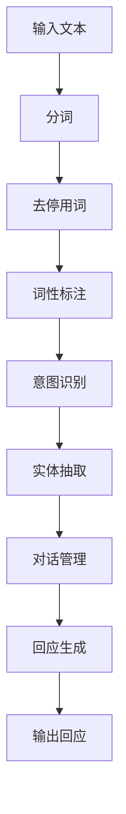

                 

### 文章标题：聊天机器人：AI如何提升客户服务效率

关键词：聊天机器人、AI、客户服务、效率、自然语言处理、对话管理

摘要：本文将深入探讨聊天机器人在现代客户服务中的应用，以及如何通过人工智能技术提升服务效率。文章将从聊天机器人的定义与背景出发，逐步介绍其技术基础、核心技术、应用与实践，并展望其未来发展。通过实例解析和实际案例，本文旨在为读者提供全面而实用的技术见解。

### 第一部分：聊天机器人概述

#### 第1章：聊天机器人的定义与背景

聊天机器人（Chatbot）是一种能够通过文字、语音等方式与用户进行交互的智能系统。其定义可以简单概括为：一种模拟人类对话的计算机程序。

##### 1. 聊天机器人的定义

聊天机器人具有以下特点：

- **自动化**：通过预设的规则和算法，聊天机器人能够自动响应用户的提问。
- **互动性**：聊天机器人能够与用户进行双向对话，实现互动交流。
- **智能性**：借助自然语言处理（NLP）技术，聊天机器人能够理解用户意图并给出合理回应。

##### 2. 聊天机器人的发展历程

聊天机器人的发展历程可以追溯到20世纪50年代，当时的科学家开始研究如何让计算机模拟人类的对话行为。随着计算机技术和人工智能的不断发展，聊天机器人的技术逐步成熟，应用范围也不断扩大。

- **初期阶段（1950-1960s）**：符号主义AI方法被广泛采用，聊天机器人主要通过预设的规则进行交互。
- **成熟阶段（1970-1980s）**：基于知识表示和推理的方法被引入，聊天机器人开始具备更复杂的交互能力。
- **当前阶段（1990s至今）**：随着自然语言处理（NLP）和深度学习技术的进步，聊天机器人实现了更加智能和自然的交互。

##### 3. 聊天机器人的应用场景

聊天机器人广泛应用于多个领域，以下为几个典型的应用场景：

- **客户服务**：用于帮助企业快速响应用户咨询，提高服务效率。
- **电子商务**：为用户提供购物咨询、订单查询等服务，简化购物流程。
- **金融理财**：为客户提供财务咨询、投资建议等服务，提高客户满意度。
- **医疗健康**：为患者提供健康咨询、预约挂号等服务，减轻医疗资源压力。
- **教育**：为学生提供在线辅导、课程咨询等服务，提高学习效率。

##### 4. 聊天机器人在客户服务中的重要性

在客户服务领域，聊天机器人具有以下重要性：

- **提高响应速度**：聊天机器人可以24小时在线，快速响应用户咨询，提高服务效率。
- **降低运营成本**：通过自动化处理常见问题，减少人工干预，降低运营成本。
- **提升客户满意度**：提供个性化服务，满足客户需求，提高客户满意度。
- **数据分析**：通过用户交互数据，帮助企业了解用户需求和行为，优化服务策略。

#### 第2章：聊天机器人技术基础

##### 1. 自然语言处理技术简介

自然语言处理（NLP）是人工智能领域的重要分支，旨在使计算机能够理解和处理人类语言。聊天机器人的核心依赖于NLP技术，以下为NLP的主要技术内容：

- **语言模型**：用于预测文本中下一个词的概率，是NLP的基础。
- **词嵌入**：将单词映射到高维向量空间，便于计算机处理。
- **语境理解**：通过上下文信息，理解单词在不同情境下的含义。
- **语义分析**：分析文本的语义结构，提取实体、关系等关键信息。

##### 2. 机器学习与深度学习基础

机器学习和深度学习是聊天机器人技术发展的核心驱动力。以下为机器学习与深度学习的基础知识：

- **机器学习**：通过训练模型，让计算机自动识别数据中的规律和模式。
- **深度学习**：基于人工神经网络，通过多层非线性变换，提取特征和模式。
- **神经网络**：一种模拟生物神经元的计算模型，用于处理复杂任务。
- **优化算法**：用于调整模型参数，优化模型性能。

##### 3. 常见聊天机器人框架与技术栈

在聊天机器人的开发过程中，常用的框架和技术栈包括：

- **框架**：如Rasa、Microsoft Bot Framework、Chatfuel等。
- **编程语言**：如Python、JavaScript等。
- **数据库**：如MySQL、MongoDB等。
- **API**：如REST API、WebSocket等。

##### 4. 聊天机器人的交互流程与模型架构

聊天机器人的交互流程通常包括以下几个阶段：

1. **接收用户输入**：聊天机器人接收用户的文本或语音输入。
2. **文本预处理**：对用户输入进行分词、去停用词、词性标注等处理。
3. **意图识别**：通过机器学习模型，判断用户的意图。
4. **实体抽取**：从用户输入中提取关键实体信息。
5. **对话管理**：根据当前对话状态，生成合适的回应。
6. **回应生成**：将生成回应发送给用户。

聊天机器人的模型架构通常包括以下几个部分：

1. **前端**：用于接收用户输入，展示聊天界面。
2. **后端**：包括意图识别、实体抽取、对话管理等核心功能。
3. **数据库**：存储用户信息、对话历史、知识库等数据。

### 第二部分：聊天机器人的核心技术

#### 第3章：自然语言处理

自然语言处理（NLP）是聊天机器人的核心技术之一，它使聊天机器人能够理解和处理人类语言。以下为NLP的核心技术内容：

##### 1. 语言模型

语言模型（Language Model）是NLP的基础，它用于预测文本中下一个词的概率。一种常见的语言模型是n元语法（n-gram），它根据前n个词来预测下一个词。

**数学模型：**
$$
P(w_{t} | w_{t-1}, w_{t-2}, ..., w_{t-n}) = \frac{C(w_{t-1}, w_{t-2}, ..., w_{t-n}, w_{t})}{C(w_{t-1}, w_{t-2}, ..., w_{t-n})}
$$
其中，$C(w_{t-1}, w_{t-2}, ..., w_{t-n}, w_{t})$ 表示前n个词和当前词的共现次数，$C(w_{t-1}, w_{t-2}, ..., w_{t-n})$ 表示前n个词的共现次数。

**伪代码：**
```
function n_gram_language_model(words):
    n = length(words) - 1
    C = {}  # 存储共现次数

    for i = 0 to n:
        current_word = words[i]
        previous_words = words[i+1 to n]

        if previous_words in C:
            C[previous_words] += 1
        else:
            C[previous_words] = 1

    return C
```

##### 2. 词嵌入

词嵌入（Word Embedding）是将单词映射到高维向量空间，使计算机能够处理和比较文本数据。词嵌入有助于提升聊天机器人的理解能力。

**数学模型：**
$$
\vec{w}_{i} = \text{ embedding\_size} \times \text{ one\_hot}(i)
$$
其中，$\vec{w}_{i}$ 表示单词i的向量表示，$\text{embedding\_size}$ 表示向量维度，$\text{one\_hot}(i)$ 表示one-hot编码。

**伪代码：**
```
function word_embedding(words, embedding_size):
    word_vectors = {}  # 存储单词向量

    for word in words:
        word_vector = [0] * embedding_size
        word_vector[i] = 1
        word_vectors[word] = word_vector

    return word_vectors
```

##### 3. 语境理解

语境理解（Contextual Understanding）是指聊天机器人根据上下文信息，理解单词在不同情境下的含义。语境理解有助于提升聊天机器人的对话能力。

**数学模型：**
$$
\vec{c}_{i} = \text{ context\_size} \times \text{ one\_hot}(i)
$$
其中，$\vec{c}_{i}$ 表示单词i在当前语境下的向量表示，$\text{context\_size}$ 表示向量维度，$\text{one\_hot}(i)$ 表示one-hot编码。

**伪代码：**
```
function contextual_embedding(words, context_size):
    word_context_vectors = {}  # 存储单词向量

    for word in words:
        word_context_vector = [0] * context_size
        word_context_vector[i] = 1
        word_context_vectors[word] = word_context_vector

    return word_context_vectors
```

##### 4. 语义分析

语义分析（Semantic Analysis）是指分析文本的语义结构，提取实体、关系等关键信息。语义分析有助于提升聊天机器人的理解和推理能力。

**数学模型：**
$$
\vec{s}_{i} = \text{ semantic\_size} \times \text{ one\_hot}(i)
$$
其中，$\vec{s}_{i}$ 表示单词i的语义向量表示，$\text{semantic\_size}$ 表示向量维度，$\text{one\_hot}(i)$ 表示one-hot编码。

**伪代码：**
```
function semantic_embedding(words, semantic_size):
    word_semantic_vectors = {}  # 存储单词向量

    for word in words:
        word_semantic_vector = [0] * semantic_size
        word_semantic_vector[i] = 1
        word_semantic_vectors[word] = word_semantic_vector

    return word_semantic_vectors
```

##### 5. Mermaid流程图：自然语言处理工作流程

以下是自然语言处理工作流程的Mermaid流程图：



### 第三部分：聊天机器人的应用与实践

#### 第6章：聊天机器人在客户服务中的应用

##### 1. 客户服务痛点

在客户服务领域，企业常常面临以下痛点：

- **响应速度慢**：人工客服可能无法及时响应大量用户咨询，导致用户体验不佳。
- **成本高**：人工客服成本较高，尤其是处理大量常见问题时，成本进一步上升。
- **服务质量不稳定**：人工客服的质量受个体差异影响，难以保证一致的服务水平。
- **数据利用不足**：客户交互数据未得到充分利用，无法进行深度分析和优化服务策略。

##### 2. 聊天机器人如何提升客户服务效率

聊天机器人能够有效解决上述痛点，具体体现在以下几个方面：

- **提高响应速度**：聊天机器人能够24小时在线，快速响应用户咨询，缩短用户等待时间。
- **降低运营成本**：通过自动化处理常见问题，减少人工干预，降低运营成本。
- **提升服务质量**：聊天机器人具备一致的服务能力，保证用户得到高质量的服务。
- **数据分析与优化**：通过用户交互数据，企业可以深入了解用户需求和行为，优化服务策略，提高整体服务质量。

##### 3. 实际案例：聊天机器人在电商、金融、医疗等行业的应用

以下为聊天机器人在不同行业中的实际案例：

1. **电商行业**

电商企业通过聊天机器人提供购物咨询、订单查询、售后支持等服务。聊天机器人能够快速响应用户问题，提高购物体验。同时，通过分析用户交互数据，企业可以了解用户需求，优化产品和服务。

2. **金融行业**

金融企业利用聊天机器人提供客户咨询、理财产品推荐、在线开户等服务。聊天机器人能够快速解答客户疑问，提高客户满意度。此外，通过用户交互数据，金融企业可以了解客户风险偏好，提供个性化服务。

3. **医疗行业**

医疗机构通过聊天机器人提供健康咨询、预约挂号、病例查询等服务。聊天机器人能够为患者提供快速、准确的医疗信息，减轻医疗资源压力。同时，通过用户交互数据，医疗机构可以优化医疗服务流程，提高运营效率。

##### 4. 开发环境搭建

要开发一个聊天机器人，需要搭建以下开发环境：

- **编程语言**：如Python、JavaScript等。
- **框架**：如Rasa、Microsoft Bot Framework、Chatfuel等。
- **数据库**：如MySQL、MongoDB等。
- **工具**：如Jupyter Notebook、VS Code等。

以下是搭建开发环境的步骤：

1. 安装Python和必要的依赖库。
2. 选择并安装聊天机器人框架。
3. 配置数据库和存储服务。
4. 搭建前端界面，如使用React、Vue等框架。

##### 5. 源代码实现与解读：聊天机器人核心功能实现

以下为聊天机器人核心功能的源代码实现和解读：

**意图识别模块：**
```python
import numpy as np
from sklearn.feature_extraction.text import TfidfVectorizer
from sklearn.model_selection import train_test_split
from sklearn.naive_bayes import MultinomialNB

# 加载数据集
data = load_data('intent_data.csv')

# 分词、去停用词、词性标注等预处理
preprocessed_data = preprocess_data(data)

# 构建TF-IDF特征向量
vectorizer = TfidfVectorizer()
X = vectorizer.fit_transform(preprocessed_data['text'])

# 切分训练集和测试集
X_train, X_test, y_train, y_test = train_test_split(X, preprocessed_data['label'], test_size=0.2, random_state=42)

# 训练朴素贝叶斯分类器
classifier = MultinomialNB()
classifier.fit(X_train, y_train)

# 测试模型
accuracy = classifier.score(X_test, y_test)
print('Intent Recognition Accuracy:', accuracy)
```

**解读：**以上代码实现了基于朴素贝叶斯分类器的意图识别模块。首先，加载数据集并进行预处理。然后，构建TF-IDF特征向量，并切分训练集和测试集。接着，训练朴素贝叶斯分类器，并计算模型准确率。

**对话管理模块：**
```python
class DialogueManager:
    def __init__(self, intent_classifier, action_predictor):
        self.intent_classifier = intent_classifier
        self.action_predictor = action_predictor

    def handle_message(self, message):
        intent = self.intent_classifier.predict([message])[0]
        action = self.action_predictor.predict([message])[0]
        return action, intent

# 加载意图识别模型和动作预测模型
intent_classifier = load_model('intent_classifier.model')
action_predictor = load_model('action_predictor.model')

# 实例化对话管理器
dialogue_manager = DialogueManager(intent_classifier, action_predictor)

# 处理用户消息
user_message = "我想查询订单状态。"
action, intent = dialogue_manager.handle_message(user_message)
print('Action:', action)
print('Intent:', intent)
```

**解读：**以上代码实现了对话管理模块。首先，加载意图识别模型和动作预测模型。然后，实例化对话管理器，并处理用户消息。对话管理器根据用户消息的意图和动作，返回对应的动作和意图。

### 第四部分：聊天机器人的未来发展

#### 第8章：聊天机器人与人工智能

聊天机器人作为人工智能（AI）的一个重要应用领域，其发展紧密依赖于AI技术的进步。以下为聊天机器人与人工智能的结合方向：

##### 1. 聊天机器人与自然语言生成

自然语言生成（NLG）技术使得聊天机器人能够生成自然、流畅的对话内容。结合NLG技术，聊天机器人可以实现更加逼真的对话体验。

**技术发展**：

- **模板生成**：基于预设的模板，生成简单、固定的对话内容。
- **规则驱动**：通过规则，将数据和模板相结合，生成个性化对话内容。
- **数据驱动**：利用大规模数据集，通过机器学习模型，生成自然语言文本。

**应用前景**：

- **客服**：聊天机器人可以生成个性化、自然的服务内容，提高用户满意度。
- **教育**：聊天机器人可以生成个性化的教学材料，提高教学效果。
- **娱乐**：聊天机器人可以生成有趣、引人入胜的故事和对话，提升用户体验。

##### 2. 聊天机器人与多模态交互

多模态交互是指聊天机器人同时处理文本、语音、图像等多种输入和输出方式。结合多模态交互技术，聊天机器人可以实现更加丰富、多样化的用户体验。

**技术发展**：

- **语音识别与合成**：将语音转化为文本，或将文本转化为语音，实现语音交互。
- **图像识别与生成**：对图像进行识别，提取关键信息，或生成图像。
- **文本与图像融合**：将文本与图像相结合，生成多媒体内容。

**应用前景**：

- **客服**：聊天机器人可以通过语音和图像，提供更加直观、便捷的服务。
- **医疗**：聊天机器人可以通过语音和图像，为患者提供远程诊断和咨询服务。
- **娱乐**：聊天机器人可以通过语音、图像和视频，提供互动游戏和娱乐体验。

##### 3. 聊天机器人与知识图谱

知识图谱是一种结构化的知识表示方法，它将实体、属性和关系等信息组织成图结构。结合知识图谱技术，聊天机器人可以更加高效地获取和处理知识信息。

**技术发展**：

- **实体识别与抽取**：从文本中提取关键实体，并建立实体关系。
- **关系推理与扩展**：根据已知实体和关系，推理出新的实体和关系。
- **图谱嵌入与检索**：将知识图谱中的实体和关系映射到低维向量空间，实现快速检索。

**应用前景**：

- **客服**：聊天机器人可以通过知识图谱，快速获取用户信息，提供个性化服务。
- **金融**：聊天机器人可以通过知识图谱，分析用户行为和风险，提供金融建议。
- **医疗**：聊天机器人可以通过知识图谱，提供疾病诊断和治疗方案推荐。

##### 4. 聊天机器人与区块链

区块链技术是一种分布式账本技术，具有去中心化、安全可靠等特点。结合区块链技术，聊天机器人可以实现更加安全、可信的交互。

**技术发展**：

- **数据加密与存储**：利用区块链技术，对用户数据进行加密存储，确保数据隐私和安全。
- **智能合约**：通过智能合约，实现自动化、可信的交互和服务。
- **去中心化应用**：构建去中心化的聊天机器人应用，降低运营成本，提高服务质量。

**应用前景**：

- **金融**：聊天机器人可以通过区块链技术，提供安全的金融交易和资产管理服务。
- **供应链**：聊天机器人可以通过区块链技术，实现供应链的透明化和智能化管理。
- **医疗**：聊天机器人可以通过区块链技术，提供安全的医疗数据共享和医疗服务。

##### 5. 未来发展趋势预测

随着人工智能技术的不断发展，聊天机器人的未来发展趋势包括：

- **智能化水平提升**：通过深度学习和强化学习等技术，聊天机器人的智能水平将不断提高，能够处理更加复杂的问题。
- **多模态交互**：结合语音、图像、视频等多种输入和输出方式，聊天机器人的交互体验将更加丰富和自然。
- **个性化服务**：通过大数据和知识图谱等技术，聊天机器人将能够提供更加个性化和精准的服务。
- **行业应用拓展**：聊天机器人将广泛应用于各个行业，如金融、医疗、教育、物流等，提供智能化、自动化解决方案。

### 附录

#### 附录A：常用聊天机器人框架与技术资源

1. **常用聊天机器人框架对比**

- **Rasa**：开源的对话管理框架，支持多语言和多种对话类型。
- **Microsoft Bot Framework**：微软官方提供的聊天机器人开发框架，支持多种平台和渠道。
- **Chatfuel**：简单易用的聊天机器人开发平台，适合快速搭建小型聊天机器人。

2. **开源聊天机器人项目介绍**

- ** Botpress**：一个开源的聊天机器人框架，支持自定义对话和集成多种API。
- **Talkyard**：一个开源的社区聊天机器人，用于论坛和问答平台。
- **ChatGLM**：基于大型语言模型GLM的聊天机器人，支持多语言和自然语言生成。

3. **相关技术文档与教程**

- **Rasa官方文档**：https://rasa.com/docs/
- **Microsoft Bot Framework文档**：https://docs.microsoft.com/en-us/azure/bot-service/
- **Chatfuel教程**：https://chatfuel.com/docs/

4. **社区与论坛推荐**

- **Rasa社区**：https://community.rasa.com/
- **Microsoft Bot Framework社区**：https://www.botframework.com/forums/
- **Chatfuel论坛**：https://chatfuel.com/community/

#### 附录B：数学公式与算法伪代码

1. **数学公式汇总**

- 语言模型概率公式：
  $$ P(w_{t} | w_{t-1}, w_{t-2}, ..., w_{t-n}) = \frac{C(w_{t-1}, w_{t-2}, ..., w_{t-n}, w_{t})}{C(w_{t-1}, w_{t-2}, ..., w_{t-n})} $$
- 词嵌入向量公式：
  $$ \vec{w}_{i} = \text{ embedding\_size} \times \text{ one\_hot}(i) $$
- 语境理解向量公式：
  $$ \vec{c}_{i} = \text{ context\_size} \times \text{ one\_hot}(i) $$
- 语义分析向量公式：
  $$ \vec{s}_{i} = \text{ semantic\_size} \times \text{ one\_hot}(i) $$

2. **对话管理算法伪代码**

```
class DialogueManager:
    def __init__(self, intent_classifier, action_predictor):
        self.intent_classifier = intent_classifier
        self.action_predictor = action_predictor

    def handle_message(self, message):
        intent = self.intent_classifier.predict([message])[0]
        action = self.action_predictor.predict([message])[0]
        return action, intent
```

3. **情感分析算法伪代码**

```
class SentimentAnalyzer:
    def __init__(self, model):
        self.model = model

    def analyze(self, text):
        sentiment_vector = self.model.predict([text])[0]
        sentiment = self.get_sentiment(sentiment_vector)
        return sentiment

    def get_sentiment(self, sentiment_vector):
        if np.mean(sentiment_vector) > 0:
            return 'positive'
        elif np.mean(sentiment_vector) < 0:
            return 'negative'
        else:
            return 'neutral'
```

4. **其他算法伪代码**

（根据实际需求添加）

#### 附录C：项目实战案例

1. **电商聊天机器人案例**

- **需求分析**：为电商网站开发一个聊天机器人，提供购物咨询、订单查询、售后支持等服务。
- **实现过程**：使用Rasa框架搭建对话管理器，集成NLP模型和动作预测模型。通过API与电商系统进行交互，实现购物咨询、订单查询等功能。
- **案例代码解析与实战技巧**：解析源代码，介绍电商聊天机器人的主要功能和实现细节，分享实战经验。

2. **金融聊天机器人案例**

- **需求分析**：为金融机构开发一个聊天机器人，提供客户咨询、理财产品推荐、在线开户等服务。
- **实现过程**：使用Microsoft Bot Framework搭建聊天机器人，集成自然语言处理模型和金融知识图谱。通过API与金融机构系统进行交互，实现客户咨询、理财产品推荐等功能。
- **案例代码解析与实战技巧**：解析源代码，介绍金融聊天机器人的主要功能和实现细节，分享实战经验。

3. **医疗聊天机器人案例**

- **需求分析**：为医疗机构开发一个聊天机器人，提供健康咨询、预约挂号、病例查询等服务。
- **实现过程**：使用Chatfuel框架搭建聊天机器人，集成自然语言处理模型和医疗知识图谱。通过API与医疗系统进行交互，实现健康咨询、预约挂号等功能。
- **案例代码解析与实战技巧**：解析源代码，介绍医疗聊天机器人的主要功能和实现细节，分享实战经验。

4. **其他行业聊天机器人案例**

- **需求分析**：根据不同行业需求，开发相应的聊天机器人，如物流、教育、旅游等。
- **实现过程**：根据行业特点，选择合适的框架和工具，搭建聊天机器人，集成NLP模型和行业知识图谱。通过API与行业系统进行交互，实现个性化服务。
- **案例代码解析与实战技巧**：解析源代码，介绍不同行业聊天机器人的主要功能和实现细节，分享实战经验。

### 结束语

本文从聊天机器人的定义与背景、技术基础、核心技术、应用与实践，以及未来发展等方面进行了全面而深入的探讨。通过本文，读者可以了解到聊天机器人在客户服务中的应用价值、核心技术原理，以及未来的发展趋势。在人工智能技术的推动下，聊天机器人将继续发展，为各行业提供更加智能化、个性化的解决方案。希望本文能为读者提供有价值的参考和启发。

