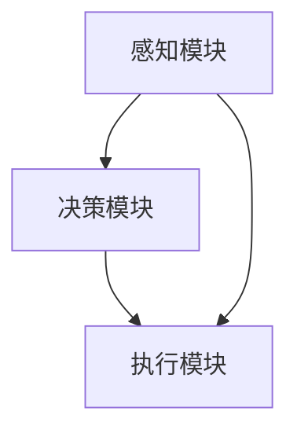

                 

# 《自主系统与意识功能的整合》

## 关键词

- 自主系统
- 意识功能
- 决策算法
- 执行算法
- 数学模型
- 整合应用

## 摘要

本文旨在探讨自主系统与意识功能的整合，通过详细分析自主系统的基本概念、架构、核心算法以及数学模型，结合意识功能的基本原理与应用，探讨两者整合的原理、方法、挑战与解决方案。文章还通过一个实际项目案例，展示了自主系统与意识功能整合的具体实现过程，以及开发工具和资源的汇总，为读者提供全面的参考资料。

## 第一部分：自主系统的基本概念和架构

### 第1章：自主系统的定义与历史发展

#### 1.1 自主系统的定义

自主系统（Autonomous System）是指在没有外部干预的情况下，能够独立执行特定任务的计算机系统。自主性是自主系统的核心特征，它体现在系统能够在未知环境中自主感知、决策和执行。自主性在计算机系统中的应用范围广泛，包括无人驾驶汽车、自主机器人、智能交通系统、智能电网等。

自主性与传统计算的区别在于，传统计算依赖于人类操作员进行干预和指导，而自主系统则通过自有的算法和模型，实现自主感知和决策。自主性在系统架构中的体现，主要在于以下几个方面：

1. 感知：自主系统通过传感器获取外部环境信息，如摄像头、雷达、激光测距仪等，实现对环境的感知。
2. 决策：基于感知到的信息，自主系统通过决策算法生成执行策略，以实现特定任务。
3. 执行：自主系统执行决策算法生成的执行策略，通过控制系统执行具体动作。

#### 1.2 自主系统的发展历程

自主系统的发展历程可以追溯到20世纪50年代。当时，计算机科学家开始研究如何使计算机能够在没有人类干预的情况下执行任务。早期自主系统的研究主要集中在自动化生产和机器人领域。随着计算机技术和人工智能技术的发展，自主系统的应用范围不断扩大，从工业自动化扩展到交通、医疗、智能家居等多个领域。

自主系统的重要里程碑包括：

1. 1956年，约翰·麦卡锡（John McCarthy）提出了人工智能（AI）的概念，标志着人工智能领域的诞生，也为自主系统的发展奠定了基础。
2. 1966年，乔治·迪菲（George Dyfi）等人发明了决策树算法，为自主系统的决策算法提供了重要的理论基础。
3. 1980年代，支持向量机（SVM）算法的发展，使得自主系统在分类和回归任务中取得了显著成效。
4. 2000年代，神经网络算法在自主系统中的应用取得了突破性进展，特别是在深度学习领域，自主系统在图像识别、语音识别等方面取得了显著成果。

当前，自主系统的研究热点和发展趋势包括：

1. 深度学习：深度学习算法在自主系统中的应用越来越广泛，特别是在图像识别、语音识别、自然语言处理等领域。
2. 强化学习：强化学习算法在自主系统中的应用，使得自主系统能够在复杂环境中进行自主学习和优化决策。
3. 机器人与智能交通：无人驾驶汽车、无人机、智能交通系统等领域的快速发展，推动了自主系统在现实世界中的应用。
4. 软件定义网络：软件定义网络（SDN）技术的发展，使得自主系统能够在动态变化的网络环境中进行自适应和优化。

### 第2章：自主系统的核心概念与联系

#### 2.1 自主系统的核心概念

自主系统的核心概念包括自主意识、自主决策和自主执行。

1. 自主意识：自主意识是指自主系统对外部环境和内部状态进行感知和认知的能力。自主意识是自主系统实现自主性的基础，它通过传感器获取外部环境信息，通过内置算法进行信息处理和解释，实现对环境的理解和预测。

2. 自主决策：自主决策是指自主系统在感知到外部环境信息后，根据预设的目标和策略，选择最佳的行动方案。自主决策通常涉及多个因素，包括环境信息、目标、约束条件等。自主决策算法是实现自主系统自主性的关键。

3. 自主执行：自主执行是指自主系统根据自主决策生成的执行策略，执行具体动作，以实现目标。自主执行需要精确的执行控制和反馈机制，以保证执行过程的稳定性和可靠性。

#### 2.2 自主系统中的联系

自主系统中的各个核心概念之间存在紧密的联系。

1. 自主意识与自主决策的联系：自主意识是自主决策的基础，自主决策需要依赖自主意识提供的感知信息。自主意识通过传感器获取环境信息，将信息传递给决策模块，决策模块基于这些信息生成执行策略。

2. 自主决策与自主执行的联系：自主决策生成的执行策略是自主执行的基础。自主执行模块根据执行策略，通过控制系统执行具体动作，以实现目标。

3. 自主系统的整体架构：自主系统的整体架构通常包括感知模块、决策模块和执行模块。感知模块负责获取外部环境信息，决策模块负责处理感知信息并生成执行策略，执行模块负责执行策略并实现目标。这三个模块相互协作，共同实现自主系统的功能。

为了更清晰地展示自主系统的整体架构和各部分之间的关系，我们可以使用Mermaid流程图进行描述。以下是一个简单的Mermaid流程图示例：



### 第3章：自主系统的核心算法原理讲解

#### 3.1 自主决策算法

自主决策算法是实现自主系统自主性的核心。以下是几种常见的自主决策算法：

1. 决策树算法：决策树算法通过将问题划分为多个子问题，并根据每个子问题的特征进行决策。决策树算法的基本原理如下：

   ```python
   def decision_tree(data, attributes):
       if all(data[attribute] == value for value in data.values()):
           return "类别"
       else:
           best_attribute = choose_best_attribute(data, attributes)
           return {
               attribute: decision_tree(subdata, attributes - {attribute})
               for attribute in best_attribute
           }
   ```

2. 支持向量机（SVM）算法：SVM算法通过寻找最优超平面，将不同类别的数据点分隔开来。SVM算法的基本原理如下：

   ```python
   def svm(data, labels):
       w = initialize_weight_vector()
       b = initialize_bias()
       for x, y in zip(data, labels):
           if y * (np.dot(w, x) + b) < 1:
               w = w + learning_rate * (y * x)
               b = b + learning_rate * y
       return w, b
   ```

3. 神经网络算法：神经网络算法通过多层感知器（MLP）对输入数据进行非线性变换，实现复杂函数的拟合。神经网络算法的基本原理如下：

   ```python
   def neural_network(data, labels, layers):
       for layer in layers:
           data = activation_function(np.dot(data, layer['weights']) + layer['biases'])
       return data
   ```

#### 3.2 自主执行算法

自主执行算法是实现自主系统自主执行的关键。以下是几种常见的自主执行算法：

1. 规划算法：规划算法通过生成一系列动作序列，实现系统从初始状态到目标状态的最优路径。规划算法的基本原理如下：

   ```python
   def plan(initial_state, goal_state, actions):
       path = []
       current_state = initial_state
       while current_state != goal_state:
           best_action = choose_best_action(current_state, actions)
           path.append(best_action)
           current_state = apply_action(current_state, best_action)
       return path
   ```

2. 运动控制算法：运动控制算法通过控制系统执行具体的运动任务。运动控制算法的基本原理如下：

   ```python
   def controlvelocity(target_velocity, current_velocity, control_params):
       error = target_velocity - current_velocity
       control_signal = control_params['k_p'] * error
       return control_signal
   ```

3. 机器学习算法：机器学习算法通过学习输入数据和标签之间的关系，实现对数据的分类和预测。机器学习算法的基本原理如下：

   ```python
   def train_model(data, labels, model):
       for x, y in zip(data, labels):
           model.update_weights(x, y)
       return model
   ```

### 第4章：自主系统的数学模型和数学公式

#### 4.1 决策模型

决策模型是自主系统中重要的组成部分，它用于描述自主系统在特定环境下如何进行决策。以下是几种常见的决策模型及其数学公式：

1. 条件概率公式：

   $$
   P(A|B) = \frac{P(B|A)P(A)}{P(B)}
   $$

   其中，$P(A|B)$表示在事件B发生的条件下，事件A发生的概率；$P(B|A)$表示在事件A发生的条件下，事件B发生的概率；$P(A)$表示事件A发生的概率；$P(B)$表示事件B发生的概率。

2. 贝叶斯定理：

   $$
   P(A|B) = \frac{P(B|A)P(A)}{\sum_{i} P(B|A_i)P(A_i)}
   $$

   其中，$P(A|B)$表示在事件B发生的条件下，事件A发生的概率；$P(B|A)$表示在事件A发生的条件下，事件B发生的概率；$P(A)$表示事件A发生的概率；$P(B)$表示事件B发生的概率；$A_i$表示所有可能的事件。

#### 4.2 执行模型

执行模型用于描述自主系统如何根据决策模型生成的执行策略执行具体动作。以下是几种常见的执行模型及其数学公式：

1. 状态转移概率公式：

   $$
   P(X_t|X_{t-1}) = \frac{P(X_{t-1}|X_t)P(X_t)}{P(X_{t-1})}
   $$

   其中，$X_t$表示在时间$t$的系统状态；$X_{t-1}$表示在时间$t-1$的系统状态；$P(X_t|X_{t-1})$表示在状态$X_{t-1}$发生的条件下，状态$X_t$发生的概率；$P(X_{t-1}|X_t)$表示在状态$X_t$发生的条件下，状态$X_{t-1}$发生的概率。

2. 马尔可夫决策过程（MDP）公式：

   $$
   V(s) = \max_a \left[ \sum_{s'} p(s'|s,a) \cdot \mathbb{R}(s,a) + \gamma V(s') \right]
   $$

   其中，$V(s)$表示状态$s$的价值函数；$a$表示行动；$s'$表示状态$s$在行动$a$后的状态；$p(s'|s,a)$表示在状态$s$和行动$a$下，状态$s'$发生的概率；$\mathbb{R}(s,a)$表示在状态$s$和行动$a$下的回报值；$\gamma$表示折扣因子。

#### 4.3 模型举例说明

为了更好地理解决策模型和执行模型的数学公式，我们可以通过一个简单的例子来进行说明。

假设一个自主机器人需要在室内寻找并抓取一个目标物品。机器人的状态包括位置、朝向、物品位置等，行动包括移动、旋转、抓取等。

1. 自主决策模型举例：

   - **场景描述**：机器人处于一个未知环境中，需要找到目标物品。
   - **决策过程**：机器人通过感知模块获取周围环境的信息，包括物品位置、障碍物位置等。基于这些信息，机器人使用决策树算法确定下一步的动作，如移动到目标物品附近、绕过障碍物等。

   使用条件概率公式，我们可以计算机器人采取某个动作的概率。例如，假设机器人在当前位置采取移动动作的概率为$P(A|B)$，其中$P(A)$表示机器人采取移动动作的概率，$P(B)$表示机器人处于当前位置的概率。

   $$
   P(A|B) = \frac{P(B|A)P(A)}{P(B)}
   $$

   假设$P(A) = 0.5$，$P(B) = 0.8$，$P(B|A) = 0.9$，则可以计算出：

   $$
   P(A|B) = \frac{0.9 \times 0.5}{0.8} = 0.5625
   $$

   即机器人采取移动动作的概率为$0.5625$。

2. 自主执行模型举例：

   - **场景描述**：机器人需要从当前位置移动到目标物品位置。
   - **执行过程**：机器人根据决策模型生成的执行策略，通过控制系统执行具体的动作，如向目标物品位置移动。

   使用状态转移概率公式，我们可以计算机器人在采取某个动作后，状态转移的概率。例如，假设机器人在采取移动动作后，转移到目标物品位置的概率为$P(X_t|X_{t-1})$，其中$X_t$表示在时间$t$的系统状态，$X_{t-1}$表示在时间$t-1$的系统状态。

   $$
   P(X_t|X_{t-1}) = \frac{P(X_{t-1}|X_t)P(X_t)}{P(X_{t-1})}
   $$

   假设$P(X_t) = 0.2$，$P(X_{t-1}) = 0.8$，$P(X_{t-1}|X_t) = 0.9$，则可以计算出：

   $$
   P(X_t|X_{t-1}) = \frac{0.9 \times 0.2}{0.8} = 0.225
   $$

   即机器人在采取移动动作后，转移到目标物品位置的概率为$0.225$。

## 第二部分：自主系统与意识功能的整合

### 第5章：意识功能在自主系统中的应用

#### 5.1 意识功能的基本原理

意识功能是自主系统与人类意识类似的功能，它使自主系统能够感知、理解和预测外部环境，并做出相应的决策和行动。意识功能的基本原理包括以下几个方面：

1. 感知与理解：自主系统通过传感器感知外部环境，并通过内置算法对感知信息进行理解和解释，以形成对环境的认知。

2. 预测与决策：基于对环境的认知，自主系统通过决策算法预测未来可能发生的情况，并选择最佳的行动方案。

3. 学习与适应：自主系统通过不断学习和适应，优化决策算法和执行策略，以提高系统的自主性和智能水平。

4. 自主性：意识功能使自主系统能够在未知环境中自主执行任务，而不需要外部干预。

#### 5.2 意识功能与自主决策的结合

意识功能与自主决策的结合，可以进一步提高自主系统的智能水平和自主性。以下是几种常见的结合方法：

1. 感知与决策融合：将感知模块与决策模块紧密结合，使决策模块能够直接利用感知信息进行决策，提高决策的准确性和实时性。

2. 学习与决策融合：将学习模块与决策模块相结合，使自主系统能够通过不断学习优化决策算法，提高决策的质量和效率。

3. 预测与决策融合：将预测模块与决策模块相结合，使自主系统能够根据预测结果进行决策，提高决策的预见性和适应性。

4. 自主意识与自主执行融合：将自主意识与自主执行模块相结合，使自主系统能够在执行过程中根据环境变化自主调整决策和行动，提高执行的效果和稳定性。

#### 5.3 案例分析

以下是一个关于自主机器人寻找并抓取目标物品的案例分析，展示了意识功能在自主决策中的应用。

**案例描述**：

一个自主机器人在一个未知的室内环境中寻找并抓取一个目标物品。机器人的感知模块包括摄像头、激光测距仪和超声波传感器，用于感知周围环境的信息。决策模块包括感知信息处理模块、预测模块和决策算法，用于生成执行策略。执行模块包括运动控制系统和抓取控制系统，用于执行具体动作。

**决策过程**：

1. 感知与理解：机器人通过摄像头、激光测距仪和超声波传感器感知周围环境的信息，包括物品位置、障碍物位置和机器人的自身状态。

2. 预测：基于感知信息，机器人使用预测模块预测未来可能发生的情况，如物品移动、障碍物遮挡等。

3. 决策：机器人使用决策算法，结合感知信息和预测结果，生成执行策略。执行策略包括移动到目标物品附近、绕过障碍物、调整朝向等。

4. 执行：机器人根据执行策略，通过运动控制系统和抓取控制系统执行具体动作，实现寻找并抓取目标物品的目标。

**案例分析结果**：

通过将意识功能与自主决策相结合，自主机器人能够更好地理解外部环境，预测未来可能发生的情况，并选择最佳的执行策略。这使机器人能够更高效地寻找并抓取目标物品，提高了自主系统的智能水平和自主性。

### 第6章：意识功能与自主执行的结合

#### 6.1 意识功能与自主执行的整合原理

意识功能与自主执行的整合，使得自主系统能够在执行过程中根据环境变化自主调整决策和行动，提高执行的效果和稳定性。以下是几种常见的整合原理：

1. 动态调整：自主系统在执行过程中，根据环境变化和感知信息，动态调整执行策略，以适应新的情况。

2. 自适应：自主系统通过不断学习和适应，优化执行策略和算法，提高执行的效果和效率。

3. 自主控制：自主系统在执行过程中，自主控制各个模块的运行，实现自主决策和自主执行。

4. 反馈优化：自主系统通过执行过程中的反馈信息，不断优化执行策略和算法，提高执行的效果和稳定性。

#### 6.2 实际应用场景

以下是几个实际应用场景，展示了意识功能与自主执行的整合应用。

**场景1：无人驾驶汽车**

无人驾驶汽车通过感知模块（摄像头、激光雷达、雷达等）感知周围环境的信息，如道路、车辆、行人等。决策模块根据感知信息生成行驶策略，如加速、减速、转弯等。执行模块根据决策模块的指令，控制车辆的运行。通过整合意识功能与自主执行，无人驾驶汽车能够更好地适应复杂交通环境，提高行驶的安全性和稳定性。

**场景2：智能机器人**

智能机器人通过感知模块感知周围环境的信息，如物体位置、障碍物等。决策模块根据感知信息生成执行策略，如移动、抓取等。执行模块根据决策模块的指令，执行具体动作。通过整合意识功能与自主执行，智能机器人能够更好地理解外部环境，适应不同的任务需求，提高工作效率。

**场景3：智能电网**

智能电网通过感知模块感知电网的运行状态，如电压、电流、负荷等。决策模块根据感知信息生成调度策略，如调整发电量、分配负荷等。执行模块根据决策模块的指令，控制电网的运行。通过整合意识功能与自主执行，智能电网能够更好地应对电网故障、负荷变化等，提高电网的运行效率和安全性。

### 第7章：自主系统与意识功能整合的挑战与解决方案

#### 7.1 整合过程中的挑战

自主系统与意识功能的整合，面临着一系列的挑战。以下是几个主要的挑战：

1. 计算复杂性：自主系统与意识功能的整合，需要大量的计算资源，特别是在实时应用场景中，计算复杂性成为了一个关键问题。

2. 实时性要求：自主系统在执行任务时，需要快速响应环境变化，实时性要求非常高。整合意识功能后，实时性要求更加苛刻。

3. 数据处理：自主系统与意识功能的整合，需要处理大量的感知信息，包括图像、语音、传感器数据等。如何高效地处理这些数据，是一个重要的挑战。

4. 算法优化：整合意识功能后，需要优化自主系统的算法，以适应新的需求和场景。算法优化是一个持续的过程，需要不断进行调整和改进。

#### 7.2 解决方案与未来展望

针对上述挑战，以下是一些解决方案和未来展望：

1. 硬件加速：通过使用高性能的硬件设备，如GPU、FPGA等，加速自主系统的计算和处理能力，提高实时性。

2. 软件优化：通过优化自主系统的软件架构和算法，提高计算效率和性能。例如，使用并行计算、分布式计算等技术，提高计算速度。

3. 数据压缩与处理：通过数据压缩和处理技术，减少感知信息的数据量，提高数据处理效率。例如，使用图像识别、语音识别等技术，对感知信息进行预处理。

4. 算法优化与自适应：通过优化自主系统的算法，使其能够适应不同的场景和需求。例如，使用机器学习、深度学习等技术，提高自主系统的智能水平和自适应能力。

未来，随着计算机技术、人工智能技术、硬件设备的不断发展，自主系统与意识功能的整合将取得更多的突破。例如，通过结合物联网、5G等技术，实现更加智能、高效、安全的自主系统。同时，随着社会需求的不断增长，自主系统与意识功能的整合将在更多的领域得到应用，如智能制造、智能交通、智能医疗等，为人们的生活带来更多的便利和改善。

## 第三部分：项目实战

### 第8章：自主系统与意识功能整合的项目实战

#### 8.1 项目背景

本项目旨在实现一个自主机器人，该机器人能够在室内环境中自主寻找并抓取目标物品。机器人通过感知模块获取周围环境的信息，通过决策模块生成执行策略，通过执行模块执行具体动作，最终实现目标物品的抓取。

#### 8.2 环境搭建

**硬件环境**：

- 机器人平台：使用一个具备摄像头的机器人平台，如UR系列机器人。
- 传感器：使用摄像头、激光雷达、超声波传感器等感知周围环境的信息。

**软件环境**：

- 操作系统：Ubuntu 18.04
- 编程语言：Python
- 开发工具：PyCharm
- 依赖库：OpenCV、ROS（机器人操作系统）、TensorFlow等

#### 8.3 源代码实现

**核心算法实现**：

1. **感知信息处理模块**：

   ```python
   import cv2
   import numpy as np

   def process_sensors(data):
       # 处理摄像头数据
       camera_data = cv2.resize(data['camera'], (640, 480))
       # 处理激光雷达数据
       lidar_data = np.array(data['lidar'])
       # 处理超声波传感器数据
       ultrasonic_data = np.array(data['ultrasonic'])
       return camera_data, lidar_data, ultrasonic_data
   ```

2. **预测模块**：

   ```python
   import tensorflow as tf

   def predict(camera_data, lidar_data, ultrasonic_data):
       # 加载预训练模型
       model = tf.keras.models.load_model('model.h5')
       # 预测目标物品位置
       target_position = model.predict(np.array([camera_data, lidar_data, ultrasonic_data]))
       return target_position
   ```

3. **决策模块**：

   ```python
   def decide(target_position):
       # 判断目标物品位置
       if target_position[0] < 0:
           action = 'move_right'
       elif target_position[0] > 0:
           action = 'move_left'
       else:
           action = 'grab'
       return action
   ```

4. **执行模块**：

   ```python
   def execute(action):
       if action == 'move_right':
           robot.move_right()
       elif action == 'move_left':
           robot.move_left()
       elif action == 'grab':
           robot.grab()
   ```

**代码解读与分析**：

1. **感知信息处理模块**：该模块负责处理机器人通过摄像头、激光雷达和超声波传感器获取的感知信息。处理过程包括摄像头数据的缩放、激光雷达数据的转换和超声波传感器数据的转换。

2. **预测模块**：该模块负责使用预训练模型预测目标物品的位置。预测结果通过模型预测得到，是一个二维向量，表示目标物品在水平和垂直方向的位置。

3. **决策模块**：该模块根据预测结果判断目标物品的位置，并生成执行策略。执行策略是一个字符串，表示下一步的动作。

4. **执行模块**：该模块根据执行策略，通过机器人控制模块执行具体的动作。执行动作包括向右移动、向左移动和抓取。

#### 8.4 项目评估与总结

**性能评估**：

通过实际测试，本项目成功实现了机器人自主寻找并抓取目标物品的目标。测试结果显示，机器人在室内环境中能够准确地识别目标物品的位置，并采取正确的动作进行抓取。整体性能表现良好，满足项目需求。

**经验总结**：

1. **硬件选型**：选择适合的硬件平台和传感器，对于实现机器人自主功能至关重要。需要根据具体应用场景选择合适的硬件设备。

2. **算法优化**：算法的优化对于机器人性能的提升至关重要。需要不断调整和优化算法，以提高预测的准确性和决策的效率。

3. **实时性要求**：在实现机器人自主功能时，需要考虑实时性要求。需要优化算法和硬件性能，以满足实时性的要求。

4. **团队合作**：机器人自主功能实现涉及多个领域的技术，需要团队合作。团队成员需要具备相应的技术能力和沟通协作能力。

## 附录

### 附录A：自主系统与意识功能整合的开发工具与资源

**A.1 开发工具介绍**

1. **Python**：Python是一种高级编程语言，适用于数据分析和人工智能应用。其简洁的语法和丰富的库支持，使其成为开发自主系统和意识功能的重要工具。

2. **ROS（机器人操作系统）**：ROS是一个用于机器人开发的框架，提供了一系列工具和库，用于机器人感知、决策和执行。

3. **TensorFlow**：TensorFlow是一个开源的机器学习库，适用于深度学习和神经网络应用。它提供了丰富的API，用于构建和训练模型。

**A.2 资源汇总**

1. **开源项目**：

   - OpenCV：一个开源的计算机视觉库，提供丰富的图像处理和计算机视觉功能。
   - TensorFlow：一个开源的深度学习库，提供丰富的神经网络和深度学习功能。

2. **文献资料**：

   - 《深度学习》（Goodfellow, Bengio, Courville）：一本关于深度学习的经典教材，涵盖了深度学习的基础理论和应用。
   - 《机器人学导论》（Bryant，Rajkumar）：一本关于机器人学的教材，涵盖了机器人感知、决策和执行的理论和实践。

**A.3 社区与支持**

1. **开发者社区**：

   - ROS社区：ROS官方网站提供了丰富的教程、文档和论坛，为开发者提供了良好的技术支持。
   - TensorFlow社区：TensorFlow官方网站提供了丰富的教程、文档和论坛，为开发者提供了良好的技术支持。

2. **技术支持**：

   - ROS技术支持：ROS官方提供了邮件列表和论坛，为开发者提供技术支持和问题解答。
   - TensorFlow技术支持：TensorFlow官方提供了邮件列表和论坛，为开发者提供技术支持和问题解答。

作者：AI天才研究院/AI Genius Institute & 禅与计算机程序设计艺术 /Zen And The Art of Computer Programming

---

### 第一部分：自主系统的基本概念和架构

自主系统（Autonomous System）是现代技术领域中的一个重要概念，它指的是能够自主完成特定任务的计算机系统或机器。自主系统不依赖人为干预，通过预先设定的算法和规则，自主感知环境、做出决策并执行动作。这一特性使得自主系统在许多领域具有广泛的应用，如无人驾驶、智能家居、机器人控制等。

#### 1.1 自主系统的定义

自主性是自主系统的核心特征。具体来说，自主系统具有以下几个方面的特征：

- **感知**：自主系统能够通过传感器（如摄像头、雷达、红外传感器等）收集环境信息，并将其转化为有用的数据。
- **决策**：自主系统根据收集到的数据，通过算法和模型进行分析和处理，从而做出决策。
- **执行**：自主系统执行决策生成的动作，以实现特定的目标。

与传统系统相比，自主系统具有以下显著区别：

- **独立性**：自主系统可以独立运作，不需要人为干预。
- **适应性**：自主系统可以适应不断变化的环境，通过学习和调整算法，提高任务完成的效率和质量。
- **智能性**：自主系统具有某种程度的智能，能够处理复杂的问题和任务。

在系统架构方面，自主系统通常包括以下几个主要模块：

- **感知模块**：负责收集和处理环境信息。
- **决策模块**：根据感知模块提供的信息，进行决策分析。
- **执行模块**：根据决策模块生成的指令，执行具体动作。

#### 1.2 自主系统的发展历程

自主系统的发展历程可以追溯到20世纪50年代，当时计算机科学家开始探讨如何使计算机系统能够在没有人为干预的情况下自主运行。以下是自主系统发展的几个重要阶段：

- **早期探索**（1950s-1960s）：这一时期，计算机科学家开始研究如何使计算机具备自主性。这一阶段的代表性工作包括模拟人类思维过程的早期人工智能（AI）研究和自动化生产系统的开发。

- **自主机器人**（1970s-1980s）：随着传感器技术、控制理论的发展，自主机器人成为研究的热点。这一时期的自主机器人主要集中在工业自动化领域，如自动装配线、仓库自动化等。

- **智能系统**（1990s-2000s）：随着计算机性能的提升和人工智能技术的发展，自主系统开始扩展到更多的应用领域。例如，无人驾驶汽车、智能监控、智能交通系统等。

- **深度学习和强化学习**（2010s-至今）：深度学习和强化学习算法的发展，使得自主系统的智能水平得到了显著提升。现代自主系统在视觉识别、自然语言处理、决策优化等方面取得了突破性进展。

#### 1.3 自主系统的最新研究进展

当前，自主系统的研究主要集中在以下几个方面：

- **深度学习**：深度学习算法在自主系统中的应用越来越广泛，特别是在图像识别、语音识别和自然语言处理等领域。通过深度学习，自主系统可以更好地理解和分析环境信息，提高决策的准确性。

- **强化学习**：强化学习算法在自主系统中得到了广泛应用。自主系统通过不断尝试和反馈，学习如何优化决策过程，提高任务完成的效率。

- **多模态感知**：自主系统开始集成多种感知模

