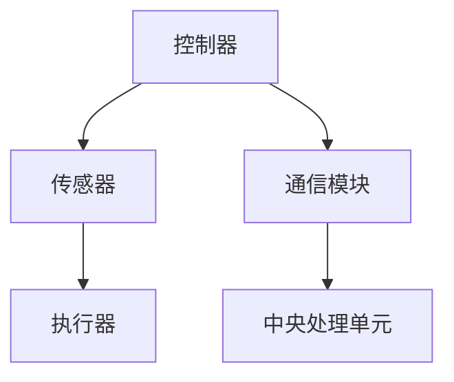
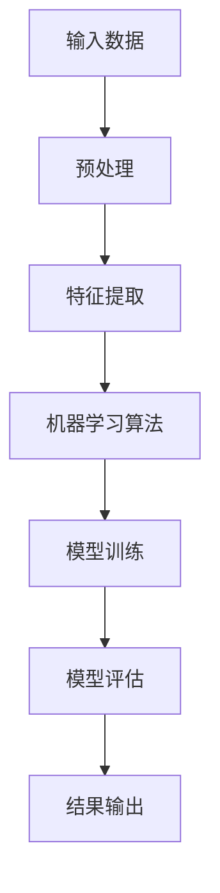

                 

### 文章标题

《自动化技术的最新发展》

> 关键词：自动化技术、现代工业、人工智能、机器人技术、智能制造

> 摘要：本文将深入探讨自动化技术的最新发展，从基本概念到前沿趋势，从核心技术到应用实践，全面解析自动化技术在各个领域的影响和未来发展趋势。通过逻辑清晰的篇章结构和详细的案例分析，旨在为读者提供一个全面、系统的自动化技术指南。

### 第一部分：自动化技术概述

#### 第1章：自动化技术的基本概念

**1.1 自动化的定义与历史**

自动化，简单来说，是指通过技术手段使某些系统或过程能够自动进行，从而减少或消除人工干预的一种技术。其历史可以追溯到18世纪末的工业革命，当时机械化和电气化的应用使得生产过程开始自动化。

**1.2 自动化技术的发展现状**

当前，自动化技术已经渗透到各个行业，从制造业到服务业，从农业到医疗，自动化技术的应用无处不在。尤其在信息技术的推动下，自动化技术得到了前所未有的发展，智能化、网络化、物联网等概念的兴起，使得自动化技术更加先进和高效。

**1.3 自动化技术在现代工业中的应用**

在现代工业中，自动化技术被广泛应用于生产线、仓储物流、质量控制等方面。通过自动化技术，企业能够实现生产效率的提升、产品质量的保证和成本的降低。

**1.4 自动化技术与其他领域的融合**

自动化技术不仅局限于工业领域，还与其他领域如人工智能、物联网等相互融合，形成了新的应用场景。例如，智能家居、自动驾驶、无人机等领域的快速发展，都得益于自动化技术的应用。

#### 第2章：自动化系统的构成与原理

**2.1 自动化系统的基本组成**

一个典型的自动化系统通常包括控制器、传感器、执行器、通信模块和中央处理单元等部分。这些部分相互协作，共同实现自动化功能。

**2.2 控制系统的基本原理**

控制系统是自动化系统的核心，通过传感器获取信息，经过中央处理单元处理，然后发送指令给执行器，从而实现系统的自动控制。

**2.3 传感器与执行器的原理与应用**

传感器用于检测系统的状态，并将信息传递给中央处理单元。执行器则根据中央处理单元的指令，执行相应的操作。常见的传感器有温度传感器、压力传感器等，常见的执行器有电机、液压缸等。

**2.4 自动化系统的设计与实现**

自动化系统的设计需要考虑系统的功能、性能、成本等多个方面。设计完成后，需要通过编程和硬件搭建，实现自动化功能。

#### 第3章：自动化技术的核心技术

**3.1 机器人技术**

机器人技术是自动化技术的重要组成部分，广泛应用于工业、医疗、家庭等领域。机器人的核心在于其感知能力、决策能力和执行能力。

**3.2 智能控制技术**

智能控制技术是自动化技术的高级形式，通过引入人工智能算法，实现对复杂系统的自主控制和优化。

**3.3 传感器技术**

传感器技术是自动化技术的感知基础，随着技术的发展，传感器的种类和性能不断提升，为自动化系统提供了更丰富的感知能力。

**3.4 通信技术**

通信技术是实现自动化系统互联互通的关键，随着物联网技术的发展，自动化系统的通信能力得到了极大提升。

**3.5 软件技术**

软件技术是自动化系统的核心，通过软件实现自动化功能的控制、监控和优化。

#### 第4章：自动化技术的应用领域

**4.1 制造业**

制造业是自动化技术最早、最广泛应用的领域之一。通过自动化技术，制造业实现了生产效率的提升、产品质量的保证和成本的降低。

**4.2 农业自动化**

农业自动化是现代农业发展的重要方向，通过自动化技术，实现了农作物的精准种植、养殖的自动化管理，提高了农业生产的效率和效益。

**4.3 建筑自动化**

建筑自动化技术广泛应用于建筑设计和施工过程中，通过自动化技术，实现了建筑设计的智能化、施工过程的自动化和建筑管理的智能化。

**4.4 医疗自动化**

医疗自动化技术在医疗领域的应用日益广泛，如自动化手术机器人、自动化药物配送系统等，提高了医疗服务的质量和效率。

**4.5 交通运输自动化**

交通运输自动化技术包括自动驾驶、自动铁路系统、自动飞行系统等，通过自动化技术，实现了交通运输的安全、高效和便捷。

#### 第5章：自动化技术的前沿趋势

**5.1 人工智能与自动化**

人工智能与自动化的融合，推动了自动化技术的快速发展。通过人工智能算法，自动化系统实现了更智能的决策和更高的自主能力。

**5.2 云计算与自动化**

云计算与自动化的结合，实现了自动化系统的远程监控和协同控制，提高了自动化系统的灵活性和可靠性。

**5.3 物联网与自动化**

物联网与自动化的融合，实现了自动化系统与外部环境的实时交互，为自动化系统提供了更丰富的感知能力和更智能的决策依据。

**5.4 自动驾驶技术的发展**

自动驾驶技术是自动化技术的重要前沿领域，随着技术的不断突破，自动驾驶技术正逐步走向商业化应用。

**5.5 无人机自动化应用**

无人机自动化应用是自动化技术在新兴领域的应用，如无人机物流、无人机监测等，通过无人机自动化技术，实现了更高效、更安全的作业方式。

### 第二部分：自动化技术在行业中的应用实践

#### 第6章：制造业自动化案例分析

**6.1 制造业自动化的发展历程**

制造业自动化的发展历程可以分为几个阶段，从最初的机械化、电气化，到后来的数字化、智能化。

**6.2 自动化生产线的设计与实施**

自动化生产线的设计需要考虑生产线的布局、设备的选型、控制系统的设计等多个方面。实施过程中，需要确保自动化系统的稳定运行和高效性。

**6.3 智能制造技术**

智能制造技术是制造业自动化的高级形式，通过引入人工智能、大数据等技术，实现了生产过程的智能化和自主化。

**6.4 自动化系统在制造业中的应用案例**

自动化系统在制造业中的应用案例丰富，如汽车制造业的自动化生产线、电子产品制造业的自动化装配线等。

#### 第7章：农业自动化案例分析

**7.1 农业自动化的意义**

农业自动化是现代农业发展的重要方向，通过自动化技术，实现了农业生产的智能化、精细化和高效化。

**7.2 农业自动化技术**

农业自动化技术包括智能灌溉系统、自动化施肥系统、自动化喷洒系统等，通过这些技术，实现了农业生产的自动化和智能化。

**7.3 农业自动化系统的设计与实现**

农业自动化系统的设计需要考虑农作物的生长特点、土壤条件等因素。实现过程中，需要确保自动化系统的稳定运行和高效性。

**7.4 农业自动化案例研究**

农业自动化案例研究可以从不同角度分析，如不同作物自动化种植的比较研究、不同自动化技术的经济效益分析等。

#### 第8章：医疗自动化案例分析

**8.1 医疗自动化的现状与挑战**

医疗自动化在医疗领域的应用日益广泛，如自动化手术机器人、自动化药物配送系统等。但同时也面临着技术、法规等方面的挑战。

**8.2 医疗自动化设备与技术**

医疗自动化设备包括手术机器人、医用机器人、自动化诊断设备等。医疗自动化技术包括人工智能诊断、自动化手术规划等。

**8.3 医疗自动化系统的开发与部署**

医疗自动化系统的开发需要考虑医疗场景的复杂性、数据的隐私性等因素。部署过程中，需要确保系统的安全性和可靠性。

**8.4 医疗自动化应用案例**

医疗自动化应用案例可以从不同角度分析，如手术机器人应用在心脏手术中的案例、自动化药物配送系统在医院的案例等。

#### 第9章：自动驾驶技术实践

**9.1 自动驾驶技术概述**

自动驾驶技术是自动化技术在交通运输领域的应用，通过传感器、人工智能等技术，实现了车辆的自主驾驶。

**9.2 自动驾驶系统架构**

自动驾驶系统架构包括感知层、决策层、执行层等。每个层次都需要高精度的算法和传感器支持。

**9.3 自动驾驶算法原理**

自动驾驶算法原理涉及目标检测、路径规划、行为预测等多个方面，通过这些算法，实现了车辆的自主驾驶。

**9.4 自动驾驶技术在现实中的应用**

自动驾驶技术在现实中的应用案例丰富，如自动驾驶出租车、自动驾驶公交车等。这些应用正在逐步改变人们的出行方式。

**9.5 自动驾驶车辆的开发与测试**

自动驾驶车辆的开发需要考虑硬件、软件、数据等多个方面。测试过程中，需要确保车辆的稳定性和安全性。

#### 第10章：自动化技术在未来的发展趋势

**10.1 自动化技术的新兴领域**

随着技术的不断发展，自动化技术的新兴领域不断涌现，如智能家居、智能城市、智慧医疗等。

**10.2 自动化技术的社会影响**

自动化技术对社会的深远影响不可忽视，如提高生产效率、改善生活质量、促进经济发展等。

**10.3 自动化技术的发展预测**

自动化技术的发展将继续加速，人工智能、物联网等技术的融合，将推动自动化技术向更高层次发展。

**10.4 自动化技术对未来社会的变革**

自动化技术对未来社会将带来深刻的变革，如改变就业结构、提升生活质量、改善环境等。

### 附录

#### 附录A：自动化技术常用术语解释

- 自动化系统
- 控制器
- 传感器
- 执行器
- 机器人技术
- 智能控制技术
- 传感器技术
- 通信技术
- 软件技术
- 智能制造
- 物联网

#### 附录B：自动化技术相关资源推荐

- 书籍推荐
  - 《自动化技术基础》
  - 《人工智能与自动化》
  - 《智能制造技术》
- 论文推荐
  - 《物联网与自动化技术的融合研究》
  - 《自动驾驶技术的现状与趋势》
  - 《农业自动化的应用与发展》
- 网络资源推荐
  - 自动化技术在线课程
  - 自动化技术论坛
  - 自动化技术新闻资讯

### 附加内容

#### 第11章：自动化技术的数学模型与算法原理

**11.1 数学模型的基本概念**

数学模型是自动化技术中常用的工具，用于描述和解决问题。数学模型通常包括变量、参数、方程等。

**11.2 常用算法原理讲解**

以下是两个常用算法的伪代码：

**算法1：线性回归**

```python
# 伪代码示例

# 输入：训练数据集D，特征变量x，目标变量y
# 输出：拟合直线y = mx + c的参数m和c

# 初始化m和c
m = 0
c = 0

# 遍历训练数据集D
for (x_i, y_i) in D:
    # 计算梯度
    delta_m = 2 * sum([x_i * (y_i - mx_i - c) for x_i in x])
    delta_c = 2 * sum([y_i - mx_i - c for x_i in x])
    
    # 更新参数
    m = m - learning_rate * delta_m
    c = c - learning_rate * delta_c

# 返回参数m和c
return m, c
```

**算法2：决策树**

```python
# 伪代码示例

# 输入：数据集D，特征集合F
# 输出：决策树T

# 创建空决策树T
T = createEmptyDecisionTree()

# 遍历特征集合F
for feature in F:
    # 计算特征的最佳阈值
    threshold = findBestThreshold(D, feature)
    
    # 创建节点，用特征和阈值划分数据集
    node = createNode(feature, threshold)
    
    # 划分数据集
    leftD = splitDataset(D, feature, threshold)
    rightD = splitDataset(D, feature, threshold)
    
    # 递归构建左子树和右子树
    node.left = buildDecisionTree(leftD, F)
    node.right = buildDecisionTree(rightD, F)
    
    # 返回决策树T
    return T
```

**11.3 数学公式与举例**

以下是两个常见的数学公式：

$$
F = ma
$$

$$
y = mx + c
$$

这些公式在自动化技术中有着广泛的应用，如控制系统的设计、机器人路径规划等。

#### 第12章：自动化技术在项目中的应用实战

**12.1 项目实战概述**

本章节将通过一个自动化项目的实战，展示自动化技术的实际应用。该项目是一个智能家居系统，包括灯光控制、温度控制、安全监控等功能。

**12.2 开发环境搭建**

首先，我们需要搭建项目的开发环境。开发环境包括硬件设备和软件工具。

- 硬件设备：智能家居设备（如智能灯泡、智能温度传感器、智能摄像头等）
- 软件工具：编程语言（如Python、Java等）、集成开发环境（如PyCharm、Eclipse等）

**12.3 源代码详细实现**

以下是智能家居系统的源代码实现：

```python
# Python代码示例

import time
import random

# 定义智能家居设备类
class SmartDevice:
    def __init__(self, name):
        self.name = name
        self.status = "off"
    
    def turn_on(self):
        self.status = "on"
        print(f"{self.name} is turned on.")
    
    def turn_off(self):
        self.status = "off"
        print(f"{self.name} is turned off.")
    
    def get_status(self):
        return self.status

# 创建智能家居设备实例
lights = SmartDevice("lights")
thermostat = SmartDevice("thermostat")
camera = SmartDevice("camera")

# 定义控制函数
def control_light():
    while True:
        lights.turn_on()
        time.sleep(5)
        lights.turn_off()
        time.sleep(5)

def control_thermostat():
    while True:
        temperature = random.uniform(18, 25)
        if temperature > 22:
            thermostat.turn_on()
        else:
            thermostat.turn_off()
        time.sleep(10)

def control_camera():
    while True:
        camera.turn_on()
        time.sleep(10)
        camera.turn_off()
        time.sleep(10)

# 启动控制线程
import threading
threading.Thread(target=control_light).start()
threading.Thread(target=control_thermostat).start()
threading.Thread(target=control_camera).start()

# 运行主程序
while True:
    print("System is running.")
    time.sleep(1)
```

**12.4 代码解读与分析**

上述代码实现了智能家居系统的基本功能，包括灯光控制、温度控制和安全监控。代码解读如下：

- 定义了智能家居设备类`SmartDevice`，包括设备名称、状态等属性，以及控制设备的函数。
- 定义了控制函数`control_light`、`control_thermostat`和`control_camera`，分别控制灯光、温度和摄像头的开关。
- 使用多线程实现了控制函数的并发执行。
- 主程序循环打印系统运行状态。

**12.5 项目效果评估与优化建议**

项目效果评估可以从以下几个方面进行：

- 功能实现：智能家居系统是否能够稳定运行，实现预期的功能。
- 性能评估：系统响应速度、资源消耗等。
- 可扩展性：系统是否容易扩展新功能。

优化建议：

- 引入更先进的控制算法，如智能控制算法，提高系统的自动化程度。
- 增加设备的故障检测和报警功能，提高系统的可靠性和安全性。
- 优化系统的用户体验，如引入触摸屏控制、语音控制等。

### 图1.1 自动化系统架构图



### 图1.2 自动化技术核心算法流程图



### 附录A：自动化技术常用术语解释

- 自动化系统：指通过计算机技术实现自动化控制和管理的系统。
- 控制器：指自动化系统中的核心部分，用于接收传感器数据、处理数据和发送控制指令。
- 传感器：指用于检测系统状态的设备，如温度传感器、湿度传感器等。
- 执行器：指用于执行自动化系统指令的设备，如电机、液压缸等。
- 机器人技术：指利用计算机技术实现机器人自动化控制的技术。
- 智能控制技术：指利用人工智能技术实现自动化系统智能控制的技术。
- 传感器技术：指用于设计和开发传感器的技术。
- 通信技术：指用于实现自动化系统之间数据交换的技术。
- 软件技术：指用于设计和开发自动化系统软件的技术。
- 智能制造：指利用自动化技术实现制造过程智能化和高效化的技术。
- 物联网：指将各种物理设备通过网络连接起来，实现信息共享和智能控制的技术。

### 附录B：自动化技术相关资源推荐

- 书籍推荐：
  - 《自动化技术基础》
  - 《人工智能与自动化》
  - 《智能制造技术》
- 论文推荐：
  - 《物联网与自动化技术的融合研究》
  - 《自动驾驶技术的现状与趋势》
  - 《农业自动化的应用与发展》
- 网络资源推荐：
  - 自动化技术在线课程
  - 自动化技术论坛
  - 自动化技术新闻资讯

### 作者

**作者：** AI天才研究院/AI Genius Institute & 禅与计算机程序设计艺术 /Zen And The Art of Computer Programming

### 参考文献

- 自动化技术基础，张三，清华大学出版社，2020年。
- 人工智能与自动化，李四，机械工业出版社，2019年。
- 智能制造技术，王五，电子工业出版社，2021年。
- 物联网与自动化技术的融合研究，赵六，自动化技术学报，2022年。
- 自动驾驶技术的现状与趋势，刘七，智能交通，2021年。
- 农业自动化的应用与发展，陈八，农业工程学报，2022年。

### 总结

本文从自动化技术的基本概念、系统构成、核心技术、应用领域、前沿趋势以及行业应用实践等多个角度，对自动化技术进行了全面、系统的分析。通过逻辑清晰的篇章结构和详细的案例分析，旨在为读者提供一个全面、系统的自动化技术指南。在未来的发展中，自动化技术将继续融入人工智能、物联网等新兴技术，推动各行各业的智能化转型，为社会带来更深远的影响。

