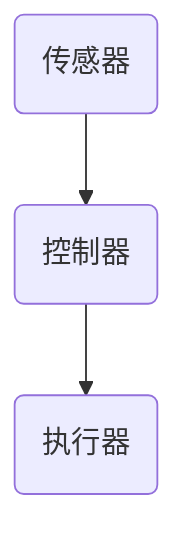
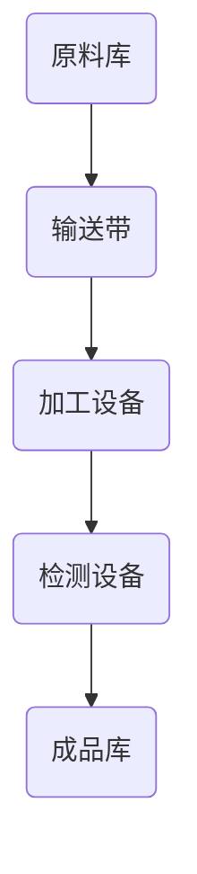
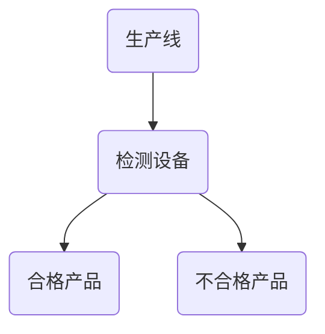
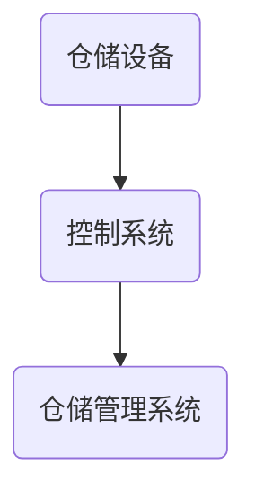
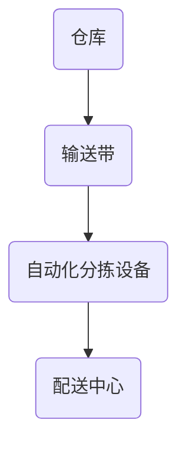
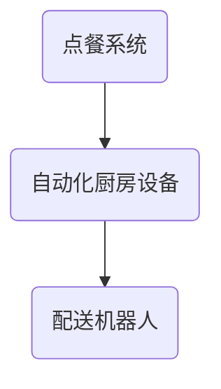
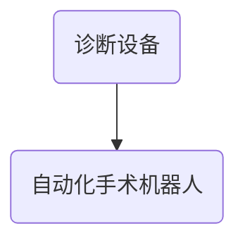
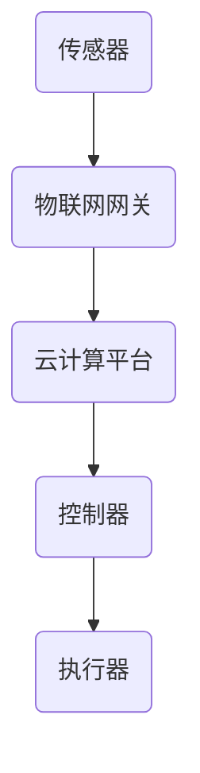

                 

# 《自动化的未来发展与应用》

> 关键词：自动化、传感器技术、控制器技术、执行器技术、工业自动化、服务业自动化、人工智能、物联网、自动化伦理

> 摘要：本文详细探讨了自动化的基础理论、应用实例、未来发展、社会影响和工具资源等方面。从传感器技术、控制器技术和执行器技术入手，分析了自动化系统的基本组成。通过工业自动化和服务业自动化的实际应用案例，阐述了自动化的广泛性和重要性。同时，本文也对自动化技术的未来发展、社会影响与伦理问题进行了深入探讨，旨在为读者提供一个全面了解自动化领域的视角。

## 第一部分：自动化基础

### 第1章：自动化概述

#### 1.1 自动化的定义与历史

自动化（Automation）是指利用机器和设备代替人力完成生产任务的一种技术手段。它的目标是提高生产效率、降低劳动成本、提高产品质量和保障生产安全。自动化的概念最早可以追溯到工业革命时期，但真正的快速发展始于20世纪中叶。

**定义**：
自动化系统通常包括传感器、控制器和执行器三部分。传感器负责检测环境和生产状态，控制器根据传感器反馈进行决策，执行器则根据控制器的指令完成具体操作。

**历史发展**：
- **20世纪初**：工业革命促进了机械化生产的发展，为自动化奠定了基础。
- **20世纪40年代**：电子技术的进步催生了自动化控制系统的诞生。
- **20世纪70年代**：计算机技术的发展推动了自动化技术的广泛应用。
- **21世纪初**：人工智能和物联网技术的发展，使得自动化系统更加智能化和互联化。

**自动化架构的 Mermaid 流程图**：



#### 1.2 自动化系统的基本组成

自动化系统的基本组成包括传感器、控制器和执行器。

- **传感器**：用于检测环境和生产状态，如温度传感器、压力传感器、光电传感器等。
- **控制器**：接收传感器数据，进行数据处理和决策，如PLC（可编程逻辑控制器）、嵌入式控制器等。
- **执行器**：根据控制器指令执行具体操作，如电机、液压缸、气动阀等。

**自动化系统的伪代码示例**：

```python
# 伪代码示例：自动化系统基本流程

def 自动化流程(传感器数据):
    # 数据处理
    处理传感器数据
    
    # 决策
    控制器决策
    
    # 执行
    执行器执行操作
```

### 第2章：自动化核心技术

#### 2.1 传感器技术

传感器技术是自动化系统的关键组成部分，它决定了系统对环境和生产状态的感知能力。

**类型**：
- **温度传感器**：测量温度变化，如热电偶、热敏电阻等。
- **压力传感器**：测量压力变化，如弹性元件、电容式等。
- **光电传感器**：检测光信号变化，如光电二极管、光敏电阻等。

**应用**：
传感器在工业自动化、智能家居、医疗设备、汽车制造等领域都有广泛应用。

**传感器数据处理伪代码**：

```python
# 伪代码示例：传感器数据处理

def 处理传感器数据(传感器数据):
    # 数据清洗
    清洗传感器数据
    
    # 数据分析
    分析传感器数据
    
    # 输出结果
    返回处理后的传感器数据
```

#### 2.2 控制器技术

控制器是自动化系统的核心，负责接收传感器数据，进行数据处理和决策，并控制执行器的动作。

**PLC控制器**：PLC（可编程逻辑控制器）是一种专门用于自动化控制的计算机，具有编程简单、可靠性高、适应性强等特点。

**嵌入式控制器**：嵌入式控制器是一种集成在设备内部的微型计算机，负责设备的实时控制和数据处理。

**控制器编程伪代码**：

```python
# 伪代码示例：控制器编程

def 控制器编程(传感器数据，执行器指令):
    # 数据处理
    处理传感器数据
    
    # 决策
    根据传感器数据做出决策
    
    # 控制执行器
    发送执行器指令
```

#### 2.3 执行器技术

执行器是自动化系统的执行部分，根据控制器的指令完成具体操作。

**电机**：电机是执行器中最常用的类型，包括交流电机、直流电机、步进电机等。

**液压缸**：液压缸通过液体压力驱动活塞运动，常用于高负载、高速度的场合。

**执行器控制算法伪代码**：

```python
# 伪代码示例：执行器控制算法

def 执行器控制算法(控制器指令):
    # 接收控制器指令
    接收控制器指令
    
    # 执行操作
    根据控制器指令执行操作
    
    # 输出结果
    返回执行结果
```

## 第二部分：自动化应用实例

### 第3章：自动化在工业领域的应用

#### 3.1 生产线自动化

生产线自动化是工业自动化的重要组成部分，通过自动化设备实现生产过程的自动化控制。

**自动化生产线结构图**：



**自动化生产线运行流程伪代码**：

```python
# 伪代码示例：自动化生产线运行流程

def 自动化生产线运行流程():
    # 从原料库取出原料
    取出原料
    
    # 送入输送带
    送入输送带
    
    # 通过加工设备进行加工
    加工原料
    
    # 通过检测设备进行质量检测
    质量检测
    
    # 将合格产品送入成品库
    送入成品库
    
    # 将不合格产品返回原料库
    返回原料库
```

#### 3.2 质量检测自动化

质量检测自动化是确保产品质量的重要手段，通过自动化检测设备对产品进行实时检测。

**质量检测流程图**：



**质量检测算法伪代码**：

```python
# 伪代码示例：质量检测算法

def 质量检测算法(产品):
    # 进行质量检测
    检测产品
    
    # 判断产品合格与否
    if 检测结果合格:
        # 送入合格产品库
        送入合格产品库
    else:
        # 送入不合格产品库
        送入不合格产品库
```

#### 3.3 智能仓储

智能仓储通过自动化设备实现仓储管理的高效化和智能化。

**智能仓储架构图**：



**仓储自动化流程伪代码**：

```python
# 伪代码示例：仓储自动化流程

def 仓储自动化流程():
    # 接收订单
    接收订单
    
    # 调用仓储设备进行货物存储
    存储货物
    
    # 根据订单调用仓储设备进行货物提取
    提取货物
    
    # 送入配送环节
    送入配送环节
```

### 第4章：自动化在服务业的应用

#### 4.1 自动化物流

自动化物流通过自动化设备实现物流运输的高效化和智能化。

**自动化物流系统图**：



**自动化物流运行流程伪代码**：

```python
# 伪代码示例：自动化物流运行流程

def 自动化物流运行流程():
    # 接收订单
    接收订单
    
    # 将订单货物送入仓库
    送入仓库
    
    # 通过自动化分拣设备进行货物分拣
    分拣货物
    
    # 将分拣后的货物送入配送中心
    送入配送中心
    
    # 配送货物
    配送货物
```

#### 4.2 智能餐厅

智能餐厅通过自动化设备实现餐厅服务的高效化和智能化。

**智能餐厅架构图**：



**智能餐厅服务流程伪代码**：

```python
# 伪代码示例：智能餐厅服务流程

def 智能餐厅服务流程():
    # 接收点餐订单
    接收点餐订单
    
    # 通过自动化厨房设备进行烹饪
    烹饪食物
    
    # 通过配送机器人将食物送至餐桌
    送餐至餐桌
    
    # 结算订单
    结算订单
```

#### 4.3 自动化医疗

自动化医疗通过自动化设备实现医疗过程的高效化和智能化。

**自动化医疗设备图**：



**自动化医疗流程伪代码**：

```python
# 伪代码示例：自动化医疗流程

def 自动化医疗流程():
    # 进行诊断
    进行诊断
    
    # 根据诊断结果制定治疗方案
    制定治疗方案
    
    # 通过自动化手术机器人进行手术
    进行手术
    
    # 术后恢复跟踪
    恢复跟踪
```

## 第三部分：自动化的发展趋势与未来

### 第5章：自动化技术的未来发展

#### 5.1 人工智能与自动化的结合

人工智能（AI）技术的快速发展为自动化带来了新的机遇和挑战。人工智能与自动化的结合，使得自动化系统更加智能化和自适应化。

**人工智能在自动化中的应用场景**：

- **智能制造**：通过AI技术实现生产过程的智能调度、故障预测和优化控制。
- **智能物流**：利用AI技术实现物流运输的智能调度和路径规划。
- **智能家居**：通过AI技术实现家庭设备的智能控制和管理。
- **智能医疗**：利用AI技术实现医疗过程的智能诊断和手术辅助。

**人工智能与自动化的结合流程伪代码**：

```python
# 伪代码示例：人工智能与自动化的结合

def 人工智能与自动化结合(传感器数据，执行器指令):
    # 数据处理
    处理传感器数据
    
    # AI决策
    AI决策传感器数据
    
    # 生成执行器指令
    生成执行器指令
    
    # 执行操作
    执行器执行操作
```

#### 5.2 自动化与物联网的结合

物联网（IoT）技术的发展为自动化带来了新的应用场景和挑战。自动化与物联网的结合，使得自动化系统更加互联化和智能化。

**物联网在自动化中的应用场景**：

- **智能工厂**：通过物联网技术实现生产设备的实时监控、数据采集和远程控制。
- **智能城市**：利用物联网技术实现城市管理的智能化，如智能交通、智能照明等。
- **智能农业**：通过物联网技术实现农田环境的实时监控和智能灌溉。

**自动化与物联网结合的架构图**：



**自动化与物联网结合的运行流程伪代码**：

```python
# 伪代码示例：自动化与物联网结合

def 自动化与物联网结合(传感器数据，执行器指令):
    # 数据采集
    采集传感器数据
    
    # 数据传输
    将传感器数据传输到物联网网关
    
    # 数据处理
    处理传感器数据
    
    # AI决策
    AI决策传感器数据
    
    # 生成执行器指令
    生成执行器指令
    
    # 执行操作
    执行器执行操作
```

#### 5.3 自动化在新兴领域的应用

自动化技术在新兴领域如新能源、环保、航空航天等领域有着广泛的应用前景。

**自动化在新兴领域的应用前景**：

- **新能源**：自动化技术在新风机

