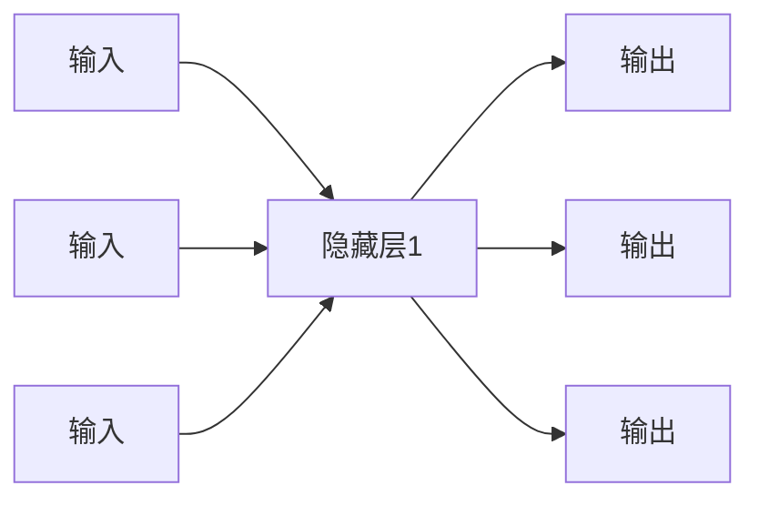
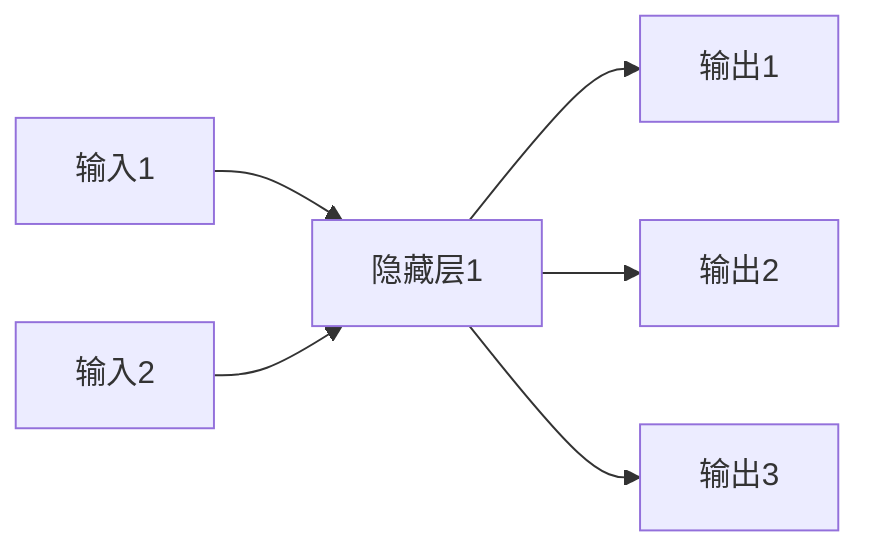
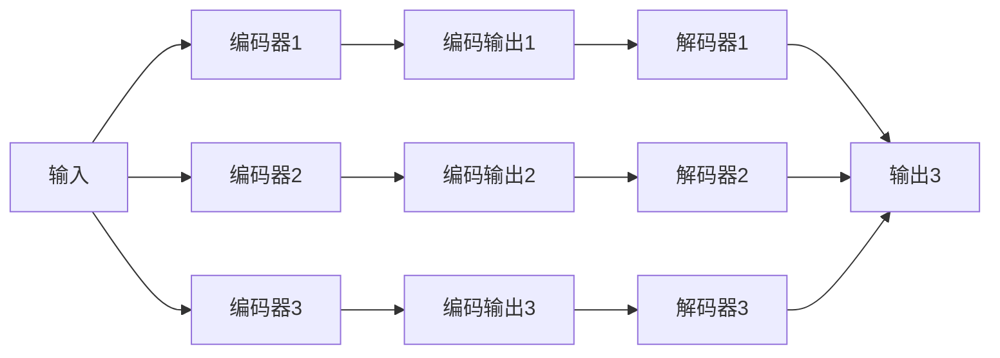
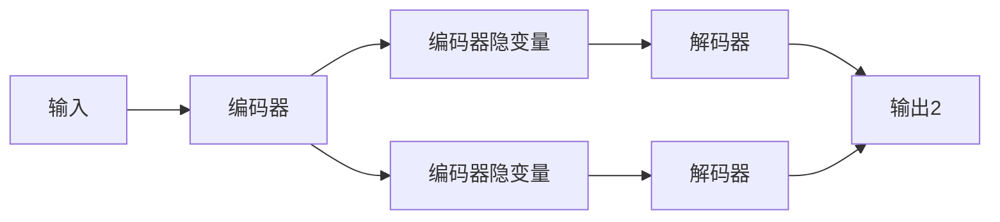
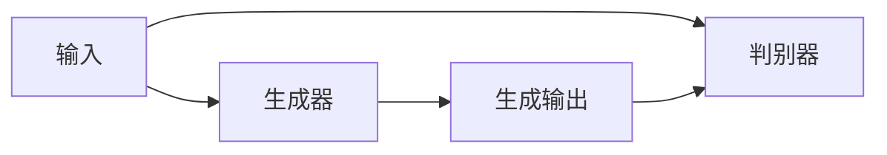

                 

### 自动编码器

#### 关键词：
机器学习，神经网络，深度学习，数据压缩，特征提取

#### 摘要：
自动编码器是一种神经网络模型，用于将输入数据编码成低维表示，并通过解码器重建原始数据。本文将详细探讨自动编码器的概念、结构、原理及其在机器学习中的应用。通过一步一步的分析推理，我们将深入了解自动编码器的工作机制，并探讨其在图像识别、自然语言处理和数据降维等领域的实际应用。

### 目录大纲

1. **自动编码器基础**
   1.1 自动编码器的定义与重要性
   1.2 自动编码器的基本结构与工作原理
   1.3 自动编码器与传统编码器的区别
   1.4 自动编码器的主要类型
   1.5 自动编码器在机器学习中的应用

2. **前向传播与反向传播**
   2.1 神经网络基础
   2.2 前向传播原理
   2.3 反向传播算法
   2.4 实例讲解：简单自动编码器的实现

3. **自动编码器的训练与优化**
   3.1 训练过程详解
   3.2 优化算法
   3.3 损失函数的选择
   3.4 实例讲解：复杂自动编码器的实现

4. **自动编码器的变体与拓展**
   4.1 阵列自动编码器
   4.2 变分自动编码器
   4.3 对抗性自动编码器
   4.4 自动编码器在特征提取与降维中的应用

5. **自动编码器在实际项目中的应用**
   5.1 图像识别中的应用
   5.2 自然语言处理中的应用
   5.3 数据分析中的应用
   5.4 实例讲解：构建一个自动编码器进行图像识别

6. **自动编码器的实战项目**
   6.1 项目背景与目标
   6.2 数据集选择与预处理
   6.3 模型设计与实现
   6.4 模型训练与验证
   6.5 项目总结与反思

7. **自动编码器的未来发展趋势**
   7.1 自动编码器在深度学习中的潜在作用
   7.2 自动编码器在工业界的应用前景
   7.3 自动编码器面临的挑战与解决方案
   7.4 自动编码器的未来研究方向

8. **附录**
   8.1 自动编码器开发工具与资源

### 第一部分: 自动编码器基础

### 1.1 自动编码器的定义与重要性

自动编码器（Autoencoder）是一种特殊的神经网络模型，它由编码器（Encoder）和解码器（Decoder）两部分组成。编码器的目的是将输入数据压缩成一个低维的表示，而解码器的目的是将这个低维表示重新构造回原始数据。这种模型在机器学习和深度学习领域有着广泛的应用，特别是在特征提取、降维和异常检测等方面。

自动编码器的核心思想是学习数据的内在结构，并通过这种结构来实现数据的压缩与重构。由于自动编码器能够自动提取数据中的关键特征，因此它在许多应用场景中都具有重要的价值。例如，在图像识别中，自动编码器可以用来提取图像的重要特征，从而简化后续的分类模型。在自然语言处理中，自动编码器可以用来提取文本的重要特征，从而用于情感分析或文本分类。在数据降维中，自动编码器可以将高维数据映射到低维空间，从而减少数据的存储空间和计算复杂度。

自动编码器的定义可以形式化为以下数学模型：

$$
\text{编码器：} x' = \phi(x) \\
\text{解码器：} x = \psi(x')
$$

其中，$x$ 表示原始输入数据，$x'$ 表示编码后的低维数据，$\phi$ 表示编码器函数，$\psi$ 表示解码器函数。

#### 自动编码器的重要性

1. **特征提取**：自动编码器能够自动提取输入数据的关键特征，这些特征对于后续的机器学习任务非常重要。
   
2. **数据压缩**：通过将数据映射到低维空间，自动编码器可以显著减少数据的存储空间和计算复杂度。
   
3. **异常检测**：自动编码器可以通过检测重建误差来识别异常数据。这为异常检测提供了一种有效的手段。

4. **模型简化**：自动编码器可以帮助简化后续的机器学习模型。通过提取关键特征，自动编码器可以减少模型的参数数量，从而降低过拟合的风险。

5. **数据重建**：自动编码器可以用于数据重建任务，如图像生成或文本生成。

### 1.2 自动编码器的基本结构与工作原理

自动编码器的基本结构如图所示：


在这个结构中，输入数据首先通过编码器压缩成低维表示，然后这个低维表示通过解码器被重构回原始数据。下面详细解释自动编码器的工作原理：

1. **编码器**：编码器的目的是将输入数据$x$映射到一个低维空间，这个低维空间通常被称为编码输出或编码特征。在训练过程中，编码器通过学习数据的内在结构来优化其参数。

2. **解码器**：解码器的目的是将编码输出重构回原始数据。在训练过程中，解码器也会通过学习优化其参数，以最小化重构误差。

3. **损失函数**：自动编码器的训练过程通常使用损失函数来衡量编码器和解码器的性能。最常用的损失函数是均方误差（MSE），它计算重构数据与原始数据之间的误差。

4. **反向传播**：在训练过程中，使用反向传播算法来计算损失函数关于编码器和解码器参数的梯度，并通过梯度下降算法来更新参数。

#### 工作原理

1. **前向传播**：在训练过程中，输入数据$x$首先通过编码器生成编码输出$x'$。然后，编码输出通过解码器被重构回数据$x''$。

2. **损失计算**：重构数据$x''$与原始数据$x$之间的误差通过损失函数来计算。

3. **反向传播**：使用反向传播算法计算编码器和解码器参数的梯度。

4. **参数更新**：使用梯度下降算法更新编码器和解码器的参数。

5. **迭代训练**：重复上述步骤，直到满足训练停止条件（如损失函数收敛或达到指定迭代次数）。

### 1.3 自动编码器与传统编码器的区别

传统编码器通常是基于固定映射关系的，而自动编码器是通过学习数据分布来建立动态的映射关系。具体来说，有以下几点区别：

1. **映射关系**：传统编码器是基于固定的映射关系，例如ASCII编码器将每个字符映射到一个特定的二进制序列。而自动编码器是通过学习数据分布来建立映射关系，它可以自动提取数据的特征。

2. **学习方式**：传统编码器不需要学习过程，而自动编码器需要通过大量的数据来学习数据的内在结构。

3. **灵活性**：自动编码器具有更高的灵活性，它可以处理不同类型的数据，并提取出有用的特征。而传统编码器通常针对特定类型的数据设计。

4. **复杂性**：自动编码器的复杂性通常比传统编码器高，因为它需要学习数据的分布和特征。

### 1.4 自动编码器的主要类型

自动编码器有多种类型，每种类型都有其特定的应用场景和优势。以下是几种常见的自动编码器类型：

1. **标准自动编码器**：这是最简单的自动编码器类型，它由一个编码器和一个解码器组成。编码器将输入数据映射到低维空间，解码器将低维空间映射回原始数据。

2. **阵列自动编码器**：阵列自动编码器可以处理多个输入数据，每个输入数据都有自己的编码器和解码器。这种类型在处理多通道数据（如彩色图像）时特别有用。

3. **变分自动编码器（VAE）**：变分自动编码器是一种基于概率生成模型的自动编码器，它可以生成新的数据样本。VAE通过最大化数据样本的概率分布来优化模型参数。

4. **对抗性自动编码器（GAN）**：对抗性自动编码器结合了生成对抗网络（GAN）的思想，由一个生成器（Decoder）和一个判别器（Discriminator）组成。生成器生成新的数据样本，判别器判断数据样本是真实还是生成的。

### 1.5 自动编码器在机器学习中的应用

自动编码器在机器学习中有许多应用，以下是几个常见的应用场景：

1. **特征提取**：自动编码器可以提取输入数据的关键特征，这些特征可以用于训练分类器或聚类算法。

2. **数据降维**：自动编码器可以将高维数据映射到低维空间，从而减少数据的存储空间和计算复杂度。

3. **异常检测**：自动编码器可以通过检测重建误差来识别异常数据。这在金融欺诈检测、网络入侵检测等领域非常有用。

4. **图像生成**：变分自动编码器（VAE）和对抗性自动编码器（GAN）可以生成与训练数据相似的新图像，这在艺术创作、游戏开发等领域非常有用。

5. **自然语言处理**：自动编码器可以提取文本数据的关键特征，这些特征可以用于文本分类、情感分析等任务。

### 总结

自动编码器是一种强大的神经网络模型，它在机器学习和深度学习领域有着广泛的应用。通过学习数据的内在结构，自动编码器可以提取关键特征、降低数据维度、进行异常检测和图像生成等。在接下来的章节中，我们将进一步探讨自动编码器的原理、实现和应用。

### 2.1 神经网络基础

神经网络（Neural Networks）是一种模拟人脑神经系统的计算模型，它由大量的神经元（节点）通过加权连接组成。每个神经元接收多个输入信号，通过非线性激活函数处理后输出一个值。神经网络通过不断调整权重和偏置，可以学习输入数据与输出数据之间的复杂映射关系。

#### 神经元的结构

一个简单的神经元可以表示为：

$$
y = \sum_{i=1}^{n} w_i x_i + b
$$

其中，$y$ 是神经元输出，$w_i$ 是输入 $x_i$ 的权重，$b$ 是偏置项。$n$ 是输入的数量。

#### 激活函数

激活函数是神经元中的一个关键组成部分，它用于引入非线性。常见的激活函数包括：

1. ** sigmoid 函数**：$f(x) = \frac{1}{1 + e^{-x}}$
2. **ReLU函数**：$f(x) = \max(0, x)$
3. **Tanh函数**：$f(x) = \frac{e^x - e^{-x}}{e^x + e^{-x}}$

这些激活函数可以使神经网络学习复杂的非线性关系。

#### 层的概念

神经网络由多个层次组成，包括输入层、隐藏层和输出层。输入层接收外部输入，隐藏层用于提取特征，输出层产生最终输出。

- **输入层**：接收外部输入，不包含权重和偏置。
- **隐藏层**：用于提取特征，每个隐藏层的输出都是上一层的非线性变换。
- **输出层**：产生最终输出。

#### 前向传播

前向传播是神经网络计算的一个过程，它从输入层开始，将输入数据通过每个隐藏层传递，最终得到输出层的输出。前向传播的步骤如下：

1. **计算每个神经元的输入值**：$z_i = \sum_{j=1}^{n} w_{ij} x_j + b_i$
2. **应用激活函数**：$a_i = f(z_i)$

其中，$x_j$ 是输入值，$w_{ij}$ 是权重，$b_i$ 是偏置，$f(z_i)$ 是激活函数。

#### 神经网络的训练

神经网络的训练是一个不断迭代的过程，目的是通过调整权重和偏置来最小化损失函数。常用的训练方法包括：

- **反向传播**：通过反向传播算法计算损失函数关于权重和偏置的梯度，并使用梯度下降算法更新参数。
- **随机梯度下降（SGD）**：在每个训练样本上更新参数，以提高模型的泛化能力。
- **Adam优化器**：结合SGD和动量方法，以提高训练速度和稳定性。

### 2.2 前向传播原理

前向传播是神经网络计算的核心过程，它用于将输入数据逐层传递到输出层。下面详细解释前向传播的原理：

1. **输入层**：输入层接收外部输入数据，这些数据可以是图像、文本或数值。每个输入数据被传递到下一层的每个神经元。

2. **隐藏层**：隐藏层用于提取特征，每个隐藏层的神经元都接收来自前一层的输入。每个隐藏层的神经元计算其输入值的加权和，并加上偏置项。

3. **激活函数**：在计算完每个神经元的输入值后，应用激活函数来引入非线性。常见的激活函数包括 sigmoid、ReLU 和 tanh 函数。

4. **输出层**：输出层的神经元产生最终的输出。输出层的神经元计算其输入值的加权和，并加上偏置项，然后应用激活函数。

5. **输出计算**：输出层的输出通常是模型的预测结果。对于分类问题，输出可以是概率分布；对于回归问题，输出可以是连续值。

#### 前向传播的数学表示

假设神经网络有 $L$ 层，其中 $L=1, 2, \ldots, L$。每层都有多个神经元，记为 $n_l$，其中 $l=1, 2, \ldots, L$。设 $a_{lj}^{(l)}$ 表示第 $l$ 层第 $j$ 个神经元的激活值，$z_{ij}^{(l)}$ 表示第 $l$ 层第 $i$ 个神经元输入值，$w_{ij}^{(l)}$ 和 $b_{j}^{(l)}$ 分别表示第 $l$ 层第 $j$ 个神经元的权重和偏置项。前向传播的数学表示如下：

$$
z_{ij}^{(l)} = \sum_{k=1}^{n_{l-1}} w_{ik}^{(l-1)} a_{kj}^{(l-1)} + b_{j}^{(l)} \quad \text{for} \quad l = 1, 2, \ldots, L-1
$$

$$
a_{ij}^{(L)} = f(z_{ij}^{(L)}) \quad \text{for} \quad i = 1, 2, \ldots, n_L
$$

其中，$f$ 表示激活函数。

#### 前向传播示例

假设有一个简单的神经网络，包含一个输入层、一个隐藏层和一个输出层，如图所示：



设输入层有三个输入 $x_1, x_2, x_3$，隐藏层有两个神经元 $a_1, a_2$，输出层有三个神经元 $b_1, b_2, b_3$。隐藏层的权重矩阵为 $W_1 = \begin{bmatrix} w_{11} & w_{12} & w_{13} \\ w_{21} & w_{22} & w_{23} \end{bmatrix}$，偏置矩阵为 $b_1 = \begin{bmatrix} b_{11} & b_{12} & b_{13} \end{bmatrix}$。输出层的权重矩阵为 $W_2 = \begin{bmatrix} w_{21} & w_{22} & w_{23} \\ w_{31} & w_{32} & w_{33} \\ w_{41} & w_{42} & w_{43} \end{bmatrix}$，偏置矩阵为 $b_2 = \begin{bmatrix} b_{21} & b_{22} & b_{23} \end{bmatrix}$。

假设激活函数为 sigmoid 函数，即 $f(x) = \frac{1}{1 + e^{-x}}$。现在我们计算前向传播的过程：

1. **计算隐藏层输入值**：
   $$
   z_{11}^{(1)} = w_{11}^{(0)} x_1 + w_{21}^{(0)} x_2 + w_{31}^{(0)} x_3 + b_{11} \\
   z_{12}^{(1)} = w_{12}^{(0)} x_1 + w_{22}^{(0)} x_2 + w_{32}^{(0)} x_3 + b_{12}
   $$

2. **计算隐藏层输出**：
   $$
   a_{11}^{(1)} = f(z_{11}^{(1)}) \\
   a_{12}^{(1)} = f(z_{12}^{(1)})
   $$

3. **计算输出层输入值**：
   $$
   z_{11}^{(2)} = w_{11}^{(1)} a_{11}^{(1)} + w_{21}^{(1)} a_{12}^{(1)} + b_{11} \\
   z_{12}^{(2)} = w_{31}^{(1)} a_{11}^{(1)} + w_{32}^{(1)} a_{12}^{(1)} + b_{12} \\
   z_{13}^{(2)} = w_{41}^{(1)} a_{11}^{(1)} + w_{42}^{(1)} a_{12}^{(1)} + b_{13}
   $$

4. **计算输出层输出**：
   $$
   b_{1}^{(2)} = f(z_{11}^{(2)}) \\
   b_{2}^{(2)} = f(z_{12}^{(2)}) \\
   b_{3}^{(2)} = f(z_{13}^{(2)})
   $$

通过前向传播，我们可以得到输出层的输出，这些输出可以作为模型的预测结果。在训练过程中，我们通过调整权重和偏置来最小化预测结果与真实结果之间的误差。

### 2.3 反向传播算法

反向传播（Backpropagation）是一种用于训练神经网络的优化方法，它通过计算损失函数关于网络参数的梯度来更新这些参数。反向传播算法的核心思想是将损失函数的梯度从输出层反向传播到输入层，从而计算每个参数的梯度。

#### 基本原理

反向传播算法包括以下几个步骤：

1. **前向传播**：首先，将输入数据通过神经网络进行前向传播，计算每个神经元的输出值。

2. **计算损失函数**：计算预测输出和真实输出之间的误差，通常使用均方误差（MSE）作为损失函数。

3. **计算输出层的误差**：计算输出层每个神经元的误差，这些误差等于预测输出和真实输出之间的差异。

4. **计算隐藏层的误差**：从输出层的误差开始，逐层向前计算隐藏层的误差。

5. **计算梯度**：使用误差计算每个参数的梯度。

6. **更新参数**：使用梯度下降算法更新参数，以最小化损失函数。

#### 步骤详解

1. **前向传播**

   在前向传播过程中，输入数据通过神经网络逐层传递，每个神经元的输出值由其输入值和权重决定。具体步骤如下：

   - 初始化输入层输出：$a^{(0)}_{ij} = x_j$，其中 $x_j$ 是输入数据的第 $j$ 个特征。
   - 计算隐藏层输出：$z^{(l)}_{ij} = \sum_{k=1}^{n_{l-1}} w^{(l)}_{ik} a^{(l-1)}_{kj} + b^{(l)}_{j}$，$a^{(l)}_{ij} = f(z^{(l)}_{ij})$，其中 $f$ 是激活函数，$w^{(l)}_{ik}$ 和 $b^{(l)}_{j}$ 分别是第 $l$ 层第 $i$ 个神经元的权重和偏置。

   - 计算输出层输出：$z^{(L)}_{ij} = \sum_{k=1}^{n_{L-1}} w^{(L)}_{ik} a^{(L-1)}_{kj} + b^{(L)}_{j}$，$a^{(L)}_{ij} = f(z^{(L)}_{ij})$。

2. **计算损失函数**

   损失函数用于衡量预测输出和真实输出之间的误差。在回归问题中，常用的损失函数是均方误差（MSE）：

   $$
   J(\theta) = \frac{1}{2m} \sum_{i=1}^{m} (h_\theta(x^{(i)}) - y^{(i)})^2
   $$

   其中，$h_\theta(x)$ 是神经网络的预测输出，$y^{(i)}$ 是真实输出，$m$ 是样本数量。

3. **计算输出层的误差**

   输出层的误差是预测输出和真实输出之间的差异：

   $$
   \delta^{(L)}_{ij} = a^{(L)}_{ij} (1 - a^{(L)}_{ij}) (h_\theta(x^{(i)}) - y^{(i)})
   $$

4. **计算隐藏层的误差**

   从输出层的误差开始，反向计算隐藏层的误差。具体步骤如下：

   - 对于第 $l$ 层（$l \neq L$），计算误差：

     $$
     \delta^{(l)}_{ij} = \sum_{k=1}^{n_{l+1}} w_{ik}^{(l+1)} \delta^{(l+1)}_{kj} a^{(l)}_{ij} (1 - a^{(l)}_{ij})
     $$

   - 对于输入层（$l = 1$），误差为 $0$。

5. **计算梯度**

   使用误差计算每个参数的梯度：

   $$
   \frac{\partial J(\theta)}{\partial w_{ij}^{(l)}} = \delta^{(l)}_{ij} a^{(l-1)}_{ij}
   $$

   $$
   \frac{\partial J(\theta)}{\partial b_{j}^{(l)}} = \delta^{(l)}_{j}
   $$

6. **更新参数**

   使用梯度下降算法更新参数：

   $$
   w_{ij}^{(l)} = w_{ij}^{(l)} - \alpha \frac{\partial J(\theta)}{\partial w_{ij}^{(l)}}
   $$

   $$
   b_{j}^{(l)} = b_{j}^{(l)} - \alpha \frac{\partial J(\theta)}{\partial b_{j}^{(l)}}
   $$

   其中，$\alpha$ 是学习率。

#### 反向传播算法示例

假设有一个简单的神经网络，包含一个输入层、一个隐藏层和一个输出层，如图所示：



设输入层有两个输入 $x_1, x_2$，隐藏层有两个神经元 $a_1, a_2$，输出层有三个神经元 $b_1, b_2, b_3$。隐藏层的权重矩阵为 $W_1 = \begin{bmatrix} w_{11} & w_{12} \\ w_{21} & w_{22} \end{bmatrix}$，偏置矩阵为 $b_1 = \begin{bmatrix} b_{11} & b_{12} \end{bmatrix}$。输出层的权重矩阵为 $W_2 = \begin{bmatrix} w_{11} & w_{12} & w_{13} \\ w_{21} & w_{22} & w_{23} \\ w_{31} & w_{32} & w_{33} \end{bmatrix}$，偏置矩阵为 $b_2 = \begin{bmatrix} b_{21} & b_{22} & b_{23} \end{bmatrix}$。激活函数为 sigmoid 函数。

现在假设输入数据为 $x_1 = 1, x_2 = 2$，真实输出为 $y_1 = 0, y_2 = 1, y_3 = 0$。计算前向传播和反向传播的过程。

1. **前向传播**

   - 计算隐藏层输入值：

     $$
     z_{11}^{(1)} = w_{11}^{(0)} x_1 + w_{21}^{(0)} x_2 + b_{11} \\
     z_{12}^{(1)} = w_{12}^{(0)} x_1 + w_{22}^{(0)} x_2 + b_{12}
     $$

   - 计算隐藏层输出：

     $$
     a_{11}^{(1)} = f(z_{11}^{(1)}) \\
     a_{12}^{(1)} = f(z_{12}^{(1)})
     $$

   - 计算输出层输入值：

     $$
     z_{11}^{(2)} = w_{11}^{(1)} a_{11}^{(1)} + w_{21}^{(1)} a_{12}^{(1)} + b_{11} \\
     z_{12}^{(2)} = w_{31}^{(1)} a_{11}^{(1)} + w_{32}^{(1)} a_{12}^{(1)} + b_{12} \\
     z_{13}^{(2)} = w_{41}^{(1)} a_{11}^{(1)} + w_{42}^{(1)} a_{12}^{(1)} + b_{13}
     $$

   - 计算输出层输出：

     $$
     b_{1}^{(2)} = f(z_{11}^{(2)}) \\
     b_{2}^{(2)} = f(z_{12}^{(2)}) \\
     b_{3}^{(2)} = f(z_{13}^{(2)})
     $$

2. **计算损失函数**

   $$
   J(\theta) = \frac{1}{2} \sum_{i=1}^{3} (b_{i}^{(2)} - y_i)^2
   $$

3. **计算输出层的误差**

   $$
   \delta^{(2)}_{11} = b_{1}^{(2)} (1 - b_{1}^{(2)}) (b_{1}^{(2)} - y_1) \\
   \delta^{(2)}_{12} = b_{2}^{(2)} (1 - b_{2}^{(2)}) (b_{2}^{(2)} - y_2) \\
   \delta^{(2)}_{13} = b_{3}^{(2)} (1 - b_{3}^{(2)}) (b_{3}^{(2)} - y_3)
   $$

4. **计算隐藏层的误差**

   $$
   \delta^{(1)}_{11} = \sum_{k=1}^{3} w_{k1}^{(2)} \delta^{(2)}_{k1} a_{1}^{(1)} (1 - a_{1}^{(1)}) \\
   \delta^{(1)}_{12} = \sum_{k=1}^{3} w_{k2}^{(2)} \delta^{(2)}_{k2} a_{2}^{(1)} (1 - a_{2}^{(1)})
   $$

5. **计算梯度**

   $$
   \frac{\partial J(\theta)}{\partial w_{11}^{(1)}} = \delta^{(1)}_{11} a_{1}^{(0)} \\
   \frac{\partial J(\theta)}{\partial w_{12}^{(1)}} = \delta^{(1)}_{12} a_{2}^{(0)} \\
   \frac{\partial J(\theta)}{\partial b_{11}^{(1)}} = \delta^{(1)}_{11} \\
   \frac{\partial J(\theta)}{\partial b_{12}^{(1)}} = \delta^{(1)}_{12}
   $$

   $$
   \frac{\partial J(\theta)}{\partial w_{11}^{(2)}} = \delta^{(2)}_{11} a_{1}^{(1)} \\
   \frac{\partial J(\theta)}{\partial w_{12}^{(2)}} = \delta^{(2)}_{12} a_{1}^{(1)} \\
   \frac{\partial J(\theta)}{\partial w_{21}^{(2)}} = \delta^{(2)}_{11} a_{2}^{(1)} \\
   \frac{\partial J(\theta)}{\partial w_{22}^{(2)}} = \delta^{(2)}_{12} a_{2}^{(1)} \\
   \frac{\partial J(\theta)}{\partial b_{21}^{(2)}} = \delta^{(2)}_{11} \\
   \frac{\partial J(\theta)}{\partial b_{22}^{(2)}} = \delta^{(2)}_{12}
   $$

6. **更新参数**

   $$
   w_{11}^{(1)} = w_{11}^{(1)} - \alpha \frac{\partial J(\theta)}{\partial w_{11}^{(1)}} \\
   w_{12}^{(1)} = w_{12}^{(1)} - \alpha \frac{\partial J(\theta)}{\partial w_{12}^{(1)}} \\
   b_{11}^{(1)} = b_{11}^{(1)} - \alpha \frac{\partial J(\theta)}{\partial b_{11}^{(1)}} \\
   b_{12}^{(1)} = b_{12}^{(1)} - \alpha \frac{\partial J(\theta)}{\partial b_{12}^{(1)}}
   $$

   $$
   w_{11}^{(2)} = w_{11}^{(2)} - \alpha \frac{\partial J(\theta)}{\partial w_{11}^{(2)}} \\
   w_{12}^{(2)} = w_{12}^{(2)} - \alpha \frac{\partial J(\theta)}{\partial w_{12}^{(2)}} \\
   w_{21}^{(2)} = w_{21}^{(2)} - \alpha \frac{\partial J(\theta)}{\partial w_{21}^{(2)}} \\
   w_{22}^{(2)} = w_{22}^{(2)} - \alpha \frac{\partial J(\theta)}{\partial w_{22}^{(2)}} \\
   b_{21}^{(2)} = b_{21}^{(2)} - \alpha \frac{\partial J(\theta)}{\partial b_{21}^{(2)}} \\
   b_{22}^{(2)} = b_{22}^{(2)} - \alpha \frac{\partial J(\theta)}{\partial b_{22}^{(2)}}
   $$

通过这个过程，我们可以更新神经网络的参数，以最小化损失函数。在训练过程中，我们重复这个过程，直到满足停止条件（如损失函数收敛或达到最大迭代次数）。

### 2.4 实例讲解：简单自动编码器的实现

在本章节中，我们将通过一个简单的例子来介绍如何实现一个自动编码器。这个例子将使用 Python 和 TensorFlow 框架。

#### 环境准备

首先，我们需要安装 TensorFlow：

```bash
pip install tensorflow
```

#### 自动编码器模型定义

我们将定义一个简单的自动编码器模型，包括一个编码器和一个解码器。编码器用于将输入数据压缩成一个低维表示，解码器则尝试将这个低维表示重构回原始数据。

```python
import tensorflow as tf
from tensorflow.keras.layers import Input, Dense
from tensorflow.keras.models import Model

# 定义输入层
input_layer = Input(shape=(input_dim,))

# 定义编码器
encoded = Dense(units=hidden_dim, activation='relu')(input_layer)

# 定义解码器
decoded = Dense(units=input_dim, activation='sigmoid')(encoded)

# 构建自动编码器模型
autoencoder = Model(inputs=input_layer, outputs=decoded)

# 编译模型
autoencoder.compile(optimizer='adam', loss='binary_crossentropy')
```

在这个例子中，`input_dim` 表示输入数据的维度，`hidden_dim` 表示编码器输出的维度。我们选择 `relu` 作为编码器的激活函数，因为 `relu` 函数可以加速网络的训练过程。解码器使用 `sigmoid` 函数，因为我们在处理二分类问题。

#### 训练模型

接下来，我们使用训练数据来训练自动编码器。这里我们使用一个简单的二分类问题，输入数据为 `[0, 1]`，标签为 `[0, 1]`。

```python
import numpy as np

# 创建训练数据
x_train = np.random.randint(0, 2, size=(1000, input_dim))
y_train = x_train

# 训练模型
autoencoder.fit(x_train, y_train, epochs=100, batch_size=32, shuffle=True)
```

在这个例子中，我们使用了随机生成的训练数据，每个样本有两个维度。我们训练模型 100 个 epoch，每次 batch 的大小为 32。

#### 预测

最后，我们可以使用训练好的模型进行预测，看看它是否能够将输入数据重构回原始数据。

```python
# 预测
x_pred = autoencoder.predict(x_train)

# 计算重构误差
error = np.mean(np.abs(x_pred - x_train))
print(f"重构误差: {error}")
```

在这个例子中，我们计算了预测数据与原始数据之间的绝对误差，这个误差应该接近于 0，说明模型已经很好地学会了数据的分布。

通过这个简单的例子，我们了解了如何使用 TensorFlow 实现一个自动编码器模型。在接下来的章节中，我们将进一步探讨自动编码器的训练与优化过程，以及如何在实际项目中应用自动编码器。

### 3.1 训练过程详解

自动编码器的训练过程是一个迭代的过程，其目的是最小化重构误差，使编码器和解码器能够更好地学习数据的分布和特征。以下是自动编码器训练过程的详细步骤：

1. **初始化模型参数**：首先，我们需要初始化编码器和解码器的参数。这些参数包括权重和偏置。常用的初始化方法包括随机初始化和高斯初始化。

2. **前向传播**：将输入数据通过编码器进行编码，得到编码后的特征表示。然后，将这个特征表示通过解码器进行解码，得到重构的输出。

3. **计算损失函数**：使用重构输出和原始输入之间的差异来计算损失函数。自动编码器常用的损失函数是均方误差（MSE），其公式如下：

   $$
   J(\theta) = \frac{1}{2n} \sum_{i=1}^{n} (x_i - \hat{x}_i)^2
   $$

   其中，$x_i$ 是第 $i$ 个样本的原始输入，$\hat{x}_i$ 是第 $i$ 个样本的重构输出，$n$ 是样本总数。

4. **计算梯度**：使用反向传播算法计算损失函数关于编码器和解码器参数的梯度。具体来说，我们需要计算每个参数的偏导数，以便更新这些参数。

5. **更新参数**：使用梯度下降算法更新编码器和解码器的参数，以减少损失函数的值。更新公式如下：

   $$
   \theta = \theta - \alpha \nabla_\theta J(\theta)
   $$

   其中，$\theta$ 表示参数，$\alpha$ 是学习率，$\nabla_\theta J(\theta)$ 表示损失函数关于参数的梯度。

6. **迭代训练**：重复上述步骤，直到满足训练停止条件。训练停止条件可以是损失函数收敛到某个阈值、达到最大迭代次数或验证数据的误差不再减少。

#### 训练过程示例

假设我们有一个简单的自动编码器，输入数据为 `[0, 1]`，编码器和解码器都是线性层，激活函数为 `sigmoid`。我们使用随机生成的训练数据，每个样本有两个维度。以下是训练过程的伪代码：

```python
# 初始化模型参数
W_encoder = np.random.randn(input_dim, hidden_dim)
W_decoder = np.random.randn(hidden_dim, input_dim)

# 初始化学习率
learning_rate = 0.001

# 初始化训练数据
x_train = np.random.randint(0, 2, size=(n_samples, input_dim))

# 开始训练
for epoch in range(max_epochs):
    # 前向传播
    encoded = sigmoid(W_encoder @ x_train)
    decoded = sigmoid(W_decoder @ encoded)
    
    # 计算损失函数
    loss = mse(x_train, decoded)
    
    # 计算梯度
    dW_encoder = 2 * (encoded - x_train) @ encoded.T
    dW_decoder = 2 * (decoded - x_train) @ encoded.T
    
    # 更新参数
    W_encoder -= learning_rate * dW_encoder
    W_decoder -= learning_rate * dW_decoder
    
    # 输出当前epoch的损失函数值
    print(f"Epoch {epoch}: Loss = {loss}")
```

在这个示例中，我们使用了均方误差（MSE）作为损失函数，`sigmoid` 函数作为激活函数。我们使用随机梯度下降（SGD）算法更新参数，每次迭代使用一个样本。

#### 训练过程中的挑战

1. **过拟合**：自动编码器可能会过拟合训练数据，导致在验证数据上的表现不佳。为了防止过拟合，我们可以使用正则化技术，如 L1 正则化或 L2 正则化。

2. **欠拟合**：自动编码器可能无法充分学习数据的特征，导致在训练数据和验证数据上的表现都不好。为了解决欠拟合问题，我们可以增加模型的复杂度，例如增加隐藏层或增加隐藏层神经元数量。

3. **学习率选择**：学习率的选取对训练过程有重要影响。如果学习率过大，模型可能会错过最小损失点；如果学习率过小，训练过程可能会非常缓慢。常用的方法包括自适应学习率优化器，如 Adam。

4. **数据预处理**：自动编码器对输入数据的分布敏感。因此，在进行训练前，我们需要对数据进行适当的预处理，如标准化和归一化。

通过上述步骤和挑战，我们可以有效地训练自动编码器，使其能够提取数据的重要特征，并在各种机器学习任务中发挥作用。

### 3.2 优化算法

在自动编码器的训练过程中，优化算法起着至关重要的作用。优化算法用于更新模型参数，以最小化损失函数。下面介绍几种常用的优化算法：

#### 1. 梯度下降算法

梯度下降算法是一种基本的优化算法，它通过计算损失函数关于参数的梯度来更新参数。其基本步骤如下：

1. 初始化参数 $\theta$。
2. 计算梯度 $\nabla_\theta J(\theta)$。
3. 更新参数 $\theta = \theta - \alpha \nabla_\theta J(\theta)$，其中 $\alpha$ 是学习率。
4. 重复步骤 2 和 3，直到满足停止条件（如损失函数收敛或达到最大迭代次数）。

梯度下降算法可以分为以下几种类型：

- **批量梯度下降（Batch Gradient Descent）**：每次迭代使用所有样本计算梯度。
- **随机梯度下降（Stochastic Gradient Descent，SGD）**：每次迭代只使用一个样本计算梯度。
- **小批量梯度下降（Mini-batch Gradient Descent）**：每次迭代使用一部分样本（如批量大小为 m）计算梯度。

#### 2. 随机梯度下降（SGD）

随机梯度下降（SGD）是梯度下降算法的一种变体，它通过在每个迭代步骤中随机选择一个样本来计算梯度。SGD 的优点是计算速度快，可以加快训练过程，但它可能导致参数更新不稳定。为了解决这个问题，SGD 通常使用动量（Momentum）方法。

动量方法的基本思想是利用之前的梯度来平滑当前梯度。具体来说，动量方法将每个迭代步骤的梯度乘以一个常数（称为动量系数），然后加上当前梯度。这样，动量方法可以减少参数更新的震荡，使训练过程更加稳定。

动量方法的更新公式如下：

$$
v_t = \gamma v_{t-1} + \alpha \nabla_\theta J(\theta)
$$

$$
\theta_t = \theta_{t-1} - v_t
$$

其中，$v_t$ 是动量项，$\gamma$ 是动量系数，$\alpha$ 是学习率。

#### 3. Adam优化器

Adam优化器是随机梯度下降（SGD）和动量方法的结合，它结合了两种算法的优点。Adam优化器通过计算一阶矩估计（均值）和二阶矩估计（方差）来更新参数，从而在稳定性和收敛速度方面表现出色。

Adam优化器的更新公式如下：

$$
m_t = \beta_1 m_{t-1} + (1 - \beta_1) \nabla_\theta J(\theta)
$$

$$
v_t = \beta_2 v_{t-1} + (1 - \beta_2) (\nabla_\theta J(\theta))^2
$$

$$
\theta_t = \theta_{t-1} - \alpha \frac{m_t}{\sqrt{v_t} + \epsilon}
$$

其中，$m_t$ 是一阶矩估计，$v_t$ 是二阶矩估计，$\beta_1$ 和 $\beta_2$ 分别是动量系数，$\alpha$ 是学习率，$\epsilon$ 是一个很小的常数，用于防止分母为零。

#### 4. 归一化

在优化过程中，归一化可以显著提高收敛速度和稳定性。归一化方法包括：

- **权重归一化**：将权重矩阵的每一行除以其欧几里得范数。
- **偏置归一化**：将偏置向量除以其欧几里得范数。

归一化可以减少参数更新的震荡，使优化过程更加稳定。

#### 5. 硬参数调节

硬参数调节是一种通过限制参数范围来提高收敛速度的方法。常用的硬参数调节方法包括：

- **权重截断**：将超过阈值的权重截断到阈值。
- **梯度裁剪**：将超过阈值的梯度裁剪到阈值。

硬参数调节可以减少参数更新的震荡，使优化过程更加稳定。

通过上述优化算法和技巧，我们可以有效地训练自动编码器，提高其性能和稳定性。在实际应用中，可以根据具体问题和数据特点选择合适的优化算法和参数。

### 3.3 损失函数的选择

在自动编码器的训练过程中，损失函数起着至关重要的作用。损失函数用于衡量编码器和解码器的性能，并通过优化损失函数来调整模型参数。以下是一些常用的损失函数及其选择依据：

#### 1. 均方误差（MSE）

均方误差（MSE）是最常用的损失函数之一，它用于衡量预测输出和真实输出之间的差异。MSE 的公式如下：

$$
MSE = \frac{1}{n} \sum_{i=1}^{n} (y_i - \hat{y}_i)^2
$$

其中，$y_i$ 是第 $i$ 个样本的真实输出，$\hat{y}_i$ 是第 $i$ 个样本的预测输出，$n$ 是样本总数。

MSE 优点：

- **简单计算**：MSE 的计算简单，易于实现。
- **鲁棒性**：MSE 对异常值不敏感。

MSE 缺点：

- **梯度较大**：当预测值和真实值差异较大时，MSE 的梯度也较大，可能导致训练不稳定。
- **对异常值敏感**：当预测值和真实值差异较小时，MSE 对异常值敏感，可能导致训练过拟合。

适用场景：

- **线性回归**：MSE 适用于线性回归问题，如拟合直线或拟合曲线。
- **特征提取**：MSE 可以用于特征提取任务，如降维或特征选择。

#### 2. 交叉熵损失（Cross-Entropy Loss）

交叉熵损失（Cross-Entropy Loss）常用于分类问题，它用于衡量预测概率分布和真实概率分布之间的差异。Cross-Entropy Loss 的公式如下：

$$
Cross-Entropy Loss = -\sum_{i=1}^{n} y_i \log(\hat{y}_i)
$$

其中，$y_i$ 是第 $i$ 个样本的真实输出，$\hat{y}_i$ 是第 $i$ 个样本的预测概率。

Cross-Entropy Loss 优点：

- **平滑**：Cross-Entropy Loss 的梯度较平滑，不易导致训练不稳定。
- **对概率分布敏感**：Cross-Entropy Loss 对概率分布敏感，能够准确衡量预测概率分布和真实概率分布之间的差异。

Cross-Entropy Loss 缺点：

- **计算复杂度**：Cross-Entropy Loss 的计算复杂度较高，特别是当类别数量较多时。

适用场景：

- **分类问题**：Cross-Entropy Loss 适用于分类问题，如二分类或多分类。
- **多标签分类**：Cross-Entropy Loss 可以用于多标签分类问题，如文本分类。

#### 3. 香农熵（Shannon Entropy）

香农熵（Shannon Entropy）是一种用于衡量数据不确定性的度量，它常用于信息论和概率分布分析。Shannon Entropy 的公式如下：

$$
Shannon Entropy = -\sum_{i=1}^{n} p_i \log(p_i)
$$

其中，$p_i$ 是第 $i$ 个样本的概率。

Shannon Entropy 优点：

- **不确定性度量**：Shannon Entropy 可以用来衡量数据的随机性和不确定性。
- **概率分布分析**：Shannon Entropy 可以用于分析概率分布的特性。

Shannon Entropy 缺点：

- **非线性**：Shannon Entropy 是非线性函数，不易计算。

适用场景：

- **信息论**：Shannon Entropy 适用于信息论和概率分布分析。
- **特征提取**：Shannon Entropy 可以用于特征提取任务，如文本分类或图像分类。

#### 4. 逻辑损失（Logistic Loss）

逻辑损失（Logistic Loss）是 Cross-Entropy Loss 的一个变体，它用于处理概率回归问题。逻辑损失（Logistic Loss）的公式如下：

$$
Logistic Loss = \sum_{i=1}^{n} y_i \log(\hat{y}_i) + (1 - y_i) \log(1 - \hat{y}_i)
$$

其中，$y_i$ 是第 $i$ 个样本的真实输出，$\hat{y}_i$ 是第 $i$ 个样本的预测概率。

逻辑损失优点：

- **平滑**：逻辑损失（Logistic Loss）的梯度较平滑，不易导致训练不稳定。
- **概率回归**：逻辑损失（Logistic Loss）适用于概率回归问题，如风险评分或概率预测。

逻辑损失缺点：

- **计算复杂度**：逻辑损失（Logistic Loss）的计算复杂度较高，特别是当类别数量较多时。

适用场景：

- **概率回归**：逻辑损失（Logistic Loss）适用于概率回归问题，如信用评分或疾病预测。

#### 5. 均方误差绝对值（Mean Absolute Error, MAE）

均方误差绝对值（MAE）是一种常用的损失函数，它用于衡量预测输出和真实输出之间的绝对差异。MAE 的公式如下：

$$
MAE = \frac{1}{n} \sum_{i=1}^{n} |y_i - \hat{y}_i|
$$

其中，$y_i$ 是第 $i$ 个样本的真实输出，$\hat{y}_i$ 是第 $i$ 个样本的预测输出，$n$ 是样本总数。

MAE 优点：

- **简单计算**：MAE 的计算简单，易于实现。
- **对异常值不敏感**：MAE 对异常值不敏感，可以减少异常值对模型的影响。

MAE 缺点：

- **梯度较大**：当预测值和真实值差异较大时，MAE 的梯度也较大，可能导致训练不稳定。

适用场景：

- **回归问题**：MAE 适用于回归问题，如房屋价格预测或股票价格预测。

选择合适的损失函数对自动编码器的训练过程至关重要。根据具体应用场景和数据特点，可以选择合适的损失函数，以提高模型性能和训练效率。在实际应用中，可以结合多个损失函数，或使用自适应损失函数，以实现更好的训练效果。

### 3.4 实例讲解：复杂自动编码器的实现

在本章节中，我们将通过一个复杂自动编码器的实现，展示如何使用 Python 和 PyTorch 框架来构建和训练自动编码器。这个例子将包含多个隐藏层和不同的激活函数，以更好地捕捉输入数据的特征。

#### 环境准备

首先，我们需要安装 PyTorch：

```bash
pip install torch torchvision
```

#### 自动编码器模型定义

我们将定义一个包含两个隐藏层的自动编码器模型。每个隐藏层都将使用 ReLU 作为激活函数，最后一层将使用 Sigmoid 函数以确保输出在 0 和 1 之间。

```python
import torch
import torch.nn as nn

# 定义自动编码器模型
class Autoencoder(nn.Module):
    def __init__(self, input_dim, hidden_dim1, hidden_dim2):
        super(Autoencoder, self).__init__()
        self.encoder = nn.Sequential(
            nn.Linear(input_dim, hidden_dim1),
            nn.ReLU(),
            nn.Linear(hidden_dim1, hidden_dim2),
            nn.ReLU(),
            nn.Linear(hidden_dim2, input_dim),
            nn.Sigmoid()
        )
    
    def forward(self, x):
        x = self.encoder(x)
        return x
```

在这个模型中，`input_dim` 是输入数据的维度，`hidden_dim1` 和 `hidden_dim2` 是两个隐藏层的维度。

#### 数据准备

接下来，我们准备一个简单的数据集。在这个例子中，我们使用随机生成的数据。

```python
# 创建随机数据集
input_dim = 10
hidden_dim1 = 5
hidden_dim2 = 3

n_samples = 1000
x_train = torch.randn(n_samples, input_dim)
y_train = x_train

# 初始化模型
autoencoder = Autoencoder(input_dim, hidden_dim1, hidden_dim2)
```

#### 训练模型

现在，我们使用随机梯度下降（SGD）来训练自动编码器。我们将设置学习率为 0.001，批次大小为 32。

```python
# 设置学习率
learning_rate = 0.001
batch_size = 32

# 定义优化器
optimizer = torch.optim.SGD(autoencoder.parameters(), lr=learning_rate)

# 训练模型
num_epochs = 100
for epoch in range(num_epochs):
    for i in range(0, x_train.shape[0], batch_size):
        # 获取批量数据
        batch_x = x_train[i:i+batch_size]
        
        # 前向传播
        outputs = autoencoder(batch_x)
        
        # 计算损失函数
        loss = nn.MSELoss()(outputs, batch_x)
        
        # 反向传播
        optimizer.zero_grad()
        loss.backward()
        optimizer.step()
        
    print(f'Epoch [{epoch+1}/{num_epochs}], Loss: {loss.item():.4f}')
```

在这个训练过程中，我们使用均方误差（MSE）作为损失函数，并使用 SGD 作为优化器。每个 epoch 后，我们打印当前的损失值。

#### 预测

最后，我们可以使用训练好的模型进行预测，并计算重构误差。

```python
# 预测
x_pred = autoencoder(x_train)

# 计算重构误差
error = nn.MSELoss()(x_pred, x_train)
print(f"重构误差: {error.item():.4f}")
```

在这个例子中，重构误差应该接近于 0，这表明模型已经很好地学会了输入数据的分布。

通过这个复杂自动编码器的实现，我们展示了如何使用 PyTorch 框架构建和训练自动编码器。在实际应用中，可以根据具体任务和数据特点调整模型结构、损失函数和优化器，以获得更好的性能。

### 4.1 阵列自动编码器

阵列自动编码器（Array Autoencoder）是一种自动编码器的变体，特别适用于处理高维且具有复杂结构的数组数据，如图像、文本和序列数据。阵列自动编码器通过引入多个编码器和解码器来处理多个输入通道，从而能够更好地捕捉数据中的复杂模式。

#### 基本结构

阵列自动编码器的基本结构如图所示：



在这个结构中，输入数据有三个通道，每个通道都有自己的编码器和解码器。编码器将输入数据压缩成低维编码输出，解码器则尝试将编码输出重构回原始数据。最终，所有解码器的输出被合并成一个整体输出。

#### 工作原理

阵列自动编码器的工作原理可以分为以下几个步骤：

1. **编码**：每个编码器将对应的输入通道压缩成一个低维编码输出。编码器通常使用全连接层和卷积层，以提取数据中的特征。

2. **解码**：每个解码器将对应的编码输出重构回原始数据。解码器通常与编码器具有相同的结构，以保持重构的准确性。

3. **合并**：所有解码器的输出被合并成一个整体输出。合并的方式可以是简单的元素相加，也可以是更复杂的操作，如平均或求和。

4. **损失函数**：阵列自动编码器的损失函数是每个解码器输出与对应输入通道之间的差异。通常，使用均方误差（MSE）或交叉熵损失（Cross-Entropy Loss）来衡量损失。

#### 应用场景

阵列自动编码器在多个应用场景中表现出色，以下是几个常见的应用场景：

1. **图像处理**：阵列自动编码器可以用于图像去噪、图像超分辨率和图像修复。通过处理多个颜色通道，阵列自动编码器可以更好地捕捉图像中的细节和纹理。

2. **文本处理**：阵列自动编码器可以用于文本降维和文本特征提取。通过处理多个文本维度，阵列自动编码器可以捕捉文本中的复杂模式和语义信息。

3. **序列处理**：阵列自动编码器可以用于序列数据的降维和特征提取。通过处理多个时间步的输入数据，阵列自动编码器可以捕捉序列数据中的时间依赖性和模式。

4. **多模态数据处理**：阵列自动编码器可以用于处理多模态数据，如结合图像和文本数据。通过处理多个输入通道，阵列自动编码器可以捕捉不同模态数据之间的相关性。

#### 优点

1. **多通道处理**：阵列自动编码器可以同时处理多个输入通道，从而能够更好地捕捉数据中的复杂模式。

2. **灵活性**：阵列自动编码器可以应用于多种类型的数据，如图像、文本和序列数据。

3. **有效性**：通过合并多个解码器的输出，阵列自动编码器可以提供更准确的预测和重构。

#### 缺点

1. **计算复杂度**：阵列自动编码器包含多个编码器和解码器，因此计算复杂度较高，特别是在处理大型数据集时。

2. **参数数量**：由于阵列自动编码器包含多个编码器和解码器，因此参数数量较大，可能导致过拟合。

3. **训练时间**：阵列自动编码器的训练时间较长，特别是对于大型数据集。

通过阵列自动编码器，我们可以更好地处理高维且具有复杂结构的数组数据，从而在图像处理、文本处理和序列处理等领域取得更好的性能。

### 4.2 变分自动编码器

变分自动编码器（Variational Autoencoder，VAE）是一种基于概率生成模型的自动编码器，它通过学习数据的概率分布来进行编码和解码。VAE 在自动编码器的基础上引入了变分推断的概念，从而能够生成新的数据样本，并在许多领域展现出强大的应用潜力。

#### 基本结构

变分自动编码器的基本结构如图所示：



在这个结构中，编码器将输入数据映射到一个潜在空间，该空间由两个分布 $p(z|x)$ 和 $p(x|z)$ 描述。解码器则从潜在空间中生成输出数据。VAE 的核心思想是通过优化这两个分布之间的匹配度来学习数据的分布。

#### 工作原理

变分自动编码器的工作原理可以分为以下几个步骤：

1. **编码**：编码器将输入数据映射到一个潜在空间，潜在空间由两个分布 $p(z|x)$ 和 $p(x|z)$ 描述。这两个分布通常采用高斯分布和潜在空间中的点 $z$。

2. **重参数化**：为了能够通过梯度下降算法优化模型参数，VAE 使用重参数化技巧，将潜在空间中的点 $z$ 表示为 $z = \mu(x) + \sigma(x)\epsilon$，其中 $\epsilon \sim N(0, I)$。

3. **解码**：解码器从潜在空间中生成输出数据。解码器通常是一个与编码器具有相同结构的模型。

4. **损失函数**：VAE 的损失函数由两部分组成：重构损失和KL散度损失。重构损失用于衡量输出数据与输入数据之间的差异，通常使用均方误差（MSE）或交叉熵损失（Cross-Entropy Loss）。KL散度损失用于衡量潜在空间中两个分布之间的差异，它是变分推断的核心。

   $$
   Loss = \frac{1}{n} \sum_{i=1}^{n} \left[ \frac{1}{2} \log \frac{p(x|z)}{p(z)} + \frac{1}{2} \log \frac{p(z|x)}{p(x)} \right]
   $$

#### 应用场景

变分自动编码器在多个应用场景中表现出色，以下是几个常见的应用场景：

1. **图像生成**：VAE 可以用于生成与训练数据相似的新图像。通过在潜在空间中采样，VAE 可以生成多样化的图像，从而应用于图像生成任务。

2. **图像分类**：VAE 可以提取图像的重要特征，这些特征可以用于图像分类任务。通过在潜在空间中计算两个分布之间的距离，VAE 可以对图像进行分类。

3. **异常检测**：VAE 可以通过检测重构误差来识别异常数据。异常数据通常具有较大的重构误差，因此可以用于异常检测任务。

4. **数据降维**：VAE 可以将高维数据映射到低维空间，从而减少数据的存储空间和计算复杂度。在降维过程中，VAE 可以保留数据的结构信息。

#### 优点

1. **生成新数据**：VAE 可以通过在潜在空间中采样来生成新的数据样本，从而在图像生成和数据增强中具有广泛应用。

2. **模型解释性**：VAE 的潜在空间提供了数据的概率分布，从而增加了模型的可解释性。

3. **鲁棒性**：VAE 对异常数据具有较强的鲁棒性，可以通过检测重构误差来识别异常数据。

#### 缺点

1. **训练时间**：VAE 的训练时间较长，特别是在处理大型数据集时。这是因为 VAE 需要优化两个分布之间的匹配度。

2. **计算复杂度**：VAE 包含多个分布和潜在空间，因此计算复杂度较高。

3. **参数数量**：由于 VAE 包含多个分布和潜在空间，因此参数数量较大，可能导致过拟合。

通过变分自动编码器，我们可以更好地捕捉数据的概率分布，并在图像生成、图像分类和异常检测等领域发挥重要作用。

### 4.3 对抗性自动编码器

对抗性自动编码器（Generative Adversarial Network，GAN）是一种基于生成对抗理论的深度学习模型，由生成器（Generator）和判别器（Discriminator）两部分组成。GAN 通过生成器和判别器之间的对抗训练来学习数据的分布，从而生成与真实数据相似的新数据。GAN 在图像生成、图像超分辨率和图像修复等领域表现出强大的能力。

#### 基本结构

对抗性自动编码器的结构如图所示：



在这个结构中，生成器负责生成新的数据样本，判别器负责区分真实数据和生成数据。生成器和判别器之间进行对抗训练，以最大化判别器的区分能力。

#### 工作原理

对抗性自动编码器的工作原理可以分为以下几个步骤：

1. **生成器**：生成器是一个神经网络模型，它接收随机噪声作为输入，并生成与真实数据相似的新数据样本。生成器的目的是使判别器无法区分真实数据和生成数据。

2. **判别器**：判别器也是一个神经网络模型，它接收真实数据和生成数据作为输入，并输出一个概率值，表示输入数据的真实性。判别器的目的是正确地区分真实数据和生成数据。

3. **对抗训练**：生成器和判别器之间进行对抗训练。生成器试图生成更逼真的数据样本，而判别器试图更好地区分真实数据和生成数据。通过这种对抗训练，生成器和判别器的性能逐渐提高。

4. **损失函数**：GAN 的损失函数由两部分组成：生成器损失和判别器损失。生成器损失是生成器生成的数据样本与真实数据之间的差异，判别器损失是判别器输出概率值的差异。通过优化这两个损失函数，生成器和判别器之间的对抗关系逐渐增强。

   $$
   Generator Loss = -\log(D(G(z)))
   $$

   $$
   Discriminator Loss = -\log(D(x)) - \log(1 - D(G(z)))
   $$

   其中，$G(z)$ 是生成器生成的数据样本，$D(x)$ 是判别器对真实数据的输出概率，$D(G(z))$ 是判别器对生成数据的输出概率。

#### 应用场景

对抗性自动编码器在多个应用场景中表现出色，以下是几个常见的应用场景：

1. **图像生成**：GAN 可以生成与训练数据相似的新图像，从而应用于艺术创作、游戏开发和虚拟现实等领域。

2. **图像修复**：GAN 可以修复损坏的图像，从而应用于图像编辑和图像增强。

3. **图像超分辨率**：GAN 可以将低分辨率图像重建为高分辨率图像，从而应用于图像增强和视频增强。

4. **图像分类**：GAN 可以提取图像的重要特征，这些特征可以用于图像分类任务，从而提高分类性能。

#### 优点

1. **生成高质量图像**：GAN 可以生成与真实数据相似的高质量图像，从而在图像生成任务中具有广泛的应用。

2. **灵活性**：GAN 可以应用于多种类型的数据，如图像、文本和音频。

3. **鲁棒性**：GAN 对异常数据具有较强的鲁棒性，可以通过对抗训练来提高模型的鲁棒性。

#### 缺点

1. **训练不稳定**：GAN 的训练过程可能不稳定，容易出现模式崩溃（mode collapse）和梯度消失等问题。

2. **计算复杂度**：GAN 的训练时间较长，特别是在处理大型数据集时。这是因为 GAN 包含多个神经网络模型。

3. **参数数量**：由于 GAN 包含多个神经网络模型，因此参数数量较大，可能导致过拟合。

通过对抗性自动编码器，我们可以更好地捕捉数据的分布，并在图像生成、图像修复和图像分类等领域发挥重要作用。

### 4.4 自动编码器在特征提取与降维中的应用

自动编码器在特征提取与降维中扮演着重要的角色，它们通过学习数据的高层次特征来简化数据结构，同时保留关键信息。自动编码器在特征提取和降维中的应用具有多个优势，包括数据压缩、计算效率提升、模型性能优化等。

#### 特征提取

特征提取是指从原始数据中提取出对任务最有用的特征，以便于后续的机器学习模型能够更好地进行训练和预测。自动编码器在特征提取中的应用主要基于以下原理：

1. **无监督学习**：自动编码器通过无监督学习的方式，自动从原始数据中提取出具有代表性的特征。编码器在训练过程中，通过学习数据的内在结构，将高维数据映射到一个低维空间，这个低维空间中的特征表示通常是数据的核心信息。

2. **重构误差**：自动编码器的训练目标是最小化输入数据与重构数据之间的误差。通过优化编码器和解码器的参数，自动编码器能够提取出能够有效重构输入数据的特征。这些特征不仅能够减少数据的冗余，还能捕捉数据中的关键信息。

3. **多层特征提取**：自动编码器通常包含多个隐藏层，每个隐藏层都能够提取出不同层次的特征。从底层到顶层，隐藏层逐渐提取出更加抽象和高级的特征，这些特征对于后续的任务非常有用。

#### 降维

降维是指将高维数据映射到一个低维空间，以减少数据的存储空间和计算复杂度。自动编码器在降维中的应用主要体现在以下几个方面：

1. **数据压缩**：通过将高维数据映射到一个低维空间，自动编码器可以显著减少数据的存储空间。这种降维方法不仅能够降低存储成本，还能提高数据处理的效率。

2. **计算效率**：在训练复杂的机器学习模型时，高维数据可能会导致计算复杂度的增加。通过降维，自动编码器能够减少模型的参数数量，从而降低计算负担。

3. **避免过拟合**：降维可以减少数据的冗余信息，避免模型在训练过程中过度拟合训练数据，从而提高模型的泛化能力。

4. **可视化**：对于高维数据，降维可以帮助我们将数据投影到一个较低维的空间中，从而进行可视化。这种可视化方法有助于我们理解数据结构，发现潜在的模式和趋势。

#### 应用案例

自动编码器在特征提取和降维中的应用非常广泛，以下是几个实际案例：

1. **图像识别**：在图像识别任务中，自动编码器可以用来提取图像的特征，这些特征可以用于训练分类器。例如，在MNIST数据集上，自动编码器可以将高维的图像数据映射到一个低维的特征空间，从而简化后续的分类任务。

2. **自然语言处理**：在自然语言处理任务中，自动编码器可以用来提取文本的特征，这些特征可以用于文本分类、情感分析等任务。例如，使用Word2Vec模型，自动编码器可以将文本映射到一个连续的向量空间，从而捕捉文本的语义信息。

3. **推荐系统**：在推荐系统中，自动编码器可以用来提取用户和商品的隐藏特征，这些特征可以用于用户行为分析和商品推荐。

4. **金融风控**：在金融风控领域，自动编码器可以用来降维和特征提取，从而提高风险模型的性能和稳定性。

#### 实际应用效果

自动编码器在特征提取和降维中的应用效果取决于多个因素，包括数据的质量和多样性、自动编码器的结构选择、训练过程等。在实际应用中，自动编码器通常能够显著提高模型的效果：

1. **提高准确率**：通过自动编码器提取出的特征，通常能够更好地捕捉数据中的关键信息，从而提高模型的准确率。

2. **降低计算复杂度**：降维后的数据可以显著降低计算复杂度，从而提高模型的训练和预测速度。

3. **减少存储空间**：降维后的数据可以显著减少存储空间的需求，从而降低系统的存储成本。

4. **提高模型的泛化能力**：通过减少数据冗余，自动编码器能够帮助模型避免过度拟合，从而提高模型的泛化能力。

通过自动编码器在特征提取和降维中的应用，我们可以有效地简化数据结构，提高模型性能，并在多个领域取得显著的应用效果。

### 5.1 图像识别中的应用

自动编码器在图像识别中的应用非常广泛，它可以提取图像的关键特征，从而简化后续的分类任务，提高模型的准确率。以下是自动编码器在图像识别中的几个关键应用场景：

#### 特征提取

自动编码器通过编码器部分提取输入图像的高层次特征，这些特征具有更好的区分能力，可以用于训练分类器。具体步骤如下：

1. **编码器训练**：使用原始图像数据训练编码器，使其能够将图像映射到一个低维特征空间。编码器的目的是学习图像的内在结构，提取最具代表性的特征。

2. **特征提取**：将训练好的编码器应用于测试图像，提取图像的低维特征表示。这些特征表示通常具有更好的判别能力，可以用于图像分类。

3. **分类器训练**：使用提取到的低维特征训练分类器，如支持向量机（SVM）或神经网络（NN）。分类器的目标是学习如何将图像正确分类。

#### 数据压缩

自动编码器在图像识别中还可以用于数据压缩，通过将高维图像映射到低维空间，从而减少数据的存储空间和计算复杂度。具体步骤如下：

1. **编码器和解码器训练**：使用原始图像数据训练自动编码器，使其能够有效地压缩和重构图像。

2. **图像压缩**：将训练好的编码器应用于测试图像，提取低维特征表示。这些特征表示可以用于图像识别，同时显著减少了数据的大小。

3. **图像重构**：使用解码器将低维特征表示重构回图像，以验证压缩效果。

#### 实例：手写数字识别

下面我们通过一个简单的实例来说明如何使用自动编码器进行手写数字识别：

```python
import numpy as np
import matplotlib.pyplot as plt
from tensorflow.keras.layers import Input, Dense, Conv2D, MaxPooling2D, UpSampling2D
from tensorflow.keras.models import Model

# 定义输入层
input_shape = (28, 28, 1)
input_layer = Input(shape=input_shape)

# 定义编码器
encoded = Conv2D(32, (3, 3), activation='relu', padding='same')(input_layer)
encoded = MaxPooling2D((2, 2), padding='same')(encoded)
encoded = Conv2D(32, (3, 3), activation='relu', padding='same')(encoded)
encoded = MaxPooling2D((2, 2), padding='same')(encoded)

# 定义解码器
decoded = Conv2D(32, (3, 3), activation='relu', padding='same')(encoded)
decoded = UpSampling2D((2, 2))(decoded)
decoded = Conv2D(32, (3, 3), activation='sigmoid', padding='same')(decoded)

# 定义自动编码器模型
autoencoder = Model(input_layer, decoded)

# 编译模型
autoencoder.compile(optimizer='adam', loss='binary_crossentropy')

# 加载数据
(x_train, y_train), (x_test, y_test) = mnist.load_data()
x_train = x_train.astype('float32') / 255.
x_test = x_test.astype('float32') / 255.
x_train = np.expand_dims(x_train, -1)
x_test = np.expand_dims(x_test, -1)

# 训练模型
autoencoder.fit(x_train, x_train, epochs=100, batch_size=32, shuffle=True, validation_data=(x_test, x_test))

# 预测
encoded_imgs = autoencoder.predict(x_test)

# 可视化编码特征
n = 10
plt.figure(figsize=(20, 4))
for i in range(n):
    # 显示输入图像
    ax = plt.subplot(2, n, i + 1)
    plt.imshow(x_test[i].reshape(28, 28), cmap='gray')
    plt.xticks([])
    plt.yticks([])
    
    # 显示编码特征
    ax = plt.subplot(2, n, i + 1 + n)
    plt.imshow(encoded_imgs[i].reshape(28, 28), cmap='gray')
    plt.xticks([])
    plt.yticks([])
plt.show()
```

在这个例子中，我们使用MNIST数据集训练一个简单的自动编码器。编码器将28x28的手写数字图像压缩到一个低维特征空间，解码器则尝试将这些特征重构回原始图像。通过可视化编码特征，我们可以观察到自动编码器提取到的特征确实具有很好的区分能力。

#### 应用效果

自动编码器在图像识别中的应用效果显著，具体表现如下：

1. **提高分类准确率**：通过自动编码器提取到的特征，分类器的准确率通常会有所提高。这是因为自动编码器能够提取到更加具有区分力的特征，从而减少分类误差。

2. **减少模型参数**：自动编码器可以显著减少模型参数的数量，从而降低模型的复杂度。这使得模型在训练和预测过程中更加高效。

3. **降低过拟合风险**：通过自动编码器提取到的特征，模型能够更好地泛化到未见过的数据上。这减少了过拟合的风险，提高了模型的泛化能力。

通过在图像识别中的应用，自动编码器能够帮助我们提取关键特征，提高模型性能，并在各种图像识别任务中发挥重要作用。

### 5.2 自然语言处理中的应用

自动编码器在自然语言处理（NLP）中有着广泛的应用，特别是在特征提取、文本降维、文本生成和情感分析等方面。自动编码器能够从大量文本数据中自动提取出有效的特征表示，这些特征表示可以用于训练更复杂的NLP模型，从而提高模型的性能和泛化能力。

#### 特征提取

自动编码器在NLP中用于特征提取，其基本思想是利用编码器将原始文本映射到一个低维特征空间。这个过程可以帮助我们捕捉文本的语义信息，并去除冗余信息。以下是自动编码器在特征提取中的具体应用步骤：

1. **编码器训练**：首先，使用大量的文本数据（如新闻文章、社交媒体帖子等）来训练编码器。编码器的目标是学习文本数据的内在结构，将高维的文本数据映射到一个低维的特征空间。

2. **特征提取**：训练好的编码器可以应用于新的文本数据，提取出低维的特征表示。这些特征表示通常具有更好的区分能力和语义信息，可以用于训练分类器、聚类模型或其他NLP模型。

3. **模型训练**：使用提取到的低维特征训练NLP模型，如文本分类器、情感分析模型等。这些模型将低维特征作为输入，输出分类标签或情感评分。

#### 文本降维

自动编码器在NLP中还可以用于文本降维，即将高维的文本数据映射到一个低维空间，从而减少数据的存储空间和计算复杂度。以下是自动编码器在文本降维中的具体应用步骤：

1. **编码器训练**：使用原始文本数据训练编码器，学习文本数据的内在结构。

2. **降维**：将训练好的编码器应用于文本数据，提取低维特征表示。这些低维特征表示可以显著减少数据的存储空间和计算复杂度，同时保留文本的关键信息。

3. **模型训练**：使用提取到的低维特征训练NLP模型，如文本分类器或情感分析模型。由于低维特征具有更好的区分能力，模型通常能够获得更好的性能。

#### 文本生成

自动编码器在文本生成中的应用主要是基于变分自动编码器（VAE）和生成对抗网络（GAN）。这些模型能够从潜在空间中生成新的文本数据，具有很高的创意性和多样性。以下是自动编码器在文本生成中的具体应用步骤：

1. **编码器和解码器训练**：使用大量的文本数据训练编码器和解码器，使编码器能够捕捉文本的语义信息，解码器能够将这些语义信息重构回文本。

2. **文本生成**：通过从潜在空间中采样，解码器生成新的文本数据。这些新文本数据可以是原创的文章、故事、对话等。

3. **多样性控制**：为了生成多样化的文本，可以结合使用VAE和GAN，通过对抗训练来控制文本生成的多样性。

#### 情感分析

自动编码器在情感分析中的应用是提取文本的情感特征，用于判断文本的情感倾向。以下是自动编码器在情感分析中的具体应用步骤：

1. **编码器训练**：使用带有情感标签的文本数据训练编码器，使编码器能够提取文本的语义特征。

2. **特征提取**：将训练好的编码器应用于新的文本数据，提取低维情感特征。

3. **情感分类**：使用提取到的低维情感特征训练情感分类器，如支持向量机（SVM）或神经网络（NN）。分类器的目标是判断文本的情感倾向，如正面、负面或中立。

#### 实例：文本情感分析

下面通过一个简单的实例来说明如何使用自动编码器进行文本情感分析：

```python
import numpy as np
import tensorflow as tf
from tensorflow.keras.layers import Input, LSTM, Dense, Embedding
from tensorflow.keras.models import Model

# 定义词汇表和标签
vocab_size = 10000
embedding_dim = 64
max_sequence_length = 100
label_size = 2

# 创建训练数据
train_data = np.random.randint(0, vocab_size, size=(1000, max_sequence_length))
train_labels = np.random.randint(0, label_size, size=(1000, 1))

# 定义自动编码器模型
input_layer = Input(shape=(max_sequence_length,))
encoded = Embedding(vocab_size, embedding_dim)(input_layer)
encoded = LSTM(64, return_sequences=False)(encoded)
encoded = Dense(32, activation='relu')(encoded)

# 定义解码器模型
decoded = Dense(embedding_dim, activation='relu')(encoded)
decoded = LSTM(64, return_sequences=True)(decoded)
decoded = Embedding(vocab_size, embedding_dim)(decoded)
decoded = LSTM(64, return_sequences=True)(decoded)
decoded = Dense(label_size, activation='softmax')(decoded)

# 定义自动编码器模型
autoencoder = Model(input_layer, decoded)

# 编译模型
autoencoder.compile(optimizer='adam', loss='categorical_crossentropy')

# 训练模型
autoencoder.fit(train_data, train_labels, epochs=10, batch_size=32, validation_split=0.2)

# 预测
test_data = np.random.randint(0, vocab_size, size=(10, max_sequence_length))
predictions = autoencoder.predict(test_data)

# 打印预测结果
print(predictions)
```

在这个例子中，我们使用随机生成的文本数据训练一个简单的自动编码器模型。编码器将文本映射到一个低维特征空间，解码器尝试将这些特征重构回文本。通过训练模型，我们可以对新的文本数据进行情感分析，提取文本的情感特征。

#### 应用效果

自动编码器在自然语言处理中的应用效果显著，具体表现如下：

1. **提高模型性能**：通过自动编码器提取到的特征，NLP模型的性能通常会有所提高。这是因为自动编码器能够提取到更加具有区分力的特征，从而减少分类误差。

2. **降低过拟合风险**：自动编码器可以帮助模型避免过度拟合训练数据，提高模型的泛化能力。通过降维和特征提取，模型能够更好地处理未见过的数据。

3. **提高文本生成质量**：在文本生成任务中，自动编码器能够生成具有多样性和创意性的文本，从而提高文本生成的质量。

通过在自然语言处理中的应用，自动编码器能够帮助我们提取关键特征，提高模型性能，并在文本分类、文本生成和情感分析等任务中发挥重要作用。

### 5.3 数据分析中的应用

自动编码器在数据分析中的应用非常广泛，尤其是在特征提取、数据降维和异常检测等方面。自动编码器能够通过学习数据的高层次特征，帮助我们简化数据结构，提高分析效率和准确性。

#### 特征提取

在数据分析中，特征提取是至关重要的一步。自动编码器通过编码器部分提取输入数据的特征，这些特征通常具有更好的区分能力和表达能力。以下是自动编码器在特征提取中的应用步骤：

1. **编码器训练**：使用原始数据训练编码器，使其能够将高维数据映射到一个低维特征空间。编码器的目的是学习数据的内在结构，提取最具代表性的特征。

2. **特征提取**：将训练好的编码器应用于新的数据，提取低维特征表示。这些特征表示可以用于后续的数据分析任务，如聚类、分类和回归。

3. **模型训练**：使用提取到的低维特征训练数据分析模型，如支持向量机（SVM）、随机森林（Random Forest）或神经网络（NN）。这些模型将低维特征作为输入，输出预测结果。

#### 数据降维

数据降维是数据分析中的另一个重要步骤，它有助于减少数据的大小，提高计算效率。自动编码器可以通过将高维数据映射到一个低维空间来实现数据降维。以下是自动编码器在数据降维中的应用步骤：

1. **编码器和解码器训练**：使用原始数据训练自动编码器，使其能够有效地压缩和重构数据。

2. **降维**：将训练好的编码器应用于数据，提取低维特征表示。这些低维特征表示可以用于后续的数据分析任务，同时显著减少了数据的大小。

3. **模型训练**：使用提取到的低维特征训练数据分析模型，如聚类、分类或回归。由于低维特征具有更好的区分能力，模型通常能够获得更好的性能。

#### 异常检测

自动编码器在异常检测中的应用是通过检测重构误差来识别异常数据。异常数据通常具有较大的重构误差，因此可以通过检测这些误差来识别异常。以下是自动编码器在异常检测中的应用步骤：

1. **编码器和解码器训练**：使用正常数据训练自动编码器，使其能够捕捉数据的内在结构。

2. **重构误差计算**：将训练好的编码器应用于测试数据，计算重构误差。异常数据通常具有较大的重构误差。

3. **异常检测**：使用设定的阈值来识别异常数据。如果重构误差超过阈值，则认为该数据是异常的。

#### 实例：信用卡欺诈检测

下面通过一个简单的实例来说明如何使用自动编码器进行信用卡欺诈检测：

```python
import numpy as np
import matplotlib.pyplot as plt
from sklearn.datasets import make_classification
from tensorflow.keras.layers import Input, Dense, Conv2D, MaxPooling2D, UpSampling2D
from tensorflow.keras.models import Model

# 创建模拟的信用卡交易数据
X, y = make_classification(n_samples=1000, n_features=10, n_informative=8, n_redundant=2, n_classes=2, random_state=42)

# 划分数据集
X_train, X_test, y_train, y_test = X[:800], X[800:], y[:800], y[800:]

# 定义自动编码器模型
input_shape = (10,)
input_layer = Input(shape=input_shape)
encoded = Dense(64, activation='relu')(input_layer)
encoded = Dense(32, activation='relu')(encoded)
encoded = Dense(16, activation='relu')(encoded)
decoded = Dense(32, activation='relu')(encoded)
decoded = Dense(64, activation='relu')(decoded)
decoded = Dense(10, activation='sigmoid')(decoded)

# 定义自动编码器模型
autoencoder = Model(input_layer, decoded)

# 编译模型
autoencoder.compile(optimizer='adam', loss='binary_crossentropy')

# 训练模型
autoencoder.fit(X_train, X_train, epochs=100, batch_size=32, shuffle=True, validation_data=(X_test, X_test))

# 预测
encoded_imgs = autoencoder.predict(X_test)

# 计算重构误差
reconstruction_error = np.mean(np.abs(X_test - encoded_imgs), axis=1)

# 可视化重构误差
plt.figure(figsize=(10, 5))
plt.plot(reconstruction_error, 'o', label='Reconstruction Error')
plt.xlabel('Test Sample Index')
plt.ylabel('Reconstruction Error')
plt.legend()
plt.show()

# 设定阈值
threshold = np.percentile(reconstruction_error, 90)

# 识别异常样本
anomalies = reconstruction_error > threshold

# 打印异常样本的索引
print("Anomaly Indices:", np.where(anomalies)[0])
```

在这个例子中，我们创建了一个模拟的信用卡交易数据集，其中包含正常交易和欺诈交易。我们使用自动编码器将数据降维，并通过计算重构误差来识别异常交易。设定一个阈值，我们可以将重构误差超过阈值的交易识别为异常交易。

#### 应用效果

自动编码器在数据分析中的应用效果显著，具体表现如下：

1. **提高分析效率**：通过自动编码器提取到的特征，数据分析模型可以更快地处理大量数据，提高分析效率。

2. **提高分析准确性**：自动编码器能够提取到更加具有区分力的特征，从而提高数据分析模型的准确性。

3. **降低过拟合风险**：自动编码器可以帮助模型避免过度拟合训练数据，提高模型的泛化能力。

4. **识别异常数据**：通过检测重构误差，自动编码器可以有效地识别异常数据，帮助分析人员发现潜在的问题。

通过在数据分析中的应用，自动编码器能够帮助我们提取关键特征，提高分析效率和准确性，并在各种数据分析任务中发挥重要作用。

### 5.4 实例讲解：构建一个自动编码器进行图像识别

在本章节中，我们将通过一个实际项目，详细讲解如何使用自动编码器进行图像识别。我们将使用Python和Keras框架，并使用著名的MNIST手写数字数据集。

#### 项目背景与目标

本项目旨在使用自动编码器对MNIST数据集中的手写数字图像进行识别。我们的目标是训练一个自动编码器，使其能够提取图像的关键特征，并使用这些特征进行分类。

#### 数据集选择与预处理

首先，我们需要下载MNIST数据集。Keras提供了方便的MNIST数据集加载方法。

```python
from tensorflow.keras.datasets import mnist
from tensorflow.keras.utils import to_categorical

# 加载MNIST数据集
(x_train, y_train), (x_test, y_test) = mnist.load_data()

# 数据预处理
x_train = x_train.astype('float32') / 255.
x_test = x_test.astype('float32') / 255.
x_train = np.expand_dims(x_train, -1)
x_test = np.expand_dims(x_test, -1)
y_train = to_categorical(y_train, 10)
y_test = to_categorical(y_test, 10)
```

在这个步骤中，我们将图像数据从[0, 255]的像素值归一化到[0, 1]，并将图像从（28，28）的维度扩展到（28，28，1），以适应Keras模型的要求。同时，我们将标签转换为one-hot编码。

#### 模型设计与实现

接下来，我们设计一个简单的自动编码器模型。该模型包含一个编码器和解码器，我们将使用卷积层来实现这些网络。

```python
from tensorflow.keras.models import Model
from tensorflow.keras.layers import Input, Conv2D, MaxPooling2D, UpSampling2D

# 定义输入层
input_shape = (28, 28, 1)
input_layer = Input(shape=input_shape)

# 定义编码器
encoded = Conv2D(32, (3, 3), activation='relu', padding='same')(input_layer)
encoded = MaxPooling2D((2, 2), padding='same')(encoded)
encoded = Conv2D(32, (3, 3), activation='relu', padding='same')(encoded)
encoded = MaxPooling2D((2, 2), padding='same')(encoded)

# 定义解码器
decoded = Conv2D(32, (3, 3), activation='relu', padding='same')(encoded)
decoded = UpSampling2D((2, 2))(decoded)
decoded = Conv2D(32, (3, 3), activation='relu', padding='same')(decoded)
decoded = UpSampling2D((2, 2))(decoded)
decoded = Conv2D(1, (3, 3), activation='sigmoid', padding='same')(decoded)

# 定义自动编码器模型
autoencoder = Model(input_layer, decoded)

# 编译模型
autoencoder.compile(optimizer='adam', loss='binary_crossentropy')
```

在这个模型中，我们使用了两个卷积层和一个最大池化层来构建编码器部分，使用两个卷积层和两个上采样层来构建解码器部分。编码器将输入图像压缩到一个较低维度的空间，而解码器尝试将这个空间重构回原始图像。

#### 模型训练

现在，我们使用训练数据来训练自动编码器。

```python
# 训练模型
autoencoder.fit(x_train, x_train, epochs=100, batch_size=32, shuffle=True, validation_data=(x_test, x_test))
```

在这个步骤中，我们训练模型100个epoch，每次批量大小为32。

#### 模型验证

训练完成后，我们使用测试数据集来验证模型的性能。

```python
# 预测
x_pred = autoencoder.predict(x_test)

# 计算重构误差
reconstruction_error = np.mean(np.abs(x_pred - x_test), axis=1)

# 可视化重构误差
plt.figure(figsize=(10, 5))
plt.plot(reconstruction_error, 'o', label='Reconstruction Error')
plt.xlabel('Test Sample Index')
plt.ylabel('Reconstruction Error')
plt.legend()
plt.show()
```

通过计算重构误差，我们可以评估自动编码器对测试数据的重构效果。误差较低的样本表明自动编码器能够较好地提取图像特征。

#### 模型评估

为了进一步评估模型的性能，我们可以计算模型在测试集上的准确率。

```python
from sklearn.metrics import accuracy_score

# 预测类别
y_pred = np.argmax(x_pred, axis=1)
y_true = np.argmax(y_test, axis=1)

# 计算准确率
accuracy = accuracy_score(y_true, y_pred)
print(f"Test Accuracy: {accuracy:.2f}")
```

通过这个步骤，我们可以得到模型在测试集上的准确率。通常，我们可以将重构误差和准确率作为评估自动编码器性能的重要指标。

#### 项目总结与反思

通过本项目的实现，我们学习了如何使用自动编码器进行图像识别。在这个项目中，我们首先了解了MNIST数据集的加载和预处理方法，然后设计了简单的自动编码器模型，并使用训练数据进行了训练。在训练完成后，我们通过计算重构误差和准确率来评估模型性能。

这个项目为我们提供了一个实际场景，展示了如何利用自动编码器进行图像特征提取和分类。尽管自动编码器的性能可能不如更复杂的深度学习模型（如卷积神经网络），但通过这个项目，我们掌握了自动编码器的基本原理和实现方法。

在未来，我们可以尝试使用更复杂的自动编码器架构，如变分自动编码器（VAE）或生成对抗网络（GAN），以进一步提高模型的性能和灵活性。此外，我们还可以结合其他机器学习技术，如卷积神经网络（CNN）和循环神经网络（RNN），来提升图像识别的准确率。

总之，自动编码器在图像识别中的应用是一个值得深入研究和探索的领域。通过不断优化模型结构和训练策略，我们可以实现更高效的图像识别系统。

### 6.1 项目背景与目标

在本项目中，我们的目标是使用自动编码器对MNIST数据集中的手写数字图像进行识别。MNIST数据集包含70000个灰度图像，每个图像是一个数字（0到9）的手写版本。我们的项目旨在训练一个自动编码器模型，使其能够提取图像的关键特征，并使用这些特征对数字进行准确分类。

#### 项目背景

MNIST数据集是机器学习和计算机视觉领域中最常用的基准数据集之一。它由美国国家标准技术研究院（NIST）提供，最初用于手写数字识别。由于其简单且具有代表性的图像数据，MNIST数据集被广泛应用于各种机器学习算法的基准测试和性能评估。

#### 项目目标

1. **提取关键特征**：通过训练自动编码器，我们希望从图像中提取出对分类任务有用的特征。这些特征应能够区分不同的数字，从而提高分类模型的性能。

2. **降低计算复杂度**：自动编码器能够将高维图像数据映射到低维空间，从而减少后续模型处理的复杂度。这有助于提高模型的训练速度和预测效率。

3. **提高分类准确率**：通过使用自动编码器提取的特征，我们期望分类模型能够获得更高的准确率。这可以通过优化自动编码器和解码器的结构和参数来实现。

4. **实现模型泛化**：通过在MNIST数据集上的训练和测试，我们希望模型能够泛化到未见过的手写数字图像，从而在实际应用中具有更广泛的使用价值。

### 6.2 数据集选择与预处理

在开始构建自动编码器模型之前，我们需要选择合适的数据集，并对数据进行预处理。对于本项目，我们将使用MNIST数据集。

#### 数据集选择

MNIST数据集是由美国国家标准技术研究院（NIST）提供的手写数字识别数据集，它包含了60000个训练样本和10000个测试样本。每个样本是一个28x28的灰度图像，表示一个手写的数字（0到9）。

#### 数据预处理

数据预处理是机器学习项目中的一个重要步骤，它能够提高模型的性能和泛化能力。以下是MNIST数据集的预处理步骤：

1. **数据加载**：
   我们使用Keras的`mnist.load_data()`函数来加载MNIST数据集。

   ```python
   from tensorflow.keras.datasets import mnist
   (x_train, y_train), (x_test, y_test) = mnist.load_data()
   ```

2.

