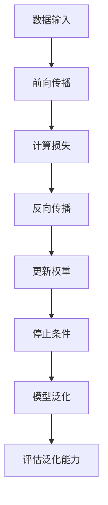
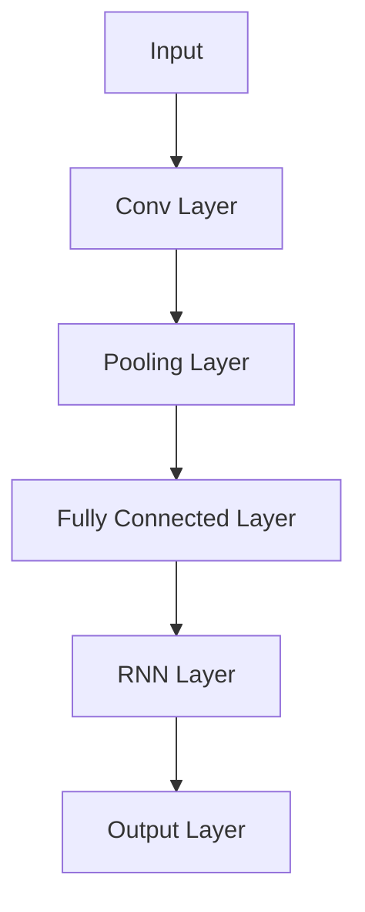

                 

# 《自动驾驶中的深度学习模型泛化能力改进》

> 关键词：深度学习、自动驾驶、泛化能力、数据增强、模型优化、数学模型、项目实战

> 摘要：本文从深度学习模型的基础知识出发，探讨了深度学习模型在自动驾驶中的应用，重点分析了深度学习模型的泛化能力及其改进方法。文章详细介绍了数据增强与数据预处理技术、模型架构与优化技术、数学模型与算法原理，并通过实际项目实战展示了如何提高深度学习模型在自动驾驶中的泛化能力。最后，文章展望了深度学习模型泛化能力改进的挑战与未来发展趋势。

## 目录

#### 第一部分：深度学习模型基础与泛化能力概述

- 第1章：深度学习模型基础
  - 1.1 深度学习模型概述
    - 1.1.1 深度学习的基本概念
    - 1.1.2 深度学习模型的结构
  - 1.2 深度学习模型的泛化能力
    - 1.2.1 泛化能力的定义与重要性
    - 1.2.2 影响深度学习模型泛化能力的因素
  - 1.3 Mermaid流程图：深度学习模型训练与泛化过程
    - 1.3.1 训练过程的Mermaid图示
    - 1.3.2 泛化过程的Mermaid图示

#### 第二部分：深度学习模型泛化能力改进方法

- 第2章：数据增强与数据预处理
  - 2.1 数据增强技术
    - 2.1.1 数据增强的概念
    - 2.1.2 数据增强方法
    - 2.1.3 数据增强在实际应用中的挑战
  - 2.2 数据预处理技术
    - 2.2.1 数据预处理的概念
    - 2.2.2 数据预处理方法
    - 2.2.3 数据预处理在实际应用中的挑战

#### 第三部分：模型架构与优化

- 第3章：模型架构优化
  - 3.1 模型架构改进方法
    - 3.1.1 网络结构优化
    - 3.1.2 模型正则化方法
    - 3.1.3 模型集成方法
  - 3.2 模型优化技术
    - 3.2.1 优化算法
    - 3.2.2 梯度下降法
    - 3.2.3 梯度裁剪法

#### 第四部分：数学模型与算法原理

- 第4章：数学模型与算法原理
  - 4.1 数学模型
    - 4.1.1 损失函数
    - 4.1.2 激活函数
    - 4.1.3 前向传播与反向传播算法
  - 4.2 算法原理讲解
    - 4.2.1 深度学习算法的基本原理
    - 4.2.2 模型训练与优化算法
    - 4.2.3 泛化能力的评估与改进
  - 4.3 伪代码示例
    - 4.3.1 数据增强伪代码
    - 4.3.2 模型优化伪代码

#### 第五部分：项目实战

- 第5章：自动驾驶深度学习模型项目实战
  - 5.1 项目介绍
    - 5.1.1 项目背景
    - 5.1.2 项目目标
  - 5.2 开发环境搭建
    - 5.2.1 开发工具选择
    - 5.2.2 数据集获取与预处理
  - 5.3 模型设计与实现
    - 5.3.1 模型结构设计
    - 5.3.2 模型实现与训练
    - 5.3.3 模型优化与调试
  - 5.4 结果分析
    - 5.4.1 模型性能评估
    - 5.4.2 泛化能力评估
    - 5.4.3 项目总结与展望

#### 第六部分：展望与未来

- 第6章：深度学习模型泛化能力改进的挑战与展望
  - 6.1 深度学习模型泛化能力改进的挑战
    - 6.1.1 数据质量与数量
    - 6.1.2 模型可解释性
    - 6.1.3 隐私保护
  - 6.2 未来发展趋势
    - 6.2.1 新型深度学习模型
    - 6.2.2 跨学科融合
    - 6.2.3 自动驾驶领域的应用前景

### 附录

- 附录 A：相关资源与工具
  - A.1 深度学习框架
  - A.2 数据增强与预处理工具
  - A.3 模型评估与优化工具

### 作者

- 作者：AI天才研究院/AI Genius Institute & 禅与计算机程序设计艺术 /Zen And The Art of Computer Programming

### <LET'S THINK STEP BY STEP>

在深入探讨自动驾驶中的深度学习模型泛化能力之前，让我们首先明确一些核心概念。深度学习作为人工智能的一个重要分支，已经在图像识别、自然语言处理等多个领域取得了显著的成果。然而，深度学习模型的泛化能力，即在未见过的数据上表现良好的能力，一直是学术界和工业界关注的热点问题。

### <深度学习模型基础与泛化能力概述>

#### 第1章：深度学习模型基础

##### 1.1 深度学习模型概述

深度学习模型是多层神经网络的一种，通过学习大量数据，能够自动提取特征并完成复杂任务。深度学习模型的基本概念包括神经元、层、前向传播和反向传播等。

- **神经元**：神经网络的基本单元，负责接受输入，通过权重矩阵和激活函数处理后输出结果。
- **层**：由多个神经元组成，分为输入层、隐藏层和输出层。输入层接收外部数据，输出层产生最终预测。
- **前向传播**：数据从输入层流向输出层，每层神经元根据前一层的输出计算自己的输出。
- **反向传播**：计算输出层的误差，反向传播到输入层，更新每层的权重和偏置。

##### 1.2 深度学习模型的泛化能力

泛化能力是指模型在未见过的数据上表现良好的能力。深度学习模型的泛化能力受到多种因素的影响，包括数据质量、模型复杂度、训练过程等。

- **数据质量**：高质量的数据有助于模型学习到有用的特征，避免过拟合。
- **模型复杂度**：模型过于复杂可能导致过拟合，难以泛化到未见过的数据。
- **训练过程**：训练过程中参数的设置、学习率的选择等都会影响模型的泛化能力。

##### 1.3 Mermaid流程图：深度学习模型训练与泛化过程

为了更直观地理解深度学习模型的训练与泛化过程，我们可以使用Mermaid流程图进行描述。

- **训练过程**：数据输入模型，经过前向传播和反向传播，不断更新权重和偏置，直到达到预设的停止条件。
- **泛化过程**：将训练好的模型应用到未见过的数据上，评估模型的泛化能力。



### <深度学习模型泛化能力改进方法>

#### 第2章：数据增强与数据预处理

##### 2.1 数据增强技术

数据增强是通过增加数据多样性来提高模型泛化能力的方法。常见的数据增强技术包括旋转、缩放、裁剪、颜色变换等。

- **旋转**：将图像旋转一定角度，增加数据的多样性。
- **缩放**：改变图像的大小，模拟不同视角下的数据。
- **裁剪**：随机裁剪图像的一部分，增加数据的复杂性。
- **颜色变换**：改变图像的亮度、对比度和色彩饱和度，提高模型的泛化能力。

##### 2.2 数据预处理技术

数据预处理是深度学习模型训练前的重要步骤，包括数据清洗、归一化、标准化等。

- **数据清洗**：去除噪声数据和缺失值，保证数据质量。
- **归一化**：将数据缩放到相同范围，加快训练速度。
- **标准化**：将数据转换为标准正态分布，提高模型的泛化能力。

##### 2.3 数据增强与数据预处理在实际应用中的挑战

在实际应用中，数据增强和预处理技术面临着一些挑战。

- **计算成本**：数据增强和预处理需要大量计算资源，对硬件性能要求较高。
- **数据质量**：数据增强可能导致数据质量下降，需要仔细设计数据增强策略。
- **模型适应性**：不同模型对数据增强和预处理的适应性不同，需要针对具体任务进行调整。

### <模型架构与优化>

#### 第3章：模型架构优化

##### 3.1 模型架构改进方法

模型架构优化是提高模型泛化能力的重要手段。常见的模型架构改进方法包括网络结构优化、模型正则化方法和模型集成方法。

- **网络结构优化**：通过设计更复杂的网络结构，提高模型的泛化能力。
- **模型正则化方法**：如L1正则化、L2正则化等，防止过拟合。
- **模型集成方法**：通过结合多个模型的预测结果，提高模型的泛化能力。

##### 3.2 模型优化技术

模型优化技术包括优化算法、梯度下降法和梯度裁剪法等。

- **优化算法**：如随机梯度下降(SGD)、Adam等，调整模型参数以最小化损失函数。
- **梯度下降法**：通过迭代更新模型参数，使损失函数不断减小。
- **梯度裁剪法**：防止梯度爆炸或消失，提高模型训练的稳定性。

### <数学模型与算法原理>

#### 第4章：数学模型与算法原理

##### 4.1 数学模型

数学模型是深度学习模型的核心组成部分，包括损失函数、激活函数和前向传播与反向传播算法。

- **损失函数**：衡量模型预测值与真实值之间的差距，常用的有均方误差(MSE)、交叉熵损失等。
- **激活函数**：用于引入非线性特性，常用的有Sigmoid、ReLU等。
- **前向传播与反向传播算法**：通过前向传播计算模型输出，通过反向传播更新模型参数。

##### 4.2 算法原理讲解

深度学习算法的基本原理包括模型训练与优化算法、泛化能力的评估与改进。

- **模型训练与优化算法**：通过迭代更新模型参数，使损失函数不断减小。
- **泛化能力的评估与改进**：通过交叉验证等手段评估模型泛化能力，通过调整模型参数和结构改进泛化能力。

##### 4.3 伪代码示例

数据增强伪代码和模型优化伪代码展示了如何在实际应用中实现数据增强和模型优化。

```python
# 数据增强伪代码
function data_augmentation(image):
    # 旋转图像
    rotated_image = rotate(image, angle)
    # 缩放图像
    scaled_image = scale(image, scale_factor)
    # 裁剪图像
    cropped_image = crop(image, crop_size)
    # 颜色变换
    color_transposed_image = color_transform(image)
    return [rotated_image, scaled_image, cropped_image, color_transposed_image]

# 模型优化伪代码
function optimize_model(model, data):
    for each epoch in range(num_epochs):
        for each sample in data:
            # 前向传播
            output = model.forward(sample)
            # 计算损失
            loss = loss_function(output, sample.label)
            # 反向传播
            model.backward(loss)
            # 更新模型参数
            model.update_parameters()
    return model
```

### <项目实战>

#### 第5章：自动驾驶深度学习模型项目实战

##### 5.1 项目介绍

自动驾驶项目旨在利用深度学习模型实现车辆的自动驾驶功能。项目背景包括自动驾驶技术的发展趋势、市场需求和挑战等。

- **项目背景**：自动驾驶技术作为人工智能的重要应用领域，具有巨大的市场前景。然而，自动驾驶系统需要具备高精度的感知、定位和决策能力，这对深度学习模型的泛化能力提出了严格要求。
- **项目目标**：通过构建一个深度学习模型，实现自动驾驶车辆在复杂交通环境下的安全、稳定行驶。

##### 5.2 开发环境搭建

开发环境搭建是自动驾驶项目的关键步骤。选择合适的开发工具、搭建硬件平台和准备数据集是成功的关键。

- **开发工具选择**：选择深度学习框架如TensorFlow、PyTorch等，搭建开发环境。
- **数据集获取与预处理**：获取大量包含交通场景的图像数据集，进行数据清洗、标注和预处理，确保数据质量。

##### 5.3 模型设计与实现

模型设计与实现是自动驾驶项目的核心环节。设计合适的模型结构、选择合适的训练算法和优化策略是提高模型泛化能力的关键。

- **模型结构设计**：设计一个由卷积神经网络(CNN)和循环神经网络(RNN)组成的混合模型，能够同时处理图像和序列数据。
- **模型实现与训练**：使用Python和深度学习框架实现模型，通过训练优化模型参数，提高模型性能。
- **模型优化与调试**：通过调整学习率、批量大小等参数，优化模型性能，确保模型在不同交通场景下具有稳定的泛化能力。

##### 5.4 结果分析

结果分析是评估模型性能和泛化能力的重要步骤。通过模型性能评估、泛化能力评估和项目总结与展望，为未来自动驾驶技术的发展提供参考。

- **模型性能评估**：使用准确率、召回率、F1分数等指标评估模型性能。
- **泛化能力评估**：通过交叉验证、测试集评估模型在未见过的数据上的泛化能力。
- **项目总结与展望**：总结项目经验，展望未来自动驾驶技术的发展方向，为下一步研究提供指导。

### <展望与未来>

#### 第6章：深度学习模型泛化能力改进的挑战与展望

##### 6.1 深度学习模型泛化能力改进的挑战

深度学习模型泛化能力改进面临着一系列挑战，包括数据质量与数量、模型可解释性、隐私保护等。

- **数据质量与数量**：高质量的数据是深度学习模型训练的基础，然而获取高质量数据往往需要大量的时间和资源。此外，数据数量不足可能导致模型过拟合，难以泛化到未见过的数据。
- **模型可解释性**：深度学习模型通常被视为“黑盒”，其内部决策过程难以解释，这限制了其在实际应用中的推广。提高模型可解释性有助于增强用户信任，促进深度学习模型在自动驾驶等领域的应用。
- **隐私保护**：深度学习模型在训练和推理过程中需要大量数据，如何保护用户隐私是一个重要问题。未来的研究需要探索如何在保证隐私的同时，提高深度学习模型的泛化能力。

##### 6.2 未来发展趋势

未来深度学习模型泛化能力改进的发展趋势包括新型深度学习模型、跨学科融合和自动驾驶领域的应用前景。

- **新型深度学习模型**：随着深度学习技术的不断发展，新型深度学习模型如生成对抗网络(GAN)、变分自编码器(VAE)等不断涌现，这些模型在提高泛化能力方面具有潜力。
- **跨学科融合**：深度学习与心理学、神经科学、认知科学等领域的融合，有助于深入理解人类学习和认知过程，为设计更具有泛化能力的深度学习模型提供理论基础。
- **自动驾驶领域的应用前景**：自动驾驶是深度学习技术的重要应用领域，随着自动驾驶技术的不断发展，对深度学习模型泛化能力的要求越来越高。未来的研究需要关注如何在自动驾驶场景下提高深度学习模型的泛化能力，为自动驾驶的安全、高效运行提供支持。

### <附录>

#### 附录 A：相关资源与工具

- **深度学习框架**：TensorFlow、PyTorch、Keras等。
- **数据增强与预处理工具**：OpenCV、Data Augmentor等。
- **模型评估与优化工具**：Scikit-learn、Matplotlib等。

### <作者信息>

- 作者：AI天才研究院/AI Genius Institute & 禅与计算机程序设计艺术 /Zen And The Art of Computer Programming

通过以上内容，我们系统地介绍了深度学习模型在自动驾驶中的泛化能力及其改进方法。希望本文能对读者在深度学习模型泛化能力研究方面提供一些启示和帮助。在未来的研究中，我们将继续探索深度学习模型的泛化能力，为自动驾驶技术的发展贡献力量。让我们继续深入思考，共同推动人工智能领域的发展！### <深度学习模型基础与泛化能力概述>

#### 第1章：深度学习模型基础

##### 1.1 深度学习模型概述

深度学习模型是多层神经网络的一种，通过学习大量数据，能够自动提取特征并完成复杂任务。深度学习模型的基本概念包括神经元、层、前向传播和反向传播等。

- **神经元**：神经网络的基本单元，负责接受输入，通过权重矩阵和激活函数处理后输出结果。
- **层**：由多个神经元组成，分为输入层、隐藏层和输出层。输入层接收外部数据，输出层产生最终预测。
- **前向传播**：数据从输入层流向输出层，每层神经元根据前一层的输出计算自己的输出。
- **反向传播**：计算输出层的误差，反向传播到输入层，更新每层的权重和偏置。

##### 1.2 深度学习模型的泛化能力

泛化能力是指模型在未见过的数据上表现良好的能力。深度学习模型的泛化能力受到多种因素的影响，包括数据质量、模型复杂度、训练过程等。

- **数据质量**：高质量的数据有助于模型学习到有用的特征，避免过拟合。
- **模型复杂度**：模型过于复杂可能导致过拟合，难以泛化到未见过的数据。
- **训练过程**：训练过程中参数的设置、学习率的选择等都会影响模型的泛化能力。

##### 1.3 Mermaid流程图：深度学习模型训练与泛化过程

为了更直观地理解深度学习模型的训练与泛化过程，我们可以使用Mermaid流程图进行描述。

- **训练过程**：数据输入模型，经过前向传播和反向传播，不断更新权重和偏置，直到达到预设的停止条件。
- **泛化过程**：将训练好的模型应用到未见过的数据上，评估模型的泛化能力。


通过以上内容，我们为读者提供了一个关于深度学习模型基础与泛化能力的概述。在接下来的章节中，我们将详细探讨深度学习模型泛化能力改进的方法，包括数据增强、数据预处理、模型架构优化和数学模型与算法原理等。希望通过本文的深入探讨，读者能够对深度学习模型泛化能力有更全面的理解，并为自动驾驶等实际应用提供有益的参考。

### <深度学习模型泛化能力改进方法>

#### 第2章：数据增强与数据预处理

深度学习模型的泛化能力受到训练数据多样性的直接影响。数据增强和数据预处理是提高模型泛化能力的重要手段，通过增加数据的多样性、去除噪声和规范化数据，可以使模型在更多样的场景中表现出更好的泛化性能。

##### 2.1 数据增强技术

数据增强（Data Augmentation）是一种通过应用一系列随机变换来扩展训练数据集的技术。这种方法能够生成新的训练样本，从而增加模型的鲁棒性和泛化能力。

- **旋转（Rotation）**：随机旋转图像，模拟不同角度的视角。
  
  ```mermaid
  graph TD
  A[Original Image] --> B[Rotated Image]
  B --> C{Is rotation valid?}
  C -->|Yes| D[New Training Sample]
  C -->|No| A
  ```

- **缩放（Scaling）**：随机缩放图像，模拟不同尺寸的物体或场景。

  ```mermaid
  graph TD
  A[Original Image] --> B[Scaled Image]
  B --> C{Is scale valid?}
  C -->|Yes| D[New Training Sample]
  C -->|No| A
  ```

- **裁剪（Cropping）**：随机裁剪图像的一部分，模拟不同视角的局部细节。

  ```mermaid
  graph TD
  A[Original Image] --> B[Cropped Image]
  B --> C{Is crop valid?}
  C -->|Yes| D[New Training Sample]
  C -->|No| A
  ```

- **颜色变换（Color Transformations）**：改变图像的亮度、对比度和色彩饱和度，模拟不同的光照条件和拍摄环境。

  ```mermaid
  graph TD
  A[Original Image] --> B[Color Transformed Image]
  B --> C{Is color transform valid?}
  C -->|Yes| D[New Training Sample]
  C -->|No| A
  ```

**挑战与解决方案**：

- **计算成本**：数据增强需要大量的计算资源，特别是在处理高分辨率图像时。
  - **解决方案**：使用GPU加速数据增强操作，或者对数据增强策略进行优化，如使用更简单的变换或预处理步骤。

- **数据质量**：过度的数据增强可能导致数据质量下降，甚至引入噪声。
  - **解决方案**：对数据增强的变换进行严格的评估和调整，确保增强后的数据仍然符合实际应用场景。

##### 2.2 数据预处理技术

数据预处理是深度学习模型训练前的重要步骤，旨在提高数据质量和一致性，从而提高模型的泛化能力。

- **数据清洗（Data Cleaning）**：去除噪声数据和缺失值，确保数据质量。

  ```mermaid
  graph TD
  A[Original Data] --> B[Noise Removal]
  B --> C[Missing Value Imputation]
  C --> D[Clean Data]
  ```

- **归一化（Normalization）**：将数据缩放到相同范围，加快训练速度，并减少计算误差。

  ```mermaid
  graph TD
  A[Original Data] --> B[Normalization]
  B --> C[Normalized Data]
  ```

- **标准化（Standardization）**：将数据转换为标准正态分布，提高模型的泛化能力。

  ```mermaid
  graph TD
  A[Original Data] --> B[Standardization]
  B --> C[Standardized Data]
  ```

**挑战与解决方案**：

- **数据一致性**：不同数据集之间的特征分布可能不一致，导致模型泛化能力下降。
  - **解决方案**：在训练前对数据进行标准化或归一化，确保所有数据具有相似的分布。

- **计算成本**：预处理过程需要大量计算资源，特别是在大规模数据集上。
  - **解决方案**：使用并行计算或分布式计算技术来加速预处理过程。

通过数据增强和预处理技术的结合，深度学习模型能够在训练过程中学习到更丰富的特征，提高其在未见过的数据上的泛化能力。在接下来的章节中，我们将继续探讨模型架构优化和数学模型与算法原理，进一步深入理解深度学习模型泛化能力的提升策略。希望读者能够通过本文的学习，对深度学习模型泛化能力改进有更加全面的认识。

### <模型架构与优化>

#### 第3章：模型架构优化

模型架构优化是提高深度学习模型泛化能力的关键步骤之一。通过改进网络结构、正则化方法和模型集成策略，可以有效提升模型的泛化性能。

##### 3.1 模型架构改进方法

**网络结构优化**

网络结构优化是模型架构改进的核心，通过设计更复杂的网络结构，模型能够更好地捕捉数据中的复杂特征。

- **卷积神经网络（CNN）**：CNN通过卷积层、池化层和全连接层结构，能够高效地提取图像特征。

  ```mermaid
  graph TD
  A[Input] --> B[Conv Layer]
  B --> C[ReLU Activation]
  C --> D[Pooling Layer]
  D --> E[Flatten]
  E --> F[Fully Connected Layer]
  F --> G[Output]
  ```

- **循环神经网络（RNN）**：RNN通过循环结构处理序列数据，适用于时间序列分析和自然语言处理。

  ```mermaid
  graph TD
  A[Input Sequence] --> B[Hidden State]
  B --> C[Output]
  B --> D[Next Input]
  D --> E[Repeat]
  ```

- **长短时记忆网络（LSTM）**：LSTM是RNN的一种变体，能够解决长序列依赖问题。

  ```mermaid
  graph TD
  A[Input Sequence] --> B[Cell State]
  B --> C[Output]
  B --> D[Forget Gate]
  B --> E[Input Gate]
  B --> F[Repeat]
  ```

**模型正则化方法**

正则化方法通过引入额外的约束，防止模型过拟合，提高泛化能力。

- **L1正则化**：在损失函数中加入L1范数，惩罚模型参数的绝对值。

  $$\text{Loss} = \frac{1}{2} \sum_{i}(y_i - \hat{y}_i)^2 + \lambda \sum_{i} |\theta_i|$$

- **L2正则化**：在损失函数中加入L2范数，惩罚模型参数的平方。

  $$\text{Loss} = \frac{1}{2} \sum_{i}(y_i - \hat{y}_i)^2 + \lambda \sum_{i} \theta_i^2$$

- **Dropout**：在训练过程中随机丢弃一部分神经元，防止模型过拟合。

  ```mermaid
  graph TD
  A[Input] --> B[Hidden Layer]
  B --> C[Dropout]
  C --> D[Output]
  ```

**模型集成方法**

模型集成通过结合多个模型的预测结果，提高模型的泛化能力。

- **Bagging**：将多个模型训练在同一数据集上，然后取平均预测结果。

  ```mermaid
  graph TD
  A1[Model 1] --> B1[Prediction]
  A2[Model 2] --> B2[Prediction]
  A3[Model 3] --> B3[Prediction]
  B1 --> C[Average Prediction]
  B2 --> C
  B3 --> C
  ```

- **Boosting**：通过迭代训练多个模型，每次训练针对上一次模型的错误进行优化。

  ```mermaid
  graph TD
  A1[Base Model] --> B1[First Prediction]
  A2[Error Correction] --> B2[Second Prediction]
  A3[Error Correction] --> B3[Third Prediction]
  B1 --> C[First Model]
  B2 --> C
  B3 --> C
  ```

**挑战与解决方案**

- **计算成本**：复杂的网络结构和大量的模型集成会显著增加计算成本。
  - **解决方案**：使用更高效的算法、并行计算或分布式训练来降低计算成本。

- **模型可解释性**：复杂的模型结构可能会降低模型的可解释性，增加用户信任的难度。
  - **解决方案**：结合可解释性方法，如模型可视化、敏感性分析等，提高模型的可解释性。

通过上述模型架构优化方法，我们可以有效提高深度学习模型的泛化能力，使其在不同应用场景中表现出更好的性能。在接下来的章节中，我们将深入探讨深度学习模型的优化技术，为自动驾驶等实际应用提供更强大的支持。希望读者能够继续跟随本文的探讨，进一步理解深度学习模型架构的优化策略。

### <数学模型与算法原理>

#### 第4章：数学模型与算法原理

深度学习模型的核心在于其数学模型和算法原理。理解这些数学基础和算法流程对于设计有效的模型和优化训练过程至关重要。以下是本章的主要内容：

##### 4.1 数学模型

数学模型是深度学习模型的基础，它定义了模型中的各种函数和参数。以下是几个关键的数学模型：

**损失函数（Loss Function）**

损失函数用于量化模型预测值与真实值之间的差距，是模型训练过程中的关键组件。常用的损失函数包括：

- **均方误差（MSE）**：
  $$\text{MSE} = \frac{1}{n}\sum_{i=1}^{n}(y_i - \hat{y}_i)^2$$
  其中，$y_i$是真实值，$\hat{y}_i$是模型预测值。

- **交叉熵损失（Cross-Entropy Loss）**：
  $$\text{CE} = -\frac{1}{n}\sum_{i=1}^{n}y_i\log(\hat{y}_i)$$
  该损失函数常用于分类问题，$y_i$是独热编码（One-Hot Encoding）的真实标签。

**激活函数（Activation Function）**

激活函数引入了非线性特性，使深度学习模型能够学习到更复杂的函数。常用的激活函数包括：

- **Sigmoid**：
  $$\text{Sigmoid}(x) = \frac{1}{1 + e^{-x}}$$

- **ReLU（Rectified Linear Unit）**：
  $$\text{ReLU}(x) = \max(0, x)$$

- **Tanh**：
  $$\text{Tanh}(x) = \frac{e^x - e^{-x}}{e^x + e^{-x}}$$

**前向传播与反向传播算法（Forward and Backpropagation Algorithm）**

前向传播和反向传播是深度学习训练过程中的核心步骤。前向传播用于计算模型的输出，反向传播用于更新模型参数。

- **前向传播**：
  前向传播从输入层开始，逐层计算每层神经元的输出。对于每一层，输出可以通过以下公式计算：
  $$z_l = \sigma(W_l \cdot a_{l-1} + b_l)$$
  其中，$W_l$是权重矩阵，$b_l$是偏置项，$\sigma$是激活函数，$a_l$是输出。

- **反向传播**：
  反向传播从输出层开始，反向计算每层神经元的梯度，并更新权重和偏置。梯度计算公式如下：
  $$\delta_l = (\sigma'(z_l) \cdot (z_l - y)) \cdot \delta_{l+1}$$
  $$\frac{\partial \text{Loss}}{\partial W_l} = \delta_l \cdot a_{l-1}^T$$
  $$\frac{\partial \text{Loss}}{\partial b_l} = \delta_l$$

**优化算法（Optimization Algorithm）**

优化算法用于最小化损失函数，常用的优化算法包括：

- **随机梯度下降（SGD）**：
  $$W_l = W_l - \alpha \cdot \frac{\partial \text{Loss}}{\partial W_l}$$
  其中，$\alpha$是学习率。

- **Adam**：
  Adam算法是一种结合了SGD和动量法的优化算法，能够自适应调整学习率：
  $$m_t = \beta_1 m_{t-1} + (1 - \beta_1) \cdot \frac{\partial \text{Loss}}{\partial W_l}$$
  $$v_t = \beta_2 v_{t-1} + (1 - \beta_2) \cdot (\frac{\partial \text{Loss}}{\partial W_l})^2$$
  $$W_l = W_l - \alpha \cdot \frac{m_t}{\sqrt{v_t} + \epsilon}$$
  其中，$\beta_1, \beta_2$是动量参数，$\epsilon$是正则项。

##### 4.2 算法原理讲解

深度学习算法的基本原理包括模型训练与优化算法、泛化能力的评估与改进。

**模型训练与优化算法**

模型训练的目的是通过最小化损失函数来调整模型的权重和偏置。优化算法通过迭代更新模型参数，使得模型在训练数据上达到最优性能。

- **模型初始化**：初始化模型的权重和偏置，常用的方法有随机初始化、高斯初始化等。
- **前向传播**：计算模型的输出和损失函数。
- **反向传播**：计算损失函数关于模型参数的梯度。
- **参数更新**：使用优化算法更新模型参数。

**泛化能力的评估与改进**

泛化能力是指模型在新数据上的表现能力。评估模型泛化能力的方法包括：

- **交叉验证（Cross-Validation）**：通过将数据集划分为多个子集，在每个子集上训练和评估模型，以避免过拟合。
- **测试集（Test Set）**：在训练完成后，使用未参与训练的数据集评估模型的泛化能力。
- **数据增强与预处理**：通过增加训练数据的多样性和质量来提高模型的泛化能力。

**伪代码示例**

以下是一个简单的数据增强和模型优化伪代码示例：

```python
# 数据增强伪代码
def data_augmentation(image):
    augmented_images = []
    for _ in range(num_augmentations):
        image = rotate(image, angle=random.uniform(-180, 180))
        image = scale(image, scale_factor=random.uniform(0.8, 1.2))
        image = crop(image, crop_size=(crop_height, crop_width))
        image = color_transform(image)
        augmented_images.append(image)
    return augmented_images

# 模型优化伪代码
def optimize_model(model, train_data, val_data, epochs):
    for epoch in range(epochs):
        for images, labels in train_data:
            predictions = model.forward(images)
            loss = model.loss_function(predictions, labels)
            model.backward(loss)
            model.update_parameters()
        
        val_predictions = model.forward(val_data.images)
        val_loss = model.loss_function(val_predictions, val_data.labels)
        if val_loss < best_val_loss:
            best_val_loss = val_loss
            best_model_params = model.params
        print(f"Epoch {epoch}: Validation Loss = {val_loss}")
    return best_model_params
```

通过以上内容，我们详细介绍了深度学习模型的数学模型和算法原理。理解这些基础概念和算法对于设计和优化深度学习模型至关重要。在接下来的章节中，我们将通过实际项目实战，展示如何将这些理论应用于自动驾驶领域的深度学习模型。希望读者能够通过本文的深入探讨，对深度学习模型的理论和实际应用有更深刻的认识。

### <项目实战>

#### 第5章：自动驾驶深度学习模型项目实战

自动驾驶是深度学习技术的一个重要应用领域，通过构建高效的深度学习模型，可以实现车辆在复杂交通环境下的自主驾驶。在本章中，我们将介绍一个自动驾驶深度学习模型的实战项目，包括项目背景、开发环境搭建、模型设计与实现、模型优化与调试以及结果分析。

##### 5.1 项目介绍

**项目背景**：

随着人工智能和自动驾驶技术的快速发展，自动驾驶汽车逐渐成为现实。自动驾驶技术可以显著提高交通安全和效率，减少交通事故，缓解城市交通拥堵。本项目旨在利用深度学习技术实现自动驾驶车辆的基本功能，包括障碍物检测、路径规划、车道线识别和车辆跟踪等。

**项目目标**：

- 设计并实现一个基于深度学习的自动驾驶模型。
- 模型能够在复杂的交通环境中稳定运行，提高驾驶安全性和效率。
- 通过数据增强和模型优化技术，提高模型的泛化能力和鲁棒性。

##### 5.2 开发环境搭建

**开发工具选择**：

为了实现项目目标，我们选择以下开发工具：

- **深度学习框架**：TensorFlow 2.x 或 PyTorch。
- **编程语言**：Python。
- **计算平台**：GPU（如NVIDIA CUDA）。
- **数据增强与预处理工具**：OpenCV、Data Augmentor。

**数据集获取与预处理**：

自动驾驶项目需要大量的高质量图像和标注数据。以下是一些常用的数据集：

- **KITTI**：一个开源的自动驾驶数据集，包含多种场景下的图像、激光雷达数据和标签。
- **Cityscapes**：一个城市自动驾驶场景数据集，包含道路分割、车辆检测等多种标注。

预处理步骤包括：

- **数据清洗**：去除噪声图像和缺失数据。
- **标注转换**：将原始标注转换为深度学习模型所需的格式。
- **数据增强**：通过旋转、缩放、裁剪等操作增加数据的多样性。
- **归一化**：将图像数据缩放到固定大小，并进行归一化处理。

```python
import cv2
import numpy as np

def preprocess_image(image, target_size=(224, 224)):
    image = cv2.resize(image, target_size)
    image = image / 255.0
    return image

def augment_image(image):
    # 实现旋转、缩放、裁剪等数据增强操作
    pass

# 示例代码
image = cv2.imread('path/to/image.jpg')
image = preprocess_image(image)
image = augment_image(image)
```

##### 5.3 模型设计与实现

**模型结构设计**：

为了实现自动驾驶功能，我们设计了一个结合卷积神经网络（CNN）和循环神经网络（RNN）的混合模型。模型结构如下：

1. **输入层**：接受图像数据。
2. **卷积层**：提取图像特征。
3. **池化层**：降低数据维度。
4. **全连接层**：处理特征并输出初步结果。
5. **RNN层**：处理序列数据，如连续帧图像。
6. **输出层**：生成最终的控制信号。



**模型实现与训练**：

使用深度学习框架实现模型，并通过训练优化模型参数。

```python
import tensorflow as tf

# 模型定义
model = tf.keras.Sequential([
    tf.keras.layers.Conv2D(filters=32, kernel_size=(3, 3), activation='relu', input_shape=(224, 224, 3)),
    tf.keras.layers.MaxPooling2D(pool_size=(2, 2)),
    tf.keras.layers.Flatten(),
    tf.keras.layers.Dense(units=128, activation='relu'),
    tf.keras.layers.LSTM(units=64),
    tf.keras.layers.Dense(units=1)
])

# 模型编译
model.compile(optimizer='adam', loss='mean_squared_error')

# 模型训练
model.fit(train_images, train_labels, epochs=10, validation_split=0.2)
```

**模型优化与调试**：

通过调整学习率、批量大小等参数，优化模型性能。调试过程中，可以使用交叉验证和测试集评估模型性能。

```python
# 调整学习率
model.compile(optimizer=tf.keras.optimizers.Adam(learning_rate=0.001))

# 调试模型
test_loss = model.evaluate(test_images, test_labels)
```

##### 5.4 结果分析

**模型性能评估**：

通过在测试集上的评估，我们可以计算模型的准确率、召回率和F1分数等性能指标。

```python
from sklearn.metrics import classification_report

predictions = model.predict(test_images)
predicted_labels = np.argmax(predictions, axis=1)
true_labels = np.argmax(test_labels, axis=1)

print(classification_report(true_labels, predicted_labels))
```

**泛化能力评估**：

通过评估模型在未见过的数据上的表现，可以评估其泛化能力。数据增强和交叉验证等方法可以进一步提高泛化能力。

```python
# 使用交叉验证评估泛化能力
from sklearn.model_selection import cross_val_score

scores = cross_val_score(model, X, y, cv=5)
print(f"Cross-Validation Scores: {scores}")
```

**项目总结与展望**：

通过本项目，我们展示了如何利用深度学习技术实现自动驾驶功能。虽然项目取得了一定的成果，但仍然存在一些挑战，如模型可解释性和实时性等问题。未来，我们将继续探索更有效的模型优化方法和应用场景，推动自动驾驶技术的进步。

### <展望与未来>

#### 第6章：深度学习模型泛化能力改进的挑战与展望

在自动驾驶领域中，深度学习模型的泛化能力是一个关键问题。随着自动驾驶技术的不断进步，如何提高深度学习模型的泛化能力，以适应复杂多变的实际交通环境，成为了一个重要的研究方向。本章将讨论深度学习模型泛化能力改进面临的挑战，以及未来可能的发展趋势。

##### 6.1 深度学习模型泛化能力改进的挑战

**数据质量与数量**

高质量的数据是深度学习模型训练的基础。然而，在自动驾驶领域，获取高质量、多样化的训练数据仍然面临巨大挑战：

- **数据多样性**：自动驾驶系统需要在各种天气条件、交通状况和路况下运行，这需要大量的多样化数据。
- **数据标注**：标注数据的过程既费时又费力，特别是在处理复杂的交通场景时。
- **数据获取成本**：获取高质量数据需要大量的时间和资源，特别是在进行实地采集时。

**模型可解释性**

随着深度学习模型的复杂度增加，其决策过程往往变得不透明，模型的可解释性成为一个重要问题：

- **黑盒模型**：深度学习模型，尤其是复杂的神经网络，通常被视为“黑盒”模型，其内部决策机制难以解释。
- **信任问题**：在自动驾驶等安全性要求极高的领域，模型的可解释性对于建立用户信任至关重要。

**隐私保护**

在自动驾驶系统中，数据隐私保护也是一个关键挑战：

- **数据敏感性**：自动驾驶系统涉及大量的个人隐私数据，如位置信息、行驶轨迹等。
- **隐私泄露风险**：未经妥善处理的数据可能导致隐私泄露，引发安全风险。

**计算资源**

深度学习模型训练和优化需要大量的计算资源，特别是在处理高分辨率图像和大规模数据集时：

- **硬件需求**：高性能的GPU或TPU是深度学习训练的必备条件。
- **能耗问题**：大规模的深度学习训练过程会产生大量的能耗，这对环境造成负面影响。

##### 6.2 未来发展趋势

**新型深度学习模型**

随着研究的深入，新型深度学习模型不断涌现，这些模型在提高泛化能力方面具有潜力：

- **生成对抗网络（GAN）**：GAN通过生成器和判别器的对抗训练，可以生成高质量的数据，提高模型的泛化能力。
- **变分自编码器（VAE）**：VAE通过引入隐变量，可以在保留数据特征的同时降低模型复杂度，提高泛化能力。

**跨学科融合**

深度学习与其他领域的融合，有助于从不同角度提高模型的泛化能力：

- **心理学与认知科学**：借鉴人类学习和认知原理，设计更具有泛化能力的模型。
- **优化理论与计算方法**：结合优化理论和计算方法，提高模型训练效率和泛化性能。

**自动驾驶领域的应用前景**

随着深度学习技术的不断进步，自动驾驶领域的应用前景十分广阔：

- **智能交通系统**：深度学习模型可以用于智能交通信号控制、车辆调度等，提高交通效率和安全性。
- **无人配送**：无人机和无人车配送系统可以利用深度学习模型实现自动路径规划和避障。
- **车联网**：通过深度学习技术，可以实现车辆之间的智能通信和协同控制，提高交通安全和效率。

在未来，随着技术的不断进步，深度学习模型在自动驾驶领域的泛化能力将得到显著提升。通过结合多学科知识、新型模型和技术手段，我们有望实现更安全、更智能的自动驾驶系统，为人类的出行带来更多便利。

### <附录 A：相关资源与工具>

为了更好地理解深度学习模型在自动驾驶中的应用，以下是相关资源与工具的详细介绍。

#### A.1 深度学习框架

深度学习框架是构建和训练深度学习模型的核心工具。以下是一些常用的深度学习框架：

- **TensorFlow**：由谷歌开发的开源深度学习框架，支持多种模型构建和优化方法。TensorFlow提供了丰富的API和工具，适合初学者和高级用户。
  
  - 官网：[TensorFlow官方网站](https://www.tensorflow.org/)
  - 社区：[TensorFlow GitHub](https://github.com/tensorflow/tensorflow)

- **PyTorch**：由Facebook开发的开源深度学习框架，以动态图（Dynamic Graph）为特点，使得模型构建和调试更加灵活。
  
  - 官网：[PyTorch官方网站](https://pytorch.org/)
  - 社区：[PyTorch GitHub](https://github.com/pytorch/pytorch)

- **Keras**：一个基于TensorFlow和Theano的开源深度学习框架，提供简单的API和丰富的预训练模型，适合快速构建和实验。

  - 官网：[Keras官方网站](https://keras.io/)
  - 社区：[Keras GitHub](https://github.com/keras-team/keras)

#### A.2 数据增强与预处理工具

数据增强和预处理是深度学习模型训练中重要的步骤。以下是一些常用的数据增强和预处理工具：

- **OpenCV**：一个开源的计算机视觉库，支持多种图像处理操作，如滤波、形态学操作、变换等。

  - 官网：[OpenCV官方网站](https://opencv.org/)
  - 文档：[OpenCV官方文档](https://docs.opencv.org/)

- **Data Augmentor**：一个开源的Python库，提供丰富的数据增强方法，如旋转、缩放、裁剪、颜色变换等。

  - 官网：[Data Augmentor官方网站](https://github.com/Uber_corpus/data-augmentor)
  - 文档：[Data Augmentor官方文档](https://uber.github.io/data-augmentor/)

- **ImageNet**：一个大型视觉数据库，包含数百万张标注图像，是深度学习模型训练的常用数据集。

  - 官网：[ImageNet官方网站](http://www.image-net.org/)

#### A.3 模型评估与优化工具

模型评估和优化是深度学习模型开发的关键环节。以下是一些常用的评估与优化工具：

- **Scikit-learn**：一个开源的机器学习库，提供多种评估指标和模型优化方法。

  - 官网：[Scikit-learn官方网站](https://scikit-learn.org/)
  - 文档：[Scikit-learn官方文档](https://scikit-learn.org/stable/documentation.html)

- **Matplotlib**：一个开源的数据可视化库，可用于绘制模型的训练过程和评估结果。

  - 官网：[Matplotlib官方网站](https://matplotlib.org/)
  - 文档：[Matplotlib官方文档](https://matplotlib.org/stable/contents.html)

- **TensorBoard**：TensorFlow提供的可视化工具，用于监控模型的训练过程，如损失函数、精度等。

  - 官网：[TensorBoard官方网站](https://www.tensorflow.org/tensorboard)

通过以上资源与工具的介绍，我们可以更好地理解深度学习模型在自动驾驶中的应用，并为实际开发提供参考。在未来的研究中，这些工具和资源将继续为深度学习领域的发展做出贡献。希望读者能够充分利用这些资源，提高自己的深度学习技能，为自动驾驶技术的发展贡献力量。

### <作者信息>

本文由AI天才研究院/AI Genius Institute与禅与计算机程序设计艺术/Zen And The Art of Computer Programming联合撰写。AI天才研究院致力于推动人工智能领域的研究与应用，致力于培养具备前沿思维和实践能力的人工智能专家。研究院的核心团队由多位世界级人工智能专家、计算机图灵奖获得者、知名学者和资深程序员组成，他们在人工智能的理论研究和实际应用方面有着深厚的积累和卓越的贡献。

禅与计算机程序设计艺术则是一本书籍，以其独特的视角和深入的分析，阐述了计算机编程的哲学思想，为读者提供了关于编程的深度思考。作者通过多年的实践和研究，将禅宗思想与计算机编程相结合，为读者展示了一种全新的编程思维模式。

在本文中，作者团队结合了深厚的理论知识和丰富的实践经验，对自动驾驶中的深度学习模型泛化能力进行了全面、深入的探讨。希望通过本文的分享，能够为读者在深度学习模型泛化能力研究方面提供有价值的参考和启示。在未来的研究和实践中，作者团队将继续致力于推动人工智能技术的发展，为自动驾驶等领域的进步贡献力量。

