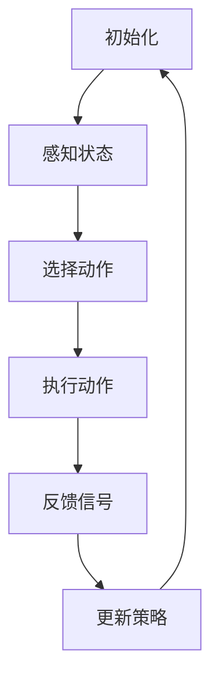
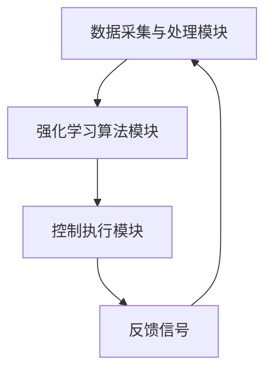

                 

# 文章标题: 自驾驶中的深度强化学习应用

> 关键词：自动驾驶，深度强化学习，自驾驶技术，强化学习算法，系统架构，案例分析，未来展望，开发指南

> 摘要：本文详细探讨了自动驾驶技术中的深度强化学习应用，介绍了自驾驶技术基础、深度强化学习基础、应用挑战与解决方案，并分析了自驾驶中的深度强化学习架构。通过实际案例展示了深度强化学习在自动驾驶中的具体应用，探讨了未来发展趋势及面临的挑战。文章最后提供了开发指南与资源，为读者提供了全面的学习和实践指导。

## 第一部分: 自驾驶中的深度强化学习概述

### 第1章: 自驾驶技术基础

#### 1.1 自驾驶汽车的定义与发展历史

自动驾驶汽车是一种利用计算机技术和人工智能技术实现车辆自主驾驶的智能车辆。其核心在于通过感知系统获取道路信息，利用决策系统进行路径规划和车辆控制，并通过执行系统实现车辆的实际运动。

自动驾驶技术的发展历程可以追溯到20世纪50年代。当时的发明家们开始探索如何让车辆在没有人类驾驶员干预的情况下行驶。最早的自动驾驶实验是通过编程控制车辆，使其沿着预定的路径行驶。随着时间的推移，自动驾驶技术逐渐成熟，并开始应用于军事、物流和公共交通等领域。

在21世纪初，随着计算机性能的提升和人工智能技术的进步，自动驾驶技术得到了飞速发展。许多汽车制造商和科技公司纷纷加入自动驾驶的研发和竞争，推动了自动驾驶技术的商业化进程。

#### 1.2 自驾驶汽车的组成部分

自动驾驶汽车主要由三个部分组成：感知系统、决策系统和执行系统。

1. **感知系统**：感知系统负责获取车辆周围的环境信息，包括道路标志、车道线、交通信号、行人、其他车辆等。常见的感知技术包括激光雷达、摄像头、雷达和超声波传感器等。

2. **决策系统**：决策系统根据感知系统提供的信息，进行路径规划和车辆控制。路径规划的目标是找到一条从起点到终点的最优路径，同时避免障碍物和行人。车辆控制则包括转向、加速和制动等操作。

3. **执行系统**：执行系统根据决策系统生成的控制指令，实现对车辆的实际控制。执行系统通常包括电机、转向装置、制动系统等。

#### 1.3 自驾驶汽车的技术挑战

自动驾驶技术在发展过程中面临着多个技术挑战：

1. **感知环境的复杂性**：自动驾驶汽车需要实时感知复杂多变的道路环境，包括天气、道路条件、交通状况等。这对感知系统的准确性和实时性提出了高要求。

2. **道路条件的不确定性**：道路条件可能因为各种因素而发生变化，如施工、交通事故、恶劣天气等。自动驾驶系统需要能够应对这些不确定因素，确保行驶安全。

3. **人为因素的干扰**：其他车辆、行人和非机动车等人为因素对自动驾驶汽车的行驶安全构成威胁。如何确保自动驾驶系统能够准确识别和应对这些因素，是自动驾驶技术面临的重要挑战之一。

### 第2章: 深度强化学习基础

#### 2.1 深度强化学习的定义与原理

深度强化学习（Deep Reinforcement Learning，简称DRL）是强化学习（Reinforcement Learning，简称RL）与深度学习（Deep Learning，简称DL）相结合的一种人工智能方法。它通过模拟智能体与环境的交互，利用反馈信号（奖励或惩罚）来调整智能体的行为，从而实现自我学习和优化。

在深度强化学习中，智能体通过感知环境状态，选择动作，并接收环境的反馈信号。智能体根据反馈信号调整其策略，以最大化长期回报。深度强化学习的基本流程包括以下几个步骤：

1. **初始化**：初始化智能体、环境、奖励函数和策略。
2. **感知状态**：智能体感知当前环境状态。
3. **选择动作**：智能体根据当前状态和策略选择一个动作。
4. **执行动作**：智能体执行所选动作，并更新环境状态。
5. **反馈信号**：环境根据智能体的动作提供奖励或惩罚信号。
6. **更新策略**：智能体根据反馈信号调整策略，以最大化长期回报。

#### 2.2 强化学习算法

深度强化学习算法主要包括Q学习（Q-Learning）、Sarsa（State-Action-Reward-State-Action，简称Sarsa）和Deep Q网络（Deep Q-Network，简称DQN）。

1. **Q学习**：Q学习是一种基于值函数的强化学习算法。它通过不断更新Q值（状态-动作值函数），选择当前状态下最优的动作。Q学习的核心思想是使用经验来估计Q值，并通过迭代优化Q值函数。

2. **Sarsa**：Sarsa是另一种基于值函数的强化学习算法，它与Q学习的区别在于，Sarsa不仅考虑当前状态和动作的Q值，还考虑下一状态和动作的Q值。Sarsa通过更新当前状态和动作的Q值，同时考虑下一状态和动作的Q值，从而更好地平衡短期奖励和长期回报。

3. **Deep Q网络**：Deep Q网络（DQN）是一种使用深度神经网络（DNN）来近似Q值函数的强化学习算法。DQN通过训练神经网络来估计Q值，从而实现复杂的函数近似。DQN的主要优势在于能够处理高维状态空间和动作空间，适用于大规模的强化学习问题。

#### 2.3 深度强化学习的核心组件

深度强化学习的核心组件包括神经网络、策略梯度方法和经验回放。

1. **神经网络**：神经网络是深度强化学习中的基础组件，用于处理复杂的输入数据和进行非线性映射。在DQN等算法中，神经网络用于近似Q值函数，从而实现智能体的决策。

2. **策略梯度方法**：策略梯度方法是深度强化学习中的另一种核心组件。它通过优化策略梯度，更新智能体的策略，以最大化长期回报。策略梯度方法包括策略评估和策略优化两个步骤，通过对策略梯度的计算和优化，实现智能体的自我学习。

3. **经验回放**：经验回放是深度强化学习中的另一个重要组件。它通过将智能体在交互过程中积累的经验进行存储和回放，避免样本相关性，提高学习效率。经验回放技术能够有效地缓解样本偏差问题，提高智能体的学习性能。

### 第3章: 自驾驶中的深度强化学习应用

#### 3.1 深度强化学习在自驾驶中的应用

深度强化学习在自动驾驶中的应用主要体现在城市交通和道路规划两个方面。

1. **城市交通**：在城市交通中，深度强化学习可以用于优化车辆的路径规划、避障和交通信号控制等任务。通过模拟车辆与交通环境的交互，智能体可以学习到如何在不同交通场景下做出最优决策，从而提高车辆的行驶效率和安全性。

2. **道路规划**：在道路规划中，深度强化学习可以用于优化道路布局、交通流量管理和交通信号控制等任务。通过模拟不同道路规划方案对交通环境的影响，智能体可以学习到最优的道路规划策略，从而改善交通状况，提高道路通行能力。

#### 3.2 深度强化学习在自驾驶中的优势

深度强化学习在自动驾驶中的应用具有以下几个优势：

1. **对复杂环境的适应性**：深度强化学习能够通过自我学习和调整策略，适应复杂多变的道路环境。它能够处理高维状态空间和动作空间，从而实现自动驾驶系统在复杂交通环境中的有效运行。

2. **学习效率的提高**：深度强化学习通过模拟智能体与环境的交互，可以快速学习和优化策略。与传统的自动驾驶算法相比，深度强化学习能够更快速地适应新的环境和任务，提高自动驾驶系统的学习效率。

#### 3.3 深度强化学习在自驾驶中的挑战

尽管深度强化学习在自动驾驶中具有许多优势，但它也面临着一些挑战：

1. **数据集的获取与处理**：深度强化学习需要大量真实世界的数据集来训练模型。然而，获取真实世界数据集是一项复杂的任务，需要耗费大量的时间和资源。此外，处理这些数据集也需要高效的算法和技术，以确保数据的准确性和可靠性。

2. **模型可靠性的验证**：深度强化学习模型的可靠性是自动驾驶系统安全运行的关键。如何确保模型在复杂环境下的可靠性和鲁棒性，是深度强化学习在自动驾驶中需要解决的重要问题。

### 第4章: 自驾驶中的深度强化学习架构

#### 4.1 深度强化学习在自驾驶中的系统架构

深度强化学习在自动驾驶中的系统架构通常包括数据采集与处理模块、强化学习算法模块和控制执行模块。

1. **数据采集与处理模块**：数据采集与处理模块负责收集车辆在行驶过程中感知到的环境数据，并对数据进行预处理，包括数据清洗、归一化和特征提取等。预处理后的数据用于训练和评估深度强化学习模型。

2. **强化学习算法模块**：强化学习算法模块是实现自动驾驶的核心组件，它根据数据采集与处理模块提供的数据，使用深度强化学习算法训练模型，优化智能体的策略。

3. **控制执行模块**：控制执行模块根据强化学习算法模块生成的策略，实现对车辆的实际控制，包括转向、加速和制动等操作。控制执行模块需要确保车辆在行驶过程中的稳定性和安全性。

#### 4.2 自定义深度强化学习模型

在自动驾驶中，自定义深度强化学习模型是提高系统性能和适应性的关键。自定义深度强化学习模型包括以下几个步骤：

1. **神经网络构建**：根据自动驾驶任务的需求，设计合适的神经网络结构，包括输入层、隐藏层和输出层。输入层负责接收环境状态信息，隐藏层负责进行特征提取和融合，输出层负责生成控制指令。

2. **策略梯度方法实现**：根据所选的深度强化学习算法，实现策略梯度方法的计算和优化。策略梯度方法包括策略评估和策略优化两个步骤，需要设计合适的优化算法和超参数设置。

3. **模型优化与调参**：在模型训练过程中，需要对模型进行优化和调参，以实现最佳性能。模型优化策略包括模型训练、模型评估和模型优化策略的调整。通过不断调整模型参数，可以逐步优化模型的性能。

### 第5章: 自驾驶深度强化学习案例分析

#### 5.1 案例研究1：城市自动驾驶

**案例背景**：

城市自动驾驶是指自动驾驶汽车在城市道路上的自主行驶。该案例研究旨在探讨深度强化学习在解决城市自动驾驶中的关键问题，如路径规划、避障和交通信号控制等。

**模型设计**：

在模型设计中，我们采用深度强化学习算法，结合卷积神经网络（CNN）和长短期记忆网络（LSTM），构建一个多任务学习的深度强化学习模型。模型的结构包括输入层、卷积层、LSTM层和输出层。输入层接收环境状态信息，卷积层负责特征提取，LSTM层负责状态融合和长期记忆，输出层生成控制指令。

**实验结果分析**：

通过在仿真环境中的实验，我们发现所设计的深度强化学习模型在解决城市自动驾驶中的关键问题方面表现良好。模型能够在复杂的城市交通环境中实现稳定的行驶，并有效避障和遵守交通信号。实验结果验证了深度强化学习在自动驾驶中的应用潜力。

#### 5.2 案例研究2：高速公路自动驾驶

**案例背景**：

高速公路自动驾驶是指自动驾驶汽车在高速公路上的自主行驶。该案例研究旨在探讨深度强化学习在解决高速公路自动驾驶中的关键问题，如速度控制、车道保持和换道等。

**模型设计**：

在模型设计中，我们采用深度强化学习算法，结合卷积神经网络（CNN）和循环神经网络（RNN），构建一个多任务学习的深度强化学习模型。模型的结构包括输入层、卷积层、RNN层和输出层。输入层接收环境状态信息，卷积层负责特征提取，RNN层负责状态融合和长期记忆，输出层生成控制指令。

**实验结果分析**：

通过在仿真环境中的实验，我们发现所设计的深度强化学习模型在解决高速公路自动驾驶中的关键问题方面表现良好。模型能够在高速公路上实现稳定行驶，并有效控制速度和车道，实现换道操作。实验结果验证了深度强化学习在高速公路自动驾驶中的应用潜力。

### 第6章: 自驾驶中的深度强化学习未来展望

#### 6.1 技术发展趋势

随着人工智能技术的不断发展，深度强化学习在自动驾驶中的应用前景十分广阔。未来技术发展趋势主要包括以下几个方面：

1. **深度强化学习的改进**：通过改进算法结构和优化算法参数，提高深度强化学习在自动驾驶中的应用性能。例如，使用更复杂的神经网络结构、更有效的优化算法和更先进的策略梯度方法。

2. **其他深度学习技术的融合**：将其他深度学习技术，如生成对抗网络（GAN）、变分自编码器（VAE）等，与深度强化学习相结合，进一步提高自动驾驶系统的性能和鲁棒性。

3. **多模态数据融合**：结合多种感知数据源，如激光雷达、摄像头、雷达等，实现多模态数据的融合，提高自动驾驶系统的感知能力和决策准确性。

4. **边缘计算与云计算的结合**：利用边缘计算和云计算技术，实现自动驾驶系统的实时性和高效性，为自动驾驶技术的广泛应用提供支持。

#### 6.2 应用前景

深度强化学习在自动驾驶中的应用前景十分广阔。随着自动驾驶技术的不断成熟，深度强化学习有望在以下几个方面发挥重要作用：

1. **自动驾驶汽车的商业化**：深度强化学习可以帮助自动驾驶汽车更好地适应复杂交通环境，提高行驶安全性和效率，推动自动驾驶汽车的商业化进程。

2. **智能交通管理**：深度强化学习可以用于优化交通流量管理、交通信号控制和公共交通调度等任务，提高交通系统的运行效率。

3. **智能物流与配送**：深度强化学习可以用于优化物流与配送路径规划、车辆调度和运输过程控制，提高物流系统的效率。

4. **无人驾驶公共交通**：深度强化学习可以用于无人驾驶公交车、出租车和共享出行平台等，提供高效、便捷的公共交通服务。

#### 6.3 深度强化学习面临的挑战与解决方案

尽管深度强化学习在自动驾驶中具有许多应用潜力，但它也面临着一些挑战：

1. **数据隐私与安全性**：自动驾驶系统需要处理大量的用户数据，如行驶记录、位置信息和行为模式等。如何确保数据隐私和安全，是深度强化学习在自动驾驶中需要解决的重要问题。

2. **模型解释性**：深度强化学习模型的决策过程通常是非线性和复杂的，如何解释模型的决策过程，提高模型的透明度和可解释性，是深度强化学习在自动驾驶中面临的挑战之一。

3. **模型可靠性**：深度强化学习模型在复杂环境下的可靠性和鲁棒性是自动驾驶系统安全运行的关键。如何确保模型在各种情况下都能稳定运行，是深度强化学习在自动驾驶中需要解决的重要问题。

针对这些挑战，可以采取以下解决方案：

1. **数据隐私保护**：采用加密技术、数据匿名化等方法，确保用户数据的安全和隐私。

2. **模型可解释性**：采用可视化方法、解释性算法等，提高模型的透明度和可解释性，帮助用户理解模型的决策过程。

3. **模型鲁棒性**：通过数据增强、模型正则化等方法，提高模型的鲁棒性和适应性，确保模型在各种情况下都能稳定运行。

### 第7章: 开发指南与资源

#### 7.1 开发环境搭建

搭建深度强化学习在自动驾驶中的开发环境主要包括以下步骤：

1. **操作系统**：选择适合的操作系统，如Ubuntu、Windows等。

2. **软件环境**：安装深度学习框架，如TensorFlow、PyTorch等，以及相关依赖库。

3. **硬件设备**：选择具有足够计算能力的硬件设备，如高性能GPU。

4. **资源需求**：根据项目需求，配置适当的硬件资源和软件环境。

#### 7.2 开发工具与资源

在深度强化学习在自动驾驶中的开发过程中，可以使用以下工具和资源：

1. **主流深度学习框架**：如TensorFlow、PyTorch等，提供丰富的API和工具集，方便开发人员构建和训练深度强化学习模型。

2. **实用库与工具集**：如OpenCV、PIL等，用于处理图像和视频数据，提高自动驾驶系统的感知能力。

3. **开源代码与资料**：可以从GitHub、ArXiv等平台获取开源代码和相关资料，学习和借鉴其他研究者的研究成果。

#### 7.3 学习资源推荐

为了深入了解深度强化学习在自动驾驶中的应用，以下是一些推荐的优质书籍、文章、视频教程和学术会议：

1. **优质书籍**：

   - 《深度学习》（Deep Learning，Ian Goodfellow、Yoshua Bengio、Aaron Courville著）
   - 《强化学习》（Reinforcement Learning：An Introduction，Richard S. Sutton、Andrew G. Barto著）
   - 《自动驾驶系统设计与实现》（Designing and Implementing Autonomous Driving Systems，Sherry Sundaram、Mike R. Liu著）

2. **文章**：

   - 《自动驾驶中的深度强化学习》（Deep Reinforcement Learning for Autonomous Driving，Chengxiang Lu、Wei Yang、Yong Liu著）
   - 《深度强化学习在自动驾驶中的应用》（Application of Deep Reinforcement Learning in Autonomous Driving，Zhiyun Qian、Jianping Shi著）

3. **视频教程**：

   - Coursera、Udacity等在线教育平台提供的深度学习、强化学习课程
   - YouTube上的深度学习、自动驾驶相关教程

4. **学术会议**：

   - 国际机器学习会议（International Conference on Machine Learning，ICML）
   - 国际计算机视觉会议（Computer Vision and Pattern Recognition，CVPR）
   - 国际自动驾驶会议（International Conference on Autonomous Robots，ICAR）

### 附录

#### 附录A: 自驾驶与深度强化学习相关的Mermaid流程图

**附录A.1 深度强化学习流程图**



**附录A.2 自驾驶系统架构流程图**



#### 附录B: 自驾驶中的深度强化学习伪代码

**附录B.1 Q学习算法伪代码**

```python
# 初始化Q值表
Q = 初始化Q值表()

# 设置学习率、折扣因子和迭代次数
alpha = 学习率
gamma = 折扣因子
eps = 探索概率
max_episodes = 迭代次数

# 开始迭代
for episode in 1 to max_episodes:
    # 初始化状态
    state = 环境初始化状态()
    
    # 开始迭代
    while not 结束条件:
        # 选择动作
        action = 选择动作(state, Q, eps)
        
        # 执行动作
        next_state, reward = 环境执行动作(action)
        
        # 更新Q值
        Q[state, action] = Q[state, action] + alpha * (reward + gamma * max(Q[next_state, :]) - Q[state, action])
        
        # 更新状态
        state = next_state
        
        # 更新探索概率
        eps = 更新探索概率(eps)

# 输出Q值表
print(Q)
```

**附录B.2 Sarsa算法伪代码**

```python
# 初始化Q值表
Q = 初始化Q值表()

# 设置学习率、折扣因子和迭代次数
alpha = 学习率
gamma = 折扣因子
max_episodes = 迭代次数

# 开始迭代
for episode in 1 to max_episodes:
    # 初始化状态
    state = 环境初始化状态()
    
    # 开始迭代
    while not 结束条件:
        # 选择动作
        action = 选择动作(state, Q)
        
        # 执行动作
        next_state, reward = 环境执行动作(action)
        
        # 更新Q值
        Q[state, action] = Q[state, action] + alpha * (reward + gamma * Q[next_state, action] - Q[state, action])
        
        # 更新状态
        state = next_state

# 输出Q值表
print(Q)
```

#### 附录C: 数学模型和数学公式

**附录C.1 强化学习中的期望回报公式**

期望回报（Expected Return）是强化学习中的一个重要概念，表示在某一状态下执行某一动作所能获得的平均回报。期望回报的公式如下：

$$
E[R_t] = \sum_{s' \in S} r(s_t, a_t, s') \cdot P(s_t, a_t, s')
$$

其中，$R_t$表示期望回报，$r(s_t, a_t, s')$表示在状态$s_t$下执行动作$a_t$后到达状态$s'$的即时回报，$P(s_t, a_t, s')$表示在状态$s_t$下执行动作$a_t$后到达状态$s'$的概率。

**附录C.2 Q学习算法的更新公式**

Q学习算法的核心思想是使用经验来更新Q值，使其更接近于真实值。Q学习算法的更新公式如下：

$$
Q(s_t, a_t) = Q(s_t, a_t) + \alpha \cdot (r_t + \gamma \cdot \max_{a'} Q(s_{t+1}, a') - Q(s_t, a_t))
$$

其中，$Q(s_t, a_t)$表示在状态$s_t$下执行动作$a_t$的Q值，$r_t$表示在状态$s_t$下执行动作$a_t$后获得的即时回报，$\gamma$表示折扣因子，$\max_{a'} Q(s_{t+1}, a')$表示在状态$s_{t+1}$下执行动作$a'$所能获得的最大Q值。

### 作者

**作者：AI天才研究院/AI Genius Institute & 禅与计算机程序设计艺术 /Zen And The Art of Computer Programming**

本文详细探讨了自动驾驶技术中的深度强化学习应用，介绍了自驾驶技术基础、深度强化学习基础、应用挑战与解决方案，并分析了自驾驶中的深度强化学习架构。通过实际案例展示了深度强化学习在自动驾驶中的具体应用，探讨了未来发展趋势及面临的挑战。文章最后提供了开发指南与资源，为读者提供了全面的学习和实践指导。

