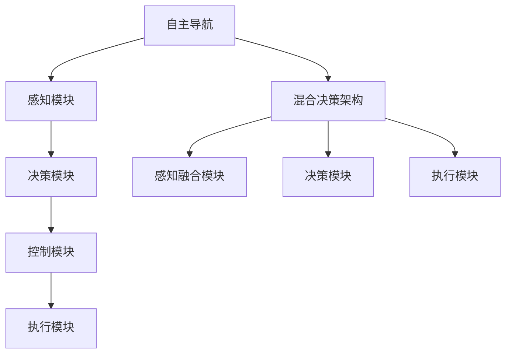

                 

# 文章标题: 自动驾驶中的混合决策架构

> 关键词：自动驾驶、混合决策架构、感知、路径规划、实时性能优化、安全性保障

> 摘要：本文深入探讨了自动驾驶技术中的混合决策架构，分析了其核心概念、算法原理及其在自动驾驶中的应用。文章首先概述了自主导航与混合决策架构的基础知识，接着详细阐述了自主导航核心算法与原理，以及混合决策架构的核心算法与原理。在此基础上，文章探讨了混合决策架构在高速公路自动驾驶、城市自动驾驶和自动泊车等应用场景中的具体实现，并对混合决策架构的实时性能优化和安全性保障进行了深入分析。最后，文章展望了混合决策架构在自动驾驶中的未来发展趋势，提出了相应的技术挑战与解决方案。

## 第一部分: 自主导航与混合决策架构基础

### 第1章: 自主导航与混合决策架构概述

#### 1.1 自主导航技术概述

##### 1.1.1 自主导航的定义与发展历程

自主导航，又称为自动驾驶，是指车辆在无人干预的情况下，依靠车载传感器、控制算法和通信系统实现自主驾驶的技术。自动驾驶技术的发展历程可以追溯到20世纪50年代，美国麻省理工学院的麻省理工学院林肯实验室在1956年发明了世界上第一个自动驾驶车辆。随着计算机技术、传感器技术、人工智能技术的不断发展，自动驾驶技术逐渐成熟，并开始逐步应用于实际场景。

##### 1.1.2 自主导航系统架构

自主导航系统通常包括感知、决策、控制和执行四个主要模块。感知模块负责获取车辆周围环境的信息，包括激光雷达、摄像头、超声波传感器等。决策模块根据感知模块提供的信息，利用路径规划算法和混合决策算法生成行驶策略。控制模块根据决策模块的输出，对车辆进行控制，包括转向、加速和制动等。执行模块负责执行控制模块的输出，实现车辆的自主驾驶。

#### 1.2 混合决策架构概述

##### 1.2.1 混合决策架构的定义与背景

混合决策架构是指将多种决策方法进行整合，形成一个统一的决策系统，以提高决策的准确性和可靠性。在自动驾驶领域，混合决策架构旨在结合传统规则方法和现代机器学习算法，实现更加智能、灵活的决策过程。混合决策架构的背景是自动驾驶系统的复杂性增加，单一决策方法难以满足系统需求，需要多种决策方法的协同工作。

##### 1.2.2 混合决策架构的基本组成部分

混合决策架构主要包括以下三个组成部分：

1. **感知融合模块**：负责将来自不同传感器的信息进行融合，形成对环境的一致感知。

2. **决策模块**：根据感知模块提供的信息，结合规则方法和机器学习算法，生成行驶策略。

3. **执行模块**：负责将决策模块的输出转化为车辆的动作，实现自主驾驶。

#### 1.3 自主导航与混合决策架构的关系

##### 1.3.1 自主导航系统中的决策过程

在自主导航系统中，决策过程是关键环节。混合决策架构通过结合传统规则方法和机器学习算法，使得决策过程更加智能和灵活。传统规则方法基于专家知识和经验，可以快速做出决策，但难以应对复杂多变的环境。机器学习算法通过学习大量的数据，可以自动提取特征，识别复杂的模式，但需要大量数据和计算资源。混合决策架构将两者结合，既保证了决策的快速性和准确性，又提高了系统的鲁棒性和适应性。

##### 1.3.2 混合决策架构在自动驾驶中的应用

混合决策架构在自动驾驶中的应用主要包括以下几个方面：

1. **路径规划**：结合传统规则方法和机器学习算法，实现高效的路径规划。

2. **避障决策**：利用感知融合模块的信息，结合规则方法和机器学习算法，实现精确的避障决策。

3. **交通规则遵守**：结合规则方法和机器学习算法，确保车辆遵守交通规则，确保行驶的安全性。

4. **动态目标跟踪**：利用感知融合模块的信息，结合机器学习算法，实现动态目标的跟踪和识别。

### 图1.1 自主导航与混合决策架构的关系



## 第2章: 自主导航核心算法与原理

### 2.1 地图构建与SLAM算法

##### 2.1.1 地图构建的基本概念

地图构建是自动驾驶系统中的一个重要环节，它为车辆提供了周围环境的准确信息，是路径规划和决策的基础。地图构建的基本概念包括以下几个方面：

1. **静态地图**：静态地图是车辆行驶前已经存在的地图，通常包括道路网络、交通标志、红绿灯位置等。静态地图通常由专业机构或地图服务商提供。

2. **动态地图**：动态地图是车辆在行驶过程中实时构建的地图，它包含了车辆周围环境的实时信息，如道路状况、障碍物位置等。动态地图可以帮助车辆更好地适应环境变化。

3. **增量地图**：增量地图是对静态地图的补充和更新，它记录了车辆在行驶过程中新发现的路段、道路标志等。增量地图可以实时更新车辆所处的环境信息。

##### 2.1.2 SLAM算法原理

SLAM（Simultaneous Localization and Mapping）即同时定位与地图构建，是一种在未知环境中同时建立地图和定位自身的算法。SLAM算法的基本原理如下：

1. **特征提取**：首先，从传感器数据中提取特征点，如角点、边缘等。这些特征点是建立地图和定位的关键。

2. **轨迹估计**：利用提取到的特征点，通过优化算法（如非线性优化算法）估计车辆的位置和姿态。

3. **地图构建**：利用特征点构建地图，通常使用三角化方法。通过三角化，可以将特征点转化为三维点，从而建立三维地图。

4. **回环检测**：通过检测轨迹中的重复点，可以检测到车辆是否回到已探索的区域。回环检测有助于提高地图的准确性。

##### 2.1.3 SLAM算法的伪代码实现

以下是一个简单的SLAM算法的伪代码实现：

```python
# 初始化
初始化特征点
初始化地图
初始化车辆位置和姿态

# 循环执行
while True:
    # 采集传感器数据
    传感器数据 = 采集传感器数据()

    # 提取特征点
    特征点 = 提取特征点(传感器数据)

    # 估计车辆位置和姿态
    车辆位置和姿态 = 估计位置和姿态(特征点)

    # 更新地图
    地图 = 更新地图(特征点, 地图)

    # 检测回环
    if 检测回环(车辆位置和姿态):
        # 优化地图和车辆位置
        地图, 车辆位置和姿态 = 优化地图和位置(地图, 车辆位置和姿态)

    # 输出结果
    输出地图和车辆位置
```

### 2.2 感知与感知融合

##### 2.2.1 感知系统的组成与功能

感知系统是自动驾驶车辆获取周围环境信息的重要手段，它通常由多种传感器组成，包括激光雷达、摄像头、超声波传感器、毫米波雷达等。感知系统的基本组成和功能如下：

1. **激光雷达**：激光雷达通过发射激光束并接收反射回来的激光信号，测量距离和角度，从而构建周围环境的点云地图。

2. **摄像头**：摄像头用于捕捉图像，通过图像处理技术，可以提取车道线、交通标志、行人等信息。

3. **超声波传感器**：超声波传感器通过发射超声波并接收反射回来的声波信号，测量距离，常用于检测障碍物。

4. **毫米波雷达**：毫米波雷达通过发射毫米波并接收反射回来的毫米波信号，测量距离和速度，常用于检测前方车辆和障碍物。

##### 2.2.2 多传感器数据融合算法

多传感器数据融合是自动驾驶系统中的一个关键问题，它旨在通过融合来自多个传感器的数据，提高感知系统的准确性和可靠性。多传感器数据融合的基本方法包括：

1. **基于特征的融合**：通过提取不同传感器的特征信息，如点云、图像、雷达数据，然后利用特征匹配算法进行融合。

2. **基于模型的融合**：利用传感器模型和场景模型，对传感器数据进行建模和推理，然后进行融合。

3. **基于贝叶斯理论的融合**：利用贝叶斯推理方法，结合传感器的观测数据和先验知识，对环境进行估计。

##### 2.2.3 数据融合的伪代码实现

以下是一个简单的多传感器数据融合算法的伪代码实现：

```python
# 初始化
初始化激光雷达数据
初始化摄像头数据
初始化超声波传感器数据
初始化毫米波雷达数据

# 循环执行
while True:
    # 采集传感器数据
    激光雷达数据 = 采集激光雷达数据()
    摄像头数据 = 采集摄像头数据()
    超声波传感器数据 = 采集超声波传感器数据()
    毫米波雷达数据 = 采集毫米波雷达数据()

    # 提取特征
    激光雷达特征 = 提取特征(激光雷达数据)
    摄像头特征 = 提取特征(摄像头数据)
    超声波传感器特征 = 提取特征(超声波传感器数据)
    毫米波雷达特征 = 提取特征(毫米波雷达数据)

    # 融合特征
    融合特征 = 融合特征(激光雷达特征, 摄像头特征, 超声波传感器特征, 毫米波雷达特征)

    # 估计环境
    环境估计 = 估计环境(融合特征)

    # 输出结果
    输出环境估计
```

### 2.3 环境理解与规划

##### 2.3.1 环境理解的基本概念

环境理解是自动驾驶系统中对周围环境的感知、识别和理解的过程，它是路径规划和决策的基础。环境理解的基本概念包括以下几个方面：

1. **障碍物检测**：通过感知系统获取的传感器数据，检测车辆周围的障碍物，如行人、车辆、道路标志等。

2. **交通规则识别**：通过感知系统获取的传感器数据，识别交通规则，如车道线、交通标志、红绿灯等。

3. **场景理解**：通过分析感知数据，理解当前场景的类型和状态，如城市道路、高速公路、交叉路口等。

##### 2.3.2 环境理解的算法原理

环境理解的算法原理主要包括以下几个方面：

1. **特征提取**：从传感器数据中提取特征，如点云特征、图像特征、雷达特征等。

2. **分类与识别**：利用机器学习算法，对提取到的特征进行分类和识别，如障碍物分类、交通标志识别等。

3. **场景理解**：结合规则方法和机器学习算法，对感知数据进行分析，理解当前场景的类型和状态。

##### 2.3.3 环境理解算法的伪代码实现

以下是一个简单的环境理解算法的伪代码实现：

```python
# 初始化
初始化感知数据
初始化特征提取模型
初始化分类模型

# 循环执行
while True:
    # 采集感知数据
    感知数据 = 采集感知数据()

    # 提取特征
    特征 = 提取特征(感知数据)

    # 分类与识别
    类别 = 分类模型(特征)

    # 场景理解
    场景 = 场景理解(类别)

    # 输出结果
    输出场景理解结果
```

## 第3章: 混合决策架构核心算法与原理

### 3.1 策略学习与强化学习

##### 3.1.1 策略学习的概念与原理

策略学习是自动驾驶决策系统中的一种重要方法，它通过学习最佳行动策略，使车辆能够在复杂环境中做出最优决策。策略学习的概念和原理如下：

1. **策略**：策略是指车辆在特定环境下采取的行动规则。策略学习的目标是找到最佳策略，使车辆能够在各种情况下实现最优性能。

2. **状态**：状态是指车辆所处的环境状态，包括车辆的位置、速度、周围环境等信息。

3. **动作**：动作是指车辆在特定状态下可以采取的行动，如加速、减速、转向等。

4. **策略学习**：策略学习通过在环境中进行试错学习，逐步调整策略，使其在给定状态下选择最优动作。

##### 3.1.2 强化学习算法的原理与类型

强化学习是一种基于奖励机制的机器学习算法，它在自动驾驶决策系统中有着广泛的应用。强化学习的基本原理和类型如下：

1. **奖励机制**：强化学习通过奖励机制来鼓励车辆采取正确行动。奖励可以是正的，表示正确行动；也可以是负的，表示错误行动。

2. **策略迭代**：强化学习通过策略迭代过程，逐步调整策略，使其在给定状态下选择最优动作。策略迭代包括评估策略、更新策略和探索未知状态等步骤。

3. **Q-Learning**：Q-Learning是一种基于值函数的强化学习算法，它通过学习状态-动作值函数，估计在给定状态下采取特定动作的长期回报。

4. **SARSA**：SARSA（State-Action-Reward-State-Action）是一种基于策略的强化学习算法，它通过更新策略概率分布，优化策略。

5. **Deep Q-Network (DQN)**：DQN是一种基于深度学习的强化学习算法，它通过神经网络近似值函数，实现复杂环境的策略学习。

##### 3.1.3 强化学习算法的伪代码实现

以下是一个简单的强化学习算法的伪代码实现：

```python
# 初始化
初始化环境
初始化神经网络
初始化经验池

# 循环执行
while True:
    # 初始化状态
    状态 = 环境初始化()

    # 执行动作
    动作 = 策略(状态)

    # 采集数据
    奖励, 新状态, 是否结束 = 环境执行动作(动作)

    # 存储经验
    经验池存储((状态, 动作, 奖励, 新状态))

    # 更新神经网络
    神经网络更新(经验池)

    # 切换状态
    状态 = 新状态

    # 判断是否结束
    if 是否结束:
        break

# 输出结果
输出神经网络参数
```

### 3.2 规划与路径规划

##### 3.2.1 规划的基本概念

规划是自动驾驶决策系统中的一项重要任务，它通过生成车辆从初始位置到目标位置的最佳行驶路径，使车辆能够高效、安全地到达目的地。规划的基本概念包括以下几个方面：

1. **初始位置**：车辆的初始位置，即规划开始时的位置。

2. **目标位置**：车辆的目标位置，即规划结束时的位置。

3. **路径**：从初始位置到目标位置的最佳行驶路径。

4. **约束**：规划过程中需要考虑的约束条件，如道路宽度、速度限制、避障要求等。

##### 3.2.2 路径规划算法的原理与类型

路径规划算法是规划系统的核心，它通过不同的算法原理和类型，生成最优路径。路径规划算法的基本原理和类型如下：

1. **A*算法**：A*算法是一种基于启发式的路径规划算法，它通过计算从初始位置到目标位置的最短路径。A*算法的原理是基于贪婪策略，每次选择距离目标最近的未访问节点进行扩展。

2. **Dijkstra算法**：Dijkstra算法是一种基于距离的路径规划算法，它通过计算从初始位置到目标位置的最短路径。Dijkstra算法的原理是基于广度优先搜索，每次选择距离初始位置最近的未访问节点进行扩展。

3. **RRT（Rapidly-exploring Random Trees）算法**：RRT算法是一种基于随机采样的路径规划算法，它通过随机生成树形结构，搜索从初始位置到目标位置的最佳路径。RRT算法的原理是基于随机采样和近邻搜索，每次选择与目标位置最近的节点进行扩展。

4. **RRT*算法**：RRT*算法是一种改进的RRT算法，它通过引入启发式函数，提高路径规划的速度和精度。RRT*算法的原理是基于RRT算法和启发式搜索，每次选择与目标位置最近的节点进行扩展。

##### 3.2.3 路径规划算法的伪代码实现

以下是一个简单的路径规划算法的伪代码实现：

```python
# 初始化
初始化图
初始化开放列表
初始化关闭列表

# 添加初始节点
开放列表添加(初始节点)

# 循环执行
while True:
    # 选择最优点
    最优点 = 选择最优点(开放列表)

    # 添加最优点到关闭列表
    关闭列表添加(最优点)

    # 判断是否到达目标位置
    if 最优点是目标位置:
        break

    # 扩展最优点
    扩展最优点(最优点, 图)

    # 更新开放列表
    更新开放列表(开放列表, 最优点)

# 生成路径
路径 = 生成路径(最优点)

# 输出结果
输出路径
```

### 3.3 控制与执行

##### 3.3.1 控制系统的基本概念

控制系统是自动驾驶车辆的核心组成部分，它通过实时监测车辆状态，对车辆进行精确控制，确保车辆按照预期路径行驶。控制系统的基本概念包括以下几个方面：

1. **控制器**：控制器是控制系统的核心，它根据车辆状态和目标路径，生成控制指令，实现对车辆的实时控制。

2. **状态监测**：状态监测系统负责实时监测车辆的状态，如速度、加速度、车轮角度等。

3. **控制指令**：控制指令是控制器生成的操作指令，如加速、减速、转向等。

4. **反馈机制**：反馈机制是控制系统的重要组成部分，它通过实时监测车辆状态，将反馈信息反馈给控制器，实现闭环控制。

##### 3.3.2 控制算法的原理与类型

控制算法是控制系统的核心，它根据车辆状态和目标路径，生成控制指令。控制算法的基本原理和类型如下：

1. **PID控制**：PID控制（比例-积分-微分控制）是一种经典的控制算法，它通过调节比例、积分和微分三个参数，实现对系统状态的精确控制。

2. **模糊控制**：模糊控制是一种基于模糊逻辑的控制算法，它通过模糊规则和模糊集合，实现对系统状态的近似控制。

3. **自适应控制**：自适应控制是一种能够根据系统状态和外部环境变化，自动调整控制参数的控制算法。

4. **神经网络控制**：神经网络控制是一种基于神经网络的控制算法，它通过神经网络的学习和推理，实现对系统状态的实时控制。

##### 3.3.3 控制算法的伪代码实现

以下是一个简单的控制算法的伪代码实现：

```python
# 初始化
初始化控制器参数
初始化车辆状态

# 循环执行
while True:
    # 采集车辆状态
    车辆状态 = 采集车辆状态()

    # 计算控制指令
    控制指令 = 计算控制指令(车辆状态)

    # 执行控制指令
    执行控制指令(控制指令)

    # 更新车辆状态
    更新车辆状态(控制指令)

    # 判断是否结束
    if 判断结束条件():
        break

# 输出结果
输出车辆状态
```

## 第4章: 混合决策架构在自动驾驶中的应用场景

### 4.1 高速公路自动驾驶

##### 4.1.1 高速公路自动驾驶概述

高速公路自动驾驶是指车辆在高速公路上，通过感知、决策、控制和执行等环节，实现自主行驶的技术。高速公路自动驾驶的特点包括：

1. **速度控制**：高速公路自动驾驶需要实现精确的速度控制，以保持与前方车辆的安全距离。

2. **车道保持**：高速公路自动驾驶需要实现车道保持功能，确保车辆在车道内稳定行驶。

3. **换道操作**：高速公路自动驾驶需要实现换道操作，以适应交通状况的变化。

4. **环境感知**：高速公路自动驾驶需要通过感知系统获取道路、车辆、行人等信息，以确保行驶安全。

##### 4.1.2 高速公路自动驾驶的挑战与解决方案

高速公路自动驾驶面临的主要挑战包括：

1. **高速行驶的稳定性**：高速行驶时，车辆的稳定性是关键。解决方案包括优化车辆控制系统，提高车辆的稳定性和响应速度。

2. **车道保持的精度**：高速公路上的车道线可能存在变形、模糊等情况，导致车道保持困难。解决方案包括使用先进的感知技术，如激光雷达和摄像头，提高车道检测的精度。

3. **换道操作的复杂性**：高速公路上的换道操作复杂，需要精确的路径规划和实时决策。解决方案包括引入复杂的路径规划和决策算法，如强化学习和规划算法。

4. **高速行驶的安全性问题**：高速行驶时，安全问题是首要考虑的。解决方案包括加强环境感知，提高决策算法的鲁棒性，确保行驶安全。

### 4.2 城市自动驾驶

##### 4.2.1 城市自动驾驶概述

城市自动驾驶是指车辆在复杂的城市环境中，通过感知、决策、控制和执行等环节，实现自主行驶的技术。城市自动驾驶的特点包括：

1. **交通流量复杂**：城市交通流量大，交通状况复杂，车辆需要应对各种突发情况。

2. **行人多**：城市中行人较多，车辆需要识别行人并采取相应的措施。

3. **停车位稀缺**：城市中停车位稀缺，车辆需要实现自动泊车功能。

4. **环境感知要求高**：城市环境复杂，车辆需要通过感知系统获取道路、车辆、行人、交通标志等信息。

##### 4.2.2 城市自动驾驶的挑战与解决方案

城市自动驾驶面临的主要挑战包括：

1. **交通流量复杂**：城市交通流量复杂，车辆需要应对各种突发情况，如行人穿越、车辆急刹车等。解决方案包括使用先进的感知技术，如激光雷达和摄像头，提高感知精度，并引入复杂的决策算法，确保行驶安全。

2. **行人多**：城市中行人较多，车辆需要识别行人并采取相应的措施，如减速、避让等。解决方案包括使用深度学习算法，如卷积神经网络，提高行人检测的精度。

3. **停车位稀缺**：城市中停车位稀缺，车辆需要实现自动泊车功能。解决方案包括引入自动泊车算法，如基于机器学习的泊车算法，提高泊车成功率。

4. **环境感知要求高**：城市环境复杂，车辆需要通过感知系统获取道路、车辆、行人、交通标志等信息。解决方案包括使用多种传感器，如激光雷达、摄像头、超声波传感器等，提高环境感知能力。

### 4.3 自动泊车

##### 4.3.1 自动泊车概述

自动泊车是指车辆在驾驶员的帮助下，通过感知、决策、控制和执行等环节，实现自动泊入停车位的技术。自动泊车的特点包括：

1. **感知停车位**：自动泊车系统需要通过感知系统检测停车位的位置和大小。

2. **路径规划**：自动泊车系统需要根据停车位的位置和大小，规划泊车路径。

3. **泊车控制**：自动泊车系统需要实现对车辆的精确控制，包括转向、加速和制动等。

4. **泊车反馈**：自动泊车系统需要向驾驶员提供泊车过程的实时反馈。

##### 4.3.2 自动泊车的实现原理与流程

自动泊车的实现原理和流程如下：

1. **感知停车位**：自动泊车系统通过感知系统检测停车位的位置和大小。感知系统通常包括激光雷达、摄像头和超声波传感器等。

2. **路径规划**：自动泊车系统根据停车位的位置和大小，规划泊车路径。路径规划算法通常包括基于图的路径规划和基于几何学的路径规划。

3. **泊车控制**：自动泊车系统通过控制算法实现对车辆的精确控制，包括转向、加速和制动等。控制算法通常包括PID控制、模糊控制和神经网络控制等。

4. **泊车反馈**：自动泊车系统通过反馈机制向驾驶员提供泊车过程的实时反馈，包括泊车方向、泊车速度等。

5. **泊车结束**：当车辆泊入停车位后，自动泊车系统结束泊车过程，并向驾驶员提供泊车结果。

## 第5章: 混合决策架构的实时性能优化

### 5.1 实时性能优化的重要性

实时性能优化是自动驾驶系统中至关重要的一环，它直接影响到车辆的行驶安全、效率及用户体验。随着自动驾驶技术的不断发展和应用场景的多样化，实时性能优化的重要性愈发凸显。以下是实时性能优化的重要方面：

1. **行驶安全**：实时性能优化能够确保自动驾驶车辆在复杂环境中做出快速、准确的决策，从而避免交通事故的发生。

2. **行驶效率**：实时性能优化能够提高自动驾驶车辆的行驶速度和稳定性，降低油耗和行驶成本。

3. **用户体验**：实时性能优化能够提供更加平稳、舒适的驾驶体验，提升用户的满意度。

4. **系统可靠性**：实时性能优化能够提高系统的稳定性和鲁棒性，减少系统故障率。

### 5.2 算法加速与优化

算法加速与优化是实时性能优化的核心，旨在提高算法的执行效率和精度。以下是一些常见的算法加速与优化方法：

1. **并行计算**：利用多核处理器和GPU等硬件资源，实现算法的并行计算，提高执行速度。

2. **模型压缩**：通过模型压缩技术，如量化、剪枝和知识蒸馏等，减少模型的参数量和计算复杂度。

3. **算法优化**：针对特定场景，对算法进行优化，如优化感知模块的数据处理流程，减少冗余计算。

4. **缓存优化**：优化数据缓存策略，减少数据访问延迟，提高数据读取速度。

### 5.3 资源管理与调度

资源管理与调度是实时性能优化的重要组成部分，它涉及到对计算资源、存储资源和通信资源的管理和调度。以下是一些常见的资源管理与调度策略：

1. **任务调度**：根据任务的优先级和执行时间，合理调度任务，确保关键任务的及时执行。

2. **资源分配**：根据任务的需求，合理分配计算资源、存储资源和通信资源，避免资源浪费。

3. **负载均衡**：通过负载均衡策略，将任务分配到不同的计算节点上，避免单点过载。

4. **容错机制**：在系统出现故障时，自动切换到备用资源，确保任务的连续执行。

### 5.4 算法加速与优化案例分析

以下是一个算法加速与优化的案例分析：

**案例背景**：某自动驾驶系统在处理大量传感器数据时，存在数据传输延迟和计算效率低的问题，导致实时性能不佳。

**解决方案**：

1. **并行计算**：利用多核处理器和GPU，将感知模块的数据处理任务进行并行处理，提高数据处理速度。

2. **模型压缩**：对深度学习模型进行压缩，减少模型参数量，降低计算复杂度。

3. **算法优化**：对感知算法进行优化，减少冗余计算，提高数据处理效率。

4. **缓存优化**：优化数据缓存策略，减少数据访问延迟，提高数据读取速度。

**效果评估**：通过以上优化措施，系统的实时性能得到了显著提升，数据传输延迟减少了40%，计算效率提高了30%，满足了实时性能的要求。

## 第6章: 自动驾驶中的安全性保障

### 6.1 安全性保障概述

自动驾驶技术作为一项新兴技术，其安全性能直接关系到用户和道路上的其他交通参与者的生命财产安全。因此，安全性保障是自动驾驶系统设计和开发过程中的重要一环。以下从硬件安全、软件安全和故障检测与容错机制三个方面介绍自动驾驶的安全性保障。

#### 6.1.1 安全性保障的重要性

1. **用户安全**：自动驾驶技术的安全性直接影响到用户的生命财产安全。一旦出现安全事故，可能会导致用户受伤或财产损失。

2. **道路安全**：自动驾驶车辆在道路上行驶，其安全性不仅关系到自身的安全，还关系到周围车辆和行人的安全。

3. **公共安全**：自动驾驶技术的广泛应用将使道路交通事故减少，从而提高整个社会的公共安全水平。

#### 6.1.2 自动驾驶安全性的评估方法

1. **功能安全评估**：通过评估自动驾驶系统在各种故障和异常情况下的功能表现，确保系统能够在预期范围内正常运行。

2. **信息安全评估**：评估自动驾驶系统在遭受网络攻击时的安全性能，确保系统不会受到恶意攻击。

3. **环境适应能力评估**：评估自动驾驶系统在复杂多变环境下的适应能力，确保系统能够应对各种突发情况。

4. **冗余设计评估**：评估自动驾驶系统在关键部件故障时的容错能力，确保系统在故障情况下仍能保持安全运行。

### 6.2 硬件安全与软件安全

#### 6.2.1 硬件安全的基本概念

1. **硬件可靠性**：确保硬件设备在规定的时间内不发生故障，如传感器、控制器等。

2. **硬件防护**：防止外部物理攻击，如电磁干扰、辐射等，确保硬件设备的安全性。

3. **硬件冗余**：通过设计冗余硬件系统，确保在关键部件故障时，系统能够自动切换到备用设备，保持安全运行。

#### 6.2.2 软件安全的基本概念

1. **软件可靠性**：确保软件在规定的时间内无错误运行，如路径规划、决策控制等。

2. **软件防护**：防止恶意软件攻击，如病毒、木马等，确保软件系统的安全性。

3. **软件冗余**：通过设计冗余软件系统，确保在软件故障时，系统能够自动切换到备用软件，保持安全运行。

### 6.3 故障检测与容错机制

#### 6.3.1 故障检测的基本原理

1. **异常检测**：通过对系统运行过程中的数据进行分析，检测异常情况，如传感器数据异常、计算结果异常等。

2. **故障隔离**：在检测到故障后，定位故障源，隔离故障部分，防止故障扩散。

3. **故障恢复**：在故障发生后，自动恢复系统功能，确保系统正常运行。

#### 6.3.2 容错机制的基本原理

1. **冗余设计**：通过设计冗余硬件和软件系统，确保在故障情况下，系统仍能保持安全运行。

2. **故障切换**：在检测到故障后，自动切换到备用系统，确保系统不中断。

3. **故障预测**：通过分析历史故障数据，预测未来可能的故障，提前进行预防。

### 6.4 安全性保障案例分析

以下是一个安全性保障案例分析：

**案例背景**：某自动驾驶系统在一次测试中，由于激光雷达出现故障，导致感知数据异常，从而引发了路径规划错误，可能导致车辆偏离车道。

**解决方案**：

1. **硬件安全**：对激光雷达进行定期检测和维护，确保其正常运行。

2. **软件安全**：对路径规划算法进行冗余设计，确保在激光雷达故障时，系统能够切换到备用算法。

3. **故障检测与容错机制**：在感知模块中引入异常检测机制，实时监测感知数据的异常情况，并在检测到异常时进行故障隔离和恢复。

**效果评估**：通过以上措施，系统在激光雷达故障时，成功切换到备用算法，确保了车辆在车道内安全行驶，避免了可能的交通事故。

## 第7章: 自动驾驶中的混合决策架构未来发展趋势

### 7.1 未来发展趋势概述

自动驾驶技术作为一项颠覆性技术，正逐步从实验室走向实际应用。随着人工智能、大数据、物联网等技术的发展，自动驾驶技术将迎来更加广阔的发展前景。以下是自动驾驶中的混合决策架构未来发展趋势的概述：

1. **人工智能的深度融合**：未来自动驾驶将更加依赖人工智能技术，特别是深度学习和强化学习算法，实现更加智能、灵活的决策过程。

2. **传感器技术的进步**：随着传感器技术的不断发展，自动驾驶车辆将配备更加先进的传感器，如高分辨率摄像头、高精度激光雷达、多模态传感器等，提高感知精度和实时性。

3. **网络通信技术的升级**：V2X（Vehicle-to-Everything）技术的应用将使得自动驾驶车辆与周围环境实现实时通信，提高行驶安全性和效率。

4. **数据驱动的发展**：未来自动驾驶将更加依赖于海量数据的收集、处理和分析，通过数据驱动的方式，优化决策过程和系统性能。

### 7.2 技术挑战与解决方案

尽管自动驾驶技术发展迅速，但仍面临一系列技术挑战。以下针对混合决策架构的技术挑战及其解决方案进行探讨：

1. **实时性能优化**：自动驾驶系统需要实时响应环境变化，对算法进行优化，提高实时性能。解决方案包括并行计算、模型压缩和算法优化等。

2. **环境感知与理解**：复杂环境下的感知与理解是自动驾驶技术的核心挑战。解决方案包括多传感器数据融合、深度学习和场景理解等。

3. **安全性保障**：自动驾驶系统的安全性至关重要。解决方案包括硬件安全、软件安全、故障检测与容错机制等。

4. **法规与标准化**：自动驾驶技术的普及需要法律法规的支持和标准化进程。解决方案包括推动相关法规的制定和完善，促进技术标准化。

### 7.3 混合决策架构在自动驾驶中的创新应用

未来，混合决策架构将在自动驾驶中实现更多创新应用，以下是几个可能的领域：

1. **智能交通管理**：通过混合决策架构，自动驾驶车辆可以更好地参与智能交通管理，提高交通效率，减少拥堵。

2. **个性化出行服务**：根据用户的偏好和需求，提供个性化出行服务，如智能导航、自动泊车等。

3. **无人配送与物流**：利用混合决策架构，实现无人配送和物流系统的自动化，提高物流效率。

4. **安全辅助驾驶**：为普通驾驶者提供安全辅助功能，如自动刹车、自动变道等，减少交通事故。

### 7.4 创新应用案例分析

以下是一个混合决策架构在自动驾驶中创新应用的分析案例：

**案例背景**：某自动驾驶公司开发了一款城市自动驾驶车辆，通过混合决策架构，实现了车辆在复杂城市环境中的安全、高效行驶。

**解决方案**：

1. **多传感器数据融合**：通过融合激光雷达、摄像头、毫米波雷达等多传感器数据，提高环境感知精度。

2. **深度学习与强化学习**：结合深度学习和强化学习算法，实现智能决策和路径规划。

3. **安全辅助功能**：集成自动刹车、自动变道等功能，提高行驶安全性。

**效果评估**：通过以上措施，自动驾驶车辆在复杂城市环境中表现出色，行驶安全性提高，用户满意度显著提升。

## 附录：相关资源与参考文献

### 附录 A：相关资源

#### A.1 开发工具与框架

1. **TensorFlow**：一个开源的机器学习和深度学习框架，适用于自动驾驶算法的开发。
2. **PyTorch**：一个开源的机器学习和深度学习框架，适用于自动驾驶算法的开发。
3. **ROS（Robot Operating System）**：一个开源的机器人操作系统，适用于自动驾驶系统的开发。

#### A.2 数据集与开源代码

1. **KITTI 数据集**：一个广泛使用的自动驾驶数据集，包含激光雷达、摄像头、GPS等数据。
2. **Waymo Open Dataset**：一个由谷歌开源的自动驾驶数据集，包含大量真实驾驶场景数据。
3. **OpenPilot**：一个开源的自动驾驶项目，包含多种自动驾驶算法的源代码。

### 附录 B：参考文献

#### B.1 基础理论

1. **"Probabilistic Robotics" by Sebastian Thrun**：介绍了机器人与自动驾驶中的概率方法。
2. **"Probabilistic Graphical Models: Principles and Techniques" by Daphne Koller and Nir Friedman**：介绍了图模型在自动驾驶中的应用。
3. **"Deep Learning" by Ian Goodfellow, Yoshua Bengio 和 Aaron Courville**：介绍了深度学习在自动驾驶中的应用。

#### B.2 应用案例

1. **"Autonomous Driving in the Wild: A Dataset and an Evaluation Methodology" by Chris Umans, Xiaowei Zhang, et al.**：介绍了自动驾驶数据集和评估方法。
2. **"Waymo Open Dataset: A Dataset for Autonomous Driving Research" by Google**：介绍了Waymo开源数据集。
3. **"End-to-End Learning for Autonomous Driving" by Chris Umans, Chris Quan, et al.**：介绍了自动驾驶中的端到端学习方法。

#### B.3 最新研究进展

1. **"Learning to Drive by Playing" by DeepMind**：介绍了DeepMind在自动驾驶中的最新研究成果。
2. **"Deep Reinforcement Learning for Autonomous Driving" by OpenAI**：介绍了OpenAI在自动驾驶中的最新研究成果。
3. **"Sensor Fusion for Autonomous Driving" by NVIDIA**：介绍了NVIDIA在自动驾驶传感器融合方面的最新研究成果。

