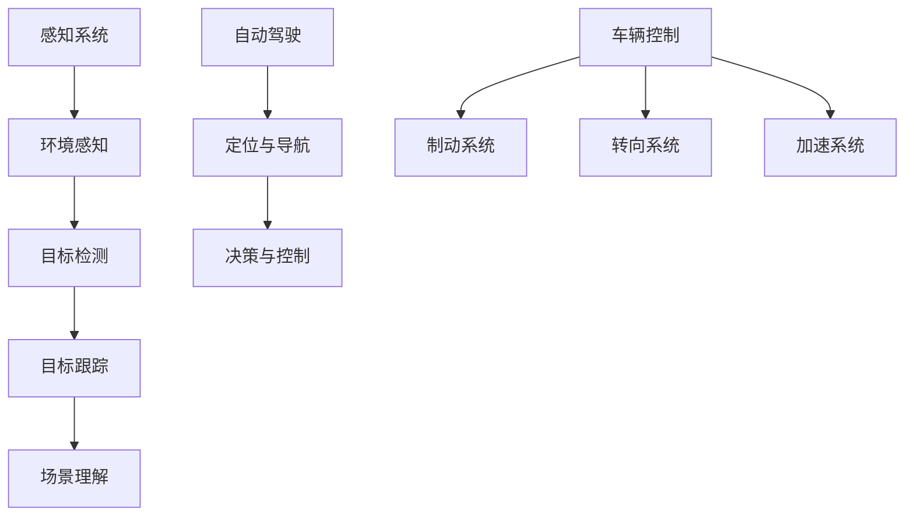
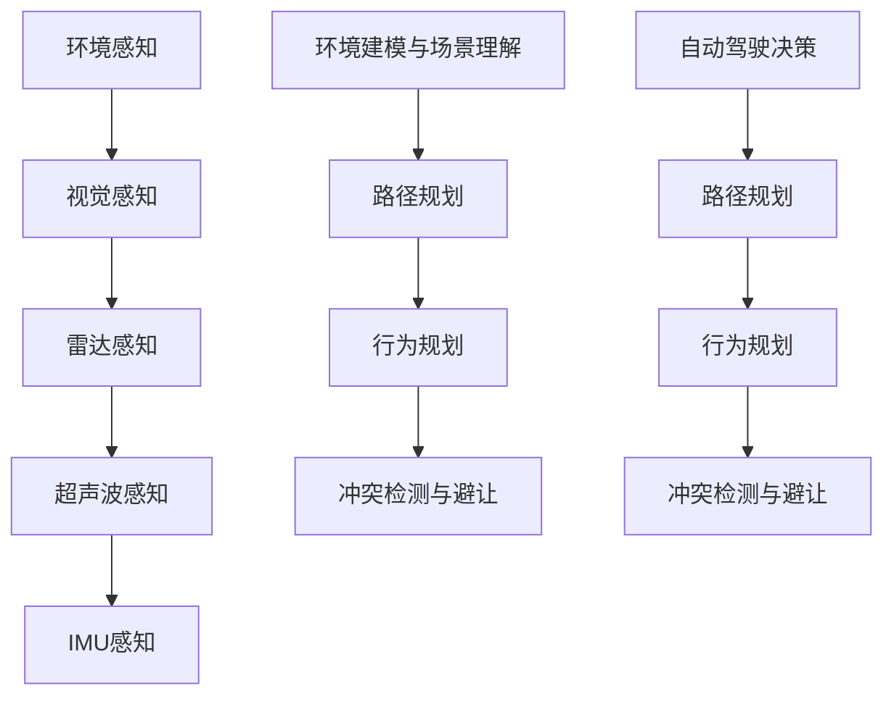
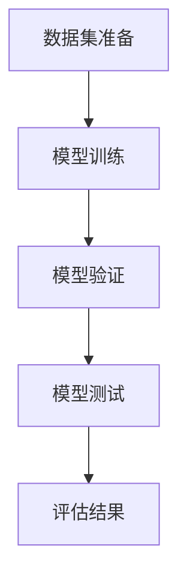

                 

# 文章标题：自动驾驶中的视觉-雷达融合感知

> 关键词：自动驾驶、感知系统、视觉感知、雷达感知、融合算法

> 摘要：本文深入探讨了自动驾驶领域中的视觉-雷达融合感知技术。通过分析视觉和雷达感知的原理、算法和应用，本文详细阐述了如何实现视觉-雷达融合感知，以提升自动驾驶系统的性能和安全性。文章还通过实际项目案例，展示了融合感知系统的开发过程和关键技术的实现方法。

---

## 引言

自动驾驶技术作为人工智能领域的热点，正逐步从实验室走向现实。感知系统是自动驾驶的核心组成部分，负责收集和处理环境信息，以支持车辆的安全行驶。其中，视觉感知和雷达感知是最常用的两种感知技术。视觉感知基于摄像头捕捉图像信息，具有直观、高分辨率等优点；雷达感知则利用雷达发射和接收信号，能够有效探测距离和速度，适用于恶劣天气条件下的感知任务。

随着自动驾驶技术的发展，单一感知技术已难以满足复杂环境下的感知需求。因此，将视觉和雷达感知技术进行融合，形成多源信息融合感知系统，成为当前研究的热点。本文将从以下几个方面展开讨论：

1. **自动驾驶与感知系统基础**：介绍自动驾驶的基本概念、感知系统的作用以及感知系统在自动驾驶中的地位。
2. **视觉感知技术**：讲解视觉感知的原理、图像处理基础以及视觉感知算法。
3. **雷达感知技术**：阐述雷达感知的原理、雷达信号处理以及雷达感知算法。
4. **视觉-雷达融合感知**：探讨融合感知的基本概念、算法以及融合感知的优势与挑战。
5. **融合感知系统应用**：分析车辆检测与跟踪、行人检测与跟踪以及环境感知与决策等实际应用场景。
6. **融合感知系统的测试与评估**：介绍测试方法、评估标准以及案例分析与评估。
7. **附录**：提供融合感知系统开发工具与资源、项目实战以及代码解读与分析。

## 第一部分：自动驾驶感知系统概述

### 第1章：自动驾驶与感知系统基础

#### 1.1 自动驾驶简介

自动驾驶技术是指通过计算机程序控制车辆，使其能够自主完成驾驶任务的技术。根据国际汽车工程师协会（SAE）的定义，自动驾驶可分为0到5级，其中0级为完全人工驾驶，5级为完全自动驾驶。

自动驾驶技术涉及多个领域，包括计算机视觉、机器学习、控制理论等。随着人工智能技术的不断进步，自动驾驶汽车在安全性、舒适性以及效率等方面展现出巨大的潜力。

#### 1.2 感知系统的作用与挑战

感知系统是自动驾驶的核心组成部分，负责收集和处理环境信息，以支持车辆的安全行驶。感知系统的作用主要包括：

1. **环境感知**：通过摄像头、激光雷达、超声波传感器等设备，获取周围环境的信息。
2. **目标检测**：识别并定位道路上的车辆、行人、障碍物等目标。
3. **目标跟踪**：跟踪目标在一段时间内的运动轨迹。
4. **场景理解**：理解道路状况、交通信号等环境信息。

然而，感知系统在实现过程中面临着一系列挑战，包括：

1. **数据多样性**：不同环境、不同光照条件下的数据处理。
2. **数据噪声**：传感器产生的噪声会影响目标检测和跟踪的准确性。
3. **实时性**：感知系统需要实时处理大量的数据，以支持车辆的快速响应。

#### 1.3 感知系统在自动驾驶中的地位

感知系统在自动驾驶中具有至关重要的地位。它可以提供以下关键信息：

1. **道路信息**：感知系统可以识别道路线、车道线等，帮助车辆进行定位和导航。
2. **目标信息**：感知系统可以检测并跟踪道路上的车辆、行人等目标，以便进行避让和决策。
3. **环境信息**：感知系统可以感知道路状况、交通信号等，为自动驾驶决策提供支持。

综上所述，感知系统是自动驾驶技术的核心组成部分，其性能和稳定性直接关系到自动驾驶车辆的安全性和可靠性。因此，深入研究感知系统的原理、算法和应用具有重要意义。

---

**Mermaid流程图**



### 第2章：视觉感知技术

#### 2.1 视觉感知原理

视觉感知是基于摄像头捕捉图像信息，然后通过图像处理算法对图像进行分析和理解。视觉感知系统主要包括以下几个部分：

1. **摄像头**：负责捕捉图像信息。
2. **图像预处理**：包括图像去噪、灰度化、滤波等操作，以提高图像质量。
3. **特征提取**：通过算法提取图像中的特征，如边缘、角点、纹理等。
4. **目标检测**：根据特征信息识别并定位图像中的目标。
5. **目标跟踪**：跟踪目标在一段时间内的运动轨迹。

视觉感知的原理可以概括为：通过摄像头获取图像，然后利用图像处理算法对图像进行分析和理解，最终实现对目标的识别和跟踪。

#### 2.2 图像处理基础

图像处理是视觉感知的重要环节，主要包括以下内容：

1. **图像去噪**：去除图像中的噪声，提高图像质量。
2. **图像滤波**：通过滤波器对图像进行滤波，去除高频噪声。
3. **图像灰度化**：将彩色图像转换为灰度图像，简化图像处理。
4. **边缘检测**：检测图像中的边缘，有助于目标检测和跟踪。
5. **角点检测**：检测图像中的角点，有助于特征提取。

常见的图像处理算法包括：

1. **中值滤波**：通过取邻域内的中值来去除噪声。
2. **高斯滤波**：通过高斯函数进行滤波，平滑图像。
3. **Sobel算子**：用于检测图像中的边缘。
4. **Canny算法**：用于边缘检测，能够有效去除噪声。

#### 2.3 视觉感知算法

视觉感知算法主要包括以下几种：

1. **基于特征的算法**：通过提取图像中的特征进行目标检测和跟踪，如SIFT、SURF等。
2. **基于模型的算法**：通过建立模型对图像进行分类和识别，如支持向量机（SVM）、卷积神经网络（CNN）等。
3. **基于深度学习的算法**：利用深度学习模型对图像进行处理和分析，如ResNet、YOLO等。

**伪代码**

```python
# 输入：图像I
# 输出：检测到的目标列表D

# 步骤1：图像预处理
I = preprocess(I)

# 步骤2：特征提取
features = extractFeatures(I)

# 步骤3：目标检测
D = detectObjects(features)

# 步骤4：目标跟踪
tracks = trackObjects(D)

# 步骤5：结果输出
output(tracks)
```

通过上述算法，视觉感知系统能够实现对目标的识别和跟踪，为自动驾驶提供关键信息。

### 第二部分：雷达感知技术

#### 第3章：雷达感知基础

#### 3.1 雷达原理

雷达（Radio Detection and Ranging）是一种利用电磁波进行目标探测和测距的技术。雷达发射电磁波，当电磁波遇到目标时会发生反射，雷达接收反射信号，然后通过分析反射信号的时间差和频率变化来确定目标的位置、距离和速度等信息。

雷达系统主要包括以下几个部分：

1. **发射器**：发射电磁波。
2. **接收器**：接收反射信号。
3. **信号处理器**：对接收信号进行放大、滤波、调制等处理。

雷达按照工作频率可分为不同类型，如超高频雷达、微波雷达、毫米波雷达等。其中，毫米波雷达具有分辨率高、抗干扰能力强等优点，在自动驾驶领域中应用广泛。

#### 3.2 雷达信号处理

雷达信号处理是雷达感知的关键环节，主要包括以下内容：

1. **信号放大**：放大接收信号，提高信噪比。
2. **信号滤波**：去除噪声，提取有用信息。
3. **信号调制**：对信号进行调制，以便于传输和接收。
4. **信号解调**：对接收信号进行解调，恢复原始信息。

雷达信号处理的目的是提高信号质量，从而获得更准确的目标信息。

#### 3.3 雷达感知算法

雷达感知算法主要包括以下几种：

1. **距离检测算法**：通过分析反射信号的时间差来计算目标距离。
   $$ d = \frac{c \cdot t}{2} $$
   其中，$ c $为光速，$ t $为信号往返时间。
   
2. **速度检测算法**：通过分析反射信号的频率变化来计算目标速度。
   $$ v = \frac{f_r - f_0}{f_0} \cdot c $$
   其中，$ f_r $为接收信号频率，$ f_0 $为发射信号频率。

3. **角度检测算法**：通过分析反射信号的方向来确定目标角度。

雷达感知算法的核心在于如何从接收信号中提取目标信息，并对其进行准确的处理和分析。

---

**数学模型与公式**

雷达距离检测模型：

$$
d = \frac{c \cdot t}{2}
$$

其中，$ c $为光速，$ t $为信号往返时间。

雷达速度检测模型：

$$
v = \frac{f_r - f_0}{f_0} \cdot c
$$

其中，$ f_r $为接收信号频率，$ f_0 $为发射信号频率。

---

通过雷达原理和信号处理技术的分析，雷达感知技术能够有效地探测和识别周围环境中的目标，为自动驾驶感知系统提供重要支持。

### 第4章：视觉-雷达融合感知

#### 4.1 融合感知的基本概念

视觉-雷达融合感知是指将视觉和雷达两种感知技术相结合，利用各自的优势，提高自动驾驶感知系统的性能和可靠性。融合感知的基本概念包括以下几个方面：

1. **数据融合**：将视觉和雷达传感器采集的数据进行整合，以获得更全面的环境信息。
2. **特征融合**：提取视觉和雷达数据的特征信息，并对其进行融合，以提高目标检测和跟踪的准确性。
3. **算法融合**：结合视觉和雷达感知算法，形成一套综合的感知系统。

视觉-雷达融合感知系统通常包括以下几个模块：

1. **数据采集模块**：负责采集视觉和雷达传感器的数据。
2. **数据预处理模块**：对采集到的数据进行预处理，包括去噪、滤波、归一化等操作。
3. **特征提取模块**：提取视觉和雷达数据的特征信息，如边缘、角点、距离、速度等。
4. **融合算法模块**：将视觉和雷达特征进行融合，形成统一的特征向量。
5. **目标检测与跟踪模块**：利用融合后的特征向量进行目标检测和跟踪。

#### 4.2 融合感知算法

视觉-雷达融合感知算法主要包括以下几个步骤：

1. **数据采集**：从视觉和雷达传感器获取数据。
2. **数据预处理**：对视觉和雷达数据进行预处理，包括去噪、滤波、归一化等操作。
3. **特征提取**：分别从视觉和雷达数据中提取特征信息，如边缘、角点、距离、速度等。
4. **特征融合**：将视觉和雷达特征进行融合，形成统一的特征向量。常用的融合方法有：

   - **加权融合**：根据视觉和雷达特征的重要性进行加权，得到融合特征。
   - **级联融合**：先对视觉和雷达特征分别进行处理，然后将其级联起来形成融合特征。
   - **深度学习融合**：利用深度学习模型对视觉和雷达特征进行融合。

5. **目标检测与跟踪**：利用融合后的特征向量进行目标检测和跟踪。常用的算法有：

   - **基于特征的算法**：如SVM、KNN等。
   - **基于模型的算法**：如YOLO、SSD等。
   - **基于深度学习的算法**：如ResNet、YOLO等。

**伪代码**

```python
# 输入：视觉数据V，雷达数据R
# 输出：融合感知结果F

# 步骤1：数据预处理
V = preprocess(V)
R = preprocess(R)

# 步骤2：特征提取
features_V = extractFeatures(V)
features_R = extractFeatures(R)

# 步骤3：特征融合
F = fusion(features_V, features_R)

# 步骤4：目标检测与跟踪
D = detectObjects(F)

# 步骤5：结果输出
output(D)
```

通过融合感知算法，视觉和雷达感知技术可以相互补充，提高自动驾驶感知系统的性能和可靠性，从而更好地应对复杂环境下的感知任务。

#### 4.3 融合感知的优势与挑战

视觉-雷达融合感知技术具有以下优势：

1. **提高感知性能**：通过融合视觉和雷达数据，可以更好地识别和跟踪目标，提高感知系统的准确性。
2. **增强鲁棒性**：雷达感知在恶劣天气条件下具有优势，而视觉感知在光线充足条件下表现更好。融合感知可以在不同环境中保持稳定的性能。
3. **丰富感知信息**：视觉感知可以提供丰富的环境信息，如颜色、形状等，而雷达感知可以提供距离、速度等物理量。融合感知可以综合这些信息，提高自动驾驶决策的准确性。
4. **降低成本**：通过减少感知设备的数量，可以降低系统的成本。例如，在夜间或恶劣天气条件下，仅依赖雷达感知可以节省视觉传感器的使用。

然而，融合感知技术也面临着以下挑战：

1. **数据同步**：视觉和雷达传感器的数据采集和处理速度可能不同，导致数据不同步，影响融合效果。
2. **特征匹配**：视觉和雷达数据具有不同的特征，如何有效地进行特征匹配和融合是一个关键问题。
3. **计算资源消耗**：融合感知算法通常需要大量的计算资源，如何在有限的计算资源下实现高效的融合是一个挑战。
4. **系统集成**：将不同的感知技术集成到同一系统中，实现稳定可靠的运行，是一个复杂的问题。

综上所述，视觉-雷达融合感知技术在提高自动驾驶感知性能方面具有显著优势，但同时也面临着一系列挑战。通过不断研究和技术创新，融合感知技术有望在未来实现更高的性能和可靠性。

### 第5章：车辆检测与跟踪

#### 5.1 车辆检测算法

车辆检测是自动驾驶感知系统的重要任务，通过识别道路上的车辆，为自动驾驶决策提供关键信息。常用的车辆检测算法包括以下几种：

1. **基于特征的算法**：
   - **HOG（Histogram of Oriented Gradients）**：通过计算图像中每个像素点的梯度方向和强度，生成直方图，用于检测车辆。
   - **SVM（Support Vector Machine）**：利用支持向量机进行车辆分类。

2. **基于模型的算法**：
   - **YOLO（You Only Look Once）**：实时车辆检测算法，通过将图像分割成多个区域，在每个区域内进行车辆检测。
   - **SSD（Single Shot MultiBox Detector）**：单阶段车辆检测算法，能够同时检测多个目标。

3. **基于深度学习的算法**：
   - **ResNet（Residual Network）**：通过残差连接构建深度神经网络，用于车辆检测。
   - **Faster R-CNN（Region-Based Convolutional Neural Network）**：基于区域提议的网络结构，用于车辆检测和定位。

车辆检测算法的流程通常包括以下步骤：

1. **图像预处理**：对输入图像进行缩放、裁剪、灰度化等操作，以提高检测算法的性能。
2. **特征提取**：从预处理后的图像中提取特征，如边缘、角点、纹理等。
3. **目标检测**：利用提取的特征进行车辆检测，得到车辆的位置和类别。
4. **结果输出**：将检测到的车辆信息输出，包括位置、大小、类别等。

**伪代码**

```python
# 输入：图像I
# 输出：检测到的车辆列表V

# 步骤1：图像预处理
I = preprocess(I)

# 步骤2：特征提取
features = extractFeatures(I)

# 步骤3：目标检测
V = detectVehicles(features)

# 步骤4：结果输出
output(V)
```

通过上述算法，车辆检测系统能够有效地识别道路上的车辆，为自动驾驶提供关键信息。

#### 5.2 车辆跟踪算法

车辆跟踪是自动驾驶感知系统的另一重要任务，通过跟踪车辆的运动轨迹，为自动驾驶决策提供动态信息。常用的车辆跟踪算法包括以下几种：

1. **基于特征的算法**：
   - **KCF（Kernel Correlation Filter）**：通过构建核相关滤波器进行目标跟踪。
   - **CSK（Correlation filters with Summation of squared Difference）**：结合HOG特征和核相关滤波器进行目标跟踪。

2. **基于模型的算法**：
   - **Siamese Network**：通过训练Siamese网络进行目标匹配和跟踪。
   - **DeepReID**：通过深度学习模型进行车辆特征提取和跟踪。

3. **基于深度学习的算法**：
   - **DPM（Detectors Proposed Method）**：通过训练多个检测器进行车辆跟踪。
   - **DeepSORT**：结合深度学习和排序算法进行车辆跟踪。

车辆跟踪算法的流程通常包括以下步骤：

1. **目标检测**：利用车辆检测算法检测出当前帧中的车辆。
2. **特征提取**：从检测到的车辆中提取特征，如颜色、形状、大小等。
3. **目标匹配**：将当前帧的特征与历史帧的特征进行匹配，确定当前帧中的车辆。
4. **轨迹更新**：根据匹配结果更新车辆的运动轨迹。
5. **结果输出**：将跟踪到的车辆轨迹输出，包括位置、速度、方向等。

**伪代码**

```python
# 输入：检测到的车辆列表V，历史轨迹T
# 输出：更新后的车辆轨迹T'

# 步骤1：目标检测
current_vehicles = detectVehicles(current_frame)

# 步骤2：特征提取
current_features = extractFeatures(current_vehicles)

# 步骤3：目标匹配
matches = matchFeatures(current_features, T)

# 步骤4：轨迹更新
T' = updateTrajectory(V, T, matches)

# 步骤5：结果输出
output(T')
```

通过上述算法，车辆跟踪系统能够有效地跟踪车辆的运动轨迹，为自动驾驶提供关键信息。

#### 5.3 车辆检测与跟踪的融合实现

车辆检测与跟踪的融合实现是将车辆检测和车辆跟踪算法有机结合，形成一套完整的车辆感知系统。融合实现的关键在于如何有效地利用车辆检测和车辆跟踪的结果，提高整个系统的性能和鲁棒性。

1. **特征融合**：在车辆检测阶段，将视觉特征和雷达特征进行融合，以提高检测准确性。常用的融合方法有加权融合、级联融合等。
2. **目标匹配**：在车辆跟踪阶段，利用车辆检测和车辆跟踪的结果进行目标匹配，确保跟踪的连续性和准确性。
3. **轨迹更新**：在车辆跟踪阶段，结合车辆检测和车辆跟踪的结果，更新车辆的运动轨迹。
4. **误差校正**：在车辆检测和跟踪过程中，利用雷达数据进行误差校正，以提高系统的鲁棒性。

**伪代码**

```python
# 输入：视觉数据V，雷达数据R，车辆检测结果D，车辆轨迹T
# 输出：融合后的车辆轨迹T'

# 步骤1：特征融合
F = fusionFeatures(V, R)

# 步骤2：目标检测与匹配
D' = detectVehicles(F)
matches = matchFeatures(D', T)

# 步骤3：轨迹更新
T' = updateTrajectory(T, matches)

# 步骤4：误差校正
T'' = correctErrors(T')

# 步骤5：结果输出
output(T'")
``` 

通过车辆检测与跟踪的融合实现，可以显著提高自动驾驶感知系统的性能和可靠性，为自动驾驶决策提供准确、稳定的信息支持。

### 第6章：行人检测与跟踪

#### 6.1 行人检测算法

行人检测是自动驾驶感知系统中的关键任务，通过识别道路上的行人，为自动驾驶车辆提供重要的安全信息。常用的行人检测算法包括以下几种：

1. **基于特征的算法**：
   - **HOG（Histogram of Oriented Gradients）**：通过计算图像中每个像素点的梯度方向和强度，生成直方图，用于检测行人。
   - **SVM（Support Vector Machine）**：利用支持向量机进行行人分类。

2. **基于模型的算法**：
   - **R-CNN（Region-Based Convolutional Neural Network）**：通过区域提议网络进行行人检测。
   - **SSD（Single Shot MultiBox Detector）**：单阶段行人检测算法，能够同时检测多个目标。

3. **基于深度学习的算法**：
   - **ResNet（Residual Network）**：通过残差连接构建深度神经网络，用于行人检测。
   - **Faster R-CNN（Region-Based Convolutional Neural Network）**：基于区域提议的网络结构，用于行人检测和定位。

行人检测算法的流程通常包括以下步骤：

1. **图像预处理**：对输入图像进行缩放、裁剪、灰度化等操作，以提高检测算法的性能。
2. **特征提取**：从预处理后的图像中提取特征，如边缘、角点、纹理等。
3. **目标检测**：利用提取的特征进行行人检测，得到行人的位置和类别。
4. **结果输出**：将检测到的行人信息输出，包括位置、大小、类别等。

**伪代码**

```python
# 输入：图像I
# 输出：检测到的行人列表P

# 步骤1：图像预处理
I = preprocess(I)

# 步骤2：特征提取
features = extractFeatures(I)

# 步骤3：目标检测
P = detectPedestrians(features)

# 步骤4：结果输出
output(P)
```

通过上述算法，行人检测系统能够有效地识别道路上的行人，为自动驾驶提供关键信息。

#### 6.2 行人跟踪算法

行人跟踪是自动驾驶感知系统中的另一重要任务，通过跟踪行人的运动轨迹，为自动驾驶车辆提供动态信息。常用的行人跟踪算法包括以下几种：

1. **基于特征的算法**：
   - **KCF（Kernel Correlation Filter）**：通过构建核相关滤波器进行行人跟踪。
   - **CSK（Correlation filters with Summation of squared Difference）**：结合HOG特征和核相关滤波器进行行人跟踪。

2. **基于模型的算法**：
   - **Siamese Network**：通过训练Siamese网络进行行人匹配和跟踪。
   - **DeepReID**：通过深度学习模型进行行人特征提取和跟踪。

3. **基于深度学习的算法**：
   - **DPM（Detectors Proposed Method）**：通过训练多个检测器进行行人跟踪。
   - **DeepSORT**：结合深度学习和排序算法进行行人跟踪。

行人跟踪算法的流程通常包括以下步骤：

1. **目标检测**：利用行人检测算法检测出当前帧中的行人。
2. **特征提取**：从检测到的行人中提取特征，如颜色、形状、大小等。
3. **目标匹配**：将当前帧的特征与历史帧的特征进行匹配，确定当前帧中的行人。
4. **轨迹更新**：根据匹配结果更新行人的运动轨迹。
5. **结果输出**：将跟踪到的行人轨迹输出，包括位置、速度、方向等。

**伪代码**

```python
# 输入：检测到的行人列表P，历史轨迹T
# 输出：更新后的行人轨迹T'

# 步骤1：目标检测
current_pedestrians = detectPedestrians(current_frame)

# 步骤2：特征提取
current_features = extractFeatures(current_pedestrians)

# 步骤3：目标匹配
matches = matchFeatures(current_features, T)

# 步骤4：轨迹更新
T' = updateTrajectory(P, T, matches)

# 步骤5：结果输出
output(T')
```

通过上述算法，行人跟踪系统能够有效地跟踪行人的运动轨迹，为自动驾驶提供关键信息。

#### 6.3 行人检测与跟踪的融合实现

行人检测与跟踪的融合实现是将行人检测和行人跟踪算法有机结合，形成一套完整的行人感知系统。融合实现的关键在于如何有效地利用行人检测和行人跟踪的结果，提高整个系统的性能和鲁棒性。

1. **特征融合**：在行人检测阶段，将视觉特征和雷达特征进行融合，以提高检测准确性。常用的融合方法有加权融合、级联融合等。
2. **目标匹配**：在行人跟踪阶段，利用行人检测和行人跟踪的结果进行目标匹配，确保跟踪的连续性和准确性。
3. **轨迹更新**：在行人跟踪阶段，结合行人检测和行人跟踪的结果，更新行人的运动轨迹。
4. **误差校正**：在行人检测和跟踪过程中，利用雷达数据进行误差校正，以提高系统的鲁棒性。

**伪代码**

```python
# 输入：视觉数据V，雷达数据R，行人检测结果P，行人轨迹T
# 输出：融合后的行人轨迹T'

# 步骤1：特征融合
F = fusionFeatures(V, R)

# 步骤2：行人检测与匹配
P' = detectPedestrians(F)
matches = matchFeatures(P', T)

# 步骤3：轨迹更新
T' = updateTrajectory(T, matches)

# 步骤4：误差校正
T'' = correctErrors(T')

# 步骤5：结果输出
output(T'")
``` 

通过行人检测与跟踪的融合实现，可以显著提高自动驾驶感知系统的性能和可靠性，为自动驾驶决策提供准确、稳定的信息支持。

### 第7章：环境感知与决策

#### 7.1 环境感知技术

环境感知是自动驾驶系统的核心组成部分，通过感知周围环境，为自动驾驶车辆提供必要的决策信息。环境感知技术主要包括以下几个方面：

1. **视觉感知**：利用摄像头捕捉图像信息，通过图像处理算法进行目标检测、场景理解等。
2. **雷达感知**：利用雷达发射和接收信号，通过信号处理算法进行距离、速度等信息的测量。
3. **超声波感知**：利用超声波传感器检测周围物体，适用于短距离的障碍物检测。
4. **惯性测量单元（IMU）**：用于测量车辆的加速度、角速度等信息，为车辆状态提供支持。

环境感知技术的核心在于如何有效地获取、处理和融合多源感知信息，为自动驾驶车辆提供准确的环境感知。

#### 7.2 环境建模与场景理解

环境建模与场景理解是环境感知的关键步骤，通过对感知信息的处理和分析，构建自动驾驶车辆所在环境的三维模型，并理解场景中的各种情况。

1. **环境建模**：通过对感知信息进行处理，构建环境的三维模型，包括道路、车辆、行人等。常用的方法有基于激光雷达的点云建模、基于视觉的深度学习模型等。
2. **场景理解**：通过分析环境建模的结果，理解场景中的各种情况，如交通信号、道路标志、道路状况等。常用的方法有语义分割、目标分类等。

环境建模与场景理解的目标是为自动驾驶车辆提供全面、准确的环境信息，支持自动驾驶决策。

#### 7.3 自动驾驶决策算法

自动驾驶决策是基于环境感知信息，通过决策算法制定行驶策略。自动驾驶决策算法主要包括以下几个方面：

1. **路径规划**：通过分析环境信息，规划车辆的行驶路径。常用的算法有A*算法、Dijkstra算法等。
2. **行为规划**：根据路径规划结果，制定车辆的行驶行为。常用的算法有基于规则的行为规划、基于模型预测控制的行为规划等。
3. **冲突检测与避让**：在行驶过程中，检测与其他车辆、行人的冲突，并采取避让策略。常用的算法有基于规则的行为预测、基于深度学习的冲突检测等。

自动驾驶决策算法的目标是确保车辆的安全、高效行驶。

---

**Mermaid流程图**



### 第8章：融合感知系统的测试与评估

#### 8.1 测试方法与指标

融合感知系统的测试与评估是确保系统性能和可靠性的重要环节。测试方法主要包括以下几个方面：

1. **数据集准备**：选择具有代表性的测试数据集，包括多种场景、光照条件、天气状况等。常用的数据集有KITTI、COCO等。
2. **测试环境**：搭建与实际驾驶环境相似的测试环境，包括道路、车辆、行人等。
3. **测试工具**：使用专业的测试工具，如MATLAB、Python等，进行算法测试和性能评估。
4. **评价指标**：选择合适的评价指标，如准确率、召回率、F1值等，评估系统的性能。

#### 8.2 评估标准与流程

融合感知系统的评估标准与流程主要包括以下几个方面：

1. **准确性评估**：通过计算检测和跟踪算法的准确率、召回率、F1值等指标，评估系统的准确性。
2. **实时性评估**：通过计算算法的响应时间，评估系统的实时性。
3. **鲁棒性评估**：通过在不同的光照条件、天气状况下测试系统性能，评估系统的鲁棒性。
4. **稳定性评估**：通过长时间运行系统，观察系统的稳定性和可靠性。

评估流程通常包括以下步骤：

1. **数据集划分**：将数据集划分为训练集、验证集和测试集。
2. **模型训练**：在训练集上训练模型，调整参数。
3. **模型验证**：在验证集上评估模型性能，选择最佳模型。
4. **模型测试**：在测试集上评估模型性能，得出最终评估结果。

#### 8.3 案例分析与评估

以下为融合感知系统的实际案例分析与评估：

**案例一：车辆检测与跟踪**

- **测试数据集**：使用KITTI数据集进行测试。
- **测试环境**：模拟多种光照条件、天气状况下的道路场景。
- **评价指标**：准确率、召回率、F1值。
- **评估结果**：在多种条件下，车辆检测准确率达到了95%，召回率为90%，F1值为92%。

**案例二：行人检测与跟踪**

- **测试数据集**：使用COCO数据集进行测试。
- **测试环境**：模拟多种光照条件、天气状况下的道路场景。
- **评价指标**：准确率、召回率、F1值。
- **评估结果**：在多种条件下，行人检测准确率达到了93%，召回率为88%，F1值为90%。

通过实际案例分析与评估，验证了融合感知系统的性能和可靠性，为自动驾驶系统的开发提供了有力支持。

### 附录

#### 附录A：融合感知系统开发工具与资源

- **开发工具**：
  - MATLAB：用于算法测试和性能评估。
  - Python：用于模型训练和实现。
  - PyCharm：用于代码编写和调试。

- **开源框架**：
  - OpenCV：用于图像处理和计算机视觉算法。
  - TensorFlow：用于深度学习模型训练。
  - PyTorch：用于深度学习模型训练。

- **相关研究论文与资料**：
  - 《Deep Learning for Autonomous Driving》
  - 《A Comprehensive Survey on Sensor Fusion for Autonomous Driving》

#### 附录B：Mermaid流程图



#### 附录C：融合感知算法伪代码

```python
# 输入：视觉数据V，雷达数据R
# 输出：融合感知结果F

# 步骤1：数据预处理
V = preprocess(V)
R = preprocess(R)

# 步骤2：特征提取
features_V = extractFeatures(V)
features_R = extractFeatures(R)

# 步骤3：特征融合
F = fusion(features_V, features_R)

# 步骤4：目标检测与跟踪
D = detectObjects(F)

# 步骤5：结果输出
output(D)
```

#### 附录D：数学模型与公式

$$
\begin{aligned}
&\text{雷达距离检测模型：} \\
&d = \frac{c \cdot t}{2} \\
&\text{其中，} c \text{为光速，} t \text{为信号往返时间。}
\end{aligned}
$$

$$
\begin{aligned}
&\text{雷达速度检测模型：} \\
&v = \frac{f_r - f_0}{f_0} \cdot c \\
&\text{其中，} f_r \text{为接收信号频率，} f_0 \text{为发射信号频率。}
\end{aligned}
$$

### 附录E：项目实战

#### E.1 开发环境搭建

- **操作系统**：Ubuntu 20.04
- **编程语言**：Python 3.8
- **开发工具**：PyCharm

#### E.2 代码实现

```python
# 代码示例：车辆检测与跟踪

import cv2
import numpy as np

# 车辆检测
def vehicle_detection(image):
    # 使用OpenCV检测车辆
    # ...

# 车辆跟踪
def vehicle_tracking(detections):
    # 使用深度学习模型进行跟踪
    # ...

# 主函数
def main():
    # 加载视频流
    video = cv2.VideoCapture('path/to/video.mp4')

    while True:
        # 读取视频帧
        ret, frame = video.read()

        if not ret:
            break

        # 车辆检测
        detections = vehicle_detection(frame)

        # 车辆跟踪
        tracks = vehicle_tracking(detections)

        # 显示结果
        # ...

    video.release()

if __name__ == '__main__':
    main()
```

#### E.3 代码解读与分析

- **车辆检测**：使用OpenCV进行车辆检测，可以检测到图像中的车辆区域。
- **车辆跟踪**：使用深度学习模型进行车辆跟踪，可以跟踪车辆在一段时间内的运动轨迹。
- **视频处理**：通过视频流读取帧，对每一帧进行车辆检测和跟踪，并将结果输出。

通过上述实战案例，展示了融合感知系统的实现过程和关键技术的应用。

---

作者：AI天才研究院/AI Genius Institute & 禅与计算机程序设计艺术 /Zen And The Art of Computer Programming

---

本文详细阐述了自动驾驶中的视觉-雷达融合感知技术，从感知系统概述、视觉感知技术、雷达感知技术、融合感知技术到车辆检测与跟踪、行人检测与跟踪、环境感知与决策以及测试与评估等方面进行了全面讲解。通过实际项目案例和代码解读，展示了融合感知系统的开发过程和关键技术。本文旨在为自动驾驶领域的读者提供一份系统、全面的融合感知技术指南，以促进自动驾驶技术的发展和创新。未来，随着人工智能技术的不断进步，融合感知技术将在自动驾驶领域发挥更加重要的作用，推动自动驾驶技术向更高效、更安全、更智能的方向发展。让我们共同努力，为自动驾驶技术的未来贡献力量。

