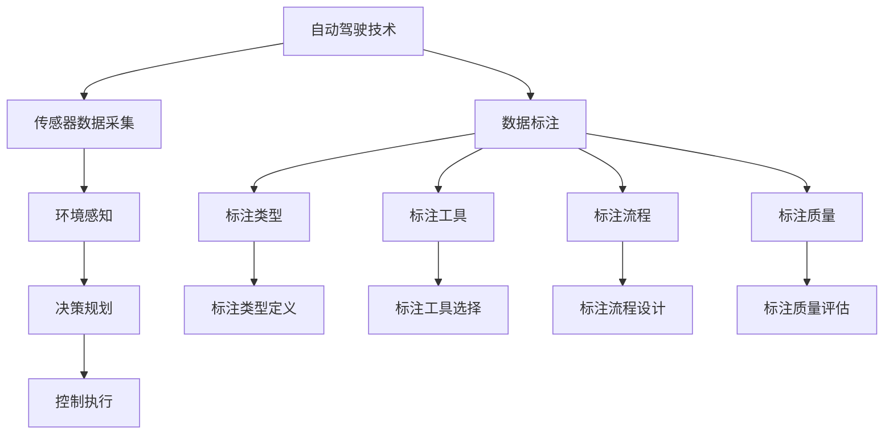

                 

# 《自动驾驶公司的数据标注平台建设》

## 关键词
- 自动驾驶
- 数据标注
- 数据标注平台
- 技术架构
- 性能优化
- 应用实践

## 摘要
本文深入探讨了自动驾驶公司数据标注平台的建设，从技术架构、需求分析、标注流程、平台实现到性能优化、应用实践等方面进行了全面的分析。通过具体案例，展示了数据标注平台在自动驾驶行业中的应用效果，并展望了未来的发展趋势。文章旨在为自动驾驶公司的数据标注平台建设提供全面的指导和参考。

---

## 目录大纲设计

根据用户要求，设计《自动驾驶公司的数据标注平台建设》的目录大纲，要求目录结构细化到1, 2, 3级目录，且大于7章。以下是初步设计的目录大纲：

### 目录大纲设计

**第1章：自动驾驶与数据标注平台概述**
1.1 自动驾驶技术的发展背景与趋势
1.2 数据标注平台在自动驾驶领域的重要性
1.3 数据标注平台的架构与功能模块

**第2章：数据标注平台的需求分析**
2.1 自动驾驶数据标注的特点与挑战
2.2 自动驾驶数据标注的需求分析
2.3 数据标注平台的用户角色与需求

**第3章：数据标注平台的技术架构**
3.1 数据标注平台的技术框架
3.2 数据标注平台的核心技术
3.3 数据标注平台的扩展与集成

**第4章：数据标注流程设计**
4.1 数据标注流程概述
4.2 数据采集与预处理
4.3 数据标注方法与策略
4.4 数据审核与质量控制

**第5章：标注工具与平台实现**
5.1 标注工具的选择与定制
5.2 标注平台的前端设计与实现
5.3 标注平台的后端设计与实现

**第6章：数据标注平台的优化与性能调优**
6.1 数据标注平台的性能指标
6.2 数据标注平台的优化策略
6.3 性能调优案例与实践

**第7章：数据标注平台的应用实践**
7.1 数据标注平台在不同自动驾驶场景中的应用
7.2 数据标注平台在自动驾驶公司中的实际应用案例
7.3 数据标注平台的应用效果评估

**第8章：数据标注平台的建设与维护**
8.1 数据标注平台的建设流程
8.2 数据标注平台的维护与更新
8.3 数据标注平台的安全与合规

**第9章：未来发展趋势与展望**
9.1 自动驾驶与数据标注技术的发展趋势
9.2 数据标注平台的发展方向
9.3 自动驾驶数据标注平台面临的挑战与机遇

---

### 第1章：自动驾驶与数据标注平台概述

#### 1.1 自动驾驶技术的发展背景与趋势

自动驾驶技术起源于20世纪50年代，随着计算机科学和传感器技术的发展，自动驾驶技术逐渐从实验室走向现实。目前，自动驾驶技术主要分为以下几个阶段：

- **Level 0-2**：部分自动化，主要依赖人类驾驶员。
- **Level 3-4**：有条件自动化，自动驾驶系统可以在特定条件下接管控制。
- **Level 5**：完全自动化，无需人类驾驶员介入。

未来，自动驾驶技术的发展趋势包括：

- **智能化与自动化程度的提升**：随着人工智能技术的进步，自动驾驶系统的智能化程度将不断提高。
- **多传感器融合与数据处理能力的增强**：自动驾驶系统将融合多种传感器数据，提高环境感知能力。
- **商业化与规模化应用**：自动驾驶技术将在更多领域实现商业化应用，推动市场规模扩大。

#### 1.2 数据标注平台在自动驾驶领域的重要性

数据标注平台在自动驾驶领域具有重要作用，主要体现在以下几个方面：

- **提供高质量的数据集**：数据标注平台可以为自动驾驶算法提供高质量的数据集，提高算法的准确性和鲁棒性。
- **支持自动驾驶系统的测试与验证**：通过数据标注平台生成的标注数据，可以用于自动驾驶系统的测试与验证。
- **支持自动驾驶系统的迭代与升级**：标注数据可以为自动驾驶系统的迭代与升级提供重要参考。

#### 1.3 数据标注平台的架构与功能模块

数据标注平台通常包括以下架构与功能模块：

- **客户端**：负责展示用户界面，提供数据查看、标注、审核等功能。
- **服务端**：负责处理业务逻辑，包括数据导入、标注任务分配、标注审核等。
- **数据库**：负责存储和管理标注数据，包括原始数据、标注数据、用户数据等。

功能模块包括：

- **数据采集与预处理**：负责数据采集、去重、格式转换等预处理工作。
- **数据标注**：负责对预处理后的数据进行标注，包括图像标注、语音标注等。
- **数据审核**：负责对标注数据的质量进行审核，确保标注的准确性和一致性。
- **数据存储与管理**：负责存储和管理标注数据，提供数据查询与检索功能。

#### 1.4 数据标注平台的应用场景

数据标注平台在自动驾驶领域具有广泛的应用场景，包括：

- **普通道路自动驾驶**：包括城市道路、高速公路等场景。
- **特殊场景自动驾驶**：如雨雪天气、夜晚、隧道等特殊环境。
- **智能交通系统**：包括交通信号控制、车辆调度等。

#### 1.5 数据标注平台的建设原则

数据标注平台的建设应遵循以下原则：

- **可扩展性**：支持多种数据类型的标注需求，能够随着自动驾驶技术的发展而灵活扩展。
- **可靠性**：保证数据的准确性与完整性，提供稳定的服务器支持。
- **安全性**：保护用户隐私与数据安全，防止数据泄露与恶意攻击。
- **用户体验**：提供直观易用的界面，简化标注流程，提高标注效率。

#### 1.6 数据标注平台的开发与维护

数据标注平台的开发与维护是一个持续的过程，包括以下内容：

- **开发过程**：需求分析与设计、系统开发与测试、系统部署与上线。
- **维护内容**：功能优化与迭代、性能调优与监控、安全性与合规性审查。
- **维护策略**：定期进行系统更新与升级、针对用户反馈进行功能改进、加强系统监控与预警机制。

#### 1.7 数据标注平台的发展前景

数据标注平台的发展前景广阔，随着自动驾驶行业的持续发展，数据标注平台的需求将持续增长。未来，数据标注平台将更加智能化、专业化，实现以下发展方向：

- **人工智能技术的深度应用**：利用深度学习技术实现自动化标注与智能审核。
- **数据标注平台的智能化与专业化**：提高标注效率与准确性，满足不同场景的标注需求。
- **数据标注平台的开放性与协同性**：实现与外部系统的开放接口，支持多团队、多领域的协同工作。

#### 1.8 数据标注平台的核心概念与联系

数据标注平台涉及多个核心概念，包括：

- **数据标注**：对原始数据进行标记和分类的过程，以生成可用于机器学习模型训练的数据集。
- **自动驾驶**：利用传感器、计算机视觉、机器学习等技术实现车辆自主行驶的能力。
- **数据标注平台**：一个支持自动驾驶数据标注的系统，集成了数据采集、标注、审核、管理等功能。

以下是数据标注平台与自动驾驶技术的 Mermaid 流程图：

#### 1.9 数据标注平台的优势与挑战

##### 1.9.1 数据标注平台的优势

1. **提高数据标注的效率**：自动化流程和高效的标注工具能够显著提高标注速度。
2. **保证数据标注的质量**：实时审核和质量监控机制确保标注数据的准确性。
3. **支持多类型的自动驾驶数据标注需求**：能够适应不同场景和数据类型的标注需求。
4. **提高研发团队的协作效率**：数据共享与协作功能优化团队工作流程。

##### 1.9.2 数据标注平台面临的挑战

1. **数据标注的准确性与一致性**：标注准确性受标注员经验和主观因素影响，需要严格把控。
2. **数据标注平台的扩展与升级**：随着自动驾驶技术的发展，需要不断更新与扩展平台功能。
3. **数据安全与隐私保护**：处理大量敏感数据，需要确保数据安全与用户隐私。
4. **标注员培训与管理**：标注员的技能提升和培训是平台运行的关键。

#### 1.10 数据标注平台的应用案例

##### 1.10.1 自动驾驶车辆识别与跟踪

- **应用场景**：城市道路环境。
- **标注内容**：车辆的位置、速度、方向等信息。
- **实现效果**：提高自动驾驶车辆在复杂城市道路环境中的识别与跟踪准确性。

##### 1.10.2 道路场景理解

- **应用场景**：高速公路环境。
- **标注内容**：车道线、道路标志等。
- **实现效果**：增强自动驾驶车辆对道路场景的理解能力，提高行驶安全性。

#### 1.11 数据标注平台的发展方向

##### 1.11.1 人工智能技术的深度应用

- 利用深度学习技术实现自动化标注与智能审核，提高标注效率与准确性。

##### 1.11.2 数据标注平台的智能化与专业化

- 数据标注平台将更加智能化，满足不同场景的标注需求。
- 专业化的数据标注团队将成为平台的核心竞争力。

##### 1.11.3 数据标注平台的开放性与协同性

- 数据标注平台将实现与外部系统的开放接口，支持多团队、多领域的协同工作。

#### 1.12 数据标注平台的商业化前景

##### 1.12.1 数据标注平台的市场需求

- 随着自动驾驶行业的快速发展，对高质量数据集的需求持续增长。

##### 1.12.2 数据标注平台的商业模式

- 为自动驾驶公司提供定制化的数据标注服务。
- 开放平台，为第三方标注员与标注团队提供服务。
- 提供数据标注工具的订阅服务。

#### 1.13 数据标注平台的未来发展挑战

##### 1.13.1 技术挑战

- 如何在保证数据标注质量的同时，提高标注效率。
- 如何应对海量数据的高效处理与存储。

##### 1.13.2 政策法规挑战

- 数据标注平台如何遵守相关数据安全与隐私保护法规。
- 如何应对不同国家和地区的数据保护政策。

##### 1.13.3 市场竞争挑战

- 如何在激烈的市场竞争中保持技术优势。
- 如何拓展市场份额，提高品牌影响力。

---

在接下来的章节中，我们将深入探讨数据标注平台的需求分析、技术架构、流程设计、工具与平台实现、优化与性能调优、应用实践以及建设与维护等内容。敬请期待！

