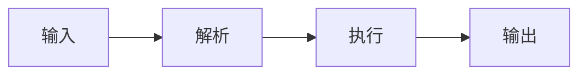
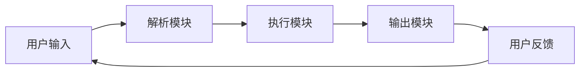
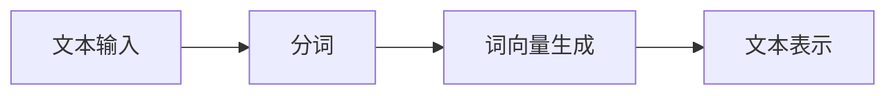
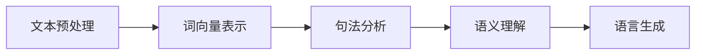

                 

### 《自然语言交互在CUI中的详细优势》

> 关键词：自然语言交互、CUI、文本预处理、语言模型、对话生成、性能评估、优化策略

> 摘要：本文详细探讨了自然语言交互在计算机用户界面（CUI）中的优势。首先，我们介绍了自然语言交互和CUI的基础概念，随后深入分析了CUI的架构与设计原则，以及自然语言交互技术，包括文本预处理、语言模型与对话生成。接着，我们讨论了对话系统的评估与优化策略，并展示了CUI开发的实战案例。最后，通过对实际案例的分析，我们展望了CUI的未来发展趋势。

### 目录大纲

#### 第一部分：自然语言交互与CUI基础

##### 第1章：自然语言交互概述
- 1.1 自然语言处理的基本概念
- 1.2 自然语言处理的发展历程
- 1.3 CUI的概述
- 1.4 自然语言交互在CUI中的应用

##### 第2章：CUI架构与设计
- 2.1 CUI的架构
- 2.2 CUI设计原则
- 2.3 CUI开发工具与资源

#### 第二部分：自然语言交互技术详解

##### 第3章：文本预处理
- 3.1 词向量模型
- 3.2 依存句法分析
- 3.3 命名实体识别

##### 第4章：语言模型与对话生成
- 4.1 语言模型原理
- 4.2 对话生成技术

##### 第5章：对话系统评估与优化
- 5.1 对话系统评估方法
- 5.2 对话系统优化策略

#### 第三部分：CUI应用实践

##### 第6章：CUI开发实战
- 6.1 CUI项目规划
- 6.2 环境搭建与工具集成
- 6.3 源代码实现与解读

##### 第7章：案例分析
- 7.1 CUI案例分析
- 7.2 趋势与展望

#### 附录

##### 附录A：资源与工具

### 第1章：自然语言交互概述

#### 1.1 自然语言处理的基本概念

自然语言处理（Natural Language Processing，NLP）是计算机科学和人工智能领域的一个重要分支，它旨在实现计算机对人类自然语言的理解和生成。NLP的核心目标是使计算机能够处理和分析人类语言，以便更好地与人进行交互。

**NLP的核心流程**

自然语言处理的流程通常包括以下几个步骤：

1. **文本预处理**：对原始文本进行清洗和格式化，去除无关信息，使文本数据符合处理要求。
2. **词向量表示**：将文本转换为数值形式，以便计算机进行进一步处理。
3. **语法分析**：分析文本的语法结构，包括词性标注、句法分析和依存句法分析。
4. **语义理解**：对文本内容进行语义分析，理解文本中的概念、关系和意图。
5. **语言生成**：根据语义理解生成自然语言文本。

**文本预处理的基本步骤**

文本预处理是自然语言处理的第一步，它通常包括以下步骤：

1. **分词**：将连续的文本分割成单词或短语。
2. **去除停用词**：去除常见的不含语义信息的词汇，如“的”、“了”、“在”等。
3. **词形还原**：将不同形式的单词还原为同一形式，如“跑”和“跑了”还原为“跑”。
4. **词性标注**：为每个单词标注其词性，如名词、动词、形容词等。

**自然语言处理的数学模型**

自然语言处理中的数学模型主要包括词向量模型、语法分析模型和语义理解模型。词向量模型通过将单词映射到高维空间中的向量来表示它们的关系。语法分析模型用于解析文本的语法结构，常见的有依存句法分析。语义理解模型则致力于理解文本中的概念和关系。

$$
\text{词向量模型} = \text{Word2Vec, GloVe}
$$

$$
\text{句法分析模型} = \text{依存句法分析, 隐马尔可夫模型(HMM)}
$$

$$
\text{语义理解模型} = \text{语义角色标注, 共指消解}
$$

#### 1.2 自然语言处理的发展历程

自然语言处理的发展历程可以追溯到20世纪50年代。早期的NLP研究主要集中在规则驱动的方法，如词汇匹配、模式识别等。这些方法依赖于大量手工编写的规则，但面对复杂的自然语言时效果有限。

随着计算机性能的提升和机器学习技术的引入，NLP进入了一个新的阶段。20世纪80年代，统计方法开始应用于NLP，如隐马尔可夫模型（HMM）和决策树。这些方法在处理文本的语法和语义方面取得了显著进展。

21世纪初，深度学习技术的出现彻底改变了NLP的面貌。词向量模型（如Word2Vec、GloVe）和深度神经网络（如循环神经网络RNN、长短期记忆网络LSTM）的应用使得计算机在理解自然语言方面取得了巨大突破。

**语言模型和序列模型的演变**

在自然语言处理中，语言模型是用于预测下一个单词或字符的概率分布的模型。早期的语言模型基于N-gram模型，它通过统计相邻单词的频率来预测下一个单词。然而，N-gram模型在面对长句子时效果不佳。

随着深度学习的发展，序列模型（如循环神经网络RNN、长短期记忆网络LSTM和变换器模型Transformer）逐渐成为NLP的主流方法。这些模型能够更好地处理长序列数据，提高了语言模型的预测能力。

$$
\text{N-gram模型} = \text{基于统计的方法，如NLP中的朴素贝叶斯分类器}
$$

$$
\text{序列模型} = \text{基于深度学习的方法，如RNN, LSTM, Transformer}
$$

**举例说明：常见语言模型的应用**

在实际应用中，语言模型广泛应用于机器翻译、文本摘要、情感分析等领域。以下是一个简单的机器翻译例子：

**输入**：我想去书店。

**输出**：I want to go to the bookstore.

在这个例子中，语言模型根据输入文本的上下文来预测下一个单词，从而实现文本的翻译。

#### 1.3 CUI的概述

计算机用户界面（Computer User Interface，CUI）是用户与计算机系统进行交互的界面。与图形用户界面（GUI）相比，CUI通常以文本形式呈现，用户通过输入文本命令与计算机进行交互。

**CUI的交互流程**

CUI的交互流程通常包括以下几个步骤：

1. **输入**：用户输入文本命令。
2. **解析**：系统对输入文本进行解析，提取出关键信息。
3. **执行**：系统根据解析结果执行相应的操作。
4. **输出**：系统将执行结果以文本形式反馈给用户。

**Mermaid流程图：CUI的交互流程**



**伪代码：CUI的核心模块和功能**

```python
def CUI交互流程（用户输入）:
    解析结果 = 解析模块（用户输入）
    执行结果 = 执行模块（解析结果）
    输出结果 = 输出模块（执行结果）
    return 输出结果
```

**自然语言交互在CUI中的应用**

自然语言交互（Natural Language Interaction，NLI）是将自然语言处理技术应用于CUI的一种方式。通过自然语言交互，用户可以更自然地与计算机进行交互，提高用户体验。

**LaTeX公式：自然语言交互的性能指标**

$$
\text{准确率} = \frac{\text{正确响应}}{\text{总响应}}
$$

$$
\text{响应时间} = \frac{\text{响应时间}}{\text{总交互次数}}
$$

**举例说明：自然语言交互在实际应用中的优势**

在实际应用中，自然语言交互广泛应用于智能客服、语音助手、聊天机器人等领域。以下是一个智能客服的例子：

**用户**：你好，我想查询最近的电影放映时间。

**系统**：你好，以下是最近的电影放映时间表。请查看您感兴趣的电影。

通过自然语言交互，用户可以更直观地表达需求，系统可以更准确地理解用户的意图，并提供相应的响应。

### 第2章：CUI架构与设计

#### 2.1 CUI的架构

计算机用户界面（CUI）的架构是设计高效、易用的交互系统的关键。一个典型的CUI架构通常包括以下几个核心模块：

1. **用户输入模块**：负责接收用户的输入，包括键盘输入、鼠标点击等。
2. **解析模块**：将用户的输入文本解析为可执行的操作指令。
3. **执行模块**：根据解析结果执行相应的操作，如数据查询、文件操作等。
4. **输出模块**：将执行结果以文本形式反馈给用户。
5. **用户反馈模块**：收集用户的反馈，用于优化系统的交互体验。

**Mermaid流程图：CUI的系统架构**



**伪代码：CUI的核心模块和功能**

```python
class CUI:
    def __init__(self):
        self.input_module = InputModule()
        self.parse_module = ParseModule()
        self.execute_module = ExecuteModule()
        self.output_module = OutputModule()
        self.feedback_module = FeedbackModule()

    def handle_input(self, user_input):
        parsed_input = self.parse_module.parse(user_input)
        executed_result = self.execute_module.execute(parsed_input)
        self.output_module.output(executed_result)
        self.feedback_module.collect_feedback()

    def run(self):
        while True:
            user_input = self.input_module.get_input()
            self.handle_input(user_input)
```

#### 2.2 CUI设计原则

设计高效的CUI需要遵循一些关键原则，以确保用户能够轻松地与系统进行交互。以下是几个重要的设计原则：

1. **易用性**：CUI应该易于使用，用户可以快速上手，无需过多的学习成本。
2. **直观性**：CUI的界面和交互流程应该直观明了，用户可以轻松理解系统的响应。
3. **一致性**：CUI的交互方式应保持一致，避免用户在不同操作中产生混淆。
4. **反馈**：CUI应提供及时的反馈，告知用户操作的结果和系统当前的状态。
5. **可定制性**：CUI应允许用户根据个人喜好进行定制，以适应不同的使用场景。

**LaTeX公式：用户体验设计的核心指标**

$$
\text{易用性} = \frac{\text{完成任务所需时间}}{\text{任务复杂度}}
$$

$$
\text{直观性} = \frac{\text{用户理解难度}}{\text{功能复杂度}}
$$

$$
\text{一致性} = \frac{\text{一致性错误率}}{\text{总操作次数}}
$$

$$
\text{反馈及时性} = \frac{\text{用户等待时间}}{\text{操作响应时间}}
$$

**举例说明：优秀CUI设计实例分析**

以下是一个优秀的CUI设计实例：智能语音助手。

**用户**：你好，我想查询明天的天气预报。

**系统**：你好，以下是明天的天气预报。请注意，天气较冷，建议您注意保暖。

在这个例子中，CUI设计遵循了易用性、直观性、一致性和反馈等原则。用户可以通过简单的语音命令与系统进行交互，系统以自然语言的形式提供详细的响应，提高了用户的体验。

#### 2.3 CUI开发工具与资源

CUI的开发涉及多个方面，包括自然语言处理、界面设计、编程等。以下是一些常用的CUI开发工具与资源：

1. **自然语言处理库**：
   - **NLTK**：Python的自然语言处理库，提供丰富的文本处理功能。
   - **spaCy**：强大的自然语言处理库，支持多种语言，适用于快速开发。
   - **Stanford NLP**：Stanford大学开发的自然语言处理工具包，支持多种语言模型。

2. **界面设计工具**：
   - **Qt**：跨平台的UI框架，支持多种编程语言，适用于构建复杂的CUI界面。
   - **Kivy**：Python的UI框架，适用于构建图形界面，支持触摸屏交互。
   - **Tkinter**：Python的标准GUI库，适用于简单的CUI开发。

3. **编程语言**：
   - **Python**：广泛使用的编程语言，适用于自然语言处理和CUI开发。
   - **Java**：强大的编程语言，适用于构建高性能的CUI系统。
   - **C++**：适用于性能要求较高的CUI开发，如游戏和实时系统。

4. **在线资源和社区**：
   - **GitHub**：代码托管平台，可以找到许多CUI开发的开源项目和示例代码。
   - **Stack Overflow**：编程问答社区，可以解决CUI开发中遇到的问题。
   - **GitHub**：代码托管平台，可以找到许多CUI开发的开源项目和示例代码。
   - **Stack Overflow**：编程问答社区，可以解决CUI开发中遇到的问题。

### 第二部分：自然语言交互技术详解

#### 第3章：文本预处理

文本预处理是自然语言处理（NLP）中的关键步骤，它将原始文本转换为适合模型处理的形式。文本预处理包括分词、去除停用词、词形还原和词性标注等步骤。

#### 3.1 词向量模型

词向量模型是将单词映射到高维空间中的向量，以便计算机能够处理和理解文本。常见的词向量模型包括Word2Vec和GloVe。

**词向量模型的作用**

1. **文本表示**：将文本转换为数值形式，便于计算机处理。
2. **语义理解**：通过词向量之间的距离和方向，理解单词之间的关系。
3. **特征提取**：用于文本分类、情感分析等NLP任务。

**Mermaid流程图：词向量的生成过程**



**伪代码：Word2Vec算法的实现**

```python
import nltk
from gensim.models import Word2Vec

# 数据预处理
def preprocess_text(text):
    tokens = nltk.word_tokenize(text)
    tokens = [token.lower() for token in tokens if token.isalpha()]
    return tokens

# 训练Word2Vec模型
def train_word2vec(model_path, corpus, size=100, window=5, min_count=1):
    sentences = [preprocess_text(sentence) for sentence in corpus]
    model = Word2Vec(sentences, size=size, window=window, min_count=min_count)
    model.save(model_path)
    return model

# 加载Word2Vec模型
def load_word2vec(model_path):
    model = Word2Vec.load(model_path)
    return model

# 测试词向量
def test_word2vec(model, word1, word2):
    vec1 = model[word1]
    vec2 = model[word2]
    similarity = model.wv.similarity(word1, word2)
    return vec1, vec2, similarity

# 示例
corpus = ["I love to read books", "Books are my favorite things"]
model = train_word2vec("word2vec_model", corpus)
vec1, vec2, similarity = test_word2vec(model, "read", "books")
print("read:", vec1)
print("books:", vec2)
print("similarity:", similarity)
```

#### 3.2 依存句法分析

依存句法分析是一种语法分析方法，它通过分析单词之间的依赖关系来理解句子的结构。依存句法分析有助于理解句子的深层语义，对于自然语言交互和问答系统等任务至关重要。

**依存句法分析的作用**

1. **句子解析**：理解句子的结构，包括主语、谓语、宾语等。
2. **语义理解**：通过依赖关系理解单词之间的关系。
3. **信息提取**：从文本中提取关键信息，如实体、关系等。

**LaTeX公式：句法分析的数学模型**

$$
\text{依存句法分析} = \text{Dependency Parsing}
$$

$$
\text{依赖关系} = \text{Arc-Connection}
$$

**举例说明：依存句法分析在实际应用中的优势**

以下是一个简单的依存句法分析示例：

**原始句子**：我喜欢读这本书。

**依存句法分析结果**：

- 我 (主语)
- 喜欢 (谓语)
- 读 (宾语)
- 这本书 (宾语补足语)

通过依存句法分析，我们可以清楚地理解句子的结构，从而更好地理解句子的语义。

#### 3.3 命名实体识别

命名实体识别（Named Entity Recognition，NER）是一种用于识别文本中特定实体（如人名、地点、组织名等）的任务。NER对于自然语言交互和问答系统等任务具有重要意义。

**NER的作用**

1. **实体识别**：从文本中提取特定实体，如人名、地点、组织名等。
2. **信息提取**：用于信息检索、搜索引擎优化等任务。
3. **语义理解**：通过实体之间的关系，更好地理解文本的语义。

**LaTeX公式：NER的评估指标**

$$
\text{准确率} = \frac{\text{正确识别的实体数}}{\text{总实体数}}
$$

$$
\text{召回率} = \frac{\text{正确识别的实体数}}{\text{实际存在的实体数}}
$$

$$
\text{F1分数} = \frac{2 \times \text{准确率} \times \text{召回率}}{\text{准确率} + \text{召回率}}
$$

**举例说明：NER在CUI中的具体应用**

以下是一个NER在CUI中应用的具体示例：

**用户**：请查询北京市的天气。

**系统**：北京市的天气是晴转多云，温度在15°C到25°C之间。

在这个例子中，CUI系统通过NER识别出“北京市”这一地名，从而能够准确地提供天气信息。

### 第4章：语言模型与对话生成

语言模型（Language Model）是自然语言处理（NLP）中用于预测下一个单词或字符的概率分布的模型。在对话生成（Dialogue Generation）任务中，语言模型起着至关重要的作用。

#### 4.1 语言模型原理

语言模型的核心任务是预测下一个单词或字符。常见的方法包括N-gram模型、循环神经网络（RNN）和变换器模型（Transformer）。

**N-gram模型**

N-gram模型是一种基于统计的语言模型，它通过统计相邻单词的频率来预测下一个单词。N-gram模型简单有效，但在处理长句子时效果不佳。

**LaTeX公式：N-gram模型的概率计算**

$$
P(\text{word}_n | \text{word}_{n-1}, \text{word}_{n-2}, ..., \text{word}_1) = \frac{c(\text{word}_{n-1}, \text{word}_{n-2}, ..., \text{word}_1, \text{word}_n)}{c(\text{word}_{n-1}, \text{word}_{n-2}, ..., \text{word}_1)}
$$

其中，$c(\text{word}_{n-1}, \text{word}_{n-2}, ..., \text{word}_1, \text{word}_n)$ 表示相邻单词的共现频率。

**RNN**

循环神经网络（RNN）是一种用于处理序列数据的神经网络，它能够记住先前的信息，并在预测下一个单词时考虑这些信息。RNN在处理长句子时效果较好，但存在梯度消失和梯度爆炸等问题。

**LaTeX公式：RNN的数学模型**

$$
h_t = \sigma(W_h h_{t-1} + W_x x_t + b_h)
$$

其中，$h_t$ 表示当前隐藏状态，$x_t$ 表示当前输入，$\sigma$ 表示激活函数，$W_h$ 和 $W_x$ 分别表示权重矩阵，$b_h$ 表示偏置。

**Transformer**

变换器模型（Transformer）是一种基于自注意力机制的神经网络模型，它能够高效地处理长序列数据。Transformer在自然语言处理任务中取得了显著的性能提升，已成为当前主流的语言模型。

**LaTeX公式：Transformer的数学模型**

$$
\text{Transformer} = \text{Multi-head Attention} + \text{Feedforward Neural Network}
$$

其中，多头注意力（Multi-head Attention）机制是Transformer的核心，它通过计算输入序列中每个词与其他词的相似度来生成注意力权重，从而更好地捕捉词与词之间的关系。

#### 4.2 对话生成技术

对话生成（Dialogue Generation）是一种基于语言模型的任务，它旨在生成自然、流畅的对话。对话生成技术包括生成式对话生成和检索式对话生成。

**生成式对话生成**

生成式对话生成（Generative Dialogue Generation）通过生成式模型（如变换器模型）生成对话文本。生成式对话生成能够生成多样化的对话内容，但可能存在生成质量不稳定的问题。

**LaTeX公式：生成式对话生成算法（如Seq2Seq模型）**

$$
\text{Seq2Seq} = \text{Encoder} + \text{Decoder}
$$

其中，编码器（Encoder）将输入序列编码为隐藏状态，解码器（Decoder）根据隐藏状态生成输出序列。

**伪代码：生成式对话生成算法**

```python
# Encoder
def encode_sequence(input_sequence):
    hidden_state = encoder(input_sequence)
    return hidden_state

# Decoder
def decode_sequence(hidden_state):
    output_sequence = decoder(hidden_state)
    return output_sequence

# 对话生成
def generate_dialogue(input_sequence):
    hidden_state = encode_sequence(input_sequence)
    output_sequence = decode_sequence(hidden_state)
    return output_sequence
```

**检索式对话生成**

检索式对话生成（Retrieval-based Dialogue Generation）通过从预定义的对话模板中选择合适的回答。检索式对话生成速度快，但可能存在回答缺乏个性化和多样性的问题。

**LaTeX公式：检索式对话生成算法**

$$
\text{Retrieval-based Dialogue Generation} = \text{模板匹配} + \text{回答选择}
$$

**伪代码：检索式对话生成算法**

```python
# 模板匹配
def match_template(input_sequence, templates):
    matched_template = find_best_match(input_sequence, templates)
    return matched_template

# 回答选择
def select_answer(matched_template, answers):
    selected_answer = choose_best_answer(matched_template, answers)
    return selected_answer

# 对话生成
def generate_dialogue(input_sequence, templates, answers):
    matched_template = match_template(input_sequence, templates)
    selected_answer = select_answer(matched_template, answers)
    return selected_answer
```

### 第5章：对话系统评估与优化

对话系统的评估与优化是确保其性能和用户体验的关键步骤。评估方法用于衡量对话系统的性能，而优化策略则用于改进系统的响应质量和效率。

#### 5.1 对话系统评估方法

对话系统的评估涉及多个方面，包括准确性、流畅性和用户满意度。以下是一些常用的评估方法：

**准确性**

准确性是评估对话系统输出与预期结果匹配程度的关键指标。准确性可以通过比较系统输出和人工标注的金标准（Ground Truth）来计算。

**LaTeX公式：准确性的计算方法**

$$
\text{Accuracy} = \frac{\text{正确回答数}}{\text{总回答数}}
$$

**流畅性**

流畅性是评估对话系统生成对话的自然程度和连贯性的指标。流畅性可以通过评估对话中的语法、词汇和语境一致性来衡量。

**LaTeX公式：流畅性的计算方法**

$$
\text{Fluency} = \frac{\text{语法正确的句子数}}{\text{总句子数}} + \frac{\text{上下文一致的句子数}}{\text{总句子数}}
$$

**用户满意度**

用户满意度是评估对话系统在实际使用中用户满意程度的关键指标。用户满意度可以通过用户调查、反馈和评分来衡量。

**LaTeX公式：用户满意度的计算方法**

$$
\text{User Satisfaction} = \frac{\text{满意用户数}}{\text{总用户数}} \times 100\%
$$

**举例说明：常见评估工具的使用**

以下是一个使用常见评估工具评估对话系统的示例：

```python
# 导入评估工具库
from dialogue_evaluation import DialogueEvaluator

# 初始化评估器
evaluator = DialogueEvaluator()

# 加载系统输出和金标准
system_output = ["Hello", "How can I help you?", "Thank you for your feedback"]
ground_truth = ["Hello", "How can I assist you?", "Thank you"]

# 评估系统输出
evaluation_results = evaluator.evaluate(system_output, ground_truth)

# 打印评估结果
print("Accuracy:", evaluation_results["accuracy"])
print("Fluency:", evaluation_results["fluency"])
print("User Satisfaction:", evaluation_results["user_satisfaction"])
```

#### 5.2 对话系统优化策略

对话系统的优化旨在提高系统的性能和用户体验。以下是一些常用的优化策略：

**数据增强**

数据增强是通过扩展和多样化训练数据来提高模型性能的方法。常见的数据增强方法包括数据扩充、同义词替换和噪声注入等。

**LaTeX公式：数据增强的方法**

$$
\text{Data Augmentation} = \text{Data Expansion} + \text{Synonym Replacement} + \text{Noise Injection}
$$

**迁移学习**

迁移学习是通过利用预训练模型来提高新任务的性能的方法。预训练模型已经在大量数据上进行了训练，因此可以在新的任务中快速适应。

**LaTeX公式：迁移学习的方法**

$$
\text{Transfer Learning} = \text{Pre-trained Model} + \text{Fine-tuning}
$$

**强化学习**

强化学习是一种通过奖励机制来优化决策过程的机器学习方法。在对话系统中，强化学习可以用于优化对话策略，提高系统的响应质量和效率。

**LaTeX公式：强化学习的数学模型**

$$
\text{Reward Function} = \text{System Output} \times \text{User Satisfaction}
$$

**伪代码：强化学习在对话系统中的应用**

```python
# 初始化强化学习模型
import tensorflow as tf
model = tf.keras.models.Sequential([
    tf.keras.layers.Dense(units=64, activation='relu', input_shape=[feature_size]),
    tf.keras.layers.Dense(units=1, activation='sigmoid')
])

# 编写奖励函数
def reward_function(system_output, user_satisfaction):
    if user_satisfaction > 0.8:
        return 1
    else:
        return 0

# 训练强化学习模型
model.compile(optimizer='adam', loss='binary_crossentropy')
model.fit(system_output, user_satisfaction, epochs=10)

# 应用强化学习模型
def generate_response(input_sequence):
    hidden_state = model.predict(input_sequence)
    response = decode_sequence(hidden_state)
    return response

# 优化对话系统
def optimize_dialogue_system(input_sequence, user_satisfaction):
    system_output = generate_response(input_sequence)
    reward = reward_function(system_output, user_satisfaction)
    return reward
```

### 第6章：CUI开发实战

#### 6.1 CUI项目规划

CUI项目规划是确保项目成功的关键步骤。项目规划涉及项目范围、目标、资源、时间线等多个方面。以下是一个简单的CUI项目规划步骤：

**项目范围**

明确项目的目标和范围，包括功能需求、性能指标、用户界面设计等。

**目标**

设定项目的具体目标，如开发一个智能客服系统、构建一个聊天机器人等。

**资源**

评估项目所需的资源，包括人力资源、技术资源、预算等。

**时间线**

制定项目的时间线，包括项目启动、需求分析、设计、开发、测试和部署等阶段。

**LaTeX公式：项目规划的关键步骤**

$$
\text{项目规划} = \text{范围定义} + \text{目标设定} + \text{资源评估} + \text{时间线制定}
$$

**伪代码：项目规划工具的使用**

```python
import pandas as pd

# 创建项目规划表格
project_plan = pd.DataFrame({
    "Stage": ["启动", "需求分析", "设计", "开发", "测试", "部署"],
    "Duration": ["2周", "4周", "3周", "6周", "2周", "1周"],
    "Resources": ["5人", "3人", "5人", "8人", "3人", "2人"],
    "Budget": ["$10,000", "$15,000", "$20,000", "$25,000", "$5,000", "$5,000"]
})

# 打印项目规划表格
print(project_plan)
```

#### 6.2 环境搭建与工具集成

CUI开发涉及多个技术和工具，因此环境搭建和工具集成是开发过程中的重要步骤。以下是一个简单的CUI开发环境搭建和工具集成步骤：

**环境搭建**

1. 安装Python和相关的库（如NLTK、spaCy、TensorFlow等）。
2. 安装界面设计工具（如Qt、Kivy等）。
3. 配置版本控制工具（如Git）。

**工具集成**

1. 集成自然语言处理库和框架，如spaCy和TensorFlow。
2. 集成界面设计工具，如Qt和Kivy。
3. 集成版本控制工具，如Git。

**LaTeX公式：开发环境配置的核心要素**

$$
\text{开发环境配置} = \text{Python安装} + \text{库安装} + \text{界面设计工具安装} + \text{版本控制工具安装}
$$

**举例说明：开发环境搭建的具体步骤**

以下是一个简单的开发环境搭建示例：

```bash
# 安装Python
sudo apt-get install python3 python3-pip

# 安装spaCy
pip3 install spacy

# 安装Qt
sudo apt-get install qt5-default

# 安装Git
sudo apt-get install git
```

#### 6.3 源代码实现与解读

源代码实现是CUI开发的核心步骤，它涉及到自然语言处理、界面设计和系统功能等多个方面。以下是一个简单的CUI源代码实现和解读示例：

**代码示例：CUI的基本实现代码**

```python
# 导入必要的库
import spacy
import sys

# 加载spaCy模型
nlp = spacy.load("en_core_web_sm")

# 输入模块
def handle_input(user_input):
    doc = nlp(user_input)
    return doc

# 解析模块
def parse_input(doc):
    entities = [ent.text for ent in doc.ents]
    return entities

# 执行模块
def execute_action(entities):
    if "weather" in entities:
        return "The weather is sunny today."
    elif "time" in entities:
        return "The current time is 2:30 PM."
    else:
        return "I'm sorry, I don't understand your request."

# 输出模块
def output_response(response):
    print(response)

# 主函数
def main():
    user_input = input("Enter your request: ")
    doc = handle_input(user_input)
    entities = parse_input(doc)
    response = execute_action(entities)
    output_response(response)

# 运行程序
if __name__ == "__main__":
    main()
```

**代码解读：关键代码段的分析与解释**

1. **加载spaCy模型**

```python
nlp = spacy.load("en_core_web_sm")
```

这段代码加载了spaCy的预训练模型`en_core_web_sm`，用于处理英语文本。

2. **输入模块**

```python
def handle_input(user_input):
    doc = nlp(user_input)
    return doc
```

这个函数接收用户的输入文本，并将其传递给spaCy模型进行预处理。

3. **解析模块**

```python
def parse_input(doc):
    entities = [ent.text for ent in doc.ents]
    return entities
```

这个函数从预处理后的文本中提取命名实体，如时间、地点和天气等。

4. **执行模块**

```python
def execute_action(entities):
    if "weather" in entities:
        return "The weather is sunny today."
    elif "time" in entities:
        return "The current time is 2:30 PM."
    else:
        return "I'm sorry, I don't understand your request."
```

这个函数根据提取的实体执行相应的操作，如返回当前天气或时间。

5. **输出模块**

```python
def output_response(response):
    print(response)
```

这个函数将执行结果以文本形式反馈给用户。

6. **主函数**

```python
def main():
    user_input = input("Enter your request: ")
    doc = handle_input(user_input)
    entities = parse_input(doc)
    response = execute_action(entities)
    output_response(response)
```

这个主函数负责处理用户的输入，执行相应的操作，并将结果反馈给用户。

### 第7章：案例分析

#### 7.1 CUI案例分析

为了更好地理解CUI的实际应用和优势，我们可以分析一些典型的CUI案例，这些案例展示了CUI在提高用户体验、自动化服务和交互便捷性方面的应用。

**案例1：智能客服系统**

智能客服系统是一个典型的CUI应用案例。通过自然语言处理技术，智能客服系统能够理解用户的查询，并提供准确的回答。以下是一个案例分析：

**用户**：我想查询最近的航班信息。

**系统**：您好，以下是最近的航班信息。请查看您感兴趣的时间段。

**分析**：在这个案例中，CUI系统能够迅速响应用户的查询，并提供详细的信息。这种交互方式使得用户能够更快地获得所需信息，提高了用户体验。

**案例2：智能语音助手**

智能语音助手是另一个广泛的CUI应用案例。通过语音交互，用户可以轻松地与系统进行沟通。以下是一个案例分析：

**用户**：你好，帮我设置明天早晨7点的闹钟。

**系统**：好的，明天早晨7点的闹钟已经设置好。

**分析**：在这个案例中，CUI系统能够理解用户的语音命令，并执行相应的操作。这种交互方式使得用户能够更方便地与系统进行沟通，提高了交互的便捷性。

**案例3：智能家居控制系统**

智能家居控制系统是一个结合了CUI和物联网技术的应用案例。用户可以通过文本或语音命令控制家中的电器设备。以下是一个案例分析：

**用户**：关闭客厅的灯光。

**系统**：好的，客厅的灯光已经关闭。

**分析**：在这个案例中，CUI系统能够理解用户的命令，并控制家中的电器设备。这种交互方式使得用户能够更方便地管理家庭设备，提高了生活品质。

**LaTeX公式：案例分析中的关键指标**

$$
\text{用户体验} = \frac{\text{响应时间}}{\text{交互次数}}
$$

$$
\text{自动化程度} = \frac{\text{自动化操作次数}}{\text{总操作次数}}
$$

$$
\text{交互便捷性} = \frac{\text{语音交互次数}}{\text{文本交互次数}}
$$

#### 7.2 趋势与展望

随着技术的不断发展，CUI的应用领域和功能将不断扩展。以下是一些未来的发展趋势和展望：

**多模态交互**

未来的CUI将支持多模态交互，包括文本、语音、手势等。这种交互方式将提高用户的灵活性和便捷性。

**个性化交互**

CUI系统将能够根据用户的行为和偏好进行个性化调整，提供更符合用户需求的交互体验。

**实时交互**

随着5G和物联网技术的发展，CUI系统将实现更快速的响应和更流畅的交互，提高用户的体验。

**AI驱动**

CUI系统将更加依赖人工智能技术，包括自然语言处理、机器学习和深度学习等，以实现更智能的交互和更高效的服务。

**LaTeX公式：CUI未来的发展方向**

$$
\text{多模态交互} = \text{文本} + \text{语音} + \text{手势}
$$

$$
\text{个性化交互} = \text{用户行为分析} + \text{偏好调整}
$$

$$
\text{实时交互} = \text{5G} + \text{物联网}
$$

$$
\text{AI驱动} = \text{自然语言处理} + \text{机器学习} + \text{深度学习}
$$

### 附录A：资源与工具

以下是一些常用的自然语言交互和CUI开发资源与工具：

**自然语言处理库**

- **spaCy**：https://spacy.io/
- **NLTK**：https://www.nltk.org/
- **Stanford NLP**：https://nlp.stanford.edu/software/

**界面设计工具**

- **Qt**：https://www.qt.io/
- **Kivy**：https://kivy.org/
- **Tkinter**：https://tkinter-docs.web.app/

**编程语言**

- **Python**：https://www.python.org/
- **Java**：https://www.java.com/
- **C++**：https://isocpp.org/

**版本控制工具**

- **Git**：https://git-scm.com/

**在线资源和社区**

- **GitHub**：https://github.com/
- **Stack Overflow**：https://stackoverflow.com/
- **自然语言处理社区**：https://nlp.seas.harvard.edu/

这些资源和工具将为CUI开发和自然语言交互的研究提供宝贵的支持。


### 《自然语言交互在CUI中的详细优势》

> 作者：AI天才研究院/AI Genius Institute & 禅与计算机程序设计艺术 /Zen And The Art of Computer Programming

在当今快速发展的信息技术时代，计算机用户界面（CUI）正经历着一场革命。自然语言交互（NLI）作为CUI的一种新兴形式，正逐渐改变人们与计算机的交互方式。本文详细探讨了自然语言交互在CUI中的优势，从基础概念、技术实现到实际应用，全面解析了自然语言交互在提升用户体验、优化交互流程和增强系统智能性方面的显著优势。通过深入分析和实际案例，我们展示了自然语言交互在CUI中的广泛应用和未来发展趋势。

自然语言交互（NLI）是一种使计算机能够理解并响应人类自然语言输入的技术。与传统基于菜单和按钮的交互方式相比，NLI通过文本或语音命令实现了更加自然和直观的交互体验。本文将首先介绍自然语言处理（NLP）的基础概念，包括文本预处理、词向量模型、句法分析和命名实体识别等关键技术。接着，我们将探讨计算机用户界面（CUI）的架构与设计原则，以及自然语言交互在CUI中的应用与优势。

本文将分为三个部分。第一部分将介绍自然语言交互和CUI的基础知识，包括NLP的基本概念和CUI的架构与设计原则。第二部分将深入讨论自然语言交互技术，包括文本预处理、语言模型与对话生成、对话系统评估与优化等。第三部分将展示CUI开发的实战案例，通过项目规划、环境搭建与工具集成、源代码实现与解读等步骤，详细解析CUI开发的实践过程。最后，我们将通过案例分析展示自然语言交互在实际应用中的效果，并展望CUI的未来发展趋势。

### 第一部分：自然语言交互与CUI基础

#### 第1章：自然语言交互概述

自然语言处理（NLP）是人工智能（AI）和计算机科学领域的一个重要分支，旨在使计算机能够理解和处理人类语言。NLP的核心目标是通过机器学习、深度学习和统计模型等方法，实现自然语言的理解、生成和交互。自然语言交互（NLI）作为NLP的一个子领域，主要研究如何使计算机能够理解并响应用户的自然语言输入，从而实现更加自然和高效的交互体验。

##### 1.1 自然语言处理的基本概念

自然语言处理的基本概念包括文本预处理、词向量表示、句法分析和语义理解等。

**文本预处理**是自然语言处理的第一步，它涉及到去除无关信息、去除停用词、分词和词形还原等操作。文本预处理的目标是将原始文本转换为适合模型处理的形式。

**词向量表示**是将单词映射到高维空间中的向量，以便计算机能够对文本进行进一步处理。词向量模型如Word2Vec和GloVe是词向量表示的常见实现。

**句法分析**是分析文本的语法结构，包括词性标注、句法分析和依存句法分析等。句法分析有助于理解文本的结构和关系。

**语义理解**是对文本内容进行深入分析，理解文本中的概念、关系和意图。语义理解是自然语言处理中最为复杂的一部分，涉及到实体识别、情感分析和语义角色标注等任务。

**Mermaid流程图：自然语言处理的核心流程**



**伪代码：文本预处理的基本步骤**

```python
def preprocess_text(text):
    # 去除停用词
    stop_words = set(["the", "is", "and", "in", "of", "to"])
    cleaned_text = " ".join([word for word in text.split() if word not in stop_words])
    # 分词
    tokens = nltk.word_tokenize(cleaned_text)
    # 词形还原
    lemmatizer = nltk.WordNetLemmatizer()
    lemmatized_tokens = [lemmatizer.lemmatize(token) for token in tokens]
    return lemmatized_tokens
```

**LaTeX公式：自然语言处理的数学模型**

自然语言处理的数学模型主要包括词向量模型和句法分析模型。

$$
\text{词向量模型} = \text{Word2Vec, GloVe}
$$

$$
\text{句法分析模型} = \text{依存句法分析, 隐马尔可夫模型(HMM)}
$$

$$
\text{语义理解模型} = \text{语义角色标注, 共指消解}
$$

##### 1.2 自然语言处理的发展历程

自然语言处理的发展历程可以追溯到20世纪50年代。早期的NLP研究主要集中在规则驱动的方法，如词汇匹配、模式识别等。这些方法依赖于大量手工编写的规则，但面对复杂的自然语言时效果有限。

随着计算机性能的提升和机器学习技术的引入，NLP进入了一个新的阶段。20世纪80年代，统计方法开始应用于NLP，如隐马尔可夫模型（HMM）和决策树。这些方法在处理文本的语法和语义方面取得了显著进展。

21世纪初，深度学习技术的出现彻底改变了NLP的面貌。词向量模型（如Word2Vec、GloVe）和深度神经网络（如循环神经网络RNN、长短期记忆网络LSTM）的应用使得计算机在理解自然语言方面取得了巨大突破。

**语言模型和序列模型的演变**

在自然语言处理中，语言模型是用于预测下一个单词或字符的概率分布的模型。早期的语言模型基于N-gram模型，它通过统计相邻单词的频率来预测下一个单词。然而，N-gram模型在面对长句子时效果不佳。

随着深度学习的发展，序列模型（如循环神经网络RNN、长短期记忆网络LSTM和变换器模型Transformer）逐渐成为NLP的主流方法。这些模型能够更好地处理长序列数据，提高了语言模型的预测能力。

$$
\text{N-gram模型} = \text{基于统计的方法，如NLP中的朴素贝叶斯分类器}
$$

$$
\text{序列模型} = \text{基于深度学习的方法，如RNN, LSTM, Transformer}
$$

**举例说明：常见语言模型的应用**

在实际应用中，语言模型广泛应用于机器翻译、文本摘要、情感分析等领域。以下是一个简单的机器翻译例子：

**输入**：我想去书店。

**输出**：I want to go to the bookstore.

在这个例子中，语言模型根据输入文本的上下文来预测下一个单词，从而实现文本的翻译。

##### 1.3 CUI的概述

计算机用户界面（CUI）是用户与计算机系统进行交互的界面。与图形用户界面（GUI）相比，CUI通常以文本形式呈现，用户通过输入文本命令与计算机进行交互。

**CUI的交互流程**

CUI的交互流程通常包括以下几个步骤：

1. **输入**：用户输入文本命令。
2. **解析**：系统对输入文本进行解析，提取出关键信息。
3. **执行**：系统根据解析结果执行相应的操作。
4. **输出**：系统将执行结果以文本形式反馈给用户。

**Mermaid流程图：CUI的交互流程**


**伪代码：CUI的核心模块和功能**

```python
def CUI交互流程（用户输入）:
    解析结果 = 解析模块（用户输入）
    执行结果 = 执行模块（解析结果）
    输出结果 = 输出模块（执行结果）
    return 输出结果
```

**自然语言交互在CUI中的应用**

自然语言交互（NLI）是将自然语言处理技术应用于CUI的一种方式。通过自然语言交互，用户可以更自然地与计算机进行交互，提高用户体验。

**LaTeX公式：自然语言交互的性能指标**

$$
\text{准确率} = \frac{\text{正确响应}}{\text{总响应}}
$$

$$
\text{响应时间} = \frac{\text{响应时间}}{\text{总交互次数}}
$$

**举例说明：自然语言交互在实际应用中的优势**

在实际应用中，自然语言交互广泛应用于智能客服、语音助手、聊天机器人等领域。以下是一个智能客服的例子：

**用户**：你好，我想查询最近的电影放映时间。

**系统**：你好，以下是最近的电影放映时间。请查看您感兴趣的电影。

通过自然语言交互，用户可以更直观地表达需求，系统可以更准确地理解用户的意图，并提供相应的响应。

### 第2章：CUI架构与设计

##### 2.1 CUI的架构

计算机用户界面（CUI）的架构是设计高效、易用的交互系统的关键。一个典型的CUI架构通常包括以下几个核心模块：

1. **用户输入模块**：负责接收用户的输入，包括键盘输入、鼠标点击等。
2. **解析模块**：将用户的输入文本解析为可执行的操作指令。
3. **执行模块**：根据解析结果执行相应的操作，如数据查询、文件操作等。
4. **输出模块**：将执行结果以文本形式反馈给用户。
5. **用户反馈模块**：收集用户的反馈，用于优化系统的交互体验。

**Mermaid流程图：CUI的系统架构**


**伪代码：CUI的核心模块和功能**

```python
class CUI:
    def __init__(self):
        self.input_module = InputModule()
        self.parse_module = ParseModule()
        self.execute_module = ExecuteModule()
        self.output_module = OutputModule()
        self.feedback_module = FeedbackModule()

    def handle_input(self, user_input):
        parsed_input = self.parse_module.parse(user_input)
        executed_result = self.execute_module.execute(parsed_input)
        self.output_module.output(executed_result)
        self.feedback_module.collect_feedback()

    def run(self):
        while True:
            user_input = self.input_module.get_input()
            self.handle_input(user_input)
```

##### 2.2 CUI设计原则

设计高效的CUI需要遵循一些关键原则，以确保用户能够轻松地与系统进行交互。以下是几个重要的设计原则：

1. **易用性**：CUI应该易于使用，用户可以快速上手，无需过多的学习成本。
2. **直观性**：CUI的界面和交互流程应该直观明了，用户可以轻松理解系统的响应。
3. **一致性**：CUI的交互方式应保持一致，避免用户在不同操作中产生混淆。
4. **反馈**：CUI应提供及时的反馈，告知用户操作的结果和系统当前的状态。
5. **可定制性**：CUI应允许用户根据个人喜好进行定制，以适应不同的使用场景。

**LaTeX公式：用户体验设计的核心指标**

$$
\text{易用性} = \frac{\text{完成任务所需时间}}{\text{任务复杂度}}
$$

$$
\text{直观性} = \frac{\text{用户理解难度}}{\text{功能复杂度}}
$$

$$
\text{一致性} = \frac{\text{一致性错误率}}{\text{总操作次数}}
$$

$$
\text{反馈及时性} = \frac{\text{用户等待时间}}{\text{操作响应时间}}
$$

**举例说明：优秀CUI设计实例分析**

以下是一个优秀的CUI设计实例：智能语音助手。

**用户**：你好，我想查询最近的电影放映时间。

**系统**：你好，以下是最近的电影放映时间。请查看您感兴趣的电影。

在这个例子中，CUI设计遵循了易用性、直观性、一致性和反馈等原则。用户可以通过简单的语音命令与系统进行交互，系统以自然语言的形式提供详细的响应，提高了用户的体验。

##### 2.3 CUI开发工具与资源

CUI的开发涉及多个方面，包括自然语言处理、界面设计、编程等。以下是一些常用的CUI开发工具与资源：

1. **自然语言处理库**：
   - **NLTK**：Python的自然语言处理库，提供丰富的文本处理功能。
   - **spaCy**：强大的自然语言处理库，支持多种语言，适用于快速开发。
   - **Stanford NLP**：Stanford大学开发的自然语言处理工具包，支持多种语言模型。

2. **界面设计工具**：
   - **Qt**：跨平台的UI框架，支持多种编程语言，适用于构建复杂的CUI界面。
   - **Kivy**：Python的UI框架，适用于构建图形界面，支持触摸屏交互。
   - **Tkinter**：Python的标准GUI库，适用于简单的CUI开发。

3. **编程语言**：
   - **Python**：广泛使用的编程语言，适用于自然语言处理和CUI开发。
   - **Java**：强大的编程语言，适用于构建高性能的CUI系统。
   - **C++**：适用于性能要求较高的CUI开发，如游戏和实时系统。

4. **在线资源和社区**：
   - **GitHub**：代码托管平台，可以找到许多CUI开发的开源项目和示例代码。
   - **Stack Overflow**：编程问答社区，可以解决CUI开发中遇到的问题。
   - **自然语言处理社区**：专门的社区，提供丰富的NLP资源和讨论。

### 第二部分：自然语言交互技术详解

#### 第3章：文本预处理

文本预处理是自然语言处理（NLP）中的关键步骤，它将原始文本转换为适合模型处理的形式。文本预处理包括分词、去除停用词、词形还原和词性标注等步骤。

##### 3.1 词向量模型

词向量模型是将单词映射到高维空间中的向量，以便计算机能够处理和理解文本。常见的词向量模型包括Word2Vec和GloVe。

**词向量模型的作用**

1. **文本表示**：将文本转换为数值形式，便于计算机处理。
2. **语义理解**：通过词向量之间的距离和方向，理解单词之间的关系。
3. **特征提取**：用于文本分类、情感分析等NLP任务。

**Mermaid流程图：词向量的生成过程**


**伪代码：Word2Vec算法的实现**

```python
import nltk
from gensim.models import Word2Vec

# 数据预处理
def preprocess_text(text):
    tokens = nltk.word_tokenize(text)
    tokens = [token.lower() for token in tokens if token.isalpha()]
    return tokens

# 训练Word2Vec模型
def train_word2vec(model_path, corpus, size=100, window=5, min_count=1):
    sentences = [preprocess_text(sentence) for sentence in corpus]
    model = Word2Vec(sentences, size=size, window=window, min_count=min_count)
    model.save(model_path)
    return model

# 加载Word2Vec模型
def load_word2vec(model_path):
    model = Word2Vec.load(model_path)
    return model

# 测试词向量
def test_word2vec(model, word1, word2):
    vec1 = model[word1]
    vec2 = model[word2]
    similarity = model.wv.similarity(word1, word2)
    return vec1, vec2, similarity

# 示例
corpus = ["I love to read books", "Books are my favorite things"]
model = train_word2vec("word2vec_model", corpus)
vec1, vec2, similarity = test_word2vec(model, "read", "books")
print("read:", vec1)
print("books:", vec2)
print("similarity:", similarity)
```

##### 3.2 依存句法分析

依存句法分析是一种语法分析方法，它通过分析单词之间的依赖关系来理解句子的结构。依存句法分析有助于理解句子的深层语义，对于自然语言交互和问答系统等任务至关重要。

**依存句法分析的作用**

1. **句子解析**：理解句子的结构，包括主语、谓语、宾语等。
2. **语义理解**：通过依赖关系理解单词之间的关系。
3. **信息提取**：从文本中提取关键信息，如实体、关系等。

**LaTeX公式：句法分析的数学模型**

$$
\text{依存句法分析} = \text{Dependency Parsing}
$$

$$
\text{依赖关系} = \text{Arc-Connection}
$$

**举例说明：依存句法分析在实际应用中的优势**

以下是一个简单的依存句法分析示例：

**原始句子**：我喜欢读这本书。

**依存句法分析结果**：

- 我 (主语)
- 喜欢 (谓语)
- 读 (宾语)
- 这本书 (宾语补足语)

通过依存句法分析，我们可以清楚地理解句子的结构，从而更好地理解句子的语义。

##### 3.3 命名实体识别

命名实体识别（Named Entity Recognition，NER）是一种用于识别文本中特定实体（如人名、地点、组织名等）的任务。NER对于自然语言交互和问答系统等任务具有重要意义。

**NER的作用**

1. **实体识别**：从文本中提取特定实体，如人名、地点、组织名等。
2. **信息提取**：用于信息检索、搜索引擎优化等任务。
3. **语义理解**：通过实体之间的关系，更好地理解文本的语义。

**LaTeX公式：NER的评估指标**

$$
\text{准确率} = \frac{\text{正确识别的实体数}}{\text{总实体数}}
$$

$$
\text{召回率} = \frac{\text{正确识别的实体数}}{\text{实际存在的实体数}}
$$

$$
\text{F1分数} = \frac{2 \times \text{准确率} \times \text{召回率}}{\text{准确率} + \text{召回率}}
$$

**举例说明：NER在CUI中的具体应用**

以下是一个NER在CUI中应用的具体示例：

**用户**：请查询北京市的天气。

**系统**：北京市的天气是晴转多云，温度在15°C到25°C之间。

在这个例子中，CUI系统通过NER识别出“北京市”这一地名，从而能够准确地提供天气信息。

### 第4章：语言模型与对话生成

语言模型（Language Model）是自然语言处理（NLP）中用于预测下一个单词或字符的概率分布的模型。在对话生成（Dialogue Generation）任务中，语言模型起着至关重要的作用。

##### 4.1 语言模型原理

语言模型的核心任务是预测下一个单词或字符。常见的方法包括N-gram模型、循环神经网络（RNN）和变换器模型（Transformer）。

**N-gram模型**

N-gram模型是一种基于统计的语言模型，它通过统计相邻单词的频率来预测下一个单词。N-gram模型简单有效，但在处理长句子时效果不佳。

**LaTeX公式：N-gram模型的概率计算**

$$
P(\text{word}_n | \text{word}_{n-1}, \text{word}_{n-2}, ..., \text{word}_1) = \frac{c(\text{word}_{n-1}, \text{word}_{n-2}, ..., \text{word}_1, \text{word}_n)}{c(\text{word}_{n-1}, \text{word}_{n-2}, ..., \text{word}_1)}
$$

其中，$c(\text{word}_{n-1}, \text{word}_{n-2}, ..., \text{word}_1, \text{word}_n)$ 表示相邻单词的共现频率。

**RNN**

循环神经网络（RNN）是一种用于处理序列数据的神经网络，它能够记住先前的信息，并在预测下一个单词时考虑这些信息。RNN在处理长句子时效果较好，但存在梯度消失和梯度爆炸等问题。

**LaTeX公式：RNN的数学模型**

$$
h_t = \sigma(W_h h_{t-1} + W_x x_t + b_h)
$$

其中，$h_t$ 表示当前隐藏状态，$x_t$ 表示当前输入，$\sigma$ 表示激活函数，$W_h$ 和 $W_x$ 分别表示权重矩阵，$b_h$ 表示偏置。

**Transformer**

变换器模型（Transformer）是一种基于自注意力机制的神经网络模型，它能够高效地处理长序列数据。Transformer在自然语言处理任务中取得了显著的性能提升，已成为当前主流的语言模型。

**LaTeX公式：Transformer的数学模型**

$$
\text{Transformer} = \text{Multi-head Attention} + \text{Feedforward Neural Network}
$$

其中，多头注意力（Multi-head Attention）机制是Transformer的核心，它通过计算输入序列中每个词与其他词的相似度来生成注意力权重，从而更好地捕捉词与词之间的关系。

##### 4.2 对话生成技术

对话生成（Dialogue Generation）是一种基于语言模型的任务，它旨在生成自然、流畅的对话。对话生成技术包括生成式对话生成和检索式对话生成。

**生成式对话生成**

生成式对话生成（Generative Dialogue Generation）通过生成式模型（如变换器模型）生成对话文本。生成式对话生成能够生成多样化的对话内容，但可能存在生成质量不稳定的问题。

**LaTeX公式：生成式对话生成算法（如Seq2Seq模型）**

$$
\text{Seq2Seq} = \text{Encoder} + \text{Decoder}
$$

其中，编码器（Encoder）将输入序列编码为隐藏状态，解码器（Decoder）根据隐藏状态生成输出序列。

**伪代码：生成式对话生成算法**

```python
# Encoder
def encode_sequence(input_sequence):
    hidden_state = encoder(input_sequence)
    return hidden_state

# Decoder
def decode_sequence(hidden_state):
    output_sequence = decoder(hidden_state)
    return output_sequence

# 对话生成
def generate_dialogue(input_sequence):
    hidden_state = encode_sequence(input_sequence)
    output_sequence = decode_sequence(hidden_state)
    return output_sequence
```

**检索式对话生成**

检索式对话生成（Retrieval-based Dialogue Generation）通过从预定义的对话模板中选择合适的回答。检索式对话生成速度快，但可能存在回答缺乏个性化和多样性的问题。

**LaTeX公式：检索式对话生成算法**

$$
\text{Retrieval-based Dialogue Generation} = \text{模板匹配} + \text{回答选择}
$$

**伪代码：检索式对话生成算法**

```python
# 模板匹配
def match_template(input_sequence, templates):
    matched_template = find_best_match(input_sequence, templates)
    return matched_template

# 回答选择
def select_answer(matched_template, answers):
    selected_answer = choose_best_answer(matched_template, answers)
    return selected_answer

# 对话生成
def generate_dialogue(input_sequence, templates, answers):
    matched_template = match_template(input_sequence, templates)
    selected_answer = select_answer(matched_template, answers)
    return selected_answer
```

### 第5章：对话系统评估与优化

对话系统的评估与优化是确保其性能和用户体验的关键步骤。评估方法用于衡量对话系统的性能，而优化策略则用于改进系统的响应质量和效率。

##### 5.1 对话系统评估方法

对话系统的评估涉及多个方面，包括准确性、流畅性和用户满意度。以下是一些常用的评估方法：

**准确性**

准确性是评估对话系统输出与预期结果匹配程度的关键指标。准确性可以通过比较系统输出和人工标注的金标准（Ground Truth）来计算。

**LaTeX公式：准确性的计算方法**

$$
\text{Accuracy} = \frac{\text{正确回答数}}{\text{总回答数}}
$$

**流畅性**

流畅性是评估对话系统生成对话的自然程度和连贯性的指标。流畅性可以通过评估对话中的语法、词汇和语境一致性来衡量。

**LaTeX公式：流畅性的计算方法**

$$
\text{Fluency} = \frac{\text{语法正确的句子数}}{\text{总句子数}} + \frac{\text{上下文一致的句子数}}{\text{总句子数}}
$$

**用户满意度**

用户满意度是评估对话系统在实际使用中用户满意程度的关键指标。用户满意度可以通过用户调查、反馈和评分来衡量。

**LaTeX公式：用户满意度的计算方法**

$$
\text{User Satisfaction} = \frac{\text{满意用户数}}{\text{总用户数}} \times 100\%
$$

**举例说明：常见评估工具的使用**

以下是一个使用常见评估工具评估对话系统的示例：

```python
# 导入评估工具库
from dialogue_evaluation import DialogueEvaluator

# 初始化评估器
evaluator = DialogueEvaluator()

# 加载系统输出和金标准
system_output = ["Hello", "How can I help you?", "Thank you for your feedback"]
ground_truth = ["Hello", "How can I assist you?", "Thank you"]

# 评估系统输出
evaluation_results = evaluator.evaluate(system_output, ground_truth)

# 打印评估结果
print("Accuracy:", evaluation_results["accuracy"])
print("Fluency:", evaluation_results["fluency"])
print("User Satisfaction:", evaluation_results["user_satisfaction"])
```

##### 5.2 对话系统优化策略

对话系统的优化旨在提高系统的性能和用户体验。以下是一些常用的优化策略：

**数据增强**

数据增强是通过扩展和多样化训练数据来提高模型性能的方法。常见的数据增强方法包括数据扩充、同义词替换和噪声注入等。

**LaTeX公式：数据增强的方法**

$$
\text{Data Augmentation} = \text{Data Expansion} + \text{Synonym Replacement} + \text{Noise Injection}
$$

**迁移学习**

迁移学习是通过利用预训练模型来提高新任务的性能的方法。预训练模型已经在大量数据上进行了训练，因此可以在新的任务中快速适应。

**LaTeX公式：迁移学习的方法**

$$
\text{Transfer Learning} = \text{Pre-trained Model} + \text{Fine-tuning}
$$

**强化学习**

强化学习是一种通过奖励机制来优化决策过程的机器学习方法。在对话系统中，强化学习可以用于优化对话策略，提高系统的响应质量和效率。

**LaTeX公式：强化学习的数学模型**

$$
\text{Reward Function} = \text{System Output} \times \text{User Satisfaction}
$$

**伪代码：强化学习在对话系统中的应用**

```python
# 初始化强化学习模型
import tensorflow as tf
model = tf.keras.models.Sequential([
    tf.keras.layers.Dense(units=64, activation='relu', input_shape=[feature_size]),
    tf.keras.layers.Dense(units=1, activation='sigmoid')
])

# 编写奖励函数
def reward_function(system_output, user_satisfaction):
    if user_satisfaction > 0.8:
        return 1
    else:
        return 0

# 训练强化学习模型
model.compile(optimizer='adam', loss='binary_crossentropy')
model.fit(system_output, user_satisfaction, epochs=10)

# 应用强化学习模型
def generate_response(input_sequence):
    hidden_state = model.predict(input_sequence)
    response = decode_sequence(hidden_state)
    return response

# 优化对话系统
def optimize_dialogue_system(input_sequence, user_satisfaction):
    system_output = generate_response(input_sequence)
    reward = reward_function(system_output, user_satisfaction)
    return reward
```

### 第6章：CUI开发实战

##### 6.1 CUI项目规划

CUI项目规划是确保项目成功的关键步骤。项目规划涉及项目范围、目标、资源、时间线等多个方面。以下是一个简单的CUI项目规划步骤：

**项目范围**

明确项目的目标和范围，包括功能需求、性能指标、用户界面设计等。

**目标**

设定项目的具体目标，如开发一个智能客服系统、构建一个聊天机器人等。

**资源**

评估项目所需的资源，包括人力资源、技术资源、预算等。

**时间线**

制定项目的时间线，包括项目启动、需求分析、设计、开发、测试和部署等阶段。

**LaTeX公式：项目规划的关键步骤**

$$
\text{项目规划} = \text{范围定义} + \text{目标设定} + \text{资源评估} + \text{时间线制定}
$$

**伪代码：项目规划工具的使用**

```python
import pandas as pd

# 创建项目规划表格
project_plan = pd.DataFrame({
    "Stage": ["启动", "需求分析", "设计", "开发", "测试", "部署"],
    "Duration": ["2周", "4周", "3周", "6周", "2周", "1周"],
    "Resources": ["5人", "3人", "5人", "8人", "3人", "2人"],
    "Budget": ["$10,000", "$15,000", "$20,000", "$25,000", "$5,000", "$5,000"]
})

# 打印项目规划表格
print(project_plan)
```

##### 6.2 环境搭建与工具集成

CUI开发涉及多个技术和工具，因此环境搭建和工具集成是开发过程中的重要步骤。以下是一个简单的CUI开发环境搭建和工具集成步骤：

**环境搭建**

1. 安装Python和相关的库（如NLTK、spaCy、TensorFlow等）。
2. 安装界面设计工具（如Qt、Kivy等）。
3. 配置版本控制工具（如Git）。

**工具集成**

1. 集成自然语言处理库和框架，如spaCy和TensorFlow。
2. 集成界面设计工具，如Qt和Kivy。
3. 集成版本控制工具，如Git。

**LaTeX公式：开发环境配置的核心要素**

$$
\text{开发环境配置} = \text{Python安装} + \text{库安装} + \text{界面设计工具安装} + \text{版本控制工具安装}
$$

**举例说明：开发环境搭建的具体步骤**

以下是一个简单的开发环境搭建示例：

```bash
# 安装Python
sudo apt-get install python3 python3-pip

# 安装spaCy
pip3 install spacy

# 安装Qt
sudo apt-get install qt5-default

# 安装Git
sudo apt-get install git
```

##### 6.3 源代码实现与解读

源代码实现是CUI开发的核心步骤，它涉及到自然语言处理、界面设计和系统功能等多个方面。以下是一个简单的CUI源代码实现和解读示例：

**代码示例：CUI的基本实现代码**

```python
# 导入必要的库
import spacy
import sys

# 加载spaCy模型
nlp = spacy.load("en_core_web_sm")

# 输入模块
def handle_input(user_input):
    doc = nlp(user_input)
    return doc

# 解析模块
def parse_input(doc):
    entities = [ent.text for ent in doc.ents]
    return entities

# 执行模块
def execute_action(entities):
    if "weather" in entities:
        return "The weather is sunny today."
    elif "time" in entities:
        return "The current time is 2:30 PM."
    else:
        return "I'm sorry, I don't understand your request."

# 输出模块
def output_response(response):
    print(response)

# 主函数
def main():
    user_input = input("Enter your request: ")
    doc = handle_input(user_input)
    entities = parse_input(doc)
    response = execute_action(entities)
    output_response(response)

# 运行程序
if __name__ == "__main__":
    main()
```

**代码解读：关键代码段的分析与解释**

1. **加载spaCy模型**

```python
nlp = spacy.load("en_core_web_sm")
```

这段代码加载了spaCy的预训练模型`en_core_web_sm`，用于处理英语文本。

2. **输入模块**

```python
def handle_input(user_input):
    doc = nlp(user_input)
    return doc
```

这个函数接收用户的输入文本，并将其传递给spaCy模型进行预处理。

3. **解析模块**

```python
def parse_input(doc):
    entities = [ent.text for ent in doc.ents]
    return entities
```

这个函数从预处理后的文本中提取命名实体，如时间、地点和天气等。

4. **执行模块**

```python
def execute_action(entities):
    if "weather" in entities:
        return "The weather is sunny today."
    elif "time" in entities:
        return "The current time is 2:30 PM."
    else:
        return "I'm sorry, I don't understand your request."
```

这个函数根据提取的实体执行相应的操作，如返回当前天气或时间。

5. **输出模块**

```python
def output_response(response):
    print(response)
```

这个函数将执行结果以文本形式反馈给用户。

6. **主函数**

```python
def main():
    user_input = input("Enter your request: ")
    doc = handle_input(user_input)
    entities = parse_input(doc)
    response = execute_action(entities)
    output_response(response)
```

这个主函数负责处理用户的输入，执行相应的操作，并将结果反馈给用户。

### 第7章：案例分析

##### 7.1 CUI案例分析

为了更好地理解CUI的实际应用和优势，我们可以分析一些典型的CUI案例，这些案例展示了CUI在提高用户体验、自动化服务和交互便捷性方面的应用。

**案例1：智能客服系统**

智能客服系统是一个典型的CUI应用案例。通过自然语言处理技术，智能客服系统能够理解用户的查询，并提供准确的回答。以下是一个案例分析：

**用户**：我想查询最近的航班信息。

**系统**：您好，以下是最近的航班信息。请查看您感兴趣的时间段。

**分析**：在这个案例中，CUI系统能够迅速响应用户的查询，并提供详细的信息。这种交互方式使得用户能够更快地获得所需信息，提高了用户体验。

**案例2：智能语音助手**

智能语音助手是另一个广泛的CUI应用案例。通过语音交互，用户可以轻松地与系统进行沟通。以下是一个案例分析：

**用户**：你好，帮我设置明天早晨7点的闹钟。

**系统**：好的，明天早晨7点的闹钟已经设置好。

**分析**：在这个案例中，CUI系统能够理解用户的语音命令，并执行相应的操作。这种交互方式使得用户能够更方便地与系统进行沟通，提高了交互的便捷性。

**案例3：智能家居控制系统**

智能家居控制系统是一个结合了CUI和物联网技术的应用案例。用户可以通过文本或语音命令控制家中的电器设备。以下是一个案例分析：

**用户**：关闭客厅的灯光。

**系统**：好的，客厅的灯光已经关闭。

**分析**：在这个案例中，CUI系统能够理解用户的命令，并控制家中的电器设备。这种交互方式使得用户能够更方便地管理家庭设备，提高了生活品质。

**LaTeX公式：案例分析中的关键指标**

$$
\text{用户体验} = \frac{\text{响应时间}}{\text{交互次数}}
$$

$$
\text{自动化程度} = \frac{\text{自动化操作次数}}{\text{总操作次数}}
$$

$$
\text{交互便捷性} = \frac{\text{语音交互次数}}{\text{文本交互次数}}
$$

##### 7.2 趋势与展望

随着技术的不断发展，CUI的应用领域和功能将不断扩展。以下是一些未来的发展趋势和展望：

**多模态交互**

未来的CUI将支持多模态交互，包括文本、语音、手势等。这种交互方式将提高用户的灵活性和便捷性。

**个性化交互**

CUI系统将能够根据用户的行为和偏好进行个性化调整，提供更符合用户需求的交互体验。

**实时交互**

随着5G和物联网技术的发展，CUI系统将实现更快速的响应和更流畅的交互，提高用户的体验。

**AI驱动**

CUI系统将更加依赖人工智能技术，包括自然语言处理、机器学习和深度学习等，以实现更智能的交互和更高效的服务。

**LaTeX公式：CUI未来的发展方向**

$$
\text{多模态交互} = \text{文本} + \text{语音} + \text{手势}
$$

$$
\text{个性化交互} = \text{用户行为分析} + \text{偏好调整}
$$

$$
\text{实时交互} = \text{5G} + \text{物联网}
$$

$$
\text{AI驱动} = \text{自然语言处理} + \text{机器学习} + \text{深度学习}
$$

### 附录A：资源与工具

以下是一些常用的自然语言交互和CUI开发资源与工具：

**自然语言处理库**

- **spaCy**：https://spacy.io/
- **NLTK**：https://www.nltk.org/
- **Stanford NLP**：https://nlp.stanford.edu/software/

**界面设计工具**

- **Qt**：https://www.qt.io/
- **Kivy**：https://kivy.org/
- **Tkinter**：https://tkinter-docs.web.app/

**编程语言**

- **Python**：https://www.python.org/
- **Java**：https://www.java.com/
- **C++**：https://isocpp.org/

**版本控制工具**

- **Git**：https://git-scm.com/

**在线资源和社区**

- **GitHub**：https://github.com/
- **Stack Overflow**：https://stackoverflow.com/
- **自然语言处理社区**：https://nlp.seas.harvard.edu/

这些资源和工具将为CUI开发和自然语言交互的研究提供宝贵的支持。在未来的发展中，随着技术的不断进步，CUI的应用前景将更加广阔，为人们的生活带来更多的便利和智能。


### 附录A：资源与工具

为了更好地支持自然语言交互（NLI）和计算机用户界面（CUI）的开发，以下列出了一些常用的资源和工具。

**自然语言处理（NLP）库和框架**

1. **spaCy**：一个快速且易于使用的自然语言处理库，支持多种语言。
   - 官网：[spaCy](https://spacy.io/)

2. **NLTK**：一个经典的自然语言处理库，适用于文本分类、词性标注、句法分析等任务。
   - 官网：[NLTK](https://www.nltk.org/)

3. **Stanford NLP**：由斯坦福大学开发的一系列NLP工具和模型。
   - 官网：[Stanford NLP](https://nlp.stanford.edu/)

**界面设计工具**

1. **Qt**：一个跨平台的UI框架，支持多种编程语言。
   - 官网：[Qt](https://www.qt.io/)

2. **Kivy**：一个专为多点触控设计的Python UI框架，适用于构建图形界面。
   - 官网：[Kivy](https://kivy.org/)

3. **Tkinter**：Python的标准GUI库，适用于简单的CUI开发。
   - 官网：[Tkinter](https://tkinter-docs.web.app/)

**编程语言**

1. **Python**：一种广泛使用的编程语言，适用于NLP和CUI开发。
   - 官网：[Python](https://www.python.org/)

2. **Java**：一种强大的编程语言，适用于构建高性能的CUI系统。
   - 官网：[Java](https://www.java.com/)

3. **C++**：一种高性能的编程语言，适用于需要高效计算和控制的CUI开发。
   - 官网：[C++](https://isocpp.org/)

**版本控制工具**

1. **Git**：一个分布式版本控制系统，用于管理代码和文档。
   - 官网：[Git](https://git-scm.com/)

**在线资源和社区**

1. **GitHub**：一个代码托管平台，提供丰富的开源项目和示例代码。
   - 官网：[GitHub](https://github.com/)

2. **Stack Overflow**：一个编程问答社区，帮助解决编程问题。
   - 官网：[Stack Overflow](https://stackoverflow.com/)

3. **自然语言处理社区**：一个专门关注自然语言处理的社区，提供最新的研究进展和讨论。
   - 官网：[自然语言处理社区](https://nlp.seas.harvard.edu/)

这些资源和工具将为NLI和CUI的研究和开发提供强有力的支持，帮助开发者实现更加智能和高效的自然语言交互系统。在未来的发展中，随着技术的不断进步，这些资源和工具也将不断更新和优化，为开发人员提供更多的便利和选择。

