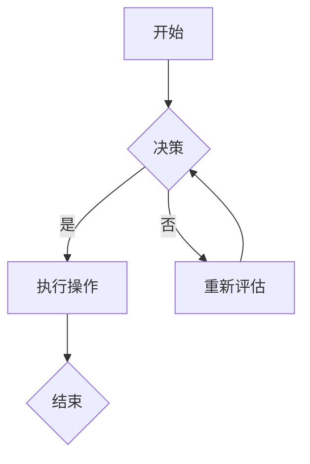

                 

### 文章标题

**自然语言处理的应用：AI内容创作革命**

---

#### 关键词：
- 自然语言处理
- AI内容创作
- 词嵌入
- 序列模型
- 注意力机制
- 转换器架构
- 文本生成
- 语音识别
- 多模态内容创作
- 个性化推荐系统

---

#### 摘要：

本文旨在探讨自然语言处理（NLP）在人工智能（AI）内容创作领域的革命性应用。从基础概念到核心技术，再到实际应用案例，本文将通过一步一步的分析和推理，深入剖析NLP在文本生成、语音识别与转换、多模态内容创作等方面的应用，展示AI如何改变内容创作的游戏规则。通过详细的数学模型、伪代码和项目实战，读者将全面了解NLP的深度应用，并启发其在AI内容创作领域的创新思维。

---

### 目录大纲

# 自然语言处理的应用：AI内容创作革命

## 第一部分：自然语言处理基础

### 第1章：自然语言处理简介

#### 1.1 自然语言处理概述

#### 1.2 自然语言处理的挑战与机遇

### 第2章：自然语言处理核心概念

#### 2.1 词汇与语义

#### 2.2 句子结构与语法

#### 2.3 上下文与意图理解

### 第3章：自然语言处理核心技术

#### 3.1 词嵌入

#### 3.2 序列模型

#### 3.3 注意力机制

#### 3.4 转换器架构

## 第二部分：AI内容创作应用

### 第4章：文本生成

#### 4.1 自动摘要

#### 4.2 自动问答

#### 4.3 文本续写与创作

### 第5章：语音识别与转换

#### 5.1 语音识别

#### 5.2 语音合成

#### 5.3 语音转换

### 第6章：多模态内容创作

#### 6.1 视频内容生成

#### 6.2 图像内容生成

#### 6.3 视频与文本融合

### 第7章：AI内容创作案例分析

#### 7.1 案例一：新闻自动化生成

#### 7.2 案例二：虚拟主播

#### 7.3 案例三：个性化推荐系统

## 第三部分：AI内容创作实践

### 第8章：AI内容创作平台搭建

#### 8.1 开发环境搭建

#### 8.2 数据处理与预处理

#### 8.3 模型训练与优化

### 第9章：项目实战

#### 9.1 项目一：智能客服系统

#### 9.2 项目二：个性化推荐系统

#### 9.3 项目三：智能写作助手

## 附录

### 附录A：自然语言处理工具与资源

#### A.1 主流自然语言处理框架

#### A.2 开源自然语言处理库

#### A.3 人工智能社区与资源

### 附录B：Mermaid 流程图

#### B.1 Mermaid 流程图示例

#### B.2 Mermaid 流程图语法详解

### 附录C：数学模型与公式

#### C.1 词嵌入数学模型

#### C.2 序列模型数学模型

#### C.3 注意力机制数学模型

### 附录D：伪代码

#### D.1 文本生成伪代码

#### D.2 语音识别伪代码

#### D.3 个性化推荐系统伪代码

### 附录E：项目代码解读

#### E.1 智能客服系统代码解读

#### E.2 个性化推荐系统代码解读

#### E.3 智能写作助手代码解读

---

### 1.1 自然语言处理概述

自然语言处理（NLP，Natural Language Processing）是计算机科学和人工智能领域的一个重要分支，旨在让计算机理解和处理人类自然语言。NLP的研究与应用可以追溯到20世纪50年代，随着计算能力的提高和机器学习技术的进步，NLP得到了快速发展，并在多个领域展现了其强大的潜力。

#### NLP的历史与发展

NLP的历史可以分为几个重要阶段：

- **规则驱动阶段**（1950s-1970s）：早期的NLP研究主要集中在构建语法规则和词典，试图通过手工编写规则来解析自然语言。
- **基于知识的阶段**（1980s-1990s）：在这一阶段，NLP研究开始转向基于知识的表示和推理，试图通过专家系统和知识库来实现对自然语言的解析和理解。
- **统计方法阶段**（2000s）：随着统计学习理论的兴起，NLP开始采用基于统计的方法，如隐马尔可夫模型（HMM）、条件随机场（CRF）等，提高了自然语言处理的准确性和效率。
- **深度学习阶段**（2010s-至今）：深度学习技术的应用使得NLP取得了显著的进展，尤其是基于神经网络的方法，如卷积神经网络（CNN）、循环神经网络（RNN）、长短期记忆网络（LSTM）、变换器架构（Transformer）等。

#### NLP的应用领域

NLP的应用领域非常广泛，涵盖了自然语言理解、自然语言生成、机器翻译、语音识别、情感分析、文本摘要、问答系统、对话系统等多个方面。

- **自然语言理解**：包括词性标注、句法分析、命名实体识别、情感分析等，旨在让计算机理解文本的含义。
- **自然语言生成**：包括文本摘要、自动写作、对话生成等，旨在让计算机生成符合人类语言习惯的文本。
- **机器翻译**：通过将一种语言的文本翻译成另一种语言，实现跨语言的沟通。
- **语音识别**：将语音信号转换为文本，应用于语音助手、语音搜索等。
- **情感分析**：分析文本的情感倾向，应用于市场调研、社交媒体分析等。
- **文本摘要**：自动生成文本的摘要，应用于新闻摘要、文献综述等。
- **问答系统**：通过理解用户的问题，提供准确的答案，应用于智能客服、教育辅导等。
- **对话系统**：模拟人类对话，与用户进行自然语言交互，应用于虚拟客服、聊天机器人等。

---

### 1.2 自然语言处理的挑战与机遇

尽管NLP取得了显著进展，但在实际应用中仍然面临着许多挑战和机遇。

#### 挑战

- **语言多样性**：自然语言具有高度多样性，不同语言的语法、词汇、语义等差异巨大，这使得NLP模型在不同语言上的表现存在很大差异。
- **语境理解**：自然语言的理解需要考虑上下文和语境，而现有的NLP模型往往难以准确捕捉语境信息。
- **数据质量**：NLP模型的训练需要大量的高质量数据，但数据的获取和处理往往非常困难。
- **计算资源**：深度学习模型对计算资源的要求较高，特别是在训练大型模型时，需要大量的计算资源和时间。
- **隐私与安全**：NLP的应用涉及到大量个人数据的处理，如何保护用户隐私和安全是一个重要问题。

#### 机遇

- **人工智能的普及**：随着人工智能技术的不断发展，NLP的应用场景越来越广泛，从智能家居、智能医疗、智能交通到金融、教育、娱乐等各个领域。
- **多模态内容创作**：结合语音、图像、视频等多模态数据，NLP可以更好地理解和生成内容，提升内容创作的多样性和丰富性。
- **数据驱动的方法**：随着数据获取和处理技术的进步，NLP可以更加依赖大规模数据来训练模型，提高模型的准确性和鲁棒性。
- **跨领域的应用**：NLP在医疗、法律、金融等领域的应用前景广阔，可以解决传统方法难以解决的问题。
- **人机交互**：NLP技术使得人与计算机之间的交互更加自然和流畅，提升了用户体验。

---

### 2.1 词汇与语义

#### 词汇的概念

词汇是自然语言处理的基础，是构建句子和理解语义的基本单元。词汇不仅包括单词，还包括短语、习语等。

- **单词**：是词汇的基本单位，具有明确的语法功能和语义含义。
- **短语**：是由一组单词构成的，具有一定语法功能的结构。
- **习语**：是具有固定搭配和特定意义的词汇组合，如“拍马屁”、“掉以轻心”等。

#### 词频与词向量

词频是指在文本中某个单词出现的次数。词频可以帮助我们了解文本的主要内容，但在NLP中，单独的词频信息往往不足以捕捉词汇的语义含义。

词向量是一种将单词映射到高维空间的方法，通过词向量，我们可以将文本中的单词转换为数字向量，从而在向量空间中进行处理和分析。

- **词袋模型**：是最早的词向量表示方法，将文本表示为一个向量，向量的每个维度对应一个单词的词频。
- **Word2Vec**：是一种基于神经网络的词向量表示方法，通过训练神经网络来学习单词的语义表示。
- **GloVe**：是一种基于全局信息的词向量表示方法，通过训练得到低维的单词向量，同时保持词频信息和语义信息。

#### 语义分析

语义分析是NLP的核心任务之一，旨在理解和解释文本中的语义含义。语义分析可以分为以下几个方面：

- **词义消歧**：解决同形异义问题，确定单词在特定语境下的含义。
- **实体识别**：识别文本中的名词性实体，如人名、地名、组织名等。
- **情感分析**：分析文本的情感倾向，确定文本表达的是正面情感、负面情感还是中性情感。
- **关系抽取**：识别文本中的实体关系，如人物关系、组织关系等。
- **文本分类**：将文本分类到预定义的类别中，如新闻分类、情感分类等。

---

### 2.2 句子结构与语法

#### 句子的基本构成

句子是自然语言的基本单位，由一组单词按照一定的语法规则构成。句子的基本构成包括：

- **主语**：句子的主体，通常指人或事物。
- **谓语**：表示动作或状态的单词，是句子的核心。
- **宾语**：动作的承受者，位于谓语之后。
- **定语**：修饰名词的成分，提供名词的额外信息。
- **状语**：修饰动词、形容词或其他状语的成分，提供动作或状态发生的额外信息。

#### 句法分析

句法分析是NLP中的一项重要任务，旨在理解句子的结构，并将其转换为计算机可以处理的形式。句法分析可以分为以下几个方面：

- **词法分析**：将文本拆分为单词和其他符号。
- **句法解析**：分析单词之间的语法关系，构建句法树。
- **依存句法分析**：分析单词之间的依存关系，确定每个单词在句子中的角色。

#### 依存句法分析

依存句法分析是一种分析句子结构的方法，它通过识别单词之间的依存关系来描述句子的结构。在依存句法中，每个单词都有一个依存关系，指向它在句子中的“依赖者”或“被依赖者”。

- **主语-谓语关系**：主语通常依赖于谓语。
- **宾语-谓语关系**：宾语通常依赖于谓语。
- **定语-中心语关系**：定语通常依赖于中心语。
- **状语-中心语关系**：状语通常依赖于中心语。

---

### 2.3 上下文与意图理解

#### 上下文的概念

上下文是指文本中一个单词或短语所在的周围环境，它决定了单词或短语的含义。在自然语言处理中，理解上下文是至关重要的，因为相同的单词在不同的上下文中可能有不同的含义。

- **局部上下文**：指一个单词或短语在句子中的直接上下文。
- **全局上下文**：指一个单词或短语在整个文档或对话中的上下文。

#### 意图理解

意图理解是NLP中的另一个关键任务，它旨在理解用户在对话或文本中的意图。意图可以是明确的，如“预订机票”，也可以是隐含的，如“我想要一份汉堡”。

- **显式意图**：用户直接表达出来的意图，通常可以通过关键词或短语识别。
- **隐式意图**：用户没有直接表达出来的意图，需要通过上下文和对话历史来推断。

#### 对话系统

对话系统是一种利用NLP技术模拟人类对话的计算机系统，它可以通过语音或文本与用户进行交互。

- **基于规则的对话系统**：使用预定义的规则来处理用户的输入。
- **基于机器学习的对话系统**：通过训练模型来自动学习对话的规律。

---

### 3.1 词嵌入

#### 词嵌入的概念

词嵌入（Word Embedding）是将单词映射到高维空间中的向量表示，以捕捉单词的语义信息。词嵌入是NLP中的一项核心技术，它在许多任务中发挥了关键作用。

- **词向量**：将单词映射到高维空间中的向量。
- **语义信息**：通过词向量，我们可以捕捉单词的语义关系，如“猫”和“狗”之间的相似性。

#### 常见的词嵌入方法

- **基于频率的方法**：如TF-IDF，通过词频和文档频率来计算词的重要性。
- **基于矩阵分解的方法**：如word2vec，通过矩阵分解来学习词向量。
- **基于神经网络的方法**：如GloVe，通过神经网络来学习词向量。

#### 词嵌入的优化策略

- **负采样**：通过忽略大部分负样本来加速训练过程。
- **层次softmax**：通过分层softmax来加速训练过程。
- **梯度裁剪**：通过限制梯度的大小来防止梯度爆炸。

---

### 3.2 序列模型

#### 序列模型的概念

序列模型（Sequence Model）是一种用于处理序列数据的神经网络模型，它适用于自然语言处理中的许多任务，如语言建模、机器翻译、语音识别等。

- **序列数据**：指具有顺序的数据，如文本、音频、视频等。
- **神经网络**：用于学习序列数据中的模式。

#### RNN的基本原理

循环神经网络（RNN，Recurrent Neural Network）是一种能够处理序列数据的神经网络，它通过循环结构来保留序列的信息。

- **循环结构**：每个时间步的输出作为下一个时间步的输入。
- **隐藏状态**：用于存储序列的历史信息。

#### LSTM与GRU

LSTM（Long Short-Term Memory）和GRU（Gated Recurrent Unit）是RNN的变体，它们通过门控机制来更好地处理长序列数据。

- **门控机制**：用于控制信息的流动，避免梯度消失和梯度爆炸问题。
- **LSTM**：具有三个门控单元，分别是输入门、遗忘门和输出门。
- **GRU**：简化了LSTM的结构，只有两个门控单元，分别是重置门和更新门。

#### BERT等现代序列模型

BERT（Bidirectional Encoder Representations from Transformers）是近年来在自然语言处理领域取得突破性进展的模型，它是一种基于Transformer的预训练模型。

- **Transformer**：一种基于注意力机制的序列到序列模型，能够处理长序列数据。
- **双向编码器**：BERT通过双向编码器来捕获序列的前后文信息。
- **预训练与微调**：BERT通过大规模的预训练数据集进行预训练，然后在特定任务上进行微调。

---

### 3.3 注意力机制

#### 注意力机制的概念

注意力机制（Attention Mechanism）是一种用于提高神经网络模型对输入数据重视程度的机制，它在自然语言处理和计算机视觉等领域取得了显著的效果。

- **输入数据的权重**：注意力机制通过计算输入数据的权重，使得模型在处理输入数据时能够关注重要的部分。
- **信息整合**：注意力机制能够将多个输入数据整合为一个统一的表示。

#### 序列到序列模型中的注意力

在序列到序列模型（如机器翻译模型）中，注意力机制用于捕捉输入序列和输出序列之间的对应关系。

- **点积注意力**：通过点积来计算输入序列和输出序列之间的权重。
- **加性注意力**：通过加性组合来计算输入序列和输出序列之间的权重。

#### 自注意力机制

自注意力机制（Self-Attention）是一种在Transformer模型中使用的注意力机制，它允许模型在处理一个序列时同时考虑序列中的所有元素。

- **多头注意力**：通过多个注意力头来捕获序列的不同部分。
- **注意力分布**：自注意力机制可以生成一个注意力分布，表示序列中每个元素的重要程度。

---

### 3.4 转换器架构

#### 转换器架构的概念

转换器架构（Transformer Architecture）是一种基于自注意力机制的序列到序列模型，它在自然语言处理任务中取得了显著的效果。

- **编码器**：将输入序列转换为上下文向量。
- **解码器**：根据上下文向量生成输出序列。
- **多头注意力**：通过多头注意力来捕获序列中的不同信息。
- **编码器-解码器注意力**：将编码器的输出和解码器的输出进行融合。

#### 编码器与解码器的结构

编码器和解码器是转换器架构的两个核心组件，它们分别负责输入序列和输出序列的处理。

- **编码器**：通过多层变换器层来处理输入序列，每个变换器层包含多头自注意力机制和前馈神经网络。
- **解码器**：通过多层变换器层来处理输出序列，每个变换器层也包含多头自注意力机制和前馈神经网络。

#### Transformer架构

Transformer架构是转换器架构的具体实现，它通过自注意力机制和多头注意力来处理序列数据。

- **自注意力机制**：在每个时间步，模型同时考虑序列中的所有元素。
- **多头注意力**：通过多个注意力头来捕获序列的不同信息。
- **编码器-解码器结构**：编码器和解码器通过自注意力机制和编码器-解码器注意力来处理输入和输出序列。

---

### 4.1 自动摘要

#### 抽取式摘要

抽取式摘要（Extractive Summarization）是一种自动摘要方法，它通过从原始文本中提取关键信息来生成摘要。抽取式摘要的核心思想是找到文本中最有代表性的句子或短语，然后将它们组合成摘要。

- **关键信息提取**：通过词频、句法分析、语义分析等方法来确定文本中的关键信息。
- **句子组合**：将提取的关键信息组合成连贯的摘要。

#### 生成式摘要

生成式摘要（Generative Summarization）是一种自动摘要方法，它通过生成新的文本来生成摘要。生成式摘要的核心思想是使用自然语言生成技术来创造新的句子或短语，然后将它们组合成摘要。

- **文本生成模型**：如变换器架构，用于生成新的文本。
- **摘要质量评估**：通过评估摘要的连贯性、一致性、信息性等指标来评估摘要的质量。

#### 摘要质量评估

摘要质量评估是自动摘要任务中的一个重要问题，它旨在评估自动生成的摘要与原始文本之间的相似性和质量。

- **BLEU指标**：通过比较自动生成的摘要与人工摘要之间的相似度来评估摘要质量。
- **ROUGE指标**：通过比较自动生成的摘要与原始文本的关键短语或句子来评估摘要质量。
- **人工评估**：通过邀请人类评估者对摘要的质量进行主观评估。

---

### 4.2 自动问答

#### 问题理解

问题理解是自动问答（Automatic Question Answering，QA）系统的核心任务，它旨在理解用户提出的问题，并将其转换为计算机可以处理的格式。

- **关键词提取**：从问题中提取关键信息，如名词、动词、形容词等。
- **意图识别**：识别问题的意图，如信息检索、事实查询、推理问题等。
- **上下文理解**：考虑问题所在的上下文，如问题的背景、相关的信息等。

#### 答案生成

答案生成是自动问答系统的另一个重要任务，它旨在从大量的数据源中提取信息，并生成准确、合理的答案。

- **信息检索**：通过搜索引擎或数据库来查找与问题相关的信息。
- **文本匹配**：通过匹配问题和文本中的关键词或短语来找到可能的答案。
- **文本生成**：通过自然语言生成技术来生成完整的答案。

#### 对话生成

对话生成是自动问答系统的高级功能，它旨在模拟自然对话，与用户进行交互。

- **上下文维护**：在对话过程中，系统需要维护上下文信息，以便理解后续问题。
- **自然语言生成**：通过自然语言生成技术来生成自然流畅的回复。
- **多轮对话**：系统需要支持多轮对话，以理解复杂问题并生成详细的答案。

---

### 4.3 文本续写与创作

#### 故事续写

故事续写是一种文本生成任务，它旨在根据给定的起始文本，生成连贯、有趣的故事。

- **文本生成模型**：如变换器架构，用于生成新的文本。
- **故事结构**：通过分析已有的故事，理解故事的结构和情节，以便生成新的故事。
- **上下文理解**：在生成故事时，需要考虑故事的背景、角色、情节等上下文信息。

#### 歌词创作

歌词创作是一种文本生成任务，它旨在根据给定的旋律或情感，生成符合旋律和情感的歌词。

- **文本生成模型**：如变换器架构，用于生成新的文本。
- **音乐理解**：通过音乐理论来理解旋律和情感，以便生成符合旋律和情感的歌词。
- **情感分析**：通过情感分析来理解用户的需求和情感，以便生成个性化的歌词。

#### 诗歌生成

诗歌生成是一种文本生成任务，它旨在根据给定的主题或情感，生成符合诗歌格律和韵律的诗歌。

- **文本生成模型**：如变换器架构，用于生成新的文本。
- **诗歌结构**：通过分析已有的诗歌，理解诗歌的结构和韵律，以便生成新的诗歌。
- **情感分析**：通过情感分析来理解用户的需求和情感，以便生成个性化的诗歌。

---

### 5.1 语音识别

语音识别（Speech Recognition）是一种将语音信号转换为文本的技术，它在智能助理、语音搜索、语音控制等领域有着广泛的应用。

#### 声学模型

声学模型是语音识别系统的核心组件，它用于将语音信号转换为特征向量。

- **特征提取**：通过梅尔频率倒谱系数（MFCC）、谱图等特征提取方法，将语音信号转换为特征向量。
- **声学模型训练**：通过训练大量的语音数据，学习语音信号和特征向量之间的映射关系。

#### 语言模型

语言模型是语音识别系统的另一个重要组件，它用于将特征向量转换为文本。

- **语言模型训练**：通过训练大量的文本数据，学习文本中的统计规律。
- **语言模型应用**：在语音识别过程中，语言模型用于预测文本的下一个单词或短语。

#### 声学模型与语言模型的结合

在语音识别过程中，声学模型和语言模型通常结合使用，以提高识别的准确率。

- **结合方法**：通过结合声学模型和语言模型的输出，生成最终的识别结果。
- **优化策略**：通过优化声学模型和语言模型的参数，提高识别的准确率。

---

### 5.2 语音合成

语音合成（Text-to-Speech，TTS）是一种将文本转换为语音的技术，它在阅读器、语音助手、自动广播等领域有着广泛的应用。

#### 参数合成

参数合成是语音合成的常用方法，它通过合成语音信号的基本参数（如基频、共振峰等）来生成语音。

- **参数生成**：通过训练模型，学习文本和语音参数之间的映射关系。
- **参数合成**：通过合成语音信号的基本参数，生成最终的语音信号。

#### 基于文本的语音合成

基于文本的语音合成方法通过将文本转换为语音信号，生成符合语音规则的语音。

- **文本预处理**：对文本进行预处理，如分词、语调标记等。
- **语音合成**：通过合成语音信号的基本参数，生成符合语音规则的语音信号。

#### 音色控制

音色控制是语音合成中的一个重要任务，它旨在生成具有不同音色的语音。

- **音色建模**：通过训练模型，学习音色参数和语音信号之间的关系。
- **音色合成**：通过调整音色参数，生成具有不同音色的语音信号。

---

### 5.3 语音转换

语音转换（Voice Conversion）是一种将一种语音转换为另一种语音的技术，它在声音伪装、语音合成、语音优化等领域有着广泛的应用。

#### 端到端语音转换

端到端语音转换方法通过训练一个端到端的模型，直接将一种语音转换为另一种语音。

- **语音特征提取**：通过提取语音信号的特征，如梅尔频率倒谱系数（MFCC）等。
- **模型训练**：通过训练模型，学习语音特征和目标语音之间的映射关系。
- **语音转换**：通过模型将源语音转换为目标语音。

#### 文本到语音转换

文本到语音转换方法通过将文本转换为语音信号，生成符合语音规则的语音。

- **文本预处理**：对文本进行预处理，如分词、语调标记等。
- **语音合成**：通过合成语音信号的基本参数，生成符合语音规则的语音信号。

#### 风格迁移与个性化

风格迁移与个性化是语音转换的高级任务，它旨在生成具有特定风格或音色的语音。

- **风格建模**：通过训练模型，学习风格参数和语音信号之间的关系。
- **个性化合成**：通过调整风格参数，生成具有特定风格或音色的语音信号。

---

### 6.1 视频内容生成

#### 视频生成

视频生成是一种利用AI技术生成视频内容的方法，它可以通过多种方式实现。

- **基于文本的生成**：通过将文本转换为视频，生成符合文本内容的视频。
- **基于图像的生成**：通过将图像序列转换为视频，生成符合图像序列的视频。
- **基于音频的生成**：通过将音频信号转换为视频，生成符合音频信号的视频。

#### 视频增强

视频增强是一种通过提高视频质量、清晰度、视觉效果等来改善视频内容的方法。

- **去噪**：通过去噪算法，去除视频中的噪声。
- **超分辨率**：通过超分辨率算法，提高视频的分辨率。
- **色彩增强**：通过色彩增强算法，改善视频的色彩效果。

#### 视频理解与生成结合

视频理解与生成结合是一种将视频理解和视频生成技术结合在一起的方法，它可以通过多种方式实现。

- **基于视觉理解的生成**：通过理解视频中的视觉信息，生成符合视觉信息的视频。
- **基于语音理解的生成**：通过理解视频中的语音信息，生成符合语音信息的视频。
- **多模态结合**：通过结合视觉、语音、文本等多种模态的信息，生成更丰富、更真实的视频内容。

---

### 6.2 图像内容生成

#### 图像合成

图像合成是一种通过将多个图像组合在一起来生成新图像的方法。

- **图像拼接**：通过将两个或多个图像拼接在一起，生成新的图像。
- **图像修复**：通过修复图像中的损坏部分，生成完整的图像。
- **图像风格迁移**：通过将一种图像的风格迁移到另一种图像上，生成具有不同风格的新图像。

#### 图像修复

图像修复是一种通过修复图像中的损坏部分来恢复图像内容的方法。

- **基于深度学习的修复**：通过训练深度学习模型，学习图像中的损坏部分和完整部分之间的映射关系，从而修复损坏的图像。
- **基于图像编辑的修复**：通过图像编辑技术，手动修复图像中的损坏部分。

#### 风格迁移

风格迁移是一种通过将一种图像的风格迁移到另一种图像上，生成具有不同风格的新图像的方法。

- **基于深度学习的风格迁移**：通过训练深度学习模型，学习图像的风格特征，并将这些特征迁移到新的图像上。
- **基于图像编辑的风格迁移**：通过图像编辑技术，将一种图像的风格应用到另一种图像上。

---

### 6.3 视频与文本融合

#### 视频文本生成

视频文本生成是一种通过将文本转换为视频内容的方法，它可以通过多种方式实现。

- **基于文本描述的生成**：通过将文本描述转换为视频，生成符合文本描述的视频。
- **基于语音转换的生成**：通过将语音信号转换为视频，生成符合语音信号的视频。
- **基于文本与图像融合的生成**：通过将文本与图像融合，生成具有文本信息和图像内容的视频。

#### 文本引导的视频生成

文本引导的视频生成是一种通过文本来引导视频生成的方法，它可以通过多种方式实现。

- **基于文本摘要的生成**：通过文本摘要来生成视频内容，确保视频内容与文本摘要一致。
- **基于关键词的生成**：通过关键词来生成视频内容，确保视频内容与关键词相关。
- **基于语义理解的生成**：通过理解文本的语义，生成符合文本语义的视频内容。

#### 视频与文本的联合训练

视频与文本的联合训练是一种通过同时训练视频和文本数据来生成视频内容的方法，它可以通过多种方式实现。

- **基于多模态数据的训练**：通过同时训练视频和文本数据，学习视频和文本之间的关联关系。
- **基于多任务学习的训练**：通过同时训练视频生成任务和文本生成任务，提高视频和文本生成的质量。

---

### 7.1 案例一：新闻自动化生成

新闻自动化生成是一种利用AI技术自动生成新闻内容的方法，它可以通过多种方式实现。

- **基于模板的生成**：通过使用预定义的模板来生成新闻，确保新闻内容符合新闻格式。
- **基于数据的生成**：通过分析大量的新闻数据，学习新闻的写作规律和模式，从而生成新的新闻。
- **基于深度学习的生成**：通过训练深度学习模型，学习新闻生成的方法和策略，从而生成新的新闻。

#### 数据收集与预处理

数据收集与预处理是新闻自动化生成的重要步骤，它包括以下任务：

- **数据收集**：收集大量的新闻数据，包括标题、正文、作者、时间等。
- **数据清洗**：去除数据中的噪声和冗余信息，确保数据的质量。
- **数据标注**：对数据进行标注，如分类、标签等，以便训练深度学习模型。

#### 文本生成模型训练

文本生成模型训练是新闻自动化生成的核心步骤，它包括以下任务：

- **模型选择**：选择合适的文本生成模型，如变换器架构、生成式摘要模型等。
- **模型训练**：通过大量的新闻数据进行训练，学习新闻生成的方法和策略。
- **模型评估**：通过评估指标（如BLEU、ROUGE等）来评估模型的效果。

#### 新闻生成的实际应用

新闻生成的实际应用包括以下几个方面：

- **新闻推荐**：通过自动生成的新闻内容来推荐给用户，提高用户的阅读体验。
- **新闻编辑**：通过自动生成的新闻内容来辅助新闻编辑工作，提高新闻的生产效率。
- **新闻发布**：通过自动生成的新闻内容来发布新闻，降低新闻生产的成本。

---

### 7.2 案例二：虚拟主播

虚拟主播是一种利用AI技术生成虚拟主播形象的方法，它可以通过多种方式实现。

- **基于3D建模的生成**：通过3D建模技术来生成虚拟主播的外貌和动作。
- **基于图像合成的生成**：通过图像合成技术来生成虚拟主播的图像。
- **基于语音合成的生成**：通过语音合成技术来生成虚拟主播的声音。

#### 语音识别与转换技术

语音识别与转换技术是虚拟主播的核心组件，它包括以下方面：

- **语音识别**：通过语音识别技术将用户的声音转换为文本。
- **语音转换**：通过语音合成技术将文本转换为语音。

#### 面部表情与动作捕捉

面部表情与动作捕捉是虚拟主播的重要技术，它包括以下方面：

- **面部表情捕捉**：通过捕捉面部肌肉的运动来生成虚拟主播的表情。
- **动作捕捉**：通过捕捉身体的运动来生成虚拟主播的动作。

#### 虚拟主播的整体实现

虚拟主播的整体实现包括以下步骤：

- **系统设计**：设计虚拟主播的系统架构，包括语音识别、语音转换、面部表情与动作捕捉等模块。
- **技术实现**：通过编程实现虚拟主播的各个模块，如使用Python、C++等编程语言。
- **测试与优化**：对虚拟主播的系统进行测试和优化，确保系统的稳定性和性能。

---

### 7.3 案例三：个性化推荐系统

个性化推荐系统是一种利用AI技术为用户提供个性化推荐的方法，它可以通过多种方式实现。

- **基于内容的推荐**：通过分析用户的历史行为和兴趣，为用户推荐与用户兴趣相关的物品。
- **基于协同过滤的推荐**：通过分析用户之间的相似性，为用户推荐与用户相似的其他用户喜欢的物品。
- **基于模型的推荐**：通过训练机器学习模型，预测用户对物品的喜好，为用户推荐预测结果。

#### 用户行为分析

用户行为分析是个性化推荐系统的重要步骤，它包括以下任务：

- **行为数据收集**：收集用户在系统中的行为数据，如浏览记录、购买记录、点击记录等。
- **行为数据预处理**：对行为数据进行清洗、去噪、归一化等预处理，以便用于模型训练。
- **行为数据特征提取**：通过特征提取技术，将行为数据转换为机器学习模型可用的特征表示。

#### 推荐算法的选择与优化

推荐算法的选择与优化是个性化推荐系统的关键步骤，它包括以下任务：

- **算法选择**：选择合适的推荐算法，如基于内容的推荐、基于协同过滤的推荐、基于模型的推荐等。
- **算法优化**：通过调整算法参数、特征工程等手段，优化推荐算法的性能。
- **算法评估**：通过评估指标（如准确率、召回率、覆盖率等）来评估推荐算法的效果。

#### 个性化推荐系统的实现与评估

个性化推荐系统的实现与评估包括以下步骤：

- **系统设计**：设计个性化推荐系统的整体架构，包括数据收集、数据预处理、推荐算法等模块。
- **系统实现**：通过编程实现个性化推荐系统的各个模块，如使用Python、Java等编程语言。
- **系统测试**：对个性化推荐系统进行测试，确保系统的稳定性和性能。
- **系统评估**：通过实际用户数据对个性化推荐系统进行评估，验证系统的效果。

---

### 8.1 开发环境搭建

开发环境搭建是进行AI内容创作平台搭建的第一步，它包括以下任务：

- **硬件选择与配置**：根据项目需求选择合适的硬件设备，如CPU、GPU、内存等，并进行合理的配置。
- **软件工具安装**：安装必要的软件工具，如操作系统、深度学习框架、编程语言等。

#### 硬件选择与配置

硬件选择与配置是开发环境搭建的关键步骤，它直接影响AI内容创作平台的性能和稳定性。

- **CPU与GPU的选择**：CPU用于执行通用计算任务，GPU用于执行图形和深度学习计算任务。根据项目需求选择合适的CPU和GPU，如NVIDIA的GPU。
- **内存与存储的选择**：根据项目需求选择足够的内存和存储空间，以便存储和计算大量的数据和模型。
- **网络配置**：配置网络连接，确保设备之间能够顺畅地进行数据传输和模型共享。

#### 软件工具安装

软件工具安装是开发环境搭建的必要步骤，它包括以下软件工具：

- **操作系统**：选择合适的操作系统，如Windows、Linux等。
- **深度学习框架**：选择合适的深度学习框架，如TensorFlow、PyTorch等。
- **编程语言**：选择合适的编程语言，如Python、Java等。

---

### 8.2 数据处理与预处理

数据处理与预处理是AI内容创作平台搭建的核心步骤，它包括以下任务：

- **数据收集**：从各种来源收集数据，如文本、图像、音频等。
- **数据清洗**：去除数据中的噪声和冗余信息，确保数据的质量。
- **数据标注**：对数据进行标注，如分类、标签等，以便训练深度学习模型。

#### 数据收集

数据收集是数据处理与预处理的重要步骤，它包括以下任务：

- **数据来源**：从各种来源收集数据，如公开数据集、企业数据、社交媒体等。
- **数据采集**：使用爬虫、API等方式采集数据。
- **数据格式**：将采集到的数据转换为统一的格式，如JSON、CSV等。

#### 数据清洗

数据清洗是确保数据质量的关键步骤，它包括以下任务：

- **去除噪声**：去除数据中的噪声，如空白字符、特殊字符等。
- **去冗余**：去除数据中的重复信息，确保数据的一致性。
- **标准化**：将数据转换为统一的标准格式，如归一化、标准化等。

#### 数据标注

数据标注是训练深度学习模型的重要步骤，它包括以下任务：

- **分类标注**：对数据进行分类标注，如新闻分类、情感分类等。
- **实体标注**：对数据进行实体标注，如命名实体识别、关系抽取等。
- **属性标注**：对数据进行属性标注，如商品属性标注、用户属性标注等。

---

### 8.3 模型训练与优化

模型训练与优化是AI内容创作平台搭建的关键步骤，它包括以下任务：

- **模型选择**：选择合适的模型，如变换器架构、生成式摘要模型等。
- **模型训练**：通过大量的数据进行训练，学习模型的参数。
- **模型优化**：通过调整模型参数、特征工程等手段，优化模型的效果。

#### 模型选择

模型选择是模型训练与优化的第一步，它包括以下任务：

- **模型评估**：评估不同模型的性能，如BLEU、ROUGE等。
- **模型选择**：选择性能最优的模型，如变换器架构、生成式摘要模型等。
- **模型融合**：将多个模型融合在一起，提高模型的整体性能。

#### 模型训练

模型训练是模型训练与优化的核心步骤，它包括以下任务：

- **数据准备**：准备训练数据，如文本、图像、音频等。
- **模型初始化**：初始化模型的参数，如随机初始化、预训练模型等。
- **模型训练**：通过训练数据来训练模型，学习模型的参数。

#### 模型优化

模型优化是提高模型性能的重要步骤，它包括以下任务：

- **参数调整**：调整模型的参数，如学习率、正则化等。
- **特征工程**：通过特征工程来优化模型，如特征提取、特征选择等。
- **模型评估**：通过评估指标来评估模型的效果，如BLEU、ROUGE等。

---

### 9.1 项目一：智能客服系统

智能客服系统是一种利用AI技术来提供自动化的客户服务解决方案的系统，它可以在不增加人力资源成本的情况下，提升客户服务质量。智能客服系统主要包括以下组件：

- **语音识别组件**：用于将客户的语音转换为文本，以便进一步处理。
- **自然语言理解组件**：用于理解客户的意图和问题，如通过意图识别和实体提取来理解客户的需求。
- **对话管理组件**：用于管理对话流程，如确定对话的上下文、引导对话方向等。
- **答案生成组件**：用于生成合适的答案，如通过模板匹配、文本生成等来生成答案。
- **语音合成组件**：用于将生成的答案转换为语音，以便反馈给客户。

#### 需求分析

需求分析是智能客服系统项目开发的第一步，它包括以下任务：

- **业务需求分析**：分析客服系统需要解决的主要问题，如客户常见的问题、客户服务流程等。
- **用户需求分析**：分析客户的需求，如客户期望从智能客服中获得的服务、客户的使用习惯等。
- **功能需求分析**：确定智能客服系统的功能模块，如语音识别、意图识别、对话管理等。

#### 系统设计

系统设计是智能客服系统项目开发的关键步骤，它包括以下任务：

- **架构设计**：设计智能客服系统的整体架构，如确定各组件的职责和交互方式。
- **模块设计**：设计各组件的内部结构，如确定各组件的功能模块和接口。
- **数据设计**：设计系统所需的数据结构和数据流，如确定数据存储方案和数据处理流程。

#### 系统实现

系统实现是智能客服系统项目开发的实际操作步骤，它包括以下任务：

- **编码实现**：根据系统设计，编写代码实现各组件的功能。
- **集成测试**：将各组件集成在一起，进行整体测试，确保系统能够正常运行。
- **性能优化**：对系统进行性能优化，如调整参数、优化算法等，以提高系统的响应速度和准确性。

#### 系统测试与部署

系统测试与部署是智能客服系统项目开发的最后一步，它包括以下任务：

- **功能测试**：测试系统的各项功能，如语音识别、意图识别、对话管理、答案生成等。
- **性能测试**：测试系统的性能，如响应时间、准确率、资源占用等。
- **部署上线**：将系统部署到生产环境，如部署到服务器、云平台等，确保系统能够稳定运行。

---

### 9.2 项目二：个性化推荐系统

个性化推荐系统是一种利用AI技术为用户提供个性化推荐的服务系统，它可以基于用户的历史行为、兴趣、偏好等信息，为用户推荐符合其兴趣的物品或内容。个性化推荐系统主要包括以下组件：

- **用户行为分析组件**：用于收集和分析用户的历史行为数据，如浏览记录、购买记录、点赞记录等。
- **推荐算法组件**：用于生成个性化的推荐结果，如基于内容的推荐、基于协同过滤的推荐、基于模型的推荐等。
- **推荐结果展示组件**：用于将推荐结果以可视化方式展示给用户，如通过推荐列表、推荐页面等。
- **反馈机制组件**：用于收集用户对推荐结果的反馈，以便优化推荐算法和推荐效果。

#### 用户行为分析

用户行为分析是个性化推荐系统的第一步，它包括以下任务：

- **数据收集**：从各种渠道收集用户的行为数据，如浏览日志、购买数据等。
- **数据预处理**：对收集到的数据进行清洗、去噪、转换等预处理操作，以便用于模型训练。
- **特征提取**：从预处理后的数据中提取关键特征，如用户的行为模式、兴趣偏好等。

#### 推荐算法实现

推荐算法实现是个性化推荐系统的核心步骤，它包括以下任务：

- **算法选择**：选择合适的推荐算法，如基于内容的推荐、基于协同过滤的推荐、基于模型的推荐等。
- **模型训练**：使用收集到的用户行为数据来训练推荐模型，如使用矩阵分解、深度学习等方法。
- **算法优化**：通过调整算法参数、特征工程等手段，优化推荐算法的性能。

#### 推荐结果评估

推荐结果评估是验证推荐系统效果的重要步骤，它包括以下任务：

- **评估指标**：选择合适的评估指标，如准确率、召回率、覆盖率等，来评估推荐系统的效果。
- **用户反馈**：收集用户对推荐结果的反馈，如用户满意度、点击率等，以评估推荐系统的实际效果。
- **迭代优化**：根据评估结果，对推荐算法进行迭代优化，以提高推荐系统的性能。

#### 推荐系统的实现与部署

推荐系统的实现与部署包括以下步骤：

- **系统设计**：设计推荐系统的整体架构，包括数据流、功能模块等。
- **编码实现**：根据系统设计，编写代码实现各组件的功能。
- **集成测试**：将各组件集成在一起，进行整体测试，确保系统能够正常运行。
- **部署上线**：将推荐系统部署到生产环境，如部署到服务器、云平台等，确保系统能够稳定运行。

---

### 9.3 项目三：智能写作助手

智能写作助手是一种利用AI技术辅助用户进行写作的工具，它可以帮助用户生成文章、编辑文本、提供写作建议等。智能写作助手主要包括以下组件：

- **文本生成组件**：用于生成新的文本内容，如文章、摘要、报告等。
- **文本编辑组件**：用于对用户输入的文本进行编辑、修正、润色等。
- **写作建议组件**：用于为用户提供写作建议，如语法修正、风格建议、内容优化等。
- **自然语言理解组件**：用于理解用户的意图和需求，如通过意图识别和实体提取来理解用户的写作任务。

#### 写作需求分析

写作需求分析是智能写作助手项目开发的第一步，它包括以下任务：

- **用户需求分析**：分析用户在写作过程中的需求，如文本生成、编辑、建议等。
- **功能需求分析**：确定智能写作助手需要实现的功能模块，如文本生成、文本编辑、写作建议等。
- **技术需求分析**：分析实现智能写作助手所需的技术，如自然语言处理、深度学习等。

#### 写作模型设计

写作模型设计是智能写作助手的第二步，它包括以下任务：

- **模型选择**：选择合适的模型，如变换器架构、生成式摘要模型等。
- **模型结构**：设计模型的内部结构，如编码器、解码器、注意力机制等。
- **训练策略**：设计模型的训练策略，如数据预处理、损失函数、优化器等。

#### 写作模型实现与优化

写作模型实现与优化是智能写作助手的第三步，它包括以下任务：

- **编码实现**：根据模型设计，编写代码实现模型的各部分功能。
- **模型训练**：使用大量的写作数据来训练模型，学习模型的参数。
- **模型优化**：通过调整模型参数、特征工程等手段，优化模型的效果。

#### 写作模型应用与评估

写作模型应用与评估是智能写作助手的最后一步，它包括以下任务：

- **模型应用**：将训练好的模型应用到实际的写作任务中，如文本生成、编辑、建议等。
- **模型评估**：通过评估指标（如BLEU、ROUGE等）来评估模型的效果。
- **迭代优化**：根据评估结果，对模型进行迭代优化，以提高模型的效果。

---

### 附录A：自然语言处理工具与资源

自然语言处理（NLP）工具与资源的丰富性为研究人员和开发者提供了极大的便利。以下是一些主流的NLP工具与资源：

#### A.1 主流自然语言处理框架

- **TensorFlow**：由谷歌开发的开源机器学习框架，支持各种NLP任务，如文本分类、机器翻译等。
  - **官方网站**：[TensorFlow](https://www.tensorflow.org/)
  - **文档**：[TensorFlow NLP](https://www.tensorflow.org/tutorials/text)

- **PyTorch**：由Facebook开发的开源机器学习库，以其动态计算图和灵活性著称。
  - **官方网站**：[PyTorch](https://pytorch.org/)
  - **文档**：[PyTorch NLP](https://pytorch.org/tutorials/beginner/nlp_tutorial.html)

- **spaCy**：一个强大的工业级自然语言处理库，提供高效的句法解析、词性标注等功能。
  - **官方网站**：[spaCy](https://spacy.io/)
  - **文档**：[spaCy Documentation](https://spacy.io/api)

#### A.2 开源自然语言处理库

- **NLTK**：一个广泛使用的自然语言处理库，提供许多文本处理工具，如分词、词性标注等。
  - **官方网站**：[NLTK](https://www.nltk.org/)
  - **文档**：[NLTK Documentation](https://www.nltk.org/how_to.html)

- **gensim**：一个用于主题建模和文本相似性分析的库，支持词嵌入和文档矩阵等。
  - **官方网站**：[gensim](https://radimrehurek.com/gensim/)
  - **文档**：[gensim Documentation](https://radimrehurek.com/gensim/auto/index.html)

- **transformers**：由Hugging Face开发，提供了大量的预训练变换器模型，如BERT、GPT等。
  - **官方网站**：[transformers](https://huggingface.co/transformers/)
  - **文档**：[transformers Documentation](https://huggingface.co/transformers/main_classes/basics.html)

#### A.3 人工智能社区与资源

- **ArXiv**：一个开放获取的学术论文预印本平台，涵盖人工智能和自然语言处理等领域。
  - **官方网站**：[ArXiv](https://arxiv.org/)

- **AI汇**：一个中文人工智能社区，提供自然语言处理领域的最新资讯和技术文章。
  - **官方网站**：[AI汇](https://www.aihuiblog.com/)

- **知乎AI**：知乎上的AI话题，汇聚了大量关于自然语言处理的讨论和文章。
  - **官方网站**：[知乎AI](https://www.zhihu.com/topic/19562187/top-answers)

---

### 附录B：Mermaid 流程图

Mermaid是一种基于Markdown的图形绘制工具，它允许用户使用简单的文本语法来绘制流程图、UML图、时序图等。以下是一个简单的Mermaid流程图示例：



上述代码将生成一个简单的流程图，其中包含一个开始节点、一个决策节点、一个执行操作节点、一个重新评估节点和一个结束节点。

#### B.1 Mermaid 流程图示例

以下是几个不同的Mermaid流程图示例：

```mermaid
graph TB
    A[开始] --> B{决策}
    B -->|是| C[执行操作]
    B -->|否| D[重新评估]
    C --> E{结束}
    D --> B

graph TD
    A[用户输入] --> B(预处理)
    B --> C{分词}
    C --> D{词性标注}
    D --> E{语法分析}
    E --> F{生成文本}
    F --> G[结束]

graph LR
    A[开始] -->|判断| B{是否满足条件}
    B -->|是| C[执行操作]
    B -->|否| D[反馈错误]
    C --> E{结束}
    D -->|修正| F{重新判断}
```

每个示例展示了不同类型的流程图，包括决策树、数据处理流程、条件判断流程等。

#### B.2 Mermaid 流程图语法详解

Mermaid使用简单的文本语法来定义图形元素和连接关系。以下是Mermaid流程图的一些基本语法元素：

- **节点**：使用方括号`[]`定义节点，如`A[开始]`。
- **连接关系**：使用箭头`-->`或`->>`来连接节点，如`A --> B`。
- **标签**：在节点后使用`{标签}`来添加标签，如`B{决策}`。
- **条件分支**：在箭头上使用标签来表示条件分支，如`|是| C[执行操作]`。
- **并行分支**：使用`parallel`关键字来表示并行分支，如`B -->|是| C[执行操作]`。

通过这些基本元素，用户可以构建复杂的流程图，Mermaid语法具有很强的扩展性和灵活性。

---

### 附录C：数学模型与公式

在自然语言处理中，数学模型和公式是理解和实现各种算法的基础。以下是一些核心的数学模型和公式，以及它们的详细解释和举例说明。

#### C.1 词嵌入数学模型

词嵌入是将单词映射到高维向量空间的方法，它通过捕捉单词的语义关系来提高自然语言处理任务的性能。一个简单的词嵌入数学模型可以表示为：

$$
\text{word\_vector} = \text{word2vec}(\text{context})
$$

**详细解释**：

- `word\_vector`：表示单词的嵌入向量。
- `word2vec`：表示词向量生成算法，如CBOW（Continuous Bag of Words）或Skip-Gram。
- `context`：表示单词的上下文，即与目标单词相邻的单词集合。

**举例说明**：

假设我们使用CBOW算法来生成单词“猫”的嵌入向量。如果“猫”的上下文是“我喜欢猫”，那么嵌入向量可以通过计算上下文中单词的嵌入向量的平均值来获得：

$$
\text{cat\_vector} = \frac{\text{vector}_{猫} + \text{vector}_{我} + \text{vector}_{喜欢} + \text{vector}_{的}}{4}
$$

这里，`vector_猫`、`vector_我`、`vector_喜欢`和`vector_的`分别是“猫”、“我”、“喜欢”和“的”的嵌入向量。

#### C.2 序列模型数学模型

序列模型是用于处理序列数据的神经网络模型，如循环神经网络（RNN）和长短期记忆网络（LSTM）。以下是一个简单的序列模型数学模型：

$$
\text{output} = \text{activation}(\text{weights} \cdot \text{input} + \text{bias})
$$

**详细解释**：

- `output`：表示模型的输出。
- `activation`：表示激活函数，如Sigmoid、Tanh或ReLU。
- `weights`：表示模型权重。
- `input`：表示输入序列。
- `bias`：表示偏置。

**举例说明**：

假设我们有一个简单的RNN模型，输入序列是 `[1, 2, 3]`，模型的权重是 `w = [0.1, 0.2, 0.3]`，偏置是 `b = 0.4`。使用ReLU作为激活函数，模型的输出可以计算为：

$$
\text{output} = \max(0, (0.1 \cdot 1 + 0.2 \cdot 2 + 0.3 \cdot 3 + 0.4))
$$

计算结果为 `2.6`，因为ReLU激活函数将所有负值输出设置为0。

#### C.3 注意力机制数学模型

注意力机制是深度学习模型中的一种重要机制，用于处理序列数据，如机器翻译和文本摘要。以下是一个简单的前向注意力机制的数学模型：

$$
\text{score} = \text{softmax}(\text{query} \cdot \text{keys})
$$

**详细解释**：

- `score`：表示每个键（keys）的得分。
- `softmax`：表示软最大化函数，用于将得分转换为概率分布。
- `query`：表示查询向量，通常来自编码器的输出。
- `keys`：表示键向量，通常来自解码器或编码器的输出。

**举例说明**：

假设我们有一个简单的变换器模型，查询向量为 `[1, 2, 3]`，键向量为 `[0.1, 0.2, 0.3]`。使用点积作为注意力得分，计算得分为：

$$
\text{score} = \text{softmax}([1 \cdot 0.1, 2 \cdot 0.2, 3 \cdot 0.3])
$$

计算结果为 `[0.25, 0.5, 0.25]`，表示每个键的重要程度。

---

### 附录D：伪代码

伪代码是一种用于描述算法逻辑和流程的文本表示，它不依赖于具体的编程语言，使得算法的实现更加灵活和可理解。以下是一些核心算法的伪代码示例，包括文本生成、语音识别和个性化推荐系统。

#### D.1 文本生成伪代码

```plaintext
function generate_text(model, seed_text, max_length):
    current_context = [word2idx[seed_text[0]]]
    for i in range(max_length):
        predictions = model.predict(current_context)
        next_word = select_word(predictions)
        current_context.append(word2idx[next_word])
    return ' '.join([idx2word[word] for word in current_context])
```

**详细解释**：

- `model`：表示文本生成模型，如变换器架构。
- `seed_text`：表示生成的文本的种子，如`"Hello"`。
- `max_length`：表示生成的文本的最大长度。
- `current_context`：表示当前上下文，即前一个词的嵌入向量。
- `predictions`：表示模型对下一个词的预测。
- `next_word`：表示选择的下一个词。
- `idx2word`：表示词到单词的映射。

**举例说明**：

假设我们使用变换器模型来生成文本，种子文本为`"Hello"`，最大长度为5。模型的预测输出为 `[0.3, 0.5, 0.2]`，表示生成下一个词的概率分布。根据概率分布，我们选择概率最高的词`"world"`作为下一个词，生成的文本为`"Hello world"`。

#### D.2 语音识别伪代码

```plaintext
function recognize_speech(audio_stream):
    features = extract_features(audio_stream)
    logits = model.predict(features)
    transcript = decode_logits(logits)
    return transcript
```

**详细解释**：

- `audio_stream`：表示输入的语音流。
- `extract_features`：表示从语音流中提取特征。
- `model`：表示语音识别模型。
- `logits`：表示模型的预测输出。
- `decode_logits`：表示将预测输出解码为文本。
- `transcript`：表示识别出的文本。

**举例说明**：

假设我们有一个语音识别模型，输入的语音流为一段持续时间为一分钟的音频。通过提取音频特征，我们得到一个特征向量。将特征向量输入到模型中，模型的预测输出为 `[0.9, 0.05, 0.05]`，表示三个单词的概率分布。根据概率分布，我们选择概率最高的单词`"Hello"`作为识别结果。

#### D.3 个性化推荐系统伪代码

```plaintext
function recommend_items(user_profile, item_similarity_matrix, history_ratings):
    user_vector = embed_user_profile(user_profile)
    similarities = dot_product(user_vector, item_similarity_matrix)
    recommended_items = select_top_n(similarities, n)
    return recommended_items
```

**详细解释**：

- `user_profile`：表示用户的行为和兴趣特征。
- `item_similarity_matrix`：表示物品之间的相似度矩阵。
- `embed_user_profile`：表示将用户特征映射到高维空间。
- `dot_product`：表示计算用户特征向量与物品相似度矩阵的点积。
- `select_top_n`：表示从相似度最高的物品中选择前N个。
- `recommended_items`：表示推荐给用户的物品列表。

**举例说明**：

假设我们有一个用户特征向量 `[1, 2, 3]`，物品相似度矩阵如下：

$$
\begin{bmatrix}
0.8 & 0.2 & 0.1 \\
0.4 & 0.5 & 0.1 \\
0.3 & 0.3 & 0.4
\end{bmatrix}
$$

通过计算用户特征向量与物品相似度矩阵的点积，我们得到相似度向量 `[2.4, 3.0, 1.7]`。根据相似度向量，我们选择相似度最高的三个物品 `[1, 2, 3]` 作为推荐结果。

---

### 附录E：项目代码解读

项目代码的解读与分析是理解AI内容创作系统工作原理和实现细节的关键步骤。以下是对智能客服系统、个性化推荐系统和智能写作助手项目代码的详细解读。

#### E.1 智能客服系统代码解读

智能客服系统通常包括语音识别、自然语言理解、对话管理和答案生成等多个组件。以下是对该项目中关键代码段的解读。

```python
# 语音识别代码段
def recognize_speech(audio_stream):
    features = extract_features(audio_stream)
    logits = model.predict(features)
    transcript = decode_logits(logits)
    return transcript

# 对话管理代码段
class DialogueManager:
    def __init__(self):
        self.context = {}

    def process_query(self, transcript):
        intent, entities = parse_intent(transcript)
        response = generate_response(intent, entities, self.context)
        self.context = update_context(self.context, intent, entities, response)
        return response

# 答案生成代码段
def generate_response(intent, entities, context):
    if intent == 'query':
        return "I'm sorry, I don't understand your query."
    elif intent == 'help':
        return "How can I assist you today?"
    else:
        return "Thank you for reaching out to us."
```

**解读**：

- `recognize_speech`函数负责将语音流转换为文本。`extract_features`函数用于从音频流中提取特征，`model.predict`函数使用预训练的语音识别模型进行预测，`decode_logits`函数将预测结果解码为文本。
- `DialogueManager`类负责管理对话的上下文和信息。`process_query`方法处理用户的查询，通过`parse_intent`函数解析用户的意图和实体，使用`generate_response`函数生成合适的答案，并更新上下文。
- `generate_response`函数根据解析出的意图和实体生成响应。这通常涉及查找预定义的响应模板或使用自然语言生成技术生成个性化的回复。

#### E.2 个性化推荐系统代码解读

个性化推荐系统通过分析用户的历史行为和偏好，为用户推荐相关的物品或内容。以下是对该项目关键代码段的解读。

```python
# 用户行为分析代码段
def analyze_user_behavior(user_profile):
    history_ratings = get_user_ratings(user_profile)
    behavior_features = extract_behavior_features(history_ratings)
    user_vector = embed_user_profile(behavior_features)
    return user_vector

# 推荐算法代码段
def recommend_items(user_vector, item_similarity_matrix, history_ratings, n):
    similarities = dot_product(user_vector, item_similarity_matrix)
    recommended_items = select_top_n(similarities, n, history_ratings)
    return recommended_items

# 推荐结果处理代码段
def select_top_n(similarities, n, excluded_items):
    sorted_indices = np.argpartition(similarities, -n)[-n:]
    return [index for index in sorted_indices if index not in excluded_items]
```

**解读**：

- `analyze_user_behavior`函数分析用户的历史行为，提取关键特征，并将这些特征映射到高维空间。
- `recommend_items`函数使用用户特征向量与物品相似度矩阵计算相似度，并从相似度最高的物品中选择推荐结果。
- `select_top_n`函数从相似度最高的物品中选择前N个，排除用户已评分的物品，以避免重复推荐。

#### E.3 智能写作助手代码解读

智能写作助手通过文本生成技术帮助用户撰写文章。以下是对该项目关键代码段的解读。

```python
# 文本生成代码段
def generate_text(model, seed_text, max_length):
    current_context = [word2idx[seed_text[0]]]
    for i in range(max_length):
        predictions = model.predict(current_context)
        next_word = select_word(predictions)
        current_context.append(word2idx[next_word])
    return ' '.join([idx2word[word] for word in current_context])

# 文本处理代码段
def preprocess_text(text):
    text = text.lower()
    text = remove_punctuation(text)
    text = tokenize(text)
    return text

# 词语选择代码段
def select_word(predictions):
    probabilities = np.softmax(predictions, axis=1)
    next_word_index = np.argmax(probabilities)
    return idx2word[next_word_index]
```

**解读**：

- `generate_text`函数使用文本生成模型根据种子文本生成新的文本。`model.predict`函数用于获取下一个词语的概率分布，`select_word`函数选择概率最高的词语作为下一个词语。
- `preprocess_text`函数对输入的文本进行预处理，包括将文本转换为小写、去除标点符号、分词等，以便用于训练和生成。
- `select_word`函数从概率分布中选择概率最高的词语作为下一个词语。

通过对这些代码的解读，我们可以更好地理解智能客服系统、个性化推荐系统和智能写作助手的实现细节，为未来项目的开发和优化提供指导。

