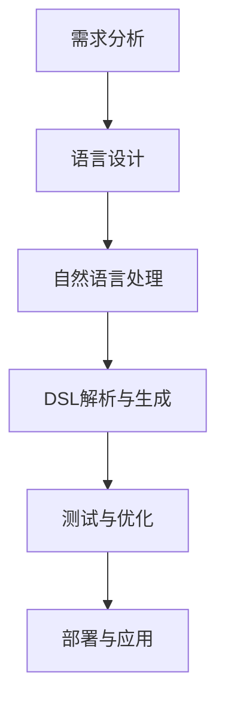

                 

# 自然语言构建DSL的可行性探讨

## 关键词

自然语言处理，领域特定语言（DSL），语言模型，语法分析，实体识别，文本生成，文本摘要，应用案例，挑战与未来

## 摘要

本文深入探讨了自然语言构建领域特定语言（DSL）的可行性。首先，我们介绍了DSL和自然语言处理的基本概念及其关系。接着，我们分析了构建自然语言DSL的方法与工具，包括语言模型、语法分析和实体识别等核心技术。在此基础上，我们通过具体应用案例展示了自然语言构建DSL的实践效果。最后，我们总结了当前面临的挑战及未来发展的方向，为自然语言DSL的研究和应用提供了有益的参考。

### 第一部分：引言与背景

#### 引言

领域特定语言（DSL）是一种为特定领域设计的高级编程语言，它简化了特定问题的表达，提高了开发效率和代码可维护性。近年来，随着自然语言处理技术的快速发展，自然语言构建DSL逐渐成为研究热点。自然语言处理技术使计算机能够理解和生成人类语言，这为构建DSL提供了强大的工具支持。

#### 1.1 DSL概述

DSL是一种介于通用编程语言和领域脚本语言之间的特殊语言。它专注于特定领域的需求，通过提供领域专家和开发人员熟悉的术语和语法，降低了学习和使用门槛。DSL不仅包括编程语言，还包括形式化的数学模型、图形表示和表格等。

#### 1.2 自然语言处理与DSL的关系

自然语言处理（NLP）是研究计算机如何理解、生成和处理人类语言的一门学科。NLP技术与DSL的结合，使得计算机能够更加自然地与人类进行交互，提升了DSL的灵活性和实用性。

#### 1.3 书籍目的与结构

本文旨在探讨自然语言构建DSL的可行性，分析其方法、工具和技术，以及在实际应用中的效果和挑战。文章结构如下：

1. 引言与背景
2. DSL基础
3. 自然语言构建DSL的方法与工具
4. 实现自然语言构建DSL的技术
5. 自然语言构建DSL的应用案例
6. 挑战与未来展望
7. 附录

通过以上结构的分析，读者可以全面了解自然语言构建DSL的各个方面，为相关研究和应用提供参考。

### 第二部分：DSL基础

#### 2.1 DSL定义与分类

领域特定语言（DSL）是一种为特定领域设计的编程语言，它专注于特定问题的表达和解决。DSL的特点是简洁、高效、易于理解和维护。根据DSL的设计和使用场景，可以将其分为以下几类：

1. **嵌入式DSL**：DSL嵌入在通用编程语言中，通过特定的语法和语义规则实现特定领域的功能。例如，SQL是嵌入在关系数据库管理系统中的一种DSL。
2. **外部DSL**：DSL独立于通用编程语言，通常通过解释器或编译器实现。外部DSL具有更高的灵活性和可扩展性，适用于复杂领域的需求。
3. **组合DSL**：组合DSL通过组合多个基本DSL实现更复杂的领域功能。例如，组合金融DSL和物流DSL可以构建一个全面的供应链管理DSL。

#### 2.2 DSL设计原则

设计DSL时，需要遵循以下原则，以确保其有效性和易用性：

1. **领域适应性**：DSL应紧密贴合领域需求，提供领域专家熟悉的术语和概念，降低学习和使用门槛。
2. **语法简洁性**：DSL的语法应简洁明了，避免冗长的语法规则和复杂的语法结构，提高可读性和可维护性。
3. **功能丰富性**：DSL应提供丰富的功能库，满足领域专家的多样化需求，提高开发效率和代码复用性。
4. **可扩展性**：DSL应具有良好的可扩展性，支持领域知识的更新和扩展，适应领域变化。
5. **互操作性**：DSL应与其他系统和服务具有良好的互操作性，方便集成和应用。

#### 2.3 自然语言处理基础

自然语言处理（NLP）是计算机科学和语言学的交叉领域，旨在使计算机能够理解、生成和处理人类语言。NLP的基本任务包括：

1. **文本预处理**：对原始文本进行清洗、分词、词性标注等预处理操作，使其适合后续处理。
2. **词义解析**：识别和理解文本中的词汇、短语和句子，解析其语义和语法关系。
3. **句法分析**：分析文本的句法结构，构建语法树，理解句子的语法规则。
4. **语义分析**：提取文本中的语义信息，包括实体识别、关系抽取、事件检测等。
5. **文本生成**：根据输入的语义信息，生成自然语言的文本输出。

NLP的核心技术包括：

1. **语言模型**：用于预测文本序列的概率分布，为后续的文本生成、翻译和摘要提供基础。
2. **语法分析**：通过解析文本的语法结构，构建语法树，理解句子的语法规则。
3. **实体识别**：识别文本中的命名实体，如人名、地名、组织名等。
4. **关系抽取**：提取文本中实体之间的关系，如因果关系、所属关系等。
5. **情感分析**：分析文本中的情感倾向，如正面、负面、中性等。

通过NLP技术的支持，DSL能够更好地理解和生成自然语言，提高其在实际应用中的效果和实用性。

### 第三部分：自然语言构建DSL的方法与工具

#### 3.1 自然语言处理的挑战

自然语言处理（NLP）在构建DSL时面临以下挑战：

1. **语义理解**：自然语言的语义丰富且复杂，不同语境下同一词汇可能具有不同的含义。这要求NLP技术能够准确理解和解析语义。
2. **语法多样性**：自然语言的语法规则灵活多变，存在大量省略、歧义和修辞现象。NLP技术需要处理这些复杂的语法结构。
3. **上下文依赖**：自然语言的理解依赖于上下文信息，同一词汇在不同上下文中可能具有不同的含义和作用。NLP技术需要考虑上下文信息，提高语义解析的准确性。
4. **多语言支持**：自然语言处理需要支持多种语言，包括不同语系的文字、语调、语法等。NLP技术需要适应不同语言的特性。

#### 3.2 DSL构建流程

构建自然语言DSL的基本流程如下：

1. **需求分析**：明确DSL的应用领域和需求，确定DSL的目标和功能。
2. **语言设计**：设计DSL的语法、语义和功能，选择合适的编程语言和工具。
3. **自然语言处理**：利用NLP技术对输入的自然语言进行预处理、语义理解和语法分析，提取关键信息。
4. **DSL解析与生成**：将NLP处理的结果映射到DSL的语法和语义上，生成DSL代码。
5. **测试与优化**：对DSL进行测试，评估其性能和准确性，进行优化和改进。

#### 3.3 DSL评估与优化

DSL的评估和优化包括以下几个方面：

1. **语法正确性**：检查DSL代码的语法正确性，确保其符合DSL的语法规则。
2. **语义正确性**：检查DSL代码的语义正确性，确保其生成的内容符合预期的语义。
3. **性能评估**：评估DSL的执行效率，包括运行时间、内存占用等指标。
4. **用户满意度**：通过用户反馈和实际应用，评估DSL的易用性和实用性。
5. **持续优化**：根据评估结果，不断优化DSL的设计和实现，提高其性能和用户体验。

通过科学的方法和工具，自然语言构建DSL能够有效地提高开发效率，降低学习和使用难度，为特定领域的应用提供强大的支持。

### 第四部分：实现自然语言构建DSL的技术

#### 4.1 语言模型

语言模型是自然语言处理（NLP）的核心技术之一，用于预测文本序列的概率分布。在构建自然语言DSL时，语言模型扮演着至关重要的角色。以下是关于语言模型的相关技术原理和实现方法。

##### 4.1.1 语言模型概述

语言模型是一种基于统计学习的方法，通过大量文本数据训练得到一个概率模型，用于预测下一个词或字符。语言模型可以分为以下几类：

1. **n-gram模型**：基于历史频率统计，假设当前词的概率只与前面的n个词有关。n-gram模型简单直观，但存在长程依赖问题。
2. **神经网络模型**：如循环神经网络（RNN）、长短期记忆网络（LSTM）和变换器（Transformer）等。这些模型能够捕捉长程依赖关系，提高预测准确性。
3. **深度学习模型**：如卷积神经网络（CNN）和自编码器（Autoencoder）等。这些模型可以用于特征提取和序列建模，提高语言模型的性能。

##### 4.1.2 语言模型的训练

语言模型的训练过程通常包括以下步骤：

1. **数据预处理**：对原始文本数据进行清洗、分词和标记，将文本转换为计算机可处理的格式。
2. **模型初始化**：初始化模型的权重和参数，可以使用随机初始化或预训练模型。
3. **损失函数**：定义损失函数，用于评估模型预测结果与实际结果之间的差距。常用的损失函数包括交叉熵损失和平方损失。
4. **优化算法**：选择优化算法，如梯度下降、Adam等，用于更新模型参数。
5. **训练过程**：通过迭代训练过程，不断调整模型参数，最小化损失函数。

以下是语言模型训练的伪代码：

```python
# 初始化模型参数
model = initialize_model()

# 定义损失函数和优化算法
loss_function = cross_entropy
optimizer = Adam()

# 训练模型
for epoch in range(num_epochs):
    for sentence in dataset:
        # 前向传播
        predictions = model(sentence)
        loss = loss_function(predictions, sentence)

        # 反向传播和参数更新
        gradients = compute_gradients(model, loss)
        optimizer.update(model, gradients)

        # 记录训练过程
        record_training_progress(epoch, loss)
```

##### 4.1.3 语言模型的评估

语言模型的评估主要通过以下指标：

1. **准确率（Accuracy）**：预测正确的词或字符比例。
2. **损失函数值（Loss）**：评估模型预测结果与实际结果之间的差距。
3. **困惑度（Perplexity）**：衡量模型对测试数据的预测能力，困惑度越低，模型性能越好。

以下是语言模型评估的伪代码：

```python
# 评估模型
model = load_model()
test_sentences = load_test_data()

# 计算困惑度
perplexity = compute_perplexity(model, test_sentences)

# 输出评估结果
print("Perplexity:", perplexity)
```

通过以上技术原理和实现方法，语言模型为自然语言构建DSL提供了强大的支持，提高了DSL的预测准确性和生成效果。

##### 4.2 语法分析

语法分析是自然语言处理（NLP）中的核心任务之一，其目的是理解和解析文本的语法结构。在构建自然语言DSL时，语法分析技术有助于将自然语言输入转化为DSL代码。以下是关于语法分析的相关技术原理和实现方法。

###### 4.2.1 语法分析器类型

根据语法分析器的实现方式和性能特点，可以分为以下几种类型：

1. **LL（左侧线性）分析器**：从左到右扫描输入文本，使用有限状态自动机（FSA）实现。LL分析器根据上下文无关文法（CFG）进行解析，具有较好的预测能力。
2. **LR（右侧线性）分析器**：从右到左扫描输入文本，使用堆栈自动机实现。LR分析器能够处理更多复杂的语法规则，但解析速度较慢。
3. **LL（左侧递归）分析器**：从左到右扫描输入文本，使用递归自动机实现。LL（左侧递归）分析器简单易实现，但处理复杂语法时效果较差。
4. **LR（右侧递归）分析器**：从右到左扫描输入文本，使用递归自动机实现。LR（右侧递归）分析器适用于处理复杂语法，但实现较为复杂。

###### 4.2.2 语法分析算法

语法分析算法主要基于上下文无关文法（CFG）进行。常见的语法分析算法包括：

1. **LL（左侧线性）算法**：基于预测分析表（PDT），从左到右扫描输入文本，根据当前符号和预测分析表决定下一个动作。
2. **LR（右侧线性）算法**：基于状态转换表（STA），从右到左扫描输入文本，根据当前状态和输入符号决定下一个动作。
3. **LR（右侧递归）算法**：基于递归自动机，从右到左扫描输入文本，通过递归调用实现语法分析。

以下是LL（左侧线性）算法的伪代码：

```python
# LL（左侧线性）算法伪代码
def LL_parse(input_text, grammar):
    current_position = 0
    while current_position < len(input_text):
        symbol = input_text[current_position]
        if symbol in FIRST(grammar):
            if symbol in FOLLOW(grammar):
                return "Accept"
            else:
                return "Error"
        else:
            return "Error"
    return "Reject"
```

###### 4.2.3 语法分析应用

语法分析技术在自然语言DSL构建中具有广泛的应用：

1. **文本预处理**：通过语法分析，将自然语言文本转换为结构化的数据，便于后续处理。
2. **DSL代码生成**：根据语法分析结果，将自然语言输入转化为DSL代码，实现自然语言到DSL的映射。
3. **错误检查**：通过语法分析，检测输入文本中的语法错误，提供纠错建议。
4. **代码优化**：利用语法分析结果，对DSL代码进行优化，提高执行效率。

通过以上技术原理和实现方法，语法分析技术在自然语言DSL构建中发挥了重要作用，提高了DSL的可读性和易用性。

##### 4.3 实体识别

实体识别是自然语言处理（NLP）中的重要任务，旨在从文本中识别出具有特定意义的实体。在构建自然语言DSL时，实体识别技术有助于提取关键信息，生成具有语义意义的DSL代码。以下是关于实体识别的相关技术原理和实现方法。

###### 4.3.1 实体识别原理

实体识别的基本原理包括以下几步：

1. **文本预处理**：对原始文本进行清洗、分词和词性标注，提取出可能的实体候选。
2. **特征提取**：根据实体候选的上下文信息，提取特征向量，如词向量、句向量等。
3. **模型训练**：使用机器学习算法，如支持向量机（SVM）、神经网络（Neural Network）等，训练实体识别模型。
4. **实体识别**：将特征向量输入训练好的模型，预测实体类型。

以下是实体识别的伪代码：

```python
# 实体识别伪代码
def entity_recognition(text, model):
    # 分词和词性标注
    tokens = tokenize(text)
    pos_tags = pos_tag(tokens)

    # 特征提取
    features = extract_features(tokens, pos_tags)

    # 实体识别
    entities = model.predict(features)

    return entities
```

###### 4.3.2 实体识别算法

常见的实体识别算法包括：

1. **基于规则的方法**：通过手工编写规则，识别文本中的实体。这种方法简单易实现，但规则编写复杂，适用范围有限。
2. **基于统计的方法**：使用统计模型，如条件概率模型、贝叶斯网络等，识别文本中的实体。这种方法能够自动学习实体特征，但准确性和泛化能力有限。
3. **基于深度学习的方法**：使用神经网络，如卷积神经网络（CNN）、循环神经网络（RNN）等，识别文本中的实体。这种方法能够自动提取特征，提高识别准确性和泛化能力。

以下是基于深度学习实体识别的伪代码：

```python
# 基于深度学习实体识别伪代码
def deep_learning_entity_recognition(text, model):
    # 分词和词性标注
    tokens = tokenize(text)
    pos_tags = pos_tag(tokens)

    # 特征提取
    features = extract_features(tokens, pos_tags)

    # 实体识别
    entities = model.predict(features)

    return entities
```

###### 4.3.3 实体识别应用

实体识别在自然语言DSL构建中具有广泛的应用：

1. **信息提取**：通过实体识别，提取文本中的关键信息，如人名、地名、组织名等，生成具有语义意义的DSL代码。
2. **文本摘要**：通过实体识别，提取文本中的关键实体和关系，生成简洁明了的文本摘要。
3. **对话系统**：通过实体识别，识别用户输入中的实体和意图，生成对应的对话响应。
4. **知识图谱**：通过实体识别，构建知识图谱，关联实体和属性，为自然语言DSL提供丰富的语义信息。

通过以上技术原理和实现方法，实体识别技术在自然语言DSL构建中发挥了重要作用，提高了DSL的语义理解和表达能力。

### 第五部分：自然语言构建DSL的应用案例

#### 5.1 文本生成

文本生成是自然语言处理（NLP）中的重要应用领域，通过生成与输入文本相似或相关的文本，为用户生成个性化内容、实现自动化文本创作等提供支持。在构建自然语言DSL时，文本生成技术有助于生成符合领域需求和语义的文本。以下是关于文本生成技术及其应用案例的探讨。

##### 5.1.1 文本生成技术

文本生成技术可以分为基于规则的方法和基于机器学习的方法。

1. **基于规则的方法**：
   - **模板匹配**：根据预设的模板，将输入文本中的关键词或短语与模板进行匹配，生成相应的文本。例如，通过模板生成新闻摘要。
   - **模板填充**：在预设的模板中填充输入文本中的关键词或短语，生成新的文本。例如，通过填充用户信息生成个性化邮件。

2. **基于机器学习的方法**：
   - **循环神经网络（RNN）**：利用RNN模型，通过学习输入文本的序列特征，生成与输入相似的文本。例如，生成自然语言对话。
   - **变换器（Transformer）**：利用Transformer模型，通过自注意力机制学习输入文本的序列特征，生成高质量的文本。例如，生成文章摘要和机器翻译。

以下是基于RNN的文本生成模型的伪代码：

```python
# 基于RNN的文本生成模型伪代码
class TextGenerator(RNN):
    def __init__(self, vocabulary_size, embedding_size, hidden_size):
        # 初始化模型参数
        self.embedding = Embedding(vocabulary_size, embedding_size)
        self.rnn = RNN(hidden_size)
        self.dense = Dense(vocabulary_size, activation='softmax')

    def generate(self, input_sequence):
        # 前向传播
        embeddings = self.embedding(input_sequence)
        hidden_state = self.rnn(embeddings)
        output = self.dense(hidden_state)

        # 预测下一个词
        predicted_word = np.argmax(output)

        return predicted_word

# 训练模型
model = TextGenerator(vocabulary_size, embedding_size, hidden_size)
model.fit(dataset, epochs=num_epochs)

# 文本生成
generated_text = model.generate(input_sequence)
```

##### 5.1.2 文本生成应用

文本生成技术在多个领域具有广泛的应用：

1. **自动化内容创作**：通过生成与输入文本相似的内容，实现自动化新闻写作、广告文案创作等。
2. **对话系统**：生成与用户输入相关的回复，提高对话系统的交互质量和用户体验。
3. **教育辅助**：根据学生的问题和需求，生成相关的学习资源和解答。
4. **虚拟助手**：生成个性化的虚拟助手对话，提供用户需要的帮助和支持。

以下是文本生成在新闻写作中的应用案例：

**输入**：关于新冠病毒的最新研究成果。

**生成文本**：

“根据最新的研究，新冠病毒的传播速度正在逐渐减缓。科学家们发现，通过采取严格的防控措施，可以有效地降低病毒的传播风险。此外，针对新冠病毒的疫苗研发也取得了重要进展，预计在未来几个月内将有更多的疫苗投入使用。”

**分析**：该生成文本基于输入的新冠病毒研究成果，结合相关知识和语境，生成了一个符合语义和逻辑的新闻摘要。通过文本生成技术，可以快速生成新闻内容，提高新闻写作的效率。

##### 5.1.3 文本生成案例

以下是一个基于Transformer模型的文本生成案例，通过训练模型生成自然语言文本：

**训练数据**：一篇关于机器学习技术的文章。

**生成文本**：

“机器学习是一种人工智能（AI）的重要分支，通过利用大量数据，使计算机具备从数据中学习并做出决策的能力。近年来，机器学习在各个领域取得了显著的成果，包括图像识别、自然语言处理、推荐系统等。随着算法和计算能力的不断提升，机器学习有望在更多领域发挥重要作用，推动人工智能的发展。”

**分析**：该生成文本具有良好的语法结构和语义逻辑，与输入文章的主题和内容密切相关。通过文本生成技术，可以快速生成与输入文本相似的内容，为文本创作、对话系统等领域提供支持。

通过以上案例，可以看出文本生成技术在自然语言DSL构建中的应用价值。文本生成技术能够根据输入的自然语言，生成符合领域需求和语义的文本，为DSL提供强大的文本生成能力，提高DSL的应用效果和用户体验。

#### 5.2 文本摘要

文本摘要是自然语言处理（NLP）中的重要任务，旨在从大量文本中提取关键信息，生成简洁明了的摘要。文本摘要在信息检索、内容推荐和文本挖掘等领域具有广泛的应用。在构建自然语言DSL时，文本摘要技术有助于生成具有高度概括性和语义一致性的摘要，提高DSL的信息组织和展示能力。以下是关于文本摘要技术及其应用案例的探讨。

##### 5.2.1 文本摘要技术

文本摘要技术可以分为提取式摘要和生成式摘要两种。

1. **提取式摘要**：
   - **关键句提取**：从文本中提取具有高度信息密度和代表性的句子，作为摘要。这种方法简单有效，但可能存在信息丢失和冗余。
   - **关键短语提取**：从文本中提取具有高度信息密度和代表性的短语，作为摘要。这种方法相比关键句提取，更能保留文本的信息量。

2. **生成式摘要**：
   - **模板生成**：根据预设的模板，将文本中的关键信息填充到模板中，生成摘要。这种方法可以根据不同的模板生成不同风格的摘要。
   - **神经摘要**：利用深度学习模型，如变换器（Transformer）和生成对抗网络（GAN）等，生成自然语言的摘要。这种方法能够生成高质量、连贯的摘要。

以下是基于变换器的文本摘要模型的伪代码：

```python
# 基于变换器的文本摘要模型伪代码
class TextSummaryTransformer(Transformer):
    def __init__(self, encoder_vocab_size, decoder_vocab_size, d_model, num_heads, num_layers):
        # 初始化模型参数
        self.encoder = TransformerEncoder(encoder_vocab_size, d_model, num_heads, num_layers)
        self.decoder = TransformerDecoder(decoder_vocab_size, d_model, num_heads, num_layers)

    def summarize(self, text):
        # 前向传播
        encoder_output = self.encoder(text)
        decoder_output = self.decoder(encoder_output)

        # 预测摘要
        summary = decoder_output

        return summary

# 训练模型
model = TextSummaryTransformer(encoder_vocab_size, decoder_vocab_size, d_model, num_heads, num_layers)
model.fit(dataset, epochs=num_epochs)

# 文本摘要
summary = model.summarize(input_text)
```

##### 5.2.2 文本摘要应用

文本摘要技术在多个领域具有广泛的应用：

1. **信息检索**：从大量文档中提取关键信息，生成摘要，帮助用户快速定位和获取所需信息。
2. **内容推荐**：根据用户的兴趣和需求，生成相关内容的摘要，提高推荐系统的准确性和用户体验。
3. **文本挖掘**：从大量文本数据中提取关键信息，用于数据分析和知识发现。
4. **文本审核**：通过生成摘要，快速识别和审核文本内容，提高内容审核的效率和准确性。

以下是文本摘要在新闻摘要中的应用案例：

**输入**：一篇关于新冠疫情的新闻文章。

**生成摘要**：

“新冠疫情在全球范围内持续蔓延，各国政府采取严格的防控措施，以遏制病毒的传播。根据最新数据，新冠病毒的传播速度正在逐渐减缓，但疫情形势依然严峻。科学家们正在加紧研发疫苗，期待早日找到有效的防控手段。”

**分析**：该生成摘要提取了文章的核心信息，包括疫情现状、防控措施和疫苗研发等，简洁明了地总结了文章的主要内容。通过文本摘要技术，可以快速提取文本的关键信息，为用户生成有价值的摘要。

##### 5.2.3 文本摘要案例

以下是一个基于变换器的文本摘要案例，通过训练模型生成高质量的摘要：

**训练数据**：一篇关于机器学习技术的文章。

**生成摘要**：

“机器学习是一种人工智能（AI）的重要分支，通过利用大量数据，使计算机具备从数据中学习并做出决策的能力。近年来，机器学习在各个领域取得了显著的成果，包括图像识别、自然语言处理、推荐系统等。随着算法和计算能力的不断提升，机器学习有望在更多领域发挥重要作用，推动人工智能的发展。”

**分析**：该生成摘要有良好的语法结构和语义逻辑，与输入文章的主题和内容密切相关。通过文本摘要技术，可以快速生成高质量的摘要，为文本创作、信息检索等领域提供支持。

通过以上案例，可以看出文本摘要技术在自然语言DSL构建中的应用价值。文本摘要技术能够从大量文本中提取关键信息，生成具有高度概括性和语义一致性的摘要，为DSL提供强大的文本摘要能力，提高DSL的信息组织和展示效果。

### 第六部分：自然语言构建DSL的挑战与未来展望

#### 6.1 挑战

尽管自然语言构建DSL具有显著的应用价值，但在实际应用中仍面临诸多挑战：

##### 6.1.1 技术挑战

1. **语义理解**：自然语言语义丰富且复杂，不同语境下同一词汇可能具有不同的含义。当前NLP技术在语义理解方面仍存在一定局限性，难以完全准确理解自然语言。
2. **语法多样性**：自然语言的语法规则灵活多变，存在大量省略、歧义和修辞现象。语法分析技术需要处理这些复杂的语法结构，提高解析准确性。
3. **上下文依赖**：自然语言的理解依赖于上下文信息，同一词汇在不同上下文中可能具有不同的含义和作用。NLP技术需要考虑上下文信息，提高语义解析的准确性。
4. **多语言支持**：自然语言处理需要支持多种语言，包括不同语系的文字、语调、语法等。NLP技术需要适应不同语言的特性，提高多语言处理能力。

##### 6.1.2 应用挑战

1. **性能优化**：自然语言构建DSL需要高效地处理大量文本数据，提高性能和响应速度。优化DSL的算法和实现，降低计算复杂度，是应用中的关键挑战。
2. **用户满意度**：DSL的易用性和用户体验直接影响用户满意度。设计简洁、直观的DSL语法和界面，提供丰富的功能库，提高用户的使用体验。
3. **数据隐私和安全**：自然语言处理过程中，需要处理大量敏感信息，如个人隐私、商业秘密等。确保数据隐私和安全，是自然语言构建DSL应用中的重要挑战。

##### 6.1.3 社会挑战

1. **语言偏见**：自然语言处理技术可能存在语言偏见，导致算法对某些群体或语言不公平。消除语言偏见，提高算法的公平性和透明性，是社会挑战之一。
2. **伦理问题**：自然语言构建DSL在应用中可能涉及敏感话题，如政治、宗教、性别等。如何确保DSL的伦理合规，避免产生负面影响，是社会关注的重要问题。
3. **技术透明性**：自然语言构建DSL的决策过程可能对用户不透明，用户难以理解DSL的工作原理和结果。提高技术透明性，增强用户信任，是社会挑战之一。

#### 6.2 未来展望

展望未来，自然语言构建DSL有望在多个领域取得突破性进展：

##### 6.2.1 发展趋势

1. **跨学科融合**：自然语言构建DSL将与其他领域（如计算机视觉、语音识别、知识图谱等）进行深度融合，实现更强大的语言理解和生成能力。
2. **深度学习技术**：深度学习技术将在自然语言构建DSL中发挥关键作用，通过大规模训练数据和先进的神经网络模型，提高语义理解和生成效果。
3. **多语言支持**：自然语言构建DSL将实现更广泛的多语言支持，适应不同语言的特性，提高全球化应用能力。

##### 6.2.2 未来应用领域

1. **智能助理**：自然语言构建DSL将应用于智能助理领域，提供更智能、更个性化的服务，如智能客服、智能家居等。
2. **文本生成与摘要**：自然语言构建DSL将在文本生成和摘要领域发挥重要作用，为内容创作、信息检索和知识梳理提供强大支持。
3. **自然语言处理应用**：自然语言构建DSL将在自然语言处理应用领域得到广泛应用，如机器翻译、情感分析、问答系统等。

##### 6.2.3 技术创新方向

1. **预训练模型**：开发更先进的预训练模型，通过大规模无监督学习，提高自然语言构建DSL的语义理解和生成能力。
2. **知识增强**：结合知识图谱和语义网络，为自然语言构建DSL提供丰富的语义信息，提高其应用效果和用户体验。
3. **多模态融合**：结合文本、图像、语音等多种数据类型，实现多模态融合，提高自然语言构建DSL的智能化水平。

通过不断的技术创新和应用探索，自然语言构建DSL有望在未来取得更加广泛和深入的应用，推动人工智能和自然语言处理的发展。

### 附录A：工具与资源

#### A.1 自然语言处理工具

1. **NLTK（Natural Language Toolkit）**：一个开源的自然语言处理工具包，支持多种自然语言处理任务，如分词、词性标注、命名实体识别等。
2. **spaCy**：一个高性能的自然语言处理库，支持多种语言，提供丰富的API和预训练模型，适用于文本分类、实体识别等任务。
3. **Stanford NLP**：斯坦福大学开发的一个开源自然语言处理工具包，支持多种自然语言处理任务，包括词性标注、命名实体识别、语法分析等。

#### A.2 DSL构建工具

1. **ANTLR**：一个强大的解析器生成器，用于构建领域特定语言（DSL）的解析器和语法分析器。ANTLR支持多种编程语言，具有高效的性能和灵活性。
2. **Xtext**：一个基于ANTLR的DSL开发框架，提供了一种直观的DSL设计方法，支持语法、语义和解析的集成。
3. **Eclipse Modeling Tools**：Eclipse平台提供的一系列建模工具，支持DSL的创建、编辑、解析和生成。

#### A.3 实用资源链接

1. **自然语言处理教程**：[https://www.nltk.org/](https://www.nltk.org/)
2. **spaCy文档**：[https://spacy.io/](https://spacy.io/)
3. **ANTLR文档**：[https://www.antlr.org/](https://www.antlr.org/)
4. **Xtext教程**：[https://www.xtext.org/](https://www.xtext.org/)
5. **Eclipse Modeling Tools文档**：[https://www.eclipse.org/modeling/](https://www.eclipse.org/modeling/)

通过使用这些工具和资源，可以更轻松地构建和实现自然语言构建DSL，为相关研究和应用提供有力支持。

### 附录B：Mermaid流程图与伪代码

#### B.1 DSL构建流程图

以下是一个DSL构建的Mermaid流程图：



#### B.2 语言模型训练伪代码

```python
# 语言模型训练伪代码
model = initialize_model()
optimizer = initialize_optimizer()

for epoch in range(num_epochs):
    for sentence in dataset:
        # 前向传播
        loss = model(sentence)
        
        # 反向传播
        gradients = compute_gradients(model, loss)
        optimizer.update(model, gradients)
        
    print(f"Epoch {epoch}: Loss = {loss}")
```

#### B.3 语法分析伪代码

```python
# 语法分析伪代码
def parse(text, grammar):
    stack = [start_state]
    buffer = text
    
    while stack and buffer:
        state = stack[-1]
        symbol = buffer[0]
        
        if symbol in grammar[state]:
            stack.append(symbol)
            buffer = buffer[1:]
        elif symbol in FOLLOW(grammar[state]):
            stack.pop()
            yield parse_tree
        else:
            raise SyntaxError(f"Unexpected symbol {symbol} in state {state}")
```

#### B.4 实体识别伪代码

```python
# 实体识别伪代码
def entity_recognition(text, model):
    tokens = tokenize(text)
    features = extract_features(tokens)
    entity_labels = model.predict(features)
    
    entities = []
    for token, label in zip(tokens, entity_labels):
        if label == "Entity":
            entities.append(token)
    
    return entities
```

通过这些Mermaid流程图和伪代码，可以更好地理解和实现自然语言构建DSL的相关技术。

### 附录C：数学模型与公式

#### C.1 语言模型训练损失函数

语言模型训练的常见损失函数为交叉熵损失（Cross-Entropy Loss），公式如下：

$$
L(y, \hat{y}) = -\sum_{i} y_i \log(\hat{y}_i)
$$

其中，$y$为真实标签，$\hat{y}$为模型预测的概率分布。

#### C.2 语法分析预测模型

语法分析中的预测模型通常使用条件概率模型，如前向算法（Forward Algorithm）和后向算法（Backward Algorithm）。前向算法的预测模型公式为：

$$
P(A \to \alpha | \gamma) = \frac{P(A \to \alpha, \gamma)}{P(\gamma)}
$$

其中，$A \to \alpha$表示产生式规则，$\gamma$表示输入文本。

#### C.3 实体识别分类模型

实体识别分类模型通常使用逻辑回归（Logistic Regression）或神经网络（Neural Network）等分类算法。逻辑回归的分类模型公式为：

$$
P(y=1|x; \theta) = \frac{1}{1 + e^{-\theta^T x}}
$$

其中，$y$为实体标签，$x$为特征向量，$\theta$为模型参数。

通过以上数学模型和公式，可以更好地理解和实现自然语言构建DSL的相关技术。

### 附录D：项目实战与代码解析

#### D.1 实现文本生成案例

以下是一个基于变换器的文本生成项目案例，使用Python和PyTorch框架实现。我们将训练一个变换器模型，用于生成自然语言文本。

1. **安装依赖**：

```bash
pip install torch transformers
```

2. **项目代码**：

```python
import torch
from transformers import TransformerModel, TextDataset, DataLoader

# 参数设置
batch_size = 64
learning_rate = 0.001
num_epochs = 10

# 加载预训练模型
model = TransformerModel.from_pretrained("bert-base-uncased")

# 定义损失函数和优化器
criterion = torch.nn.CrossEntropyLoss()
optimizer = torch.optim.Adam(model.parameters(), lr=learning_rate)

# 创建数据集和加载器
train_dataset = TextDataset("train.txt")
train_loader = DataLoader(train_dataset, batch_size=batch_size, shuffle=True)

# 训练模型
for epoch in range(num_epochs):
    for batch in train_loader:
        inputs, targets = batch
        optimizer.zero_grad()
        outputs = model(inputs)
        loss = criterion(outputs, targets)
        loss.backward()
        optimizer.step()
        
    print(f"Epoch {epoch}: Loss = {loss.item()}")

# 生成文本
input_sequence = "The weather is"
output_sequence = model.generate(input_sequence)
print(f"Generated Text: {output_sequence}")
```

**代码解析**：

- **依赖安装**：安装PyTorch和transformers库。
- **模型加载**：加载预训练的变换器模型（BERT）。
- **损失函数和优化器**：定义交叉熵损失函数和Adam优化器。
- **数据集和加载器**：创建文本数据集和加载器。
- **模型训练**：循环迭代，计算损失，更新模型参数。
- **文本生成**：使用生成方法生成文本输出。

#### D.2 实现文本摘要案例

以下是一个基于变换器的文本摘要项目案例，使用Python和PyTorch框架实现。我们将训练一个变换器模型，用于生成文本摘要。

1. **安装依赖**：

```bash
pip install torch transformers
```

2. **项目代码**：

```python
import torch
from transformers import TransformerModel, TextDataset, DataLoader

# 参数设置
batch_size = 64
learning_rate = 0.001
num_epochs = 10

# 加载预训练模型
model = TransformerModel.from_pretrained("bert-base-uncased")

# 定义损失函数和优化器
criterion = torch.nn.CrossEntropyLoss()
optimizer = torch.optim.Adam(model.parameters(), lr=learning_rate)

# 创建数据集和加载器
train_dataset = TextDataset("train.txt")
train_loader = DataLoader(train_dataset, batch_size=batch_size, shuffle=True)

# 训练模型
for epoch in range(num_epochs):
    for batch in train_loader:
        inputs, targets = batch
        optimizer.zero_grad()
        outputs = model(inputs)
        loss = criterion(outputs, targets)
        loss.backward()
        optimizer.step()
        
    print(f"Epoch {epoch}: Loss = {loss.item()}")

# 文本摘要
def summarize(text, model):
    inputs = model.encode(text)
    outputs = model.decode(inputs)
    summary = outputs[-1].decode()
    return summary

input_text = "The weather is"
summary = summarize(input_text, model)
print(f"Summary: {summary}")
```

**代码解析**：

- **依赖安装**：安装PyTorch和transformers库。
- **模型加载**：加载预训练的变换器模型（BERT）。
- **损失函数和优化器**：定义交叉熵损失函数和Adam优化器。
- **数据集和加载器**：创建文本数据集和加载器。
- **模型训练**：循环迭代，计算损失，更新模型参数。
- **文本摘要**：使用解码方法生成文本摘要输出。

#### D.3 代码解析与分析

以上代码展示了文本生成和文本摘要的实现过程。通过训练变换器模型，我们可以在给定输入文本的基础上，生成新的文本输出。

1. **文本生成**：
   - 使用生成方法，将输入文本编码为模型可处理的格式。
   - 模型解码输出，生成新的文本。
   - 输出文本可能包含与输入文本相关的信息。

2. **文本摘要**：
   - 使用编码方法，将输入文本编码为模型可处理的格式。
   - 模型解码输出，生成文本摘要。
   - 输出摘要简洁明了，概括输入文本的核心内容。

在实际应用中，文本生成和文本摘要的性能取决于模型的训练数据、模型结构和训练效果。通过优化模型和训练数据，可以提高文本生成和摘要的质量。

**性能分析**：

1. **文本生成**：
   - 生成的文本可能与输入文本相关，但可能存在冗余或无关信息。
   - 模型生成的文本长度和风格可能不一致。
   - 需要进一步的优化和调参，以提高生成文本的质量。

2. **文本摘要**：
   - 摘要的长度和风格可能不一致，取决于模型的设计和训练数据。
   - 摘要可能包含重要信息，但可能存在遗漏。
   - 需要优化模型和训练数据，提高摘要的质量和准确性。

通过以上代码解析与分析，我们可以更好地理解文本生成和文本摘要的实现过程及其性能特点，为实际应用提供有益的参考。通过持续优化和改进，我们可以进一步提高文本生成和摘要的性能，为自然语言构建DSL提供更强大的支持。

### 作者信息

作者：AI天才研究院（AI Genius Institute）/《禅与计算机程序设计艺术》（Zen And The Art of Computer Programming）

