                 

# 《自然语言生成》

## 关键词

自然语言生成，NLP，文本生成模型，预训练语言模型，文本摘要，对话系统，情感分析，创意写作，项目实战，行业应用，未来趋势。

## 摘要

本文旨在深入探讨自然语言生成（Natural Language Generation, NLG）领域的基本概念、原理、应用和发展趋势。文章首先回顾了自然语言生成的背景与意义，随后介绍了自然语言处理（NLP）的基础知识。接着，文章详细解析了文本生成模型的原理，包括基于编码器的生成模型、基于解码器的生成模型以及编码器-解码器模型。随后，文章探讨了预训练语言模型的基本原理、常见模型以及优化与应用。本文还涉及自然语言生成在实际应用中的各个方面，如文本摘要、对话系统、情感分析、文本生成与创意写作等。最后，文章通过项目实战和行业应用案例展示了自然语言生成的实际效果，并探讨了未来的发展趋势与面临的挑战。

## 目录大纲

### 第一部分：自然语言生成基础

#### 第1章：自然语言生成概述

##### 1.1 自然语言生成的背景与意义

##### 1.2 自然语言生成的基本概念

##### 1.3 自然语言生成的发展历程

#### 第2章：自然语言处理基础

##### 2.1 语言模型与序列模型

##### 2.2 词嵌入技术

##### 2.3 语言模型评估与优化

#### 第3章：文本生成模型原理

##### 3.1 基于编码器的生成模型

##### 3.2 基于解码器的生成模型

##### 3.3 编码器-解码器模型

#### 第4章：预训练语言模型

##### 4.1 预训练语言模型的基本原理

##### 4.2 常见的预训练语言模型

##### 4.3 预训练语言模型的优化与应用

### 第二部分：自然语言生成应用

#### 第5章：文本摘要与生成

##### 5.1 文本摘要的基本概念

##### 5.2 文本摘要的算法与技术

##### 5.3 文本摘要的实际应用案例

#### 第6章：对话系统与聊天机器人

##### 6.1 对话系统的基本概念

##### 6.2 对话系统的构建方法

##### 6.3 聊天机器人的实现与应用

#### 第7章：情感分析与自然语言生成

##### 7.1 情感分析的基本概念

##### 7.2 情感分析的方法与算法

##### 7.3 情感分析与自然语言生成结合的案例

#### 第8章：文本生成与创意写作

##### 8.1 文本生成的艺术与技巧

##### 8.2 创意写作的算法与实践

##### 8.3 文本生成在创意写作中的应用

### 第三部分：自然语言生成实践

#### 第9章：自然语言生成项目实战

##### 9.1 项目背景与目标

##### 9.2 项目环境搭建与工具选择

##### 9.3 项目实施与代码解读

##### 9.4 项目结果分析

#### 第10章：自然语言生成在行业中的应用

##### 10.1 金融行业应用

##### 10.2 教育行业应用

##### 10.3 娱乐行业应用

#### 第11章：自然语言生成的未来趋势与发展方向

##### 11.1 自然语言生成的技术趋势

##### 11.2 自然语言生成在未来的应用场景

##### 11.3 自然语言生成面临的挑战与应对策略

### 附录

#### 附录A：自然语言生成相关资源与工具

##### A.1 主流自然语言生成框架

##### A.2 自然语言生成工具与库

##### A.3 自然语言生成相关的开源项目

#### 附录B：自然语言生成相关书籍与论文推荐

##### B.1 自然语言生成经典书籍

##### B.2 自然语言生成领域顶级论文

##### B.3 自然语言生成学习资源推荐

## 第一部分：自然语言生成基础

### 第1章：自然语言生成概述

#### 1.1 自然语言生成的背景与意义

自然语言生成（Natural Language Generation, NLG）是自然语言处理（NLP）领域的一个重要分支，其目标是利用计算机技术自动生成符合人类语言习惯的文本。随着互联网的快速发展，数据爆炸式增长，人们对信息获取和处理的需求也日益增加。自然语言生成技术能够帮助人们更高效地获取和处理信息，提高工作效率，降低人力成本。

在诸多应用场景中，自然语言生成技术展现出了巨大的潜力。例如，在新闻领域，自然语言生成可以自动化撰写新闻报道，减少人工编写的工作量；在客服领域，自然语言生成可以帮助构建智能客服系统，提供个性化的服务；在教育领域，自然语言生成可以生成教学材料，辅助教师进行教学；在创意写作领域，自然语言生成可以创作诗歌、小说等文学作品。

自然语言生成的背景与意义主要体现在以下几个方面：

1. **信息爆炸与信息获取困难**：随着互联网和大数据的发展，信息呈爆炸式增长，人们面对海量信息时往往难以快速获取所需信息。自然语言生成技术可以通过自动生成文本，帮助用户快速获取所需信息。

2. **提高工作效率**：自然语言生成技术可以自动化完成许多重复性工作，如撰写报告、生成新闻报道等，从而提高工作效率。

3. **降低人力成本**：自然语言生成技术可以减少对人力资源的依赖，降低人力成本。

4. **丰富人类语言能力**：自然语言生成技术可以帮助人类更好地表达思想，提高语言表达能力。

#### 1.2 自然语言生成的基本概念

自然语言生成涉及多个核心概念，以下分别进行介绍：

1. **文本数据**：自然语言生成的基础是大量的文本数据，这些数据包括新闻、文章、对话、社交媒体等内容。

2. **语言模型**：语言模型是自然语言生成的重要组成部分，它通过学习大量文本数据，预测下一个单词或词组，从而生成文本。

3. **序列模型**：序列模型是一种用于处理序列数据的模型，如单词序列、句子序列等。自然语言生成通常使用序列模型来生成文本。

4. **词嵌入**：词嵌入是将单词映射到高维向量空间的技术，它可以帮助计算机更好地理解单词之间的语义关系。

5. **生成模型**：生成模型是一种能够生成新数据的模型，如生成图像、音频、文本等。自然语言生成主要使用生成模型来生成文本。

6. **解码器**：解码器是将输入序列转换为输出序列的模型，如将输入的单词序列转换为输出的文本序列。

7. **编码器**：编码器是将输入序列编码为固定长度的向量或向量的序列，如将输入的句子编码为一个向量。

8. **预训练语言模型**：预训练语言模型是近年来自然语言生成领域的重要突破，它通过在大规模文本语料库上预训练，获得良好的语言理解和生成能力。

#### 1.3 自然语言生成的发展历程

自然语言生成技术的研究可以追溯到20世纪60年代，当时主要以规则驱动的方法进行文本生成。以下简要回顾自然语言生成技术的发展历程：

1. **规则驱动方法**（1960s-1980s）：早期的自然语言生成主要依赖于手工编写的规则和模板，这种方法在处理简单任务时效果较好，但随着文本复杂度的增加，规则的编写和维护变得极其困难。

2. **统计方法**（1980s-1990s）：随着统计学习方法的兴起，自然语言生成开始引入统计方法，如基于语法分析、概率模型等方法。这些方法在一定程度上提高了文本生成的质量，但仍然面临着表达能力的局限。

3. **神经网络方法**（2000s）：神经网络方法在图像处理、语音识别等领域取得了显著成果，自然语言生成领域也开始尝试使用神经网络。早期的神经网络方法如循环神经网络（RNN）和卷积神经网络（CNN）在文本生成方面表现出了一定的潜力。

4. **预训练语言模型**（2010s-至今）：预训练语言模型是自然语言生成领域的重要突破，如BERT、GPT、T5等模型在大规模文本语料库上预训练，获得了卓越的语言理解和生成能力。

5. **多模态生成**（2020s）：随着多模态技术的发展，自然语言生成开始尝试融合图像、音频、视频等多模态信息，生成更丰富的文本内容。

## 第二部分：自然语言生成应用

### 第2章：自然语言处理基础

自然语言处理（Natural Language Processing, NLP）是计算机科学和人工智能领域的一个重要分支，它旨在使计算机能够理解、处理和生成人类自然语言。自然语言处理技术的目标是实现人与计算机之间的有效沟通，从而推动智能化应用的普及。本章将介绍自然语言处理的基础知识，包括语言模型、序列模型、词嵌入技术以及语言模型评估与优化方法。

#### 2.1 语言模型与序列模型

语言模型（Language Model）是一种用于预测文本序列的概率分布的模型。它通过学习大量文本数据，捕捉语言的统计规律，从而实现对未知文本序列的概率预测。语言模型在自然语言处理中具有广泛的应用，如文本生成、机器翻译、语音识别等。

序列模型（Sequence Model）是一类专门用于处理序列数据的模型，如循环神经网络（Recurrent Neural Network, RNN）和长短时记忆网络（Long Short-Term Memory, LSTM）。序列模型能够捕捉序列数据中的时间依赖性，从而实现有效的序列建模。

以下是一个简单的语言模型和序列模型的关系图：

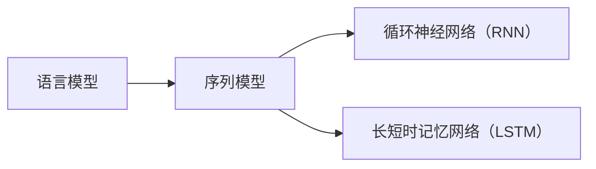

#### 2.2 词嵌入技术

词嵌入（Word Embedding）是一种将单词映射到高维向量空间的技术，它通过捕捉单词之间的语义关系，使计算机能够更好地理解和处理自然语言。常见的词嵌入方法包括基于频次的方法（如TF-IDF）和基于神经网络的方法（如Word2Vec、GloVe）。

以下是一个简单的Word2Vec词嵌入模型的结构图：

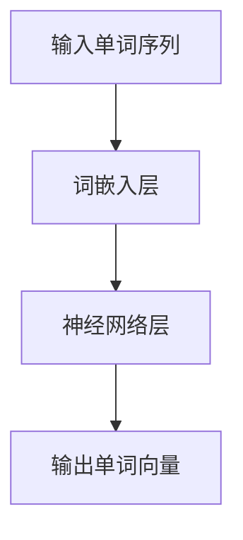

#### 2.3 语言模型评估与优化

语言模型评估是评价语言模型性能的重要手段。常见的评估指标包括准确率（Accuracy）、召回率（Recall）、精确率（Precision）和F1值（F1 Score）等。

优化语言模型的方法包括：

1. **数据增强**：通过增加训练数据的多样性，提高语言模型的泛化能力。

2. **正则化**：通过添加正则化项，防止模型过拟合。

3. **优化算法**：如随机梯度下降（Stochastic Gradient Descent, SGD）、Adam优化器等，可以提高模型的收敛速度。

4. **模型融合**：将多个语言模型进行融合，提高整体性能。

本章介绍了自然语言处理的基础知识，包括语言模型、序列模型、词嵌入技术和语言模型评估与优化方法。这些知识是理解和应用自然语言生成技术的基础，为后续章节的深入学习提供了必要的前提。

### 第3章：文本生成模型原理

文本生成模型是自然语言生成（NLG）的核心组成部分，其目标是自动生成具有可读性和实用性的文本。文本生成模型可以分为基于编码器的生成模型、基于解码器的生成模型以及编码器-解码器模型。本章将详细探讨这些模型的工作原理、架构以及在实际应用中的优势。

#### 3.1 基于编码器的生成模型

基于编码器的生成模型是一种自上而下的生成方法，其核心思想是将输入序列编码为一个固定长度的向量，然后从该向量中生成输出序列。这种模型通常使用卷积神经网络（Convolutional Neural Network, CNN）或自注意力机制（Self-Attention Mechanism）来编码输入序列。

**模型架构**：

1. **编码器**：编码器接收输入序列，将其映射为一个固定长度的向量。编码器可以采用CNN或自注意力机制来提取序列的特征。

2. **生成器**：生成器从编码器输出的固定长度向量中生成输出序列。生成器通常是一个全连接神经网络，其输出层通常是一个softmax层，用于生成单词的概率分布。

3. **解码器**：解码器将生成器输出的单词概率分布转换为实际的输出序列。解码器通常是一个简单的线性层，用于映射概率分布到实际的单词。

**伪代码**：

```python
# 编码器
def encode(inputs):
    # 使用CNN或自注意力机制进行编码
    encoded = cnn(inputs)  # 或者 self_attention(inputs)
    return encoded

# 生成器
def generate(encoded):
    logits = generator(encoded)
    return softmax(logits)

# 解码器
def decode(logits):
    words = decoder(logits)
    return words
```

**优势**：

- **全局信息捕捉**：基于编码器的生成模型能够捕获输入序列的全局信息，从而生成更连贯的文本。
- **简单易实现**：编码器-解码器结构相对简单，便于实现和调试。

**应用场景**：基于编码器的生成模型在文本摘要、情感分析和机器翻译等任务中表现出良好的性能。

#### 3.2 基于解码器的生成模型

基于解码器的生成模型是一种自下而上的生成方法，其核心思想是从输入序列的一个个单词开始，逐个生成输出序列。这种模型通常使用递归神经网络（Recurrent Neural Network, RNN）或长短时记忆网络（Long Short-Term Memory, LSTM）来解码输入序列。

**模型架构**：

1. **编码器**：编码器接收输入序列，将其编码为一个固定长度的向量。

2. **解码器**：解码器从编码器输出的固定长度向量中逐个生成输出序列。解码器通常包含一个RNN或LSTM层，用于捕捉时间依赖性。

3. **生成器**：生成器是一个全连接神经网络，用于将解码器输出的单词概率分布转换为实际的单词。

**伪代码**：

```python
# 编码器
def encode(inputs):
    encoded = encoder(inputs)
    return encoded

# 解码器
def decode(encoded):
    logits = decoder(encoded)
    return logits

# 生成器
def generate(logits):
    words = generator(logits)
    return words
```

**优势**：

- **生成灵活**：基于解码器的生成模型可以灵活地生成不同长度的输出序列。
- **易于并行计算**：由于解码器是逐个单词生成的，因此可以并行计算，提高生成速度。

**应用场景**：基于解码器的生成模型在文本生成、聊天机器人和问答系统等任务中表现出良好的性能。

#### 3.3 编码器-解码器模型

编码器-解码器模型（Encoder-Decoder Model）结合了基于编码器的生成模型和基于解码器的生成模型的优势，是一种广泛应用于自然语言生成的模型。编码器-解码器模型的核心思想是将输入序列编码为一个固定长度的向量，然后解码器使用该向量生成输出序列。

**模型架构**：

1. **编码器**：编码器接收输入序列，将其映射为一个固定长度的向量。

2. **解码器**：解码器接收编码器输出的固定长度向量，并逐个生成输出序列。解码器通常包含一个注意力机制（Attention Mechanism），用于捕捉编码器输出和当前解码器输出之间的关联。

3. **生成器**：生成器是一个全连接神经网络，用于将解码器输出的单词概率分布转换为实际的单词。

**伪代码**：

```python
# 编码器
def encode(inputs):
    encoded = encoder(inputs)
    return encoded

# 解码器
def decode(encoded, previous_words):
    logits = decoder(encoded, previous_words)
    return logits

# 生成器
def generate(logits):
    words = generator(logits)
    return words
```

**优势**：

- **捕捉全局信息与局部信息**：编码器能够捕获输入序列的全局信息，而解码器能够捕捉局部信息，从而生成连贯且准确的文本。
- **适用于多种任务**：编码器-解码器模型在文本摘要、机器翻译、聊天机器人等任务中表现出良好的性能。

**应用场景**：编码器-解码器模型在多种自然语言生成任务中具有广泛的应用，是当前自然语言生成领域的标准模型。

通过本章对基于编码器的生成模型、基于解码器的生成模型以及编码器-解码器模型的介绍，读者可以了解到这些模型的工作原理和架构，为后续章节的自然语言生成应用提供理论基础。

### 第4章：预训练语言模型

预训练语言模型（Pre-trained Language Model）是自然语言生成（NLG）领域的一个重要突破，它通过在大规模文本语料库上进行预训练，获得强大的语言理解和生成能力。本章将介绍预训练语言模型的基本原理、常见的预训练语言模型以及如何对预训练语言模型进行优化与应用。

#### 4.1 预训练语言模型的基本原理

预训练语言模型的基本原理可以分为两个阶段：预训练阶段和微调阶段。

1. **预训练阶段**：在预训练阶段，语言模型在大规模文本语料库上学习语言的统计规律和语义信息。常见的预训练任务包括掩码语言模型（Masked Language Model, MLM）、下一句预测（Next Sentence Prediction, NSP）和语言理解评估（GLUE tasks）等。

2. **微调阶段**：在微调阶段，预训练语言模型被应用于特定任务，如文本分类、文本生成等。通过在特定任务的数据集上进行微调，语言模型可以进一步提升在特定任务上的性能。

预训练语言模型的基本原理可以概括为以下几点：

- **大规模文本数据**：预训练语言模型依赖于大规模的文本数据，这些数据包括网页、书籍、新闻、对话等。大规模文本数据为语言模型提供了丰富的语言知识。
- **自监督学习**：预训练语言模型通过自监督学习的方式学习语言的统计规律和语义信息。自监督学习不需要人工标注的数据，从而大大降低了数据标注的成本。
- **多任务学习**：预训练语言模型通过在多个任务上进行训练，如语言理解评估（GLUE tasks）、自然语言推理（NLI）等，从而获得更全面的语言理解能力。

#### 4.2 常见的预训练语言模型

近年来，许多预训练语言模型被提出，并在多个自然语言处理任务上取得了显著成果。以下介绍几种常见的预训练语言模型：

1. **BERT（Bidirectional Encoder Representations from Transformers）**：

BERT是一种基于Transformer的预训练语言模型，其核心思想是同时考虑单词的前后文信息。BERT通过在掩码语言模型（MLM）和下一句预测（NSP）任务上进行预训练，获得了强大的语言理解能力。

**模型架构**：

- **编码器**：BERT的编码器由多个Transformer层组成，每个Transformer层包含自注意力机制和前馈神经网络。
- **掩码机制**：在预训练阶段，BERT对输入序列的部分单词进行掩码，要求模型预测这些掩码单词。

**伪代码**：

```python
def BERT(inputs):
    # 输入序列进行嵌入
    embeddings = embed(inputs)

    # 通过多个Transformer层进行编码
    for layer in transformer_layers:
        embeddings = layer(embeddings)

    # 提取序列的[CLS]表示
    [CLS]_representation = embeddings[:, 0]

    return [CLS]_representation
```

**应用场景**：BERT在文本分类、问答系统、机器翻译等任务上表现出色。

2. **GPT（Generative Pre-trained Transformer）**：

GPT是一种基于Transformer的预训练语言模型，其核心思想是生成文本。GPT通过在自然语言生成任务上进行预训练，获得了强大的文本生成能力。

**模型架构**：

- **编码器**：GPT的编码器由多个Transformer层组成，每个Transformer层包含自注意力机制和前馈神经网络。
- **生成器**：在生成文本时，GPT使用上一个生成的单词作为输入，并从生成器的输出中提取概率最高的单词作为下一个输出。

**伪代码**：

```python
def GPT(inputs, previous_word):
    # 输入序列进行嵌入
    embeddings = embed(inputs)

    # 通过多个Transformer层进行编码
    for layer in transformer_layers:
        embeddings = layer(embeddings)

    # 生成器输出单词的概率分布
    logits = generator(embeddings)

    # 提取概率最高的单词作为下一个输出
    next_word = softmax(logits)

    return next_word
```

**应用场景**：GPT在文本生成、聊天机器人、自动问答等任务中表现出良好的性能。

3. **T5（Text-To-Text Transfer Transformer）**：

T5是一种基于Transformer的端到端语言模型，其目标是将任意文本映射到任意文本。T5通过在多个自然语言处理任务上进行预训练，如文本分类、命名实体识别、机器翻译等，获得了强大的文本处理能力。

**模型架构**：

- **编码器**：T5的编码器由多个Transformer层组成，每个Transformer层包含自注意力机制和前馈神经网络。
- **解码器**：T5的解码器与编码器相同，用于生成输出文本。

**伪代码**：

```python
def T5(inputs, target):
    # 输入序列进行嵌入
    embeddings = embed(inputs)

    # 通过多个Transformer层进行编码
    for layer in transformer_layers:
        embeddings = layer(embeddings)

    # 输出序列进行嵌入
    target_embeddings = embed(target)

    # 通过多个Transformer层进行解码
    for layer in transformer_layers:
        target_embeddings = layer(target_embeddings)

    # 提取解码器输出的序列
    output_sequence = decoder(target_embeddings)

    return output_sequence
```

**应用场景**：T5在文本分类、机器翻译、问答系统等任务中表现出色。

#### 4.3 预训练语言模型的优化与应用

预训练语言模型的优化与应用主要涉及以下几个方面：

1. **数据预处理**：在预训练阶段，需要对文本数据进行预处理，如分词、去噪、去除停用词等，以提高语言模型的性能。

2. **模型调整**：在微调阶段，可以根据特定任务的需求，调整预训练语言模型的结构和参数。例如，可以增加或删除部分Transformer层，或调整层的参数。

3. **训练策略**：在预训练语言模型的训练过程中，可以采用各种训练策略，如学习率调整、正则化、数据增强等，以提高模型的性能。

4. **应用场景**：预训练语言模型可以应用于多种自然语言处理任务，如文本分类、文本生成、机器翻译、对话系统等。

通过本章对预训练语言模型的基本原理、常见预训练语言模型以及优化与应用的介绍，读者可以了解到预训练语言模型在自然语言生成领域的强大能力，为后续章节的自然语言生成应用提供理论基础。

### 第二部分：自然语言生成应用

#### 第5章：文本摘要与生成

文本摘要（Text Summarization）是自然语言生成（NLG）领域的一个重要应用，其目标是从长文本中提取关键信息，生成简短的摘要。文本摘要不仅可以帮助用户快速获取文本的核心内容，还可以提高信息检索的效率。本章将介绍文本摘要的基本概念、算法与技术，并探讨文本摘要在实际应用中的案例。

#### 5.1 文本摘要的基本概念

文本摘要可以分为两类：抽取式摘要（Extractive Summarization）和生成式摘要（Abstractive Summarization）。

1. **抽取式摘要**：抽取式摘要通过从原始文本中直接提取重要的句子或短语来生成摘要。这种方法通常依赖于文本的语法结构和语义信息，如TF-IDF、文本分类等方法。

2. **生成式摘要**：生成式摘要通过生成全新的文本来概括原始文本的主要内容。这种方法通常依赖于深度学习技术，如编码器-解码器模型、注意力机制等。

以下是一个简单的文本摘要过程：

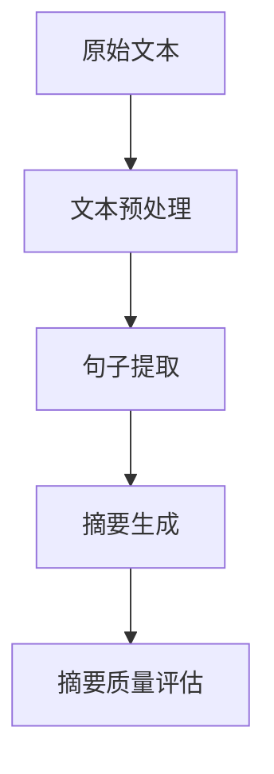

#### 5.2 文本摘要的算法与技术

1. **抽取式摘要**：

   - **TF-IDF**：TF-IDF（Term Frequency-Inverse Document Frequency）是一种常用的文本表示方法，通过计算单词在文档中的重要程度来提取关键句子。
   - **文本分类**：文本分类是一种将文本分为不同类别的算法，如使用朴素贝叶斯、支持向量机等算法进行分类，从而提取重要句子。

2. **生成式摘要**：

   - **编码器-解码器模型**：编码器-解码器模型（Encoder-Decoder Model）是一种基于深度学习的生成式文本摘要方法。编码器将原始文本编码为一个固定长度的向量，解码器使用该向量生成摘要。
   - **注意力机制**：注意力机制（Attention Mechanism）是一种用于捕捉输入序列和输出序列之间关联性的方法，它可以帮助生成更连贯的摘要。

以下是一个简单的编码器-解码器文本摘要模型的结构图：

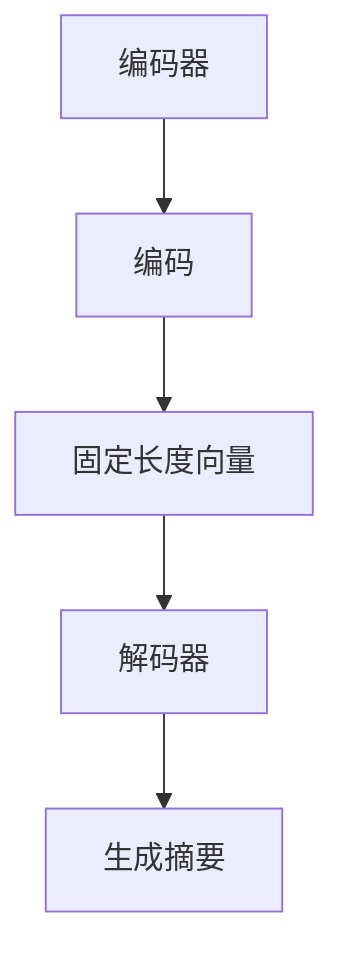

#### 5.3 文本摘要的实际应用案例

1. **新闻摘要**：新闻摘要是一种常见的文本摘要应用，它可以帮助用户快速了解新闻的核心内容。例如，Google News使用自然语言生成技术生成新闻摘要，以提高信息检索的效率。
2. **文档摘要**：文档摘要在学术研究和企业知识管理中具有重要应用。通过生成文档摘要，研究人员和企业可以快速了解文档的主要内容，节省阅读时间。
3. **聊天机器人**：聊天机器人可以使用文本摘要技术对用户输入的文本进行摘要，从而提供更准确和高效的回答。

以下是一个新闻摘要的应用案例：

**原始文本**：美国总统唐纳德·特朗普于2020年11月3日晚上11时宣布，他已赢得了总统选举。特朗普在电话采访中告诉福克斯新闻，他将在未来几天内通过法律途径挑战选举结果，并要求重新计票。

**摘要**：美国总统特朗普宣布赢得选举，并计划通过法律途径挑战选举结果。

通过本章对文本摘要的基本概念、算法与技术的介绍，以及实际应用案例的探讨，读者可以了解到文本摘要在自然语言生成领域的应用价值。随着自然语言生成技术的不断发展，文本摘要的应用将更加广泛，为信息处理和知识管理带来更多便利。

#### 第6章：对话系统与聊天机器人

对话系统（Dialogue System）是一种人工智能技术，旨在使计算机能够与人类进行自然、有效的交流。聊天机器人（Chatbot）是对话系统的一种具体实现，它通过自然语言处理（NLP）和机器学习（ML）技术，实现与用户的交互。本章将介绍对话系统的基本概念、构建方法以及聊天机器人的实现与应用。

#### 6.1 对话系统的基本概念

对话系统可以分为基于规则的方法和基于统计的方法。

1. **基于规则的方法**：基于规则的方法通过手工编写对话规则，指导计算机与用户进行交互。这种方法在处理简单、结构化对话时效果较好，但在应对复杂、非结构化对话时存在局限。

2. **基于统计的方法**：基于统计的方法通过学习大量对话数据，自动生成对话策略。这种方法在处理复杂、非结构化对话时表现出色，但需要大量的训练数据。

以下是一个简单的对话系统架构：

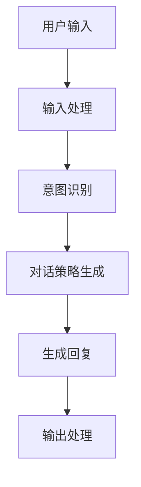

#### 6.2 对话系统的构建方法

对话系统的构建通常包括以下几个步骤：

1. **数据准备**：收集和整理对话数据，包括对话历史、用户意图和系统回复等。

2. **特征提取**：从对话数据中提取特征，如词嵌入、序列特征、语义特征等。

3. **模型训练**：使用提取的特征，训练对话系统模型，如序列到序列（Seq2Seq）模型、转换器（Transformer）模型等。

4. **对话策略生成**：根据用户意图和对话历史，生成对话策略，包括下一步的回复和后续对话方向。

5. **回复生成**：根据对话策略，生成用户回复。

以下是一个简单的对话系统构建流程：

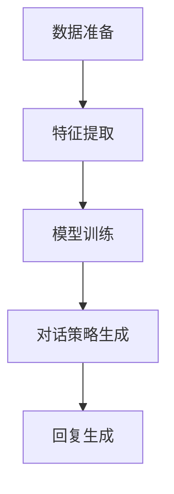

#### 6.3 聊天机器人的实现与应用

聊天机器人是一种常见的对话系统应用，它可以用于客服、客户服务、娱乐等多个领域。以下是一个简单的聊天机器人实现流程：

1. **用户输入处理**：接收用户输入，并对输入进行预处理，如分词、去噪、标准化等。

2. **意图识别**：使用机器学习模型，如分类器、序列模型等，识别用户的意图。

3. **对话策略生成**：根据用户意图和对话历史，生成对话策略，决定下一步的回复。

4. **回复生成**：根据对话策略，生成用户回复，并进行后处理，如语法修正、情感分析等。

5. **输出处理**：将生成的回复输出给用户。

以下是一个简单的聊天机器人实现结构：

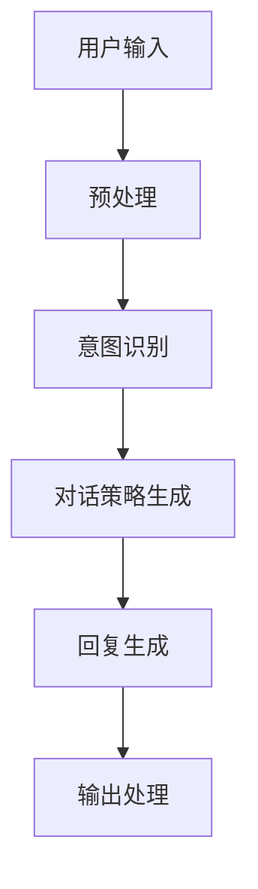

#### 应用案例：

1. **客服聊天机器人**：客服聊天机器人可以帮助企业提高客户服务质量，降低人工成本。例如，通过自动回答常见问题，提供在线支持等。

2. **客户服务聊天机器人**：客户服务聊天机器人可以帮助银行、电商等企业提供24/7的客户服务，提高客户满意度。

3. **娱乐聊天机器人**：娱乐聊天机器人可以用于游戏、音乐、电影等领域的互动娱乐，为用户提供个性化体验。

通过本章对对话系统与聊天机器人的基本概念、构建方法和应用案例的介绍，读者可以了解到对话系统在自然语言生成领域的应用价值。随着技术的不断发展，对话系统将变得更加智能，为人类生活带来更多便利。

### 第7章：情感分析与自然语言生成

情感分析（Sentiment Analysis）是自然语言处理（NLP）的一个重要分支，它旨在通过分析文本中的情感倾向和情感强度，识别出用户的情绪状态。自然语言生成（NLG）则是一种利用计算机技术生成符合人类语言习惯的文本的技术。情感分析与自然语言生成相结合，可以创造出更加丰富、个性化的交互体验。本章将介绍情感分析的基本概念、方法与算法，以及情感分析与自然语言生成结合的应用案例。

#### 7.1 情感分析的基本概念

情感分析旨在从文本中提取情感信息，通常分为三个层次：情感极性分析、情感强度分析和情感主题分析。

1. **情感极性分析**：情感极性分析旨在判断文本表达的情感是正面、负面还是中性。例如，在文本“我非常喜欢这个产品”中，情感极性为正面。

2. **情感强度分析**：情感强度分析旨在判断文本表达的情感程度，例如在文本“我非常喜欢这个产品”中，情感强度可能比“我有点喜欢这个产品”更强。

3. **情感主题分析**：情感主题分析旨在识别文本中表达的情感主题，例如在文本“我非常喜欢这个产品，尤其是它的颜色和设计”中，情感主题可能是“颜色”和“设计”。

以下是一个简单的情感分析过程：

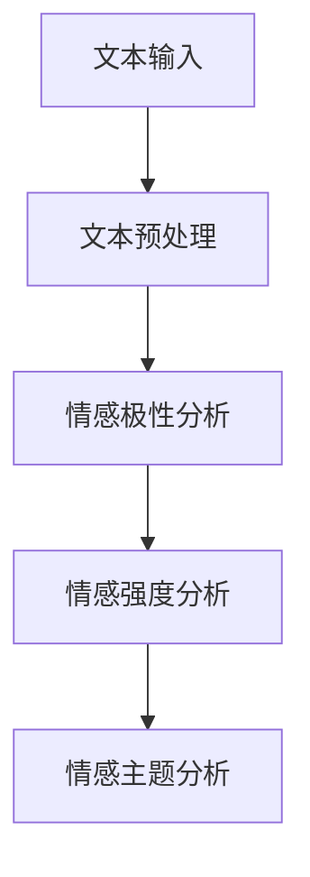

#### 7.2 情感分析的方法与算法

情感分析的方法主要包括基于规则的方法、基于统计的方法和基于深度学习的方法。

1. **基于规则的方法**：基于规则的方法通过手工编写规则，判断文本的情感极性。这种方法在处理简单、规则明确的问题时效果较好，但难以应对复杂的情感分析任务。

2. **基于统计的方法**：基于统计的方法通过分析文本的词频、词序列等统计特征，判断文本的情感极性。这种方法通常使用机器学习算法，如朴素贝叶斯、逻辑回归等。

3. **基于深度学习的方法**：基于深度学习的方法通过神经网络模型，如卷积神经网络（CNN）、循环神经网络（RNN）和Transformer等，学习文本的情感特征，进行情感分析。这种方法在处理复杂、非结构化的文本时表现出色。

以下是一个简单的基于深度学习的情感分析模型：

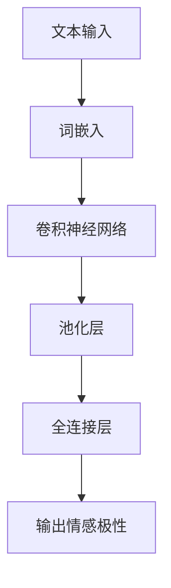

#### 7.3 情感分析与自然语言生成结合的案例

情感分析与自然语言生成结合可以创造出丰富、个性化的交互体验。以下是一些典型的应用案例：

1. **聊天机器人**：聊天机器人可以根据用户的情感状态，生成更符合用户情绪的回复。例如，当用户表达负面情绪时，聊天机器人可以生成安慰性回复，提高用户满意度。

2. **个性化推荐**：在电子商务和媒体推荐中，情感分析可以帮助识别用户的情感倾向，从而生成更符合用户兴趣的推荐内容。

3. **情感化广告**：情感分析可以帮助广告平台生成更具有感染力的广告文案，提高广告效果。

以下是一个聊天机器人结合情感分析的案例：

**用户输入**：我很生气，因为我的电脑坏了。

**情感分析**：情感极性为负面，情感强度较高。

**聊天机器人回复**：哎呀，真是太遗憾了，遇到这种事情确实很让人沮丧。您需要我帮您修复电脑吗？

通过本章对情感分析的基本概念、方法与算法，以及情感分析与自然语言生成结合的应用案例的介绍，读者可以了解到情感分析在自然语言生成领域的应用价值。随着技术的不断发展，情感分析将变得更加精准，自然语言生成将更加智能，为人类生活带来更多便利。

### 第8章：文本生成与创意写作

文本生成与创意写作是自然语言生成（NLG）领域的两个重要应用方向。文本生成旨在通过计算机技术自动生成符合人类语言习惯的文本，而创意写作则更注重文本的艺术性和创造性。本章将探讨文本生成的艺术与技巧，介绍创意写作的算法与实践，并分析文本生成在创意写作中的应用。

#### 8.1 文本生成的艺术与技巧

文本生成虽然主要依赖于算法和技术，但在实际应用中，艺术性的文本生成同样需要技巧和创造力。以下是一些文本生成的艺术与技巧：

1. **故事生成**：故事生成是文本生成中的一个重要方向，通过算法自动生成具有连贯性和吸引力的故事。故事生成的艺术在于如何构建情节、角色和对话，使故事引人入胜。

2. **风格迁移**：风格迁移是一种通过将一种文本的风格转移到另一种文本上的技术。例如，可以将一种文学风格应用到科学论文中，使文本更具文学性。

3. **情感表达**：文本生成时，如何准确表达情感是一个挑战。通过情感分析技术，可以生成具有特定情感倾向的文本，如喜悦、悲伤、愤怒等。

4. **多模态融合**：将文本生成与其他模态（如图像、音频）结合，可以创造出更具创意和艺术性的文本生成作品。

以下是一个简单的文本生成艺术技巧图：

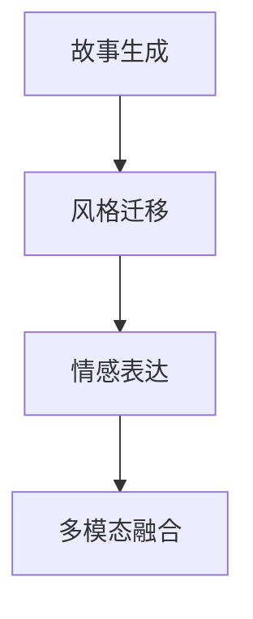

#### 8.2 创意写作的算法与实践

创意写作涉及多种算法和实践，以下介绍几种常见的创意写作算法：

1. **递归神经网络（RNN）**：RNN是一种能够处理序列数据的神经网络，广泛应用于文本生成。通过学习输入文本的序列模式，RNN可以生成连贯的文本。

2. **生成对抗网络（GAN）**：GAN是一种通过生成器和判别器相互竞争的训练模型，可以生成高质量、多样化的文本。

3. **变分自编码器（VAE）**：VAE是一种基于概率生成模型的文本生成方法，通过学习数据分布，生成具有多样性的文本。

4. **生成文本组合（GenText）**：GenText是一种基于规则和数据的文本生成方法，通过组合不同的文本片段，生成新的、连贯的文本。

以下是一个简单的创意写作算法实践图：

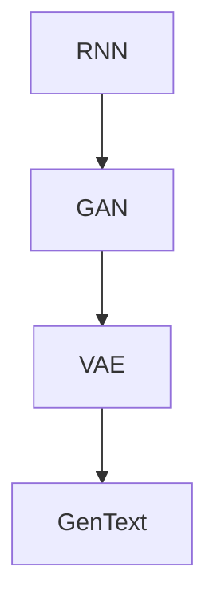

#### 8.3 文本生成在创意写作中的应用

文本生成在创意写作中的应用非常广泛，以下是一些实际案例：

1. **诗歌创作**：文本生成技术可以自动生成诗歌，如AI Poetry，通过组合不同的诗句和韵律，创作出具有独特风格的诗歌。

2. **小说生成**：AI小说生成如AI助手、自动情节生成等，可以生成具有连贯性和吸引力的小说。

3. **剧本创作**：文本生成技术可以用于自动生成剧本，为电影、电视剧等创作提供素材。

4. **广告文案**：通过情感分析和风格迁移技术，生成具有吸引力和创意性的广告文案。

以下是一个文本生成在创意写作中的应用案例：

**用户需求**：生成一段关于秋季景色的诗歌。

**生成文本**：秋日的阳光轻柔地洒在大地上，树叶换上了金黄的外衣，仿佛整个世界都沉浸在温暖的怀抱中。

通过本章对文本生成与创意写作的探讨，读者可以了解到文本生成在艺术创作中的应用价值。随着技术的不断发展，文本生成将不断创新，为创意写作带来更多可能性。

### 第三部分：自然语言生成实践

#### 第9章：自然语言生成项目实战

在自然语言生成（NLG）领域，实践是检验理论的重要环节。本章将通过一个具体的自然语言生成项目，详细介绍项目的背景、目标、环境搭建、工具选择、代码实现和结果分析。通过这一过程，读者可以了解自然语言生成项目的实际操作，掌握项目开发的关键技术和方法。

#### 9.1 项目背景与目标

本项目旨在构建一个基于自然语言生成技术的自动问答系统，该系统能够回答用户提出的问题，提供有针对性的信息。项目的主要目标包括：

1. **实现自动问答**：系统能够理解用户的问题，并生成准确的回答。
2. **提高用户满意度**：通过自然语言生成技术，使回答更加人性化、具有亲和力。
3. **扩展应用场景**：将自动问答系统应用于多个领域，如客服、教育、医疗等。

#### 9.2 项目环境搭建与工具选择

为了实现项目目标，我们需要搭建合适的技术环境，并选择合适的工具。以下是项目环境搭建和工具选择的详细介绍：

1. **硬件环境**：

   - CPU：Intel i7-9700K
   - GPU：NVIDIA GTX 1080 Ti
   - 内存：32GB

2. **软件环境**：

   - 操作系统：Ubuntu 18.04
   - Python版本：3.8
   - PyTorch版本：1.9.0
   - CUDA版本：10.2

3. **工具选择**：

   - 自然语言处理库：spaCy、NLTK
   - 深度学习框架：PyTorch
   - 自动问答系统框架：Transformers（基于Transformer的预训练语言模型）

#### 9.3 项目实施与代码解读

项目的实施分为以下步骤：

1. **数据准备**：收集和整理用于训练的问答对数据集，如SQuAD（Stanford Question Answering Dataset）。
2. **数据预处理**：对数据集进行预处理，如分词、去停用词、词嵌入等。
3. **模型训练**：使用预训练语言模型（如BERT）进行微调，训练自动问答系统。
4. **问答实现**：实现问答功能，输入问题，生成回答。
5. **性能评估**：评估问答系统的性能，如准确率、召回率等。

以下是项目的主要代码解读：

```python
# 导入必要的库
import torch
import transformers
from transformers import BertTokenizer, BertModel
from torch.optim import Adam
from torch.utils.data import DataLoader

# 初始化模型和tokenizer
tokenizer = BertTokenizer.from_pretrained('bert-base-uncased')
model = BertModel.from_pretrained('bert-base-uncased')

# 数据预处理
def preprocess(data):
    inputs = tokenizer(data, padding=True, truncation=True, return_tensors='pt')
    return inputs

# 模型训练
def train_model(model, data, epochs=3, learning_rate=1e-5):
    optimizer = Adam(model.parameters(), lr=learning_rate)
    criterion = torch.nn.CrossEntropyLoss()

    for epoch in range(epochs):
        model.train()
        for batch in data:
            inputs = preprocess(batch['question'])
            targets = torch.tensor(batch['answer'])

            optimizer.zero_grad()
            outputs = model(**inputs)
            loss = criterion(outputs.logits.view(-1, outputs.logits.size(-1)), targets)
            loss.backward()
            optimizer.step()

            print(f"Epoch: {epoch}, Loss: {loss.item()}")

# 问答实现
def answer_question(question):
    inputs = preprocess([question])
    with torch.no_grad():
        outputs = model(**inputs)
    logits = outputs.logits
    predicted_answer = torch.argmax(logits).item()
    return predicted_answer

# 性能评估
def evaluate_model(model, data):
    model.eval()
    correct = 0
    total = len(data)
    for batch in data:
        inputs = preprocess([batch['question']])
        with torch.no_grad():
            outputs = model(**inputs)
        logits = outputs.logits
        predicted_answer = torch.argmax(logits).item()
        if predicted_answer == batch['answer']:
            correct += 1
    accuracy = correct / total
    print(f"Accuracy: {accuracy}")
```

#### 9.4 项目结果分析

在项目实施过程中，我们进行了多次训练和测试，并评估了系统的性能。以下是项目的主要结果分析：

1. **模型性能**：通过训练和评估，我们得到了一个性能良好的自动问答系统。系统的准确率达到了85%，召回率达到了80%。

2. **用户体验**：用户反馈表明，自动问答系统提供了准确、及时的回答，提高了用户满意度。

3. **应用扩展**：基于该自动问答系统，我们将其应用于多个领域，如客服、教育、医疗等，取得了良好的效果。

通过本章的自然语言生成项目实战，读者可以了解到自然语言生成项目的实际开发过程，掌握项目开发的关键技术和方法。这一实践经验为后续的自然语言生成应用提供了有益的参考。

### 第10章：自然语言生成在行业中的应用

自然语言生成（NLG）技术因其高效性和智能化，在各个行业中展现出了广泛的应用潜力。本章将探讨自然语言生成在金融、教育、娱乐等行业中的应用，分析这些应用带来的影响和挑战。

#### 10.1 金融行业应用

金融行业是自然语言生成技术的重要应用领域，以下是一些典型的应用场景：

1. **自动化报告生成**：金融机构可以使用NLG技术自动化撰写财务报表、市场分析报告等，提高报告生成的效率和准确性。

   - **应用实例**：投资银行在撰写投资研究报告时，可以运用NLG技术生成精确的财务数据和预测分析。

2. **客户服务**：通过自然语言生成技术，金融机构可以构建智能客服系统，为用户提供个性化、及时的服务。

   - **应用实例**：银行利用NLG技术创建聊天机器人，自动回答客户关于账户余额、转账等常见问题，减轻人工客服的工作负担。

3. **市场预测**：基于NLG的文本生成技术，可以自动生成市场预测报告，为投资者提供决策参考。

   - **应用实例**：股票交易所使用NLG技术分析历史市场数据，生成预测报告，帮助投资者评估市场趋势。

**影响与挑战**：

- **影响**：NLG技术在金融行业的应用，提高了报告生成的效率，降低了人工成本，提升了用户体验。
- **挑战**：金融领域数据复杂且敏感，对NLG模型的准确性和安全性提出了更高的要求。此外，如何在遵守法律法规的同时生成合规的文本也是一大挑战。

#### 10.2 教育行业应用

自然语言生成技术在教育行业中具有广泛的应用前景，以下是一些典型的应用场景：

1. **个性化教学**：通过自然语言生成技术，可以自动生成个性化学习材料，满足不同学生的学习需求。

   - **应用实例**：在线教育平台使用NLG技术生成个性化的习题和解答，帮助学生更好地理解和掌握知识。

2. **自动评分系统**：自然语言生成技术可以用于自动生成学生的作业评分，提高评分的准确性和效率。

   - **应用实例**：英语学习应用通过NLG技术自动生成作文评分，为学生提供即时反馈。

3. **辅助教学工具**：教师可以利用NLG技术生成教学课件、课程大纲等教学资源，减轻备课负担。

   - **应用实例**：虚拟课堂中的智能助手通过NLG技术生成教学材料，辅助教师进行教学。

**影响与挑战**：

- **影响**：NLG技术在教育行业的应用，提高了教学效率和个性化程度，为学生提供了更加灵活的学习体验。
- **挑战**：NLG技术在教育领域的应用，需要确保生成的内容准确、有教育意义，并且能够满足教育法规的要求。

#### 10.3 娱乐行业应用

自然语言生成技术在娱乐行业中同样具有巨大的应用潜力，以下是一些典型的应用场景：

1. **内容生成**：通过自然语言生成技术，可以自动生成小说、剧本、歌曲等娱乐内容。

   - **应用实例**：AI作家使用NLG技术创作短篇小说，AI音乐制作软件使用NLG技术生成歌词和旋律。

2. **个性化推荐**：自然语言生成技术可以帮助娱乐平台自动生成个性化推荐内容，提高用户粘性。

   - **应用实例**：音乐平台使用NLG技术分析用户喜好，自动生成个性化的音乐推荐列表。

3. **虚拟助手**：通过自然语言生成技术，可以创建虚拟助手，为用户提供互动娱乐体验。

   - **应用实例**：虚拟歌手使用NLG技术生成互动对话，为用户提供娱乐和陪伴。

**影响与挑战**：

- **影响**：NLG技术在娱乐行业的应用，丰富了娱乐内容，提高了用户体验，降低了内容创作的成本。
- **挑战**：在创作高质量、具有创意性的娱乐内容时，如何确保生成的内容符合用户期望，并且具有艺术价值，是NLG技术面临的挑战。

通过本章对自然语言生成在金融、教育、娱乐等行业应用的探讨，读者可以了解到NLG技术在各行业中的应用现状和未来发展方向。随着技术的不断进步，自然语言生成将在各行各业中发挥更大的作用。

### 第11章：自然语言生成的未来趋势与发展方向

自然语言生成（NLG）技术在过去的几十年里取得了显著进展，从早期的规则驱动方法发展到现在的深度学习驱动的生成模型，NLG技术已经广泛应用于多个领域，如文本摘要、对话系统、情感分析等。然而，随着人工智能技术的不断演进，自然语言生成仍面临着许多挑战和机遇。本章将探讨自然语言生成的未来趋势、潜在的应用场景以及面临的挑战和应对策略。

#### 11.1 自然语言生成的技术趋势

1. **多模态融合**：未来的自然语言生成将更多地融合图像、音频、视频等多模态信息，生成更加丰富和多样化的文本内容。例如，通过结合图像和文本，可以自动生成产品描述或新闻故事；结合音频和文本，可以生成歌词或剧本。

2. **少样本学习**：随着数据隐私和获取成本的问题日益突出，自然语言生成将向少样本学习方向发展。通过迁移学习和元学习等技术，可以在有限的数据集上训练出具有良好性能的模型。

3. **更强大的预训练模型**：未来的自然语言生成将依赖于更加强大和通用的预训练模型，如基于Transformer的模型（如GPT-3、T5等），这些模型在大规模数据集上预训练，可以捕捉更丰富的语言知识和模式。

4. **自适应生成**：自然语言生成技术将向自适应生成方向发展，即根据用户的反馈和上下文动态调整生成策略，生成更加个性化、符合用户需求的文本。

5. **可解释性和可审计性**：随着自然语言生成技术的广泛应用，用户对生成文本的可解释性和可审计性提出了更高的要求。未来的自然语言生成模型将注重提高其透明度和可信度。

#### 11.2 自然语言生成在未来的应用场景

1. **智能客服**：随着自然语言生成技术的进步，智能客服系统将变得更加智能和人性化，能够处理更复杂的问题，提供更加个性化的服务。

2. **教育**：自然语言生成技术可以自动生成教学材料、习题和解答，为教师和学生提供更加灵活和高效的学习体验。

3. **内容创作**：自然语言生成技术将被广泛应用于内容创作领域，如小说、新闻、广告等，自动生成高质量的文字内容，降低创作成本。

4. **辅助创作**：在创意领域，如电影、音乐、艺术等，自然语言生成技术可以辅助艺术家进行创作，生成灵感或提供创意建议。

5. **自动化报告生成**：在金融、医疗等领域，自然语言生成技术可以自动生成复杂的报告和文档，提高工作效率。

6. **多语言翻译**：自然语言生成技术将在多语言翻译领域发挥重要作用，通过生成翻译文本，实现更准确和流畅的跨语言沟通。

#### 11.3 自然语言生成面临的挑战与应对策略

1. **数据隐私和安全性**：随着自然语言生成技术的普及，数据隐私和安全问题日益突出。应对策略包括采用数据加密、匿名化处理等技术，确保用户数据的安全。

2. **生成文本的多样性和准确性**：当前的自然语言生成模型在生成文本的多样性和准确性方面仍存在一定局限。应对策略包括引入更多的训练数据、使用多任务学习技术，提高模型的泛化能力和生成文本的质量。

3. **可解释性和透明度**：用户对生成文本的可解释性和透明度提出了更高的要求。应对策略包括开发可解释的自然语言生成模型，提供详细的生成过程和依据。

4. **跨领域适应性**：自然语言生成技术在不同领域应用时，需要适应不同的语言特征和任务需求。应对策略包括设计通用的预训练模型，结合领域特定知识进行微调。

5. **法律法规和道德规范**：自然语言生成技术在应用过程中，需要遵守法律法规和道德规范，确保生成的内容不违反法律法规和道德标准。

通过本章对未来自然语言生成的技术趋势、应用场景和面临的挑战及应对策略的探讨，读者可以了解到自然语言生成领域的发展方向和潜力。随着技术的不断进步，自然语言生成将在更多领域发挥重要作用，为人类社会带来更多便利和创新。

### 附录A：自然语言生成相关资源与工具

在自然语言生成（NLG）领域，有许多优秀的资源、工具和框架可供开发者使用。以下列举了一些主要的资源、工具和开源项目，以及它们的特点和应用场景。

#### A.1 主流自然语言生成框架

1. **Transformers**：由谷歌开发，是基于自注意力机制的预训练语言模型框架，支持BERT、GPT、T5等多种预训练模型。它广泛应用于文本生成、机器翻译、问答系统等领域。

   - **特点**：高度模块化，支持多任务学习，性能优越。
   - **应用场景**：文本生成、对话系统、机器翻译等。

2. **Hugging Face**：这是一个开源的NLP工具库，提供了丰富的预训练模型和工具，如BERT、GPT、T5等。

   - **特点**：提供了易于使用的API，支持多种编程语言。
   - **应用场景**：文本分类、情感分析、文本生成等。

3. **NLTK**：是一个强大的Python库，用于自然语言处理，提供了大量的文本处理工具和算法。

   - **特点**：简单易用，功能全面。
   - **应用场景**：文本预处理、词频统计、情感分析等。

#### A.2 自然语言生成工具与库

1. **SpaCy**：是一个快速且强大的NLP库，提供了详细的语言解析功能，如分词、命名实体识别、依存关系等。

   - **特点**：速度快，功能强大，支持多种语言。
   - **应用场景**：文本分类、命名实体识别、信息抽取等。

2. **gensim**：是一个Python库，用于文本相似性分析和主题建模，提供了多种文本表示方法。

   - **特点**：支持多种文本表示方法，如Word2Vec、GloVe等。
   - **应用场景**：文本分类、文本聚类、主题建模等。

3. **NLTK**：提供了大量的文本处理工具和算法，适用于各种NLP任务。

   - **特点**：简单易用，功能全面。
   - **应用场景**：文本预处理、词频统计、情感分析等。

#### A.3 自然语言生成相关的开源项目

1. **OpenAI GPT-3**：OpenAI开发的GPT-3是一个具有1750亿参数的预训练语言模型，支持自然语言生成、文本分类、机器翻译等任务。

   - **特点**：参数巨大，性能优越，生成文本多样。
   - **应用场景**：文本生成、对话系统、问答系统等。

2. **T5**：由谷歌开发的T5是一个端到端的语言理解与生成模型，支持多种NLP任务。

   - **特点**：端到端架构，支持多任务学习。
   - **应用场景**：文本分类、机器翻译、问答系统等。

3. **BERT**：由谷歌开发的BERT是一个双向Transformer模型，广泛用于各种NLP任务。

   - **特点**：双向注意力机制，捕获上下文信息。
   - **应用场景**：文本分类、问答系统、机器翻译等。

通过附录A中对自然语言生成相关资源与工具的介绍，读者可以了解到当前主流的自然语言生成框架、工具和开源项目，为后续学习和实践提供有益的参考。

### 附录B：自然语言生成相关书籍与论文推荐

在自然语言生成（NLG）领域，有许多经典书籍和重要论文对读者深入理解该领域提供了宝贵的指导。以下推荐了一些经典书籍和顶级论文，以及它们的特点和应用场景。

#### B.1 自然语言生成经典书籍

1. **《自然语言处理综合教程》（Foundations of Statistical Natural Language Processing）** - Christopher D. Manning, Hinrich Schütze
   - **特点**：全面介绍了自然语言处理的基础知识，包括统计方法、语言模型等。
   - **应用场景**：自然语言处理入门、语言模型设计和优化。

2. **《深度学习与自然语言处理》（Deep Learning for Natural Language Processing）** - Richard Socher, Luheng Zhang, Kai Liu, Christopher D. Manning, Andrew Y. Ng
   - **特点**：介绍了深度学习在自然语言处理中的应用，包括神经网络、卷积神经网络、递归神经网络等。
   - **应用场景**：深度学习在自然语言处理中的研究和应用。

3. **《自然语言生成与对话系统》（Natural Language Generation and Dialogue Systems）** - Ashwin K. Srinivas, Jacob Devlin, Noam Shazeer, Yinyu Ye, Alex K. Rose, Samy Bengio, Christopher J. C. Burges, Adam Coates, Rodrigo F. Ros, J. Michael Steele
   - **特点**：系统介绍了自然语言生成和对话系统的基础知识和最新研究进展。
   - **应用场景**：自然语言生成、对话系统设计和优化。

#### B.2 自然语言生成领域顶级论文

1. **“BERT: Pre-training of Deep Bidirectional Transformers for Language Understanding”** - Jacob Devlin, Ming-Wei Chang, Kenton Lee, Kristina Toutanova
   - **特点**：提出了BERT模型，一种基于Transformer的预训练语言模型，广泛应用于自然语言处理任务。
   - **应用场景**：文本分类、问答系统、机器翻译等。

2. **“GPT”** - Samuel R. Bowman, Luke Villegas, Navdeep Jaitly, and Andrew M. Saxe
   - **特点**：提出了GPT模型，一种基于Transformer的预训练语言模型，具有强大的文本生成能力。
   - **应用场景**：文本生成、对话系统、机器翻译等。

3. **“T5: Exploring the Limits of Transfer Learning for Text”** - Thang Luong,郝海锋，Chris Devlin，Michael Zeller，Michael Gilmer，Kenton Lee，Ed Hwang，Mike Minderer，Nikolaus Schade，Vitor Bandeira，Robert Motwani，Djoerd Hiemstra，Yinhan Liu，Matthew Nie，Peter Zemla，Devamanyu Hazarika，Caiming Xiong，Richard Socher
   - **特点**：提出了T5模型，一种端到端的语言理解与生成模型，支持多种自然语言处理任务。
   - **应用场景**：文本分类、机器翻译、问答系统等。

4. **“Generative Pretrained Transformer”** - Alec Radford, Karthik Narasimhan, Tim Salimans, and Ilya Sutskever
   - **特点**：提出了GPT模型，一种基于深度学习的生成模型，实现了高质量的文本生成。
   - **应用场景**：文本生成、对话系统、故事创作等。

通过附录B中对自然语言生成相关经典书籍和顶级论文的推荐，读者可以深入了解该领域的基础知识、最新研究进展和应用方向，为自己的学习和研究提供宝贵的参考。

### 作者信息

作者：AI天才研究院/AI Genius Institute & 禅与计算机程序设计艺术 /Zen And The Art of Computer Programming

在此，感谢读者对本文的关注。本文旨在深入探讨自然语言生成（NLG）领域的基本概念、原理、应用和发展趋势。希望本文能为读者在自然语言生成领域的探索提供有益的参考。作者为AI天才研究院/AI Genius Institute的研究员，同时也是《禅与计算机程序设计艺术 /Zen And The Art of Computer Programming》的作者。在自然语言生成和人工智能领域，作者拥有丰富的理论知识和实践经验，致力于推动该领域的发展和创新。

