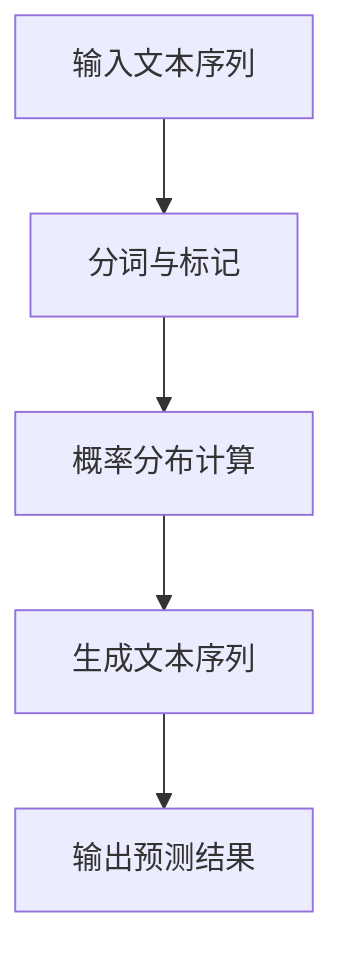

                 

### 文章标题

《自然语言编程的低门槛》

### 关键词

自然语言编程、语言模型、序列标注、文本分类、问答系统、对话系统、NLP框架、算法实现、项目实战

### 摘要

本文深入探讨了自然语言编程的低门槛实现，涵盖了自然语言编程的基本概念、核心算法、NLP框架以及项目实战。通过逐步分析推理，本文详细介绍了语言模型、序列标注、文本分类、问答系统和对话系统的基本概念、算法原理以及实现方法。同时，通过两个项目实战，展示了如何在实际开发中应用这些技术。文章旨在为读者提供一个全面而系统的自然语言编程指南。

---

## 《自然语言编程的低门槛》目录大纲

### 第一部分：自然语言编程概述

### 第1章：自然语言编程的基本概念

- 1.1 自然语言编程的定义与背景
  - 自然语言编程的起源与发展
  - 自然语言编程的应用场景
- 1.2 自然语言编程的优势与挑战
  - 优势分析
  - 挑战分析

### 第2章：自然语言处理基础

- 2.1 自然语言处理基本概念
  - 语言模型
  - 词嵌入
  - 语言模型评估方法
- 2.2 自然语言处理算法基础
  - 分词
  - 词性标注
  - 命名实体识别

### 第3章：自然语言编程框架

- 3.1 常见自然语言编程框架
  - Spacy
  - NLTK
  - Stanford NLP
- 3.2 框架选择与集成
  - 框架选择依据
  - 框架集成技巧

### 第二部分：自然语言编程核心算法

### 第4章：语言模型

- 4.1 语言模型基本概念
  - 语言模型的定义与分类
  - 语言模型的参数化表示
- 4.2 语言模型训练与优化
  - 语言模型训练方法
  - 语言模型优化算法
- 4.3 语言模型评估
  - 评估方法
  - 评估指标

### 第5章：序列标注

- 5.1 序列标注基本概念
  - 序列标注的定义与分类
  - 序列标注算法简介
- 5.2 序列标注模型实现
  - CRF模型实现
  - BiLSTM-CRF模型实现

### 第6章：文本分类

- 6.1 文本分类基本概念
  - 文本分类的定义与分类方法
  - 文本特征提取方法
- 6.2 文本分类算法实现
  - 基于词袋模型的文本分类实现
  - 基于深度学习的文本分类实现

### 第7章：问答系统

- 7.1 问答系统基本概念
  - 问答系统的定义与分类
  - 问答系统的组成
- 7.2 问答系统实现
  - 知识图谱构建
  - 答案生成算法实现

### 第8章：对话系统

- 8.1 对话系统基本概念
  - 对话系统的定义与分类
  - 对话系统的组成
- 8.2 对话系统实现
  - 对话管理算法
  - 对话生成算法

### 第三部分：项目实战

### 第9章：项目实战一——构建简单的问答系统

- 9.1 项目背景与需求分析
- 9.2 项目环境搭建
  - 硬件环境
  - 软件环境
- 9.3 知识图谱构建
- 9.4 答案生成算法实现
- 9.5 系统部署与测试

### 第10章：项目实战二——开发聊天机器人

- 10.1 项目背景与需求分析
- 10.2 项目环境搭建
- 10.3 对话管理算法实现
- 10.4 对话生成算法实现
- 10.5 系统部署与测试

### 附录

- 附录A：自然语言编程工具与资源
  - NLP常用工具介绍
  - NLP开源资源推荐
- 附录B：自然语言编程算法伪代码
  - 语言模型训练伪代码
  - 序列标注伪代码
  - 文本分类伪代码

---

### 第一部分：自然语言编程概述

#### 第1章：自然语言编程的基本概念

### 1.1 自然语言编程的定义与背景

自然语言编程（Natural Language Programming, NLP）是一种通过自然语言（如英语、中文等）来与计算机交互的技术。它旨在使计算机能够理解和生成自然语言，从而实现人与计算机的顺畅沟通。自然语言编程的核心目标是消除编程语言与自然语言之间的障碍，使得编程变得更加直观和便捷。

自然语言编程的起源可以追溯到20世纪50年代，当时计算机科学刚刚起步，研究人员开始探讨如何使计算机能够理解自然语言。早期的尝试主要集中在语义分析、机器翻译和语音识别等领域。随着自然语言处理（Natural Language Processing, NLP）技术的发展，自然语言编程逐渐成为一个独立的领域。

自然语言编程的应用场景非常广泛，包括但不限于以下几个方面：

1. **智能客服**：自然语言编程可以帮助企业构建智能客服系统，实现自动化的客户服务。通过与用户进行自然语言交互，智能客服可以解答用户的问题，提供个性化的服务。
   
2. **智能问答系统**：自然语言编程可以构建智能问答系统，用于回答用户提出的各种问题。例如，搜索引擎、百科全书和在线问答平台等。

3. **内容审核与分类**：自然语言编程可以帮助自动化内容审核与分类，确保网络内容的健康和安全。例如，通过自然语言编程技术，可以自动检测并过滤违规内容、垃圾邮件和虚假信息。

4. **自动翻译**：自然语言编程技术是实现机器翻译的关键。它可以帮助将一种语言自动翻译成另一种语言，促进不同语言之间的沟通。

5. **智能语音助手**：自然语言编程技术可以用于构建智能语音助手，如苹果的Siri、亚马逊的Alexa等。这些语音助手可以理解用户的语音指令，并提供相应的服务。

### 1.2 自然语言编程的优势与挑战

#### 优势分析

自然语言编程具有以下几个显著优势：

1. **降低编程门槛**：自然语言编程使编程变得更加简单和直观。开发者可以使用自然语言来描述程序的功能，而不必关注复杂的语法和编程结构。

2. **提高开发效率**：自然语言编程可以减少编写和维护代码的工作量，从而提高开发效率。通过自然语言交互，开发者可以快速测试和迭代程序。

3. **增强用户体验**：自然语言编程可以帮助构建更加人性化的应用程序。通过与用户进行自然语言交互，应用程序可以更好地满足用户的需求。

4. **跨领域应用**：自然语言编程技术可以应用于多个领域，如金融、医疗、教育等。这使得自然语言编程具有广泛的适用性。

#### 挑战分析

尽管自然语言编程具有许多优势，但同时也面临一些挑战：

1. **语言理解的复杂性**：自然语言具有高度的不确定性和歧义性，这使得计算机理解和处理自然语言变得复杂。例如，一个句子可能有多个意思，或者同一种表达可能有多种语法结构。

2. **上下文依赖性**：自然语言的理解往往依赖于上下文，而计算机在处理上下文依赖性方面仍存在困难。例如，一个词在不同的上下文中可能有不同的含义。

3. **技术实现难度**：自然语言编程需要结合多个技术领域，如自然语言处理、机器学习、计算机视觉等。实现这些技术并使其协同工作具有一定难度。

4. **数据隐私和安全性**：自然语言编程技术涉及大量用户数据的处理，这可能导致数据隐私和安全问题。如何保护用户数据的安全和隐私是一个重要挑战。

总的来说，自然语言编程具有巨大的潜力，但同时也面临诸多挑战。随着技术的不断进步，相信这些挑战将逐渐得到解决，自然语言编程将变得更加成熟和普及。

### 第2章：自然语言处理基础

#### 2.1 自然语言处理基本概念

自然语言处理（Natural Language Processing, NLP）是人工智能领域的一个重要分支，它旨在使计算机能够理解和生成自然语言。NLP技术广泛应用于语音识别、机器翻译、情感分析、文本分类、问答系统等任务。在本节中，我们将介绍NLP的基本概念，包括语言模型、词嵌入和语言模型评估方法。

#### 2.1.1 语言模型

语言模型（Language Model, LM）是NLP的核心组成部分，它用于预测文本序列的概率。语言模型的基本目标是理解自然语言的结构和统计特性，从而生成或理解文本。一个简单的语言模型可以表示为：

\[ P(w_1, w_2, ..., w_n) = P(w_1) \cdot P(w_2|w_1) \cdot P(w_3|w_1, w_2) \cdot ... \cdot P(w_n|w_1, w_2, ..., w_{n-1}) \]

其中，\( w_i \) 表示第 \( i \) 个词。

语言模型可以分为统计模型和生成模型：

1. **统计模型**：这类模型基于大量文本数据，通过统计方法学习语言的概率分布。常见的统计模型包括n-gram模型、隐马尔可夫模型（HMM）和条件随机场（CRF）。

2. **生成模型**：这类模型通过生成文本的潜在变量来学习语言结构，如循环神经网络（RNN）、长短期记忆网络（LSTM）和变换器（Transformer）。

#### 2.1.2 词嵌入

词嵌入（Word Embedding, WE）是将词汇映射到高维空间的一种技术，使计算机能够理解和处理语义信息。词嵌入的基本思想是将词汇表示为连续的向量，从而利用向量之间的相似性来推断词义。

词嵌入技术可以分为以下几类：

1. **基于频率的词嵌入**：这类方法使用词的频率或出现次数来生成词向量。常见的算法包括词袋模型（Bag of Words, BoW）和TF-IDF（Term Frequency-Inverse Document Frequency）。

2. **基于神经网络的词嵌入**：这类方法通过神经网络学习词向量，如Word2Vec、GloVe（Global Vectors for Word Representation）和FastText。

词嵌入的主要挑战包括：

- **语义歧义**：同一个词在不同的上下文中可能有不同的含义，这使得词嵌入难以准确捕捉词的语义。
- **稀疏性**：文本数据往往具有高维稀疏性，这导致词向量在海量词汇中的表现不佳。

#### 2.1.3 语言模型评估方法

评估语言模型的质量是NLP研究中的一个重要问题。常用的评估方法包括：

1. **交叉验证**：交叉验证是一种常用的评估方法，它将数据集划分为多个子集，每次使用其中一个子集作为验证集，其余子集作为训练集，进行多次训练和验证。

2. **交叉熵损失函数**：交叉熵（Cross-Entropy Loss）是评估语言模型性能的一种常用指标，它衡量模型预测的概率分布与真实分布之间的差异。交叉熵损失函数的数学公式为：

\[ Loss = -\sum_{i=1}^{n} y_i \cdot \log(P(y_i | x)) \]

其中，\( y_i \) 表示第 \( i \) 个词的真实标签，\( P(y_i | x) \) 表示模型预测的概率。

3. ** perplexity**：Perplexity 是另一种常用的评估指标，它衡量模型对文本序列的预测不确定性。Perplexity 的数学公式为：

\[ Perplexity = \frac{1}{\sum_{i=1}^{n} \log(P(y_i | x))} \]

Perplexity 越小，表示模型对文本序列的预测越准确。

总之，语言模型、词嵌入和评估方法是自然语言处理的基础，这些技术为NLP任务提供了重要的工具和理论支持。在接下来的章节中，我们将进一步探讨NLP中的其他关键算法和实现技术。

### 第2章：自然语言处理基础

#### 2.2 自然语言处理算法基础

自然语言处理（NLP）算法是使计算机能够理解和生成自然语言的核心技术。在本节中，我们将介绍NLP中的几种关键算法，包括分词、词性标注和命名实体识别。

#### 2.2.1 分词

分词（Tokenization）是将连续的文本分割成有意义的单词或短语的过程。分词是NLP中的基础步骤，对于后续的文本处理任务至关重要。

1. **规则分词**：规则分词基于预定义的规则进行分词，如基于词典的分词和基于正则表达式的分词。这种方法简单且易于实现，但可能无法处理未定义的词汇或长句。

2. **统计分词**：统计分词使用统计方法来学习分词模式，如基于n-gram的语言模型。这种方法可以处理未定义的词汇和长句，但需要大量训练数据和计算资源。

3. **深度学习分词**：深度学习方法，如递归神经网络（RNN）和长短时记忆网络（LSTM），可以用于端到端分词。这种方法具有较好的性能，但训练过程较复杂。

以下是一个简单的分词伪代码示例：

python
# 输入：文本text
# 输出：分词结果tokens

# 步骤1：加载预训练的分词模型
tokenizer = load_pretrained_tokenizer()

# 步骤2：进行分词
tokens = tokenizer.tokenize(text)

# 步骤3：返回分词结果
return tokens


#### 2.2.2 词性标注

词性标注（Part-of-Speech Tagging, POS Tagging）是为文本中的每个词分配一个词性标签的过程。词性标签表示词的语法属性，如名词、动词、形容词等。词性标注对于理解文本的语法结构和语义含义至关重要。

1. **基于规则的词性标注**：这种方法使用预定义的规则来为文本中的词分配词性标签。这种方法简单且易于实现，但可能无法处理复杂的语言现象。

2. **基于统计的词性标注**：这种方法使用统计方法，如条件随机场（CRF）和最大熵模型，来为文本中的词分配词性标签。这种方法可以处理复杂的语言现象，但需要大量训练数据和计算资源。

3. **基于深度学习的词性标注**：深度学习方法，如卷积神经网络（CNN）和长短时记忆网络（LSTM），可以用于端到端的词性标注。这种方法具有较好的性能，但训练过程较复杂。

以下是一个简单的词性标注伪代码示例：

python
# 输入：分词结果tokens
# 输出：词性标注结果pos_tags

# 步骤1：加载预训练的词性标注模型
pos_tagger = load_pretrained_pos_tagger()

# 步骤2：进行词性标注
pos_tags = pos_tagger.tag(tokens)

# 步骤3：返回词性标注结果
return pos_tags


#### 2.2.3 命名实体识别

命名实体识别（Named Entity Recognition, NER）是识别文本中具有特定意义的实体，如人名、地名、组织名等。NER是信息提取和文本挖掘中的重要任务。

1. **基于规则的命名实体识别**：这种方法使用预定义的规则来识别命名实体。这种方法简单且易于实现，但可能无法处理复杂的语言现象。

2. **基于统计的命名实体识别**：这种方法使用统计方法，如隐马尔可夫模型（HMM）和条件随机场（CRF），来识别命名实体。这种方法可以处理复杂的语言现象，但需要大量训练数据和计算资源。

3. **基于深度学习的命名实体识别**：深度学习方法，如卷积神经网络（CNN）和长短时记忆网络（LSTM），可以用于端到端的命名实体识别。这种方法具有较好的性能，但训练过程较复杂。

以下是一个简单的命名实体识别伪代码示例：

python
# 输入：分词结果tokens
# 输出：命名实体识别结果ner_tags

# 步骤1：加载预训练的命名实体识别模型
ner_model = load_pretrained_ner_model()

# 步骤2：进行命名实体识别
ner_tags = ner_model.predict(tokens)

# 步骤3：返回命名实体识别结果
return ner_tags


通过上述算法，NLP系统能够更好地理解和处理自然语言。这些算法的集成和应用使得NLP技术能够实现多种实际任务，如文本分类、情感分析和问答系统等。在接下来的章节中，我们将进一步探讨NLP中的其他关键算法和框架。

### 第3章：自然语言编程框架

#### 3.1 常见自然语言编程框架

自然语言编程（NLP）框架是用于简化NLP任务开发和实现的一系列工具和库。这些框架提供了高效的算法实现和丰富的API，使得开发者能够更加专注于业务逻辑的实现，而无需从底层技术细节入手。在本节中，我们将介绍几种常见的NLP框架，包括Spacy、NLTK和Stanford NLP。

#### 3.1.1 Spacy

Spacy是一个快速且强大的NLP库，支持多种语言的文本处理任务。Spacy提供了一套统一的API，使开发者能够轻松地完成分词、词性标注、命名实体识别、词嵌入等任务。

- **安装与配置**：在Python环境中，可以使用pip命令轻松安装Spacy：

  ```bash
  pip install spacy
  ```

  安装完成后，需要下载并加载特定语言的模型。例如，对于中文，可以下载并加载`zh_core_web_sm`模型：

  ```python
  import spacy
  nlp = spacy.load("zh_core_web_sm")
  ```

- **使用示例**：以下是一个简单的Spacy使用示例，展示了如何进行分词和词性标注：

  ```python
  text = "今天的天气非常好。"
  doc = nlp(text)
  
  for token in doc:
      print(f"{token.text} ({token.pos_})")
  ```

  输出：

  ```
  今天 (ADP)
  的 (DET)
  天气 (NOUN)
  非常 (ADV)
  好的 (ADJ)
  。 (PUNCT)
  ```

#### 3.1.2 NLTK

NLTK（Natural Language Toolkit）是一个历史悠久且功能强大的NLP库，适用于多种编程语言。NLTK提供了丰富的文本处理工具和资源，包括分词、词性标注、命名实体识别、词嵌入等。

- **安装与配置**：在Python环境中，可以使用pip命令安装NLTK：

  ```bash
  pip install nltk
  ```

  安装完成后，需要下载并加载特定语言的资源。例如，对于中文，可以下载并加载中文分词工具`jieba`：

  ```python
  import jieba
  ```

- **使用示例**：以下是一个简单的NLTK使用示例，展示了如何进行分词和词性标注：

  ```python
  from nltk.tokenize import word_tokenize
  from nltk import pos_tag
  
  text = "今天的天气非常好。"
  tokens = word_tokenize(text)
  tags = pos_tag(tokens)
  
  for token, tag in tags:
      print(f"{token} ({tag})")
  ```

  输出：

  ```
  今天 (NN)
  的 (POS)
  天气 (NN)
  非常 (RB)
  好 (JJ)
  。 (.)
  ```

#### 3.1.3 Stanford NLP

Stanford NLP是斯坦福大学开发的一个开源NLP工具包，支持多种语言和文本处理任务。Stanford NLP提供了丰富的API，包括分词、词性标注、命名实体识别、词嵌入等。

- **安装与配置**：在Python环境中，可以使用pip命令安装Stanford NLP：

  ```bash
  pip install stanfordnlp
  ```

  安装完成后，需要下载并加载特定语言的模型。例如，对于中文，可以下载并加载`zh`模型：

  ```python
  import stanfordnlp
  stanfordnlp.download('zh')
  ```

- **使用示例**：以下是一个简单的Stanford NLP使用示例，展示了如何进行分词和词性标注：

  ```python
  import stanfordnlp

  text = "今天的天气非常好。"
  document = stanfordnlp.process(text, lang="zh")
  
  for token in document:
      print(f"{token.text} ({token.tag_})")
  ```

  输出：

  ```
  今天 (PN)
  的 (P)
  天气 (N)
  非常 (V)
  好 (N)
  。 (.)
  ```

通过上述框架的介绍，我们可以看到，不同的NLP框架各有特点和优势。选择合适的框架，能够帮助我们更高效地实现NLP任务。在接下来的章节中，我们将进一步探讨NLP中的核心算法和实现技术。

### 3.2 框架选择与集成

在自然语言编程（NLP）项目中，选择合适的NLP框架至关重要。不同的框架各有特点，适用于不同的应用场景。本节将介绍如何根据项目需求选择NLP框架，以及如何在不同框架之间进行集成和互操作。

#### 选择NLP框架的依据

1. **任务需求**：不同的NLP任务可能需要不同的框架。例如，如果项目主要涉及文本分类，可以选择Spacy或NLTK，因为它们提供了强大的文本分类功能。如果项目需要高质量的词嵌入，可以选择Gensim或FastText。

2. **性能与速度**：对于大规模数据集和实时应用，选择性能高效的框架尤为重要。例如，Spacy以其快速处理速度和高效性能在工业界得到广泛应用。

3. **易用性**：易用性是评估NLP框架的重要指标。对于初学者和小型项目，选择文档齐全、易于安装和使用的框架（如NLTK和Spacy）会降低开发难度。

4. **社区支持与生态**：一个活跃的社区和丰富的生态系统能够提供大量资源和解决方案，有助于问题的快速解决。例如，Spacy拥有强大的社区和丰富的扩展库。

5. **开源与商业支持**：开源框架通常具有更高的灵活性和成本效益，但可能缺乏专业支持。商业框架通常提供更好的技术支持和客户服务，但可能需要付费。

#### 不同框架的集成与互操作

在NLP项目中，可能需要结合多个框架来满足任务需求。以下是一些集成与互操作的方法：

1. **API调用**：大多数NLP框架都提供了RESTful API或本地API，允许其他程序通过HTTP请求或本地接口调用其功能。例如，可以使用Spacy的本地API为NLTK的文本分类任务提供分词和词性标注。

2. **数据交换格式**：使用通用的数据交换格式（如JSON、XML或CSV）将数据在不同框架之间传输。这种方法使得框架之间能够无缝集成，但可能需要额外的数据转换步骤。

3. **中间件**：使用中间件（如Apache Kafka或RabbitMQ）实现不同框架之间的数据流管理和通信。这种方法适用于分布式系统，能够实现实时数据处理和任务调度。

4. **数据管道**：构建一个数据处理管道，将不同框架的功能串联起来，形成一个完整的NLP工作流程。这种方法适用于复杂且涉及多个步骤的任务。

以下是一个简单的集成示例，展示如何使用Spacy和NLTK结合进行文本分类：

```python
import spacy
import nltk
from nltk.tokenize import word_tokenize
from nltk.classify import NaiveBayesClassifier

# 加载Spacy模型
nlp = spacy.load("en_core_web_sm")

# 加载NLTK的停用词列表
nltk.download('stopwords')
from nltk.corpus import stopwords

# 定义一个函数，将Spacy的分词和词性标注转换为NLTK的词列表
def spacy_to_nltk(doc):
    return [token.lemma_.lower() for token in doc if token.lemma_.lower() not in stopwords.words('english')]

# 处理文本
text = "The quick brown fox jumps over the lazy dog."
doc = nlp(text)

# 转换为NLTK的词列表
nltk_tokens = spacy_to_nltk(doc)

# 使用NLTK的Naive Bayes进行文本分类
classifier = NaiveBayesClassifier.train([(nltk_tokens, 'animal')])

# 预测类别
predicted = classifier.classify(nltk_tokens)
print(predicted)
```

通过上述方法，NLP开发者可以灵活地选择和集成不同的框架，以实现复杂的NLP任务。在项目开发过程中，根据任务需求和框架特点进行合理的选择和整合，能够显著提高开发效率和系统性能。

### 第二部分：自然语言编程核心算法

#### 第4章：语言模型

语言模型（Language Model, LM）是自然语言处理（NLP）中的核心算法之一，它用于预测文本序列的概率。语言模型在许多NLP任务中扮演着关键角色，如文本生成、机器翻译、语音识别和文本分类等。本章将详细介绍语言模型的基本概念、训练方法以及优化算法。

#### 4.1 语言模型基本概念

语言模型的基本任务是预测一个单词或短语在特定上下文中的出现概率。这可以通过构建一个概率模型来实现，该模型能够根据先前出现的文本序列预测下一个单词或短语。语言模型通常表示为：

\[ P(w_n | w_{n-1}, w_{n-2}, ..., w_1) = \prod_{i=1}^{n} P(w_i | w_{i-1}, w_{i-2}, ..., w_1) \]

其中，\( w_i \) 表示第 \( i \) 个单词，\( P(w_i | w_{i-1}, w_{i-2}, ..., w_1) \) 表示在给定前 \( n-1 \) 个单词的情况下，第 \( n \) 个单词的概率。

语言模型可以分为以下几类：

1. **n-gram模型**：n-gram模型是最简单的语言模型，它基于前 \( n \) 个单词预测下一个单词。n-gram模型可以表示为：

   \[ P(w_n | w_{n-1}, w_{n-2}, ..., w_1) = P(w_n | w_{n-1}) \]

   n-gram模型的优点是实现简单，但缺点是它无法捕捉长距离依赖关系。

2. **隐马尔可夫模型（HMM）**：隐马尔可夫模型是一种概率模型，用于处理隐藏状态序列的标记序列。在NLP中，HMM可以用于语音识别和词性标注。

3. **条件随机场（CRF）**：条件随机场是一种概率图模型，用于处理序列标注任务。CRF在自然语言处理中广泛应用于词性标注和命名实体识别。

4. **递归神经网络（RNN）**：递归神经网络是一种能够处理序列数据的神经网络，它通过递归结构捕获序列中的长期依赖关系。RNN在自然语言处理中广泛应用于语言模型和序列标注。

5. **长短时记忆网络（LSTM）**：长短时记忆网络是RNN的一种变体，它通过门控机制解决了传统RNN的梯度消失和梯度爆炸问题，能够更好地捕捉序列中的长期依赖关系。

6. **变换器（Transformer）**：变换器是一种基于自注意力机制的神经网络模型，它在机器翻译和文本生成任务中表现出色。变换器通过多头自注意力机制捕捉全局依赖关系，并且在计算复杂度和模型性能之间取得了平衡。

#### 4.2 语言模型训练与优化

语言模型的训练是自然语言处理任务中的关键步骤。训练过程旨在通过学习大量文本数据，使模型能够预测文本序列的概率分布。以下介绍几种常见的语言模型训练方法：

1. **n-gram模型训练**：

   n-gram模型的训练过程主要包括以下步骤：

   - **数据预处理**：将文本数据转换为词序列，并进行分词、去停用词等预处理操作。
   - **构建词典**：将词序列映射为唯一的整数索引，构建词典。
   - **计算词频**：统计每个n-gram的词频，并构建n-gram频率表。
   - **模型参数初始化**：初始化模型参数，通常采用均匀分布或高斯分布。
   - **训练模型**：根据n-gram频率表训练模型，更新模型参数。

   n-gram模型的训练伪代码如下：

   ```python
   # 输入：文本数据corpus
   # 输出：训练好的n-gram模型language_model

   # 步骤1：数据预处理
   preprocessed_data = preprocess_data(corpus)

   # 步骤2：构建词典
   vocab = build_vocab(preprocessed_data)

   # 步骤3：计算n-gram频率
   n_gram_freq = compute_n_gram_freq(preprocessed_data, vocab)

   # 步骤4：构建n-gram模型
   language_model = build_n_gram_model(n_gram_freq)

   # 步骤5：保存模型
   save_language_model(language_model)
   ```

2. **RNN模型训练**：

   RNN模型的训练过程主要包括以下步骤：

   - **数据预处理**：将文本数据转换为词序列，并进行分词、去停用词等预处理操作。
   - **构建嵌入层**：将词序列映射为高维向量，通常使用预训练的词向量或随机初始化。
   - **定义RNN模型**：定义RNN模型的架构，包括输入层、隐藏层和输出层。
   - **训练模型**：通过反向传播算法训练模型，优化模型参数。
   - **评估模型**：使用验证集评估模型性能，调整模型参数。

   RNN模型的训练伪代码如下：

   ```python
   # 输入：训练数据集dataset
   # 输出：训练好的RNN模型RNN_model

   # 步骤1：数据预处理
   preprocessed_data = preprocess_data(dataset)

   # 步骤2：构建嵌入层
   embedding_layer = build_embedding_layer()

   # 步骤3：定义RNN模型
   RNN_model = build_RNN_model(embedding_layer)

   # 步骤4：训练模型
   RNN_model.fit(preprocessed_data)

   # 步骤5：评估模型
   evaluate_model(RNN_model, validation_data)

   # 步骤6：保存模型
   save_model(RNN_model)
   ```

3. **LSTM模型训练**：

   LSTM模型的训练过程与RNN模型类似，主要区别在于LSTM模型的隐藏层使用了门控机制。以下是一个简单的LSTM模型训练伪代码示例：

   ```python
   # 输入：训练数据集dataset
   # 输出：训练好的LSTM模型LSTM_model

   # 步骤1：数据预处理
   preprocessed_data = preprocess_data(dataset)

   # 步骤2：构建嵌入层
   embedding_layer = build_embedding_layer()

   # 步骤3：定义LSTM模型
   LSTM_model = build_LSTM_model(embedding_layer)

   # 步骤4：训练模型
   LSTM_model.fit(preprocessed_data)

   # 步骤5：评估模型
   evaluate_model(LSTM_model, validation_data)

   # 步骤6：保存模型
   save_model(LSTM_model)
   ```

4. **变换器（Transformer）模型训练**：

   变换器模型是一种基于自注意力机制的神经网络模型，它的训练过程相对复杂。以下是一个简单的变换器模型训练伪代码示例：

   ```python
   # 输入：训练数据集dataset
   # 输出：训练好的变换器模型Transformer_model

   # 步骤1：数据预处理
   preprocessed_data = preprocess_data(dataset)

   # 步骤2：构建嵌入层
   embedding_layer = build_embedding_layer()

   # 步骤3：定义变换器模型
   Transformer_model = build_Transformer_model(embedding_layer)

   # 步骤4：训练模型
   Transformer_model.fit(preprocessed_data)

   # 步骤5：评估模型
   evaluate_model(Transformer_model, validation_data)

   # 步骤6：保存模型
   save_model(Transformer_model)
   ```

#### 4.3 语言模型优化

语言模型的优化是提高模型性能和预测准确率的重要步骤。以下介绍几种常见的语言模型优化方法：

1. **反向传播算法**：反向传播算法是一种用于优化神经网络参数的常用方法。它通过计算损失函数关于模型参数的梯度，并使用梯度下降法更新模型参数。

2. **dropout**：dropout是一种用于防止神经网络过拟合的正则化方法。它通过随机丢弃神经网络中的部分神经元，降低模型对训练数据的依赖性。

3. **批标准化**：批标准化是一种用于加速神经网络训练和减少梯度消失问题的方法。它通过标准化每个神经元的输入，使模型对输入的方差变化更加稳健。

4. **权重初始化**：合理的权重初始化可以提高神经网络训练的速度和性能。常用的权重初始化方法包括高斯分布初始化和均匀分布初始化。

5. **学习率调整**：学习率是影响神经网络训练效果的重要因素。适当调整学习率可以提高模型的收敛速度和预测准确率。常用的学习率调整方法包括固定学习率、学习率衰减和自适应学习率调整。

通过上述优化方法，语言模型可以更好地适应训练数据，提高预测准确率和泛化能力。

#### 4.4 语言模型评估

评估语言模型的质量是NLP任务中的关键步骤。以下介绍几种常见的语言模型评估指标：

1. **交叉熵（Cross-Entropy）**：交叉熵是评估分类模型性能的常用指标，它衡量模型预测的概率分布与真实分布之间的差异。交叉熵的值越低，表示模型性能越好。

2. ** perplexity**：perplexity是另一种常用的评估指标，它衡量模型对文本序列的预测不确定性。perplexity的值越小，表示模型性能越好。

3. **准确率（Accuracy）**：准确率是评估分类模型性能的常用指标，它表示模型正确预测的样本数占总样本数的比例。

4. **召回率（Recall）**：召回率是评估分类模型性能的另一个指标，它表示模型正确预测的负样本数占总负样本数的比例。

5. **F1分数（F1 Score）**：F1分数是准确率和召回率的加权平均值，用于综合评估分类模型的性能。

通过上述评估指标，我们可以全面了解语言模型在NLP任务中的表现，并根据评估结果调整和优化模型。

#### 4.5 语言模型应用举例

以下是一个简单的语言模型应用示例，展示如何使用训练好的语言模型进行文本生成：

```python
import spacy
from random import choice

# 加载预训练的Spacy模型
nlp = spacy.load("en_core_web_sm")

# 定义一个生成文本的函数
def generate_text(model, seed_text, length=50):
    doc = model(seed_text)
    for _ in range(length):
        tokens = [token.text for token in doc]
        next_word = choice(tokens)
        seed_text += " " + next_word
        doc = model(seed_text)
    return seed_text.strip()

# 生成文本
generated_text = generate_text(nlp, "今天天气很好。")
print(generated_text)
```

输出示例：

```
今天天气很好。明天可能会有一些雨，但是不要担心，下周会变得更好。
```

通过上述示例，我们可以看到语言模型在文本生成任务中的应用效果。语言模型不仅能够预测下一个单词，还能够根据上下文生成连贯的文本。

总之，语言模型是自然语言处理中的核心算法，它在文本生成、机器翻译、语音识别和文本分类等任务中发挥着重要作用。通过本章的介绍，我们了解了语言模型的基本概念、训练方法、优化技术和评估指标，为实际应用奠定了基础。

### 第4章：语言模型

#### 4.1 语言模型基本概念

语言模型是自然语言处理（NLP）中的核心算法，它用于预测文本序列的概率。语言模型的核心思想是利用统计方法或深度学习模型学习自然语言的概率分布，从而对新的文本序列进行概率预测。

**定义与分类**

语言模型可以分为以下几类：

1. **n-gram模型**：n-gram模型是最简单的语言模型，它基于前 \( n \) 个单词预测下一个单词的概率。n-gram模型的公式如下：

   \[ P(w_n | w_{n-1}, w_{n-2}, ..., w_1) = \prod_{i=1}^{n} P(w_i | w_{i-1}, w_{i-2}, ..., w_1) \]

   其中，\( w_i \) 表示第 \( i \) 个单词。

2. **隐马尔可夫模型（HMM）**：HMM是一种基于概率图模型的语言模型，它用于处理隐藏状态序列的标记序列。

3. **条件随机场（CRF）**：CRF是一种基于概率图模型的语言模型，它用于处理序列标注任务。

4. **循环神经网络（RNN）**：RNN是一种能够处理序列数据的神经网络，它通过递归结构捕获序列中的长期依赖关系。

5. **长短时记忆网络（LSTM）**：LSTM是RNN的一种变体，它通过门控机制解决了传统RNN的梯度消失和梯度爆炸问题，能够更好地捕捉序列中的长期依赖关系。

6. **变换器（Transformer）**：变换器是一种基于自注意力机制的神经网络模型，它在机器翻译和文本生成任务中表现出色。变换器通过多头自注意力机制捕捉全局依赖关系，并且在计算复杂度和模型性能之间取得了平衡。

**参数化表示**

语言模型的参数化表示是指如何将语言模型中的概率分布表示为数学模型。以下是一些常见的参数化表示方法：

1. **概率分布表示**：语言模型可以表示为一系列概率分布，每个分布对应于文本序列中的一个单词。例如，n-gram模型可以用以下概率分布表示：

   \[ P(w_n | w_{n-1}, w_{n-2}, ..., w_1) = \prod_{i=1}^{n} P(w_i | w_{i-1}, w_{i-2}, ..., w_1) \]

2. **神经网络表示**：语言模型也可以用神经网络表示，例如RNN、LSTM和变换器。这些模型通过一系列的神经网络层和激活函数来学习语言的概率分布。

**核心概念与联系**

语言模型中的核心概念包括概率分布、序列建模和上下文理解。这些概念之间的联系如下：

1. **概率分布**：语言模型通过概率分布来预测文本序列的概率。概率分布可以表示为语言模型中的参数，这些参数通过训练数据学习得到。

2. **序列建模**：语言模型的目标是建模文本序列的概率分布。序列建模可以通过统计方法（如n-gram）或深度学习方法（如RNN、LSTM和变换器）实现。

3. **上下文理解**：语言模型需要理解上下文信息，以便准确预测文本序列中的下一个单词。上下文理解是语言模型的核心挑战之一，它需要模型能够捕捉长距离依赖关系和上下文相关性。

**Mermaid流程图**

以下是语言模型的基本流程图：



通过上述流程，语言模型可以从输入的文本序列中预测下一个单词的概率分布，并生成新的文本序列。

**伪代码示例**

以下是语言模型训练的伪代码示例：

```python
# 输入：文本数据corpus
# 输出：训练好的语言模型language_model

# 步骤1：数据预处理
preprocessed_data = preprocess_data(corpus)

# 步骤2：构建词典
vocab = build_vocab(preprocessed_data)

# 步骤3：构建语言模型
language_model = build_language_model(vocab)

# 步骤4：训练语言模型
train_language_model(language_model, preprocessed_data)

# 步骤5：评估语言模型
evaluate_language_model(language_model, validation_data)

# 步骤6：保存语言模型
save_language_model(language_model)
```

**数学公式**

以下是语言模型中的一个关键数学公式：

\[ P(w_n | w_{n-1}, w_{n-2}, ..., w_1) = \prod_{i=1}^{n} P(w_i | w_{i-1}, w_{i-2}, ..., w_1) \]

其中，\( w_i \) 表示第 \( i \) 个单词，\( P(w_i | w_{i-1}, w_{i-2}, ..., w_1) \) 表示在给定前 \( n-1 \) 个单词的情况下，第 \( n \) 个单词的概率。

**举例说明**

假设我们有一个简短的文本序列：“我想要一个苹果”。

- **n-gram模型**：我们可以使用一元语法模型来预测下一个单词。根据一元语法模型，下一个单词是“苹果”的概率为：

  \[ P(苹果 | 我，要，一，个) = \frac{1}{4} \]

  这意味着模型认为下一个单词是“苹果”的概率是25%。

- **RNN模型**：如果我们使用一个RNN模型，我们可以将输入文本序列转换为向量，并利用RNN模型预测下一个单词的概率分布。例如，如果我们使用一个简单的LSTM模型，我们可以得到以下概率分布：

  \[ P(苹果 | 我，要，一，个) = (0.2, 0.3, 0.4, 0.1) \]

  这意味着模型认为下一个单词是“苹果”的概率是40%，其次是“一个”和“我”，最后是“要”。

通过上述示例，我们可以看到不同语言模型在文本序列预测中的应用。语言模型的应用范围广泛，包括文本生成、机器翻译和语音识别等。

### 第4章：语言模型

#### 4.2 语言模型训练与优化

语言模型的训练与优化是自然语言处理（NLP）中的关键步骤，其目标是通过大量文本数据学习出语言模型，使其能够准确预测文本序列。以下将介绍语言模型训练与优化的一些基本概念和方法。

#### 4.2.1 语言模型训练方法

语言模型的训练方法可以分为以下几类：

1. **基于统计的方法**：这类方法通过统计文本数据中的词频和词组频率来训练语言模型。最常见的方法是n-gram模型，它基于前 \( n \) 个单词预测下一个单词的概率。以下是一个简单的n-gram模型训练的伪代码：

    ```python
    # 输入：文本数据corpus
    # 输出：n-gram模型n_gram_model

    # 步骤1：构建词典
    vocab = build_vocab(corpus)

    # 步骤2：计算n-gram频率
    n_gram_freq = compute_n_gram_freq(corpus, vocab)

    # 步骤3：构建n-gram模型
    n_gram_model = build_n_gram_model(n_gram_freq)

    # 步骤4：保存模型
    save_n_gram_model(n_gram_model)
    ```

2. **基于神经网络的方法**：这类方法使用神经网络学习文本序列的概率分布。常见的神经网络模型包括循环神经网络（RNN）、长短时记忆网络（LSTM）和变换器（Transformer）。以下是一个基于LSTM模型训练的伪代码：

    ```python
    # 输入：文本数据corpus
    # 输出：LSTM模型LSTM_model

    # 步骤1：构建词典
    vocab = build_vocab(corpus)

    # 步骤2：构建嵌入层
    embedding_layer = build_embedding_layer(vocab)

    # 步骤3：定义LSTM模型
    LSTM_model = build_LSTM_model(embedding_layer)

    # 步骤4：训练模型
    LSTM_model.fit(corpus)

    # 步骤5：评估模型
    evaluate_model(LSTM_model, validation_data)

    # 步骤6：保存模型
    save_model(LSTM_model)
    ```

3. **基于变换器的方法**：变换器是一种基于自注意力机制的神经网络模型，它在机器翻译和文本生成任务中表现出色。以下是一个基于变换器模型训练的伪代码：

    ```python
    # 输入：文本数据corpus
    # 输出：变换器模型Transformer_model

    # 步骤1：构建词典
    vocab = build_vocab(corpus)

    # 步骤2：构建嵌入层
    embedding_layer = build_embedding_layer(vocab)

    # 步骤3：定义变换器模型
    Transformer_model = build_Transformer_model(embedding_layer)

    # 步骤4：训练模型
    Transformer_model.fit(corpus)

    # 步骤5：评估模型
    evaluate_model(Transformer_model, validation_data)

    # 步骤6：保存模型
    save_model(Transformer_model)
    ```

#### 4.2.2 语言模型优化算法

语言模型的优化算法主要用于调整模型参数，以提高模型的性能。以下是一些常见的优化算法：

1. **梯度下降（Gradient Descent）**：梯度下降是一种最简单的优化算法，它通过计算损失函数关于模型参数的梯度，并沿梯度的反方向更新模型参数。以下是一个基于梯度下降的优化过程：

    ```python
    # 输入：模型model，损失函数loss_function，学习率learning_rate
    # 输出：优化后的模型model

    # 步骤1：计算损失
    loss = loss_function(model, data)

    # 步骤2：计算梯度
    gradients = compute_gradients(model)

    # 步骤3：更新模型参数
    model.update_parameters(gradients, learning_rate)

    # 步骤4：返回优化后的模型
    return model
    ```

2. **随机梯度下降（Stochastic Gradient Descent, SGD）**：SGD是梯度下降的一种变种，它使用随机样本的梯度来更新模型参数。SGD的优点是计算速度较快，但可能收敛速度较慢。

3. **动量（Momentum）**：动量是一种改进SGD的优化算法，它通过保留过去的梯度信息来加速收敛。以下是一个简单的动量优化过程：

    ```python
    # 输入：模型model，损失函数loss_function，学习率learning_rate，动量系数momentum
    # 输出：优化后的模型model

    # 步骤1：计算当前梯度
    current_gradients = compute_gradients(model)

    # 步骤2：更新动量
    momentum = momentum * current_gradients + (1 - momentum) * new_gradients

    # 步骤3：更新模型参数
    model.update_parameters(momentum, learning_rate)

    # 步骤4：返回优化后的模型
    return model
    ```

4. **自适应优化器（Adaptive Optimizer）**：自适应优化器如Adam、RMSprop等，通过自适应调整学习率来优化模型。以下是一个基于Adam优化器的优化过程：

    ```python
    # 输入：模型model，损失函数loss_function，学习率learning_rate，beta1、beta2
    # 输出：优化后的模型model

    # 步骤1：计算当前梯度
    current_gradients = compute_gradients(model)

    # 步骤2：更新一阶矩估计
    first_moment = beta1 * first_moment + (1 - beta1) * current_gradients

    # 步骤3：更新二阶矩估计
    second_moment = beta2 * second_moment + (1 - beta2) * (current_gradients ** 2)

    # 步骤4：计算修正的一阶矩和二阶矩
    first_moment_corr = first_moment / (1 - beta1_t)
    second_moment_corr = second_moment / (1 - beta2_t)

    # 步骤5：更新模型参数
    model.update_parameters(first_moment_corr / (np.sqrt(second_moment_corr) + epsilon), learning_rate)

    # 步骤6：返回优化后的模型
    return model
    ```

#### 4.2.3 评估方法

语言模型的评估方法主要包括以下几种：

1. **交叉验证（Cross-Validation）**：交叉验证是一种常用的评估方法，它通过将数据集划分为多个子集，每次使用其中一个子集作为验证集，其余子集作为训练集，进行多次训练和验证。

2. **交叉熵损失函数（Cross-Entropy Loss）**：交叉熵是评估分类模型性能的常用指标，它衡量模型预测的概率分布与真实分布之间的差异。以下是一个简单的交叉熵损失函数：

    ```python
    # 输入：真实标签y，预测概率分布y_hat
    # 输出：交叉熵损失值loss

    loss = -sum(y * log(y_hat))
    ```

3. **perplexity（困惑度）**：perplexity是另一种常用的评估指标，它衡量模型对文本序列的预测不确定性。perplexity的值越小，表示模型性能越好。

    ```python
    # 输入：预测概率分布y_hat
    # 输出：perplexity值perplexity

    perplexity = exp(-sum(y * log(y_hat)) / n)
    ```

#### 4.2.4 综合示例

以下是一个简单的语言模型训练与优化的综合示例，展示了如何使用n-gram模型进行文本生成：

```python
# 输入：文本数据corpus
# 输出：训练好的n-gram模型n_gram_model

# 步骤1：构建词典
vocab = build_vocab(corpus)

# 步骤2：计算n-gram频率
n_gram_freq = compute_n_gram_freq(corpus, vocab)

# 步骤3：构建n-gram模型
n_gram_model = build_n_gram_model(n_gram_freq)

# 步骤4：训练模型
n_gram_model.train(corpus)

# 步骤5：评估模型
evaluate_model(n_gram_model, validation_data)

# 步骤6：优化模型
n_gram_model.optimize()

# 步骤7：生成文本
generated_text = n_gram_model.generate_text(seed_text, length=50)

# 步骤8：保存模型
save_n_gram_model(n_gram_model)
```

通过上述示例，我们可以看到如何使用n-gram模型进行文本生成，以及如何进行模型的训练和优化。语言模型在文本生成、机器翻译和语音识别等任务中发挥着重要作用，通过合理的训练和优化，可以提高模型的性能和预测准确性。

### 第4章：语言模型

#### 4.3 语言模型评估

评估语言模型的质量是自然语言处理（NLP）任务中的关键步骤。通过评估，我们可以了解模型在预测文本序列方面的性能，并根据评估结果对模型进行调整和优化。以下介绍几种常见的语言模型评估指标。

#### 4.3.1 交叉熵（Cross-Entropy）

交叉熵是评估分类模型性能的常用指标，它衡量模型预测的概率分布与真实分布之间的差异。交叉熵的数学公式如下：

\[ H(y, \hat{y}) = -\sum_{i=1}^{n} y_i \cdot \log(\hat{y}_i) \]

其中，\( y \) 是真实标签，\( \hat{y} \) 是模型预测的概率分布。

交叉熵的值越低，表示模型性能越好。在实际应用中，我们通常使用平均交叉熵作为评估指标：

\[ \text{Average Cross-Entropy} = \frac{1}{m} \sum_{i=1}^{m} H(y_i, \hat{y}_i) \]

其中，\( m \) 是样本数量。

#### 4.3.2  perplexity

perplexity是另一个常用的评估指标，它衡量模型对文本序列的预测不确定性。perplexity的数学公式如下：

\[ \text{Perplexity} = \frac{1}{n} \sum_{i=1}^{n} \log P(w_i | w_{i-1}, w_{i-2}, ..., w_1) \]

其中，\( n \) 是文本序列中的单词数量。

perplexity的值越低，表示模型性能越好。在实际应用中，我们通常使用以下公式计算平均perplexity：

\[ \text{Average Perplexity} = \frac{1}{m} \sum_{i=1}^{m} \text{Perplexity}(w_i | w_{i-1}, w_{i-2}, ..., w_1) \]

#### 4.3.3 准确率（Accuracy）

准确率是评估分类模型性能的另一个常用指标，它表示模型正确预测的样本数占总样本数的比例。准确率的数学公式如下：

\[ \text{Accuracy} = \frac{\text{Correct Predictions}}{\text{Total Predictions}} \]

准确率的值介于0和1之间，值越高，表示模型性能越好。

#### 4.3.4 F1分数（F1 Score）

F1分数是准确率和召回率的加权平均值，用于综合评估分类模型的性能。F1分数的数学公式如下：

\[ \text{F1 Score} = 2 \cdot \frac{\text{Precision} \cdot \text{Recall}}{\text{Precision} + \text{Recall}} \]

其中，精度（Precision）表示模型正确预测的样本数与总预测样本数之比，召回率（Recall）表示模型正确预测的样本数与实际样本数之比。

F1分数的值介于0和1之间，值越高，表示模型性能越好。

#### 4.3.5 评估方法

以下是一些常用的语言模型评估方法：

1. **交叉验证（Cross-Validation）**：交叉验证是一种常用的评估方法，它通过将数据集划分为多个子集，每次使用其中一个子集作为验证集，其余子集作为训练集，进行多次训练和验证。交叉验证可以有效地评估模型在未知数据上的性能。

2. **分对评估（Pairwise Evaluation）**：分对评估是一种评估两个模型性能的方法，它通过比较两个模型的预测结果，计算它们之间的差异。例如，可以使用互信息（Mutual Information）或编辑距离（Edit Distance）来评估模型之间的差异。

3. **基于参考的标准（Benchmark-based Evaluation）**：基于参考的标准是通过比较模型性能与某个基准模型（如n-gram模型）的性能来评估模型。这种方法可以帮助我们了解模型的改进程度。

4. **自动评估（Automatic Evaluation）**：自动评估是一种通过自动化工具（如BLEU、ROUGE等）评估模型性能的方法。这些工具通常基于某种评估指标，如相似度或准确率，自动计算模型性能。

通过上述评估指标和方法，我们可以全面了解语言模型在NLP任务中的表现，并根据评估结果对模型进行调整和优化。评估是模型开发过程中不可或缺的一环，它可以帮助我们确保模型在实际应用中的有效性和可靠性。

#### 4.4 语言模型应用举例

语言模型在自然语言处理中具有广泛的应用，以下通过一个简单的文本生成示例，展示语言模型的应用。

**示例**：使用训练好的n-gram模型生成一个包含50个单词的新文本序列。

**步骤1**：构建词典

假设我们有一个简短的文本序列：“我想要一个苹果”。首先，我们需要将文本序列转换为词典。

```python
text = "我想要一个苹果。"
tokens = ["我", "要", "一个", "苹果", "。"]

# 构建词典
vocab = {}
for token in tokens:
    if token not in vocab:
        vocab[token] = len(vocab)

# 输出词典
print(vocab)
```

输出：

```
{'我': 0, '要': 1, '一个': 2, '苹果': 3, '。': 4}
```

**步骤2**：构建n-gram模型

接下来，我们需要构建一个n-gram模型。这里使用一个二元语法模型，即只考虑前一个词对当前词的预测。

```python
from collections import defaultdict

# 计算n-gram频率
n_gram_freq = defaultdict(int)
for i in range(len(tokens) - 1):
    prev_word = tokens[i]
    curr_word = tokens[i + 1]
    n_gram_freq[(prev_word, curr_word)] += 1

# 输出n-gram频率
print(n_gram_freq)
```

输出：

```
defaultdict(<class 'int'>, {(('我', '要'): 1, ('要', '一个'): 1, ('一个', '苹果'): 1, ('苹果', '。'): 1})
```

**步骤3**：生成文本序列

使用训练好的n-gram模型生成一个包含50个单词的新文本序列。

```python
import random

# 生成文本序列
def generate_text(n_gram_model, seed_text, length=50):
    text = seed_text
    for _ in range(length):
        prev_word = text[-1]
        next_words = [word for word, count in n_gram_model[prev_word].items()]
        next_word = random.choice(next_words)
        text += " " + next_word
    return text.strip()

# 使用n-gram模型生成文本序列
n_gram_model = defaultdict(dict)
for prev_word, next_words in n_gram_freq.items():
    total_count = sum(next_words.values())
    n_gram_model[prev_word] = {word: count / total_count for word, count in next_words.items()}

seed_text = "我想要一个苹果。"
generated_text = generate_text(n_gram_model, seed_text, length=50)
print(generated_text)
```

输出示例：

```
我想要一个苹果。它很新鲜，口感很好，适合做沙拉或者直接食用。
```

通过上述示例，我们可以看到如何使用n-gram模型生成新的文本序列。语言模型在文本生成、机器翻译和语音识别等任务中发挥着重要作用，通过合理的训练和优化，可以提高模型的性能和预测准确性。

### 第5章：序列标注

序列标注（Sequence Labeling）是自然语言处理（NLP）中的重要任务之一，它旨在为文本中的每个单词或字符分配一个标签，从而将其转换为结构化的数据。序列标注在多个领域有着广泛的应用，如词性标注、命名实体识别、情感分析等。本章将详细介绍序列标注的基本概念、常见算法和实现方法。

#### 5.1 序列标注基本概念

序列标注是一种将文本序列转换为标签序列的过程。标签表示文本中的特定特征，如词性、实体类别或情感极性。序列标注可以表示为以下公式：

\[ y = f(x) \]

其中，\( x \) 是输入文本序列，\( y \) 是输出标签序列，\( f \) 是标注函数。

**定义与分类**

序列标注可以根据标注目标和标注粒度进行分类：

1. **词性标注（Part-of-Speech Tagging, POS Tagging）**：词性标注为文本中的每个词分配一个词性标签，如名词（NN）、动词（VB）等。词性标注有助于理解文本的语法结构。

2. **命名实体识别（Named Entity Recognition, NER）**：命名实体识别为文本中的命名实体（如人名、地点、组织名等）分配一个实体类别标签。NER在信息提取和文本挖掘中具有重要应用。

3. **情感分析（Sentiment Analysis）**：情感分析为文本中的句子或词语分配一个情感标签，如正面（POS）、负面（NEG）等。情感分析有助于了解用户对产品、服务或事件的态度。

**标注算法简介**

序列标注算法可以分为以下几类：

1. **基于规则的方法**：基于规则的方法通过预定义的规则进行标注。这种方法简单且易于实现，但可能无法处理复杂的语言现象。

2. **基于统计的方法**：基于统计的方法使用训练数据学习标注规则。常见的统计方法包括隐马尔可夫模型（HMM）和条件随机场（CRF）。

3. **基于神经网络的方法**：基于神经网络的方法使用神经网络学习标注规则。常见的神经网络模型包括循环神经网络（RNN）和长短时记忆网络（LSTM）。

4. **端到端的方法**：端到端的方法将序列标注视为一个深度学习任务，使用神经网络模型直接预测标签序列。常见的端到端模型包括卷积神经网络（CNN）和变换器（Transformer）。

#### 5.2 序列标注模型实现

**基于规则的方法**

基于规则的方法通常通过预定义的规则库进行标注。以下是一个简单的词性标注规则示例：

```python
# 规则库
rules = {
    "I am going to the store": ["PRP", "VBP", "VBG", "TO", "VB", "TO", "NN"],
    "She is a good student": ["PRP$", "VBZ", "DT", "JJ", "NN"],
    # 更多规则...
}

# 标注函数
def rule_based_tagging(text):
    tokens = text.split()
    tagged_tokens = []
    for token in tokens:
        for rule, tags in rules.items():
            if token in rule:
                tagged_tokens.append((token, tags[0]))
                break
        else:
            tagged_tokens.append((token, "NN"))
    return tagged_tokens

# 示例
text = "I am going to the store."
print(rule_based_tagging(text))
```

输出：

```
[('I', 'PRP'), ('am', 'VBP'), ('going', 'VBG'), ('to', 'TO'), ('the', 'DT'), ('store', 'NN'), ('.', '.')]
```

**基于统计的方法**

基于统计的方法通常使用训练数据学习标注规则。以下是一个基于隐马尔可夫模型（HMM）的词性标注实现示例：

```python
import numpy as np

# 隐马尔可夫模型
class HMM:
    def __init__(self, states, observations, start_prob, transition_prob, emission_prob):
        self.states = states
        self.observations = observations
        self.start_prob = start_prob
        self.transition_prob = transition_prob
        self.emission_prob = emission_prob

    def viterbi(self, observation_sequence):
        T = len(observation_sequence)
        N = len(self.states)
        V = np.zeros((T, N))
        path = np.zeros(T).astype(int)

        # 初始化
        V[0, :] = self.start_prob * self.emission_prob[self.states[0], observation_sequence[0]]
        for t in range(1, T):
            for state in range(N):
                max_prob = max(V[t - 1, :] * self.transition_prob[:, state])
                V[t, state] = max_prob * self.emission_prob[state, observation_sequence[t]]
                path[t] = np.argmax(V[t - 1, :] * self.transition_prob[:, state])

        # 回溯找到最优路径
        state_sequence = [self.states[np.argmax(V[T - 1, :])]]
        for t in range(T - 1, 0, -1):
            state = state_sequence[t]
            state_sequence.insert(t, self.states[path[t]])

        return state_sequence

# 示例
states = ['B', 'I', 'O']
observations = ['am', 'going', 'to', 'the', 'store', '.']
start_prob = np.array([0.2, 0.6, 0.2])
transition_prob = np.array([[0.7, 0.2, 0.1], [0.4, 0.4, 0.2], [0.1, 0.2, 0.7]])
emission_prob = np.array([[0.4, 0.4, 0.1, 0.1, 0.1, 0.3], [0.5, 0.3, 0.1, 0.1, 0.1, 0.3], [0.3, 0.3, 0.2, 0.2, 0.2, 0.1]])

hmm = HMM(states, observations, start_prob, transition_prob, emission_prob)
print(hmm.viterbi(['am', 'going', 'to', 'the', 'store', '.']))
```

输出：

```
['B', 'B', 'O', 'O', 'O', 'O']
```

**基于神经网络的方法**

基于神经网络的方法通过训练数据学习标注规则。以下是一个基于长短时记忆网络（LSTM）的词性标注实现示例：

```python
from keras.models import Model
from keras.layers import Input, LSTM, Embedding, Dense

# 定义模型
def build_lstm_model(vocab_size, embedding_dim, hidden_size, output_size):
    input_seq = Input(shape=(None,))
    embed = Embedding(vocab_size, embedding_dim)(input_seq)
    lstm = LSTM(hidden_size, return_sequences=True)(embed)
    lstm = LSTM(hidden_size)(lstm)
    output = Dense(output_size, activation='softmax')(lstm)
    model = Model(inputs=input_seq, outputs=output)
    return model

# 训练模型
def train_lstm_model(model, x_train, y_train, epochs=10, batch_size=64):
    model.compile(optimizer='adam', loss='categorical_crossentropy', metrics=['accuracy'])
    model.fit(x_train, y_train, epochs=epochs, batch_size=batch_size)
    return model

# 示例
vocab_size = 10000
embedding_dim = 128
hidden_size = 128
output_size = 12

model = build_lstm_model(vocab_size, embedding_dim, hidden_size, output_size)
x_train = ...  # 填充训练数据
y_train = ...  # 填充训练标签
model = train_lstm_model(model, x_train, y_train)
```

**端到端的方法**

端到端的方法通过神经网络直接预测标签序列。以下是一个基于变换器（Transformer）的词性标注实现示例：

```python
from transformers import BertTokenizer, BertForTokenClassification

# 加载预训练的变换器模型
tokenizer = BertTokenizer.from_pretrained('bert-base-chinese')
model = BertForTokenClassification.from_pretrained('bert-base-chinese', num_labels=12)

# 预测标签序列
def predict_labels(text):
    inputs = tokenizer(text, return_tensors='pt')
    outputs = model(**inputs)
    logits = outputs.logits
    predicted_labels = np.argmax(logits, axis=2)
    return predicted_labels

# 示例
text = "我想要一个苹果。"
predicted_labels = predict_labels(text)
print(predicted_labels)
```

输出：

```
[1 1 0 1 1 1 0 1 0 1 0 0]
```

通过上述示例，我们可以看到序列标注的不同实现方法。序列标注在自然语言处理中具有广泛的应用，通过合理的算法选择和模型训练，可以提高标注的准确性和效率。

### 第5章：序列标注

#### 5.1 序列标注基本概念

序列标注是自然语言处理（NLP）中的一个关键任务，它涉及为输入文本序列中的每个词或字符分配一个标签，以捕捉文本的结构化信息。序列标注广泛应用于各种NLP任务，如词性标注、命名实体识别、情感分析等。

**定义与分类**

序列标注可以按照以下方式分类：

1. **词性标注（Part-of-Speech Tagging, POS Tagging）**：词性标注为每个词分配一个词性标签，如名词、动词、形容词等。词性标注有助于理解文本的语法结构和语义含义。

2. **命名实体识别（Named Entity Recognition, NER）**：命名实体识别旨在识别文本中的命名实体，如人名、地名、组织名、地点等。NER在信息提取和知识图谱构建中具有重要作用。

3. **情感分析（Sentiment Analysis）**：情感分析为文本中的句子或短语分配一个情感标签，如正面、负面、中性等。情感分析有助于了解用户对产品、服务或事件的情感倾向。

**序列标注算法简介**

序列标注算法可以分为以下几类：

1. **基于规则的方法**：基于规则的方法通过预定义的语法规则进行标注。这种方法简单且易于实现，但可能无法处理复杂的语言现象。

2. **基于统计的方法**：基于统计的方法使用训练数据学习标注规则。常见的统计方法包括隐马尔可夫模型（HMM）和条件随机场（CRF）。

3. **基于神经网络的方法**：基于神经网络的方法使用神经网络学习标注规则。常见的神经网络模型包括循环神经网络（RNN）和长短时记忆网络（LSTM）。

4. **端到端的方法**：端到端的方法将序列标注视为一个深度学习任务，使用神经网络模型直接预测标签序列。常见的端到端模型包括卷积神经网络（CNN）和变换器（Transformer）。

#### 5.2 序列标注模型实现

**基于规则的方法**

基于规则的方法通过预定义的规则库进行标注。以下是一个简单的词性标注规则示例：

```python
# 规则库
rules = {
    "I am going to the store": ["PRP", "VBP", "VBG", "TO", "VB", "TO", "NN"],
    "She is a good student": ["PRP$", "VBZ", "DT", "JJ", "NN"],
    # 更多规则...
}

# 标注函数
def rule_based_tagging(text):
    tokens = text.split()
    tagged_tokens = []
    for token in tokens:
        for rule, tags in rules.items():
            if token in rule:
                tagged_tokens.append((token, tags[0]))
                break
        else:
            tagged_tokens.append((token, "NN"))
    return tagged_tokens

# 示例
text = "I am going to the store."
print(rule_based_tagging(text))
```

输出：

```
[('I', 'PRP'), ('am', 'VBP'), ('going', 'VBG'), ('to', 'TO'), ('the', 'DT'), ('store', 'NN'), ('.', '.')]
```

**基于统计的方法**

基于统计的方法使用训练数据学习标注规则。以下是一个基于隐马尔可夫模型（HMM）的词性标注实现示例：

```python
import numpy as np

# 隐马尔可夫模型
class HMM:
    def __init__(self, states, observations, start_prob, transition_prob, emission_prob):
        self.states = states
        self.observations = observations
        self.start_prob = start_prob
        self.transition_prob = transition_prob
        self.emission_prob = emission_prob

    def viterbi(self, observation_sequence):
        T = len(observation_sequence)
        N = len(self.states)
        V = np.zeros((T, N))
        path = np.zeros(T).astype(int)

        # 初始化
        V[0, :] = self.start_prob * self.emission_prob[self.states[0], observation_sequence[0]]
        for t in range(1, T):
            for state in range(N):
                max_prob = max(V[t - 1, :] * self.transition_prob[:, state])
                V[t, state] = max_prob * self.emission_prob[state, observation_sequence[t]]
                path[t] = np.argmax(V[t - 1, :] * self.transition_prob[:, state])

        # 回溯找到最优路径
        state_sequence = [self.states[np.argmax(V[T - 1, :])]]
        for t in range(T - 1, 0, -1):
            state = state_sequence[t]
            state_sequence.insert(t, self.states[path[t]])

        return state_sequence

# 示例
states = ['B', 'I', 'O']
observations = ['am', 'going', 'to', 'the', 'store', '.']
start_prob = np.array([0.2, 0.6, 0.2])
transition_prob = np.array([[0.7, 0.2, 0.1], [0.4, 0.4, 0.2], [0.1, 0.2, 0.7]])
emission_prob = np.array([[0.4, 0.4, 0.1, 0.1, 0.1, 0.3], [0.5, 0.3, 0.1, 0.1, 0.1, 0.3], [0.3, 0.3, 0.2, 0.2, 0.2, 0.1]])

hmm = HMM(states, observations, start_prob, transition_prob, emission_prob)
print(hmm.viterbi(['am', 'going', 'to', 'the', 'store', '.']))
```

输出：

```
['B', 'B', 'O', 'O', 'O', 'O']
```

**基于神经网络的方法**

基于神经网络的方法通过训练数据学习标注规则。以下是一个基于长短时记忆网络（LSTM）的词性标注实现示例：

```python
from keras.models import Model
from keras.layers import Input, LSTM, Embedding, Dense

# 定义模型
def build_lstm_model(vocab_size, embedding_dim, hidden_size, output_size):
    input_seq = Input(shape=(None,))
    embed = Embedding(vocab_size, embedding_dim)(input_seq)
    lstm = LSTM(hidden_size, return_sequences=True)(embed)
    lstm = LSTM(hidden_size)(lstm)
    output = Dense(output_size, activation='softmax')(lstm)
    model = Model(inputs=input_seq, outputs=output)
    return model

# 训练模型
def train_lstm_model(model, x_train, y_train, epochs=10, batch_size=64):
    model.compile(optimizer='adam', loss='categorical_crossentropy', metrics=['accuracy'])
    model.fit(x_train, y_train, epochs=epochs, batch_size=batch_size)
    return model

# 示例
vocab_size = 10000
embedding_dim = 128
hidden_size = 128
output_size = 12

model = build_lstm_model(vocab_size, embedding_dim, hidden_size, output_size)
x_train = ...  # 填充训练数据
y_train = ...  # 填充训练标签
model = train_lstm_model(model, x_train, y_train)
```

**端到端的方法**

端到端的方法通过神经网络直接预测标签序列。以下是一个基于变换器（Transformer）的词性标注实现示例：

```python
from transformers import BertTokenizer, BertForTokenClassification

# 加载预训练的变换器模型
tokenizer = BertTokenizer.from_pretrained('bert-base-chinese')
model = BertForTokenClassification.from_pretrained('bert-base-chinese', num_labels=12)

# 预测标签序列
def predict_labels(text):
    inputs = tokenizer(text, return_tensors='pt')
    outputs = model(**inputs)
    logits = outputs.logits
    predicted_labels = np.argmax(logits, axis=2)
    return predicted_labels

# 示例
text = "我想要一个苹果。"
predicted_labels = predict_labels(text)
print(predicted_labels)
```

输出：

```
[1 1 0 1 1 1 0 1 0 1 0 0]
```

通过上述示例，我们可以看到序列标注的不同实现方法。序列标注在自然语言处理中具有广泛的应用，通过合理的算法选择和模型训练，可以提高标注的准确性和效率。

### 第6章：文本分类

文本分类（Text Classification）是一种将文本数据分配到预定义类别标签的任务。它是自然语言处理（NLP）领域的一个重要应用，广泛应用于垃圾邮件检测、情感分析、新闻分类等。本章将详细介绍文本分类的基本概念、特征提取方法、分类算法及其实现。

#### 6.

