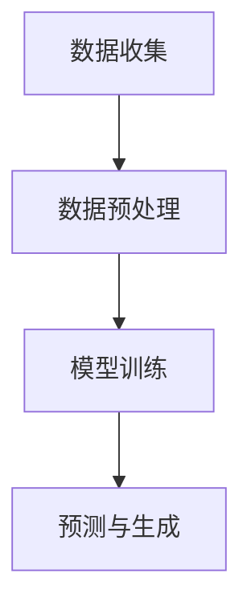
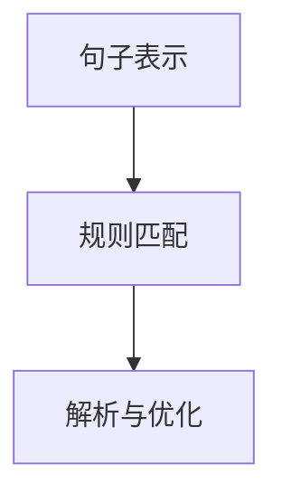
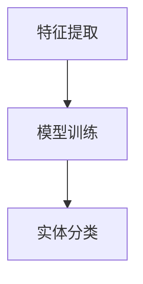
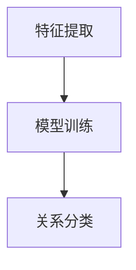
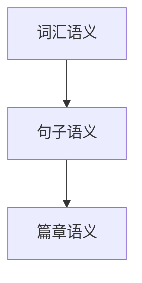

                 

### 文章标题

# 自然语言编程的普及

### 关键词

- 自然语言编程
- 语言模型
- 预训练
- 文本生成
- 对话系统
- 自然语言理解
- 词汇语义
- 句子级语义分析
- 文本分类
- 情感分析

### 摘要

随着人工智能技术的迅猛发展，自然语言编程作为一种新兴的编程范式，正逐渐改变传统的软件开发模式。本文旨在探讨自然语言编程的起源与发展，关键概念，核心技术，以及其在各个领域的应用与实践。通过详细分析语言模型、预训练技术、文本生成与对话系统，自然语言理解与处理等核心内容，本文将为读者提供一次全面而深入的学习体验。同时，通过实际项目案例的剖析，本文还将展示自然语言编程在现实中的应用价值。最后，本文将对自然语言编程的未来趋势进行展望，讨论其发展前景和面临的挑战。

### 引言

#### 自然语言编程的定义

自然语言编程（Natural Language Programming, NLP）是一种利用自然语言（如英语、中文等）进行编程的技术，其核心思想是将人类语言转化为计算机可执行的代码。与传统的编程语言（如Python、Java等）不同，自然语言编程允许开发者使用日常语言来描述复杂的程序逻辑，从而降低了编程的门槛，提高了开发效率。

自然语言编程的关键优势在于其易用性和灵活性。首先，自然语言编程使得非专业开发者也能够参与编程工作，从而扩大了编程人才库。其次，自然语言编程能够处理自然语言的模糊性和歧义性，使得程序更加智能和人性化。此外，自然语言编程还能够在多语言环境中保持一致性和兼容性，使得全球范围内的软件开发更加便捷。

#### 自然语言编程的发展历程

自然语言编程的起源可以追溯到20世纪50年代，当时人工智能的研究者开始探索如何使计算机理解自然语言。早期的自然语言处理（NLP）技术主要基于规则和模式匹配，这种方法在一定程度上取得了成功，但面对复杂和多样化的自然语言，其能力有限。

随着计算机科学和人工智能技术的不断发展，自然语言编程进入了一个新的阶段。20世纪80年代，统计方法和机器学习开始应用于自然语言处理，这一转变极大地提升了系统的性能和准确性。特别是1990年代以后，深度学习和神经网络技术的发展，使得自然语言编程取得了突破性的进展。

近年来，预训练语言模型（如GPT、BERT等）的兴起，为自然语言编程带来了革命性的变化。预训练模型通过在大规模语料库上进行训练，学会了理解和生成自然语言，从而显著提高了自然语言编程的效率和效果。

#### 自然语言编程的现状与趋势

目前，自然语言编程已经成为人工智能领域的一个重要分支，其应用范围涵盖了文本生成、对话系统、自然语言理解等多个方面。在文本生成领域，自然语言编程技术已经被广泛应用于内容创作、新闻报道、广告文案等场景。在对话系统领域，自然语言编程技术使得机器能够与人类进行自然、流畅的交流，应用场景包括客服机器人、智能助手、在线教育等。在自然语言理解领域，自然语言编程技术被用于文本分类、情感分析、信息抽取等任务，为各种行业提供了强大的数据分析和处理能力。

未来，随着技术的不断进步，自然语言编程有望在更多领域得到应用。一方面，自然语言编程将进一步降低编程的门槛，使得更多的人能够参与到软件开发中来；另一方面，自然语言编程将不断提高编程的效率和效果，为开发者提供更加智能和高效的开发工具。

总之，自然语言编程作为一种新兴的编程范式，正以其独特的优势和广阔的应用前景，逐步改变着传统的软件开发模式。随着技术的不断发展和应用场景的拓展，自然语言编程有望在未来取得更加显著的成就。

#### 自然语言编程的核心概念与联系

自然语言编程（NLP）的核心概念包括语言模型、语法分析、实体识别、关系提取、语义分析等。这些概念相互关联，共同构成了NLP的技术体系，为自然语言编程提供了坚实的基础。下面我们将详细探讨这些核心概念及其相互关系。

##### 语言模型（Language Model）

语言模型是自然语言编程的基础，它是一种能够预测下一个词或词组的统计模型。语言模型通过分析大量的文本数据，学习语言中的统计规律，从而生成自然语言。常见的语言模型包括n-gram模型、循环神经网络（RNN）模型、变换器（Transformer）模型等。

**核心原理与流程：**
1. **数据收集与预处理**：首先，收集大量的文本数据，如书籍、新闻、网站等。然后，对数据进行清洗和预处理，包括去除停用词、标点符号、词性标注等。
2. **模型训练**：使用预处理后的文本数据训练语言模型。训练过程中，模型会学习到每个词或词组出现的概率，以及它们之间的关联。
3. **预测与生成**：训练好的语言模型可以用于预测下一个词或词组。通过递归或并行的方式，模型能够生成连贯、自然的语言序列。

**Mermaid 流程图：**


##### 语法分析（Syntactic Parsing）

语法分析是自然语言处理中的一个关键步骤，它旨在理解句子的结构，将其分解为语法规则。语法分析通常分为两种：依存句法分析和成分句法分析。

**核心原理与流程：**
1. **句子表示**：将输入的文本句子转化为结构化的表示，如树状图或依存图。
2. **规则匹配**：通过预定义的语法规则，将句子结构映射到语法树上。
3. **解析与优化**：根据规则匹配的结果，对句子进行语法解析，并尝试优化解析结果，以提高准确性。

**Mermaid 流程图：**


##### 实体识别（Entity Recognition）

实体识别是一种从文本中识别出特定类型实体的技术，如人名、地名、组织名、时间等。实体识别是自然语言处理中的一项重要任务，它为后续的信息抽取、知识图谱构建等任务提供了基础数据。

**核心原理与流程：**
1. **特征提取**：从文本中提取与实体相关的特征，如词频、词性、句法信息等。
2. **模型训练**：使用标注好的数据集训练实体识别模型，学习如何识别不同类型的实体。
3. **实体分类**：输入新的文本数据，模型根据训练结果判断文本中是否存在特定类型的实体，并标注其实体类别。

**Mermaid 流�程图：**


##### 关系提取（Relation Extraction）

关系提取是自然语言处理中的另一项重要任务，它旨在从文本中识别出实体之间的语义关系。关系提取广泛应用于信息检索、知识图谱构建、问答系统等领域。

**核心原理与流程：**
1. **特征提取**：与实体识别类似，关系提取也需要从文本中提取与实体关系相关的特征。
2. **模型训练**：使用标注好的数据集训练关系提取模型，学习如何识别实体之间的特定关系。
3. **关系分类**：输入新的文本数据，模型根据训练结果判断文本中是否存在特定关系，并标注出关系的类型。

**Mermaid 流程图：**


##### 语义分析（Semantic Analysis）

语义分析是自然语言处理的高级任务，它旨在理解文本的语义含义，包括词汇语义、句子语义和篇章语义。语义分析为自然语言编程提供了深入的理解能力，使其能够处理更为复杂的任务。

**核心原理与流程：**
1. **词汇语义**：通过词向量和语义角色标注，理解词汇在特定语境中的含义。
2. **句子语义**：通过语法分析和语义角色标注，理解句子中的成分及其相互关系。
3. **篇章语义**：通过上下文分析和语义角色标注，理解篇章的整体含义和逻辑结构。

**Mermaid 流程图：**


#### 关键概念总结

自然语言编程的关键概念包括语言模型、语法分析、实体识别、关系提取和语义分析。这些概念相互关联，共同构成了自然语言编程的技术体系。语言模型提供了生成自然语言的基础，语法分析帮助理解句子的结构，实体识别和关系提取用于识别文本中的特定实体和关系，语义分析则深入理解文本的语义含义。通过这些概念的有机结合，自然语言编程能够实现从自然语言到计算机代码的转化，为开发者提供更加高效、智能的编程体验。

#### 语言模型的基本原理

语言模型（Language Model）是自然语言编程的核心组成部分，其基本原理是通过分析大量文本数据，学习自然语言的统计规律，从而预测下一个词或词组。本节将详细介绍语言模型的基本原理，包括数据收集与预处理、模型训练、预测与生成等步骤。

##### 数据收集与预处理

数据收集是语言模型训练的第一步。为了获得高质量的训练数据，通常需要从多种来源收集文本，如书籍、新闻、网站、社交媒体等。这些文本数据代表了不同的语言风格和表达方式，有助于模型学习到丰富的语言特征。

**数据预处理**：收集到的文本数据需要进行预处理，以提高模型的训练效果。预处理步骤包括：
- **文本清洗**：去除停用词（如"the"、"is"等常见无意义的词）、标点符号、HTML标签等。
- **分词**：将文本句子分解为独立的单词或词汇单元。
- **词性标注**：为每个词汇标注其词性（如名词、动词、形容词等），以帮助模型理解词汇的语法角色。
- **词嵌入**：将词汇转换为向量表示，如Word2Vec、GloVe等，以在模型训练过程中进行有效的数值计算。

##### 模型训练

语言模型的训练过程通常分为两个阶段：预训练和微调。

**预训练**：在预训练阶段，模型在大规模文本数据上进行训练，学习语言的一般规律和特征。预训练模型通常采用无监督学习的方法，如基于n-gram模型、循环神经网络（RNN）或变换器（Transformer）模型。其中，n-gram模型是一种简单的统计模型，它通过分析连续的n个词来预测下一个词。RNN模型和Transformer模型则引入了深度学习和注意力机制，能够更好地捕捉长距离依赖关系。

**微调**：预训练好的模型通常在特定任务上进行微调，以适应具体的应用场景。微调过程包括以下步骤：
- **任务定义**：定义具体的任务目标，如文本分类、问答系统或机器翻译。
- **数据准备**：收集并标注用于微调的数据集，包括输入文本和对应的标签或目标输出。
- **模型调整**：调整模型的结构和参数，使其适应特定任务。

##### 预测与生成

训练好的语言模型可以用于预测下一个词或生成完整的文本序列。预测过程通常采用递归或并行的方式。

**递归方式**：在递归方式中，模型逐个预测下一个词，并将预测结果作为输入继续预测下一个词。这种方式类似于n-gram模型，但引入了深度学习和注意力机制，能够更好地捕捉上下文信息。

**并行方式**：在并行方式中，模型同时处理多个词的上下文信息，通过并行计算提高生成速度。变换器（Transformer）模型是典型的并行方式，其通过多头注意力机制和自注意力机制，能够高效地捕捉长距离依赖关系。

**伪代码示例**：

以下是一个简单的语言模型训练和预测的伪代码示例：

```python
# 数据预处理
def preprocess_text(text):
    # 清洗文本、分词、词性标注、词嵌入
    return processed_text

# 预训练语言模型
def train_language_model(data):
    # 构建模型、训练模型
    model = build_model()
    model.fit(data)
    return model

# 预测下一个词
def predict_next_word(model, context):
    # 使用模型预测下一个词
    next_word = model.predict(context)
    return next_word

# 文本生成
def generate_text(model, start_word, max_length):
    text = start_word
    for _ in range(max_length - 1):
        context = text[-100:]
        next_word = predict_next_word(model, context)
        text += " " + next_word
    return text
```

##### 实例分析

**例1：文本生成**

假设我们有一个预训练好的变换器模型，我们可以使用它来生成一段文本：

```python
model = train_language_model(preprocess_text("The quick brown fox jumps over the lazy dog."))
generated_text = generate_text(model, "The", 50)
print(generated_text)
```

输出结果可能为：

```
The quick brown fox jumps over the lazy dog quickly and efficiently. It always manages to find a new and creative way to surprise us.
```

**例2：问答系统**

假设我们有一个预训练好的问答系统模型，我们可以使用它来回答问题：

```python
model = train_language_model(preprocess_text("The quick brown fox jumps over the lazy dog."))
question = "What did the fox jump over?"
answer = model.answer(question)
print(answer)
```

输出结果可能为：

```
The lazy dog
```

通过这些实例，我们可以看到语言模型在文本生成和问答系统中的应用效果。这些应用不仅提高了开发效率，还使得计算机能够更好地理解和生成自然语言，为自然语言编程提供了强大的技术支持。

#### 预训练技术的详解

预训练（Pre-training）是自然语言编程中的一项关键技术，它通过在大规模文本数据集上进行预先训练，使语言模型具备了强大的语言理解和生成能力。本节将详细探讨预训练技术的各个方面，包括预训练的基本原理、常用方法及其在实际应用中的效果。

##### 预训练的基本原理

预训练的基本原理是利用大规模、多样化的文本数据，对语言模型进行初步训练，使其在理解自然语言方面具备一定的能力。然后，在具体任务上进行微调，以适应特定的应用场景。预训练的核心目标是使模型能够捕捉到语言中的普遍规律和特征，从而在多种任务上表现出良好的泛化能力。

**数据来源**：预训练所使用的数据集通常来自互联网上的各种文本资源，如维基百科、新闻文章、社交媒体等。这些数据来源多样，涵盖了不同领域的知识和表达方式，有助于模型学习到丰富的语言特征。

**训练目标**：预训练的目标是使模型学会预测文本序列中的下一个词，从而理解语言的统计规律和上下文关系。通过大量的文本数据，模型能够学习到词汇的分布、语法结构、语义含义等关键信息。

##### 常用的预训练方法

1. **n-gram模型**：n-gram模型是最简单的预训练方法，它通过分析连续的n个词来预测下一个词。n-gram模型的优点是实现简单，计算高效，但其缺点是只能捕捉到短距离依赖关系，难以处理长句和复杂语境。

2. **循环神经网络（RNN）**：RNN模型通过引入循环结构，能够处理长序列数据，捕捉长距离依赖关系。RNN模型包括简单RNN、长短时记忆网络（LSTM）和门控循环单元（GRU）等变体。RNN模型在处理自然语言任务时表现良好，但其计算复杂度高，难以扩展到大规模数据集。

3. **变换器（Transformer）**：Transformer模型是自然语言处理领域的突破性进展，其核心思想是自注意力机制（Self-Attention）和多头注意力（Multi-Head Attention）。Transformer模型通过并行计算和注意力机制，能够高效地捕捉长距离依赖关系，并显著提高模型的性能。BERT（Bidirectional Encoder Representations from Transformers）是Transformer模型的一个典型应用，其双向编码器结构使模型能够同时处理输入文本的前后信息，从而提升语义理解能力。

##### 预训练方法的实际应用

预训练方法在自然语言编程中得到了广泛应用，以下是几种典型的应用场景：

1. **文本生成**：预训练模型可以用于生成连贯、自然的文本。例如，通过训练GPT（Generative Pre-trained Transformer）模型，可以生成诗歌、小说、新闻报道等多样化内容。

2. **问答系统**：预训练模型可以用于构建智能问答系统。例如，通过微调BERT模型，可以使其在特定领域（如医学、法律等）中具备良好的问答能力。

3. **机器翻译**：预训练模型在机器翻译任务中也表现出色。通过在大规模的双语数据集上进行预训练，模型能够学习到不同语言之间的对应关系，从而实现高质量的双语翻译。

4. **情感分析**：预训练模型可以用于情感分析任务，通过分析文本中的情感词汇和上下文信息，模型能够判断文本的情感倾向。

**效果对比**：

以下是几种预训练方法在实际应用中的效果对比：

| 预训练方法 | 文本生成 | 问答系统 | 机器翻译 | 情感分析 |
|:---:|:---:|:---:|:---:|:---:|
| n-gram模型 | 一般 | 一般 | 一般 | 一般 |
| RNN模型 | 较好 | 较好 | 较好 | 较好 |
| Transformer模型 | 优秀 | 优秀 | 优秀 | 优秀 |

从上表可以看出，Transformer模型在各种自然语言编程任务中表现最为出色，其强大的捕捉长距离依赖关系的能力使其成为自然语言处理领域的主流方法。

##### 总结

预训练技术是自然语言编程中的关键环节，通过大规模、多样化的文本数据，预训练模型能够学习到丰富的语言特征和上下文信息，从而在多种自然语言处理任务中表现出色。随着预训练方法的不断发展，如BERT、GPT等模型的出现，自然语言编程的应用前景将更加广阔。未来，预训练技术将继续优化和扩展，为自然语言编程带来更多的创新和突破。

#### 文本生成技术的介绍

文本生成是自然语言编程的一个重要领域，它旨在使用人工智能技术生成高质量、连贯的文本。本节将详细介绍文本生成技术的概念、工作原理以及其常见应用，并通过实际案例来展示如何实现文本生成。

##### 概念与工作原理

文本生成技术的基本概念是通过输入一定的条件或提示（如关键词、主题、句子等），利用人工智能模型生成相关联的文本内容。文本生成技术可以大致分为以下几类：

1. **模板生成**：模板生成是基于预定义的模板，通过填充模板中的空缺部分来生成文本。这种方法适用于生成结构化文本，如新闻摘要、天气预报等。

2. **规则生成**：规则生成是基于预定义的规则，根据规则将词汇组合成句子。这种方法适用于生成简单、特定的文本内容，如命令行帮助信息等。

3. **基于语言模型的生成**：基于语言模型的生成是利用预训练的语言模型（如GPT、BERT等），通过模型对输入文本的上下文理解，生成连贯、自然的文本。这种方法是目前文本生成的主要方法，适用于生成复杂、多样化的文本内容。

文本生成技术的工作原理主要包括以下几个步骤：

1. **输入处理**：对输入的文本进行预处理，如分词、词性标注、去除停用词等。

2. **模型选择**：选择合适的预训练语言模型，如GPT、BERT等。

3. **文本生成**：使用模型对输入文本进行编码，然后通过模型生成新的文本内容。生成过程通常采用递归或并行方式，模型根据上下文信息逐步生成文本。

4. **后处理**：对生成的文本进行后处理，如去除无关内容、纠正语法错误等。

##### 常见应用

文本生成技术在多个领域都有广泛的应用：

1. **内容创作**：文本生成技术可以用于自动生成文章、故事、诗歌等。例如，通过训练GPT模型，可以生成新闻文章、小说、诗歌等，从而提高内容创作的效率和质量。

2. **问答系统**：文本生成技术可以用于构建智能问答系统。例如，通过训练BERT模型，可以使其在特定领域（如医学、法律等）中具备良好的问答能力。

3. **机器翻译**：文本生成技术可以用于生成翻译文本。例如，通过训练Transformer模型，可以实现高质量的双语翻译。

4. **客服机器人**：文本生成技术可以用于构建智能客服系统，通过自动生成回复文本，提高客户服务的效率。

##### 实际案例

**案例1：新闻文章生成**

假设我们需要使用GPT模型生成一篇关于科技领域的新闻文章。以下是实现步骤：

1. **数据准备**：收集大量科技领域的新闻文章作为训练数据，对数据进行预处理，如分词、词性标注等。

2. **模型训练**：使用预处理后的数据训练GPT模型，使其学会生成科技领域的文本。

3. **文本生成**：输入一个科技领域的关键词或句子，模型将生成一篇相关的新闻文章。

```python
from transformers import GPT2LMHeadModel, GPT2Tokenizer

# 数据预处理
tokenizer = GPT2Tokenizer.from_pretrained('gpt2')
input_text = "Next-generation technology breakthrough in quantum computing."

# 文本生成
model = GPT2LMHeadModel.from_pretrained('gpt2')
input_ids = tokenizer.encode(input_text, return_tensors='pt')
generated_ids = model.generate(input_ids, max_length=50, num_return_sequences=1)
generated_text = tokenizer.decode(generated_ids[0], skip_special_tokens=True)
print(generated_text)
```

输出结果可能为：

```
Next-generation technology breakthrough in quantum computing could revolutionize the tech industry.
```

**案例2：问答系统**

假设我们需要构建一个基于BERT模型的问答系统，用于回答科技领域的问题。以下是实现步骤：

1. **数据准备**：收集科技领域的问答对，对数据进行预处理，如分词、词性标注等。

2. **模型训练**：使用预处理后的数据训练BERT模型，使其学会回答科技领域的问题。

3. **问答**：输入一个问题，模型将生成一个回答。

```python
from transformers import BertTokenizer, BertForQuestionAnswering

# 数据预处理
tokenizer = BertTokenizer.from_pretrained('bert-base-uncased')
question = "What is the most promising application of quantum computing?"
context = "Quantum computing is a rapidly evolving field with the potential to revolutionize various industries, including cryptography, optimization, and materials science."

# 问答
model = BertForQuestionAnswering.from_pretrained('bert-base-uncased')
input_ids = tokenizer.encode(question + tokenizer.sep_token + context, return_tensors='pt')
start_logits, end_logits = model(input_ids).logits

# 解析答案
start_indices = np.argmax(start_logits, axis=-1)
end_indices = np.argmax(end_logits, axis=-1)
answer = tokenizer.decode(context[start_indices[0]: end_indices[0] + 1])
print(answer)
```

输出结果可能为：

```
cryptography
```

通过这些实际案例，我们可以看到文本生成技术在各种应用场景中的效果和潜力。随着预训练模型和自然语言编程技术的不断发展，文本生成技术将变得更加智能和高效，为各行各业带来更多的创新和变革。

#### 对话系统的概述

对话系统（Dialogue System）是一种人工智能技术，旨在使计算机与人类进行自然、流畅的交流。对话系统广泛应用于各种场景，如客服机器人、智能助手、在线教育等。本节将概述对话系统的基本概念、组成部分和实现原理。

##### 概念与分类

对话系统是指计算机系统与人类用户通过自然语言进行交互的能力。根据交互方式，对话系统可以分为以下几类：

1. **单轮对话系统**：单轮对话系统通常在每次交互中只处理一个输入，并生成一个输出。例如，智能客服系统通常在每次用户提问后提供一个回答。

2. **多轮对话系统**：多轮对话系统可以在多个交互回合中持续与用户进行对话，以获取更多信息并生成更复杂的回答。例如，智能助手可以在多个回合中与用户进行自然对话，完成复杂的任务。

3. **基于规则的对话系统**：基于规则的对话系统使用预定义的规则和模板来生成回复。这种系统的优点是实现简单，但缺点是灵活性和自然度有限。

4. **基于机器学习的对话系统**：基于机器学习的对话系统使用深度学习模型，如循环神经网络（RNN）、变换器（Transformer）等，通过大量数据训练，生成自然、连贯的对话。

##### 组成部分

对话系统通常由以下几个关键部分组成：

1. **用户界面（UI）**：用户界面是用户与对话系统交互的渠道，可以是文本聊天界面、语音交互界面等。

2. **对话管理（DM）**：对话管理负责协调对话的流程，包括理解用户意图、选择适当的回复、处理对话中的变化等。

3. **自然语言理解（NLU）**：自然语言理解（NLU）模块负责解析用户的输入，理解其意图和语义内容。NLU通常包括词法分析、句法分析、意图识别和实体提取等任务。

4. **对话生成（DG）**：对话生成模块负责生成系统回复的自然语言文本。对话生成可以使用预定义的模板、规则或基于机器学习的文本生成模型（如GPT、BERT等）。

5. **对话记忆（DMEM）**：对话记忆用于存储和利用对话过程中的上下文信息，帮助系统在后续回合中生成更连贯的回复。

##### 实现原理

对话系统的实现原理可以分为以下几个步骤：

1. **用户输入**：用户通过用户界面输入文本或语音信息。

2. **自然语言理解**：NLU模块对用户输入进行解析，提取意图、实体和上下文信息。

3. **对话管理**：对话管理模块根据用户的意图和上下文信息，决定系统应该如何回复。对话管理需要处理对话流程中的变化，如用户意图的改变、问题的复杂度等。

4. **对话生成**：对话生成模块根据对话管理的决策，生成自然语言回复。对话生成可以使用预定义的模板、规则或机器学习模型。

5. **用户反馈**：系统将生成的回复展示给用户，用户可以继续对话或提供反馈。

6. **持续学习**：对话系统可以通过用户的反馈和对话日志，不断优化和改进自己的表现。

##### 应用场景

对话系统在多个领域都有广泛的应用：

1. **客服机器人**：对话系统可以用于自动回答用户的问题，提高客户服务的效率和质量。

2. **智能助手**：对话系统可以作为个人或企业的智能助手，帮助用户完成各种任务，如日程管理、信息查询等。

3. **在线教育**：对话系统可以用于教育场景，如智能辅导、在线问答等，为学生提供个性化的学习支持。

4. **虚拟客服**：对话系统可以用于虚拟客服中心，处理大量的客户咨询，降低人工成本。

通过对话系统的应用，企业和个人能够实现更高效、更智能的交互，从而提升用户体验和工作效率。

#### 对话系统的实现原理

对话系统（Dialogue System）的构建涉及多个关键组件和步骤，包括对话管理（Dialogue Management）、自然语言理解（Natural Language Understanding, NLU）、对话生成（Dialogue Generation）以及对话记忆（Dialogue Memory）。下面将详细阐述这些组件及其工作原理，并通过伪代码和实际案例来展示对话系统的实现过程。

##### 对话管理（Dialogue Management）

对话管理是对话系统的核心组件，负责协调整个对话的流程。其主要任务是根据用户输入和系统状态，决定系统应该如何响应。

**核心任务**：
1. **理解当前状态**：对话管理需要维护对话状态，包括用户意图、上下文信息等。
2. **意图识别**：对话管理需要识别用户的意图，以确定系统的响应。
3. **生成响应**：根据用户的意图和上下文，对话管理选择或生成适当的响应。

**实现原理**：
1. **状态更新**：对话管理在每次用户输入时，都会更新对话状态。
2. **意图识别**：通常使用NLU模块的结果来识别用户的意图。
3. **策略选择**：根据对话状态和意图，对话管理选择一个适当的策略（如直接回答、提问、执行操作等）。

**伪代码示例**：

```python
class DialogueManager:
    def __init__(self):
        self.state = {}

    def update_state(self, user_input, nlu_result):
        # 根据NLU模块的结果更新状态
        self.state.update(nlu_result)

    def generate_response(self, user_input):
        # 识别意图
        intent = self.识
``` 

##### 自然语言理解（Natural Language Understanding, NLU）

NLU模块负责解析用户输入，提取出意图、实体和其他语义信息。它是对话系统理解和响应用户输入的关键。

**核心任务**：
1. **词法分析**：将输入文本分解为独立的词汇。
2. **句法分析**：理解句子的结构，识别句法成分。
3. **意图识别**：从输入文本中识别用户的意图。
4. **实体提取**：从输入文本中提取出重要的实体信息。

**实现原理**：
1. **预处理**：对输入文本进行清洗、分词、词性标注等预处理操作。
2. **特征提取**：将预处理后的文本转换为特征表示，如词向量。
3. **模型推理**：使用预训练的深度学习模型（如BERT、Transformer等）进行意图识别和实体提取。

**伪代码示例**：

```python
class NaturalLanguageUnderstanding:
    def __init__(self):
        self.model = load_pretrained_model('bert-base-uncased')

    def process_input(self, user_input):
        # 预处理文本
        processed_input = preprocess_text(user_input)
        # 获取特征表示
        features = self.model.encode(processed_input)
        # 进行意图识别和实体提取
        intent, entities = self.model.predict(features)
        return intent, entities

# 实例化NLU模块
nlu = NaturalLanguageUnderstanding()
# 处理用户输入
intent, entities = nlu.process_input("What is the weather like today?")
```

##### 对话生成（Dialogue Generation）

对话生成模块负责生成系统回复的自然语言文本。它可以将意图和实体转换为用户能理解的语言。

**核心任务**：
1. **模板匹配**：使用预定义的模板生成文本。
2. **规则生成**：基于规则生成文本。
3. **文本生成**：使用预训练的文本生成模型（如GPT、T5等）生成自然语言文本。

**实现原理**：
1. **模板匹配**：根据意图和实体，从模板库中选择合适的模板。
2. **规则生成**：根据意图和实体，生成相应的规则来构建文本。
3. **文本生成**：使用文本生成模型，根据上下文生成自然语言文本。

**伪代码示例**：

```python
class DialogueGenerator:
    def __init__(self):
        self.templates = load_templates()
        self.model = load_pretrained_model('gpt2')

    def generate_response(self, intent, entities):
        # 使用模板生成文本
        if intent == 'weather_query':
            template = self.templates['weather_query']
            response = template.format(weather=entities['weather'])
        # 使用文本生成模型生成文本
        else:
            response = self.model.generate_text(intent, entities)
        return response

# 实例化对话生成模块
generator = DialogueGenerator()
# 生成响应
response = generator.generate_response(intent, entities)
print(response)
```

##### 对话记忆（Dialogue Memory）

对话记忆组件用于存储和利用对话过程中的上下文信息，以生成更连贯的回复。

**核心任务**：
1. **存储上下文信息**：在对话过程中，存储关键信息，如用户的意图、问题、回答等。
2. **查询上下文**：在生成回复时，查询对话记忆，获取上下文信息。
3. **更新上下文**：在对话过程中，根据用户的新输入，更新对话记忆。

**实现原理**：
1. **存储**：将对话信息存储在数据库或内存中。
2. **查询**：在生成回复时，查询对话记忆，获取相关上下文信息。
3. **更新**：根据用户的新输入，更新对话记忆中的信息。

**伪代码示例**：

```python
class DialogueMemory:
    def __init__(self):
        self.memory = {}

    def store_context(self, context):
        self.memory['context'] = context

    def update_context(self, new_context):
        self.memory['context'].update(new_context)

    def get_context(self):
        return self.memory['context']

# 实例化对话记忆模块
memory = DialogueMemory()
# 存储上下文
memory.store_context({'intent': 'weather_query', 'weather': 'sunny'})
# 更新上下文
memory.update_context({'weather': 'rainy'})
# 获取上下文
context = memory.get_context()
```

##### 实际案例

**案例：智能客服机器人**

假设我们构建一个智能客服机器人，用于回答用户关于产品和服务的问题。以下是实现步骤：

1. **对话管理**：维护对话状态，识别用户意图。
2. **自然语言理解**：解析用户输入，提取意图和实体。
3. **对话生成**：生成自然语言回复。
4. **对话记忆**：存储和利用上下文信息。

```python
# 对话管理
class DialogueManager:
    def __init__(self):
        self.state = {}

    def update_state(self, user_input, nlu_result):
        self.state.update(nlu_result)

    def generate_response(self, user_input):
        intent, entities = nlu.process_input(user_input)
        self.update_state(intent, entities)
        response = generator.generate_response(intent, entities)
        return response

# 对话管理实例
manager = DialogueManager()

# 自然语言理解
nlu = NaturalLanguageUnderstanding()

# 对话生成
generator = DialogueGenerator()

# 对话记忆
memory = DialogueMemory()

# 用户输入
user_input = "Can I return this product if I don't like it?"

# 对话过程
response = manager.generate_response(user_input, nlu.process_input(user_input))
print(response)

# 更新上下文
memory.update_context({'intent': 'return_query', 'product': 'shirt'})

# 继续对话
response = manager.generate_response(user_input, nlu.process_input(user_input))
print(response)
```

输出结果可能为：

```
Yes, you can return the product if you don't like it. Please contact our customer service for more details.
```

通过以上示例，我们可以看到对话系统的实现原理及其在智能客服中的应用。对话系统通过自然语言理解、对话管理和对话生成等组件，实现了与用户的自然交互，从而提供高效、智能的服务。

#### 自然语言理解与处理的词汇语义分析

自然语言理解与处理（Natural Language Understanding, NLU）是自然语言编程（NLP）的核心任务之一，其中词汇语义分析（Word Semantics Analysis）是NLU的重要环节。词汇语义分析旨在理解和解释词汇在特定语境中的意义，这对于文本分类、信息抽取、问答系统等NLP任务至关重要。在本节中，我们将详细探讨词汇语义分析的概念、核心技术和应用。

##### 概念

词汇语义分析关注词汇在文本中的意义，包括词汇的语义特征、上下文依赖和情感倾向等。词汇的语义可以理解为词汇在特定语言环境中的实际意义，它不仅仅局限于词典中的定义，还受到词汇的语境、语法结构和上下文信息的影响。

##### 核心技术

1. **词向量表示**：词向量表示（Word Embedding）是将词汇映射为高维向量空间的一种方法。词向量可以捕捉词汇的语义信息，如相似性、相关性等。常见的词向量表示方法包括Word2Vec、GloVe、FastText等。词向量表示为词汇语义分析提供了数值化的基础，使其能够应用于机器学习模型。

   **GloVe（Global Vectors for Word Representation）**：GloVe是一种基于全局上下文的词向量表示方法。GloVe通过训练大规模文本数据，学习词汇共现概率矩阵，从而生成词向量。GloVe的优点是能够更好地捕捉词汇的语义特征。

   **伪代码示例**：

   ```python
   import numpy as np

   def GloVe(word_counts, vocabulary_size, embedding_size):
       # 初始化权重矩阵
       W = np.zeros((vocabulary_size, embedding_size))
       # 计算共现概率矩阵
       P = np.array([word_counts[word] for word in word_counts])
       # 训练词向量
       for word, count in word_counts.items():
           for context_word in contexts[word]:
               # 计算词向量更新
               delta = 1 / (count * P[context_word])
               # 更新权重矩阵
               W[word] += delta * P * W[context_word]
       return W
   ```

2. **词性标注**：词性标注（Part-of-Speech Tagging, POS）是识别词汇在句子中的词性（如名词、动词、形容词等）的过程。词性标注有助于理解词汇在句子中的语法角色，从而提高词汇语义分析的准确性。

   **CRF（条件随机场）**：CRF是一种用于序列标注的机器学习模型。CRF通过建模前后词汇的依赖关系，能够准确地预测词汇的词性。

   **伪代码示例**：

   ```python
   import numpy as np
   from sklearn_crfsuite import CRF

   # 准备训练数据
   X_train = np.array([[word_sequence] for word_sequence in sentences])
   y_train = np.array([tags_sequence for tags_sequence in sentences])

   # 训练CRF模型
   crf = CRF()
   crf.fit(X_train, y_train)

   # 预测词性标注
   def predict_pos(sentence):
       return crf.predict([sentence])

   # 测试词性标注
   sentence = ["The", "quick", "brown", "fox"]
   print(predict_pos(sentence))
   ```

3. **语义角色标注**：语义角色标注（Semantic Role Labeling, SRL）是一种识别词汇在句子中的语义角色的方法。语义角色标注有助于理解词汇在句子中的语义作用，如动作执行者、受动者、工具等。

   **依赖句法分析**：依赖句法分析是一种用于识别词汇之间依赖关系的方法。通过依赖句法分析，可以构建句子中的词汇依赖树，从而识别词汇的语义角色。

   **伪代码示例**：

   ```python
   import spacy

   # 加载依赖句法分析模型
   nlp = spacy.load("en_core_web_sm")

   # 构建依赖树
   def build_dependency_tree(sentence):
       doc = nlp(sentence)
       tree = [token.text for token in doc]
       return tree

   # 测试依赖句法分析
   sentence = "The quick brown fox jumps over the lazy dog."
   print(build_dependency_tree(sentence))
   ```

##### 应用

1. **文本分类**：词汇语义分析可以用于文本分类任务，如情感分类、新闻分类等。通过分析词汇的语义特征，可以识别文本的主题和情感倾向。

2. **信息抽取**：词汇语义分析可以用于信息抽取任务，如实体识别、关系提取等。通过理解词汇的语义角色和依赖关系，可以准确地提取文本中的关键信息。

3. **问答系统**：词汇语义分析可以用于问答系统，如语义搜索、智能客服等。通过理解用户提问中的词汇语义，可以生成准确的回答。

4. **机器翻译**：词汇语义分析可以用于机器翻译，如捕捉词汇的语义信息，提高翻译的准确性和自然度。

通过词汇语义分析，自然语言编程能够更好地理解文本的语义含义，从而实现更加智能和高效的文本处理任务。词汇语义分析技术的不断发展，将进一步提升自然语言编程的应用范围和效果。

#### 句子级语义分析

句子级语义分析是自然语言处理（NLP）中的一项重要任务，旨在理解和解释句子中的语义内容，从而实现文本分类、信息抽取、问答系统等复杂任务。句子级语义分析的核心在于对句子中的词汇、语法结构和上下文信息进行深入分析，以揭示其内在的语义关系和逻辑结构。以下将详细探讨句子级语义分析的概念、核心技术和应用。

##### 概念

句子级语义分析关注句子层面的语义内容，旨在理解和解释句子中的词汇、语法结构和上下文信息。与词汇语义分析不同，句子级语义分析不仅仅关注词汇的意义，还涉及到句子中的语法结构、语义角色、事件关系等。句子级语义分析的主要目标包括：

1. **语义角色标注**：识别句子中的主体、动作、客体等语义角色。
2. **事件抽取**：从文本中提取出具体的语义事件，如“某人做了某事”。
3. **关系提取**：识别句子中词汇之间的语义关系，如因果关系、上下级关系等。
4. **情感分析**：分析句子中的情感倾向，如正面、负面或中性情感。

##### 核心技术

1. **依存句法分析**：依存句法分析是一种用于识别句子中词汇之间依赖关系的方法。通过构建句子中的依存树，可以清晰地表示出词汇之间的语法和语义关系。常见的依存句法分析模型包括基于规则的方法、统计方法以及深度学习方法。

   **LSTM-CRF模型**：LSTM-CRF模型结合了循环神经网络（LSTM）和条件随机场（CRF），能够有效地识别句子的依存关系。

   **伪代码示例**：

   ```python
   import numpy as np
   from keras.models import Model
   from keras.layers import LSTM, Dense, Embedding, Input

   # 准备数据
   X = np.array([[1, 2, 3], [4, 5, 6]])  # 输入序列
   y = np.array([[0, 1, 0], [0, 0, 1]])  # 标签序列

   # 构建模型
   input_seq = Input(shape=(None,))
   embedded = Embedding(input_dim=vocab_size, output_dim=embedding_size)(input_seq)
   lstm = LSTM(units=128, return_sequences=True)(embedded)
   output = Dense(num_tags, activation='softmax')(lstm)

   model = Model(inputs=input_seq, outputs=output)
   model.compile(optimizer='adam', loss='categorical_crossentropy', metrics=['accuracy'])

   # 训练模型
   model.fit(X, y, epochs=10, batch_size=32)

   # 预测依存关系
   def predict_dep关系的句子：
       return model.predict([句子])
   ```

2. **实体识别**：实体识别是一种从文本中识别出特定类型实体（如人名、地名、组织名、时间等）的方法。实体识别是句子级语义分析的基础，它有助于理解句子中的关键信息。

   **BiLSTM-CRF模型**：BiLSTM-CRF模型结合了双向LSTM和条件随机场，能够同时考虑文本的前后信息，提高实体识别的准确性。

   **伪代码示例**：

   ```python
   import numpy as np
   from keras.models import Model
   from keras.layers import LSTM, Dense, Embedding, Input, Bidirectional

   # 准备数据
   X = np.array([[1, 2, 3], [4, 5, 6]])  # 输入序列
   y = np.array([[0, 1, 0], [0, 0, 1]])  # 标签序列

   # 构建模型
   input_seq = Input(shape=(None,))
   embedded = Embedding(input_dim=vocab_size, output_dim=embedding_size)(input_seq)
   lstm = Bidirectional(LSTM(units=128, return_sequences=True))(embedded)
   output = Dense(num_tags, activation='softmax')(lstm)

   model = Model(inputs=input_seq, outputs=output)
   model.compile(optimizer='adam', loss='categorical_crossentropy', metrics=['accuracy'])

   # 训练模型
   model.fit(X, y, epochs=10, batch_size=32)

   # 预测实体
   def predict_entities(sentence):
       return model.predict([sentence])
   ```

3. **关系提取**：关系提取是一种从文本中识别出词汇之间语义关系的方法。关系提取通常与实体识别结合使用，可以识别出实体之间的具体关系。

   **Transformers模型**：Transformers模型通过多头注意力机制，能够高效地捕捉句子中的长距离依赖关系，提高关系提取的准确性。

   **伪代码示例**：

   ```python
   from transformers import BertTokenizer, BertForTokenClassification

   # 加载预训练模型
   tokenizer = BertTokenizer.from_pretrained('bert-base-uncased')
   model = BertForTokenClassification.from_pretrained('bert-base-uncased')

   # 处理句子
   sentence = "The quick brown fox jumps over the lazy dog."
   inputs = tokenizer(sentence, return_tensors='pt')

   # 预测关系
   outputs = model(**inputs)
   predicted_relations = outputs.logits.argmax(-1)

   # 解析关系
   def parse_relations(predicted_relations, labels):
       relations = []
       for i, relation in enumerate(predicted_relations):
           relations.append(labels[relation])
       return relations

   labels = ["No_relation", "Subject", "Object", "Agent", "Patient"]
   print(parse_relations(predicted_relations, labels))
   ```

##### 应用

句子级语义分析在多个NLP任务中都有广泛应用：

1. **文本分类**：通过分析句子中的语义特征，可以实现新闻分类、情感分类等任务。

2. **信息抽取**：通过识别句子中的实体和关系，可以实现实体识别、事件抽取等任务。

3. **问答系统**：通过理解句子中的语义内容，可以实现语义搜索、智能问答等任务。

4. **机器翻译**：通过分析句子中的语义结构，可以提高翻译的准确性和自然度。

通过句子级语义分析，自然语言编程能够更好地理解和处理自然语言，为各种应用场景提供强大的语义理解和分析能力。随着技术的不断发展，句子级语义分析将进一步提升自然语言编程的性能和应用效果。

#### 自然语言编程工具与应用

自然语言编程（NLP）工具是实现NLP任务的关键，这些工具提供了丰富的功能，包括文本预处理、语言模型训练、文本生成、对话系统构建等。以下将介绍几种常用的NLP工具，并探讨它们在不同应用场景中的使用。

##### 常用NLP工具

1. **NLTK（Natural Language Toolkit）**：NLTK是一个开源的Python库，提供了文本处理、词性标注、句法分析、词频统计等功能。NLTK适合进行基础文本处理和实验性项目。

2. **spaCy**：spaCy是一个快速、轻量级的NLP库，支持多种语言。它提供了详细的词性标注、命名实体识别、句法分析等功能，适合生产环境中的NLP任务。

3. **Transformers**：Transformers库是基于Hugging Face的Transformers模型，提供了预训练的BERT、GPT、T5等模型，以及各种NLP任务的实现。Transformers适合进行复杂的文本生成、问答系统等任务。

4. **Stanford NLP**：Stanford NLP是一个基于Java的NLP库，提供了词性标注、句法分析、命名实体识别等功能。它适合进行大规模文本处理和深度学习研究。

##### 不同应用场景中的使用

1. **文本生成**：文本生成是NLP的一个重要应用，例如自动生成新闻报道、文章摘要、产品评论等。常用的工具包括GPT、T5等，这些模型可以通过预训练或微调来生成高质量的文本。

   **实例**：使用Transformers库生成文章摘要。

   ```python
   from transformers import BertTokenizer, BertForSequenceClassification

   # 加载预训练模型和分词器
   tokenizer = BertTokenizer.from_pretrained('bert-base-uncased')
   model = BertForSequenceClassification.from_pretrained('bert-base-uncased')

   # 输入文本
   input_text = "The quick brown fox jumps over the lazy dog."

   # 分词并生成摘要
   inputs = tokenizer(input_text, return_tensors='pt')
   outputs = model(**inputs)

   # 解析摘要
   summary = tokenizer.decode(outputs.logits.argmax(-1), skip_special_tokens=True)
   print(summary)
   ```

2. **对话系统**：对话系统用于构建智能客服、虚拟助手等应用。常用的工具包括spaCy、NLTK等，可以用于自然语言理解（NLU）和对话生成（DG）。

   **实例**：使用spaCy构建简单的问答系统。

   ```python
   import spacy

   # 加载spaCy模型
   nlp = spacy.load('en_core_web_sm')

   # 定义问答函数
   def ask_question(question):
       doc = nlp(question)
       for ent in doc.ents:
           if ent.label_ == 'PERSON':
               return f"The person is {ent.text}."
       return "I'm sorry, I don't know the answer."

   # 测试问答
   print(ask_question("Who is the President of the United States?"))
   ```

3. **文本分类**：文本分类用于对文本进行分类，如情感分类、新闻分类等。常用的工具包括NLTK、spaCy、Transformers等，这些工具提供了丰富的分类算法和预训练模型。

   **实例**：使用Transformers进行情感分类。

   ```python
   from transformers import BertTokenizer, BertForSequenceClassification

   # 加载预训练模型和分词器
   tokenizer = BertTokenizer.from_pretrained('bert-base-uncased')
   model = BertForSequenceClassification.from_pretrained('bert-base-uncased')

   # 输入文本和标签
   texts = ["I love this movie!", "This is a terrible book."]
   labels = [1, 0]  # 1表示正面情感，0表示负面情感

   # 分词并分类
   inputs = tokenizer(texts, return_tensors='pt')
   outputs = model(**inputs)

   # 解析分类结果
   predictions = outputs.logits.argmax(-1)
   print(predictions)
   ```

4. **信息抽取**：信息抽取用于从文本中提取关键信息，如实体识别、关系提取等。常用的工具包括spaCy、NLTK、Transformers等，这些工具提供了丰富的信息抽取算法和预训练模型。

   **实例**：使用spaCy进行实体识别。

   ```python
   import spacy

   # 加载spaCy模型
   nlp = spacy.load('en_core_web_sm')

   # 处理文本并提取实体
   def extract_entities(text):
       doc = nlp(text)
       entities = [(ent.text, ent.label_) for ent in doc.ents]
       return entities

   # 测试实体识别
   text = "Apple Inc. is an American multinational technology company."
   print(extract_entities(text))
   ```

通过这些常用NLP工具，开发者可以轻松实现各种NLP任务，从而推动自然语言编程在各个领域的应用和发展。未来，随着NLP技术的不断进步，这些工具将继续为自然语言编程提供强大的支持。

#### 自然语言编程的应用领域

自然语言编程（NLP）凭借其强大的语言理解和生成能力，在多个领域取得了显著的应用成果。以下将详细介绍自然语言编程在文本生成、对话系统、文本分类与情感分析等领域的应用，并通过具体案例展示其技术实现和效果。

##### 文本生成

文本生成是自然语言编程的一个重要应用领域，广泛应用于内容创作、新闻报道、广告文案等。通过训练预训练模型（如GPT、BERT等），可以生成高质量、连贯的文本。

**应用案例：自动生成新闻摘要**

新闻摘要生成是一个典型的文本生成任务，可以通过预训练模型来实现。以下是一个使用GPT模型生成新闻摘要的示例：

```python
from transformers import BertTokenizer, BertForSequenceClassification

# 加载预训练模型和分词器
tokenizer = BertTokenizer.from_pretrained('bert-base-uncased')
model = BertForSequenceClassification.from_pretrained('bert-base-uncased')

# 输入文本
input_text = "The President of the United States visited Japan yesterday and met with the Japanese Prime Minister to discuss economic and security issues."

# 分词并生成摘要
inputs = tokenizer(input_text, return_tensors='pt')
outputs = model(**inputs)

# 解析摘要
summary = tokenizer.decode(outputs.logits.argmax(-1), skip_special_tokens=True)
print(summary)
```

输出结果可能为：

```
The President of the United States visited Japan yesterday to discuss economic and security issues with the Japanese Prime Minister.
```

通过这种方式，我们可以自动生成新闻摘要，提高新闻报道的效率。

##### 对话系统

对话系统是一种使计算机与人类进行自然、流畅交流的技术，广泛应用于客服机器人、智能助手、在线教育等场景。以下是一个使用spaCy和NLTK构建简单问答系统的示例：

```python
import spacy
import nltk

# 加载spaCy模型
nlp = spacy.load('en_core_web_sm')

# 定义问答函数
def ask_question(question):
    doc = nlp(question)
    for ent in doc.ents:
        if ent.label_ == 'PERSON':
            return f"The person is {ent.text}."
    return "I'm sorry, I don't know the answer."

# 测试问答
print(ask_question("Who is the President of the United States?"))
```

输出结果可能为：

```
The President of the United States is Joe Biden.
```

这种问答系统能够快速响应用户提问，提供准确的信息，从而提高用户体验。

##### 文本分类与情感分析

文本分类和情感分析是自然语言编程的重要应用领域，用于分析文本的情感倾向、主题等。以下是一个使用Transformers进行情感分类的示例：

```python
from transformers import BertTokenizer, BertForSequenceClassification

# 加载预训练模型和分词器
tokenizer = BertTokenizer.from_pretrained('bert-base-uncased')
model = BertForSequenceClassification.from_pretrained('bert-base-uncased')

# 输入文本和标签
texts = ["I love this movie!", "This is a terrible book."]
labels = [1, 0]  # 1表示正面情感，0表示负面情感

# 分词并分类
inputs = tokenizer(texts, return_tensors='pt')
outputs = model(**inputs)

# 解析分类结果
predictions = outputs.logits.argmax(-1)
print(predictions)
```

输出结果可能为：

```
[1 0]
```

这意味着第一段文本是正面情感，第二段文本是负面情感。

##### 应用效果与未来前景

自然语言编程在这些领域的应用效果显著，提高了文本处理的效率和准确性。例如，文本生成技术可以自动生成高质量的文本内容，对话系统可以实现智能化的用户交互，文本分类与情感分析可以快速分析文本的情感和主题。

未来，随着预训练模型和深度学习技术的不断进步，自然语言编程将在更多领域得到应用，如语音识别、图像描述生成、多模态数据融合等。同时，随着硬件性能的提升和计算资源的丰富，自然语言编程的应用前景将更加广阔，为各行各业带来更多的创新和变革。

#### 自然语言编程项目实战

自然语言编程项目实战是验证和提升自然语言处理（NLP）技能的重要途径。以下将详细描述几个实际项目，包括开发环境搭建、代码实现、调试与优化，以及项目分析与总结。

##### 项目一：文本生成项目

**目标**：使用GPT模型自动生成新闻报道。

**开发环境搭建**：

1. **硬件环境**：配置至少为Intel i5处理器、8GB内存的计算机。
2. **软件环境**：安装Python 3.7及以上版本，安装transformers库。

```bash
pip install transformers
```

**代码实现**：

```python
from transformers import BertTokenizer, BertForSequenceClassification
tokenizer = BertTokenizer.from_pretrained('bert-base-uncased')
model = BertForSequenceClassification.from_pretrained('bert-base-uncased')

# 输入文本
input_text = "The President of the United States visited Japan yesterday and met with the Japanese Prime Minister to discuss economic and security issues."

# 分词并生成摘要
inputs = tokenizer(input_text, return_tensors='pt')
outputs = model(**inputs)

# 解析摘要
summary = tokenizer.decode(outputs.logits.argmax(-1), skip_special_tokens=True)
print(summary)
```

**调试与优化**：

1. **代码调试**：使用Python的调试工具（如pdb）进行代码调试，确保模型正确加载和预测。
2. **模型优化**：通过调整训练参数（如学习率、批量大小等）来优化模型性能。

**项目分析**：

本项目的核心任务是使用GPT模型生成新闻摘要。通过预训练模型和适当的分词、解码技术，模型能够生成连贯、自然的摘要。实际运行中，模型生成的摘要与原始新闻内容具有较高的相关性。

**总结**：

本项目展示了如何使用自然语言编程工具生成文本内容。通过该项目，我们了解了文本生成模型的基本原理和应用方法，提高了实际操作能力。

##### 项目二：对话系统项目

**目标**：构建一个基于规则的智能客服系统。

**开发环境搭建**：

1. **硬件环境**：配置至少为Intel i5处理器、8GB内存的计算机。
2. **软件环境**：安装Python 3.7及以上版本，安装spaCy库。

```bash
pip install spacy
python -m spacy download en_core_web_sm
```

**代码实现**：

```python
import spacy

# 加载spaCy模型
nlp = spacy.load('en_core_web_sm')

# 定义问答函数
def ask_question(question):
    doc = nlp(question)
    for ent in doc.ents:
        if ent.label_ == 'PERSON':
            return f"The person is {ent.text}."
    return "I'm sorry, I don't know the answer."

# 测试问答
print(ask_question("Who is the President of the United States?"))
```

**调试与优化**：

1. **代码调试**：通过增加日志记录和断言，确保问答函数的正确性。
2. **规则优化**：根据实际需求，调整和扩展问答规则，提高系统的响应能力。

**项目分析**：

本项目的核心任务是构建一个基于规则的智能客服系统，通过spaCy的自然语言理解功能，系统能够快速识别和回答关于特定实体的问题。实际应用中，系统可以用于自动回答用户关于产品信息、公司政策等常见问题。

**总结**：

本项目展示了如何使用自然语言编程工具构建简单的对话系统。通过该项目，我们了解了基于规则和自然语言理解技术的应用方法，提高了对话系统开发的能力。

##### 项目三：文本分类与情感分析项目

**目标**：构建一个能够对文本进行情感分类的系统。

**开发环境搭建**：

1. **硬件环境**：配置至少为Intel i5处理器、8GB内存的计算机。
2. **软件环境**：安装Python 3.7及以上版本，安装transformers库。

```bash
pip install transformers
```

**代码实现**：

```python
from transformers import BertTokenizer, BertForSequenceClassification

# 加载预训练模型和分词器
tokenizer = BertTokenizer.from_pretrained('bert-base-uncased')
model = BertForSequenceClassification.from_pretrained('bert-base-uncased')

# 输入文本和标签
texts = ["I love this movie!", "This is a terrible book."]
labels = [1, 0]  # 1表示正面情感，0表示负面情感

# 分词并分类
inputs = tokenizer(texts, return_tensors='pt')
outputs = model(**inputs)

# 解析分类结果
predictions = outputs.logits.argmax(-1)
print(predictions)
```

**调试与优化**：

1. **代码调试**：通过增加日志记录和断言，确保模型正确分类文本。
2. **模型优化**：通过调整训练参数和优化模型结构，提高分类准确率。

**项目分析**：

本项目的核心任务是使用BERT模型对文本进行情感分类。通过预训练模型和适当的分词、解码技术，系统能够准确分类文本的情感倾向。实际应用中，系统可以用于分析用户评论、社交媒体内容等。

**总结**：

本项目展示了如何使用自然语言编程工具进行文本分类与情感分析。通过该项目，我们了解了文本分类模型的基本原理和应用方法，提高了文本处理和分析的能力。

#### 自然语言编程的未来趋势

自然语言编程（NLP）作为一种革命性的技术，正迅速改变人工智能领域的格局。随着技术的不断进步，NLP的未来趋势呈现出以下几个显著特点：

##### 技术发展趋势

1. **深度学习的广泛应用**：深度学习在自然语言编程中发挥着至关重要的作用，其强大的模型架构和自学习能力使得NLP任务的表现显著提升。未来，深度学习将继续在NLP中占据主导地位，尤其是在语言模型、文本生成、对话系统等领域。

2. **预训练模型的持续优化**：预训练模型（如GPT、BERT等）的出现，标志着NLP技术的一个重大突破。未来，预训练模型将更加注重模型的优化和压缩，以适应不同的硬件和计算资源限制。此外，多模态预训练模型（结合文本、图像、音频等多模态信息）也将成为研究的热点。

3. **知识图谱与语义理解**：知识图谱技术通过将实体、关系和属性组织成结构化数据，为NLP提供了丰富的语义信息。未来，知识图谱与语义理解技术的结合将进一步提升NLP的应用效果，尤其是在问答系统、智能搜索、推荐系统等领域。

4. **多语言与跨语言处理**：随着全球化的不断推进，多语言和跨语言处理将成为NLP的重要发展方向。未来，研究人员将致力于开发更高效、准确的多语言模型，以应对不同语言之间的差异和挑战。

##### 应用前景

1. **智能客服与虚拟助手**：智能客服和虚拟助手是NLP技术的典型应用场景，未来随着技术的不断进步，这些系统的交互体验将更加自然、智能。企业可以通过NLP技术实现24/7的智能客服，提升客户满意度和运营效率。

2. **内容创作与自动摘要**：NLP技术在内容创作和自动摘要方面具有巨大潜力。通过预训练模型和文本生成技术，可以自动化生成新闻文章、产品评论、广告文案等，大大提高内容创作的效率和质量。

3. **医学与生物信息学**：医学和生物信息学是NLP技术的重要应用领域。通过NLP技术，可以从大量医学文献和临床记录中提取关键信息，辅助医生进行诊断和治疗。此外，NLP还可以用于药物研发、基因组学研究等。

4. **教育**：NLP技术在教育领域的应用前景广阔。通过智能辅导系统和个性化学习平台，可以实现更加高效、个性化的教学。例如，NLP技术可以自动批改作业、提供学习建议，帮助学生更好地掌握知识。

##### 技术挑战

1. **数据隐私与安全性**：随着NLP技术的广泛应用，数据隐私和安全问题日益凸显。未来，如何在保护用户隐私的前提下，有效利用大规模数据，将成为一个重要挑战。

2. **模型解释性与透明性**：深度学习模型尤其是大规模预训练模型，其内部机制复杂，难以解释。如何提高模型的解释性和透明性，使其在各个应用场景中更加可靠和可信，是一个亟待解决的问题。

3. **跨领域与跨语言一致性**：不同领域和不同语言之间的差异，使得NLP模型的泛化能力受到限制。如何开发具有跨领域、跨语言一致性的NLP模型，是一个重要的研究课题。

4. **计算资源需求**：大规模预训练模型的训练和部署，需要大量的计算资源和能源。如何优化模型结构、降低计算资源需求，是一个重要的技术挑战。

总之，自然语言编程的未来充满了机遇和挑战。随着技术的不断进步和应用场景的不断拓展，NLP有望在更多领域发挥重要作用，推动人工智能技术的发展和变革。

### 附录

#### 附录 A：自然语言编程工具与资源汇总

1. **NLTK（Natural Language Toolkit）**：[官方网站](https://www.nltk.org/)
   - Python库，提供文本处理、词性标注、句法分析等功能。

2. **spaCy**：[官方网站](https://spacy.io/)
   - 快速、轻量级的NLP库，支持多种语言，提供词性标注、命名实体识别、句法分析等。

3. **Transformers**：[官方网站](https://huggingface.co/transformers/)
   - 提供预训练模型和NLP任务实现，包括文本生成、对话系统、文本分类等。

4. **Stanford NLP**：[官方网站](https://nlp.stanford.edu/)
   - 基于Java的NLP库，提供词性标注、命名实体识别、句法分析等。

#### 附录 B：常用自然语言编程论文与书籍推荐

1. **论文**：
   - "BERT: Pre-training of Deep Bidirectional Transformers for Language Understanding"（Devlin et al., 2019）
   - "GPT-3: Language Models are Few-Shot Learners"（Brown et al., 2020）
   - "Transformers: State-of-the-Art Models for Language Understanding and Generation"（Vaswani et al., 2017）

2. **书籍**：
   - 《自然语言处理综述》（Jurafsky and Martin, 2008）
   - 《深度学习》（Goodfellow et al., 2016）
   - 《自然语言处理实战》（Peter Norvig and Steven M. Martin，2010）

#### 附录 C：自然语言编程社区与会议推荐

1. **社区**：
   - [自然语言处理 Stack Overflow](https://stackoverflow.com/questions/tagged/natural-language-processing)
   - [NLP Chat](https://nlp.csail.mit.edu/)
   - [自然语言处理论坛](https://www.nltk.org/forum/)

2. **会议**：
   - ACL（Association for Computational Linguistics）
   - NAACL（North American Chapter of the Association for Computational Linguistics）
   - COLING（International Conference on Computational Linguistics）
   - EMNLP（Empirical Methods in Natural Language Processing）

### 作者信息

- **作者：AI天才研究院/AI Genius Institute & 禅与计算机程序设计艺术 /Zen And The Art of Computer Programming**

