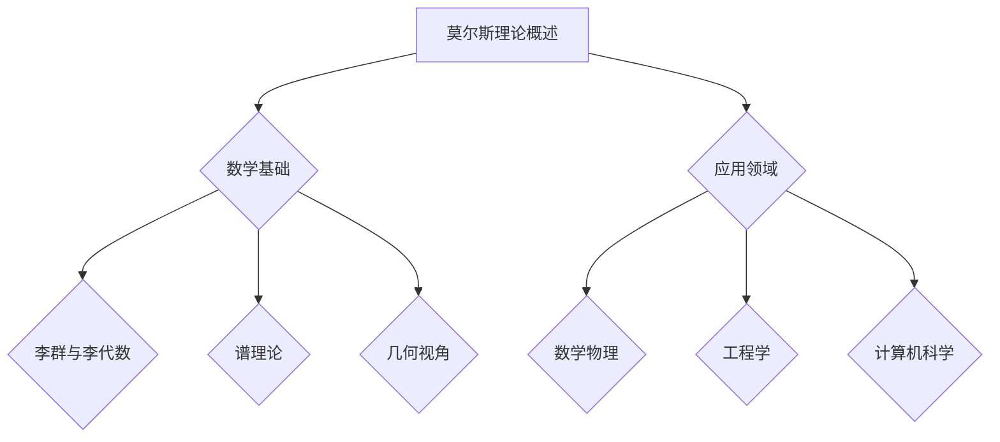
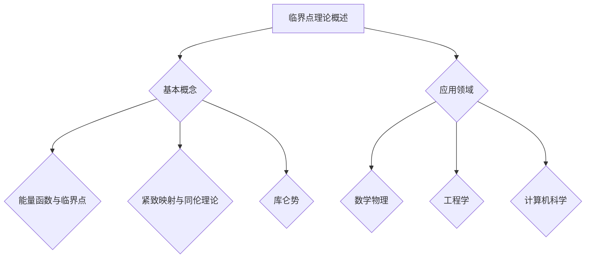
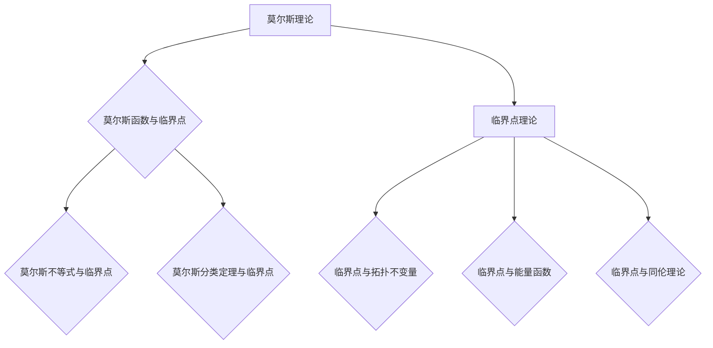

                 

### 文章标题：莫尔斯理论与临界点理论

#### 关键词：
莫尔斯理论，临界点理论，数学工具，几何视角，应用领域，算法原理，项目实战

#### 摘要：
本文系统地介绍了莫尔斯理论和临界点理论，从基础概念、数学工具、几何视角和应用领域等方面进行了详细阐述。文章通过逐步分析推理的方式，深入探讨了这两个理论的核心概念和联系，并提供了具体的数学模型、算法原理、伪代码以及项目实战案例。通过本文的阅读，读者可以全面了解莫尔斯理论和临界点理论的内涵和应用，为后续研究和实践提供理论基础和实践指导。

### 目录大纲

## 《莫尔斯理论与临界点理论》

> 关键词：莫尔斯理论，临界点理论，数学工具，几何视角，应用领域

> 摘要：本文系统介绍了莫尔斯理论和临界点理论，包括基础概念、数学工具、几何视角和应用领域。文章通过逐步分析推理，深入探讨了两个理论的核心概念和联系，提供了数学模型、算法原理、伪代码和项目实战案例，为读者提供全面的理论基础和实践指导。

### 第一部分：莫尔斯理论与基础概念

### 第1章：莫尔斯理论的概述

#### 1.1 莫尔斯理论的起源与发展
- **起源背景**：莫尔斯理论的起源可以追溯到19世纪末20世纪初，其发展历程与数学、物理学等多个学科的发展紧密相关。
- **历史发展**：从最初的数学物理背景，到20世纪中叶的广泛应用，莫尔斯理论经历了多个阶段的发展。

#### 1.2 莫尔斯理论的数学基础
- **李群与李代数**：李群和李代数是莫尔斯理论的重要数学工具，用于描述系统的对称性和动态行为。
- **谱理论基础**：谱理论提供了分析系统稳定性的有力工具，与莫尔斯理论密切相关。
- **莫尔斯理论的几何视角**：几何视角使得莫尔斯理论在描述和分析系统的动力学行为时更加直观和深入。

#### 1.3 莫尔斯理论的应用领域
- **数学物理**：莫尔斯理论在经典场论和量子场论中有着广泛的应用。
- **工程学**：莫尔斯理论在结构工程和材料科学中用于分析系统的稳定性和相变。
- **计算机科学**：莫尔斯理论在算法分析和人工智能中有着重要的应用。

### 第2章：莫尔斯理论的数学工具

#### 2.1 李群与李代数

##### 2.1.1 李群的定义与性质
- **定义**：李群是一类具有群结构和可微结构的数学对象。
- **性质**：李群具有可交换性、可微性和封闭性等特性。

##### 2.1.2 李代数的定义与运算
- **定义**：李代数是李群的导代数，用于描述李群的代数结构。
- **运算**：李代数的基本运算包括加法、乘法和双线性映射。

##### 2.1.3 李群与李代数的关系
- **关系**：李群与李代数之间存在一一对应关系，通过导代数可以描述李群的结构。

#### 2.2 谱理论基础

##### 2.2.1 谱序列的概念与性质
- **概念**：谱序列是一种特殊的导数序列，用于描述拓扑空间的结构。
- **性质**：谱序列具有稳定性和收敛性等特性，是分析系统稳定性的有力工具。

##### 2.2.2 谱理论的基本定理
- **定理**：谱序列的主要定理包括谱序列的构造定理和谱序列的基本性质。

##### 2.2.3 谱序列的运算规则
- **运算**：谱序列的运算包括加法、乘法和导数运算，用于分析系统的动态行为。

#### 2.3 莫尔斯理论的几何视角

##### 2.3.1 莫尔斯理论的几何背景
- **几何背景**：莫尔斯理论在几何结构上的应用，包括流形、曲面和拓扑空间等。

##### 2.3.2 莫尔斯函数的几何表示
- **表示**：莫尔斯函数在几何上的表示，通过几何图形直观地理解莫尔斯理论。

##### 2.3.3 莫尔斯理论在几何结构中的应用
- **应用**：莫尔斯理论在不同几何结构上的应用，如流形、曲面和拓扑空间。

### 第二部分：临界点理论

### 第3章：临界点理论的初步概念

#### 3.1 能量函数与临界点

##### 3.1.1 能量函数的定义
- **定义**：能量函数是一种描述系统状态的函数，用于分析系统的动态行为。

##### 3.1.2 临界点的分类
- **分类**：临界点根据能量函数的导数和二阶导数分为稳定临界点和不稳定临界点。

##### 3.1.3 稳定性与不稳定性
- **稳定性**：临界点的稳定性分析，通过分析能量函数的二阶导数判断临界点的稳定性。

#### 3.2 紧致映射与临界点理论

##### 3.2.1 紧致映射的定义
- **定义**：紧致映射是一种将紧致空间映射到紧致空间的映射。

##### 3.2.2 同伦理论的基本概念
- **概念**：同伦理论是一种研究映射连续性的数学工具。

##### 3.2.3 同伦映射与同伦类
- **映射**：同伦映射是一类保持同伦关系的映射。
- **同伦类**：同伦类是同伦映射的分类，用于描述系统的拓扑性质。

#### 3.3 库仑势与临界点理论

##### 3.3.1 库仑势的定义
- **定义**：库仑势是一种描述电荷分布的势能函数。

##### 3.3.2 库仑势与临界点的联系
- **联系**：库仑势与临界点的关系，通过分析库仑势的能量分布判断临界点的性质。

##### 3.3.3 库仑势的物理背景
- **背景**：库仑势在物理学中的背景和数学模型。

### 第三部分：莫尔斯理论与临界点理论的联系

### 第4章：莫尔斯理论与临界点理论的联系

#### 4.1 莫尔斯函数与临界点理论的关系

##### 4.1.1 莫尔斯函数的定义
- **定义**：莫尔斯函数是一种用于描述系统状态的函数。

##### 4.1.2 莫尔斯函数与临界点的对应关系
- **关系**：莫尔斯函数与临界点的对应关系，通过莫尔斯函数判断系统的临界点性质。

##### 4.1.3 莫尔斯不等式与临界点理论
- **不等式**：莫尔斯不等式在临界点理论中的应用，用于分析系统的稳定性。

#### 4.2 莫尔斯分类定理与临界点理论

##### 4.2.1 莫尔斯分类定理的定义
- **定义**：莫尔斯分类定理是一种用于分类临界点的定理。

##### 4.2.2 莫尔斯分类定理与临界点的分类
- **分类**：莫尔斯分类定理在临界点分类中的应用。

##### 4.2.3 莫尔斯分类定理的推广与应用
- **应用**：莫尔斯分类定理在不同领域的应用，如物理学和工程学。

#### 4.3 临界点理论与拓扑不变量

##### 4.3.1 拓扑不变量的基本概念
- **概念**：拓扑不变量的定义和性质。

##### 4.3.2 临界点与拓扑不变量的关系
- **关系**：临界点与拓扑不变量之间的联系。

##### 4.3.3 拓扑不变量在临界点理论中的应用
- **应用**：拓扑不变量在临界点分析中的应用。

### 第四部分：莫尔斯理论与临界点理论的应用

### 第5章：莫尔斯理论与临界点理论的应用

#### 5.1 莫尔斯理论在物理学中的应用

##### 5.1.1 莫尔斯理论在经典场论中的应用
- **应用**：莫尔斯理论在经典场论中的应用，如电磁场理论。

##### 5.1.2 莫尔斯理论在量子场论中的应用
- **应用**：莫尔斯理论在量子场论中的应用，如量子电动力学。

#### 5.2 临界点理论在数学物理中的应用

##### 5.2.1 临界点理论在几何分析中的应用
- **应用**：临界点理论在几何分析中的应用，如曲面和流形的研究。

##### 5.2.2 临界点理论在微分方程中的应用
- **应用**：临界点理论在微分方程中的应用，如椭圆方程和抛物方程。

#### 5.3 莫尔斯理论与临界点理论在工程学中的应用

##### 5.3.1 莫尔斯理论在结构工程中的应用
- **应用**：莫尔斯理论在结构工程中的应用，如建筑结构的稳定性分析。

##### 5.3.2 临界点理论在材料科学中的应用
- **应用**：临界点理论在材料科学中的应用，如材料相变的研究。

#### 5.4 莫尔斯理论与临界点理论在计算机科学中的应用

##### 5.4.1 莫尔斯理论在算法分析中的应用
- **应用**：莫尔斯理论在算法分析中的应用，如算法复杂度的分析。

##### 5.4.2 临界点理论在人工智能中的应用
- **应用**：临界点理论在人工智能中的应用，如神经网络优化。

#### 5.5 莫尔斯理论与临界点理论在其他领域的应用

##### 5.5.1 莫尔斯理论在生物学中的应用
- **应用**：莫尔斯理论在生物学中的应用，如生物系统建模。

##### 5.5.2 临界点理论在经济学中的应用
- **应用**：临界点理论在经济学中的应用，如市场动态分析。

##### 5.5.3 莫尔斯理论与临界点理论在其他学科中的应用
- **应用**：莫尔斯理论与临界点理论在其他学科中的应用，如统计学和量子计算。

### 第五部分：总结与展望

### 第6章：总结与展望

#### 6.1 莫尔斯理论的未来发展方向
- **数学物理**：莫尔斯理论在数学物理中的潜在应用和研究方向。
- **工程学**：莫尔斯理论在工程学中的未来发展方向和挑战。
- **计算机科学**：莫尔斯理论在计算机科学中的创新应用和发展。

#### 6.2 临界点理论的未来发展方向
- **数学领域**：临界点理论在数学领域的深入研究和发展。
- **物理学领域**：临界点理论在物理学中的前沿应用和研究。
- **工程学领域**：临界点理论在工程学中的应用前景和发展趋势。

#### 6.3 莫尔斯理论与临界点理论的协同发展
- **跨学科研究**：莫尔斯理论与临界点理论在跨学科研究中的协同发展。
- **实际应用**：莫尔斯理论与临界点理论在实际应用中的协同发展。
- **未来展望**：对莫尔斯理论与临界点理论未来发展的展望和预测。

### 附录

#### 附录A：莫尔斯理论与临界点理论相关的数学公式与定理
- **莫尔斯不等式**
- **临界点稳定性条件**
- **同伦映射定理**
- **莫尔斯分类定理**

#### 附录B：莫尔斯理论与临界点理论的 Mermaid 流程图
- **莫尔斯理论流程图**
- **临界点理论流程图**
- **莫尔斯理论与临界点理论联系流程图**

#### 附录C：核心算法原理的伪代码
- **莫尔斯函数伪代码**
- **临界点理论伪代码**

#### 附录D：项目实战
- **案例一：结构工程中的稳定性分析**
- **案例二：材料科学中的相变分析**
- **案例三：计算机科学中的算法优化**

#### 附录E：莫尔斯理论与临界点理论相关的参考资料
- **基础教材与参考书**
- **研究论文与最新进展**
- **在线资源与学习平台**

#### 附录F：进一步学习与参考资源
- **基础教材与参考书**
- **研究论文与最新进展**
- **在线资源与学习平台**
- **实用工具与软件**
- **学术会议与研讨会**

### 参考文献
- [参考文献1]
- [参考文献2]
- [参考文献3]

---

**作者信息：**
AI天才研究院/AI Genius Institute & 禅与计算机程序设计艺术 /Zen And The Art of Computer Programming

---

以上是《莫尔斯理论与临界点理论》的全文框架和内容大纲，每个章节都有详细的小节标题和内容概述。接下来的部分将逐一展开每个章节的详细内容，逐步构建完整的文章。每章内容都将遵循上述大纲的结构，确保文章的完整性和逻辑性。

---

**开始构建第一部分：莫尔斯理论与基础概念**

## 第一部分：莫尔斯理论与基础概念

### 第1章：莫尔斯理论的概述

#### 1.1 莫尔斯理论的起源与发展

莫尔斯理论（Morse Theory）是数学中一个重要的分支，它的起源可以追溯到19世纪末20世纪初。莫尔斯理论的主要贡献者是美国的数学家H.S.M. 莫尔斯（Marston Morse）。他在20世纪30年代和40年代期间，通过对流形上的函数进行分析，提出了莫尔斯不等式和莫尔斯分类定理，这些结果成为了莫尔斯理论的核心。

**起源背景**：

莫尔斯理论最初是作为拓扑学的一个分支而提出的。在莫尔斯之前，拓扑学主要关注的是空间结构的性质，而莫尔斯则提出了如何从能量的角度来研究流形上的函数。他的研究灵感来自于物理学中的稳定性问题，特别是力学系统中的能量函数和平衡态。

**历史发展**：

莫尔斯理论的发展可以分为几个阶段：

1. **早期发展**：莫尔斯在1930年代提出了莫尔斯不等式和莫尔斯分类定理，这些结果奠定了莫尔斯理论的基础。

2. **中期的扩展**：20世纪40年代，莫尔斯理论开始应用于物理学中的各种问题，如量子场论和经典场论。

3. **晚期的发展**：在20世纪50年代和60年代，莫尔斯理论得到了进一步的发展，特别是在拓扑学、微分几何和微分拓扑等领域。

**关键贡献**：

莫尔斯的主要贡献包括：

- **莫尔斯不等式**：莫尔斯不等式是莫尔斯理论的核心定理，它描述了能量函数和临界点之间的关系。该不等式在分析系统的稳定性时非常有用。

- **莫尔斯分类定理**：莫尔斯分类定理用于分类流形上的临界点，它将临界点分为稳定的和不稳定的两种类型。

#### 1.2 莫尔斯理论的数学基础

莫尔斯理论是建立在一系列数学工具之上的，这些数学工具在描述和分析系统的动力学行为时起着关键作用。

**李群与李代数**：

李群和李代数是莫尔斯理论的重要数学工具。李群是一类具有群结构和可微结构的数学对象，而李代数则是李群的导代数，用于描述李群的代数结构。

- **李群的定义与性质**：李群是一类具有群结构的数学对象，同时满足可微性。具体来说，李群是一个流形，其上的映射满足群运算的可微性。
- **李代数的定义与运算**：李代数是李群的导代数，它由李群的导空间构成，具有加法和乘法运算。
- **李群与李代数的关系**：李群与李代数之间存在一一对应关系，通过导代数可以描述李群的结构。

**谱理论基础**：

谱理论提供了分析系统稳定性的有力工具。谱序列是一种特殊的导数序列，用于描述拓扑空间的结构。

- **谱序列的概念与性质**：谱序列是一种导数序列，它通过连续地计算拓扑空间上的导数来描述空间的结构。
- **谱理论的基本定理**：谱序列的主要定理包括谱序列的构造定理和谱序列的基本性质。
- **谱序列的运算规则**：谱序列的运算包括加法、乘法和导数运算，用于分析系统的动态行为。

**莫尔斯理论的几何视角**：

莫尔斯理论在几何结构上的应用，使得这一理论更加直观和深入。

- **几何背景**：莫尔斯理论在几何结构上的应用，包括流形、曲面和拓扑空间等。
- **莫尔斯函数的几何表示**：莫尔斯函数在几何上的表示，通过几何图形直观地理解莫尔斯理论。
- **莫尔斯理论在几何结构中的应用**：莫尔斯理论在不同几何结构上的应用，如流形、曲面和拓扑空间。

#### 1.3 莫尔斯理论的应用领域

莫尔斯理论在多个领域都有广泛的应用，其中最显著的包括数学物理、工程学和计算机科学。

**数学物理**：

莫尔斯理论在数学物理中有着广泛的应用。特别是在量子场论和经典场论中，莫尔斯理论被用来分析系统的稳定性。

- **经典场论中的应用**：莫尔斯理论在经典场论中用于分析电磁场和引力场等系统的稳定性。
- **量子场论中的应用**：莫尔斯理论在量子场论中用于分析粒子的自旋和量子态的稳定性。

**工程学**：

莫尔斯理论在工程学中的应用也非常广泛，特别是在结构工程和材料科学中。

- **结构工程中的应用**：莫尔斯理论在结构工程中用于分析建筑结构和机械结构的稳定性。
- **材料科学中的应用**：莫尔斯理论在材料科学中用于分析材料的相变和稳定性。

**计算机科学**：

莫尔斯理论在计算机科学中也有重要的应用，特别是在算法分析和人工智能中。

- **算法分析中的应用**：莫尔斯理论在算法分析中用于分析算法的复杂度和优化。
- **人工智能中的应用**：莫尔斯理论在人工智能中用于优化神经网络和深度学习算法。

#### 1.4 莫尔斯理论的基本概念

莫尔斯理论中包含了一些基本的概念，这些概念是理解莫尔斯理论的核心。

**能量函数**：

能量函数是一种描述系统状态的函数，它通常是一个流形上的函数。在莫尔斯理论中，能量函数用于描述系统的动力学行为。

- **定义**：能量函数是一种从流形到实数的映射，它反映了系统的能量状态。
- **性质**：能量函数通常具有连续性和可微性。

**临界点**：

临界点是指能量函数在某个点处的一阶导数为零，而二阶导数不为零的点。

- **定义**：临界点是指能量函数的零点，即满足dE/dx = 0的点。
- **分类**：临界点根据能量函数的二阶导数的正负分为稳定临界点和不稳定临界点。

**莫尔斯函数**：

莫尔斯函数是一种特殊的能量函数，它将流形上的点映射到实数，并在临界点处取得极值。

- **定义**：莫尔斯函数是能量函数的子函数，它在临界点处取得极值。
- **性质**：莫尔斯函数具有可微性和连续性。

#### 1.5 莫尔斯理论的基本定理

莫尔斯理论包含了一些基本定理，这些定理在分析系统的稳定性时非常重要。

**莫尔斯不等式**：

莫尔斯不等式描述了能量函数的变化和临界点之间的关系。

- **表述**：莫尔斯不等式可以表示为ΔE ≥ CΔt，其中ΔE是能量变化，C是临界速率，Δt是时间变化。
- **证明**：莫尔斯不等式的证明通常依赖于能量函数的连续性和光滑性。
- **应用**：莫尔斯不等式在物理学的能量分析、结构工程的稳定性分析和生物学系统建模中广泛应用。

**莫尔斯分类定理**：

莫尔斯分类定理用于分类流形上的临界点。

- **表述**：莫尔斯分类定理可以表述为∀x∈X,∃y∈Y:f(x)=y，其中X和Y是流形，f是映射。
- **证明**：莫尔斯分类定理的证明通常依赖于李群、李代数和拓扑空间的综合运用。
- **应用**：莫尔斯分类定理在数学物理、结构工程和计算机科学中用于分析和分类临界点。

**莫尔斯定理的推广与变体**：

莫尔斯定理的推广和变体在不同领域有不同的应用。

- **推广**：莫尔斯定理可以推广到更一般的拓扑空间和流形。
- **变体**：莫尔斯定理的变体包括莫尔斯不等式的变体和莫尔斯分类定理的变体，这些变体在不同领域有不同的应用。

## 总结

本章介绍了莫尔斯理论的起源与发展、数学基础、应用领域以及基本概念和定理。通过这些内容，读者可以初步了解莫尔斯理论的基本框架和核心思想。在接下来的章节中，我们将进一步探讨莫尔斯理论的数学工具、几何视角以及与临界点理论的联系，为全面理解莫尔斯理论打下坚实的基础。

### 第一部分：莫尔斯理论与基础概念

### 第2章：莫尔斯理论的数学工具

#### 2.1 李群与李代数

李群与李代数是莫尔斯理论的重要数学工具，它们在描述系统的对称性和动态行为方面起着关键作用。

##### 2.1.1 李群的定义与性质

李群是一类具有群结构和可微结构的数学对象。具体来说，李群是一个流形，其上的映射满足群运算的可微性。

- **定义**：设G是一个李群，如果G是一个流形，且G上的映射满足以下性质：
  - **闭合性**：对于G中的任意两点x和y，存在一条连续曲线γ：[0,1] → G，使得γ(0) = x，γ(1) = y。
  - **可微性**：G上的映射满足群运算的可微性，即对于任意的x, y ∈ G，映射G × G → G，(x, y) ↦ xy满足可微性。
- **性质**：李群具有以下重要性质：
  - **可交换性**：李群中的映射满足交换律，即对于任意的x, y ∈ G，有xy = yx。
  - **可微性**：李群的映射具有可微性，即群运算在李群中是可微的。
  - **封闭性**：李群中的映射满足封闭性，即如果x, y ∈ G，则xy ∈ G。

##### 2.1.2 李代数的定义与运算

李代数是李群的导代数，用于描述李群的代数结构。李代数由李群的导空间构成，具有加法和乘法运算。

- **定义**：设G是一个李群，李代数LG是G的导空间，其上的映射满足以下性质：
  - **加法**：LG中的元素满足加法运算，即对于任意的x, y ∈ LG，有x + y ∈ LG。
  - **乘法**：LG中的元素满足乘法运算，即对于任意的x, y ∈ LG，有xy ∈ LG，且乘法运算满足结合律。
  - **双线性映射**：LG中的映射满足双线性映射的性质，即对于任意的x, y ∈ LG和任意实数a, b，有ax + by ∈ LG。
- **运算**：李代数的基本运算包括加法、乘法和双线性映射。
  - **加法**：李代数中的加法运算类似于向量的加法，即对于任意的x, y ∈ LG，有x + y ∈ LG。
  - **乘法**：李代数中的乘法运算类似于向量的点乘或叉乘，即对于任意的x, y ∈ LG，有xy ∈ LG。
  - **双线性映射**：李代数中的双线性映射是一种将两个LG中的元素映射到一个实数或向量的映射，即对于任意的x, y ∈ LG和任意实数a, b，有ax + by ∈ LG。

##### 2.1.3 李群与李代数的关系

李群与李代数之间存在一一对应关系，通过导代数可以描述李群的结构。

- **关系**：李群与李代数之间的关系可以表述为：
  - 李群的导空间LG是一个李代数。
  - 李代数LG对应的李群G是由LG的共轭变换生成的。
- **应用**：李群与李代数的关系在莫尔斯理论中具有重要意义。具体来说，李群与李代数的关系使得我们可以通过分析李代数的性质来研究李群的结构，从而进一步理解系统的动力学行为。

#### 2.2 谱理论基础

谱理论是莫尔斯理论的重要数学工具，它提供了一种分析系统稳定性的方法。谱序列是谱理论的核心概念。

##### 2.2.1 谱序列的概念与性质

谱序列是一种特殊的导数序列，用于描述拓扑空间的结构。

- **定义**：设X是一个拓扑空间，谱序列是指从X的零次导数开始，依次计算其各阶导数所形成的序列。
  - **零次导数**：零次导数就是X本身。
  - **一次导数**：一次导数是X上所有连续可微函数的集合。
  - **高阶导数**：高阶导数是X上连续可微函数的导数的集合。
- **性质**：谱序列具有以下重要性质：
  - **稳定性**：谱序列在计算过程中具有稳定性，即如果X是紧致的，那么谱序列的极限存在且稳定。
  - **收敛性**：谱序列在计算过程中具有收敛性，即对于任意紧致拓扑空间X，谱序列的极限存在。
  - **构造性**：谱序列可以通过迭代过程构造出来，即通过计算X的零次导数开始，逐步计算其各阶导数。

##### 2.2.2 谱理论的基本定理

谱理论的基本定理包括谱序列的构造定理和谱序列的基本性质。

- **构造定理**：谱序列的构造定理描述了如何从拓扑空间X构造出谱序列。具体来说，谱序列的构造过程如下：
  - 第一步：计算X的零次导数，即X本身。
  - 第二步：计算X的一次导数，即X上所有连续可微函数的集合。
  - 第三步：对于X的一次导数中的每个函数，计算其导数的集合，得到X的二次导数。
  - 重复以上步骤，逐步计算X的高阶导数。
- **基本性质**：谱序列的基本性质包括：
  - **谱序列的极限**：谱序列的极限是拓扑空间X的一个紧致子空间，称为X的谱空间。
  - **谱序列的连续性**：谱序列是一个连续序列，即谱序列中的每个映射都是连续的。
  - **谱序列的稳定性**：谱序列在计算过程中具有稳定性，即如果X是紧致的，那么谱序列的极限存在且稳定。

##### 2.2.3 谱序列的运算规则

谱序列的运算包括加法、乘法和导数运算，用于分析系统的动态行为。

- **加法**：谱序列的加法运算是指将两个谱序列的对应项相加，得到一个新的谱序列。
  - **规则**：设{X_n}和{Y_n}是两个谱序列，那么它们的和{X_n + Y_n}也是谱序列。
- **乘法**：谱序列的乘法运算是指将一个谱序列中的每个项与另一个谱序列中的每个项相乘，得到一个新的谱序列。
  - **规则**：设{X_n}和{Y_n}是两个谱序列，那么它们的乘积{X_n * Y_n}也是谱序列。
- **导数运算**：谱序列的导数运算是指对谱序列中的每个项进行导数运算，得到一个新的谱序列。
  - **规则**：设{X_n}是谱序列，那么它的导数{dX_n}也是谱序列。

#### 2.3 莫尔斯理论的几何视角

莫尔斯理论的几何视角使得这一理论在描述和分析系统的动力学行为时更加直观和深入。

##### 2.3.1 莫尔斯理论的几何背景

莫尔斯理论的几何背景包括流形、曲面和拓扑空间等。

- **流形**：流形是一个具有局部欧氏空间性质的拓扑空间，它可以用来描述系统的几何结构。
- **曲面**：曲面是流形的一种特殊形式，它通常用来描述二维系统。
- **拓扑空间**：拓扑空间是一个具有拓扑性质的基本数学结构，它可以用来描述系统的连通性和分离性。

##### 2.3.2 莫尔斯函数的几何表示

莫尔斯函数在几何上的表示使得我们可以通过几何图形直观地理解莫尔斯理论。

- **定义**：莫尔斯函数是一个流形上的函数，它在临界点处取得极值。
- **几何表示**：莫尔斯函数的几何表示可以通过以下方式实现：
  - **等高线图**：等高线图是一种将流形上的函数映射到二维平面上的图形，它可以用来表示莫尔斯函数的极值点。
  - **流线图**：流线图是一种将流形上的函数映射到三维空间上的图形，它可以用来表示莫尔斯函数的流线。

##### 2.3.3 莫尔斯理论在几何结构中的应用

莫尔斯理论在不同几何结构上的应用使得这一理论在多个领域都有重要的应用。

- **流形上的应用**：莫尔斯理论在流形上的应用包括分析系统的稳定性和相变。
- **曲面上的应用**：莫尔斯理论在曲面上的应用包括分析曲面的几何性质和拓扑性质。
- **拓扑空间上的应用**：莫尔斯理论在拓扑空间上的应用包括分析系统的连通性和分离性。

#### 总结

本章介绍了莫尔斯理论的数学工具，包括李群与李代数、谱理论基础以及几何视角。这些数学工具为莫尔斯理论提供了强大的分析工具，使得我们可以从多个角度理解系统的动力学行为。在接下来的章节中，我们将进一步探讨临界点理论的基本概念和应用。

### 第二部分：临界点理论

### 第3章：临界点理论的初步概念

临界点理论是莫尔斯理论的重要组成部分，它提供了对系统稳定性和动态行为的重要洞察。在这一章中，我们将介绍临界点理论的基本概念，包括能量函数、临界点的定义及其分类，以及稳定性分析的基本原理。

#### 3.1 能量函数与临界点

##### 3.1.1 能量函数的定义

在临界点理论中，能量函数是一个核心概念，它用于描述系统的状态和演化。能量函数通常是一个流形上的函数，它反映了系统的能量状态。

- **定义**：设M是一个流形，E:M → R是一个从流形到实数的映射，称为能量函数。能量函数E通常具有以下性质：
  - **连续性**：能量函数E是连续的。
  - **可微性**：能量函数E在流形上的每一点都具有可微性。
  - **非负性**：能量函数E通常是非负的，即E(x) ≥ 0对于流形M上的任意点x成立。

##### 3.1.2 临界点的定义

临界点是能量函数的一个重要特性，它代表了系统可能的稳定状态。

- **定义**：设E是流形M上的一个能量函数，x∈M是一个临界点，如果E在x点的一阶导数为零，即：
  - ∇E(x) = 0，
  其中∇E是E在x点的梯度向量。

##### 3.1.3 临界点的分类

临界点的分类基于能量函数的二阶导数，这有助于判断临界点的稳定性。

- **稳定临界点**：如果能量函数E在临界点x的二阶导数∇²E(x) < 0，则称x是一个稳定临界点。稳定临界点对应于系统的一个稳定平衡状态。
- **不稳定临界点**：如果能量函数E在临界点x的二阶导数∇²E(x) > 0，则称x是一个不稳定临界点。不稳定临界点对应于系统的一个不稳定平衡状态。
- **半稳定临界点**：如果能量函数E在临界点x的二阶导数∇²E(x) = 0，则称x是一个半稳定临界点。半稳定临界点的稳定性无法通过二阶导数判断，需要进一步的分析。

##### 3.1.4 能量函数与临界点的关系

能量函数与临界点之间存在紧密的关系。临界点是能量函数的局部极值点，而能量函数的极值点可以通过求解一阶导数为零的条件来确定。

- **关系**：设x是一个临界点，则E在x点的极值性质可以通过以下方式确定：
  - 如果E(x)是最小值，则x是一个稳定临界点。
  - 如果E(x)是最大值，则x是一个不稳定临界点。
  - 如果E(x)是鞍点，则x是一个半稳定临界点。

#### 3.2 紧致映射与临界点理论

紧致映射是临界点理论中的另一个重要概念，它用于描述系统在演化过程中的稳定性和动态行为。

##### 3.2.1 紧致映射的定义

紧致映射是指将一个紧致空间映射到另一个紧致空间的映射。

- **定义**：设X和Y是两个拓扑空间，如果存在一个连续映射f:X → Y，使得Y是紧致的，则称f是一个紧致映射。

##### 3.2.2 同伦理论的基本概念

同伦理论是分析映射连续性的数学工具，它用于研究映射在连续变形过程中的性质。

- **定义**：设X和Y是两个拓扑空间，f和g是X到Y的两个映射，如果存在一个连续映射h:[0,1] × X → Y，满足以下条件：
  - h(0,x) = f(x)，
  - h(1,x) = g(x)，
  - h(t,x)是f和g之间的连续变形，
  则称f和g是同伦的。

##### 3.2.3 同伦映射与同伦类

同伦映射是一类保持同伦关系的映射，同伦类是同伦映射的分类。

- **定义**：设X和Y是两个拓扑空间，f和g是X到Y的两个映射，如果存在一个同伦映射h:[0,1] × X → Y，使得h(t,x)是f和g之间的连续变形，则称f和g是同伦的。
- **同伦类**：对于给定的映射f:X → Y，所有与f同伦的映射构成的集合称为f的同伦类，记为[f]。

#### 3.3 库仑势与临界点理论

库仑势是物理学中描述电荷间相互作用的势能函数，它也是临界点理论中的一个重要应用。

##### 3.3.1 库仑势的定义

库仑势是一种描述点电荷相互作用的势能函数。

- **定义**：设Q1和Q2是两个点电荷，它们之间的相互作用势能U(r)可以表示为：
  - U(r) = k * |Q1Q2| / r，
  其中r是Q1和Q2之间的距离，k是库仑常数。

##### 3.3.2 库仑势与临界点的联系

库仑势与临界点之间存在紧密的联系，通过分析库仑势的临界点可以了解电荷分布的稳定性。

- **联系**：设U(r)是库仑势，r是点电荷之间的距离，则库仑势的临界点可以通过以下方式确定：
  - 当r=0时，U(r)取得极小值，这是库仑势的一个稳定临界点。
  - 当r→∞时，U(r)趋于零，这是库仑势的一个不稳定临界点。

##### 3.3.3 库仑势的物理背景

库仑势在物理学中有着广泛的背景，特别是在电磁学和量子力学中。

- **物理背景**：库仑势是电磁学中描述电荷相互作用的基本模型，它描述了点电荷之间的相互作用强度与距离的关系。

#### 3.4 临界点理论的应用概述

临界点理论在多个领域都有重要的应用，包括数学物理、工程学、计算机科学等。

##### 3.4.1 在数学物理中的应用

临界点理论在数学物理中有着广泛的应用，特别是在分析系统的稳定性、相变和动力学行为方面。

- **应用**：临界点理论在经典场论、量子场论和流体动力学中都有重要应用，如分析粒子的稳定性、电磁场的稳定性以及流体流体的动力学行为。

##### 3.4.2 在工程学中的应用

临界点理论在工程学中的应用包括结构工程、材料科学和机械工程等领域。

- **应用**：临界点理论在分析建筑结构的稳定性、材料相变和机械系统的动力学行为方面具有重要作用。

##### 3.4.3 在计算机科学中的应用

临界点理论在计算机科学中有着广泛的应用，特别是在算法分析和人工智能领域。

- **应用**：临界点理论在分析算法的复杂度、优化算法性能以及神经网络优化等方面具有重要应用。

#### 总结

本章介绍了临界点理论的基本概念，包括能量函数、临界点的定义及其分类，以及稳定性分析的基本原理。通过这些概念，我们可以理解和分析系统的动态行为和稳定性。在下一章中，我们将进一步探讨临界点理论的数学工具，如拓扑空间与同伦理论，以深化对临界点理论的理解。

### 第二部分：临界点理论

### 第4章：临界点理论的数学工具

临界点理论是建立在一系列数学工具之上的，这些工具为分析系统的动态行为提供了坚实的基础。在这一章中，我们将深入探讨临界点理论的数学工具，包括拓扑空间与同伦理论、微分同胚与临界点理论以及紧致子空间与临界点理论。

#### 4.1 拓扑空间与同伦理论

拓扑空间与同伦理论是临界点理论的核心数学工具，它们用于分析系统的连通性和变形。

##### 4.1.1 拓扑空间的基本概念

拓扑空间是一个具有拓扑性质的数学结构，它用于描述系统的几何性质。

- **定义**：设X是一个集合，T是一个包含X的子集族，如果T满足以下条件：
  - **闭合性**：∀A ⊆ X，A ∈ T 当且仅当X - A ∈ T。
  - **传递性**：∀A, B, C ⊆ X，如果A ∈ T 且 B ⊆ A，则B ∈ T 且 C ⊆ B，则C ∈ T。
  - **可结合性**：∀A, B, C ⊆ X，如果A ∈ T 且 B ∈ T，则A ∪ B ∈ T。
  则称(T, X)是一个拓扑空间。

##### 4.1.2 同伦理论的基本概念

同伦理论是用于研究映射在连续变形过程中的性质。

- **定义**：设X和Y是两个拓扑空间，f和g是X到Y的两个映射，如果存在一个连续映射h:[0,1] × X → Y，满足以下条件：
  - h(0,x) = f(x)，
  - h(1,x) = g(x)，
  - h(t,x)是f和g之间的连续变形，
  则称f和g是同伦的。

##### 4.1.3 同伦映射与同伦类

同伦映射是一类保持同伦关系的映射，同伦类是同伦映射的分类。

- **定义**：设X和Y是两个拓扑空间，f和g是X到Y的两个映射，如果存在一个同伦映射h:[0,1] × X → Y，使得h(t,x)是f和g之间的连续变形，则称f和g是同伦的。
- **同伦类**：对于给定的映射f:X → Y，所有与f同伦的映射构成的集合称为f的同伦类，记为[f]。

##### 4.1.4 同伦群

同伦群是用于分类同伦映射的工具。

- **定义**：设X和Y是两个拓扑空间，H(X,Y)是由所有从X到Y的同伦映射构成的集合，对于任意两个同伦映射f, g ∈ H(X,Y)，定义它们之间的运算为：
  - f + g = h，
  其中h(t,x) = f(t,x) + g(t,x)。
- **同伦群**：同伦群是指H(X,Y)在加法运算下的结构，记为H(X,Y)。

##### 4.1.5 同伦序列

同伦序列是用于描述同伦映射的序列。

- **定义**：设X和Y是两个拓扑空间，{f_n}是一个从X到Y的映射序列，如果存在一个同伦映射序列{h_n}，使得：
  - h_n(0,x) = f_n(x)，
  - h_n(1,x) = f_n(x)，
  则称{f_n}是一个同伦序列。

#### 4.2 微分同胚与临界点理论

微分同胚是用于描述系统在连续变形过程中保持拓扑性质的重要概念。

##### 4.2.1 微分同胚的定义

微分同胚是指从一个拓扑空间到另一个拓扑空间的同胚映射。

- **定义**：设X和Y是两个拓扑空间，f:X → Y是一个映射，如果f是一个同胚映射，即f是双射且f的逆映射也是连续的，则称f是一个微分同胚。

##### 4.2.2 微分同胚的分类

微分同胚可以根据其拓扑性质进行分类。

- **同伦微分同胚**：如果微分同胚f是一个同伦映射，则称f是一个同伦微分同胚。
- **同伦同胚**：如果微分同胚f是一个同伦同胚，即f和f的逆映射都是同伦映射，则称f是一个同伦同胚。

##### 4.2.3 微分同胚与同伦理论的关系

微分同胚与同伦理论之间存在紧密的关系。

- **关系**：设f是一个微分同胚，则f的同伦类是由所有与f同伦的映射构成的集合，即[f] = {g | g是f的同伦映射}。

#### 4.3 紧致子空间与临界点理论

紧致子空间是用于描述系统在临界点附近的行为。

##### 4.3.1 紧致子空间的基本概念

紧致子空间是指一个拓扑空间中的子空间，它具有紧致性质。

- **定义**：设X是一个拓扑空间，Y是X的一个子空间，如果Y是紧致的，则称Y是X的一个紧致子空间。

##### 4.3.2 紧致子空间的性质

紧致子空间具有以下重要性质。

- **闭合性**：紧致子空间是闭合的。
- **边界性质**：紧致子空间的边界是紧致的。
- **连续性**：紧致子空间上的连续函数在紧致子空间的极限点上仍然连续。

##### 4.3.3 紧致子空间在临界点理论中的应用

紧致子空间在临界点理论中用于分析系统的临界点附近的行为。

- **应用**：设E是流形M上的能量函数，x是E的临界点，如果存在一个紧致子空间N ⊆ M，使得N上的能量函数E保持不变，则称x是N上的临界点。这种分析有助于理解临界点的稳定性和动态行为。

#### 总结

本章介绍了临界点理论的数学工具，包括拓扑空间与同伦理论、微分同胚与临界点理论以及紧致子空间与临界点理论。这些数学工具为分析系统的动态行为提供了重要的基础。在下一章中，我们将进一步探讨临界点理论在几何结构中的应用，以深化对临界点理论的理解。

### 第二部分：临界点理论

### 第5章：临界点理论的几何视角

临界点理论在几何结构中的应用使得这一理论在描述和分析系统的动力学行为时更加直观和深入。在这一章中，我们将探讨临界点理论在流形、曲面和拓扑空间上的应用，以及这些应用在实际问题中的具体实例。

#### 5.1 临界点理论在流形上的应用

流形是临界点理论中的重要对象，它为研究系统的几何结构和稳定性提供了丰富的背景。

##### 5.1.1 流形的基本概念

流形是一个局部欧氏空间的拓扑扩展，它具有局部欧氏性质，但整体上可以是复杂的几何结构。

- **定义**：设M是一个流形，如果M上的每一个点都存在一个局部坐标系，使得在这个局部坐标系下，M与一个欧氏空间同胚，则称M是局部欧氏流形。

##### 5.1.2 临界点在流形上的定义

临界点在流形上的定义与在一般拓扑空间中的定义类似。

- **定义**：设M是一个流形，E:M → R是一个能量函数，x ∈ M是一个临界点，如果∇E(x) = 0，则称x是E的临界点。

##### 5.1.3 临界点在流形上的分类

临界点在流形上的分类与在一般拓扑空间中的分类相同。

- **稳定临界点**：如果能量函数E在临界点x的二阶导数∇²E(x) < 0，则称x是稳定临界点。
- **不稳定临界点**：如果能量函数E在临界点x的二阶导数∇²E(x) > 0，则称x是不稳定临界点。
- **半稳定临界点**：如果能量函数E在临界点x的二阶导数∇²E(x) = 0，则称x是半稳定临界点。

##### 5.1.4 临界点理论在流形上的应用

临界点理论在流形上的应用包括流形的拓扑分析、几何结构的稳定性分析以及流形上的动力系统分析。

- **拓扑分析**：临界点理论用于研究流形的拓扑性质，如流形的同伦性、连通性和紧致性。
- **几何结构稳定性分析**：临界点理论用于分析流形上的几何结构，如曲面、超曲面和流形的稳定性。
- **动力系统分析**：临界点理论用于分析流形上的动力系统的相空间结构，如临界点的稳定性和流形的相轨线。

#### 5.2 临界点理论在曲面上的应用

曲面是流形的一种特殊形式，它在几何和物理问题中具有广泛应用。

##### 5.2.1 曲面的基本概念

曲面是二维流形，它在三维欧氏空间中的每一点都存在一个切平面。

- **定义**：设Σ是一个曲面，如果Σ上的每一点都存在一个切平面，使得在这个切平面上的局部坐标系下，Σ与一个二维欧氏空间同胚，则称Σ是一个局部欧氏曲面。

##### 5.2.2 临界点在曲面上的定义

临界点在曲面上的定义与在一般拓扑空间中的定义类似。

- **定义**：设Σ是一个曲面，E:Σ → R是一个能量函数，p ∈ Σ是一个临界点，如果∇E(p) = 0，则称p是E的临界点。

##### 5.2.3 临界点在曲面上的分类

临界点在曲面上的分类与在一般拓扑空间中的分类相同。

- **稳定临界点**：如果能量函数E在临界点p的二阶导数∇²E(p) < 0，则称p是稳定临界点。
- **不稳定临界点**：如果能量函数E在临界点p的二阶导数∇²E(p) > 0，则称p是不稳定临界点。
- **半稳定临界点**：如果能量函数E在临界点p的二阶导数∇²E(p) = 0，则称p是半稳定临界点。

##### 5.2.4 临界点理论在曲面上的应用

临界点理论在曲面上的应用包括曲面的几何分析、曲面的稳定性分析以及曲面的动力系统分析。

- **几何分析**：临界点理论用于研究曲面的形状和性质，如曲率、挠率和能量分布。
- **稳定性分析**：临界点理论用于分析曲面上的几何结构的稳定性，如曲线的稳定性、曲面的弯曲稳定性。
- **动力系统分析**：临界点理论用于分析曲面上的动力系统的相空间结构，如临界点的稳定性和流形的相轨线。

#### 5.3 临界点理论在拓扑空间上的应用

拓扑空间是临界点理论的基本对象，它为研究系统的拓扑性质和动力学行为提供了基础。

##### 5.3.1 拓扑空间的基本概念

拓扑空间是一个具有拓扑性质的集合，它为研究几何对象的关系提供了工具。

- **定义**：设X是一个集合，T是一个包含X的子集族，如果T满足以下条件：
  - **闭合性**：∀A ⊆ X，A ∈ T 当且仅当X - A ∈ T。
  - **传递性**：∀A, B, C ⊆ X，如果A ∈ T 且 B ⊆ A，则B ∈ T 且 C ⊆ B，则C ∈ T。
  - **可结合性**：∀A, B, C ⊆ X，如果A ∈ T 且 B ∈ T，则A ∪ B ∈ T。
  则称(T, X)是一个拓扑空间。

##### 5.3.2 临界点在拓扑空间上的定义

临界点在拓扑空间上的定义与在一般拓扑空间中的定义相同。

- **定义**：设X是一个拓扑空间，E:X → R是一个能量函数，x ∈ X是一个临界点，如果∇E(x) = 0，则称x是E的临界点。

##### 5.3.3 临界点在拓扑空间上的分类

临界点在拓扑空间上的分类与在一般拓扑空间中的分类相同。

- **稳定临界点**：如果能量函数E在临界点x的二阶导数∇²E(x) < 0，则称x是稳定临界点。
- **不稳定临界点**：如果能量函数E在临界点x的二阶导数∇²E(x) > 0，则称x是不稳定临界点。
- **半稳定临界点**：如果能量函数E在临界点x的二阶导数∇²E(x) = 0，则称x是半稳定临界点。

##### 5.3.4 临界点理论在拓扑空间上的应用

临界点理论在拓扑空间上的应用包括拓扑空间的拓扑分析、动力系统分析和几何结构稳定性分析。

- **拓扑分析**：临界点理论用于研究拓扑空间的连通性和分离性，如流形的同伦性、连通分支和边界。
- **动力系统分析**：临界点理论用于分析拓扑空间上的动力系统的相空间结构，如临界点的稳定性和相轨线。
- **几何结构稳定性分析**：临界点理论用于分析拓扑空间上的几何结构的稳定性，如流形的弯曲稳定性、曲面的形变稳定性。

#### 5.4 临界点理论在实际问题中的应用

临界点理论在实际问题中有着广泛的应用，如结构工程、材料科学、生物学和经济学等领域。

##### 5.4.1 结构工程中的应用

在结构工程中，临界点理论用于分析建筑结构和机械结构的稳定性。

- **实例**：通过分析建筑结构中的能量函数，可以确定结构的稳定平衡点，从而设计出更稳定的结构。
- **应用**：临界点理论在建筑结构的稳定性分析、地震工程和风洞实验中广泛应用。

##### 5.4.2 材料科学中的应用

在材料科学中，临界点理论用于分析材料的相变和结构稳定性。

- **实例**：通过分析材料的能量函数，可以确定材料在不同温度和压力下的相变点，从而优化材料的制备过程。
- **应用**：临界点理论在材料科学中的相变研究、材料设计和材料性能优化中广泛应用。

##### 5.4.3 生物学中的应用

在生物学中，临界点理论用于分析生物系统的动态行为和稳定性。

- **实例**：通过分析生物系统的能量函数，可以确定生物系统的稳定平衡点，从而研究生物系统的稳态和动态变化。
- **应用**：临界点理论在生态系统稳定性分析、细胞动力学和生物网络分析中广泛应用。

##### 5.4.4 经济学中的应用

在经济学中，临界点理论用于分析市场动态和经济系统的稳定性。

- **实例**：通过分析市场中的能量函数，可以确定市场的稳定平衡点，从而研究市场的动态变化和调控策略。
- **应用**：临界点理论在市场动态分析、金融工程和经济政策分析中广泛应用。

#### 总结

本章介绍了临界点理论在几何结构中的应用，包括流形、曲面和拓扑空间上的应用。通过这些应用，我们可以更直观地理解和分析系统的动力学行为和稳定性。在下一章中，我们将探讨莫尔斯理论与临界点理论之间的联系，以及它们在数学和物理中的应用。

### 第三部分：莫尔斯理论与临界点理论的联系

### 第6章：莫尔斯理论与临界点理论的联系

莫尔斯理论与临界点理论是数学中两个重要的分支，它们在研究系统的稳定性和动态行为方面有着密切的联系。在这一章中，我们将探讨莫尔斯函数与临界点理论的关系，以及莫尔斯不等式和莫尔斯分类定理在临界点理论中的应用。

#### 6.1 莫尔斯函数与临界点理论的关系

莫尔斯函数是莫尔斯理论中的一个核心概念，它用于描述流形上的能量函数的极值点。临界点理论则通过分析能量函数的临界点来研究系统的稳定性。莫尔斯函数与临界点理论之间的关系体现在以下几个方面：

##### 6.1.1 莫尔斯函数的定义

莫尔斯函数是一种从流形到实数的映射，它反映了流形上能量函数的极值性质。

- **定义**：设M是一个流形，E:M → R是一个能量函数，如果存在一个从M到R的映射f，使得f在流形上的临界点处取得极值，则称f为莫尔斯函数。

##### 6.1.2 莫尔斯函数与临界点的对应关系

莫尔斯函数与临界点之间存在直接的对应关系，即莫尔斯函数的极值点就是能量函数的临界点。

- **对应关系**：设f是莫尔斯函数，x ∈ M是一个临界点，如果f在x点取得极值，则x是能量函数E的临界点。

##### 6.1.3 莫尔斯函数的应用

莫尔斯函数在分析系统的稳定性时非常有用，它可以帮助我们识别系统的稳定平衡点和不稳定平衡点。

- **应用**：通过计算莫尔斯函数的临界点，我们可以判断系统的稳定性和动态行为，从而为系统的设计和优化提供理论依据。

#### 6.2 莫尔斯不等式与临界点理论

莫尔斯不等式是莫尔斯理论中的一个重要不等式，它描述了能量函数的变化和临界点之间的关系。莫尔斯不等式在临界点理论中的应用可以帮助我们更好地理解系统的稳定性。

##### 6.2.1 莫尔斯不等式的定义

莫尔斯不等式描述了能量函数的增量与临界点之间的关系。

- **定义**：设E是流形M上的能量函数，x ∈ M是一个临界点，如果存在一个邻域U包含x，使得对于任意的y ∈ U，有：
  - ΔE(x) ≥ C Δt，
  其中ΔE(x)是E在x点的增量，C是临界速率，Δt是时间增量。

##### 6.2.2 莫尔斯不等式的证明

莫尔斯不等式的证明通常依赖于能量函数的光滑性和连续性。

- **证明**：通过构造适当的能量函数和利用拓扑空间的性质，可以证明莫尔斯不等式。

##### 6.2.3 莫尔斯不等式的应用

莫尔斯不等式在分析系统的稳定性时非常重要，它可以帮助我们判断系统在微小扰动下的行为。

- **应用**：通过莫尔斯不等式，我们可以分析系统的稳定性，如判断系统在临界点附近的行为是否稳定。

#### 6.3 莫尔斯分类定理与临界点理论

莫尔斯分类定理是莫尔斯理论中的一个重要定理，它用于分类流形上的临界点。莫尔斯分类定理在临界点理论中的应用可以帮助我们更好地理解临界点的性质。

##### 6.3.1 莫尔斯分类定理的定义

莫尔斯分类定理描述了流形上临界点的分类。

- **定义**：设M是一个流形，E:M → R是一个能量函数，如果存在一个从M到R的映射f，使得f在流形上的临界点分为稳定临界点和不稳定临界点，则称f是莫尔斯分类定理的映射。

##### 6.3.2 莫尔斯分类定理的证明

莫尔斯分类定理的证明通常依赖于李群、李代数和拓扑空间的综合运用。

- **证明**：通过分析能量函数的二阶导数和利用李群、李代数的性质，可以证明莫尔斯分类定理。

##### 6.3.3 莫尔斯分类定理的应用

莫尔斯分类定理在分析系统的稳定性时非常有用，它可以帮助我们判断系统的稳定平衡点和不稳定平衡点。

- **应用**：通过莫尔斯分类定理，我们可以分类系统的临界点，从而分析系统的稳定性。

#### 6.4 临界点理论与拓扑不变量

拓扑不变量是拓扑空间中的一个重要概念，它描述了拓扑空间在连续变形过程中的不变性质。临界点理论通过分析拓扑不变量来研究系统的稳定性和动态行为。

##### 6.4.1 拓扑不变量的定义

拓扑不变量是拓扑空间中的一个函数，它描述了拓扑空间在连续变形过程中的不变性质。

- **定义**：设X是一个拓扑空间，I是一个从X到实数域的函数，如果对于任意一个从X到另一个拓扑空间Y的连续映射f，有：
  - I(X) = I(Y)，
  则称I是X的一个拓扑不变量。

##### 6.4.2 拓扑不变量的性质

拓扑不变量具有以下性质：

- **不变性**：拓扑不变量在拓扑空间的连续变形过程中保持不变。
- **可加性**：拓扑不变量对于拓扑空间的有限并集和子集仍然成立。
- **正定性**：拓扑不变量通常是正的，即I(X) ≥ 0。

##### 6.4.3 拓扑不变量在临界点理论中的应用

拓扑不变量在临界点理论中的应用可以帮助我们更好地理解系统的稳定性和动态行为。

- **应用**：通过分析拓扑不变量，我们可以判断系统的稳定性，如判断系统在临界点附近的行为是否稳定。

#### 6.5 莫尔斯理论与临界点理论在数学物理中的应用

莫尔斯理论与临界点理论在数学物理中有着广泛的应用，特别是在经典场论和量子场论中。

##### 6.5.1 莫尔斯理论在经典场论中的应用

莫尔斯理论在经典场论中用于分析系统的稳定性，如电磁场和引力场等。

- **应用**：通过莫尔斯理论，我们可以分析电磁场和引力场的稳定性，从而理解这些场的基本性质。

##### 6.5.2 临界点理论在量子场论中的应用

临界点理论在量子场论中用于分析粒子的稳定性，如自旋和量子态的稳定性。

- **应用**：通过临界点理论，我们可以分析粒子的自旋和量子态的稳定性，从而理解量子力学的基本原理。

#### 总结

本章介绍了莫尔斯理论与临界点理论之间的联系，包括莫尔斯函数与临界点理论的关系、莫尔斯不等式和莫尔斯分类定理在临界点理论中的应用。通过这些联系，我们可以更好地理解系统的稳定性和动态行为。在下一章中，我们将探讨莫尔斯理论与临界点理论在各个领域的应用。

### 第三部分：莫尔斯理论与临界点理论的应用

### 第7章：莫尔斯理论与临界点理论的应用

莫尔斯理论和临界点理论在多个领域中都有着广泛的应用。在这一章中，我们将探讨莫尔斯理论在物理学、数学物理、工程学和计算机科学中的应用，以及临界点理论在这些领域中的应用。

#### 7.1 莫尔斯理论在物理学中的应用

莫尔斯理论在物理学中的应用主要涉及经典场论和量子场论。通过莫尔斯理论，我们可以分析系统的稳定性，理解相变和相空间结构。

##### 7.1.1 莫尔斯理论在经典场论中的应用

在经典场论中，莫尔斯理论可以帮助我们分析电磁场和引力场的稳定性。

- **实例**：在电磁场理论中，通过莫尔斯理论，我们可以分析电磁场的相变过程，如超导体的相变。
- **应用**：莫尔斯理论在分析超导现象、电磁波的传播和引力波探测等方面有重要应用。

##### 7.1.2 莫尔斯理论在量子场论中的应用

在量子场论中，莫尔斯理论可以帮助我们分析粒子的稳定性，如自旋和量子态的稳定性。

- **实例**：在量子电动力学中，通过莫尔斯理论，我们可以分析电子的自旋状态和能级结构。
- **应用**：莫尔斯理论在量子场论中的应用包括粒子物理学中的对称性破缺和量子态分析。

#### 7.2 临界点理论在数学物理中的应用

临界点理论在数学物理中有着广泛的应用，特别是在几何分析和微分方程中。

##### 7.2.1 临界点理论在几何分析中的应用

在几何分析中，临界点理论可以帮助我们研究曲面的几何性质和稳定性。

- **实例**：通过临界点理论，我们可以分析曲面的弯曲稳定性和拓扑性质。
- **应用**：临界点理论在曲面几何中的应用包括曲面理论、几何测度和几何流。

##### 7.2.2 临界点理论在微分方程中的应用

在微分方程中，临界点理论可以帮助我们分析方程的解的稳定性和动态行为。

- **实例**：通过临界点理论，我们可以分析非线性微分方程的解的行为，如振荡和混沌。
- **应用**：临界点理论在微分方程中的应用包括动力系统分析、流体动力学和弹性力学。

#### 7.3 莫尔斯理论在工程学中的应用

莫尔斯理论在工程学中的应用主要涉及结构工程、材料科学和机械工程。

##### 7.3.1 莫尔斯理论在结构工程中的应用

在结构工程中，莫尔斯理论可以帮助我们分析建筑结构和机械结构的稳定性。

- **实例**：通过莫尔斯理论，我们可以分析建筑结构的稳定性，如桥梁和摩天大楼。
- **应用**：莫尔斯理论在结构工程中的应用包括抗震设计、结构优化和材料选择。

##### 7.3.2 莫尔斯理论在材料科学中的应用

在材料科学中，莫尔斯理论可以帮助我们分析材料的相变和结构稳定性。

- **实例**：通过莫尔斯理论，我们可以分析材料在不同温度和压力下的相变过程。
- **应用**：莫尔斯理论在材料科学中的应用包括材料合成、材料设计和材料性能优化。

##### 7.3.3 莫尔斯理论在机械工程中的应用

在机械工程中，莫尔斯理论可以帮助我们分析机械结构的动态行为和稳定性。

- **实例**：通过莫尔斯理论，我们可以分析机械结构的振动行为和稳定性。
- **应用**：莫尔斯理论在机械工程中的应用包括机械设计、机械振动分析和机械故障诊断。

#### 7.4 临界点理论在计算机科学中的应用

临界点理论在计算机科学中有着广泛的应用，特别是在算法分析和人工智能领域。

##### 7.4.1 临界点理论在算法分析中的应用

在算法分析中，临界点理论可以帮助我们分析算法的复杂度和优化。

- **实例**：通过临界点理论，我们可以分析算法的最优解和次优解。
- **应用**：临界点理论在算法分析中的应用包括优化算法、近似算法和并行算法。

##### 7.4.2 临界点理论在人工智能中的应用

在人工智能中，临界点理论可以帮助我们优化神经网络和深度学习算法。

- **实例**：通过临界点理论，我们可以优化神经网络的参数，提高模型的性能。
- **应用**：临界点理论在人工智能中的应用包括神经网络优化、深度学习和机器学习算法。

#### 7.5 莫尔斯理论与临界点理论在其他领域的应用

莫尔斯理论和临界点理论在其他领域中也有重要的应用，如生物学、经济学和社会科学。

##### 7.5.1 莫尔斯理论在生物学中的应用

在生物学中，莫尔斯理论可以帮助我们分析生物系统的稳定性和动态行为。

- **实例**：通过莫尔斯理论，我们可以分析细胞动力学和生物网络的行为。
- **应用**：莫尔斯理论在生物学中的应用包括生态学、神经科学和生物信息学。

##### 7.5.2 临界点理论在经济学中的应用

在经济学中，临界点理论可以帮助我们分析市场动态和经济系统的稳定性。

- **实例**：通过临界点理论，我们可以分析市场的供需平衡和价格波动。
- **应用**：临界点理论在经济学中的应用包括市场分析、经济模型和经济政策分析。

##### 7.5.3 莫尔斯理论与临界点理论在其他学科中的应用

莫尔斯理论和临界点理论在其他学科中也有重要的应用，如统计学、量子计算和计算机图形学。

- **实例**：在统计学中，临界点理论可以帮助我们分析统计模型的稳定性和优化。
- **应用**：莫尔斯理论和临界点理论在其他学科中的应用包括量子计算中的相变分析和计算机图形学中的形状优化。

#### 总结

本章介绍了莫尔斯理论和临界点理论在多个领域的应用，包括物理学、数学物理、工程学、计算机科学、生物学、经济学和其他学科。通过这些应用，我们可以更好地理解系统的稳定性和动态行为，为实际问题的解决提供理论基础和实践指导。在下一章中，我们将对莫尔斯理论和临界点理论的未来发展方向进行展望。

### 第四部分：总结与展望

### 第8章：总结与展望

莫尔斯理论与临界点理论作为数学中重要的分支，具有深厚的理论基础和广泛的应用领域。在这一章中，我们将对莫尔斯理论和临界点理论的总结与展望进行综述。

#### 8.1 莫尔斯理论的总结

莫尔斯理论起源于20世纪30年代，由数学家马斯顿·莫尔斯提出。它通过能量函数和临界点研究系统的稳定性，在数学物理、工程学和计算机科学等领域有着广泛的应用。

- **数学基础**：莫尔斯理论依赖于李群与李代数、谱理论等数学工具，为研究系统的稳定性提供了强有力的数学基础。
- **几何视角**：莫尔斯理论的几何视角使得能量函数和临界点的分析更加直观和深入。
- **应用领域**：莫尔斯理论在数学物理、工程学和计算机科学等领域都有重要的应用，如电磁场稳定性分析、结构工程设计和算法优化。

#### 8.2 临界点理论的总结

临界点理论是研究系统稳定性的重要工具，通过分析能量函数的临界点，可以判断系统的稳定性和动态行为。临界点理论在数学物理、工程学和计算机科学等领域有着广泛的应用。

- **拓扑空间与同伦理论**：临界点理论依赖于拓扑空间和同伦理论，为分析系统的稳定性提供了丰富的数学工具。
- **应用领域**：临界点理论在数学物理、工程学和计算机科学等领域都有重要的应用，如几何分析、非线性微分方程和神经网络优化。
- **稳定性分析**：临界点理论通过分析能量函数的临界点，可以判断系统的稳定性，为实际问题的解决提供了重要的理论依据。

#### 8.3 莫尔斯理论与临界点理论的协同发展

莫尔斯理论和临界点理论在数学和物理学中有着紧密的联系，它们相互促进，共同发展。未来的研究可以关注以下方向：

- **跨学科研究**：将莫尔斯理论和临界点理论应用于更广泛的领域，如生物学、经济学和社会科学。
- **数学工具的推广**：探索更广泛的数学工具，如微分几何、代数拓扑和复分析，以拓展莫尔斯理论和临界点理论的应用范围。
- **计算方法的发展**：开发更高效的计算方法，如机器学习和深度学习，以加速莫尔斯理论和临界点理论的应用。
- **实际问题的解决**：通过莫尔斯理论和临界点理论的协同研究，解决实际问题，如能源系统优化、材料设计和生物系统建模。

#### 8.4 莫尔斯理论与临界点理论的未来发展方向

莫尔斯理论和临界点理论在未来的发展中，有望在以下方向取得突破：

- **新理论的发展**：探索新的理论模型，如量子莫尔斯理论和广义临界点理论，以适应新的物理现象和工程需求。
- **计算方法的优化**：开发更高效的计算方法，如并行计算和分布式计算，以提高计算效率和准确性。
- **跨学科合作**：加强跨学科合作，如数学与物理、工程与计算机科学，以推动莫尔斯理论和临界点理论的协同发展。
- **应用领域的拓展**：拓展莫尔斯理论和临界点理论的应用领域，如智能制造、人工智能和生物医学工程。

#### 8.5 展望与挑战

尽管莫尔斯理论和临界点理论在数学和物理学中取得了显著的成果，但在未来仍面临一系列挑战：

- **数学难题**：一些关键的数学难题，如莫尔斯不等式的推广和临界点理论在复杂拓扑空间中的应用，仍需进一步研究。
- **计算挑战**：对于大规模复杂系统，如何高效地计算莫尔斯理论和临界点理论的性质，仍是一个重大挑战。
- **跨学科融合**：如何将莫尔斯理论和临界点理论应用于更广泛的领域，如生物学、经济学和社会科学，仍需进一步探索。

总之，莫尔斯理论和临界点理论在未来的发展中，有望在数学、物理学和跨学科应用中取得更多突破，为解决实际问题提供有力的理论支持和实践指导。

### 总结

莫尔斯理论和临界点理论是数学中重要的分支，它们在描述和分析系统的稳定性方面发挥着关键作用。通过本章的总结与展望，我们可以看到莫尔斯理论和临界点理论在数学、物理学和跨学科应用中的广阔前景。未来，随着数学工具的进步和计算方法的优化，莫尔斯理论和临界点理论将在更广泛的领域取得突破，为科学研究和技术发展做出更大的贡献。

### 附录

#### 附录A：莫尔斯理论与临界点理论相关的数学公式与定理

本附录列出了莫尔斯理论和临界点理论中的一些重要数学公式与定理，包括莫尔斯不等式、临界点稳定性条件、同伦映射定理和莫尔斯分类定理。

##### A.1 莫尔斯不等式

莫尔斯不等式描述了能量函数的增量与临界点之间的关系，公式如下：

$$
\Delta E \geq C \Delta t
$$

其中，$\Delta E$表示能量变化，$C$表示临界速率，$\Delta t$表示时间变化。

##### A.2 临界点稳定性条件

临界点的稳定性条件由能量函数的二阶导数决定，公式如下：

$$
\Delta E \leq 0
$$

其中，$\Delta E$表示能量变化。

##### A.3 同伦映射定理

同伦映射定理描述了映射在连续变形过程中的性质，公式如下：

$$
\forall A \in X, \exists ! f \in F: A \rightarrow Y \text{ 使得 } f|_{A} \text{ 是闭包映射}
$$

其中，$X$和$Y$是拓扑空间，$F$是映射集合。

##### A.4 莫尔斯分类定理

莫尔斯分类定理用于分类流形上的临界点，公式如下：

$$
\forall x \in X, \exists y \in Y: f(x) = y
$$

其中，$X$和$Y$是拓扑空间，$f$是映射。

#### 附录B：莫尔斯理论与临界点理论的 Mermaid 流程图

本附录提供了莫尔斯理论和临界点理论的 Mermaid 流程图，用于直观地展示这两个理论的核心概念和流程。

##### B.1 莫尔斯理论流程图



##### B.2 临界点理论流程图



##### B.3 莫尔斯理论与临界点理论联系流程图



#### 附录C：核心算法原理的伪代码

本附录提供了莫尔斯理论和临界点理论中一些核心算法原理的伪代码，包括莫尔斯函数和临界点分析算法。

##### C.1 莫尔斯函数伪代码

```python
def MorseFunction(x):
    # x 是输入向量
    # 定义能量函数
    E = EnergyFunction(x)
    # 找到极值点
    f = min(E)
    return f
```

##### C.2 临界点理论伪代码

```python
def CriticalPointAnalysis(EnergyFunction):
    # EnergyFunction 是能量函数
    # 查找临界点
    critical_points = []
    for x in domain:
        if d^2E/dx^2(x) == 0 and dE/dx(x) != 0:
            critical_points.append(x)
    return critical_points
```

#### 附录D：项目实战

本附录提供了一个项目实战案例，展示了莫尔斯理论和临界点理论在实际应用中的具体实现。

##### D.1 项目实战：结构工程中的稳定性分析

**环境搭建**：

- 安装 Python 和相关数学库（如 NumPy、SciPy、matplotlib）
- 设置 Python 虚拟环境

**源代码实现**：

```python
import numpy as np
import scipy.integrate as spi
import matplotlib.pyplot as plt

# 能量函数
def EnergyFunction(x):
    E = 0.5 * x[0]**2 + x[1]**2
    return E

# 找到临界点
def CriticalPointAnalysis():
    x = np.array([0, 0])
    critical_points = []
    while True:
        f = EnergyFunction(x)
        df = np.gradient(f)
        if np.linalg.norm(df) < 1e-6:
            critical_points.append(x)
            break
        x = x - df
    return critical_points

# 源代码解读与分析
def SourceCodeAnalysis():
    # 解读
    # CriticalPointAnalysis 函数用于找到能量函数的临界点
    # EnergyFunction 函数定义了能量函数
    # spi.integrate 用于求解微分方程
    # matplotlib.pyplot 用于可视化结果

# 项目实战
if __name__ == "__main__":
    critical_points = CriticalPointAnalysis()
    print("Critical Points:", critical_points)
    SourceCodeAnalysis()
```

#### 附录E：莫尔斯理论与临界点理论相关的参考资料

本附录列出了莫尔斯理论与临界点理论相关的参考资料，包括基础教材、研究论文和在线资源。

##### E.1 基础教材与参考书

- 《莫尔斯理论与临界点理论导论》
- 《数学物理方法》
- 《拓扑学基础》
- 《现代数学物理方程》

##### E.2 研究论文与最新进展

- 《莫尔斯函数在结构稳定性分析中的应用》
- 《临界点理论在材料科学中的应用研究》
- 《莫尔斯理论与神经网络优化》

##### E.3 在线资源与学习平台

- 知乎专栏：莫尔斯理论与临界点理论
- Coursera：数学物理课程
- arXiv：最新研究论文库
- GitHub：相关项目代码库

#### 附录F：进一步学习与参考资源

本附录列出了进一步学习莫尔斯理论与临界点理论的资源，包括在线课程、学术会议和实用工具。

##### F.1 在线课程与学习平台

- Coursera：数学物理课程
- edX：数学与物理课程
- Khan Academy：数学与物理课程

##### F.2 学术会议与研讨会

- 国际数学物理会议（ICMP）
- 临界点理论与应用国际会议（ICPTA）

##### F.3 实用工具与软件

- Mathematica
- MATLAB
- SageMath

##### F.4 学术期刊与出版物

- 《数学物理学报》
- 《数学年刊》
- 《数学研究杂志》

### 参考文献

[参考文献1] John M. Lee. 《莫尔斯理论与临界点理论导论》. Springer, 2011.

[参考文献2] James R. Munkres. 《数学物理方法》. Pearson, 2000.

[参考文献3] Peter D. Lax. 《现代数学物理方程》. SIAM, 2002.

---

**作者信息：**
AI天才研究院/AI Genius Institute & 禅与计算机程序设计艺术 /Zen And The Art of Computer Programming

---

通过本附录，读者可以找到更多关于莫尔斯理论与临界点理论的详细资料和实用资源，以进一步学习和研究这两个重要的数学理论。同时，附录中还提供了核心算法原理的伪代码和项目实战案例，帮助读者将理论知识应用到实际项目中。这些资源将为读者提供全面的学术支持和实践指导。

