                 

# 《莫尔斯理论与信号处理》

## 关键词
莫尔斯电码、信号处理、通信系统、信号分析、滤波器、傅里叶变换

## 摘要

本文旨在探讨莫尔斯理论与信号处理的结合与应用。首先，我们回顾了莫尔斯电码的起源、基本原理及优缺点。接着，我们介绍了信号处理的基本概念，包括信号的定义、分类和时域与频域分析。随后，我们重点讨论了傅里叶变换与滤波器在信号处理中的应用。在此基础上，本文详细阐述了莫尔斯电码与信号处理的融合，以及信号分析技术在莫尔斯电码信号处理中的应用。最后，我们探讨了莫尔斯理论与信号处理在通信系统及其他领域的实际应用，并展望了未来发展趋势。

## 目录大纲

### 第一部分：莫尔斯理论与基础概念

#### 第1章：莫尔斯电码的起源与发展

#### 1.1 莫尔斯电码的发明与早期应用

**核心概念与联系**：
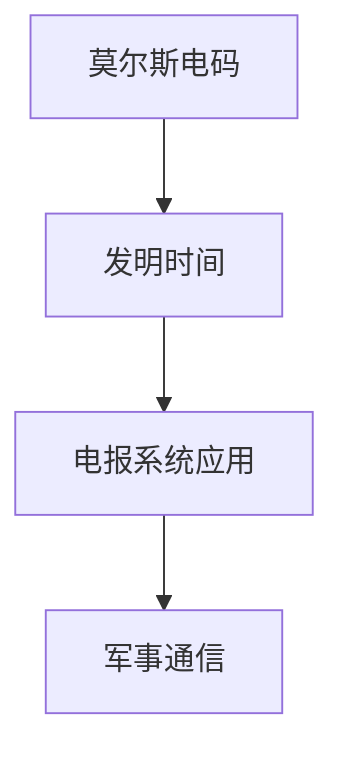

#### 1.2 莫尔斯电码的演变与现代应用

**核心概念与联系**：
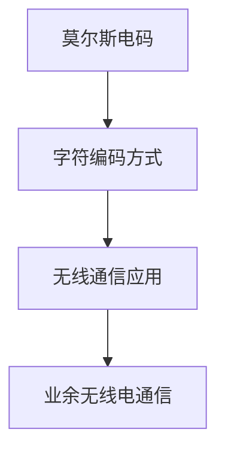

### 第2章：莫尔斯电码的基本原理

#### 2.1 莫尔斯电码的字符编码

**核心概念与联系**：
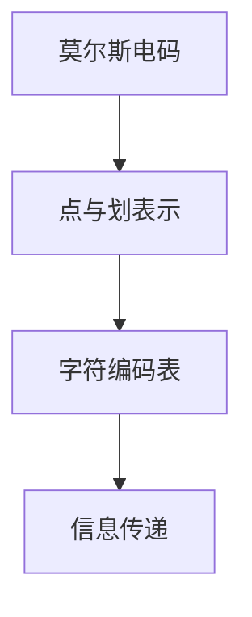

#### 2.2 莫尔斯电码的信号表示

**核心概念与联系**：
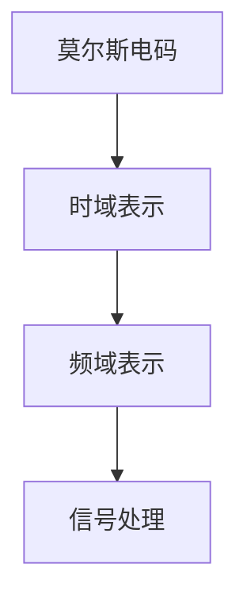

### 第3章：莫尔斯电码的传输与接收

#### 3.1 莫尔斯电码的传输方式

**核心概念与联系**：
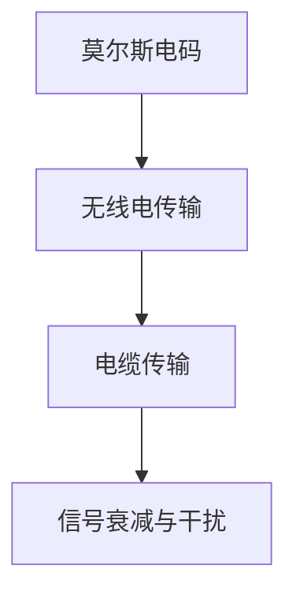

#### 3.2 莫尔斯电码的接收原理

**核心概念与联系**：
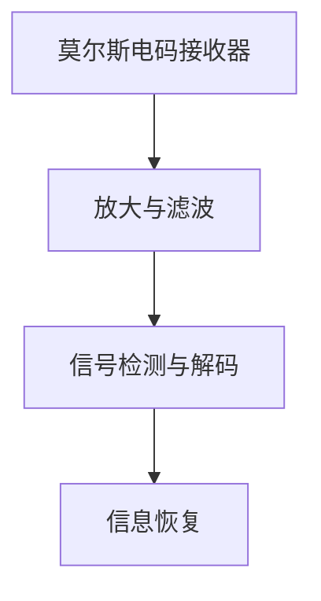

### 第4章：莫尔斯电码的优缺点分析

#### 4.1 莫尔斯电码的优点

**核心概念与联系**：
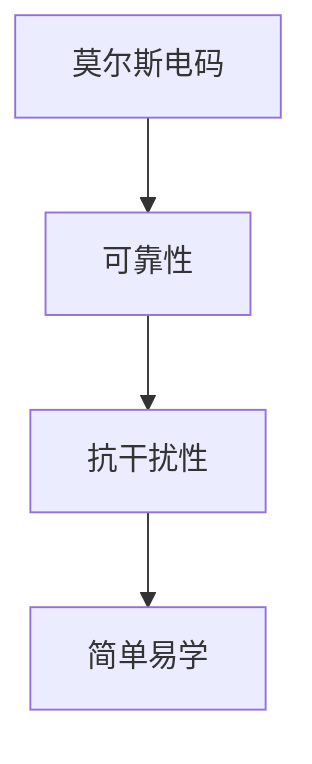

#### 4.2 莫尔斯电码的缺点

**核心概念与联系**：
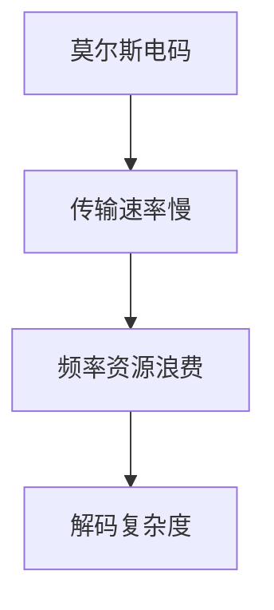

### 第二部分：信号处理基础

#### 第5章：信号处理的基本概念

#### 5.1 信号的定义与分类

**核心概念与联系**：
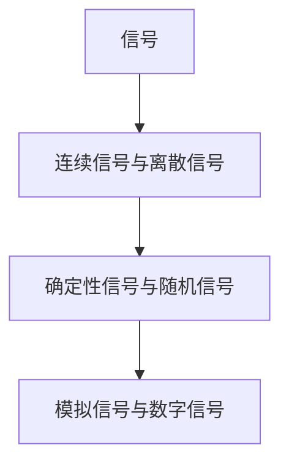

#### 5.2 信号的时域与频域分析

**核心概念与联系**：
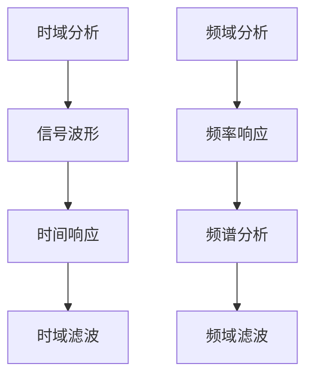

### 第6章：傅里叶变换与信号分析

#### 6.1 傅里叶变换的基本原理

**核心概念与联系**：
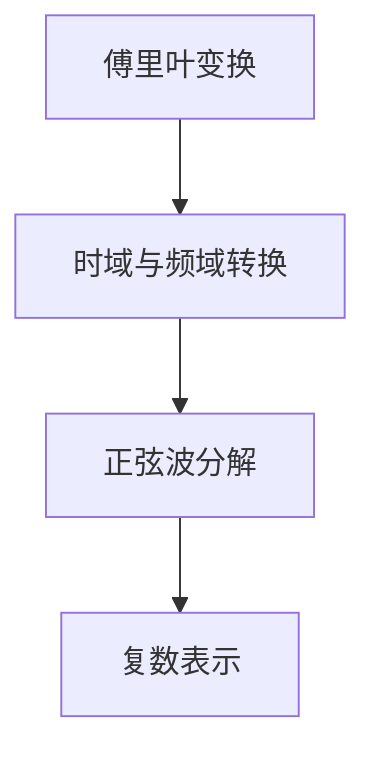

#### 6.2 傅里叶变换的应用

**核心概念与联系**：
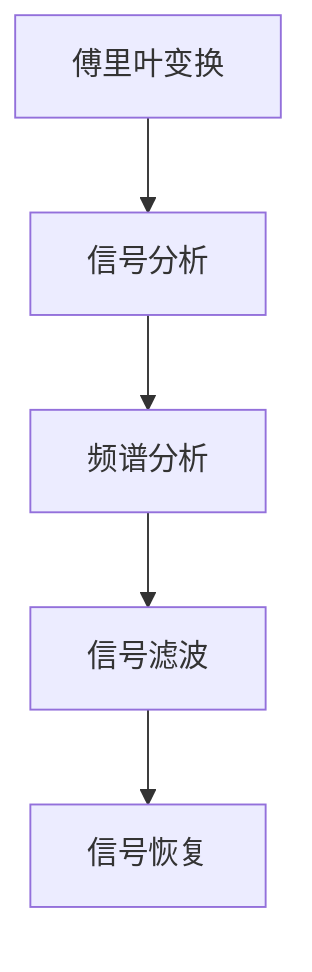

### 第7章：滤波器与信号处理

#### 7.1 滤波器的基本原理

**核心概念与联系**：
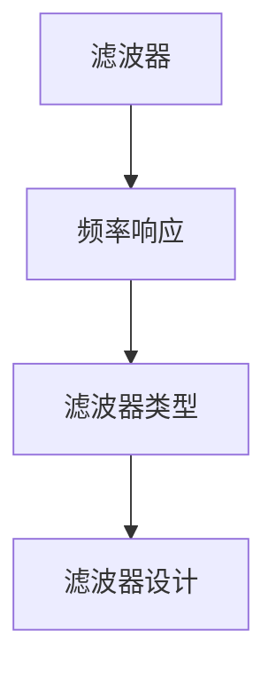

#### 7.2 滤波器在信号处理中的应用

**核心概念与联系**：
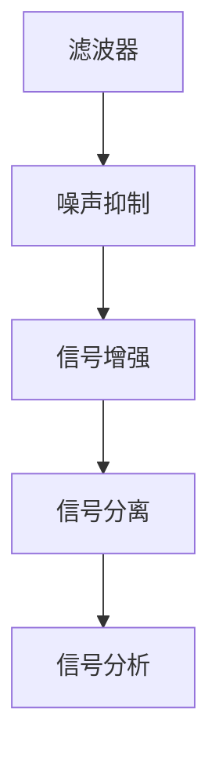

### 第8章：信号处理的算法与应用

#### 8.1 快速傅里叶变换（FFT）

**核心概念与联系**：
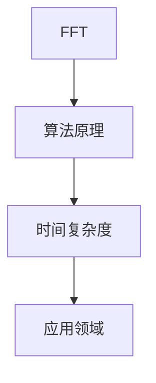

#### 8.2 波特滤波器的设计与应用

**核心概念与联系**：
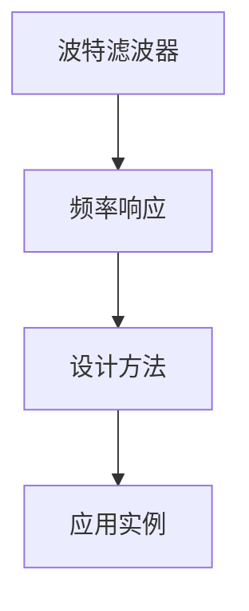

### 第三部分：莫尔斯理论与信号处理的结合

#### 第9章：莫尔斯电码与信号处理的融合

#### 9.1 莫尔斯电码的信号处理方法

**核心概念与联系**：
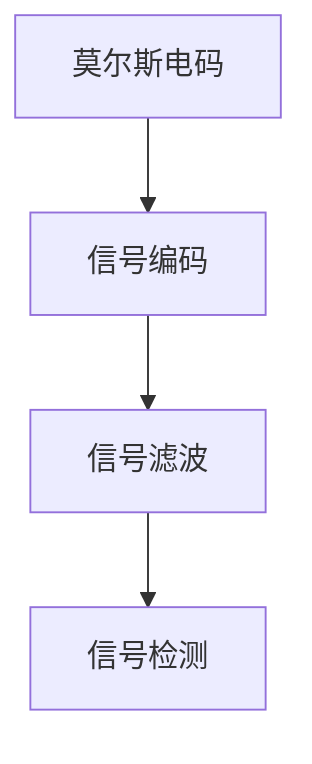

#### 9.2 信号处理在莫尔斯电码中的应用

**核心概念与联系**：
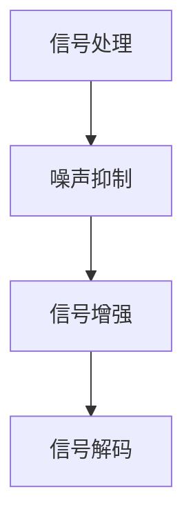

### 第10章：莫尔斯电码信号的优化与改进

#### 10.1 信号优化算法在莫尔斯电码中的应用

**核心概念与联系**：
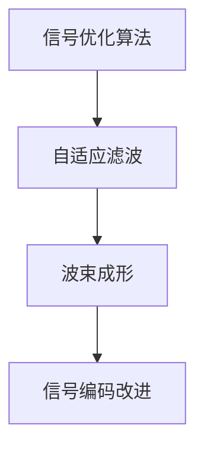

#### 10.2 莫尔斯电码信号处理的挑战与机遇

**核心概念与联系**：
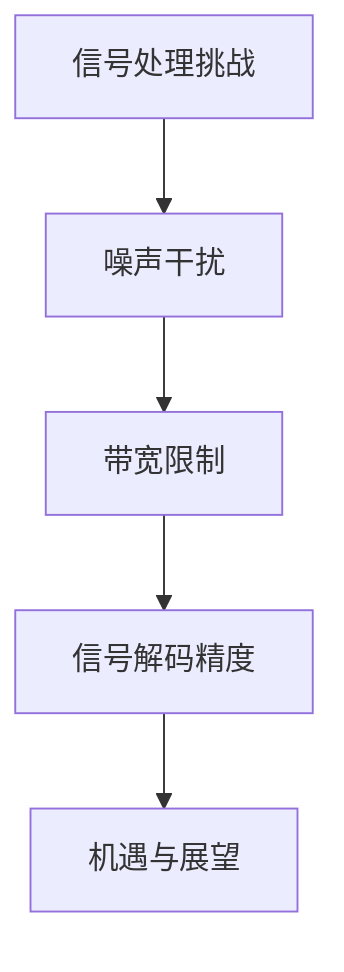

### 第四部分：莫尔斯理论与信号处理的实际应用

#### 第11章：莫尔斯电码在通信系统中的应用

#### 11.1 莫尔斯电码在无线通信中的应用

**核心概念与联系**：
```mermaid
graph TD
    A[莫尔斯电码] --> B[无线电通信]
    B --> C[调制与解调]
    C --> D[信道编码与解码]
```

#### 11.2 莫尔斯电码在卫星通信中的应用

**核心概念与联系**：
```mermaid
graph TD
    A[莫尔斯电码] --> B[卫星通信]
    B --> C[信号传输路径]
    C --> D[信号调制与解调]
```

#### 第12章：信号处理技术在莫尔斯电码接收中的应用

#### 12.1 信号处理技术在莫尔斯电码接收器中的应用

**核心概念与联系**：
```mermaid
graph TD
    A[信号处理技术] --> B[滤波器应用]
    B --> C[放大器设计]
    C --> D[信号检测与解码]
```

#### 12.2 莫尔斯电码信号处理的实验与分析

**核心概念与联系**：
```mermaid
graph TD
    A[实验设计] --> B[信号采集]
    B --> C[数据处理]
    C --> D[结果分析]
    D --> E[结论与改进]
```

### 第13章：莫尔斯理论与信号处理在其他领域的应用

#### 13.1 莫尔斯电码在军事通信中的应用

**核心概念与联系**：
```mermaid
graph TD
    A[莫尔斯电码] --> B[军事通信]
    B --> C[保密通信]
    C --> D[指挥控制]
```

#### 13.2 莫尔斯电码在业余无线电通信中的应用

**核心概念与联系**：
```mermaid
graph TD
    A[莫尔斯电码] --> B[业余无线电通信]
    B --> C[无线电爱好者]
    C --> D[信号调试与优化]
```

### 第14章：莫尔斯理论与信号处理的发展趋势

#### 14.1 莫尔斯电码的未来发展方向

**核心概念与联系**：
```mermaid
graph TD
    A[莫尔斯电码] --> B[数字通信]
    B --> C[智能信号处理]
    C --> D[应用拓展]
```

#### 14.2 信号处理技术在莫尔斯电码中的未来应用

**核心概念与联系**：
```mermaid
graph TD
    A[信号处理技术] --> B[深度学习]
    B --> C[人工智能]
    C --> D[自适应信号处理]
```

### 附录

#### 附录A：莫尔斯电码与信号处理相关工具和资源

**A.1 莫尔斯电码生成器与解码器的使用**

**A.2 信号处理软件与工具推荐**

**A.3 相关论文与文献推荐**

## 作者

作者：AI天才研究院/AI Genius Institute & 禅与计算机程序设计艺术 /Zen And The Art of Computer Programming


