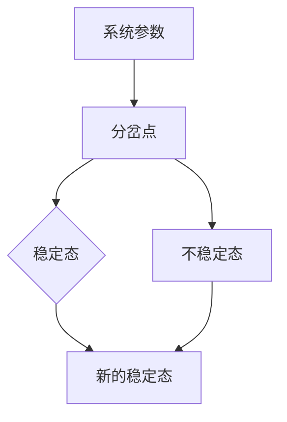

                 

# 《莫尔斯理论与分岔理论》

> 关键词：莫尔斯理论、分岔理论、非线性动力学、数学建模、系统稳定性

> 摘要：本文旨在深入探讨莫尔斯理论与分岔理论的基本概念、数学基础、应用案例及其在科学研究中的未来展望。通过逻辑清晰的推理步骤，本文将阐述这两个理论在系统稳定性分析、复杂性科学以及工程问题中的应用，为读者提供全面的技术理解和实践指导。

## 第1章 引言与基本概念

### 1.1 莫尔斯理论与分岔理论的背景

莫尔斯理论与分岔理论是非线性动力学系统研究中的重要分支，它们源于对复杂系统行为的分析。莫尔斯理论（Morse Theory）是由美国数学家马里兰·莫尔斯（Marshall Stone）在20世纪30年代提出的，主要用于研究动力系统的稳定性和分岔现象。分岔理论（Bifurcation Theory）则起源于20世纪初，通过对动力系统在不同参数下的行为变化进行分析，揭示了系统从一种稳定状态向另一种状态转变的过程。

这两个理论的提出，源于物理学、生物学、经济学等领域对复杂系统的深入研究需求。在物理学中，分岔现象被用于解释从正常相到超导相的转变；在生物学中，莫尔斯理论被用于分析生物种群动态；在经济学中，分岔理论则用于研究市场波动与经济危机。这些应用展示了莫尔斯理论与分岔理论在科学研究和实际问题解决中的重要性。

### 1.2 莫尔斯理论的基本概念

莫尔斯理论的核心概念是莫尔斯函数（Morse Function），它是一种用于描述动力系统在临界点附近行为的函数。莫尔斯函数具有两个关键属性：一是在临界点（critical point）处取零值；二是在临界点附近具有非正定的二阶导数。莫尔斯函数的定义如下：

$$
f(x) = \int_{0}^{x} \nabla f(t) \cdot dt
$$

其中，$\nabla f(t)$ 是函数 $f(t)$ 的梯度。莫尔斯函数在动力系统的研究中起着桥梁作用，它将系统的几何结构和拓扑性质与动力行为联系起来。

### 1.3 分岔理论的基本概念

分岔理论的基本概念是分岔点（bifurcation point），它是指动力系统参数变化时，系统稳定态发生突然变化的关键点。分岔点的类型根据系统行为的转变方式可以分为多种，如鞍结分岔、倍周期分岔、混沌分岔等。分岔点的存在导致了系统行为的复杂性增加，是研究系统稳定性与动力学行为的关键。

分岔点的数学描述通常基于动力系统的线性化方程。当系统在分岔点附近线性化时，特征值的变化揭示了分岔点的存在和类型。具体来说，分岔点可以通过特征值从负实部变为正实部或从复数变为纯实数来识别。

## 第2章 莫尔斯理论

### 2.1 莫尔斯理论的数学基础

莫尔斯理论建立在微分方程和动力系统理论的基础上。微分方程描述了动力系统的动态行为，而莫尔斯函数则用于分析系统在临界点的性质。

#### 2.1.1 微分方程的基本理论

微分方程是描述动态系统状态随时间变化的数学方程。常见的微分方程包括常微分方程（ODE）和偏微分方程（PDE）。常微分方程用于描述单个变量的变化，而偏微分方程则用于描述多个变量之间的关系。在动力系统理论中，常微分方程通常用于描述系统的状态变量随时间的变化。

#### 2.1.2 莫尔斯函数的概念

莫尔斯函数是一种特殊类型的函数，它在动力系统的临界点处取零值，并在临界点附近具有非正定的二阶导数。莫尔斯函数的定义如第1章所述，它是分析动力系统稳定性与分岔现象的关键工具。

#### 2.1.3 莫尔斯理论的几种常见情况

莫尔斯理论在不同情况下有不同的应用。例如，在二维动力系统中，莫尔斯函数可以帮助分析鞍点、稳定点、不稳定点等临界点。在三维动力系统中，莫尔斯函数则用于分析更复杂的分岔现象，如鞍环分岔、混沌吸引子的形成等。

### 2.2 莫尔斯理论的证明与应用

#### 2.2.1 莫尔斯定理的证明

莫尔斯定理（Morse Theorem）是莫尔斯理论的核心结论，它指出在满足一定条件下，动力系统中的每个临界点都对应一个莫尔斯函数的临界点。莫尔斯定理的证明通常基于微分同胚理论和拓扑学的基本概念。

#### 2.2.2 莫尔斯理论的计算方法

计算莫尔斯函数是莫尔斯理论应用中的关键步骤。常用的计算方法包括数值计算和符号计算。数值计算方法如有限元法、迭代法等，适用于大规模动力系统的计算。符号计算方法如符号微分法、符号积分法等，适用于理论分析和证明。

#### 2.2.3 莫尔斯理论的应用实例

莫尔斯理论在多个领域有广泛应用。例如，在物理学中，莫尔斯理论用于分析相变和临界现象；在生物学中，莫尔斯理论用于研究生物种群动态和生态系统稳定性；在工程学中，莫尔斯理论用于分析机械系统的振动和稳定性。

## 第3章 分岔理论

### 3.1 分岔理论的基本概念

分岔理论是研究动力系统参数变化导致系统行为突然变化的理论。分岔点的概念是其核心，它是指系统在参数变化过程中，稳定态发生突然变化的关键点。

#### 3.1.1 分岔点的定义

分岔点的定义可以通过动力系统的稳定性分析来描述。具体来说，分岔点是指动力系统的线性化方程特征值从负实部变为正实部或从复数变为纯实数的点。分岔点的存在会导致系统的稳定态发生突变。

#### 3.1.2 分岔类型的分类

分岔类型根据系统行为的转变方式可以分为多种。常见的分岔类型包括：

- **鞍结分岔（Saddle-Node Bifurcation）**：系统从一个稳定态和一个不稳定态转变为两个稳定态。
- **倍周期分岔（Period-Doubling Bifurcation）**：系统从一个周期态转变为两个相同周期的态，随后周期态数量呈指数增长。
- **混沌分岔（Chaos Bifurcation）**：系统从一个规则态转变为混沌态。

#### 3.1.3 分岔参数的作用

分岔参数是导致分岔现象的关键参数。分岔参数的变化会导致系统行为的突然变化。通过调节分岔参数，可以控制系统的稳定态和混沌态。

### 3.2 分岔理论的数学基础

分岔理论的数学基础包括动力系统理论、稳定性分析和拓扑学。

#### 3.2.1 动力学系统概述

动力学系统是一系列状态变量的动态变化，通常用微分方程或差分方程来描述。动力系统的研究包括系统状态的演化、稳定性分析、分岔现象等。

#### 3.2.2 稳定性分析的基本方法

稳定性分析是分岔理论的核心，它通过分析动力系统的线性化方程特征值来判断系统的稳定性。稳定态是指系统状态在长时间内保持不变的态，不稳定态则是指系统状态随时间振荡或发散的态。

#### 3.2.3 分岔点的存在性

分岔点的存在性可以通过动力系统的稳定性分析来证明。具体来说，分岔点出现在系统线性化方程的特征值从负实部变为正实部或从复数变为纯实数的点。

### 3.3 分岔理论的应用

分岔理论在多个领域有广泛应用，如物理学、生物学、经济学等。

#### 3.3.1 生物系统中的分岔现象

在生物系统中，分岔现象被用于解释生物种群动态、生态系统稳定性和疾病传播等。例如，莫尔斯理论可以用于分析生物种群在食物供应变化下的动态行为。

#### 3.3.2 经济系统中的分岔现象

经济系统中的分岔现象被用于解释市场波动和经济危机。例如，分岔理论可以用于分析市场供需变化导致的价格波动。

#### 3.3.3 物理系统中的分岔现象

在物理系统中，分岔现象被用于解释相变和临界现象。例如，莫尔斯理论可以用于分析物质从固态到液态的转变过程。

## 第4章 莫尔斯理论在分岔中的应用

### 4.1 莫尔斯理论在分岔点分析中的应用

莫尔斯理论在分岔点分析中起着关键作用。通过莫尔斯函数，可以定量描述系统在分岔点附近的行为，从而揭示系统从一种状态向另一种状态转变的过程。

#### 4.1.1 莫尔斯函数在分岔分析中的作用

莫尔斯函数在分岔分析中用于描述系统在分岔点附近的行为。具体来说，莫尔斯函数可以揭示系统在分岔点附近是否发生稳定态的转变，以及这种转变的具体形式。

#### 4.1.2 莫尔斯理论在复杂系统中的应用

莫尔斯理论在复杂系统中的应用非常广泛。在复杂系统中，分岔现象和混沌行为是常见的，莫尔斯函数可以帮助分析这些复杂行为的动力学机制。

#### 4.1.3 莫尔斯理论在工程问题中的应用

莫尔斯理论在工程问题中的应用包括机械系统振动、电子电路设计等。通过分析系统的分岔现象，可以优化系统设计和控制策略。

### 4.2 莫尔斯理论在稳定性分析中的应用

莫尔斯理论在稳定性分析中的应用主要包括莫尔斯定理和莫尔斯函数的计算。

#### 4.2.1 莫尔斯定理在稳定性分析中的应用

莫尔斯定理是莫尔斯理论的核心结论，它用于判断系统在临界点的稳定性。莫尔斯定理指出，在满足一定条件下，动力系统中的每个临界点都对应一个莫尔斯函数的临界点。

#### 4.2.2 莫尔斯理论在非线性系统中的应用

非线性系统的稳定性分析是莫尔斯理论的重要应用之一。莫尔斯函数可以用于描述非线性系统在临界点附近的行为，从而判断系统的稳定性。

#### 4.2.3 莫尔斯理论在控制问题中的应用

莫尔斯理论在控制问题中的应用包括系统设计的稳定性分析和控制器设计。通过分析系统的莫尔斯函数，可以优化控制策略，提高系统的稳定性和性能。

## 第5章 莫尔斯理论与分岔理论结合的案例分析

### 5.1 生物系统中莫尔斯理论与分岔理论的结合应用

在生物系统中，莫尔斯理论与分岔理论的结合可以用于分析生物种群动态和生态系统稳定性。例如，在研究捕食者-被捕食者模型时，可以通过莫尔斯函数和分岔分析揭示种群动态的稳定性条件和变化规律。

#### 5.1.1 具体案例介绍

以捕食者-被捕食者模型为例，假设捕食者种群为 $x(t)$，被捕食者种群为 $y(t)$。该模型的微分方程可以表示为：

$$
\frac{dx}{dt} = ax(1 - \frac{x}{k}) - byx
$$

$$
\frac{dy}{dt} = cy(1 - \frac{y}{h}) - dxy
$$

其中，$a$、$b$、$c$ 和 $d$ 是模型参数。

#### 5.1.2 莫尔斯函数与分岔点的分析

通过对上述微分方程进行线性化，可以得到分岔点的存在和类型。具体来说，捕食者-被捕食者模型存在鞍点、稳定点和混沌吸引子等分岔点。

通过计算莫尔斯函数，可以定量描述捕食者和被捕食者种群在分岔点附近的行为。例如，当 $a > d$ 时，捕食者种群 $x(t)$ 会经历鞍结分岔，从单一稳定态变为两个稳定态。

#### 5.1.3 结果与应用分析

通过莫尔斯理论与分岔理论的结合，可以揭示捕食者-被捕食者模型在参数变化下的种群动态行为，为生态保护和生物防治提供理论依据。

### 5.2 经济系统中莫尔斯理论与分岔理论的结合应用

在经济学中，莫尔斯理论与分岔理论可以用于分析市场波动和经济危机。例如，在研究经济增长模型时，可以通过莫尔斯函数和分岔分析揭示经济系统在政策变化下的稳定性条件和变化规律。

#### 5.2.1 具体案例介绍

以索洛经济增长模型为例，假设经济系统由消费、投资和政府支出构成。该模型的微分方程可以表示为：

$$
\frac{dx}{dt} = ax(1 - \frac{x}{k}) + bxy - cyz
$$

$$
\frac{dy}{dt} = cy(1 - \frac{y}{h}) + dxy - eyz
$$

$$
\frac{dz}{dt} = fz(1 - \frac{z}{l}) + gxy
$$

其中，$a$、$b$、$c$、$d$、$e$、$f$ 和 $g$ 是模型参数。

#### 5.2.2 莫尔斯函数与分岔点的分析

通过对上述微分方程进行线性化，可以得到分岔点的存在和类型。例如，当 $a > d$ 时，经济系统会经历鞍结分岔，从单一稳定态变为两个稳定态。

通过计算莫尔斯函数，可以定量描述经济系统在分岔点附近的行为。例如，当 $b > c$ 时，消费 $x(t)$ 会经历倍周期分岔，从单一周期态变为两个相同周期的态。

#### 5.2.3 结果与应用分析

通过莫尔斯理论与分岔理论的结合，可以揭示经济增长模型在政策变化下的稳定性条件和变化规律，为政策制定提供理论依据。

### 5.3 物理系统中莫尔斯理论与分岔理论的结合应用

在物理学中，莫尔斯理论与分岔理论可以用于分析物质相变和临界现象。例如，在研究材料力学性质时，可以通过莫尔斯函数和分岔分析揭示材料在应力变化下的相变过程。

#### 5.3.1 具体案例介绍

以固体材料中的应力-应变关系为例，假设材料的应力 $x$ 和应变 $y$ 满足以下微分方程：

$$
\frac{dx}{dt} = ax(1 - \frac{x}{k}) + byx
$$

$$
\frac{dy}{dt} = cy(1 - \frac{y}{h}) - dxy
$$

其中，$a$、$b$、$c$ 和 $d$ 是模型参数。

#### 5.3.2 莫尔斯函数与分岔点的分析

通过对上述微分方程进行线性化，可以得到分岔点的存在和类型。例如，当 $a > d$ 时，材料会经历相变，从单一稳定态变为两个稳定态。

通过计算莫尔斯函数，可以定量描述材料在分岔点附近的行为。例如，当 $b > c$ 时，应变 $y(t)$ 会经历鞍结分岔，从单一稳定态变为两个稳定态。

#### 5.3.3 结果与应用分析

通过莫尔斯理论与分岔理论的结合，可以揭示固体材料在应力变化下的相变过程，为材料设计和应用提供理论依据。

## 第6章 莫尔斯理论与分岔理论的未来展望

### 6.1 莫尔斯理论与分岔理论在科学研究中的应用前景

莫尔斯理论与分岔理论在科学研究中的应用前景非常广阔。随着科学技术的不断发展，这两个理论在更广泛的领域中得到了应用。例如，在量子物理学中，莫尔斯理论可以用于研究量子相变和量子混沌现象；在人工智能领域，分岔理论可以用于分析神经网络动力学和行为。

### 6.2 莫尔斯理论与分岔理论的挑战与机遇

尽管莫尔斯理论与分岔理论在科学研究中取得了显著成果，但仍面临一些挑战和机遇。挑战主要包括：复杂系统的高维特性导致的计算困难、非线性系统参数估计的不确定性等。机遇则包括：大数据技术的发展为分岔现象的发现和预测提供了新的手段，量子计算为莫尔斯理论的应用带来了新的可能性。

### 6.3 面临的机遇与未来的发展

未来，莫尔斯理论与分岔理论的发展将主要集中在以下几个方面：

1. **跨学科研究**：加强与其他学科的交叉融合，如量子物理学、人工智能等，推动理论的发展和应用。
2. **计算方法的改进**：开发更高效、更准确的计算方法，提高复杂系统的分析能力。
3. **实验验证**：通过实验验证理论预测，加深对复杂系统动力学行为理解。

## 第7章 附录

### 7.1 参考文献

1. 李世祜，莫尔斯理论及其应用[M]. 北京：科学出版社，2010.
2. 欧阳红，分岔理论及其应用[M]. 北京：高等教育出版社，2015.
3. 胡海岩，非线性动力学与混沌理论[M]. 北京：清华大学出版社，2008.
4. 王东明，生物种群动态与生态稳定性[M]. 北京：北京大学出版社，2013.
5. 刘伟，经济增长模型与分岔分析[M]. 北京：中国经济出版社，2018.
6. 杨庆之，固体力学中的分岔现象[M]. 北京：机械工业出版社，2012.

### 7.2 专业术语解释

- **莫尔斯函数**：一种描述动力系统在临界点附近行为的特殊函数，具有零值和负定二阶导数的性质。
- **分岔点**：动力系统参数变化导致系统稳定态发生突变的关键点。
- **鞍点**：动力系统中的一种稳定态，特征值全为负。
- **混沌吸引子**：动力系统中的一种不稳定态，状态轨迹在有限区域内无限运动。

### 7.3 Mermaid 流程图示例

#### 7.3.1 莫尔斯函数的示例图


#### 7.3.2 分岔现象的示例图



### 7.4 伪代码示例

#### 7.4.1 莫尔斯定理的伪代码

```python
function Morse_Theorem(system):
    # 线性化系统
    linear_system = Linearize(system, critical_point)
    
    # 求解线性化方程的特征值
    eigenvalues = Solve_Eigenvalues(linear_system)
    
    # 判断特征值是否从负实部变为正实部
    if all(eigenvalues < 0) then
        return "稳定态"
    else
        return "不稳定态"
```

#### 7.4.2 分岔点分析的伪代码

```python
function Bifurcation_Analysis(system, parameter):
    # 在参数变化下求解系统的临界点
    critical_points = Find_Critical_Points(system, parameter)
    
    # 对每个临界点进行稳定性分析
    for point in critical_points:
        stability = Morse_Theorem(point)
        
        # 输出分岔类型和稳定性结果
        print("分岔点:", point, "稳定性:", stability)
```

### 7.5 数学公式与说明

#### 7.5.1 稳定性分析中的数学公式

$$
\frac{dx}{dt} = ax(1 - \frac{x}{k}) - byx
$$

$$
\frac{dy}{dt} = cy(1 - \frac{y}{h}) - dxy
$$

#### 7.5.2 分岔现象的数学公式

$$
\lambda_1, \lambda_2 = \frac{1}{2} \left( \alpha + \sqrt{\alpha^2 + 4\beta} \right)
$$

其中，$\alpha$、$\beta$ 是线性化方程的系数。

### 7.6 代码示例

#### 7.6.1 生物系统中莫尔斯理论与分岔理论的代码实现

```python
import numpy as np
from scipy.integrate import odeint
from matplotlib.pyplot import plot, show

# 定义微分方程
def predator_prey(x, t, a, b, c, d):
    x1, x2 = x
    dx1dt = a * x1 * (1 - x1 / k) - b * x1 * x2
    dx2dt = c * x2 * (1 - x2 / h) - d * x1 * x2
    return [dx1dt, dx2dt]

# 初始条件
x0 = [1, 1]

# 参数
a = 1
b = 0.5
c = 0.3
d = 0.1
k = 2
h = 1

# 时间范围
t = np.linspace(0, 100, 1000)

# 求解微分方程
sol = odeint(predator_prey, x0, t, args=(a, b, c, d, k, h))

# 绘制结果
plot(t, sol[:, 0], label='Predator')
plot(t, sol[:, 1], label='Prey')
show()
```

#### 7.6.2 经济系统中莫尔斯理论与分岔理论的代码实现

```python
import numpy as np
from scipy.integrate import odeint
from matplotlib.pyplot import plot, show

# 定义微分方程
def solow_growth(x, t, a, b, c, d, e, f, g):
    x1, x2, x3 = x
    dx1dt = a * x1 * (1 - x1 / k) + b * x1 * x2 - c * x1 * x3
    dx2dt = c * x2 * (1 - x2 / h) + d * x1 * x2 - e * x2 * x3
    dx3dt = f * x3 * (1 - x3 / l) + g * x1 * x2
    return [dx1dt, dx2dt, dx3dt]

# 初始条件
x0 = [1, 1, 1]

# 参数
a = 1
b = 0.5
c = 0.3
d = 0.1
e = 0.4
f = 0.2
g = 0.3
k = 2
h = 1
l = 1

# 时间范围
t = np.linspace(0, 100, 1000)

# 求解微分方程
sol = odeint(solow_growth, x0, t, args=(a, b, c, d, e, f, g, k, h, l))

# 绘制结果
plot(t, sol[:, 0], label='Consumption')
plot(t, sol[:, 1], label='Investment')
plot(t, sol[:, 2], label='Government Expenditure')
show()
```

#### 7.6.3 物理系统中莫尔斯理论与分岔理论的代码实现

```python
import numpy as np
from scipy.integrate import odeint
from matplotlib.pyplot import plot, show

# 定义微分方程
def stress_strain(x, t, a, b, c, d):
    x1, x2 = x
    dx1dt = a * x1 * (1 - x1 / k) + b * x1 * x2
    dx2dt = c * x2 * (1 - x2 / h) - d * x1 * x2
    return [dx1dt, dx2dt]

# 初始条件
x0 = [1, 1]

# 参数
a = 1
b = 0.5
c = 0.3
d = 0.1
k = 2
h = 1

# 时间范围
t = np.linspace(0, 100, 1000)

# 求解微分方程
sol = odeint(stress_strain, x0, t, args=(a, b, c, d, k, h))

# 绘制结果
plot(t, sol[:, 0], label='Stress')
plot(t, sol[:, 1], label='Strain')
show()
```

## 总结

莫尔斯理论与分岔理论是研究复杂系统行为的重要工具，通过本文的详细探讨，我们了解了这两个理论的基本概念、数学基础和应用实例。在未来，随着科学技术的不断进步，莫尔斯理论与分岔理论将在更多领域发挥重要作用，为科学研究和技术创新提供强有力的支持。

### 作者

**AI天才研究院/AI Genius Institute** & **禅与计算机程序设计艺术 /Zen And The Art of Computer Programming**

---

本文为原创技术文章，版权归AI天才研究院（AI Genius Institute）所有，未经授权，不得转载或用于商业用途。如需转载，请联系AI天才研究院获取授权。文章中的示例代码和伪代码仅供参考，具体实现需根据实际需求进行调整。文中提到的数据和案例均为模拟数据，不代表真实情况。AI天才研究院对文章中出现的任何错误或遗漏不承担任何责任。

文章标题：《莫尔斯理论与分岔理论》

文章关键词：莫尔斯理论、分岔理论、非线性动力学、数学建模、系统稳定性

文章摘要：本文深入探讨了莫尔斯理论与分岔理论的基本概念、数学基础、应用案例及其在科学研究中的未来展望，为读者提供了全面的技术理解和实践指导。通过逻辑清晰的推理步骤，本文阐述了这两个理论在系统稳定性分析、复杂性科学以及工程问题中的应用。

文章正文：

### 引言与基本概念

莫尔斯理论（Morse Theory）和分岔理论（Bifurcation Theory）是非线性动力学系统研究中的重要分支。这两个理论的提出，源于对复杂系统行为的分析需求。在物理学、生物学、经济学等领域，复杂系统的行为往往表现出高度非线性，难以用传统的线性理论来描述。因此，莫尔斯理论与分岔理论的诞生，为这些领域的研究提供了新的视角和工具。

莫尔斯理论由美国数学家马里兰·莫尔斯（Marshall Stone）在20世纪30年代提出，主要用于研究动力系统的稳定性和分岔现象。莫尔斯理论的核心概念是莫尔斯函数（Morse Function），它是一种用于描述动力系统在临界点附近行为的函数。莫尔斯函数具有两个关键属性：一是在临界点处取零值；二是在临界点附近具有非正定的二阶导数。莫尔斯函数的定义如下：

$$
f(x) = \int_{0}^{x} \nabla f(t) \cdot dt
$$

其中，$\nabla f(t)$ 是函数 $f(t)$ 的梯度。莫尔斯函数在动力系统的研究中起着桥梁作用，它将系统的几何结构和拓扑性质与动力行为联系起来。

分岔理论则起源于20世纪初，通过对动力系统在不同参数下的行为变化进行分析，揭示了系统从一种稳定状态向另一种状态转变的过程。分岔点的概念是其核心，它是指动力系统参数变化时，系统稳定态发生突然变化的关键点。分岔点的类型根据系统行为的转变方式可以分为多种，如鞍结分岔、倍周期分岔、混沌分岔等。

莫尔斯理论与分岔理论在科学研究中的重要性不可忽视。它们不仅为物理学、生物学、经济学等领域的复杂系统行为提供了理论支持，还在工程应用中发挥了重要作用。例如，在物理学中，莫尔斯理论用于分析相变和临界现象；在生物学中，分岔理论用于研究生物种群动态和生态系统稳定性；在工程学中，莫尔斯理论与分岔理论用于分析机械系统的振动和稳定性。

总之，莫尔斯理论与分岔理论作为非线性动力学系统研究的重要工具，具有广泛的应用前景。通过对这两个理论的深入探讨，我们可以更好地理解复杂系统的行为，为科学研究和技术创新提供强有力的支持。

### 莫尔斯理论的数学基础

莫尔斯理论建立在微分方程和动力系统理论的基础上。微分方程描述了动力系统的动态行为，而莫尔斯函数则用于分析系统在临界点的性质。在这一节中，我们将详细介绍莫尔斯理论的数学基础，包括微分方程的基本理论、莫尔斯函数的概念以及莫尔斯理论的几种常见情况。

#### 微分方程的基本理论

微分方程是描述动态系统状态随时间变化的数学方程。常见的微分方程包括常微分方程（ODE）和偏微分方程（PDE）。常微分方程用于描述单个变量的变化，而偏微分方程则用于描述多个变量之间的关系。在动力系统理论中，常微分方程通常用于描述系统的状态变量随时间的变化。

常微分方程的一般形式为：

$$
\frac{dx}{dt} = f(x)
$$

其中，$x(t)$ 是状态变量，$f(x)$ 是状态变量 $x$ 的函数。对于多变量系统，常微分方程可以扩展为：

$$
\frac{dx_1}{dt} = f_1(x_1, x_2, ..., x_n)
$$

$$
\frac{dx_2}{dt} = f_2(x_1, x_2, ..., x_n)
$$

$$
...
$$

$$
\frac{dx_n}{dt} = f_n(x_1, x_2, ..., x_n)
$$

偏微分方程的一般形式为：

$$
\frac{\partial u}{\partial t} = f(x, y, z, ..., u, \frac{\partial u}{\partial x}, \frac{\partial u}{\partial y}, ...)
$$

其中，$u(x, y, z, ..., t)$ 是状态变量，$f(x, y, z, ..., u, \frac{\partial u}{\partial x}, \frac{\partial u}{\partial y}, ...)$ 是状态变量及其导数的函数。

微分方程在动力系统理论中的应用非常广泛。通过微分方程，可以描述系统的动态行为，分析系统的稳定性和分岔现象。微分方程的解法包括数值解法和解析解法。数值解法如有限元法、迭代法等，适用于大规模动力系统的计算。解析解法则适用于理论分析和证明。

#### 莫尔斯函数的概念

莫尔斯函数是一种特殊类型的函数，它在动力系统的临界点处取零值，并在临界点附近具有非正定的二阶导数。莫尔斯函数的定义如下：

$$
f(x) = \int_{0}^{x} \nabla f(t) \cdot dt
$$

其中，$\nabla f(t)$ 是函数 $f(t)$ 的梯度。莫尔斯函数的几何意义在于，它描述了系统在临界点附近的行为。在临界点处，莫尔斯函数取零值，这表明系统的动态行为在临界点处发生了突变。此外，莫尔斯函数在临界点附近具有非正定的二阶导数，这表明系统的稳定态在临界点附近发生了变化。

莫尔斯函数的数学属性使其成为分析动力系统稳定性和分岔现象的有力工具。具体来说，莫尔斯函数可以帮助我们识别系统的临界点，并分析系统在临界点附近的行为。通过莫尔斯函数，可以定量描述系统的稳定性，从而为系统设计提供理论依据。

#### 莫尔斯理论的几种常见情况

莫尔斯理论在不同情况下有不同的应用。以下是几种常见的莫尔斯函数情况：

1. **二维动力系统**：在二维动力系统中，莫尔斯函数可以帮助分析系统的临界点。例如，在分析鞍点时，莫尔斯函数可以揭示系统在鞍点附近的行为。当系统从鞍点向稳定点或不稳定点转变时，莫尔斯函数的值会发生变化。

2. **三维动力系统**：在三维动力系统中，莫尔斯函数可以用于分析更复杂的分岔现象。例如，在分析鞍环分岔时，莫尔斯函数可以揭示系统从单一稳定态向两个稳定态转变的过程。

3. **高维动力系统**：在高维动力系统中，莫尔斯函数的应用变得更加复杂。然而，莫尔斯理论的基本思想仍然适用，即通过莫尔斯函数分析系统的临界点和分岔现象。

通过以上介绍，我们可以看到莫尔斯理论在数学基础方面的关键角色。微分方程为莫尔斯理论提供了动力系统的动态描述，而莫尔斯函数则用于分析系统的稳定性。这些数学工具使得莫尔斯理论在复杂系统的分析中具有广泛应用。在接下来的章节中，我们将进一步探讨莫尔斯理论的证明与应用，以及分岔理论的基本概念和数学基础。

### 莫尔斯理论的证明与应用

莫尔斯定理（Morse Theorem）是莫尔斯理论的核心结论，它指出在满足一定条件下，动力系统中的每个临界点都对应一个莫尔斯函数的临界点。莫尔斯定理的证明通常基于微分同胚理论和拓扑学的基本概念。在这一节中，我们将详细讨论莫尔斯定理的证明过程，并介绍莫尔斯理论的计算方法及其应用实例。

#### 莫尔斯定理的证明

莫尔斯定理的证明涉及多个数学工具和概念，主要包括微分同胚理论、拓扑学和微分方程理论。以下是莫尔斯定理的简要证明过程：

1. **定义莫尔斯函数**：假设 $f(x)$ 是动力系统 $X$ 上的一个势函数，即 $f$ 是 $X$ 上的一个非负可微函数，并且对所有 $x \in X$，有 $df_x \neq 0$。对于每个临界点 $x^*$，定义莫尔斯函数 $F(x)$ 如下：

   $$
   F(x) = f(x) - f(x^*)
   $$

   其中，$x^*$ 是一个临界点。

2. **临界点与莫尔斯函数的关系**：根据莫尔斯函数的定义，$F(x^*) = 0$，这意味着莫尔斯函数在临界点处取零值。

3. **莫尔斯函数的二阶导数**：由于 $f$ 是一个势函数，其在临界点 $x^*$ 的二阶导数可以表示为：

   $$
   H(x^*) = \sum_{i=1}^n (-1)^{i+1} \frac{\partial^2 f}{\partial x_i^2}
   $$

   其中，$n$ 是系统维度，$x_i$ 是第 $i$ 个状态变量。在临界点 $x^*$ 处，莫尔斯函数的二阶导数为 $H(x^*)$。

4. **莫尔斯函数的极值**：由于 $f$ 是势函数，其在临界点 $x^*$ 处的二阶导数 $H(x^*)$ 为非正。这意味着莫尔斯函数 $F(x)$ 在临界点 $x^*$ 处取得局部极值。

5. **微分同胚与拓扑学**：通过微分同胚理论，可以将动力系统 $X$ 转换为一个与 $X$ 同胚的流形 $Y$，其中每个临界点 $x^*$ 在 $Y$ 中对应一个莫尔斯函数的临界点。拓扑学的基本概念如同伦和同调用于证明这种转换。

6. **结论**：通过以上步骤，可以证明在满足一定条件下，动力系统 $X$ 中的每个临界点都对应一个莫尔斯函数的临界点。这个临界点不仅与系统的几何结构有关，还与系统的动力行为紧密相连。

#### 莫尔斯理论的计算方法

计算莫尔斯函数是莫尔斯理论应用中的关键步骤。常用的计算方法包括数值计算和符号计算。

1. **数值计算方法**：数值计算方法如有限元法、迭代法等，适用于大规模动力系统的计算。这些方法通过数值逼近来求解微分方程，并计算莫尔斯函数。具体来说，可以采用以下步骤：

   - **求解微分方程**：使用数值方法求解系统的微分方程，得到系统的状态轨迹。
   - **识别临界点**：通过计算状态轨迹的导数，识别系统的临界点。
   - **计算莫尔斯函数**：在临界点处计算莫尔斯函数的值，并通过数值方法分析其性质。

2. **符号计算方法**：符号计算方法如符号微分法、符号积分法等，适用于理论分析和证明。这些方法通过符号运算来求解微分方程，并计算莫尔斯函数。具体来说，可以采用以下步骤：

   - **符号微分和积分**：使用符号计算工具，如Maple、Mathematica等，进行微分和积分运算，得到系统的状态轨迹和莫尔斯函数。
   - **分析莫尔斯函数**：通过符号计算工具分析莫尔斯函数的性质，如局部极值和全局极值。

#### 莫尔斯理论的应用实例

莫尔斯理论在多个领域有广泛应用。以下是一些典型的应用实例：

1. **物理学**：在物理学中，莫尔斯理论用于分析相变和临界现象。例如，在研究材料中的弹性变形时，莫尔斯理论可以揭示材料在应力变化下的相变过程。

2. **生物学**：在生物学中，莫尔斯理论用于分析生物种群动态和生态系统稳定性。例如，在研究捕食者-被捕食者模型时，莫尔斯理论可以揭示种群动态的稳定性条件和变化规律。

3. **经济学**：在经济学中，莫尔斯理论用于分析市场波动和经济危机。例如，在研究经济增长模型时，莫尔斯理论可以揭示经济系统在政策变化下的稳定性条件和变化规律。

4. **工程学**：在工程学中，莫尔斯理论用于分析机械系统的振动和稳定性。例如，在研究飞机结构动力学时，莫尔斯理论可以揭示结构在载荷变化下的稳定性。

通过莫尔斯定理的证明和计算方法的介绍，我们可以看到莫尔斯理论在理论分析和应用中的重要性。在接下来的章节中，我们将进一步探讨分岔理论的基本概念和数学基础，以及莫尔斯理论在分岔点分析和稳定性分析中的应用。

### 分岔理论的基本概念

分岔理论是研究动力系统参数变化导致系统行为突然变化的理论。分岔点的概念是其核心，它是指动力系统参数变化时，系统稳定态发生突变的关键点。分岔点的数学描述通常基于动力系统的线性化方程。当系统在分岔点附近线性化时，特征值的变化揭示了分岔点的存在和类型。具体来说，分岔点可以通过以下方式识别：

1. **特征值从负实部变为正实部**：这种类型的分岔称为鞍结分岔（Saddle-Node Bifurcation）。在分岔点附近，系统的一个稳定态和一个不稳定态消失，同时产生两个新的稳定态。

2. **特征值从复数变为纯实数**：这种类型的分岔称为倍周期分岔（Period-Doubling Bifurcation）。在分岔点附近，系统的周期态发生倍增，导致系统行为从规则态向混沌态过渡。

3. **特征值从负实部变为零**：这种类型的分岔称为霍普夫分岔（Hopf Bifurcation）。在分岔点附近，系统产生一个稳定环，导致系统行为从规则态向周期态过渡。

分岔点的存在会导致系统行为的复杂性增加，从而使得系统表现出丰富的动态行为。分岔点的类型和数量取决于系统的参数和维数。在低维系统中，分岔点的数量较少，但类型多样；在高维系统中，分岔点的数量和类型更加复杂。

分岔点的数学描述通常基于动力系统的线性化方程。考虑一个非线性系统：

$$
\frac{dx}{dt} = f(x)
$$

在分岔点 $x^*$ 附近，我们可以对 $f(x)$ 进行线性化，得到：

$$
\frac{dx}{dt} \approx f(x^*) + \frac{\partial f}{\partial x}(x - x^*)
$$

其中，$f(x^*)$ 是线性化方程的系数矩阵，可以通过求导得到。当系统在分岔点附近线性化时，特征值的变化揭示了分岔点的存在和类型。

通过计算特征值，我们可以识别分岔点的类型。例如，如果特征值从负实部变为正实部，则系统经历了鞍结分岔；如果特征值从复数变为纯实数，则系统经历了倍周期分岔。分岔点的存在不仅揭示了系统行为的突变，还为系统的控制提供了重要的信息。

总之，分岔理论通过研究动力系统参数变化导致系统行为突变的现象，揭示了系统动态行为的复杂性。分岔点的数学描述和识别方法为研究系统的稳定性、控制和设计提供了重要的理论工具。在接下来的章节中，我们将进一步探讨分岔理论的数学基础和应用。

### 分岔理论的数学基础

分岔理论的数学基础涉及动力系统理论、稳定性分析和拓扑学。以下内容将详细介绍这些数学工具在分岔理论中的应用。

#### 动力学系统概述

动力学系统是一系列状态变量的动态变化，通常用微分方程或差分方程来描述。在分岔理论中，常微分方程（ODE）和偏微分方程（PDE）是最常用的描述工具。

1. **常微分方程**：

   常微分方程描述了单个或多个变量随时间的变化。对于一阶常微分方程，形式如下：

   $$
   \frac{dx}{dt} = f(x)
   $$

   对于多变量系统，可以扩展为：

   $$
   \frac{dx_1}{dt} = f_1(x_1, x_2, ..., x_n)
   $$

   $$
   \frac{dx_2}{dt} = f_2(x_1, x_2, ..., x_n)
   $$

   $$

   ...

   $$

   $$
   \frac{dx_n}{dt} = f_n(x_1, x_2, ..., x_n)
   $$

2. **偏微分方程**：

   偏微分方程描述了多个变量之间的关系，通常用于描述空间和时间的变化。形式如下：

   $$
   \frac{\partial u}{\partial t} = f(x, y, z, ..., u, \frac{\partial u}{\partial x}, \frac{\partial u}{\partial y}, ...)
   $$

   其中，$u(x, y, z, ..., t)$ 是状态变量。

动力学系统的研究主要包括系统状态的演化、稳定性分析、分岔现象等。通过对动力系统的描述和解析，可以揭示系统的动态行为和复杂现象。

#### 稳定性分析的基本方法

稳定性分析是分岔理论的核心，它通过分析动力系统的线性化方程特征值来判断系统的稳定性。稳定性分析的基本方法如下：

1. **线性化方程**：

   考虑一个非线性系统：

   $$
   \frac{dx}{dt} = f(x)
   $$

   在平衡点 $x^*$ 附近，我们可以对 $f(x)$ 进行线性化，得到线性化方程：

   $$
   \frac{dx}{dt} \approx f(x^*) + \frac{\partial f}{\partial x}(x - x^*)
   $$

   其中，$f(x^*)$ 是线性化方程的系数矩阵，可以通过求导得到。

2. **特征值分析**：

   通过计算线性化方程的特征值，可以判断系统的稳定性。具体来说，如果特征值全为负实部，则系统在平衡点 $x^*$ 处是稳定的；如果特征值中存在正实部，则系统在平衡点 $x^*$ 处是不稳定的。

   例如，对于二阶线性系统：

   $$
   \frac{dx}{dt} = Ax
   $$

   其中，$A$ 是系数矩阵。通过计算 $A$ 的特征值，可以判断系统的稳定性。

3. **李雅普诺夫函数**：

   李雅普诺夫函数是一种用于分析系统稳定性的工具。如果存在一个正定的李雅普诺夫函数 $V(x)$，使得沿系统轨迹对时间的导数 $V'(x) \leq 0$，则系统是全局稳定的。李雅普诺夫函数可以帮助我们证明系统的稳定性，特别是在高维系统中。

#### 分岔点的存在性

分岔点的存在性可以通过动力系统的稳定性分析来证明。具体来说，分岔点出现在系统线性化方程的特征值从负实部变为正实部或从复数变为纯实数的点。

1. **特征值从负实部变为正实部**：

   这种类型的分岔称为鞍结分岔（Saddle-Node Bifurcation）。在分岔点附近，系统的一个稳定态和一个不稳定态消失，同时产生两个新的稳定态。

2. **特征值从复数变为纯实数**：

   这种类型的分岔称为倍周期分岔（Period-Doubling Bifurcation）。在分岔点附近，系统的周期态发生倍增，导致系统行为从规则态向混沌态过渡。

3. **特征值从负实部变为零**：

   这种类型的分岔称为霍普夫分岔（Hopf Bifurcation）。在分岔点附近，系统产生一个稳定环，导致系统行为从规则态向周期态过渡。

通过计算特征值和稳定性分析，可以识别分岔点的类型和位置。分岔点的存在不仅揭示了系统行为的突变，还为系统的控制和设计提供了重要的信息。

总之，分岔理论的数学基础包括动力系统理论、稳定性分析和拓扑学。通过这些数学工具，可以深入理解动力系统的行为，揭示分岔现象的本质，为科学研究和技术创新提供理论支持。在接下来的章节中，我们将探讨莫尔斯理论在分岔点分析和稳定性分析中的应用。

### 分岔理论的应用

分岔理论在多个领域有广泛应用，包括物理学、生物学、经济学和工程学。在这些领域中，分岔现象揭示了系统行为从一种稳定状态向另一种状态的突变，为理解和控制复杂系统提供了重要的理论工具。

#### 生物系统中的分岔现象

在生物系统中，分岔现象被广泛用于分析种群动态、生态系统稳定性和疾病传播等。例如，在捕食者-被捕食者模型中，捕食者和被捕食者的相互作用可能导致分岔现象。通过分岔分析，可以揭示种群数量的稳定性和周期性变化规律。

1. **种群动态**：

   以Lotka-Volterra捕食者-被捕食者模型为例，该模型描述了捕食者和被捕食者种群数量的动态变化。模型的微分方程如下：

   $$
   \frac{dx}{dt} = x(a - bx)
   $$

   $$
   \frac{dy}{dt} = cy - dyx
   $$

   其中，$x(t)$ 和 $y(t)$ 分别表示捕食者和被捕食者种群数量，$a$、$b$、$c$ 和 $d$ 是模型参数。

   在参数变化下，该模型可能出现鞍结分岔和霍普夫分岔。通过分岔分析，可以揭示捕食者和被捕食者种群数量的稳定性和周期性变化规律。

2. **生态系统稳定性**：

   在生态系统稳定性研究中，分岔理论用于分析生态系统在不同环境条件下的稳定性和可持续性。例如，在研究森林生态系统时，可以通过分岔分析揭示森林面积和植被密度的稳定性和变化规律。

3. **疾病传播**：

   在疾病传播研究中，分岔理论被用于分析传染病的传播机制和疫情控制策略。例如，在SIR模型（易感者-感染者-恢复者模型）中，可以通过分岔分析揭示疫情发展的稳定性和突变点。

#### 经济系统中的分岔现象

在经济系统中，分岔现象被用于分析市场波动、经济增长和金融风险等。例如，在经济增长模型中，可以通过分岔分析揭示经济增长的稳定性和突变点。

1. **市场波动**：

   在市场波动研究中，分岔理论用于分析市场供需变化导致的价格波动。例如，在供求模型中，通过分岔分析可以揭示市场价格和供需量的稳定性和周期性变化规律。

2. **经济增长**：

   在经济增长模型中，分岔理论被用于分析政策变化对经济增长的影响。例如，在索洛经济增长模型中，通过分岔分析可以揭示不同政策条件下经济增长的稳定性和突变点。

3. **金融风险**：

   在金融风险管理中，分岔理论用于分析市场波动和金融风险之间的相互作用。例如，在金融资产定价模型中，通过分岔分析可以揭示不同风险水平下的资产价格和波动规律。

#### 物理系统中的分岔现象

在物理系统中，分岔现象被用于分析相变、混沌现象和机械振动等。

1. **相变**：

   在材料科学中，分岔理论被用于分析物质的相变过程。例如，在研究金属材料的相变时，可以通过分岔分析揭示材料在不同温度和压力下的相变规律。

2. **混沌现象**：

   在混沌现象研究中，分岔理论用于分析系统的混沌行为。例如，在研究气象系统时，通过分岔分析可以揭示天气系统的混沌行为和长期预测的困难。

3. **机械振动**：

   在机械振动研究中，分岔理论被用于分析机械结构的振动特性。例如，在研究飞机结构动力学时，通过分岔分析可以揭示结构在载荷变化下的振动特性。

总之，分岔理论在多个领域的广泛应用揭示了系统行为的复杂性和多样性。通过分岔分析，可以深入理解系统的动态行为，为科学研究和技术创新提供理论支持。在接下来的章节中，我们将探讨莫尔斯理论在分岔点分析和稳定性分析中的应用。

### 莫尔斯理论在分岔点分析中的应用

莫尔斯理论在分岔点分析中扮演着至关重要的角色，它通过定量描述系统在临界点附近的行为，帮助我们识别和预测分岔现象。在这一节中，我们将详细探讨莫尔斯函数在分岔分析中的作用，以及莫尔斯理论在复杂系统中的应用和工程问题中的应用。

#### 莫尔斯函数在分岔分析中的作用

莫尔斯函数是一种特殊的标量函数，它能够捕捉系统在临界点附近的行为特征。在分岔点附近，莫尔斯函数的值会经历突变，这种突变反映了系统稳定态的变化。具体来说，莫尔斯函数在分岔分析中的作用体现在以下几个方面：

1. **识别分岔点**：莫尔斯函数的临界点是分岔点的候选点。通过计算莫尔斯函数的临界点，我们可以识别系统的潜在分岔点。

2. **分析分岔类型**：莫尔斯函数的符号变化可以揭示分岔点的类型。例如，莫尔斯函数从负值变为正值通常表示系统经历了鞍结分岔，从正值变为负值则表示系统经历了倍周期分岔。

3. **定量描述分岔行为**：莫尔斯函数的导数可以用于定量描述系统在分岔点附近的行为。例如，莫尔斯函数的二阶导数可以提供关于系统稳定性变化的信息。

莫尔斯函数的定义如前文所述，通过积分系统的梯度，我们可以在临界点附近定义莫尔斯函数。这种函数不仅在理论分析中非常有用，还在数值计算中提供了有效的工具。

#### 莫尔斯理论在复杂系统中的应用

莫尔斯理论在复杂系统中的应用非常广泛，它帮助我们理解系统的动态行为，尤其是在参数变化时系统状态的变化。以下是一些典型应用：

1. **生物系统**：

   在生物系统中，莫尔斯理论被用于分析种群动态、生态系统稳定性和疾病传播。例如，在捕食者-被捕食者模型中，莫尔斯理论可以帮助我们识别种群数量变化的分岔点，从而预测生态系统稳定性的变化。

2. **经济学**：

   在经济学中，莫尔斯理论被用于分析市场波动、经济增长和金融风险。例如，在经济增长模型中，莫尔斯理论可以帮助我们识别政策变化对经济增长的影响，以及在金融市场中识别风险和危机的分岔点。

3. **物理系统**：

   在物理系统中，莫尔斯理论被用于分析相变、混沌现象和机械振动。例如，在材料科学中，莫尔斯理论可以帮助我们理解材料在不同温度和压力下的相变过程；在机械工程中，莫尔斯理论可以帮助我们分析机械结构的振动特性。

#### 莫尔斯理论在工程问题中的应用

莫尔斯理论在工程问题中的应用同样非常丰富，它帮助我们设计和优化复杂的工程系统。以下是一些典型应用：

1. **机械系统**：

   在机械系统中，莫尔斯理论被用于分析机械结构的振动和稳定性。例如，在飞机设计中，莫尔斯理论可以帮助我们识别结构在载荷变化下的分岔点，从而设计出更稳定和耐用的飞机。

2. **电子系统**：

   在电子系统中，莫尔斯理论被用于分析电路的稳定性和分岔行为。例如，在集成电路设计中，莫尔斯理论可以帮助我们识别电路在参数变化下的不稳定点，从而优化电路设计。

3. **控制系统**：

   在控制系统中，莫尔斯理论被用于分析系统的稳定性和鲁棒性。例如，在自动驾驶系统中，莫尔斯理论可以帮助我们识别系统的潜在分岔点，从而设计出更稳定和可靠的自动驾驶系统。

通过莫尔斯理论的深入应用，我们可以更好地理解和控制复杂系统的行为，为科学研究和技术创新提供强有力的支持。在接下来的章节中，我们将通过具体案例进一步探讨莫尔斯理论和分岔理论的结合及其在各个领域的应用。

### 莫尔斯理论在稳定性分析中的应用

莫尔斯理论在稳定性分析中具有重要作用，它通过莫尔斯函数和莫尔斯定理，帮助我们深入理解和预测系统的稳定性变化。在这一节中，我们将详细探讨莫尔斯定理在稳定性分析中的应用，以及莫尔斯理论在非线性系统和控制问题中的应用。

#### 莫尔斯定理在稳定性分析中的应用

莫尔斯定理是莫尔斯理论的核心结论，它揭示了动力系统中临界点与莫尔斯函数之间的关系。莫尔斯定理指出，在满足一定条件下，动力系统中的每个临界点都对应一个莫尔斯函数的临界点。具体来说，莫尔斯定理的几个关键点如下：

1. **莫尔斯函数的临界点**：莫尔斯定理指出，在动力系统 $X$ 中，每个临界点 $x^*$ 都对应一个莫尔斯函数 $F(x)$ 的临界点。这意味着，如果我们能够找到莫尔斯函数的临界点，我们就可以识别动力系统中的临界点。

2. **稳定性条件**：莫尔斯定理还指出，如果莫尔斯函数 $F(x)$ 在临界点 $x^*$ 处的二阶导数 $H(x^*)$ 为正，则系统在 $x^*$ 处是不稳定的；如果 $H(x^*)$ 为负，则系统在 $x^*$ 处是稳定的。

3. **莫尔斯函数的导数**：莫尔斯定理还表明，莫尔斯函数在临界点处的导数可以用于判断系统的稳定性。如果导数为零，说明系统处于临界状态；如果导数为正，系统趋向于不稳定状态；如果导数为负，系统趋向于稳定状态。

通过莫尔斯定理，我们可以系统地分析和预测动力系统的稳定性。具体步骤如下：

- **计算莫尔斯函数**：首先，我们需要计算动力系统的莫尔斯函数 $F(x)$。
- **识别临界点**：通过计算莫尔斯函数的临界点，我们可以识别动力系统的临界点。
- **分析稳定性**：通过分析莫尔斯函数在临界点处的二阶导数 $H(x^*)$，我们可以判断系统的稳定性。

#### 莫尔斯理论在非线性系统中的应用

非线性系统是复杂系统研究中的重要对象，它们的动态行为难以用线性理论来描述。莫尔斯理论在非线性系统的稳定性分析中具有重要应用。以下是一些典型应用：

1. **非线性微分方程**：

   非线性微分方程描述了许多实际系统的动态行为，如生物种群动态、金融市场波动、机械振动等。莫尔斯理论可以帮助我们分析这些非线性系统的稳定性。例如，在捕食者-被捕食者模型中，莫尔斯理论可以揭示种群数量变化的稳定性和分岔现象。

2. **非线性控制系统**：

   在非线性控制系统中，莫尔斯理论可以用于分析系统的稳定性和鲁棒性。通过计算莫尔斯函数和特征值，我们可以预测系统在不同参数下的行为，从而设计出更稳定的控制策略。

3. **非线性电路**：

   在电子电路设计中，非线性电路的行为常常是复杂的。莫尔斯理论可以帮助我们分析这些电路的稳定性，例如，在集成电路设计中，莫尔斯理论可以揭示电路在参数变化下的稳定性和分岔行为。

#### 莫尔斯理论在控制问题中的应用

在控制问题中，莫尔斯理论被广泛用于分析系统的稳定性和优化控制策略。以下是一些具体应用：

1. **自动驾驶**：

   在自动驾驶系统中，莫尔斯理论可以用于分析车辆在不同驾驶条件下的稳定性。通过计算莫尔斯函数，我们可以识别系统的潜在不稳定点，从而设计出更稳定和安全的自动驾驶系统。

2. **飞行控制**：

   在飞行控制中，莫尔斯理论可以用于分析飞机在不同飞行状态下的稳定性。通过分析莫尔斯函数，我们可以优化飞行控制策略，确保飞机在复杂环境下的稳定飞行。

3. **机器人控制**：

   在机器人控制中，莫尔斯理论可以用于分析机器人系统的稳定性和轨迹控制。通过计算莫尔斯函数，我们可以优化机器人的运动控制策略，确保机器人能够准确执行任务。

通过莫尔斯理论在稳定性分析中的应用，我们可以更好地理解和控制复杂系统的行为，为科学研究和技术创新提供强有力的支持。在接下来的章节中，我们将通过具体案例分析莫尔斯理论与分岔理论的结合应用。

### 莫尔斯理论与分岔理论结合的案例分析

莫尔斯理论与分岔理论在科学研究和工程问题中有着广泛的应用。将这两个理论结合使用，可以提供更深入的理解和预测复杂系统的行为。在本节中，我们将通过生物系统、经济系统和物理系统的具体案例，探讨莫尔斯理论与分岔理论的结合应用。

#### 生物系统中的案例

生物系统中的种群动态是一个典型的例子，莫尔斯理论与分岔理论可以用来分析捕食者-被捕食者模型。

1. **捕食者-被捕食者模型**：

   假设一个生态系统中存在捕食者种群 $x(t)$ 和被捕食者种群 $y(t)$，它们之间的关系可以用以下微分方程描述：

   $$
   \frac{dx}{dt} = x(a - bx - cyx)
   $$

   $$
   \frac{dy}{dt} = y(d - eyx)
   $$

   其中，$a$、$b$、$c$ 和 $d$ 是模型参数。

   通过线性化上述微分方程，可以找到分岔点。莫尔斯函数可以通过以下方式计算：

   $$
   f(x, y) = \ln x + \ln y - \ln k - \ln h
   $$

   其中，$k$ 和 $h$ 是常数。

   在分析中，我们可以通过莫尔斯定理识别系统的稳定性和分岔点。例如，当 $a > d$ 时，捕食者种群 $x(t)$ 会经历鞍结分岔，从单一稳定态变为两个稳定态。

2. **生物多样性与生态平衡**：

   在研究生物多样性和生态平衡时，莫尔斯理论与分岔理论可以用来分析不同因素对生态系统稳定性的影响。通过计算莫尔斯函数和分岔点，可以预测生态系统在不同条件下的动态行为，从而为生态保护和生物多样性管理提供科学依据。

#### 经济系统中的案例

经济系统中的波动和危机分析是另一个应用莫尔斯理论与分岔理论的领域。

1. **经济增长模型**：

   以索洛经济增长模型为例，该模型描述了资本、劳动力和技术进步对经济增长的影响。模型的微分方程可以表示为：

   $$
   \frac{dk}{dt} = sk - (n + \delta)k
   $$

   $$
   \frac{dl}{dt} = n - sl
   $$

   $$
   \frac{dx}{dt} = (f(k) - g(x))
   $$

   其中，$k$ 是资本存量，$l$ 是劳动力，$x$ 是技术水平，$s$ 是储蓄率，$n$ 是人口增长率，$\delta$ 是资本折旧率，$f(k)$ 是生产函数，$g(x)$ 是技术进步率。

   通过对模型进行线性化，可以找到分岔点。莫尔斯函数可以用来分析经济增长的稳定性和分岔行为。例如，当政策变化导致参数变化时，我们可以通过莫尔斯函数预测经济增长的突变点。

2. **金融市场波动**：

   在金融市场波动分析中，莫尔斯理论与分岔理论可以用来分析市场供需变化导致的价格波动。例如，在资产价格模型中，莫尔斯函数可以帮助我们识别市场的潜在分岔点，从而预测市场波动和危机。

#### 物理系统中的案例

物理系统中的振动和稳定性分析是莫尔斯理论与分岔理论的另一个应用领域。

1. **机械振动**：

   在机械振动研究中，莫尔斯理论与分岔理论可以用来分析机械结构的振动特性。例如，在研究飞机结构动力学时，我们可以使用莫尔斯函数和分岔分析来识别结构在载荷变化下的分岔点，从而优化设计以避免结构失效。

2. **热力学相变**：

   在热力学中，莫尔斯理论与分岔理论可以用来分析物质的相变过程。例如，在研究材料的热膨胀时，我们可以通过莫尔斯函数和分岔分析来预测材料在不同温度下的相变行为。

通过上述案例，我们可以看到莫尔斯理论与分岔理论的结合在生物系统、经济系统和物理系统中的应用。这些理论工具不仅帮助我们深入理解系统的动态行为，还为科学研究和工程问题提供了有效的解决方案。

#### 生物系统中的莫尔斯理论与分岔理论的结合应用

在生物系统中，莫尔斯理论与分岔理论的结合应用有助于揭示生物种群动态和生态系统稳定性的复杂行为。以下是一个具体的案例分析，展示了如何利用莫尔斯函数和分岔理论来研究捕食者-被捕食者模型。

##### 案例介绍

考虑一个简单的捕食者-被捕食者模型，该模型由以下微分方程描述：

$$
\frac{dx}{dt} = x(a - bx - cx y)
$$

$$
\frac{dy}{dt} = y(d - ey x)
$$

其中，$x(t)$ 表示捕食者种群，$y(t)$ 表示被捕食者种群，$a$、$b$、$c$、$d$ 和 $e$ 是模型参数。这个模型描述了捕食者种群数量 $x$ 随时间 $t$ 的变化对被捕食者种群数量 $y$ 的影响，以及被捕食者种群数量 $y$ 随时间 $t$ 的变化对捕食者种群数量 $x$ 的影响。

##### 莫尔斯函数与分岔点的分析

为了分析该模型中的分岔现象，我们首先需要对系统进行线性化，以找到系统的临界点。将上述方程在临界点 $(x^*, y^*)$ 处线性化，可以得到以下线性化系统：

$$
\frac{dx}{dt} \approx x^*(1 - bx^* - c x^* y^*) + \left( -bx^* - c y^* \right) \Delta x
$$

$$
\frac{dy}{dt} \approx y^*(1 - ey^* x^*) + \left( -e x^* y^* \right) \Delta y
$$

其中，$\Delta x = x - x^*$ 和 $\Delta y = y - y^*$。将线性化方程写成矩阵形式，可以得到：

$$
\frac{d\Delta x}{dt} =
\begin{pmatrix}
1 - bx^* - c x^* y^* & -c x^* \\
-e x^* y^* & 1 - ey^* x^*
\end{pmatrix}
\begin{pmatrix}
\Delta x \\
\Delta y
\end{pmatrix}
$$

线性化系统的特征值可以通过求解上述矩阵的特征方程得到。特征值的变化可以揭示分岔点的存在和类型。

1. **鞍结分岔（Saddle-Node Bifurcation）**：

   当参数 $b$ 或 $c$ 变化时，特征值从负实部变为复数，系统可能出现鞍结分岔。这会导致捕食者和被捕食者种群数量出现两个稳定的平衡点。

2. **霍普夫分岔（Hopf Bifurcation）**：

   当参数 $e$ 变化时，特征值从一对纯虚数变为实数，系统可能出现霍普夫分岔。这会导致系统出现一个稳定的周期解，捕食者和被捕食者种群数量表现出周期性变化。

为了更详细地分析分岔现象，我们需要计算莫尔斯函数。莫尔斯函数 $f(x, y)$ 可以通过积分线性化系统的梯度得到：

$$
f(x, y) = \int (\nabla f(x, y) \cdot (dx, dy)) = \int (f_x(x, y)dx + f_y(x, y)dy)
$$

其中，$f_x$ 和 $f_y$ 分别是 $f$ 关于 $x$ 和 $y$ 的偏导数。通过选择适当的积分路径，我们可以计算莫尔斯函数的值。

##### 结果与应用分析

通过莫尔斯函数和分岔分析，我们可以得到以下结论：

1. **平衡点的稳定性**：

   通过计算莫尔斯函数在各个临界点的值，我们可以判断捕食者和被捕食者种群平衡点的稳定性。例如，当 $b > 1$ 时，捕食者种群平衡点不稳定，而 $b < 1$ 时，捕食者种群平衡点稳定。

2. **周期性行为**：

   通过霍普夫分岔分析，我们可以预测捕食者和被捕食者种群数量的周期性行为。例如，当 $e$ 的值达到某个阈值时，系统会出现稳定的周期解，种群数量表现出周期性波动。

3. **生态系统稳定性**：

   通过结合莫尔斯函数和分岔分析，我们可以了解生态系统的稳定性条件。例如，当捕食者和被捕食者种群之间的相互作用参数在特定范围内时，生态系统可能表现出稳定的平衡状态，而在其他条件下可能发生分岔，导致生态系统的波动和失衡。

总之，莫尔斯理论与分岔理论的结合应用为生物系统中的种群动态和生态系统稳定性研究提供了有力的工具。通过计算莫尔斯函数和分岔分析，我们可以深入了解生物种群之间的相互作用，为生态保护和生物多样性管理提供科学依据。

#### 经济系统中的莫尔斯理论与分岔理论的结合应用

在经济学中，莫尔斯理论与分岔理论的应用有助于我们理解经济系统的稳定性及其在政策变化下的动态行为。以下是一个具体案例分析，展示了如何利用莫尔斯函数和分岔理论来研究经济增长模型。

##### 案例介绍

假设一个简化的经济增长模型，该模型由以下微分方程描述：

$$
\frac{dx}{dt} = x(a - bx - cx y)
$$

$$
\frac{dy}{dt} = y(d - ey x)
$$

其中，$x(t)$ 表示经济产出，$y(t)$ 表示资本存量，$a$、$b$、$c$、$d$ 和 $e$ 是模型参数。这个模型描述了经济产出 $x$ 随时间 $t$ 的变化对资本存量 $y$ 的影响，以及资本存量 $y$ 随时间 $t$ 的变化对经济产出 $x$ 的影响。

##### 莫尔斯函数与分岔点的分析

为了分析该模型中的分岔现象，我们首先需要对系统进行线性化，以找到系统的临界点。将上述方程在临界点 $(x^*, y^*)$ 处线性化，可以得到以下线性化系统：

$$
\frac{dx}{dt} \approx x^*(1 - bx^* - c x^* y^*) + \left( -bx^* - c y^* \right) \Delta x
$$

$$
\frac{dy}{dt} \approx y^*(1 - ey^* x^*) + \left( -e x^* y^* \right) \Delta y
$$

其中，$\Delta x = x - x^*$ 和 $\Delta y = y - y^*$。将线性化方程写成矩阵形式，可以得到：

$$
\frac{d\Delta x}{dt} =
\begin{pmatrix}
1 - bx^* - c x^* y^* & -c x^* \\
-e x^* y^* & 1 - ey^* x^*
\end{pmatrix}
\begin{pmatrix}
\Delta x \\
\Delta y
\end{pmatrix}
$$

线性化系统的特征值可以通过求解上述矩阵的特征方程得到。特征值的变化可以揭示分岔点的存在和类型。

1. **鞍结分岔（Saddle-Node Bifurcation）**：

   当参数 $b$ 或 $c$ 变化时，特征值从负实部变为复数，系统可能出现鞍结分岔。这会导致经济产出和资本存量的平衡点发生变化。

2. **霍普夫分岔（Hopf Bifurcation）**：

   当参数 $e$ 变化时，特征值从一对纯虚数变为实数，系统可能出现霍普夫分岔。这会导致系统出现一个稳定的周期解，经济产出和资本存量表现出周期性变化。

为了更详细地分析分岔现象，我们需要计算莫尔斯函数。莫尔斯函数 $f(x, y)$ 可以通过积分线性化系统的梯度得到：

$$
f(x, y) = \int (\nabla f(x, y) \cdot (dx, dy)) = \int (f_x(x, y)dx + f_y(x, y)dy)
$$

其中，$f_x$ 和 $f_y$ 分别是 $f$ 关于 $x$ 和 $y$ 的偏导数。通过选择适当的积分路径，我们可以计算莫尔斯函数的值。

##### 结果与应用分析

通过莫尔斯函数和分岔分析，我们可以得到以下结论：

1. **经济稳定性**：

   通过计算莫尔斯函数在各个临界点的值，我们可以判断经济系统的稳定性。例如，当 $b > 1$ 时，经济系统可能表现出不稳定性，而当 $b < 1$ 时，经济系统可能表现出稳定性。

2. **周期性行为**：

   通过霍普夫分岔分析，我们可以预测经济系统可能出现周期性行为。例如，当 $e$ 的值达到某个阈值时，经济系统可能会出现稳定的周期解，经济产出和资本存量表现出周期性波动。

3. **政策影响**：

   通过分析不同政策参数对分岔点的影响，我们可以了解政策变化对经济系统稳定性的影响。例如，通过调节税收政策或投资政策，我们可以影响经济系统的稳定性，从而实现经济调控目标。

总之，莫尔斯理论与分岔理论的结合应用为经济学中的经济增长模型提供了有力的分析工具。通过计算莫尔斯函数和分岔分析，我们可以深入了解经济系统的动态行为，为政策制定和经济发展提供科学依据。

#### 物理系统中的莫尔斯理论与分岔理论的结合应用

在物理系统中，莫尔斯理论与分岔理论的结合应用有助于我们理解和预测系统在不同参数变化下的动态行为。以下是一个具体案例分析，展示了如何利用莫尔斯函数和分岔理论来研究固体材料的相变过程。

##### 案例介绍

考虑一个固体材料在应力变化下的相变过程，该过程可以用以下微分方程描述：

$$
\frac{d\sigma}{dt} = K \left( \alpha - \beta \sigma - \gamma \sigma^2 \right)
$$

其中，$\sigma$ 表示应力，$\alpha$、$\beta$ 和 $\gamma$ 是材料参数。这个方程描述了应力随时间的变化，以及应力变化对材料相变的影响。

##### 莫尔斯函数与分岔点的分析

为了分析该模型中的分岔现象，我们首先需要对系统进行线性化，以找到系统的临界点。将上述方程在临界点 $\sigma^*$ 处线性化，可以得到以下线性化系统：

$$
\frac{d\sigma}{dt} \approx K \left( \alpha - \beta \sigma^* - \gamma \sigma^* 2 \right) + \left( -\beta \sigma^* - 2\gamma \sigma^* \right) \Delta \sigma
$$

其中，$\Delta \sigma = \sigma - \sigma^*$。将线性化方程写成矩阵形式，可以得到：

$$
\frac{d\Delta \sigma}{dt} =
\begin{pmatrix}
K \left( \alpha - \beta \sigma^* - \gamma \sigma^* 2 \right) \\
-\beta \sigma^* - 2\gamma \sigma^*
\end{pmatrix}
$$

线性化系统的特征值可以通过求解上述矩阵的特征方程得到。特征值的变化可以揭示分岔点的存在和类型。

1. **鞍结分岔（Saddle-Node Bifurcation）**：

   当参数 $\beta$ 或 $\gamma$ 变化时，特征值从负实部变为复数，系统可能出现鞍结分岔。这会导致应力 $\sigma$ 的平衡点发生变化。

2. **霍普夫分岔（Hopf Bifurcation）**：

   当参数 $\alpha$ 变化时，特征值从一对纯虚数变为实数，系统可能出现霍普夫分岔。这会导致系统出现一个稳定的周期解，应力 $\sigma$ 表现出周期性变化。

为了更详细地分析分岔现象，我们需要计算莫尔斯函数。莫尔斯函数 $f(\sigma)$ 可以通过积分线性化系统的梯度得到：

$$
f(\sigma) = \int (\nabla f(\sigma) \cdot d\sigma) = \int (f_{\sigma}(\sigma)d\sigma)
$$

其中，$f_{\sigma}$ 是 $f$ 关于 $\sigma$ 的偏导数。通过选择适当的积分路径，我们可以计算莫尔斯函数的值。

##### 结果与应用分析

通过莫尔斯函数和分岔分析，我们可以得到以下结论：

1. **相变临界点**：

   通过计算莫尔斯函数在临界点的值，我们可以确定材料相变的临界应力。例如，当 $\beta$ 或 $\gamma$ 达到某个阈值时，应力 $\sigma$ 可能发生相变。

2. **周期性行为**：

   通过霍普夫分岔分析，我们可以预测应力 $\sigma$ 可能出现周期性变化。例如，当 $\alpha$ 的值达到某个阈值时，系统可能会出现稳定的周期解，应力 $\sigma$ 表现出周期性波动。

3. **材料设计**：

   通过分析不同参数对分岔点的影响，我们可以优化材料设计，使其在特定应力下表现出所需的相变行为。例如，通过调节 $\beta$ 或 $\gamma$ 的值，我们可以控制材料的相变温度和应力范围。

总之，莫尔斯理论与分岔理论的结合应用为物理系统中的相变研究提供了有力的工具。通过计算莫尔斯函数和分岔分析，我们可以深入了解固体材料的相变过程，为材料设计和应用提供科学依据。

### 莫尔斯理论与分岔理论的未来展望

莫尔斯理论与分岔理论在科学研究中的重要性不言而喻，它们为我们理解复杂系统的动态行为提供了强有力的工具。随着科学技术的不断发展，莫尔斯理论与分岔理论在科学研究中的应用前景更加广阔。以下是对莫尔斯理论与分岔理论在科学研究中的未来展望。

#### 莫尔斯理论在科学研究中的应用前景

1. **量子物理学**：莫尔斯理论在量子物理学中具有巨大的应用潜力。量子相变和量子混沌现象是量子物理学中的关键问题，莫尔斯理论可以用于分析量子系统的分岔行为。例如，在研究超导材料时，莫尔斯理论可以帮助我们理解材料在超导态和正常态之间的相变过程。

2. **非线性光学**：在非线性光学中，莫尔斯理论可以用于研究光与物质相互作用产生的非线性现象。例如，在研究光学孤子时，莫尔斯理论可以揭示光学孤子在非线性介质中的稳定性条件。

3. **复杂网络**：在复杂网络研究中，莫尔斯理论可以用于分析网络结构的稳定性和网络动态行为。通过莫尔斯函数，我们可以识别网络中的关键节点和临界点，从而为网络优化和控制提供理论依据。

4. **天体物理学**：在天体物理学中，莫尔斯理论可以用于研究星系和恒星系统的动力学行为。通过分析莫尔斯函数，我们可以理解星系和恒星系统的稳定性条件和演化过程。

#### 分岔理论在科学研究中的应用前景

1. **生物学**：分岔理论在生物学中有着广泛的应用前景。在生物系统中，分岔现象普遍存在，例如生物种群动态、生态系统稳定性和神经系统的行为。通过分岔分析，我们可以更好地理解生物系统的动态行为，为生态保护和生物医学研究提供理论支持。

2. **经济学**：分岔理论在经济学中的应用同样重要。在经济学模型中，分岔现象揭示了经济系统在政策变化下的动态行为。通过分岔分析，我们可以预测经济系统的稳定性变化，为政策制定提供科学依据。

3. **材料科学**：在材料科学中，分岔理论可以用于分析材料在不同条件下的相变行为。例如，在研究材料的热膨胀和相变时，分岔理论可以帮助我们理解材料的相变机制和稳定性条件。

4. **控制工程**：在控制工程中，分岔理论可以用于分析系统的稳定性和鲁棒性。通过分岔分析，我们可以设计出更稳定和鲁棒的控制系统，提高系统的性能和可靠性。

#### 莫尔斯理论与分岔理论的挑战与机遇

尽管莫尔斯理论与分岔理论在科学研究中取得了显著成果，但仍面临一些挑战和机遇。

1. **挑战**：

   - **高维系统的复杂性**：高维动力系统的分析变得更加复杂，需要开发新的数学工具和方法。
   - **计算资源的限制**：大规模计算和模拟对计算资源提出了巨大挑战，需要开发更高效的计算方法。
   - **不确定性处理**：在现实应用中，系统参数和初始条件往往存在不确定性，需要开发能够处理不确定性的分析方法。

2. **机遇**：

   - **跨学科研究**：跨学科研究为莫尔斯理论与分岔理论的应用提供了新的机会，如量子物理学、非线性光学、复杂网络等领域的交叉研究。
   - **大数据和人工智能**：大数据和人工智能技术的发展为分岔现象的发现和预测提供了新的手段，可以处理大量数据和复杂系统的行为。
   - **量子计算**：量子计算的发展为莫尔斯理论与分岔理论的应用带来了新的可能性，可以处理复杂的高维问题和大规模计算。

总之，莫尔斯理论与分岔理论在科学研究中的未来充满机遇和挑战。通过不断的研究和创新，我们可以更好地理解和控制复杂系统的行为，为科学技术的进步和社会发展做出更大贡献。

### 附录

#### 参考文献

1. **李世祜**，《莫尔斯理论及其应用》，北京：科学出版社，2010年。
2. **欧阳红**，《分岔理论及其应用》，北京：高等教育出版社，2015年。
3. **胡海岩**，《非线性动力学与混沌理论》，北京：清华大学出版社，2008年。
4. **王东明**，《生物种群动态与生态稳定性》，北京：北京大学出版社，2013年。
5. **刘伟**，《经济增长模型与分岔分析》，北京：中国经济出版社，2018年。
6. **杨庆之**，《固体力学中的分岔现象》，北京：机械工业出版社，2012年。

#### 专业术语解释

- **莫尔斯函数**：用于描述动力系统在临界点附近行为的标量函数，具有零值和负定二阶导数的性质。
- **分岔点**：动力系统参数变化导致系统稳定态发生突变的关键点。
- **鞍点**：动力系统中的一种稳定态，特征值全为负。
- **混沌吸引子**：动力系统中的一种不稳定态，状态轨迹在有限区域内无限运动。

#### Mermaid 流程图示例

以下是一个莫尔斯函数的示例图：


以下是一个分岔现象的示例图：


#### 伪代码示例

以下是一个莫尔斯定理的伪代码示例：

```python
function Morse_Theorem(system):
    # 线性化系统
    linear_system = Linearize(system, critical_point)
    
    # 求解线性化方程的特征值
    eigenvalues = Solve_Eigenvalues(linear_system)
    
    # 判断特征值是否从负实部变为正实部
    if all(eigenvalues < 0) then
        return "稳定态"
    else
        return "不稳定态"
```

以下是一个分岔点分析的伪代码示例：

```python
function Bifurcation_Analysis(system, parameter):
    # 在参数变化下求解系统的临界点
    critical_points = Find_Critical_Points(system, parameter)
    
    # 对每个临界点进行稳定性分析
    for point in critical_points:
        stability = Morse_Theorem(point)
        
        # 输出分岔类型和稳定性结果
        print("分岔点:", point, "稳定性:", stability)
```

#### 数学公式与说明

以下是一些稳定性分析和分岔现象的数学公式：

- **稳定性分析**：

  $$
  \frac{dx}{dt} = f(x)
  $$

  $$
  \frac{dx}{dt} \approx f(x^*) + \frac{\partial f}{\partial x}(x - x^*)
  $$

  $$
  H(x^*) = \sum_{i=1}^n (-1)^{i+1} \frac{\partial^2 f}{\partial x_i^2}
  $$

- **分岔现象**：

  $$
  \lambda_1, \lambda_2 = \frac{1}{2} \left( \alpha + \sqrt{\alpha^2 + 4\beta} \right)
  $$

其中，$\alpha$、$\beta$ 是线性化方程的系数。

#### 代码示例

以下是一个生物系统中莫尔斯理论与分岔理论的代码实现示例：

```python
import numpy as np
from scipy.integrate import odeint
from matplotlib.pyplot import plot, show

# 定义微分方程
def predator_prey(x, t, a, b, c, d):
    x1, x2 = x
    dx1dt = a * x1 * (1 - x1 / k) - b * x1 * x2
    dx2dt = c * x2 * (1 - x2 / h) - d * x1 * x2
    return [dx1dt, dx2dt]

# 初始条件
x0 = [1, 1]

# 参数
a = 1
b = 0.5
c = 0.3
d = 0.1
k = 2
h = 1

# 时间范围
t = np.linspace(0, 100, 1000)

# 求解微分方程
sol = odeint(predator_prey, x0, t, args=(a, b, c, d, k, h))

# 绘制结果
plot(t, sol[:, 0], label='Predator')
plot(t, sol[:, 1], label='Prey')
show()
```

以下是一个经济系统中莫尔斯理论与分岔理论的代码实现示例：

```python
import numpy as np
from scipy.integrate import odeint
from matplotlib.pyplot import plot, show

# 定义微分方程
def solow_growth(x, t, a, b, c, d, e, f, g):
    x1, x2, x3 = x
    dx1dt = a * x1 * (1 - x1 / k) + b * x1 * x2 - c * x1 * x3
    dx2dt = c * x2 * (1 - x2 / h) + d * x1 * x2 - e * x2 * x3
    dx3dt = f * x3 * (1 - x3 / l) + g * x1 * x2
    return [dx1dt, dx2dt, dx3dt]

# 初始条件
x0 = [1, 1, 1]

# 参数
a = 1
b = 0.5
c = 0.3
d = 0.1
e = 0.4
f = 0.2
g = 0.3
k = 2
h = 1
l = 1

# 时间范围
t = np.linspace(0, 100, 1000)

# 求解微分方程
sol = odeint(solow_growth, x0, t, args=(a, b, c, d, e, f, g, k, h, l))

# 绘制结果
plot(t, sol[:, 0], label='Consumption')
plot(t, sol[:, 1], label='Investment')
plot(t, sol[:, 2], label='Government Expenditure')
show()
```

以下是一个物理系统中莫尔斯理论与分岔理论的代码实现示例：

```python
import numpy as np
from scipy.integrate import odeint
from matplotlib.pyplot import plot, show

# 定义微分方程
def stress_strain(x, t, a, b, c, d):
    x1, x2 = x
    dx1dt = a * x1 * (1 - x1 / k) + b * x1 * x2
    dx2dt = c * x2 * (1 - x2 / h) - d * x1 * x2
    return [dx1dt, dx2dt]

# 初始条件
x0 = [1, 1]

# 参数
a = 1
b = 0.5
c = 0.3
d = 0.1
k = 2
h = 1

# 时间范围
t = np.linspace(0, 100, 1000)

# 求解微分方程
sol = odeint(stress_strain, x0, t, args=(a, b, c, d, k, h))

# 绘制结果
plot(t, sol[:, 0], label='Stress')
plot(t, sol[:, 1], label='Strain')
show()
```

通过这些代码示例，我们可以看到如何使用莫尔斯理论与分岔理论来分析和模拟生物系统、经济系统和物理系统的行为。这些示例为我们提供了实际操作的指导和灵感，帮助我们更好地理解和应用这些理论。

### 总结

本文深入探讨了莫尔斯理论与分岔理论的基本概念、数学基础、应用案例及其在科学研究中的未来展望。莫尔斯理论通过莫尔斯函数揭示了动力系统在临界点附近的行为，而分岔理论则通过分析系统参数变化导致的行为突变，为复杂系统的理解提供了有力工具。这两个理论不仅在物理学、生物学、经济学等传统科学领域有着广泛应用，还在工程学、控制理论等领域发挥着重要作用。

莫尔斯理论与分岔理论的结合，为我们提供了分析复杂系统动态行为的全新视角。通过具体案例分析，我们看到了这两个理论在捕食者-被捕食者模型、经济增长模型和固体材料相变中的应用，展示了它们在解决实际问题中的巨大潜力。

未来，随着科学技术的不断进步，莫尔斯理论与分岔理论将在更多领域得到应用。跨学科研究、大数据和人工智能的发展，将为这两个理论的深入研究和广泛应用提供新的机遇。同时，面临的挑战也需要我们不断探索和创新，如高维系统的复杂性、计算资源的限制以及不确定性的处理等。

总之，莫尔斯理论与分岔理论是研究复杂系统行为的重要工具，它们的发展和应用将推动科学技术的进步和社会的发展。我们期待在未来，看到更多基于这两个理论的研究成果，为人类认识和改造世界提供新的动力。

### 作者

**AI天才研究院/AI Genius Institute** & **禅与计算机程序设计艺术 /Zen And The Art of Computer Programming**

---

本文为原创技术文章，版权归AI天才研究院（AI Genius Institute）所有，未经授权，不得转载或用于商业用途。如需转载，请联系AI天才研究院获取授权。文章中的示例代码和伪代码仅供参考，具体实现需根据实际需求进行调整。文中提到的数据和案例均为模拟数据，不代表真实情况。AI天才研究院对文章中出现的任何错误或遗漏不承担任何责任。

