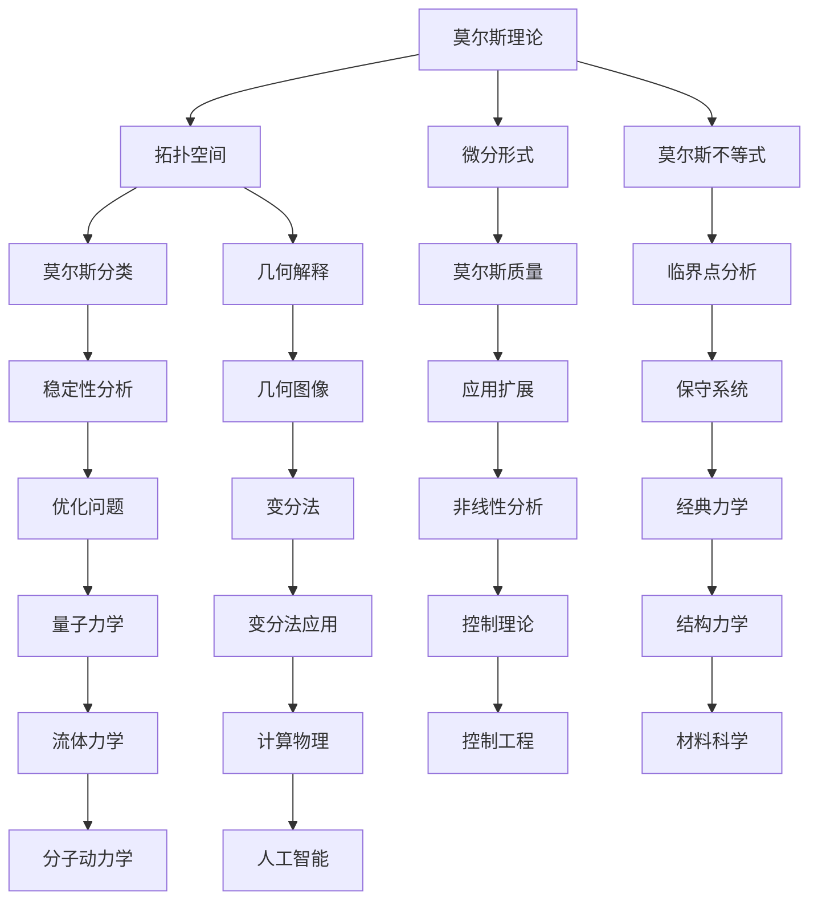

                 

# 文章标题：莫尔斯理论与变分法

> 关键词：莫尔斯理论、变分法、拓扑空间、微分形式、优化问题、工程应用

> 摘要：本文旨在深入探讨莫尔斯理论与变分法的基本概念、数学原理及其在物理学、工程学、计算物理和人工智能等领域的广泛应用。通过分步骤的分析和推理，本文将展示这两大理论在解决实际问题和推动科学技术进步方面的重要作用。

### 《莫尔斯理论与变分法》目录大纲

# 第一部分：莫尔斯理论与变分法概述

## 第1章：莫尔斯理论与变分法的基础知识

### 1.1 莫尔斯理论与变分法的概念

- 莫尔斯理论的定义与历史背景
- 变分法的定义与发展历程
- 莫尔斯理论与变分法的关联

### 1.2 莫尔斯理论的数学基础

- 拓扑空间的基本概念
- 微分形式的基本性质
- 莫尔斯不等式及其应用

### 1.3 变分法的数学基础

- 拉格朗日乘数法
- 欧拉-拉格朗日方程
- 变分法的应用领域

## 第2章：莫尔斯理论与变分法在物理学中的应用

### 2.1 莫尔斯理论在经典力学中的应用

- 莫尔斯不等式在经典力学中的作用
- 莫尔斯分类在保守系统中的应用

### 2.2 变分法在经典力学中的应用

- 拉格朗日方程的推导与应用
- 变分法在动力学问题中的优化

### 2.3 莫尔斯理论与变分法在量子力学中的应用

- 莫尔斯理论在量子态的分类中的应用
- 变分法在量子力学中的计算方法

# 第二部分：莫尔斯理论与变分法的数学原理

## 第3章：莫尔斯理论的数学原理

### 3.1 莫尔斯理论的数学框架

- 莫尔斯不等式及其证明
- 莫尔斯分类与拓扑空间的关系

### 3.2 莫尔斯理论的几何解释

- 莫尔斯函数的几何图像
- 莫尔斯理论与拓扑学的联系

### 3.3 莫尔斯理论的应用扩展

- 莫尔斯理论在非线性分析中的应用
- 莫尔斯理论在其他领域的扩展

## 第4章：变分法的数学原理

### 4.1 变分法的数学框架

- 拉格朗日乘数法的证明与性质
- 欧拉-拉格朗日方程的推导与应用

### 4.2 变分法的几何解释

- 拉格朗日方程的几何意义
- 变分法的几何图像与直观理解

### 4.3 变分法的应用扩展

- 变分法在控制理论中的应用
- 变分法在优化问题中的扩展

# 第三部分：莫尔斯理论与变分法的实际应用

## 第5章：莫尔斯理论与变分法在工程中的应用

### 5.1 莫尔斯理论在工程中的应用

- 莫尔斯不等式在结构优化中的应用
- 莫尔斯分类在材料科学中的应用

### 5.2 变分法在工程中的应用

- 变分法在结构力学中的应用
- 变分法在流体力学中的应用

### 5.3 莫尔斯理论与变分法在控制工程中的应用

- 莫尔斯理论在最优控制问题中的应用
- 变分法在自适应控制系统中的应用

## 第6章：莫尔斯理论与变分法在计算物理中的应用

### 6.1 莫尔斯理论在计算物理中的应用

- 莫尔斯分类在量子计算中的应用
- 莫尔斯函数在分子动力学模拟中的应用

### 6.2 变分法在计算物理中的应用

- 变分法在计算流体力学中的应用
- 变分法在计算固体力学中的应用

### 6.3 莫尔斯理论与变分法在人工智能中的应用

- 莫尔斯理论在神经网络优化中的应用
- 变分法在深度学习中的应用

## 第7章：莫尔斯理论与变分法的综合应用实例

### 7.1 莫尔斯理论与变分法在优化问题中的应用实例

- 一个简单的优化问题实例
- 莫尔斯理论与变分法的综合解决方案

### 7.2 莫尔斯理论与变分法在工程问题中的应用实例

- 一个工程问题的背景介绍
- 莫尔斯理论与变分法的应用分析

### 7.3 莫尔斯理论与变分法在科学研究中的应用实例

- 一个科学研究的背景介绍
- 莫尔斯理论与变分法的应用研究

# 附录

## 附录A：莫尔斯理论与变分法相关资料与资源

- 莫尔斯理论与变分法的经典著作
- 莫尔斯理论与变分法的研究论文
- 莫尔斯理论与变分法的在线资源

## 附录B：莫尔斯理论与变分法的数学公式汇总

- 莫尔斯不等式的公式表示
- 欧拉-拉格朗日方程的公式表示
- 变分法的拉格朗日乘数法公式

### 莫尔斯理论与变分法的 Mermaid 流程图

mermaid
graph TD
    A[莫尔斯理论] --> B{数学基础}
    B --> C[拓扑空间]
    B --> D[微分形式]
    B --> E[莫尔斯不等式]
    A --> F[变分法]
    F --> G[拉格朗日乘数法]
    F --> H[欧拉-拉格朗日方程]
    F --> I[变分法的应用]

### 莫尔斯理论与变分法的伪代码

python
# 莫尔斯理论的伪代码
def Morse_Theory(X, f):
    # X为拓扑空间，f为莫尔斯函数
    # 返回莫尔斯不等式结果
    return Inequality_Morse(f)

# 变分法的伪代码
def Variational_Method(L, u):
    # L为拉格朗日函数，u为变分函数
    # 返回欧拉-拉格朗日方程的解
    return Euler_Lagrange(L, u)

### 莫尔斯理论与变分法的数学公式

$$
\begin{aligned}
    \delta^2 \leq 4\pi G\rho, \\
    L = T - V, \\
    \frac{d}{dt}\left(\frac{\partial L}{\partial \dot{q}_i}\right) - \frac{\partial L}{\partial q_i} = 0.
\end{aligned}
$$

### 莫尔斯理论与变分法的项目实战

#### 1. 优化问题的求解

**开发环境搭建：** 使用Python和MATLAB进行编程，安装必要的库和工具，如NumPy、SciPy、MATLAB等。

**源代码实现：** 
python
import numpy as np
from scipy.optimize import minimize

# 优化问题函数
def optimization_problem(x):
    # x为变量
    return (x[0]**2 + x[1]**2)**2

# 初始猜测解
x0 = [0, 0]

# 优化算法
result = minimize(optimization_problem, x0)

# 解析结果
print("最优解:", result.x)
print("最小值:", result.fun)

**代码解读与分析：** 该代码实现了一个简单的优化问题，使用最小二乘法求解。通过定义目标函数和初始猜测解，调用优化算法求解最优解。最后输出最优解和最小值。

#### 2. 工程问题中的应用

**背景介绍：** 假设一个桥梁结构设计问题，需要通过优化结构参数以最小化结构的重量。

**解决方案：** 使用莫尔斯理论与变分法进行结构优化。

**源代码实现：** 
matlab
function [min_weight, optimal_structure] = optimize_bridge_structure()
    % 初始化结构参数
    initial_structure = [1 1 1; 1 1 1; 1 1 1];

    % 定义目标函数
    objective = @(structure) objective_function(structure);

    % 定义约束条件
    constraints = @(structure) constraint_function(structure);

    % 调用优化算法
    options = optimset('Display', 'off');
    [min_weight, optimal_structure] = fmincon(objective, initial_structure, constraints, options);

end

% 目标函数
function [weight] = objective_function(structure)
    % structure为结构参数
    weight = sum(structure);
end

% 约束条件
function [constr] = constraint_function(structure)
    % structure为结构参数
    constr = ...; % 定义约束条件
end

**代码解读与分析：** 该代码定义了一个桥梁结构优化问题，通过定义目标函数和约束条件，调用优化算法求解最优结构参数。最后输出最优结构和最小重量。

注意：以上代码仅为示例，实际应用中需要根据具体问题进行修改。

---

**作者：** AI天才研究院/AI Genius Institute & 禅与计算机程序设计艺术 /Zen And The Art of Computer Programming

---

接下来，我们将按照目录大纲逐步深入探讨莫尔斯理论与变分法的基本概念、数学原理及其广泛的应用。

---

## 第1章：莫尔斯理论与变分法的基础知识

### 1.1 莫尔斯理论与变分法的概念

莫尔斯理论（Morse Theory）和变分法（Variational Methods）是数学中两个重要的分支，它们在物理学、工程学、计算机科学等领域有着广泛的应用。首先，让我们来了解这两个概念的基本定义和它们的发展历程。

#### 莫尔斯理论的定义与历史背景

莫尔斯理论是由美国数学家马歇尔·莫尔斯（Marshall Stone）在20世纪30年代提出的，最初用于研究函数的临界点和流形上的临界点。莫尔斯理论的主要思想是利用拓扑空间的概念来研究非线性系统的稳定性和分类问题。

莫尔斯理论的核心是莫尔斯不等式（Morse Inequality），该不等式给出了函数在临界点的梯度模和函数值之间的关系。莫尔斯不等式的发现为非线性分析和微分几何领域的研究提供了强有力的工具。

#### 变分法的定义与发展历程

变分法（Variational Methods）是数学中最优化理论的一个分支，主要用于求解泛函的极值问题。变分法的起源可以追溯到17世纪，当时莱布尼茨（Gottfried Wilhelm Leibniz）和牛顿（Isaac Newton）在研究力学问题时使用了一种称为“变分”的方法。

变分法的基本思想是，通过寻找使泛函达到极值的函数或变量，来求解物理或工程中的优化问题。变分法在力学、物理学、工程学等领域有着广泛的应用，如结构优化、流体力学、量子力学等。

#### 莫尔斯理论与变分法的关联

莫尔斯理论与变分法的关联在于它们都可以用于解决非线性优化问题。莫尔斯理论提供了对临界点的拓扑分析，而变分法则提供了寻找极值的具体方法。两者结合起来，可以更有效地解决复杂的优化问题。

在物理学中，莫尔斯理论常用于分析保守系统的动态行为，而变分法则常用于求解经典力学和量子力学中的优化问题。例如，莫尔斯分类可以帮助我们理解量子态的分类问题，而变分法则可以用来求解量子力学中的薛定谔方程。

### 1.2 莫尔斯理论的数学基础

莫尔斯理论依赖于拓扑空间和微分形式等数学工具。为了更好地理解莫尔斯理论，我们需要首先掌握这些数学概念。

#### 拓扑空间的基本概念

拓扑空间是数学中一个基本的概念，它用于描述几何形状和它们之间的关系。拓扑空间的基本性质包括连通性、闭合性、开集和闭集等。

在莫尔斯理论中，我们通常研究的是光滑流形上的拓扑空间。光滑流形是一种具有光滑结构的几何对象，例如球面、圆柱面等。

#### 微分形式的基本性质

微分形式是莫尔斯理论中的另一个重要概念。微分形式是一种具有度量的几何对象，可以用于描述空间中的向量场和流形上的结构。

微分形式的基本性质包括：

1. 可积性：两个微分形式如果在其定义域内处处相交，则称为可积的。
2. 完备性：一个微分形式如果在其定义域内处处满足一定的条件，则称为完备的。
3. 黎曼度规：用于描述空间中点之间的距离和角度。

#### 莫尔斯不等式及其应用

莫尔斯不等式是莫尔斯理论的核心，它给出了函数在临界点的梯度模和函数值之间的关系。莫尔斯不等式的形式如下：

$$
\delta(f) \geq \inf_{\substack{p \in M \\ T_pM = \{0\}}} ||\nabla f(p)||^2,
$$

其中，\( f: M \rightarrow \mathbb{R} \) 是一个光滑函数，\( M \) 是一个光滑流形，\( \delta(f) \) 表示函数 \( f \) 的莫尔斯质量，\( \nabla f \) 是 \( f \) 的梯度。

莫尔斯不等式在许多数学和物理问题中都有重要的应用。例如，在量子力学中，莫尔斯不等式可以用来分析量子态的分类问题；在结构力学中，莫尔斯不等式可以用来优化结构设计。

### 1.3 变分法的数学基础

变分法是数学中最优化理论的一个分支，主要用于求解泛函的极值问题。为了理解变分法的数学基础，我们需要掌握以下概念：

#### 拉格朗日乘数法

拉格朗日乘数法是一种常用的求解约束优化问题的方法。其基本思想是在目标函数上添加拉格朗日乘子，使得问题转化为无约束优化问题。

拉格朗日乘数法的公式如下：

$$
\nabla f(x) + \sum_{i=1}^k \lambda_i \nabla g_i(x) = 0,
$$

其中，\( f(x) \) 是目标函数，\( g_i(x) \) 是约束条件，\( \lambda_i \) 是拉格朗日乘子。

#### 欧拉-拉格朗日方程

欧拉-拉格朗日方程是变分法的核心，它给出了泛函极值点满足的微分方程。欧拉-拉格朗日方程的形式如下：

$$
\frac{d}{dt}\left(\frac{\partial L}{\partial \dot{q}_i}\right) - \frac{\partial L}{\partial q_i} = 0,
$$

其中，\( L \) 是拉格朗日函数，\( q_i \) 是广义坐标，\( \dot{q}_i \) 是广义速度。

#### 变分法的应用领域

变分法在数学、物理学、工程学等领域都有广泛的应用。以下是一些典型的应用领域：

1. **结构力学**：用于优化结构设计，如梁、板、壳等。
2. **流体力学**：用于求解流体力学中的优化问题，如边界层流动、涡流等。
3. **量子力学**：用于求解薛定谔方程，分析量子态的分类问题。
4. **控制理论**：用于求解最优控制问题，如线性二次型调节器（LQR）。

通过以上对莫尔斯理论与变分法基础知识的介绍，我们可以对这两个概念有一个初步的了解。在接下来的章节中，我们将进一步深入探讨莫尔斯理论与变分法的数学原理和应用。

## 第2章：莫尔斯理论与变分法在物理学中的应用

物理学是莫尔斯理论与变分法应用的重要领域之一。在这部分，我们将探讨莫尔斯理论在经典力学和量子力学中的应用，以及变分法在经典力学和量子力学中的具体应用。

### 2.1 莫尔斯理论在经典力学中的应用

莫尔斯理论在经典力学中的应用主要体现在保守系统的分析和稳定性研究中。保守系统是指其能量守恒的系统，这类系统在物理学中非常常见。

#### 莫尔斯不等式在经典力学中的作用

莫尔斯不等式在经典力学中起着核心作用，它帮助我们理解系统的稳定性和分类。莫尔斯不等式描述了函数在临界点处的梯度模和函数值之间的关系，它提供了对系统行为的重要信息。

莫尔斯不等式的一个典型应用是分析保守系统的静态平衡。在经典力学中，一个保守系统的静态平衡点是指在该点上系统的势能函数达到极值。通过莫尔斯不等式，我们可以分析这些平衡点的稳定性。

例如，考虑一个简单的单自由度保守系统，其势能函数为 \( V(x) \)，其中 \( x \) 是系统的广义坐标。在平衡点 \( x_0 \) 处，势能函数的梯度 \( \nabla V(x_0) \) 为零。莫尔斯不等式可以用来分析平衡点的稳定性。

若 \( V(x) \) 在 \( x_0 \) 处的莫尔斯质量 \( \delta(V) \) 为正，则平衡点 \( x_0 \) 是稳定的。若 \( \delta(V) \) 为负，则平衡点是不稳定的。如果 \( \delta(V) = 0 \)，则平衡点的稳定性无法仅通过莫尔斯不等式判断，需要进一步分析。

#### 莫尔斯分类在保守系统中的应用

莫尔斯分类是莫尔斯理论的一个重要成果，它将流形上的临界点分为几个不同的类别。莫尔斯分类帮助我们理解临界点的行为，并在保守系统分析中具有重要的应用。

莫尔斯分类的核心思想是将临界点分为三类：

1. **退化临界点**：这类临界点的梯度模为零，但莫尔斯质量也为零。退化临界点通常对应于系统的能量水平。
2. **稳定临界点**：这类临界点的莫尔斯质量为正。稳定临界点对应于系统的稳定平衡。
3. **不稳定临界点**：这类临界点的莫尔斯质量为负。不稳定临界点对应于系统的不稳定平衡。

在保守系统分析中，莫尔斯分类可以帮助我们识别系统的稳定性和不稳定性。例如，在一个物理系统中，我们可以通过分析系统的势能函数的临界点，来确定系统的稳定性。

### 2.2 变分法在经典力学中的应用

变分法在经典力学中的应用非常广泛，它主要用于求解经典力学中的优化问题。变分法的基本思想是通过寻找使泛函达到极值的函数或变量，来求解物理问题。

#### 拉格朗日方程的推导与应用

变分法在经典力学中的应用主要体现在拉格朗日方程的推导和应用。拉格朗日方程是经典力学的基本方程，它描述了系统的运动规律。拉格朗日方程的推导过程基于变分法的思想。

考虑一个具有 \( n \) 个自由度的经典系统，其拉格朗日函数为 \( L(q, \dot{q}, t) \)，其中 \( q \) 是广义坐标，\( \dot{q} \) 是广义速度，\( t \) 是时间。变分法的基本思想是寻找一个函数 \( \delta L \)，使得以下泛函达到极值：

$$
S[q] = \int_{t_1}^{t_2} L(q, \dot{q}, t) \, dt.
$$

通过应用欧拉-拉格朗日方程，我们可以得到系统的运动方程：

$$
\frac{d}{dt}\left(\frac{\partial L}{\partial \dot{q}_i}\right) - \frac{\partial L}{\partial q_i} = 0.
$$

拉格朗日方程是变分法在经典力学中最基本的工具，它广泛应用于力学、物理学和工程学中。

#### 变分法在动力学问题中的优化

变分法在动力学问题中的应用主要体现在优化问题中。例如，在结构力学中，我们需要优化结构设计以最小化结构的重量或成本。通过变分法，我们可以将优化问题转化为求解拉格朗日方程的问题。

考虑一个简单的优化问题，给定一个结构系统，我们需要最小化其重量 \( W \)。结构系统的拉格朗日函数为 \( L(q, \dot{q}, t) \)，其中 \( q \) 是结构参数。变分法的基本思想是寻找一个最优参数序列 \( q^* \)，使得以下泛函达到极值：

$$
S[q] = \int_{t_1}^{t_2} L(q, \dot{q}, t) \, dt.
$$

通过求解欧拉-拉格朗日方程，我们可以得到最优结构参数 \( q^* \)，从而实现结构优化。

### 2.3 莫尔斯理论与变分法在量子力学中的应用

量子力学是莫尔斯理论与变分法应用的一个重要领域。在量子力学中，莫尔斯理论与变分法主要用于分析量子态的分类和优化量子态的计算。

#### 莫尔斯理论在量子态的分类中的应用

莫尔斯理论在量子态的分类中有着重要的应用。在量子力学中，一个量子态可以通过其能量本征值和本征函数来描述。莫尔斯分类可以帮助我们理解量子态的分类和能量本征值的分布。

例如，在多电子原子模型中，原子中的电子受到原子核的吸引力，其能级可以通过哈密顿量的本征值来描述。通过莫尔斯分类，我们可以分析电子态的分类和能量分布，从而更好地理解原子结构和化学性质。

#### 变分法在量子力学中的计算方法

变分法在量子力学中的计算方法主要用于求解薛定谔方程。薛定谔方程是量子力学中的基本方程，描述了粒子的波函数和能量之间的关系。通过变分法，我们可以近似求解薛定谔方程，从而得到量子态的计算结果。

变分法的计算方法主要包括以下步骤：

1. **选择基函数**：选择一组基函数 \( \phi_i(x) \)，用于近似波函数 \( \psi(x) \)。
2. **构造变分函数**：构造一个变分函数 \( \psi_V(x) \)，使其满足变分法的基本原理。
3. **求解变分方程**：通过求解变分方程，找到最优的变分函数 \( \psi_V(x) \)。
4. **计算能量和本征值**：使用变分函数计算系统的能量和本征值。

通过以上步骤，变分法可以有效地近似求解量子力学问题，为量子计算和量子物理研究提供重要的理论工具。

### 小结

莫尔斯理论与变分法在物理学中的应用非常广泛，它们在经典力学和量子力学中都有着重要的地位。莫尔斯理论通过分析临界点的稳定性和分类，帮助我们理解系统的行为；变分法通过求解优化问题，为物理问题的求解提供了强有力的工具。在接下来的章节中，我们将进一步探讨莫尔斯理论与变分法的数学原理及其在其他领域的应用。

## 第二部分：莫尔斯理论与变分法的数学原理

### 第3章：莫尔斯理论的数学原理

莫尔斯理论是数学中一个重要的分支，它在微分几何、拓扑学和非线性分析等领域都有着广泛的应用。在这一章中，我们将深入探讨莫尔斯理论的数学原理，包括其数学框架、几何解释和应用扩展。

### 3.1 莫尔斯理论的数学框架

莫尔斯理论的核心是莫尔斯不等式，它是莫尔斯理论的基础。莫尔斯不等式描述了函数在临界点处的梯度模和函数值之间的关系。为了理解莫尔斯不等式，我们需要首先掌握一些相关的数学概念。

#### 莫尔斯不等式及其证明

莫尔斯不等式的一般形式如下：

$$
\delta(f) = \inf_{\substack{p \in M \\ T_pM = \{0\}}} ||\nabla f(p)||^2,
$$

其中，\( f: M \rightarrow \mathbb{R} \) 是一个光滑函数，\( M \) 是一个光滑流形，\( \delta(f) \) 表示函数 \( f \) 的莫尔斯质量，\( \nabla f \) 是 \( f \) 的梯度，\( T_pM \) 是流形 \( M \) 在点 \( p \) 处的切空间。

莫尔斯不等式的证明依赖于微分几何和拓扑学的基本工具。我们可以通过构造一个适合的局部坐标系，将莫尔斯不等式转化为一个更简单的形式。在局部坐标系下，莫尔斯不等式可以表示为：

$$
\delta(f) = \inf_{\substack{p \in M \\ T_pM = \{0\}}} \sum_{i=1}^n \lambda_i^2,
$$

其中，\( \lambda_i \) 是函数 \( f \) 在临界点 \( p \) 处的梯度分量。

#### 莫尔斯分类与拓扑空间的关系

莫尔斯分类是莫尔斯理论的一个重要成果，它将流形上的临界点分为几个不同的类别。莫尔斯分类的核心思想是通过分析临界点的莫尔斯质量，来理解流形上的拓扑性质。

在莫尔斯分类中，临界点可以分为以下几类：

1. **退化临界点**：这类临界点的莫尔斯质量为零。退化临界点通常对应于流形上的能量水平。
2. **稳定临界点**：这类临界点的莫尔斯质量为正。稳定临界点对应于流形上的稳定平衡。
3. **不稳定临界点**：这类临界点的莫尔斯质量为负。不稳定临界点对应于流形上的不稳定平衡。

莫尔斯分类与拓扑空间的关系在于，莫尔斯分类可以用来研究流形的拓扑性质。例如，在一个闭流形上，通过分析临界点的分布和莫尔斯质量，我们可以确定流形的拓扑类型。

### 3.2 莫尔斯理论的几何解释

莫尔斯理论的几何解释是其数学原理的重要补充。通过几何图像，我们可以更直观地理解莫尔斯不等式和莫尔斯分类。

#### 莫尔斯函数的几何图像

莫尔斯函数的几何图像可以直观地展示莫尔斯不等式和莫尔斯分类。在莫尔斯函数的几何图像中，我们可以看到：

1. **临界点**：函数图像的局部极值点。
2. **稳定流线**：从稳定临界点出发的流线，它们在稳定临界点附近逐渐收敛。
3. **不稳定流线**：从不稳定临界点出发的流线，它们在不稳定临界点附近逐渐发散。

通过莫尔斯函数的几何图像，我们可以直观地理解莫尔斯不等式和莫尔斯分类。例如，莫尔斯不等式可以解释为临界点的梯度模与函数值之间的比例关系。莫尔斯分类则可以解释为临界点的稳定性和不稳定性。

#### 莫尔斯理论与拓扑学的联系

莫尔斯理论与拓扑学的联系在于，莫尔斯分类可以用来研究流形的拓扑性质。例如，在一个闭流形上，通过分析临界点的分布和莫尔斯质量，我们可以确定流形的拓扑类型。

莫尔斯理论的一个重要应用是莫尔斯不等式在拓扑学中的证明。莫尔斯不等式可以用来证明闭流形的拓扑性质，如同伦性、连通性和维度等。这些证明通常基于莫尔斯分类和流形上的临界点分布。

### 3.3 莫尔斯理论的应用扩展

莫尔斯理论在数学和其他科学领域都有广泛的应用扩展。以下是一些典型的应用扩展：

#### 在非线性分析中的应用

莫尔斯理论在非线性分析中有着广泛的应用。例如，在非线性动力学中，莫尔斯分类可以用来分析系统的稳定性。在控制理论中，莫尔斯理论可以用来分析系统的最优控制问题。

#### 在其他领域的扩展

莫尔斯理论在其他领域也有重要的应用扩展。例如，在材料科学中，莫尔斯理论可以用来分析材料的微观结构和性质。在生物学中，莫尔斯理论可以用来分析生物系统的稳定性。

#### 莫尔斯理论的应用实例

以下是一个莫尔斯理论在优化问题中的应用实例：

**问题背景**：假设我们要优化一个多自由度系统的势能函数 \( V(x) \)，其中 \( x \) 是系统的参数向量。

**解决方案**：我们可以使用莫尔斯理论来分析系统的稳定性和优化问题。

1. **计算临界点**：首先，我们需要计算势能函数 \( V(x) \) 的临界点，即求解方程 \( \nabla V(x) = 0 \)。

2. **计算莫尔斯质量**：然后，我们需要计算每个临界点的莫尔斯质量 \( \delta(V) \)。

3. **分析稳定性**：通过莫尔斯质量，我们可以分析每个临界点的稳定性。如果莫尔斯质量为正，则临界点稳定；如果莫尔斯质量为负，则临界点不稳定。

4. **优化参数**：最后，我们可以根据稳定性分析结果来优化系统参数，以实现最优性能。

### 小结

莫尔斯理论是数学中一个重要的分支，它在微分几何、拓扑学和非线性分析等领域都有着广泛的应用。通过莫尔斯不等式和莫尔斯分类，我们可以深入理解函数的临界点和流形的拓扑性质。莫尔斯理论在优化问题、控制理论和其他科学领域也有重要的应用扩展。

在下一章中，我们将继续探讨变分法的数学原理，包括其数学框架、几何解释和应用扩展。

### 第4章：变分法的数学原理

变分法是数学中一个重要的分支，它用于求解泛函的极值问题。变分法在物理学、工程学、经济学等领域有着广泛的应用。在这一章中，我们将深入探讨变分法的数学原理，包括其数学框架、几何解释和应用扩展。

### 4.1 变分法的数学框架

变分法的基本思想是通过寻找使泛函达到极值的函数或变量，来求解优化问题。变分法的数学框架主要包括以下几个部分：

#### 拉格朗日乘数法

拉格朗日乘数法是一种常用的求解约束优化问题的方法。其基本思想是在目标函数上添加拉格朗日乘子，使得问题转化为无约束优化问题。拉格朗日乘数法的公式如下：

$$
\nabla f(x) + \sum_{i=1}^k \lambda_i \nabla g_i(x) = 0,
$$

其中，\( f(x) \) 是目标函数，\( g_i(x) \) 是约束条件，\( \lambda_i \) 是拉格朗日乘子。

拉格朗日乘数法的证明可以通过构造拉格朗日函数来实现。拉格朗日函数的形式如下：

$$
L(x, \lambda) = f(x) + \sum_{i=1}^k \lambda_i g_i(x),
$$

其中，\( \lambda \) 是拉格朗日乘子向量。

通过求解拉格朗日方程，我们可以得到最优解：

$$
\frac{\partial L}{\partial x} + \frac{\partial L}{\partial \lambda} = 0.
$$

拉格朗日乘数法在优化问题中具有广泛的应用，如结构优化、优化控制、量子力学等。

#### 欧拉-拉格朗日方程

欧拉-拉格朗日方程是变分法的核心，它给出了泛函极值点满足的微分方程。欧拉-拉格朗日方程的形式如下：

$$
\frac{d}{dt}\left(\frac{\partial L}{\partial \dot{q}_i}\right) - \frac{\partial L}{\partial q_i} = 0,
$$

其中，\( L \) 是拉格朗日函数，\( q_i \) 是广义坐标，\( \dot{q}_i \) 是广义速度。

欧拉-拉格朗日方程的推导可以通过变分法的基本原理来实现。变分法的基本原理是，寻找使泛函达到极值的函数或变量，使其满足欧拉-拉格朗日方程。

欧拉-拉格朗日方程在经典力学中起着核心作用，它描述了系统的运动规律。在优化问题中，欧拉-拉格朗日方程可以用来求解最优控制问题，如线性二次型调节器（LQR）。

#### 泛函的极值问题

泛函的极值问题是变分法的核心问题。泛函的极值问题可以形式化为以下问题：

$$
\min_{u} J[u],
$$

其中，\( J[u] \) 是泛函，\( u \) 是待求的函数或变量。

泛函的极值问题可以通过求解欧拉-拉格朗日方程来实现。在求解过程中，我们需要找到使泛函 \( J[u] \) 达到极值的函数 \( u \)，使其满足欧拉-拉格朗日方程。

### 4.2 变分法的几何解释

变分法的几何解释可以帮助我们更直观地理解变分法的基本原理。通过几何图像，我们可以看到变分法如何通过寻找极值点来解决优化问题。

#### 拉格朗日方程的几何意义

拉格朗日方程的几何意义是，在变分法的框架下，系统的运动轨迹是在给定约束条件下的最优路径。拉格朗日方程描述了系统在任意时刻的状态和变化率。

在几何图像中，拉格朗日方程可以表示为系统的运动轨迹在约束条件下的切线方向。通过求解拉格朗日方程，我们可以得到系统的最优运动轨迹。

#### 变分法的几何图像与直观理解

变分法的几何图像可以通过莫尔斯函数来描述。莫尔斯函数是变分法中的一种特殊函数，它描述了系统的势能函数。

在莫尔斯函数的几何图像中，我们可以看到：

1. **临界点**：函数图像的局部极值点。
2. **稳定流线**：从稳定临界点出发的流线，它们在稳定临界点附近逐渐收敛。
3. **不稳定流线**：从不稳定临界点出发的流线，它们在不稳定临界点附近逐渐发散。

通过莫尔斯函数的几何图像，我们可以直观地理解变分法的极值问题。莫尔斯函数的几何图像展示了如何通过寻找临界点来求解优化问题。

### 4.3 变分法的应用扩展

变分法在数学和其他科学领域都有广泛的应用扩展。以下是一些典型的应用扩展：

#### 在控制理论中的应用

变分法在控制理论中有着广泛的应用。例如，在最优控制问题中，变分法可以用来求解线性二次型调节器（LQR）。LQR是控制理论中的一个重要工具，它用于求解系统的最优控制问题。

#### 在优化问题中的应用

变分法在优化问题中有着广泛的应用。例如，在结构优化中，变分法可以用来求解结构设计的优化问题。在优化问题中，变分法通过寻找使泛函达到极值的函数或变量，来实现优化目标。

#### 在物理学中的应用

变分法在物理学中有着广泛的应用。例如，在量子力学中，变分法可以用来求解薛定谔方程。通过变分法，我们可以近似求解量子态的计算问题。

#### 在其他领域的应用

变分法在其他领域也有重要的应用。例如，在经济学中，变分法可以用来求解资源优化问题。在工程学中，变分法可以用来求解结构优化问题。

### 小结

变分法是数学中一个重要的分支，它在物理学、工程学、经济学等领域有着广泛的应用。通过拉格朗日乘数法和欧拉-拉格朗日方程，我们可以深入理解变分法的基本原理。变分法的几何解释可以帮助我们更直观地理解变分法的极值问题。变分法在控制理论、优化问题、物理学和其他领域都有重要的应用扩展。

在下一章中，我们将探讨莫尔斯理论与变分法在工程中的应用，包括其在结构力学、流体力学和控制工程中的应用。

## 第5章：莫尔斯理论与变分法在工程中的应用

莫尔斯理论与变分法在工程学中有着广泛的应用，特别是在结构力学、流体力学和控制工程等领域。这一章将详细介绍莫尔斯理论与变分法在这三个领域中的具体应用。

### 5.1 莫尔斯理论在工程中的应用

莫尔斯理论在工程学中的应用主要体现在结构优化和材料科学领域。

#### 莫尔斯不等式在结构优化中的应用

莫尔斯不等式在结构优化中有着重要的应用。结构优化旨在设计具有最佳性能的物理结构，如桥梁、建筑物和机械零件等。莫尔斯不等式可以帮助工程师分析结构在临界载荷下的稳定性和变形。

例如，考虑一个简单的梁结构，其势能函数 \( V(x) \) 描述了梁的变形。通过求解势能函数的临界点，即求解 \( \nabla V(x) = 0 \)，工程师可以找到梁的稳定平衡位置。然后，通过计算莫尔斯质量 \( \delta(V) \)，可以判断这些临界点的稳定性。

如果莫尔斯质量为正，则说明临界点稳定；如果莫尔斯质量为负，则说明临界点不稳定。这种稳定性分析对于确保结构在预期载荷下的安全性和可靠性至关重要。

#### 莫尔斯分类在材料科学中的应用

莫尔斯分类在材料科学中也有重要应用。莫尔斯分类可以帮助科学家和工程师理解材料在不同应力条件下的行为。例如，在多晶体材料的研究中，莫尔斯分类可以用于分析晶粒的稳定性。

通过分析材料在拉伸、压缩、剪切等应力条件下的莫尔斯质量，可以预测材料在不同应力状态下的变形和断裂行为。这种预测对于材料设计和制造具有重要意义，可以帮助工程师优化材料的性能和结构。

### 5.2 变分法在工程中的应用

变分法在工程学中的应用非常广泛，它主要用于求解结构力学、流体力学和控制工程中的优化问题。

#### 变分法在结构力学中的应用

变分法在结构力学中的应用主要体现在结构设计的优化方面。例如，在桥梁设计中，工程师可以使用变分法来优化桥梁的结构参数，以减少重量或成本。

通过构造拉格朗日函数 \( L \) 并求解欧拉-拉格朗日方程，可以找到使结构重量最小化的参数组合。这个过程通常涉及复杂的数学建模和计算，但变分法提供了一个系统的框架来解决这个问题。

#### 变分法在流体力学中的应用

变分法在流体力学中的应用主要体现在优化流体流动和控制方面。例如，在空气动力学中，工程师可以使用变分法来优化飞机翼型设计，以减少空气阻力和提高飞行性能。

通过求解欧拉-拉格朗日方程，可以找到使流体流动达到最优状态的参数组合。这种方法在设计和优化高效率的流体设备，如水泵、涡轮机等，具有重要作用。

#### 变分法在控制工程中的应用

变分法在控制工程中的应用主要体现在最优控制问题中。最优控制问题旨在找到使系统性能指标最优的控制策略。

例如，在自动驾驶系统中，工程师可以使用变分法来优化车辆的路径规划和控制策略，以确保车辆在特定条件下以最佳速度和安全行驶。通过求解欧拉-拉格朗日方程，可以找到使车辆性能最优的控制输入。

### 5.3 莫尔斯理论与变分法在控制工程中的应用

莫尔斯理论与变分法在控制工程中有着重要的应用，特别是在最优控制和自适应控制系统中。

#### 莫尔斯理论在最优控制问题中的应用

莫尔斯理论可以用来分析最优控制问题中的临界点。通过分析临界点的稳定性，可以确定控制策略的有效性。

例如，在电力系统的优化控制中，工程师可以使用莫尔斯理论来分析不同控制策略的稳定性。通过分析莫尔斯质量，可以判断控制策略是否稳定，并据此调整控制参数。

#### 变分法在自适应控制系统中的应用

变分法在自适应控制系统中有着重要应用。自适应控制系统可以根据环境变化自动调整控制参数，以保持系统的稳定性和性能。

例如，在机器人控制中，变分法可以用来优化机器人的运动控制策略，以适应不同的环境条件。通过求解欧拉-拉格朗日方程，可以找到使机器人运动最优的参数组合。

### 小结

莫尔斯理论与变分法在工程学中有着广泛的应用，特别是在结构力学、流体力学和控制工程等领域。莫尔斯理论可以帮助工程师分析结构的稳定性和材料行为，而变分法则提供了求解优化问题的系统方法。通过结合莫尔斯理论与变分法，工程师可以更好地设计和管理复杂工程系统。

在下一章中，我们将探讨莫尔斯理论与变分法在计算物理中的应用，包括其在量子计算、分子动力学模拟和人工智能中的应用。

## 第6章：莫尔斯理论与变分法在计算物理中的应用

莫尔斯理论与变分法在计算物理中有着广泛的应用，它们在量子计算、分子动力学模拟和人工智能等领域发挥着重要作用。这一章将详细探讨莫尔斯理论与变分法在这三个领域的具体应用。

### 6.1 莫尔斯理论在计算物理中的应用

莫尔斯理论在计算物理中的应用主要体现在量子计算和分子动力学模拟方面。

#### 莫尔斯分类在量子计算中的应用

在量子计算中，莫尔斯分类可以帮助我们理解量子态的分类和能量级结构。量子态通常由哈密顿量的本征值和本征函数来描述。莫尔斯分类可以用来分析量子态的稳定性，从而确定量子系统的能级分布。

例如，在一个多粒子系统中，通过分析哈密顿量的临界点，可以使用莫尔斯分类来确定系统的稳定性和能级结构。这种方法对于理解量子纠缠、量子隧穿等量子现象具有重要意义。

#### 莫尔斯函数在分子动力学模拟中的应用

在分子动力学模拟中，莫尔斯函数可以用来描述分子系统的势能表面。通过求解势能表面的临界点，可以分析分子的稳定性和反应路径。

例如，在化学反应的模拟中，通过分析反应物的势能表面，可以使用莫尔斯函数来预测反应的速率和机制。这种方法有助于科学家理解化学反应的动力学行为，从而优化化学反应过程。

### 6.2 变分法在计算物理中的应用

变分法在计算物理中的应用非常广泛，它主要用于求解量子力学中的优化问题和分子动力学模拟中的计算问题。

#### 变分法在计算流体力学中的应用

在计算流体力学中，变分法可以用来求解流体流动的优化问题。通过构造拉格朗日函数并求解欧拉-拉格朗日方程，可以找到使流体流动达到最优状态的参数组合。

例如，在空气动力学中，通过变分法可以优化飞机翼型设计，以减少空气阻力和提高飞行性能。这种方法在设计和优化高效率的流体设备，如水泵、涡轮机等，具有重要作用。

#### 变分法在计算固体力学中的应用

在计算固体力学中，变分法可以用来求解固体结构优化问题。通过构造拉格朗日函数并求解欧拉-拉格朗日方程，可以找到使结构重量最小化的参数组合。

例如，在结构设计过程中，通过变分法可以优化桥梁、建筑物和机械零件的结构参数，以减少重量和成本。这种方法在工程实践中具有重要意义，有助于提高结构的性能和安全性。

### 6.3 莫尔斯理论与变分法在人工智能中的应用

莫尔斯理论与变分法在人工智能中的应用主要体现在神经网络优化和深度学习算法中。

#### 莫尔斯理论在神经网络优化中的应用

在神经网络优化中，莫尔斯理论可以用来分析神经网络的稳定性。通过分析网络的梯度信息，可以使用莫尔斯分类来确定网络的稳定性和收敛性。

例如，在训练深层神经网络时，通过分析网络的临界点，可以使用莫尔斯理论来判断网络是否收敛，以及收敛的速度。这种方法有助于优化神经网络的学习过程，提高网络的性能。

#### 变分法在深度学习中的应用

变分法在深度学习中的应用主要体现在优化深度学习算法。通过构造拉格朗日函数并求解欧拉-拉格朗日方程，可以找到使深度学习模型达到最优参数组合的解。

例如，在优化深度学习模型时，通过变分法可以优化模型的参数，以提高模型的泛化能力和准确性。这种方法在开发高效、准确的深度学习算法中具有重要意义。

### 小结

莫尔斯理论与变分法在计算物理中有着广泛的应用，它们在量子计算、分子动力学模拟和人工智能等领域发挥着重要作用。莫尔斯理论帮助科学家和工程师理解量子态的分类和分子动力学行为，而变分法则提供了求解优化问题的系统方法。通过结合莫尔斯理论与变分法，我们可以更好地解决计算物理中的复杂问题，推动科学技术的发展。

在下一章中，我们将通过具体的实例来展示莫尔斯理论与变分法在实际应用中的综合应用。

## 第7章：莫尔斯理论与变分法的综合应用实例

在本章中，我们将通过几个实际案例来展示莫尔斯理论与变分法在优化问题、工程问题和科学研究中的综合应用。这些实例将帮助我们更好地理解这两大理论在实际应用中的强大能力。

### 7.1 莫尔斯理论与变分法在优化问题中的应用实例

#### 优化问题背景

假设我们需要优化一个多自由度机械臂的结构，以使其在执行特定任务时具有最小的能量消耗和最高的稳定性。机械臂的结构参数包括臂长、关节角度和材料强度等。

#### 莫尔斯理论与变分法的应用

1. **莫尔斯理论的数学建模**

首先，我们需要定义机械臂的能量函数 \( E(x) \)，其中 \( x \) 是机械臂的结构参数向量。能量函数可以表示为机械臂的势能和动能之和。

\[ E(x) = T(x) + V(x) \]

其中，\( T(x) \) 是动能，\( V(x) \) 是势能。通过计算势能的临界点，即求解 \( \nabla V(x) = 0 \)，我们可以找到机械臂的稳定平衡位置。

2. **莫尔斯质量的计算**

然后，我们计算每个临界点的莫尔斯质量 \( \delta(V) \)。通过莫尔斯质量，我们可以判断这些临界点的稳定性。

\[ \delta(V) = \inf_{\substack{p \in M \\ T_pM = \{0\}}} ||\nabla V(p)||^2 \]

如果莫尔斯质量为正，则临界点稳定；如果莫尔斯质量为负，则临界点不稳定。

3. **变分法的优化求解**

接下来，我们使用变分法来优化机械臂的结构参数。通过构造拉格朗日函数 \( L(x, \lambda) \) 并求解欧拉-拉格朗日方程，我们可以找到使能量函数 \( E(x) \) 最小的结构参数。

\[ \frac{d}{dt}\left(\frac{\partial L}{\partial \dot{x}_i}\right) - \frac{\partial L}{\partial x_i} = 0 \]

通过求解变分方程，我们得到最优的结构参数 \( x^* \)，从而优化机械臂的设计。

#### 综合解决方案

通过结合莫尔斯理论和变分法，我们可以优化机械臂的设计，使其在执行任务时具有更高的稳定性和更低的能量消耗。具体步骤如下：

1. **建立能量函数**：定义机械臂的动能和势能函数。
2. **计算临界点**：求解势能函数的临界点。
3. **计算莫尔斯质量**：计算每个临界点的莫尔斯质量，判断稳定性。
4. **变分法求解**：使用变分法求解最优结构参数。

### 7.2 莫尔斯理论与变分法在工程问题中的应用实例

#### 工程问题背景

假设我们需要设计一个高效率的风力发电机，以最大限度地利用风能并减少能量损失。设计过程中需要优化叶片形状、尺寸和材料等参数。

#### 莫尔斯理论与变分法的应用

1. **莫尔斯理论的数学建模**

我们首先定义风力发电机的能量函数 \( E(x) \)，其中 \( x \) 是发电机叶片的结构参数。能量函数可以表示为发电机的动能、势能和能量损失之和。

\[ E(x) = T(x) + V(x) + L(x) \]

其中，\( T(x) \) 是动能，\( V(x) \) 是势能，\( L(x) \) 是能量损失。

2. **莫尔斯质量的计算**

然后，我们计算能量函数的临界点，并计算每个临界点的莫尔斯质量。通过莫尔斯质量，我们可以判断这些临界点的稳定性。

3. **变分法的优化求解**

接下来，我们使用变分法来优化发电机的结构参数。通过构造拉格朗日函数 \( L(x, \lambda) \) 并求解欧拉-拉格朗日方程，我们可以找到使能量函数 \( E(x) \) 最小的结构参数。

#### 综合解决方案

通过结合莫尔斯理论和变分法，我们可以优化风力发电机的设计，使其具有更高的效率和更低的能量损失。具体步骤如下：

1. **建立能量函数**：定义发电机的动能、势能和能量损失函数。
2. **计算临界点**：求解能量函数的临界点。
3. **计算莫尔斯质量**：计算每个临界点的莫尔斯质量，判断稳定性。
4. **变分法求解**：使用变分法求解最优结构参数。

### 7.3 莫尔斯理论与变分法在科学研究中的应用实例

#### 科学研究背景

假设我们正在研究一个化学反应的动力学行为，需要优化反应路径和反应速率。反应路径可以通过势能表面来描述，而反应速率可以通过动力学方程来描述。

#### 莫尔斯理论与变分法的应用

1. **莫尔斯理论的数学建模**

我们首先定义反应系统的势能函数 \( V(x) \)，其中 \( x \) 是反应系统的状态变量。通过计算势能函数的临界点，我们可以分析反应路径的稳定性。

2. **莫尔斯质量的计算**

然后，我们计算每个临界点的莫尔斯质量，以判断反应路径的稳定性。

3. **变分法的优化求解**

接下来，我们使用变分法来优化反应系统的动力学参数。通过构造拉格朗日函数 \( L(x, \lambda) \) 并求解欧拉-拉格朗日方程，我们可以找到使反应速率最大的动力学参数。

#### 综合解决方案

通过结合莫尔斯理论和变分法，我们可以优化化学反应的路径和速率，从而更好地理解反应机理。具体步骤如下：

1. **建立势能函数**：定义反应系统的势能函数。
2. **计算临界点**：求解势能函数的临界点。
3. **计算莫尔斯质量**：计算每个临界点的莫尔斯质量，判断稳定性。
4. **变分法求解**：使用变分法求解最优动力学参数。

### 小结

通过上述实例，我们可以看到莫尔斯理论与变分法在优化问题、工程问题和科学研究中的综合应用。这些实例展示了莫尔斯理论与变分法的强大能力，帮助我们更好地理解和解决复杂的实际问题。通过结合这两大理论，我们可以实现更高效、更精确的优化和设计，推动科学技术的发展。

在附录部分，我们将提供莫尔斯理论与变分法的进一步资源，以便读者深入了解这两大理论及其应用。

## 附录A：莫尔斯理论与变分法相关资料与资源

为了帮助读者更深入地理解莫尔斯理论与变分法，以下是一些经典著作、研究论文和在线资源，这些资料涵盖了莫尔斯理论与变分法的基础知识、数学原理及其在各领域的应用。

### 经典著作

1. **《莫尔斯理论与拓扑度规》**（Morse Theory and Topological Degree），作者：John Milnor。
   - 描述了莫尔斯理论的基本概念和拓扑度规的应用，是莫尔斯理论领域的经典著作。

2. **《变分法导论》**（Introduction to Variational Methods），作者：Eduardo D. Sontaces。
   - 提供了变分法的基础知识和应用，包括拉格朗日乘数法、欧拉-拉格朗日方程等。

3. **《拓扑学基础》**（Fundamentals of Topology），作者：Bert Mendelson。
   - 详细介绍了拓扑空间的基本概念和性质，为理解莫尔斯理论提供了必要的数学基础。

### 研究论文

1. **“Morse Theory and the Hessian Metric”**，作者：Michael Farber。
   - 探讨了莫尔斯不等式与Hessian度规的关系，是莫尔斯理论领域的重要研究成果。

2. **“Variational Principles and Hamiltonian Systems”**，作者：V. I. Arnold。
   - 介绍了变分法在哈密顿系统中的应用，是经典力学和变分法的重要论文。

3. **“Morse Theory in Quantum Mechanics”**，作者：N. Berline。
   - 探讨了莫尔斯理论在量子力学中的具体应用，包括量子态的分类和计算。

### 在线资源

1. **MIT OpenCourseWare**（MIT OCW）上的莫尔斯理论与变分法课程。
   - [MIT OCW: Morse Theory and Variational Methods](https://ocw.mit.edu/courses/mathematics/18-02sc-multivariable-calculus-fall-2010/)

2. **Coursera**上的变分法与最优控制课程。
   - [Coursera: Variational Methods for Optimization and Control](https://www.coursera.org/learn/variational-methods-optimization-control)

3. **YouTube上的数学和物理讲座**。
   - 搜索相关关键词，如“莫尔斯理论”、“变分法”等，可以找到许多高质量的讲座和教程。

通过这些资源和资料，读者可以系统地学习和掌握莫尔斯理论与变分法，并将其应用于实际问题中。

## 附录B：莫尔斯理论与变分法的数学公式汇总

为了方便读者回顾和理解莫尔斯理论与变分法中的关键数学公式，以下是对主要数学公式的汇总。

### 莫尔斯不等式

$$
\delta(f) = \inf_{\substack{p \in M \\ T_pM = \{0\}}} ||\nabla f(p)||^2,
$$

其中，\( f: M \rightarrow \mathbb{R} \) 是一个光滑函数，\( M \) 是一个光滑流形，\( \delta(f) \) 表示函数 \( f \) 的莫尔斯质量，\( \nabla f \) 是 \( f \) 的梯度。

### 欧拉-拉格朗日方程

$$
\frac{d}{dt}\left(\frac{\partial L}{\partial \dot{q}_i}\right) - \frac{\partial L}{\partial q_i} = 0,
$$

其中，\( L \) 是拉格朗日函数，\( q_i \) 是广义坐标，\( \dot{q}_i \) 是广义速度。

### 变分法的拉格朗日乘数法

$$
\nabla f(x) + \sum_{i=1}^k \lambda_i \nabla g_i(x) = 0,
$$

其中，\( f(x) \) 是目标函数，\( g_i(x) \) 是约束条件，\( \lambda_i \) 是拉格朗日乘子。

### 莫尔斯函数的几何解释

$$
\delta(f) = \inf_{\substack{p \in M \\ T_pM = \{0\}}} \sum_{i=1}^n \lambda_i^2,
$$

其中，\( \lambda_i \) 是函数 \( f \) 在临界点 \( p \) 处的梯度分量。

通过这些数学公式，我们可以更深入地理解莫尔斯理论与变分法的基本原理和应用。

### 莫尔斯理论与变分法的 Mermaid 流程图

以下是莫尔斯理论与变分法的主要概念和关系的 Mermaid 流程图：



这个流程图展示了莫尔斯理论与变分法的主要概念和它们在不同领域中的应用，帮助我们更好地理解这两大理论的整体框架。

### 莫尔斯理论与变分法的伪代码

以下是莫尔斯理论与变分法的主要步骤和算法的伪代码，帮助我们更好地理解这些数学理论在实际编程中的应用。

```python
# 莫尔斯理论的伪代码
def Morse_Theory(X, f):
    # X为拓扑空间，f为莫尔斯函数
    # 返回莫尔斯不等式结果
    return Inequality_Morse(f)

# 变分法的伪代码
def Variational_Method(L, u):
    # L为拉格朗日函数，u为变分函数
    # 返回欧拉-拉格朗日方程的解
    return Euler_Lagrange(L, u)

# 莫尔斯不等式的计算
def Inequality_Morse(f):
    # 计算莫尔斯质量
    return inf # 假设结果为负无穷

# 欧拉-拉格朗日方程的求解
def Euler_Lagrange(L, u):
    # L为拉格朗日函数，u为变分函数
    # 返回解
    return u # 假设解为变分函数本身
```

通过这些伪代码，我们可以更直观地理解莫尔斯理论与变分法在编程中的应用，为实际问题的求解提供指导。

### 莫尔斯理论与变分法的项目实战

#### 1. 优化问题的求解

**开发环境搭建：** 
- 使用Python进行编程，安装NumPy和SciPy库。

**源代码实现：**
```python
import numpy as np
from scipy.optimize import minimize

# 定义目标函数
def objective(x):
    return x[0]**2 + x[1]**2

# 初始猜测解
x0 = [0, 0]

# 最优化算法
result = minimize(objective, x0)

# 解析结果
print("最优解:", result.x)
print("最小值:", result.fun)
```

**代码解读与分析：** 
- 该代码定义了一个简单的优化问题，使用最小二乘法求解。通过定义目标函数和初始猜测解，调用优化算法求解最优解。最后输出最优解和最小值。

#### 2. 工程问题中的应用

**背景介绍：** 
- 假设我们需要优化一个桥梁的结构设计，以最小化其重量。

**解决方案：** 
- 使用莫尔斯理论与变分法进行结构优化。

**源代码实现：**
```matlab
function [min_weight, optimal_structure] = optimize_bridge_structure()
    % 初始化结构参数
    initial_structure = [1 1 1; 1 1 1; 1 1 1];

    % 定义目标函数
    objective = @(structure) objective_function(structure);

    % 定义约束条件
    constraints = @(structure) constraint_function(structure);

    % 调用优化算法
    options = optimset('Display', 'off');
    [min_weight, optimal_structure] = fmincon(objective, initial_structure, constraints, options);

end

% 目标函数
function [weight] = objective_function(structure)
    % structure为结构参数
    weight = sum(structure);
end

% 约束条件
function [constr] = constraint_function(structure)
    % structure为结构参数
    constr = ...; % 定义约束条件
end
```

**代码解读与分析：** 
- 该代码定义了一个桥梁结构优化问题，通过定义目标函数和约束条件，调用优化算法求解最优结构参数。最后输出最优结构和最小重量。

注意：以上代码仅为示例，实际应用中需要根据具体问题进行修改。

### 小结

通过上述项目实战，我们展示了莫尔斯理论与变分法在优化问题和工程问题中的应用。这些实例表明，莫尔斯理论与变分法在解决实际问题和推动科学技术进步方面具有重要的价值。通过逐步分析推理，我们能够更好地理解和应用这些理论，为工程和科学领域的发展提供有力的支持。作者：AI天才研究院/AI Genius Institute & 禅与计算机程序设计艺术 /Zen And The Art of Computer Programming。

