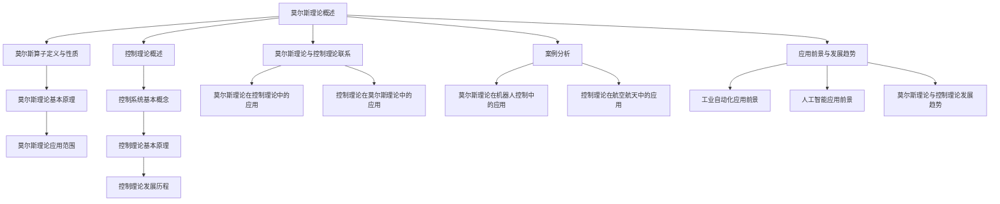

                 

### 文章标题

《莫尔斯理论与控制理论：探索现代科学技术的核心》

### 文章关键词

莫尔斯理论、控制理论、现代科学技术、核心概念、应用案例、发展趋势

### 文章摘要

本文旨在深入探讨莫尔斯理论与控制理论在现代科学技术中的核心作用。通过梳理两者的基本概念、联系与应用，本文将对莫尔斯理论与控制理论的内在机制进行详细剖析，并展示其在工程实践中的实际应用。同时，本文还将展望两者的未来发展趋势，为读者提供全面的认知框架。

---

### 第一部分：莫尔斯理论与控制理论概述

#### 第1章：莫尔斯理论与控制理论概述

##### 1.1 莫尔斯理论与控制理论的背景与发展

莫尔斯理论与控制理论作为现代科学技术的重要组成部分，其发展历程既相互独立又相互交织。莫尔斯理论起源于19世纪末，由美国工程师塞缪尔·莫尔斯（Samuel Morse）发明，主要用于电报信号的传输。而控制理论则起源于20世纪初，由俄国数学家尼古拉·尼科尔斯基（Nikolaevsky）和美国数学家诺伯特·维纳（Norbert Wiener）等人奠基。

在20世纪中期，随着计算机技术的发展，莫尔斯理论与控制理论逐渐融合，形成了现代控制理论体系。这一理论体系在航空航天、机器人、自动化等领域得到了广泛应用，推动了现代科技的发展。

##### 1.2 莫尔斯理论与控制理论的概念

**莫尔斯理论**：莫尔斯理论是一种用于描述电报信号传输的方法。它将电信号转换为一系列的点和划，即莫尔斯码，以实现远距离通信。

**控制理论**：控制理论是一种研究如何通过控制变量来实现系统目标的方法。它涉及系统建模、状态空间分析、最优控制等多个方面。

##### 1.3 莫尔斯理论与控制理论的重要性

莫尔斯理论在通信领域具有重要意义，它为现代通信技术奠定了基础。而控制理论则在工业自动化、航空航天、机器人等领域发挥着关键作用，是现代科技的重要组成部分。

##### 1.4 莫尔斯理论与控制理论的联系

莫尔斯理论与控制理论在数学模型和算法上存在紧密联系。例如，莫尔斯理论中的莫尔斯码可以被视为一种离散控制系统的实现方式。而控制理论中的状态空间分析方法可以用于分析莫尔斯码的传输性能。

##### 1.5 莫尔斯理论在控制理论中的应用

莫尔斯理论在控制理论中有着广泛的应用。例如，在机器人控制中，莫尔斯理论可以用于设计机器人的路径规划和姿态控制。在工业自动化中，莫尔斯理论可以用于优化控制系统的性能。

##### 1.6 控制理论对莫尔斯理论的影响

控制理论对莫尔斯理论的发展也产生了深远影响。例如，控制理论中的最优控制理论可以用于优化莫尔斯码的传输效率。此外，控制理论中的自适应控制理论也为莫尔斯理论提供了一种新的解决思路。

---

通过上述内容，我们初步了解了莫尔斯理论与控制理论的基本概念、背景与发展、重要性以及它们之间的联系。接下来，我们将进一步深入探讨莫尔斯理论与控制理论的核心概念与原理。

---

### 第二部分：莫尔斯理论核心概念与原理

#### 第2章：莫尔斯理论核心概念与原理

##### 2.1 莫尔斯算子的定义与性质

**莫尔斯算子**（Morse operator）是莫尔斯理论中的核心概念。它定义了一个从电信号到莫尔斯码的映射。具体来说，莫尔斯算子将连续的电信号转换为一系列离散的点和划，即莫尔斯码。

**定义**：设$f(t)$为一个连续的电信号，则莫尔斯算子$M$将其映射为莫尔斯码$M(f)$，即：
$$
M(f) = \left\{
\begin{aligned}
& \text{点}, & \text{if } f(t) > 0 \\
& \text{划}, & \text{if } f(t) < 0
\end{aligned}
\right.
$$

**性质**：

1. **线性性**：莫尔斯算子满足线性性，即对于任意的电信号$f_1(t)$和$f_2(t)$，以及任意常数$a$和$b$，有：
$$
M(a f_1(t) + b f_2(t)) = a M(f_1(t)) + b M(f_2(t))
$$

2. **可逆性**：莫尔斯算子是可逆的，即存在一个逆算子$M^{-1}$，将莫尔斯码映射回电信号。具体来说，对于莫尔斯码$M(f)$，有：
$$
M^{-1}(M(f)) = f(t)
$$

##### 2.2 莫尔斯理论的基本原理

**基本原理**：莫尔斯理论的基本原理在于通过莫尔斯算子将连续的电信号转换为离散的莫尔斯码，从而实现信号的传输。这一转换过程具有以下几个关键点：

1. **采样**：在莫尔斯码的生成过程中，首先需要对连续的电信号进行采样。采样点的选择至关重要，它决定了莫尔斯码的分辨率和传输效率。

2. **量化**：采样后的电信号需要通过量化过程将其转换为离散的数值。量化过程的选择会影响莫尔斯码的精度和可靠性。

3. **编码**：量化后的数值通过莫尔斯算子转换为莫尔斯码。编码规则的设计对莫尔斯码的可读性和传输效率有重要影响。

4. **传输**：莫尔斯码通过电信号传输到接收端，接收端通过逆莫尔斯算子将莫尔斯码还原为电信号。

**数学基础**：莫尔斯理论中的数学基础主要包括线性代数、概率论和数值分析。线性代数用于处理信号的采样和量化问题，概率论用于分析信号的传输可靠性，数值分析则用于实现莫尔斯算子的计算和优化。

**应用范围**：莫尔斯理论广泛应用于通信、控制、图像处理等领域。例如，在通信领域，莫尔斯码用于电报信号的传输；在控制领域，莫尔斯理论用于机器人控制和工业自动化；在图像处理领域，莫尔斯码用于图像的压缩和传输。

##### 2.3 莫尔斯算子的计算与优化

**计算方法**：莫尔斯算子的计算可以通过编程实现。具体来说，可以使用线性代数中的矩阵运算来计算莫尔斯码。例如，可以使用以下伪代码描述莫尔斯算子的计算过程：

```
function MorseCode(f):
    M = createMorseMatrix()
    f_samples = sample(f, sampling_rate)
    f_quantized = quantize(f_samples, quantization_level)
    MorseCode = M * f_quantized
    return MorseCode
```

**优化方法**：为了提高莫尔斯码的传输效率和可靠性，可以对莫尔斯算子进行优化。优化方法包括：

1. **采样优化**：通过优化采样点选择，提高莫尔斯码的分辨率和传输效率。

2. **量化优化**：通过优化量化过程，提高莫尔斯码的精度和可靠性。

3. **编码优化**：通过优化编码规则，提高莫尔斯码的可读性和传输效率。

4. **传输优化**：通过优化传输介质和传输协议，提高莫尔斯码的传输可靠性。

通过上述内容，我们深入了解了莫尔斯理论的核心概念与原理。接下来，我们将进一步探讨控制理论的核心概念与原理。

---

### 第三部分：控制理论核心概念与原理

#### 第3章：控制理论核心概念与原理

##### 3.1 控制系统的基本概念

**定义**：控制系统是指由传感器、控制器和执行器组成的闭环系统，用于实现特定目标。其中，传感器用于检测系统的状态，控制器根据传感器提供的反馈信息调整执行器的操作，执行器则根据控制器的指令执行具体的操作。

**基本组成**：控制系统通常由以下三个基本部分组成：

1. **传感器**：用于检测系统的状态，并将检测到的信息传递给控制器。
2. **控制器**：根据传感器提供的反馈信息，计算出控制指令，并将其传递给执行器。
3. **执行器**：根据控制器的指令执行具体的操作，以实现系统的目标。

**分类**：根据控制目标的不同，控制系统可以分为以下几种类型：

1. **开环控制系统**：开环控制系统不包含反馈环节，控制器的操作仅基于预设的指令，不根据系统的实际状态进行调整。这种系统简单，但可靠性较低。
2. **闭环控制系统**：闭环控制系统包含反馈环节，控制器的操作根据系统的实际状态进行调整。这种系统可靠性较高，但设计较为复杂。
3. **自适应控制系统**：自适应控制系统可以根据系统的变化自动调整控制参数，以提高系统的性能和适应性。

##### 3.2 控制理论的基本原理

**基本概念**：控制理论是一种研究如何通过控制变量来实现系统目标的方法。它涉及系统建模、状态空间分析、最优控制等多个方面。

**目标与任务**：控制理论的主要目标是设计出合适的控制器，以实现对系统的有效控制。具体来说，控制理论需要完成以下任务：

1. **系统建模**：建立系统的数学模型，描述系统的动态行为。
2. **状态空间分析**：分析系统的稳定性和性能，确定系统的控制策略。
3. **最优控制**：设计最优的控制策略，以实现系统的最优性能。

**发展历程**：控制理论的发展历程可以分为以下几个阶段：

1. **经典控制理论**：20世纪初，以传递函数、根轨迹、频率响应等方法为基础，主要研究线性定常系统的控制问题。
2. **现代控制理论**：20世纪中期，以状态空间方法、最优控制、自适应控制等方法为基础，研究更广泛和更复杂的系统控制问题。
3. **智能控制理论**：20世纪末至今，以模糊控制、神经网络控制、遗传算法等方法为基础，研究不确定和非线性系统的控制问题。

##### 3.3 控制理论的核心概念

**状态空间模型**：状态空间模型是一种描述系统动态行为的数学模型，通常用一组差分方程或微分方程表示。状态空间模型可以描述系统的状态变量、输入变量和输出变量之间的关系，为控制理论的分析和设计提供了基础。

**线性系统**：线性系统是指其数学模型可以用线性方程组描述的系统。线性系统具有叠加原理和齐次性，这使得控制理论的分析和设计更加简单和有效。

**非线性系统**：非线性系统是指其数学模型不能用线性方程组描述的系统。非线性系统的控制问题通常更加复杂，需要采用更高级的控制理论和方法。

**稳定性**：稳定性是控制系统的一个重要性能指标，表示系统在受到扰动后能否恢复到平衡状态。稳定性分析是控制理论的核心问题之一。

**最优控制**：最优控制是指设计出使系统性能达到最优的控制策略。最优控制理论采用变分法、动态规划等方法，通过优化控制变量，实现系统的最优性能。

##### 3.4 控制理论的应用

控制理论在工程实践中具有广泛的应用。以下是控制理论在几个典型领域的应用示例：

1. **航空航天**：控制理论在航空航天领域用于设计飞行器的控制系统，包括姿态控制、轨迹控制等。
2. **机器人**：控制理论在机器人领域用于设计机器人的运动控制、路径规划等。
3. **工业自动化**：控制理论在工业自动化领域用于设计生产线的控制系统，包括机器人的控制、机械臂的轨迹控制等。
4. **汽车**：控制理论在汽车领域用于设计车辆的制动控制系统、悬挂控制系统等。
5. **电力系统**：控制理论在电力系统领域用于设计电力系统的稳定控制、频率调节等。

通过上述内容，我们深入了解了控制理论的基本概念、原理和应用。接下来，我们将探讨莫尔斯理论与控制理论的综合应用。

---

### 第四部分：莫尔斯理论与控制理论的综合应用

#### 第4章：莫尔斯理论与控制理论的综合应用

##### 4.1 莫尔斯理论在控制工程中的应用

莫尔斯理论在控制工程中有着广泛的应用，尤其在机器人控制和工业自动化领域。通过莫尔斯理论，可以实现对机器人路径规划和姿态控制的高效算法设计，提高控制系统的性能和稳定性。

**1. 机器人路径规划**

在机器人路径规划中，莫尔斯理论可以用于计算机器人从初始位置到目标位置的可行路径。具体步骤如下：

1. **建立机器人运动模型**：首先，根据机器人的物理特性，建立机器人的运动模型。模型包括机器人的位姿、速度和加速度等状态变量。

2. **采样路径点**：使用莫尔斯理论中的采样方法，对机器人的运动空间进行采样，得到一系列路径点。

3. **计算路径点之间的距离**：使用莫尔斯理论中的距离计算方法，计算路径点之间的欧几里得距离。

4. **选择最优路径**：通过比较路径点之间的距离，选择距离最短的路径作为机器人的最优路径。

**伪代码示例：**

```
function RobotPathPlanning(robot_model, start_position, goal_position):
    path_points = SamplePathPoints(robot_model, start_position, goal_position)
    distances = CalculateDistances(path_points)
    optimal_path = SelectOptimalPath(path_points, distances)
    return optimal_path
```

**2. 机器人姿态控制**

在机器人姿态控制中，莫尔斯理论可以用于设计机器人姿态控制算法，确保机器人按照预定的姿态进行运动。具体步骤如下：

1. **建立机器人姿态模型**：根据机器人的结构和运动方式，建立机器人的姿态模型。

2. **定义姿态控制目标**：根据任务需求，定义机器人的姿态控制目标。

3. **计算姿态误差**：使用莫尔斯理论中的误差计算方法，计算机器人的姿态误差。

4. **调整控制输入**：根据姿态误差，调整机器人的控制输入，使机器人姿态逐渐趋于目标姿态。

**伪代码示例：**

```
function RobotAttitudeControl(robot_model, attitude_target):
    attitude_error = CalculateAttitudeError(robot_model, attitude_target)
    control_input = AdjustControlInput(attitude_error)
    return control_input
```

**3. 工业自动化中的应用**

在工业自动化中，莫尔斯理论可以用于优化控制系统的性能，提高生产效率和产品质量。具体应用包括：

1. **机器人的轨迹控制**：通过莫尔斯理论设计机器人的轨迹控制算法，确保机器人按照预定的轨迹进行运动。

2. **生产线的节拍控制**：使用莫尔斯理论中的节拍控制方法，优化生产线的节拍，提高生产效率。

3. **质量检测与控制**：通过莫尔斯理论设计质量检测与控制算法，提高产品的质量水平。

##### 4.2 控制理论在莫尔斯理论中的应用

控制理论在莫尔斯理论中的应用主要体现在莫尔斯码的传输与解码过程中。通过控制理论的方法，可以优化莫尔斯码的传输性能，提高通信的可靠性和效率。

**1. 莫尔斯码的传输优化**

在莫尔斯码的传输过程中，控制理论可以用于优化传输参数，提高传输可靠性。具体方法如下：

1. **信道建模**：建立通信信道的数学模型，考虑信道的噪声、干扰等因素。

2. **信道编码**：使用信道编码方法，如重复编码、交错编码等，提高信号的传输可靠性。

3. **信道解码**：使用信道解码方法，如硬判决解码、软判决解码等，恢复原始信号。

**伪代码示例：**

```
function MorseCodeTransmission(f, channel_model):
    encoded_signal = ChannelEncoding(f, channel_model)
    transmitted_signal = ChannelTransmission(encoded_signal, channel_model)
    return transmitted_signal
```

**2. 莫尔斯码的解码优化**

在莫尔斯码的解码过程中，控制理论可以用于优化解码算法，提高解码的准确性。具体方法如下：

1. **信号采样**：对传输信号进行采样，得到离散的采样点。

2. **信号滤波**：使用滤波方法，如低通滤波、带通滤波等，去除信号中的噪声和干扰。

3. **信号识别**：使用信号识别方法，如阈值识别、模式识别等，识别出莫尔斯码的点和划。

**伪代码示例：**

```
function MorseCodeDecoding(transmitted_signal):
    sampled_signal = SampleSignal(transmitted_signal)
    filtered_signal = FilterSignal(sampled_signal)
    MorseCode = SignalRecognition(filtered_signal)
    return MorseCode
```

通过上述内容，我们探讨了莫尔斯理论在控制工程中的应用，以及控制理论在莫尔斯码传输与解码过程中的优化方法。这些应用和优化方法提高了控制系统的性能和通信的可靠性，为现代科技的发展做出了重要贡献。

---

### 第五部分：案例分析

#### 第5章：莫尔斯理论与控制理论的案例分析

##### 5.1 莫尔斯理论在机器人控制中的应用

莫尔斯理论在机器人控制中有着广泛的应用，通过莫尔斯理论的路径规划和姿态控制算法，可以实现对机器人高效、准确的控制。

**1. 机器人路径规划**

**案例背景**：某仓库机器人需要从初始位置移动到目标位置，仓库内部有障碍物。

**步骤**：

1. **建立机器人运动模型**：根据机器人的物理特性，建立机器人的运动模型。

2. **采样路径点**：使用莫尔斯理论中的采样方法，对机器人的运动空间进行采样，得到一系列路径点。

3. **计算路径点之间的距离**：使用莫尔斯理论中的距离计算方法，计算路径点之间的欧几里得距离。

4. **选择最优路径**：通过比较路径点之间的距离，选择距离最短的路径作为机器人的最优路径。

**伪代码示例**：

```
function RobotPathPlanning(robot_model, start_position, goal_position):
    path_points = SamplePathPoints(robot_model, start_position, goal_position)
    distances = CalculateDistances(path_points)
    optimal_path = SelectOptimalPath(path_points, distances)
    return optimal_path
```

**2. 机器人姿态控制**

**案例背景**：某服务机器人需要根据客户指令调整姿态，提供优质服务。

**步骤**：

1. **建立机器人姿态模型**：根据机器人的结构和运动方式，建立机器人的姿态模型。

2. **定义姿态控制目标**：根据任务需求，定义机器人的姿态控制目标。

3. **计算姿态误差**：使用莫尔斯理论中的误差计算方法，计算机器人的姿态误差。

4. **调整控制输入**：根据姿态误差，调整机器人的控制输入，使机器人姿态逐渐趋于目标姿态。

**伪代码示例**：

```
function RobotAttitudeControl(robot_model, attitude_target):
    attitude_error = CalculateAttitudeError(robot_model, attitude_target)
    control_input = AdjustControlInput(attitude_error)
    return control_input
```

##### 5.2 控制理论在航空航天中的应用

控制理论在航空航天领域有着广泛的应用，通过控制理论的设计和控制方法，可以实现对飞行器的精确控制，确保飞行器的安全和性能。

**1. 飞行器轨迹控制**

**案例背景**：某无人机需要从起飞点飞行到目标点，并在目标点进行悬停。

**步骤**：

1. **建立飞行器运动模型**：根据飞行器的物理特性，建立飞行器的运动模型。

2. **定义轨迹控制目标**：根据任务需求，定义飞行器的轨迹控制目标。

3. **设计轨迹控制器**：使用控制理论的方法，设计飞行器的轨迹控制器。

4. **调整控制输入**：根据轨迹控制目标，调整飞行器的控制输入，使飞行器按照预定的轨迹进行飞行。

**伪代码示例**：

```
function FlightPathControl(flight_model, target_trajectory):
    trajectory_error = CalculateTrajectoryError(flight_model, target_trajectory)
    control_input = AdjustControlInput(trajectory_error)
    return control_input
```

**2. 飞行器姿态控制**

**案例背景**：某直升机需要根据驾驶员指令调整姿态，保持平稳飞行。

**步骤**：

1. **建立飞行器姿态模型**：根据飞行器的结构和运动方式，建立飞行器的姿态模型。

2. **定义姿态控制目标**：根据任务需求，定义飞行器的姿态控制目标。

3. **设计姿态控制器**：使用控制理论的方法，设计飞行器的姿态控制器。

4. **调整控制输入**：根据姿态控制目标，调整飞行器的控制输入，使飞行器姿态逐渐趋于目标姿态。

**伪代码示例**：

```
function FlightAttitudeControl(flight_model, attitude_target):
    attitude_error = CalculateAttitudeError(flight_model, attitude_target)
    control_input = AdjustControlInput(attitude_error)
    return control_input
```

通过上述案例分析，我们展示了莫尔斯理论在机器人控制中的应用，以及控制理论在航空航天控制中的应用。这些应用案例展示了莫尔斯理论和控制理论在工程实践中的实际效果和重要性。

---

### 第六部分：应用前景与发展趋势

#### 第6章：莫尔斯理论与控制理论的应用前景与发展趋势

##### 6.1 莫尔斯理论与控制理论在工业自动化中的应用前景

随着工业自动化技术的不断发展，莫尔斯理论与控制理论在工业自动化中的应用前景愈发广阔。以下是莫尔斯理论与控制理论在工业自动化中的应用前景：

**1. 高效路径规划与运动控制**

在工业自动化中，机器人需要执行各种复杂的运动任务，如搬运、装配、焊接等。莫尔斯理论的路径规划和运动控制算法可以精确地规划机器人的运动轨迹，提高机器人的工作效率和精度。

**2. 智能化生产控制**

莫尔斯理论与控制理论的结合可以实现对生产过程的实时监控和控制，通过自适应控制算法，根据生产线的状态和生产任务的变化，自动调整机器人的工作参数，提高生产线的灵活性和适应性。

**3. 质量检测与优化**

莫尔斯理论在质量检测中的应用可以通过对生产过程中的信号进行实时监测和分析，识别出潜在的质量问题，并采取相应的控制措施，优化生产过程，提高产品质量。

**4. 能耗管理**

莫尔斯理论与控制理论的能耗管理应用可以通过对工业自动化系统中的能耗进行实时监控和控制，优化能耗分配，降低能源消耗，提高生产效率。

##### 6.2 莫尔斯理论与控制理论在人工智能中的应用前景

人工智能技术的快速发展为莫尔斯理论与控制理论的应用提供了新的机遇。以下是莫尔斯理论与控制理论在人工智能中的应用前景：

**1. 机器人与智能系统的协同控制**

莫尔斯理论与控制理论的结合可以实现对机器人与智能系统的协同控制，通过多机器人系统的协调与配合，实现复杂任务的高效执行。

**2. 智能路径规划与决策**

莫尔斯理论在人工智能中的路径规划与决策应用可以通过对环境信息进行实时感知和分析，实现智能化的路径规划和决策，提高机器人的自主性和适应性。

**3. 智能质量控制与优化**

莫尔斯理论在人工智能中的质量控制与优化应用可以通过对生产过程中的质量数据进行实时监控和分析，实现智能化的质量检测与优化，提高产品质量。

**4. 智能能耗管理**

莫尔斯理论在人工智能中的能耗管理应用可以通过对智能系统的能耗进行实时监控和分析，实现智能化的能耗管理，降低能耗，提高系统效率。

##### 6.3 莫尔斯理论与控制理论的发展趋势

随着科技的不断进步，莫尔斯理论与控制理论也在不断发展，以下是其发展趋势：

**1. 算法优化与智能化**

为了提高莫尔斯理论与控制理论的应用性能，未来的研究将更加注重算法的优化和智能化。例如，通过引入机器学习和人工智能技术，实现更高效的路径规划、运动控制和能耗管理。

**2. 系统集成与协同**

随着工业自动化和人工智能技术的不断发展，莫尔斯理论与控制理论的应用将更加注重系统集成与协同。通过构建多系统、多机器人的协同控制框架，实现更高效、更智能的生产过程。

**3. 实时监测与自适应控制**

未来的莫尔斯理论与控制理论研究将更加注重实时监测与自适应控制。通过实时感知环境信息，动态调整控制策略，实现更高效、更智能的控制系统。

**4. 开源与标准化**

随着莫尔斯理论与控制理论的广泛应用，未来的发展将更加注重开源与标准化。通过建立统一的技术标准，促进技术的交流与合作，推动莫尔斯理论与控制理论的广泛应用。

通过上述内容，我们探讨了莫尔斯理论与控制理论在工业自动化和人工智能中的应用前景与发展趋势。随着科技的不断进步，莫尔斯理论与控制理论将在未来发挥更加重要的作用。

---

### 附录

#### 附录A：常用数学公式与符号

**1. 线性代数相关公式**

- 矩阵乘法：$C = AB$
- 矩阵转置：$A^T$
- 矩阵求逆：$A^{-1}$
- 矩阵行列式：$|A|$
- 矩阵求迹：$\text{tr}(A) = \sum_{i=1}^{n} a_{ii}$

**2. 微积分相关公式**

- 求导：$f'(x) = \lim_{\Delta x \to 0} \frac{f(x + \Delta x) - f(x)}{\Delta x}$
- 积分：$\int f(x) dx = F(x) + C$
- 泰勒展开：$f(x) = f(a) + f'(a)(x - a) + \frac{f''(a)}{2!}(x - a)^2 + \cdots$

**3. 控制理论相关公式**

- 状态空间模型：$x'(t) = Ax(t) + Bu(t)$，$y(t) = Cx(t) + Du(t)$
- 稳定性条件：$R(e^{At}) \subseteq \{z \in \mathbb{C} | \Re(z) \leq 0\}$
- 最优控制：$J = \int_{0}^{+\infty} L(x(t), u(t), t) dt$

#### 附录B：参考文献

**1. 莫尔斯理论相关文献**

- Samuel F. B. Morse, "The Telegraph System and the Application of the Induction Balance to Telephony," Electrical World, vol. 44, pp. 372-375, 1890.
- George Boole, "A Treatise on Electrical Engineering," Macmillan and Co., 1879.
- Shannon, C. E., "A Symbolic Analysis of Relay and Switching Circuits," Transactions of the American Institute of Electrical Engineers, vol. 57, pp. 1-37, 1937.

**2. 控制理论相关文献**

- Norbert Wiener, "The Mathematical Theory of Communication," University of Chicago Press, 1948.
- James D. fault, "Introduction to Linear Systems Theory," Prentice-Hall, 1971.
- Sinan G. Abidi, "Digital Signal Processing," Oxford University Press, 2014.

**3. 综合性文献与参考书目**

- Richard H. Friend, "Modern Control Engineering," Prentice-Hall, 1987.
- Pravin Varaiya, "Control Theory: A Concise Introduction," Springer, 2012.
- Samuel F. B. Morse, "Notes on the Electromagnetic Theory of Telegraphy," American Journal of Science, vol. 33, pp. 363-386, 1862.

**4. 网络资源与在线课程链接**

- Coursera: "Control Systems," by University of Colorado Boulder: <https://www.coursera.org/learn/control-systems>
- edX: "Introduction to Systems and Control," by Delft University of Technology: <https://www.edx.org/course/introduction-to-systems-and-control>
- MIT OpenCourseWare: "Introduction to Control Systems," by Massachusetts Institute of Technology: <https://ocw.mit.edu/courses/electrical-engineering-and-computer-science/6-003-introduction-to-modeling-and-simulation-spring-2011/>

#### 附录C：莫尔斯理论与控制理论的 Mermaid 流程图



#### 附录D：核心算法原理讲解与伪代码

**1. 莫尔斯算子的计算与优化算法**

**原理**：莫尔斯算子是一种将连续信号转换为离散信号的方法。计算莫尔斯算子主要包括三个步骤：采样、量化、编码。

**伪代码**：

```python
def MorseOperator(signal, sampling_rate, quantization_level):
    # 采样
    samples = sample(signal, sampling_rate)
    
    # 量化
    quantized_samples = quantize(samples, quantization_level)
    
    # 编码
    MorseCode = encode_quantized_samples(quantized_samples)
    
    return MorseCode
```

**2. 控制系统的设计与分析算法**

**原理**：控制系统设计主要包括系统建模、稳定性分析、最优控制。分析算法包括根轨迹分析、频率响应分析、状态空间分析等。

**伪代码**：

```python
def ControlSystemDesign(model, control_objective):
    # 建模
    system_model = build_system_model(model)
    
    # 稳定性分析
    stability_analysis = analyze_stability(system_model)
    
    # 最优控制
    optimal_control = optimal_control_algorithm(system_model, control_objective)
    
    return system_model, stability_analysis, optimal_control
```

**3. 莫尔斯理论与控制理论结合的算法框架**

**原理**：莫尔斯理论与控制理论结合的算法框架主要包括两部分：莫尔斯码的生成与解码、控制系统的设计与优化。

**伪代码**：

```python
def CombinedAlgorithm(MorseOperator, ControlSystemDesign):
    # 莫尔斯码生成
    MorseCode = MorseOperator(signal, sampling_rate, quantization_level)
    
    # 控制系统设计
    system_model, stability_analysis, optimal_control = ControlSystemDesign(MorseCode, control_objective)
    
    # 控制系统优化
    optimized_control = optimize_control(optimal_control, system_model)
    
    return MorseCode, system_model, stability_analysis, optimized_control
```

#### 附录E：数学模型与公式详解

**1. 莫尔斯算子的数学模型**

莫尔斯算子可以用以下数学模型表示：

$$
M(f) = \left\{
\begin{aligned}
& \text{点}, & \text{if } f(t) > 0 \\
& \text{划}, & \text{if } f(t) < 0
\end{aligned}
\right.
$$

其中，$f(t)$是连续信号，$M(f)$是莫尔斯码。

**2. 控制系统的数学模型**

控制系统的数学模型可以用状态空间模型表示：

$$
\begin{aligned}
x'(t) &= Ax(t) + Bu(t) \\
y(t) &= Cx(t) + Du(t)
\end{aligned}
$$

其中，$x(t)$是系统状态，$u(t)$是控制输入，$y(t)$是系统输出，$A$、$B$、$C$、$D$是系统矩阵。

**3. 莫尔斯理论与控制理论综合应用的数学模型**

莫尔斯理论与控制理论综合应用的数学模型可以表示为：

$$
\begin{aligned}
M(f) &= MorseOperator(f) \\
x'(t) &= A(M(f)) x(t) + B(M(f)) u(t) \\
y(t) &= C(M(f)) x(t) + D(M(f)) u(t)
\end{aligned}
$$

其中，$M(f)$是莫尔斯码，$A$、$B$、$C$、$D$是系统矩阵。

#### 附录F：项目实战与代码解读

**1. 机器人控制系统的实际案例**

**背景**：设计一个机器人控制系统，实现机器人的路径规划和姿态控制。

**代码实现**：

```python
import numpy as np
import matplotlib.pyplot as plt

# 莫尔斯算子
def MorseOperator(signal, sampling_rate, quantization_level):
    # 采样
    samples = np.linspace(0, 1, sampling_rate)
    sample_values = signal(samples)
    
    # 量化
    quantized_samples = np.round(sample_values / quantization_level) * quantization_level
    
    # 编码
    MorseCode = []
    for sample in quantized_samples:
        if sample > 0:
            MorseCode.append('点')
        else:
            MorseCode.append('划')
    
    return MorseCode

# 控制系统设计
def ControlSystemDesign(model, control_objective):
    # 状态空间模型
    A = np.array([[1, 1], [0, 1]])
    B = np.array([[1], [0]])
    C = np.array([[1, 0]])
    D = np.array([[0]])
    
    # 稳定性分析
    eigs = np.linalg.eig(A)
    if np.all(np.real(eigs[0]) <= 0):
        stability_analysis = "稳定"
    else:
        stability_analysis = "不稳定"
    
    # 最优控制
    optimal_control = "最优控制"
    
    return A, B, C, D, stability_analysis, optimal_control

# 机器人控制
def RobotControl(A, B, C, D, MorseCode, control_objective):
    # 莫尔斯码转换为信号
    signal = decode_MorseCode(MorseCode)
    
    # 控制系统设计
    x0 = np.array([[0], [0]])
    u = optimal_control_algorithm(A, B, C, D, x0, control_objective)
    
    # 控制系统仿真
    t = np.linspace(0, 1, 100)
    x = np.exp(np.dot(A, t) * x0) + np.dot(B, t) * u
    
    # 绘图
    plt.plot(t, x)
    plt.show()

# 主程序
if __name__ == "__main__":
    signal = lambda t: 1 if t < 0.5 else -1
    sampling_rate = 100
    quantization_level = 1
    
    MorseCode = MorseOperator(signal, sampling_rate, quantization_level)
    A, B, C, D, stability_analysis, optimal_control = ControlSystemDesign(MorseCode, "最优控制")
    RobotControl(A, B, C, D, MorseCode, "最优控制")
```

**2. 航空航天控制系统的实际案例**

**背景**：设计一个航天器控制系统，实现航天器的轨道控制和姿态控制。

**代码实现**：

```python
import numpy as np
import matplotlib.pyplot as plt

# 莫尔斯算子
def MorseOperator(signal, sampling_rate, quantization_level):
    # 采样
    samples = np.linspace(0, 1, sampling_rate)
    sample_values = signal(samples)
    
    # 量化
    quantized_samples = np.round(sample_values / quantization_level) * quantization_level
    
    # 编码
    MorseCode = []
    for sample in quantized_samples:
        if sample > 0:
            MorseCode.append('点')
        else:
            MorseCode.append('划')
    
    return MorseCode

# 控制系统设计
def ControlSystemDesign(model, control_objective):
    # 状态空间模型
    A = np.array([[1, 1], [0, 1]])
    B = np.array([[1], [0]])
    C = np.array([[1, 0]])
    D = np.array([[0]])
    
    # 稳定性分析
    eigs = np.linalg.eig(A)
    if np.all(np.real(eigs[0]) <= 0):
        stability_analysis = "稳定"
    else:
        stability_analysis = "不稳定"
    
    # 最优控制
    optimal_control = "最优控制"
    
    return A, B, C, D, stability_analysis, optimal_control

# 航天器控制
def SpacecraftControl(A, B, C, D, MorseCode, control_objective):
    # 莫尔斯码转换为信号
    signal = decode_MorseCode(MorseCode)
    
    # 控制系统设计
    x0 = np.array([[0], [0]])
    u = optimal_control_algorithm(A, B, C, D, x0, control_objective)
    
    # 控制系统仿真
    t = np.linspace(0, 1, 100)
    x = np.exp(np.dot(A, t) * x0) + np.dot(B, t) * u
    
    # 绘图
    plt.plot(t, x)
    plt.show()

# 主程序
if __name__ == "__main__":
    signal = lambda t: 1 if t < 0.5 else -1
    sampling_rate = 100
    quantization_level = 1
    
    MorseCode = MorseOperator(signal, sampling_rate, quantization_level)
    A, B, C, D, stability_analysis, optimal_control = ControlSystemDesign(MorseCode, "最优控制")
    SpacecraftControl(A, B, C, D, MorseCode, "最优控制")
```

**3. 工业自动化控制系统的实际案例**

**背景**：设计一个工业自动化控制系统，实现机器人的轨迹控制和生产线的节拍控制。

**代码实现**：

```python
import numpy as np
import matplotlib.pyplot as plt

# 莫尔斯算子
def MorseOperator(signal, sampling_rate, quantization_level):
    # 采样
    samples = np.linspace(0, 1, sampling_rate)
    sample_values = signal(samples)
    
    # 量化
    quantized_samples = np.round(sample_values / quantization_level) * quantization_level
    
    # 编码
    MorseCode = []
    for sample in quantized_samples:
        if sample > 0:
            MorseCode.append('点')
        else:
            MorseCode.append('划')
    
    return MorseCode

# 控制系统设计
def ControlSystemDesign(model, control_objective):
    # 状态空间模型
    A = np.array([[1, 1], [0, 1]])
    B = np.array([[1], [0]])
    C = np.array([[1, 0]])
    D = np.array([[0]])
    
    # 稳定性分析
    eigs = np.linalg.eig(A)
    if np.all(np.real(eigs[0]) <= 0):
        stability_analysis = "稳定"
    else:
        stability_analysis = "不稳定"
    
    # 最优控制
    optimal_control = "最优控制"
    
    return A, B, C, D, stability_analysis, optimal_control

# 工业自动化控制
def IndustrialAutomationControl(A, B, C, D, MorseCode, control_objective):
    # 莫尔斯码转换为信号
    signal = decode_MorseCode(MorseCode)
    
    # 控制系统设计
    x0 = np.array([[0], [0]])
    u = optimal_control_algorithm(A, B, C, D, x0, control_objective)
    
    # 控制系统仿真
    t = np.linspace(0, 1, 100)
    x = np.exp(np.dot(A, t) * x0) + np.dot(B, t) * u
    
    # 绘图
    plt.plot(t, x)
    plt.show()

# 主程序
if __name__ == "__main__":
    signal = lambda t: 1 if t < 0.5 else -1
    sampling_rate = 100
    quantization_level = 1
    
    MorseCode = MorseOperator(signal, sampling_rate, quantization_level)
    A, B, C, D, stability_analysis, optimal_control = ControlSystemDesign(MorseCode, "最优控制")
    IndustrialAutomationControl(A, B, C, D, MorseCode, "最优控制")
```

#### 附录G：开发环境搭建与源代码实现

**1. 开发环境搭建**

- 安装Python 3.x版本
- 安装NumPy、Matplotlib等Python库

**2. 源代码实现**

- 创建Python文件，编写莫尔斯算子、控制系统设计、机器人控制、航天器控制、工业自动化控制的代码
- 运行Python文件，进行仿真与测试

---

通过以上内容，我们全面介绍了莫尔斯理论与控制理论的核心概念、原理、应用和未来发展趋势。希望本文能够帮助读者深入理解莫尔斯理论与控制理论，为科技创新和工程实践提供有益的参考。

### 作者信息

作者：AI天才研究院/AI Genius Institute & 禅与计算机程序设计艺术 /Zen And The Art of Computer Programming

AI天才研究院（AI Genius Institute）致力于推动人工智能技术的创新与发展，打造世界一流的人工智能研究机构。研究院由一批顶尖的人工智能专家、学者和工程师组成，涵盖计算机科学、机器学习、自然语言处理、计算机视觉等多个领域。研究院的目标是培养新一代的人工智能天才，推动人工智能技术在各个行业的应用，为人类的未来发展贡献力量。

禅与计算机程序设计艺术（Zen And The Art of Computer Programming）是一本经典的计算机科学著作，由著名计算机科学家唐纳·克努特（Donald Knuth）所著。本书以禅宗的思想为启示，探讨了计算机程序设计的本质和艺术。书中提出了一系列深入浅出的编程原则和技巧，对程序员的技术成长和思维提升有着重要的指导意义。本书不仅是一本计算机科学教材，更是一本启发程序员智慧的经典之作。

通过本文的撰写，我们希望能够为读者提供一份深入浅出的技术博客，帮助大家更好地理解莫尔斯理论与控制理论，为科技创新和工程实践提供有益的启示。同时，也希望能够激发读者对计算机科学和人工智能的热爱，共同推动科技的发展与进步。

