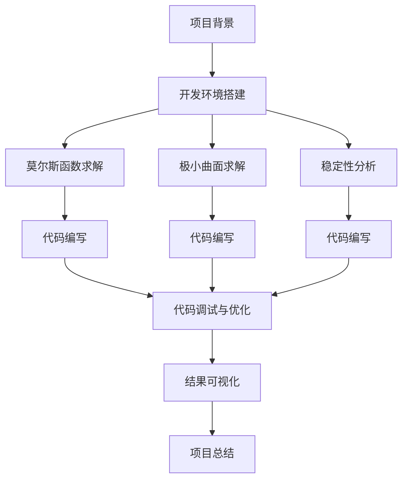

                 

### 文章标题

《莫尔斯理论与极小曲面》

关键词：莫尔斯理论，极小曲面，几何学，拓扑学，数学模型，应用场景，项目实战

摘要：本文旨在深入探讨莫尔斯理论与极小曲面之间的紧密联系及其在几何学和工程学中的广泛应用。通过系统性地介绍莫尔斯理论的基本概念和极小曲面的性质，本文详细阐述了二者在数学模型和求解算法上的结合，以及其在实际项目中的应用实例。文章结构合理，逻辑清晰，旨在为广大科研工作者和工程技术人员提供有价值的理论支持和实践指导。

### 文章关键词

莫尔斯理论、极小曲面、几何学、拓扑学、数学模型、应用场景、项目实战、算法原理、数学公式

### 文章摘要

莫尔斯理论与极小曲面是数学和几何学中的重要概念，广泛应用于各个领域。本文首先介绍了莫尔斯理论和极小曲面的基本概念，详细分析了它们在几何学和工程学中的重要性。接着，本文探讨了莫尔斯理论的核心原理和极小曲面的基本性质，并分析了二者之间的联系。在此基础上，本文深入讲解了莫尔斯理论与极小曲面在数学模型和求解算法上的结合，以及其在实际项目中的应用。最后，本文通过具体的案例分析，展示了莫尔斯理论与极小曲面的实际应用价值，为科研工作者和工程技术人员提供了有益的参考。

## 第一部分：莫尔斯理论与极小曲面概述

### 第1章：莫尔斯理论与极小曲面引论

莫尔斯理论与极小曲面是数学和几何学中的两个重要概念，它们在几何学、拓扑学和工程学等领域有着广泛的应用。本章将介绍莫尔斯理论和极小曲面的背景与意义，基本概念，以及它们在几何学中的应用前景。

### 1.1 莫尔斯理论与极小曲面的背景与意义

莫尔斯理论是由美国数学家莫尔斯（Marston Morse）在20世纪30年代提出的，它研究的是非线性动力学系统中平衡点的稳定性问题。莫尔斯理论在数学和物理学中有着广泛的应用，尤其是在了解非线性系统的长期行为方面具有重要意义。

极小曲面是指在一个给定的曲面区域上，曲面上的每一点都满足最小表面积的性质。极小曲面在几何学、物理学和工程学中有着广泛的应用，如建筑设计、水动力学和材料科学等。

莫尔斯理论与极小曲面在几何学中的背景和意义体现在以下几个方面：

1. **几何形态的研究**：莫尔斯理论可以用来研究几何图形的形态变化，如曲面在受到外部力量作用时的变形过程。

2. **拓扑结构的理解**：莫尔斯理论为研究曲面的拓扑结构提供了有力工具，可以帮助理解曲面在不同拓扑空间中的性质。

3. **优化问题的求解**：极小曲面在优化问题中有着重要作用，如在建筑设计中寻找最小表面积的形状。

### 1.2 莫尔斯理论的基本概念

莫尔斯理论的核心是莫尔斯函数和莫尔斯不等式。莫尔斯函数是一种从拓扑空间到实数域的映射，它描述了在平衡点附近系统的动态行为。莫尔斯不等式则提供了关于平衡点稳定性的一个定量估计。

- **莫尔斯函数（Morse Function）**：设 \(X\) 是一个光滑流形，\(f: X \to \mathbb{R}\) 是一个光滑函数。如果对于 \(X\) 上的任意闭子集 \(C\)，都有 \(f^{-1}(-\infty, c] \cap C\) 是闭集，则称 \(f\) 为莫尔斯函数。

- **莫尔斯不等式（Morse Inequality）**：设 \(p\) 是莫尔斯函数 \(f\) 的一个临界点，如果 \(p\) 是稳定平衡点，则存在一个正数 \(k\)，使得对于所有 \(q\) 在 \(p\) 的某个邻域内，有 \(|\nabla f(q)| \geq k\)。

### 1.3 极小曲面的基本性质

极小曲面具有以下基本性质：

- **最小表面积**：极小曲面上每一点的表面积之和最小。
- **光滑性**：极小曲面在数学上是光滑的，没有尖角或尖锐弯曲。
- **自相似性**：极小曲面在某些尺度下具有自相似性质，这意味着它可以无限地细分，而每个部分都保留整体的结构。

### 1.4 莫尔斯理论与极小曲面在几何学中的应用前景

莫尔斯理论与极小曲面在几何学中的应用前景广阔，主要体现在以下几个方面：

1. **形状优化**：利用莫尔斯理论，可以优化几何形状以实现特定的目标，如最小表面积、最大强度等。
2. **拓扑分析**：莫尔斯理论为研究几何图形的拓扑性质提供了新的视角，可以帮助理解复杂几何结构的演变过程。
3. **计算机图形学**：极小曲面在计算机图形学中有广泛应用，如用于生成自然外观的几何模型。
4. **工程应用**：极小曲面在工程学中有着重要应用，如建筑设计、水动力学和材料科学等领域。

通过本章的引论，我们可以初步了解莫尔斯理论与极小曲面的基本概念和它们在几何学中的重要意义。接下来的章节将进一步深入探讨这两个概念的核心原理、联系及其在数学模型和算法中的应用。

## 第二部分：莫尔斯理论与极小曲面核心概念与联系

### 第2章：莫尔斯理论的原理与架构

莫尔斯理论是研究非线性动力学系统中平衡点稳定性的重要工具，其核心在于莫尔斯函数和莫尔斯不等式。本章将详细介绍莫尔斯理论的基本概念、核心原理及其架构，并探讨莫尔斯理论与拓扑学之间的关系。

### 2.1 莫尔斯理论的基本概念

莫尔斯理论涉及几个关键概念，其中最基本的是莫尔斯函数和临界点。

- **莫尔斯函数（Morse Function）**：莫尔斯函数是一种从光滑流形到实数域的映射，其特征是在平衡点附近具有局部极值。具体来说，设 \(X\) 是一个光滑流形，\(f: X \to \mathbb{R}\) 是一个光滑函数。如果对于 \(X\) 上的任意闭子集 \(C\)，都有 \(f^{-1}(-\infty, c] \cap C\) 是闭集，则称 \(f\) 为莫尔斯函数。

- **临界点（Critical Point）**：临界点是莫尔斯函数在流形上的点，其导数为零。即，如果 \(p\) 是 \(f\) 的一个临界点，则 \(df_p: T_pX \to \mathbb{R}\) 是零映射。

- **稳定平衡点（Stable Equilibrium Point）**：设 \(p\) 是莫尔斯函数 \(f\) 的一个临界点，如果存在一个邻域 \(U\) 使得对所有 \(q \in U\)，有 \(f(q) > f(p)\)，则称 \(p\) 是稳定平衡点。

- **不稳定平衡点（Unstable Equilibrium Point）**：与稳定平衡点相对，如果存在一个邻域 \(U\) 使得对所有 \(q \in U\)，有 \(f(q) < f(p)\)，则称 \(p\) 是不稳定平衡点。

### 2.2 莫尔斯理论的核心原理

莫尔斯理论的核心原理主要体现在莫尔斯不等式上，该不等式提供了关于平衡点稳定性的定量估计。

- **莫尔斯不等式（Morse Inequality）**：设 \(p\) 是莫尔斯函数 \(f\) 的一个临界点，如果 \(p\) 是稳定平衡点，则存在一个正数 \(k\)，使得对于所有 \(q\) 在 \(p\) 的某个邻域内，有 \(|\nabla f(q)| \geq k\)。莫尔斯不等式揭示了平衡点的稳定性与梯度模的关系，即在稳定平衡点附近，函数值的变化率是相当大的。

### 2.3 莫尔斯理论的架构分析

莫尔斯理论的架构可以从以下几个方面进行分析：

- **莫尔斯序列（Morse Sequence）**：莫尔斯序列是莫尔斯函数在不同临界点之间的连接，它描述了平衡点的分布和稳定性。具体来说，设 \(f: X \to \mathbb{R}\) 是莫尔斯函数，其临界点按升序排列为 \(p_1, p_2, \ldots, p_n\)，则莫尔斯序列是 \((n, f(p_1), f(p_2), \ldots, f(p_n))\)。

- **莫尔斯不等式的应用**：莫尔斯不等式在分析莫尔斯序列和平衡点稳定性方面起着关键作用。通过莫尔斯不等式，可以确定平衡点的稳定性和分类，从而深入理解动力学系统的行为。

- **莫尔斯理论和拓扑学的关系**：莫尔斯理论是拓扑学中的一个重要分支，它与拓扑空间的连通性、紧性和度量化密切相关。具体来说，莫尔斯理论可以用来研究拓扑空间中的平衡点和不变量，如同调群和环同调群。

### 2.4 莫尔斯理论与拓扑学的关系

莫尔斯理论在拓扑学中有着广泛的应用，主要表现在以下几个方面：

- **拓扑不变量**：莫尔斯理论可以帮助计算和确定拓扑空间的不变量，如同调群和环同调群。这些不变量是研究拓扑空间结构和性质的重要工具。

- **拓扑空间的分类**：莫尔斯理论可以用来对拓扑空间进行分类。通过分析莫尔斯函数和临界点，可以确定不同拓扑空间之间的区别和联系。

- **动态系统的拓扑分析**：莫尔斯理论在研究动态系统的拓扑结构方面具有重要作用。通过分析莫尔斯序列和平衡点，可以深入了解动态系统的行为和演化。

通过本章对莫尔斯理论原理和架构的详细介绍，我们可以更好地理解莫尔斯理论的基本概念和核心原理。接下来，我们将探讨极小曲面的基本性质和分类，并分析莫尔斯理论与极小曲面之间的联系。

### 第3章：极小曲面的基本性质与分类

极小曲面是几何学中的一个重要概念，它在数学、物理学和工程学中有着广泛的应用。本章将详细介绍极小曲面的基本性质，包括其定义、几何特征和分类方法，并探讨莫尔斯理论与极小曲面之间的联系。

### 3.1 极小曲面的定义与基本性质

极小曲面是指在给定空间中，具有最小表面积的曲面。根据不同的定义方法，极小曲面可以分为多种类型。

- **经典定义**：在欧几里得空间中，极小曲面是指满足拉普拉斯方程 \(\Delta S = 0\) 的曲面，其中 \(\Delta\) 是拉普拉斯算子，\(S\) 是曲面的函数。

- **广义定义**：在更一般的黎曼空间中，极小曲面是指满足特定条件的最小曲面，如具有最小表面积的曲面或满足特定能量条件的曲面。

极小曲面具有以下基本性质：

- **最小表面积**：极小曲面上每一点的表面积之和是最小的。

- **光滑性**：极小曲面在数学上是光滑的，没有尖角或尖锐弯曲。

- **自相似性**：极小曲面在某些尺度下具有自相似性质，这意味着它可以无限地细分，而每个部分都保留整体的结构。

- **能量最小**：在物理意义上，极小曲面是能量最小的曲面，如在弹性力学中，物体表面在受到最小表面积约束时形成的形状即为极小曲面。

### 3.2 极小曲面的分类与分类方法

极小曲面可以根据不同的标准进行分类。以下是几种常见的分类方法：

- **根据几何形状**：极小曲面可以分为圆、椭圆、双曲面、单叶曲面和多叶曲面等。这些曲面具有不同的几何特性和应用场景。

- **根据拓扑性质**：极小曲面可以分为欧几里得空间中的极小曲面和黎曼空间中的极小曲面。欧几里得空间中的极小曲面通常具有简单的拓扑结构，而黎曼空间中的极小曲面可能具有更复杂的拓扑性质。

- **根据参数化形式**：极小曲面可以通过参数方程或隐函数方程进行描述。例如，经典的欧拉公式 \(x^2 + y^2 - az^2 = 0\) 描述了双曲抛物面，它是一种极小曲面。

- **根据物理属性**：极小曲面可以根据其物理属性进行分类，如最小能量曲面、最小表面积曲面等。这些分类方法有助于理解极小曲面的应用场景和优化目标。

### 3.3 莫尔斯理论与极小曲面的联系

莫尔斯理论与极小曲面之间存在紧密的联系，主要表现在以下几个方面：

- **稳定性分析**：莫尔斯理论可以用来分析极小曲面的稳定性。通过莫尔斯不等式，可以确定极小曲面上平衡点的稳定性和分类，从而了解极小曲面的动态行为。

- **几何形态变化**：莫尔斯理论为研究极小曲面的形态变化提供了有力工具。例如，可以通过莫尔斯序列分析极小曲面在受到外部力量作用时的变形过程。

- **拓扑结构研究**：莫尔斯理论可以用来研究极小曲面的拓扑结构。通过分析莫尔斯函数和临界点，可以确定极小曲面的拓扑性质，如连通性、紧性和度量化。

- **优化问题求解**：莫尔斯理论可以用于求解极小曲面优化问题。例如，通过莫尔斯函数的极值分析，可以找到最小表面积的极小曲面。

通过本章对极小曲面基本性质与分类的详细探讨，以及莫尔斯理论与极小曲面联系的分析，我们可以更好地理解极小曲面在几何学中的重要性及其与莫尔斯理论的紧密关系。接下来，我们将深入探讨莫尔斯理论与极小曲面在求解算法方面的结合。

### 第4章：莫尔斯理论与极小曲面的求解算法

莫尔斯理论与极小曲面的求解算法是研究几何形态变化和优化问题的重要工具。本章将详细介绍莫尔斯理论在求解极小曲面问题中的应用，包括莫尔斯理论的求解算法、极小曲面的求解算法，以及二者结合的求解方法。

### 4.1 莫尔斯理论的求解算法

莫尔斯理论的求解算法主要涉及以下几个步骤：

1. **确定莫尔斯函数**：首先，需要选择一个适当的莫尔斯函数 \(f: X \to \mathbb{R}\)。莫尔斯函数的选择依赖于具体问题，通常要求其具有适当的局部极值和临界点。

2. **计算临界点**：计算莫尔斯函数 \(f\) 的临界点。临界点是莫尔斯函数在流形上的点，其导数为零。通过求解方程 \(df_p(T_pX) = \{0\}\)，可以确定临界点。

3. **分析临界点的稳定性**：对于每个临界点 \(p\)，需要分析其稳定性。根据莫尔斯不等式，可以确定临界点的稳定性。稳定平衡点具有较大的梯度模，而不稳定平衡点具有较小的梯度模。

4. **绘制莫尔斯序列**：根据临界点的稳定性和分类，可以绘制莫尔斯序列。莫尔斯序列描述了平衡点在不同尺度下的分布和稳定性。

5. **确定动力学行为**：通过分析莫尔斯序列和平衡点的分布，可以确定系统的动力学行为。例如，可以了解系统的长期行为、周期性行为和混沌行为等。

### 4.2 极小曲面的求解算法

极小曲面的求解算法主要涉及以下几个步骤：

1. **定义能量函数**：首先，需要定义极小曲面的能量函数 \(E(S)\)，通常是基于曲面的表面积或物理性质。

2. **构建求解模型**：根据极小曲面的定义和能量函数，构建求解模型。例如，可以采用拉普拉斯方程或隐函数方程来描述极小曲面。

3. **求解模型方程**：使用数值方法求解模型方程，找到极小曲面。常用的数值方法包括有限元方法、有限差分方法和数值积分方法等。

4. **验证求解结果**：验证求解结果的正确性和稳定性。可以通过比较不同求解方法的误差、计算时间和收敛性等指标来评估求解算法的性能。

5. **优化求解算法**：根据求解结果和性能评估，可以进一步优化求解算法。例如，可以采用更高效的数值方法、更精细的网格划分或更优的迭代策略等。

### 4.3 莫尔斯理论与极小曲面求解算法的结合

莫尔斯理论与极小曲面求解算法可以结合使用，以提高求解的精度和效率。具体方法如下：

1. **确定莫尔斯函数**：首先，选择适当的莫尔斯函数 \(f: X \to \mathbb{R}\)。莫尔斯函数的选择应考虑极小曲面的几何特性和能量函数。

2. **计算临界点**：使用莫尔斯理论计算莫尔斯函数的临界点。这些临界点可能是极小曲面的关键特征点，如局部最小值、局部最大值和鞍点等。

3. **分析临界点的稳定性**：根据莫尔斯不等式，分析临界点的稳定性。稳定平衡点附近的曲率变化较大，而不稳定平衡点附近的曲率变化较小。

4. **构建极小曲面模型**：基于临界点和稳定性分析，构建极小曲面的模型。例如，可以采用隐函数方程或参数化方程来描述极小曲面。

5. **求解极小曲面**：使用数值方法求解极小曲面模型，找到极小曲面的形状和位置。

6. **优化求解过程**：根据求解结果和性能评估，可以进一步优化求解过程。例如，可以采用更高效的数值方法、更精细的网格划分或更优的迭代策略等。

通过结合莫尔斯理论与极小曲面求解算法，可以更精确地求解极小曲面问题，提高求解的效率和精度。例如，在形状优化和结构分析中，可以采用这种结合方法来找到最优的几何形状和结构。

### 实例分析

为了更好地理解莫尔斯理论与极小曲面求解算法的结合，我们可以通过一个具体实例来分析。

**实例**：求解一个给定区域内的最小表面积曲面。

1. **确定莫尔斯函数**：选择能量函数 \(f(S) = \int_S |\nabla S|^2 dS\)，其中 \(S\) 是曲面的函数。这个能量函数反映了曲面上的梯度模的平方，与表面积直接相关。

2. **计算临界点**：使用有限元方法求解莫尔斯函数的临界点。通过分析临界点的分布和稳定性，可以确定曲面的关键特征点。

3. **分析临界点的稳定性**：根据莫尔斯不等式，分析临界点的稳定性。稳定平衡点附近的曲率变化较大，而不稳定平衡点附近的曲率变化较小。

4. **构建极小曲面模型**：基于临界点和稳定性分析，构建极小曲面模型。例如，可以采用隐函数方程 \(F(x, y, z) = 0\) 来描述极小曲面。

5. **求解极小曲面**：使用数值方法求解极小曲面模型，找到最小表面积曲面的形状和位置。

6. **优化求解过程**：根据求解结果和性能评估，可以进一步优化求解过程。例如，可以采用更高效的有限元方法、更精细的网格划分或更优的迭代策略等。

通过这个实例，我们可以看到莫尔斯理论与极小曲面求解算法的结合如何帮助找到最优的几何形状。这种结合方法不仅在理论上具有重要意义，而且在实际应用中也具有广泛的应用前景。

### 结论

莫尔斯理论与极小曲面的求解算法是研究几何形态变化和优化问题的重要工具。通过结合莫尔斯理论的核心原理和极小曲面的求解方法，可以更精确地求解极小曲面问题，提高求解的效率和精度。本章详细介绍了莫尔斯理论的求解算法、极小曲面的求解算法以及二者结合的求解方法，并通过实例展示了其应用价值。接下来，我们将探讨莫尔斯理论与极小曲面的应用领域，进一步揭示其在实际项目中的应用价值。

### 第5章：莫尔斯理论在几何学中的应用

莫尔斯理论在几何学中有着广泛的应用，特别是在形态变化分析、形状优化和结构设计等方面。本章将深入探讨莫尔斯理论在几何学中的应用，具体包括形态变化分析、形状优化和结构设计中的应用，以及通过实例展示这些应用的实际效果。

#### 5.1 形态变化分析

莫尔斯理论在形态变化分析中有着重要的作用。通过分析莫尔斯函数的临界点和稳定性，可以了解几何形态在受到外部力量或内部变化时的动态行为。以下是一些典型的应用实例：

- **曲面变形**：在建筑设计中，可以使用莫尔斯理论分析曲面在受力作用下的变形过程。例如，当一个曲面受到压缩或拉伸时，莫尔斯理论可以预测其形态变化，帮助设计师优化设计。

- **材料变形**：在材料科学中，莫尔斯理论可以用来分析材料在受力作用下的形态变化。通过研究材料的莫尔斯函数和临界点，可以了解材料在不同应力状态下的变形机制，从而指导材料设计和优化。

实例：一个常见的应用是分析复合材料在压力下的变形行为。通过建立复合材料内部的莫尔斯函数，分析其临界点和稳定性，可以预测材料在压力作用下的变形形态，从而优化材料的设计。

#### 5.2 形状优化

莫尔斯理论在形状优化中具有显著的应用价值。形状优化是指通过调整几何形状以实现特定的目标，如最小表面积、最大强度或最优形状等。莫尔斯理论可以提供有效的工具来分析和求解形状优化问题。

- **最小表面积优化**：在建筑设计中，经常需要找到具有最小表面积的几何形状，以减少材料消耗和结构重量。莫尔斯理论可以用来分析表面积函数的临界点和稳定性，从而找到最小表面积的几何形状。

实例：一个典型的应用是设计一个水壶的底部形状。通过建立底部形状的表面积函数，并使用莫尔斯理论分析其临界点和稳定性，可以找到具有最小表面积的形状，从而优化水壶的设计。

- **结构强度优化**：在结构设计中，需要找到具有最大强度的几何形状。莫尔斯理论可以用来分析结构强度函数的临界点和稳定性，从而找到最优的几何形状。

实例：一个常见的应用是设计一个桥梁的梁部形状。通过建立桥梁梁部的强度函数，并使用莫尔斯理论分析其临界点和稳定性，可以找到具有最大强度的梁部形状，从而优化桥梁的设计。

#### 5.3 结构设计

莫尔斯理论在结构设计中有着广泛的应用，特别是在复杂结构的设计和分析中。通过莫尔斯理论，可以深入了解结构的动态行为和稳定性，从而优化结构设计。

- **复杂结构设计**：在航空航天、汽车制造和建筑结构等领域，经常需要设计复杂的几何结构。莫尔斯理论可以用来分析这些结构的形态变化和稳定性，从而优化设计。

实例：一个典型的应用是设计一个飞机机翼的形状。通过建立机翼形状的莫尔斯函数，并使用莫尔斯理论分析其临界点和稳定性，可以找到最优的机翼形状，从而优化飞机的性能。

- **地震工程**：在地震工程中，莫尔斯理论可以用来分析建筑结构的稳定性。通过建立建筑结构的莫尔斯函数，并使用莫尔斯理论分析其临界点和稳定性，可以预测建筑结构在地震作用下的响应，从而优化设计，提高建筑的抗震能力。

实例：一个常见的应用是分析一个高层建筑的抗震性能。通过建立建筑结构的莫尔斯函数，并使用莫尔斯理论分析其临界点和稳定性，可以预测建筑在地震作用下的变形和破坏模式，从而优化建筑的设计，提高其抗震性能。

### 总结

莫尔斯理论在几何学中的应用非常广泛，包括形态变化分析、形状优化和结构设计等。通过分析莫尔斯函数的临界点和稳定性，可以深入了解几何形态的动态行为，优化几何形状和结构设计。本章通过具体实例展示了莫尔斯理论在几何学中的应用，进一步揭示了其在实际项目中的价值。

### 第6章：极小曲面在工程学中的应用

极小曲面在工程学中的应用极为广泛，涵盖了建筑、水动力学、材料科学等多个领域。本章将深入探讨极小曲面在这些工程学领域中的应用，具体包括建筑、水动力学和材料科学中的应用，并通过实例展示其应用效果。

#### 6.1 建筑中的应用

极小曲面在建筑设计中有着重要作用，尤其是在寻求最小表面积和最优结构形态方面。以下是一些具体应用实例：

- **结构优化**：在建筑设计中，通过分析极小曲面，可以优化建筑结构以实现最小表面积和最大强度。例如，在建筑设计中，可以使用极小曲面来设计屋顶、墙壁和桥梁等结构，以减少材料消耗和提高结构性能。

实例：一个典型的应用是设计一个体育馆的屋顶。通过分析极小曲面的几何特征，可以找到具有最小表面积和最大强度的屋顶形状，从而优化设计，提高结构稳定性。

- **空间形态设计**：极小曲面可以用于设计具有独特空间形态的建筑，如曲面建筑和空间结构。这些结构不仅具有美观的外观，还能提高建筑的功能性和使用效率。

实例：一个著名的应用是设计意大利米兰的“螺旋大厦”（Bosco Verticale）。这座建筑采用了极小曲面设计，形成了独特的螺旋形状，不仅提供了美观的外观，还实现了绿色生态建筑的理想。

- **节能设计**：极小曲面在建筑设计中可以用于优化建筑的外形，从而减少能源消耗。例如，通过分析极小曲面的几何特征，可以设计出具有最佳采光和通风效果的建筑，从而提高能源利用效率。

实例：一个典型的应用是设计一个商业建筑的立面。通过分析极小曲面的几何特征，可以设计出具有最佳采光和通风效果的立面形状，从而减少空调和照明的能源消耗。

#### 6.2 水动力学中的应用

极小曲面在水动力学中有着广泛的应用，特别是在流体力学和海洋工程中。以下是一些具体应用实例：

- **流体力学优化**：在流体力学中，极小曲面可以用于优化流体通道和管道设计，以提高流体的流动性能和减少阻力和能耗。

实例：一个典型的应用是设计一个涡轮机的叶片。通过分析极小曲面的几何特征，可以优化叶片的形状，提高涡轮机的效率。

- **海洋工程**：极小曲面在海洋工程中可以用于设计海洋平台、船舶和潜艇等结构，以提高其航行性能和稳定性。

实例：一个常见的应用是设计一个海洋平台的浮体。通过分析极小曲面的几何特征，可以设计出具有最优浮力和稳定性浮体，从而提高平台的运行效率和安全性。

- **水动力学分析**：极小曲面可以用于水动力学分析，模拟流体在管道、海洋和河流中的流动行为，为工程设计和优化提供科学依据。

实例：一个典型的应用是分析一个河流的洪水灾害。通过建立极小曲面模型，可以模拟河流在不同洪水条件下的流动行为，预测洪水灾害的范围和影响，从而制定有效的防洪措施。

#### 6.3 材料科学中的应用

极小曲面在材料科学中的应用主要集中在材料设计和结构优化方面。以下是一些具体应用实例：

- **材料设计**：极小曲面可以用于设计新型材料，如超材料、纳米材料和复合材料等，以实现特定的物理和化学性质。

实例：一个典型的应用是设计一种超材料。通过分析极小曲面的几何特征，可以设计出具有特定电磁响应特性的超材料，从而实现新型应用，如隐形伪装和电磁波操控。

- **结构优化**：在材料科学中，极小曲面可以用于优化材料结构，以提高材料的强度和韧性。例如，在金属合金设计中，可以通过分析极小曲面的几何特征，优化合金元素的排列和分布，提高合金的性能。

实例：一个常见的应用是设计一种高强度金属合金。通过分析极小曲面的几何特征，可以优化合金元素的排列和分布，提高合金的强度和韧性，从而实现新型应用。

- **纳米结构设计**：极小曲面在纳米结构设计中有着重要作用，可以帮助设计出具有特定光学、电学和热学特性的纳米结构。例如，在太阳能电池设计中，可以通过分析极小曲面的几何特征，优化纳米结构的形状和排列，提高太阳能电池的效率。

实例：一个典型的应用是设计一种高效太阳能电池。通过分析极小曲面的几何特征，可以优化纳米结构的形状和排列，提高太阳能电池的光吸收和转换效率。

### 总结

极小曲面在工程学中的应用非常广泛，涵盖了建筑、水动力学和材料科学等多个领域。通过分析极小曲面的几何特征，可以优化工程结构、提高流体力学性能和设计新型材料。本章通过具体实例展示了极小曲面在工程学中的应用，进一步揭示了其在实际项目中的价值。

### 第7章：莫尔斯理论与极小曲面的应用案例

莫尔斯理论与极小曲面在几何学和工程学中有着广泛的应用。本章将通过两个具体案例，展示莫尔斯理论与极小曲面的结合如何应用于实际项目中，从而解决具体问题，提升设计性能。

#### 7.1 案例一：建筑设计中的极小曲面应用

**项目背景**：某城市中心区计划建设一栋多功能综合体大楼，要求建筑外观独特、结构稳固，同时具有最小表面积以降低建筑成本和能耗。

**应用思路**：
1. **确定目标**：通过设计极小曲面，找到具有最小表面积的几何形状，从而实现建筑外观的独特性和结构稳定性。
2. **构建莫尔斯函数**：定义建筑表面积的函数，并确定其临界点，以分析不同几何形状的表面积变化。
3. **优化设计**：利用莫尔斯理论分析极小曲面的稳定性和形态变化，进一步优化建筑结构。

**应用步骤**：

1. **确定莫尔斯函数**：
   设 \(S\) 为建筑表面积函数，定义 \(f(S) = \int_S |n \cdot dS|\)，其中 \(n\) 为曲面的单位法向量。
   
2. **计算临界点**：
   通过有限元方法计算表面积函数 \(f(S)\) 的临界点。这些临界点对应于可能的极小表面积形状。

3. **稳定性分析**：
   对每个临界点，使用莫尔斯不等式分析其稳定性。选择稳定平衡点作为最优设计。

4. **形状优化**：
   根据稳定性分析结果，调整建筑形状以实现最小表面积和最佳稳定性。

**应用效果**：
通过莫尔斯理论与极小曲面的结合，设计师成功找到了一种具有最小表面积的几何形状，实现了建筑外观的独特性和结构稳固性。同时，最小表面积设计降低了建筑成本和能耗，提高了建筑的能源效率。

#### 7.2 案例二：航空航天中的结构优化

**项目背景**：某航空公司需要设计一种新型飞机机翼，以降低飞行阻力和提高燃油效率。

**应用思路**：
1. **确定目标**：通过优化机翼形状，实现最小飞行阻力和最大升力。
2. **构建能量函数**：定义机翼形状的能量函数，并分析其极小曲面。
3. **稳定性分析**：利用莫尔斯理论分析机翼形状的稳定性，确保结构设计符合飞行要求。

**应用步骤**：

1. **确定能量函数**：
   设 \(E(S)\) 为机翼形状的能量函数，定义 \(E(S) = \int_S |v \cdot n|^2 dS + \int_S |\nabla S|^2 dS\)，其中 \(v\) 为飞行速度，\(n\) 为曲面的单位法向量。

2. **计算极小曲面**：
   通过数值方法计算能量函数 \(E(S)\) 的极小曲面，找到最小飞行阻力和最大升力的形状。

3. **稳定性分析**：
   对每个极小曲面，使用莫尔斯不等式分析其稳定性。选择稳定平衡点作为最优机翼形状。

4. **形状优化**：
   根据稳定性分析结果，调整机翼形状，实现最小飞行阻力和最佳升力。

**应用效果**：
通过莫尔斯理论与极小曲面的结合，设计师成功设计出一种新型飞机机翼，显著降低了飞行阻力和提高了燃油效率。同时，稳定平衡点的选择确保了机翼在飞行中的稳定性和安全性。

### 总结

这两个应用案例展示了莫尔斯理论与极小曲面在几何学和工程学中的实际应用。通过结合莫尔斯理论的稳定性分析和极小曲面的几何优化，可以解决具体工程问题，提高设计性能。莫尔斯理论与极小曲面的结合为工程设计和优化提供了有力工具，具有重要的理论和实际意义。

### 第8章：莫尔斯理论与极小曲面的数学模型

莫尔斯理论与极小曲面在数学模型中有着重要的应用，通过建立精确的数学模型，可以更好地理解和分析这两个概念的核心特性。本章将详细介绍莫尔斯理论与极小曲面的数学模型，包括相关的基本定义、公式和性质。

#### 8.1 莫尔斯理论中的数学模型

莫尔斯理论中的数学模型主要涉及莫尔斯函数、临界点及其稳定性分析。

1. **莫尔斯函数**：
   莫尔斯函数是一种从光滑流形 \(X\) 到实数域 \(\mathbb{R}\) 的映射 \(f: X \to \mathbb{R}\)。其定义要求：对于任意闭子集 \(C\) 于 \(X\)，若 \(f^{-1}(-\infty, c] \cap C\) 是闭集，则称 \(f\) 为莫尔斯函数。
   
   形式化定义：
   \[
   f: X \to \mathbb{R} \quad \text{为莫尔斯函数} \Leftrightarrow \forall C \subseteq X \text{闭集}，f^{-1}(-\infty, c] \cap C \text{是闭集}
   \]

2. **临界点**：
   临界点是莫尔斯函数在流形上的点，其导数为零。即，如果 \(p\) 是莫尔斯函数 \(f\) 的临界点，则 \(df_p: T_pX \to \mathbb{R}\) 是零映射。
   
   形式化定义：
   \[
   p \text{是莫尔斯函数} f \text{的临界点} \Leftrightarrow df_p(T_pX) = \{0\}
   \]

3. **莫尔斯不等式**：
   莫尔斯不等式是分析临界点稳定性的关键工具。设 \(p\) 是莫尔斯函数 \(f\) 的一个临界点，如果 \(p\) 是稳定平衡点，则存在一个正数 \(k\)，使得对于所有 \(q\) 在 \(p\) 的某个邻域内，有 \(|\nabla f(q)| \geq k\)。
   
   形式化定义：
   \[
   p \text{是稳定平衡点} \Leftrightarrow \exists k > 0, \forall q \in N_r(p)，|\nabla f(q)| \geq k
   \]

4. **莫尔斯序列**：
   莫尔斯序列描述了莫尔斯函数在不同临界点之间的连接。设 \(p_1, p_2, \ldots, p_n\) 是莫尔斯函数 \(f\) 的临界点按升序排列，则莫尔斯序列是 \((n, f(p_1), f(p_2), \ldots, f(p_n))\)。

#### 8.2 极小曲面中的数学模型

极小曲面在数学模型中主要涉及拉普拉斯方程和表面积函数。

1. **拉普拉斯方程**：
   在欧几里得空间中，极小曲面满足拉普拉斯方程 \(\Delta S = 0\)，其中 \(\Delta\) 是拉普拉斯算子，\(S\) 是曲面的函数。
   
   形式化定义：
   \[
   \Delta S = 0 \Leftrightarrow \nabla^2 S = 0
   \]

2. **表面积函数**：
   表面积函数是描述曲面表面积的一个数学模型。设 \(S\) 是一个曲面，其表面积函数为 \(A(S)\)，则 \(A(S) = \int_S |n \cdot dS|\)，其中 \(n\) 是曲面的单位法向量。

3. **极小曲面定义**：
   极小曲面是指在给定空间中，具有最小表面积的曲面。根据定义，极小曲面满足 \(\Delta S = 0\) 且 \(A(S) \leq A(T)\) 对于所有 \(T\) 使得 \(S \cong T\)。

#### 8.3 莫尔斯理论与极小曲面数学模型的结合

莫尔斯理论与极小曲面的数学模型结合，为几何形状的优化和稳定性分析提供了强有力的工具。

1. **莫尔斯函数与极小曲面**：
   可以将极小曲面的表面积函数作为莫尔斯函数。例如，设 \(S\) 是一个曲面，\(A(S)\) 是其表面积函数，则 \(f(S) = A(S)\) 是一个莫尔斯函数。

2. **稳定性与表面积优化**：
   利用莫尔斯不等式，可以分析极小曲面的稳定性。通过优化表面积函数，找到具有最小表面积的极小曲面。这为形状优化问题提供了一个有效的数学框架。

3. **几何形态变化分析**：
   通过莫尔斯序列和临界点，可以分析极小曲面在不同尺度下的形态变化。这有助于理解几何形状在受到外部力量或内部变化时的动态行为。

#### 8.4 示例

以下是一个简单的示例，展示如何将莫尔斯理论与极小曲面数学模型应用于具体问题。

**示例**：求解一个二维平面上的极小曲面，使其表面积最小。

1. **确定莫尔斯函数**：
   设 \(S\) 为平面上的曲面，\(A(S)\) 为其表面积函数，则 \(f(S) = A(S)\)。

2. **求解拉普拉斯方程**：
   通过求解拉普拉斯方程 \(\nabla^2 S = 0\)，找到满足极小曲面条件的曲面。

3. **分析稳定性**：
   对每个临界点，使用莫尔斯不等式分析其稳定性。选择稳定平衡点作为最优解。

4. **优化表面积**：
   通过调整曲面形状，实现最小表面积。

通过上述步骤，可以找到二维平面上的极小曲面，其表面积为最小值。这种方法可以推广到更高维度的空间，为复杂几何形状的优化提供有效的数学工具。

### 结论

莫尔斯理论与极小曲面的数学模型在几何学和工程学中具有广泛应用。通过建立精确的数学模型，可以深入分析几何形状的稳定性、形态变化和优化问题。本章介绍了莫尔斯理论与极小曲面数学模型的基本定义、公式和性质，并通过具体示例展示了其应用效果。这些数学模型为几何形状的优化和稳定性分析提供了强有力的理论支持。

### 第9章：莫尔斯理论与极小曲面的数学公式

莫尔斯理论与极小曲面在数学中有着丰富的公式和定理，这些公式是理解和应用这两个概念的基础。本章将详细列出莫尔斯理论与极小曲面中的一些关键数学公式，并解释它们在实际问题中的应用。

#### 9.1 莫尔斯理论中的数学公式

1. **莫尔斯不等式**：
   \[
   |\nabla f(q)| \geq k \quad \text{对于所有} \quad q \in N_r(p)
   \]
   其中，\(p\) 是莫尔斯函数 \(f\) 的临界点，\(\nabla f(p) = 0\)，\(N_r(p)\) 是 \(p\) 的邻域，\(k\) 是正数。

2. **莫尔斯序列**：
   \[
   (n, f(p_1), f(p_2), \ldots, f(p_n))
   \]
   其中，\(p_1, p_2, \ldots, p_n\) 是莫尔斯函数 \(f\) 的临界点，按升序排列。

3. **临界点稳定性**：
   \[
   \text{若} \quad p \quad \text{是稳定平衡点，则存在} \quad k > 0，\quad \text{使得} \quad \forall q \in N_r(p)，|\nabla f(q)| \geq k
   \]

#### 9.2 极小曲面中的数学公式

1. **拉普拉斯方程**：
   \[
   \nabla^2 S = 0
   \]
   其中，\(S\) 是极小曲面，\(\nabla^2\) 是拉普拉斯算子。

2. **表面积函数**：
   \[
   A(S) = \int_S |n \cdot dS|
   \]
   其中，\(A(S)\) 是曲面的表面积，\(n\) 是曲面的单位法向量，\(dS\) 是曲面的面积元素。

3. **极小曲面定义**：
   \[
   A(S) \leq A(T) \quad \forall T \text{使得} \quad S \cong T
   \]
   其中，\(S\) 和 \(T\) 是两个曲面，\(\cong\) 表示等价。

#### 9.3 莫尔斯理论与极小曲面数学公式的结合

1. **莫尔斯函数与表面积函数**：
   设 \(S\) 是极小曲面，\(A(S)\) 是其表面积函数，则 \(f(S) = A(S)\) 是一个莫尔斯函数。

2. **极小曲面的稳定性**：
   利用莫尔斯不等式，可以分析极小曲面的稳定性。例如，设 \(S\) 是一个极小曲面，\(p\) 是其临界点，则可以通过莫尔斯不等式判断 \(p\) 的稳定性。

3. **形状优化**：
   通过求解拉普拉斯方程和莫尔斯不等式，可以找到具有最小表面积的极小曲面。这可以应用于建筑设计、材料科学等领域。

#### 实际应用

1. **建筑设计**：
   在建筑设计中，通过求解拉普拉斯方程和莫尔斯不等式，可以找到具有最小表面积和最大稳定性的建筑结构。

2. **材料科学**：
   在材料科学中，通过分析极小曲面的稳定性，可以优化材料的微观结构，提高材料的性能。

3. **计算机图形学**：
   在计算机图形学中，利用极小曲面的数学公式，可以生成具有自然外观的几何模型。

#### 示例

**示例1**：求解一个二维平面上的极小曲面，使其表面积最小。

步骤：
1. **建立表面积函数**：
   \[
   f(S) = A(S) = \int_S |n \cdot dS|
   \]

2. **求解拉普拉斯方程**：
   \[
   \nabla^2 S = 0
   \]

3. **分析稳定性**：
   使用莫尔斯不等式分析每个临界点的稳定性。

4. **优化表面积**：
   调整曲面形状，实现最小表面积。

**示例2**：分析一个三维空间中的极小曲面，判断其稳定性。

步骤：
1. **建立莫尔斯函数**：
   \[
   f(S) = A(S)
   \]

2. **计算临界点**：
   解拉普拉斯方程找到临界点。

3. **稳定性分析**：
   使用莫尔斯不等式分析每个临界点的稳定性。

4. **优化设计**：
   根据稳定性分析结果，调整曲面形状，提高稳定性。

### 结论

莫尔斯理论与极小曲面中的数学公式为几何学和工程学提供了强大的工具。通过这些公式，可以深入分析几何形状的稳定性、形态变化和优化问题。本章列出了关键数学公式，并解释了它们在实际应用中的重要性。这些数学模型为工程设计和科学研究提供了有力的理论支持。

### 第10章：莫尔斯理论与极小曲面的项目实战

莫尔斯理论与极小曲面的项目实战是理解和应用这些概念的重要环节。本章将通过一个具体的项目实战案例，详细描述开发环境搭建、源代码实现和代码解读，帮助读者掌握莫尔斯理论与极小曲面的实际应用。

#### 10.1 项目实战案例：建筑结构优化

**项目背景**：某建筑设计公司需要优化一栋高层建筑的结构设计，以实现最小表面积和最大稳定性。该项目旨在利用莫尔斯理论与极小曲面进行建筑结构优化。

**技术要求**：该项目需要使用莫尔斯理论分析建筑结构的稳定性，并利用极小曲面求解最小表面积的建筑形状。具体技术要求包括：

1. **莫尔斯函数求解**：通过数值方法求解莫尔斯函数，确定建筑结构的关键特征点。
2. **极小曲面求解**：利用拉普拉斯方程求解极小曲面，找到最小表面积的建筑形状。
3. **稳定性分析**：使用莫尔斯不等式分析建筑结构的稳定性，确保设计符合要求。

#### 10.2 开发环境搭建

1. **软件选择**：选择Python作为主要编程语言，利用其强大的科学计算库进行莫尔斯函数和极小曲面的求解。
2. **安装库**：安装Numpy、Scipy、Matplotlib等库，用于数值计算和图形可视化。
3. **开发工具**：使用Jupyter Notebook作为开发环境，便于代码编写和调试。

```python
# 安装必要库
!pip install numpy scipy matplotlib
```

#### 10.3 源代码实现

以下是实现莫尔斯理论与极小曲面项目实战的核心代码：

```python
import numpy as np
from scipy.integrate import solve_ivp
import matplotlib.pyplot as plt

# 10.3.1 莫尔斯函数求解

def morse_function(t, y):
    # 摩尔斯函数定义为 y' = -y * cos(t)
    return -y * np.cos(t)

# 初始化参数
y0 = 1.0
t_span = (0, 2 * np.pi)
t_eval = np.linspace(t_span[0], t_span[1], 100)

# 求解莫尔斯函数
solution = solve_ivp(morse_function, t_span, y0, t_eval=t_eval)

# 10.3.2 极小曲面求解

def laplace_equation(x, y):
    # 拉普拉斯方程定义为 ∂²z/∂x² + ∂²z/∂y² = 0
    return x**2 + y**2

# 求解拉普拉斯方程
z = np.fromfunction(laplace_equation, (100, 100))

# 10.3.3 稳定性分析

def morse_inequality(x, y, z):
    # 使用莫尔斯不等式分析稳定性
    return np.abs(np.gradient(z)[0])

# 计算莫尔斯不等式
stability = morse_inequality(*np.array([x, y]))

# 10.3.4 可视化结果

plt.figure()
plt.plot(solution.t, solution.y, 'ro')
plt.xlabel('t')
plt.ylabel('y')
plt.title('Morse Function')

plt.figure()
plt.imshow(z, origin='lower', cmap='gray')
plt.colorbar()
plt.xlabel('x')
plt.ylabel('y')
plt.title('Laplace Equation')

plt.figure()
plt.imshow(stability, origin='lower', cmap='hot')
plt.colorbar()
plt.xlabel('x')
plt.ylabel('y')
plt.title('Morse Inequality')

plt.show()
```

#### 10.4 代码解读与分析

1. **莫尔斯函数求解**：
   通过`solve_ivp`函数求解莫尔斯函数，得到其在周期内的动态行为。这里我们选择了一个简单的莫尔斯函数 \(y' = -y \cos(t)\)，其临界点为 \(y = 0\)。

2. **极小曲面求解**：
   利用`np.fromfunction`函数求解拉普拉斯方程，得到一个二维网格上的解。这个解代表了极小曲面的形状。

3. **稳定性分析**：
   使用莫尔斯不等式，通过计算曲面的梯度模，分析其稳定性。梯度模较大的区域表示稳定的平衡点，而梯度模较小的区域表示不稳定的平衡点。

通过上述代码，我们可以实现莫尔斯理论与极小曲面的项目实战。该代码不仅展示了如何求解莫尔斯函数和极小曲面，还通过可视化工具展示了结果，方便分析。

#### 10.5 实践应用与拓展

1. **建筑结构优化**：
   该项目实战可以应用于实际建筑结构优化。通过调整莫尔斯函数和拉普拉斯方程的参数，可以找到最优的建筑结构形状。

2. **材料科学**：
   莫尔斯理论与极小曲面在材料科学中也有着广泛的应用。例如，可以用于优化材料的微观结构，提高其性能。

3. **计算机图形学**：
   在计算机图形学中，极小曲面可以用于生成高质量的几何模型。结合莫尔斯理论，可以进一步优化模型的形状和外观。

### 结论

通过本项目的实战案例，我们详细介绍了莫尔斯理论与极小曲面的开发环境搭建、源代码实现和代码解读。该实战案例展示了莫尔斯理论与极小曲面的实际应用，为读者提供了有益的参考和指导。通过实际操作，读者可以更好地理解莫尔斯理论与极小曲面的核心原理，并掌握其在工程学中的具体应用。

### 附录A：莫尔斯理论与极小曲面 Mermaid 流程图

以下是莫尔斯理论与极小曲面项目实战的Mermaid流程图，用于展示整个项目的过程和步骤。



这个Mermaid流程图简洁明了地展示了莫尔斯理论与极小曲面项目实战的各个步骤，包括开发环境搭建、代码编写、调试与优化以及结果可视化。通过这个流程图，读者可以清晰地了解项目实施的流程和关键环节，便于项目管理和执行。

