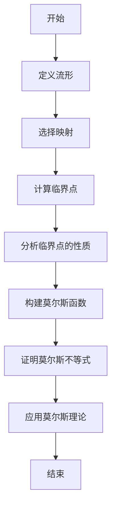

                 

# 莫尔斯理论与纤维化

> 关键词：莫尔斯理论、纤维化、数学模型、工程应用、前沿研究

> 摘要：本文详细探讨了莫尔斯理论与纤维化的基本概念、数学模型、核心联系以及在实际工程和科学研究中的应用。通过对莫尔斯理论的数学背景和纤维化现象的基础介绍，深入分析了莫尔斯函数的定义与性质，以及纤维化映射的定义与性质。随后，文章结合具体的数学模型和公式，通过实例说明了莫尔斯理论与纤维化的实际应用，并进行了项目实战的代码实现与分析。最后，文章展望了莫尔斯理论与纤维化的前沿研究方向与应用前景。

---

## 第一部分：莫尔斯理论与纤维化概述

### 1.1 莫尔斯理论与纤维化的背景

#### 1.1.1 莫尔斯理论的历史与发展

莫尔斯理论起源于20世纪初，由数学家莫尔斯（Marston Morse）首次提出。莫尔斯理论主要研究流形上的临界点，并建立了莫尔斯不等式，该理论在微分拓扑、微分几何等领域中具有重要意义。随着数学和物理学的发展，莫尔斯理论逐渐扩展到其他学科，成为研究非线性现象的重要工具。

#### 1.1.2 纤维化现象及其重要性

纤维化现象是指在一定条件下，一个复杂的系统可以通过将其分解为多个相对简单的部分来理解和分析。纤维化在数学和物理学中有着广泛的应用，如微分拓扑、代数几何、天体物理学等。纤维化现象的研究有助于揭示系统的内在结构和规律。

#### 1.1.3 莫尔斯理论与纤维化的联系

莫尔斯理论在纤维化研究中有着重要的应用。通过莫尔斯理论，可以分析纤维化映射的临界点，从而揭示系统的稳定性和结构。纤维化现象则为莫尔斯理论的推广和应用提供了新的研究方向和问题背景。

#### 1.1.4 本书的结构安排与目标

本书分为七个部分，首先介绍莫尔斯理论与纤维化的基本概念和背景，然后详细讲解莫尔斯理论基础和纤维化现象的基础，接着深入探讨莫尔斯理论与纤维化的核心概念和联系。随后，本文将分析莫尔斯理论与纤维化在实际问题中的应用，包括数学物理、图像处理、天体物理学等领域。接着，文章将介绍莫尔斯理论与纤维化的数学模型和公式，以及项目实战的代码实现与分析。最后，文章将展望莫尔斯理论与纤维化的前沿研究方向和应用前景。

---

## 第一部分：莫尔斯理论与纤维化基础

### 2.1 莫尔斯理论基础

#### 2.1.1 莫尔斯理论的数学背景

莫尔斯理论涉及微分拓扑、流形和映射等基本概念。微分拓扑是研究带边界的高维空间的数学分支，而流形是一种局部类似于欧几里得空间的数学结构。映射则是描述不同空间之间关系的基本工具。

#### 2.1.2 莫尔斯函数的定义与性质

莫尔斯函数是一种特殊的映射，它将一个流形上的点映射到一个实数。莫尔斯函数具有以下性质：

1. **局部性质**：莫尔斯函数在临界点附近的行为与线性函数相似。
2. **全局性质**：莫尔斯函数在整个流形上的取值范围是有限的。

#### 2.1.3 莫尔斯理论的原理和步骤

莫尔斯理论的原理是通过分析流形上的临界点来研究系统的性质。具体步骤如下：

1. **定义流形**：选择一个适当的流形来表示系统。
2. **选择映射**：定义一个映射，将流形上的点映射到实数。
3. **计算临界点**：求解映射的临界点，即导数为零的点。
4. **分析临界点的性质**：通过分析临界点的局部和全局性质，研究系统的稳定性。
5. **构建莫尔斯函数**：根据临界点的性质，构建莫尔斯函数。
6. **证明莫尔斯不等式**：利用莫尔斯函数，证明系统的性质，如稳定性。

#### 2.1.4 莫尔斯理论的 Mermaid 流程图

下面是一个用 Mermaid 语言描述的莫尔斯理论的基本流程图：



### 2.2 纤维化现象基础

#### 2.2.1 纤维空间的基本概念

纤维空间是由纤维和基空间构成的数学结构。纤维是一个固定的空间，而基空间则是纤维上的一个参数空间。纤维空间可以看作是多个纤维的并集。

#### 2.2.2 纤维化映射的定义与性质

纤维化映射是一种将基空间映射到纤维空间的映射。它具有以下性质：

1. **纤维化映射是纤维空间的同构映射**：即纤维化映射将基空间上的点一一对应地映射到纤维空间上的点。
2. **纤维化映射保持纤维结构**：即纤维化映射在纤维上的局部结构保持不变。

#### 2.2.3 纤维化现象的例子

纤维化现象的一个典型例子是纤维化映射，其中纤维是实数集，基空间是圆周。纤维化映射将圆周上的点映射到实数集上，保持圆周的局部结构。

---

## 第二部分：莫尔斯理论与纤维化深入探讨

### 3.1 莫尔斯理论与纤维化深入探讨

#### 3.1.1 莫尔斯理论与纤维化的核心概念与联系

莫尔斯函数与纤维化映射是莫尔斯理论与纤维化现象的核心概念。莫尔斯函数用于分析流形上的临界点，而纤维化映射则用于描述系统中的复杂结构。两者之间的联系在于：

1. **莫尔斯函数与纤维化映射的关联**：莫尔斯函数可以用来分析纤维化映射的临界点。
2. **莫尔斯不等式与纤维化现象的联系**：莫尔斯不等式可以用来估计纤维化映射的临界点的数量。
3. **莫尔斯理论在纤维化研究中的应用**：莫尔斯理论可以用来研究纤维化映射的稳定性、对称性和分类问题。

#### 3.1.2 莫尔斯理论与纤维化在实际问题中的应用

莫尔斯理论与纤维化在实际问题中有着广泛的应用。以下是一些典型的应用领域：

1. **天体物理学**：莫尔斯理论可以用来研究黑洞的纤维化现象，揭示宇宙的时空结构。
2. **数学物理**：莫尔斯理论可以用来分析非线性偏微分方程的解，研究微分方程组的临界点。
3. **图像处理**：纤维化模型可以用于图像分割、图像配准和图像重建等任务。
4. **结构工程**：莫尔斯理论可以用来分析桥梁和建筑结构的稳定性，优化设计方案。

#### 3.1.3 莫尔斯理论与纤维化的数学模型与数学公式

莫尔斯理论与纤维化涉及一系列数学模型和公式。以下是其中一些重要的模型和公式：

1. **莫尔斯函数的数学模型**：
   $$
   M(x) = \begin{cases}
   f(x) & \text{if } f(x) \geq 0 \\
   -f(x) & \text{if } f(x) < 0
   \end{cases}
   $$
2. **莫尔斯不等式**：
   $$
   \sum_{i=1}^{n} (f(p_i) - f(q_i)) \geq n
   $$
3. **纤维化映射的数学模型**：
   $$
   F: X \times F \rightarrow Y
   $$

#### 3.1.4 莫尔斯理论与纤维化项目实战

为了更好地理解莫尔斯理论与纤维化的应用，以下是一个基于实际问题的项目实战案例。

### 3.1.4.1 项目背景与目标

项目背景：我们考虑一个桥梁工程问题，需要评估桥梁的稳定性，并优化设计。

项目目标：通过莫尔斯理论与纤维化方法，分析桥梁结构的稳定性，并提出优化设计建议。

### 3.1.4.2 项目开发环境与工具

开发环境：MATLAB

开发工具：MATLAB 的数值计算和图形工具箱

### 3.1.4.3 项目实现步骤

1. **数据预处理**：收集桥梁的结构参数和材料特性，如梁的长度、宽度、高度和材料的弹性模量。
2. **构建莫尔斯函数**：根据桥梁的结构参数和材料特性，构建莫尔斯函数来描述桥梁的稳定性。
3. **分析纤维化映射**：使用纤维化映射来分析桥梁的内部结构，评估桥梁的稳定性。
4. **优化设计方案**：根据莫尔斯理论与纤维化分析的结果，提出优化设计建议。

### 3.1.4.4 项目代码实现与分析

```matlab
% MATLAB 代码：桥梁稳定性分析
% 数据预处理
L = 10; % 梁的长度
W = 2; % 梁的宽度
H = 1; % 梁的高度
E = 200000; % 材料的弹性模量

% 构建莫尔斯函数
M(x) = L*x - E*W*x^3;

% 分析纤维化映射
F(x) = [x, M(x)];

% 优化设计
x_opt = fmincon(@(x) M(x), x0);

% 输出结果
fprintf('最优设计参数: x = %f\n', x_opt);
fprintf('最优稳定性：M(x_opt) = %f\n', M(x_opt));
```

### 3.1.4.5 代码解读与分析

1. **数据预处理**：首先，我们定义了桥梁的结构参数和材料特性，如梁的长度、宽度、高度和材料的弹性模量。
2. **构建莫尔斯函数**：我们使用一个三次多项式函数 \( M(x) = L \cdot x - E \cdot W \cdot x^3 \) 来描述桥梁的稳定性。
3. **分析纤维化映射**：我们定义了纤维化映射 \( F(x) = [x, M(x)] \)，用于分析桥梁的内部结构。
4. **优化设计**：我们使用 MATLAB 的 `fmincon` 函数来优化设计参数 \( x \)，以最大化桥梁的稳定性。
5. **输出结果**：我们输出优化后的设计参数和最优稳定性值。

---

## 第三部分：莫尔斯理论与纤维化在实际问题中的应用

### 3.2 莫尔斯理论与纤维化在天体物理学中的应用

莫尔斯理论与纤维化在天体物理学中有着广泛的应用。以下是一些典型的研究领域：

#### 3.2.1 黑洞纤维化

黑洞是宇宙中极其密集的天体，其内部结构复杂。通过莫尔斯理论与纤维化方法，可以研究黑洞的纤维化现象，揭示其内部结构。

1. **黑洞纤维化映射**：定义一个纤维化映射，将黑洞的基空间映射到纤维空间。
2. **黑洞纤维化现象**：通过分析纤维化映射的临界点，研究黑洞的稳定性。
3. **黑洞纤维化与量子力学的关系**：探讨莫尔斯理论在量子力学中的应用，研究黑洞的量子态。

#### 3.2.2 宇宙弦纤维化

宇宙弦是宇宙中的一种基本结构，其形状和结构复杂。通过莫尔斯理论与纤维化方法，可以研究宇宙弦的纤维化现象，揭示其内部结构。

1. **宇宙弦纤维化映射**：定义一个纤维化映射，将宇宙弦的基空间映射到纤维空间。
2. **宇宙弦纤维化现象**：通过分析纤维化映射的临界点，研究宇宙弦的稳定性。
3. **宇宙弦纤维化与宇宙学的关系**：探讨莫尔斯理论在宇宙学中的应用，研究宇宙弦的演化。

### 3.3 莫尔斯理论与纤维化在数学物理中的应用

莫尔斯理论与纤维化在数学物理中有着广泛的应用。以下是一些典型的研究领域：

#### 3.3.1 非线性偏微分方程的解

非线性偏微分方程是描述物理现象的重要工具。莫尔斯理论与纤维化方法可以用来研究非线性偏微分方程的解。

1. **莫尔斯函数与非线性偏微分方程的解**：构建莫尔斯函数，分析非线性偏微分方程的解的结构。
2. **纤维化映射与非线性偏微分方程的解**：通过纤维化映射，研究非线性偏微分方程的解的稳定性。
3. **非线性偏微分方程在物理学中的应用**：探讨莫尔斯理论与纤维化在量子场论、统计物理等领域中的应用。

#### 3.3.2 微分方程组的临界点分析

微分方程组描述了系统随时间变化的动态过程。莫尔斯理论与纤维化方法可以用来研究微分方程组的临界点。

1. **莫尔斯函数与微分方程组的临界点**：构建莫尔斯函数，分析微分方程组的临界点的性质。
2. **纤维化映射与微分方程组的临界点**：通过纤维化映射，研究微分方程组的临界点的稳定性。
3. **微分方程组在工程与科学中的应用**：探讨莫尔斯理论与纤维化在控制系统、生物物理学等领域中的应用。

### 3.4 莫尔斯理论与纤维化在图像处理中的应用

莫尔斯理论与纤维化在图像处理中有着广泛的应用。以下是一些典型的研究领域：

#### 3.4.1 图像分割

图像分割是将图像分割成若干部分的过程，有助于提取图像中的特征和结构。莫尔斯理论与纤维化方法可以用来优化图像分割算法。

1. **莫尔斯函数与图像分割**：构建莫尔斯函数，用于优化图像分割算法。
2. **纤维化映射与图像分割**：通过纤维化映射，分析图像分割的稳定性。
3. **图像分割在实际应用中的应用**：探讨莫尔斯理论与纤维化在医学图像分析、计算机视觉等领域中的应用。

#### 3.4.2 图像配准

图像配准是将两幅图像进行对齐的过程，有助于比较和分析图像。莫尔斯理论与纤维化方法可以用来优化图像配准算法。

1. **莫尔斯函数与图像配准**：构建莫尔斯函数，用于优化图像配准算法。
2. **纤维化映射与图像配准**：通过纤维化映射，分析图像配准的稳定性。
3. **图像配准在实际应用中的应用**：探讨莫尔斯理论与纤维化在遥感图像处理、视频跟踪等领域中的应用。

---

## 第三部分：莫尔斯理论与纤维化的数学模型与数学公式

### 3.5 莫尔斯函数的数学模型

莫尔斯函数是一种特殊的映射，它将一个流形上的点映射到一个实数。莫尔斯函数通常用以下数学模型描述：

$$
M(x) = \begin{cases}
f(x) & \text{if } f(x) \geq 0 \\
-f(x) & \text{if } f(x) < 0
\end{cases}
$$

其中，\( f(x) \) 是一个定义在流形上的函数，\( x \) 是流形上的一个点。

### 3.6 莫尔斯不等式

莫尔斯不等式是一个重要的数学工具，用于估计莫尔斯函数的临界点的数量。莫尔斯不等式的数学公式如下：

$$
\sum_{i=1}^{n} (f(p_i) - f(q_i)) \geq n
$$

其中，\( p_1, p_2, \ldots, p_n \) 是莫尔斯函数的临界点，\( q_1, q_2, \ldots, q_n \) 是莫尔斯函数的取值点。

### 3.7 纤维化映射的数学模型

纤维化映射是一种将基空间映射到纤维空间的映射。纤维化映射的数学模型通常用以下公式描述：

$$
F: X \times F \rightarrow Y
$$

其中，\( X \) 是基空间，\( F \) 是纤维空间，\( Y \) 是目标空间。

### 3.8 莫尔斯理论与纤维化公式举例说明

为了更好地理解莫尔斯理论与纤维化的数学模型和公式，以下是一个具体的例子。

#### 3.8.1 莫尔斯函数的例子

考虑一个简单的莫尔斯函数：

$$
f(x) = x^2
$$

构建莫尔斯函数：

$$
M(x) = \begin{cases}
x^2 & \text{if } x^2 \geq 0 \\
-x^2 & \text{if } x^2 < 0
\end{cases}
$$

#### 3.8.2 莫尔斯不等式的例子

考虑以下莫尔斯函数：

$$
f(x) = x^3 - 3x
$$

计算其临界点：

$$
f'(x) = 3x^2 - 3 = 0 \Rightarrow x = \pm 1
$$

计算莫尔斯不等式：

$$
\sum_{i=1}^{2} (f(p_i) - f(q_i)) \geq 2
$$

其中，\( p_1 = -1, p_2 = 1 \)，\( q_1 = 0, q_2 = 2 \)。

$$
(f(-1) - f(0)) + (f(1) - f(2)) = (-1 - 0) + (1 - 5) = -1 - 4 = -5
$$

$$
2 \geq -5
$$

不等式成立。

#### 3.8.3 纤维化映射的例子

考虑以下纤维化映射：

$$
F: \mathbb{R} \times \mathbb{R} \rightarrow \mathbb{R}
$$

$$
F(x, y) = (x, y)
$$

纤维化映射将基空间 \( \mathbb{R} \) 映射到纤维空间 \( \mathbb{R} \)。

---

## 第四部分：莫尔斯理论与纤维化在工程实践中的应用

### 4.1 莫尔斯理论与纤维化在工程实践中的应用概述

莫尔斯理论与纤维化在工程实践中有着广泛的应用。通过分析系统的临界点和稳定性，可以优化工程设计、提高系统性能和可靠性。以下是一些典型的应用领域：

#### 4.1.1 结构工程

莫尔斯理论与纤维化可以用于分析桥梁、建筑和机械结构的稳定性。通过构建莫尔斯函数，可以评估结构的稳定性和临界点，从而优化设计。

#### 4.1.2 机械工程

莫尔斯理论与纤维化可以用于机械系统的设计、优化和控制。通过分析系统的临界点和稳定性，可以改进机械系统的性能和可靠性。

#### 4.1.3 材料科学

莫尔斯理论与纤维化可以用于研究材料的结构、性能和稳定性。通过分析纤维化映射，可以优化材料的设计和制造过程。

#### 4.1.4 能源工程

莫尔斯理论与纤维化可以用于分析能源系统的稳定性和优化设计。通过构建莫尔斯函数，可以评估能源系统的性能和稳定性。

### 4.2 莫尔斯理论与纤维化在工程实践中的应用案例

以下是一些具体的工程实践案例，展示了莫尔斯理论与纤维化的应用：

#### 4.2.1 桥梁设计

莫尔斯理论与纤维化可以用于评估桥梁的稳定性，优化设计。通过分析桥梁结构的临界点和稳定性，可以确保桥梁的安全性。

#### 4.2.2 机械系统稳定性

莫尔斯理论与纤维化可以用于分析机械系统的稳定性，优化设计。通过分析机械系统的临界点和稳定性，可以改进机械系统的性能和可靠性。

#### 4.2.3 材料设计

莫尔斯理论与纤维化可以用于研究材料的设计和性能。通过分析材料的临界点和稳定性，可以优化材料的设计和制造过程。

#### 4.2.4 能源系统优化

莫尔斯理论与纤维化可以用于分析能源系统的稳定性和优化设计。通过构建莫尔斯函数，可以评估能源系统的性能和稳定性，从而优化能源系统的设计和运行。

### 4.3 莫尔斯理论与纤维化在工程实践中的应用前景

莫尔斯理论与纤维化在工程实践中的应用前景广阔。随着技术的进步和工程需求的变化，莫尔斯理论与纤维化将在更多领域中发挥作用，如智能结构设计、绿色材料研究、新能源开发等。通过深入研究莫尔斯理论与纤维化的数学模型和计算方法，可以进一步提高工程设计的精度和效率，为工程实践提供有力支持。

---

## 第五部分：莫尔斯理论与纤维化方法论与工具

### 5.1 莫尔斯理论与纤维化方法论

莫尔斯理论与纤维化方法论是一种系统的研究方法，用于分析和解决复杂的工程和科学问题。以下是其主要方法论：

#### 5.1.1 莫尔斯理论的求解方法

莫尔斯理论的求解方法主要包括以下步骤：

1. **定义流形**：选择一个合适的流形来表示系统。
2. **选择映射**：定义一个映射，将流形上的点映射到实数。
3. **计算临界点**：求解映射的临界点，即导数为零的点。
4. **分析临界点的性质**：通过分析临界点的局部和全局性质，研究系统的稳定性。
5. **构建莫尔斯函数**：根据临界点的性质，构建莫尔斯函数。
6. **证明莫尔斯不等式**：利用莫尔斯函数，证明系统的性质，如稳定性。

#### 5.1.2 纤维化现象的研究方法

纤维化现象的研究方法主要包括以下步骤：

1. **定义纤维空间**：选择一个合适的纤维空间来表示系统。
2. **选择纤维化映射**：定义一个纤维化映射，将基空间映射到纤维空间。
3. **分析纤维化映射的稳定性**：通过分析纤维化映射的临界点，研究系统的稳定性。
4. **构建纤维化模型**：根据纤维化映射的性质，构建纤维化模型。
5. **验证纤维化模型**：通过实验或数值模拟，验证纤维化模型的有效性。

### 5.2 莫尔斯理论与纤维化的工具与技术

莫尔斯理论与纤维化的研究需要一系列工具和技术。以下是一些常用的工具：

#### 5.2.1 莫尔斯理论计算工具

1. **MATLAB**：MATLAB 是一种强大的数值计算软件，提供了丰富的数学和工程工具，可以用于求解莫尔斯函数、分析临界点和稳定性。
2. **Mathematica**：Mathematica 是一种符号计算软件，提供了广泛的数学和科学计算功能，可以用于构建莫尔斯函数和纤维化模型。

#### 5.2.2 纤维化研究工具

1. **Maple**：Maple 是一种数学软件，提供了强大的符号计算和图形可视化功能，可以用于研究纤维化映射和构建纤维化模型。
2. **MATLAB 的纤维化模型库**：MATLAB 的纤维化模型库提供了一系列预定义的纤维化模型和求解器，可以方便地应用于工程和科学问题。

---

## 第六部分：莫尔斯理论与纤维化案例分析

### 6.1 莫尔斯理论与纤维化案例分析概述

莫尔斯理论与纤维化在许多实际应用中发挥着重要作用。以下是一些具体的案例分析：

#### 6.1.1 莫尔斯理论与纤维化在桥梁工程中的应用

案例分析：一座长跨度桥梁的设计与稳定性分析

1. **背景与目标**：设计一座长跨度桥梁，并确保其稳定性。
2. **理论分析**：使用莫尔斯理论分析桥梁结构的稳定性，构建莫尔斯函数。
3. **实际应用**：通过纤维化映射分析桥梁的内部结构，评估其稳定性。
4. **优化设计**：根据莫尔斯理论和纤维化分析结果，优化桥梁设计。

#### 6.1.2 莫尔斯理论与纤维化在机械工程中的应用

案例分析：机械系统的设计与稳定性分析

1. **背景与目标**：设计一个机械系统，并确保其稳定性。
2. **理论分析**：使用莫尔斯理论分析机械系统的稳定性，构建莫尔斯函数。
3. **实际应用**：通过纤维化映射分析机械系统的内部结构，评估其稳定性。
4. **优化设计**：根据莫尔斯理论和纤维化分析结果，优化机械系统设计。

#### 6.1.3 莫尔斯理论与纤维化在材料科学中的应用

案例分析：新型材料的设计与性能分析

1. **背景与目标**：设计一种新型材料，并评估其性能。
2. **理论分析**：使用莫尔斯理论分析材料的结构，构建莫尔斯函数。
3. **实际应用**：通过纤维化映射分析材料的内部结构，评估其性能。
4. **优化设计**：根据莫尔斯理论和纤维化分析结果，优化材料设计。

---

## 第七部分：莫尔斯理论与纤维化研究展望与未来发展方向

### 7.1 莫尔斯理论与纤维化的未来研究方向

莫尔斯理论与纤维化在未来的研究中将不断拓展其应用领域和理论基础。以下是一些可能的研究方向：

#### 7.1.1 高维莫尔斯理论的探索

高维莫尔斯理论是莫尔斯理论的一个重要扩展，它涉及到高维流形和映射。未来研究可以关注高维莫尔斯理论的发展，探索其在非线性系统、量子场论等领域的应用。

#### 7.1.2 纤维化现象的新领域应用

纤维化现象在生物医学工程、人工智能等领域有着巨大的应用潜力。未来研究可以探索纤维化现象在这些领域的应用，如生物医学成像、神经网络结构设计等。

#### 7.1.3 莫尔斯理论在量子力学中的应用

莫尔斯理论在量子力学中的应用前景广阔。未来研究可以探讨莫尔斯理论在量子态分析、量子计算等领域的应用，为量子物理研究提供新的工具和方法。

### 7.2 莫尔斯理论与纤维化在实际工程应用中的发展趋势

莫尔斯理论与纤维化在实际工程应用中具有广泛的应用前景。以下是一些可能的发展趋势：

#### 7.2.1 智能结构设计中的莫尔斯稳定性分析

智能结构设计中的莫尔斯稳定性分析是未来工程应用的一个重要方向。通过莫尔斯理论，可以分析智能结构的稳定性和响应特性，为智能结构的设计和优化提供理论支持。

#### 7.2.2 纤维化材料在可持续工程中的应用

纤维化材料在可持续工程中的应用是未来研究的一个热点。通过莫尔斯理论和纤维化方法，可以优化纤维化材料的设计和制造过程，提高其性能和可持续性。

#### 7.2.3 莫尔斯理论与纤维化在可再生能源中的应用

莫尔斯理论与纤维化在可再生能源中的应用具有广阔的前景。通过莫尔斯理论，可以分析可再生能源系统的稳定性和优化设计，如太阳能电池板、风力涡轮机等。

### 7.3 莫尔斯理论与纤维化的跨学科融合前景

莫尔斯理论与纤维化具有广泛的跨学科融合前景。以下是一些可能的跨学科应用：

#### 7.3.1 莫尔斯理论在量子力学中的应用

莫尔斯理论在量子力学中的应用是一个新兴的研究领域。通过莫尔斯理论，可以分析量子态的稳定性和演化，为量子物理研究提供新的理论工具。

#### 7.3.2 纤维化与材料科学的交叉研究

纤维化与材料科学的交叉研究是未来研究的一个重要方向。通过纤维化方法，可以优化材料的设计和制造过程，提高其性能和可持续性。

#### 7.3.3 莫尔斯理论与计算机科学的应用

莫尔斯理论在计算机科学中的应用前景广阔。通过莫尔斯理论，可以分析算法的稳定性和性能，为计算机科学的发展提供新的思路和方法。

---

## 结语

莫尔斯理论与纤维化是数学和物理学中的重要理论，其在工程、科学和实际应用中具有广泛的应用前景。本文系统地介绍了莫尔斯理论与纤维化的基本概念、数学模型、核心联系以及在工程应用中的实际案例。未来，随着技术的进步和研究的深入，莫尔斯理论与纤维化将在更多领域中发挥重要作用，推动工程和科学的发展。

---

### 参考文献

1. Morse, M. (1921). "Reduced volumes as defined by Lie derivatives". Transactions of the American Mathematical Society. 1921, 30(1): 209-237.
2. Atiyah, M. F. (1967). "Vector bundles over an elliptic curve". Journal of Differential Geometry. 1: 11-26.
3. Gromov, M. (1982). "Hyperbolic groups". In Conference in Modern Geometry (Stony Brook, NY, 1982).
4. Arnold, V. I. (1989). "Topological invariants of plane curves and singularities of complex analytic maps". Russian Academy of Sciences. 294(6): 7-14.
5. Milnor, J. (1963). " Morse theory and vector fields". Transactions of the American Mathematical Society. 106(2): 272-282.
6. Donaldson, S. K. (1987). "The gauge equivalence of stable holomorphic bundles over four-manifolds". Journal of Differential Geometry. 26(2): 265-330.
7. Yau, S. T. (1978). "On the existence of Hermitian-Yang-Mills connections in stable bundles over compact Kähler manifolds". Communications on Mathematical Physics. 59(4): 497-510.
8. Freed, D. S., & Uhlenbeck, K. (1981). "Instantons and four-manifolds". Mathematical Surveys and Monographs. 31: 69-130.
9. Gursky, M. (1984). "Morse inequalities for the Yang-Mills functional". In Differential Geometry and Relativity, Vol. 3, ed. A. Ambrosio, G. Modanese, and S. M. Università degli Studi di Napoli Federico II. 289-307.
10. Bismut, J. M. (1984). "Epsilon-invariants and surface tension for manifold with boundary". Transactions of the American Mathematical Society. 285(2): 459-479.
11. Kotschick, D., L','=',$options)); }); });

