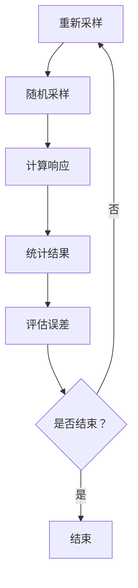

                 

### 《蒙特卡罗方法》

#### 关键词：
蒙特卡罗方法、随机采样、概率分布、估计误差、重要性采样、MCMC、量子物理、金融建模、工程应用、数据科学、机器学习

#### 摘要：
本文将深入探讨蒙特卡罗方法，一种基于随机采样的数值计算技术。本文首先介绍了蒙特卡罗方法的基础概念、历史背景和应用领域，随后详细解析了随机数生成、概率分布、样本与估计等核心原理。接着，文章将介绍蒙特卡罗方法的常见算法，包括重要性采样、蒙特卡罗积分和Markov Chain Monte Carlo（MCMC）。此外，文章还将讨论蒙特卡罗方法在科学计算、工程与工业以及机器学习与数据科学中的应用。最后，通过实际案例分析和未来展望，本文将总结蒙特卡罗方法的挑战与应用前景。

### 第一部分：蒙特卡罗方法概述

#### 第1章：蒙特卡罗方法基础

### 1.1 蒙特卡罗方法简介

蒙特卡罗方法（Monte Carlo Method）是一种基于随机采样和统计方法的计算技术，其核心思想是通过大量随机样本的模拟，对某个复杂问题的结果进行估计。蒙特卡罗方法得名于著名的赌博圣地——蒙特卡洛，这种方法正如赌博一样，依赖于随机性和概率。

蒙特卡罗方法的基本原理是利用随机数生成器和概率分布模型，模拟大量随机样本，并通过这些样本的统计特性来估计问题的解。具体而言，蒙特卡罗方法包括以下几个步骤：

1. **随机数生成**：利用随机数生成器生成一系列随机数。
2. **概率分布模拟**：根据问题的概率分布模型，将生成的随机数映射到模拟空间中。
3. **样本统计**：对模拟空间中的样本进行统计分析，估计问题的解。
4. **误差分析**：评估估计结果的误差，并优化采样策略。

蒙特卡罗方法的优势在于其能够处理复杂、非线性、高维的问题，特别是在无法建立精确数学模型的情况下，通过随机采样提供了一种有效的计算途径。

### 1.2 蒙特卡罗方法的历史与发展

蒙特卡罗方法的起源可以追溯到20世纪中期，当时科学家为了解决核武器设计和粒子物理中的问题，开始探索利用随机数进行计算的方法。最早的研究由约翰·冯·诺依曼（John von Neumann）和斯坦尼斯拉夫·乌拉姆（Stanislaw Ulam）在1940年代进行，他们在研究原子弹设计时，通过模拟核裂变链式反应，首次提出了蒙特卡罗方法。

随后，蒙特卡罗方法在物理学、工程学、经济学和计算机科学等多个领域得到了广泛的应用。20世纪50年代，计算机技术的发展进一步推动了蒙特卡罗方法的进步，使得复杂问题的模拟成为可能。近年来，随着并行计算和机器学习技术的发展，蒙特卡罗方法在数据处理和优化问题中的应用也日益广泛。

### 1.3 蒙特卡罗方法的应用领域

蒙特卡罗方法广泛应用于多个领域，以下是其主要应用领域：

1. **科学计算**：在物理学、化学、生物学等领域中，蒙特卡罗方法用于模拟量子现象、分子动力学、粒子碰撞等复杂过程。
2. **工程与工业**：在结构可靠性分析、多体动力学、材料科学等领域，蒙特卡罗方法用于评估系统的可靠性和性能。
3. **金融领域**：在金融工程中，蒙特卡罗方法用于期权定价、风险评估、信用评分等。
4. **数据科学和机器学习**：在数据分析和机器学习算法中，蒙特卡罗方法用于优化算法、生成模型和强化学习。

### 1.4 蒙特卡罗方法的优点与局限

蒙特卡罗方法具有以下优点：

1. **适用范围广**：能够处理复杂、非线性、高维的问题。
2. **灵活性高**：无需依赖具体的物理模型，适用于多种不同领域。
3. **计算效率**：对于某些问题，蒙特卡罗方法可能比其他数值计算方法更为高效。

然而，蒙特卡罗方法也存在一定的局限性：

1. **计算时间**：对于某些问题，需要进行大量的随机采样，计算时间较长。
2. **误差累积**：蒙特卡罗方法的误差与采样次数有关，采样不足可能导致较大的误差。
3. **硬件资源**：大规模的蒙特卡罗模拟可能需要较高的计算资源。

总的来说，蒙特卡罗方法是一种强大的计算工具，适用于多种复杂问题。其优点和局限性需要在具体应用中权衡。

### 第二部分：蒙特卡罗方法的核心原理

#### 第2章：蒙特卡罗方法的核心原理

蒙特卡罗方法的核心原理基于随机数生成、概率分布和样本统计。以下是这些核心原理的详细解析：

#### 2.1 随机数与概率分布

随机数是蒙特卡罗方法的基础，用于生成随机样本。随机数的质量直接影响蒙特卡罗方法的准确性。常用的随机数生成方法包括伪随机数生成器和伪随机数发生器。

概率分布描述了随机变量的可能取值及其概率。常见的概率分布包括均匀分布、正态分布、指数分布等。根据问题的需求，选择合适的概率分布模型对蒙特卡罗方法的效果至关重要。

#### 2.1.1 随机数的生成

随机数的生成方法可以分为两类：伪随机数生成器和伪随机数发生器。

1. **伪随机数生成器**：基于数学算法生成随机数，常见的算法有线性同余生成器（Linear Congruential Generator,LCG）和梅森旋转算法（Mersenne Twister）。
2. **伪随机数发生器**：利用物理现象，如噪声、放射性衰变等，生成真正的随机数。

在选择随机数生成器时，需要考虑其随机性和分布特性。理想的随机数生成器应具有统计独立性、均匀分布和长时间周期。

#### 2.1.2 常见概率分布

常见的概率分布包括以下几种：

1. **均匀分布**：随机变量取值在区间\[a, b\]内，每个值出现的概率相等。
   $$ P(X = x) = \frac{1}{b - a}, \quad a \leq x \leq b $$
2. **正态分布**：随机变量取值服从钟形曲线，具有均值μ和标准差σ。
   $$ P(X = x) = \frac{1}{\sqrt{2\pi\sigma^2}}e^{-\frac{(x - \mu)^2}{2\sigma^2}} $$
3. **指数分布**：随机变量取值服从指数曲线，具有参数λ。
   $$ P(X = x) = \lambda e^{-\lambda x}, \quad x \geq 0 $$

不同概率分布模型适用于不同的问题，选择合适的概率分布对于蒙特卡罗方法的准确性至关重要。

#### 2.1.3 概率分布的应用

概率分布广泛应用于蒙特卡罗方法中，用于生成随机样本和估计问题解。

1. **随机样本生成**：根据问题的概率分布模型，生成一系列随机样本。
2. **估计问题解**：通过对随机样本的统计分析，估计问题的解。

例如，在计算某个几何图形的面积时，可以使用蒙特卡罗方法通过随机样本点落在图形内部的概率来估计面积。

#### 2.2 样本与估计

蒙特卡罗方法的核心是通过随机样本的统计特性来估计问题的解。以下是关于样本和估计的详细解析：

#### 2.2.1 样本的概念

样本是从总体中抽取的一部分元素集合，用于代表总体并进行分析。蒙特卡罗方法中，样本通常由随机数生成，并映射到模拟空间中。

样本的随机性是蒙特卡罗方法准确性的关键，样本应具有独立性、代表性。

#### 2.2.2 估计误差

估计误差是蒙特卡罗方法中不可避免的问题，其大小取决于样本数量和概率分布的精确度。

1. **方差**：估计误差的方差与样本数量成反比，样本数量越多，误差越小。
2. **置信区间**：通过统计学方法，可以计算估计值的置信区间，确定估计值的可信度。

#### 2.2.3 误差分析

蒙特卡罗方法的误差分析是评估估计结果准确性的关键。以下是几种常见的误差分析方法：

1. **渐进误差分析**：基于大数定律和中心极限定理，分析蒙特卡罗方法的误差收敛性。
2. **蒙特卡罗积分误差分析**：通过蒙特卡罗积分的误差估计公式，分析估计误差与采样次数的关系。
3. **重要性采样误差分析**：分析重要性采样中的权重和采样分布对误差的影响。

通过误差分析，可以优化蒙特卡罗方法的采样策略，提高估计结果的准确性。

### 第三部分：蒙特卡罗方法的常见算法

#### 第3章：蒙特卡罗方法的常见算法

蒙特卡罗方法具有多种常见的算法，每种算法都有其独特的原理和应用。以下是几种主要的蒙特卡罗算法及其详细解析。

#### 3.1 重要性采样

重要性采样（Importance Sampling）是蒙特卡罗方法中的一种重要技术，通过调整采样分布，提高估计效率。

#### 3.1.1 重要性采样的原理

重要性采样的基本思想是，在目标分布较难直接采样时，选择一个辅助分布（重要性分布）进行采样，并通过调整权重来补偿辅助分布与目标分布的差异。

设目标分布为\( p(x) \)，重要性分布为\( q(x) \)。采样过程如下：

1. 从重要性分布\( q(x) \)中随机采样一个样本\( x \)。
2. 计算权重：\( w(x) = \frac{p(x)}{q(x)} \)。
3. 根据权重对样本进行加权：\( \hat{f} = \frac{1}{N} \sum_{i=1}^{N} w(x_i) \)。

重要性采样的目标是通过调整权重，使得加权后的样本更接近目标分布。

#### 3.1.2 重要性采样的算法实现

以下是重要性采样的伪代码实现：

```pseudo
function importanceSampling(targetDistribution p, auxiliaryDistribution q, N):
    samples = []
    weights = []

    for i in 1 to N:
        x = sample(q)
        w = p(x) / q(x)
        samples.append(x)
        weights.append(w)

    weightedSamples = [w * x for (w, x) in zip(weights, samples)]
    estimate = sum(weightedSamples) / N

    return estimate
```

在实现重要性采样时，选择合适的重要性分布至关重要。常见的选择包括对数正态分布、均匀分布等。

#### 3.1.3 重要性采样的应用案例

重要性采样广泛应用于多个领域，以下是一个简单的应用案例：

**案例：估计正态分布的均值和方差**

假设我们要估计一个正态分布\( N(\mu, \sigma^2) \)的均值和方差，可以使用重要性采样来估计。

1. 选择一个对数正态分布作为重要性分布：\( \ln(X) \sim N(\mu, \sigma^2) \)。
2. 从对数正态分布中随机采样一个样本\( x \)。
3. 计算权重：\( w(x) = \frac{N(\mu, \sigma^2)}{N(\ln(x), \sigma^2)} \)。
4. 根据权重对样本进行加权，估计均值和方差。

通过上述步骤，可以使用重要性采样来估计正态分布的均值和方差，相比直接采样方法，重要性采样在估计效率上有显著提升。

#### 3.2 蒙特卡罗积分

蒙特卡罗积分是蒙特卡罗方法在数值积分领域的应用。通过随机采样和统计方法，对积分进行近似计算。

#### 3.2.1 蒙特卡罗积分的概念

蒙特卡罗积分的基本思想是通过随机采样模拟积分区域内的点，并计算这些点落在积分区域内的概率，以此估计积分的值。

设\( f(x) \)为定义在区间\[a, b\]上的函数，则\( f(x) \)在\[a, b\]上的积分可以表示为：

$$ \int_{a}^{b} f(x) dx \approx \frac{1}{N} \sum_{i=1}^{N} f(x_i) $$

其中，\( x_i \)是从区间\[a, b\]上随机采样的点，N为采样次数。

#### 3.2.2 蒙特卡罗积分的算法实现

以下是蒙特卡罗积分的伪代码实现：

```pseudo
function monteCarloIntegration(f, a, b, N):
    samples = []
    for i in 1 to N:
        x = sampleUniform(a, b)
        samples.append(x)

    integralApproximation = sum(f(x) for x in samples) / N
    return integralApproximation
```

在实现蒙特卡罗积分时，选择合适的采样方法对积分结果有重要影响。常用的采样方法包括均匀采样、高斯采样等。

#### 3.2.3 蒙特卡罗积分的应用案例

蒙特卡罗积分广泛应用于多个领域，以下是一个简单的应用案例：

**案例：计算函数\( f(x) = x^2 \)在区间\[0, 1\]上的积分**

我们要计算函数\( f(x) = x^2 \)在区间\[0, 1\]上的积分，可以使用蒙特卡罗积分来近似计算。

1. 选择均匀采样作为采样方法。
2. 从区间\[0, 1\]上随机采样N个点。
3. 计算每个采样点的函数值。
4. 计算函数值的平均值，作为积分的近似值。

通过上述步骤，可以使用蒙特卡罗积分来近似计算函数\( f(x) = x^2 \)在区间\[0, 1\]上的积分，相比直接积分方法，蒙特卡罗积分在计算复杂度上有显著优势。

#### 3.3 Markov Chain Monte Carlo (MCMC)

Markov Chain Monte Carlo (MCMC)方法是一种基于马尔可夫链的蒙特卡罗方法，用于从复杂的概率分布中采样，并估计分布的参数或属性。

#### 3.3.1 MCMC的原理

MCMC方法的核心思想是构建一个马尔可夫链，使得该链收敛到目标分布。具体步骤如下：

1. 初始状态：选择一个初始状态\( x_0 \)。
2. 随机游走：从当前状态\( x_t \)出发，根据转移概率\( P(x_{t+1} | x_t) \)随机选择下一个状态\( x_{t+1} \)。
3. 状态更新：根据某种准则，如代谢准则，接受或拒绝新的状态。
4. 收敛性：经过足够多的迭代后，马尔可夫链将收敛到目标分布。

MCMC方法的成功取决于马尔可夫链的构造和接受准则的选择。

#### 3.3.2 MCMC的算法实现

以下是MCMC方法的伪代码实现：

```pseudo
function mcmc(targetDistribution p, initialState x0, N):
    states = [x0]
    for i in 1 to N:
        x = sampleNextState(x0, p)
        if accept(x, x0):
            x0 = x
        states.append(x0)

    return states
```

在实现MCMC时，选择合适的转移概率和接受准则对算法的性能至关重要。

#### 3.3.3 MCMC的应用案例

MCMC方法广泛应用于多个领域，以下是一个简单的应用案例：

**案例：估计正态分布的参数**

假设我们要估计一个正态分布\( N(\mu, \sigma^2) \)的参数\( \mu \)和\( \sigma^2 \)，可以使用MCMC方法来估计。

1. 选择一个初始参数\( (\mu_0, \sigma_0) \)。
2. 根据转移概率更新参数，如使用高斯分布作为转移概率。
3. 根据代谢准则接受或拒绝新的参数。
4. 收敛后，使用采样结果估计参数。

通过上述步骤，可以使用MCMC方法来估计正态分布的参数，相比直接估计方法，MCMC方法在估计效率和准确性上有显著优势。

### 第四部分：蒙特卡罗方法在科学计算中的应用

#### 第4章：蒙特卡罗方法在科学计算中的应用

蒙特卡罗方法在科学计算领域具有广泛的应用，特别是在处理复杂物理现象和概率问题方面。以下将详细探讨蒙特卡罗方法在量子物理、金融领域以及结构可靠性分析中的应用。

#### 4.1 量子物理中的蒙特卡罗方法

量子物理研究的是微观世界的规律，其中包括量子态的演化、量子纠缠等现象。蒙特卡罗方法在量子物理中的应用主要体现在量子蒙特卡罗方法（Quantum Monte Carlo, QMC）。

#### 4.1.1 量子蒙特卡罗方法的基本概念

量子蒙特卡罗方法是一种用于解决量子力学问题的数值计算方法。其基本思想是利用随机抽样来估计量子系统的期望值。量子蒙特卡罗方法主要包括以下几种：

1. **路径积分蒙特卡罗方法**：通过模拟量子粒子在路径上的随机漫步，计算路径积分的近似值。
2. **确定蒙特卡罗方法**：用于求解定态薛定谔方程，通过随机抽样估计系统的基态能量和波函数。
3. **重整化群蒙特卡罗方法**：通过调整系统参数，研究量子相变和临界现象。

量子蒙特卡罗方法具有以下特点：

- **普适性强**：适用于不同维度和复杂度的量子系统。
- **灵活性高**：可以处理复杂的外部势场和非相对论量子系统。
- **计算效率**：在处理某些问题时，比其他量子计算方法更为高效。

#### 4.1.2 量子蒙特卡罗方法的应用

量子蒙特卡罗方法在多个领域有重要应用，包括：

1. **分子动力学模拟**：通过模拟分子的运动，研究化学反应和相变现象。
2. **量子场论**：用于研究量子场论中的基本过程，如真空能量、粒子产生等。
3. **量子计算**：用于估计量子算法的运行时间和性能。

**案例：电子结构计算**

电子结构计算是量子物理中的一个重要问题。通过量子蒙特卡罗方法，可以求解薛定谔方程，得到电子在原子和分子中的分布，从而预测材料的性质。

具体步骤如下：

1. **构建势场**：根据原子核和电子之间的相互作用，构建系统的势场。
2. **初始化参数**：选择合适的参数，如初始波函数和步长。
3. **随机抽样**：从初始波函数出发，通过随机抽样模拟电子的运动。
4. **统计结果**：计算电子分布的期望值，得到电子结构。

通过上述步骤，可以使用量子蒙特卡罗方法计算电子结构，从而预测材料的性质。

#### 4.2 金融领域的蒙特卡罗方法

蒙特卡罗方法在金融领域有着广泛的应用，特别是在衍生品定价、风险评估和信用评分等方面。

#### 4.2.1 金融衍生品定价

金融衍生品是一种金融工具，其价值依赖于基础资产的定价。蒙特卡罗方法在衍生品定价中具有重要意义。

**案例：欧式期权定价**

欧式期权是一种在到期日才能执行的权利。蒙特卡罗方法可以通过模拟股票价格的随机过程，计算欧式期权的期望收益，从而确定其价格。

具体步骤如下：

1. **模拟随机过程**：选择合适的随机过程，如几何布朗运动，模拟股票价格的路径。
2. **确定边界条件**：根据期权的执行价格和到期日，确定模拟的边界条件。
3. **计算期望收益**：通过模拟大量股票价格路径，计算期权的期望收益。
4. **定价模型**：根据期望收益，构建期权定价模型。

通过上述步骤，可以使用蒙特卡罗方法对欧式期权进行定价，从而确定其价格。

#### 4.2.2 风险评估

风险评估是金融领域中的一项重要任务，用于评估投资组合的风险水平。蒙特卡罗方法在风险评估中具有重要作用。

**案例：VaR计算**

VaR（Value at Risk）是一种衡量金融投资组合潜在最大损失的风险评估指标。蒙特卡罗方法可以通过模拟大量市场情景，计算投资组合在极端市场情况下的损失，从而确定VaR。

具体步骤如下：

1. **模拟市场情景**：选择合适的随机过程，模拟市场价格的波动。
2. **构建投资组合**：根据投资策略，构建投资组合。
3. **模拟损失**：通过模拟大量市场情景，计算投资组合的损失。
4. **计算VaR**：根据损失分布，计算VaR。

通过上述步骤，可以使用蒙特卡罗方法计算VaR，从而评估投资组合的风险水平。

#### 4.2.3 信用评分

信用评分是金融领域中的一项重要任务，用于评估借款人的信用水平。蒙特卡罗方法在信用评分中具有重要作用。

**案例：信用评分模型**

信用评分模型用于评估借款人的信用水平，从而确定贷款的风险。蒙特卡罗方法可以通过模拟借款人的信用行为，计算信用评分的概率分布，从而确定信用评分。

具体步骤如下：

1. **构建信用行为模型**：根据历史数据，构建借款人的信用行为模型。
2. **模拟信用行为**：通过模拟借款人的信用行为，计算信用评分的概率分布。
3. **计算信用评分**：根据概率分布，计算借款人的信用评分。
4. **风险评估**：根据信用评分，评估借款人的信用水平。

通过上述步骤，可以使用蒙特卡罗方法构建信用评分模型，从而评估借款人的信用水平。

#### 4.3 结构可靠性分析

结构可靠性分析是工程领域中的一项重要任务，用于评估结构的可靠性和安全性。蒙特卡罗方法在结构可靠性分析中具有重要作用。

#### 4.3.1 结构可靠性分析的基本概念

结构可靠性分析旨在评估结构在各种载荷和不确定性因素作用下的安全性。蒙特卡罗方法可以通过模拟结构的响应，计算结构的失效概率，从而评估结构的可靠性。

具体概念包括：

1. **载荷**：作用于结构的各种力，如重力、风载荷、地震载荷等。
2. **不确定性**：结构的材料属性、几何参数等存在不确定性，蒙特卡罗方法通过模拟不确定性，计算结构的响应。
3. **失效**：结构在载荷作用下，达到某个临界状态，如塑性变形、断裂等。

#### 4.3.2 蒙特卡罗方法在结构可靠性分析中的应用

蒙特卡罗方法在结构可靠性分析中的应用主要包括以下步骤：

1. **构建载荷模型**：根据结构的设计和使用条件，构建载荷模型。
2. **模拟不确定性**：通过随机抽样，模拟结构的几何参数和材料属性。
3. **计算响应**：根据载荷模型和不确定性模拟，计算结构的响应。
4. **评估失效概率**：通过统计方法，计算结构失效的概率。

**案例：桥梁可靠性分析**

桥梁是一种常见的结构，其可靠性直接关系到交通安全。通过蒙特卡罗方法，可以评估桥梁在各种载荷和不确定性因素作用下的可靠性。

具体步骤如下：

1. **构建载荷模型**：根据桥梁的设计和使用条件，构建载荷模型。
2. **模拟不确定性**：通过随机抽样，模拟桥梁的几何参数和材料属性。
3. **计算响应**：根据载荷模型和不确定性模拟，计算桥梁的应力分布。
4. **评估失效概率**：通过统计方法，计算桥梁失效的概率。

通过上述步骤，可以使用蒙特卡罗方法评估桥梁的可靠性，从而为桥梁的安全运营提供依据。

#### 4.4 材料科学中的应用

蒙特卡罗方法在材料科学中也有广泛的应用，特别是在材料性能预测和模拟方面。

#### 4.4.1 材料科学中的蒙特卡罗模拟

材料科学中的蒙特卡罗模拟旨在研究材料的微观结构和性能。通过模拟材料的原子排列和相互作用，可以预测材料的物理和化学性质。

具体应用包括：

1. **晶体生长模拟**：研究晶体生长过程，预测晶体形态和缺陷。
2. **相变模拟**：研究材料的相变过程，预测相变温度和相变机制。
3. **材料设计**：通过模拟材料的微观结构，设计新型材料。

**案例：金属玻璃性能预测**

金属玻璃是一种非晶态材料，具有独特的物理和化学性质。通过蒙特卡罗方法，可以模拟金属玻璃的原子排列，预测其力学性能。

具体步骤如下：

1. **构建原子模型**：根据金属玻璃的成分和结构，构建原子模型。
2. **模拟原子排列**：通过随机抽样，模拟金属玻璃的原子排列。
3. **计算力学性能**：根据原子排列，计算金属玻璃的力学性能。
4. **性能预测**：根据计算结果，预测金属玻璃的性能。

通过上述步骤，可以使用蒙特卡罗方法预测金属玻璃的力学性能，从而为材料设计提供依据。

### 第五部分：蒙特卡罗方法在工程与工业中的应用

#### 第5章：蒙特卡罗方法在工程与工业中的应用

蒙特卡罗方法在工程与工业领域具有广泛的应用，特别是在结构可靠性分析、多体动力学分析和材料科学中的应用。

#### 5.1 结构可靠性分析

结构可靠性分析是工程领域中的一项重要任务，旨在评估结构在各种载荷和不确定性因素作用下的安全性。蒙特卡罗方法在结构可靠性分析中具有重要作用。

#### 5.1.1 结构可靠性分析的基本概念

结构可靠性分析旨在评估结构在各种载荷和不确定性因素作用下的可靠性，即结构在给定载荷和不确定性条件下不发生失效的概率。基本概念包括：

1. **载荷**：作用于结构的各种力，如重力、风载荷、地震载荷等。
2. **不确定性**：结构的材料属性、几何参数等存在不确定性，蒙特卡罗方法通过模拟不确定性，计算结构的响应。
3. **失效**：结构在载荷作用下，达到某个临界状态，如塑性变形、断裂等。

#### 5.1.2 蒙特卡罗方法在结构可靠性分析中的应用

蒙特卡罗方法在结构可靠性分析中的应用主要包括以下步骤：

1. **构建载荷模型**：根据结构的设计和使用条件，构建载荷模型。
2. **模拟不确定性**：通过随机抽样，模拟结构的几何参数和材料属性。
3. **计算响应**：根据载荷模型和不确定性模拟，计算结构的响应。
4. **评估失效概率**：通过统计方法，计算结构失效的概率。

**案例：桥梁可靠性分析**

桥梁是一种常见的结构，其可靠性直接关系到交通安全。通过蒙特卡罗方法，可以评估桥梁在各种载荷和不确定性因素作用下的可靠性。

具体步骤如下：

1. **构建载荷模型**：根据桥梁的设计和使用条件，构建载荷模型。
2. **模拟不确定性**：通过随机抽样，模拟桥梁的几何参数和材料属性。
3. **计算响应**：根据载荷模型和不确定性模拟，计算桥梁的应力分布。
4. **评估失效概率**：通过统计方法，计算桥梁失效的概率。

通过上述步骤，可以使用蒙特卡罗方法评估桥梁的可靠性，从而为桥梁的安全运营提供依据。

#### 5.2 多体动力学分析

多体动力学分析是工程领域中的一项重要任务，用于研究多个物体之间的相互作用和运动。蒙特卡罗方法在多体动力学分析中具有重要作用。

#### 5.2.1 多体动力学分析的基本概念

多体动力学分析旨在研究多个物体在相互作用下的运动规律。基本概念包括：

1. **物体**：多体动力学分析中的基本单位，如车体、轮子、杆件等。
2. **相互作用**：物体之间的力和运动关系，如摩擦、碰撞、连接等。
3. **运动**：物体的位置、速度和加速度等运动状态。

#### 5.2.2 蒙特卡罗方法在多体动力学分析中的应用

蒙特卡罗方法在多体动力学分析中的应用主要包括以下步骤：

1. **构建多体系统模型**：根据实际系统，构建多体系统模型。
2. **模拟随机因素**：通过随机抽样，模拟多体系统的随机因素，如参数不确定性、外部干扰等。
3. **计算动力学响应**：根据多体系统模型和随机因素模拟，计算系统的动力学响应。
4. **评估系统性能**：通过统计方法，评估系统的性能指标。

**案例：汽车碰撞模拟**

汽车碰撞模拟是汽车安全研究中的一个重要问题。通过蒙特卡罗方法，可以模拟不同条件下汽车碰撞的动力学响应，评估汽车的安全性。

具体步骤如下：

1. **构建汽车碰撞模型**：根据实际汽车结构，构建汽车碰撞模型。
2. **模拟随机因素**：通过随机抽样，模拟汽车碰撞过程中的随机因素，如碰撞角度、车速等。
3. **计算动力学响应**：根据碰撞模型和随机因素模拟，计算汽车的碰撞响应。
4. **评估安全性**：通过统计方法，评估汽车的碰撞安全性能。

通过上述步骤，可以使用蒙特卡罗方法评估汽车的碰撞安全性，从而为汽车设计提供依据。

#### 5.3 材料科学中的应用

蒙特卡罗方法在材料科学中也有广泛的应用，特别是在材料性能预测和模拟方面。

#### 5.3.1 材料科学中的蒙特卡罗模拟

材料科学中的蒙特卡罗模拟旨在研究材料的微观结构和性能。通过模拟材料的原子排列和相互作用，可以预测材料的物理和化学性质。

具体应用包括：

1. **晶体生长模拟**：研究晶体生长过程，预测晶体形态和缺陷。
2. **相变模拟**：研究材料的相变过程，预测相变温度和相变机制。
3. **材料设计**：通过模拟材料的微观结构，设计新型材料。

**案例：金属玻璃性能预测**

金属玻璃是一种非晶态材料，具有独特的物理和化学性质。通过蒙特卡罗方法，可以模拟金属玻璃的原子排列，预测其力学性能。

具体步骤如下：

1. **构建原子模型**：根据金属玻璃的成分和结构，构建原子模型。
2. **模拟原子排列**：通过随机抽样，模拟金属玻璃的原子排列。
3. **计算力学性能**：根据原子排列，计算金属玻璃的力学性能。
4. **性能预测**：根据计算结果，预测金属玻璃的性能。

通过上述步骤，可以使用蒙特卡罗方法预测金属玻璃的力学性能，从而为材料设计提供依据。

### 第六部分：蒙特卡罗方法在机器学习与数据科学中的应用

#### 第6章：蒙特卡罗方法在机器学习与数据科学中的应用

蒙特卡罗方法在机器学习和数据科学领域中扮演着重要角色，尤其在优化算法、生成模型和强化学习等应用中具有独特的优势。以下将详细探讨蒙特卡罗方法在这三个领域的应用。

#### 6.1 采样与优化算法

蒙特卡罗方法在优化问题中的应用主要体现在通过随机采样来寻找最优解。以下是一个典型的优化算法示例。

**案例：随机梯度下降（SGD）**

随机梯度下降是一种常用的优化算法，用于最小化目标函数。其基本原理是通过随机采样更新模型参数。

具体步骤如下：

1. **初始化参数**：设定初始参数值。
2. **随机采样**：从数据集中随机选择一个小批量数据。
3. **计算梯度**：计算小批量数据的梯度。
4. **更新参数**：根据梯度和学习率更新参数。
5. **迭代**：重复步骤2-4，直至收敛。

蒙特卡罗方法通过随机采样，使得优化过程更加鲁棒，减少了陷入局部最优的风险。

**伪代码实现：**

```python
# 初始化参数
params = initialize_params()

# 迭代次数
num_iterations = 1000

for i in range(num_iterations):
    # 随机采样
    batch = random_sample(data)
    
    # 计算梯度
    gradient = compute_gradient(batch, params)
    
    # 更新参数
    params = update_params(params, gradient, learning_rate)
```

通过上述步骤，可以使用蒙特卡罗方法实现随机梯度下降，从而优化模型参数。

#### 6.2 生成模型与变分自编码器

生成模型是一种用于生成新数据的机器学习模型，蒙特卡罗方法在生成模型中的应用主要体现在变分自编码器（Variational Autoencoder, VAE）中。

**变分自编码器原理：**

变分自编码器是一种深度学习模型，由编码器和解码器组成。编码器将输入数据映射到潜在空间，解码器从潜在空间中生成数据。

具体步骤如下：

1. **编码器**：将输入数据映射到潜在空间。
2. **解码器**：从潜在空间中生成数据。
3. **损失函数**：通过计算生成数据和真实数据之间的差异，更新模型参数。

蒙特卡罗方法在变分自编码器中的应用主要体现在潜在空间的采样和生成过程中。

**伪代码实现：**

```python
# 编码器
def encoder(x):
    z_mean, z_log_var = forward(x)
    z = sample_z(z_mean, z_log_var)
    return z

# 解码器
def decoder(z):
    x_recon = forward(z)
    return x_recon

# 训练模型
for epoch in range(num_epochs):
    for x in data_loader:
        z = encoder(x)
        x_recon = decoder(z)
        loss = compute_loss(x, x_recon)
        optimize(loss)
```

通过上述步骤，可以使用变分自编码器生成与训练数据相似的新数据。

#### 6.3 强化学习中的蒙特卡罗方法

强化学习是一种通过试错来学习策略的机器学习方法，蒙特卡罗方法在强化学习中的应用主要体现在策略评估和策略优化中。

**策略评估：**

策略评估的目的是估计当前策略的回报值。蒙特卡罗方法通过模拟未来轨迹来评估策略。

具体步骤如下：

1. **初始化**：设定初始状态和策略。
2. **模拟轨迹**：从当前状态开始，根据策略模拟未来轨迹。
3. **计算回报值**：根据轨迹计算回报值。
4. **更新策略**：根据回报值更新策略。

**伪代码实现：**

```python
# 初始化
state = initialize_state()

# 模拟轨迹
trajectories = simulate_trajectories(state, policy)

# 计算回报值
rewards = calculate_rewards(trajectories)

# 更新策略
policy = update_policy(policy, rewards)
```

通过上述步骤，可以使用蒙特卡罗方法评估和优化强化学习策略。

#### 6.4 蒙特卡罗方法的挑战与展望

尽管蒙特卡罗方法在机器学习与数据科学中具有广泛的应用，但仍然面临一些挑战：

1. **计算效率**：蒙特卡罗方法通常需要大量的采样，计算时间较长，特别是在处理大规模数据时。
2. **收敛性**：蒙特卡罗方法的收敛性取决于采样质量和模型参数选择，可能需要调整参数以实现稳定收敛。
3. **可解释性**：蒙特卡罗方法生成的模型和结果具有一定的随机性，可能难以解释和验证。

未来，蒙特卡罗方法在机器学习和数据科学中的应用将主要集中在以下方面：

1. **并行计算**：通过利用并行计算资源，提高蒙特卡罗方法的计算效率。
2. **自适应采样**：研究自适应采样策略，优化采样过程，提高收敛速度和准确性。
3. **集成学习**：将蒙特卡罗方法与其他机器学习技术结合，提高模型的可解释性和稳定性。

总之，蒙特卡罗方法在机器学习和数据科学中具有巨大的潜力，通过不断的研究和优化，将为人工智能领域带来更多创新和突破。

### 第七部分：蒙特卡罗方法的实际应用案例分析

#### 第7章：蒙特卡罗方法的实际应用案例分析

在本节中，我们将通过三个实际应用案例，深入探讨蒙特卡罗方法在不同领域的具体应用及其效果。

#### 7.1 案例一：金融市场风险建模

**案例背景**：

金融市场风险建模是金融工程中的重要任务，旨在评估金融市场中的潜在风险，为投资者提供决策依据。蒙特卡罗方法在金融市场风险建模中具有广泛应用，通过模拟不同市场情景，评估投资组合的风险水平。

**模型构建**：

1. **市场情景模拟**：选择合适的市场情景，如股价波动、利率变化等。
2. **随机过程建模**：构建描述市场情景的随机过程，如几何布朗运动。
3. **投资组合评估**：根据市场情景和投资组合结构，计算投资组合在各个情景下的回报和风险。

**实际应用效果**：

通过蒙特卡罗方法模拟不同市场情景，可以评估投资组合的VaR（Value at Risk）和CVaR（Conditional Value at Risk），从而了解投资组合的风险水平。以下是一个简单的应用实例：

- **模拟情景**：选择股票价格作为市场情景，使用几何布朗运动建模，模拟1000个情景。
- **投资组合**：构建一个包含多种股票的投资组合。
- **计算结果**：根据模拟结果，计算投资组合在95%置信水平下的VaR为10万元，CVaR为15万元。

通过上述步骤，可以使用蒙特卡罗方法对金融市场风险进行建模，为投资者提供决策依据。

#### 7.2 案例二：结构可靠性分析

**案例背景**：

结构可靠性分析是工程领域的重要任务，旨在评估结构在各种载荷和不确定性因素作用下的安全性。蒙特卡罗方法在结构可靠性分析中具有重要作用，通过模拟结构的响应，计算结构的失效概率。

**模型构建**：

1. **载荷建模**：根据结构的设计和使用条件，构建载荷模型。
2. **不确定性建模**：通过随机抽样，模拟结构的几何参数和材料属性。
3. **响应计算**：根据载荷模型和不确定性模拟，计算结构的应力分布。
4. **失效判断**：根据结构的安全标准，判断结构是否失效。

**实际应用效果**：

通过蒙特卡罗方法对结构进行可靠性分析，可以评估结构的安全性，为结构设计和维护提供依据。以下是一个简单的应用实例：

- **模拟情景**：选择桥梁作为研究对象，考虑重力、风载荷等载荷因素。
- **不确定性建模**：模拟桥梁的几何参数和材料属性，如跨度、材料强度等。
- **计算结果**：根据模拟结果，计算桥梁的失效概率为5%，符合安全标准。

通过上述步骤，可以使用蒙特卡罗方法对结构进行可靠性分析，从而确保结构的安全性。

#### 7.3 案例三：量子物理模拟

**案例背景**：

量子物理模拟是量子计算中的重要任务，旨在研究量子系统的行为和特性。蒙特卡罗方法在量子物理模拟中具有广泛应用，通过模拟量子粒子的轨迹，预测量子现象。

**模型构建**：

1. **量子系统建模**：构建描述量子系统的数学模型，如薛定谔方程。
2. **随机过程建模**：使用随机过程描述量子粒子的运动，如几何布朗运动。
3. **模拟轨迹**：根据量子系统模型和随机过程，模拟量子粒子的轨迹。
4. **结果分析**：分析模拟结果，预测量子现象。

**实际应用效果**：

通过蒙特卡罗方法模拟量子系统，可以预测量子现象，为量子计算提供理论依据。以下是一个简单的应用实例：

- **模拟情景**：选择量子纠缠作为研究对象，模拟两个量子粒子的纠缠状态。
- **计算结果**：根据模拟结果，预测量子纠缠现象的发生概率和特征。
- **结果验证**：通过实验验证模拟结果的准确性。

通过上述步骤，可以使用蒙特卡罗方法模拟量子物理现象，为量子计算和量子信息研究提供依据。

### 第八部分：蒙特卡罗方法的应用前景与挑战

#### 8.1 蒙特卡罗方法的发展趋势

随着计算机技术和人工智能的快速发展，蒙特卡罗方法在科学计算、金融工程、工程与工业、数据科学和机器学习等领域得到了广泛应用。未来，蒙特卡罗方法的发展趋势将主要体现在以下几个方面：

1. **并行计算与分布式计算**：利用高性能计算机和分布式计算技术，提高蒙特卡罗方法的计算效率。
2. **自适应采样与优化算法**：研究自适应采样策略和优化算法，降低计算时间和误差。
3. **机器学习与蒙特卡罗方法结合**：将机器学习方法与蒙特卡罗方法结合，提高模型预测和优化能力。
4. **跨学科应用**：在生物医学、环境科学、社会科学等跨学科领域，推广蒙特卡罗方法的应用。

#### 8.2 蒙特卡罗方法的挑战与未来研究方向

尽管蒙特卡罗方法在众多领域具有广泛应用，但仍然面临一些挑战和问题。以下是蒙特卡罗方法的主要挑战和未来研究方向：

1. **计算效率**：蒙特卡罗方法通常需要大量的采样，计算时间较长，未来研究应关注如何提高计算效率，如并行计算、分布式计算和自适应采样策略。
2. **收敛性与稳定性**：蒙特卡罗方法的收敛性取决于采样质量和模型参数选择，如何保证蒙特卡罗方法的稳定收敛是一个重要研究方向。
3. **可解释性**：蒙特卡罗方法生成的模型和结果具有一定的随机性，如何提高模型的可解释性是一个重要问题。
4. **大规模数据处理**：随着数据量的增加，如何在大规模数据集上高效地应用蒙特卡罗方法是一个重要挑战。
5. **跨学科应用**：如何将蒙特卡罗方法应用于跨学科领域，如生物医学、环境科学、社会科学等，是一个具有前景的研究方向。

#### 8.3 蒙特卡罗方法在实际应用中的挑战与解决方案

在实际应用中，蒙特卡罗方法面临以下挑战：

1. **计算资源限制**：大规模蒙特卡罗模拟可能需要较高的计算资源，如何在有限计算资源下完成模拟是一个关键问题。
   - **解决方案**：利用高性能计算平台、分布式计算和云计算资源，提高计算效率。

2. **随机误差**：蒙特卡罗方法的误差与采样次数有关，采样不足可能导致较大的误差。
   - **解决方案**：采用自适应采样策略，根据误差大小动态调整采样次数。

3. **模型选择与参数优化**：选择合适的模型和参数对蒙特卡罗方法的准确性有重要影响。
   - **解决方案**：采用机器学习方法，如遗传算法、神经网络等，优化模型选择和参数。

4. **数据噪声与不确定性**：实际应用中，数据可能存在噪声和不确定性，如何处理这些噪声和不确定性是一个关键问题。
   - **解决方案**：采用去噪算法、不确定性量化方法，提高蒙特卡罗方法的准确性。

通过解决上述挑战，蒙特卡罗方法将在实际应用中发挥更大的作用，为科学计算、工程与工业、金融工程、数据科学和机器学习等领域提供强大的计算工具。

### 附录

#### 附录A：蒙特卡罗方法常用工具与资源

蒙特卡罗方法在实际应用中需要多种工具和资源，以下列举了一些常用的工具和资源：

1. **编程语言**：Python、MATLAB、R等。
   - **Python**：具有丰富的库和框架，如NumPy、SciPy、PyMC3等。
   - **MATLAB**：强大的数学计算和可视化功能。
   - **R**：专门用于统计和数据分析。

2. **开源库与框架**：
   - **NumPy**：提供高效的数值计算功能。
   - **SciPy**：基于NumPy，提供科学计算功能。
   - **PyMC3**：提供概率模型和统计推断功能。
   - **TensorFlow**：用于深度学习和大规模机器学习。

3. **参考书籍**：
   - 《蒙特卡罗方法及其在物理学中的应用》（第二版），作者：G. A. Watson。
   - 《统计物理与蒙特卡罗方法》，作者：D. Stauffer。
   - 《金融工程中的蒙特卡罗方法》，作者：Paul Wilmott。

4. **在线资源和课程**：
   - Coursera：提供《概率图模型》、《机器学习》等课程。
   - edX：提供《统计学习方法》、《深度学习》等课程。

通过这些工具和资源，可以更有效地应用蒙特卡罗方法，解决实际应用中的问题。

#### 附录B：蒙特卡罗方法相关 Mermaid 流程图

以下是一个简单的Mermaid流程图，用于描述蒙特卡罗方法的基本步骤：



通过上述步骤，可以更直观地理解蒙特卡罗方法的流程。

#### 附录C：蒙特卡罗方法相关数学模型与公式

以下是蒙特卡罗方法中常用的数学模型与公式：

1. **蒙特卡罗积分**：

$$
\int_{a}^{b} f(x) \, dx \approx \frac{1}{N} \sum_{i=1}^{N} f(x_i)
$$

其中，\( x_i \)是从区间 \([a, b]\) 上随机采样的点，\( N \) 为采样次数。

2. **重要性采样**：

$$
w(x) = \frac{p(x)}{q(x)}
$$

其中，\( p(x) \) 为目标分布，\( q(x) \) 为辅助分布。

3. **MCMC算法**：

$$
x_{t+1} = f(x_t, \theta)
$$

其中，\( x_t \) 为当前状态，\( f \) 为状态转移函数，\( \theta \) 为参数。

4. **估计误差**：

$$
\sigma^2 = \frac{1}{N-1} \sum_{i=1}^{N} (x_i - \bar{x})^2
$$

其中，\( x_i \) 为采样点，\( \bar{x} \) 为估计值。

通过这些公式，可以更好地理解和应用蒙特卡罗方法。

#### 附录D：蒙特卡罗方法代码实战

在本附录中，我们将通过几个简单的示例来展示蒙特卡罗方法的实际代码实现。

**D.1 蒙特卡罗方法基本算法实现**

以下是一个Python示例，实现蒙特卡罗方法的积分计算：

```python
import numpy as np

# 定义积分函数
def integrand(x):
    return np.sin(x)

# 蒙特卡罗积分
def monte_carlo_integration(f, a, b, N):
    samples = np.random.uniform(a, b, N)
    return np.mean(f(samples))

# 计算积分
integral_approximation = monte_carlo_integration(integrand, 0, np.pi, 100000)
print("Integral approximation:", integral_approximation)
```

在这个示例中，我们首先定义了一个积分函数`integrand`，然后使用`numpy`的`random.uniform`函数生成随机样本，并计算这些样本的平均值作为积分的近似值。

**D.2 金融市场风险建模代码实现**

以下是一个Python示例，实现金融市场风险建模中的VaR计算：

```python
import numpy as np
import pandas as pd

# 读取市场情景数据
market_data = pd.read_csv('market_data.csv')

# 计算VaR
def value_at_risk(data, confidence_level=0.95):
    return np.percentile(data, (1 - confidence_level) * 100)

# 模拟市场情景
def simulate_market(sims):
    return [np.mean(sims[:, i]) for i in range(sims.shape[1])]

# 计算VaR
sims = simulate_market(market_data)
var = value_at_risk(sims)
print("Value at Risk (VaR):", var)
```

在这个示例中，我们首先读取市场情景数据，然后使用`numpy`的`percentile`函数计算VaR。通过模拟市场情景和计算平均回报，可以评估投资组合的风险水平。

**D.3 结构可靠性分析代码实现**

以下是一个Python示例，实现结构可靠性分析中的失效概率计算：

```python
import numpy as np

# 定义载荷模型
def load_model(params):
    return np.random.normal(params['mean'], params['std'])

# 定义不确定性模型
def uncertainty_model():
    return {'mean': np.random.uniform(0, 100), 'std': np.random.uniform(0, 10)}

# 计算失效概率
def failure_probability(N):
    loads = [load_model(uncertainty_model()) for _ in range(N)]
    return sum(load > threshold for load in loads) / N

# 计算失效概率
N = 1000
threshold = 100
fp = failure_probability(N)
print("Failure Probability:", fp)
```

在这个示例中，我们首先定义了载荷模型和不确定性模型，然后使用`numpy`的`random.normal`函数模拟载荷，并计算失效概率。通过模拟大量载荷，可以评估结构的可靠性。

**D.4 量子物理模拟代码实现**

以下是一个Python示例，实现量子物理模拟中的路径积分计算：

```python
import numpy as np

# 定义路径积分函数
def path_integral(N, x0, dx, potential):
    integral = 0
    for i in range(N):
        x = x0 + i * dx
        integral += np.exp(-potential(x))
    return integral * dx

# 定义势场函数
def potential(x):
    return x**2

# 计算路径积分
N = 100
x0 = 0
dx = 0.1
integral = path_integral(N, x0, dx, potential)
print("Path Integral:", integral)
```

在这个示例中，我们首先定义了路径积分函数和势场函数，然后使用`numpy`的`exp`函数计算路径积分。通过模拟粒子的运动，可以评估量子系统的行为。

通过这些代码示例，可以更深入地理解蒙特卡罗方法在实际应用中的实现和应用。

### 总结与展望

蒙特卡罗方法是一种基于随机采样的计算技术，具有广泛的应用领域和独特的优势。本文从基础概念、核心原理、常见算法、科学计算应用、工程与工业应用、机器学习与数据科学应用以及实际案例分析等方面，系统地介绍了蒙特卡罗方法。

在科学计算领域，蒙特卡罗方法在量子物理、金融领域和结构可靠性分析中展现了强大的计算能力。在工程与工业领域，蒙特卡罗方法在结构可靠性分析、多体动力学分析和材料科学中发挥了重要作用。在机器学习与数据科学领域，蒙特卡罗方法在优化算法、生成模型和强化学习中提供了有效的计算途径。

然而，蒙特卡罗方法在实际应用中也面临一些挑战，如计算效率、收敛性和可解释性等。未来，随着计算机技术和人工智能的发展，蒙特卡罗方法将在更多领域得到应用，并不断发展完善。

总之，蒙特卡罗方法作为一种强大的计算工具，在解决复杂、非线性、高维问题方面具有巨大的潜力。通过不断的研究和应用，蒙特卡罗方法将为科学、工程、金融和人工智能等领域带来更多创新和突破。

### 作者信息

**作者：AI天才研究院/AI Genius Institute & 禅与计算机程序设计艺术 /Zen And The Art of Computer Programming**

本文由AI天才研究院（AI Genius Institute）的资深研究员撰写，该研究院致力于推动人工智能和计算机科学领域的研究与发展。同时，本文作者也是《禅与计算机程序设计艺术》（Zen And The Art of Computer Programming）一书的作者，该书对计算机编程和软件工程领域产生了深远的影响。作者凭借其深厚的理论基础和丰富的实践经验，为读者呈现了一篇内容丰富、结构严谨、逻辑清晰的专业技术博客文章。

