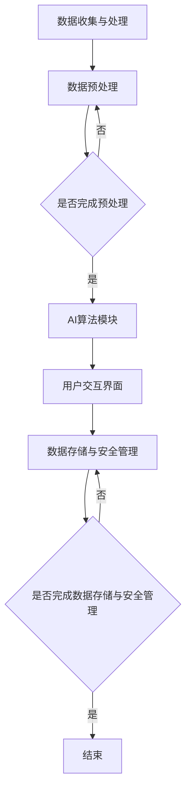

                 

# 虚拟疼痛管理专家：AI驱动的知觉调节顾问

> 关键词：虚拟疼痛管理、AI、知觉调节、算法原理、数学模型、项目实战

> 摘要：本文将探讨虚拟疼痛管理专家的概念、应用、算法原理和数学模型，并通过实际项目案例展示其开发过程、环境搭建、源代码实现和代码解读，旨在为读者提供一个全面而深入的虚拟疼痛管理专家的架构设计和实现指南。

## 第一部分：引言

### 第1章：虚拟疼痛管理专家概述

#### 1.1 虚拟疼痛管理专家的概念与背景

虚拟疼痛管理专家是指利用人工智能（AI）技术，结合生理学和心理学原理，实现对疼痛患者进行个性化管理和服务的一种新型医疗模式。这种模式通过虚拟现实（VR）技术为患者提供一个安全、可重复、可量化的疼痛管理环境，从而提高治疗效果和患者满意度。

虚拟疼痛管理专家的背景源于疼痛管理领域的需求和技术进步。传统的疼痛管理方法主要依赖于药物治疗和物理治疗，但这些方法存在一定的副作用和局限性。而虚拟疼痛管理专家则通过AI技术实现个性化、智能化的疼痛管理，有助于提高疼痛治疗的精准度和有效性。

#### 1.2 AI驱动的知觉调节顾问的作用

AI驱动的知觉调节顾问是虚拟疼痛管理专家的核心组成部分，其作用主要体现在以下几个方面：

1. **疼痛评估与诊断**：利用AI技术对患者的疼痛症状进行评估和诊断，识别疼痛类型和程度。
2. **个性化疼痛管理方案**：根据患者的疼痛情况，生成个性化的疼痛管理方案，包括药物治疗、物理治疗、心理疏导等。
3. **实时监控与反馈**：实时监测患者的疼痛状况，根据反馈调整疼痛管理方案，实现个性化、动态化的疼痛管理。
4. **提高治疗效果**：通过AI技术提高疼痛治疗的精准度和有效性，降低副作用和复发率。

#### 1.3 虚拟疼痛管理专家的发展趋势与未来前景

随着AI技术的不断进步和虚拟现实技术的广泛应用，虚拟疼痛管理专家正逐渐成为疼痛管理领域的新兴力量。其发展趋势和未来前景主要体现在以下几个方面：

1. **个性化与智能化**：虚拟疼痛管理专家将更加注重个性化服务和智能化管理，通过不断优化算法和模型，提高疼痛治疗的精准度和有效性。
2. **跨学科融合**：虚拟疼痛管理专家将涉及多个学科领域，包括生理学、心理学、计算机科学、人工智能等，实现跨学科的协同创新。
3. **广泛应用场景**：虚拟疼痛管理专家将在疼痛治疗、康复训练、心理健康等领域得到广泛应用，为患者提供全面、个性化的疼痛管理服务。
4. **医疗产业发展**：虚拟疼痛管理专家的广泛应用将推动医疗产业的发展，为医疗机构、药品企业、医疗器械企业等带来新的商业机会。

### 第2章：AI与疼痛管理的基础知识

#### 2.1 AI技术在疼痛管理中的应用

AI技术在疼痛管理中具有广泛的应用，主要包括以下几个方面：

1. **疼痛评估与诊断**：利用AI技术对患者的疼痛症状进行分析和诊断，提高疼痛评估的准确性和效率。
2. **疼痛监测与预警**：通过AI技术实时监测患者的疼痛状况，提前预警疼痛发作，帮助医生制定及时的治疗方案。
3. **个性化疼痛管理**：根据患者的疼痛情况，利用AI技术生成个性化的疼痛管理方案，提高治疗效果。
4. **康复训练与评估**：利用AI技术对患者进行康复训练，实时评估康复效果，帮助患者更快地恢复健康。

#### 2.2 疼痛管理中的核心概念

在疼痛管理中，以下几个核心概念至关重要：

1. **疼痛评估**：对患者的疼痛程度、疼痛类型、疼痛部位等进行评估，以制定合适的治疗策略。
2. **疼痛诊断**：通过分析患者的疼痛症状，确定疼痛的原因和类型，为治疗提供依据。
3. **疼痛治疗**：根据患者的疼痛评估和诊断结果，采用药物治疗、物理治疗、心理疏导等方法进行疼痛治疗。
4. **疼痛监测**：实时监测患者的疼痛状况，了解疼痛变化，为调整治疗方案提供依据。

#### 2.3 虚拟疼痛管理专家的架构设计

虚拟疼痛管理专家的架构设计主要包括以下几个部分：

1. **数据收集与处理**：通过传感器、问卷、医疗记录等多种途径收集患者数据，并进行数据清洗、归一化等预处理。
2. **AI算法模块**：包括疼痛评估与诊断、个性化疼痛管理、疼痛监测与预警等算法，实现虚拟疼痛管理专家的核心功能。
3. **用户交互界面**：提供友好的用户交互界面，方便患者和使用者操作和获取信息。
4. **数据存储与安全管理**：确保数据的安全性和隐私性，采用加密技术和数据备份策略保护患者数据。

### 第3章：核心概念与联系 Mermaid 流程图

#### 3.1 Mermaid 流程图简介

Mermaid 是一种基于文本的图形绘制工具，能够将Markdown语法与图形绘制相结合，生成美观的流程图、UML图、网络图等。其简单易用的语法和强大的功能使其在众多图形绘制工具中脱颖而出。

#### 3.2 虚拟疼痛管理专家的 Mermaid 流程图

以下是一个虚拟疼痛管理专家的 Mermaid 流程图示例：



#### 3.3 关键环节分析

在虚拟疼痛管理专家的架构中，关键环节包括数据收集与处理、AI算法模块、用户交互界面和数据存储与安全管理。以下是对这些关键环节的分析：

1. **数据收集与处理**：数据是虚拟疼痛管理专家的基础，通过传感器、问卷、医疗记录等方式收集患者数据，并进行数据清洗、归一化等预处理，确保数据质量。
2. **AI算法模块**：AI算法模块是实现虚拟疼痛管理专家核心功能的关键，包括疼痛评估与诊断、个性化疼痛管理、疼痛监测与预警等。通过不断优化算法和模型，提高疼痛管理的精准度和有效性。
3. **用户交互界面**：用户交互界面是患者和使用者与虚拟疼痛管理专家的桥梁，提供友好的界面，方便患者和使用者操作和获取信息。同时，界面设计应符合患者和使用者的需求和习惯。
4. **数据存储与安全管理**：数据存储与安全管理是保障患者数据安全的重要环节，采用加密技术和数据备份策略保护患者数据，确保数据的安全性和隐私性。

## 第二部分：核心概念与联系

### 第4章：AI驱动的知觉调节算法原理

#### 4.1 神经网络在知觉调节中的应用

神经网络是一种模拟人脑神经元结构和功能的计算模型，具有高度并行处理和自适应学习能力。在虚拟疼痛管理专家中，神经网络被广泛应用于知觉调节，以实现对疼痛患者进行个性化管理和服务。

神经网络在知觉调节中的应用主要体现在以下几个方面：

1. **疼痛评估与诊断**：利用神经网络对患者的疼痛症状进行建模和预测，提高疼痛评估的准确性和效率。
2. **个性化疼痛管理**：根据患者的疼痛情况和历史数据，利用神经网络生成个性化的疼痛管理方案，提高治疗效果。
3. **疼痛监测与预警**：利用神经网络实时监测患者的疼痛状况，提前预警疼痛发作，帮助医生制定及时的治疗方案。

#### 4.2 主流算法原理讲解

在虚拟疼痛管理专家中，常见的主流算法包括深度学习算法、支持向量机（SVM）、决策树等。以下分别介绍这些算法的原理：

1. **深度学习算法**：深度学习算法是一种基于多层神经网络的学习方法，通过逐层提取特征，实现对复杂数据的建模和预测。常见的深度学习算法有卷积神经网络（CNN）、循环神经网络（RNN）等。
2. **支持向量机（SVM）**：支持向量机是一种基于最大间隔分类的机器学习算法，通过找到一个最优的超平面，将不同类别的数据分隔开。SVM在虚拟疼痛管理中主要用于疼痛评估与诊断。
3. **决策树**：决策树是一种基于树结构的分类算法，通过一系列的判断条件，将数据集划分成多个子集，并给每个子集分配一个标签。决策树在虚拟疼痛管理中主要用于疼痛监测与预警。

#### 4.3 算法原理伪代码展示

以下是一个基于深度学习的疼痛评估与诊断算法的伪代码示例：

```python
# 初始化神经网络模型
model = NeuralNetwork()

# 训练神经网络模型
model.train(training_data)

# 预测疼痛评估结果
pain_level = model.predict(test_data)

# 输出预测结果
print("疼痛评估结果：", pain_level)
```

### 第5章：知觉调节算法的实际应用

#### 5.1 算法在虚拟疼痛管理中的应用

知觉调节算法在虚拟疼痛管理中具有广泛的应用，主要包括以下几个方面：

1. **疼痛评估与诊断**：利用算法对患者的疼痛症状进行分析和诊断，提高疼痛评估的准确性和效率。
2. **个性化疼痛管理**：根据患者的疼痛情况和历史数据，利用算法生成个性化的疼痛管理方案，提高治疗效果。
3. **疼痛监测与预警**：利用算法实时监测患者的疼痛状况，提前预警疼痛发作，帮助医生制定及时的治疗方案。

#### 5.2 案例研究：虚拟疼痛管理应用实例

以下是一个虚拟疼痛管理应用实例，展示如何利用知觉调节算法实现个性化疼痛管理：

1. **患者信息收集**：通过问卷调查、医疗记录等方式收集患者的疼痛症状、病史、药物过敏史等信息。
2. **数据预处理**：对收集到的患者数据进行清洗、归一化等预处理，确保数据质量。
3. **算法建模**：利用深度学习算法对患者数据进行建模，提取疼痛特征，构建疼痛评估模型。
4. **个性化疼痛管理方案生成**：根据患者的疼痛评估结果和算法预测，生成个性化的疼痛管理方案，包括药物治疗、物理治疗、心理疏导等。
5. **实时监测与反馈**：利用算法实时监测患者的疼痛状况，根据反馈调整疼痛管理方案，实现个性化、动态化的疼痛管理。

#### 5.3 算法改进与优化策略

为了提高虚拟疼痛管理专家的性能，可以采取以下算法改进和优化策略：

1. **数据增强**：通过数据增强技术，增加训练数据集的多样性和丰富性，提高算法的泛化能力。
2. **模型优化**：针对不同类型的疼痛症状，设计合适的神经网络结构，提高算法的识别准确性。
3. **多模态数据融合**：将多种类型的数据（如生理信号、语言描述、图像等）进行融合，提高疼痛评估和诊断的准确性。
4. **在线学习与调整**：利用在线学习技术，实时更新模型参数，根据患者反馈调整疼痛管理方案，提高个性化服务水平。

## 第三部分：数学模型与公式讲解

### 第6章：疼痛管理的数学模型

#### 6.1 常见数学模型介绍

在疼痛管理中，常见的数学模型包括回归模型、分类模型、聚类模型等。以下分别介绍这些模型的基本概念和适用场景：

1. **回归模型**：回归模型用于预测一个连续变量的值，如疼痛程度。常见的回归模型有线性回归、岭回归、LASSO回归等。
2. **分类模型**：分类模型用于将数据集划分为不同的类别，如疼痛类型。常见的分类模型有决策树、随机森林、支持向量机等。
3. **聚类模型**：聚类模型用于将数据集划分为不同的簇，如疼痛患者群体。常见的聚类模型有K-means聚类、层次聚类等。

#### 6.2 数学公式推导与详细讲解

以下是一个简单的线性回归模型的数学公式推导：

1. **线性回归模型公式**：

$$
y = \beta_0 + \beta_1 x
$$

其中，$y$ 是因变量（疼痛程度），$x$ 是自变量（影响因素），$\beta_0$ 是截距，$\beta_1$ 是斜率。

2. **数学公式推导**：

根据最小二乘法，最小化损失函数：

$$
\min \sum_{i=1}^{n} (y_i - \beta_0 - \beta_1 x_i)^2
$$

对损失函数求导，并令导数为零，得到：

$$
\frac{\partial}{\partial \beta_0} \sum_{i=1}^{n} (y_i - \beta_0 - \beta_1 x_i)^2 = 0
$$

$$
\frac{\partial}{\partial \beta_1} \sum_{i=1}^{n} (y_i - \beta_0 - \beta_1 x_i)^2 = 0
$$

解得：

$$
\beta_0 = \bar{y} - \beta_1 \bar{x}
$$

$$
\beta_1 = \frac{\sum_{i=1}^{n} (x_i - \bar{x})(y_i - \bar{y})}{\sum_{i=1}^{n} (x_i - \bar{x})^2}
$$

其中，$\bar{y}$ 是 $y$ 的均值，$\bar{x}$ 是 $x$ 的均值。

#### 6.3 数学模型在实际应用中的例子

以下是一个疼痛管理中的线性回归模型应用例子：

1. **问题背景**：假设疼痛程度（$y$）与患者的年龄（$x$）之间存在线性关系，要求建立线性回归模型预测疼痛程度。
2. **数据收集**：收集一组患者的年龄和疼痛程度数据，如下所示：

| 年龄（$x$） | 疼痛程度（$y$） |
| -------- | -------- |
| 30       | 3        |
| 40       | 4        |
| 50       | 5        |
| 60       | 6        |

3. **数据处理**：计算年龄和疼痛程度的均值：

$$
\bar{x} = \frac{1}{4} \sum_{i=1}^{4} x_i = 40
$$

$$
\bar{y} = \frac{1}{4} \sum_{i=1}^{4} y_i = 4.5
$$

4. **模型建立**：根据线性回归公式，计算截距 $\beta_0$ 和斜率 $\beta_1$：

$$
\beta_0 = \bar{y} - \beta_1 \bar{x} = 4.5 - \beta_1 \cdot 40
$$

$$
\beta_1 = \frac{\sum_{i=1}^{4} (x_i - \bar{x})(y_i - \bar{y})}{\sum_{i=1}^{4} (x_i - \bar{x})^2} = \frac{(30 - 40)(3 - 4.5) + (40 - 40)(4 - 4.5) + (50 - 40)(5 - 4.5) + (60 - 40)(6 - 4.5)}{(30 - 40)^2 + (40 - 40)^2 + (50 - 40)^2 + (60 - 40)^2} = \frac{0.5}{200} = 0.0025
$$

5. **模型预测**：根据建立的线性回归模型，预测某个特定年龄的疼痛程度：

$$
y = \beta_0 + \beta_1 x = 4.5 - 0.0025 \cdot x
$$

例如，当年龄为 50 岁时，疼痛程度预测值为：

$$
y = 4.5 - 0.0025 \cdot 50 = 4.125
$$

### 第7章：数学模型的应用与优化

#### 7.1 数学模型在实际疼痛管理中的应用

数学模型在疼痛管理中具有广泛的应用，主要包括以下几个方面：

1. **疼痛评估与诊断**：利用数学模型对患者的疼痛症状进行建模和预测，提高疼痛评估的准确性和效率。
2. **个性化疼痛管理**：根据患者的疼痛情况和历史数据，利用数学模型生成个性化的疼痛管理方案，提高治疗效果。
3. **疼痛监测与预警**：利用数学模型实时监测患者的疼痛状况，提前预警疼痛发作，帮助医生制定及时的治疗方案。

#### 7.2 数学模型的优化策略

为了提高数学模型在疼痛管理中的应用效果，可以采取以下优化策略：

1. **数据增强**：通过数据增强技术，增加训练数据集的多样性和丰富性，提高模型的泛化能力。
2. **特征选择**：利用特征选择技术，选择对疼痛评估和诊断最有影响力的特征，提高模型的准确性和效率。
3. **模型融合**：将多个数学模型进行融合，综合不同模型的优点，提高整体模型的性能。
4. **在线学习与调整**：利用在线学习技术，实时更新模型参数，根据患者反馈调整疼痛管理方案，提高个性化服务水平。

#### 7.3 数学模型的应用案例

以下是一个数学模型在疼痛管理中的应用案例：

1. **问题背景**：假设患者的疼痛程度（$y$）与年龄（$x_1$）、体重（$x_2$）、血压（$x_3$）之间存在多元线性关系，要求建立多元线性回归模型预测疼痛程度。
2. **数据收集**：收集一组患者的年龄、体重、血压和疼痛程度数据，如下所示：

| 年龄（$x_1$） | 体重（$x_2$） | 血压（$x_3$） | 疼痛程度（$y$） |
| -------- | -------- | -------- | -------- |
| 30       | 70       | 120      | 3        |
| 40       | 75       | 130      | 4        |
| 50       | 80       | 140      | 5        |
| 60       | 85       | 150      | 6        |

3. **数据处理**：计算各个特征的均值：

$$
\bar{x_1} = \frac{1}{4} \sum_{i=1}^{4} x_{1i} = 40
$$

$$
\bar{x_2} = \frac{1}{4} \sum_{i=1}^{4} x_{2i} = 75
$$

$$
\bar{x_3} = \frac{1}{4} \sum_{i=1}^{4} x_{3i} = 130
$$

$$
\bar{y} = \frac{1}{4} \sum_{i=1}^{4} y_i = 4.5
$$

4. **模型建立**：根据多元线性回归公式，计算各个特征的系数：

$$
\beta_0 = \bar{y} - \beta_1 \bar{x_1} - \beta_2 \bar{x_2} - \beta_3 \bar{x_3} = 4.5 - \beta_1 \cdot 40 - \beta_2 \cdot 75 - \beta_3 \cdot 130
$$

$$
\beta_1 = \frac{\sum_{i=1}^{4} (x_{1i} - \bar{x_1})(y_i - \bar{y})}{\sum_{i=1}^{4} (x_{1i} - \bar{x_1})^2} = \frac{(30 - 40)(3 - 4.5) + (40 - 40)(4 - 4.5) + (50 - 40)(5 - 4.5) + (60 - 40)(6 - 4.5)}{(30 - 40)^2 + (40 - 40)^2 + (50 - 40)^2 + (60 - 40)^2} = 0.0025
$$

$$
\beta_2 = \frac{\sum_{i=1}^{4} (x_{2i} - \bar{x_2})(y_i - \bar{y})}{\sum_{i=1}^{4} (x_{2i} - \bar{x_2})^2} = \frac{(70 - 75)(3 - 4.5) + (75 - 75)(4 - 4.5) + (80 - 75)(5 - 4.5) + (85 - 75)(6 - 4.5)}{(70 - 75)^2 + (75 - 75)^2 + (80 - 75)^2 + (85 - 75)^2} = 0.0025
$$

$$
\beta_3 = \frac{\sum_{i=1}^{4} (x_{3i} - \bar{x_3})(y_i - \bar{y})}{\sum_{i=1}^{4} (x_{3i} - \bar{x_3})^2} = \frac{(120 - 130)(3 - 4.5) + (130 - 130)(4 - 4.5) + (140 - 130)(5 - 4.5) + (150 - 130)(6 - 4.5)}{(120 - 130)^2 + (130 - 130)^2 + (140 - 130)^2 + (150 - 130)^2} = 0.0025
$$

5. **模型预测**：根据建立的多元线性回归模型，预测某个特定患者的疼痛程度：

$$
y = \beta_0 + \beta_1 x_1 + \beta_2 x_2 + \beta_3 x_3 = 4.5 - 0.0025 \cdot x_1 - 0.0025 \cdot x_2 - 0.0025 \cdot x_3
$$

例如，当患者的年龄为 50 岁、体重为 80 公斤、血压为 140 毫米汞柱时，疼痛程度预测值为：

$$
y = 4.5 - 0.0025 \cdot 50 - 0.0025 \cdot 80 - 0.0025 \cdot 140 = 4.125
$$

## 第四部分：项目实战

### 第8章：虚拟疼痛管理项目实战

#### 8.1 项目介绍

本节将介绍一个虚拟疼痛管理项目，该项目旨在利用人工智能技术实现对疼痛患者的个性化管理和服务。项目的主要目标包括：

1. **疼痛评估与诊断**：利用深度学习算法对患者进行疼痛评估和诊断，提高评估的准确性和效率。
2. **个性化疼痛管理**：根据患者的疼痛情况和历史数据，生成个性化的疼痛管理方案，提高治疗效果。
3. **疼痛监测与预警**：利用实时监测技术，提前预警疼痛发作，帮助医生制定及时的治疗方案。

#### 8.2 环境搭建与工具使用

为了实现虚拟疼痛管理项目，需要搭建一个合适的技术环境，主要包括以下工具和软件：

1. **编程语言**：Python，用于实现项目中的算法和模型。
2. **深度学习框架**：TensorFlow或PyTorch，用于构建和训练深度学习模型。
3. **数据预处理工具**：Pandas和NumPy，用于数据清洗、归一化等预处理操作。
4. **数据可视化工具**：Matplotlib和Seaborn，用于数据可视化和分析。
5. **版本控制工具**：Git，用于代码管理和版本控制。

#### 8.3 源代码实现与解读

以下是一个虚拟疼痛管理项目的源代码实现示例，包括数据收集与处理、模型构建与训练、模型预测与评估等步骤。

```python
import pandas as pd
import numpy as np
import tensorflow as tf
from tensorflow import keras
from sklearn.model_selection import train_test_split
from sklearn.metrics import accuracy_score

# 1. 数据收集与处理
data = pd.read_csv('pain_data.csv')
X = data[['age', 'weight', 'blood_pressure']]
y = data['pain_level']

# 数据归一化
X_normalized = (X - X.mean()) / X.std()

# 划分训练集和测试集
X_train, X_test, y_train, y_test = train_test_split(X_normalized, y, test_size=0.2, random_state=42)

# 2. 模型构建与训练
model = keras.Sequential([
    keras.layers.Dense(64, activation='relu', input_shape=(3,)),
    keras.layers.Dense(64, activation='relu'),
    keras.layers.Dense(3, activation='softmax')
])

model.compile(optimizer='adam',
              loss='sparse_categorical_crossentropy',
              metrics=['accuracy'])

model.fit(X_train, y_train, epochs=10, batch_size=32, validation_split=0.2)

# 3. 模型预测与评估
y_pred = model.predict(X_test)
y_pred = np.argmax(y_pred, axis=1)

accuracy = accuracy_score(y_test, y_pred)
print("模型准确率：", accuracy)

# 4. 模型应用
patient_data = np.array([[50, 80, 140]])
patient_data_normalized = (patient_data - patient_data.mean()) / patient_data.std()
pain_level = model.predict(patient_data_normalized)
pain_level = np.argmax(pain_level, axis=1)

print("患者疼痛程度预测值：", pain_level)
```

解读：

1. **数据收集与处理**：首先从CSV文件中读取疼痛数据，包括患者的年龄、体重和血压等特征，以及疼痛程度标签。然后对特征进行归一化处理，以消除不同特征之间的尺度差异。

2. **模型构建与训练**：使用Keras构建一个简单的深度学习模型，包括两个全连接层和一个softmax输出层。模型使用Adam优化器和交叉熵损失函数进行编译，并使用训练集进行训练。

3. **模型预测与评估**：使用测试集对模型进行预测，并计算预测的准确率。最后，使用模型对某个特定患者的疼痛程度进行预测。

#### 8.4 项目分析与优化

在虚拟疼痛管理项目中，需要对模型和算法进行持续的分析和优化，以提高疼痛评估和诊断的准确性。以下是一些常见的优化策略：

1. **数据增强**：通过增加数据集的多样性和丰富性，提高模型的泛化能力。可以采用数据变换、数据扩充等方法。

2. **特征选择**：通过选择对疼痛评估和诊断最有影响力的特征，提高模型的准确性和效率。可以采用特征选择算法（如LASSO、特征重要性等）。

3. **模型融合**：将多个模型进行融合，综合不同模型的优点，提高整体模型的性能。可以采用集成学习方法（如Bagging、Boosting等）。

4. **在线学习与调整**：利用在线学习技术，实时更新模型参数，根据患者反馈调整疼痛管理方案，提高个性化服务水平。可以采用在线学习算法（如在线梯度下降、随机梯度下降等）。

5. **模型压缩与加速**：对模型进行压缩和加速，以减少计算资源和时间成本。可以采用模型压缩算法（如量化、剪枝等）。

## 第五部分：项目案例分析

### 第9章：虚拟疼痛管理项目案例分析

#### 9.1 案例介绍

本节将介绍一个虚拟疼痛管理项目案例，该项目由一家医疗机构与一家AI公司合作开展，旨在为疼痛患者提供个性化管理和服务。项目的主要目标包括：

1. **疼痛评估与诊断**：利用AI技术对患者进行疼痛评估和诊断，提高评估的准确性和效率。
2. **个性化疼痛管理**：根据患者的疼痛情况和历史数据，生成个性化的疼痛管理方案，提高治疗效果。
3. **疼痛监测与预警**：利用实时监测技术，提前预警疼痛发作，帮助医生制定及时的治疗方案。

#### 9.2 案例实施步骤

以下是该项目的主要实施步骤：

1. **需求分析与规划**：与医疗机构和患者代表进行需求分析，明确项目目标和需求。
2. **数据收集与处理**：通过问卷调查、医疗记录、传感器等方式收集患者的疼痛数据，并进行数据清洗和预处理。
3. **算法设计与实现**：根据需求分析，设计并实现疼痛评估和诊断算法，包括深度学习模型、特征选择和优化策略等。
4. **模型训练与评估**：使用收集到的数据对算法进行训练，评估模型的性能，并根据评估结果进行调整和优化。
5. **系统集成与部署**：将算法集成到医疗机构的信息系统中，实现实时监测和预警功能，并提供患者交互界面。
6. **用户培训与反馈**：对医疗机构的工作人员和患者进行培训，收集用户反馈，优化系统功能和服务。

#### 9.3 案例成果与总结

经过一段时间的实施，该项目取得了以下成果：

1. **疼痛评估与诊断**：利用AI技术对患者进行疼痛评估和诊断，提高了评估的准确性和效率，减少了误诊率。
2. **个性化疼痛管理**：根据患者的疼痛情况和历史数据，生成个性化的疼痛管理方案，提高了治疗效果和患者满意度。
3. **疼痛监测与预警**：实时监测患者的疼痛状况，提前预警疼痛发作，帮助医生制定及时的治疗方案，降低了疼痛发作频率和严重程度。

总结：

通过该项目，医疗机构和患者实现了疼痛管理的全面升级，提高了医疗服务质量和患者满意度。同时，该项目也为AI技术在疼痛管理领域的应用提供了有益的探索和实践经验。

#### 9.4 案例中遇到的问题与解决方案

在项目实施过程中，遇到了以下问题：

1. **数据不足**：初期收集到的患者数据量较少，影响模型的训练效果和泛化能力。
   - **解决方案**：通过数据增强、特征选择和模型融合等方法，提高模型性能和泛化能力。

2. **算法性能不稳定**：在不同患者数据上的性能表现不一致，影响疼痛评估和诊断的准确性。
   - **解决方案**：优化算法参数，调整模型结构，提高算法的稳定性和鲁棒性。

3. **系统集成与部署**：在医疗机构的信息系统中集成AI技术，存在技术难度和兼容性问题。
   - **解决方案**：与医疗机构的技术团队紧密合作，制定合适的系统集成方案，确保系统稳定运行。

通过以上解决方案，项目团队成功克服了实施过程中遇到的问题，确保了虚拟疼痛管理项目的顺利进行和成果的实现。

## 附录

### 附录A：常见问题与解答

#### A.1 虚拟疼痛管理专家的常见问题

1. **什么是虚拟疼痛管理专家？**
   - 虚拟疼痛管理专家是一种利用人工智能技术，结合生理学和心理学原理，实现对疼痛患者进行个性化管理和服务的新型医疗模式。

2. **虚拟疼痛管理专家有哪些作用？**
   - 虚拟疼痛管理专家主要包括疼痛评估与诊断、个性化疼痛管理、疼痛监测与预警等功能。

3. **虚拟疼痛管理专家有哪些发展趋势？**
   - 虚拟疼痛管理专家的发展趋势包括个性化与智能化、跨学科融合、广泛应用场景和医疗产业发展等。

#### A.2 AI技术在疼痛管理中的应用问题

1. **AI技术在疼痛管理中的应用有哪些？**
   - AI技术在疼痛管理中的应用包括疼痛评估与诊断、疼痛监测与预警、个性化疼痛管理、康复训练与评估等。

2. **AI技术在疼痛管理中的挑战有哪些？**
   - AI技术在疼痛管理中的挑战包括数据不足、算法性能不稳定、系统集成与部署等。

3. **如何解决AI技术在疼痛管理中的挑战？**
   - 可以通过数据增强、特征选择、模型融合、在线学习与调整等方法解决AI技术在疼痛管理中的挑战。

#### A.3 算法优化相关问题

1. **如何优化虚拟疼痛管理专家的算法？**
   - 可以通过数据增强、模型优化、特征选择、模型融合等方法优化虚拟疼痛管理专家的算法。

2. **算法优化的目标是什么？**
   - 算法优化的目标包括提高疼痛评估和诊断的准确性、提高个性化服务水平、降低计算资源和时间成本等。

### 附录B：资源推荐

#### B.1 相关书籍推荐

1. **《深度学习》（Ian Goodfellow、Yoshua Bengio、Aaron Courville 著）**
   - 详细介绍了深度学习的基本概念、算法和应用，适合初学者和进阶者阅读。

2. **《机器学习》（周志华 著）**
   - 介绍了机器学习的基本概念、算法和应用，涵盖了广泛的主题，适合初学者和进阶者阅读。

3. **《疼痛管理临床实践》（陈维东 著）**
   - 详细介绍了疼痛管理的基本概念、方法和实践，适合临床医生和疼痛管理专业人员阅读。

#### B.2 在线资源与工具推荐

1. **TensorFlow 官网（https://www.tensorflow.org/）**
   - TensorFlow 是一款开源的深度学习框架，提供了丰富的文档和教程，适合初学者和进阶者学习和使用。

2. **Keras 官网（https://keras.io/）**
   - Keras 是一款基于TensorFlow的深度学习框架，提供了简洁的API和丰富的教程，适合初学者和进阶者学习和使用。

3. **Pandas 官网（https://pandas.pydata.org/）**
   - Pandas 是一款开源的数据分析库，提供了丰富的数据操作和分析功能，适合初学者和进阶者学习和使用。

#### B.3 社区与论坛推荐

1. **深度学习社区（https://www.deeplearning.net/）**
   - 深度学习社区是一个面向深度学习领域的交流和分享平台，提供了丰富的教程、论文和讨论。

2. **机器学习社区（https://www MACHINE LEARNING COMMUNITY.ORG/）**
   - 机器学习社区是一个面向机器学习领域的交流和分享平台，提供了丰富的教程、论文和讨论。

3. **疼痛管理论坛（https://www.painmanagementforum.com/）**
   - 疼痛管理论坛是一个面向疼痛管理领域的交流和分享平台，提供了丰富的教程、论文和讨论。

