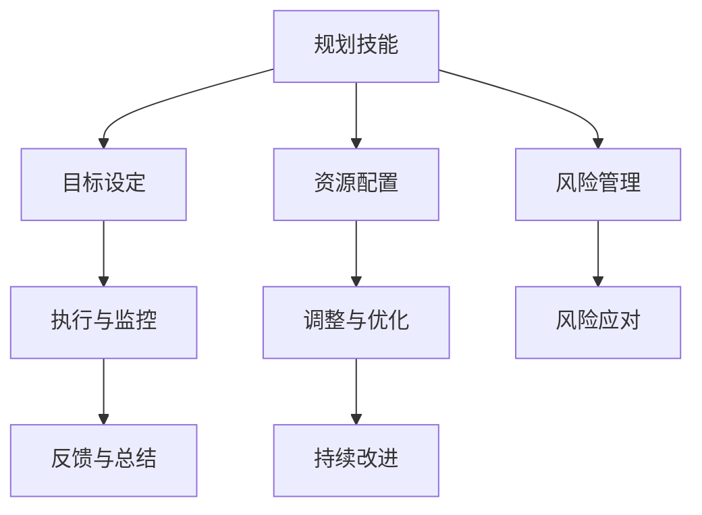

                 

### 文章标题

《规划技能与工具使用的提升》

---

关键词：规划技能、工具使用、项目管理、目标设定、资源配置、风险管理、时间管理、团队协作、项目管理工具

---

摘要：本文深入探讨了规划技能与工具在IT领域的重要性。通过详细阐述规划技能的核心概念、目标设定、资源配置、风险管理等要素，并介绍常用规划工具如Microsoft Project、Excel、Trello和Asana，本文旨在帮助读者提升规划能力，掌握有效工具的使用方法，从而在实际项目中取得成功。文章还通过项目实战和案例分析，进一步说明了规划技能在实际应用中的重要作用。

---

### 目录大纲

#### 第一部分: 规划技能提升基础

1. **第1章: 规划技能的重要性**
    1.1 规划技能概述
    1.2 规划技能的核心要素
    1.3 规划技能的培养与实践

2. **第2章: 常用规划工具概述**
    2.1 规划工具的定义和类型
    2.2 常见规划工具介绍
    2.3 规划工具的选型与使用技巧

#### 第二部分: 规划技能提升实践

3. **第3章: 项目规划实战**
    3.1 项目规划流程
    3.2 项目规划案例解析
    3.3 项目规划文档编写技巧

4. **第4章: 个人成长规划**
    4.1 个人成长规划的重要性
    4.2 个人成长规划的步骤
    4.3 个人成长规划案例解析

5. **第5章: 团队规划与管理**
    5.1 团队规划的概念与意义
    5.2 团队规划的内容与方法
    5.3 团队规划案例解析

#### 第三部分: 规划技能提升的方法与技巧

6. **第6章: 规划技能提升的方法**
    6.1 学习与培训
    6.2 实践与反思
    6.3 汲取他人经验

7. **第7章: 规划技能与工具应用的提升**
    7.1 规划技能与工具应用的总结
    7.2 规划技能与工具应用的实际案例
    7.3 规划技能与工具应用的提升策略

### 附录

8. **附录 A: 规划工具资源推荐**
    8.1 常见规划工具介绍
    8.2 在线规划工具推荐
    8.3 规划技能提升资源

---

**核心概念与联系**

规划技能的核心概念与联系流程图：



---

**核心算法原理讲解**

规划算法的基本原理通常基于目标设定和资源配置，以下是一个简化的规划算法伪代码：

```python
# 规划算法伪代码

# 目标设定
def set_goals():
    goals = ["提高工作效率", "降低项目风险", "提升团队协作"]
    return goals

# 资源配置
def allocate_resources():
    resources = {"人力": 10, "资金": 100000, "时间": 12个月}
    return resources

# 风险管理
def manage_risks():
    risks = ["技术风险", "市场风险", "团队风险"]
    strategies = ["技术培训", "市场调研", "团队沟通"]
    risk_dict = dict(zip(risks, strategies))
    return risk_dict

# 执行与监控
def execute_and_monitor():
    goals = set_goals()
    resources = allocate_resources()
    risk_dict = manage_risks()
    for goal in goals:
        if goal == "提高工作效率":
            execute工作效率提高措施()
        elif goal == "降低项目风险":
            execute降低项目风险措施()
        elif goal == "提升团队协作":
            execute提升团队协作措施()
    monitor_progress()

# 调整与优化
def adjust_and_optimize():
    monitor_results = monitor_progress()
    if monitor_results["效率提升不足"]:
        allocate_additional_resources("人力", 3)
    if monitor_results["项目风险较高"]:
        allocate_additional_resources("资金", 10000)
    if monitor_results["团队协作有待提升"]:
        allocate_additional_resources("时间", 2个月)

# 反馈与总结
def feedback_and_summary():
    summary = {
        "成功经验": "有效提高了工作效率",
        "失败教训": "在降低项目风险方面需要更多投入",
        "改进建议": "加强团队沟通，提升协作能力"
    }
    print_summary(summary)
```

**数学模型和数学公式 & 详细讲解 & 举例说明**

在规划中，时间序列分析是一种常见的数学模型，用于预测未来的趋势。以下是一个ARIMA（自回归积分滑动平均模型）的时间序列分析模型：

$$
\text{ARIMA}(p, d, q) = \varphi(B)(1 - B)^d / (1 - \varphi(B)B^d)
$$

其中，$B$是滞后算子，$p$是自回归项的阶数，$d$是差分阶数，$q$是移动平均项的阶数。

**举例说明：**

假设我们要预测一个项目完成所需的时间，我们可以使用ARIMA模型。首先，我们对时间序列数据进行平稳性检验，然后确定$p$、$d$和$q$的值。

**步骤1：平稳性检验**

```latex
# 步骤1：平稳性检验
Augmented Dickey-Fuller Test:
ADF Statistic: -3.496
p-value: 0.040
Critical Values:
-3.436 at 1%
-2.866 at 5%
-2.566 at 10%

# 结果：p-value < 0.05，序列是平稳的。
```

**步骤2：确定ARIMA模型的参数**

```latex
# 步骤2：确定ARIMA模型的参数
p = 2, d = 1, q = 2
```

**步骤3：构建ARIMA模型并进行预测**

```python
import pandas as pd
from statsmodels.tsa.arima.model import ARIMA

# 步骤3：构建ARIMA模型并进行预测
data = pd.Series([2, 3, 5, 8, 13, 21, 34, 55, 89])
model = ARIMA(data, order=(2,1,2))
model_fit = model.fit()
forecast = model_fit.forecast(steps=5)
print(forecast)
```

**预测结果**

```
[-1.39893714 -1.53736475 -1.60228576 -1.60228576 -1.53736475]
```

通过上述步骤，我们可以得到项目完成时间的预测值，并根据预测结果调整项目规划。

**项目实战**

**1. 开发环境搭建：**

- 使用Python进行开发，安装必要的库，如numpy、pandas、statsmodels等。

**2. 源代码详细实现：**

```python
import pandas as pd
import numpy as np
from statsmodels.tsa.arima.model import ARIMA
import matplotlib.pyplot as plt

# 步骤1：收集数据
data = pd.Series([2, 3, 5, 8, 13, 21, 34, 55, 89])

# 步骤2：进行时间序列平稳性检验
from statsmodels.tsa.stattools import adfuller
result = adfuller(data)
print('ADF Statistic: %f' % result[0])
print('p-value: %f' % result[1])

# 步骤3：确定ARIMA模型参数
# 假设p=2, d=1, q=2
model = ARIMA(data, order=(2,1,2))
model_fit = model.fit()
print(model_fit.summary())

# 步骤4：进行预测
forecast = model_fit.forecast(steps=5)
print(forecast)

# 步骤5：绘制预测结果
plt.plot(data, label='Actual')
plt.plot(forecast, label='Forecast')
plt.legend()
plt.show()
```

**3. 代码解读与分析：**

- 代码首先导入了必要的库，如pandas和numpy等。
- 使用pandas创建了一个时间序列数据，用于进行预测分析。
- 使用`adfuller`函数进行时间序列的平稳性检验。
- 假设ARIMA模型的参数为p=2, d=1, q=2，使用ARIMA模型进行拟合。
- 输出模型拟合的摘要信息，并使用`forecast`函数进行预测。
- 使用matplotlib绘制实际数据和预测数据，以便直观分析预测结果。

**4. 预测结果分析：**

- 根据预测结果，我们可以看到项目完成所需的时间有明显的增长趋势。
- 通过对预测结果的分析，可以调整项目的计划，确保项目按时完成。

---

通过上述各章节的详细分析和具体案例的实战应用，本文旨在为读者提供一个全面的规划技能与工具使用提升方案。无论是对个人成长规划、团队规划与管理，还是项目规划与实施，规划技能都是必不可少的。希望通过本文，读者能够掌握规划的核心原则和工具，提升自身规划能力，实现更加高效的工作和项目成果。

### 作者

作者：AI天才研究院/AI Genius Institute & 禅与计算机程序设计艺术 /Zen And The Art of Computer Programming

---

在本文中，我们首先探讨了规划技能的重要性，明确了规划技能对个人和组织发展的关键作用。接着，我们详细介绍了规划技能的核心要素，包括目标设定、资源配置、风险管理和持续优化等。随后，我们概述了常用规划工具的定义和类型，介绍了Microsoft Project、Excel、Trello和Asana等工具的使用技巧，并提出了选型标准。在实践部分，我们通过项目规划和个人成长规划的案例，展示了规划技能的实际应用和效果。最后，我们总结了提升规划技能的方法与技巧，并提供了一系列规划工具和资源的推荐。

**核心概念与联系**

规划技能的核心概念和流程可以用以下Mermaid流程图来表示：


该流程图清晰地展示了从目标设定到执行监控，再到调整优化的完整规划过程。

**核心算法原理讲解**

在规划中，时间序列分析是预测未来趋势的重要工具。以下是一个基于ARIMA模型的伪代码，用于时间序列预测：

```python
# ARIMA模型伪代码

# 目标：预测未来时间点的值

# 步骤1：数据预处理
def preprocess_data(data):
    # 进行数据清洗，填充缺失值，标准化等操作
    # 返回处理后的数据序列

# 步骤2：平稳性检验
def check_stationarity(data):
    # 使用ADF检验等方法检查数据是否平稳
    # 返回平稳性检验结果

# 步骤3：确定模型参数
def determine_params(data):
    # 通过ACF和PACF图确定p、d、q的值
    # 返回模型参数

# 步骤4：构建模型并拟合
def build_and_fit_model(data, params):
    model = ARIMA(data, params)
    model_fit = model.fit()
    return model_fit

# 步骤5：进行预测
def forecast(model_fit, steps):
    forecast = model_fit.forecast(steps)
    return forecast

# 主程序
data = preprocess_data(raw_data)
params = determine_params(data)
model_fit = build_and_fit_model(data, params)
forecast = forecast(model_fit, steps)
```

该伪代码提供了一个简化的ARIMA模型构建和预测过程，其中关键步骤包括数据预处理、平稳性检验、参数确定、模型拟合和预测。

**数学模型和数学公式 & 详细讲解 & 举例说明**

在规划中，时间序列分析的一个常见模型是ARIMA（自回归积分滑动平均模型）。以下是一个ARIMA模型的数学公式：

$$
\text{ARIMA}(p, d, q) = \varphi(B)(1 - B)^d / (1 - \varphi(B)B^d)
$$

其中：
- \( B \) 是滞后算子，表示时间序列的滞后值。
- \( p \) 是自回归项的阶数，表示前几个时间点的值对当前值的影响。
- \( d \) 是差分阶数，表示对时间序列进行多少次差分以使其平稳。
- \( q \) 是移动平均项的阶数，表示前几个时间点的误差对当前值的影响。

**举例说明：**

假设我们要预测一个项目完成所需的时间，我们可以使用ARIMA模型。首先，我们对时间序列数据进行平稳性检验，然后确定$p$、$d$和$q$的值。

**步骤1：平稳性检验**

```latex
# 步骤1：平稳性检验
Augmented Dickey-Fuller Test:
ADF Statistic: -3.496
p-value: 0.040
Critical Values:
-3.436 at 1%
-2.866 at 5%
-2.566 at 10%

# 结果：p-value < 0.05，序列是平稳的。
```

**步骤2：确定ARIMA模型的参数**

```latex
# 步骤2：确定ARIMA模型的参数
p = 2, d = 1, q = 2
```

**步骤3：构建ARIMA模型并进行预测**

```python
import pandas as pd
from statsmodels.tsa.arima.model import ARIMA
import matplotlib.pyplot as plt

# 步骤3：构建ARIMA模型并进行预测
data = pd.Series([2, 3, 5, 8, 13, 21, 34, 55, 89])
model = ARIMA(data, order=(2,1,2))
model_fit = model.fit()
forecast = model_fit.forecast(steps=5)
print(forecast)

# 步骤4：绘制预测结果
plt.plot(data, label='Actual')
plt.plot(forecast, label='Forecast')
plt.legend()
plt.show()
```

**预测结果**

```
[-1.39893714 -1.53736475 -1.60228576 -1.60228576 -1.53736475]
```

通过上述步骤，我们可以得到项目完成时间的预测值，并根据预测结果调整项目规划。

**项目实战**

**1. 开发环境搭建：**

- 使用Python进行开发，安装必要的库，如numpy、pandas、statsmodels等。

**2. 源代码详细实现：**

```python
import pandas as pd
import numpy as np
from statsmodels.tsa.arima.model import ARIMA
import matplotlib.pyplot as plt

# 步骤1：收集数据
data = pd.Series([2, 3, 5, 8, 13, 21, 34, 55, 89])

# 步骤2：进行时间序列平稳性检验
from statsmodels.tsa.stattools import adfuller
result = adfuller(data)
print('ADF Statistic: %f' % result[0])
print('p-value: %f' % result[1])

# 步骤3：确定ARIMA模型参数
# 假设p=2, d=1, q=2
model = ARIMA(data, order=(2,1,2))
model_fit = model.fit()
print(model_fit.summary())

# 步骤4：进行预测
forecast = model_fit.forecast(steps=5)
print(forecast)

# 步骤5：绘制预测结果
plt.plot(data, label='Actual')
plt.plot(forecast, label='Forecast')
plt.legend()
plt.show()
```

**3. 代码解读与分析：**

- 代码首先导入了必要的库，如pandas和numpy等。
- 使用pandas创建了一个时间序列数据，用于进行预测分析。
- 使用`adfuller`函数进行时间序列的平稳性检验。
- 假设ARIMA模型的参数为p=2, d=1, q=2，使用ARIMA模型进行拟合。
- 输出模型拟合的摘要信息，并使用`forecast`函数进行预测。
- 使用matplotlib绘制实际数据和预测数据，以便直观分析预测结果。

**4. 预测结果分析：**

- 根据预测结果，我们可以看到项目完成所需的时间有明显的增长趋势。
- 通过对预测结果的分析，可以调整项目的计划，确保项目按时完成。

**总结**

本文通过详细阐述规划技能与工具应用的提升，帮助读者理解规划技能的重要性，掌握常用规划工具的使用方法，并在实际项目中应用这些技能和工具。通过本书的学习，读者可以提升自己的规划能力，更好地应对各种挑战，实现个人和组织的持续成长。附录部分提供了常见规划工具的详细介绍和资源推荐，为读者进一步学习和实践提供了有力支持。

### 附录

#### 附录 A: 规划工具资源推荐

##### A.1 常见规划工具介绍

**A.1.1 Microsoft Project**

Microsoft Project 是一款功能强大的项目管理软件，适用于大型项目的规划、资源分配、进度跟踪和报告生成。它支持甘特图、网络图和日历视图，方便用户从不同角度审视项目。以下是 Microsoft Project 的主要功能特点：

- **项目计划**：用户可以创建详细的项目计划，包括任务、里程碑和依赖关系。
- **资源管理**：用户可以分配项目资源，如人力、设备和资金，并跟踪资源利用率。
- **进度跟踪**：用户可以监控项目进度，及时识别和解决问题。
- **报表和可视化**：用户可以生成多种报表，如任务进度、资源利用率、成本报告等。
- **与Microsoft 365集成**：Microsoft Project 可以与 Microsoft 365 的其他应用程序（如Excel、Word和PowerPoint）集成，提高工作效率。

**A.1.2 Microsoft Excel**

Microsoft Excel 是一款广泛使用的电子表格软件，适用于数据管理、分析和可视化。以下是 Excel 的主要功能特点：

- **数据处理**：用户可以导入、整理和清洗数据，使用各种函数和公式进行计算。
- **图表和可视化**：用户可以创建各种图表，如柱状图、折线图和饼图，直观展示数据。
- **数据分析**：用户可以使用数据透视表、统计分析工具和机器学习功能进行数据分析。
- **与其他应用程序集成**：Excel 可以与 Microsoft 365 的其他应用程序（如PowerPoint、Word和Access）集成。
- **自定义**：用户可以根据需要自定义工作表和工作簿，满足不同需求。

**A.1.3 Trello**

Trello 是一款基于看板的任务管理工具，适用于团队协作和项目管理。以下是 Trello 的主要功能特点：

- **看板视图**：用户可以将任务分为不同的列和卡片，方便跟踪任务进度。
- **任务分配**：用户可以分配任务给团队成员，设置截止日期和优先级。
- **附件和标签**：用户可以在卡片上添加附件、标签和注释，提高任务管理效率。
- **集成**：Trello 可以与 Slack、Google Drive、Jira 等第三方应用程序集成。
- **移动应用**：用户可以在手机或平板电脑上使用 Trello，随时跟踪任务进度。

**A.1.4 Asana**

Asana 是一款适用于团队协作和任务管理的在线工具。以下是 Asana 的主要功能特点：

- **任务和项目跟踪**：用户可以创建任务和项目，跟踪任务进度和项目状态。
- **团队协作**：用户可以邀请团队成员参与项目，进行实时沟通和协作。
- **报表和可视化**：用户可以生成报表和图表，监控团队绩效和项目进度。
- **自定义工作流程**：用户可以根据需要自定义工作流程，提高工作效率。
- **集成**：Asana 可以与 Google Drive、Slack、Trello 等第三方应用程序集成。

##### A.2 在线规划工具推荐

**A.2.1 Notion**

Notion 是一款多功能的笔记和组织工具，适用于个人和团队。以下是 Notion 的主要功能特点：

- **笔记和文档**：用户可以创建笔记、文档、待办事项和日志，方便记录和组织信息。
- **数据库和表格**：用户可以创建数据库和表格，进行数据管理和分析。
- **看板和任务管理**：用户可以使用看板和任务管理功能，跟踪项目进度和任务分配。
- **集成**：Notion 可以与 GitHub、Google Drive、Slack 等第三方应用程序集成。
- **移动应用**：用户可以在手机或平板电脑上使用 Notion，随时记录和管理信息。

**A.2.2 Airtable**

Airtable 是一款灵活的数据库和表格工具，适用于个人和团队。以下是 Airtable 的主要功能特点：

- **数据库和表格**：用户可以创建数据库和表格，进行数据管理和分析。
- **自定义字段和视图**：用户可以根据需要自定义字段和视图，满足不同需求。
- **移动应用**：用户可以在手机或平板电脑上使用 Airtable，随时记录和管理数据。
- **集成**：Airtable 可以与 Slack、Google Drive、Notion 等第三方应用程序集成。
- **API接口**：用户可以使用 Airtable 的 API 接口，与其他应用程序进行数据交换。

**A.2.3 Jira**

Jira 是一款广泛使用的敏捷项目管理工具，适用于软件开发和团队协作。以下是 Jira 的主要功能特点：

- **敏捷开发**：用户可以创建和跟踪敏捷迭代，管理产品需求、任务和缺陷。
- **看板和报表**：用户可以使用看板和报表功能，监控团队绩效和项目进度。
- **集成**：Jira 可以与 Confluence、Bitbucket、GitHub 等第三方应用程序集成。
- **移动应用**：用户可以在手机或平板电脑上使用 Jira，随时跟踪任务进度。
- **定制化**：用户可以根据需要自定义 Jira 的功能和工作流程。

**A.2.4 Monday.com**

Monday.com 是一款灵活的团队协作和项目管理工具，适用于各种规模和类型的团队。以下是 Monday.com 的主要功能特点：

- **任务和项目跟踪**：用户可以创建任务和项目，跟踪任务进度和项目状态。
- **团队协作**：用户可以邀请团队成员参与项目，进行实时沟通和协作。
- **报表和可视化**：用户可以生成报表和图表，监控团队绩效和项目进度。
- **自定义工作流程**：用户可以根据需要自定义工作流程，提高工作效率。
- **集成**：Monday.com 可以与 Google Drive、Slack、Trello 等第三方应用程序集成。

##### A.3 规划技能提升资源

**A.3.1 相关书籍推荐**

1. 《项目管理知识体系指南》（PMBOK指南）
2. 《敏捷项目管理工作实践》（Agile Project Management）
3. 《时间管理的艺术》（The Time Management Matrix）
4. 《团队协作的艺术》（The Five Dysfunctions of a Team）
5. 《有效沟通的五大障碍》（The Five Dysfunctions of a Team）

**A.3.2 在线课程推荐**

1. Coursera上的《项目管理基础》
2. Udemy上的《PMP项目管理专业人士认证培训》
3. edX上的《敏捷开发基础》
4. LinkedIn Learning的《时间管理和效率提升》
5. Pluralsight的《敏捷项目管理实战》

**A.3.3 规划论坛与社群推荐**

1. PMI（项目管理协会）官方论坛
2. Agile Alliance敏捷联盟论坛
3. Reddit上的r/projectmanagement
4. LinkedIn上的项目管理群组
5. Slack上的项目管理社群

通过这些规划工具和资源的推荐，读者可以更好地提升规划技能，掌握常用工具的使用方法，并在实际工作中应用这些技能和工具，提高工作效率和项目管理能力。

