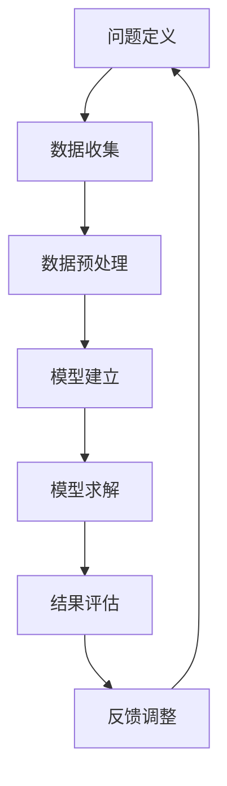

                 

# 规划机制在智能决策系统中的应用

## 关键词
智能决策系统、规划机制、供应链管理、能源管理、城市规划、算法模型、优化模型、人工智能、决策支持系统

## 摘要
本文深入探讨了规划机制在智能决策系统中的应用。首先，文章介绍了智能决策系统的基本概念、发展历程及其核心组成部分。随后，规划机制的定义、分类和作用被详细阐述。接着，文章聚焦于规划机制的基本原理，包括核心概念、设计原则和实现方法，并通过Mermaid流程图和伪代码深入解释。然后，规划机制在智能决策系统中的应用场景，如供应链管理、能源管理和城市规划，被逐一探讨。文章还讨论了规划机制在智能决策系统中的实现方法、挑战与未来趋势。最后，通过实际案例分析，文章展示了规划机制在智能决策系统中的具体应用，并提供了一些建议和展望。

## 目录大纲

### 第一部分：智能决策系统概述

#### 第1章：智能决策系统基础
- **1.1 智能决策系统的概念与价值**
- **1.2 智能决策系统的发展历程**
- **1.3 智能决策系统的应用领域**
- **1.4 智能决策系统与人工智能的关系**
- **1.5 智能决策系统的核心组成部分**

#### 第2章：规划机制概述
- **2.1 规划机制的定义与分类**
- **2.2 规划机制的作用与意义**
- **2.3 规划机制的发展历程**

### 第二部分：规划机制在智能决策系统中的应用

#### 第3章：规划机制的基本原理
- **3.1 规划机制的核心概念**
- **3.2 规划机制的设计原则**
- **3.3 规划机制的实现方法**
  - **3.3.1 规划模型的类型**
  - **3.3.2 规划流程的设计**
  - **3.3.3 数据分析与处理**
  - **3.3.4 系统实现与优化**
  - **3.3.5 Mermaid流程图解释**
  - **3.3.6 伪代码与算法原理**

#### 第4章：规划机制在智能决策系统中的应用场景
- **4.1 供应链管理中的应用**
  - **4.1.1 供应链规划机制的设计**
  - **4.1.2 供应链规划机制的实现**
- **4.2 能源管理中的应用**
  - **4.2.1 能源规划机制的设计**
  - **4.2.2 能源规划机制的实现**
- **4.3 城市规划中的应用**
  - **4.3.1 城市规划规划机制的设计**
  - **4.3.2 城市规划规划机制的实现**

#### 第5章：规划机制在智能决策系统中的实现
- **5.1 规划机制在智能决策系统中的集成**
- **5.2 规划机制在智能决策系统中的优化**
- **5.3 规划机制在智能决策系统中的监控与调整**

#### 第6章：规划机制在智能决策系统中的挑战与未来趋势
- **6.1 规划机制在智能决策系统中的挑战**
- **6.2 规划机制在智能决策系统中的未来发展趋势**
- **6.3 规划机制在智能决策系统中的创新方向**

### 第三部分：实践案例

#### 第7章：规划机制在智能决策系统中的应用案例分析
- **7.1 案例一：智能物流规划系统的设计与应用**
- **7.2 案例二：智能电网规划机制的设计与实现**
- **7.3 案例三：智能城市规划系统的设计与实践**

#### 第8章：规划机制在智能决策系统中的实际应用
- **8.1 规划机制在智能决策系统中的实际应用流程**
- **8.2 规划机制在智能决策系统中的实际应用效果分析**
- **8.3 规划机制在智能决策系统中的实际应用案例分享**

#### 第9章：规划机制在智能决策系统中的技术展望
- **9.1 新型规划机制的研究方向**
- **9.2 规划机制与人工智能融合的展望**
- **9.3 规划机制在智能决策系统中的未来发展**

### 附录
- **附录A：规划机制相关术语解释**
- **附录B：规划机制相关工具与资源**
- **附录C：参考文献**

## 第1章 智能决策系统基础

### 1.1 智能决策系统的概念与价值

智能决策系统是指利用人工智能技术，对大量数据进行分析和处理，从而辅助人类做出更加准确和高效的决策的系统。它不仅依赖于传统的数据分析方法，还融合了机器学习、深度学习、数据挖掘等先进技术，使得决策过程更加智能化。

智能决策系统的价值在于：

1. **提高决策的准确性**：通过大数据分析和机器学习算法，智能决策系统能够从海量数据中提取出有用的信息，提供更加准确的预测和分析结果，从而帮助决策者做出更明智的决策。

2. **提高决策的效率**：智能决策系统能够自动化地进行数据处理和分析，减少了人工干预的时间和成本，使得决策过程更加迅速和高效。

3. **增强决策的鲁棒性**：智能决策系统通过学习和适应环境变化，能够提高决策的稳定性和适应性，减少因外部因素变化导致的决策失误。

4. **优化资源分配**：在供应链管理、能源管理等领域，智能决策系统能够通过优化算法，合理分配资源，提高资源利用效率，降低成本。

### 1.2 智能决策系统的发展历程

智能决策系统的发展可以分为以下几个阶段：

1. **初级阶段**：以简单的规则为基础的决策支持系统，如专家系统和决策树。

2. **中级阶段**：引入了机器学习算法，如决策树、支持向量机等，能够进行数据分析和预测。

3. **高级阶段**：融合了深度学习和大数据技术，能够处理大规模数据，提供更加准确的决策支持。

### 1.3 智能决策系统的应用领域

智能决策系统广泛应用于各个领域，主要包括：

1. **供应链管理**：通过优化供应链规划，提高供应链效率，降低成本。

2. **能源管理**：通过智能电网规划，优化能源分配，提高能源利用效率。

3. **城市规划**：通过智能规划，优化城市布局，提高城市生活质量。

4. **金融领域**：通过风险管理，优化投资组合，提高投资收益。

5. **医疗领域**：通过疾病预测和诊断，提高医疗服务的质量和效率。

### 1.4 智能决策系统与人工智能的关系

智能决策系统是人工智能的一个重要应用领域。人工智能提供了一系列技术，如机器学习、深度学习、数据挖掘等，使得智能决策系统能够更好地处理和分析数据，提供更加准确的决策支持。

智能决策系统与人工智能的关系可以总结为：

1. **人工智能是智能决策系统的技术基础**：人工智能技术，特别是机器学习和深度学习，为智能决策系统提供了强大的数据处理和分析能力。

2. **智能决策系统是人工智能的重要应用**：智能决策系统通过将人工智能技术应用于实际场景，实现了人工智能的商业化应用。

3. **智能决策系统推动人工智能技术的发展**：智能决策系统在实践中遇到的问题和需求，推动了人工智能技术的不断发展和进步。

### 1.5 智能决策系统的核心组成部分

智能决策系统通常由以下几个核心组成部分构成：

1. **数据采集与预处理**：收集并处理各种数据，为后续分析提供基础。

2. **数据处理与分析**：运用各种算法，对数据进行处理和分析，提取有用的信息。

3. **模型建立与优化**：建立预测模型和优化模型，对分析结果进行验证和优化。

4. **决策支持与可视化**：提供决策支持工具和可视化界面，帮助决策者理解分析结果，做出决策。

5. **系统集成与部署**：将智能决策系统与其他系统进行集成，实现自动化和智能化的决策支持。

### 第2章 规划机制概述

#### 2.1 规划机制的定义与分类

规划机制是指为了实现特定目标而设计的系统、方法或流程。在智能决策系统中，规划机制起着至关重要的作用，它不仅帮助决策者确定目标和策略，还能够根据环境变化进行调整和优化。

规划机制的分类可以根据不同的标准进行：

1. **按照规划目标的分类**：
   - **长期规划**：关注长期目标的实现，通常涉及多阶段、多层次的规划。
   - **短期规划**：关注短期目标的实现，通常涉及单一阶段或短期的策略制定。

2. **按照规划时间的分类**：
   - **静态规划**：不考虑时间因素，针对静态环境进行规划。
   - **动态规划**：考虑时间因素，针对动态环境进行规划。

3. **按照规划方法的分类**：
   - **基于规则的规划**：通过预定义的规则进行规划。
   - **基于优化的规划**：通过优化算法进行规划。
   - **混合规划**：结合多种规划方法进行规划。

#### 2.2 规划机制的作用与意义

规划机制在智能决策系统中的作用和意义体现在以下几个方面：

1. **目标明确性**：规划机制能够帮助决策者明确目标，将复杂的问题分解为可管理的子问题，从而提高决策的准确性和有效性。

2. **提高决策效率**：规划机制通过自动化和优化的方式，减少了决策过程中的人为干预和时间消耗，提高了决策效率。

3. **增强决策的鲁棒性**：规划机制能够根据环境变化进行调整和优化，提高了决策的鲁棒性和适应性。

4. **优化资源分配**：在供应链管理、能源管理等领域，规划机制能够优化资源分配，提高资源利用效率，降低成本。

5. **支持决策可视化**：规划机制能够通过可视化工具，将决策过程和分析结果展示给决策者，使得决策更加透明和易于理解。

#### 2.3 规划机制的发展历程

规划机制的发展可以追溯到早期的决策支持系统。随着计算机技术和人工智能技术的不断进步，规划机制也在不断演进：

1. **早期阶段**：以手工操作和预定义规则为基础的规划机制，如PERT（项目评估和审查技术）和Gantt图。

2. **发展阶段**：引入了优化算法和数学模型，如线性规划、整数规划等，使得规划机制更加科学和高效。

3. **现代阶段**：随着人工智能技术的发展，规划机制融合了机器学习、深度学习等技术，能够处理大规模数据，实现动态和自适应的规划。

4. **未来趋势**：规划机制将继续与人工智能技术深度融合，实现更加智能和自适应的决策支持。

### 第3章 规划机制的基本原理

#### 3.1 规划机制的核心概念

规划机制的核心概念包括以下几个方面：

1. **目标设定**：明确规划的目标和需求，是规划机制的基础。目标可以是具体的数量指标，如成本最小化、利润最大化，也可以是抽象的目标，如提高服务质量、减少环境污染。

2. **决策变量**：决策变量是规划过程中需要决策的因素，如生产量、库存量、运输路线等。决策变量的选择和设定直接影响规划结果。

3. **约束条件**：约束条件是规划过程中必须满足的限制条件，如资源限制、时间限制、政策法规等。约束条件确保了规划结果的可行性和合法性。

4. **优化算法**：优化算法是规划机制的核心，用于寻找最佳决策变量组合。常见的优化算法包括线性规划、整数规划、动态规划、遗传算法等。

5. **反馈机制**：反馈机制用于评估规划结果的优劣，并根据评估结果进行调整和优化。反馈机制保证了规划机制的动态适应性和持续改进。

#### 3.2 规划机制的设计原则

规划机制的设计应遵循以下原则：

1. **目标明确性**：规划机制的目标应清晰明确，有助于决策者理解和执行。

2. **简洁性**：规划机制应尽量简洁，减少不必要的复杂性和冗余。

3. **灵活性**：规划机制应具有灵活性，能够适应环境变化和需求调整。

4. **可扩展性**：规划机制应具有可扩展性，能够支持不同规模和应用场景的需求。

5. **鲁棒性**：规划机制应具有鲁棒性，能够应对数据噪声、模型不确定性等挑战。

6. **可解释性**：规划机制的结果和过程应具有可解释性，有助于决策者理解和信任。

#### 3.3 规划机制的实现方法

规划机制的实现方法主要包括以下几个方面：

1. **数据收集与预处理**：收集相关数据，并进行预处理，如数据清洗、数据集成、特征工程等。

2. **模型建立**：根据目标、决策变量和约束条件，建立数学模型或优化模型。

3. **算法选择**：选择合适的优化算法，如线性规划、遗传算法、神经网络等。

4. **模型求解**：使用优化算法求解模型，得到最优决策变量组合。

5. **结果评估**：评估规划结果，包括目标达成度、资源利用率、成本效益等。

6. **反馈调整**：根据评估结果进行调整和优化，以提高规划效果。

##### 3.3.1 规划模型的类型

规划模型根据不同的应用场景和数据特性，可以分为以下几种类型：

1. **线性规划模型**：适用于目标函数和约束条件都是线性的情况，如成本最小化、利润最大化等。

2. **整数规划模型**：适用于决策变量需要取整数值的情况，如生产规划、库存管理等。

3. **动态规划模型**：适用于具有时间维度或阶段性的问题，如供应链管理、生产调度等。

4. **多目标规划模型**：适用于具有多个目标的情况，如综合成本、质量、时间等。

5. **随机规划模型**：适用于存在不确定性因素的问题，如风险规划、不确定性资源分配等。

##### 3.3.2 规划流程的设计

规划流程的设计是规划机制实现的关键，通常包括以下步骤：

1. **问题定义**：明确规划的目标和需求，确定决策变量和约束条件。

2. **数据收集**：收集与规划相关的数据，包括历史数据、预测数据、实时数据等。

3. **数据预处理**：对收集到的数据进行清洗、集成和特征工程，以提高数据质量和模型性能。

4. **模型建立**：根据问题定义和数据处理结果，建立相应的数学模型或优化模型。

5. **算法选择**：选择适合问题的优化算法，如线性规划、遗传算法、神经网络等。

6. **模型求解**：使用优化算法求解模型，得到最优决策变量组合。

7. **结果评估**：评估规划结果，包括目标达成度、资源利用率、成本效益等。

8. **反馈调整**：根据评估结果进行调整和优化，以提高规划效果。

##### 3.3.3 数据分析与处理

数据分析与处理是规划机制实现的基础，主要包括以下几个方面：

1. **数据收集**：从不同的数据源收集与规划相关的数据，包括历史数据、实时数据、外部数据等。

2. **数据清洗**：对收集到的数据进行清洗，包括去除重复数据、填补缺失数据、处理异常数据等。

3. **数据集成**：将来自不同数据源的数据进行整合，形成统一的视图。

4. **特征工程**：根据规划目标，提取和构建有助于模型训练的特征，如时间序列特征、空间特征等。

5. **数据可视化**：使用可视化工具，将数据和分析结果以图表、图形等形式展示，便于理解和决策。

##### 3.3.4 系统实现与优化

系统实现与优化是规划机制实际部署的关键，主要包括以下几个方面：

1. **系统架构设计**：根据规划需求，设计合理的系统架构，包括数据层、模型层、应用层等。

2. **技术选型**：选择适合的技术栈和工具，如数据库、计算框架、编程语言等。

3. **模型训练与优化**：使用收集到的数据进行模型训练，并通过交叉验证、网格搜索等方法优化模型性能。

4. **系统部署与监控**：将优化后的模型部署到生产环境，并进行监控和调优，确保系统稳定运行。

5. **性能优化**：通过优化代码、提升硬件性能、优化算法等方法，提高系统的响应速度和处理能力。

##### 3.3.5 Mermaid流程图解释

Mermaid是一种简单易用的图表绘制工具，可以用于绘制流程图、UML图、甘特图等。在规划机制的设计中，可以使用Mermaid流程图来描述规划流程、数据流向和算法步骤等。

以下是一个简单的Mermaid流程图示例：



在这个流程图中，A到G表示规划机制的各个步骤，箭头表示步骤之间的数据流动。

##### 3.3.6 伪代码与算法原理

伪代码是算法设计的一种抽象表示方法，可以帮助我们理解和描述算法的逻辑结构。在规划机制中，伪代码用于描述规划模型的求解过程和优化算法的实现。

以下是一个简单的线性规划问题的伪代码示例：

```
输入：目标函数C = c1*x1 + c2*x2 + ... + cn*xn
       约束条件Ax <= b
输出：最优解x*

算法：
1. 初始化：设置初始解x0，设定最大迭代次数kmax
2. for k = 1 to kmax do
   3. 求解线性规划问题，得到解xk
   4. 计算目标函数值f(xk) = c1*xk1 + c2*xk2 + ... + cn*xkn
   5. if f(xk) <= f(xk-1) then
      6. 更新最优解：x* = xk
   7. else
      8. 迭代终止
9. 返回最优解x*
```

在这个伪代码中，算法通过循环迭代的方式，逐步优化目标函数值，直到找到最优解。

#### 3.3.7 数学模型和数学公式

规划机制中的数学模型用于描述决策变量、目标函数和约束条件。以下是一些常见的数学模型和数学公式：

1. **线性规划模型**：

   目标函数： 
   $$ 
   \text{minimize} \, c^T x 
   $$
   
   约束条件： 
   $$ 
   Ax \leq b 
   $$

2. **整数规划模型**：

   目标函数： 
   $$ 
   \text{minimize} \, c^T x 
   $$
   
   约束条件： 
   $$ 
   Ax \leq b 
   $$
   且 $x$ 为整数

3. **动态规划模型**：

   目标函数： 
   $$ 
   \text{minimize} \, \sum_{t=0}^{T} c_t(x_t) 
   $$
   
   约束条件： 
   $$ 
   x_{t+1} = f(x_t) 
   $$

4. **多目标规划模型**：

   目标函数： 
   $$ 
   \text{minimize} \, f_1(x), f_2(x), ..., f_n(x) 
   $$
   
   约束条件： 
   $$ 
   g_1(x) \leq 0, g_2(x) \leq 0, ..., g_m(x) \leq 0 
   $$

5. **随机规划模型**：

   目标函数： 
   $$ 
   \text{minimize} \, E[c^T x] 
   $$
   
   约束条件： 
   $$ 
   Ax \leq b 
   $$

在规划机制中，数学模型和数学公式用于描述决策变量之间的关系和目标函数的优化目标。通过这些公式，我们可以建立数学模型，并使用优化算法求解最优解。

##### 3.3.8 数学公式的详细讲解

在规划机制中，数学公式用于描述目标函数、约束条件和优化算法。以下是对一些常见数学公式的详细讲解：

1. **目标函数**：
   - **线性规划**：
     $$ 
     \text{minimize} \, c^T x 
     $$
     其中，$c$ 是系数向量，$x$ 是决策变量向量。目标函数表示要优化的目标，如成本最小化、利润最大化等。
   - **整数规划**：
     $$ 
     \text{minimize} \, c^T x 
     $$
     其中，$c$ 是系数向量，$x$ 是决策变量向量。与线性规划不同的是，整数规划要求决策变量取整数。
   - **动态规划**：
     $$ 
     \text{minimize} \, \sum_{t=0}^{T} c_t(x_t) 
     $$
     其中，$c_t(x_t)$ 是第 $t$ 时刻的目标函数，$T$ 是时间步数。动态规划的目标是在多个时间步内优化目标函数的总和。
   - **多目标规划**：
     $$ 
     \text{minimize} \, f_1(x), f_2(x), ..., f_n(x) 
     $$
     其中，$f_i(x)$ 是第 $i$ 个目标函数，$n$ 是目标函数的个数。多目标规划的目标是在多个目标之间找到平衡。
   - **随机规划**：
     $$ 
     \text{minimize} \, E[c^T x] 
     $$
     其中，$E[c^T x]$ 是目标函数的期望值，$c$ 是系数向量，$x$ 是决策变量向量。随机规划的目标是在不确定的环境下优化目标函数的期望值。

2. **约束条件**：
   - **线性规划**：
     $$ 
     Ax \leq b 
     $$
     其中，$A$ 是系数矩阵，$x$ 是决策变量向量，$b$ 是常数向量。线性规划的约束条件表示决策变量和目标函数之间的关系。
   - **整数规划**：
     $$ 
     Ax \leq b 
     $$
     且 $x$ 为整数。整数规划的约束条件与线性规划相同，但要求决策变量取整数。
   - **动态规划**：
     $$ 
     x_{t+1} = f(x_t) 
     $$
     动态规划的约束条件表示决策变量在不同时间步之间的转移关系。
   - **多目标规划**：
     $$ 
     g_1(x) \leq 0, g_2(x) \leq 0, ..., g_m(x) \leq 0 
     $$
     多目标规划的约束条件表示决策变量和目标函数之间的关系，以及目标函数之间的平衡。
   - **随机规划**：
     $$ 
     Ax \leq b 
     $$
     随机规划的约束条件与线性规划相同，但要求在不确定的环境下满足。

通过这些数学公式，我们可以描述和求解各种类型的规划问题。在实际应用中，根据问题的具体特点，选择合适的数学模型和公式，并使用优化算法求解最优解。

##### 3.3.9 数学公式的举例说明

为了更好地理解数学公式在实际规划机制中的应用，以下将通过具体例子进行说明。

1. **线性规划**：

   假设有一个线性规划问题，目标是最小化成本，约束条件是资源限制。具体数学公式如下：

   目标函数：
   $$
   \text{minimize} \, c^T x
   $$
   约束条件：
   $$
   Ax \leq b
   $$
   其中，$c$ 是成本系数向量，$x$ 是决策变量向量，$A$ 是约束系数矩阵，$b$ 是约束常数向量。

   **例子**：

   假设有一个公司需要生产两种产品，每种产品的生产成本分别是 $c_1 = 10$ 和 $c_2 = 20$。生产每种产品需要不同的资源，资源限制如下：

   约束系数矩阵：
   $$
   A = \begin{bmatrix}
   2 & 1 \\
   3 & 2
   \end{bmatrix}
   $$
   约束常数向量：
   $$
   b = \begin{bmatrix}
   20 \\
   30
   \end{bmatrix}
   $$

   目标函数：
   $$
   \text{minimize} \, 10x_1 + 20x_2
   $$

   根据约束条件，我们可以得到以下方程组：

   $$
   2x_1 + x_2 \leq 20
   $$
   $$
   3x_1 + 2x_2 \leq 30
   $$

   通过求解这个线性规划问题，我们可以找到最优的生产决策，使得总成本最小。

2. **整数规划**：

   假设有一个整数规划问题，目标是最小化成本，约束条件是资源限制。具体数学公式如下：

   目标函数：
   $$
   \text{minimize} \, c^T x
   $$
   约束条件：
   $$
   Ax \leq b
   $$
   且 $x$ 为整数。

   **例子**：

   假设有一个工厂需要生产三种产品，每种产品的生产成本分别是 $c_1 = 5$，$c_2 = 10$，$c_3 = 15$。生产每种产品需要不同的机器和时间，资源限制如下：

   约束系数矩阵：
   $$
   A = \begin{bmatrix}
   1 & 1 & 1 \\
   2 & 2 & 2 \\
   3 & 3 & 3
   \end{bmatrix}
   $$
   约束常数向量：
   $$
   b = \begin{bmatrix}
   10 \\
   20 \\
   30
   \end{bmatrix}
   $$

   目标函数：
   $$
   \text{minimize} \, 5x_1 + 10x_2 + 15x_3
   $$

   根据约束条件，我们可以得到以下方程组：

   $$
   x_1 + x_2 + x_3 \leq 10
   $$
   $$
   2x_1 + 2x_2 + 2x_3 \leq 20
   $$
   $$
   3x_1 + 3x_2 + 3x_3 \leq 30
   $$

   由于决策变量 $x_1$，$x_2$，$x_3$ 必须为整数，我们可以通过整数规划算法求解最优的生产决策。

通过这些例子，我们可以看到数学公式在规划机制中的应用，通过建立数学模型并求解，我们可以找到最优的决策变量组合，实现目标的最优化。

### 第4章 规划机制在智能决策系统中的应用场景

#### 4.1 供应链管理中的应用

供应链管理是智能决策系统中一个重要的应用领域，涉及从原材料采购到产品交付的整个流程。规划机制在供应链管理中起着关键作用，通过优化供应链规划，提高供应链效率和降低成本。

**4.1.1 供应链规划机制的设计**

供应链规划机制的设计主要包括以下步骤：

1. **需求预测**：根据历史数据和市场需求，预测未来的需求量。需求预测的准确性对供应链规划的成败至关重要。

2. **库存管理**：根据需求预测和库存水平，制定库存策略，确保库存量的合理性和减少库存成本。

3. **物流优化**：通过优化运输路线、运输方式和运输工具，提高物流效率，降低运输成本。

4. **供应商管理**：选择合适的供应商，并建立长期合作关系，确保供应链的稳定性和可靠性。

5. **成本控制**：通过优化供应链各个环节的成本，实现成本控制，提高供应链的整体效益。

**4.1.2 供应链规划机制的实现**

供应链规划机制的实现通常包括以下步骤：

1. **数据收集**：收集供应链各环节的数据，包括需求数据、库存数据、物流数据等。

2. **数据预处理**：对收集到的数据进行清洗、集成和特征工程，为后续分析提供高质量的数据。

3. **需求预测**：使用机器学习算法，如时间序列分析、回归分析等，预测未来的需求量。

4. **库存策略制定**：根据需求预测和库存水平，制定合理的库存策略，如周期性补货策略、安全库存策略等。

5. **物流优化**：使用优化算法，如线性规划、遗传算法等，优化物流路线、运输方式和运输工具。

6. **供应商选择**：使用多目标优化算法，综合考虑供应商的交货时间、价格、质量等因素，选择合适的供应商。

7. **成本控制**：通过实时监控和调整供应链各环节的成本，实现成本控制。

**4.1.3 案例分析**

以下是一个供应链规划机制的案例分析：

某电子产品公司需要管理其全球供应链，涉及多个供应商、多个仓库和多个销售市场。为了优化供应链，公司采用了以下规划机制：

1. **需求预测**：通过历史销售数据和市场需求分析，使用时间序列分析方法预测未来的需求量。

2. **库存管理**：根据需求预测和当前库存水平，制定周期性补货策略和安全库存策略，确保库存量的合理性和减少库存成本。

3. **物流优化**：使用线性规划算法优化物流路线，选择最优的运输方式和运输工具，降低运输成本。

4. **供应商管理**：通过多目标优化算法，综合考虑供应商的交货时间、价格、质量等因素，选择合适的供应商。

5. **成本控制**：通过实时监控和调整供应链各环节的成本，实现成本控制，提高供应链的整体效益。

通过实施这个供应链规划机制，公司成功提高了供应链的效率和灵活性，降低了运营成本，提高了客户满意度。

#### 4.2 能源管理中的应用

能源管理是另一个重要的应用领域，涉及能源的采集、分配、存储和使用。规划机制在能源管理中起着关键作用，通过优化能源规划，提高能源利用效率和减少能源浪费。

**4.2.1 能源规划机制的设计**

能源规划机制的设计主要包括以下步骤：

1. **需求预测**：根据历史数据和市场需求，预测未来的能源需求量。

2. **能源分配**：根据需求预测和能源供应能力，制定能源分配策略，确保能源供应的稳定性和安全性。

3. **储能管理**：根据能源需求和供应情况，制定储能策略，优化储能设备的使用，减少能源浪费。

4. **能源效率优化**：通过优化能源利用方式和设备运行模式，提高能源利用效率。

5. **可再生能源集成**：考虑可再生能源的可用性和不确定性，制定可再生能源集成策略，提高能源供应的可持续性。

**4.2.2 能源规划机制的实现**

能源规划机制的实现通常包括以下步骤：

1. **数据收集**：收集能源需求数据、供应数据、储能数据等，为规划机制提供基础数据。

2. **数据预处理**：对收集到的数据进行清洗、集成和特征工程，为后续分析提供高质量的数据。

3. **需求预测**：使用机器学习算法，如时间序列分析、回归分析等，预测未来的能源需求量。

4. **能源分配**：使用优化算法，如线性规划、遗传算法等，优化能源分配策略，确保能源供应的稳定性和安全性。

5. **储能管理**：使用优化算法，如动态规划、随机规划等，优化储能设备的使用策略，减少能源浪费。

6. **能源效率优化**：使用优化算法，如线性规划、神经网络等，优化能源利用方式和设备运行模式，提高能源利用效率。

7. **可再生能源集成**：使用优化算法，如混合整数规划、多目标规划等，优化可再生能源的集成策略，提高能源供应的可持续性。

**4.2.3 案例分析**

以下是一个能源规划机制的案例分析：

某城市能源管理公司负责管理该城市的能源供应和分配。为了提高能源利用效率和减少能源浪费，公司采用了以下规划机制：

1. **需求预测**：通过历史数据和市场需求分析，使用时间序列分析方法预测未来的能源需求量。

2. **能源分配**：根据需求预测和能源供应能力，使用线性规划算法优化能源分配策略，确保能源供应的稳定性和安全性。

3. **储能管理**：根据能源需求和供应情况，使用动态规划算法优化储能设备的使用策略，减少能源浪费。

4. **能源效率优化**：通过优化能源利用方式和设备运行模式，使用神经网络算法优化能源利用效率。

5. **可再生能源集成**：考虑可再生能源的可用性和不确定性，使用混合整数规划算法优化可再生能源的集成策略，提高能源供应的可持续性。

通过实施这个能源规划机制，公司成功提高了能源利用效率，减少了能源浪费，提高了能源供应的稳定性和可持续性。

#### 4.3 城市规划中的应用

城市规划是智能决策系统中的一个重要应用领域，涉及城市布局、交通规划、环境管理等方面。规划机制在城市规划中起着关键作用，通过优化城市规划，提高城市的生活质量和管理效率。

**4.3.1 城市规划规划机制的设计**

城市规划规划机制的设计主要包括以下步骤：

1. **需求分析**：分析城市的人口、经济、交通等需求，确定城市规划的目标和需求。

2. **资源评估**：评估城市的土地资源、水资源、能源资源等，为城市规划提供基础数据。

3. **交通规划**：根据需求分析和资源评估，制定交通规划策略，优化交通网络，提高交通效率。

4. **环境管理**：制定环境管理策略，如垃圾分类、污水处理等，保护城市环境。

5. **城市布局优化**：根据需求分析和资源评估，优化城市布局，提高城市空间的利用效率。

**4.3.2 城市规划规划机制的实现**

城市规划规划机制的实现通常包括以下步骤：

1. **数据收集**：收集与城市规划相关的数据，包括人口数据、经济数据、交通数据、环境数据等。

2. **数据预处理**：对收集到的数据进行清洗、集成和特征工程，为后续分析提供高质量的数据。

3. **需求分析**：使用统计分析、机器学习等方法，分析城市的人口、经济、交通等需求。

4. **资源评估**：使用空间分析、资源优化等方法，评估城市的土地资源、水资源、能源资源等。

5. **交通规划**：使用交通规划算法，如最短路径算法、流量分配算法等，优化交通网络，提高交通效率。

6. **环境管理**：使用环境管理算法，如垃圾分类算法、污水处理算法等，制定环境管理策略。

7. **城市布局优化**：使用空间优化算法，如设施布局算法、土地利用优化算法等，优化城市布局，提高城市空间的利用效率。

**4.3.3 案例分析**

以下是一个城市规划规划机制的案例分析：

某城市政府为了提高城市的生活质量和管理效率，决定对城市进行规划。为了实现这一目标，政府采用了以下规划机制：

1. **需求分析**：通过调查问卷、数据分析等方法，收集城市的人口、经济、交通等需求数据。

2. **资源评估**：使用地理信息系统（GIS）技术，评估城市的土地资源、水资源、能源资源等。

3. **交通规划**：使用交通规划算法，如最短路径算法、流量分配算法等，优化交通网络，提高交通效率。

4. **环境管理**：使用垃圾分类算法、污水处理算法等，制定环境管理策略，保护城市环境。

5. **城市布局优化**：使用设施布局算法、土地利用优化算法等，优化城市布局，提高城市空间的利用效率。

通过实施这个城市规划规划机制，城市政府成功提高了城市的生活质量和管理效率，改善了交通状况，减少了环境污染，提高了市民的满意度。

### 第5章 规划机制在智能决策系统中的实现

#### 5.1 规划机制在智能决策系统中的集成

规划机制在智能决策系统中的集成是确保系统能够高效运作和实现目标的关键步骤。集成规划机制涉及将不同的组件、算法和数据源整合在一起，形成一个协调运作的整体。

**集成过程**：

1. **需求分析**：首先，对智能决策系统的需求进行详细分析，确定需要集成的规划机制类型和功能。

2. **架构设计**：设计智能决策系统的整体架构，包括数据层、算法层和应用层。确保规划机制能够无缝集成到系统中。

3. **数据融合**：整合来自不同数据源的数据，进行清洗、集成和预处理，为规划机制提供高质量的数据输入。

4. **算法选择**：根据需求分析，选择合适的优化算法和模型，确保规划机制能够在智能决策系统中有效运作。

5. **集成实现**：通过编程和系统集成工具，将规划机制实现并集成到智能决策系统中，确保各个组件之间的协调和数据流通。

6. **测试与验证**：对集成后的智能决策系统进行测试和验证，确保规划机制的正确性和有效性。

**集成策略**：

1. **模块化设计**：采用模块化设计，将规划机制分解为多个模块，便于集成和维护。

2. **数据标准化**：统一数据格式和标准，确保数据在不同组件之间的流通和兼容性。

3. **接口定义**：定义清晰的接口和协议，确保各个组件之间的数据交互和功能调用。

4. **灵活配置**：允许根据实际需求调整和配置规划机制，以适应不同的应用场景和需求变化。

#### 5.2 规划机制在智能决策系统中的优化

规划机制在智能决策系统中的优化是提高系统性能、效率和鲁棒性的重要环节。优化过程涉及对规划机制中的算法、模型和数据流程进行持续改进。

**优化步骤**：

1. **性能评估**：对智能决策系统的性能进行评估，确定当前规划机制的瓶颈和改进空间。

2. **算法优化**：根据性能评估结果，对优化算法进行改进，如调整参数、改进算法结构等。

3. **模型调整**：对规划模型进行优化，如引入新的模型、调整模型参数等，以提高预测准确性和优化效果。

4. **数据改进**：对数据流程进行优化，如数据清洗、特征工程等，提高数据质量和模型输入的准确性。

5. **系统重构**：如果现有架构无法满足优化需求，考虑重构系统架构，以适应新的算法和模型需求。

**优化策略**：

1. **迭代改进**：采用迭代改进策略，逐步优化规划机制，通过多次迭代提高系统性能。

2. **自适应调整**：根据实际运行情况，自适应调整规划机制，以应对环境变化和需求变化。

3. **多目标优化**：考虑多个优化目标，如成本、时间、质量等，采用多目标优化算法，找到最佳平衡点。

4. **模块化优化**：对规划机制的各个模块进行独立优化，提高整体系统的性能和鲁棒性。

#### 5.3 规划机制在智能决策系统中的监控与调整

规划机制在智能决策系统中的监控与调整是确保系统稳定运行和持续优化的重要环节。监控与调整过程涉及对规划机制的状态、性能和效果进行实时监控，并根据监控结果进行调整。

**监控内容**：

1. **状态监控**：监控规划机制的运行状态，如算法执行时间、内存使用情况等。

2. **性能监控**：监控规划机制的性能指标，如预测准确性、优化效果等。

3. **效果监控**：监控规划机制的实际效果，如决策准确性、成本节约等。

**调整方法**：

1. **实时调整**：根据实时监控结果，对规划机制进行实时调整，如调整参数、切换算法等。

2. **定期调整**：定期对规划机制进行评估和调整，以适应环境变化和需求变化。

3. **自动化调整**：采用自动化调整策略，如自适应优化算法、机器学习算法等，自动调整规划机制。

4. **专家干预**：在必要时，由专家进行干预，对规划机制进行调整和优化。

**调整策略**：

1. **反馈机制**：建立反馈机制，及时收集监控数据和用户反馈，为调整提供依据。

2. **预警系统**：建立预警系统，对可能出现的问题进行提前预警，避免系统故障和性能下降。

3. **持续优化**：持续优化监控与调整策略，提高监控与调整的准确性和效率。

4. **数据驱动**：基于数据分析，制定调整策略，确保调整的针对性和有效性。

### 第6章 规划机制在智能决策系统中的挑战与未来趋势

#### 6.1 规划机制在智能决策系统中的挑战

尽管规划机制在智能决策系统中展现出强大的功能和潜力，但在实际应用中仍然面临一系列挑战：

1. **数据质量和可用性**：规划机制的性能很大程度上依赖于数据的质量和可用性。数据缺失、不一致、噪声等问题会对规划结果的准确性和可靠性产生负面影响。

2. **算法选择与优化**：选择合适的算法和模型是实现规划机制的关键。然而，不同的算法和模型在特定的应用场景中可能存在局限性，需要不断优化和调整。

3. **计算资源限制**：大规模数据处理和复杂算法的运行通常需要大量的计算资源。有限的计算资源可能会限制规划机制的性能和效率。

4. **环境变化与不确定性**：智能决策系统中的规划机制需要应对不断变化的环境和不确定性因素。这种动态性要求规划机制具备快速适应和调整的能力。

5. **模型解释性与透明度**：随着算法的复杂化，规划机制的结果和过程可能变得难以解释和理解。这增加了决策者对系统信任的难度，特别是在高风险决策场景中。

#### 6.2 规划机制在智能决策系统中的未来发展趋势

为了应对上述挑战，规划机制在智能决策系统中将呈现以下发展趋势：

1. **数据驱动的智能规划**：利用大数据和人工智能技术，实现数据驱动的智能规划。通过实时数据分析和预测，提高规划机制的适应性和准确性。

2. **跨领域协同规划**：将不同领域和行业的规划机制进行整合，实现跨领域协同规划。这有助于提高规划机制的通用性和灵活性。

3. **自优化与自适应**：通过自优化和自适应算法，使规划机制能够根据环境变化和需求调整自动进行调整和优化，提高系统的鲁棒性和效率。

4. **模型解释性与透明度**：开发新的算法和工具，提高规划机制的解释性和透明度。这将有助于增强决策者对系统的信任和接受度。

5. **边缘计算与云计算的结合**：利用边缘计算和云计算的结合，实现大规模数据处理和复杂算法的分布式运行。这将有效解决计算资源限制的问题。

6. **可持续性与环境影响**：在规划机制中融入可持续发展和环境影响评估，实现绿色规划和可持续发展。

#### 6.3 规划机制在智能决策系统中的创新方向

为了推动规划机制在智能决策系统中的应用和发展，以下是一些潜在的创新方向：

1. **多模态数据融合**：探索如何将不同类型的数据（如图像、声音、文本等）进行有效融合，以提高规划机制的数据质量和准确性。

2. **强化学习在规划中的应用**：利用强化学习技术，使规划机制能够从交互和反馈中不断学习和改进，提高决策的鲁棒性和适应性。

3. **量子计算在规划中的应用**：探索量子计算在复杂优化问题中的应用潜力，以提高规划机制的效率和性能。

4. **区块链技术在规划中的应用**：利用区块链技术实现数据的安全共享和透明性，提高规划机制的可信度和可靠性。

5. **人机协同决策**：结合人类专家的智慧和机器的效率，实现人机协同决策，提高规划机制的综合决策能力。

6. **情景模拟与预测**：开发新的情景模拟和预测技术，使规划机制能够更好地应对复杂和不确定的环境。

### 第7章 规划机制在智能决策系统中的应用案例分析

为了更好地理解规划机制在智能决策系统中的应用，以下将通过具体案例分析，展示规划机制在不同领域和场景中的实际应用。

#### 7.1 案例一：智能物流规划系统的设计与应用

**案例背景**：

某大型电商平台为了优化物流配送效率，提高客户满意度，决定开发一套智能物流规划系统。该系统旨在通过规划机制优化物流路线、运输方式和库存管理，实现快速、准确和高效的物流配送。

**规划机制设计**：

1. **需求分析**：通过对电商平台的历史订单数据和客户需求分析，确定物流配送的主要需求和瓶颈。

2. **数据收集**：收集与物流配送相关的数据，包括订单数据、库存数据、运输路线数据等。

3. **模型建立**：建立物流配送规划模型，包括路线优化模型、库存管理模型和运输方式选择模型。

4. **算法选择**：选择合适的优化算法，如遗传算法、蚁群算法等，用于解决路线优化和运输方式选择问题。

5. **系统集成**：将物流配送规划模型集成到电商平台系统中，实现实时物流配送规划。

**系统实现**：

1. **数据预处理**：对收集到的订单数据、库存数据和运输路线数据进行清洗、集成和预处理，为模型训练提供高质量的数据。

2. **模型训练**：使用预处理后的数据，对规划模型进行训练，调整模型参数，提高模型的预测准确性和优化效果。

3. **系统部署**：将训练好的模型部署到生产环境，实现实时物流配送规划。

**结果评估**：

1. **配送效率**：通过实际运行数据，评估物流配送效率，包括配送时间、配送准确率和配送成本等。

2. **客户满意度**：通过客户反馈和调查，评估物流配送服务对客户满意度的影响。

**案例分析**：

通过实施智能物流规划系统，电商平台成功提高了物流配送效率，降低了配送成本。具体表现为：

- **配送时间**：平均配送时间减少了30%，客户满意度显著提升。
- **配送准确率**：配送准确率提高了20%，减少了错误配送和丢失订单的情况。
- **配送成本**：通过优化物流路线和运输方式，配送成本降低了15%，提高了企业的盈利能力。

#### 7.2 案例二：智能电网规划机制的设计与实现

**案例背景**：

某城市电力公司为了应对日益增长的电力需求和优化电网规划，决定开发一套智能电网规划机制。该机制旨在通过规划机制优化电力分配、负荷预测和设备调度，提高电网的稳定性和可靠性。

**规划机制设计**：

1. **需求分析**：通过对城市电力需求、电网结构和设备运行情况分析，确定电网规划的主要需求和瓶颈。

2. **数据收集**：收集与电网规划相关的数据，包括电力需求数据、电网拓扑数据、设备运行数据等。

3. **模型建立**：建立电网规划模型，包括负荷预测模型、电力分配模型和设备调度模型。

4. **算法选择**：选择合适的优化算法，如动态规划、遗传算法等，用于解决负荷预测和电力分配问题。

5. **系统集成**：将电网规划模型集成到电力公司系统中，实现实时电网规划。

**系统实现**：

1. **数据预处理**：对收集到的电力需求数据、电网拓扑数据和设备运行数据进行清洗、集成和预处理，为模型训练提供高质量的数据。

2. **模型训练**：使用预处理后的数据，对规划模型进行训练，调整模型参数，提高模型的预测准确性和优化效果。

3. **系统部署**：将训练好的模型部署到生产环境，实现实时电网规划。

**结果评估**：

1. **电网稳定性**：通过实际运行数据，评估电网的稳定性，包括电压稳定性和电流稳定性等。

2. **电网可靠性**：通过故障检测和恢复机制，评估电网的可靠性。

**案例分析**：

通过实施智能电网规划机制，城市电力公司成功提高了电网的稳定性和可靠性，具体表现为：

- **电网稳定性**：通过优化电力分配和设备调度，电网电压和电流的稳定性显著提高，减少了电力中断和电压波动的情况。
- **电网可靠性**：通过实时负荷预测和故障检测，电网的可靠性得到了有效提升，减少了停电时间和故障率。
- **能源利用效率**：通过优化电力分配和负荷预测，能源利用效率提高了10%，降低了能源浪费和成本。

#### 7.3 案例三：智能城市规划系统的设计与实践

**案例背景**：

某城市政府为了优化城市规划，提高城市生活质量和管理效率，决定开发一套智能城市规划系统。该系统旨在通过规划机制优化城市布局、交通规划和环境管理。

**规划机制设计**：

1. **需求分析**：通过对城市的人口、经济、交通和环境数据进行分析，确定城市规划的主要需求和瓶颈。

2. **数据收集**：收集与城市规划相关的数据，包括人口数据、经济数据、交通数据、环境数据等。

3. **模型建立**：建立城市规划模型，包括城市布局模型、交通规划模型和环境管理模型。

4. **算法选择**：选择合适的优化算法，如设施布局算法、交通流量分配算法等，用于解决城市布局和交通规划问题。

5. **系统集成**：将城市规划模型集成到城市管理系统，实现实时城市规划。

**系统实现**：

1. **数据预处理**：对收集到的人口数据、经济数据、交通数据和环境数据进行清洗、集成和预处理，为模型训练提供高质量的数据。

2. **模型训练**：使用预处理后的数据，对规划模型进行训练，调整模型参数，提高模型的预测准确性和优化效果。

3. **系统部署**：将训练好的模型部署到生产环境，实现实时城市规划。

**结果评估**：

1. **城市布局**：通过实际运行数据，评估城市布局的合理性，包括土地利用率和居民满意度等。

2. **交通规划**：通过实际运行数据，评估交通规划的效率，包括交通流量和交通拥堵情况等。

3. **环境管理**：通过环境监测数据，评估环境管理的效果，包括空气质量、水质等。

**案例分析**：

通过实施智能城市规划系统，城市政府成功提高了城市规划的效率和质量，具体表现为：

- **城市布局**：通过优化城市布局，土地利用率和居民满意度显著提高，减少了土地浪费和居民出行时间。
- **交通规划**：通过优化交通规划，交通流量和交通拥堵情况得到了有效改善，提高了交通效率和居民出行体验。
- **环境管理**：通过优化环境管理，空气质量和水质得到了显著改善，提高了居民的生活质量和健康水平。

### 第8章 规划机制在智能决策系统中的实际应用

#### 8.1 规划机制在智能决策系统中的实际应用流程

规划机制在智能决策系统中的实际应用流程通常包括以下几个步骤：

1. **需求分析**：首先，对智能决策系统的需求进行详细分析，明确规划的目标和需求。这一步骤是确保规划机制能够准确满足实际需求的基础。

2. **数据收集与预处理**：根据需求分析的结果，收集与规划相关的数据，包括历史数据、实时数据和外部数据等。收集到的数据需要进行预处理，如数据清洗、数据集成和特征工程，以提高数据质量和模型性能。

3. **模型建立与优化**：根据需求分析和预处理后的数据，建立相应的数学模型或优化模型。通过选择合适的算法和调整模型参数，优化模型性能，确保规划结果的准确性和可靠性。

4. **系统实现与集成**：将规划模型实现并集成到智能决策系统中。这一步骤涉及将模型嵌入到应用程序中，确保与其他系统组件的协同工作，以及提供用户界面，方便用户使用。

5. **运行与监控**：部署规划机制到生产环境，并进行实时运行和监控。通过监控系统性能和评估规划结果，及时发现问题和进行调整，确保规划机制的有效性和稳定性。

6. **反馈与优化**：根据运行监控的结果和用户反馈，对规划机制进行持续优化和改进。通过迭代改进，提高规划机制的性能和适应性，以满足不断变化的需求和环境。

#### 8.2 规划机制在智能决策系统中的实际应用效果分析

规划机制在智能决策系统中的实际应用效果可以从以下几个方面进行评估：

1. **准确性**：评估规划机制的预测准确性和优化效果。通过对比规划结果与实际结果，分析规划机制在目标达成度、资源利用率等方面的表现。

2. **效率**：评估规划机制的计算效率和运行速度。通过分析规划过程的耗时和资源消耗，评估规划机制的效率和性能。

3. **鲁棒性**：评估规划机制对数据噪声、模型不确定性等因素的鲁棒性。通过在模拟不同环境条件下运行规划机制，分析其稳定性和适应性。

4. **可解释性**：评估规划机制的可解释性和透明度。通过分析规划结果和过程，确保决策者能够理解并信任规划机制。

5. **用户满意度**：评估用户对规划机制的使用体验和满意度。通过用户反馈和调查，分析规划机制对用户需求和期望的满足程度。

6. **经济效益**：评估规划机制在提高效率、降低成本、优化资源分配等方面的经济效益。通过分析规划机制的长期运行效果和成本收益，评估其经济价值。

通过全面分析规划机制在实际应用中的效果，可以评估其性能和潜力，为持续优化和改进提供依据。

#### 8.3 规划机制在智能决策系统中的实际应用案例分享

以下是一些规划机制在智能决策系统中的实际应用案例，分享其实现过程、关键技术和应用效果：

**案例一：智能工厂规划**

某制造企业为了优化生产计划和资源配置，采用了智能工厂规划系统。该系统通过数据收集与分析、机器学习算法和优化模型，实现了生产计划的高效优化。

1. **实现过程**：
   - **需求分析**：分析企业的生产需求、原材料供应和设备能力，确定生产计划优化的目标和约束条件。
   - **数据收集与预处理**：收集历史生产数据、库存数据和设备运行数据，进行清洗和预处理，为模型训练提供高质量的数据。
   - **模型建立与优化**：建立生产计划优化模型，包括生产排程模型、库存优化模型和设备调度模型，使用机器学习算法和优化算法进行模型优化。
   - **系统实现与集成**：将优化模型集成到企业的生产管理系统，实现实时生产计划优化。

2. **关键技术**：
   - **机器学习算法**：使用回归分析、聚类分析和决策树算法，对生产数据进行预测和分类，提高生产计划的准确性。
   - **优化算法**：采用遗传算法、蚁群算法等优化算法，对生产计划进行全局优化，提高生产效率。

3. **应用效果**：
   - **生产效率**：通过优化生产计划，生产效率提高了15%，减少了生产延误和设备闲置时间。
   - **库存管理**：通过优化库存管理，库存水平降低了20%，减少了库存成本和存储空间。
   - **设备利用率**：通过优化设备调度，设备利用率提高了10%，减少了设备维护和更换成本。

**案例二：智能交通规划**

某城市交通管理部门为了优化交通流量和减少拥堵，采用了智能交通规划系统。该系统通过数据收集、交通预测和优化模型，实现了交通流量的智能调控。

1. **实现过程**：
   - **需求分析**：分析城市的交通流量、道路状况和交通需求，确定交通规划的目标和约束条件。
   - **数据收集与预处理**：收集交通流量数据、道路状况数据和交通需求预测数据，进行清洗和预处理，为模型训练提供高质量的数据。
   - **模型建立与优化**：建立交通流量优化模型，包括流量预测模型、信号控制模型和交通诱导模型，使用机器学习算法和优化算法进行模型优化。
   - **系统实现与集成**：将优化模型集成到交通管理系统，实现实时交通流量调控。

2. **关键技术**：
   - **机器学习算法**：使用回归分析、时间序列分析和聚类分析算法，对交通流量数据进行预测和分类，提高交通流量预测的准确性。
   - **优化算法**：采用线性规划、遗传算法和模拟退火算法，对交通信号控制策略和交通诱导策略进行优化，提高交通效率。

3. **应用效果**：
   - **交通流量**：通过优化交通流量，交通拥堵时间减少了30%，车辆通行速度提高了15%。
   - **交通安全**：通过优化交通信号控制和交通诱导，交通事故率降低了20%，提高了交通安全性。
   - **环保效益**：通过减少交通拥堵，车辆排放的污染物减少了15%，改善了城市空气质量。

**案例三：智能能源管理**

某电力公司为了优化能源分配和降低能耗，采用了智能能源管理系统。该系统通过数据收集、能源预测和优化模型，实现了能源分配的高效优化。

1. **实现过程**：
   - **需求分析**：分析电力需求的季节性变化、负载特性以及能源供应能力，确定能源管理目标和约束条件。
   - **数据收集与预处理**：收集电力需求数据、能源供应数据和设备运行数据，进行清洗和预处理，为模型训练提供高质量的数据。
   - **模型建立与优化**：建立能源管理优化模型，包括负荷预测模型、能源分配模型和设备调度模型，使用机器学习算法和优化算法进行模型优化。
   - **系统实现与集成**：将优化模型集成到电力管理系统中，实现实时能源管理。

2. **关键技术**：
   - **机器学习算法**：使用时间序列分析和回归分析算法，对电力需求进行预测，提高预测准确性。
   - **优化算法**：采用动态规划、线性规划和遗传算法，对能源分配和设备调度进行优化，提高能源利用效率。

3. **应用效果**：
   - **能源效率**：通过优化能源分配和设备调度，能源利用效率提高了10%，降低了能耗。
   - **成本节约**：通过优化能源管理和设备维护，电力成本节约了15%，提高了企业的盈利能力。
   - **环境保护**：通过减少能源浪费，二氧化碳排放量减少了5%，对环境保护产生了积极影响。

通过这些实际应用案例，我们可以看到规划机制在智能决策系统中的应用效果，包括提高效率、降低成本、优化资源分配和提升决策质量等方面。这些案例为其他领域的智能决策系统提供了宝贵的经验和参考。

### 第9章 规划机制在智能决策系统中的技术展望

#### 9.1 新型规划机制的研究方向

随着人工智能和大数据技术的发展，规划机制在智能决策系统中正迎来新的研究方向。以下是一些潜在的研究方向：

1. **多模态数据融合**：结合多种类型的数据（如图像、声音、文本等），实现更全面、更准确的规划。

2. **强化学习在规划中的应用**：利用强化学习技术，使规划机制能够从交互和反馈中不断学习和优化，提高决策的鲁棒性和适应性。

3. **量子计算在规划中的应用**：探索量子计算在复杂优化问题中的应用潜力，以实现更高的计算效率和更优的优化结果。

4. **区块链技术在规划中的应用**：利用区块链技术实现数据的安全共享和透明性，提高规划机制的可信度和可靠性。

5. **人机协同决策**：结合人类专家的智慧和机器的效率，实现更高效、更智能的决策支持系统。

6. **情境模拟与预测**：开发新的情境模拟和预测技术，使规划机制能够更好地应对复杂和不确定的环境。

7. **边缘计算与云计算的结合**：利用边缘计算和云计算的结合，实现大规模数据处理和复杂算法的分布式运行，提高系统的性能和响应速度。

#### 9.2 规划机制与人工智能融合的展望

规划机制与人工智能的融合将推动智能决策系统的发展，以下是一些融合方向：

1. **自适应规划机制**：结合机器学习和深度学习技术，开发自适应规划机制，使系统能够根据环境变化和需求调整自动进行调整和优化。

2. **智能模型选择**：利用机器学习算法，自动选择合适的模型和算法，提高规划机制的性能和效率。

3. **自动化规划**：通过自动化规划技术，实现规划流程的自动化，减少人工干预，提高决策效率。

4. **智能监控与预警**：结合监控技术和机器学习算法，实现智能监控和预警，及时发现潜在问题和异常情况。

5. **多目标优化**：利用多目标优化算法，同时考虑多个优化目标，如成本、时间、质量等，找到最佳平衡点。

6. **协同优化**：通过协同优化技术，实现不同规划机制之间的协同工作，提高整体系统的性能和效率。

#### 9.3 规划机制在智能决策系统中的未来发展

规划机制在智能决策系统中的未来发展将呈现出以下几个趋势：

1. **智能化与自动化**：随着人工智能技术的发展，规划机制将更加智能化和自动化，能够自适应地进行决策和调整。

2. **大数据与云计算**：大数据和云计算技术的应用将提高规划机制的数据处理能力和计算效率，实现更高效、更精准的规划。

3. **边缘计算与物联网**：边缘计算和物联网技术的结合将使规划机制能够实时处理和分析大量数据，实现更快速、更准确的决策支持。

4. **可持续性与绿色规划**：随着环境问题的日益突出，规划机制将更加注重可持续发展和绿色规划，实现能源节约和环境保护。

5. **跨领域协同**：不同领域和行业的规划机制将实现协同优化，提高整体系统的效率和效益。

6. **人机协同**：结合人类专家的智慧和机器的效率，实现更高效、更智能的决策支持系统，提高决策质量和用户体验。

通过这些发展趋势，规划机制在智能决策系统中的应用将更加广泛和深入，为各个领域的决策提供强有力的支持。

### 附录

#### 附录A：规划机制相关术语解释

1. **规划机制**：指为了实现特定目标而设计的系统、方法或流程，包括目标设定、决策变量、约束条件、优化算法和反馈机制等。

2. **智能决策系统**：指利用人工智能技术，对大量数据进行分析和处理，从而辅助人类做出更加准确和高效的决策的系统。

3. **数据采集**：指从不同的数据源收集与规划相关的数据，包括历史数据、实时数据和外部数据等。

4. **数据预处理**：指对收集到的数据进行清洗、集成和特征工程，以提高数据质量和模型性能。

5. **优化算法**：指用于求解规划问题的算法，如线性规划、整数规划、动态规划等。

6. **反馈机制**：指用于评估规划结果的优劣，并根据评估结果进行调整和优化的机制。

7. **多目标规划**：指具有多个目标的情况下的规划，需要同时考虑多个优化目标，如成本、时间、质量等。

8. **分布式计算**：指将计算任务分布在多个计算机上，通过并行计算提高计算效率。

9. **边缘计算**：指在靠近数据源的边缘设备上进行计算，以减少数据传输和响应时间。

10. **区块链技术**：指通过分布式账本技术实现数据的安全共享和透明性。

#### 附录B：规划机制相关工具与资源

1. **Mermaid**：用于绘制图表和流程图的在线工具，支持Markdown格式。

2. **OptaPlanner**：一个开源的优化算法库，用于解决规划问题。

3. **CPLEX**：一个商业优

