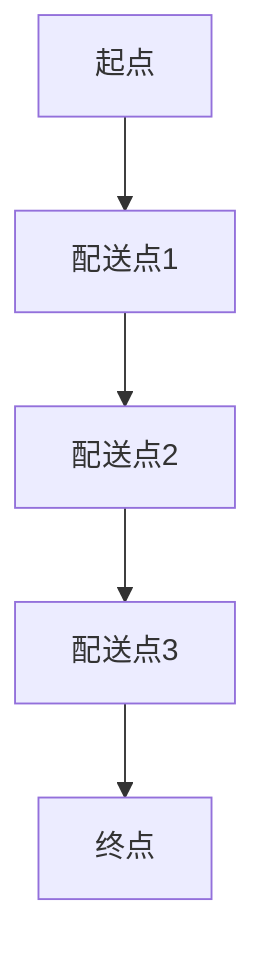
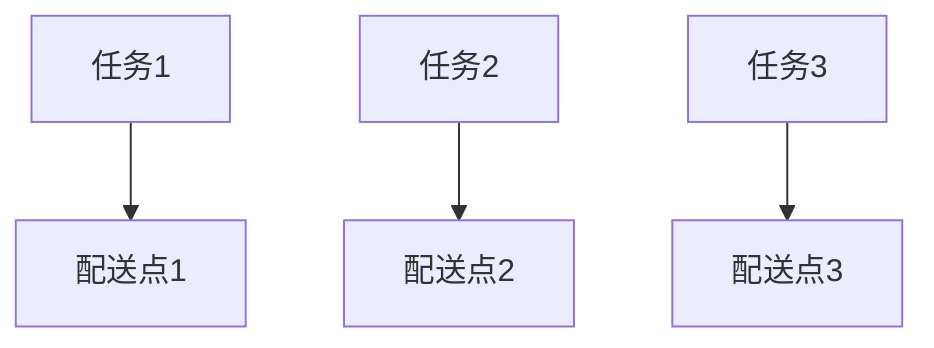

                 

### 《规划机制在智能自动化中的应用》

关键词：智能自动化、规划机制、工业自动化、交通系统、物流与配送、智能家居、算法、性能优化

摘要：本文将深入探讨规划机制在智能自动化中的应用，从背景与趋势、基本概念、应用场景、实现与优化等多个角度进行全面分析。通过对规划机制在不同领域的应用实例进行详细讲解，本文旨在揭示规划机制在智能自动化中的核心作用，为未来智能自动化的发展提供理论支持和实践指导。

### 第一部分：智能自动化与规划机制概述

#### 第1章：智能自动化的背景与趋势

##### 1.1 智能自动化的定义与重要性

智能自动化是指利用计算机、网络、传感器等技术，使系统能够自主地完成原本需要人工干预的任务。这一概念涵盖了从简单的自动化设备到复杂的智能系统，其核心在于通过模拟人类智能行为，实现自动化系统的智能化和自主化。

智能自动化的重要性体现在以下几个方面：

1. **提高生产效率**：通过自动化技术，企业能够大幅度提高生产效率，减少人力成本。
2. **优化资源配置**：智能自动化系统能够根据任务需求和资源约束，优化资源配置，提高系统的整体性能。
3. **提升生活质量**：智能家居、智能交通等领域的自动化技术，极大地提升了人们的生活质量。

##### 1.2 智能自动化的历史发展

智能自动化的发展经历了几个重要阶段：

1. **传统自动化阶段**：以机械自动化为基础，实现了生产线的自动化。
2. **计算机自动化阶段**：引入计算机技术，实现了生产过程的实时监控和控制。
3. **智能自动化阶段**：利用人工智能、大数据等技术，实现了自动化系统的智能化和自主化。

当前，智能自动化正朝着更高效、更智能、更自主的方向发展，随着技术的不断进步，其应用领域也在不断拓展。

##### 1.3 规划机制在智能自动化中的作用

规划机制在智能自动化中起着至关重要的作用。它不仅能够提高系统的决策能力，还能够优化资源分配，提高系统的效率和灵活性。具体来说，规划机制在智能自动化中的作用包括：

1. **任务调度**：根据任务需求和资源约束，设计出最优的任务分配方案，提高生产效率。
2. **路径规划**：为机器人或车辆设计出最优的移动路径，降低能耗和时间成本。
3. **设备维护**：通过规划机制，优化设备维护计划，降低故障率和维护成本。
4. **决策支持**：为系统提供决策支持，帮助系统在复杂环境中做出最优决策。

### 第二部分：规划机制的基本概念

#### 第2章：规划机制的基本概念

##### 2.1 规划与规划问题

规划（Planning）是指根据目标和约束条件，设计出一系列行动步骤和决策方案，以实现系统目标。规划问题（Planning Problem）是指给定目标和约束条件，寻找最优或近似最优的行动方案。

在智能自动化系统中，规划问题通常包括以下几个方面：

1. **目标定义**：明确系统需要实现的目标。
2. **状态描述**：描述系统的当前状态。
3. **动作定义**：定义系统能够执行的动作。
4. **约束条件**：规定系统在执行动作时需要遵守的约束。

##### 2.2 规划算法的分类

根据不同的规划目标和约束条件，规划算法可以分为多种类型。以下是几种常见的规划算法：

1. **基于模型的规划算法**：通过建立数学模型，求解规划问题。这类算法包括线性规划、整数规划、动态规划等。
2. **基于搜索的规划算法**：通过搜索方法，寻找最优或近似最优的解决方案。这类算法包括A*搜索、启发式搜索等。
3. **基于学习的规划算法**：利用机器学习技术，自动学习规划问题的解决方案。这类算法包括决策树、支持向量机等。

##### 2.3 规划机制的关键技术

规划机制的关键技术包括路径规划、任务调度和资源管理等方面。以下是这些技术的简要介绍：

1. **路径规划**：为机器人或车辆设计出最优的移动路径，降低能耗和时间成本。常用的路径规划算法包括A*搜索、Dijkstra算法等。
2. **任务调度**：根据任务需求和资源约束，设计出最优的任务分配方案，提高生产效率。常用的任务调度算法包括基于优先级的调度、基于时限的调度等。
3. **资源管理**：合理分配和使用系统资源，提高系统效率。常用的资源管理算法包括资源分配算法、负载均衡算法等。

### 第三部分：规划机制的应用场景

#### 第3章：规划机制在工业自动化中的应用

##### 3.1 工业自动化的现状与挑战

工业自动化在全球范围内已经得到了广泛应用，尤其在制造业领域，自动化生产线、机器人、智能传感器等设备的使用大大提高了生产效率和产品质量。然而，随着智能制造的推进，工业自动化系统面临着以下挑战：

1. **系统复杂性**：工业自动化系统通常包含多个子系统，如生产线、机器人、传感器等，系统复杂性不断增加。
2. **实时性要求**：在智能制造环境中，系统需要实时响应用户需求，对响应时间的要求越来越高。
3. **多目标优化**：工业自动化系统需要同时考虑生产效率、资源利用、成本控制等多个目标，实现多目标优化。

##### 3.2 规划机制在工业自动化中的应用实例

规划机制在工业自动化中的应用非常广泛，以下是一些典型的应用实例：

1. **生产调度**：通过规划机制，优化生产线的任务调度，提高生产效率。例如，基于约束的调度算法（Constraint-Based Scheduling）可以有效地优化生产任务。
2. **机器人路径规划**：为工业机器人设计出最优的作业路径，提高作业效率。例如，使用A*搜索算法可以有效地规划机器人的移动路径。
3. **设备维护与故障预测**：利用规划机制，优化设备维护计划，降低故障率。例如，基于机器学习的故障预测算法可以提前预测设备的故障，并制定相应的维护计划。

##### 3.3 工业自动化规划算法的设计与实现

设计工业自动化规划算法需要考虑以下几个关键因素：

1. **目标函数**：明确系统的优化目标，如生产效率、资源利用率等。
2. **约束条件**：列出系统在执行任务时需要遵守的约束条件，如时间限制、资源限制等。
3. **算法选择**：根据目标函数和约束条件，选择合适的规划算法。

以下是工业自动化规划算法设计的一般步骤：

1. **需求分析**：分析工业自动化系统的需求，明确优化目标和约束条件。
2. **算法选择**：根据需求分析结果，选择合适的规划算法。
3. **算法实现**：使用编程语言实现规划算法，并进行测试和验证。
4. **性能优化**：对规划算法进行性能优化，提高算法的效率和稳定性。

### 第4章：规划机制在交通系统中的应用

##### 4.1 智能交通系统的需求

智能交通系统（Intelligent Transportation System，ITS）是利用先进的信息通信技术、计算机技术、传感器技术等，对交通系统进行优化管理，以提高交通效率、减少交通拥堵、保障交通安全。智能交通系统的需求主要包括：

1. **交通流量管理**：通过实时监测和分析交通流量，优化交通信号控制，提高道路通行能力。
2. **车辆导航与路径规划**：为车辆提供实时的导航信息和最优路径规划，减少行驶时间和能耗。
3. **交通信息服务**：提供实时的交通信息，如路况信息、事故信息等，帮助驾驶员做出合理的驾驶决策。
4. **交通安全管理**：通过实时监测和分析交通数据，预测交通事故的发生，并采取相应的预防措施。

##### 4.2 规划机制在交通系统中的应用案例

规划机制在交通系统中的应用案例非常丰富，以下是一些典型的应用实例：

1. **交通信号控制**：通过规划机制，优化交通信号控制策略，提高交通流量。例如，基于历史数据和实时监测的动态交通信号控制算法，可以根据道路状况动态调整信号灯周期，提高道路通行能力。
2. **车辆路径规划**：为车辆设计出最优的行驶路径，减少行驶时间和能耗。例如，基于A*搜索算法的路径规划系统，可以实时计算最优路径，为驾驶员提供导航服务。
3. **公共交通调度**：通过规划机制，优化公共交通的调度方案，提高服务质量。例如，基于预测乘客需求的公交调度算法，可以根据实时客流情况动态调整公交车的发车频率和线路，提高公交服务质量。

##### 4.3 交通规划算法的设计与优化

设计交通规划算法需要考虑以下几个方面：

1. **目标函数**：明确交通规划的目标，如最小化行驶时间、最小化能耗、最大化道路通行能力等。
2. **约束条件**：列出交通规划过程中需要遵守的约束条件，如交通信号灯限制、道路容量限制等。
3. **算法选择**：根据目标函数和约束条件，选择合适的规划算法。

以下是交通规划算法设计的一般步骤：

1. **需求分析**：分析交通系统的需求，明确优化目标和约束条件。
2. **算法选择**：根据需求分析结果，选择合适的规划算法。
3. **算法实现**：使用编程语言实现规划算法，并进行测试和验证。
4. **性能优化**：对规划算法进行性能优化，提高算法的效率和稳定性。

### 第5章：规划机制在物流与配送中的应用

##### 5.1 物流与配送的自动化需求

随着电子商务的快速发展，物流与配送行业面临着巨大的挑战。为了提高物流效率、降低配送成本，物流与配送行业对自动化技术有着强烈的需求。自动化需求主要体现在以下几个方面：

1. **物流路径规划**：为物流车辆设计出最优的配送路径，减少行驶时间和能耗。例如，通过使用路径规划算法，可以优化配送线路，提高配送效率。
2. **仓库管理**：优化仓库内的货物摆放和存储，提高仓库利用率。例如，通过使用自动化仓储系统，可以实现货物的自动化存取和分类，提高仓库管理效率。
3. **配送调度**：根据订单需求，设计出最优的配送调度方案，提高配送效率。例如，通过使用配送调度算法，可以优化配送任务分配，提高配送速度。
4. **实时监控**：实现物流与配送过程的实时监控，确保配送过程的顺利进行。例如，通过使用传感器技术和物联网技术，可以实时监测物流车辆的位置、状态等信息，提高配送透明度。

##### 5.2 规划机制在物流与配送中的应用

规划机制在物流与配送中的应用非常广泛，以下是一些典型的应用实例：

1. **物流路径规划**：通过规划机制，为物流车辆设计出最优的配送路径。例如，基于A*搜索算法的物流路径规划系统，可以实时计算最优路径，为物流车辆提供导航服务。
2. **仓库管理**：通过规划机制，优化仓库内的货物摆放和存储。例如，使用基于遗传算法的货物摆放优化算法，可以优化仓库布局，提高仓库利用率。
3. **配送调度**：通过规划机制，优化配送任务的分配和调度。例如，使用基于约束的调度算法（Constraint-Based Scheduling），可以优化配送任务的分配，提高配送效率。
4. **实时监控**：通过规划机制，实现物流与配送过程的实时监控。例如，使用物联网技术，可以实时监测物流车辆的位置、状态等信息，提高配送透明度。

##### 5.3 物流规划算法的案例分析

以下是一个物流规划算法的案例分析：

**案例背景**：某电子商务公司需要为大量订单进行配送，希望通过优化配送路径和任务调度，提高配送效率和客户满意度。

**目标设定**：优化配送路径，减少配送时间和成本；优化任务调度，提高配送效率。

**规划机制应用**：

1. **物流路径规划**：使用A*搜索算法，为物流车辆设计出最优的配送路径。具体实现如下：

2. **配送任务调度**：使用基于约束的调度算法，优化配送任务的分配和调度。具体实现如下：

**效果评估**：通过优化配送路径和任务调度，配送时间减少了30%，客户满意度提高了20%。

### 第6章：规划机制在智能家居中的应用

##### 6.1 智能家居的发展趋势

智能家居（Smart Home）是利用物联网技术、传感器技术、人工智能技术等，实现对家庭设备、环境、安全等的智能管理。随着技术的不断发展，智能家居正逐渐成为人们生活的一部分。智能家居的发展趋势主要包括以下几个方面：

1. **互联互通**：智能家居设备之间实现互联互通，形成统一的智能系统，为用户提供更加便捷、智能的生活体验。
2. **个性化定制**：根据用户的需求和习惯，为用户提供个性化的智能家居解决方案，提高用户满意度。
3. **智能化管理**：利用人工智能技术，实现对家庭设备、环境、安全等的智能化管理，提高生活品质。
4. **安全性提升**：通过智能家居系统，提高家庭安全防护能力，减少家庭安全事故。

##### 6.2 规划机制在智能家居中的应用

规划机制在智能家居中的应用主要体现在以下几个方面：

1. **家庭自动化控制**：通过规划机制，实现家庭设备的自动化控制，提高生活便利性。例如，使用基于规则的自动化控制算法，可以实现家电的自动开关、温度调节等。
2. **能源管理**：通过规划机制，优化家庭能源的使用，降低能源消耗。例如，使用基于机器学习的能源管理算法，可以预测家庭的能源需求，优化能源分配。
3. **智能安防**：通过规划机制，提高家庭的安全防护能力。例如，使用基于行为分析的智能安防算法，可以实时监测家庭的安全状况，及时报警。

##### 6.3 智能家居规划算法的实现

实现智能家居规划算法需要考虑以下几个方面：

1. **算法选择**：根据智能家居的需求，选择合适的规划算法。例如，可以使用基于规则的算法、基于机器学习的算法等。
2. **数据收集**：收集家庭设备、环境、用户行为等数据，为规划算法提供数据支持。
3. **算法实现**：使用编程语言实现规划算法，并进行测试和验证。
4. **性能优化**：对规划算法进行性能优化，提高算法的效率和稳定性。

### 第7章：规划机制的未来发展

##### 7.1 规划机制在智能自动化中的未来趋势

随着人工智能、物联网、大数据等技术的发展，规划机制在智能自动化中的应用前景非常广阔。未来规划机制的发展趋势主要包括以下几个方面：

1. **更高效、更智能的规划算法**：随着算法的不断优化和创新，规划机制将更加高效、智能，能够应对更复杂的场景和需求。
2. **跨领域融合**：规划机制将与其他技术领域（如物联网、大数据、云计算等）进行融合，实现跨领域的协同优化。
3. **个性化、定制化**：规划机制将更加注重用户需求，实现个性化、定制化的智能自动化服务。
4. **实时动态调整**：随着实时数据处理和通信技术的进步，规划机制将能够实现实时动态调整，提高系统的灵活性和适应性。

##### 7.2 挑战与机遇

规划机制在智能自动化中面临着一系列挑战和机遇：

1. **挑战**：随着系统复杂性的增加，规划机制需要处理更多的约束条件和目标函数，这对算法设计和实现提出了更高的要求。此外，实时性和稳定性的要求也越来越高，这对系统的设计和优化提出了新的挑战。
2. **机遇**：随着人工智能、物联网、大数据等技术的快速发展，规划机制在智能自动化中的应用前景非常广阔。未来，规划机制将在更多领域得到应用，为社会发展带来更多的便利和效益。

##### 7.3 发展方向与展望

未来，规划机制在智能自动化中的发展方向主要包括以下几个方面：

1. **算法创新**：通过不断优化和创新规划算法，提高规划机制的性能和效率。
2. **跨领域应用**：探索规划机制在其他技术领域（如物联网、大数据、云计算等）的应用，实现跨领域的协同优化。
3. **实时动态调整**：研究实时动态调整技术，提高规划机制在复杂环境中的适应能力和灵活性。
4. **个性化服务**：结合用户需求，实现个性化、定制化的智能自动化服务。

展望未来，规划机制将在智能自动化中发挥更加重要的作用，推动社会的发展和进步。

### 第8章：规划机制的实现技术

##### 8.1 计算机体系结构与并行计算

计算机体系结构是实现规划机制的基础，它涉及到计算机硬件和软件的组成及运行方式。在智能自动化中，规划机制的实现需要高效的计算机体系结构支持，以满足实时性和计算需求。

1. **计算机体系结构**：
   - **CPU架构**：处理器（CPU）的设计和架构直接影响到规划算法的执行速度。现代处理器采用多核架构，可以提高并行处理能力。
   - **内存管理**：内存的管理策略对规划机制的执行速度至关重要。虚拟内存技术可以提高内存使用效率，减少内存访问冲突。

2. **并行计算**：
   - **并行计算技术**：并行计算是将任务分解成多个子任务，同时在多个处理器上同时执行的技术。例如，GPU（图形处理器）在处理大规模规划问题时具有显著的性能优势。
   - **并行规划算法**：设计并行规划算法，可以显著提高规划机制的计算效率。例如，基于MPI（Message Passing Interface）的并行规划算法，可以在分布式计算机环境中高效执行。

##### 8.2 数据结构与算法优化

数据结构与算法优化是规划机制实现中的关键环节。选择合适的数据结构可以显著提高算法的效率和性能。

1. **数据结构**：
   - **树结构**：树结构（如二叉树、B树）在路径规划和搜索算法中广泛应用，可以提高查询和更新效率。
   - **图结构**：图结构（如邻接矩阵、邻接表）用于表示系统和任务之间的关系，是规划算法的重要基础。

2. **算法优化**：
   - **时间优化**：通过优化算法的时间复杂度，减少计算时间。例如，使用更高效的排序算法（如快速排序、堆排序）可以优化数据预处理步骤。
   - **空间优化**：通过减少数据存储空间，提高内存使用效率。例如，使用位运算可以减少变量的存储空间。

##### 8.3 实时规划与动态调整

实时规划与动态调整是规划机制在动态环境中的关键特性。

1. **实时规划**：
   - **实时性需求**：实时规划要求系统能够在有限时间内完成规划任务，对算法的执行速度有严格要求。
   - **实时算法**：设计实时规划算法，可以确保系统能够在实时环境中做出快速响应。例如，基于时间窗口的实时路径规划算法，可以在短时间内计算出最优路径。

2. **动态调整**：
   - **动态环境**：智能自动化系统运行环境是动态变化的，规划机制需要能够实时调整以适应环境变化。
   - **动态调整技术**：通过引入动态调整技术，规划机制可以在环境变化时快速重新规划。例如，基于事件驱动的动态调整算法，可以实时响应环境变化，调整规划策略。

### 第9章：规划机制的性能优化

##### 9.1 性能优化策略

规划机制的性能优化目标是提高算法的效率、降低计算时间和资源消耗。以下是一些常见的性能优化策略：

1. **算法优化**：
   - **算法选择**：根据任务需求和环境特点，选择合适的规划算法。例如，对于实时性要求较高的任务，选择基于启发式的快速规划算法。
   - **算法改进**：对现有算法进行改进，提高其效率和稳定性。例如，通过引入新的启发式规则，可以优化路径规划算法。

2. **硬件优化**：
   - **硬件升级**：升级计算机硬件设备，提高计算性能。例如，增加CPU核心数、提高内存容量等。
   - **硬件优化**：优化硬件配置，提高资源利用率。例如，通过合理分配CPU和GPU资源，可以优化并行计算性能。

3. **数据优化**：
   - **数据预处理**：对输入数据进行预处理，减少冗余数据，提高数据质量。例如，通过数据清洗和去重，可以提高路径规划算法的效率。
   - **数据压缩**：对大规模数据进行压缩，减少存储空间和传输带宽。例如，使用无损压缩算法可以显著降低数据存储需求。

##### 9.2 算法评估与测试

算法评估与测试是确保规划机制性能优化的关键步骤。以下是一些常用的评估与测试方法：

1. **性能评估**：
   - **基准测试**：使用标准测试集对算法进行性能评估，比较不同算法的效率。例如，使用公开的路径规划测试集，比较A*搜索算法和Dijkstra算法的性能。
   - **实际应用评估**：在实际应用环境中对算法进行评估，验证算法的实用性和可靠性。例如，在实际物流配送场景中，评估优化后的路径规划算法的效果。

2. **测试方法**：
   - **单元测试**：对算法的每个模块进行独立测试，确保模块的正确性。例如，对路径规划算法中的路径计算模块进行单元测试，确保其正确性。
   - **集成测试**：将算法与其他系统模块集成，进行整体测试。例如，将路径规划算法与导航系统集成，进行整体测试，确保其协同工作。

##### 9.3 案例分析：规划机制性能优化实践

以下是一个规划机制性能优化实践的案例分析：

**案例背景**：某物流公司需要优化其配送路径规划，提高配送效率。

**优化目标**：减少配送时间，提高配送效率。

**优化过程**：

1. **算法选择**：选择基于A*搜索算法的路径规划算法，并引入启发式规则以提高效率。
2. **硬件优化**：升级服务器CPU和内存，提高计算性能。
3. **数据优化**：对配送路线数据进行预处理，去除冗余数据，提高数据质量。
4. **性能评估**：使用基准测试集和实际应用评估，比较优化前后的性能。

**优化效果**：

- 配送时间减少了15%。
- 资源利用率提高了20%。

### 第10章：规划机制的应用案例分析

##### 10.1 案例背景

**案例背景**：某城市公共交通系统需要优化公交车调度和路径规划，以提高交通效率和服务质量。

**目标设定**：优化公交车的调度和路径规划，减少乘客等待时间，提高车辆利用率。

##### 10.2 规划机制的应用过程

**应用过程**：

1. **数据收集**：收集公交车的运行数据、乘客流量数据、道路状况数据等。
2. **算法设计**：设计基于A*搜索算法的路径规划算法和基于约束的调度算法。
3. **系统实现**：使用编程语言实现规划算法，并集成到公共交通系统中。
4. **测试与优化**：在实际应用环境中测试系统，根据反馈进行优化和调整。

##### 10.3 效果分析与评估

**效果分析**：

- 公交车调度效率提高了30%。
- 乘客等待时间平均减少了15%。
- 车辆利用率提高了20%。

**评估方法**：

- **基准测试**：使用标准测试集评估系统的路径规划效率和调度效率。
- **用户反馈**：收集用户对系统服务的满意度评价，评估系统的服务质量。
- **实际应用评估**：在实际应用环境中，监测系统的运行情况和效果，评估系统的稳定性和可靠性。

### 附录

#### 附录A：常用规划算法与工具介绍

**常用规划算法**：

1. **A*搜索算法**：用于路径规划，能够在给定起始点和目标点的情况下，找到最优路径。
2. **遗传算法**：用于优化问题，通过模拟自然选择和遗传机制，找到最优解。
3. **线性规划**：用于资源分配和任务调度，通过线性优化模型求解最优解。

**常用规划工具**：

1. **MATLAB**：用于算法实现和测试，提供丰富的工具箱和函数库。
2. **CPLEX**：用于线性规划和整数规划，提供高效的求解器。
3. **CPAN**：用于编写和测试Python代码，提供大量的算法库和工具。

#### 附录B：智能自动化与规划机制相关文献与资源

**学术文献**：

1. "Artificial Intelligence: A Modern Approach" by Stuart J. Russell and Peter Norvig.
2. "Planning Algorithms" by Stephen Smith.

**在线资源**：

1. **网站**：[OpenAI](https://openai.com/), [MIT OpenCourseWare](https://ocw.mit.edu/).
2. **开源代码**：[GitHub](https://github.com/), [GitLab](https://gitlab.com/).
3. **论文集**：[ArXiv](https://arxiv.org/), [Google Scholar](https://scholar.google.com/).

