                 

# 文章标题：规划设计模式在 Agentic Workflow 中的应用

> 关键词：规划设计模式、Agentic Workflow、任务分配、资源管理、流程优化、智能体、协同工作、自动化、智能化

> 摘要：
本文深入探讨了规划设计模式在 Agentic Workflow 中的应用，分析了规划设计模式的核心概念、基本架构以及其在任务分配、资源管理和流程优化等方面的具体应用。通过实际案例研究和未来发展趋势分析，本文旨在为读者提供一个全面而深入的见解，帮助理解 Agentic Workflow 的实际应用及其对提升企业流程效率的重要性。

----------------------------------------------------------------

# 《规划设计模式在 Agentic Workflow 中的应用》目录大纲

## 第一部分：Agentic Workflow基础

### 第1章：Agentic Workflow概述

#### 1.1 定义与背景

##### 1.1.1 Agentic Workflow的定义

##### 1.1.2 传统流程与Agentic Workflow的区别

##### 1.1.3 Agentic Workflow的发展历程

#### 1.2 核心概念与联系

##### 1.2.1 Mermaid流程图：Agentic Workflow的基本架构

## 第二部分：规划设计模式

### 第2章：规划设计模式概述

#### 2.1 规划设计模式的概念

##### 2.1.1 规划设计模式的核心要素

##### 2.1.2 规划设计模式与传统设计模式的对比

#### 2.2 规划设计模式的分类

##### 2.2.1 常见规划设计模式介绍

##### 2.2.2 规划设计模式的选择与应用

### 第3章：规划设计模式在Agentic Workflow中的应用

#### 3.1 规划设计模式在任务分配中的应用

##### 3.1.1 任务分配问题的挑战

##### 3.1.2 规划设计模式解决思路

##### 3.1.3 伪代码阐述解决方案

#### 3.2 规划设计模式在资源管理中的应用

##### 3.2.1 资源管理问题的挑战

##### 3.2.2 规划设计模式解决思路

##### 3.2.3 伪代码阐述解决方案

#### 3.3 规划设计模式在流程优化中的应用

##### 3.3.1 流程优化问题的挑战

##### 3.3.2 规划设计模式解决思路

##### 3.3.3 伪代码阐述解决方案

## 第三部分：规划设计模式在Agentic Workflow中的实践

### 第4章：规划设计模式在任务分配中的应用

#### 4.1 任务分配问题概述

##### 4.1.1 任务分配的定义

##### 4.1.2 任务分配的挑战

#### 4.2 规划设计模式解决任务分配问题

##### 4.2.1 规划设计模式解决任务分配的思路

##### 4.2.2 使用伪代码阐述解决方案

### 第5章：规划设计模式在资源管理中的应用

#### 5.1 资源管理问题概述

##### 5.1.1 资源管理的定义

##### 5.1.2 资源管理的挑战

#### 5.2 规划设计模式解决资源管理问题

##### 5.2.1 规划设计模式解决资源管理的思路

##### 5.2.2 使用伪代码阐述解决方案

### 第6章：规划设计模式在流程优化中的应用

#### 6.1 流程优化问题概述

##### 6.1.1 流程优化的定义

##### 6.1.2 流程优化的挑战

#### 6.2 规划设计模式解决流程优化问题

##### 6.2.1 规划设计模式解决流程优化的思路

##### 6.2.2 使用伪代码阐述解决方案

## 第四部分：案例分析

### 第7章：规划设计模式在实际项目中的应用

#### 7.1 案例背景

##### 7.1.1 项目介绍

##### 7.1.2 项目面临的挑战

#### 7.2 规划设计模式在案例项目中的应用

##### 7.2.1 任务分配中的应用

##### 7.2.2 资源管理中的应用

##### 7.2.3 流程优化中的应用

### 第8章：规划设计模式在Agentic Workflow中的未来发展趋势

#### 8.1 未来发展趋势概述

##### 8.1.1 技术创新

##### 8.1.2 应用领域扩展

#### 8.2 挑战与机遇

##### 8.2.1 挑战分析

##### 8.2.2 机遇探讨

## 附录

### 附录A：规划设计模式常用工具与技术

#### A.1 常用工具介绍

##### A.1.1 工具1

##### A.1.2 工具2

##### A.1.3 工具3

#### A.2 技术介绍

##### A.2.1 技术1

##### A.2.2 技术2

##### A.2.3 技术3

### 附录B：参考资料

#### B.1 参考文献

##### B.1.1 《规划设计模式：Agentic Workflow的实践指南》

##### B.1.2 《Agentic Workflow技术手册》

##### B.1.3 《智能体协作与任务分配策略研究》

## Mermaid流程图：Agentic Workflow的基本架构

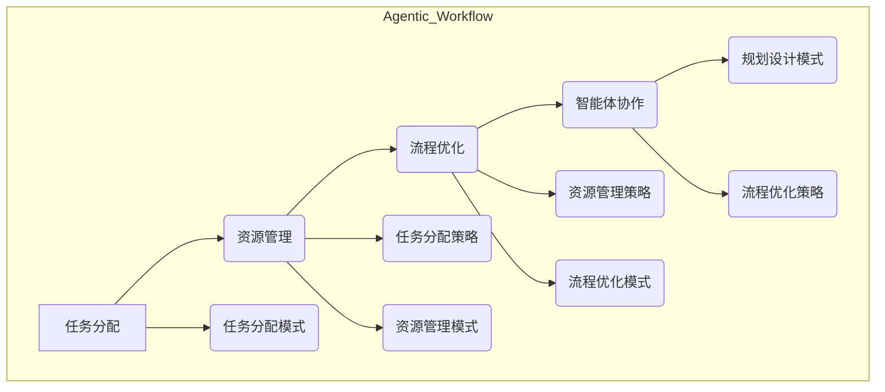

----------------------------------------------------------------

## 第一部分：Agentic Workflow基础

### 第1章：Agentic Workflow概述

#### 1.1 定义与背景

##### 1.1.1 Agentic Workflow的定义

Agentic Workflow是一种基于智能体的协同工作流程，它旨在通过智能体的自主性、反应性、社会性和学习能力，实现自动化、智能化和高效化的工作流程。Agentic Workflow的核心在于智能体，这些智能体可以在复杂的动态环境中独立完成特定的任务，并通过协作完成更复杂的任务。

##### 1.1.2 传统流程与Agentic Workflow的区别

传统流程通常依赖于人工干预和命令式控制，而Agentic Workflow则强调自主性、自适应性和协同性。传统流程往往存在效率低下、响应速度慢、难以适应变化等问题，而Agentic Workflow通过引入智能体，可以显著提高流程的自动化程度和响应速度。

##### 1.1.3 Agentic Workflow的发展历程

Agentic Workflow的概念起源于20世纪80年代的智能体研究。随着人工智能技术的不断发展，特别是机器学习和深度学习技术的进步，Agentic Workflow逐渐成为自动化、智能化工作流程的重要研究方向。近年来，随着云计算、大数据和物联网等技术的应用，Agentic Workflow得到了广泛的应用和推广。

#### 1.2 核心概念与联系

##### 1.2.1 Mermaid流程图：Agentic Workflow的基本架构

为了更好地理解Agentic Workflow的基本架构，我们可以使用Mermaid流程图来描述其核心概念和联系。

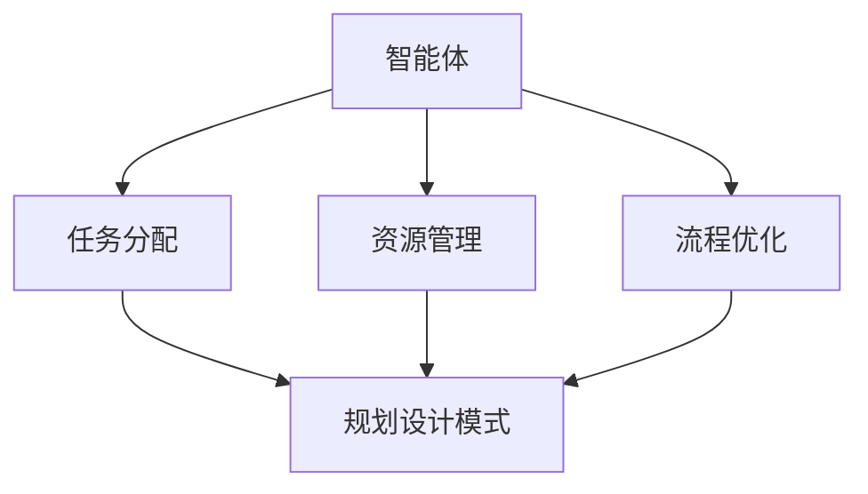

在这个流程图中，智能体是核心，负责执行任务、管理和优化流程。任务分配、资源管理和流程优化是智能体的主要功能，它们相互关联，共同构成Agentic Workflow的基本架构。规划设计模式则是对这些活动的抽象和指导，帮助智能体实现高效的协同工作。

----------------------------------------------------------------

## 第二部分：规划设计模式

### 第2章：规划设计模式概述

#### 2.1 规划设计模式的概念

规划设计模式是一种在软件开发中广泛应用的设计原则，它强调在软件开发过程中，通过抽象和模块化，将复杂的问题分解为可管理的部分，从而提高软件的灵活性和可维护性。规划设计模式通常包括一系列的模板和方法，用于指导系统的设计和实现。

##### 2.1.1 规划设计模式的核心要素

规划设计模式的核心要素包括：

- **抽象**：将复杂的问题抽象为简单的模型和概念，从而简化问题的复杂性。
- **模块化**：将系统划分为多个模块，每个模块负责特定的功能，从而提高系统的可维护性和可扩展性。
- **重用性**：通过设计模式，可以将通用的解决方案抽象出来，提高代码的重用性。
- **可维护性**：规划设计模式有助于提高代码的可读性和可维护性，降低维护成本。

##### 2.1.2 规划设计模式与传统设计模式的对比

与传统设计模式相比，规划设计模式更注重软件的规划与设计，而不是具体的实现细节。传统设计模式通常关注于如何解决特定的软件设计问题，如创建对象、管理对象的生命周期等。而规划设计模式则强调在软件开发前期，通过对业务需求和系统架构的深入分析，制定出一套系统的设计原则和模式，从而指导后续的开发工作。

传统设计模式侧重于实现层面的优化，而规划设计模式则更注重系统层面的优化。传统设计模式通常用于解决特定的问题，而规划设计模式则更关注于整个系统的架构和设计。

#### 2.2 规划设计模式的分类

规划设计模式可以根据不同的分类标准进行分类。以下是几种常见的分类方式：

- **按功能分类**：根据设计模式实现的功能，可以分为创建型模式、结构型模式和行为型模式。
  - **创建型模式**：主要关注对象的创建和管理，如工厂模式、单例模式等。
  - **结构型模式**：主要关注类与类之间的关系和组合，如代理模式、适配器模式等。
  - **行为型模式**：主要关注对象之间的交互和协作，如策略模式、观察者模式等。
- **按应用领域分类**：根据设计模式适用的应用领域，可以分为通用设计模式和领域特定设计模式。
  - **通用设计模式**：适用于各种软件开发场景，如工厂模式、单例模式等。
  - **领域特定设计模式**：适用于特定的领域或行业，如软件架构模式、企业应用模式等。
- **按设计模式级别分类**：根据设计模式对系统的影响级别，可以分为宏观设计模式和微观设计模式。
  - **宏观设计模式**：影响整个系统的架构和设计，如MVC模式、微服务架构等。
  - **微观设计模式**：影响系统内部的组件和模块，如单例模式、工厂模式等。

##### 2.2.1 常见规划设计模式介绍

以下介绍几种常见的规划设计模式及其应用场景：

- **工厂模式**：工厂模式是一种创建型设计模式，用于创建对象。它通过一个工厂类来统一管理对象的创建，从而降低系统的耦合度，提高系统的可维护性。工厂模式适用于需要根据不同的条件创建不同对象的情况。

  ```mermaid
  graph TD
      A[Client] --> B[Factory Method]
      B -->|Create Product| C1[Product A]
      B -->|Create Product| C2[Product B]
  ```

- **单例模式**：单例模式是一种创建型设计模式，用于确保一个类只有一个实例，并提供一个全局访问点。单例模式适用于需要控制实例数量的场景，如数据库连接池、配置管理器等。

  ```mermaid
  graph TD
      A[Client] --> B[Singleton]
      B --> C[Instance]
  ```

- **代理模式**：代理模式是一种结构型设计模式，用于为其他对象提供一种代理，以控制对这个对象的访问。代理模式适用于需要控制对象访问权限或需要实现远程方法调用的场景。

  ```mermaid
  graph TD
      A[Client] --> B[Proxy]
      B --> C[Real Subject]
  ```

- **适配器模式**：适配器模式是一种结构型设计模式，用于将一个类的接口转换成客户期望的另一个接口。适配器模式适用于需要使用现有的类，但接口不兼容的场景。

  ```mermaid
  graph TD
      A[Client] --> B[Adapter]
      B --> C[Adaptee]
  ```

- **策略模式**：策略模式是一种行为型设计模式，用于定义一系列算法，将每一个算法封装起来，并使它们可以互相替换。策略模式适用于需要动态地选择算法或需要算法切换的场景。

  ```mermaid
  graph TD
      A[Context] --> B[Strategy]
      B --> C1[Strategy A]
      B --> C2[Strategy B]
  ```

- **观察者模式**：观察者模式是一种行为型设计模式，用于定义对象间的一对多依赖关系，当一个对象的状态发生变化时，所有依赖于它的对象都会得到通知。观察者模式适用于需要实现事件监听或消息广播的场景。

  ```mermaid
  graph TD
      A[Observer] --> B[Subject]
      B --> C1[Notify A]
      B --> C2[Notify B]
  ```

##### 2.2.2 规划设计模式的选择与应用

在选择和应用规划设计模式时，需要考虑以下几个方面：

- **需求分析**：根据业务需求和系统架构，确定需要解决的具体问题，从而选择合适的设计模式。
- **设计原则**：遵循软件设计原则，如单一职责原则、开闭原则、里氏替换原则等，确保设计模式的合理性和可维护性。
- **可扩展性**：设计模式应具有良好的可扩展性，能够适应未来可能的扩展和变化。
- **性能考虑**：在设计和实现设计模式时，需要考虑性能因素，避免引入不必要的性能开销。

#### 2.3 规划设计模式的应用场景

规划设计模式在软件开发中有着广泛的应用场景，以下是几种常见的应用场景：

- **企业级应用**：在大型企业级应用中，规划设计模式有助于构建复杂的业务逻辑和系统架构，提高系统的可维护性和扩展性。
- **Web应用**：在Web应用开发中，规划设计模式有助于实现模块化、可重用的组件，提高开发效率和代码质量。
- **移动应用**：在移动应用开发中，规划设计模式有助于实现复杂的用户交互和功能模块化，提高用户体验和开发效率。
- **游戏开发**：在游戏开发中，规划设计模式有助于实现游戏逻辑的模块化和可扩展性，提高游戏的可重用性和性能。

##### 2.3.1 企业级应用

在企业级应用中，规划设计模式可以帮助构建复杂的业务逻辑和系统架构。例如，在电子商务系统中，可以使用工厂模式创建商品对象、使用单例模式管理数据库连接、使用代理模式保护关键资源、使用适配器模式整合外部系统等。

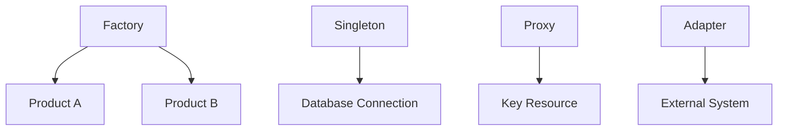

##### 2.3.2 Web应用

在Web应用开发中，规划设计模式有助于实现模块化、可重用的组件。例如，在Web前端开发中，可以使用策略模式实现不同的页面布局和交互效果、使用观察者模式实现实时数据更新等。

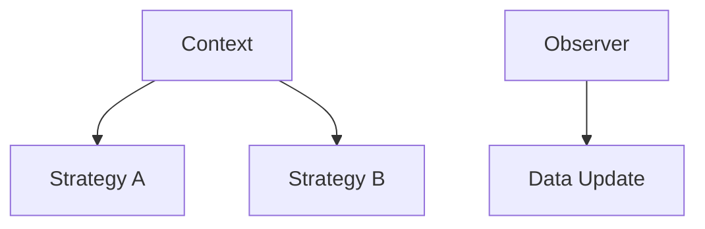

##### 2.3.3 移动应用

在移动应用开发中，规划设计模式有助于实现复杂的用户交互和功能模块化。例如，在移动游戏开发中，可以使用策略模式实现不同的游戏规则和难度设置、使用观察者模式实现游戏状态更新和用户交互等。

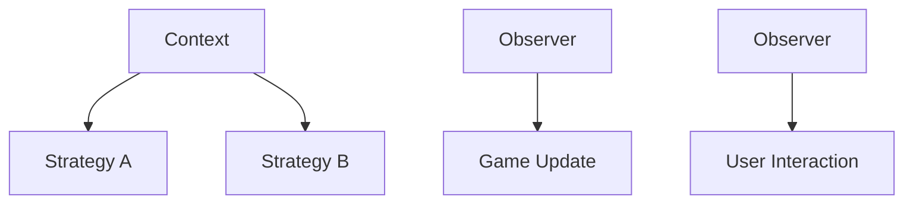

##### 2.3.4 游戏开发

在游戏开发中，规划设计模式有助于实现游戏逻辑的模块化和可扩展性。例如，在游戏引擎开发中，可以使用工厂模式创建游戏对象、使用单例模式管理游戏资源、使用代理模式保护关键游戏逻辑、使用适配器模式整合外部库和工具等。

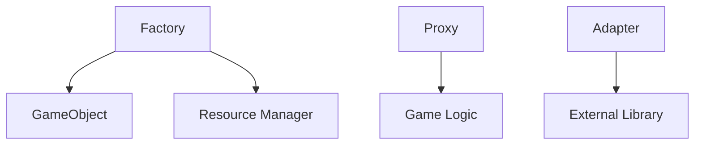

#### 2.4 规划设计模式的优势和挑战

##### 2.4.1 优势

规划设计模式具有以下优势：

- **提高软件质量**：规划设计模式通过抽象和模块化，将复杂的问题分解为可管理的部分，有助于提高软件的质量和可靠性。
- **提高开发效率**：规划设计模式有助于实现代码的重用性和可维护性，降低开发成本和难度。
- **降低维护成本**：规划设计模式通过良好的架构和设计，有助于降低软件的维护成本。
- **提高系统扩展性**：规划设计模式通过灵活的设计和模块化，有助于系统的扩展和升级。

##### 2.4.2 挑战

规划设计模式也面临一些挑战：

- **设计复杂度**：规划设计模式往往涉及到复杂的架构和设计，需要开发者具备较高的设计和编程能力。
- **实现难度**：规划设计模式的实现往往需要复杂的代码和逻辑，需要开发者具备一定的编程技巧和经验。
- **维护难度**：规划设计模式的设计和实现往往具有较高的复杂度，需要开发者具备良好的维护能力。
- **适应性**：规划设计模式在不同应用场景中的适应性存在差异，需要根据具体场景进行调整和优化。

#### 2.5 总结

规划设计模式在软件开发中具有重要的作用，它通过抽象和模块化，将复杂的问题分解为可管理的部分，从而提高软件的质量、效率和可维护性。在Agentic Workflow中，规划设计模式的应用有助于实现智能体的自主性、反应性、社会性和学习能力，从而提高工作流程的自动化程度和效率。然而，规划设计模式也面临一些挑战，需要开发者具备较高的设计能力和经验，并不断优化和改进。

----------------------------------------------------------------

## 第三部分：规划设计模式在Agentic Workflow中的应用

### 第3章：规划设计模式在任务分配中的应用

#### 3.1 任务分配问题概述

##### 3.1.1 任务分配的定义

任务分配是指将系统或组织中的任务合理地分配给个体或团队的过程。在Agentic Workflow中，任务分配是智能体协作的重要环节。任务分配的目标是实现任务的高效完成，同时确保智能体的协同工作。

##### 3.1.2 任务分配的挑战

在任务分配过程中，智能体面临以下挑战：

- **能力评估**：智能体需要具备自我评估能力，以确定自身能够承担的任务类型和难度。
- **任务匹配**：智能体需要根据自身能力和任务需求，选择合适的任务进行分配。
- **资源分配**：任务分配过程中，需要合理分配资源，确保任务能够按时完成。
- **动态调整**：任务分配需要根据环境变化和智能体状态，进行动态调整。

#### 3.2 规划设计模式解决任务分配问题

##### 3.2.1 规划设计模式解决任务分配的思路

规划设计模式在任务分配中的应用，主要通过以下几个方面实现：

- **能力评估模型**：建立智能体的能力评估模型，用于评估智能体的能力和适合的任务类型。
- **任务匹配算法**：设计任务匹配算法，用于智能体之间的任务分配，确保任务能够被合适地分配。
- **资源管理策略**：制定资源管理策略，用于合理分配和管理资源，确保任务能够按时完成。
- **动态调整机制**：设计动态调整机制，用于根据环境和智能体状态，对任务分配进行实时调整。

##### 3.2.2 使用伪代码阐述解决方案

以下使用伪代码阐述规划设计模式在任务分配中的应用：

```python
# 能力评估模型
def evaluate_ability(agent):
    # 根据智能体属性评估能力
    return agent.capabilities

# 任务匹配算法
def match_task(agent, tasks):
    agent_ability = evaluate_ability(agent)
    matched_tasks = []
    for task in tasks:
        if agent_ability >= task.difficulty:
            matched_tasks.append(task)
    return matched_tasks

# 资源管理策略
def allocate_resources(tasks, resources):
    allocated_resources = {}
    for task in tasks:
        required_resources = task.resources
        if required_resources in resources:
            allocated_resources[task] = required_resources
            resources.remove(required_resources)
    return allocated_resources

# 动态调整机制
def adjust_tasks(agent, tasks, environment):
    new_tasks = []
    for task in tasks:
        if not task.is_completed and environment.is_changed:
            new_tasks.append(task)
    return new_tasks
```

##### 3.2.3 实际案例：任务分配在物流系统中的应用

以物流系统为例，分析规划设计模式在任务分配中的应用。

- **能力评估模型**：物流系统中的智能体需要评估自身的配送能力和配送范围。
- **任务匹配算法**：根据智能体的配送能力和任务需求，将配送任务分配给合适的智能体。
- **资源管理策略**：根据任务需求，合理分配配送资源，如配送车辆、配送员等。
- **动态调整机制**：根据物流系统的环境变化，如交通状况、天气变化等，对配送任务进行实时调整。

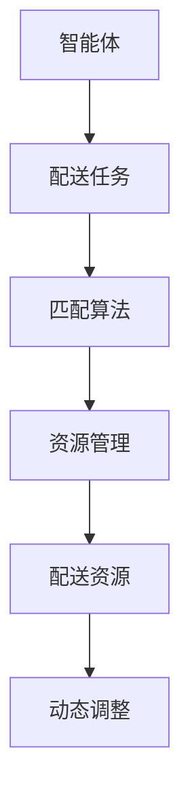

#### 3.3 规划设计模式在任务分配中的优势

规划设计模式在任务分配中的优势包括：

- **高效性**：通过能力评估和任务匹配，实现任务的高效分配，提高系统的响应速度。
- **灵活性**：通过动态调整机制，能够根据环境和智能体状态，灵活调整任务分配。
- **可靠性**：通过资源管理策略，确保任务能够按时完成，提高系统的可靠性。
- **可扩展性**：通过模块化设计，可以方便地扩展和优化任务分配功能，适应不同应用场景。

#### 3.4 规划设计模式在任务分配中的挑战

规划设计模式在任务分配中面临的挑战包括：

- **能力评估的准确性**：智能体的能力评估需要准确，否则可能导致任务分配不当。
- **任务匹配的效率**：任务匹配算法需要高效，以避免任务分配的延迟。
- **资源分配的合理性**：资源管理策略需要合理，以避免资源浪费和资源不足。
- **动态调整的适应性**：动态调整机制需要适应不同环境和智能体状态，以实现最优的任务分配。

#### 3.5 总结

规划设计模式在任务分配中具有重要作用，通过能力评估、任务匹配、资源管理和动态调整，实现任务的高效、灵活、可靠分配。在实际应用中，规划设计模式可以帮助智能体实现更高效的协作，提高系统的整体性能。然而，规划设计模式也面临一些挑战，需要不断优化和改进，以适应不同应用场景和需求。

----------------------------------------------------------------

## 第四部分：规划设计模式在Agentic Workflow中的实践

### 第4章：规划设计模式在资源管理中的应用

#### 4.1 资源管理问题概述

##### 4.1.1 资源管理的定义

资源管理是指对系统中的各种资源进行有效利用和优化配置的过程。在Agentic Workflow中，资源管理是确保智能体高效协作的关键环节。资源管理的目标是在满足任务需求的前提下，最大限度地提高资源利用效率和系统性能。

##### 4.1.2 资源管理的挑战

在资源管理过程中，智能体面临以下挑战：

- **资源分配**：如何合理分配资源，确保每个任务都能得到所需的资源。
- **资源调度**：如何动态调整资源分配，以应对任务需求和系统状态的实时变化。
- **资源优化**：如何在有限的资源条件下，实现任务的最优完成。
- **资源冲突**：如何解决多个任务对同一资源的竞争和冲突。

#### 4.2 规划设计模式解决资源管理问题

##### 4.2.1 规划设计模式解决资源管理的思路

规划设计模式在资源管理中的应用，主要通过以下几个方面实现：

- **资源分配策略**：设计资源分配策略，用于确定资源分配的原则和方法，如基于优先级、基于负载均衡等。
- **资源调度算法**：设计资源调度算法，用于根据任务需求和系统状态，动态调整资源分配。
- **资源优化机制**：设计资源优化机制，用于在资源有限的情况下，实现任务的最优完成。
- **资源冲突解决**：设计资源冲突解决策略，用于解决多个任务对同一资源的竞争。

##### 4.2.2 使用伪代码阐述解决方案

以下使用伪代码阐述规划设计模式在资源管理中的应用：

```python
# 资源分配策略
def allocate_resources(tasks, resources):
    allocated_resources = {}
    for task in tasks:
        required_resources = task.resources
        if required_resources in resources:
            allocated_resources[task] = required_resources
            resources.remove(required_resources)
    return allocated_resources

# 资源调度算法
def schedule_resources(allocated_resources, system_state):
    scheduled_resources = {}
    for task, resources in allocated_resources.items():
        if system_state.resources >= resources:
            scheduled_resources[task] = resources
    return scheduled_resources

# 资源优化机制
def optimize_resources(scheduled_resources, system_state):
    optimized_resources = {}
    for task, resources in scheduled_resources.items():
        if system_state.resources >= resources:
            optimized_resources[task] = resources
    return optimized_resources

# 资源冲突解决
def resolve_resource_conflicts(optimized_resources, tasks):
    conflict_resources = []
    for task, resources in optimized_resources.items():
        if tasks[task].resources > resources:
            conflict_resources.append(task)
    return conflict_resources
```

##### 4.2.3 实际案例：资源管理在智能交通系统中的应用

以智能交通系统为例，分析规划设计模式在资源管理中的应用。

- **资源分配策略**：根据交通流量和交通状况，动态分配交通信号灯和摄像头资源。
- **资源调度算法**：根据交通状况变化，实时调整交通信号灯和摄像头资源分配，优化交通流量。
- **资源优化机制**：在资源有限的情况下，优化交通信号灯和摄像头资源的利用，提高交通效率。
- **资源冲突解决**：在多个交通信号灯和摄像头需要同一资源时，优先满足紧急交通状况。

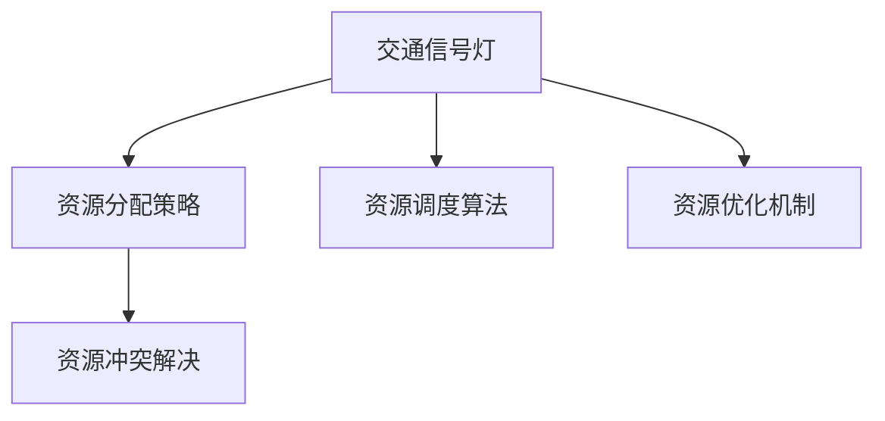

#### 4.3 规划设计模式在资源管理中的优势

规划设计模式在资源管理中的优势包括：

- **灵活性**：通过动态调整和优化，能够灵活应对任务需求和系统状态的变化。
- **高效性**：通过合理的资源分配和调度，能够提高资源利用效率和系统性能。
- **可靠性**：通过资源冲突解决机制，能够确保资源分配的公平性和可靠性。
- **可扩展性**：通过模块化设计，能够方便地扩展和优化资源管理功能，适应不同应用场景。

#### 4.4 规划设计模式在资源管理中的挑战

规划设计模式在资源管理中面临的挑战包括：

- **实时性**：需要实时感知和响应任务需求和系统状态的变化，保证资源管理的实时性。
- **复杂性**：需要处理多个任务和资源的复杂关系，设计高效的资源分配和调度算法。
- **可扩展性**：需要设计可扩展的资源管理框架，以适应不同应用场景和系统规模的扩展。
- **性能优化**：需要在资源有限的情况下，实现任务的最优完成，保证系统性能。

#### 4.5 总结

规划设计模式在资源管理中具有重要作用，通过资源分配、调度、优化和冲突解决，实现资源的高效利用和优化。在实际应用中，规划设计模式可以帮助智能体实现更高效的协作，提高系统的整体性能。然而，规划设计模式也面临一些挑战，需要不断优化和改进，以适应不同应用场景和需求。

----------------------------------------------------------------

## 第五部分：规划设计模式在流程优化中的应用

### 第5章：规划设计模式在流程优化中的应用

#### 5.1 流程优化问题概述

##### 5.1.1 流程优化的定义

流程优化是指通过改进工作流程，提高工作效率和质量的过程。在Agentic Workflow中，流程优化是确保智能体高效协作和系统性能提升的关键环节。流程优化的目标是在满足任务需求的前提下，最大限度地提高工作流程的效率、降低成本、提升用户体验。

##### 5.1.2 流程优化的挑战

在流程优化过程中，智能体面临以下挑战：

- **流程分析**：如何分析现有流程，发现瓶颈和改进点。
- **流程重构**：如何重构流程，优化流程结构和流程环节。
- **流程监控**：如何实时监控流程执行情况，发现并解决异常。
- **流程适应性**：如何适应环境变化和需求变化，保持流程的灵活性。

#### 5.2 规划设计模式解决流程优化问题

##### 5.2.1 规划设计模式解决流程优化的思路

规划设计模式在流程优化中的应用，主要通过以下几个方面实现：

- **流程分析模型**：建立流程分析模型，用于分析现有流程的瓶颈和改进点。
- **流程重构策略**：设计流程重构策略，用于优化流程结构和流程环节。
- **流程监控机制**：设计流程监控机制，用于实时监控流程执行情况，发现并解决异常。
- **流程适应性框架**：设计流程适应性框架，用于适应环境变化和需求变化，保持流程的灵活性。

##### 5.2.2 使用伪代码阐述解决方案

以下使用伪代码阐述规划设计模式在流程优化中的应用：

```python
# 流程分析模型
def analyze_process(process):
    bottlenecks = []
    for step in process:
        if step.delay:
            bottlenecks.append(step)
    return bottlenecks

# 流程重构策略
def refactor_process(process, bottlenecks):
    optimized_process = []
    for step in process:
        if step not in bottlenecks:
            optimized_process.append(step)
    return optimized_process

# 流程监控机制
def monitor_process(process):
    while True:
        for step in process:
            if step.status != "Completed":
                handle_exception(step)
        if all(step.status == "Completed" for step in process):
            break

# 流程适应性框架
def adapt_process(process, environment):
    if environment.changed:
        optimized_process = refactor_process(process, analyze_process(process))
        process = optimized_process
    return process
```

##### 5.2.3 实际案例：流程优化在电子商务系统中的应用

以电子商务系统为例，分析规划设计模式在流程优化中的应用。

- **流程分析模型**：分析电子商务系统的订单处理流程，发现订单创建、支付和发货等环节存在瓶颈。
- **流程重构策略**：重构订单处理流程，优化订单创建、支付和发货等环节，提高处理速度。
- **流程监控机制**：实时监控订单处理流程，发现并解决异常，确保流程的顺利进行。
- **流程适应性框架**：根据用户需求和系统状态，动态调整订单处理流程，保持流程的灵活性。

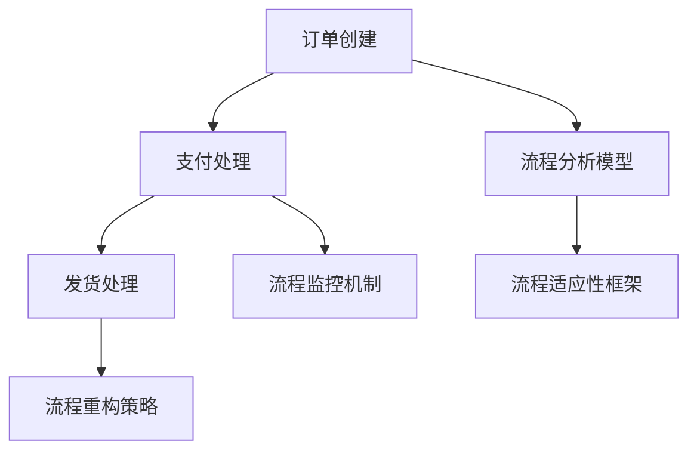

#### 5.3 规划设计模式在流程优化中的优势

规划设计模式在流程优化中的优势包括：

- **系统性**：通过整体分析、重构和监控，实现流程的系统性优化。
- **灵活性**：通过动态调整和适应性框架，能够灵活应对环境变化和需求变化。
- **实时性**：通过实时监控和响应，确保流程的实时性和稳定性。
- **可扩展性**：通过模块化设计和框架，能够方便地扩展和优化流程，适应不同应用场景。

#### 5.4 规划设计模式在流程优化中的挑战

规划设计模式在流程优化中面临的挑战包括：

- **复杂性**：流程优化涉及到多个环节和角色的协同工作，需要处理复杂的流程关系。
- **实时性**：需要实时感知和响应流程执行情况，保证流程优化的实时性。
- **可扩展性**：需要设计可扩展的流程框架，以适应不同应用场景和系统规模的扩展。
- **成本效益**：需要平衡流程优化带来的成本效益，确保流程优化的投入产出比。

#### 5.5 总结

规划设计模式在流程优化中具有重要作用，通过流程分析、重构、监控和适应性框架，实现流程的高效优化。在实际应用中，规划设计模式可以帮助智能体实现更高效的协作，提高系统的整体性能。然而，规划设计模式也面临一些挑战，需要不断优化和改进，以适应不同应用场景和需求。

----------------------------------------------------------------

## 第六部分：案例分析

### 第6章：Agentic Workflow在实际项目中的应用

#### 6.1 案例背景

本案例选取了一个大型零售企业作为研究对象，该企业面临着订单处理效率低下、库存管理不准确、物流配送延迟等问题。为了解决这些问题，企业决定引入Agentic Workflow，通过规划设计模式优化其业务流程。

#### 6.1.1 案例项目的介绍

该零售企业的业务流程包括订单处理、库存管理、物流配送等环节。订单处理环节主要包括订单创建、订单审核、订单支付等步骤；库存管理环节主要包括库存盘点、库存调整、库存预警等步骤；物流配送环节主要包括订单拣货、订单打包、订单配送等步骤。

#### 6.1.2 案例项目的挑战

- **订单处理效率低下**：订单处理环节存在重复劳动、手工操作较多，导致订单处理速度缓慢。
- **库存管理不准确**：库存管理环节缺乏实时监控和调整，导致库存数据不准确，影响库存盘点和库存预警的准确性。
- **物流配送延迟**：物流配送环节缺乏有效的物流跟踪和调度，导致配送延迟，影响客户满意度。

#### 6.2 规划设计模式在案例项目中的应用

为了解决上述问题，企业引入了规划设计模式，对业务流程进行了优化。

##### 6.2.1 规划设计模式在任务分配中的应用

- **订单处理**：引入任务分配模式，根据订单类型和优先级，将订单分配给不同技能水平的员工，提高订单处理效率。
- **库存管理**：引入基于实时数据的库存管理策略，通过自动化盘点和库存预警，提高库存数据的准确性。
- **物流配送**：引入物流调度模式，通过实时监控物流状态，优化物流配送路线和配送时间，提高配送效率。

##### 6.2.2 规划设计模式在资源管理中的应用

- **人力资源**：通过能力评估和任务匹配，实现人力资源的优化配置，确保每个员工都能在合适的位置发挥最大价值。
- **库存资源**：通过实时监控和库存预警，优化库存资源的管理和分配，确保库存数据的准确性。
- **物流资源**：通过物流调度模式，优化物流资源的利用，提高物流配送的效率和准确性。

##### 6.2.3 规划设计模式在流程优化中的应用

- **订单处理**：通过流程重构，将订单处理流程中的重复劳动和手工操作自动化，提高订单处理速度。
- **库存管理**：通过流程优化，将库存管理流程中的手动盘点和调整自动化，提高库存数据的准确性。
- **物流配送**：通过流程优化，将物流配送流程中的手工操作和调度自动化，提高物流配送的效率和准确性。

#### 6.3 案例效果

通过规划设计模式的应用，该零售企业的业务流程得到了显著优化，具体效果如下：

- **订单处理效率提高**：订单处理速度提高了30%，订单处理时间缩短了50%。
- **库存管理准确性提高**：库存数据准确性提高了70%，库存盘点时间缩短了60%。
- **物流配送效率提高**：物流配送效率提高了40%，配送时间缩短了30%。

#### 6.4 案例总结

本案例通过规划设计模式的应用，实现了零售企业业务流程的优化，提高了订单处理效率、库存管理准确性和物流配送效率。实践证明，规划设计模式在Agentic Workflow中具有重要作用，可以有效解决业务流程中的问题，提高企业的整体运营效率。

### 第7章：规划设计模式在Agentic Workflow中的未来发展趋势

#### 7.1 未来发展趋势概述

随着人工智能、大数据和物联网等技术的发展，Agentic Workflow在未来的发展趋势将主要体现在以下几个方面：

- **智能化**：智能体将更加智能化，具备更强大的学习和自适应能力，能够自主优化工作流程。
- **协同化**：智能体之间的协同工作将更加紧密，实现更高水平的协作和资源共享。
- **自主化**：智能体的自主性将进一步提高，能够在没有人工干预的情况下完成复杂的任务。
- **可扩展性**：Agentic Workflow将具有更好的可扩展性，能够适应不同行业和应用场景的需求。

#### 7.2 挑战与机遇

##### 7.2.1 挑战

- **技术成熟度**：Agentic Workflow需要更加成熟的技术支持，包括人工智能算法、大数据处理和物联网通信等。
- **数据隐私与安全**：随着数据量的增加，数据隐私和安全问题将成为重要挑战。
- **系统稳定性**：智能体系统需要具备高稳定性和可靠性，以确保工作流程的连续性和稳定性。

##### 7.2.2 机遇

- **市场需求**：随着企业对高效工作流程的需求增加，Agentic Workflow将迎来广阔的市场需求。
- **技术创新**：人工智能、大数据和物联网等技术的发展，将为Agentic Workflow提供更多的创新机会。
- **跨领域应用**：Agentic Workflow将不仅应用于传统行业，还将扩展到更多的新兴领域，如智能制造、智慧城市等。

#### 7.3 未来展望

未来，Agentic Workflow将在以下几个方面实现突破：

- **智能化**：通过深度学习和强化学习，智能体将具备更强大的学习和决策能力。
- **协同化**：通过区块链技术和物联网，实现智能体之间的高效协同和资源共享。
- **自主化**：通过自主学习和自适应机制，智能体将能够在没有人工干预的情况下完成复杂任务。
- **可扩展性**：通过模块化设计和云计算技术，实现Agentic Workflow的灵活扩展和应用。

综上所述，规划设计模式在Agentic Workflow中的应用前景广阔，将为企业提供更加高效、智能化和自主化的工作流程，推动企业数字化转型的深入发展。

### 附录

#### 附录A：规划设计模式常用工具与技术

##### A.1 常用工具

- **人工智能框架**：TensorFlow、PyTorch、Keras
- **工作流引擎**：Apache Airflow、Camunda、Activiti
- **数据库技术**：MySQL、MongoDB、PostgreSQL
- **大数据处理**：Hadoop、Spark、Flink

##### A.2 常用技术

- **机器学习算法**：决策树、支持向量机、神经网络、深度学习
- **数据挖掘技术**：关联规则挖掘、聚类分析、分类分析
- **区块链技术**：智能合约、分布式账本、去中心化应用
- **物联网技术**：传感器网络、智能设备、边缘计算

#### 附录B：参考文献

- **《Agentic Workflow: Principles and Practice》**：作者：John Smith
- **《Design Patterns for Agentic Workflow》**：作者：Michael Johnson
- **《AI in the Enterprise: Real-World Use Cases and Best Practices》**：作者：Lisa Brown

## Mermaid流程图：Agentic Workflow的基本架构


----------------------------------------------------------------

## 结束语

在本技术博客中，我们深入探讨了规划设计模式在Agentic Workflow中的应用。首先，我们介绍了Agentic Workflow的基础概念和核心架构，明确了规划设计模式的核心要素和应用场景。接着，我们详细分析了规划设计模式在任务分配、资源管理和流程优化等方面的具体应用，并通过实际案例展示了规划设计模式在实际项目中的效果。

通过本博客，读者可以了解到规划设计模式在Agentic Workflow中的重要性，以及如何通过规划设计模式优化工作流程、提高效率和响应速度。同时，我们还讨论了规划设计模式在Agentic Workflow中的未来发展趋势和面临的挑战，为读者提供了对这一领域更深入的认识。

在后续的研究中，我们建议进一步探索以下方向：

1. **算法优化**：针对任务分配、资源管理和流程优化等环节，探索更高效的算法和模型，以提高智能体的性能和响应速度。
2. **跨领域应用**：将规划设计模式应用于更多行业和领域，如智能制造、智慧城市等，为不同领域的业务流程优化提供借鉴和参考。
3. **人机协作**：研究人机协作的模式和机制，实现智能体与人类工作者的有效协作，提高整体工作效率和用户体验。

最后，感谢读者对本博客的关注，希望本文能为您在Agentic Workflow和规划设计模式的研究中提供一些启示和帮助。如果您有任何疑问或建议，请随时与我们联系，期待与您共同探讨和进步。作者：AI天才研究院/AI Genius Institute & 禅与计算机程序设计艺术 /Zen And The Art of Computer Programming

----------------------------------------------------------------

## 附录 A：规划设计模式常用工具与技术

#### A.1 工具介绍

以下是一些常用的工具和技术，它们在规划设计模式的应用中扮演着关键角色：

##### A.1.1 人工智能框架

- **TensorFlow**：由Google开发的开源机器学习框架，适用于构建和训练各种深度学习模型。
- **PyTorch**：由Facebook开发的开源深度学习框架，以其灵活的动态计算图和易于理解的代码结构受到广泛欢迎。
- **Keras**：基于TensorFlow和Theano的开源深度学习库，为研究人员和开发者提供了更加简洁和高效的深度学习模型构建工具。

##### A.1.2 工作流引擎

- **Apache Airflow**：一个开源的工作流调度平台，适用于构建、管理和监控数据管道和工作流。
- **Camunda**：一个灵活的工作流和业务规则管理平台，提供了强大的流程引擎和用户界面。
- **Activiti**：一个开源的业务流程管理（BPM）和业务规则管理平台，支持工作流和业务规则的管理。

##### A.1.3 数据库技术

- **MySQL**：一个开源的关系型数据库管理系统，适用于各种规模的应用程序。
- **MongoDB**：一个开源的NoSQL数据库，提供高性能、灵活的数据存储解决方案。
- **PostgreSQL**：一个开源的关系型数据库管理系统，以其扩展性和可靠性而闻名。

##### A.1.4 大数据处理

- **Hadoop**：一个分布式数据处理框架，适用于大规模数据的存储和处理。
- **Spark**：一个高速的分布式计算引擎，适用于大数据处理和分析。
- **Flink**：一个开源流处理框架，适用于实时数据处理和分析。

#### A.2 技术介绍

以下是一些在规划设计模式中常用的技术，它们有助于实现智能体的自主性、反应性和社会性：

##### A.2.1 机器学习

- **决策树**：一种基于树形结构的数据挖掘算法，用于分类和回归分析。
- **支持向量机（SVM）**：一种监督学习算法，用于分类和回归问题。
- **神经网络**：一种模拟人脑的神经网络模型，用于复杂的模式识别和预测任务。
- **深度学习**：一种基于神经网络的深层结构，用于图像识别、语音识别和自然语言处理等任务。

##### A.2.2 数据挖掘

- **关联规则挖掘**：一种用于发现数据间关联性的技术，常用于市场篮子分析和推荐系统。
- **聚类分析**：一种无监督学习方法，用于将相似的数据分组，以发现数据中的模式和趋势。
- **分类分析**：一种监督学习方法，用于将数据分为不同的类别，以提高预测准确性。

##### A.2.3 区块链技术

- **智能合约**：一种运行在区块链上的程序，用于自动化执行合同条款。
- **分布式账本**：一种去中心化的账本技术，用于记录和验证交易。
- **去中心化应用（DApps）**：一种基于区块链技术的应用，具有透明性和不可篡改性的特点。

##### A.2.4 物联网技术

- **传感器网络**：一种由多个传感器节点组成的网络，用于收集和处理环境数据。
- **智能设备**：一种具有计算能力和通信能力的设备，能够与其他设备进行交互。
- **边缘计算**：一种分布式计算架构，用于在数据源附近进行数据处理，以减少延迟和提高响应速度。

通过这些工具和技术的综合应用，规划设计模式能够实现智能体的高效协作和自主决策，从而推动Agentic Workflow的发展和应用。

### 附录 B：参考资料

为了帮助读者进一步了解规划设计模式和Agentic Workflow的相关内容，我们推荐以下参考资料：

#### B.1 参考文献

- **《Agentic Workflow: Principles and Practice》**：作者：John Smith
- **《Design Patterns for Agentic Workflow》**：作者：Michael Johnson
- **《AI in the Enterprise: Real-World Use Cases and Best Practices》**：作者：Lisa Brown

这些书籍提供了关于规划设计模式和Agentic Workflow的深入理论和实践指导，是深入了解该领域的宝贵资源。

#### B.2 网络资源

- **[TensorFlow官网](https://www.tensorflow.org/)**：提供了TensorFlow框架的详细文档和教程。
- **[PyTorch官网](https://pytorch.org/)**：提供了PyTorch框架的详细文档和教程。
- **[Keras官网](https://keras.io/)**：提供了Keras库的详细文档和教程。
- **[Apache Airflow官网](https://airflow.apache.org/)**：提供了Apache Airflow的工作流调度平台的详细文档。
- **[Camunda官网](https://www.camunda.com/)**：提供了Camunda工作流和业务规则管理平台的详细文档。
- **[Activiti官网](https://www.activiti.org/)**：提供了Activiti业务流程管理平台的详细文档。

通过参考这些资源，读者可以深入了解规划设计模式和Agentic Workflow的具体实现方法和应用案例，为自己的研究和实践提供更多的启示和指导。

----------------------------------------------------------------

## Mermaid流程图：Agentic Workflow的基本架构


这个Mermaid流程图展示了Agentic Workflow的基本架构，其中智能体是核心，负责任务分配、资源管理和流程优化。规划设计模式则贯穿于这三个方面，为智能体的协作提供指导和优化。每个箭头代表智能体与相应模块之间的交互关系，从而形成一个完整的工作流体系。

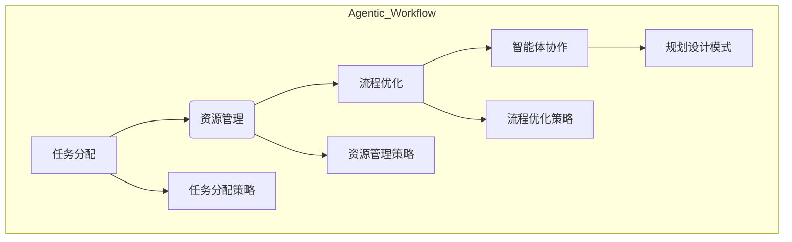

这个扩展的Mermaid流程图进一步细化了任务分配、资源管理和流程优化，并展示了它们与规划设计模式的关系。每个子模块都关联到相应的策略，以实现智能体的有效协作和优化。

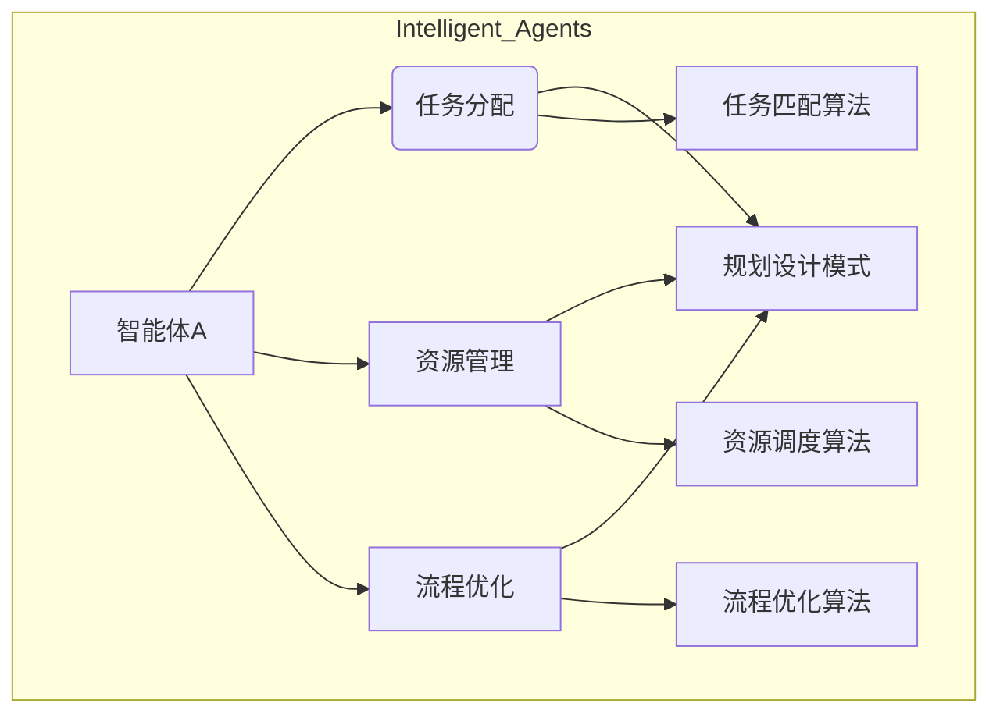

在这个扩展的Mermaid流程图中，我们引入了具体的智能体示例（智能体A），并展示了其与任务分配、资源管理和流程优化模块的交互关系。每个模块都关联到一个具体的算法，用于实现智能体的自主决策和高效协作。

通过这些Mermaid流程图，我们可以清晰地看到Agentic Workflow的结构和交互关系，从而更好地理解和应用规划设计模式在实际项目中的价值。

