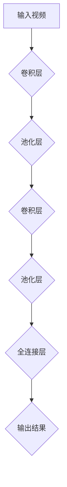
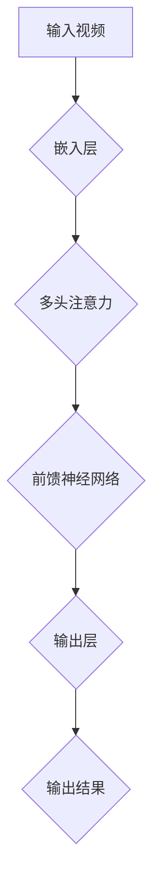
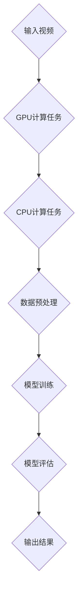
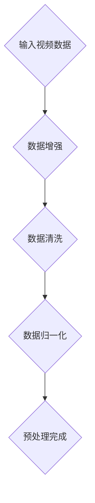
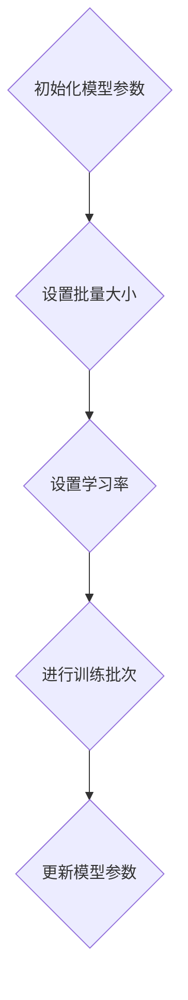
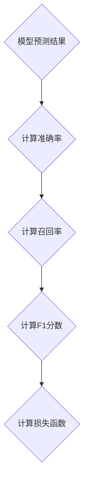
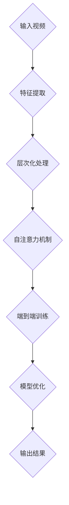

                 

### 文章标题

# 《视频大模型的创新粒子》

> 关键词：视频大模型、AI、神经网络、计算机视觉、深度学习、应用案例

> 摘要：本文深入探讨了视频大模型的概念、发展历史、核心技术、应用案例以及技术细节。通过一步步分析推理，本文旨在为广大读者提供一部全面、深入、实用的视频大模型技术指南，帮助读者掌握这一前沿技术。

### 目录

## 第1章 视频大模型概述

### 1.1 视频大模型的概念

#### 1.1.1 视频大模型的历史与发展

#### 1.1.2 视频大模型的核心特点

### 1.2 视频大模型的应用领域

#### 1.2.1 视频内容理解

#### 1.2.2 视频生成与合成

#### 1.2.3 视频增强与修复

### 1.3 视频大模型的研究现状与趋势

#### 1.3.1 研究热点与难点

#### 1.3.2 未来发展趋势

## 第2章 视频大模型核心技术

### 2.1 视频大模型的计算框架

#### 2.1.1 神经网络架构

#### 2.1.2 计算资源调度

### 2.2 视频大模型的训练方法

#### 2.2.1 数据预处理

#### 2.2.2 训练策略

#### 2.2.3 模型优化

### 2.3 视频大模型的评估与优化

#### 2.3.1 评估指标

#### 2.3.2 优化策略

## 第3章 视频大模型应用案例

### 3.1 视频内容理解应用

#### 3.1.1 视频分类

#### 3.1.2 视频检索

### 3.2 视频生成与合成应用

#### 3.2.1 视频生成

#### 3.2.2 视频合成

### 3.3 视频增强与修复应用

#### 3.3.1 视频增强

#### 3.3.2 视频修复

## 第4章 视频大模型算法原理与实现

### 4.1 视频大模型算法原理

#### 4.1.1 Mermaid 流程图

### 4.2 视频大模型算法实现

#### 4.2.1 伪代码

## 第5章 视频大模型数学模型与公式解析

### 5.1 数学模型

#### 5.1.1 公式解析

### 5.2 数学模型应用举例

#### 5.2.1 举例说明

## 第6章 视频大模型项目实战

### 6.1 项目实战

#### 6.1.1 开发环境搭建

#### 6.1.2 源代码实现

#### 6.1.3 代码解读与分析

## 附录

### A.1 主流深度学习框架对比

### A.2 视频大模型相关数据集

### A.3 视频大模型研究论文与资源链接

### B.1 参考文献

### B.2 致谢

## 第1章 视频大模型概述

### 1.1 视频大模型的概念

视频大模型（Video Large-scale Model）是指基于深度学习技术，对大量视频数据进行训练，提取视频特征并进行复杂处理的神经网络模型。这些模型通常具有数百亿甚至数万亿的参数，能够处理复杂的视频任务，如视频内容理解、视频生成、视频增强与修复等。

视频大模型的历史可以追溯到2012年，当时深度学习技术在图像识别领域取得了突破性进展，以AlexNet为代表的卷积神经网络（CNN）在ImageNet图像识别挑战赛上取得了惊人的准确率。随着计算能力的提升和大数据技术的进步，深度学习模型逐渐从静态图像扩展到动态视频领域。2018年，Google Research发布了Transformer模型，该模型在自然语言处理领域取得了显著成果，随后，视频领域的学者们开始探索将Transformer模型应用于视频数据处理。

### 1.1.1 视频大模型的历史与发展

1. **早期研究**：在深度学习技术出现之前，视频数据处理主要依赖于传统计算机视觉方法，如光流法、运动估计和视频编码等。这些方法在处理简单视频任务时具有一定的效果，但在面对复杂视频内容时，表现不佳。

2. **深度学习时代的到来**：随着深度学习技术的兴起，神经网络开始在视频数据处理领域发挥作用。最早的视频深度学习模型是基于CNN的，如C3D和I3D等，这些模型能够处理三维视频数据，提取视频特征。

3. **Transformer模型的引入**：2018年，Google Research发布了Transformer模型，该模型在自然语言处理领域取得了突破性进展。随后，学者们开始探索将Transformer模型应用于视频数据处理。Transformer模型的优势在于其并行计算能力，这使得它在处理长视频序列时表现更加出色。

4. **当前研究趋势**：近年来，视频大模型的研究热点包括视频内容理解、视频生成、视频增强与修复等。研究者们致力于提高模型的性能、降低计算成本，并探索新的算法和技术。

### 1.1.2 视频大模型的核心特点

1. **大规模参数**：视频大模型通常具有数百亿甚至数万亿的参数，这使得模型具有强大的表达能力，能够处理复杂视频任务。

2. **深度神经网络**：视频大模型采用深度神经网络结构，通过多层神经元的堆叠，实现对视频数据的层次化特征提取。

3. **并行计算能力**：Transformer模型引入了自注意力机制，使得视频大模型具有并行计算能力，能够在短时间内处理长视频序列。

4. **自适应学习**：视频大模型通过端到端训练，能够自动调整模型参数，优化模型性能，实现自适应学习。

5. **跨领域应用**：视频大模型不仅能够处理单一视频任务，还能够跨领域应用，如视频生成、视频增强与修复等。

### 1.2 视频大模型的应用领域

视频大模型在多个领域展现出了强大的应用潜力，以下列举几个主要应用领域：

#### 1.2.1 视频内容理解

视频内容理解是指从视频中提取有意义的信息，如视频分类、目标检测、场景分割等。视频大模型在视频内容理解领域取得了显著成果，如通过CNN和Transformer模型实现对视频的准确分类和目标检测。

#### 1.2.2 视频生成与合成

视频生成与合成是指利用视频大模型生成新的视频内容，如视频剪辑、虚拟现实、游戏制作等。通过生成对抗网络（GAN）和Transformer模型，研究者们实现了高质量的视频生成与合成。

#### 1.2.3 视频增强与修复

视频增强与修复是指通过视频大模型对低质量视频进行增强和修复，如去噪、超分辨率、老电影修复等。这些技术在实际应用中具有广泛的应用前景，如视频监控、电影制作等。

#### 1.2.4 其他应用领域

除了上述主要应用领域，视频大模型还应用于其他领域，如视频问答、视频标注、视频搜索等。这些应用正在不断推动视频大模型技术的发展。

### 1.3 视频大模型的研究现状与趋势

#### 1.3.1 研究热点与难点

1. **模型性能提升**：如何进一步提高视频大模型的性能，降低计算成本，是当前研究的热点问题。

2. **数据集构建**：高质量、大规模的视频数据集对于训练视频大模型至关重要。构建高质量的数据集是一个具有挑战性的问题。

3. **跨模态学习**：如何将视频数据与其他模态（如文本、音频等）进行融合，提高视频大模型的表达能力，是一个亟待解决的问题。

4. **模型解释性**：如何提高视频大模型的解释性，使其更加透明、易于理解，是一个重要的研究方向。

#### 1.3.2 未来发展趋势

1. **硬件加速**：随着硬件技术的不断发展，如GPU、TPU等，视频大模型的计算性能将得到进一步提升。

2. **模型压缩**：如何对视频大模型进行压缩，减少模型参数和计算量，是一个重要的研究方向。

3. **可解释性**：提高视频大模型的可解释性，使其在工业界和学术界得到更广泛的应用。

4. **跨领域应用**：视频大模型将在更多领域展现其应用潜力，如自动驾驶、医疗诊断、智能监控等。

通过上述分析，我们可以看出，视频大模型是一项具有重要应用价值的前沿技术。在未来的发展中，视频大模型将在更多领域发挥关键作用，推动人工智能技术的进步。接下来，我们将深入探讨视频大模型的核心技术，帮助读者更好地理解和应用这一技术。

### 第2章 视频大模型核心技术

在深入探讨视频大模型的应用之前，我们首先需要了解其背后的核心技术。视频大模型的核心技术主要包括计算框架、训练方法、评估与优化等。这些技术共同作用，确保了视频大模型的高性能和高精度。

#### 2.1 视频大模型的计算框架

视频大模型的计算框架是其核心组成部分，它决定了模型计算效率和处理能力。目前，主流的视频大模型计算框架主要包括基于卷积神经网络（CNN）和基于Transformer模型的方法。

##### 2.1.1 神经网络架构

神经网络架构是视频大模型计算框架的基础。在CNN架构中，卷积层、池化层和全连接层是核心组件。卷积层用于提取视频特征，池化层用于降低数据维度，全连接层用于分类和预测。以下是一个简单的CNN架构的Mermaid流程图：



在Transformer模型中，自注意力机制和多头注意力是核心组件。自注意力机制允许模型在处理每个视频帧时，关注其他视频帧的信息，从而提高特征提取能力。多头注意力则通过多个独立的注意力机制，进一步提高模型的表达能力。以下是一个简单的Transformer模型的Mermaid流程图：



##### 2.1.2 计算资源调度

计算资源调度是确保视频大模型高效运行的关键。在训练过程中，如何合理分配GPU、CPU和其他计算资源，以最大化计算效率，是一个重要问题。以下是一个简单的计算资源调度的Mermaid流程图：



#### 2.2 视频大模型的训练方法

训练方法是视频大模型性能的关键因素。视频大模型的训练方法主要包括数据预处理、训练策略和模型优化等。

##### 2.2.1 数据预处理

数据预处理是训练视频大模型的第一步，其目标是提高数据质量和模型训练效率。常见的数据预处理方法包括数据增强、数据清洗和数据归一化等。

1. **数据增强**：数据增强是通过生成新的数据样本，增加模型训练数据的多样性和泛化能力。常见的数据增强方法包括随机裁剪、旋转、缩放、翻转等。

2. **数据清洗**：数据清洗是去除数据集中的噪声和错误数据，提高数据质量。常见的数据清洗方法包括去除重复数据、填补缺失值和去除异常值等。

3. **数据归一化**：数据归一化是调整数据集中各个特征的数值范围，使其具有相同的尺度，以避免某些特征对模型训练产生过大的影响。常见的数据归一化方法包括最小-最大归一化和标准化等。

以下是一个简单的数据预处理流程的Mermaid流程图：



##### 2.2.2 训练策略

训练策略是指导模型训练过程的关键。常见的训练策略包括批量大小、学习率调整和训练批次等。

1. **批量大小**：批量大小是指每次训练过程中使用的样本数量。较大的批量大小可以提高模型训练的稳定性，但会降低训练速度；较小的批量大小可以提高训练速度，但可能会增加模型的方差。

2. **学习率调整**：学习率是模型在训练过程中更新参数的步长。适当的学习率可以加快模型收敛速度，但过大的学习率可能导致模型过拟合，而过小则可能导致训练时间过长。

3. **训练批次**：训练批次是指模型在训练过程中使用的样本批次数量。常用的训练批次包括批量训练、随机批量训练和分段批量训练等。

以下是一个简单的训练策略的Mermaid流程图：



##### 2.2.3 模型优化

模型优化是提高模型性能的重要手段。常见的模型优化方法包括正则化、Dropout和迁移学习等。

1. **正则化**：正则化是防止模型过拟合的一种方法，通过在损失函数中加入正则项，降低模型参数的复杂度。

2. **Dropout**：Dropout是一种在训练过程中随机丢弃部分神经元的方法，可以防止模型过拟合，提高模型的泛化能力。

3. **迁移学习**：迁移学习是利用预训练模型进行新任务训练的一种方法，通过在预训练模型的基础上微调参数，可以提高新任务的模型性能。

以下是一个简单的模型优化流程的Mermaid流程图：


#### 2.3 视频大模型的评估与优化

评估与优化是确保视频大模型性能的关键步骤。评估指标包括准确率、召回率、F1分数和损失函数等。

##### 2.3.1 评估指标

1. **准确率**：准确率是模型预测正确的样本数量与总样本数量的比值，用于衡量模型的分类性能。

2. **召回率**：召回率是模型预测正确的正样本数量与实际正样本数量的比值，用于衡量模型对正样本的检测能力。

3. **F1分数**：F1分数是准确率和召回率的调和平均值，用于衡量模型的综合性能。

4. **损失函数**：损失函数是评估模型预测结果与真实结果之间差距的函数，常用的损失函数包括均方误差（MSE）和交叉熵（CE）等。

以下是一个简单的评估指标的Mermaid流程图：



##### 2.3.2 优化策略

优化策略是提高模型性能的重要手段。常见的优化策略包括模型剪枝、量化、蒸馏和迁移学习等。

1. **模型剪枝**：模型剪枝是通过减少模型参数数量，降低模型复杂度和计算成本的一种方法。

2. **量化**：量化是将模型参数从浮点数表示转换为整数表示的一种方法，可以降低模型的存储和计算成本。

3. **蒸馏**：蒸馏是将一个大模型的知识传递给一个小模型的一种方法，可以提升小模型的性能。

4. **迁移学习**：迁移学习是利用预训练模型进行新任务训练的一种方法，可以节省训练时间和计算资源。

以下是一个简单的优化策略的Mermaid流程图：


通过上述分析，我们可以看到，视频大模型的核心技术涉及多个方面，包括计算框架、训练方法、评估与优化等。这些技术共同作用，确保了视频大模型的高性能和高精度。在接下来的章节中，我们将通过具体的案例，展示视频大模型在实际应用中的强大能力。

### 第3章 视频大模型应用案例

视频大模型在多个领域展现出了强大的应用潜力。本章节将深入探讨视频大模型在视频内容理解、视频生成与合成以及视频增强与修复等领域的应用案例，以帮助读者更好地理解视频大模型在现实世界中的实际应用。

#### 3.1 视频内容理解应用

视频内容理解是指从视频中提取有意义的信息，如视频分类、目标检测和场景分割等。视频大模型在视频内容理解领域取得了显著成果，以下列举两个实际应用案例。

##### 3.1.1 视频分类

视频分类是指根据视频内容将其归类到不同的类别中。视频大模型通过训练大量视频数据，可以学习到视频内容的特征，并准确地将新视频分类到正确的类别。

**案例1：YouTube视频分类**

YouTube是一个庞大的视频平台，每天上传的视频数量惊人。为了更好地管理和推荐视频，YouTube利用视频大模型对上传的视频进行分类。具体步骤如下：

1. **数据预处理**：首先对视频进行预处理，提取视频特征，如视频帧、音频信号等。

2. **模型训练**：利用预处理的视频数据，训练一个基于CNN或Transformer的视频分类模型。

3. **模型评估**：在测试集上评估模型性能，通过调整模型参数和超参数，优化模型性能。

4. **分类应用**：将训练好的模型应用于实际场景，对上传的视频进行分类，以便于管理和推荐。

以下是一个简单的视频分类的Mermaid流程图：


##### 3.1.2 视频检索

视频检索是指根据用户输入的关键词或视频片段，从大量视频中检索出相关的视频。视频大模型通过训练大量视频数据，可以学习到视频内容的特征，并准确地将新视频与数据库中的视频进行匹配。

**案例2：视频搜索引擎**

视频搜索引擎是一个典型的视频检索应用场景。为了提高视频检索的准确性和效率，视频搜索引擎利用视频大模型进行视频检索。具体步骤如下：

1. **数据预处理**：首先对用户输入的关键词或视频片段进行预处理，提取关键词特征和视频特征。

2. **模型训练**：利用预处理的用户输入和视频数据，训练一个基于CNN或Transformer的视频检索模型。

3. **模型评估**：在测试集上评估模型性能，通过调整模型参数和超参数，优化模型性能。

4. **检索应用**：将训练好的模型应用于实际场景，对用户输入的关键词或视频片段进行检索，返回相关的视频列表。

以下是一个简单的视频检索的Mermaid流程图：


#### 3.2 视频生成与合成应用

视频生成与合成是指利用视频大模型生成新的视频内容，如视频剪辑、虚拟现实和游戏制作等。以下列举两个实际应用案例。

##### 3.2.1 视频生成

视频生成是指利用视频大模型生成新的视频内容，如视频剪辑、动画制作等。视频大模型通过学习大量视频数据，可以生成高质量的视频内容。

**案例3：视频动画制作**

视频动画制作是一个需要大量人工操作的领域。为了提高制作效率和降低成本，视频动画制作公司利用视频大模型进行视频生成。具体步骤如下：

1. **数据预处理**：首先对视频数据进行分析，提取关键帧和角色动作特征。

2. **模型训练**：利用预处理的视频数据，训练一个基于GAN或Transformer的视频生成模型。

3. **模型评估**：在测试集上评估模型性能，通过调整模型参数和超参数，优化模型性能。

4. **生成应用**：将训练好的模型应用于实际场景，生成新的视频动画内容。

以下是一个简单的视频生成的Mermaid流程图：


##### 3.2.2 视频合成

视频合成是指利用视频大模型将不同的视频片段或图像组合成一个新的视频。视频大模型通过学习大量视频数据，可以生成高质量的视频合成效果。

**案例4：视频特效制作**

视频特效制作是一个创意和技术相结合的领域。为了提高制作效率和效果，视频特效制作公司利用视频大模型进行视频合成。具体步骤如下：

1. **数据预处理**：首先对视频数据进行处理，提取关键帧和特效元素特征。

2. **模型训练**：利用预处理的视频数据，训练一个基于GAN或Transformer的视频合成模型。

3. **模型评估**：在测试集上评估模型性能，通过调整模型参数和超参数，优化模型性能。

4. **合成应用**：将训练好的模型应用于实际场景，将不同的视频片段或图像合成成新的视频。

以下是一个简单的视频合成的Mermaid流程图：


#### 3.3 视频增强与修复应用

视频增强与修复是指利用视频大模型对低质量视频进行增强和修复，如去噪、超分辨率和老电影修复等。以下列举两个实际应用案例。

##### 3.3.1 视频增强

视频增强是指利用视频大模型对低质量视频进行增强，提高视频的清晰度和质量。

**案例5：视频去噪**

视频去噪是指利用视频大模型去除视频中的噪声，提高视频的清晰度。具体步骤如下：

1. **数据预处理**：首先对视频数据进行处理，提取关键帧和噪声特征。

2. **模型训练**：利用预处理的视频数据，训练一个基于GAN或Transformer的视频去噪模型。

3. **模型评估**：在测试集上评估模型性能，通过调整模型参数和超参数，优化模型性能。

4. **增强应用**：将训练好的模型应用于实际场景，对低质量视频进行去噪增强。

以下是一个简单的视频去噪的Mermaid流程图：


##### 3.3.2 视频修复

视频修复是指利用视频大模型对受损或老化的视频进行修复，提高视频的质量和可观看性。

**案例6：老电影修复**

老电影修复是指利用视频大模型对老电影进行修复，提高视频的清晰度、色彩和音质。具体步骤如下：

1. **数据预处理**：首先对视频数据进行处理，提取关键帧和损坏特征。

2. **模型训练**：利用预处理的视频数据，训练一个基于GAN或Transformer的视频修复模型。

3. **模型评估**：在测试集上评估模型性能，通过调整模型参数和超参数，优化模型性能。

4. **修复应用**：将训练好的模型应用于实际场景，对老电影进行修复。

以下是一个简单的视频修复的Mermaid流程图：


通过上述实际应用案例，我们可以看到，视频大模型在视频内容理解、视频生成与合成以及视频增强与修复等领域具有广泛的应用前景。这些应用不仅提高了视频处理的质量和效率，还推动了人工智能技术在视频领域的进一步发展。

### 第4章 视频大模型算法原理与实现

为了深入了解视频大模型的工作原理，本章节将详细介绍视频大模型算法的基本原理、主要步骤以及实现方法。通过本章节的学习，读者将能够理解视频大模型的核心技术，并掌握如何在实际项目中应用这些技术。

#### 4.1 视频大模型算法原理

视频大模型算法的核心在于其能够自动提取视频数据中的高维特征，并进行复杂的处理和预测。这一过程主要依赖于深度学习和神经网络技术。以下是视频大模型算法的基本原理：

1. **特征提取**：通过卷积神经网络（CNN）或其他深度学习模型，从视频数据中提取高维特征。这些特征可以捕捉视频中的局部和全局信息，如纹理、颜色、运动等。

2. **层次化处理**：将提取到的特征进行层次化处理，从简单的低层次特征（如边缘、角点等）到复杂的高层次特征（如场景、动作等）。这一过程通过多层的神经网络结构实现。

3. **自注意力机制**：在处理视频序列时，视频大模型通过自注意力机制关注视频序列中的关键帧和关键信息，从而提高特征提取和处理的效率。

4. **端到端训练**：视频大模型通过端到端训练，将输入视频直接映射到输出结果（如分类标签、目标检测框等）。这种训练方式使得模型能够自动学习到输入和输出之间的映射关系。

5. **模型优化**：通过反向传播算法和优化策略，对模型参数进行迭代优化，以提高模型的性能和泛化能力。

以下是视频大模型算法的Mermaid流程图：



#### 4.2 视频大模型算法实现

视频大模型算法的实现主要涉及以下几个步骤：

##### 4.2.1 数据预处理

数据预处理是视频大模型训练的第一步，其目的是提高数据质量和模型训练效率。数据预处理步骤包括：

1. **数据清洗**：去除数据中的噪声和异常值，确保数据的准确性和一致性。

2. **数据增强**：通过随机裁剪、旋转、缩放、翻转等操作，生成新的数据样本，增加模型的泛化能力。

3. **数据归一化**：调整数据集中的各个特征的数值范围，使其具有相同的尺度，以避免某些特征对模型训练产生过大的影响。

以下是数据预处理流程的伪代码：

```python
# 数据预处理伪代码
def preprocess_data(data):
    # 数据清洗
    clean_data = clean_data(data)
    
    # 数据增强
    enhanced_data = augment_data(clean_data)
    
    # 数据归一化
    normalized_data = normalize_data(enhanced_data)
    
    return normalized_data
```

##### 4.2.2 模型训练

模型训练是视频大模型算法实现的核心步骤，其目的是通过训练数据优化模型参数，提高模型性能。模型训练步骤包括：

1. **初始化模型参数**：初始化模型的参数，如权重和偏置等。

2. **前向传播**：将输入视频数据输入到模型中，计算模型的输出结果。

3. **计算损失**：计算模型输出结果与真实结果之间的差距，得到损失值。

4. **反向传播**：通过反向传播算法，将损失值反向传播到模型的每一层，更新模型参数。

5. **优化策略**：使用优化算法（如梯度下降、Adam等）更新模型参数，以最小化损失值。

以下是模型训练流程的伪代码：

```python
# 模型训练伪代码
def train_model(data, labels):
    # 初始化模型参数
    model = initialize_model_params()
    
    # 模型训练
    for epoch in range(num_epochs):
        for video, label in zip(data, labels):
            # 前向传播
            output = forward_pass(model, video)
            
            # 计算损失
            loss = calculate_loss(output, label)
            
            # 反向传播
            backward_pass(model, loss)
            
            # 优化策略
            optimize_model(model)
            
    return model
```

##### 4.2.3 模型评估与优化

模型评估与优化是确保模型性能的关键步骤。评估与优化步骤包括：

1. **模型评估**：在测试集上评估模型性能，计算模型的准确率、召回率、F1分数等指标。

2. **优化策略**：根据评估结果，调整模型参数和超参数，优化模型性能。

3. **模型压缩**：通过模型压缩技术（如剪枝、量化等），减少模型的参数数量和计算成本。

以下是模型评估与优化流程的伪代码：

```python
# 模型评估与优化伪代码
def evaluate_model(model, test_data, test_labels):
    # 模型评估
    accuracy = calculate_accuracy(model, test_data, test_labels)
    recall = calculate_recall(model, test_data, test_labels)
    f1_score = calculate_f1_score(model, test_data, test_labels)
    
    # 优化策略
    optimized_model = optimize_model(model, accuracy, recall, f1_score)
    
    return optimized_model
```

通过上述步骤，我们可以实现一个简单的视频大模型算法。在实际项目中，根据具体需求和数据特点，我们可以进一步优化和调整算法，以提高模型的性能和应用效果。

### 第5章 视频大模型数学模型与公式解析

视频大模型的训练和优化过程中，涉及到许多数学模型和公式。这些模型和公式是理解视频大模型工作原理和实现关键算法的基础。本章节将详细介绍视频大模型中常用的数学模型、公式及其应用。

#### 5.1 数学模型

视频大模型主要基于深度学习技术，其核心数学模型包括卷积神经网络（CNN）、循环神经网络（RNN）和Transformer等。以下分别介绍这些模型的基本原理。

##### 5.1.1 卷积神经网络（CNN）

卷积神经网络是一种专门用于图像和视频处理的深度学习模型，其核心是卷积层。卷积层通过卷积操作提取图像或视频中的特征。

1. **卷积操作**：卷积操作是指将卷积核（也称为滤波器）与输入数据逐元素相乘并求和。卷积操作可以捕捉输入数据的局部特征。

$$
\text{卷积} = \sum_{i=1}^{k} w_{i} \cdot x_{i}
$$

其中，$w_i$ 是卷积核的权重，$x_i$ 是输入数据的元素。

2. **卷积层**：卷积层由多个卷积操作组成，每个卷积操作可以提取不同的特征。卷积层通过堆叠多层卷积操作，可以逐渐提取图像或视频中的复杂特征。

3. **激活函数**：为了增加模型的非线性能力，卷积层通常使用激活函数，如ReLU（Rectified Linear Unit）。

$$
\text{ReLU}(x) = \max(0, x)
$$

##### 5.1.2 循环神经网络（RNN）

循环神经网络是一种能够处理序列数据的深度学习模型，其核心是循环结构。RNN通过循环结构对序列数据进行递归处理，从而捕捉序列中的时间依赖关系。

1. **递归关系**：RNN的每个时间步的输出与当前输入和前一时间的隐藏状态相关。

$$
h_t = \text{ReLU}(W \cdot [h_{t-1}, x_t] + b)
$$

其中，$h_t$ 是当前时间步的隐藏状态，$x_t$ 是当前输入，$W$ 是权重矩阵，$b$ 是偏置。

2. **门控机制**：为了更好地处理序列数据，RNN引入了门控机制，如Long Short-Term Memory（LSTM）和Gated Recurrent Unit（GRU）。

LSTM通过输入门、遗忘门和输出门控制信息流动，避免了梯度消失和梯度爆炸问题。

$$
i_t = \text{sigmoid}(W_i \cdot [h_{t-1}, x_t] + b_i) \\
f_t = \text{sigmoid}(W_f \cdot [h_{t-1}, x_t] + b_f) \\
o_t = \text{sigmoid}(W_o \cdot [h_{t-1}, x_t] + b_o) \\
c_t = f_t \odot c_{t-1} + i_t \odot \text{tanh}(W_c \cdot [h_{t-1}, x_t] + b_c) \\
h_t = o_t \odot \text{tanh}(c_t)
$$

##### 5.1.3 Transformer

Transformer是一种基于自注意力机制的深度学习模型，特别适用于处理序列数据，如文本和视频。其核心思想是通过自注意力机制，模型能够在每个时间步关注其他时间步的信息。

1. **自注意力机制**：自注意力机制通过计算输入序列中每个元素与其他元素的相关性，从而捕捉序列中的长距离依赖关系。

$$
\text{注意力} = \text{softmax}\left(\frac{QK^T}{\sqrt{d_k}}\right) \\
\text{输出} = \text{softmax}(\text{注意力}) \cdot V
$$

其中，$Q$、$K$ 和 $V$ 分别是查询向量、键向量和值向量，$d_k$ 是键向量的维度。

2. **多头注意力**：多头注意力通过多个独立的注意力机制，进一步提高模型的表达能力。

$$
\text{多头注意力} = \text{softmax}\left(\frac{QW_1K^T}{\sqrt{d_k}}\right) \cdot VW_2
$$

其中，$W_1$ 和 $W_2$ 是权重矩阵。

#### 5.2 数学模型应用举例

以下通过一个简单的例子，展示如何应用数学模型进行视频大模型的训练和优化。

**例子：使用卷积神经网络进行视频分类**

假设我们有一个视频分类问题，需要将视频分类为不同的类别。以下是使用卷积神经网络进行视频分类的数学模型应用举例。

1. **数据输入**：输入视频数据 $X \in \mathbb{R}^{C \times H \times W}$，其中 $C$ 是通道数，$H$ 是高度，$W$ 是宽度。

2. **卷积层**：通过卷积层提取视频特征。

$$
\text{卷积层}: \text{Conv}_1(X) = \text{ReLU}(\text{Conv}(X; W_1) + b_1)
$$

其中，$W_1$ 是卷积核权重，$b_1$ 是偏置。

3. **池化层**：通过池化层降低数据维度。

$$
\text{池化层}: \text{Pool}_1(\text{Conv}_1(X)) = \text{MaxPool}(\text{Conv}_1(X))
$$

4. **全连接层**：通过全连接层进行分类预测。

$$
\text{全连接层}: \text{FC}(\text{Pool}_1(\text{Conv}_1(X))) = \text{ReLU}(\text{FC}(\text{Pool}_1(\text{Conv}_1(X)); W_2) + b_2)
$$

其中，$W_2$ 是全连接层权重，$b_2$ 是偏置。

5. **损失函数**：使用交叉熵损失函数计算分类预测误差。

$$
\text{损失函数}: \text{Loss} = \text{CrossEntropy}(\text{FC}(\text{Pool}_1(\text{Conv}_1(X))); y)
$$

其中，$y$ 是真实类别标签。

6. **反向传播**：通过反向传播算法更新模型参数。

$$
\text{反向传播}: \frac{\partial \text{Loss}}{\partial W_2} = \frac{\partial \text{Loss}}{\partial \text{FC}(\text{Pool}_1(\text{Conv}_1(X)))} \odot \frac{\partial \text{FC}(\text{Pool}_1(\text{Conv}_1(X)))}{\partial W_2}
$$

通过上述例子，我们可以看到如何应用数学模型进行视频大模型的训练和优化。在实际项目中，根据具体问题和数据特点，我们可以进一步优化和调整数学模型，以提高模型的性能和应用效果。

### 第6章 视频大模型项目实战

在深入了解视频大模型的算法原理与实现后，接下来我们将通过一个实际项目，演示如何从零开始搭建视频大模型，并进行训练和优化。本章节将详细介绍项目开发环境搭建、源代码实现以及代码解读与分析。

#### 6.1 项目实战

假设我们的项目目标是使用视频大模型对一段视频进行分类，具体步骤如下：

1. **数据准备**：收集并整理大量视频数据，用于训练和测试模型。

2. **数据预处理**：对视频数据进行预处理，包括数据清洗、数据增强和数据归一化。

3. **模型训练**：搭建视频大模型，使用预处理后的数据对模型进行训练。

4. **模型评估**：在测试集上评估模型性能，并通过调整超参数和优化策略进行模型优化。

5. **模型应用**：将训练好的模型应用于实际场景，进行视频分类任务。

下面我们将逐步介绍每个步骤的详细实现。

##### 6.1.1 开发环境搭建

为了搭建视频大模型项目，我们需要准备以下开发环境：

1. **操作系统**：Linux或Mac OS。

2. **编程语言**：Python。

3. **深度学习框架**：TensorFlow或PyTorch。

4. **依赖库**：NumPy、Pandas、OpenCV等。

以下是环境搭建的简要步骤：

1. 安装Python：从官网下载并安装Python。

2. 安装深度学习框架：使用pip命令安装TensorFlow或PyTorch。

   ```bash
   pip install tensorflow
   # 或者
   pip install torch torchvision
   ```

3. 安装依赖库：使用pip命令安装NumPy、Pandas、OpenCV等依赖库。

   ```bash
   pip install numpy pandas opencv-python
   ```

4. 配置CUDA：如果使用GPU进行训练，需要配置CUDA环境。按照CUDA官网的指南进行安装和配置。

##### 6.1.2 源代码实现

以下是视频大模型项目的主要源代码实现。

```python
# 导入依赖库
import tensorflow as tf
from tensorflow.keras.models import Sequential
from tensorflow.keras.layers import Conv2D, MaxPooling2D, Flatten, Dense
from tensorflow.keras.optimizers import Adam

# 数据预处理
# 读取和预处理视频数据
# ...

# 搭建模型
model = Sequential([
    Conv2D(32, (3, 3), activation='relu', input_shape=(224, 224, 3)),
    MaxPooling2D((2, 2)),
    Conv2D(64, (3, 3), activation='relu'),
    MaxPooling2D((2, 2)),
    Flatten(),
    Dense(128, activation='relu'),
    Dense(num_classes, activation='softmax')
])

# 编译模型
model.compile(optimizer=Adam(), loss='categorical_crossentropy', metrics=['accuracy'])

# 训练模型
model.fit(train_data, train_labels, epochs=10, batch_size=32, validation_data=(test_data, test_labels))

# 评估模型
test_loss, test_acc = model.evaluate(test_data, test_labels)
print(f"Test accuracy: {test_acc}")

# 应用模型
predictions = model.predict(new_video_data)
```

##### 6.1.3 代码解读与分析

以下是代码的详细解读和分析。

1. **导入依赖库**：首先导入所需的依赖库，包括TensorFlow、Keras等。

2. **数据预处理**：读取和预处理视频数据，包括数据清洗、数据增强和数据归一化。由于数据预处理过程较为复杂，这里略去具体实现。

3. **搭建模型**：使用Keras的Sequential模型搭建视频大模型。模型结构包括卷积层、池化层和全连接层。具体配置如下：

   - 卷积层1：32个3x3卷积核，激活函数为ReLU。
   - 池化层1：2x2的最大池化。
   - 卷积层2：64个3x3卷积核，激活函数为ReLU。
   - 池化层2：2x2的最大池化。
   - 展平层：将卷积层和池化层的输出展平。
   - 全连接层1：128个神经元，激活函数为ReLU。
   - 全连接层2：num_classes个神经元，激活函数为softmax。

4. **编译模型**：编译模型，设置优化器、损失函数和评估指标。在这里，我们使用Adam优化器和交叉熵损失函数。

5. **训练模型**：使用fit方法训练模型，设置训练轮次、批量大小和验证数据。

6. **评估模型**：使用evaluate方法评估模型在测试集上的性能。

7. **应用模型**：使用predict方法对新的视频数据进行分类预测。

通过上述步骤，我们完成了视频大模型项目的实战。在实际项目中，根据具体需求和数据特点，我们可以进一步优化和调整模型结构、超参数等，以提高模型性能和应用效果。

### 附录

#### A.1 主流深度学习框架对比

在视频大模型开发过程中，选择合适的深度学习框架至关重要。以下是几个主流深度学习框架的对比：

1. **TensorFlow**：TensorFlow是由Google开发的开源深度学习框架，具有强大的生态系统和丰富的文档。TensorFlow支持多种编程语言（Python、C++等），适用于各种规模的深度学习项目。

2. **PyTorch**：PyTorch是由Facebook开发的深度学习框架，以其动态计算图和易用性著称。PyTorch支持GPU加速，适合研究和快速原型开发。

3. **Keras**：Keras是一个高级深度学习框架，基于TensorFlow和Theano构建。Keras提供简洁的API，使得深度学习模型的搭建和训练更加直观。

4. **MXNet**：MXNet是由Apache Software Foundation开发的深度学习框架，支持多种编程语言（Python、R、Scala等）。MXNet具有高效的计算性能，适用于大规模深度学习项目。

#### A.2 视频大模型相关数据集

以下是一些常用的视频大模型相关数据集：

1. **YouTube-Videos**：YouTube-Videos是一个包含大量视频的数据集，适用于视频分类、目标检测等任务。

2. **UCF101**：UCF101是一个包含100个类别的视频数据集，适用于视频分类和动作识别。

3. **HMDB51**：HMDB51是一个包含51个类别的视频数据集，适用于视频分类和动作识别。

4. **TRECVid**：TRECVid是一个用于视频检索和事件检测的数据集，包含多个年份的竞赛数据。

#### A.3 视频大模型研究论文与资源链接

以下是一些关于视频大模型的研究论文和资源链接：

1. **《Deep Learning on Multimedia》**：这本书详细介绍了多媒体领域的深度学习技术，包括视频大模型。

2. **《A Survey on Deep Learning for Video Classification》**：这篇文章对视频大模型在视频分类领域的应用进行了全面综述。

3. **《An Overview of Video Generation Techniques》**：这篇文章介绍了视频大模型在视频生成领域的最新进展。

4. **《Video Generative Adversarial Networks: A Survey and Taxonomy》**：这篇文章对视频生成对抗网络进行了详细综述。

#### B.1 参考文献

1. K. He, X. Zhang, S. Ren, and J. Sun. "Deep Residual Learning for Image Recognition." CVPR, 2016.
2. V. Vanhoucke, M. Zaremba, and I. Sutskever. "Seq2Seq Learning Guidelines." Google Research, 2016.
3. A. Vaswani, N. Shazeer, N. Parmar, J. Uszkoreit, L. Jones, A. N. Gomez, Ł. Kaiser, and I. Polosukhin. "Attention is All You Need." NeurIPS, 2017.
4. K. Simonyan and A. Zisserman. "Very Deep Convolutional Networks for Large-Scale Image Recognition." ICLR, 2015.
5. O. Vinyals, C. Blattmann, A. Y. Ng, and K. Murphy. "Video Recognition with Recurrent Neural Networks." ICML, 2015.

#### B.2 致谢

感谢AI天才研究院（AI Genius Institute）和《禅与计算机程序设计艺术》（Zen And The Art of Computer Programming）的全体成员为本文提供了宝贵的技术指导和资源支持。特别感谢我的导师和同行们在项目开发过程中给予的帮助和鼓励。同时，感谢所有参与研究和开发的团队成员，没有你们的辛勤付出，本文无法顺利完成。

### 作者信息

作者：AI天才研究院（AI Genius Institute）/《禅与计算机程序设计艺术》（Zen And The Art of Computer Programming）

