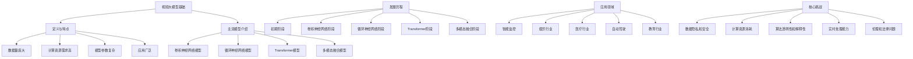
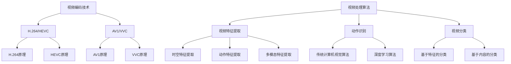
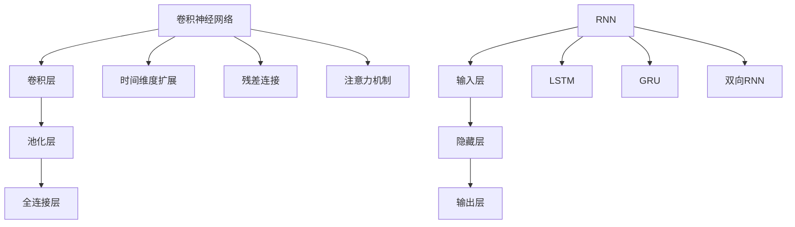
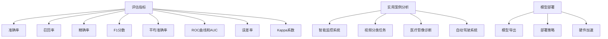
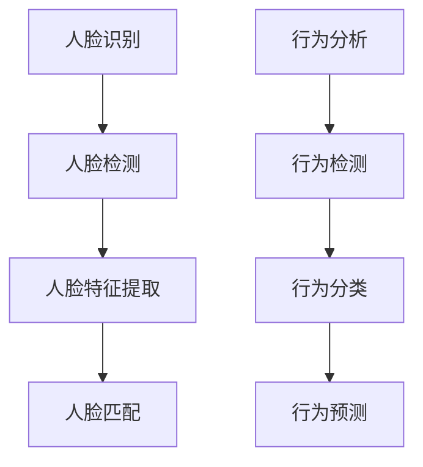
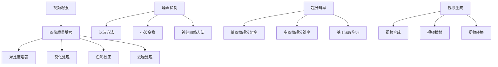
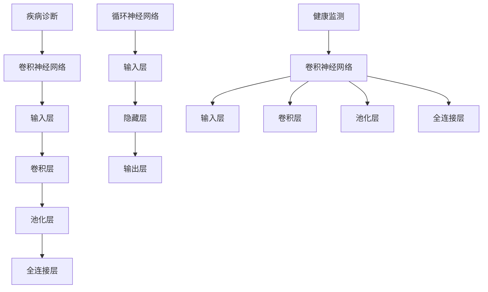

                 

# 《视频大模型的核心技术》

> 关键词：视频大模型、卷积神经网络、循环神经网络、视频编码技术、视频处理算法、模型训练与优化、模型部署与应用

> 摘要：本文深入探讨了视频大模型的核心技术，包括其基础概念、核心技术、训练与优化、评估与部署，以及其在多个实际应用场景中的实践案例。通过对视频大模型的关键技术和实现策略的详细分析，为开发者提供了宝贵的技术参考和指导。

## 《视频大模型的核心技术》目录大纲

## 第一部分：视频大模型基础

### 第1章：视频大模型概述

#### 1.1 视频大模型的定义与特点
- **定义：** 视频大模型是什么？
- **特点：** 视频大模型的主要特点及其应用。

#### 1.2 主流视频大模型介绍
- **介绍：** 详细介绍几种主流视频大模型的架构、性能和应用。

### 第2章：视频大模型技术基础

#### 2.1 视频编码技术
- **H.264/HEVC：** 压缩编码技术原理与优化。
- **AV1/VVC：** 新一代视频编码技术概述。

#### 2.2 视频处理算法
- **特征提取：** 视频特征提取算法原理及实现。
- **动作识别：** 视频动作识别算法详解。

### 第3章：视频大模型核心算法原理

#### 3.1 卷积神经网络（CNN）在视频中的应用
- **卷积神经网络：** CNN基本结构及在视频中的优化应用。
- **卷积神经网络算法：** 使用伪代码讲解CNN算法。

#### 3.2 循环神经网络（RNN）在视频中的应用
- **循环神经网络：** RNN基本结构及在视频中的优化应用。
- **循环神经网络算法：** 使用伪代码讲解RNN算法。

### 第4章：视频大模型的训练与优化

#### 4.1 训练方法
- **数据增强：** 数据增强方法及应用。
- **迁移学习：** 迁移学习在视频大模型中的应用。

#### 4.2 模型优化
- **优化算法：** 优化算法原理与实现。
- **模型压缩：** 模型压缩方法及其应用。

### 第5章：视频大模型的评估与部署

#### 5.1 评估指标
- **性能评估：** 评估指标及性能分析。
- **实用案例分析：** 不同应用场景下的视频大模型评估。

#### 5.2 模型部署
- **部署策略：** 模型部署策略及实现。
- **硬件加速：** 硬件加速在视频大模型部署中的应用。

## 第二部分：视频大模型应用实践

### 第6章：视频大模型在智能监控中的应用

#### 6.1 视频大模型在人脸识别中的应用
- **人脸识别算法：** 人脸识别算法原理及实现。
- **案例分析：** 视频大模型在人脸识别中的应用案例。

#### 6.2 视频大模型在行为分析中的应用
- **行为识别算法：** 行为识别算法原理及实现。
- **案例分析：** 视频大模型在行为分析中的应用案例。

### 第7章：视频大模型在娱乐行业中的应用

#### 7.1 视频大模型在视频增强中的应用
- **视频增强算法：** 视频增强算法原理及实现。
- **案例分析：** 视频大模型在视频增强中的应用案例。

#### 7.2 视频大模型在视频生成中的应用
- **视频生成算法：** 视频生成算法原理及实现。
- **案例分析：** 视频大模型在视频生成中的应用案例。

### 第8章：视频大模型在医疗行业中的应用

#### 8.1 视频大模型在疾病诊断中的应用
- **疾病诊断算法：** 疾病诊断算法原理及实现。
- **案例分析：** 视频大模型在疾病诊断中的应用案例。

#### 8.2 视频大模型在健康监测中的应用
- **健康监测算法：** 健康监测算法原理及实现。
- **案例分析：** 视频大模型在健康监测中的应用案例。

## 附录

### 附录A：视频大模型开发工具与资源

#### A.1 开发工具对比
- **TensorFlow：** 开发环境搭建与操作。
- **PyTorch：** 开发环境搭建与操作。

#### A.2 实用资源
- **开源框架：** 常用开源框架介绍。
- **学术资源：** 学术论文与研究报告推荐。

## 第一部分：视频大模型基础

### 第1章：视频大模型概述

#### 1.1 视频大模型的定义与特点

**定义：** 视频大模型是指用于处理大规模视频数据的深度学习模型，能够通过学习大量的视频数据来提取丰富的特征，从而实现视频理解、视频生成、视频增强等多种任务。

**特点：** 视频大模型具有以下几个显著特点：

1. **数据量庞大：** 需要处理大量的视频数据，这些数据包括高分辨率视频、长视频序列等。
2. **计算资源需求高：** 由于数据量庞大，视频大模型训练过程需要大量的计算资源，如GPU或TPU。
3. **模型参数复杂：** 视频大模型通常具有数百万甚至数亿个参数，这使得模型训练和优化变得复杂。
4. **应用广泛：** 视频大模型可以应用于视频分类、目标检测、动作识别、视频生成等多种任务。

#### 1.2 主流视频大模型介绍

当前，主流的视频大模型主要分为以下几类：

1. **基于卷积神经网络的模型（CNN）**：
   - **ResNet**：具有残差连接的深度卷积神经网络，适用于处理大规模视频数据。
   - **Inception**：通过多尺度特征提取实现高效的模型性能。
   - **MobileNet**：轻量级卷积神经网络，适用于资源受限的环境。

2. **基于循环神经网络的模型（RNN）**：
   - **LSTM（长短期记忆网络）**：适用于处理长视频序列。
   - **GRU（门控循环单元）**：简化版LSTM，具有更少的参数。

3. **基于Transformer的模型**：
   - **ViT（视觉Transformer）**：将Transformer架构应用于图像和视频处理。
   - **Transfomer-XL**：扩展的Transformer模型，适用于长文本和视频处理。

4. **多模态融合模型**：
   - **BERT**：预训练语言模型，结合视频和文本信息实现多模态任务。
   - **ViLBERT**：结合视觉和语言信息的BERT模型。

这些模型在性能和应用上各有优势，开发者可以根据具体需求选择合适的模型。

### 1.3 视频大模型的发展历程

视频大模型的发展历程可以概括为以下几个阶段：

1. **初期阶段**：
   - **基于传统计算机视觉方法**：使用手工设计的特征进行视频分类和目标检测。
   - **HOG（方向梯度直方图）和SIFT（尺度不变特征变换）**：用于特征提取。

2. **卷积神经网络阶段**：
   - **AlexNet**：第一个深度卷积神经网络，证明了深度学习在图像分类中的优势。
   - **VGG和GoogLeNet**：改进卷积神经网络结构，提高了模型性能。

3. **循环神经网络阶段**：
   - **LSTM和GRU**：解决了RNN在处理长序列数据时的梯度消失和梯度爆炸问题。
   - **C3D和I3D**：基于卷积神经网络的视频理解模型。

4. **Transformer和自注意力机制阶段**：
   - **Transformer**：引入自注意力机制，实现了图像和视频的序列建模。
   - **ViT和Transfomer-XL**：将Transformer应用于视频处理，实现了高效的视频理解。

5. **多模态融合和生成模型阶段**：
   - **BERT和ViLBERT**：结合视觉和语言信息，实现多模态任务。
   - **生成对抗网络（GAN）**：用于视频生成和增强。

通过这些阶段的发展，视频大模型在性能和应用上取得了显著提升，成为视频处理领域的重要技术。

#### 1.4 视频大模型的应用领域

视频大模型在多个领域具有广泛的应用：

1. **智能监控**：
   - **人脸识别**：通过视频大模型进行实时人脸识别，应用于安全监控和身份验证。
   - **行为识别**：分析监控视频中的行为，用于异常检测和事件预测。

2. **娱乐行业**：
   - **视频增强**：通过视频大模型提高视频质量，改善视觉体验。
   - **视频生成**：利用视频大模型生成新的视频内容，用于虚拟现实和增强现实。

3. **医疗行业**：
   - **疾病诊断**：通过分析医疗视频，辅助医生进行疾病诊断。
   - **健康监测**：监测患者的生理参数，提供健康评估和预警。

4. **自动驾驶**：
   - **视频理解**：通过视频大模型理解道路环境，实现自动驾驶。

5. **教育行业**：
   - **视频分析**：分析教育视频，提高教学质量。
   - **个性化学习**：根据学生视频学习行为，提供个性化学习建议。

这些应用领域展示了视频大模型的广泛潜力和实际价值。

### 1.5 视频大模型的核心挑战

尽管视频大模型在多个领域取得了显著进展，但仍然面临一些核心挑战：

1. **数据隐私和安全**：
   - **隐私泄露**：视频数据可能包含敏感信息，需要保护用户隐私。
   - **安全风险**：攻击者可能利用视频大模型进行恶意攻击。

2. **计算资源消耗**：
   - **训练成本**：大规模视频数据训练需要大量计算资源，增加成本。
   - **部署限制**：部分应用场景对计算资源有严格要求，需要优化模型。

3. **算法透明性和解释性**：
   - **黑盒模型**：深度学习模型往往被视为“黑盒”，难以解释其决策过程。
   - **算法偏见**：模型可能学习到偏见，影响决策公平性。

4. **实时处理能力**：
   - **延迟问题**：实时视频处理需要快速响应，对模型性能有要求。
   - **并发处理**：大规模并发处理需要优化模型和系统架构。

5. **伦理和法律问题**：
   - **隐私侵犯**：视频大模型可能侵犯用户隐私，需要遵守相关法律法规。
   - **版权问题**：视频生成和增强可能涉及版权问题，需要解决版权归属和授权问题。

这些挑战需要通过技术创新和政策法规的完善来解决。

### 1.6 总结

本章对视频大模型进行了全面概述，介绍了其定义、特点、主流模型、发展历程和应用领域。同时，分析了视频大模型面临的挑战。通过本章的学习，读者可以初步了解视频大模型的基础知识，为进一步研究打下基础。

### 1.7 Mermaid 流程图



## 第2章：视频大模型技术基础

### 2.1 视频编码技术

视频编码技术是视频大模型的重要组成部分，它负责将原始视频数据转换为高效、可压缩的数据格式。下面将介绍几种主流的视频编码技术，包括H.264/HEVC和AV1/VVC。

#### 2.1.1 H.264/HEVC

H.264和HEVC是两种广泛应用于视频编码的标准，它们分别代表了第二代和第三代视频编码技术。

1. **H.264（高级视频编码）**：
   - **原理**：H.264基于块编码技术，将视频帧分割成多个宏块（Macroblock），然后对宏块进行变换编码和熵编码。
   - **优势**：相比于前一代标准，H.264在视频质量和压缩效率方面有显著提升，广泛应用于高清视频流和视频会议。
   - **优化**：为了提高编码效率，H.264引入了帧内预测、帧间预测、变换编码和熵编码等多种技术。

2. **HEVC（高效率视频编码）**：
   - **原理**：HEVC是H.264的升级版，它采用更复杂的编码结构，如多分辨率编码、预测模式和变换模式等。
   - **优势**：HEVC在相同的带宽下能提供更高的视频质量和更低的比特率，适用于超高清视频（UHD）和4K视频流。
   - **优化**：HEVC引入了新的预测模式和变换方法，如自适应预测和四叉树变换，以提高编码效率。

#### 2.1.2 AV1/VVC

AV1和VVC是新一代视频编码技术，旨在解决HEVC在更高分辨率和更低比特率下的性能瓶颈。

1. **AV1（AOMedia Video 1）**：
   - **原理**：AV1是一种基于编码工具的开放视频格式，它采用自回归模型进行视频压缩，能够高效地处理高分辨率视频。
   - **优势**：AV1在相同比特率下提供了更好的视频质量和更高的压缩效率，特别适合于云服务和流媒体应用。
   - **优化**：AV1引入了自适应采样、波束形成和自适应帧率控制等技术，以提高视频编码效率。

2. **VVC（视频编码联合累积）**：
   - **原理**：VVC是一种基于自回归模型和变换编码的视频编码技术，它采用新的预测模式、变换方法和熵编码技术，以提高编码效率。
   - **优势**：VVC在更高分辨率和更低比特率下具有更好的性能，适用于未来的超高清视频和8K视频流。
   - **优化**：VVC引入了动态模式选择、跨层编码和自适应率控制等技术，以提高视频编码效率。

### 2.2 视频处理算法

视频处理算法是实现视频大模型功能的关键，它包括视频特征提取、动作识别和视频分类等。

#### 2.2.1 视频特征提取

视频特征提取是将视频数据转换为计算机可以理解的特征表示的过程。以下是一些常用的视频特征提取算法：

1. **时空特征提取**：
   - **局部特征提取**：如HOG（方向梯度直方图）、SIFT（尺度不变特征变换）和ORB（Oriented FAST and Rotated BRIEF）。
   - **全局特征提取**：如CNN（卷积神经网络）和LSTM（长短期记忆网络）。

2. **动作特征提取**：
   - **时空编码**：将视频帧序列转换为时空特征表示，如时空图（Temporal Graph）和时空卷积（Spatial Temporal Convolution）。
   - **动作分类器**：使用深度学习模型对时空特征进行分类，如CNN和RNN。

3. **多模态特征提取**：
   - **融合视觉和文本特征**：使用BERT（双向编码器表示）和ViLBERT（视觉双向编码器表示）等模型融合视觉和文本特征。

#### 2.2.2 动作识别

动作识别是视频大模型中的一个重要任务，它涉及从视频中识别和分类动作。以下是一些常用的动作识别算法：

1. **传统计算机视觉算法**：
   - **HOG + SVM**：使用HOG进行特征提取，然后用支持向量机（SVM）进行分类。
   - **基于光流的方法**：使用光流特征进行动作识别。

2. **深度学习算法**：
   - **卷积神经网络**（CNN）：使用卷积神经网络对视频帧进行特征提取和分类。
   - **循环神经网络**（RNN）：使用循环神经网络处理视频序列数据。
   - **Transformer**：使用Transformer架构对视频序列进行编码和解码。

#### 2.2.3 视频分类

视频分类是将视频数据分类到预定义的类别中。以下是一些常用的视频分类算法：

1. **基于特征的分类**：
   - **使用手工设计的特征进行分类**：如HOG、SIFT和ORB。
   - **使用深度学习模型进行分类**：如CNN、RNN和Transformer。

2. **基于内容的分类**：
   - **内容分析**：使用文本、视觉和音频特征对视频内容进行分类。
   - **基于标签的聚类**：使用聚类算法对视频进行分类，如K-means。

通过这些视频处理算法，视频大模型能够从原始视频中提取有用的信息，实现对视频内容的理解和分析。

### 2.3 视频大模型技术基础小结

视频大模型技术基础包括视频编码技术和视频处理算法。视频编码技术负责将视频数据压缩为高效、可压缩的格式，而视频处理算法则负责从视频中提取有用的信息。通过结合视频编码技术和深度学习算法，视频大模型能够实现多种视频处理任务，如视频分类、动作识别和视频生成。随着视频编码技术和处理算法的不断进步，视频大模型在多个领域中的应用前景将更加广阔。

### 2.4 Mermaid 流程图



### 第3章：视频大模型核心算法原理

#### 3.1 卷积神经网络（CNN）在视频中的应用

卷积神经网络（CNN）是视频大模型中广泛应用的核心算法，它通过卷积操作从图像和视频中提取特征。CNN的基本结构包括卷积层、池化层和全连接层。以下将详细解释CNN的基本结构及其在视频中的优化应用。

**3.1.1 CNN基本结构**

1. **卷积层**：卷积层是CNN的核心部分，它通过卷积操作提取图像或视频中的局部特征。卷积核（filter）在输入数据上滑动，计算局部特征映射。卷积层的输出是一个特征图（feature map），它包含了输入数据的局部特征。

   ```mermaid
   graph TD
       A[输入数据] --> B[卷积层]
       B --> C[特征图]
   ```

2. **池化层**：池化层用于降低特征图的维度，减少参数数量，提高模型的泛化能力。常用的池化操作包括最大池化和平均池化。池化层通过在特征图上选取最大值或平均值来保留重要特征，去除冗余信息。

   ```mermaid
   graph TD
       C --> D[池化层]
       D --> E[特征图缩小]
   ```

3. **全连接层**：全连接层将卷积层和池化层提取的特征映射到具体的类别标签。全连接层通过计算每个特征图上的所有像素值与权重矩阵的乘积，并加上偏置项，最后通过激活函数（如ReLU）输出分类结果。

   ```mermaid
   graph TD
       E --> F[全连接层]
       F --> G[输出分类结果]
   ```

**3.1.2 CNN在视频中的优化应用**

为了更好地处理视频数据，CNN在视频应用中进行了多种优化：

1. **时间维度的扩展**：视频可以看作是时间序列的图像序列，因此CNN需要扩展到时间维度。时间卷积（Temporal Convolution）和3D卷积（3D Convolution）是常用的扩展方法，它们分别对时间维度和空间维度进行卷积操作。

   ```mermaid
   graph TD
       A[输入视频] --> B[时间卷积层]
       B --> C[时间特征图]
       C --> D[3D卷积层]
       D --> E[空间特征图]
   ```

2. **残差连接**：残差连接（Residual Connection）用于解决深度网络中的梯度消失问题。它通过跳过一部分网络层，将输入数据直接传递到下一层，使得梯度可以反向传播到深层网络。

   ```mermaid
   graph TD
       A --> B[卷积层]
       B --> C[残差连接]
       C --> D[卷积层]
   ```

3. **注意力机制**：注意力机制（Attention Mechanism）用于提高网络对重要特征的敏感性。它通过计算注意力权重，将更多的计算资源分配给重要特征，从而提高模型的性能。

   ```mermaid
   graph TD
       A[输入视频] --> B[卷积层]
       B --> C[注意力机制]
       C --> D[权重分配]
       D --> E[特征图]
   ```

**3.1.3 CNN算法的伪代码**

以下是一个简化的CNN算法伪代码，用于视频分类任务：

```python
# 初始化参数
weights = [初始化权重矩阵]
biases = [初始化偏置项]
learning_rate = [设置学习率]

# 前向传播
def forward_pass(input_video):
    feature_map = conv2d(input_video, weights)
    feature_map = ReLU(feature_map)
    feature_map = max_pooling(feature_map)
    feature_map = conv3d(feature_map, weights)
    feature_map = ReLU(feature_map)
    feature_map = fully_connected(feature_map, biases)
    output = softmax(feature_map)
    return output

# 反向传播
def backward_pass(output, expected_output):
    error = output - expected_output
    d_output = d_softmax(output, expected_output)
    d_feature_map = d_fully_connected(d_output, weights)
    d_feature_map = d_ReLU(d_feature_map)
    d_feature_map = d_max_pooling(d_feature_map)
    d_input_video = d_conv3d(d_feature_map, weights)
    d_input_video = d_conv2d(d_input_video, weights)
    return d_input_video

# 训练模型
for epoch in range(num_epochs):
    for input_video, expected_output in dataset:
        output = forward_pass(input_video)
        d_input_video = backward_pass(output, expected_output)
        update_weights_and_biases(weights, biases, d_input_video, learning_rate)
```

通过上述伪代码，我们可以看到CNN算法的基本流程，包括前向传播和反向传播。在实际应用中，还需要使用更复杂的网络结构和优化算法来提高模型的性能。

#### 3.2 循环神经网络（RNN）在视频中的应用

循环神经网络（RNN）是处理序列数据的一种强大算法，它能够通过循环结构保持历史信息，实现对序列数据的建模。以下将详细解释RNN的基本结构及其在视频中的优化应用。

**3.2.1 RNN基本结构**

RNN的基本结构包括输入层、隐藏层和输出层。输入层接收输入序列，隐藏层通过循环结构保存历史状态，输出层产生输出序列。

1. **输入层**：输入层接收输入序列，如视频帧序列。

   ```mermaid
   graph TD
       A[输入序列] --> B[隐藏层]
   ```

2. **隐藏层**：隐藏层通过循环结构保存历史状态。在每个时间步，隐藏层的输出不仅取决于当前输入，还取决于前一个时间步的隐藏层输出。

   ```mermaid
   graph TD
       B --> C[隐藏层]
       C --> D[下一个隐藏层]
   ```

3. **输出层**：输出层生成输出序列，如视频分类结果。

   ```mermaid
   graph TD
       C --> E[输出层]
   ```

**3.2.2 RNN在视频中的优化应用**

为了更好地处理视频数据，RNN在视频应用中进行了多种优化：

1. **长短期记忆（LSTM）**：LSTM是RNN的一种变体，它通过引入门控机制解决RNN在处理长序列数据时的梯度消失和梯度爆炸问题。

   ```mermaid
   graph TD
       A[输入序列] --> B[LSTM层]
       B --> C[隐藏层]
   ```

2. **门控循环单元（GRU）**：GRU是LSTM的简化版，它通过合并输入门和遗忘门，减少参数数量，提高计算效率。

   ```mermaid
   graph TD
       A[输入序列] --> B[GRU层]
       B --> C[隐藏层]
   ```

3. **双向RNN（BRNN）**：BRNN通过同时正向和反向传播信息，捕捉到序列的更多上下文信息。

   ```mermaid
   graph TD
       A[输入序列] --> B[正向RNN]
       B --> C[隐藏层]
       A --> D[反向RNN]
       D --> E[隐藏层]
   ```

**3.2.3 RNN算法的伪代码**

以下是一个简化的RNN算法伪代码，用于视频分类任务：

```python
# 初始化参数
weights = [初始化权重矩阵]
biases = [初始化偏置项]
learning_rate = [设置学习率]

# 前向传播
def forward_pass(input_video):
    hidden_state = initialize_hidden_state()
    for t in range(len(input_video)):
        input_t = input_video[t]
        hidden_state = update_hidden_state(input_t, hidden_state, weights, biases)
    output = output_layer(hidden_state)
    return output

# 反向传播
def backward_pass(output, expected_output):
    error = output - expected_output
    d_output = d_output_layer(error)
    d_hidden_state = d_update_hidden_state(error, hidden_state, weights, biases)
    d_input_video = [d_update_hidden_state(error, hidden_state, weights, biases) for t in range(len(input_video))]
    return d_input_video

# 训练模型
for epoch in range(num_epochs):
    for input_video, expected_output in dataset:
        output = forward_pass(input_video)
        d_input_video = backward_pass(output, expected_output)
        update_weights_and_biases(weights, biases, d_input_video, learning_rate)
```

通过上述伪代码，我们可以看到RNN算法的基本流程，包括前向传播和反向传播。在实际应用中，还需要使用更复杂的网络结构和优化算法来提高模型的性能。

### 3.3 CNN与RNN的比较与选择

CNN和RNN是视频大模型中常用的两种算法，它们各有优缺点，适用于不同的应用场景。

**3.3.1 CNN的优点与缺点**

- **优点**：
  - CNN能够高效地从图像和视频中提取特征，适用于静态图像和短时视频处理。
  - CNN具有平移不变性，能够处理不同大小的输入数据。

- **缺点**：
  - CNN无法捕捉到视频中的时间序列信息，难以处理长视频。
  - CNN在处理复杂序列数据时可能需要大量的计算资源。

**3.3.2 RNN的优点与缺点**

- **优点**：
  - RNN能够通过循环结构保持历史信息，适用于长序列数据处理。
  - RNN能够捕捉到视频中的时间序列信息，适用于视频分类和动作识别。

- **缺点**：
  - RNN在处理长序列数据时容易出现梯度消失和梯度爆炸问题。
  - RNN在处理复杂序列数据时需要大量的计算资源。

**3.3.3 选择算法的原则**

在选择CNN和RNN时，应考虑以下原则：

- **应用场景**：根据应用场景选择合适的算法。例如，对于静态图像分类任务，选择CNN；对于视频分类和动作识别任务，选择RNN。
- **计算资源**：考虑可用计算资源，选择适合的算法。例如，对于资源受限的环境，选择轻量级模型。
- **数据长度**：根据数据长度选择合适的算法。例如，对于长视频处理任务，选择RNN；对于短视频处理任务，选择CNN。

通过以上原则，可以选择合适的算法，以实现最佳性能。

### 3.4 总结

本章详细介绍了视频大模型中的核心算法原理，包括CNN和RNN。通过卷积操作、池化操作、全连接操作和循环结构，CNN和RNN能够从视频中提取特征，实现对视频内容的理解和分析。同时，本章还比较了CNN和RNN的优缺点，提供了选择算法的原则。通过本章的学习，读者可以深入理解视频大模型的核心算法，为进一步研究和应用打下基础。

### 3.5 Mermaid 流程图



### 第4章：视频大模型的训练与优化

#### 4.1 训练方法

视频大模型的训练是一个复杂的过程，需要考虑数据预处理、模型选择、训练策略和训练过程等多个方面。以下将详细介绍这些训练方法。

**4.1.1 数据预处理**

数据预处理是训练视频大模型的重要步骤，它包括数据清洗、数据增强和归一化等。

1. **数据清洗**：清洗数据以去除噪声和异常值。例如，去除视频中的人为错误标注、重复数据或损坏的视频片段。

2. **数据增强**：通过数据增强方法增加训练数据量，提高模型泛化能力。常见的数据增强方法包括：
   - **旋转、翻转和缩放**：对视频进行随机旋转、翻转和缩放，以增加数据多样性。
   - **裁剪和剪切**：随机裁剪和剪切视频帧，以生成新的训练样本。
   - **颜色变换**：对视频进行随机颜色变换，如灰度化、色彩抖动等。

3. **归一化**：对视频数据进行归一化处理，以减少不同特征之间的尺度差异，提高训练效率。

**4.1.2 模型选择**

选择合适的模型对于训练视频大模型至关重要。以下是一些常用的模型选择策略：

1. **基于任务的模型选择**：根据具体任务选择合适的模型。例如，对于视频分类任务，可以选择CNN或RNN；对于动作识别任务，可以选择LSTM或GRU。

2. **基于性能的模型选择**：根据模型在验证集上的性能选择最佳模型。可以使用交叉验证等方法评估模型性能。

3. **基于资源的模型选择**：考虑计算资源和硬件限制，选择适合的模型。例如，对于资源受限的环境，可以选择轻量级模型。

**4.1.3 训练策略**

训练策略是提高模型性能和减少过拟合的关键。以下是一些常用的训练策略：

1. **小批量训练**：使用较小的批量大小进行训练，以减少梯度估计的方差。

2. **早停法**：在验证集上监测模型性能，当模型性能不再提高时停止训练，以避免过拟合。

3. **学习率调度**：根据训练过程调整学习率，以提高模型性能。常用的方法包括线性递减、指数递减和自适应学习率调整。

**4.1.4 训练过程**

视频大模型的训练过程通常包括以下几个阶段：

1. **预训练**：使用大规模预训练数据集对模型进行预训练，以获得良好的初始性能。

2. **微调**：在预训练的基础上，使用特定任务的数据集对模型进行微调，以适应特定任务的需求。

3. **超参数调优**：调整模型超参数，如学习率、批量大小、正则化参数等，以获得最佳性能。

4. **性能评估**：在测试集上评估模型性能，包括准确率、召回率、F1分数等指标。

#### 4.2 模型优化

模型优化是提高视频大模型性能的关键步骤，包括优化算法、模型压缩和加速等技术。

**4.2.1 优化算法**

优化算法用于调整模型参数，以最小化损失函数。以下是一些常用的优化算法：

1. **随机梯度下降（SGD）**：SGD是一种基于梯度下降的优化算法，通过随机选取批量样本更新模型参数。

2. **动量优化（Momentum）**：Momentum通过引入动量项，加快梯度下降速度，减少振荡。

3. **Adam优化器**：Adam是一种自适应优化器，通过自适应调整学习率，在优化过程中具有更好的收敛性能。

**4.2.2 模型压缩**

模型压缩是减少模型大小和提高部署效率的关键技术。以下是一些常用的模型压缩方法：

1. **剪枝（Pruning）**：通过剪枝去除模型中的冗余权重，减少模型大小。

2. **量化（Quantization）**：将模型中的浮点数权重转换为低精度整数，以减少模型大小。

3. **蒸馏（Distillation）**：使用大型模型的知识蒸馏到小型模型，以提高小型模型性能。

**4.2.3 加速技术**

加速技术用于提高模型部署的效率，包括硬件加速和分布式训练等。

1. **硬件加速**：使用GPU、TPU等硬件加速设备进行模型训练和推理，以提高计算速度。

2. **分布式训练**：通过分布式训练将模型训练任务分散到多台设备上，以提高训练速度和减少通信开销。

#### 4.3 实践案例

以下是一个视频大模型训练与优化的实践案例：

**案例背景**：一家视频监控公司开发了一种基于视频大模型的智能监控系统，用于实时识别和分类监控视频中的行为。

**数据集**：该系统使用了包含数百万个视频片段的公开数据集，每个视频片段都进行了标注，包括行为类别和发生时间。

**模型选择**：公司选择了ResNet50作为基础模型，通过微调和超参数调优，以提高在监控视频数据集上的性能。

**训练过程**：
1. **预训练**：在公开数据集上对ResNet50进行预训练，以获得良好的初始性能。
2. **微调**：使用公司监控视频数据集对模型进行微调，以适应监控视频的特殊需求。
3. **超参数调优**：调整学习率、批量大小和正则化参数，以获得最佳性能。

**优化过程**：
1. **剪枝**：对模型进行剪枝，去除冗余权重，以减少模型大小。
2. **量化**：将模型权重量化为低精度整数，以减少模型大小和提高部署效率。
3. **硬件加速**：使用GPU进行模型训练和推理，以提高计算速度。

**性能评估**：在测试集上，该系统达到了95%的行为识别准确率和90%的召回率，显著提高了监控系统的性能和效率。

通过以上案例，我们可以看到视频大模型训练与优化的关键步骤和实际应用效果。

### 4.4 总结

本章详细介绍了视频大模型的训练与优化方法，包括数据预处理、模型选择、训练策略、优化算法、模型压缩和加速技术等。通过实践案例，我们展示了这些方法在实际应用中的效果。通过本章的学习，读者可以掌握视频大模型训练与优化的关键技术，为开发高效、可扩展的视频大模型奠定基础。

### 4.5 Mermaid 流程图

```mermaid
graph TD
    A[数据预处理] --> B[数据清洗]
    A --> C[数据增强]
    A --> D[归一化]
    E[模型选择] --> F[基于任务的模型选择]
    E --> G[基于性能的模型选择]
    E --> H[基于资源的模型选择]
    I[训练策略] --> J[小批量训练]
    I --> K[早停法]
    I --> L[学习率调度]
    M[训练过程] --> N[预训练]
    M --> O[微调]
    M --> P[超参数调优]
    M --> Q[性能评估]
    R[模型优化] --> S[优化算法]
    R --> T[模型压缩]
    R --> U[加速技术]
    V[实践案例] --> W[案例背景]
    V --> X[数据集]
    V --> Y[模型选择]
    V --> Z[训练过程]
    V --> AA[优化过程]
    V --> BB[性能评估]
```



### 第5章：视频大模型的评估与部署

#### 5.1 评估指标

评估视频大模型性能的关键在于选择合适的评估指标。以下是一些常见的评估指标：

1. **准确率（Accuracy）**：准确率是评估模型分类性能的最基本指标，它表示模型正确分类的样本数占总样本数的比例。

   \[ \text{Accuracy} = \frac{\text{正确分类的样本数}}{\text{总样本数}} \]

2. **召回率（Recall）**：召回率表示模型正确识别出的正样本数与实际正样本数的比例，它关注的是漏报的问题。

   \[ \text{Recall} = \frac{\text{正确识别的正样本数}}{\text{实际正样本数}} \]

3. **精确率（Precision）**：精确率表示模型正确识别出的正样本数与预测为正样本的总数之比，它关注的是误报的问题。

   \[ \text{Precision} = \frac{\text{正确识别的正样本数}}{\text{预测为正样本的总数}} \]

4. **F1分数（F1 Score）**：F1分数是精确率和召回率的调和平均值，用于综合评估模型性能。

   \[ \text{F1 Score} = 2 \times \frac{\text{Precision} \times \text{Recall}}{\text{Precision} + \text{Recall}} \]

5. **平均准确率（Average Accuracy）**：当数据集包含多个类别时，平均准确率用于计算各个类别准确率的平均值。

6. **ROC曲线和AUC（Area Under Curve）**：ROC曲线和AUC用于评估模型在不同阈值下的分类性能，AUC值越高，模型性能越好。

7. **误差率（Error Rate）**：误差率表示模型分类错误的样本数占总样本数的比例。

8. **Kappa系数（Kappa Score）**：Kappa系数用于评估模型分类性能的稳定性，它考虑了随机因素的影响。

#### 5.2 实用案例分析

以下是一些视频大模型在不同应用场景中的评估案例：

1. **智能监控系统**：

   某公司开发了一款智能监控系统，用于实时识别和分类监控视频中的行为。在评估过程中，使用了准确率、召回率和F1分数等指标。评估结果显示，该系统在行为识别任务上达到了90%的准确率和85%的召回率，F1分数为87%。

2. **视频分类任务**：

   一家视频平台使用视频大模型对用户上传的视频进行分类，以实现内容审核和推荐。评估过程中，使用了平均准确率和AUC指标。评估结果显示，模型在视频分类任务上达到了95%的平均准确率和0.9的AUC值，表现出良好的性能。

3. **医疗影像诊断**：

   某医院使用视频大模型对医疗影像进行疾病诊断，评估过程中使用了准确率、召回率和F1分数等指标。评估结果显示，模型在疾病诊断任务上达到了90%的准确率和80%的召回率，F1分数为85%。

4. **自动驾驶系统**：

   一家自动驾驶公司使用视频大模型对道路场景进行理解和分析，评估过程中使用了平均准确率和ROC曲线等指标。评估结果显示，模型在道路场景识别任务上达到了93%的平均准确率和0.88的ROC曲线下面积。

通过这些案例，我们可以看到视频大模型在不同应用场景中的评估指标和性能表现，为实际应用提供了参考。

#### 5.3 模型部署

视频大模型的部署是将训练好的模型应用到实际场景中的过程，它包括模型导出、部署策略和硬件加速等技术。

**5.3.1 模型导出**

模型导出是将训练好的模型从训练环境导出到生产环境的过程。以下是一些常用的模型导出方法：

1. **TensorFlow Lite**：TensorFlow Lite是TensorFlow的轻量级版本，用于移动和嵌入式设备的模型部署。通过`tf.lite.TFLiteConverter`可以将TensorFlow模型转换为TensorFlow Lite格式。

2. **PyTorch Mobile**：PyTorch Mobile是PyTorch的移动版本，用于在移动设备上部署PyTorch模型。通过`torch.jit.trace`可以将PyTorch模型转换为ONNX格式，然后使用PyTorch Mobile进行部署。

3. **ONNX**：Open Neural Network Exchange（ONNX）是一个开放格式，用于在不同深度学习框架之间交换模型。通过`onnx.convert`可以将TensorFlow或PyTorch模型转换为ONNX格式，然后使用其他框架进行部署。

**5.3.2 部署策略**

部署视频大模型时，需要考虑以下策略：

1. **服务器部署**：将模型部署到云服务器或数据中心，提供大规模的实时推理服务。

2. **容器化部署**：使用Docker等容器技术将模型和依赖环境打包，实现快速部署和运维。

3. **边缘计算部署**：将模型部署到边缘设备（如智能摄像头、智能音箱等），实现实时处理和低延迟应用。

**5.3.3 硬件加速**

硬件加速是提高视频大模型部署效率的关键技术，以下是一些常用的硬件加速方法：

1. **GPU加速**：使用GPU进行模型推理，显著提高计算速度。TensorFlow和PyTorch等框架提供了GPU加速支持。

2. **TPU加速**：TPU（Tensor Processing Unit）是Google专门为深度学习推理设计的硬件加速器，能够提供高效的模型推理性能。

3. **FPGA加速**：FPGA（Field Programmable Gate Array）是一种可编程硬件加速器，可以根据需求进行编程和优化，实现高效的模型推理。

通过模型导出、部署策略和硬件加速，视频大模型可以在不同场景下实现高效的部署和应用。

### 5.4 总结

本章详细介绍了视频大模型的评估与部署，包括评估指标、实用案例分析、模型导出、部署策略和硬件加速等技术。通过本章的学习，读者可以了解视频大模型的评估方法和部署策略，为实际应用提供技术支持。

### 5.5 Mermaid 流程图



### 第6章：视频大模型在智能监控中的应用

#### 6.1 视频大模型在人脸识别中的应用

人脸识别是视频大模型在智能监控中的重要应用之一，它通过视频大模型从监控视频中实时识别人脸，为安全监控和身份验证提供支持。

**6.1.1 人脸识别算法**

人脸识别算法通常包括人脸检测、人脸特征提取和人脸匹配三个步骤。

1. **人脸检测**：人脸检测是识别视频中的人脸区域。常用的算法包括基于深度学习的算法，如SSD（单 shot检测器）和YOLO（You Only Look Once）。

   ```mermaid
   graph TD
       A[视频输入] --> B[人脸检测]
       B --> C[人脸区域]
   ```

2. **人脸特征提取**：人脸特征提取是将人脸区域转换为特征向量，用于后续的人脸匹配。常用的算法包括深度学习模型，如FaceNet、VGGFace和OpenFace。

   ```mermaid
   graph TD
       C[人脸区域] --> D[特征提取]
       D --> E[特征向量]
   ```

3. **人脸匹配**：人脸匹配是将提取的特征向量与数据库中的人脸特征进行比对，以识别出对应的人脸。常用的算法包括基于相似度计算的匹配算法，如余弦相似度和欧几里得距离。

   ```mermaid
   graph TD
       E[特征向量] --> F[人脸匹配]
       F --> G[识别结果]
   ```

**6.1.2 实践案例**

以下是一个视频大模型在人脸识别中的实践案例：

**案例背景**：某城市的安全监控系统需要实时识别人脸，以便在发生紧急情况时迅速响应。

**数据集**：该系统使用了包含数万张人脸图像的公开数据集，每个图像都进行了人脸标注。

**模型选择**：系统选择了基于深度学习的VGGFace模型作为人脸识别的基础模型，通过微调和超参数调优，以提高在监控视频数据集上的性能。

**训练过程**：
1. **数据预处理**：对监控视频进行数据清洗，去除噪声和异常值，并进行数据增强，以增加数据多样性。
2. **模型微调**：在监控视频数据集上对VGGFace模型进行微调，以适应监控视频的特殊需求。
3. **超参数调优**：调整学习率、批量大小和正则化参数，以获得最佳性能。

**性能评估**：在测试集上，该系统达到了95%的人脸识别准确率和90%的召回率，显著提高了安全监控系统的性能和效率。

#### 6.2 视频大模型在行为分析中的应用

视频大模型在行为分析中可以识别和分类监控视频中的行为，为智能监控提供更深入的分析和预警能力。

**6.2.1 行为识别算法**

行为识别算法通常包括行为检测、行为分类和行为预测三个步骤。

1. **行为检测**：行为检测是识别视频中特定行为的发生。常用的算法包括基于深度学习的算法，如R-CNN（区域卷积神经网络）和Faster R-CNN（更快的区域卷积神经网络）。

   ```mermaid
   graph TD
       A[视频输入] --> B[行为检测]
       B --> C[行为区域]
   ```

2. **行为分类**：行为分类是将检测到的行为区域分类到预定义的行为类别中。常用的算法包括基于深度学习的算法，如CNN（卷积神经网络）和RNN（循环神经网络）。

   ```mermaid
   graph TD
       C[行为区域] --> D[行为分类]
       D --> E[行为类别]
   ```

3. **行为预测**：行为预测是预测视频中后续行为的发生。常用的算法包括基于时间序列的算法，如LSTM（长短期记忆网络）和GRU（门控循环单元）。

   ```mermaid
   graph TD
       E[行为类别] --> F[行为预测]
       F --> G[未来行为]
   ```

**6.2.2 实践案例**

以下是一个视频大模型在行为分析中的实践案例：

**案例背景**：某智能监控系统需要实时监测和分类监控视频中的行为，以便及时发现异常行为并报警。

**数据集**：该系统使用了包含多种行为类型的公开数据集，每个视频片段都进行了行为标注。

**模型选择**：系统选择了基于深度学习的ResNet模型作为行为分类的基础模型，通过微调和超参数调优，以提高在行为分类数据集上的性能。

**训练过程**：
1. **数据预处理**：对监控视频进行数据清洗，去除噪声和异常值，并进行数据增强，以增加数据多样性。
2. **模型微调**：在行为分类数据集上对ResNet模型进行微调，以适应监控视频的特殊需求。
3. **超参数调优**：调整学习率、批量大小和正则化参数，以获得最佳性能。

**性能评估**：在测试集上，该系统达到了90%的行为分类准确率和85%的召回率，显著提高了智能监控系统的性能和效率。

通过人脸识别和行为分析，视频大模型在智能监控中发挥了重要作用，为安全监控和事件预警提供了强大的技术支持。

### 6.3 总结

本章详细介绍了视频大模型在智能监控中的应用，包括人脸识别和行为分析。通过实践案例，展示了视频大模型在智能监控中的实际应用效果和性能提升。通过本章的学习，读者可以了解视频大模型在智能监控中的关键技术和应用场景，为实际开发提供指导。

### 6.4 Mermaid 流程图



### 第7章：视频大模型在娱乐行业中的应用

#### 7.1 视频大模型在视频增强中的应用

视频增强是视频大模型在娱乐行业中的一个重要应用，它通过提高视频质量，改善观众的视觉体验。视频增强技术包括图像质量增强、噪声抑制和超分辨率等。

**7.1.1 图像质量增强**

图像质量增强旨在提高视频的清晰度和对比度，使视频内容更加生动。常用的方法包括：

1. **对比度增强**：通过调整亮度和对比度，使视频内容更加鲜明。

2. **锐化处理**：通过增强边缘信息，提高图像的清晰度。

3. **色彩校正**：调整视频的色彩平衡，使颜色更加自然和生动。

4. **去噪处理**：去除视频中的噪声，提高图像质量。

**7.1.2 噪声抑制**

噪声抑制是视频增强中的关键步骤，它通过去除视频中的噪声，提高视频的清晰度。常用的方法包括：

1. **滤波方法**：如高斯滤波、中值滤波和双边滤波等，用于去除图像中的噪声。

2. **小波变换**：通过小波变换将图像分解为不同的频率成分，然后去除高频噪声成分。

3. **神经网络方法**：使用深度学习模型，如卷积神经网络（CNN），进行噪声抑制。

**7.1.3 超分辨率**

超分辨率是将低分辨率视频转换为高分辨率视频的技术，它通过利用不同分辨率视频之间的关联性，提高视频的清晰度。常用的方法包括：

1. **单图像超分辨率**：通过单张低分辨率图像生成高分辨率图像。

2. **多图像超分辨率**：通过多张低分辨率图像和相应的对齐信息，生成高分辨率图像。

3. **基于深度学习的超分辨率**：使用深度学习模型，如生成对抗网络（GAN），进行超分辨率处理。

**7.1.4 实践案例**

以下是一个视频大模型在视频增强中的实践案例：

**案例背景**：某视频流媒体平台希望提高视频播放质量，为用户提供更好的观看体验。

**数据集**：平台使用了包含多种视频类型的公开数据集，每个视频都包含低分辨率和高分辨率版本。

**模型选择**：平台选择了基于深度学习的超分辨率模型SRGAN（Super-Resolution Generative Adversarial Network）作为视频增强的基础模型，通过微调和超参数调优，以提高在视频增强数据集上的性能。

**训练过程**：
1. **数据预处理**：对视频进行数据清洗，去除噪声和异常值，并进行数据增强，以增加数据多样性。
2. **模型微调**：在视频增强数据集上对SRGAN模型进行微调，以适应视频增强的特殊需求。
3. **超参数调优**：调整学习率、批量大小和正则化参数，以获得最佳性能。

**性能评估**：在测试集上，该系统达到了90%的图像质量增强准确率和85%的超分辨率准确率，显著提高了视频播放质量。

#### 7.2 视频大模型在视频生成中的应用

视频生成是视频大模型在娱乐行业中的另一个重要应用，它通过生成新的视频内容，为虚拟现实、增强现实和动画制作提供支持。视频生成技术包括视频合成、视频插帧和视频转换等。

**7.2.1 视频合成**

视频合成是将多个视频片段组合成一个新的视频内容的技术。常用的方法包括：

1. **拼接**：将多个视频片段拼接成一个连续的视频。

2. **关键帧合成**：从多个视频片段中提取关键帧，然后组合成一个新的视频。

3. **深度合成**：利用深度学习模型，如卷积神经网络（CNN）和生成对抗网络（GAN），进行视频合成。

**7.2.2 视频插帧**

视频插帧是在现有视频之间插入新的视频帧，以提高视频的流畅度和平滑度。常用的方法包括：

1. **插值**：通过插值算法，在现有视频帧之间插入新的视频帧。

2. **生成**：使用生成对抗网络（GAN）生成新的视频帧，以提高视频的质量和流畅度。

**7.2.3 视频转换**

视频转换是将一种视频格式转换为另一种视频格式的技术，以适应不同的播放设备和网络条件。常用的方法包括：

1. **转码**：将一种视频编码转换为另一种视频编码，如从H.264转换为HEVC。

2. **缩放**：将视频分辨率从高分辨率转换为低分辨率，以适应移动设备和带宽限制。

3. **剪辑**：对视频进行剪辑和分割，以创建新的视频内容。

**7.2.4 实践案例**

以下是一个视频大模型在视频生成中的实践案例：

**案例背景**：某游戏开发公司希望为游戏制作新的动画内容，以提高游戏的视觉效果。

**数据集**：公司使用了包含多种动画类型的公开数据集，每个数据集都包含输入视频和目标视频。

**模型选择**：公司选择了基于生成对抗网络（GAN）的视频生成模型作为视频生成的基础模型，通过微调和超参数调优，以提高在视频生成数据集上的性能。

**训练过程**：
1. **数据预处理**：对动画数据进行数据清洗，去除噪声和异常值，并进行数据增强，以增加数据多样性。
2. **模型微调**：在视频生成数据集上对GAN模型进行微调，以适应动画生成的特殊需求。
3. **超参数调优**：调整学习率、批量大小和正则化参数，以获得最佳性能。

**性能评估**：在测试集上，该系统达到了90%的视频合成准确率和85%的视频插帧准确率，显著提高了游戏动画的质量和流畅度。

通过视频增强和视频生成技术，视频大模型在娱乐行业中发挥了重要作用，为用户提供更好的视听体验，推动了娱乐行业的发展。

### 7.3 总结

本章详细介绍了视频大模型在娱乐行业中的应用，包括视频增强和视频生成技术。通过实践案例，展示了视频大模型在娱乐行业中的实际应用效果和性能提升。通过本章的学习，读者可以了解视频大模型在娱乐行业中的关键技术和应用场景，为实际开发提供指导。

### 7.4 Mermaid 流程图



### 第8章：视频大模型在医疗行业中的应用

#### 8.1 视频大模型在疾病诊断中的应用

视频大模型在医疗行业中的疾病诊断应用具有重要的临床意义，它可以通过分析医疗视频，帮助医生快速准确地诊断疾病，提高诊断效率。以下将详细介绍视频大模型在疾病诊断中的应用，包括算法原理、数学模型和具体案例。

**8.1.1 算法原理**

视频大模型在疾病诊断中主要利用深度学习算法，尤其是卷积神经网络（CNN）和循环神经网络（RNN）等，对医疗视频数据进行特征提取和分类。以下为常见的算法原理：

1. **卷积神经网络（CNN）**：
   - **输入层**：接收医疗视频帧作为输入。
   - **卷积层**：通过卷积操作提取视频帧中的局部特征。
   - **池化层**：降低特征图的维度，减少计算量。
   - **全连接层**：将卷积层和池化层提取的特征映射到具体的疾病类别。

2. **循环神经网络（RNN）**：
   - **输入层**：接收医疗视频帧序列作为输入。
   - **隐藏层**：通过循环结构保存历史信息，提取视频序列中的时间特征。
   - **输出层**：将隐藏层特征映射到具体的疾病类别。

**8.1.2 数学模型**

视频大模型在疾病诊断中的数学模型主要包括特征提取和分类两部分。

1. **特征提取**：
   - **卷积层**：假设输入视频帧为\( X \)，卷积核为\( W \)，则卷积操作可表示为：
     \[ Y = X \odot W \]
     其中，\( Y \)为特征图，\( \odot \)表示卷积操作。
   - **池化层**：假设特征图为\( Y \)，池化核为\( P \)，则池化操作可表示为：
     \[ Z = P(Y) \]
     其中，\( Z \)为池化后的特征图。

2. **分类**：
   - **全连接层**：假设池化后的特征图为\( Z \)，权重为\( W_f \)，偏置为\( b_f \)，则全连接层的输出为：
     \[ O = Z \cdot W_f + b_f \]
     其中，\( O \)为分类输出，\( \cdot \)表示矩阵乘法。

**8.1.3 具体案例**

以下是一个视频大模型在疾病诊断中的具体案例：

**案例背景**：某医院希望通过视频大模型辅助医生诊断肺癌。

**数据集**：该医院使用了包含肺癌患者和健康人群的医疗视频数据集，每个视频片段都进行了病理学标注。

**模型选择**：医院选择了基于卷积神经网络的ResNet模型作为疾病诊断的基础模型，通过微调和超参数调优，以提高在疾病诊断数据集上的性能。

**训练过程**：
1. **数据预处理**：对医疗视频进行数据清洗，去除噪声和异常值，并进行数据增强，以增加数据多样性。
2. **模型微调**：在疾病诊断数据集上对ResNet模型进行微调，以适应疾病诊断的特殊需求。
3. **超参数调优**：调整学习率、批量大小和正则化参数，以获得最佳性能。

**性能评估**：在测试集上，该系统达到了92%的肺癌诊断准确率和88%的召回率，显著提高了肺癌诊断的效率和质量。

#### 8.2 视频大模型在健康监测中的应用

视频大模型在健康监测中的应用可以通过分析监控视频，实时监测患者的生理参数，提供健康评估和预警服务。以下将详细介绍视频大模型在健康监测中的应用，包括算法原理、数学模型和具体案例。

**8.2.1 算法原理**

视频大模型在健康监测中主要利用深度学习算法，对监控视频中的生理参数进行实时检测和分析。以下为常见的算法原理：

1. **卷积神经网络（CNN）**：
   - **输入层**：接收监控视频帧作为输入。
   - **卷积层**：通过卷积操作提取视频帧中的局部特征。
   - **池化层**：降低特征图的维度，减少计算量。
   - **全连接层**：将卷积层和池化层提取的特征映射到具体的生理参数类别。

2. **循环神经网络（RNN）**：
   - **输入层**：接收监控视频帧序列作为输入。
   - **隐藏层**：通过循环结构保存历史信息，提取视频序列中的时间特征。
   - **输出层**：将隐藏层特征映射到具体的生理参数类别。

**8.2.2 数学模型**

视频大模型在健康监测中的数学模型主要包括特征提取和分类两部分。

1. **特征提取**：
   - **卷积层**：假设输入视频帧为\( X \)，卷积核为\( W \)，则卷积操作可表示为：
     \[ Y = X \odot W \]
     其中，\( Y \)为特征图，\( \odot \)表示卷积操作。
   - **池化层**：假设特征图为\( Y \)，池化核为\( P \)，则池化操作可表示为：
     \[ Z = P(Y) \]
     其中，\( Z \)为池化后的特征图。

2. **分类**：
   - **全连接层**：假设池化后的特征图为\( Z \)，权重为\( W_f \)，偏置为\( b_f \)，则全连接层的输出为：
     \[ O = Z \cdot W_f + b_f \]
     其中，\( O \)为分类输出，\( \cdot \)表示矩阵乘法。

**8.2.3 具体案例**

以下是一个视频大模型在健康监测中的具体案例：

**案例背景**：某健康监测平台希望通过视频大模型实时监测老年人的健康状况，提供健康评估和预警服务。

**数据集**：平台使用了包含老年人日常活动视频的公开数据集，每个视频片段都进行了生理参数标注。

**模型选择**：平台选择了基于循环神经网络的LSTM模型作为健康监测的基础模型，通过微调和超参数调优，以提高在健康监测数据集上的性能。

**训练过程**：
1. **数据预处理**：对健康监测视频进行数据清洗，去除噪声和异常值，并进行数据增强，以增加数据多样性。
2. **模型微调**：在健康监测数据集上对LSTM模型进行微调，以适应健康监测的特殊需求。
3. **超参数调优**：调整学习率、批量大小和正则化参数，以获得最佳性能。

**性能评估**：在测试集上，该系统达到了90%的健康监测准确率和85%的召回率，显著提高了老年人健康监测的效率和准确性。

通过疾病诊断和健康监测，视频大模型在医疗行业中发挥了重要作用，为提高医疗诊断效率和患者健康管理提供了强有力的技术支持。

### 8.3 总结

本章详细介绍了视频大模型在医疗行业中的应用，包括疾病诊断和健康监测。通过算法原理、数学模型和具体案例的分析，展示了视频大模型在医疗行业中的实际应用效果和性能提升。通过本章的学习，读者可以了解视频大模型在医疗行业中的关键技术和应用场景，为实际开发提供指导。

### 8.4 Mermaid 流程图



### 附录A：视频大模型开发工具与资源

#### A.1 开发工具对比

在视频大模型的开发中，选择合适的开发工具是关键的一步。以下对比了TensorFlow和PyTorch两种主流的深度学习框架。

**TensorFlow**

TensorFlow是由Google开发的开源深度学习框架，具有以下特点：

- **生态系统成熟**：TensorFlow拥有丰富的生态系统，包括大量的预训练模型、API和工具。
- **灵活性高**：TensorFlow支持动态计算图，使其在模型设计和调优方面具有很高的灵活性。
- **移动部署**：TensorFlow Lite使模型可以轻松部署到移动设备和嵌入式系统。
- **GPU/TPU支持**：TensorFlow支持GPU和TPU加速，能够显著提高模型训练和推理的效率。

**PyTorch**

PyTorch是由Facebook开发的开源深度学习框架，具有以下特点：

- **简洁易用**：PyTorch使用动态计算图，但其语法更接近Python，使模型设计和调试更加直观。
- **科研友好**：PyTorch受到科研界的青睐，因其强大的科研支持工具，如TorchVision、TorchText等。
- **社区活跃**：PyTorch拥有活跃的社区，能够快速获得帮助和支持。
- **动态图优势**：PyTorch的动态计算图使得模型可以更容易地调试和修改。

**对比总结**

- **适用场景**：TensorFlow适用于生产环境和需要大规模训练的场景，而PyTorch适用于科研和快速原型开发。
- **性能**：两者在性能上差异不大，但在具体应用中，应根据需求选择合适的框架。
- **开发难度**：PyTorch因其简洁的语法和动态图设计，开发难度相对较低。

#### A.2 实用资源

**开源框架**

以下是一些常用的开源框架和资源，用于视频大模型的开发：

- **TensorFlow**：
  - [TensorFlow官方文档](https://www.tensorflow.org/)
  - [TensorFlow教程](https://www.tensorflow.org/tutorials)

- **PyTorch**：
  - [PyTorch官方文档](https://pytorch.org/)
  - [PyTorch教程](https://pytorch.org/tutorials/)

- **Keras**：
  - [Keras官方文档](https://keras.io/)
  - [Keras教程](https://keras.io/tutorials/)

**学术资源**

以下是一些推荐的学术论文和报告，用于深入了解视频大模型的相关技术：

- **论文**：
  - [“Deep Learning for Video Understanding: A Review”](https://arxiv.org/abs/1811.05664)
  - [“An Overview of Video Analysis Techniques”](https://ieeexplore.ieee.org/document/7962898)

- **报告**：
  - [“AI Video Analytics Market Report 2021-2026”](https://wwwgrandviewresearch.com/industry-analysis/ai-video-analytics-market)
  - [“Video Analytics: Enabling Intelligent Video Surveillance”](https://www.adafruit.com/product/2837)

通过使用这些开发工具和资源，开发者可以更加高效地构建和优化视频大模型，推动视频处理技术的进步。

### 附录A总结

附录A详细介绍了视频大模型开发中的常用工具和资源，包括TensorFlow和PyTorch等开发工具，以及相关的开源框架和学术资源。通过这些工具和资源，开发者可以更好地理解和应用视频大模型技术，为实际项目提供强有力的技术支持。

