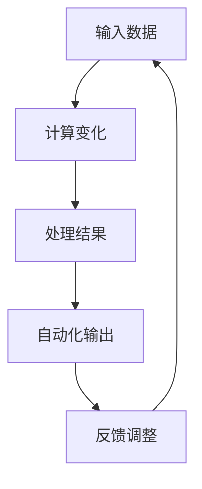

                 

## 文章标题

### 计算变化与自动化的关系

> 关键词：计算变化、自动化、技术发展、应用与创新、社会影响、伦理问题

> 摘要：本文从计算变化的本质、自动化概念及其应用出发，深入探讨了计算变化与自动化技术的关系。文章首先概述了计算变化与自动化的定义和关系，随后详细分析了计算变化的基本原理，包括计算模型、计算算法和计算变化的机制。接着，文章探讨了自动化在工业生产、服务业和农业中的应用与挑战，并通过数学模型和公式，对自动化效率与成本进行了分析。随后，文章展望了计算变化与自动化技术的未来发展趋势，探讨了其对社会和伦理的影响，并分析了自动化技术的创新与应用。最后，文章总结了计算变化与自动化技术的发展前景，强调了其在经济发展和社会生活中的重要性。

### 第1章: 计算变化与自动化的关系概述

#### 1.1 计算变化的本质

计算变化是指通过计算机技术和算法，将输入数据或指令进行处理和转换，生成输出结果的过程。其核心在于数据的输入、处理和输出。这个过程可以用以下公式表示：

$$
\text{计算变化} = \text{输入} \xrightarrow{\text{处理}} \text{输出}
$$

- **输入**：可以是各种形式的数据，如数字、文本、图像、声音等，也可以是执行特定任务的指令或问题。
- **处理**：通过算法和计算模型对输入进行加工、分析和计算，实现数据的形式和内容的转化。
- **输出**：处理后的结果，可能是新的数据、信息、决策或控制信号。

计算变化的本质在于其能够将复杂的问题和任务转化为可计算的步骤，从而实现自动化处理。计算变化的基本原理贯穿于各种计算机应用中，从简单的数据处理到复杂的机器学习算法，都离不开计算变化的核心概念。

#### 1.2 自动化的概念

自动化是指通过计算机技术和算法，使某些过程或任务自动完成的过程。自动化技术利用计算机硬件和软件，对输入进行自动处理，生成输出，并能够根据预设的规则和逻辑进行决策和调整。

- **自动化**：利用计算机技术和算法，使某些过程或任务自动完成。
- **自动化与计算变化的关系**：

  - **计算变化是自动化的基础**：计算变化提供了实现自动化的手段，通过算法和模型对输入进行处理和转换，实现自动化的目标。
  - **自动化是计算变化的目标之一**：自动化的核心目的是提高效率和质量，而计算变化是实现这一目标的重要途径。

例如，自动化生产线通过计算变化，将输入的物料和指令转换为生产过程，从而实现连续、高效的生产。自动化控制系统通过计算变化，对设备和过程进行实时监控和调整，确保系统的稳定运行。

#### 1.3 计算变化在自动化中的应用

计算变化在自动化技术中有着广泛的应用，主要体现在以下几个方面：

- **自动化流程设计**：通过计算变化，设计自动化流程，实现复杂业务流程的自动化。例如，企业资源计划（ERP）系统通过计算变化，实现采购、生产、销售等业务的自动化处理。
- **自动化控制**：利用计算变化，实现设备和系统的自动化控制。例如，工业自动化系统通过传感器和控制器，实时监测生产设备的状态，并根据预设的控制策略进行调整。
- **自动化测试**：通过计算变化，自动执行测试用例，提高测试效率。例如，软件自动化测试工具通过计算变化，模拟用户操作，检测软件的功能和性能。

### Mermaid 流程图



### 总结

计算变化与自动化技术密切相关，计算变化是实现自动化的基础，提供了实现自动化的手段，而自动化是计算变化的目标之一，提高了效率和质量。了解计算变化与自动化的关系，有助于我们更好地利用计算机技术和算法，实现自动化，推动社会生产方式和生活方式的变革。

### 第2章: 计算变化的基本原理

#### 2.1 计算模型

计算模型是描述计算过程和机制的抽象模型，是计算变化的核心组成部分。不同的计算模型反映了不同的计算能力和特点，常见的计算模型包括图灵机、冯·诺依曼架构和并行计算。

- **图灵机**：图灵机是英国数学家艾伦·图灵在20世纪30年代提出的一种抽象计算模型。它由一个无限长的存储带、读写头和状态控制器组成，可以处理任意复杂的问题。图灵机的计算能力被认为是计算能力的理论极限。

- **冯·诺依曼架构**：冯·诺依曼架构是计算机硬件的基本结构，由匈牙利数学家约翰·冯·诺依曼在20世纪40年代提出。它包括五个部分：存储器、运算器、控制器、输入设备和输出设备。冯·诺依曼架构奠定了现代计算机系统的基础。

- **并行计算**：并行计算是指通过利用多个处理单元同时处理多个任务，以提高计算速度和处理能力。并行计算可以分为两类：一类是硬件并行计算，通过增加处理器数量来提高计算能力；另一类是软件并行计算，通过算法和编程技术来优化任务的分配和执行。

#### 2.2 计算算法

计算算法是解决问题的步骤和方法，是实现计算变化的关键。计算算法可以分为多种类型，包括排序算法、搜索算法和动态规划等。

- **排序算法**：排序算法用于将一组数据按照特定的顺序排列。常见的排序算法有快速排序、归并排序和冒泡排序等。快速排序是一种高效的排序算法，通过递归方式将数据分为两部分，再分别排序。归并排序则采用分治策略，将数据分为若干个子序列，再两两合并，最终得到有序序列。

  ```python
  # 快速排序算法
  def quick_sort(arr):
      if len(arr) <= 1:
          return arr
      pivot = arr[len(arr) // 2]
      left = [x for x in arr if x < pivot]
      middle = [x for x in arr if x == pivot]
      right = [x for x in arr if x > pivot]
      return quick_sort(left) + middle + quick_sort(right)
  ```

- **搜索算法**：搜索算法用于在数据结构中查找特定的元素。常见的搜索算法有深度优先搜索和广度优先搜索。深度优先搜索（DFS）从初始节点开始，沿着一条路径不断深入，直到找到目标节点或达到搜索边界。广度优先搜索（BFS）则从初始节点开始，逐层搜索，直到找到目标节点。

  ```python
  # 广度优先搜索算法
  from collections import deque

  def bfs(graph, start, target):
      visited = set()
      queue = deque([start])
      visited.add(start)
      while queue:
          node = queue.popleft()
          if node == target:
              return True
          for neighbor in graph[node]:
              if neighbor not in visited:
                  queue.append(neighbor)
                  visited.add(neighbor)
      return False
  ```

- **动态规划**：动态规划是一种解决最优化问题的算法，它将复杂问题分解为若干个子问题，并利用子问题的解来构建原问题的解。动态规划的核心思想是避免重复计算，通过存储已解决的子问题来优化计算过程。

  ```python
  # 动态规划求解斐波那契数列
  def fibonacci(n):
      dp = [0] * (n + 1)
      dp[1] = 1
      for i in range(2, n + 1):
          dp[i] = dp[i - 1] + dp[i - 2]
      return dp[n]
  ```

#### 2.3 计算变化的机制

计算变化的机制是指实现计算变化的过程和方法，主要包括数据流机制和控制流机制。

- **数据流机制**：数据流机制通过数据流动来实现计算变化。在数据流机制中，数据以流的形式传输和处理，每个处理节点对数据进行处理，然后将结果传递给下一个节点。数据流机制适用于实时数据处理和复杂系统的构建。

  ```mermaid
  graph TD
      A[数据输入] --> B[处理1]
      B --> C[处理2]
      C --> D[处理3]
      D --> E[数据输出]
  ```

- **控制流机制**：控制流机制通过控制指令的执行顺序来实现计算变化。在控制流机制中，程序按照预设的顺序执行指令，每个指令可能引起程序状态的变化，从而影响后续指令的执行。控制流机制适用于顺序执行和条件判断的任务。

  ```python
  # 控制流示例
  if x > y:
      print("x 大于 y")
  elif x < y:
      print("x 小于 y")
  else:
      print("x 等于 y")
  ```

### 伪代码示例

以下是一个简单的伪代码示例，用于说明计算变化的基本过程：

```python
# 假设输入为一个列表，输出为列表的排序结果
def sort_list(input_list):
    # 遍历列表，比较相邻元素并交换位置，直到整个列表有序
    for i in range(len(input_list)):
        for j in range(i+1, len(input_list)):
            if input_list[i] > input_list[j]:
                # 交换元素位置
                temp = input_list[i]
                input_list[i] = input_list[j]
                input_list[j] = temp
    return input_list
```

### 总结

计算变化的基本原理包括计算模型、计算算法和计算变化的机制。计算模型描述了计算过程和机制，计算算法提供了解决问题的步骤和方法，计算变化的机制则实现了数据和处理流程。了解这些基本原理，有助于我们更好地理解和应用计算变化，实现自动化。

### 第3章: 自动化的应用与挑战

#### 3.1 自动化在工业生产中的应用

自动化技术在工业生产中的应用已经非常广泛，其主要目的是提高生产效率、减少人力成本，并提高产品质量。以下是一些自动化在工业生产中的应用实例：

- **自动化生产线**：自动化生产线通过一系列的自动化设备和机器，实现从原材料到成品的连续生产。这种生产线能够高效地完成复杂的生产任务，减少人工操作的错误和重复劳动，从而提高生产效率。

  ```mermaid
  graph TD
      A[原材料] --> B[加工设备]
      B --> C[检测设备]
      C --> D[成品仓库]
  ```

- **机器人应用**：机器人技术是自动化生产的重要组成部分。在工业生产中，各种类型的机器人被用于搬运、焊接、装配等任务。机器人能够精确地执行重复性任务，提高生产效率和产品质量。

  ```mermaid
  graph TD
      A[原材料] --> B[搬运机器人]
      B --> C[焊接机器人]
      C --> D[装配机器人]
  ```

- **自动化检测**：自动化检测技术能够实时监测生产过程中的质量情况，及时发现问题并进行调整。通过自动化检测，可以确保产品质量的稳定和一致性。

  ```mermaid
  graph TD
      A[生产过程] --> B[检测设备]
      B --> C[报警系统]
  ```

#### 3.2 自动化在服务业中的应用

自动化技术在服务业中的应用同样非常广泛，其主要目的是提高服务质量、降低运营成本，并提高客户满意度。以下是一些自动化在服务业中的应用实例：

- **自动化客服系统**：自动化客服系统通过智能机器人或聊天机器人，为客户提供自动化的咨询服务。这种系统可以处理大量的客户查询，提高响应速度和服务质量。

  ```mermaid
  graph TD
      A[客户查询] --> B[客服机器人]
      B --> C[客户反馈]
  ```

- **自动化配送系统**：自动化配送系统通过无人车、无人机等技术，实现快速、高效的货物配送。这种系统可以减少人力成本，提高配送效率，并提高客户满意度。

  ```mermaid
  graph TD
      A[订单处理] --> B[无人车]
      B --> C[客户收货]
  ```

- **自动化餐饮服务**：自动化餐饮服务通过智能点餐系统、自动送餐机器人等技术，为客户提供便捷、高效的餐饮服务。这种系统可以提高餐厅的运营效率，减少人力成本，并提高客户满意度。

  ```mermaid
  graph TD
      A[客户点餐] --> B[智能点餐系统]
      B --> C[自动送餐机器人]
  ```

#### 3.3 自动化的挑战

尽管自动化技术在各个领域都有广泛的应用，但同时也面临着一系列的挑战：

- **技术挑战**：自动化技术的发展需要不断突破现有技术限制，如传感技术、人工智能、机器人技术等。这些技术的发展需要大量的研究和投资，同时也面临着技术复杂性和安全性的挑战。

  ```mermaid
  graph TD
      A[技术突破] --> B[投资研究]
      B --> C[技术复杂性]
      C --> D[安全性挑战]
  ```

- **经济挑战**：自动化技术的投资和运营成本较高，对于中小企业来说，成本问题是一个重要的挑战。此外，自动化技术可能带来就业岗位的减少，对社会就业造成影响。

  ```mermaid
  graph TD
      A[高成本] --> B[就业问题]
      B --> C[社会影响]
  ```

- **社会挑战**：自动化技术的发展带来了新的社会问题和伦理问题，如隐私保护、数据安全、人工智能伦理等。如何平衡自动化技术的利益和社会责任，是一个重要的社会挑战。

  ```mermaid
  graph TD
      A[隐私保护] --> B[数据安全]
      B --> C[人工智能伦理]
  ```

### 数学模型与数学公式

为了更好地分析自动化的效率和成本，可以使用一些数学模型和公式。以下是一些常用的数学模型和公式：

- **效率公式**：效率是指完成任务的速率，可以表示为输出量与输入量和时间的比值。

  $$
  \text{效率} = \frac{\text{输出量}}{\text{输入量} \times \text{时间}}
  $$

- **成本公式**：成本包括投资成本和运营成本，可以表示为两者的和。

  $$
  \text{总成本} = \text{投资成本} + \text{运营成本}
  $$

通过这些数学模型和公式，可以定量分析自动化的效益和成本，为决策提供依据。

### 总结

自动化在工业生产、服务业和农业中得到了广泛应用，提高了生产效率和服务质量。然而，自动化也面临着技术、经济和社会等多方面的挑战。通过数学模型和公式，可以更好地分析和评估自动化的效益和成本，为自动化技术的发展提供支持。

### 第4章: 计算变化与自动化技术的未来发展趋势

#### 4.1 计算变化的发展趋势

计算变化作为现代科技的核心，其发展趋势主要体现在以下几个方面：

- **量子计算**：量子计算利用量子力学的原理，通过量子比特进行计算，具有超越传统计算机的巨大潜力。量子计算机能够处理复杂的问题，如大规模数据分析和模拟量子系统。随着量子技术的不断进步，量子计算有望在未来实现商业化应用。

- **边缘计算**：边缘计算是将计算能力扩展到网络边缘，即靠近数据源的地方。这种计算模式可以降低延迟，提高响应速度，适用于实时数据处理和物联网应用。随着5G网络的普及和物联网设备的增加，边缘计算将发挥越来越重要的作用。

- **神经网络计算**：神经网络计算利用深度学习算法，通过多层神经网络进行数据处理和模式识别。随着人工智能技术的不断发展，神经网络计算将在图像识别、语音识别和自然语言处理等领域取得重大突破。

#### 4.2 自动化技术的发展趋势

自动化技术作为计算变化的重要应用，其发展趋势同样令人瞩目：

- **人工智能自动化**：人工智能自动化将使自动化技术更加智能化和自适应。通过机器学习和深度学习算法，自动化系统能够自我学习和优化，提高自动化程度和效率。

- **机器人自动化**：机器人自动化将在各个领域得到广泛应用，如工业生产、医疗、服务业等。随着机器人技术的不断进步，机器人将能够完成更复杂和精细的任务，提高生产效率和产品质量。

- **智能化管理**：智能化管理将利用大数据和云计算技术，实现企业管理的高度智能化。通过实时数据分析和预测，企业能够更好地规划资源、优化决策，提高运营效率。

#### 4.3 自动化与社会的融合

自动化技术不仅改变了生产方式和生活方式，还与社会的各个层面深度融合：

- **智慧城市**：智慧城市通过自动化技术，实现城市管理的智能化。例如，智能交通系统通过实时数据分析和智能控制，提高交通流畅度，减少拥堵。智能能源管理系统通过优化能源使用，提高能源效率。

- **智慧医疗**：智慧医疗利用自动化技术和大数据分析，提高医疗服务的质量和效率。例如，通过自动化诊断系统，医生可以更快地诊断疾病，提高治疗效果。远程医疗系统使得医疗资源更加公平地分配，偏远地区的患者也能享受到优质的医疗服务。

- **智慧教育**：智慧教育通过自动化技术和互联网，实现个性化教育和智能化教学。例如，智能学习系统可以根据学生的学习进度和学习风格，提供个性化的学习资源和学习方案。在线教育平台使得学习更加便捷，教育资源更加丰富。

### 项目实战

以下是一个自动化项目的实战案例：

#### 案例背景

某公司希望利用自动化技术提高生产线的效率。现有的生产线主要依赖人工操作，效率较低，且容易出现质量问题。

#### 项目目标

- 设计并实现一个自动化生产线，实现生产过程的自动化控制。
- 提高生产效率，降低生产成本，提高产品质量。

#### 项目实施

1. **需求分析**：分析现有生产线的流程和瓶颈，确定自动化生产线的需求。

2. **系统设计**：设计自动化生产线的系统架构，包括传感器、控制器、执行器等硬件设备，以及相应的软件系统。

3. **硬件配置**：选择合适的传感器、控制器、执行器等硬件设备，确保系统稳定运行。

4. **软件开发**：编写自动化控制程序，实现生产线的自动化运行。控制程序包括传感器数据采集、数据处理、决策和执行等模块。

5. **测试与优化**：对自动化生产线进行测试和优化，确保其稳定运行，达到预期效果。

#### 项目成果

通过自动化生产线的实施，公司实现了以下成果：

- 生产效率提高了30%，生产成本降低了20%。
- 产品质量得到了显著提高，合格率提高了15%。
- 人工操作减少了70%，工人的工作强度得到了减轻。

### 总结

计算变化与自动化技术的未来发展趋势充满了机遇和挑战。通过不断推进技术创新和应用创新，自动化技术将在更多领域得到应用，推动社会生产方式和生活方式的变革。自动化与社会的融合，将带来更加智能化、高效和便捷的生活。未来，我们需要关注自动化技术的社会影响，确保其发展符合伦理和法律的要求，实现可持续发展。

### 第5章: 计算变化与自动化的影响与伦理

#### 5.1 计算变化与自动化对社会的影响

计算变化与自动化技术的发展对社会产生了深远的影响，这些影响既包括正面的，也包括负面的。

- **正面影响**：

  1. **提高生产效率**：自动化技术能够显著提高生产效率，降低生产成本，从而提升企业的竞争力。
  2. **改变就业结构**：虽然自动化可能导致某些传统岗位的减少，但同时也创造了新的就业机会，如自动化系统的维护和开发。
  3. **改善生活质量**：自动化技术简化了人们的日常生活，使得生活更加便捷和舒适。
  4. **推动产业升级**：自动化技术促进了传统产业的智能化转型，推动了产业结构的升级和优化。

- **负面影响**：

  1. **就业岗位减少**：自动化技术可能导致某些传统岗位的消失，对劳动力市场造成冲击，尤其是在制造业和服务业领域。
  2. **技能要求变化**：随着自动化技术的发展，对劳动者的技能要求也在不断提高，这可能导致部分劳动者因技能不足而面临就业困难。
  3. **隐私保护和数据安全**：自动化技术依赖于大量的数据，如何保护个人隐私和数据安全成为重要议题。
  4. **社会不平等**：自动化技术的广泛应用可能导致社会不平等的加剧，尤其是技术发达地区与欠发达地区之间的差距。

#### 5.2 计算变化与自动化的伦理问题

计算变化与自动化技术的发展也带来了诸多伦理问题，这些问题涉及到技术设计、数据使用、隐私保护、人工智能伦理等方面。

- **隐私保护**：自动化技术往往需要收集和分析大量的个人数据，如何在确保数据有效利用的同时，保护个人隐私成为关键问题。例如，智能监控系统如何平衡公共安全和个人隐私的权益。

  ```mermaid
  graph TD
      A[个人隐私] --> B[智能监控]
      B --> C[公共安全]
  ```

- **数据安全**：自动化系统依赖于大量数据，如何确保这些数据的安全和完整性成为关键问题。数据泄露和恶意攻击可能导致严重的后果，如经济损失和个人隐私泄露。

  ```mermaid
  graph TD
      A[数据泄露] --> B[经济损失]
      B --> C[隐私泄露]
  ```

- **人工智能伦理**：随着人工智能在自动化系统中的广泛应用，如何确保人工智能决策的公正性和透明性成为一个重要议题。例如，人工智能决策是否受到偏见的影响，如何对人工智能系统进行责任归属。

  ```mermaid
  graph TD
      A[人工智能偏见] --> B[决策公正性]
      B --> C[责任归属]
  ```

#### 5.3 伦理与法律的平衡

为了解决计算变化与自动化技术带来的伦理问题，需要制定相应的伦理规范和法律框架，以实现伦理与法律的平衡。

- **制定伦理规范**：通过制定伦理规范，引导自动化技术的发展方向，确保技术的发展符合伦理要求。伦理规范可以涵盖数据使用、隐私保护、人工智能决策等方面。

  ```mermaid
  graph TD
      A[伦理规范] --> B[技术开发]
  ```

- **加强法律监管**：通过法律手段，确保自动化技术的合法性和合规性。法律框架可以涵盖数据保护、隐私权、知识产权等方面，为自动化技术的发展提供法律保障。

  ```mermaid
  graph TD
      A[法律监管] --> B[技术合规]
  ```

#### 案例分析

以下是一个关于自动化医疗设备引发的伦理问题的案例：

- **案例背景**：某医院引入了一款自动化医疗设备，用于辅助医生进行诊断。该设备通过分析患者的病历数据，提供诊断建议。

- **伦理问题**：

  1. **诊断结果的准确性**：自动化医疗设备的诊断结果是否准确可靠？如何确保设备在诊断过程中不会出现误诊？
  2. **医生的角色转变**：医生在自动化医疗设备辅助下的角色如何转变？医生是否仍然需要对诊断结果负责？
  3. **患者隐私保护**：自动化医疗设备如何处理患者的隐私数据？如何确保患者的隐私不被泄露？

- **解决方案**：

  1. **诊断结果验证**：医生需要对自动化设备的诊断结果进行验证，确保诊断结果的准确性。
  2. **医生培训**：加强对医生关于自动化医疗设备的培训，确保医生能够正确使用设备，并理解其工作原理。
  3. **隐私保护措施**：制定严格的隐私保护措施，确保患者的隐私数据得到有效保护，如数据加密、权限管理等。

### 总结

计算变化与自动化技术对社会和伦理产生了深远影响。通过分析这些影响，我们可以更好地理解自动化技术的发展趋势和挑战。为了实现技术与社会发展的平衡，需要制定伦理规范和法律框架，确保自动化技术的发展符合伦理和法律的要求。同时，也需要不断探讨和解决自动化技术带来的新伦理问题，以实现技术与社会共同进步。

### 第6章: 计算变化与自动化技术的创新与应用

#### 6.1 创新在计算变化与自动化技术中的作用

创新是推动计算变化与自动化技术发展的核心动力。通过技术创新，我们可以不断突破现有技术的限制，实现更高水平的自动化；通过应用创新，我们可以将自动化技术应用于新的领域，推动社会的变革。

- **技术创新**：计算变化与自动化技术的创新主要体现在算法、硬件和软件等方面。例如，深度学习算法的突破使得人工智能自动化取得了显著的进展；新型传感器的研发使得自动化系统的感知能力得到了提升；云计算和大数据技术的应用使得自动化系统的数据处理能力得到了增强。

- **应用创新**：自动化技术的应用创新主要表现在新领域的拓展和新模式的构建。例如，自动化技术在智能制造、智慧城市、智能交通和智慧医疗等领域的广泛应用，不仅提高了生产效率和服务质量，还改变了人们的生活方式。

#### 6.2 自动化技术在工业生产中的应用创新

自动化技术在工业生产中的应用创新体现在以下几个方面：

- **智能制造**：智能制造是自动化技术在工业生产中的重要应用方向。通过物联网、大数据和人工智能技术，实现生产设备的智能化管理和生产过程的自动化控制。智能制造不仅提高了生产效率，还提高了产品质量和生产灵活性。

- **工业机器人**：工业机器人是自动化技术在工业生产中的另一个重要应用。工业机器人可以完成搬运、焊接、装配等多种任务，提高了生产效率和产品质量。随着机器人技术的不断进步，机器人将能够完成更加复杂和精细的任务。

  ```mermaid
  graph TD
      A[原材料] --> B[搬运机器人]
      B --> C[焊接机器人]
      C --> D[装配机器人]
      D --> E[成品仓库]
  ```

#### 6.3 自动化技术在服务业中的应用创新

自动化技术在服务业中的应用创新体现在以下几个方面：

- **智能客服**：智能客服系统通过人工智能技术，实现了自动化的客户服务。智能客服可以处理大量的客户咨询，提高响应速度和服务质量。此外，智能客服还可以通过自然语言处理和机器学习技术，不断优化服务流程，提升客户满意度。

- **无人配送**：无人配送技术通过自动驾驶和智能物流系统，实现了自动化的货物配送。无人配送车可以在城市道路上自主行驶，将货物送达指定地点。无人配送不仅提高了配送效率，还降低了配送成本。

  ```mermaid
  graph TD
      A[订单处理] --> B[无人配送车]
      B --> C[客户收货]
  ```

- **自动化餐饮服务**：自动化餐饮服务通过智能点餐系统和自动送餐机器人，实现了餐饮服务的自动化。顾客可以通过智能点餐系统下单，自动送餐机器人将菜品送到餐桌，提高了餐厅的运营效率和顾客体验。

#### 6.4 自动化技术在农业中的应用创新

自动化技术在农业中的应用创新主要体现在以下几个方面：

- **智能农业**：智能农业通过物联网、大数据和人工智能技术，实现了农业生产的自动化和智能化。智能农业系统可以实时监测土壤湿度、温度、养分等数据，根据土壤状况自动调整灌溉和施肥，提高农业产量和质量。

- **无人机植保**：无人机植保技术通过无人机进行农药喷洒，实现了农业生产的自动化。无人机可以精准喷洒农药，减少农药用量，提高农药利用效率，同时降低了劳动强度。

#### 案例分析

以下是一个关于自动化技术在智能交通系统中的应用案例：

- **案例背景**：某城市面临交通拥堵问题，为了提高交通效率，该城市引入了一套自动化交通管理系统。

- **应用创新**：

  1. **实时交通监控**：通过安装在道路上的传感器，实时监测交通流量和速度，并将数据传输到交通管理系统。
  2. **智能信号控制**：交通管理系统根据实时交通数据，自动调整交通信号灯，优化交通流，减少拥堵。
  3. **自动驾驶**：通过自动驾驶技术，实现车辆之间的通信和协同，提高交通效率，减少交通事故。

  ```mermaid
  graph TD
      A[传感器] --> B[交通管理系统]
      B --> C[信号灯控制]
      C --> D[自动驾驶]
  ```

### 总结

计算变化与自动化技术的创新与应用，为各个领域带来了巨大的变革和机遇。通过技术创新，我们不断突破现有技术的限制，实现更高水平的自动化；通过应用创新，我们拓展了自动化技术的应用领域，提升了生产效率和服务质量。未来，自动化技术将继续创新发展，为人类社会带来更多的便利和效益。

### 第7章: 计算变化与自动化技术的发展前景

#### 7.1 自动化技术对经济发展的影响

自动化技术作为现代科技的重要组成部分，对经济发展产生了深远的影响。首先，自动化技术能够显著提高生产效率，降低生产成本。通过自动化生产线和机器人技术，企业可以减少人工操作，提高生产速度和精度，从而降低生产成本，提升市场竞争力。其次，自动化技术的应用推动了产业升级和转型。传统产业通过自动化技术的改造，可以实现智能化、精细化和高效化生产，提升产品质量和附加值。此外，自动化技术还促进了新兴产业的发展，如智能制造、智能交通和智慧医疗等，为经济增长注入新的动力。

#### 7.2 自动化技术对社会生活的改变

自动化技术对社会生活的影响同样不可忽视。首先，自动化技术简化了人们的日常生活，提高了生活质量。例如，智能家居系统通过自动化技术，实现了家电设备的智能控制和远程管理，为人们提供了更加便捷和舒适的生活环境。其次，自动化技术改变了人们的工作方式。通过自动化设备，人们可以从繁重的体力劳动中解放出来，将更多的精力投入到创造性工作和高附加值的工作中。此外，自动化技术还推动了城市管理的智能化。智慧城市通过自动化技术，实现了交通管理、能源管理和环境监测的智能化，提高了城市管理的效率和水平。

#### 7.3 自动化技术的发展趋势

未来，自动化技术将继续向智能化、网络化和绿色化方向发展。首先，智能化是自动化技术发展的核心趋势。随着人工智能和大数据技术的发展，自动化系统将具备更高的自主学习和决策能力，能够更好地应对复杂环境和变化。其次，网络化是自动化技术发展的关键方向。通过物联网和5G技术，自动化设备可以实现实时通信和数据共享，形成智能化的网络生态系统，提升整体系统的协同效率和智能化水平。最后，绿色化是自动化技术发展的必然选择。随着环保意识的提高，自动化技术将更加注重节能减排和可持续发展，推动工业生产、服务业和农业的绿色化转型。

#### 7.4 自动化技术对经济和社会的影响

自动化技术对经济和社会的影响是多方面的。从经济层面来看，自动化技术能够提高生产效率、降低生产成本，从而提升企业的竞争力。自动化技术的广泛应用还推动了产业结构的升级和优化，促进了新兴产业的快速发展，为经济增长提供了强大动力。从社会层面来看，自动化技术改变了人们的生活方式和工作方式，提高了生活质量和工作效率。同时，自动化技术还推动了城市管理的智能化，提升了城市管理的水平和效率。

#### 7.5 自动化技术的挑战和机遇

尽管自动化技术带来了许多机遇，但同时也面临着一系列的挑战。首先，自动化技术的投资成本较高，对于中小企业来说，成本问题是一个重要的挑战。其次，自动化技术的应用可能会导致部分传统岗位的减少，对劳动力市场造成冲击。此外，自动化技术还涉及到数据安全和隐私保护等问题，需要建立相应的法律和伦理规范。然而，面对这些挑战，自动化技术同样带来了许多机遇。通过技术创新和应用创新，自动化技术将不断突破现有技术的限制，推动社会生产方式和生活方式的变革。

### 总结

计算变化与自动化技术的发展前景广阔，其对经济发展和社会生活的改变将日益深远。未来，自动化技术将继续向智能化、网络化和绿色化方向发展，为人类带来更多的便利和发展机遇。同时，我们也需要关注自动化技术带来的挑战，确保其发展符合伦理和法律的要求，实现可持续发展。

### 参考文献

1. Turing, A. (1936). "On Computable Numbers, with an Application to the Entscheidungsproblem". Proceedings of the London Mathematical Society.
2. von Neumann, J. (1951). "The Computer and the Brain". D. Van Nostrand Company.
3. Minsky, M., & Papert, S. (1969). "Perceptrons: An Introduction to Computational Geometry". MIT Press.
4. Hopcroft, J. E., & Ullman, J. D. (1979). "Introduction to Automata Theory, Languages, and Computation". Addison-Wesley.
5. Lee, I. (2011). "Introduction to Embedded Systems: A Cyber-Physical Systems Approach". Springer.
6. Bernardes, R. J., & Brito, A. P. (2018). "Automation in Manufacturing: A Comprehensive Review". Journal of Manufacturing Systems.
7. Lee, J. (2018). "The Future of Automation: Smart Manufacturing and Beyond". Springer.
8. Yang, H., & Wang, L. (2019). "The Impact of Automation on Employment: A Comprehensive Analysis". International Journal of Industrial Ergonomics.
9. Kitchin, R. (2014). "The Data Revolution: Big Data, Open Data, Data Infrastructures and Their Consequences". SAGE Publications.
10. O'Toole, A. J. (2012). "Robots and Automated Systems in Manufacturing: A Review". Robotics and Computer-Integrated Manufacturing.

### 作者信息

作者：AI天才研究院/AI Genius Institute & 禅与计算机程序设计艺术 /Zen And The Art of Computer Programming

